# BOOK CODEX MASTER v2.1

**Complete Reference + Repeatable Chapter Patterns**

**Date:** November 12, 2025  
**Version:** 2.1 WITH REFINEMENTS  
**Purpose:** Single source of truth + chapter templates for consistent execution  
**Companion to:** BOOK_STRUCTURE_CODEX_v6_1_FINAL.md

---

## PHILOSOPHICAL FOUNDATIONS

### First Principles Thinking

This codex and the book it governs are built on **first principles thinking**—the practice of breaking down complex problems to their fundamental truths and reasoning up from there, rather than by analogy or convention.

**Applied to Agent Infrastructure:**
- **Question:** "What infrastructure do agents need?" (instead of "What did BI systems need?")
- **Deconstruction:** Breaking down agent behavior to core requirements: latency, language understanding, permissions, learning, context, trust
- **Reconstruction:** Building INPACT™ from these fundamentals, not from existing BI/ML architectures

**Throughout the Book:**
- Each framework dimension starts with user needs, not technology
- Architecture layers derive from agent requirements, not vendor roadmaps
- Assessment questions probe fundamental capabilities, not feature checklists

### On the Shoulders of Giants

While thinking from first principles, we deliberately build upon established knowledge rather than reinventing proven concepts. This book synthesizes:

**Distributed Systems (1980s-2000s):**
- **CAP Theorem** (Brewer, 2000): Consistency, Availability, Partition tolerance trade-offs inform our real-time data fabric design
- **Eventual Consistency** (Vogels, 2008): Guides our approach to multi-source data synchronization
- **Fault Tolerance Patterns** (Tannenbaum, van Steen): Applied to agent reliability and recovery

**Data Architecture Evolution (1990s-2020s):**
- **Dimensional Modeling** (Kimball, 1996): Semantic layer design principles
- **Data Vault** (Linstedt, 2000): Entity-relationship patterns for knowledge graphs
- **Lakehouse Architecture** (Armbrust et al., 2020): Foundation for modern analytics + AI convergence

**Software Engineering (1990s-2010s):**
- **SOLID Principles** (Martin, 2000): Applied to agent component design
- **Gang of Four Design Patterns** (Gamma et al., 1994): Architectural patterns throughout
- **Separation of Concerns** (Dijkstra, 1974): Layer independence in 7-Layer Architecture

**Modern AI/ML (2020s):**
- **Retrieval-Augmented Generation** (Lewis et al., 2020): Intelligence Orchestration layer
- **Semantic Search** (Karpukhin et al., 2020): Natural language interfaces
- **Agent Orchestration** (Liang et al., 2023): Multi-agent coordination patterns

**What We Add:**
- **INPACT™ Framework**: Synthesizes these foundations into agent-specific requirements
- **GOALS™ Framework**: Operationalizes classical data governance for agent era
- **7-Layer Architecture**: Maps proven patterns to agent infrastructure needs
- **Moore-Kim Pattern**: Combines framework authority with narrative validation

**Recognition:**
Throughout this book, we cite our sources extensively. When we say "agents need real-time data fabric," we're building on Brewer's CAP theorem and Vogels' eventual consistency work. When we discuss semantic layers, we honor Kimball's dimensional modeling. When we design for fault tolerance, we apply Tannenbaum's distributed systems principles.

**The Synthesis:**
First principles thinking identifies **what** agents need. Standing on the shoulders of giants shows us **how** to build it. The combination produces frameworks that are both novel (agent-specific) and proven (built on decades of research).

---

## TABLE OF CONTENTS

1. [Canonical Facts & Figures](#1-canonical-facts--figures)
2. [Terminology Dictionary](#2-terminology-dictionary)
3. [The Moore-Kim Pattern Architecture](#3-the-moore-kim-pattern-architecture)
4. [Chapter Templates by Type](#4-chapter-templates-by-type)
5. [Visual Standards](#5-visual-standards)
6. [Citations & Sources](#6-citations--sources)
7. [Echo Health Quick Reference](#7-echo-health-quick-reference)
8. [Quality Checklist](#8-quality-checklist)
9. [Assessment Tool Integration](#9-assessment-tool-integration)
10. [Writing Standards (Supplemental)](#10-writing-standards-supplemental)
11. [90-Day Tracker Integration](#11-90-day-tracker-integration)
12. [Success Metrics & Book KPIs](#12-success-metrics--book-kpis)
13. [Document Control & Versioning](#13-document-control--versioning)

---

## 1. CANONICAL FACTS & FIGURES

### 1.1 Colaberry Inc. (REAL - VERIFIED)

**Company:**
- Founded 2012, 13+ years enterprise AI consulting
- 40+ documented use cases, Fortune 2000 clients
- **Industries:** Agriculture, biotech, utilities, energy, oil & gas, pharmaceuticals, banking, finance, education, healthcare, technology, manufacturing, insurance, transportation, hospitality, retail & supply chain
- **Notable clients (anonymized):** Monsanto, Bayer, Corteva, Shell, Duke Energy

**Awards (all verifiable):**
- MIT Solve: Work of the Future Solver
- McGovern Foundation: AI for Betterment of Humanity
- XPRIZE Rapid Reskilling Finalist
- Inc. 5000, FT Statista rankings
- AI Healthcare Summit 2025: Excellence in Ethical AI (CAiRL)

**Frameworks (real IP):**
- INPACT™: Six agent needs (trademark pending)
- GOALS™: Five operational targets (trademark pending)
- 7-Layer Agent-Ready Architecture (proprietary)
- VERT Certification Framework (proprietary)

**AIXcelerator Platform (real, in pilot phase):**
- **Status:** Currently in pilot deployments with select clients
- **Note:** The 50,000+ daily interactions metric comes from general Colaberry project deployments across multiple clients over the years, NOT from AIXcelerator itself which is still in pilot
- **Components:** Multi-Agent Core, MCP Server, Agent Hub, Governance Engine
- **Assessment Tool:** colaberry.ai/assessment, aiXcelerator.ai/assess

### 1.2 Echo Health Systems (FICTIONAL - TEACHING CASE)

**CRITICAL:** Every detail below must match exactly across all 13 chapters.

**Profile:**
- 4 hospitals, 23 clinics
- 847 physicians, 12,000 employees
- 340,000 annual encounters
- **Legacy:** Epic EHR, SQL Server, Informatica, Tableau

**Important Context on Echo's Technical Maturity:**
Echo is a progressive company with investments in Lakehouse architecture, ML era technologies, and data mesh approaches. However, for practical purposes they primarily use BI era processes, and this book focuses on the **BI era to agent era** transition as most companies are in that space. Transitions from **ML era**, **Lakehouse era**, and **Data Mesh era** to agent era will be covered in the online assessment tool.

**Transformation:**
- **Investment:** $1.23M over 10 weeks
  - 40% platform, 30% integration, 20% labor, 10% training
- **Timeline:** Week 0 assessment → Week 10 go-live
- **INPACT™:** 28/100 → 85/100

**Outcomes (Year 1 - ALL FICTIONAL):**
- **ROI:** 477%
- **Payback:** 2.4 months
- **Time-to-insight:** 72hr → 12sec (600x)
- **Query accuracy:** 94% (HITL)
- **Workflow efficiency:** +34%
- **Revenue:** $2.1M Q1 acceleration
- **Adoption:** 78% in 90 days
- **Uptime:** 99.7%

**Personas:**
1. **Dr. Sarah Cedao** - CMIO (champion)
2. **Marcus Williams** - VP Data (skeptic → advocate)
3. **Jamie Rodriguez** - Dir IT (builder)
4. **Alex Patel** - CFO (ROI guardian)

**Agents Deployed:**
1. **Care Coordination** (Week 6, 82/100 INPACT™)
   - **Conversational Features:** YES - Voice/text interface for appointment reminders, care team notifications, patient robo-calls
2. **Clinical Documentation** (Week 8, 87/100)
   - **Conversational Features:** YES - Ambient documentation via voice-to-text from physician-patient conversations
3. **Revenue Cycle** (Week 9, 91/100)
   - **Conversational Features:** NO - Backend automation for claims processing

**Tech Stack:**

**Foundation:**
- SQL Server (legacy Epic EHR)
- PostgreSQL (new operational data)
- Databricks Delta Lake (analytics/lakehouse workloads)
- Azure Blob Storage (imaging, documents)
- Debezium (CDC)
- Kafka (streaming)

**Intelligence:**
- Pinecone (vector search)
- Neo4j (knowledge graph)
- dbt (semantic transformations)
- Alation (data catalog)
- Azure OpenAI (LLM)
- Cohere (embeddings/reranking)

**Operations:**
- OPA (policy engine)
- OpenTelemetry (tracing)
- Datadog (observability)
- LangGraph (orchestration)

### 1.3 Industry Statistics (REAL - MUST CITE)

**Failure Rates:**
- 95% AI pilots fail (MIT NANDA 2024)
- Primary cause: Infrastructure gaps (67%), not algorithms

**Trust Crisis (Deloitte TrustID® Q3 2025):**
- GenAI trust: -35% (Feb-July 2025)
- Agentic AI trust: -64% (same period)
- Shadow AI: 43% usage
- Workplace AI usage: -15% despite 70% access

**McKinsey State of AI 2025:**
- 63% experimenting with agents
- 12% have production deployments
- Infrastructure = #1 barrier

---

## 2. TERMINOLOGY DICTIONARY

### 2.1 Framework Terms (Use Exactly)

**INPACT™:**
- **Instant:** Sub-second latency, real-time response
- **Natural:** Language understanding, conversational interaction
- **Permitted:** RBAC, policy enforcement, auditable access
- **Adaptive:** Learns from feedback, self-improvement mechanisms, iterative refinement
- **Contextual:** Situational awareness, history integration, environment understanding
- **Trusted:** Auditable, explainable, HITL validation
- **Scoring:** 0-100 scale, 70+ = agent-ready
- **First mention:** With ™, then plain "INPACT"

**GOALS™:**
- **Governance:** Policy, audit, accountability
- **Observability:** Monitoring, metrics, alerting
- **Accessibility:** Multi-channel, semantic standards
- **Language:** Semantic interoperability, ontology
- **Soundness:** Data quality, validation, reliability
- **First mention:** With ™, then plain "GOALS"

**7-Layer Architecture:**
1. Data Storage Foundation
2. Real-Time Data Fabric
3. Normalized Schema & Semantic Layer
4. Contextual Knowledge Graph
5. Intelligence Orchestration & Retrieval
6. Policy & Permission Mesh
7. Conversational Interface & Reasoning Engine

### 2.2 Technical Terms (Standard)

- **Agent-Ready™:** Infrastructure scoring 70+ on INPACT™
- **HITL:** Human-in-the-Loop validation
- **Intelligence Orchestration:** Prefer over "RAG"
- **Real-Time Data Fabric:** Streaming infrastructure
- **Semantic Layer:** Business-friendly data abstraction
- **Knowledge Graph:** Entity-relationship network with provenance
- **Policy Mesh:** Distributed policy enforcement

### 2.3 Prohibited Terms

❌ **Never use:**
- "Revolutionary," "game-changing," "transformative"
- "Industry-leading," "best-in-class," "cutting-edge"
- "Next-generation," "unparalleled," "groundbreaking"

✅ **Use instead:**
- Evidence-based, specific metrics
- Comparative analysis with citations
- Quantified outcomes

---

## 3. THE MOORE-KIM PATTERN ARCHITECTURE

### 3.1 Why This Pattern Works

**Geoffrey Moore's Strength:** Framework-first thinking, structured analysis, business credibility

**Gene Kim's Strength:** Narrative storytelling, technical depth through character journey, practical implementation

**The Synthesis:** Alternate between Moore's frameworks and Kim's stories to create:
1. **Intellectual credibility** (Moore: "Here's the framework")
2. **Emotional connection** (Kim: "Here's Sarah applying it")
3. **Technical depth** (Moore: "Here's how it works")
4. **Practical validation** (Kim: "Here's the result")

### 3.2 The Universal Chapter Pattern

Every chapter (except Ch 0) follows this 5-movement structure:

```
┌─────────────────────────────────────────────────────────┐
│ MOVEMENT 1: MOORE OPENING (15-20% of chapter)          │
│ Framework introduction, industry context, problem def   │
│ Style: Authoritative, data-driven, structured          │
└─────────────────────────────────────────────────────────┘
                            ↓
┌─────────────────────────────────────────────────────────┐
│ MOVEMENT 2: KIM TRANSITION (5-10% of chapter)          │
│ "Sarah faced this exact problem..."                    │
│ Style: Narrative, human, relatable                     │
└─────────────────────────────────────────────────────────┘
                            ↓
┌─────────────────────────────────────────────────────────┐
│ MOVEMENT 3: MOORE DEEP-DIVE (50-60% of chapter)        │
│ Technical architecture, implementation patterns         │
│ Style: Detailed, prescriptive, tool-specific           │
└─────────────────────────────────────────────────────────┘
                            ↓
┌─────────────────────────────────────────────────────────┐
│ MOVEMENT 4: KIM VALIDATION (10-15% of chapter)         │
│ Echo's implementation, results, lessons learned         │
│ Style: Outcome-focused, metric-rich, honest            │
└─────────────────────────────────────────────────────────┘
                            ↓
┌─────────────────────────────────────────────────────────┐
│ MOVEMENT 5: MOORE SUMMARY + KIM HOOK (5-10%)           │
│ Key takeaways (Moore) + cliffhanger to next (Kim)      │
│ Style: Concise summary + emotional momentum            │
└─────────────────────────────────────────────────────────┘
```

### 3.3 Voice Distinctions

**Moore Voice Characteristics:**
- Third person ("enterprises must...", "the framework provides...")
- Present tense authority ("This architecture solves...")
- Structured lists, frameworks, taxonomies
- Data-driven assertions with citations
- Prescriptive guidance ("First, establish... Then, configure...")
- Industry-wide perspective

**Kim Voice Characteristics:**
- Character names ("Sarah discovered...", "Marcus objected...")
- Past tense narrative ("The team spent three days...")
- Dialogue and internal thoughts
- Specific moments in time ("Tuesday morning, Week 4...")
- Emotional stakes ("Sarah knew the board meeting...")
- Ground-level perspective

### 3.4 Transition Phrases

**Moore → Kim transitions (start narrative):**
- "This is exactly what Sarah Cedao discovered..."
- "To see this framework in action, consider Echo Health..."
- "Marcus Williams faced this architectural decision..."
- "Let's follow Jamie Rodriguez as she implemented..."

**Kim → Moore transitions (return to framework):**
- "Echo's experience validates a broader pattern..."
- "This implementation approach generalizes to..."
- "Beyond Echo's specific case, the architecture requires..."
- "Sarah's success depended on three technical foundations..."

---

## 4. CHAPTER TEMPLATES BY TYPE

### 4.1 TYPE A: Framework Introduction Chapters

**Examples:** Ch 2 (INPACT), Ch 8 (GOALS)

**Structure:**

#### [MOVEMENT 1: MOORE OPENING - 2-3 pages]

**Title:** "The [Framework Name] Framework"

**1. Origin Story (0.5p)**

After a decade of enterprise AI implementations across agriculture, biotech, utilities, energy, oil & gas, pharmaceuticals, banking, finance, education, healthcare, technology, manufacturing, insurance, transportation, hospitality, retail & supply chain—working with Fortune 2000 clients on hundreds of data science, machine learning, and AI projects—clear patterns emerged about what separates successful agent deployments from the 95% that fail.

The [Framework Name] was born from **first principles thinking**: Rather than accepting conventional wisdom about AI infrastructure, we deconstructed each deployment to its fundamental requirements, asking "What do agents actually need to function reliably in production?" This approach, combined with standing **on the shoulders of giants**—building upon decades of distributed systems research, data architecture evolution from Kimball and Inmon, software engineering principles from the Gang of Four, and recent advances in LLM orchestration—led to a systematic framework validated across diverse industries and use cases.

The methodology draws from:
- **Distributed Systems:** CAP theorem, eventual consistency, fault tolerance patterns
- **Data Architecture:** Dimensional modeling, data vault, lakehouse architecture
- **Software Engineering:** SOLID principles, design patterns, separation of concerns
- **Modern AI/ML:** RAG architectures, semantic search, agent orchestration frameworks

Validation came through rigorous testing across Fortune 2000 enterprises, revealing that organizations consistently struggle with the same core infrastructure challenges regardless of industry.

**2. Framework Purpose (0.5p)**
- What problem it solves
- Why existing approaches fail
- Core insight (1 sentence)

**3. Framework Overview (1-2p)**
- Visual: Mermaid diagram showing all dimensions
- Brief definition of each element
- Scoring/measurement approach
- Trademark notice

#### [MOVEMENT 2: KIM TRANSITION - 1 page]

"Dr. Sarah Cedao stared at Echo's INPACT score: 28/100.
The number confirmed what she already knew—their infrastructure 
wasn't ready for agents. But now she had a roadmap..."

- Sarah's emotional state (frustration → hope)
- Specific moment: assessment results meeting
- Decision point: "Which dimension to fix first?"

#### [MOVEMENT 3: MOORE DEEP-DIVE - 12-16 pages]

For each framework dimension (6 for INPACT, 5 for GOALS):

**[Dimension Name]** (2-3 pages each)

**A. User Need Statement (0.25p)**
- "Users need [specific outcome] because [business reason]"
- ROI impact: "Enterprises see [X]% improvement..."

**B. The BI-Era Gap (0.5p)**
- What BI-era infrastructure provided
- Why it's insufficient for agents
- Technical debt cost

**C. Agent-Era Requirements (0.75p)**
- Specific architectural patterns
- Technology categories needed
- Performance targets (latency, accuracy, etc.)

**D. Implementation Approach (0.75p)**
- Step-by-step build sequence
- Common pitfalls + mitigation
- Validation criteria ("How to know you succeeded")

**E. Measurement Framework (0.25p)**
- Scoring rubric (1-6 scale)
- Sample questions from assessment
- Target: 70+ = agent-ready

**F. Echo Mini-Example (0.5p)**
- "For Instant, Echo reduced query time from 72hr to 12sec..."
- Specific technology choice + rationale
- Result metric

#### [MOVEMENT 4: KIM VALIDATION - 2-3 pages]

"Ten weeks after that first assessment, Sarah reviewed Echo's 
final INPACT score: 85/100..."

**1. Week-by-Week Journey (1p)**
- Week 0: 28/100 baseline
- Week 4: 52/100 after foundations
- Week 8: 72/100 after intelligence layers
- Week 10: 85/100 at go-live

**2. Persona Reactions (1p)**
- Sarah (champion): Victory speech
- Marcus (skeptic): "I was wrong about..."
- Jamie (builder): Technical pride
- Alex (CFO): ROI validation

**3. Three Agent Results (0.5p)**
- Care Coordination: 82/100
- Clinical Documentation: 87/100
- Revenue Cycle: 91/100

**4. Lessons Learned (0.5p)**
- "Sarah wished they'd prioritized [X] earlier..."
- What worked better than expected
- Advice for others

#### [MOVEMENT 5: MOORE SUMMARY + KIM HOOK - 2 pages]

**Key Takeaways** (1p, Moore voice)
- 3-5 bullet points
- Actionable principles
- Measurement emphasis

**Assessment Call-to-Action** (0.5p)
- "Measure your own readiness..."
- QR code + URL
- Expected completion time

**Bridge to Next Chapter** (0.5p, Kim voice)
- "Sarah had the framework, but Marcus raised his hand: 
  'Where do we even start building this?' The answer 
  required understanding a fundamental shift in how 
  enterprises think about data infrastructure..."

### 4.2 TYPE B: Technical Architecture Chapters

**Examples:** Ch 4-7 (7-Layer deep-dives)

**Structure:**

#### [MOVEMENT 1: MOORE OPENING - 3-4 pages]

**Title:** "Layer [X]: [Layer Name]"

**1. Architectural Context (1p)**
- Where this layer sits in stack
- Dependencies (what it needs below)
- Capabilities (what it enables above)
- Visual: Stack diagram with this layer highlighted

**2. The Agent Need (1p)**
- Specific INPACT dimension(s) this layer serves
- Business outcome enabled
- Failure mode without this layer
- Industry example (healthcare + 1 other)

**3. BI-Era Limitations (0.5p)**
- What enterprises typically have today
- Why it's insufficient
- Migration complexity

**4. Layer Requirements (0.5p)**
- Performance targets
- Scalability needs
- Integration points
- Compliance considerations

#### [MOVEMENT 2: KIM TRANSITION - 1-2 pages]

"Jamie Rodriguez pulled up Echo's architecture diagram. 
Layer [X] was completely missing. Marcus leaned over: 
'That's going to take months to build.' Jamie shook
her head: 'Not if we're smart about it...'"

- Specific meeting moment (Week N)
- Technical debate between personas
- Decision point: Build vs buy vs partner
- Emotional stakes: Timeline pressure

#### [MOVEMENT 3: MOORE DEEP-DIVE - 10-14 pages]

**Part A: Technology Landscape** (3-4p)

For each technology category in this layer:

**[Technology Category Name]** (1p each)

- Purpose & capabilities
- Top 3 vendors:
  - **Vendor 1:** [Name] - Strengths, weaknesses, pricing tier
  - **Vendor 2:** [Name] - Strengths, weaknesses, pricing tier
  - **Vendor 3:** [Name] - Strengths, weaknesses, pricing tier
- Selection criteria table
- When to use each option
- Working URL for each product

**Part B: Implementation Patterns** (4-6p)

**1. Architecture Pattern (1p)**
- Reference architecture diagram
- Component interaction
- Data flow
- State management

**2. Configuration Approach (1p)**
- Initial setup steps
- Key configuration parameters
- Security hardening
- Performance tuning

**3. Integration Requirements (1p)**
- API contracts
- Event schemas
- Authentication/authorization
- Monitoring hooks

**4. Common Pitfalls (1p)**
- Top 5 failure modes
- Each with mitigation strategy
- Red flags to watch for

**5. Validation Checklist (0.5p)**
- How to verify layer is production-ready
- Performance benchmarks
- Security audit items

**Part C: Advanced Patterns** (2-3p)

**1. Scaling Strategies (1p)**
- Horizontal vs vertical scaling
- Sharding/partitioning approaches
- Cost optimization tactics
- Echo's scaling plan

**2. Disaster Recovery (0.5p)**
- Backup strategies
- Failover patterns
- RPO/RTO targets

**3. Future Evolution (0.5p)**
- Emerging technologies (18-24 month horizon)
- Migration paths
- Echo's Month 12 roadmap

#### [MOVEMENT 4: KIM VALIDATION - 2-3 pages]

"Three weeks later, Jamie's team went live with Layer [X]. 
The first production query hit the new infrastructure at 
9:47 AM on Tuesday..."

**1. Build Journey (1p)**
- Week-by-week progress
- Technical obstacles encountered
- How team overcame them
- Marcus's skepticism → support arc

**2. Go-Live Moment (0.5p)**
- Specific time/date
- First query details
- Team's reaction
- Immediate results

**3. Performance Results (0.5p)**
- Before/after metrics
- Unexpected benefits
- Remaining issues
- Cost vs budget

**4. Team Reflection (0.5p)**
- Jamie's technical satisfaction
- Marcus's admission: "I underestimated..."
- Sarah's validation: "This is what we needed"
- Alex's question: "What's the ROI?"

#### [MOVEMENT 5: MOORE SUMMARY + KIM HOOK - 2 pages]

**Implementation Checklist** (1p, Moore voice)
- Technology selection criteria (table)
- Build sequence (numbered steps)
- Validation gates (before proceeding)
- Budget range by tier

**Key Architectural Principles** (0.5p)
- 3-5 design principles from this layer
- Each with rationale

**Bridge to Next Chapter** (0.5p, Kim voice)
- "Layer [X] was operational, but Sarah knew it was 
  only one piece of the puzzle. As Marcus pulled up 
  the architecture diagram and pointed to Layer [X+1], 
  Jamie took a deep breath: 'This one's going to be 
  harder...'"

### 4.3 TYPE C: Transformation Journey Chapters

**Examples:** Ch 3 (Era Shift), Ch 10 (90-Day Roadmap)

**Structure:**

#### [MOVEMENT 1: MOORE OPENING - 3-4 pages]

**Title:** "[Transformation Theme]"

**1. The Paradigm Shift (1.5p)**
- Historical context: What came before
- Forcing function: Why change is necessary
- Structural differences (comparison table)
- Industry adoption curve

**2. Why Incremental Change Fails (1p)**
- Retrofitting limitations
- Technical debt accumulation
- Hidden costs
- Risk of half-measures

**3. The Transformation Imperative (0.5p)**
- Business case for radical change
- Competitive pressure
- Window of opportunity
- Cost of waiting

#### [MOVEMENT 2: KIM TRANSITION - 2 pages]

"Sarah stood before Echo's board of directors, requesting
$1.23M for a 10-week transformation. The CFO's question 
hung in the air: 'Why can't we just upgrade what we have?'"

- Specific moment: Board meeting, Week 0
- Sarah's internal calculation
- Alex's (CFO) skepticism
- Sarah's answer: "Because we've tried that..."
- Board's decision: Conditional approval

#### [MOVEMENT 3: MOORE DEEP-DIVE - 10-12 pages]

**Part A: The Transformation Framework** (4-5p)

**1. Assessment Phase (1p)**
- Current state audit
- INPACT scoring
- Gap analysis
- Prioritization matrix

**2. Planning Phase (1p)**
- Resource allocation
- Risk identification
- Stakeholder alignment
- Success criteria

**3. Execution Phases (2-3p)**
- **Phase 1:** Foundation (Weeks 1-4)
- **Phase 2:** Intelligence (Weeks 5-8)
- **Phase 3:** Production (Weeks 9-12)
- Each with: Goals, activities, deliverables, gates

**Part B: Week-by-Week Roadmap** (4-5p)

For each week (or logical grouping):

**Week [N]: [Milestone Name]** (0.3-0.5p each)

- Primary objective
- Key activities (3-5 bullets)
- Deliverables
- Success metrics
- Dependencies
- Risk factors
- Go/no-go gate

**Part C: Change Management** (2p)

**1. Stakeholder Engagement (0.75p)**
- Executive sponsors
- Technical teams
- End users
- Communication plan

**2. Training & Adoption (0.75p)**
- Training phases
- Certification approach
- Support model
- Adoption metrics

**3. Resistance Patterns (0.5p)**
- Common objections
- Response strategies
- Coalition building

#### [MOVEMENT 4: KIM VALIDATION - 3-4 pages]

"Ten weeks after the board meeting, Sarah returned with 
results. Alex leaned forward as the first slide appeared: 
'ROI: 477%...'"

**1. The Journey (1.5p)**
- Week 0: 28/100, $2M in failed pilots
- Week 4: "We're behind schedule..."
- Week 7: First breakthrough
- Week 10: Go-live success
- Month 3: ROI validation

**2. Transformation Moments (1p)**
- Marcus's conversion: Week 6
- First agent success: Care Coordination
- User adoption tipping point: Day 47
- Financial breakeven: Month 2.4

**3. Outcome Scorecard (0.5p)**
- All key metrics (table)
- Comparison to initial projections
- Unexpected benefits
- Remaining challenges

**4. The Human Impact (0.5p)**
- Sarah's leadership journey
- Team's growth
- Organizational culture shift
- "What we learned about ourselves..."

#### [MOVEMENT 5: MOORE SUMMARY + KIM HOOK - 2 pages]

**Transformation Playbook** (1p, Moore voice)
- Critical success factors (5-7 items)
- Common failure modes + mitigation
- Resource requirements (table)
- Timeline expectations by org size

**Your Readiness Assessment** (0.5p)
- "Before you start, measure where you are..."
- Assessment CTA
- Gap analysis approach

**Bridge to Next Chapter** (0.5p, Kim voice)
- "Sarah's transformation succeeded, but she knew 
  maintaining agent-ready infrastructure required 
  ongoing discipline. Marcus raised the question that 
  would dominate their next six months: 'How do we 
  ensure this doesn't degrade?'"

### 4.4 TYPE D: Operational/Methodological Chapters

**Examples:** Ch 9 (Assessment), Ch 11 (Selection), Ch 12 (Operations)

**Structure:**

#### [MOVEMENT 1: MOORE OPENING - 2-3 pages]

**Title:** "[Operational Domain]"

**1. The Operational Challenge (1p)**
- Why this domain matters
- Common failure modes
- Business impact of getting it wrong
- Industry benchmarks

**2. Methodological Approach (1p)**
- Core principles (3-5)
- Process framework
- Success criteria
- Measurement approach

#### [MOVEMENT 2: KIM TRANSITION - 1 page]

"Three months after go-live, Sarah faced a new problem. 
The Care Coordination agent was drifting—accuracy had 
dropped from 94% to 89%. Jamie pulled up the monitoring 
dashboard: 'We need a systematic approach to this...'"

- Specific operational incident
- Character discovering the problem
- Stakes: What happens if not addressed
- Decision: Implement methodological discipline

#### [MOVEMENT 3: MOORE DEEP-DIVE - 8-12 pages]

**Part A: The Methodology** (2-3p)

**1. Step-by-Step Process (1.5p)**

**Step 1: [Name]**
- Purpose
- Inputs required
- Activities
- Outputs
- Success criteria

[Repeat for each step, 4-7 steps total]

**2. Tools & Templates (0.5p)**
- Specific tools required
- Template formats
- Where to access (URLs)
- Integration with other processes

**3. Roles & Responsibilities (0.5p)**
- RACI matrix
- Skill requirements
- Team structure
- Escalation paths

**Part B: Implementation Guidance** (3-5p)

**1. Getting Started (1p)**
- Prerequisite checklist
- Quick start guide
- First 30 days focus
- Early wins to target

**2. Scaling the Practice (1p)**
- From pilot to production
- Team expansion
- Process maturity model
- Automation opportunities

**3. Common Pitfalls (1p)**
- Top 5-7 mistakes
- Each with warning signs
- Prevention strategies
- Recovery approaches

**4. Advanced Patterns (1p)**
- For mature implementations
- Optimization opportunities
- Integration with other systems
- Best-in-class examples

**Part C: Measurement & Improvement** (2-3p)

**1. KPIs & Dashboards (1p)**
- Leading indicators
- Lagging indicators
- Dashboard design
- Alert thresholds

**2. Continuous Improvement (0.5p)**
- Feedback loops
- Retrospective cadence
- Experimentation framework
- Learning culture

**3. Maturity Model (0.5p)**
- Level 1: Initial
- Level 2: Managed
- Level 3: Defined
- Level 4: Quantitatively Managed
- Level 5: Optimizing
- Assessment questions for each level

#### [MOVEMENT 4: KIM VALIDATION - 2-3 pages]

"Six weeks after implementing the new operational 
discipline, Echo's agent accuracy stabilized. Jamie 
reviewed the results with Sarah: 'We're back to 94%, 
and now we have a system to maintain it...'"

**1. Implementation Journey (1p)**
- Week 1: Process design
- Week 2-3: Team training
- Week 4-6: Pilot run
- Month 2: Full adoption

**2. Results & Metrics (0.5p)**
- Before/after comparison
- Efficiency gains
- Quality improvements
- Team satisfaction

**3. Unexpected Benefits (0.5p)**
- What worked better than expected
- New insights discovered
- Cultural shifts observed

**4. Remaining Challenges (0.5p)**
- What's still hard
- Planned improvements
- Resource needs

#### [MOVEMENT 5: MOORE SUMMARY + KIM HOOK - 2 pages]

**Quick Reference Guide** (1p, Moore voice)
- One-page process diagram
- Checklist for each step
- Tool recommendations (table)
- Resource requirements

**Getting Started** (0.5p)
- First three actions
- Expected timeline
- Budget estimate
- Skills required

**Bridge to Next Chapter** (0.5p, Kim voice)
- "[Operational achievement] was now systematic, but 
  Sarah knew one more challenge remained. As she opened 
  the email from their largest hospital requesting three
  new agents, she turned to Marcus: 'Are we ready to 
  scale this?'"

---

## 5. VISUAL STANDARDS

### 5.1 Mermaid Diagrams

**Colors:** Teal (#008080, #20B2AA), Red (#DC143C), Gray (#808080, #D3D3D3)  
**Text:** Bold mandatory in all nodes  
**Flow:** Top-to-bottom (TB)  
**Limit:** ≤10 boxes per diagram  
**Copyright:** "© 2025 Colaberry Inc." on every diagram

#### TEMPLATE 1: Process Flow

```mermaid
graph TB
    A[**Step 1: Assessment**] --> B[**Step 2: Planning**]
    B --> C[**Step 3: Execution**]
    C --> D[**Step 4: Validation**]
    
    style A fill:#20B2AA,stroke:#008080,stroke-width:2px
    style B fill:#20B2AA,stroke:#008080,stroke-width:2px
    style C fill:#20B2AA,stroke:#008080,stroke-width:2px
    style D fill:#20B2AA,stroke:#008080,stroke-width:2px
    
    copyright[© 2025 Colaberry Inc.]
    style copyright fill:none,stroke:none,color:#808080
```



#### TEMPLATE 2: Architecture Stack

```mermaid
graph TB
    subgraph Layer7[" "]
        L7[**Layer 7: Orchestration**]
    end
    subgraph Layer6[" "]
        L6[**Layer 6: Observability**]
    end
    subgraph Layer5[" "]
        L5[**Layer 5: Governance**]
    end
    
    L7 --> L6
    L6 --> L5
    
    style L7 fill:#20B2AA,stroke:#008080
    style L6 fill:#20B2AA,stroke:#008080
    style L5 fill:#20B2AA,stroke:#008080
    
    copyright[© 2025 Colaberry Inc.]
    style copyright fill:none,stroke:none,color:#808080
```



#### TEMPLATE 3: Framework Dimensions


#### TEMPLATE 4: Comparison Table (as diagram)

```mermaid
graph LR
    subgraph BI["**BI Era**"]
        B1[**Batch Processing**<br/>Overnight ETL]
        B2[**SQL Queries**<br/>Human-written]
        B3[**Static Reports**<br/>Scheduled delivery]
    end
    
    subgraph Agent["**Agent Era**"]
        A1[**Real-Time Streaming**<br/>Millisecond latency]
        A2[**Natural Language**<br/>Conversational]
        A3[**Dynamic Insights**<br/>On-demand generation]
    end
    
    B1 -.->|Transform| A1
    B2 -.->|Transform| A2
    B3 -.->|Transform| A3
    
    style B1 fill:#D3D3D3,stroke:#808080
    style B2 fill:#D3D3D3,stroke:#808080
    style B3 fill:#D3D3D3,stroke:#808080
    style A1 fill:#20B2AA,stroke:#008080
    style A2 fill:#20B2AA,stroke:#008080
    style A3 fill:#20B2AA,stroke:#008080
    
    copyright[© 2025 Colaberry Inc.]
    style copyright fill:none,stroke:none,color:#808080
```



### 5.2 Tables

**Standard Table Format:**

| Header 1 | Header 2 | Header 3 | Header 4 |
|----------|----------|----------|----------|
| Content  | Content  | Content  | Content  |
| Content  | Content  | Content  | Content  |

**Styling:**
- Header: Bold, teal background (#20B2AA), white text
- Rows: Alternating white and light gray (#F5F5F5)
- Borders: 1px solid gray (#808080)
- Padding: 8px
- Alignment: Left for text, right for numbers

**Common Table Types:**

#### Technology Comparison:

| Technology | Strengths | Weaknesses | Pricing | Best For |
|------------|-----------|------------|---------|----------|
| [Name]     | 3-5 items | 2-3 items  | $X/mo   | Use case |

#### Scoring Rubric:

| Score | Level       | Description          | Example        |
|-------|-------------|----------------------|----------------|
| 6     | Optimized   | Full description     | Echo: Week 10  |
| 5     | Advanced    | Full description     | Echo: Week 8   |
| 4     | Proficient  | Full description     | Echo: Week 6   |
| 3     | Developing  | Full description     | Echo: Week 4   |
| 2     | Initial     | Full description     | Echo: Week 2   |
| 1     | Not Present | Full description     | Echo: Week 0   |

#### Implementation Checklist:

| Phase      | Week | Activity | Owner | Status      | Gate     |
|------------|------|----------|-------|-------------|----------|
| Foundation | 1-4  | Details  | Role  | ✅/⏳/❌    | Criteria |

### 5.3 Callout Boxes

**Standard Callout Types:**

#### 💡 KEY INSIGHT

```
┌────────────────────────────────────────────┐
│ 💡 KEY INSIGHT                              │
│                                            │
│ Single most important takeaway             │
│ Evidence or example                        │
│ Action implication                         │
└────────────────────────────────────────────┘
```

#### ⚠️ WARNING

```
┌────────────────────────────────────────────┐
│ ⚠️ WARNING                                  │
│                                            │
│ What can go wrong                          │
│ How to avoid it                            │
│ Recovery if it happens                     │
└────────────────────────────────────────────┘
```

#### ✅ CHECKLIST

```
┌────────────────────────────────────────────┐
│ ✅ PRE-FLIGHT CHECKLIST                     │
│                                            │
│ □ Item 1: Description                      │
│ □ Item 2: Description                      │
│ □ Item 3: Description                      │
│ □ Item 4: Description                      │
└────────────────────────────────────────────┘
```

#### 🏥 ECHO EXAMPLE

```
┌────────────────────────────────────────────┐
│ 🏥 ECHO HEALTH SYSTEMS                      │
│                                            │
│ Context: "Week X, Sarah/Marcus/Jamie..."   │
│ Challenge: Specific problem                │
│ Solution: What they did                    │
│ Result: Metric-based outcome               │
└────────────────────────────────────────────┘
```

#### 📊 BY THE NUMBERS

```
┌────────────────────────────────────────────┐
│ 📊 BY THE NUMBERS                           │
│                                            │
│ • Metric 1: XX% (source)                   │
│ • Metric 2: $XXM (source)                  │
│ • Metric 3: XXx improvement (source)       │
└────────────────────────────────────────────┘
```

---

## 6. CITATIONS & SOURCES

### 6.1 Citation Format

**In-text citations:**

```
According to Deloitte's TrustID® Q3 2025 report, agentic AI trust 
declined 64% from February to July 2025, with only 23% of employees 
trusting AI agents to complete tasks autonomously.[1]
```

**Footnote format:**

```
[1] Deloitte. (2025). "TrustID® Quarterly Report Q3 2025: The Trust 
    Gap in Workplace AI." Retrieved from https://www2.deloitte.com/
    us/en/insights/topics/trustid-quarterly-report.html
```

### 6.2 Source Tiers

**Tier 1 (Preferred):**
- Academic journals (IEEE, ACM, JAMIA, JMIR)
- Government research (NIST, NSF, NIH)
- Industry research (Gartner, Forrester, McKinsey)
- Open preprints (arXiv, SSRN)

**Tier 2 (Acceptable):**
- Vendor whitepapers (Microsoft, AWS, Google)
- Industry consortiums (HIMSS, AHIMA)
- Conference proceedings
- Technical books

**Tier 3 (Use Sparingly):**
- Blog posts (only from recognized experts)
- News articles (for recent events only)
- Trade publications

**Target Mix:** 80%+ Tier 1-2 sources

### 6.3 Required Primary Sources

Must cite in every relevant chapter:

1. **Deloitte TrustID® Q3 2025**
   - URL: https://www2.deloitte.com/us/en/insights/topics/trustid-quarterly-report.html
   - Use for: Trust metrics, shadow AI stats

2. **MIT NANDA 2024**
   - Citation: MIT New Economy/Data Analytics Lab
   - Use for: 95% failure rate, infrastructure gaps

3. **McKinsey State of AI 2025**
   - URL: https://www.mckinsey.com/capabilities/quantumblack/our-insights/the-state-of-ai
   - Use for: Adoption stats, readiness metrics

4. **HIPAA (for healthcare)**
   - URL: https://www.hhs.gov/hipaa
   - Use for: Compliance requirements

5. **NIST AI Risk Management**
   - URL: https://www.nist.gov/itl/ai-risk-management-framework
   - Use for: Governance patterns

### 6.4 Product URLs Required

All mentioned products need working URLs:

| Category      | Product       | Required URL                                                              |
|---------------|---------------|---------------------------------------------------------------------------|
| Databases     | PostgreSQL    | https://www.postgresql.org/                                               |
|               | MongoDB       | https://www.mongodb.com/                                                  |
|               | Neo4j         | https://neo4j.com/                                                        |
| Lakehouse     | Databricks    | https://www.databricks.com/                                               |
| Vector        | Pinecone      | https://www.pinecone.io/                                                  |
|               | Weaviate      | https://weaviate.io/                                                      |
| Streaming     | Kafka         | https://kafka.apache.org/                                                 |
|               | Debezium      | https://debezium.io/                                                      |
| Semantic      | dbt           | https://www.getdbt.com/                                                   |
|               | Alation       | https://www.alation.com/                                                  |
| LLMs          | Azure OpenAI  | https://azure.microsoft.com/en-us/products/ai-services/openai-service    |
|               | Anthropic     | https://www.anthropic.com/                                                |
| Embedding     | Cohere        | https://cohere.com/                                                       |
| Governance    | OPA           | https://www.openpolicyagent.org/                                          |
| Observability | Datadog       | https://www.datadoghq.com/                                                |
|               | OpenTelemetry | https://opentelemetry.io/                                                 |
| Orchestration | LangGraph     | https://www.langchain.com/langgraph                                       |

### 6.5 Citation Checklist

Before finalizing each chapter:

- [ ] All statistics cited to Tier 1-2 sources
- [ ] All sources <18 months old (except historical context)
- [ ] All URLs tested and working
- [ ] Deloitte, MIT, McKinsey cited where relevant
- [ ] Product URLs included for all mentioned technologies
- [ ] No paywalled citations (use open-access alternatives)
- [ ] Proper attribution format in footnotes
- [ ] Source diversity (not over-relying on single source)

---

## 7. ECHO HEALTH QUICK REFERENCE

### 7.1 Canonical Quotes by Persona

#### Dr. Sarah Cedao (CMIO) - Champion:

- **Week 0:** "We've invested $2M in AI pilots over two years. None reached production. The board wants results, and I'm out of excuses."
- **Week 2:** "INPACT gave us a language for what was broken. 28/100 confirmed what I felt but couldn't articulate."
- **Week 6:** "Seeing the Care Coordination agent answer its first query in 12 seconds—after months of 72-hour delays—that's when I knew we'd turned the corner."
- **Week 10:** "85/100. Not perfect, but agent-ready. And more importantly, we have a system to maintain it."
- **Month 3:** "477% ROI. The board asked what took us so long. I told them: 'We had to fix the foundation first.'"

#### Marcus Williams (VP Data) - Skeptic → Advocate:

- **Week 0:** "I've spent 20 years building BI systems. Everything I know is batch, SQL, and overnight ETL. This agent stuff scares me."
- **Week 1:** "Real-time data fabric? We don't have the skills for that. This timeline is impossible."
- **Week 4:** "Okay, Debezium made CDC easier than I expected. Maybe we can do this."
- **Week 7:** "I was wrong about the semantic layer. It's not busywork—it's the only way agents understand our business."
- **Week 10:** "The 7-Layer Architecture gave us the roadmap we needed. I wish we'd had this framework two years ago."

#### Jamie Rodriguez (Dir IT) - Builder:

- **Week 2:** "Postgres for operational data, Pinecone for vectors, Neo4j for relationships. We can build this."
- **Week 3:** "Debezium is streaming changes to Kafka in under 50ms. This is actually working."
- **Week 6:** "First agent deployed. 82/100 INPACT score. The architecture held up."
- **Week 8:** "We went from zero real-time infrastructure to 99.7% uptime in 8 weeks. I'm honestly proud of this team."
- **Week 10:** "Three agents in production, sub-2-second latency. We proved it's possible."

#### Alex Patel (CFO) - ROI Guardian:

- **Week 0:** "$1.23M is a significant investment. I need a business case, not just technology enthusiasm."
- **Week 3:** "We're $47K over budget on infrastructure. Sarah, we need to stay disciplined."
- **Week 6:** "First agent is live. When do we see revenue impact?"
- **Month 2.4:** "We hit payback. $1.23M investment recovered in 10 weeks of operation."
- **Month 3:** "477% ROI, $2.1M in accelerated revenue. This was our best infrastructure investment in five years."

### 7.2 Weekly Milestones (Canonical Timeline)

| Week | INPACT | Milestone                  | Key Achievement              | Team Moment                    |
|------|--------|----------------------------|------------------------------|--------------------------------|
| 0    | 28/100 | Assessment complete        | Baseline established         | Sarah: "Now we know what to fix" |
| 1    | 30/100 | Foundation planning        | Architecture design          | Marcus: "This is ambitious"    |
| 2    | 35/100 | Storage layer live         | PostgreSQL + Pinecone        | Jamie: "Foundation solid"      |
| 3    | 41/100 | CDC operational            | Debezium streaming           | Jamie: "Real-time working"     |
| 4    | 52/100 | Data fabric complete       | Kafka + latency <5min        | Marcus: "Maybe possible"       |
| 5    | 58/100 | Semantic layer started     | dbt models                   | Marcus: "Seeing value"         |
| 6    | 65/100 | First agent deployed       | Care Coordination 82/100     | Sarah: "We did it"             |
| 7    | 70/100 | Agent-ready threshold      | Latency <30sec               | Team: "Milestone hit"          |
| 8    | 76/100 | Second agent live          | Clinical Doc 87/100          | Jamie: "Scaling works"         |
| 9    | 81/100 | Third agent launched       | Revenue Cycle 91/100         | Alex: "Show me ROI"            |
| 10   | 85/100 | Production go-live         | <2sec latency, 94% accuracy  | Sarah: "Board presentation"    |
| M2.4 | 87/100 | Financial breakeven        | $1.23M recovered             | Alex: "Payback achieved"       |
| M3   | 88/100 | ROI validation             | 477% ROI confirmed           | Board: "Scale this"            |

### 7.3 Agent Details (Canonical)

#### Agent 1: Care Coordination (Week 6)

- **Purpose:** Coordinating patient care across 4 hospitals, 23 clinics
- **INPACT Score:** 82/100
- **Conversational Features:** YES
  - Voice/text interface for appointment reminders
  - Care team notifications
  - Patient robo-calls for follow-ups and scheduling
- **Primary Challenge:** Real-time bed availability + physician schedules
- **Tech Stack:** Pinecone (appointments), Neo4j (physician network), LangGraph
- **Launch Result:** 72hr → 30sec for care team assembly
- **First Query:** "Find next available cardiologist for diabetic patient with insurance X"
- **User Adoption:** 67% of care coordinators in 2 weeks

#### Agent 2: Clinical Documentation (Week 8)

- **Purpose:** Ambient documentation from physician-patient conversations
- **INPACT Score:** 87/100
- **Conversational Features:** YES
  - Ambient voice-to-text documentation
  - Real-time transcription during patient encounters
  - Natural language clinical note generation
- **Primary Challenge:** HIPAA compliance + medical terminology accuracy
- **Tech Stack:** Azure OpenAI (PHI environment), dbt (semantic), OPA (governance)
- **Launch Result:** 45min documentation → 3min review time
- **Accuracy:** 94% (HITL validation required for all notes)
- **User Adoption:** 78% of physicians in 3 weeks

#### Agent 3: Revenue Cycle (Week 9)

- **Purpose:** Claims processing + denial management
- **INPACT Score:** 91/100 (highest)
- **Conversational Features:** NO
  - Backend automation for claims processing
  - No user-facing conversational interface needed
- **Primary Challenge:** Complex payer rules + compliance
- **Tech Stack:** SQL Server (claims), Neo4j (payer relationships), Cohere (reranking)
- **Launch Result:** $2.1M in previously denied claims recovered (Q1)
- **HITL Rule:** All claims >$10K require human approval
- **User Adoption:** 89% of billing staff in 1 week (fastest adoption)

### 7.4 Tech Stack Details (Canonical)

#### Layer 1: Data Storage Foundation

- **SQL:** SQL Server (EHR), PostgreSQL (new operational)
- **Lakehouse:** Databricks Delta Lake (analytics workloads)
- **Blob:** Azure Blob Storage (imaging, documents)
- **Vector:** Pinecone (semantic search)
- **Graph:** Neo4j (patient/provider/payer relationships)
- **Cost:** $112K (40% of platform spend)

#### Layer 2: Real-Time Data Fabric

- **CDC:** Debezium (SQL Server → Kafka)
- **Streaming:** Confluent Kafka (managed)
- **Processing:** Kafka Streams
- **Latency:** <50ms CDC, <200ms end-to-end
- **Cost:** $89K (32% of platform spend)

#### Layer 3: Semantic Layer

- **Transformation:** dbt Cloud
- **Catalog:** Alation
- **Entities:** Patient, Provider, Encounter, Claim (12 total)
- **Relationships:** 47 mappings
- **Cost:** $67K (24% of platform spend)

#### Layer 4: Intelligence Orchestration

- **Embeddings:** Azure OpenAI text-embedding-3-large
- **Vector DB:** Pinecone (1M vectors)
- **Reranking:** Cohere
- **RAG:** Custom LangGraph pipeline
- **Cost:** $45K initially (scales with usage)

#### Layer 5: Governance

- **Policy Engine:** Open Policy Agent (OPA)
- **Policies:** 147 rules across 3 agents
- **RBAC:** 12 roles, 847 users
- **Audit:** 100% query logging
- **Cost:** $23K (included in integration)

#### Layer 6: Observability

- **Tracing:** OpenTelemetry
- **Metrics:** Datadog APM
- **Logging:** Azure Log Analytics
- **Dashboards:** 7 (executive, technical, operational)
- **Cost:** $34K annually

#### Layer 7: Orchestration

- **Framework:** LangGraph
- **LLM:** Azure OpenAI GPT-4 Turbo
- **Agents:** 3 (Care, Doc, Revenue)
- **Interactions:** 12,000/day at Month 3
- **Cost:** $0.04/query (after optimization)

#### Total Investment: $1.23M

- Platform: $492K (40%)
- Integration: $369K (30%)
- Labor: $246K (20%)
- Training: $123K (10%)

#### Annual Operating Cost: $180K

- Infrastructure: $95K
- LLM API: $65K
- Support: $20K

---

## 8. QUALITY CHECKLIST

### 8.1 Pre-Writing Checklist (Every Chapter)

Before you start writing:

- [ ] Read chapter type template (4.1-4.4 above)
- [ ] Review Moore-Kim voice guidelines (3.3)
- [ ] Confirm Echo timeline references (7.2)
- [ ] Check which personas are primary for this chapter
- [ ] Identify INPACT/GOALS dimensions to emphasize
- [ ] List technologies to include (with URLs ready)
- [ ] Plan Mermaid diagrams (2-4 per chapter)
- [ ] Prepare callout boxes (1-2 per major section)

### 8.2 During Writing Checklist

#### Movement 1 (Moore Opening):

- [ ] Opens with industry context or framework intro
- [ ] Cites Tier 1-2 sources within first 2 pages
- [ ] Includes comparison table or framework diagram
- [ ] Establishes "why this matters" in business terms
- [ ] Smooth transition to Kim narrative prepared

#### Movement 2 (Kim Transition):

- [ ] Named characters (Sarah, Marcus, Jamie, Alex)
- [ ] Specific time/place ("Tuesday morning, Week 4...")
- [ ] Emotional stakes clear
- [ ] Dialogue feels authentic
- [ ] Problem from Movement 1 personalized
- [ ] Bridge back to Moore voice prepared

#### Movement 3 (Moore Deep-Dive):

- [ ] Technical detail appropriate to audience (CDO/CTO)
- [ ] Product names include URLs
- [ ] Technology comparisons use tables
- [ ] Implementation steps numbered/sequenced
- [ ] Common pitfalls addressed
- [ ] Echo mini-examples scattered (2-3)

#### Movement 4 (Kim Validation):

- [ ] Specific Echo timeline (Week X or Month Y)
- [ ] Multiple personas react/comment
- [ ] Metrics validate the technical approach
- [ ] Lessons learned feel honest (not just wins)
- [ ] Bridges to Moore summary

#### Movement 5 (Moore Summary + Kim Hook):

- [ ] Key takeaways (3-5 bullets)
- [ ] Actionable checklists or templates
- [ ] Assessment CTA if relevant
- [ ] Hook to next chapter includes character name
- [ ] Reader knows exactly what's coming next

### 8.3 Post-Writing Checklist

#### Cross-Chapter Consistency:

- [ ] Echo metrics match canonical data (7.1-7.4)
- [ ] INPACT™ definition consistent with Ch 2
- [ ] GOALS™ definition consistent with Ch 8
- [ ] 7-Layer architecture consistent with Ch 4-7
- [ ] Timeline references match (Week 0 = 28/100 always)
- [ ] Persona quotes feel character-consistent

#### Citation Quality:

- [ ] 80%+ Tier 1-2 sources
- [ ] All URLs tested and working
- [ ] <18 months old (except historical)
- [ ] Deloitte/MIT/McKinsey cited where relevant
- [ ] No paywalled citations
- [ ] Product URLs for all technologies

#### Visual Standards:

- [ ] 2-4 Mermaid diagrams
- [ ] All diagrams have copyright notice
- [ ] Teal/red color scheme consistent
- [ ] Bold text in all nodes
- [ ] Tables use standard formatting
- [ ] 1-2 callout boxes per major section

#### TCC Compliance:

- [ ] Evidence-based (no marketing fluff)
- [ ] Healthcare examples primary
- [ ] Echo details factually consistent
- [ ] Fictional case disclaimer present
- [ ] Moore + Kim voices distinct
- [ ] Smooth transitions between voices

#### Word Count:

- [ ] Within ±10% of target for chapter type
- [ ] Overflow content moved to appendices if needed
- [ ] Sections balanced (no 1-page then 12-page section)

### 8.4 VERT Certification Checklist

**Target:** GREEN (9.0+/10) on all dimensions

#### Verification (Facts Accurate):

- [ ] All statistics cited to authoritative sources
- [ ] Echo metrics internally consistent
- [ ] Technology capabilities accurately described
- [ ] URLs verified working
- [ ] Dates/timelines consistent across chapters
- [ ] No contradictions with earlier chapters

#### Ethics (Honest & Fair):

- [ ] Fictional case prominently disclosed
- [ ] Limitations acknowledged
- [ ] Balanced view (not just success stories)
- [ ] Competitor products fairly represented
- [ ] No deceptive marketing language
- [ ] Transparent about what's easy vs hard

#### Reliability (Implementations Work):

- [ ] Technical patterns actually implementable
- [ ] Resource requirements realistic
- [ ] Timelines achievable
- [ ] Pitfalls accurately described
- [ ] Recovery approaches tested/valid
- [ ] Reader can replicate without guessing

#### Transparency (Methodology Clear):

- [ ] Assumptions stated
- [ ] Selection criteria explicit
- [ ] Decision rationale provided
- [ ] Trade-offs acknowledged
- [ ] Data sources documented
- [ ] Framework scoring explained

#### Scoring:

- **9.0-10.0:** GREEN (ready for publication)
- **7.0-8.9:** YELLOW (minor revisions needed)
- **5.0-6.9:** ORANGE (significant revisions needed)
- **0.0-4.9:** RED (rewrite required)

### 8.5 Final Pre-Publication Checklist

Before considering chapter complete:

- [ ] Full read-aloud (catches awkward phrasing)
- [ ] Moore voice sections feel authoritative
- [ ] Kim voice sections feel immersive
- [ ] Transitions smooth (not jarring)
- [ ] Echo characters consistent with personality
- [ ] Technical depth appropriate (not too simple/complex)
- [ ] Actionable takeaways clear
- [ ] Bridge to next chapter compelling
- [ ] All checklists above completed
- [ ] VERT score ≥9.0 on all dimensions
- [ ] Peer review completed (if available)
- [ ] Author satisfied with quality

---

## 9. ASSESSMENT TOOL INTEGRATION

### 9.1 Call-to-Action Placements

**Required CTAs (10 total across book):**

1. **Book Cover** (QR code)
   - Prominent placement
   - Points to: colaberry.ai/assessment
   - Caption: "Measure Your Agent Readiness"

2. **Preface** (1st CTA)
   - Context: "Before reading further..."
   - Benefit: "See where you stand"
   - URLs: colaberry.ai/assessment, aiXcelerator.ai/assess

3. **Chapter 0, Section 1** (2nd CTA)
   - After 95% failure stat
   - Hook: "Don't be part of the 95%"
   - Assessment as preventive measure

4. **Chapter 0, Section 4** (3rd CTA)
   - After framework overview
   - Context: "Now measure your gaps"
   - Assessment as framework application

5. **Chapter 2** (INPACT chapter, 4th CTA)
   - After INPACT scoring section
   - Direct: "Take the INPACT Assessment"
   - Shows how scoring works in practice

6. **Chapter 8** (GOALS chapter, 5th CTA)
   - After GOALS maturity model
   - Assessment includes GOALS dimensions
   - "Measure both frameworks together"

7. **Chapter 9** (Assessment chapter, 6-8th CTAs)
   - Detailed walkthrough (3 CTAs):
     - Pre-assessment setup
     - During completion
     - Post-results interpretation

8. **Chapter 10** (Roadmap, 9th CTA)
   - Before 90-day planning
   - "Your roadmap starts with your score"
   - Assessment drives customization

9. **Back Matter** (10th CTA)
   - Final reminder
   - QR code repeated
   - "Track your progress over time"

### 9.2 Assessment Structure

**Total:** 43 questions across 6 INPACT dimensions

#### Instant (8 questions):
- Data latency measurement
- Query response time
- Streaming infrastructure maturity
- Real-time processing capability

#### Natural (7 questions):
- Language understanding sophistication
- Conversational interface quality
- Semantic layer maturity
- Business glossary completeness

#### Permitted (7 questions):
- RBAC implementation
- Policy enforcement
- Audit capabilities
- Compliance framework maturity

#### Adaptive (7 questions):
- Feedback loop sophistication
- Self-improvement mechanisms
- Context retention
- Learning from corrections

#### Contextual (7 questions):
- Multi-source integration
- Knowledge graph maturity
- Historical awareness
- Situational understanding

#### Trusted (7 questions):
- Explainability mechanisms
- HITL workflows
- Citation systems
- Transparency standards

#### Scoring Algorithm:

- 1-6 scale per question
- 6-42 raw score per dimension (7 questions × 6 levels)
- Normalized to 0-100 per dimension
- Overall score: Average of 6 dimensions
- Minimum question score: 28/100 (all 1s)
- Maximum question score: 100/100 (all 6s)

### 9.3 Report Structure

**Immediate Results (delivered on completion):**

1. **Executive Summary** (1 page)
   - Overall score: X/100
   - Color-coded readiness level:
     - 86-100: Optimized (dark green)
     - 71-85: Agent-Ready (light green)
     - 57-70: Developing (yellow)
     - 29-56: Early Stage (orange)
     - 0-28: Not Ready (red)
   - Echo comparison: "You scored X/100. Echo started at 28/100."

2. **Dimension Breakdown** (1 page)
   - Radar chart: 6 dimensions
   - Score per dimension
   - Strengths (≥75): "Your advantages"
   - Gaps (<70): "Priority focus areas"
   - Benchmark: Industry average per dimension

3. **Gap Analysis** (2 pages)
   - For each dimension <70:
     - Current state description
     - Target state requirements
     - Gap severity (high/medium/low)
     - Estimated effort (weeks, $)
     - Quick wins available

4. **Prioritization Matrix** (1 page)
   - 2×2 matrix: Impact × Effort
   - Dimensions plotted
   - Recommended sequence (1-6)
   - Rationale for priority

5. **Customized Roadmap** (3 pages)
   - 90-day phased plan based on your gaps
   - Week-by-week milestones
   - Technology recommendations (specific products)
   - Budget estimate by phase
   - Resource requirements (FTEs, skills)

6. **Technology Selection Guide** (2 pages)
   - Recommended tools per layer
   - Based on your infrastructure maturity
   - Budget tier (Starter/Growth/Enterprise)
   - Implementation complexity
   - URLs for each product

7. **ROI Projection** (1 page)
   - Investment estimate based on gaps
   - Timeline to agent-ready (weeks)
   - Expected annual benefits (based on industry)
   - Payback period estimate
   - 3-year value projection

8. **Next Steps** (1 page)
   - Immediate actions (next 7 days)
   - 30-day quick wins
   - 90-day transformation path
   - Resources (book chapters, appendices)
   - Consultation offer

**Total Report:** 12 pages PDF

### 9.4 Assessment User Experience

**Time to Complete:** 18-22 minutes

**Format:**
- Web-based (responsive)
- Progress bar
- Save/resume capability
- Question help tooltips
- Examples per question

**Question Format:**

```
Q: [Dimension] - [Specific Capability]

[Clear question text with context]

Select one:
○ 6 - Optimized: [Detailed description, example]
○ 5 - Advanced: [Detailed description, example]
○ 4 - Proficient: [Detailed description, example]
○ 3 - Developing: [Detailed description, example]
○ 2 - Initial: [Detailed description, example]
○ 1 - Not Present: [Detailed description, example]

[?] Hover for explanation
```

**Post-Completion:**
- Immediate report download (PDF)
- Email copy sent
- Dashboard access (track over time)
- Consultation scheduling option
- Social share (optional, just score)

**Data Privacy:**
- Company name optional
- Industry required (benchmarking)
- Email required (report delivery)
- No PII in assessment questions
- GDPR/CCPA compliant

### 9.5 In-Book Assessment References

**How to write about the assessment in chapters:**

**DO:**
- "Take the INPACT Assessment to benchmark your readiness"
- "The assessment measures all six dimensions, taking 20 minutes"
- "Your customized roadmap identifies priority gaps and quick wins"
- "Echo scored 28/100 initially—where do you stand?"
- Reference specific dimensions: "If your Instant score is <70..."

**DON'T:**
- Over-promise results: "The assessment will solve your problems"
- Guarantee outcomes: "You'll definitely achieve 85/100 in 90 days"
- Claim uniqueness: "Only assessment that measures trust"
- Make it mandatory: "You must take this before proceeding"
- Oversell: "Revolutionary," "game-changing," etc.

**Template for CTA Boxes:**

```
┌────────────────────────────────────────────┐
│ 📊 MEASURE YOUR READINESS                   │
│                                            │
│ Take the INPACT™ Assessment to benchmark   │
│ your agent readiness across all six        │
│ dimensions.                                │
│                                            │
│ • 43 questions, 20 minutes                 │
│ • Immediate customized roadmap             │
│ • Technology recommendations               │
│ • ROI projection based on your gaps        │
│                                            │
│ [QR CODE] colaberry.ai/assessment          │
│           aiXcelerator.ai/assess           │
└────────────────────────────────────────────┘
```

---

## 10. WRITING STANDARDS (SUPPLEMENTAL)

### 10.1 Fictional Case Study Disclaimers

#### Placement 1: Preface (Full Disclosure)

```
A NOTE ON CASE STUDIES

This book uses a pedagogical case study approach to illustrate 
agent readiness principles. Echo Health Systems represents a 
synthesized teaching case—fictional in its specifics, authentic
in its patterns. The characters, timeline, and metrics are 
illustrative composites based on real enterprise transformations, 
but Echo itself does not exist.

Readers seeking real-world evidence of Colaberry's work should 
reference Appendix B for anonymized client case summaries, or 
visit colaberry.com/case-studies for current client testimonials.

All frameworks (INPACT™, GOALS™, 7-Layer Architecture) are real, 
proprietary methodologies developed and validated by Colaberry Inc. 
through enterprise deployments across agriculture, biotech, 
utilities, energy, oil & gas, pharmaceuticals, banking, finance, 
education, healthcare, technology, manufacturing, insurance, 
transportation, hospitality, retail & supply chain.

METHODOLOGY: This book applies first principles thinking—
deconstructing agent infrastructure to its fundamental requirements—
while standing on the shoulders of giants, building upon decades of 
distributed systems research (CAP theorem, fault tolerance), data 
architecture evolution (Kimball, Inmon, data vault, lakehouse), 
software engineering principles (SOLID, Gang of Four design patterns), 
and modern AI/ML advances (RAG, semantic search, agent orchestration).
```

#### Placement 2: Chapter 0 (Brief Context)

```
Echo Health Systems is a fictional teaching case designed to 
illustrate agent readiness principles in a consistent, accessible 
way. While illustrative, Echo's transformation patterns reflect 
authentic enterprise experiences from healthcare and other 
industries.
```

#### Placement 3: Copyright Page (Legal)

```
Echo Health Systems and its associated characters (Dr. Sarah Cedao, 
Marcus Williams, Jamie Rodriguez, Alex Patel) are fictional. Any 
resemblance to actual organizations or individuals is coincidental.

All frameworks, methodologies, and assessment tools referenced in 
this book are real and proprietary to Colaberry Inc. INPACT™ and 
GOALS™ are trademarks of Colaberry Inc.
```

### 10.2 Trademark First Use

**First mention in each chapter:**
- INPACT™ Framework (with ™)
- GOALS™ Framework (with ™)
- Agent-Ready™ Infrastructure (with ™)

**Subsequent mentions:**
- INPACT (no ™)
- GOALS (no ™)
- Agent-ready (lowercase, no ™)

**Chapter 0 includes trademark notice:**

```
INPACT™ and GOALS™ are trademarks of Colaberry Inc. These 
frameworks are proprietary methodologies validated through 
enterprise deployments across multiple industries and Fortune 2000 
clients.
```

### 10.3 Prohibited Marketing Language

**Never use:**
- Revolutionary, transformative, game-changing
- Industry-leading, best-in-class, world-class
- Cutting-edge, next-generation, state-of-the-art
- Unparalleled, unprecedented, groundbreaking
- Proven (without citation), guaranteed results
- "Only solution," "unique approach," "first ever"

**Instead use:**
- Evidence-based, validated through [X] deployments
- Comparative: "faster than," "more accurate than"
- Specific: "94% accuracy," "477% ROI," "2.4-month payback"
- Qualified: "in our experience," "across [X] clients"
- Humble: "One approach," "a methodology," "tested patterns"

### 10.4 Numbers and Metrics

**Formatting:**
- Large numbers: 50,000 (use commas)
- Percentages: 94% (no space)
- Currency: $1.23M (abbreviate millions)
- Decimals: 2.4 months (1 decimal max)
- Ratios: 600x improvement (use 'x')

**Rounding:**
- ROI: Whole numbers (477%, not 477.3%)
- Latency: Reasonable precision (12 seconds, not 11.7)
- Costs: Round to nearest $1K over $10K

**Comparison Format:**

❌ **BAD:** "Dramatically faster query times"

✅ **GOOD:** "Query time reduced from 72 hours to 12 seconds (600x improvement)"

❌ **BAD:** "Significant cost savings"

✅ **GOOD:** "$1.23M investment, $5.87M in Year 1 benefits, 477% ROI"

### 10.5 Voice Consistency Enforcement

**Moore Voice Red Flags (revise if present):**
- "Sarah felt..." (too Kim-like)
- Present tense narrative: "The team discovers..." (use past tense for Echo)
- Emotional language without data: "Amazing results"
- Overly casual: "Pretty cool that..."

**Kim Voice Red Flags (revise if present):**
- Technical jargon without character context
- Present tense framework: "The architecture requires..." (too Moore-like)
- No character attribution: "The decision was made..."
- Bullet points in narrative sections

**Transition Quality Check:**

If a Moore→Kim transition feels jarring:
- Add bridging sentence: "This architectural challenge played out dramatically at Echo Health..."
- Include character name in transition: "For Sarah Cedao, this framework wasn't just theory..."

If a Kim→Moore transition feels abrupt:
- Summarize Echo lesson first: "Echo's success validated a broader pattern..."
- Use "This" reference: "This implementation approach generalizes beyond healthcare..."

---

## 11. 90-DAY TRACKER INTEGRATION

### 11.1 Tracker Structure

**7 Excel/Google Sheets tabs:**

#### Tab 1: Weekly Progress Dashboard

**Columns:** Week #, Start Date, End Date, Phase, Milestone, Owner, RAG Status, Notes

- 13 rows (Weeks 0-12)
- RAG Key: 🟢 On Track | 🟡 At Risk | 🔴 Blocked
- Conditional formatting by status

#### Tab 2: INPACT™ Progress Tracker

**Columns:** Dimension, Baseline (Week 0), Target (Week 12), Week 4, Week 8, Week 12, Gap, Priority

- 6 rows (I, N, P, A, C, T) + Total Score row
- Sparkline charts showing progress
- Color scales: Red (<40) → Yellow (40-69) → Green (70+)

#### Tab 3: GOALS™ Health Dashboard

**Columns:** Dimension, Maturity Level (1-5), Evidence, Last Updated, Owner, Next Review

- 5 rows (G, O, A, L, S)
- Dropdown maturity selector
- Target: All dimensions at Level 3+ by Week 12

#### Tab 4: 7-Layer Build Status

**Columns:** Layer, Build/Buy/Partner, Technology, Status, Week Started, Week Completed, Notes

- 7 rows (Layers 1-7)
- Status dropdown: Not Started | Planning | In Progress | Complete | Blocked
- Dependencies column (links layers)

#### Tab 5: Risk & Blocker Log

**Columns:** ID, Risk/Blocker, Severity (H/M/L), Owner, Mitigation Plan, Target Date, Status

- Running log (add new rows as needed)
- Filter by Status: Active | Resolved | Escalated
- Link to Weekly Progress tab

#### Tab 6: Stakeholder Communication Log

**Columns:** Date, Audience, Type, Key Messages, Follow-up Required, Owner

- Types: Steering Committee | Executive Update | Team Training | User Readiness
- Tracks all formal communications

#### Tab 7: Budget Tracker

**Columns:** Category, Planned ($), Actual ($), Variance ($), Variance (%), Notes

- Categories: Platform | Integration | Labor | Training | Contingency
- Summary row: Total Investment
- Burn rate chart by week

### 11.2 Accessing the Tracker

**URL:** colaberry.ai/90-day-tracker

**Format Options:**
- Google Sheets (collaborative)
- Excel download (.xlsx)
- PDF (read-only snapshot)

**Book References:**
- Chapter 10 (Roadmap): "Download the 90-Day Tracker to customize..."
- Appendix E: "The tracker integrates with your assessment results..."
- Back Matter: "Track your progress at colaberry.ai/90-day-tracker"

### 11.3 Pre-Populated Content

**Tracker includes:**
- Echo Health milestones (reference timeline)
- Typical Week 0 baseline scores
- Target progression (28→52→72→85)
- Common risks with mitigation templates
- Sample stakeholder communication schedule
- Budget templates by tier (Starter/Growth/Enterprise)

**Customization Instructions:**
- Replace Echo's baseline with your assessment scores
- Adjust timeline based on your org size
- Modify technology selections per your architecture
- Add/remove risks specific to your context

---

## 12. SUCCESS METRICS & BOOK KPIs

### 12.1 Year 1 Targets

**Book Sales:**
- 5,000+ copies (self-published or traditional)
- Amazon bestseller: AI category, Data Management category
- 4.5+ star rating (100+ reviews)

**Assessment Adoption:**
- 2,000+ completions (up from 1,000 current)
- 40% completion rate (visitors → completed)
- 65% report download rate

**Business Pipeline:**
- 30+ consulting engagements (up from 20)
- $5M+ in consulting pipeline
- 5+ framework licensing deals ($50K-$250K each)

**Platform Adoption:**
- 100+ AIXcelerator trials (new metric)
- 20+ pilot deployments
- 5+ production deployments

**Thought Leadership:**
- 3+ conference presentations ($10K-$25K speaking fees)
- 10+ podcast/webinar appearances
- 5+ academic/industry citations
- "Agent Readiness Gap" becomes recognized term

### 12.2 Leading Indicators (Track Weekly)

**Engagement Metrics:**
- Website traffic: colaberry.ai/book
- Assessment starts vs completions
- Report downloads
- Tracker downloads
- Email list growth (book announcement)

**Social Proof:**
- LinkedIn post engagement (Ram's profile)
- Book mentions (social listening)
- Media coverage (trade publications)
- Conference session attendance

**Pipeline Metrics:**
- Inbound consultation requests
- Assessment → consultation conversion
- Demo requests for AIXcelerator
- Framework licensing inquiries

### 12.3 Business Impact Measurement

**Direct Revenue Attribution:**
- Consulting engagements mentioning book
- Framework licensing referencing INPACT/GOALS
- AIXcelerator trials from book CTA
- Speaking fees at book-driven events

**Indirect Value:**
- Shortened sales cycles (assess → deal)
- Higher close rates (educated prospects)
- Larger deal sizes (comprehensive transformation)
- Client retention (systematic methodology)

**Brand Value:**
- Share of voice: "agent readiness" (SEO, mentions)
- Industry recognition (awards, rankings)
- Recruiter inquiries (talent attraction)
- Partnership opportunities (technology vendors)

---

## 13. DOCUMENT CONTROL & VERSIONING

**Version:** 2.2  
**Date:** November 12, 2025  
**Status:** 🟢 PRODUCTION - Moore-Kim Pattern + First Principles  
**Owner:** Ram Katamaraja  
**Co-Author:** Claude AI (Anthropic)

### Changes from v2.1:

1. **Expanded Industries List** (Sections 1.1, 4.1, 10.1)
   - Added: healthcare, technology, manufacturing, insurance, transportation, hospitality, retail & supply chain
   - Now covers 16 industry sectors where Colaberry has validated frameworks

2. **Added Philosophical Foundations** (New section after TOC)
   - **First Principles Thinking:** Methodology for deconstructing agent requirements
   - **On the Shoulders of Giants:** Acknowledging foundational research we build upon
   - Citations to: CAP theorem, Kimball, SOLID principles, Gang of Four, RAG, etc.
   - Explains the synthesis: What agents need (first principles) + How to build it (proven patterns)

3. **Enhanced Origin Story** (Section 4.1)
   - Integrated first principles thinking into framework development narrative
   - Added specific references to foundational research areas
   - Listed key concepts drawn from each domain (distributed systems, data architecture, software engineering, AI/ML)

4. **Updated Preface Disclaimer** (Section 10.1)
   - Added methodology statement about first principles and shoulders of giants
   - Provides philosophical context for readers

### Changes from v2.0:

1. **Origin Story Refined** (Section 4.1)
   - Removed personal revenue metrics
   - Added academic research-based approach
   - Specified industries: agriculture, biotech, utilities, energy, oil & gas, pharmaceuticals, banking, finance, education, healthcare
   - Changed to Fortune 2000 clients

2. **AIXcelerator Status Clarified** (Section 1.1)
   - Explicit note about pilot phase
   - Clarified 50K+ interactions are from general Colaberry projects, not AIXcelerator specifically

3. **INPACT Dimensions Clarified** (Section 2.1)
   - **Adaptive:** Now focuses on learning from feedback and self-improvement
   - **Contextual:** Now focuses on situational awareness and history integration
   - Removed overlap between the two dimensions

4. **Echo's Era Positioning** (Section 1.2)
   - Added note about Echo being progressive with Lakehouse, ML, Data Mesh investments
   - Clarified focus on BI→Agent transition for book
   - Other era transitions covered in online assessment tool

5. **Agent Conversational Features** (Sections 1.2, 7.3)
   - **Care Coordination:** YES - Voice/text for robo-calls, reminders, notifications
   - **Clinical Documentation:** YES - Ambient voice-to-text
   - **Revenue Cycle:** NO - Backend automation only

6. **Databricks Added to Tech Stack** (Multiple sections)
   - Added to Echo's Layer 1 as lakehouse/analytics platform
   - Added to Product URLs (Section 6.4)
   - Added to canonical tech stack details (Section 7.4)

### Related Documents:

- BOOK_STRUCTURE_CODEX_v6_1_FINAL.md (primary structure)
- REFACTORING_100_PERCENT_REUSE.md (content reuse strategy)
- TCC v1.2.0 (writing standards)
- Trademark Codex v1.0 (IP protection)
- Mermaid Codex v1.0 (diagram standards)
- VERT Package v3.2 (quality certification)

**This is the authoritative reference for all book content creation.**  
**All chapter development must comply with this codex.**

---

© 2025 Colaberry Inc. All Rights Reserved.  
INPACT™ and GOALS™ are trademarks of Colaberry Inc.

---

**END OF BOOK CODEX MASTER v2.2**
