# Chapter 2: The INPACT™ Framework

**Book:** Trust Before Intelligence  
**Subtitle:** Why 95% of Agent Projects Fail—and the Architecture Blueprint That Fixes Infrastructure in 90 Days  
**Author:** Ram Katamaraja, CEO, Colaberry Inc.  
**Chapter:** 2 of 12  
**Version:** 2.1 WITH CITATIONS  
**Date:** November 18, 2025  
**Target:** 7,500 words | 15 pages | ~30 minutes reading time

---

## Part 1: Framework Introduction (1,200 words)

### The Architecture of Trust: Building Pillar 1

Chapter 1 revealed why 95% of enterprise AI agent projects fail—not from inadequate AI, but from infrastructure unreadiness [1]. The solution requires an integrated architecture, not bolt-on tools.

**The Architecture of Trust rests on three pillars:**

**Pillar 1: INPACT™** defines what agents need from infrastructure—six fundamental requirements that must be fulfilled for users to trust autonomous operation.

**Pillar 2: 7-Layer Architecture** specifies how to build infrastructure that delivers on those needs, from storage through orchestration.

**Pillar 3: GOALS™** establishes how to measure operational success, ensuring infrastructure continuously fulfills agent needs in production.

**Diagram 1: The Architecture of Trust—Three Integrated Pillars**

**This chapter builds Pillar 1 completely.** You'll understand what agents need, why traditional infrastructure fails each need, and how Echo Health transformed from 28/100 readiness to 85/100 in ten weeks.

### The Origin: Pattern Recognition Across 50+ Deployments

INPACT™ emerged from analyzing patterns across production agent deployments in healthcare, finance, retail, and manufacturing. Chapter 1 showed you **why** agents fail—infrastructure gaps, not AI quality. But **which** infrastructure gaps matter most? And how do you diagnose them systematically?

Consider the patterns that emerged:

**The Accuracy Paradox:** Scheduling agents achieving 95% accuracy, yet abandoned by users. Why? Not intelligence—infrastructure. Response times of 9-13 seconds destroyed conversational experience.

**The Efficiency Paradox:** Documentation agents cutting transcription time 80%, yet sitting unused. Why? Not capability—infrastructure. Static permissions required two-week provisioning, blocking clinical workflows.

**The Trust Paradox:** Recommendation engines providing evidence-based guidance, yet overridden 70% of the time. Why? Not algorithm quality—infrastructure. Opaque reasoning gave physicians no basis for trust.

When we analyzed these failures across deployments, six needs emerged consistently. When any single need went unfulfilled, trust collapsed. When all six were addressed systematically, adoption soared.

These six needs became INPACT™. This chapter uses Echo Health as the teaching vehicle to show you exactly how infrastructure fulfills each need—and what happens when it doesn't.

### The Tony Robbins Parallel: From Human Needs to Agent Needs

Tony Robbins built an empire on one insight: humans have six core needs—certainty, variety, significance, connection, growth, and contribution. When fulfilled, humans flourish. When neglected, people stagnate.

**AI agents follow the same pattern.** They don't need psychological fulfillment—they need architectural fulfillment.

**Human Needs → Agent Needs Parallel:**

| Human Need | Agent Need | Infrastructure Must Deliver |
|------------|------------|---------------------------|
| Certainty (predictability, safety) | Instant (I) | Real-time data, sub-2-second response |
| Variety (challenge, novelty) | Adaptive (A) | Feedback loops, continuous learning |
| Significance (importance, validation) | Natural (N) | Business language understanding |
| Connection (belonging, relationships) | Contextual (C) | Cross-system integration |
| Growth (progress, development) | Adaptive (A) | Self-improvement capability |
| Contribution (purpose, meaning) | Transparent (T) | Explainable value delivery |

**The crucial difference:** Humans advocate for their own needs. When humans need certainty, they ask for clarification. When they need connection, they build relationships.

**Agents cannot advocate for themselves.** They depend entirely on infrastructure to fulfill their needs. An agent can't request real-time data when batch ETL is all that's available. It can't negotiate for dynamic permissions when static RBAC is all that exists.

**This is why INPACT™ focuses on infrastructure capabilities, not agent features.** The framework defines what infrastructure must provide. Trust emerges as the outcome when infrastructure systematically fulfills all six needs.

### Trust = Earned Outcome, Not Built Component

Traditional enterprise software could require trust: "You must use this ERP system." Users had no alternative. Distrust meant workarounds, but the system remained in use because it was mandated.

**AI agents cannot operate on mandated trust.** When users distrust an agent, they don't work around it—they abandon it entirely. Echo Health proved this: within three weeks, adoption dropped from 74% to 8% after repeated failures.

**Trust emerges when infrastructure consistently fulfills needs:**

- Instant (I) fulfilled → Users trust responses are current
- Natural (N) fulfilled → Users trust agent understands questions  
- Permitted (P) fulfilled → Users trust agent respects boundaries
- Adaptive (A) fulfilled → Users trust agent learns and improves
- Contextual (C) fulfilled → Users trust agent sees complete picture
- Transparent (T) fulfilled → Users trust agent's reasoning

**When even one need fails, trust collapses across all dimensions.** Agents operate on binary trust—users either trust enough to delegate, or they don't trust at all. Echo's scheduling agent achieved 95% accuracy but took 9-13 seconds to respond. Users abandoned it. Accuracy didn't matter when speed destroyed conversational experience.

### INPACT™ as Requirements Definition

This chapter establishes INPACT™ as the foundation—Pillar 1—of the Architecture of Trust. Every architectural decision in Chapters 4-7 flows from these six needs.

**The framework provides:**

**Diagnostic lens** for assessing infrastructure readiness across six dimensions (Chapter 9 details the assessment tool at colaberry.ai/assessment).

**Requirements definition** showing what capabilities infrastructure must deliver, mapped to architectural layers.

**Prioritization framework** helping leaders decide which needs to address first based on business impact and dependencies.

**Validation criteria** establishing clear thresholds—1-6 scoring scale per dimension, 85/100 minimum for agent readiness.

The six needs interconnect through architecture. Instant (I) requires real-time streaming, query optimization, and caching. Natural (N) demands semantic layers, embedding models, and vector databases. Every need touches multiple layers. No layer solves any need alone.

---

## Part 2: Echo's 28/100 Discovery (800 words)

### The Assessment That Changed Everything

Monday, Week -2. Sarah Cedao arrived at Echo Health's executive conference room with a single-page assessment. She'd spent the previous week running their infrastructure through INPACT™ diagnostic framework.

**Overall Readiness: 28/100**

The threshold for agent deployment: 85/100. Echo wasn't halfway there.

**Echo Health INPACT™ Assessment—Week 0**

| Dimension | Score | Status | Primary Gap |
|-----------|-------|--------|-------------|
| **Instant (I)** | 3/6 | 🔴 Critical | 9-13 second responses, stale data |
| **Natural (N)** | 4/6 | 🟡 Moderate | 43% accuracy, limited semantic layer |
| **Permitted (P)** | 2/6 | 🔴 Critical | Static RBAC, HIPAA violations |
| **Adaptive (A)** | 3/6 | 🔴 Critical | Quarterly reviews, manual fixes |
| **Contextual (C)** | 2/6 | 🔴 Critical | Siloed systems, slow integration |
| **Transparent (T)** | 2/6 | 🔴 Critical | No audit trails, opaque decisions |
| **TOTAL** | **16/36** | **28/100** | **Five dimensions critical** |

The CEO broke the silence. "Twenty-eight out of a hundred. We spent fifteen years building data excellence. How are we failing this badly?"

Marcus Williams, CDO, leaned forward. "That's the question I asked Sarah last week. We haven't failed at data excellence—we succeeded brilliantly at building the wrong thing for the agent era."

Sarah nodded. "Marcus is right. We built excellence for the human era—overnight batch processing, visual dashboards, analysts who could wait hours for reports. That infrastructure is sophisticated, well-governed, and completely wrong for agents needing sub-second responses to natural language questions with dynamic authorization."

### Two Critical Dimensions Explained

**Permitted (P): Why Score 2/6 Is Dangerous**

Echo's SQL Server database used traditional role-based access control with four roles: reader, writer, admin, and app_service. When they gave their agent the app_service account, it could access ANY patient's data regardless of who asked.

The compliance audit failed catastrophically. The agent used one service account for all users—permissions couldn't vary by requester. Role-based access operated at table level, granting all records or nothing. Static permissions didn't consider context like time of day or purpose. Audit logs showed "scheduling_agent made query" but not which human user triggered it or why.

**HIPAA penalty exposure: $50,000+ per violation [2].** With 3,000+ daily agent interactions, the risk was existential.

**What's needed:** Attribute-based access control (ABAC) evaluating permissions per query based on user identity, data sensitivity, action type, and environmental context [3]. Dynamic masking protecting sensitive fields. Complete audit trails with trace IDs connecting human users through agent actions to data access. Policy evaluation in under 10ms without breaking response times.

**Instant (I): Why Score 3/6 Kills Adoption**

Sarah's first agent prototype took 9-13 seconds to respond. The team traced two distinct problems:

**Problem 1: Slow Queries (5-8 seconds)**
The data warehouse was optimized for analyst workloads (large aggregations, complex joins) not agent workloads (fast point lookups). The appointment availability queries suffered from:
- Table scans instead of indexed lookups
- No query result caching
- Cold storage (data not in memory)

**Problem 2: Stale Data (8-24 hours old)**
The warehouse refreshed overnight via batch ETL. By 10 AM, data was 8+ hours stale. That morning's 9:47 AM cancellation? Invisible to the agent querying at 10:00 AM. The agent booked an already-taken slot. Patient called back, frustrated.

**User abandonment: 92%.** Speed killed adoption before accuracy mattered.

**What's needed:**
- **For speed:** Query-optimized storage achieving sub-200ms lookups (Layer 1), semantic caching with 60%+ hit rates (Layer 4)
- **For freshness:** Change data capture streaming updates with under 30-second freshness (Layer 2)
- **Combined target:** Sub-2-second agent responses with current data

### The Roadmap Decision

The CEO studied the assessment. "Sarah, you're recommending $1.23M over 90 days to reach 85/100. What's your implementation sequence?"

"Three phases, ten weeks," Sarah explained. "Phase 1: Layers 1-2 addressing Instant and Contextual. Phase 2: Layers 3-5 addressing Natural. Phase 3: Layer 6 addressing Permitted, Transparent, and Adaptive. Dependencies force this sequence—we can't implement dynamic authorization without real-time data infrastructure."

The board approved. Week 12 target: 85/100 with first production agent deployed.

---

## Part 3: The Six Needs (4,000 words)

### I – Instant: Speed Builds Confidence

**The User Need**

When a patient asks "Can I see Dr. Martinez today?", they expect answers in seconds. Research shows 90% of customers expect instant responses, 61% prefer faster AI replies over waiting for humans, and 60% define "immediate" as 10 minutes or less [4]. For conversational AI, "instant" means sub-2-second responses.

Every second of latency costs trust. A patient calls to schedule. The agent queries last night's data dump. The cancellation 30 minutes ago? Invisible. The agent books an already-taken slot. Patient calls back, frustrated. Trust evaporates.

**The Infrastructure Gap**

**Diagram 2: Analytics Era Batch vs. Agent Era Real-Time Response**

```mermaid
graph TB
    subgraph ERA1["<b>Analytics Era: Batch</b>"]
        direction LR
        A1["<b>Overnight<br/>ETL Job</b>"] --> B1["<b>Data<br/>Warehouse</b>"]
        B1 --> C1["<b>BI Query<br/>8-13 seconds</b>"]
        C1 --> D1["<b>Stale Data<br/>8-24 hours old</b>"]
        
        style D1 fill:#b71c1c,color:#ffffff,stroke:#c62828,stroke-width:3px
    end
    
    ERA1 -.->|<b>Evolution</b>| ERA2
    
    subgraph ERA2["<b>Agent Era: Real-Time</b>"]
        direction LR
        A2["<b>CDC<br/>Continuous</b>"] --> B2["<b>Streaming<br/>Platform</b>"]
        B2 --> C2["<b>Agent Query<br/>&lt;2 seconds</b>"]
        C2 --> D2["<b>Fresh Data<br/>&lt;30 seconds old</b>"]
        
        style D2 fill:#00695c,color:#ffffff,stroke:#00897b,stroke-width:3px
    end
    
    style ERA1 fill:#ffebee,stroke:#c62828,stroke-width:2px
    style A1 fill:#ffffff,stroke:#c62828,stroke-width:2px,color:#b71c1c
    style B1 fill:#ffffff,stroke:#c62828,stroke-width:2px,color:#b71c1c
    style C1 fill:#ffffff,stroke:#c62828,stroke-width:2px,color:#b71c1c
    
    style ERA2 fill:#e0f2f1,stroke:#00897b,stroke-width:2px
    style A2 fill:#ffffff,stroke:#00897b,stroke-width:2px,color:#004d40
    style B2 fill:#ffffff,stroke:#00897b,stroke-width:2px,color:#004d40
    style C2 fill:#ffffff,stroke:#00897b,stroke-width:2px,color:#004d40
    
    Copyright["<b>© 2025 Colaberry Inc.</b>"]
    style Copyright fill:#ffffff,stroke:none,color:#757575
```

Echo's agent took 9-13 seconds to respond. Appointment availability queries hit data warehouses refreshed overnight via batch ETL. By 10 AM, data was 8+ hours stale. The database was cold—no indexes optimized for agent patterns, no caching. Every request forced table scans. Insurance eligibility checks added 3-4 more seconds of batch lag.

Enterprise data systems were built for patience. Overnight batch jobs. Queries taking 9-13 seconds. Data hours or days old. That worked when humans analyzed reports over coffee. It fails when agents must respond at conversational speed.

**The Architecture Fix**

Sub-2-second responses require three architectural capabilities: **Storage optimization** (Layer 1) with query-optimized databases—vector databases for semantic search under 50ms, knowledge graphs for relationships under 200ms, transactional databases for lookups under 20ms [5]. **Real-time streaming** (Layer 2) using change data capture maintaining under 30-second freshness, eliminating overnight batch processing [6]. **Intelligent caching** (Layer 4) achieving 60%+ hit rates, reducing latency from seconds to milliseconds [7].

**Echo's Transformation**

Week 0: 9-13 second responses, 8-24 hour stale data, 92% user abandonment.

Week 4 after implementing Layers 1-2: Databricks lakehouse replaced SQL Server warehouse [5]. Debezium CDC captured EHR changes in real-time [6]. Redis cached frequently accessed reference data [7].

Results: 1.8 second average response (82% improvement), under 30-second data freshness, 8% user abandonment (84% improvement). The same "Dr. Martinez" query now took 1.6 seconds—fast enough that patients stayed engaged and completed bookings.

**Specific scenario:** 9:47 AM cancellation captured by CDC within 12 seconds. Patient calling at 10:00 AM sees slot as available with current data. Booking completes successfully. Before: cancellation wouldn't appear until tomorrow's 2 AM ETL run.

**Measuring Success:** Score 1 = response times over 10 seconds, data over 24 hours stale, user abandonment over 80%. Score 6 = response times under 1 second, data under 5 minutes stale, abandonment under 5%. Echo moved from 3/6 to 5/6.

---

### N – Natural: Understanding Builds Connection

**The User Need**

A care coordinator asks: "Show me patients needing diabetes follow-up this quarter." Traditional systems think: "What is table FCT_PTNT_ENCT?" Users don't speak SQL. Agents must understand natural language without requiring users to know table names, join logic, or schemas.

Research shows GPT-4 achieves 73% execution accuracy on complex database schemas [8]. Enterprise environments with cryptically-named tables see 40-60% accuracy without semantic optimization. **A 40% failure rate is unacceptable** in healthcare or finance where wrong answers cause harm.

**The Infrastructure Gap**

**Diagram 3: Analytics Era Manual Translation vs. Agent Era Semantic Understanding**

```mermaid
graph TB
    subgraph ERA1["<b>Analytics Era: Manual</b>"]
        direction LR
        A1["<b>Natural<br/>Language Query</b>"] --> B1["<b>Developer<br/>Translates to SQL</b>"]
        B1 --> C1["<b>Cryptic Table<br/>FCT_PTNT_ENCT</b>"]
        C1 --> D1["<b>2-3 days<br/>40-60% accuracy</b>"]
        
        style D1 fill:#b71c1c,color:#ffffff,stroke:#c62828,stroke-width:3px
    end
    
    ERA1 -.->|<b>Evolution</b>| ERA2
    
    subgraph ERA2["<b>Agent Era: Semantic</b>"]
        direction LR
        A2["<b>Natural<br/>Language Query</b>"] --> B2["<b>Semantic<br/>Layer</b>"]
        B2 --> C2["<b>Business Terms<br/>'Patient Encounters'</b>"]
        C2 --> D2["<b>Instant<br/>87-93% accuracy</b>"]
        
        style D2 fill:#00695c,color:#ffffff,stroke:#00897b,stroke-width:3px
    end
    
    style ERA1 fill:#ffebee,stroke:#c62828,stroke-width:2px
    style A1 fill:#ffffff,stroke:#c62828,stroke-width:2px,color:#b71c1c
    style B1 fill:#ffffff,stroke:#c62828,stroke-width:2px,color:#b71c1c
    style C1 fill:#ffffff,stroke:#c62828,stroke-width:2px,color:#b71c1c
    
    style ERA2 fill:#e0f2f1,stroke:#00897b,stroke-width:2px
    style A2 fill:#ffffff,stroke:#00897b,stroke-width:2px,color:#004d40
    style B2 fill:#ffffff,stroke:#00897b,stroke-width:2px,color:#004d40
    style C2 fill:#ffffff,stroke:#00897b,stroke-width:2px,color:#004d40
    
    Copyright["<b>© 2025 Colaberry Inc.</b>"]
    style Copyright fill:#ffffff,stroke:none,color:#757575
```

Echo's database schema: 347 tables, average table name 23 characters of cryptic abbreviations. DIM_CUST_LOC_ADDR_FACT_D_KEY meant "customer location address fact dimension key." Legacy naming chosen for technical reasons fifteen years ago. Perfect for batch ETL. Unintelligible to LLMs and humans.

Test queries revealed 43% accuracy across 200 cases. Simple single-table queries: 78%. Moderate 2-3 table joins: 51%. Complex 4+ table queries with temporal logic: 31%. The worst failure: "Which diabetic patients are overdue for HbA1c tests?" should have found 34 patients. The agent found 3, missed 31, hallucinated 2 false positives.

**The Architecture Fix**

Natural language understanding requires three capabilities: **Semantic layer** (Layer 3) mapping business terms to technical schemas—"patient encounters" translates to FCT_PTNT_ENCT, "diabetes" maps to specific ICD-10 codes, "overdue" calculates from last_test_date and clinical_frequency fields. **RAG architecture** (Layer 4) retrieving relevant schema documentation, examples, and business rules to guide LLM translation. **Vector embeddings** (Layer 4) enabling semantic similarity search across clinical concepts—"HbA1c" matches "hemoglobin A1c," "glycated hemoglobin," "blood sugar control" [9].

**Echo's Transformation**

Week 0: 347 cryptic table names, no glossary, 43% query accuracy, clinical staff frustrated.

Week 7 after implementing Layers 3-4-5: Semantic layer with 847 clinical concepts mapped to database schema. Vector database (Pinecone) with embedding models encoding medical terminology relationships [9]. Retrieval system providing top-5 relevant examples per query type.

Results: Query accuracy improved from 43% to 87% (103% improvement). Simple queries: 78% → 96%. Moderate queries: 51% → 89%. Complex queries: 31% → 78%. "Diabetic HbA1c overdue" query: found all 34 patients, zero false positives.

**Specific scenario:** "Show recent labs" previously failed—"recent" undefined, "labs" mapped to 27 different test types. Post-semantic layer: "recent" = 30 days in clinical context (defined per test type), "labs" scoped by user role (schedulers see basic metabolic panel, physicians see comprehensive). Query success rate: 31% → 87%.

**Measuring Success:** Score 1 = under 30% accuracy, no semantic layer, frequent errors. Score 6 = over 90% accuracy, universal semantic layer, handles ambiguous queries. Echo moved from 4/6 to 5/6.

---

### P – Permitted: Authorization Builds Safety

**The User Need**

Healthcare faces regulations where inability to prove proper authorization results in penalties—HIPAA audits require demonstrating that every data access was authorized, attributable to a specific human, and auditable with complete justification [2].

Traditional role-based access control (RBAC) operates at table level: grant all patient records or none. Modern agents require attribute-based access control (ABAC): Patient 10243's appointment can be viewed by Patient 10243 themselves, physicians assigned to their case, schedulers in their region, and administrators with auditable justification [3].

**The Infrastructure Gap**

**Diagram 4: RBAC Era Static Roles vs. ABAC Era Dynamic Policies**

```mermaid
graph TB
    subgraph ERA1["<b>RBAC: Static</b>"]
        direction LR
        A1["<b>User = Scheduler<br/>Role Granted</b>"] --> B1["<b>Access ALL<br/>Patient Records</b>"]
        B1 --> D1["<b>HIPAA<br/>Violation</b>"]
        
        style D1 fill:#b71c1c,color:#ffffff,stroke:#c62828,stroke-width:3px
    end
    
    ERA1 -.->|<b>Evolution</b>| ERA2
    
    subgraph ERA2["<b>ABAC: Dynamic</b>"]
        direction LR
        A2["<b>User + Context<br/>Per-Query Eval</b>"] --> B2["<b>Policy<br/>Engine OPA</b>"]
        B2 --> C2["<b>Dynamic<br/>Masking</b>"]
        C2 --> D2["<b>HIPAA<br/>Compliant</b>"]
        
        style D2 fill:#00695c,color:#ffffff,stroke:#00897b,stroke-width:3px
    end
    
    style ERA1 fill:#ffebee,stroke:#c62828,stroke-width:2px
    style A1 fill:#ffffff,stroke:#c62828,stroke-width:2px,color:#b71c1c
    style B1 fill:#ffffff,stroke:#c62828,stroke-width:2px,color:#b71c1c
    
    style ERA2 fill:#e0f2f1,stroke:#00897b,stroke-width:2px
    style A2 fill:#ffffff,stroke:#00897b,stroke-width:2px,color:#004d40
    style B2 fill:#ffffff,stroke:#00897b,stroke-width:2px,color:#004d40
    style C2 fill:#ffffff,stroke:#00897b,stroke-width:2px,color:#004d40
    
    Copyright["<b>© 2025 Colaberry Inc.</b>"]
    style Copyright fill:#ffffff,stroke:none,color:#757575
```

Echo used four RBAC roles: reader (view only), writer (edit appointments), admin (configuration), app_service (agent). The agent used app_service credentials with table-level SELECT permissions across all patient tables. First test query: scheduling agent accessed Patient 10243's mental health diagnoses while booking appointment. Authorization system: no context awareness of "why" or "what data needed." HIPAA requirement: prove agent accessed only appointment-relevant data. Echo's system: couldn't prove. Audit: failed.

**The Architecture Fix**

Dynamic authorization requires three capabilities: **ABAC policy engine** (Layer 6) evaluating permissions per-query using user identity, data sensitivity, action purpose, time, location, and organizational role [3]. Policies written as: "Schedulers may access appointment_date, provider_id, patient_name for patients in their assigned region during business hours when action_type='schedule_appointment'." **Dynamic data masking** (Layer 6) applying field-level redaction based on policy decisions—Social Security Numbers masked to *** -** -1234 unless admin with audit justification. **Human-in-the-loop workflows** (Layer 6) escalating high-risk decisions requiring human approval [10].

**Echo's Transformation**

Week 0: Static RBAC, single service account, HIPAA violations, deployment blocked.

Week 10 after implementing Layer 6: Open Policy Agent (OPA) evaluating 47 policies per query in under 8ms [11]. Every query logged with complete context: user_id, action_type, data_accessed, justification, authorization_decision, policy_version.

Escalation workflows: financial threshold over $500 flag, over $5K require approval. Clinical significance: controlled substances, abnormal vitals require approval. Echo routes 240 decisions daily (8% of 3,000 total) to human approval, achieving 94% SLA compliance and 78% approval-as-proposed rates.

Results: HIPAA compliant, production deployment approved. Over 6 months, escalation rate improved from 12% → 10% → 8% as agents learned from human decisions. The goal isn't zero escalations—it's right-sized escalations where human judgment adds value.

**Measuring Success:** Score 1 = static RBAC, audit failures, compliance blocked. Score 6 = ABAC with sub-10ms evaluation, complete audit trails, regulatory approved. Echo moved from 2/6 to 5/6.

---

### A – Adaptive: Improvement Builds Reliability

**The User Need**

AI models degrade over time. Research shows 91% of machine learning models experience performance degradation without continuous monitoring [12]. For agents, degradation manifests as semantic drift (terminology evolves), retrieval quality decline (embeddings stale), and data quality issues (source systems change without notification).

Organizations need infrastructure that detects degradation automatically, diagnoses root causes quickly, and triggers retraining before user impact. Traditional approach: quarterly model reviews discovering problems months after user frustration began. Modern agents require real-time observability with automated improvement loops.

**The Infrastructure Gap**

**Diagram 5: Quarterly Review vs. Continuous Adaptive Learning**

```mermaid
graph TB
    subgraph ERA1["<b>Quarterly Review</b>"]
        direction LR
        A1["<b>Model<br/>Deployed</b>"] --> B1["<b>3 Months<br/>Silent Drift</b>"]
        B1 --> C1["<b>Manual<br/>Review</b>"]
        C1 --> D1["<b>Users<br/>Already Lost</b>"]
        
        style D1 fill:#b71c1c,color:#ffffff,stroke:#c62828,stroke-width:3px
    end
    
    ERA1 -.->|<b>Evolution</b>| ERA2
    
    subgraph ERA2["<b>Adaptive Learning</b>"]
        direction LR
        A2["<b>Model<br/>Deployed</b>"] --> B2["<b>Real-Time<br/>Telemetry</b>"]
        B2 --> C2["<b>Auto<br/>Diagnosis</b>"]
        C2 --> D2["<b>Retrain<br/>1-2 Weeks</b>"]
        
        style D2 fill:#00695c,color:#ffffff,stroke:#00897b,stroke-width:3px
    end
    
    style ERA1 fill:#ffebee,stroke:#c62828,stroke-width:2px
    style A1 fill:#ffffff,stroke:#c62828,stroke-width:2px,color:#b71c1c
    style B1 fill:#ffffff,stroke:#c62828,stroke-width:2px,color:#b71c1c
    style C1 fill:#ffffff,stroke:#c62828,stroke-width:2px,color:#b71c1c
    
    style ERA2 fill:#e0f2f1,stroke:#00897b,stroke-width:2px
    style A2 fill:#ffffff,stroke:#00897b,stroke-width:2px,color:#004d40
    style B2 fill:#ffffff,stroke:#00897b,stroke-width:2px,color:#004d40
    style C2 fill:#ffffff,stroke:#00897b,stroke-width:2px,color:#004d40
    
    Copyright["<b>© 2025 Colaberry Inc.</b>"]
    style Copyright fill:#ffffff,stroke:none,color:#757575
```

Echo discovered degradation through user complaints—not ideal. Week 6 post-deployment: scheduling accuracy dropped from 87% to 71% over 3 weeks. Investigation: new insurance plans added to EHR weren't reflected in agent training data. Diagnosis: manual review took 8 days. Root cause identification: 6 more days. Retraining and deployment: 2 weeks. Total: 5 weeks from problem start to fix deployed. During this period, user satisfaction dropped 23 points.

**The Architecture Fix**

Adaptive infrastructure requires: **Real-time observability** (Layer 6) capturing comprehensive telemetry—every query, retrieval quality, LLM response, user feedback, business metric impact [13]. **Automated root cause analysis** (Layer 6) correlating degradation patterns to specific causes—semantic drift in retrieval, schema changes, data quality issues, prompt engineering failures. **Feedback loops** (Layer 6) converting user corrections into training signals automatically—thumbs down creates ticket, implicit signals (user edited agent response) flag quality issues, explicit feedback (user comments) guide retraining priorities [10].

The Adaptive need integrates with HITL patterns. When humans approve or modify agent proposals, feedback becomes training signal: **Pattern detection** identifies when humans consistently modify specific proposal types (if 95% of $4K prior auths approved, lower threshold to $5K). **Threshold refinement** adapts escalation rules based on approval rates. **Confidence calibration** tracks correlation between agent confidence and human approval rates. **Edge case documentation** turns rejections into test cases.

**Echo's Transformation**

Week 0: Quarterly model reviews, manual root cause diagnosis (2 weeks), retraining triggered by complaints (4-6 weeks delay), data quality issues discovered post-impact.

Week 10 after implementing Layer 6: LangSmith tracing with trace IDs [13], thumbs up/down buttons (34% engagement), implicit signals tracked (task completion 92%, retry 6%, abandonment 8%), HITL feedback (240 daily decisions, 78% approved-as-proposed, 16% modified, 6% rejected).

Results: Feedback automated and comprehensive. Root cause under 24 hours (95% improvement). Model retraining triggered automatically, deployed 1-2 weeks (83% improvement). Data quality issues fixed 2-3 days (85% improvement). Improvement velocity: exponential, fast, automated.

**Specific HITL learning:** Echo's agent initially escalated all prior authorizations over $1K (conservative threshold). Over 3 months analyzing 720 requests: $1K-$3K had 95% approval rate without modification, $3K-$5K had 88% approval, over $5K had 70% approval with 20% modifications. Pattern detection: raised threshold from $1K to $3K, dropping escalation rate from 24% to 12% while maintaining 95%+ approval rates for autonomous actions. Agent autonomy expanded appropriately based on proven reliability.

**Measuring Success:** Score 1 = manual monitoring, quarterly reviews, weeks to fix. Score 6 = real-time telemetry, automated diagnosis, continuous improvement. Echo moved from 3/6 to 4/6.

---

### C – Contextual: Completeness Builds Accuracy

**The User Need**

"Schedule my mammogram with Dr. Martinez next Tuesday" requires context from multiple systems: patient_demographics (who), clinical_protocols (which type of mammogram), provider_availability (when Dr. Martinez available), insurance_eligibility (coverage status), facility_capacity (equipment availability), patient_history (previous procedures), care_coordination (referring physician). Traditional integration operates at weeks: build point-to-point connections, test, deploy. Agent queries demand milliseconds.

✅ **Instant (I):** Agents need real-time data streams—Echo moved from overnight batch to sub-30-second freshness  
✅ **Natural (N):** Agents need business language—Echo built semantic layer mapping clinical terms to technical schemas  
✅ **Permitted (P):** Agents need dynamic ABAC authorization—Echo moved from HIPAA violations to compliant HITL  
✅ **Adaptive (A):** Agents need continuous learning—Echo automated feedback loops reducing fix time from 5 weeks to 24 hours  

**Now agents need:** Cross-system context assembly—retrieving complete information from 5-10 systems within agent response time budget.

### The Seven Context Types

Chapter 1 introduced seven types of context agents require to operate effectively. The Contextual (C) need addresses primarily **data context** and **relationship context**—assembling complete information from multiple sources with proper entity resolution.

However, all seven context types are fulfilled across INPACT dimensions:

| Context Type | INPACT Dimension | How Infrastructure Delivers |
|--------------|------------------|----------------------------|
| Data context | Contextual (C) | Real-time fabric, unified lakehouse, cross-system integration |
| Business context | Natural (N) | Semantic layers, glossaries, embedding models |
| User context | Permitted (P) | ABAC policies, dynamic authorization, identity tracking |
| Temporal context | Instant (I) | Real-time streaming, CDC, sub-30-second freshness |
| Relationship context | Contextual (C) | Entity resolution, knowledge graphs, master data indices |
| Historical context | Adaptive (A) | Observability traces, interaction logs, learning from corrections |
| Environmental context | Permitted (P) + Transparent (T) | Audit logging, trace IDs, complete decision context |

This demonstrates INPACT™'s holistic design: each dimension fulfills specific context needs, and together they provide the complete contextual foundation agents require.

**Framework Flexibility:** INPACT™ is designed to accommodate enterprise-specific context types beyond these seven. For example, healthcare organizations might require **regulatory context** (HIPAA compliance rules), financial services might need **risk context** (fraud detection patterns), or manufacturing might require **supply chain context** (upstream dependencies). The six INPACT dimensions provide the infrastructure capabilities to fulfill whatever context types your agents need.

**The Infrastructure Gap**

**Diagram 6: Siloed Systems vs. Unified Context Fabric**

```mermaid
graph TB
    subgraph ERA1["<b>Siloed Systems</b>"]
        direction TB
        A1["<b>EHR<br/>System</b>"] 
        B1["<b>Scheduling<br/>System</b>"]
        C1["<b>Billing<br/>System</b>"]
        D1["<b>10-12 sec<br/>Context Assembly</b>"]
        
        A1 -.-> D1
        B1 -.-> D1
        C1 -.-> D1
        
        style D1 fill:#b71c1c,color:#ffffff,stroke:#c62828,stroke-width:3px
    end
    
    ERA1 -.->|<b>Evolution</b>| ERA2
    
    subgraph ERA2["<b>Unified Fabric</b>"]
        direction TB
        A2["<b>Unified<br/>Lakehouse</b>"] --> B2["<b>Real-Time<br/>CDC</b>"]
        B2 --> C2["<b>Entity<br/>Resolution</b>"]
        C2 --> D2["<b>&lt;2 sec<br/>Complete Context</b>"]
        
        style D2 fill:#00695c,color:#ffffff,stroke:#00897b,stroke-width:3px
    end
    
    style ERA1 fill:#ffebee,stroke:#c62828,stroke-width:2px
    style A1 fill:#ffffff,stroke:#c62828,stroke-width:2px,color:#b71c1c
    style B1 fill:#ffffff,stroke:#c62828,stroke-width:2px,color:#b71c1c
    style C1 fill:#ffffff,stroke:#c62828,stroke-width:2px,color:#b71c1c
    
    style ERA2 fill:#e0f2f1,stroke:#00897b,stroke-width:2px
    style A2 fill:#ffffff,stroke:#00897b,stroke-width:2px,color:#004d40
    style B2 fill:#ffffff,stroke:#00897b,stroke-width:2px,color:#004d40
    style C2 fill:#ffffff,stroke:#00897b,stroke-width:2px,color:#004d40
    
    Copyright["<b>© 2025 Colaberry Inc.</b>"]
    style Copyright fill:#ffffff,stroke:none,color:#757575
```

Echo's 8 core systems operated as data islands. Scheduling system: appointments, provider availability. EHR: clinical history, diagnoses. Billing: insurance, claims status. Lab system: test results. Imaging: radiology. Pharmacy: medications. Registration: demographics. Care coordination: referrals. Context assembly: point-to-point queries to 5-8 systems. Latency: 10-12 seconds. Failure rate: 27% queries timeout waiting for slow system responses.

**The Architecture Fix**

Complete context requires: **Unified data fabric** (Layers 1-2) with all systems streaming to centralized lakehouse in near-real-time [5,6]. **Entity resolution** (Layer 3) ensuring "Patient 10243" in scheduling matches "PAT-10243" in EHR matches "PT_000010243" in billing—same person, different ID formats. **Cross-system semantic layer** (Layer 3) mapping concepts across systems—"appointment" in scheduling = "encounter" in clinical = "visit" in billing. **RAG retrieval** (Layer 4) fetching relevant context from unified store in single query under 200ms [9].

**Echo's Transformation**

Week 0: 3 core systems with point-to-point integrations, 10-12 second context assembly, 73% query success rate (27% timeouts).

Week 7 after building unified fabric: All 8 systems streaming to Databricks lakehouse [5] via Debezium CDC [6] under 30-second freshness. Master patient index resolving 3 patient_id formats, 2 provider_id formats, 4 appointment_id formats. Semantic layer mapping 847 concepts across systems. Context retrieval under 1.8 seconds average.

Results: Query success rate 73% → 96% (31% improvement). Context assembly 10-12 seconds → 1.8 seconds (83% improvement). Data completeness: "mammogram scheduling" query previously assembled demographics + availability = 2 systems. Now assembles demographics + availability + insurance + clinical_history + facility_capacity + care_coordination = 6 systems, still under 2 seconds.

**Measuring Success:** Score 1 = completely siloed, under 30% question coverage. Score 6 = universal fabric under 15-second freshness, over 90% coverage. Echo moved from 2/6 to 4/6 (enhanced to 5/6 by Month 6).

---

### T – Transparent: Clarity Builds Trust

**The User Need**

Transparency serves three purposes: **user trust** (understanding builds confidence), **compliance** (audit trails prove appropriate access for HIPAA/SOC 2/GDPR), and **improvement** (explainable decisions enable systematic error fixing).

Research shows transparency and design are the mediators of trust in AI [14]. When users can't see agent reasoning, distrust spreads to both the AI and the company. Technical excellence means nothing without earned trust through transparency.

**The Infrastructure Gap**

**Diagram 7: Opaque Decisions vs. Transparent Reasoning**

```mermaid
graph TB
    subgraph ERA1["<b>Opaque Agent</b>"]
        direction LR
        A1["<b>User<br/>Question</b>"] --> B1["<b>???<br/>Black Box</b>"]
        B1 --> C1["<b>Answer<br/>(No Context)</b>"]
        C1 --> D1["<b>User<br/>Distrust</b>"]
        
        style D1 fill:#b71c1c,color:#ffffff,stroke:#c62828,stroke-width:3px
    end
    
    ERA1 -.->|<b>Evolution</b>| ERA2
    
    subgraph ERA2["<b>Transparent Agent</b>"]
        direction LR
        A2["<b>User<br/>Question</b>"] --> B2["<b>Reasoning<br/>Visible</b>"]
        B2 --> C2["<b>Sources<br/>Cited</b>"]
        C2 --> D2["<b>User<br/>Trust</b>"]
        
        style D2 fill:#00695c,color:#ffffff,stroke:#00897b,stroke-width:3px
    end
    
    style ERA1 fill:#ffebee,stroke:#c62828,stroke-width:2px
    style A1 fill:#ffffff,stroke:#c62828,stroke-width:2px,color:#b71c1c
    style B1 fill:#ffffff,stroke:#c62828,stroke-width:2px,color:#b71c1c
    style C1 fill:#ffffff,stroke:#c62828,stroke-width:2px,color:#b71c1c
    
    style ERA2 fill:#e0f2f1,stroke:#00897b,stroke-width:2px
    style A2 fill:#ffffff,stroke:#00897b,stroke-width:2px,color:#004d40
    style B2 fill:#ffffff,stroke:#00897b,stroke-width:2px,color:#004d40
    style C2 fill:#ffffff,stroke:#00897b,stroke-width:2px,color:#004d40
    
    Copyright["<b>© 2025 Colaberry Inc.</b>"]
    style Copyright fill:#ffffff,stroke:none,color:#757575
```

Echo's initial agent produced answers without explanation. "Dr. Martinez has availability Tuesday 2pm." How do you know? Which data sources? What about insurance coverage? What if patient has procedure history requiring different provider? No visibility into reasoning. Physicians didn't trust recommendations—override rate 73%. Without transparency, even correct answers felt risky.

**The Architecture Fix**

Transparency requires: **Complete observability** (Layer 6) capturing every step of agent reasoning—question parsed, retrieval queries executed, data sources accessed, LLM prompts sent, reasoning chain followed, confidence scores calculated, authorization decisions made [13]. **Trace IDs** (Layer 6) connecting human user → agent interaction → LLM calls → database queries → authorization decisions into single auditable thread. **Explainable responses** (Layer 7) surfacing reasoning to users—"I found Dr. Martinez available Tuesday 2pm (Schedule DB), verified your insurance coverage (Eligibility API), confirmed no procedure contraindications (Clinical History), Dr. Martinez has performed 47 similar procedures (Provider Stats)."

The Transparent need enables HITL workflows by providing complete context for human decision-making. When agents escalate to human approval, transparency determines whether humans can make informed judgments: **Complete reasoning** showing why agent proposed this action, data sources consulted, information retrieved, logic applied, confidence score, alternatives considered. **Data lineage** showing source system, table, timestamp, data quality score. **Explainable escalation** showing risk factors triggering approval requirement, assigned workflow, response SLA.

Echo's HITL demonstrates value: physicians reviewing prior authorizations see complete agent reasoning, data sources, confidence scores, risk factors—enabling 78% approval without modification (trusting recommendations), 16% modification (improving learning), 6% rejection (catching errors). Without transparency, HITL degrades to rubber stamps where reviewers can't effectively evaluate proposals.

**Echo's Transformation**

Week 0: Database logs only (query text, service account, timestamp), zero business context, no reasoning visibility, HIPAA audit failed.

Week 10 after implementing Layer 6: LangSmith tracing every interaction with trace IDs [13], 100% capture rate, 7-year retention (HIPAA requirement [2]). Every query logged with: timestamp, human_user_id, agent_id, question text, reasoning steps, data_accessed (tables, rows, fields, justification, freshness), alternatives_considered, confidence score, authorization_decision with policy reasoning, complete latency breakdown.

Compliance dashboard shows all data access with justification, human user identity captured 100%, purpose documented, retention enforced. HIPAA status: COMPLIANT—auditors approved deployment with zero findings.

Results: Physician trust increased—override rate dropped from 73% to 22% as transparency enabled verification. User satisfaction improved 34 points—users could validate agent reasoning themselves. HITL workflow efficiency gained—reviewers spend 3 minutes average per decision (down from 8 minutes reconstructing logic manually).

**Impact on HITL:** Physicians reviewing prior authorizations with transparent reasoning average 3 minutes review time (down from 8 minutes reconstructing agent logic manually). Approval rate 78% accepted without modification because physicians trust transparent recommendations. Modification 16% and rejection 6% provide feedback improving agent learning.

**Measuring Success:** Score 1 = no audit trails, opaque decisions, compliance failed. Score 6 = complete observability, explainable reasoning, regulatory approved. Echo moved from 2/6 to 5/6.

---

## Part 4: Echo's Complete Transformation (500 words)

### The Three-Phase Implementation

Sarah's roadmap addressed dependencies systematically:

**Phase 1 (Weeks 1-4): Foundation**
- **Layers 1-2:** Databricks lakehouse + Debezium CDC + Redis caching
- **Dimensions improved:** Instant 3→5, Contextual 2→4
- **Investment:** $470K
- **Rationale:** Real-time data infrastructure enables everything else

**Phase 2 (Weeks 5-7): Intelligence**
- **Layers 3-4-5:** Semantic layer + RAG + Vector embeddings
- **Dimensions improved:** Natural 4→5, Contextual 4→5
- **Investment:** $380K
- **Rationale:** Natural language capabilities unlock agent utility

**Phase 3 (Weeks 8-10): Governance**
- **Layer 6:** OPA authorization + LangSmith observability + HITL workflows
- **Dimensions improved:** Permitted 2→5, Transparent 2→5, Adaptive 3→4
- **Investment:** $380K
- **Rationale:** Trust and compliance requirements for production deployment

**Strategic Rationale for Sequencing:**

Marcus raised the critical concern: "Phase 1 doesn't touch Permitted. We're at 2/6 with HIPAA audit pending. Why wait until Week 8?"

Sarah explained: "Dynamic authorization requires real-time data infrastructure. If we build ABAC policies on batch data, we'll be authorizing access to stale information. The agent could approve an appointment at 10 AM based on 2 AM data, missing this morning's cancellations. We'd have HIPAA-compliant authorization... to wrong data. Sequence forces us: real-time foundation first, authorization second."

**Risk:** Compliance is binary—either pass HIPAA audit or deployment blocked. Marcus worried about investing $850K (Phases 1-2) before addressing the deployment blocker.

**Mitigation:** Sarah documented to auditors that Phases 1-2 involved controlled pilot (under 50 users, non-production environment, comprehensive monitoring, data anonymized). Phase 3 addressed production requirements before general deployment. Auditors accepted phased approach with clear go/no-go criteria at each phase gate.

### The Results: Week 0 → Week 10

**INPACT™ Transformation Scorecard**

| Dimension | Week 0 | Week 4 | Week 7 | Week 10 | Layers Deployed |
|-----------|--------|--------|--------|---------|----------------|
| **Instant (I)** | 3/6 | 5/6 | 5/6 | 5/6 | 1-2 (Storage, Real-Time) |
| **Natural (N)** | 4/6 | 4/6 | 5/6 | 5/6 | 3-4-5 (Semantic, RAG, LLM) |
| **Permitted (P)** | 2/6 | 2/6 | 2/6 | 5/6 | 6 (ABAC, Audit, HITL) |
| **Adaptive (A)** | 3/6 | 3/6 | 3/6 | 4/6 | 6 (Observability) |
| **Contextual (C)** | 2/6 | 4/6 | 5/6 | 5/6 | 1-2 (Lakehouse, CDC), 4 (RAG) |
| **Transparent (T)** | 2/6 | 2/6 | 2/6 | 5/6 | 6 (Audit trails, Trace IDs) |
| **TOTAL** | **16/36** | **20/36** | **22/36** | **29/36** | **All 6 layers** |
| **SCORE** | **28/100** | **56/100** | **61/100** | **81/100** | **Production-ready** |

**Business Results: 12 Months Post-Deployment**

**Adoption:** Week 0 pilot: 8% adoption (abandoned after repeated failures). Week 12 deployment: 94% adoption sustained. Month 12: 96% adoption across all user groups.

**Efficiency:** Scheduling time reduced from 8.4 minutes per call to 2.1 minutes (75% improvement). Call center volume decreased 62%—patients self-service via agent. Provider time saved: 15 minutes daily per physician (200 physicians = 50 hours daily = $360K annual savings at $120/hr loaded physician cost).

**Financial:** Investment: $1.23M over 10 weeks. Year 1 returns: call center efficiency $2.1M, provider time savings $945K, revenue cycle improvements (faster reimbursement, fewer denials) $562K. **Total Year 1 ROI: 209% ($2.57M net benefit).**

**Quality:** Clinical accuracy improved—fewer scheduling conflicts, better appointment matching to clinical needs, improved care coordination. Patient satisfaction increased 23 points. Provider satisfaction increased 31 points—"finally, technology that helps instead of hinders."

### Why Adaptive Reached 4/6 (Not 5/6)

Eagle-eyed readers will notice Adaptive reached only 4/6 while dimensions like Instant, Natural, and Contextual achieved 5/6. This reflects strategic prioritization, not technical limitation.

**What Echo Achieved at 4/6:**
- Real-time telemetry with comprehensive capture
- Automated root cause analysis (<24 hours)  
- Model drift detection with automatic retraining triggers
- Feedback loops creating actionable tickets
- Retraining deployed in 1-2 weeks

**What's Required for 5/6 (Strong):**
- Continuous deployment (automated, not 1-2 weeks manual)
- A/B testing infrastructure for safe production experimentation
- Automated model evaluation with business metric tracking
- Production experimentation framework
- Self-healing capabilities (detect → fix → deploy with minimal human intervention)

**What's Required for 6/6 (Excellent):**
- AI-powered diagnosis (<4 hours, currently 24)
- Continuous learning (models update daily without human approval)
- Automated feature engineering from production patterns
- Fully self-healing systems with predictive failure detection
- Zero-touch MLOps with business outcome optimization

**Strategic Rationale:**

Sarah's team prioritized getting Permitted and Transparent from critical 2/6 to production-ready 5/6—these were **compliance blockers**. Adaptive at 4/6 was **adequate for production** but not best-in-class.

The choice: Spend 3 weeks building continuous deployment for Adaptive 5/6 (optimization), or spend 3 weeks getting HIPAA-compliant authorization (requirement). The answer was obvious.

Post-deployment, Echo's continuous improvement roadmap focuses on advancing Adaptive through mature MLOps practices. By Month 6, they project Adaptive 5/6. By Year 1, Adaptive 6/6 becomes the competitive differentiator.

### The Scoring System Explained

**1-6 Scale Per Dimension:**

**Score 1 (Critical):** Infrastructure blocks agent deployment. Major gaps in capabilities. Would cause compliance failures or user abandonment.

**Score 2 (Weak):** Significant limitations. Basic capabilities exist but inadequate for production. High risk of failure.

**Score 3 (Moderate):** Some capabilities present. Pilot-appropriate but not production-ready. Requires significant improvement.

**Score 4 (Adequate):** Core capabilities functional. Production-acceptable but room for optimization. No critical gaps.

**Score 5 (Strong):** Solid capability meeting production requirements. Full deployment appropriate.

**Score 6 (Excellent):** Best-in-class capability. Competitive advantage. Continuous improvement culture.

**Aggregate Scoring:** 6 dimensions × 6 points = 36 maximum. Convert to 100-point scale: (score/36) × 100.

**85/100 Threshold:** Industry analysis of successful agent deployments shows 85/100 (31/36 points) as minimum for production readiness. Below 85: high abandonment risk, compliance concerns, or functionality gaps. Above 85: sustainable adoption, manageable risk, continuous improvement foundation.

**Practical Use:** INPACT™ assessment takes 2-4 hours with infrastructure and data teams. Output: current score per dimension, gap analysis, prioritized roadmap. Tool available at colaberry.ai/assessment.

---

## Part 5: Key Takeaways (300 words)

### The INPACT™ Principles

**1. Trust is architectural, not algorithmic.** Agents achieve 95% accuracy but fail from 9-13 second responses. Infrastructure readiness determines success.

**2. All six needs must be fulfilled.** Binary trust: users delegate or abandon. One failed dimension collapses trust across all dimensions.

**3. Dependencies force sequencing.** Can't build authorization on batch data. Can't implement observability without real-time foundations. Architecture flows from needs through layers.

**4. Scoring drives accountability.** 85/100 minimum for production readiness. Quantified gaps enable prioritization. Measurable progress builds confidence.

**5. Speed matters more than perfection.** Echo reached 81/100 in 10 weeks, enhanced to 85+/100 by Month 6. Started generating value Week 12. Perfection delayed is opportunity lost.

**6. Human-in-the-loop scales trust.** 240 escalations daily (8% of interactions) maintained quality while expanding autonomy. Goal: right-sized human judgment, not zero human judgment.

### What Makes INPACT™ Different

Traditional frameworks focus on AI model quality, prompt engineering, or RAG optimization. INPACT™ focuses on **infrastructure readiness**—the capabilities agents need from architecture, not the capabilities agents provide to users.

**INPACT™ is:**
- **Diagnostic:** Reveals where infrastructure fails agent needs
- **Prioritized:** Dependencies determine optimal sequence
- **Measurable:** 1-6 scoring enables gap tracking
- **Actionable:** Maps to 7-layer architecture (Chapter 4)
- **Validated:** 50+ deployments confirmed six-need universality

**INPACT™ is not:**
- Model selection guidance (choose GPT-4 vs Claude vs Llama)
- Prompt engineering techniques (few-shot vs chain-of-thought)
- RAG optimization methods (retrieval strategies, reranking)
- Application-specific patterns (customer service vs coding vs research)

Those topics matter. But they assume infrastructure readiness. INPACT™ establishes the foundation enabling AI capabilities to deliver business value.

### Next Steps: From Needs to Architecture

**Chapter 2 established Pillar 1:** What agents need (INPACT™ six needs).

**Chapter 4 establishes Pillar 2:** How to build infrastructure fulfilling those needs (7-layer architecture).

**Chapter 6 establishes Pillar 3:** How to measure operational success (GOALS™ operational framework).

**Together, the three pillars form The Architecture of Trust**—an integrated system ensuring agents operate reliably, compliantly, and effectively in production environments.

**Echo Health's transformation demonstrates the pattern:** Diagnose readiness (INPACT™ assessment), prioritize gaps (dependencies and business impact), implement systematically (phased layered approach), measure progress (scoring discipline), deploy confidently (85/100 threshold).

Your organization's journey follows the same pattern. The specifics differ—your data systems, your regulatory requirements, your user needs—but the six architectural needs remain universal.

**Ready to assess your infrastructure?** Visit colaberry.ai/assessment for the complete INPACT™ diagnostic tool and implementation guidance.

---

## References

[1] Challapally, A., et al. (2025, July). "The GenAI Divide: State of AI in Business 2025." MIT NANDA. Based on 150 executive interviews, 350 employee survey, and analysis of 300 public AI deployments. Retrieved from https://mlq.ai/media/quarterly_decks/v0.1_State_of_AI_in_Business_2025_Report.pdf (Accessed November 2025)

[2] HIPAA Security Rule. 45 CFR § 164.312(b) - Audit Controls. U.S. Department of Health & Human Services. https://www.law.cornell.edu/cfr/text/45/164.312 (Accessed November 2025)

[3] NIST. (2014). "Guide to Attribute Based Access Control (ABAC) Definition and Considerations." NIST Special Publication 800-162. https://nvlpubs.nist.gov/nistpubs/specialpublications/nist.sp.800-162.pdf (Accessed November 2025)

[4] HubSpot Research. (2025). "Customer Service Statistics." 90% of customers rate an "immediate" response as important, 61% prefer faster AI replies over waiting for humans, 60% define "immediate" as 10 minutes or less. Retrieved from https://blog.hubspot.com/service/customer-service-stats (Accessed November 2025)

[5] Databricks. (2024). "Unity Catalog: Unified governance for data and AI." Databricks Documentation. Query-optimized lakehouse architecture with centralized governance. https://docs.databricks.com/data-governance/unity-catalog/ (Accessed November 2025)

[6] Debezium. (2024). "Debezium Features." Change data capture with sub-30-second latency for real-time streaming. https://debezium.io/documentation/reference/stable/features.html (Accessed November 2025)

[7] Redis. (2024). "Redis Caching Solutions." In-memory caching achieving 60%+ hit rates with sub-millisecond latency. https://redis.io/solutions/caching/ (Accessed November 2025)

[8] Scale AI. (2024). "We Fine-Tuned GPT-4 to Beat the Industry Standard for Text2SQL." GPT-4 baseline achieves 70% execution accuracy on Spider benchmark, improving to 73% with schema RAG. Retrieved from https://scale.com/blog/text2sql-fine-tuning (Accessed November 2025)

[9] Pinecone. (2024). "Semantic Search Guide." Sub-50ms vector similarity search for RAG architecture and semantic understanding. https://docs.pinecone.io/guides/search/semantic-search (Accessed November 2025)

[10] LangChain. (2024). "LangGraph Interrupts for Human-in-the-Loop." Documentation for HITL workflows, feedback loops, and escalation patterns. https://docs.langchain.com/oss/python/langgraph/interrupts (Accessed November 2025)

[11] Open Policy Agent. (2024). "OPA Policy Performance." Policy evaluation achieving sub-10ms latency for ABAC authorization. https://www.openpolicyagent.org/docs/policy-performance and https://developer.gs.com/blog/posts/scaling-opa-for-oces (Accessed November 2025)

[12] Bayram, F., Ahmed, B., & Kassler, A. (2022). "Temporal quality degradation in AI models." Scientific Reports, Nature. Study of 128 (model, dataset) pairs observed temporal model degradation in 91% of cases. https://www.nature.com/articles/s41598-022-15245-z (Accessed November 2025)

[13] LangSmith. (2024). "LangSmith Observability." Observability and tracing for LLM applications with trace ID correlation and long-term retention capabilities. https://docs.langchain.com/langsmith/observability (Accessed November 2025)

[14] Kang, S., Park, Y., Yoon, H. (2025). "The Key Role of Design and Transparency in Enhancing Trust in AI-Powered Digital Agents." Journal of Innovation & Knowledge. https://www.sciencedirect.com/science/article/pii/S2444569X25001155 (Accessed November 2025)

---

**Pedagogical Disclaimer:** Echo Health Systems is a fictional teaching case. See Chapter 0 for complete pedagogical disclosure.

---

**END OF CHAPTER 2**

**Word Count:** ~7,800 words  
**Citations:** 14 sources (50% Tier 1-2, 50% Tier 3 vendor documentation)  
**Next:** Chapter 3 - The 90-Day Transformation Roadmap
