# Chapter 3: The 90-Day Implementation Roadmap
## From Data Chaos to Agent-Ready Infrastructure

**By Ram Katamaraja, CEO, Colaberry Inc.**

---

## Chapter Overview

**Purpose:** Week-by-week implementation guide to build agent-ready data infrastructure in 90 days

**What You'll Learn:**
- Pre-flight readiness assessment (before you start)
- Phase 1 (Weeks 1-4): Foundation - governance and storage
- Phase 2 (Weeks 5-8): Intelligence - RAG and orchestration  
- Phase 3 (Weeks 9-12): Production - observability and launch
- Success metrics tied to INPACT™ + GOALS frameworks

**Prerequisites:**
- Chapter 0: INPACT™ Framework (understand the six agent needs)
- Chapter 1: 7-Layer Architecture (understand what you're building)
- Chapter 2: GOALS Framework (understand operational targets)

**Supporting Materials:**
- **Appendix A:** Technology Selection Guide (138+ products evaluated)
- **Appendix B:** INPACT™ Framework Reference
- **Appendix C:** GOALS Framework Reference

---

## Why 90 Days?

Industry data shows 90 days (13 weeks) is optimal for enterprise infrastructure transformation. Combined analysis from ThoughtWorks enterprise projects, McKinsey's State of AI research, and Gartner's pilot success studies reveals a clear pattern [1, 2, 3]:

**Project Duration vs Success Rate:**
- **<60 days:** 28% success rate (rushed, incomplete infrastructure)
- **60-120 days:** 78% success rate (optimal balance of speed and thoroughness)
- **>120 days:** 41% success rate (momentum loss, scope creep, technology drift)

The 90-day window hits the sweet spot: long enough to build production-grade infrastructure, short enough to maintain focus and avoid scope creep.

**Echo Health Systems achieved this in 10 weeks:**
- Investment: $1.23M
- Timeline: 70 days (Weeks 1-10)
- ROI: 477% over 18 months
- Payback: 10 weeks

Their success demonstrates this timeline is achievable even in heavily regulated healthcare environments.

---

## How to Use This Chapter

**This chapter provides:**
1. **Pre-flight readiness assessment** to ensure you're ready to start
2. **Week-by-week implementation guides** with specific deliverables
3. **Technology decision points** (all referencing Appendix A)
4. **Success metrics** mapped to INPACT™ and GOALS frameworks
5. **Phase health checks** to validate progress before moving forward

**This chapter assumes:**
- You've read Chapters 0-2 and understand the frameworks
- You have executive sponsorship and budget approved
- You have a specific use case identified (not exploring)
- You have a team of 6-8 FTEs for 90 days

**If you're not ready:** Use the Pre-Flight Readiness Checklist below to identify gaps

---

# PART 1: PRE-FLIGHT READINESS ASSESSMENT

## Before You Start: Are You Ready?

**Not every organization should deploy AI agents immediately.** This assessment helps you determine if you're ready for the 90-day journey or if you need foundational work first.

### How to Use This Assessment

**Scoring:** Rate each dimension 1-5
- 1 = Major gap, significant work needed
- 2 = Some capability, needs improvement  
- 3 = Adequate, meets minimum requirements
- 4 = Strong, well-positioned
- 5 = Excellent, best-in-class

**Readiness Bands:**
- **🟢 READY (45-50 points):** Start immediately
- **🟡 CAUTION (35-44 points):** Extend to 120-day timeline
- **🟠 NOT READY (25-34 points):** 8-week prep phase first
- **🔴 STOP (<25 points):** 6-12 month foundation building required

---


The pre-flight assessment evaluates readiness across five critical categories. Figure 3.1 shows how your total score maps to one of four readiness bands.

```mermaid
graph TB
    ASSESS["<b>Pre-Flight Assessment</b><br/><b>Rate 5 Categories (1-5 each)</b>"]
    
    subgraph "<b>5 Assessment Categories</b>"
        CAT1["<b>Data Foundation</b><br/><b>10 points max</b>"]
        CAT2["<b>Organizational Readiness</b><br/><b>10 points max</b>"]
        CAT3["<b>Technical Prerequisites</b><br/><b>10 points max</b>"]
        CAT4["<b>Use Case Clarity</b><br/><b>10 points max</b>"]
        CAT5["<b>Risk & Ethics</b><br/><b>10 points max</b>"]
    end
    
    TOTAL["<b>Total Score</b><br/><b>0-50 points</b>"]
    
    subgraph "<b>Readiness Bands</b>"
        READY["<b>✅ READY (45-50)</b><br/><b>Start immediately</b>"]
        CAUTION["<b>⚠️ CAUTION (35-44)</b><br/><b>120-day timeline</b>"]
        NOTREADY["<b>🔴 NOT READY (25-34)</b><br/><b>8-week prep phase</b>"]
        STOP["<b>🛑 STOP (<25)</b><br/><b>6-12 month foundation</b>"]
    end
    
    Copyright["<b>© 2025 Colaberry Inc.</b>"]
    
    ASSESS --> CAT1
    ASSESS --> CAT2
    ASSESS --> CAT3
    ASSESS --> CAT4
    ASSESS --> CAT5
    
    CAT1 --> TOTAL
    CAT2 --> TOTAL
    CAT3 --> TOTAL
    CAT4 --> TOTAL
    CAT5 --> TOTAL
    
    TOTAL --> READY
    TOTAL --> CAUTION
    TOTAL --> NOTREADY
    TOTAL --> STOP
    
    style ASSESS fill:#f9f9f9,stroke:#666666,stroke-width:2px,color:#000000
    style CAT1 fill:#e0f2f1,stroke:#00897b,stroke-width:2px,color:#004d40
    style CAT2 fill:#e0f2f1,stroke:#00897b,stroke-width:2px,color:#004d40
    style CAT3 fill:#e0f2f1,stroke:#00897b,stroke-width:2px,color:#004d40
    style CAT4 fill:#e0f2f1,stroke:#00897b,stroke-width:2px,color:#004d40
    style CAT5 fill:#e0f2f1,stroke:#00897b,stroke-width:2px,color:#004d40
    style TOTAL fill:#f9f9f9,stroke:#666666,stroke-width:2px,color:#000000
    style READY fill:#00695c,color:#ffffff,stroke:#004d40,stroke-width:3px
    style CAUTION fill:#fff9e6,stroke:#f57c00,stroke-width:2px,color:#e65100
    style NOTREADY fill:#ffebee,stroke:#c62828,stroke-width:2px,color:#b71c1c
    style STOP fill:#990000,color:#ffffff,stroke:#b71c1c,stroke-width:3px
    style Copyright fill:#ffffff,stroke:none,color:#666666
```

**Figure 3.1: Pre-Flight Readiness Scoring Matrix**

The pre-flight assessment evaluates five critical categories (10 points each) to determine organizational readiness. Your total score (0-50 points) maps to one of four readiness bands that prescribe the appropriate path forward: immediate start, extended timeline, preparation phase, or foundation building.

---


### Category 1: Data Foundation (10 points max)

#### Question 1.1: Data Source Identification
**Do you have identified critical data sources for your agent use case?**

- **5:** Documented 8+ critical systems, access confirmed, APIs/connectors known
- **4:** Identified 5-7 systems, access partially confirmed
- **3:** Identified 3-5 systems, access unclear
- **2:** Identified <3 systems or access not confirmed
- **1:** No clear data sources identified

**Your Score:** ___/5

---

#### Question 1.2: Data Quality Baseline
**Do you know the quality level of your source data?**

- **5:** Formal data quality assessments complete, >90% completeness, <5% error rate
- **4:** Informal assessments done, 80-90% completeness, 5-10% errors
- **3:** Rough understanding, 70-80% completeness, 10-15% errors
- **2:** Unknown quality, frequent complaints about data issues
- **1:** Known severe quality issues, <70% completeness

**Your Score:** ___/5

**Category 1 Total:** ___/10

⚠️ **If <6/10:** Conduct data quality assessment before starting (see "Remediation Plans" below)

---

### Category 2: Organizational Readiness (10 points max)

#### Question 2.1: Executive Sponsorship
**Do you have committed executive sponsorship?**

- **5:** VP+ sponsor, committed budget, weekly engagement
- **4:** Director+ sponsor, budget approved, monthly check-ins
- **3:** Manager sponsor, informal budget, quarterly updates
- **2:** Team lead support, no dedicated budget
- **1:** No executive support

**Your Score:** ___/5

---

#### Question 2.2: Team Assembly
**Do you have a dedicated team for 90 days?**

- **5:** 6-8 FTEs dedicated 100% (data eng, ML eng, architect, PM, QA)
- **4:** 4-6 FTEs dedicated 75%+
- **3:** 3-4 FTEs dedicated 50%+
- **2:** 1-2 FTEs plus ad-hoc support
- **1:** No dedicated team

**Your Score:** ___/5

**Category 2 Total:** ___/10

⚠️ **If <6/10:** Secure executive sponsorship and team commitment before starting

---

### Category 3: Technical Prerequisites (10 points max)

#### Question 3.1: Cloud Platform Access
**Do you have cloud platform access and governance?**

- **5:** Cloud platform selected, accounts provisioned, budgets allocated, governance policies defined
- **4:** Platform selected, basic accounts exist, informal budget
- **3:** Platform identified, exploring access
- **2:** Multiple platforms under consideration
- **1:** No cloud platform access

**Your Score:** ___/5

---

#### Question 3.2: Development Environment
**Do you have dev/test/prod environments ready?**

- **5:** All three environments ready, CI/CD pipeline operational
- **4:** Dev + test ready, prod planning in progress
- **3:** Dev environment ready only
- **2:** Shared development environment
- **1:** No dedicated environments

**Your Score:** ___/5

**Category 3 Total:** ___/10

⚠️ **If <6/10:** Set up cloud infrastructure and environments (1-2 week lead time)

---

### Category 4: Use Case Clarity (10 points max)

#### Question 4.1: Use Case Definition
**Is your agent use case clearly defined?**

- **5:** Documented use case, user personas, success metrics, ROI calculated
- **4:** Clear use case, identified users, rough metrics
- **3:** General idea, target users known
- **2:** Exploring multiple use cases
- **1:** No specific use case identified

**Your Score:** ___/5

---

#### Question 4.2: Compliance Requirements
**Do you know regulatory requirements (HIPAA, GDPR, SOC2)?**

- **5:** Requirements documented, compliance team engaged, audit plan ready
- **4:** Requirements known, compliance team aware
- **3:** Requirements understood informally
- **2:** Requirements unclear
- **1:** No compliance consideration

**Your Score:** ___/5

**Category 4 Total:** ___/10

⚠️ **If <6/10:** Define use case and compliance requirements (see Chapter 0 for use case templates)

---

### Category 5: Risk & Ethics (10 points max)

#### Question 5.1: Bias & Fairness Consideration
**Have you considered bias, fairness, and ethical implications?**

- **5:** Formal bias assessment, diverse testing datasets, ethics committee review
- **4:** Informal bias discussion, plan for diverse testing
- **3:** Aware of bias issues, no formal plan
- **2:** Not yet considered
- **1:** Not applicable / not important

**Your Score:** ___/5

---

#### Question 5.2: Human-in-the-Loop (HITL) Plan
**Do you have a plan for human oversight of agent decisions?**

- **5:** HITL workflow designed, escalation criteria defined, humans trained
- **4:** HITL workflow outlined, criteria identified
- **3:** HITL recognized as needed, no formal plan
- **2:** Considering fully autonomous agents
- **1:** HITL not considered

**Your Score:** ___/5

**Category 5 Total:** ___/10

⚠️ **If <6/10:** Develop ethics and HITL plan (healthcare requires HITL for all clinical decisions)

---

## Readiness Assessment Results

**Total Score:** ___/50

### Readiness Band Interpretation

#### 🟢 READY (45-50 points): Start Immediately

**You are ready for the 90-day journey!**

**Strengths:** Strong across all dimensions  
**Timeline:** 90 days (12 weeks)  
**Budget:** $150K-300K recommended  
**Next Steps:**
1. Review Chapter 3 weekly guides
2. Select technologies using Appendix A
3. Assemble team and kickoff Week 1

**Success Probability:** 78% (industry average for well-prepared teams)

---

#### 🟡 CAUTION (35-44 points): Extend Timeline to 120 Days

**You can succeed but need more preparation time.**

**Typical Gaps:**
- Data quality issues need addressing
- Team partially allocated
- Some compliance uncertainty

**Adjusted Timeline:** 120 days (16 weeks = 4-week prep + 12-week build)  
**Budget:** $150K-300K + $30-50K prep  
**Next Steps:**
1. Identify your lowest-scoring categories
2. Follow remediation plans below
3. Re-assess after 4 weeks
4. Start 90-day journey once 45+ points

**Success Probability:** 65% (if you address gaps first)

---

#### 🟠 NOT READY (25-34 points): 8-Week Prep Phase Required

**You need foundational work before starting the 90-day journey.**

**Common Issues:**
- No executive sponsorship
- Data sources unidentified or inaccessible
- No dedicated team
- Use case unclear

**Required Prep:** 8 weeks  
**Prep Budget:** $50-100K  
**Prep Activities:**
1. Secure executive sponsorship (Weeks 1-2)
2. Conduct data discovery and quality assessment (Weeks 3-6)
3. Assemble team and define use case (Weeks 7-8)
4. Re-assess readiness
5. Start 90-day journey if >35 points

**Success Probability:** 45% (without prep), 70% (after proper prep)

---

#### 🔴 STOP (<25 points): 6-12 Month Foundation Building

**You are not ready for AI agents. Build data foundation first.**

**Critical Gaps:**
- No data infrastructure (warehouse, semantic layer)
- No data governance
- No cloud platform
- No organizational support

**Recommended Path:**
1. **Months 1-3:** Build data warehouse + basic BI
2. **Months 4-6:** Implement data quality + governance
3. **Months 7-9:** Add semantic layer + self-service analytics
4. **Months 10-12:** Pilot simple ML use cases
5. **Month 13+:** Re-assess for agent readiness

**Do NOT attempt to build agents yet.** You will fail and damage organizational trust in AI.

**Success Probability:** <10% if you proceed now, 60% after foundation building

---


Each readiness band prescribes a specific path forward. Figure 3.2 illustrates the decision logic and expected success rates for each path.

```mermaid
graph TB
    START["<b>Pre-Flight Score</b><br/><b>0-50 points</b>"]
    
    Q1{<b>Score?</b>}
    
    PATH1["<b>45-50 Points</b><br/><b>✅ READY</b>"]
    ACTION1["<b>Start 90-Day Journey</b><br/><b>Success: 78%</b>"]
    
    PATH2["<b>35-44 Points</b><br/><b>⚠️ CAUTION</b>"]
    ACTION2["<b>4-Week Prep + 90-Day</b><br/><b>Success: 65%</b>"]
    
    PATH3["<b>25-34 Points</b><br/><b>🔴 NOT READY</b>"]
    ACTION3["<b>8-Week Prep Required</b><br/><b>Success: 45% → 70%</b>"]
    
    PATH4["<b><25 Points</b><br/><b>🛑 STOP</b>"]
    ACTION4["<b>6-12 Month Foundation</b><br/><b>Success: <10% → 60%</b>"]
    
    Copyright["<b>© 2025 Colaberry Inc.</b>"]
    
    START --> Q1
    Q1 -->|<b>45-50</b>| PATH1 --> ACTION1
    Q1 -->|<b>35-44</b>| PATH2 --> ACTION2
    Q1 -->|<b>25-34</b>| PATH3 --> ACTION3
    Q1 -->|<b><25</b>| PATH4 --> ACTION4
    
    style START fill:#f9f9f9,stroke:#666666,stroke-width:2px,color:#000000
    style Q1 fill:#f9f9f9,stroke:#666666,stroke-width:2px,color:#000000
    
    style PATH1 fill:#00695c,color:#ffffff,stroke:#004d40,stroke-width:3px
    style ACTION1 fill:#e0f2f1,stroke:#00897b,stroke-width:2px,color:#004d40
    
    style PATH2 fill:#fff9e6,stroke:#f57c00,stroke-width:2px,color:#e65100
    style ACTION2 fill:#fff9e6,stroke:#f57c00,stroke-width:2px,color:#e65100
    
    style PATH3 fill:#ffebee,stroke:#c62828,stroke-width:2px,color:#b71c1c
    style ACTION3 fill:#ffebee,stroke:#c62828,stroke-width:2px,color:#b71c1c
    
    style PATH4 fill:#990000,color:#ffffff,stroke:#b71c1c,stroke-width:3px
    style ACTION4 fill:#990000,color:#ffffff,stroke:#b71c1c,stroke-width:3px
    
    style Copyright fill:#ffffff,stroke:none,color:#666666
```

**Figure 3.2: Readiness Decision Tree**

Use your total pre-flight score to determine your optimal path. Each readiness band has a prescribed action and realistic success probability. Higher scores enable faster timelines; lower scores require foundational work first. Success rates improve dramatically with proper preparation rather than rushing forward.

---


## Remediation Plans by Category

### Category 1: Data Foundation Gap (Scored <6/10)

**Time Required:** 4-8 weeks  
**Cost:** $30-80K  
**Activities:**

**Week 1-2: Data Discovery**
- Inventory all data sources (systems, databases, APIs)
- Document access methods and ownership
- Assess connectivity (network access, credentials)
- Identify integration complexity

**Week 3-4: Data Quality Assessment**
- Sample data from each source (1,000+ records)
- Measure completeness (% non-null for critical fields)
- Measure accuracy (validation against source of truth)
- Document data quality issues

**Week 5-8: Pilot Integration** (if proceeding)
- Connect 1-2 critical sources as proof-of-concept
- Test CDC or batch extraction
- Validate data quality in transit
- Estimate scaling cost and effort

**Deliverables:**
- Data source inventory (5-10 sources)
- Data quality report (completeness, accuracy, timeliness)
- Pilot integration (1-2 sources connected)
- Cost and timeline estimate for full integration

---

### Category 2: Organizational Gap (Scored <6/10)

**Time Required:** 2-4 weeks  
**Cost:** $10-30K (mostly time)  
**Activities:**

**Week 1: Executive Stakeholder Mapping**
- Identify decision-makers (who approves budget?)
- Document their priorities (what do they care about?)
- Map objections (what concerns do they have?)
- Prepare business case (ROI, risks, timeline)

**Week 2: Business Case Development**
- Quantify opportunity (revenue increase or cost reduction)
- Calculate investment (team, infrastructure, licenses)
- Model ROI (use Echo Health Systems as comparison: 477% ROI, 10-week payback)
- Document risks and mitigations

**Week 3: Executive Presentation**
- Present business case to executives
- Request budget and team allocation
- Define success metrics
- Secure commitment (signed approval)

**Week 4: Team Assembly**
- Recruit team members (internal or external)
- Define roles (data engineer, ML engineer, architect, PM, QA)
- Allocate 75-100% of their time for 90 days
- Schedule kickoff

**Deliverables:**
- Executive-approved business case
- Budget allocation ($150-300K)
- Team roster (6-8 FTEs)
- Kickoff scheduled

---

### Category 3: Technical Gap (Scored <6/10)

**Time Required:** 2-4 weeks  
**Cost:** $10-40K  
**Activities:**

**Week 1: Cloud Platform Selection**
- Evaluate AWS vs Azure vs GCP (see Appendix A, Part 1.4)
- Healthcare → Azure (best HIPAA compliance)
- ML-first → GCP (best AI tools, lowest cost)
- Existing investment → Stay on current platform
- Document decision

**Week 2: Environment Provisioning**
- Create cloud accounts (dev, test, prod)
- Set up networking (VPCs, subnets, firewalls)
- Configure IAM (identities, roles, policies)
- Allocate budgets ($5K/month dev, $10K/month test, TBD prod)

**Week 3: CI/CD Pipeline**
- Choose tool ([GitHub Actions](https://github.com/features/actions), [GitLab CI](https://about.gitlab.com/solutions/continuous-integration/), [Azure DevOps](https://azure.microsoft.com/en-us/products/devops/))
- Configure build pipeline (lint, test, package)
- Configure deployment pipeline (dev auto-deploy, test manual, prod gated)
- Test with "Hello World" application

**Week 4: Monitoring Baseline**
- Deploy basic monitoring ([Datadog](https://www.datadoghq.com/), [Azure Monitor](https://azure.microsoft.com/en-us/products/monitor/), or [Prometheus](https://prometheus.io/))
- Configure dashboards (infra metrics: CPU, memory, network)
- Set up alerting (email/Slack for critical issues)
- Test alert flow

**Deliverables:**
- Cloud platform selected and provisioned
- Three environments operational (dev/test/prod)
- CI/CD pipeline deploying successfully
- Basic monitoring and alerting working

---

### Category 4: Use Case Gap (Scored <6/10)

**Time Required:** 2-4 weeks  
**Cost:** $10-30K (mostly time)  
**Activities:**

**Week 1: Use Case Workshops**
- Facilitate workshop with business stakeholders
- Brainstorm potential agent use cases (10-20 ideas)
- Prioritize by impact and feasibility
- Select 1-2 use cases to pursue

**Week 2: Use Case Deep Dive**
- Define user personas (who will use the agent?)
- Map user journey (how will they interact?)
- Identify data requirements (what data does agent need?)
- Document success metrics (how do we measure success?)

**Week 3: Compliance Assessment**
- Identify regulatory requirements (HIPAA, GDPR, SOC2, etc.)
- Document data sensitivity (PII, PHI, financial)
- Engage compliance team (legal, security, privacy)
- Document compliance controls required

**Week 4: Use Case Documentation**
- Write use case specification (problem, solution, users, metrics)
- Create user stories (As a [user], I want [capability], so that [benefit])
- Define acceptance criteria (what must work to consider it done?)
- Get stakeholder sign-off

**Deliverables:**
- Documented use case specification
- User personas and journeys
- Compliance requirements
- Success metrics and ROI model

---

### Category 5: Ethics Gap (Scored <6/10)

**Time Required:** 2-4 weeks  
**Cost:** $10-30K (mostly expertise)  
**Activities:**

**Week 1: Bias & Fairness Assessment**
- Identify protected attributes (race, gender, age, income)
- Review training data for bias (demographic representation)
- Define fairness metrics (disparate impact, equal opportunity)
- Document bias mitigation strategies

**Week 2: HITL Workflow Design**
- Identify decisions requiring human oversight
  - Healthcare: All clinical recommendations
  - Finance: Transactions >$10K
  - HR: Hiring decisions
- Define escalation criteria (when agent escalates to human)
- Design approval workflow (who approves? how fast?)
- Plan human training (how do humans learn to oversee agents?)

**Week 3: Ethics Committee Engagement**
- Present use case to ethics committee (if exists)
- Or assemble ad-hoc ethics review (if no committee)
- Review bias, fairness, transparency, accountability
- Document ethical risks and mitigations

**Week 4: Ethics Documentation**
- Write ethics statement (our commitments)
- Document HITL procedures (how human oversight works)
- Define bias testing plan (how we'll test for fairness)
- Create incident response plan (what if agent misbehaves?)

**Deliverables:**
- Bias & fairness assessment
- HITL workflow design
- Ethics committee approval
- Ethics and incident response documentation

---


Preparation time varies dramatically by readiness score. Figure 3.3 shows the timeline from assessment to deployment for each readiness band.

```mermaid
graph TB
    READY["<b>45-50 Points: ✅ READY</b><br/>Week 1: Start → Weeks 1-12: Build<br/><b>Success Rate: 78%</b>"]
    
    CAUTION["<b>35-44 Points: ⚠️ CAUTION</b><br/>Weeks 1-4: Address Gaps → Weeks 5-16: Build<br/><b>Success Rate: 65%</b>"]
    
    NOTREADY["<b>25-34 Points: 🔴 NOT READY</b><br/>Weeks 1-8: Prep → Weeks 9-20: Build<br/><b>Success Rate: 45% → 70%</b>"]
    
    STOP["<b>Under 25 Points: 🛑 STOP</b><br/>Months 1-6: Foundation → Months 7-12: Governance<br/>Month 13+: Re-assess<br/><b>Success Rate: Less than 10% → 60%</b>"]
    
    Copyright["<b>© 2025 Colaberry Inc.</b>"]
    
    READY --> CAUTION
    CAUTION --> NOTREADY
    NOTREADY --> STOP
    
    style READY fill:#00695c,color:#ffffff,stroke:#004d40,stroke-width:3px
    style CAUTION fill:#f57c00,color:#ffffff,stroke:#e65100,stroke-width:3px
    style NOTREADY fill:#c62828,color:#ffffff,stroke:#b71c1c,stroke-width:3px
    style STOP fill:#990000,color:#ffffff,stroke:#b71c1c,stroke-width:3px
    style Copyright fill:#ffffff,stroke:none,color:#666666
```

**Figure 3.3: Remediation Timeline by Readiness Band**

Time to agent deployment varies dramatically by readiness score. Ready organizations start immediately; those needing preparation must invest 4 weeks to 12 months building foundations first. Attempting to skip preparation phases significantly reduces success probability and wastes investment.

---


## When NOT to Deploy Agents

**Sometimes the right decision is to NOT deploy agents, even if technically feasible.**

### Red Flags: Stop Immediately If

1. **No HITL for high-stakes decisions**
   - ❌ Agent makes medical diagnoses without clinician review
   - ❌ Agent approves loans >$100K without human oversight
   - ❌ Agent fires employees without manager confirmation

2. **Insufficient data quality**
   - ❌ <70% data completeness
   - ❌ >15% error rate in critical fields
   - ❌ No data quality monitoring in place

3. **No bias testing plan**
   - ❌ "We'll test for bias after launch"
   - ❌ No diverse datasets for testing
   - ❌ No fairness metrics defined

4. **Lack of explainability**
   - ❌ Black-box model with no reasoning
   - ❌ Can't explain decisions to users or regulators
   - ❌ No audit trail of data used

5. **Organizational resistance**
   - ❌ Stakeholders actively opposed
   - ❌ Users don't trust automation
   - ❌ No change management plan

**If any red flag applies: STOP. Address the underlying issue before proceeding.**

---

## Pre-Flight Checklist Summary

**Before starting Week 1 of the 90-day journey, ensure:**

- [ ] **Readiness Score ≥35/50** (minimum to proceed)
- [ ] **Executive sponsor** identified and committed
- [ ] **Budget approved** ($150-300K minimum)
- [ ] **Team assembled** (6-8 FTEs for 90 days)
- [ ] **Use case defined** with success metrics
- [ ] **Data sources** identified (5-8 systems minimum)
- [ ] **Compliance requirements** documented
- [ ] **Cloud platform** selected and provisioned
- [ ] **Ethics and HITL** plan documented
- [ ] **No red flags** from "When NOT to Deploy" above

**If all checkboxes complete: You're ready for Week 1! 🎯**

**If not: Follow the remediation plans above, then re-assess.**

---

# PART 2: PHASE 1 - FOUNDATION (WEEKS 1-4)

## Phase 1 Overview

**Goal:** Establish governance and storage foundation for agent-ready infrastructure

**Duration:** 4 weeks  
**Team:** 6-8 FTEs  
**Budget:** $40-80K (Phase 1 only)

**Layers Built:**
- **Week 1:** Layer 5 (Governance)
- **Week 2:** Layer 1 (Storage)
- **Week 3:** Layer 3 (Semantic Layer)
- **Week 4:** Layer 2 (Real-Time Data)

**Why This Order?**

1. **Start with Layer 5 (Governance):** Non-negotiable for healthcare, enables everything else
2. **Then Layer 1 (Storage):** Long lead time, can proceed in parallel with governance
3. **Then Layer 3 (Semantic):** Depends on Layer 1 data being available
4. **Finally Layer 2 (Real-Time):** Needs Layer 1 and Layer 3 to stream data into

---


Phase 1 layers have specific dependency relationships. Figure 3.7 shows why Layer 5 (Governance) must be built first.


**Figure 3.4: Phase 1 Layer Dependencies**

Layer 5 (Governance) is built first because it enables and controls all other layers through policies. Layer 1 (Storage) proceeds in parallel and provides the data foundation. Layer 3 (Semantic) depends on Layer 1 having data available. Layer 2 (Real-Time) depends on both Layer 1 (as stream target) and Layer 3 (for schema definitions). All four layers converge to complete Phase 1 foundation.

---


The 90-day journey progresses through three distinct phases. Figure 3.4 provides a high-level overview of what you build in each phase.

```mermaid
graph TB
    P1["<b>Phase 1: FOUNDATION</b><br/><b>Weeks 1-4</b><br/>• Layer 5: Governance<br/>• Layer 1: Storage<br/>• Layer 3: Semantic<br/>• Layer 2: Real-Time"]
    
    P2["<b>Phase 2: INTELLIGENCE</b><br/><b>Weeks 5-8</b><br/>• Week 5: LLM Integration<br/>• Week 6: RAG<br/>• Week 7: Multi-Agent<br/>• Week 8: Caching"]
    
    P3["<b>Phase 3: PRODUCTION</b><br/><b>Weeks 9-12</b><br/>• Week 9: Observability<br/>• Week 10: API Gateway<br/>• Week 11: HITL & Testing<br/>• Week 12: Launch"]
    
    OUTCOME["<b>🎯 Production Agents</b><br/><b>INPACT™ 35/36 • GOALS 23/25</b>"]
    
    Copyright["<b>© 2025 Colaberry Inc.</b>"]
    
    P1 --> P2
    P2 --> P3
    P3 --> OUTCOME
    
    style P1 fill:#e0f2f1,stroke:#00897b,stroke-width:3px,color:#004d40
    style P2 fill:#e0f2f1,stroke:#00897b,stroke-width:3px,color:#004d40
    style P3 fill:#e0f2f1,stroke:#00897b,stroke-width:3px,color:#004d40
    style OUTCOME fill:#00695c,color:#ffffff,stroke:#004d40,stroke-width:3px
    style Copyright fill:#ffffff,stroke:none,color:#666666
```

**Figure 3.5: Three-Phase Journey to Production Agents**

The 90-day journey progresses through three distinct 4-week phases. Phase 1 builds the data foundation (governance, storage, semantics, real-time). Phase 2 adds intelligence capabilities (LLMs, RAG, orchestration, optimization). Phase 3 operationalizes for production (observability, APIs, HITL, launch). Each phase builds on the previous, culminating in production-ready agents with excellent trust scores.

---

## Phase 1 INPACT™ Targets

**By end of Week 4, achieve these INPACT™ scores:**

| Need | Week 1 Target | Week 2 Target | Week 3 Target | Week 4 Target | Phase 1 Exit |
|------|---------------|---------------|---------------|---------------|--------------|
| **I** - Instant | 3/6 (baseline) | 4/6 (storage operational) | 4/6 | 5/6 (real-time <1hr) | 5/6 |
| **N** - Natural | 2/6 (none) | 3/6 (basic semantic) | 5/6 (semantic operational) | 5/6 | 5/6 |
| **P** - Permitted | 2/6 (basic RBAC) | 4/6 (ABAC operational) | 4/6 | 4/6 | 4/6 |
| **A** - Adaptive | 1/6 (none) | 2/6 (monitoring) | 3/6 (dashboards) | 4/6 (feedback capture) | 4/6 |
| **C** - Contextual | 1/6 (1-2 sources) | 3/6 (3-4 sources) | 4/6 (4-5 sources) | 5/6 (5-8 sources) | 5/6 |
| **T** - Trusted | 2/6 (basic logs) | 3/6 (trace IDs) | 4/6 (reasoning logs) | 4/6 (audit operational) | 4/6 |
| **TOTAL** | **11/36** | **19/36** | **24/36** | **27/36** | **27/36** |

**Phase 1 Exit Target:** 27/36 (Good Trust)

---

## Phase 1 GOALS Targets

**By end of Week 4, achieve these GOALS scores:**

| GOAL | Week 1 Target | Week 2 Target | Week 3 Target | Week 4 Target | Phase 1 Exit |
|------|---------------|---------------|---------------|---------------|--------------|
| **G** - Governance | 3/5 | 4/5 (ABAC operational) | 4/5 | 4/5 | 4/5 |
| **O** - Observability | 2/5 | 3/5 (basic monitoring) | 3/5 | 3/5 | 3/5 |
| **A** - Accessibility | 2/5 | 3/5 (team can use) | 3/5 | 3/5 | 3/5 |
| **L** - Language | 2/5 | 3/5 (Python SDK) | 4/5 (Python + SQL) | 4/5 | 4/5 |
| **S** - Soundness | 2/5 | 3/5 (dev stable) | 3/5 (test stable) | 3/5 | 3/5 |
| **TOTAL** | **11/25** | **16/25** | **17/25** | **17/25** | **17/25** |

**Phase 1 Exit Target:** 17/25 (Adoption-Ready)

---

# WEEK 1: GOVERNANCE FOUNDATION (LAYER 5)

## Week 1 Overview

**Primary Focus:** Deploy ABAC, audit logging, and secrets management (Layer 5)

**Why Start with Layer 5?**
- **Non-negotiable for healthcare** (HIPAA compliance requires ABAC and audit trails)
- **Fastest to implement** (mature tooling, well-understood patterns)
- **Enables all other layers** (policies control data access everywhere)
- **Highest GOALS score** (Layer 5 = 21.3/25 average, most production-ready layer)

**Week 1 Team:**
- 1 Security Engineer (lead)
- 1 Cloud Architect
- 1 Data Engineer
- 1 QA Engineer

**Week 1 Budget:** $10-20K

---

## Week 1 Objectives

By end of Week 1, achieve:

- [ ] ABAC policy engine deployed and operational
- [ ] 5-10 core policies defined, tested, and documented
- [ ] Audit logging capturing 100% of data access
- [ ] Secrets management configured (all credentials encrypted)
- [ ] Week 1 health check passed (see below)

**Success Metrics:**
- ABAC policy evaluation latency: <10ms (p95)
- Audit log coverage: 100% of PHI access (if healthcare)
- Secrets encrypted: 100% (zero plain-text credentials)
- Team can create and test new policies: Yes

---

## Week 1, Decision 1: ABAC Policy Engine

**Use Appendix A, Layer 5, ABAC section for detailed comparison.**

**Quick Reference:**

| Option | INPACT™ | GOALS | Best For | Cost |
|--------|---------|-------|----------|------|
| **Azure AD + Entra** | 28 | 22 | Healthcare, Azure-native | $9/user/month |
| **[AWS Verified Permissions](https://aws.amazon.com/verified-permissions/)** | 25 | 21 | AWS-native | Included in AWS |
| **Open Policy Agent ([OPA](https://www.openpolicyagent.org/))** | 22 | 22 | Multi-cloud, open-source | Free |

**Healthcare Recommendation:** **Azure AD + Entra Permissions Management**
- ✅ HIPAA-native compliance
- ✅ <10ms policy evaluation
- ✅ Unified governance across all Azure services
- ✅ Conditional access (MFA + device compliance)

**Non-Healthcare Recommendation:** **OPA** (if multi-cloud) or **AWS Verified Permissions** (if AWS-committed)

**Decision:** [Your choice] _________________

**Rationale:** [Why you chose this option] _________________

---

## Week 1, Decision 2: Audit Logging Platform

**Use Appendix A, Layer 5, Audit Logging section for detailed comparison.**

**Quick Reference:**

| Option | INPACT™ | GOALS | Best For | Cost |
|--------|---------|-------|----------|------|
| **Azure Monitor** | 27 | 22 | Healthcare, Azure-native | $2.30/GB (~$500-2K/mo) |
| **[AWS CloudWatch](https://aws.amazon.com/cloudwatch/)** | 22 | 22 | AWS-native | $0.50/GB (~$300-1K/mo) |
| **[Splunk](https://www.splunk.com/)** | 28 | 23 | Enterprise, best-in-class | $150/GB (~$10-30K/mo) |
| **[Elasticsearch](https://www.elastic.co/elasticsearch/)** | 19 | 19 | Open-source, budget | Free (infra only) |

**Healthcare Recommendation:** **Azure Monitor** (if Azure) or **Splunk** (if budget >$300K)  
**Non-Healthcare Recommendation:** **CloudWatch** (if AWS) or **Elasticsearch** (if budget <$150K)

**Decision:** [Your choice] _________________

**Rationale:** [Why you chose this option] _________________

---

## Week 1, Decision 3: Secrets Management

**Use Appendix A, Layer 5, Secrets Management section for detailed comparison.**

**Quick Reference:**

| Option | INPACT™ | GOALS | Best For | Cost |
|--------|---------|-------|----------|------|
| **[Azure Key Vault](https://azure.microsoft.com/en-us/products/key-vault/)** | 27 | 22 | Azure-native, HIPAA | $0.03/10K ops (~$50-200/mo) |
| **[AWS Secrets Manager](https://aws.amazon.com/secrets-manager/)** | 22 | 22 | AWS-native, HIPAA | $0.40/secret/mo |
| **HashiCorp Vault** | 21 | 21 | Multi-cloud, open-source | Free (OSS) or $0.03/hr (Enterprise) |

**Recommendation:** Use cloud-native option (Azure Key Vault or AWS Secrets Manager)

**Decision:** [Your choice] _________________

**Rationale:** [Why you chose this option] _________________

---

## Week 1 Implementation Guide

### Day 1-2: ABAC Deployment

**Activities:**
1. Provision ABAC platform ([Azure AD Premium P2](https://azure.microsoft.com/en-us/products/active-directory/), AWS Verified Permissions, or OPA deployment)
2. Configure authentication (SSO, MFA if required)
3. Create service principals / application registrations
4. Test policy evaluation endpoint

**Deliverable:** ABAC platform operational, can evaluate test policies

---

### Day 3-4: Core Policies Definition

**Activities:**
1. Define 5-10 core ABAC policies for your use case
2. Healthcare example policies:
   - **Policy 1:** Patient data access
     - `if (user.role == "clinician" AND user.department == patient.department AND purpose == "treatment") then allow`
   - **Policy 2:** PHI access requires MFA
     - `if (data.classification == "PHI" AND user.mfa_verified == false) then deny`
   - **Policy 3:** Audit all data access
     - `always log (user, resource, action, timestamp, purpose)`
3. Non-healthcare example policies:
   - **Policy 1:** Financial data access
     - `if (user.role == "analyst" AND data.department == user.department) then allow`
   - **Policy 2:** PII access requires approval
     - `if (data.contains_pii == true AND user.approval_expires < now()) then deny`

**Deliverable:** 5-10 documented policies with test cases


Every data access request flows through attribute-based access control. Figure 3.8 illustrates the ABAC evaluation process.

```mermaid
graph TB
    REQ["<b>Access Request</b><br/><b>User → Resource</b>"]
    
    CTX["<b>Gather Context</b><br/><b>👤 Who • 📋 What • 📅 When • 📱 Where</b>"]
    
    EVAL["<b>Evaluate Policies</b><br/><b>5-10 ABAC Rules</b>"]
    
    DEC{<b>Decision?</b>}
    
    ALLOW["<b>✅ ALLOW</b><br/><b>Grant Access</b>"]
    DENY["<b>❌ DENY</b><br/><b>Block Access</b>"]
    
    AUDIT["<b>Audit Log</b><br/><b>100% Coverage</b>"]
    
    Copyright["<b>© 2025 Colaberry Inc.</b>"]
    
    REQ --> CTX
    CTX --> EVAL
    EVAL --> DEC
    DEC -->|<b>Approved</b>| ALLOW
    DEC -->|<b>Rejected</b>| DENY
    ALLOW --> AUDIT
    DENY --> AUDIT
    
    style REQ fill:#f9f9f9,stroke:#666666,stroke-width:2px,color:#000000
    style CTX fill:#e0f2f1,stroke:#00897b,stroke-width:2px,color:#004d40
    style EVAL fill:#e0f2f1,stroke:#00897b,stroke-width:2px,color:#004d40
    style DEC fill:#f9f9f9,stroke:#666666,stroke-width:2px,color:#000000
    style ALLOW fill:#00695c,color:#ffffff,stroke:#004d40,stroke-width:3px
    style DENY fill:#990000,color:#ffffff,stroke:#b71c1c,stroke-width:3px
    style AUDIT fill:#e0f2f1,stroke:#00897b,stroke-width:2px,color:#004d40
    style Copyright fill:#ffffff,stroke:none,color:#666666
```

**Figure 3.6: ABAC Policy Evaluation Flow**

Every access request flows through context gathering (who, what, when, where), policy evaluation against 5-10 ABAC rules, and a binary allow/deny decision. All requests—whether approved or rejected—are logged to the audit trail for 100% coverage, ensuring compliance and forensic capability.

---

---

### Day 4-5: Audit Logging & Secrets Setup

**Activities:**
1. Deploy audit logging platform (Azure Monitor, CloudWatch, Splunk, or Elasticsearch)
2. Configure log collection (all data access events)
3. Define audit log schema (15-20 fields minimum):
   - user_id, timestamp, action, resource, purpose, result, trace_id, source_ip, user_agent, session_id, etc.
4. Deploy secrets management (Azure Key Vault, AWS Secrets Manager, or Vault)
5. Migrate all credentials to secrets management:
   - Database passwords (5-10 databases)
   - API keys (10-20 services)
   - Encryption keys (3-5 keys)
6. Rotate all secrets (ensure old passwords/keys no longer work)

**Deliverable:** Audit logging operational, secrets encrypted and rotated

---

## Week 1 Deliverables

### Deliverable 1: ABAC Policies Document

**Contents:**
- Policy 1: [Name and description]
  - **Rule:** [ABAC rule in plain English]
  - **Example:** User "Dr. Smith" accessing "Patient Jones" → ALLOW (same department, treatment purpose)
  - **Test cases:** 3-5 scenarios (allow, deny, edge cases)
- Policy 2: [Name and description]
- ... (5-10 policies total)

**Format:** Markdown or Word document, 3-5 pages

---

### Deliverable 2: Audit Log Schema

**Contents:**
- Field 1: user_id (string, required) - Who accessed data
- Field 2: timestamp (datetime, required) - When
- Field 3: action (enum: read/write/delete, required) - What they did
- Field 4: resource (string, required) - What data they accessed
- Field 5: purpose (enum: treatment/payment/operations, required for healthcare) - Why
- Field 6: result (enum: allow/deny, required) - Policy decision
- Field 7: trace_id (string, required) - For debugging
- ... (15-20 fields total)

**Format:** JSON schema or table, 1-2 pages

---

### Deliverable 3: Secrets Inventory

**Contents:**
- Secret 1: prod_db_password - PostgreSQL production database
  - **Location:** Azure Key Vault / secrets/prod-db-password
  - **Rotation:** 90 days
  - **Access:** Data engineering team only
- Secret 2: openai_api_key - [OpenAI](https://openai.com/) API key
  - **Location:** Azure Key Vault / secrets/openai-api-key
  - **Rotation:** 180 days (per OpenAI recommendation)
  - **Access:** ML engineering team only
- ... (20-30 secrets total)

**Format:** Spreadsheet or table, 2-3 pages

---

## Week 1 Health Check

**Before proceeding to Week 2, verify:**

### ABAC Health Check
- [ ] Policy engine operational (can evaluate policies via API)
- [ ] 5-10 core policies defined and tested
- [ ] Policy evaluation latency <10ms (p95)
- [ ] Team can create new policies (documentation exists)
- [ ] Policies enforce principle of least privilege (default deny)

### Audit Logging Health Check
- [ ] Audit logs capturing 100% of data access (sample verified)
- [ ] Audit log schema includes 15+ fields
- [ ] Audit logs immutable (cannot be deleted or modified)
- [ ] Audit logs retained 6+ years (healthcare requirement)
- [ ] Team can query audit logs (dashboards or SQL interface)

### Secrets Management Health Check
- [ ] All database passwords encrypted (zero plain-text)
- [ ] All API keys encrypted
- [ ] All encryption keys encrypted (key-wrapping)
- [ ] Secrets rotated (old credentials invalidated)
- [ ] Applications retrieve secrets from vault (not env vars)

### INPACT™ Week 1 Progress
- [ ] Permitted (P): 4/6 (ABAC operational, policies tested)
- [ ] Trusted (T): 3/6 (Audit trails capturing access, not yet reasoning)

### GOALS Week 1 Progress
- [ ] Governance (G): 4/5 (ABAC + audit operational, high maturity)
- [ ] Observability (O): 2/5 (Basic logs, not yet monitoring)

**If all checks pass:** ✅ Proceed to Week 2  
**If any checks fail:** ⚠️ Address issues before moving forward (1-2 day delay acceptable)

---

# WEEK 2: STORAGE FOUNDATION (LAYER 1)

## Week 2 Overview

**Primary Focus:** Deploy vector database, data warehouse, and optionally graph database (Layer 1)

**Why Week 2?**
- **Depends on Layer 5** (policies control data access)
- **Long lead time** for data migration/setup (can start in parallel with Week 1)
- **Enables downstream layers** (Layers 2, 3, 4 need data storage)

**Week 2 Team:**
- 1 Data Engineer (lead)
- 1 Database Administrator
- 1 Cloud Architect
- 1 QA Engineer

**Week 2 Budget:** $10-25K

---

## Week 2 Objectives

By end of Week 2, achieve:

- [ ] Vector database deployed and operational
- [ ] Data warehouse connected and queried successfully
- [ ] Graph database deployed (if needed for use case)
- [ ] Initial data loaded (subset for testing, not full production data)
- [ ] Performance baseline established
- [ ] Week 2 health check passed

**Success Metrics:**
- Vector query latency: <100ms (p50), <200ms (p95)
- Warehouse query latency: <2s (p95) for typical queries


Layer 1 provides three specialized storage types for different data patterns. Figure 3.9 shows how these storage modalities work together.

```mermaid
graph TB
    SOURCES["<b>Data Sources</b><br/><b>5-8 Systems</b>"]
    
    subgraph "<b>Layer 1: Multi-Modal Storage</b>"
        VECTOR["<b>Vector Database</b><br/><b>Embeddings • Semantic Search</b>"]
        WAREHOUSE["<b>Data Warehouse</b><br/><b>Structured • Analytics</b>"]
        GRAPH["<b>Graph Database</b><br/><b>Relationships • Traversal</b>"]
    end
    
    LAYER3["<b>Layer 3: Semantic Layer</b><br/><b>Unified Access</b>"]
    
    Copyright["<b>© 2025 Colaberry Inc.</b>"]
    
    SOURCES --> VECTOR
    SOURCES --> WAREHOUSE
    SOURCES --> GRAPH
    
    VECTOR --> LAYER3
    WAREHOUSE --> LAYER3
    GRAPH --> LAYER3
    
    style SOURCES fill:#f9f9f9,stroke:#666666,stroke-width:2px,color:#000000
    style VECTOR fill:#e0f2f1,stroke:#00897b,stroke-width:2px,color:#004d40
    style WAREHOUSE fill:#e0f2f1,stroke:#00897b,stroke-width:2px,color:#004d40
    style GRAPH fill:#e0f2f1,stroke:#00897b,stroke-width:2px,color:#004d40
    style LAYER3 fill:#00695c,color:#ffffff,stroke:#004d40,stroke-width:3px
    style Copyright fill:#ffffff,stroke:none,color:#666666
```

**Figure 3.7: Layer 1 Multi-Modal Storage Architecture**

Layer 1 provides three specialized storage types, each optimized for different data patterns. Vector databases handle embeddings for semantic search. Data warehouses manage structured data for analytics. Graph databases (optional) handle complex relationships for traversal queries. Layer 3 (Semantic Layer) provides unified access across all three, abstracting storage complexity from agents.

---

- Graph traversal latency: <200ms for 3-hop queries (if using graph)
- Storage cost: <$2K/month (Week 2 test data only)

---

## Week 2, Decision 1: Vector Database

**Use Appendix A, Layer 1, Vector Databases section for detailed comparison.**

**Quick Reference (Top 4):**

| Option | INPACT™ | GOALS | Best For | Cost |
|--------|---------|-------|----------|------|
| **Azure AI Search** | 33 | 22 | Healthcare, Azure-native, best overall | $500-2K/mo |
| **[Pinecone](https://www.pinecone.io/)** | 31 | 23 | Multi-cloud, fastest setup, best docs | $70-5K+/mo |
| **[Weaviate](https://weaviate.io/)** | 29 | 20 | Open-source, advanced features | $25/mo (cloud) or free (self-hosted) |
| **pgvector** | 23 | 19 | Budget-conscious, existing Postgres | Free (infra only) |

**Healthcare Recommendation:** **Azure AI Search**
- ✅ HIPAA BAA available
- ✅ Sub-50ms query latency
- ✅ Full audit logging
- ✅ Azure AD integration (ABAC from Week 1)
- ✅ Best overall scores (INPACT™ 33 + GOALS 22 = 55/61)

**Budget Recommendation (<$5K/month):** **pgvector** (if Postgres) or **Weaviate** (if need advanced features)

**Decision:** [Your choice] _________________

**Rationale:** [Why you chose this option] _________________

---

## Week 2, Decision 2: Data Warehouse

**Use Appendix A, Layer 1, Data Warehouses section for detailed comparison.**

**Quick Reference:**

| Option | INPACT™ | GOALS | Best For | Cost |
|--------|---------|-------|----------|------|
| **[Snowflake](https://www.snowflake.com/)** | 29 | 23 | Healthcare, cross-cloud | $1K-5K/mo |
| **Google BigQuery** | 30 | 22 | GCP-native, ML-heavy | $2-10K/mo |
| **Amazon Redshift** | 27 | 21 | AWS-native | $1-4K/mo |
| **PostgreSQL** | 25 | 20 | Budget, existing infra | Free (infra only) |

**Healthcare Recommendation:** **Snowflake**
- ✅ HIPAA certified
- ✅ Row-level security (ABAC integration)
- ✅ Cross-cloud (works on AWS, Azure, GCP)
- ✅ Zero-copy cloning (instant dev/test)

**Cloud-Specific Recommendations:**
- **Azure-native:** Snowflake or Azure Synapse
- **GCP-native:** BigQuery
- **AWS-native:** Redshift Serverless

**Decision:** [Your choice] _________________

**Rationale:** [Why you chose this option] _________________

---

## Week 2, Decision 3: Graph Database (Optional)

**Use Appendix A, Layer 1, Graph Databases section for detailed comparison.**

**When to deploy graph database:**
- [ ] >30% of queries involve multi-hop relationships (e.g., patient→provider→facility→insurance)
- [ ] Complex entity relationships central to use case
- [ ] Need sub-50ms traversal latency for relationship queries

**If none of above apply:** Skip graph database (save cost and complexity)

**If deploying graph database:**

| Option | INPACT™ | GOALS | Best For | Cost |
|--------|---------|-------|----------|------|
| **[Neo4j](https://neo4j.com/) Enterprise** | 30 | 22 | Healthcare, best overall | $6K+/mo |
| **Amazon [Neptune](https://aws.amazon.com/neptune/)** | 29 | 21 | AWS-native | $1-3K/mo |
| **Neo4j Community** | 26 | 18 | Budget, OSS | Free (infra only) |

**Healthcare Recommendation:** **Neo4j Enterprise** (if budget allows)
**AWS Recommendation:** **Amazon Neptune**
**Budget Recommendation:** **Neo4j Community**

**Decision:** [Your choice or "Skip"] _________________

**Rationale:** [Why you chose this option or skipped] _________________

---

## Week 2 Implementation Guide

### Day 1-2: Vector Database Deployment

**Activities:**
1. Provision vector database (Azure AI Search, Pinecone, Weaviate, or pgvector)
2. Configure security (Azure AD integration or API keys)
3. Define vector schema:
   - **Embedding:** 1536-dim (OpenAI text-embedding-3-small) or 3072-dim (text-embedding-3-large)
   - **Metadata fields (10-15 fields):**
     - id (string, unique identifier)
     - text (string, original text chunk)
     - doc_id (string, source document ID)
     - chunk_index (int, position in document)
     - created_at (datetime)
     - updated_at (datetime)
     - classification (enum: public/internal/confidential/PHI)
     - department (string, for ABAC filtering)
     - [use-case-specific fields]
4. Load test data (1K-10K sample embeddings)
5. Test query latency

**Deliverable:** Vector database operational, test queries <100ms

---

### Day 2-3: Data Warehouse Connection

**Activities:**
1. Provision data warehouse (Snowflake, BigQuery, Redshift, or Postgres)
2. Configure security (ABAC policies, row-level security)
3. Connect to 2-3 source systems (proof-of-concept):
   - Option A: Extract sample data via SQL (for testing)
   - Option B: Use CDC tool (see Week 4) for real-time testing
4. Define warehouse schema:
   - **Star schema:** 5-10 fact tables, 15-25 dimension tables
   - **Healthcare example:**
     - Fact: patient_encounters, lab_results, prescriptions
     - Dimensions: patients, providers, facilities, diagnoses, procedures
5. Load 6-12 months historical data (sample, not full production)
6. Test query performance

**Deliverable:** Warehouse operational, sample data loaded, queries <2s

---

### Day 4-5: Graph Database (If Using)

**Activities:**
1. Provision graph database (Neo4j, Neptune, or skip if not needed)
2. Define graph schema:
   - **Nodes (5-8 types):** Patient, Provider, Facility, Insurance, Diagnosis, Procedure, Medication, Encounter
   - **Edges (10-15 relationship types):** 
     - Patient -[TREATED_BY]-> Provider
     - Provider -[WORKS_AT]-> Facility
     - Patient -[HAS_DIAGNOSIS]-> Diagnosis
     - Patient -[PRESCRIBED]-> Medication
     - Encounter -[LOCATED_AT]-> Facility
3. Load test data (core entity relationships)
4. Test traversal performance:
   - 1-hop: <10ms
   - 2-hop: <50ms
   - 3-hop: <200ms

**Deliverable:** Graph database operational (if using), traversals <200ms

---

## Week 2 Deliverables

### Deliverable 1: Data Model Documentation

**Vector Schema:**
- Embedding dimensions: 1536 (OpenAI text-embedding-3-small)
- Metadata fields: 10-15 (id, text, doc_id, chunk_index, classification, department, created_at, etc.)
- Sample vector: [0.123, -0.456, ..., 0.789]
- Index type: HNSW (Hierarchical Navigable Small World) or IVF (Inverted File Index)

**Warehouse Schema:**
- Star schema or snowflake schema diagram
- Fact tables (5-10): patient_encounters, lab_results, prescriptions, etc.
- Dimension tables (15-25): patients, providers, facilities, dates, etc.
- Relationships: foreign keys, grain (one row per X)

**Graph Schema (if using):**
- Node types (5-8): Patient, Provider, Facility, etc.
- Edge types (10-15): TREATED_BY, WORKS_AT, etc.
- Sample Cypher query: `MATCH (p:Patient)-[:TREATED_BY]->(pr:Provider)-[:WORKS_AT]->(f:Facility) WHERE p.id = '12345' RETURN pr, f`

**Format:** Diagrams + text, 5-10 pages

---

### Deliverable 2: Initial Data Load Report

**Vector Database:**
- Embeddings loaded: 100K-1M (sample)
- Data sources: [list 2-3 sources]
- Load time: [X hours]
- Storage used: [X GB]
- Cost estimate: [$X/month]

**Data Warehouse:**
- Rows loaded: [X million]
- Data range: [Start date] to [End date] (6-12 months recommended)
- Tables loaded: [X fact tables, Y dimension tables]
- Load time: [X hours]
- Storage used: [X TB]
- Cost estimate: [$X/month]

**Graph Database (if using):**
- Nodes loaded: [X thousand]
- Edges loaded: [Y thousand]
- Load time: [X hours]
- Storage used: [X GB]

**Format:** Spreadsheet or report, 2-3 pages

---

### Deliverable 3: Performance Baseline

**Vector Database:**
- Query latency (p50): [X ms] (target <100ms)
- Query latency (p95): [X ms] (target <200ms)
- QPS (queries per second): [X] at peak
- Sample query: "Find 10 most similar patient records to embedding [...]"

**Data Warehouse:**
- Query latency (simple): [X ms] (target <500ms)
- Query latency (complex): [X s] (target <5s)
- Query latency (p95): [X s] (target <10s)
- Sample queries: [3-5 typical business questions]

**Graph Database (if using):**
- 1-hop traversal: [X ms] (target <10ms)
- 2-hop traversal: [X ms] (target <50ms)
- 3-hop traversal: [X ms] (target <200ms)
- Sample query: "Find all providers who treated patient X"

**Format:** Spreadsheet or report, 2-3 pages

---

## Week 2 Health Check

**Before proceeding to Week 3, verify:**

### Vector Database Health Check
- [ ] Vector database operational (can insert and query embeddings)
- [ ] 100K+ test embeddings loaded
- [ ] Query latency <100ms (p50), <200ms (p95)
- [ ] ABAC policies apply (users only see authorized data)
- [ ] Audit logs capture vector queries

### Data Warehouse Health Check
- [ ] Warehouse operational (can query via SQL)
- [ ] 6-12 months test data loaded
- [ ] Query latency <2s (p95) for typical queries
- [ ] Row-level security working (users only see authorized rows)
- [ ] Connection from BI tools works (e.g., Tableau, Power BI)

### Graph Database Health Check (if using)
- [ ] Graph database operational (can query via Cypher or Gremlin)
- [ ] Core entity relationships loaded
- [ ] Traversal latency <200ms for 3-hop queries
- [ ] ABAC policies apply (users only see authorized nodes/edges)

### INPACT™ Week 2 Progress
- [ ] Instant (I): 4/6 (Sub-100ms vector queries operational)
- [ ] Contextual (C): 3/6 (2-3 data sources connected)

### GOALS Week 2 Progress
- [ ] Governance (G): 4/5 (ABAC applies to all storage)
- [ ] Soundness (S): 3/5 (Dev environment stable, test data loaded)

**If all checks pass:** ✅ Proceed to Week 3  
**If any checks fail:** ⚠️ Address issues (acceptable 1-2 day delay)

---

# WEEK 3: SEMANTIC LAYER (LAYER 3)

## Week 3 Overview

**Primary Focus:** Deploy semantic layer and data catalog (Layer 3)

**Why Week 3?**
- **Depends on Layer 1** (need data in warehouse to define metrics)
- **Enables natural language understanding** (semantic layer = business logic)
- **Critical for agent accuracy** (40-60% baseline → 75-85% with semantic layer) [16]

**Week 3 Team:**
- 1 Analytics Engineer (lead)
- 1 Data Engineer
- 1 Business Analyst (SME)
- 1 QA Engineer

**Week 3 Budget:** $5-15K

---

## Week 3 Objectives

By end of Week 3, achieve:

- [ ] Semantic layer deployed ([dbt](https://www.getdbt.com/) Cloud or Cube)
- [ ] Business glossary started (50-100 terms)
- [ ] Core metrics defined (20-30 metrics)
- [ ] Data catalog deployed ([Atlan](https://atlan.com/) or [Collibra](https://www.collibra.com/))
- [ ] Semantic models tested (queries resolve correctly)
- [ ] Week 3 health check passed

**Success Metrics:**
- Semantic models tested: 100% (all models run successfully)
- Business glossary coverage: 50%+ of key terms
- Query understanding improvement: +15% vs Week 1 baseline (40% → 55%+)


The semantic layer transforms natural language into optimized data access. Figure 3.13 shows the query optimization pipeline.

```mermaid
graph TB
    NL["<b>Natural Language Query</b><br/><b>Show readmission rates</b>"]
    
    PARSE["<b>Parse Intent</b><br/><b>Extract entities + metrics</b>"]
    
    SEMANTIC["<b>Semantic Layer</b><br/><b>Map to business logic</b>"]
    
    OPTIMIZE["<b>Query Optimization</b><br/><b>• Use materialized views</b><br/><b>• Apply filters early</b><br/><b>• Select optimal joins</b>"]
    
    EXECUTE["<b>Execute Query</b><br/><b>Warehouse + Vector + Graph</b>"]
    
    RESULT["<b>Return Results</b><br/><b><2s response time</b>"]
    
    Copyright["<b>© 2025 Colaberry Inc.</b>"]
    
    NL --> PARSE
    PARSE --> SEMANTIC
    SEMANTIC --> OPTIMIZE
    OPTIMIZE --> EXECUTE
    EXECUTE --> RESULT
    
    style NL fill:#f9f9f9,stroke:#666666,stroke-width:2px,color:#000000
    style PARSE fill:#e0f2f1,stroke:#00897b,stroke-width:2px,color:#004d40
    style SEMANTIC fill:#00695c,color:#ffffff,stroke:#004d40,stroke-width:3px
    style OPTIMIZE fill:#e0f2f1,stroke:#00897b,stroke-width:2px,color:#004d40
    style EXECUTE fill:#e0f2f1,stroke:#00897b,stroke-width:2px,color:#004d40
    style RESULT fill:#00695c,color:#ffffff,stroke:#004d40,stroke-width:3px
    style Copyright fill:#ffffff,stroke:none,color:#666666
```

**Figure 3.8: Query Optimization Through Semantic Layer**

The semantic layer transforms natural language into optimized data access. Intent parsing extracts entities and metrics from user questions. The semantic layer maps these to business logic (definitions, calculations, relationships). Query optimization applies best practices: materialized views, early filtering, optimal joins. Execution accesses multiple stores (warehouse, vector, graph) efficiently. Result: <2s response time with correct business logic applied.

---

---

## Week 3, Decision 1: Semantic Layer Platform

**Use Appendix A, Layer 3, Semantic Platforms section for detailed comparison.**

**Quick Reference:**

| Option | INPACT™ | GOALS | Best For | Cost |
|--------|---------|-------|----------|------|
| **dbt Cloud** | 28 | 22 | SQL-first teams, healthcare, governance | $3K+/mo (Enterprise) |
| **Cube** | 26 | 20 | API-first, real-time queries | $500+/mo (Cloud) |
| **dbt Core** | 23 | 18 | Budget-conscious, SQL expertise | Free (OSS) |

**Healthcare Recommendation:** **dbt Cloud**
- ✅ Healthcare metrics library (pre-built measures like "HbA1c Controlled")
- ✅ SQL-native (familiar to data teams)
- ✅ Git-based version control (compliance-friendly)
- ✅ Semantic Layer API (expose metrics to agents)

**API-First Recommendation:** **Cube** (if need REST/GraphQL APIs)

**Budget Recommendation:** **dbt Core** (if have SQL expertise and can self-host)

**Decision:** [Your choice] _________________

**Rationale:** [Why you chose this option] _________________

---

## Week 3, Decision 2: Data Catalog

**Use Appendix A, Layer 3, Data Catalogs section for detailed comparison.**

**Quick Reference:**

| Option | INPACT™ | GOALS | Best For | Cost |
|--------|---------|-------|----------|------|
| **Atlan** | 29 | 21 | Modern UX, HIPAA support, PII tagging | $1K+/mo |
| **Collibra** | 28 | 21 | Enterprise, most mature | $10K+/mo |
| **DataHub** | 22 | 18 | Open-source, budget | Free (OSS) |

**Healthcare Recommendation:** **Atlan**
- ✅ HIPAA support
- ✅ Automatic PII tagging
- ✅ Visual data lineage
- ✅ Slack-like collaboration UX

**Enterprise Recommendation:** **Collibra** (if >1000 employees and budget >$300K)

**Budget Recommendation:** **DataHub** (open-source, self-hosted)

**Decision:** [Your choice] _________________

**Rationale:** [Why you chose this option] _________________

---

## Week 3 Implementation Guide

### Day 1-2: Semantic Layer Deployment

**Activities:**
1. Provision semantic layer platform (dbt Cloud, Cube, or dbt Core)
2. Connect to data warehouse (Snowflake, BigQuery, etc.)
3. Initialize dbt project:
   - Create `models/` directory
   - Create `tests/` directory
   - Define `dbt_project.yml` configuration
4. Create first staging models (raw → clean):
   - Example: `stg_patients.sql` (select * from raw.patients)
   - Example: `stg_encounters.sql` (select * from raw.encounters)
5. Test staging models (dbt run)

**Deliverable:** Semantic layer operational, staging models running

---

### Day 2-3: Business Glossary & Metrics

**Activities:**
1. Facilitate workshop with business stakeholders (2-4 hours)
   - Identify 50-100 key business terms
   - Define each term precisely
   - Healthcare examples:
     - "Active Patient" = patient with encounter in last 12 months
     - "HbA1c Controlled" = HbA1c <7.0% in last 90 days
     - "High-Risk Patient" = patient with 3+ chronic conditions
   - Non-healthcare examples:
     - "Active User" = user with login in last 30 days
     - "Churn Risk" = user inactive for 60+ days
     - "Lifetime Value" = sum of all purchases by customer
2. Document in data catalog (Atlan, Collibra, or DataHub)
3. Create 20-30 core metrics as dbt models:
   - Healthcare example: `patient_engagement_score.sql`
     ```sql
     SELECT 
       patient_id,
       (visits + portal_logins + message_replies) / 90 AS engagement_score
     FROM {{ ref('stg_encounters') }}
     JOIN {{ ref('stg_portal_activity') }} USING (patient_id)
     WHERE event_date >= CURRENT_DATE - 90
     ```
   - Non-healthcare example: `customer_lifetime_value.sql`
     ```sql
     SELECT 
       customer_id,
       SUM(order_total) AS lifetime_value
     FROM {{ ref('stg_orders') }}
     GROUP BY customer_id
     ```
4. Test metrics (dbt test)

**Deliverable:** 50-100 business terms documented, 20-30 metrics defined

---

### Day 4-5: Data Catalog & Lineage

**Activities:**
1. Deploy data catalog (Atlan, Collibra, or DataHub)
2. Connect to warehouse and semantic layer
3. Run metadata extraction (catalog discovers tables, columns, relationships)
4. Tag sensitive data (PII, PHI, financial):
   - Auto-tag (catalog detects SSN patterns, phone numbers, etc.)
   - Manual tag (SMEs review and confirm)
5. Document data lineage:
   - Show flow: Source → Staging → Intermediate → Mart
   - Enable impact analysis (if I change this table, what breaks?)
6. Test catalog search (can users find "Active Patient" definition?)

**Deliverable:** Data catalog operational, sensitive data tagged, lineage visible

---

## Week 3 Deliverables

### Deliverable 1: Business Glossary (50-100 Terms)

**Format:** Table or catalog entries

| Term | Definition | Example | Owner | Classification |
|------|------------|---------|-------|----------------|
| Active Patient | Patient with encounter in last 12 months | Patient ID 12345 had visit on 2024-10-15 | Clinical Ops | PHI |
| HbA1c Controlled | HbA1c <7.0% in last 90 days | Patient ID 67890 had HbA1c 6.8% on 2024-11-01 | Endocrinology | PHI |
| ... | ... | ... | ... | ... |

**Total:** 50-100 terms (aim for 60-80 in Week 3)

---

### Deliverable 2: Core Metrics Catalog (20-30 Metrics)

**Format:** dbt models or catalog entries

| Metric | SQL Definition | Business Logic | Owner | Refresh |
|--------|---------------|----------------|-------|---------|
| Patient Engagement Score | `(visits + portal_logins + messages) / 90` | Measures patient engagement over 90 days | Patient Experience | Daily |
| Average Length of Stay | `AVG(discharge_date - admit_date)` | Average days patients stay in hospital | Operations | Weekly |
| ... | ... | ... | ... | ... |

**Total:** 20-30 metrics (aim for 25 in Week 3)

---

### Deliverable 3: dbt Models (10-20 Models)

**Structure:**
```
models/
├── staging/
│   ├── stg_patients.sql
│   ├── stg_encounters.sql
│   └── ... (5-10 staging models)
├── intermediate/
│   ├── int_patient_encounters_rolled_up.sql
│   └── ... (3-5 intermediate models)
└── marts/
    ├── patient_engagement_score.sql
    ├── high_risk_patients.sql
    └── ... (5-10 mart models)
```

**Each model includes:**
- SQL SELECT statement
- Column descriptions
- Tests (not null, unique, relationships)
- Tags (PHI, PII, etc.)

**Total:** 10-20 dbt models

---

## Week 3 Health Check

**Before proceeding to Week 4, verify:**

### Semantic Layer Health Check
- [ ] Semantic layer deployed and operational
- [ ] 10-20 dbt models running successfully
- [ ] Models tested (dbt test passes 100%)
- [ ] Semantic Layer API accessible (if dbt Cloud)
- [ ] Team can create new models

### Business Glossary Health Check
- [ ] 50+ business terms documented
- [ ] Terms include definitions and examples
- [ ] Terms classified by sensitivity (public/internal/confidential/PHI)
- [ ] Terms searchable in data catalog
- [ ] Stakeholder sign-off (business owners reviewed and approved)

### Data Catalog Health Check
- [ ] Data catalog deployed and crawling warehouse
- [ ] Tables and columns discovered automatically
- [ ] Sensitive data tagged (PII, PHI)
- [ ] Data lineage visible (can trace data flow)
- [ ] Users can search and find definitions

### INPACT™ Week 3 Progress
- [ ] Natural (N): 5/6 (Semantic understanding operational, queries resolve to correct metrics)
- [ ] Contextual (C): 4/6 (Business context unified across sources)

### GOALS Week 3 Progress
- [ ] Language (L): 4/5 (SQL supported via dbt, Python SDK if using Cube)
- [ ] Accessibility (A): 3/5 (Data analysts can self-serve)

**If all checks pass:** ✅ Proceed to Week 4  
**If any checks fail:** ⚠️ Address issues (acceptable 1-2 day delay)

---

# WEEK 4: REAL-TIME DATA FABRIC (LAYER 2)

## Week 4 Overview

**Primary Focus:** Deploy CDC and event streaming for real-time data (<1 hour freshness) (Layer 2)

**Why Week 4?**
- **Depends on Layers 1 and 3** (needs storage and semantic layer to stream data into)
- **Enables agent freshness** (agents need current data, not stale snapshots)
- **Completes Phase 1 foundation** (all data infrastructure in place)

**Week 4 Team:**
- 1 Data Engineer (lead)
- 1 Database Administrator
- 1 Cloud Architect
- 1 QA Engineer

**Week 4 Budget:** $5-15K

---

## Week 4 Objectives

By end of Week 4, achieve:

- [ ] CDC deployed and capturing changes from 5-8 source systems
- [ ] Event streaming operational (Kafka, Event Hubs, or Kinesis)
- [ ] Real-time data flowing to Layer 1 (vector DB and warehouse)
- [ ] Data freshness <1 hour for 95% of data
- [ ] Week 4 health check passed
- [ ] **Phase 1 complete** (all foundation layers operational)

**Success Metrics:**
- CDC latency: <5 minutes for critical data sources
- Event streaming throughput: 1000+ events/second
- Data freshness: <1 hour (p95)
- Zero data loss during streaming

---

## Week 4, Decision 1: CDC (Change Data Capture)

**Use Appendix A, Layer 2, CDC section for detailed comparison.**

**Quick Reference:**

| Option | INPACT™ | GOALS | Best For | Cost |
|--------|---------|-------|----------|------|
| **[Fivetran](https://www.fivetran.com/)** | 29 | 23 | Healthcare, fastest setup, 350+ connectors | $1K+/mo |
| **AWS DMS** | 25 | 21 | AWS-native, cost-effective | $100-500/mo |
| **Debezium** | 22 | 18 | Open-source, Kafka-native | Free (infra only) |

**Healthcare Recommendation:** **Fivetran**
- ✅ 5-minute setup (connect Epic/Cerner → warehouse in minutes)
- ✅ HIPAA BAA available
- ✅ 350+ pre-built connectors (Epic, Cerner, Salesforce, etc.)
- ✅ Fully managed (zero maintenance)
- ✅ Auto-schema-migration (adapts to source changes)

**AWS Recommendation:** **AWS DMS** (if AWS-committed and budget <$150K)

**Budget Recommendation:** **Debezium** (if have Kafka expertise)

**Decision:** [Your choice] _________________

**Rationale:** [Why you chose this option] _________________

---

## Week 4, Decision 2: Event Streaming Platform

**Use Appendix A, Layer 2, Event Streaming section for detailed comparison.**

**Quick Reference:**

| Option | INPACT™ | GOALS | Best For | Cost |
|--------|---------|-------|----------|------|
| **[Confluent](https://www.confluent.io/) Cloud** | 30 | 24 | Healthcare, enterprise, best overall | $3-8K/mo |
| **[Azure Event Hubs](https://azure.microsoft.com/en-us/products/event-hubs/)** | 30 | 23 | Azure-native, HIPAA-compliant | $500-3K/mo |
| **Amazon Kinesis** | 28 | 22 | AWS-native, serverless | $500-2K/mo |
| **Kafka OSS** | 25 | 18 | Budget, self-hosted | Free (infra only ~$500/mo) |

**Healthcare Recommendation:** **Confluent Cloud** (if budget >$150K) or **Azure Event Hubs** (if Azure-native)
- Confluent: Kafka creator, most mature, ksqlDB for stream processing
- Azure Event Hubs: HIPAA-compliant, 20-30% cheaper than Confluent

**Cloud-Specific Recommendations:**
- **Azure:** Azure Event Hubs
- **AWS:** Amazon Kinesis
- **Multi-cloud or Kafka expertise:** Confluent Cloud

**Budget Recommendation:** **Kafka OSS** (self-hosted)

**Decision:** [Your choice] _________________

**Rationale:** [Why you chose this option] _________________

---

## Week 4 Implementation Guide

### Day 1-2: CDC Setup

**Activities:**
1. Provision CDC tool (Fivetran, AWS DMS, or Debezium)
2. Identify 5-8 critical source systems to connect:
   - Healthcare: EHR (Epic/Cerner), lab systems, pharmacy, billing
   - General: CRM (Salesforce), ERP, transactional databases
3. Configure CDC for each source:
   - **Fivetran:** Click "Add Connector" → Select source → Enter credentials → Test → Sync
   - **AWS DMS:** Create replication instance → Define source/target endpoints → Create replication task
   - **Debezium:** Deploy Debezium connector → Configure connection → Start streaming
4. Define CDC strategy:
   - **Full load + incremental:** Initial snapshot, then capture changes (recommended)
   - **Incremental only:** Capture only new changes (if historical data already loaded)
5. Test CDC:
   - Make a change in source system (e.g., update patient record)
   - Verify change appears in target within 5 minutes
6. Monitor CDC latency

**Deliverable:** CDC operational, capturing changes from 5-8 sources

---

### Day 2-3: Event Streaming Deployment

**Activities:**
1. Provision event streaming platform (Confluent Cloud, Azure Event Hubs, Kinesis, or Kafka OSS)
2. Configure security:
   - Enable encryption in transit (TLS 1.2+)
   - Enable encryption at rest
   - Configure SASL/SCRAM authentication or managed identities
3. Create topics (10-20 topics):
   - Healthcare examples: `patient_updates`, `lab_results`, `prescriptions`, `encounters`
   - General examples: `customer_updates`, `orders`, `transactions`, `events`
4. Configure retention:
   - Critical data: 7-30 days retention
   - Analytics: 90-365 days retention (or infinite with tiered storage)
5. Set up producers:
   - CDC → Stream (Fivetran writes to Kafka, or configure DMS → Kinesis)
6. Set up consumers:
   - Stream → Vector DB (real-time embedding updates)
   - Stream → Warehouse (real-time fact table updates)
7. Test end-to-end flow:
   - Update source record → CDC captures → Stream publishes → Consumers process → Verify in vector DB and warehouse

**Deliverable:** Event streaming operational, end-to-end flow tested

---

### Day 4-5: Real-Time Data Integration

**Activities:**
1. Build stream consumers for Layer 1:
   - **Consumer 1: Vector DB updater**
     - Consume events from stream
     - Generate embeddings (call OpenAI API)
     - Upsert embeddings to vector DB
     - Target latency: <5 minutes end-to-end
   - **Consumer 2: Warehouse updater**
     - Consume events from stream
     - Transform to warehouse schema
     - Upsert to warehouse (merge/upsert pattern)
     - Target latency: <15 minutes end-to-end
2. Implement error handling:
   - Dead-letter queue (DLQ) for failed messages
   - Retry logic (exponential backoff)
   - Alerting on high error rates (>1%)
3. Test data freshness:
   - Update source record
   - Measure time until visible in vector DB: [X minutes]
   - Measure time until visible in warehouse: [Y minutes]
   - Target: 95% of updates <1 hour
4. Optimize throughput:
   - Parallelize consumers (multiple instances)
   - Batch updates (trade latency for throughput if needed)
   - Monitor lag (offset lag in Kafka, shard iterator age in Kinesis)

**Deliverable:** Real-time data flowing to Layer 1, <1 hour freshness achieved

---

## Week 4 Deliverables

### Deliverable 1: CDC Configuration Document

**Format:** Table or documentation

| Source System | CDC Tool | Connector Type | Tables Captured | Frequency | Latency Target |
|--------------|----------|----------------|-----------------|-----------|----------------|
| Epic EHR | Fivetran | Epic REST API | Patients, Encounters, Labs | Real-time | <5 min |
| Billing System | AWS DMS | PostgreSQL CDC | Claims, Payments | Real-time | <5 min |
| ... | ... | ... | ... | ... | ... |

**Total:** 5-8 source systems documented

---

### Deliverable 2: Event Streaming Architecture Diagram

**Include:**
- Source systems (5-8 databases, APIs)
- CDC tools (Fivetran, DMS, Debezium)
- Event streaming platform (Kafka, Event Hubs, Kinesis)
- Topics (10-20 topics with names)
- Consumers (vector DB updater, warehouse updater)
- Target storage (Layer 1: vector DB, warehouse)

**Format:** Diagram (Mermaid, Lucidchart, or draw.io)

---

### Deliverable 3: Data Freshness Report

**Measurements:**
- CDC latency (source → stream): [X minutes]
- Stream throughput: [Y events/second]
- Vector DB update latency: [Z minutes end-to-end]
- Warehouse update latency: [W minutes end-to-end]
- Data freshness (p50): [X minutes]
- Data freshness (p95): [Y minutes] (target <60 minutes)
- Data loss rate: [Z%] (target 0%)

**Format:** Report or dashboard screenshot, 1-2 pages

---

## Week 4 Health Check

**Before proceeding to Phase 1 Exit Check, verify:**

### CDC Health Check
- [ ] CDC capturing changes from 5-8 source systems
- [ ] CDC latency <5 minutes for critical sources
- [ ] CDC error rate <1% (>99% success rate)
- [ ] CDC handles schema changes (auto-migration working)
- [ ] Team can add new sources (documentation exists)

### Event Streaming Health Check
- [ ] Event streaming operational (can produce and consume)
- [ ] 10-20 topics created and configured
- [ ] Encryption enabled (in transit and at rest)
- [ ] Authentication configured (SASL or managed identities)
- [ ] Retention policies set (7-365 days depending on topic)

### Real-Time Integration Health Check
- [ ] Vector DB receiving real-time updates (<5 min latency)
- [ ] Warehouse receiving real-time updates (<15 min latency)
- [ ] Data freshness <1 hour for 95% of data (p95 target met)
- [ ] Error handling working (DLQ captures failures)
- [ ] Monitoring dashboards show lag/latency

### INPACT™ Week 4 Progress
- [ ] Instant (I): 5/6 (Real-time data <1 hour enables faster responses)
- [ ] Adaptive (A): 4/6 (Continuous data updates support learning)
- [ ] Contextual (C): 5/6 (5-8 data sources now connected and streaming)

### GOALS Week 4 Progress
- [ ] Observability (O): 3/5 (Monitoring stream lag and latency)
- [ ] Soundness (S): 3/5 (Real-time pipelines stable in dev/test)

**If all checks pass:** ✅ Proceed to Phase 1 Exit Health Check  
**If any checks fail:** ⚠️ Address issues (acceptable 1-2 day delay)

---

# PHASE 1 EXIT: FOUNDATION COMPLETE

## Phase 1 Achievement Summary

**Congratulations! You've completed Phase 1 (Foundation) in 4 weeks.**

**What You Built:**
- **Week 1:** Layer 5 (Governance) - ABAC, audit logging, secrets management
- **Week 2:** Layer 1 (Storage) - Vector DB, data warehouse, graph DB
- **Week 3:** Layer 3 (Semantic Layer) - dbt models, business glossary, data catalog
- **Week 4:** Layer 2 (Real-Time Data) - CDC, event streaming

**Investment:** $40-80K (Phase 1 only)  
**Team Effort:** 6-8 FTEs × 4 weeks = 24-32 person-weeks

---

## Phase 1 Exit Health Check

**This is a comprehensive check before proceeding to Phase 2. Take 1-2 days to validate everything.**

### 7-Layer Architecture Health Assessment

| Layer | Status | Health | Notes |
|-------|--------|--------|-------|
| **Layer 1:** Multi-Modal Storage | ✅ Operational | 🟢 Green | Vector DB, warehouse, graph (if used) all operational |
| **Layer 2:** Real-Time Data Fabric | ✅ Operational | 🟢 Green | CDC and streaming delivering <1 hour freshness |
| **Layer 3:** Universal Semantic Layer | ✅ Operational | 🟢 Green | dbt models, glossary, catalog all working |
| **Layer 4:** Intelligence Orchestration | ✪ Not Started | ✪ N/A | Phase 2 focus |
| **Layer 5:** Agent-Aware Governance | ✅ Operational | 🟢 Green | ABAC, audit, secrets all operational |
| **Layer 6:** Observability & Feedback | 🟡 Basic | 🟡 Yellow | Basic monitoring only, Phase 3 will complete |
| **Layer 7:** Self-Service Data Products | ✪ Not Started | ✪ N/A | Phase 3 focus |

**Legend:**
- 🟢 Green: Production-ready
- 🟡 Yellow: Basic functionality, needs Phase 2/3
- ✪ White: Not started yet

---

### INPACT™ Phase 1 Exit Assessment

**Target:** 27/36 (Good Trust)

| Need | Target | Actual | Status | Evidence |
|------|--------|--------|--------|----------|
| **I** - Instant | 5/6 | ___/6 | ✓ | Vector queries <100ms, real-time data <1hr |
| **N** - Natural | 5/6 | ___/6 | ✓ | Semantic layer operational, 50+ terms defined |
| **P** - Permitted | 4/6 | ___/6 | ✓ | ABAC operational, policies tested, <10ms evaluation |
| **A** - Adaptive | 4/6 | ___/6 | ✓ | Monitoring capturing feedback, dashboards exist |
| **C** - Contextual | 5/6 | ___/6 | ✓ | 5-8 data sources connected, real-time streaming |
| **T** - Trusted | 4/6 | ___/6 | ✓ | Audit logging 100% coverage, reasoning logs basic |
| **TOTAL** | **27/36** | **___/36** | ✓ | Must be ≥24/36 to proceed |

**Scoring Instructions:**
- For each need, honestly assess 1-6 based on evidence
- Must achieve total ≥24/36 (Moderate Trust minimum)
- If <24/36: Address gaps before Phase 2

**If ≥27/36:** 🟢 **EXCELLENT** - You achieved the target! Proceed to Phase 2  
**If 24-26/36:** 🟡 **GOOD** - Slightly below target but acceptable, proceed with caution  
**If <24/36:** 🔴 **NOT READY** - Address gaps (likely 1-2 weeks additional work)

---

### GOALS Phase 1 Exit Assessment

**Target:** 17/25 (Adoption-Ready)

| GOAL | Target | Actual | Status | Evidence |
|------|--------|--------|--------|----------|
| **G** - Governance | 4/5 | ___/5 | ✓ | ABAC operational, audit 100% coverage, secrets encrypted |
| **O** - Observability | 3/5 | ___/5 | ✓ | Basic monitoring, stream lag tracked, some dashboards |
| **A** - Accessibility | 3/5 | ___/5 | ✓ | Data team can self-serve, dbt + catalog operational |
| **L** - Language | 4/5 | ___/5 | ✓ | SQL (dbt), Python SDKs available, APIs documented |
| **S** - Soundness | 3/5 | ___/5 | ✓ | Dev/test environments stable, data quality monitored |
| **TOTAL** | **17/25** | **___/25** | ✓ | Must be ≥14/25 to proceed |

**Scoring Instructions:**
- For each GOAL, honestly assess 1-5 based on operational maturity
- Must achieve total ≥14/25 (Emerging minimum)
- If <14/25: Address operational gaps before Phase 2

**If ≥17/25:** 🟢 **EXCELLENT** - You achieved the target! Proceed to Phase 2  
**If 14-16/25:** 🟡 **ADEQUATE** - Below target but acceptable, proceed with caution  
**If <14/25:** 🔴 **NOT READY** - Improve operational maturity (1-2 weeks)

---

### End-to-End Data Flow Validation

**Test the complete data flow from source to consumption:**

**Test Scenario: Update a source record and trace it through all layers**

1. **Action:** Update a record in source system (e.g., change patient address in EHR)
2. **Verification:**
   - [ ] CDC captures change within 5 minutes
   - [ ] Change published to event stream within 5 minutes
   - [ ] Vector DB updated within 10 minutes (embedding regenerated)
   - [ ] Warehouse updated within 15 minutes
   - [ ] dbt models reflect change within 30 minutes (if incremental)
   - [ ] Audit log shows data access
   - [ ] ABAC policies applied correctly (only authorized users see change)
3. **Total Latency:** [X minutes end-to-end] (target <60 minutes)

**If end-to-end flow works:** ✅ Data architecture is operational  
**If any step fails:** ⚠️ Debug and fix before Phase 2

---

### Team Readiness Assessment

**Before Phase 2, ensure team is ready:**

- [ ] **Team morale:** Team satisfied with Phase 1 progress
- [ ] **Skills validated:** Team successfully operated all Phase 1 technologies
- [ ] **Vacation/holidays:** No major team absences planned for next 4 weeks
- [ ] **Budget confirmed:** Phase 2 budget ($60-100K) approved
- [ ] **Stakeholder confidence:** Executives satisfied with Phase 1 demo

**If any red flags:** Address before Phase 2 (team burnout or budget gaps will derail Phase 2)

---

## Phase 1 Go/No-Go Decision

**Decision Criteria:**

### ✅ GO to Phase 2 if ALL of:
- [ ] INPACT™ score ≥24/36 (preferably ≥27/36)
- [ ] GOALS score ≥14/25 (preferably ≥17/25)
- [ ] End-to-end data flow validated
- [ ] All 7-layer health checks show green or yellow (no red)
- [ ] Team ready and budget confirmed

### ⏸️ EXTEND Phase 1 (1-2 weeks) if:
- [ ] INPACT™ or GOALS slightly below target (within 3 points)
- [ ] 1-2 minor issues in health checks
- [ ] Team needs brief break before Phase 2

### 🛑 STOP and Remediate if:
- [ ] INPACT™ <20/36 or GOALS <12/25 (significant gaps)
- [ ] Multiple red flags in 7-layer health checks
- [ ] End-to-end data flow broken
- [ ] Team burnout or budget exhaustion

---

## Phase 1 Retrospective

**Before starting Phase 2, conduct 2-hour retrospective:**

**Questions to discuss:**
1. **What went well?** (celebrate wins)
2. **What could improve?** (learn lessons)
3. **What surprised us?** (capture unknowns)
4. **What should we do differently in Phase 2?** (adapt approach)

**Document findings** (1-2 pages) and share with team

---

## Phase 2 Preview

**Starting next week (Week 5), you'll build:**

- **Week 5:** Layer 4 - LLM Integration (OpenAI, Claude, embeddings)
- **Week 6:** Layer 4 - RAG Implementation (retrieval, reranking, context assembly)
- **Week 7:** Layer 4 - Multi-Agent Orchestration ([LangGraph](https://www.langchain.com/langgraph), workflows)
- **Week 8:** Layer 4 - Caching & Optimization ([Redis](https://redis.io/), semantic cache)

**Phase 2 Investment:** $60-100K  
**Phase 2 INPACT™ Target:** 31/36 (High Trust)  
**Phase 2 GOALS Target:** 20/25 (Production-Grade)

**Get ready to build the intelligence layer! 🎯**

---

# PART 3: PHASE 2 - INTELLIGENCE (WEEKS 5-8)

## Phase 2 Overview

**Goal:** Build intelligence orchestration and retrieval capabilities (Layer 4)

**Duration:** 4 weeks  
**Team:** 6-8 FTEs (add 1-2 ML engineers)  
**Budget:** $60-100K (Phase 2 only)

**Layers Built:**
- **Weeks 5-8:** Layer 4 (Intelligence Orchestration & Retrieval)
  - Week 5: LLM Integration
  - Week 6: RAG Implementation
  - Week 7: Multi-Agent Orchestration
  - Week 8: Caching & Optimization

**Why This Order?**
1. **Week 5 (LLMs):** Foundation for everything else
2. **Week 6 (RAG):** Retrieval before orchestration
3. **Week 7 (Multi-Agent):** Orchestration after RAG works
4. **Week 8 (Caching):** Optimization after system works

---

## Phase 2 INPACT™ Targets

**By end of Week 8, achieve these INPACT™ scores:**

| Need | Week 5 Target | Week 6 Target | Week 7 Target | Week 8 Target | Phase 2 Exit |
|------|---------------|---------------|---------------|---------------|--------------|
| **I** - Instant | 5/6 | 5/6 | 5/6 | 6/6 (cache <100ms) | 6/6 |
| **N** - Natural | 5/6 | 6/6 (RAG operational) | 6/6 | 6/6 | 6/6 |
| **P** - Permitted | 4/6 | 5/6 (agent ABAC) | 5/6 | 5/6 | 5/6 |
| **A** - Adaptive | 4/6 | 5/6 (feedback loops) | 5/6 | 5/6 | 5/6 |
| **C** - Contextual | 5/6 | 6/6 (RAG assembles context) | 6/6 | 6/6 | 6/6 |
| **T** - Trusted | 4/6 | 5/6 (reasoning traces) | 5/6 | 5/6 | 5/6 |
| **TOTAL** | **27/36** | **32/36** | **32/36** | **33/36** | **33/36** |

**Phase 2 Exit Target:** 33/36 (High Trust) - a significant jump from Phase 1's 27/36

---

## Phase 2 GOALS Targets

**By end of Week 8, achieve these GOALS scores:**

| GOAL | Week 5 Target | Week 6 Target | Week 7 Target | Week 8 Target | Phase 2 Exit |
|------|---------------|---------------|---------------|---------------|--------------|
| **G** - Governance | 4/5 | 4/5 | 4/5 | 4/5 | 4/5 |
| **O** - Observability | 3/5 | 4/5 (LLM tracing) | 4/5 | 4/5 | 4/5 |
| **A** - Accessibility | 3/5 | 4/5 (agent APIs) | 4/5 | 4/5 | 4/5 |
| **L** - Language | 4/5 | 5/5 (natural language!) | 5/5 | 5/5 | 5/5 |
| **S** - Soundness | 3/5 | 4/5 (RAG tested) | 4/5 | 4/5 | 4/5 |
| **TOTAL** | **17/25** | **21/25** | **21/25** | **21/25** | **21/25** |

**Phase 2 Exit Target:** 21/25 (Production-Grade) - major operational maturity improvement

---

# WEEK 5: LLM INTEGRATION (LAYER 4 - FOUNDATION)

## Week 5 Overview

**Primary Focus:** Deploy LLM provider, embedding models, and basic agent framework

**Why Week 5?**
- **Foundation of Layer 4** (everything else depends on LLM working)
- **Highest impact** (agents come to life!)
- **Test integration** with Layers 1-3 built in Phase 1

**Week 5 Team:**
- 1 ML Engineer (lead)
- 1 Data Engineer
- 1 Software Engineer
- 1 QA Engineer

**Week 5 Budget:** $15-30K

---

## Week 5 Objectives

By end of Week 5, achieve:

- [ ] LLM provider operational (OpenAI, Claude, or other)
- [ ] Embedding model deployed (text-embedding-3-large or similar)
- [ ] Basic agent framework deployed ([LangChain](https://www.langchain.com/) or similar)
- [ ] Agent can query semantic layer and receive responses
- [ ] Agent responses audited (all LLM calls logged)
- [ ] Week 5 health check passed

**Success Metrics:**
- LLM API latency: <2s (p95)
- Embedding generation: <500ms per request
- Agent query success rate: >90%
- Agent response quality: Manual review of 20 sample queries shows 75%+ accuracy

---

## Week 5, Decision 1: LLM Provider

**Use Appendix A, Layer 4, LLM Providers section for detailed comparison.**

**Quick Reference:**

| Option | INPACT™ | GOALS | Best For | Cost |
|--------|---------|-------|----------|------|
| **OpenAI API** | 29 | 24 | Healthcare, best quality, function calling | $2.50-10/M tokens |
| **Anthropic Claude** | 29 | 23 | Long context (200K), safety | $3-15/M tokens |
| **Azure OpenAI** | 29 | 24 | Azure-native, enterprise SLA | Same as OpenAI |

**Healthcare Recommendation:** **OpenAI API** or **Azure OpenAI Service**
- ✅ HIPAA BAA available
- ✅ Best function calling (for tool use)
- ✅ GPT-4o leads benchmarks
- ✅ Structured outputs (JSON mode)

**Azure-Native Recommendation:** **Azure OpenAI Service** (same models, better governance)

**Long-Context Needs:** **Claude 3 Sonnet** (200K context vs GPT-4o's 128K)

**Decision:** [Your choice] _________________

**Rationale:** [Why you chose this option] _________________

---

## Week 5, Decision 2: Embedding Model

**Use Appendix A, Layer 4, Embedding Models section for detailed comparison.**

**Quick Reference:**

| Option | INPACT™ | GOALS | Best For | Dimensions | Cost |
|--------|---------|-------|----------|------------|------|
| **text-embedding-3-large** | 28 | 22 | Healthcare, best quality | 3072 | $0.13/M tokens |
| **text-embedding-3-small** | 26 | 21 | Budget, still good | 1536 | $0.02/M tokens |
| **[Cohere](https://cohere.com/) Embed v3** | 27 | 21 | Multi-lingual | 1024 | $0.10/M tokens |

**Healthcare Recommendation:** **text-embedding-3-large**
- ✅ +15% better retrieval precision than small
- ✅ HIPAA BAA (same as OpenAI API)
- ✅ 3072 dimensions (richer representations)

**Budget Recommendation:** **text-embedding-3-small** (5x cheaper, still competitive)

**Decision:** [Your choice] _________________

**Rationale:** [Why you chose this option] _________________

---

## Week 5, Decision 3: Agent Framework

**Use Appendix A, Layer 4 for guidance (LangChain is standard).**

**Quick Reference:**

| Option | Best For | Maturity | Ecosystem |
|--------|----------|----------|-----------|
| **LangChain** | Most use cases, largest ecosystem | Mature | Best |
| **LlamaIndex** | RAG-heavy, document processing | Growing | Good |
| **Semantic Kernel** | .NET/C# teams, Microsoft ecosystem | Emerging | Limited |

**Recommendation for 90%+ of use cases:** **LangChain**
- Largest ecosystem (100K+ GitHub stars)
- Best documentation
- Healthcare examples readily available
- [LangSmith](https://www.langchain.com/langsmith) observability (Week 6+)

**Decision:** [Your choice] _________________

**Rationale:** [Why you chose this option] _________________

---

## Week 5 Implementation Guide

### Day 1: LLM Provider Setup

**Activities:**
1. Sign up for LLM provider (OpenAI, Azure OpenAI, or Anthropic)
2. Request HIPAA BAA (if healthcare) - typically 1-2 week lead time, do this early!
3. Create API keys
4. Store API keys in secrets management (Azure Key Vault, AWS Secrets Manager from Week 1)
5. Test API:
   ```python
   from openai import OpenAI
   client = OpenAI(api_key=get_secret("openai_api_key"))
   
   response = client.chat.completions.create(
       model="gpt-4o",
       messages=[{"role": "user", "content": "Hello!"}]
   )
   print(response.choices[0].message.content)
   ```
6. Measure baseline latency (should be <2s for simple queries)

**Deliverable:** LLM API operational, test queries working

---

### Day 2: Embedding Model Deployment

**Activities:**
1. Deploy embedding model (same provider as LLM, or separate)
2. Test embedding generation:
   ```python
   response = client.embeddings.create(
       model="text-embedding-3-large",
       input="Patient presents with chest pain"
   )
   embedding = response.data[0].embedding  # 3072-dim vector
   ```
3. Benchmark embedding latency (target <500ms)
4. Generate embeddings for sample data (1K-10K documents)
5. Store in vector DB (from Week 2)
6. Test similarity search:
   ```python
   # Query vector DB
   results = vector_db.search(
       query_embedding=embedding,
       top_k=10,
       filters={"classification": "PHI", "department": "cardiology"}
   )
   ```

**Deliverable:** Embedding model operational, vector search working

---

### Day 3-4: Basic Agent Framework

**Activities:**
1. Install LangChain (or chosen framework):
   ```bash
   pip install langchain langchain-openai --break-system-packages
   ```
2. Create basic agent:
   ```python
   from langchain.agents import create_openai_functions_agent
   from langchain_openai import ChatOpenAI
   from langchain.prompts import ChatPromptTemplate
   
   llm = ChatOpenAI(model="gpt-4o", temperature=0)
   
   prompt = ChatPromptTemplate.from_messages([
       ("system", "You are a helpful healthcare assistant."),
       ("human", "{input}"),
       ("placeholder", "{agent_scratchpad}")
   ])
   
   agent = create_openai_functions_agent(llm=llm, tools=tools, prompt=prompt)
   ```
3. Connect agent to semantic layer (Week 3 dbt models):
   - Create "Query Semantic Layer" tool
   - Agent can ask questions like "What is our average length of stay?"
   - Tool executes SQL against warehouse, returns result
4. Test agent queries:
   - "How many active patients do we have?"
   - "What's the average HbA1c for diabetic patients?"
   - "List the top 5 providers by patient volume"

**Deliverable:** Basic agent answering questions using semantic layer

---

### Day 5: Audit Logging for LLM Calls

**Activities:**
1. Create LLM audit schema (add to Week 1 audit logging):
   - trace_id (string) - for correlating LLM calls
   - user_id (string) - who made request
   - timestamp (datetime)
   - model (string) - e.g., "gpt-4o"
   - prompt (text) - user input (truncated if >1K chars)
   - response (text) - LLM output (truncated if >1K chars)
   - tokens_used (int) - prompt + completion tokens
   - latency_ms (int)
   - cost_usd (float) - calculated from tokens
   - function_calls (json) - if agent used tools
2. Implement audit logging wrapper:
   ```python
   def audit_llm_call(func):
       def wrapper(*args, **kwargs):
           start = time.time()
           response = func(*args, **kwargs)
           latency = (time.time() - start) * 1000
           
           audit_log.write({
               "trace_id": get_trace_id(),
               "user_id": get_user_id(),
               "model": kwargs.get("model"),
               "prompt": kwargs.get("messages")[-1]["content"],
               "response": response.choices[0].message.content,
               "tokens": response.usage.total_tokens,
               "latency_ms": latency,
               "cost_usd": calculate_cost(response.usage, kwargs.get("model"))
           })
           return response
       return wrapper
   ```
3. Test audit logs (verify all LLM calls captured)

**Deliverable:** 100% of LLM calls audited

---

## Week 5 Deliverables

### Deliverable 1: LLM Integration Documentation

**Contents:**
- Provider: [OpenAI / Azure OpenAI / Anthropic]
- Model: [gpt-4o / claude-3-5-sonnet]
- Embedding model: [text-embedding-3-large]
- API endpoint: [URL]
- Authentication: [API key in Azure Key Vault /secrets/openai-api-key]
- HIPAA BAA status: [Signed / Pending / Not Applicable]
- Rate limits: [10K TPM / 500 RPM] (tokens per minute, requests per minute)
- Cost model: [$2.50 per 1M input tokens, $10 per 1M output tokens]

**Format:** 1-2 pages

---

### Deliverable 2: Agent Test Results

**Test 20 sample queries, document results:**

| Query | Expected Answer | Agent Answer | Correct? | Notes |
|-------|----------------|--------------|----------|-------|
| "How many active patients?" | 12,543 | 12,543 | ✓ | |
| "Average length of stay?" | 4.2 days | 4.3 days | ✓ | Within margin |
| "Top provider by volume?" | Dr. Smith (1,234 patients) | Dr. Smith | ✓ | |
| ... | ... | ... | ... | ... |

**Accuracy:** [X/20 = Y%] (target >75%, ideally >85%)

**Format:** Spreadsheet, 1-2 pages

---

### Deliverable 3: LLM Cost & Latency Baseline

**Measurements:**
- Average prompt tokens: [X]
- Average completion tokens: [Y]
- Total tokens per query: [X+Y]
- Cost per query: [$Z]
- Queries per day (estimated): [N]
- Daily LLM cost: [$Z × N]
- Monthly LLM cost: [$Z × N × 30]
- Average latency: [W ms]
- P95 latency: [V ms] (target <2000ms)

**Format:** Report, 1 page

---

## Week 5 Health Check

**Before proceeding to Week 6, verify:**

### LLM Integration Health Check
- [ ] LLM API operational (99%+ uptime)
- [ ] HIPAA BAA signed (if healthcare) or pending with ETA
- [ ] API keys secured (in secrets management, not code)
- [ ] Rate limits understood and monitored
- [ ] Cost tracking configured

### Agent Health Check
- [ ] Agent framework deployed (LangChain or alternative)
- [ ] Agent can query semantic layer successfully
- [ ] Agent answers 15+ of 20 test queries correctly (>75% accuracy)
- [ ] Agent responses natural and helpful
- [ ] Team can modify agent prompts/behavior

### Audit Health Check
- [ ] 100% of LLM calls audited
- [ ] Audit logs include prompts and responses
- [ ] Audit logs include tokens and cost
- [ ] Team can query audit logs (dashboard or SQL)

### INPACT™ Week 5 Progress
- [ ] Natural (N): 5/6 (Agent understands natural language questions)
- [ ] Trusted (T): 4/6 (Audit trails capture all LLM calls)

### GOALS Week 5 Progress
- [ ] Language (L): 5/5 (Natural language is THE interface now!)
- [ ] Accessibility (A): 4/5 (Anyone can ask questions in plain English)

**If all checks pass:** ✅ Proceed to Week 6  
**If any checks fail:** ⚠️ Address issues (acceptable 1-2 day delay)

---

# WEEK 6: RAG IMPLEMENTATION (LAYER 4 - RETRIEVAL)

## Week 6 Overview

**Primary Focus:** Implement Retrieval-Augmented Generation (RAG) for context-aware agents

**Why Week 6?**
- **Depends on Week 5** (LLM and embeddings must work first)
- **Depends on Weeks 1-3** (needs vector DB, semantic layer, governance)
- **Biggest accuracy boost** (40-60% → 85-95% with proper RAG) [7, 13]

**Week 6 Team:**
- 1 ML Engineer (lead)
- 1 Data Engineer
- 1 Software Engineer
- 1 QA Engineer

**Week 6 Budget:** $15-30K

---

## Week 6 Objectives

By end of Week 6, achieve:

- [ ] RAG pipeline operational (retrieve → rerank → assemble context → generate)
- [ ] Reranker deployed (Cohere Rerank or similar)
- [ ] Hybrid search implemented (vector + keyword)
- [ ] Context assembly respects token limits (stay within model context window)
- [ ] RAG improves accuracy to 85%+ (vs 75% baseline from Week 5)
- [ ] Week 6 health check passed

**Success Metrics:**
- Retrieval precision (NDCG@5): >0.85 (target >0.89 with reranking) [18]
- RAG latency: <3s end-to-end (retrieve + LLM)
- Agent accuracy: 85%+ (vs 75% Week 5 baseline)
- Context relevance: Manual review shows 90%+ retrieved chunks relevant

---


Retrieval-Augmented Generation transforms agent accuracy from 60% to 85%+. Figure 3.10 details the six-stage RAG pipeline.

```mermaid
graph TB
    QUERY["<b>User Query</b><br/><b>Natural Language</b>"]
    
    EMBED["<b>Embed Query</b><br/><b>Vector (1536-dim)</b>"]
    
    SEARCH["<b>Hybrid Search</b><br/><b>Vector + Keyword</b>"]
    
    RERANK["<b>Rerank Results</b><br/><b>Top 5-10 Chunks</b>"]
    
    ASSEMBLE["<b>Assemble Context</b><br/><b>Respect Token Limits</b>"]
    
    LLM["<b>LLM Generate</b><br/><b>Context + Query → Answer</b>"]
    
    RESPONSE["<b>Agent Response</b><br/><b>85%+ Accuracy</b>"]
    
    Copyright["<b>© 2025 Colaberry Inc.</b>"]
    
    QUERY --> EMBED
    EMBED --> SEARCH
    SEARCH --> RERANK
    RERANK --> ASSEMBLE
    ASSEMBLE --> LLM
    LLM --> RESPONSE
    
    style QUERY fill:#f9f9f9,stroke:#666666,stroke-width:2px,color:#000000
    style EMBED fill:#e0f2f1,stroke:#00897b,stroke-width:2px,color:#004d40
    style SEARCH fill:#e0f2f1,stroke:#00897b,stroke-width:2px,color:#004d40
    style RERANK fill:#e0f2f1,stroke:#00897b,stroke-width:2px,color:#004d40
    style ASSEMBLE fill:#e0f2f1,stroke:#00897b,stroke-width:2px,color:#004d40
    style LLM fill:#e0f2f1,stroke:#00897b,stroke-width:2px,color:#004d40
    style RESPONSE fill:#00695c,color:#ffffff,stroke:#004d40,stroke-width:3px
    style Copyright fill:#ffffff,stroke:none,color:#666666
```

**Figure 3.9: RAG (Retrieval-Augmented Generation) Pipeline**

The RAG pipeline transforms queries into accurate responses through six stages. Query embedding converts natural language to vectors. Hybrid search combines vector and keyword retrieval. Reranking improves precision from 71% to 89% (NDCG). Context assembly respects token limits. The LLM generates answers using retrieved context. The result: agent accuracy improves from 60% baseline to 85%+ with proper RAG implementation.

---


## Week 6, Decision 1: Reranker

**Use Appendix A, Layer 4, Rerankers section for detailed comparison.**

**Quick Reference:**

| Option | INPACT™ | GOALS | Improvement | Cost |
|--------|---------|-------|-------------|------|
| **Cohere Rerank** | 27 | 22 | NDCG 0.71→0.89 (+25%) | $2/1K searches |
| **Cross-Encoder (OSS)** | 24 | 19 | NDCG 0.71→0.83 (+17%) | Free (infra) |
| **No reranker** | N/A | N/A | Baseline | $0 |

**Healthcare Recommendation:** **Cohere Rerank**
- ✅ +25% precision improvement (NDCG 0.71→0.89) [18]
- ✅ HIPAA-eligible
- ✅ Multi-lingual (100+ languages)
- ✅ Easy integration (single API call)

**Budget Recommendation:** **Cross-Encoder** (open-source) or skip if budget <$50K total

**Decision:** [Your choice] _________________

**Rationale:** [Why you chose this option] _________________

---

## Week 6 Implementation Guide

### Day 1-2: Hybrid Search Implementation

**Activities:**
1. Enhance vector search with keyword search:
   - **Vector search:** Find semantically similar chunks
   - **Keyword search (BM25):** Find exact keyword matches
   - **Hybrid:** Combine both with weighted scoring
2. Implement hybrid search:
   ```python
   def hybrid_search(query, top_k=20, alpha=0.7):
       # alpha controls vector vs keyword weight (0.7 = 70% vector, 30% keyword)
       
       # Vector search
       query_embedding = embed(query)
       vector_results = vector_db.search(query_embedding, top_k=top_k)
       
       # Keyword search (BM25 on same corpus)
       keyword_results = bm25_search(query, top_k=top_k)
       
       # Combine with weighted scoring
       combined = merge_results(
           vector_results, 
           keyword_results, 
           alpha=alpha
       )
       
       return combined[:top_k]
   ```
3. Tune alpha parameter:
   - Test queries on eval set (50-100 queries)
   - Measure NDCG@5 for different alpha values (0.5, 0.6, 0.7, 0.8, 0.9)
   - Select best alpha (typically 0.6-0.8)
4. Benchmark hybrid vs pure vector:
   - Hybrid search should improve NDCG by 15-25% [7]

**Deliverable:** Hybrid search operational, tuned alpha parameter

---

### Day 2-3: Reranker Deployment

**Activities:**
1. Deploy reranker (Cohere Rerank or cross-encoder)
2. Integrate into RAG pipeline:
   ```python
   def rag_retrieve(query, top_k=5):
       # Step 1: Hybrid search (retrieve top 20)
       candidates = hybrid_search(query, top_k=20)
       
       # Step 2: Rerank (narrow to top 5)
       reranked = cohere_rerank(
           query=query,
           documents=[c["text"] for c in candidates],
           top_k=top_k
       )
       
       # Step 3: Return top k reranked results
       return [candidates[i] for i in reranked["indices"][:top_k]]
   ```
3. Benchmark reranker impact:
   - Without reranking: NDCG@5 = [X] (baseline ~0.71)
   - With reranking: NDCG@5 = [Y] (target ~0.89, +25% improvement) [18]
4. Optimize reranker:
   - Latency: Reranker adds 50-100ms (acceptable for +25% precision)
   - Cost: $2/1K searches ≈ $0.002/query (negligible)

**Deliverable:** Reranker operational, NDCG improved by 20-25%

---

### Day 3-4: Context Assembly & Token Management

**Activities:**
1. Implement context assembly:
   ```python
   def assemble_context(query, top_k=5, max_tokens=4000):
       # Retrieve relevant chunks
       chunks = rag_retrieve(query, top_k=top_k)
       
       # Assemble context (respecting token limit)
       context_parts = []
       token_count = 0
       
       for i, chunk in enumerate(chunks):
           chunk_tokens = count_tokens(chunk["text"])
           if token_count + chunk_tokens > max_tokens:
               break  # Stop before exceeding limit
           
           context_parts.append(f"[Source {i+1}] {chunk['text']}")
           token_count += chunk_tokens
       
       context = "\n\n".join(context_parts)
       
       # Add metadata (for citations)
       metadata = [
           {
               "source_id": chunk["doc_id"],
               "chunk_index": chunk["chunk_index"],
               "relevance_score": chunk["score"]
           }
           for chunk in chunks[:len(context_parts)]
       ]
       
       return context, metadata
   ```
2. Test token management:
   - Verify context never exceeds model's context window (e.g., 128K for GPT-4o)
   - Leave room for prompt + response (if 128K total, use max 100K for context)
3. Implement truncation strategy:
   - **Option A:** Include top-k chunks that fit in token budget
   - **Option B:** Summarize chunks if too long (use LLM to compress)
   - Recommended: Option A (simpler, faster)

**Deliverable:** Context assembly respecting token limits

---

### Day 4-5: RAG Quality Evaluation

**Activities:**
1. Create evaluation dataset:
   - 50-100 questions with ground truth answers
   - Healthcare examples:
     - "What's the protocol for sepsis management?" → [Expected: specific protocol from knowledge base]
     - "What's the average HbA1c for diabetic patients?" → [Expected: 7.2%]
   - Cover diverse question types (factual, procedural, analytical)
2. Evaluate RAG pipeline:
   ```python
   def evaluate_rag(eval_dataset):
       results = []
       for question, ground_truth in eval_dataset:
           # Generate answer using RAG
           context, metadata = assemble_context(question)
           answer = agent_answer(question, context)
           
           # Measure accuracy
           correct = is_correct(answer, ground_truth)  # Manual or LLM-as-judge
           
           results.append({
               "question": question,
               "answer": answer,
               "ground_truth": ground_truth,
               "correct": correct,
               "sources": metadata
           })
       
       accuracy = sum(r["correct"] for r in results) / len(results)
       return accuracy, results
   ```
3. Target accuracy: 85%+ (vs 75% Week 5 baseline)
4. Analyze failures:
   - Which questions failed? Why?
   - Common failure modes: retrieval failures, reasoning errors, hallucinations
5. Iterate on prompts/retrieval if needed

**Deliverable:** RAG evaluation showing 85%+ accuracy

---

## Week 6 Deliverables

### Deliverable 1: RAG Pipeline Architecture Document

**Diagram:**
```
User Query
    ↓
Embedding Model (text-embedding-3-large)
    ↓
Hybrid Search (vector 70% + keyword 30%)
    ↓
Top 20 Candidates
    ↓
Reranker (Cohere Rerank)
    ↓
Top 5 Relevant Chunks
    ↓
Context Assembly (<4K tokens)
    ↓
LLM (GPT-4o) with context
    ↓
Agent Answer + Citations
```

**Parameters:**
- Top-k retrieval: 20
- Reranking top-k: 5
- Hybrid alpha: 0.7 (70% vector, 30% keyword)
- Max context tokens: 4,000
- Model: GPT-4o (128K context window)

**Format:** Diagram + parameters, 2-3 pages

---

### Deliverable 2: RAG Evaluation Report

**Evaluation Results:**

| Metric | Week 5 Baseline | Week 6 RAG | Improvement |
|--------|----------------|------------|-------------|
| Accuracy | 75% (15/20) | 87% (87/100) | +12% |
| NDCG@5 | 0.71 (no reranking) | 0.89 (with reranking) | +25% |
| Latency | 1.8s (LLM only) | 2.7s (retrieve + rerank + LLM) | +0.9s |
| Context relevance | N/A | 92% (manual review) | N/A |

**Failure Analysis:**
- Question types that fail most often: [e.g., "complex multi-hop reasoning"]
- Root causes: [e.g., "retrieval gaps in knowledge base"]
- Mitigation: [e.g., "add more documents to vector DB"]

**Format:** Report, 3-5 pages

---

### Deliverable 3: Citation Metadata Schema

**For every agent response, include citations:**

```json
{
  "question": "What's the protocol for sepsis management?",
  "answer": "The sepsis management protocol involves early recognition, blood cultures, broad-spectrum antibiotics within 1 hour, and fluid resuscitation...",
  "citations": [
    {
      "source_id": "doc_12345",
      "source_title": "Sepsis Management Guidelines 2024",
      "chunk_index": 3,
      "relevance_score": 0.94,
      "text_snippet": "Early recognition is critical. Administer broad-spectrum antibiotics within 1 hour..."
    },
    {
      "source_id": "doc_12346",
      "source_title": "Critical Care Protocols",
      "chunk_index": 7,
      "relevance_score": 0.89,
      "text_snippet": "Fluid resuscitation should begin immediately with crystalloids..."
    }
  ]
}
```

**Format:** JSON schema, 1-2 pages

---

## Week 6 Health Check

**Before proceeding to Week 7, verify:**

### RAG Pipeline Health Check
- [ ] Hybrid search operational (vector + keyword)
- [ ] Reranker improving NDCG by 20%+ (0.71→0.89)
- [ ] Context assembly respecting token limits
- [ ] RAG latency <3s end-to-end (p95)
- [ ] Citations included in all responses

### RAG Quality Health Check
- [ ] Agent accuracy 85%+ on eval dataset (vs 75% Week 5 baseline)
- [ ] Context relevance 90%+ (manual review of 20 samples)
- [ ] Zero hallucinations in top 20 test queries (manually verified)
- [ ] Failure modes documented and understood

### INPACT™ Week 6 Progress
- [ ] Natural (N): 6/6 (RAG enables natural language understanding at scale)
- [ ] Contextual (C): 6/6 (RAG assembles multi-source context automatically)
- [ ] Trusted (T): 5/6 (Citations provide transparency, not yet full explainability)

### GOALS Week 6 Progress
- [ ] Observability (O): 4/5 (RAG pipeline traced, LLM calls logged)
- [ ] Soundness (S): 4/5 (RAG tested on eval dataset, failure modes known)

**If all checks pass:** ✅ Proceed to Week 7  
**If any checks fail:** ⚠️ Address issues (acceptable 1-2 day delay)

---

# WEEK 7: MULTI-AGENT ORCHESTRATION (LAYER 4 - COORDINATION)

## Week 7 Overview

**Primary Focus:** Build multi-agent systems with orchestration and state management

**Why Week 7?**
- **Depends on Weeks 5-6** (need working LLM + RAG first)
- **Enables complex workflows** (single agent → multi-agent collaboration)
- **Prepares for production** (real use cases need orchestration)

**Week 7 Team:**
- 1 ML Engineer (lead)
- 1 Software Engineer
- 1 Data Engineer
- 1 QA Engineer

**Week 7 Budget:** $15-25K

---

## Week 7 Objectives

By end of Week 7, achieve:

- [ ] Multi-agent orchestration framework deployed (LangGraph)
- [ ] 2-3 specialized agents operational (e.g., Retrieval Agent, Analysis Agent, Response Agent)
- [ ] State management working (conversations persist across turns)
- [ ] Agent handoffs working (Agent A → Agent B seamlessly)
- [ ] Week 7 health check passed

**Success Metrics:**
- Multi-agent workflow latency: <5s end-to-end
- State persistence: 100% (no lost context)
- Agent handoff success rate: >95%
- Complex query success: 3-step workflows complete successfully


Complex queries require multiple specialized agents working together. Figure 3.11 shows the orchestration and state management flow.


**Figure 3.10: Multi-Agent Orchestration with State Management**

Complex queries flow through a router that determines the workflow, then proceed through specialized agents. Each agent has distinct expertise: Retrieval (RAG), Analysis (SQL/stats), Response (formatting). State management tracks progress across agents, ensuring context persists. Agent handoffs are seamless, with 95%+ success rate for multi-step workflows.

---

---

## Week 7 Implementation Guide (Condensed)

### Day 1-2: LangGraph Deployment

**Activities:**
1. Install LangGraph: `pip install langgraph --break-system-packages`
2. Create multi-agent graph:
   ```python
   from langgraph.graph import StateGraph
   from langgraph.prebuilt import ToolNode
   
   # Define agents
   retrieval_agent = create_retrieval_agent()  # Specializes in RAG
   analysis_agent = create_analysis_agent()    # Specializes in data analysis
   response_agent = create_response_agent()    # Specializes in formatting responses
   
   # Build workflow graph
   workflow = StateGraph(AgentState)
   workflow.add_node("retrieve", retrieval_agent)
   workflow.add_node("analyze", analysis_agent)
   workflow.add_node("respond", response_agent)
   
   # Define edges (routing logic)
   workflow.add_edge("retrieve", "analyze")
   workflow.add_edge("analyze", "respond")
   workflow.set_entry_point("retrieve")
   
   app = workflow.compile()
   ```
3. Test multi-agent workflow
4. Implement state management (persist conversation history)

**Deliverable:** Multi-agent orchestration operational

---

### Day 3-5: Agent Specialization & Testing

**Activities:**
1. Create specialized agents:
   - **Retrieval Agent:** Expert at RAG, vector search, reranking
   - **Analysis Agent:** Expert at SQL queries, data analysis, statistical reasoning
   - **Response Agent:** Expert at formatting, citations, user-friendly responses
2. Test complex workflows:
   - Query: "Compare our readmission rates to national benchmark and explain the gap"
   - Workflow: Retrieve → Analyze (SQL + calculation) → Respond (formatted answer + visualization suggestion)
3. Measure workflow success rate: Target >95%

**Deliverable:** 2-3 specialized agents, complex queries working

---

## Week 7 Health Check (Abbreviated)

- [ ] Multi-agent orchestration operational
- [ ] 2-3 specialized agents working
- [ ] State persistence 100% (conversations tracked)
- [ ] Complex workflows succeed >95%

---

# WEEK 8: CACHING & OPTIMIZATION (LAYER 4 - PERFORMANCE)

## Week 8 Overview

**Primary Focus:** Deploy semantic caching for cost and latency optimization

**Why Week 8?**
- **Reduces costs by 60%+** (cache hit rate 60%+) [10]
- **Reduces latency by 5-6x** (cached responses <100ms vs LLM 2s)
- **Final Phase 2 optimization** before production

**Week 8 Budget:** $5-15K

---


Semantic caching reduces costs by 60%+ and latency by 5-6x. Figure 3.12 illustrates the cache hit/miss decision flow.


**Figure 3.11: Semantic Caching Strategy**

Semantic caching dramatically reduces costs and latency. Every query is embedded and checked against cached similar queries (95%+ similarity). Cache hits (60%+) return instantly (<100ms, $0 cost). Cache misses trigger the full RAG pipeline (~2s, token cost), then store results for future reuse. This optimization reduces costs by 60%+ and latency by 5-6x.

---


## Week 8 Implementation Guide (Condensed)

### Day 1-3: Semantic Cache Deployment

**Activities:**
1. Deploy Redis Stack (with vector search)
2. Implement semantic caching:
   ```python
   def semantic_cache_get(query, similarity_threshold=0.95):
       # Generate embedding for query
       query_embedding = embed(query)
       
       # Search cache for similar queries
       cached_results = redis.vector_search(
           query_embedding=query_embedding,
           top_k=1,
           similarity_threshold=similarity_threshold
       )
       
       if cached_results and cached_results[0]["similarity"] > similarity_threshold:
           return cached_results[0]["response"]  # Cache hit!
       return None  # Cache miss
   
   def answer_with_cache(query):
       # Try cache first
       cached = semantic_cache_get(query)
       if cached:
           return cached
       
       # Cache miss: generate answer
       answer = rag_agent_answer(query)
       
       # Store in cache
       semantic_cache_set(query, answer)
       
       return answer
   ```
3. Tune similarity threshold (0.90-0.98)
4. Monitor cache hit rate

**Deliverable:** Semantic cache operational, 60%+ hit rate

---

### Day 4-5: Performance Optimization

**Activities:**
1. Optimize prompt engineering (reduce token usage)
2. Batch embedding calls (10-100 at once vs one-by-one)
3. Optimize vector DB queries (use filtering to reduce search space)
4. Load testing (simulate 100 concurrent users)

**Deliverable:** System handles 100 concurrent users with <5s p95 latency

---

## Week 8 Health Check (Abbreviated)

- [ ] Semantic cache operational
- [ ] Cache hit rate >60% (target: 60-80%)
- [ ] Cached responses <100ms
- [ ] Cost reduced by 50%+ (via caching)
- [ ] System handles load testing (100 concurrent users)

---

# PHASE 2 EXIT: INTELLIGENCE COMPLETE

## Phase 2 Achievement Summary

**Congratulations! You've built Layer 4 (Intelligence) in 4 weeks.**

**What You Built:**
- **Week 5:** LLM Integration - OpenAI API, embeddings, basic agent
- **Week 6:** RAG Implementation - Hybrid search, reranking, 85%+ accuracy
- **Week 7:** Multi-Agent Orchestration - LangGraph, specialized agents, workflows
- **Week 8:** Caching & Optimization - Redis semantic cache, 60%+ hit rate

**Investment:** $60-100K (Phase 2 only)  
**Total Investment (Phases 1+2):** $100-180K

---

## Phase 2 Exit Health Check (Abbreviated)

### INPACT™ Phase 2 Exit Assessment

**Target:** 33/36 (High Trust)

| Need | Target | Status |
|------|--------|--------|
| **I** - Instant | 6/6 | ✓ Cache <100ms |
| **N** - Natural | 6/6 | ✓ RAG 85%+ accuracy |
| **P** - Permitted | 5/6 | ✓ Agent ABAC working |
| **A** - Adaptive | 5/6 | ✓ Feedback loops operational |
| **C** - Contextual | 6/6 | ✓ RAG assembles context |
| **T** - Trusted | 5/6 | ✓ Citations + reasoning traces |
| **TOTAL** | **33/36** | ✓ |

**If ≥31/36:** 🟢 Excellent - Proceed to Phase 3  
**If 27-30/36:** 🟡 Good - Address minor gaps  
**If <27/36:** 🔴 Not ready - Fix issues before Phase 3

---

### GOALS Phase 2 Exit Assessment

**Target:** 21/25 (Production-Grade)

| GOAL | Target | Status |
|------|--------|--------|
| **G** - Governance | 4/5 | ✓ |
| **O** - Observability | 4/5 | ✓ |
| **A** - Accessibility | 4/5 | ✓ |
| **L** - Language | 5/5 | ✓ |
| **S** - Soundness | 4/5 | ✓ |
| **TOTAL** | **21/25** | ✓ |

**If ≥20/25:** 🟢 Excellent - Proceed to Phase 3  
**If 17-19/25:** 🟡 Adequate - Proceed with caution  
**If <17/25:** 🔴 Not ready - Improve operational maturity

---

## Phase 3 Preview

**Starting next week (Week 9), you'll focus on production readiness:**

- **Week 9:** Layer 6 - Observability (Datadog, LangSmith, monitoring)
- **Week 10:** Layer 7 - API Gateway (Azure API Management, rate limiting)
- **Week 11:** Layer 7 - HITL & Testing (Human-in-the-loop, bias testing)
- **Week 12:** Production Launch (Go-live, monitoring, handoff)

**Phase 3 Investment:** $40-80K  
**Total Investment (All 3 Phases):** $140-260K

---

# PART 4: PHASE 3 - PRODUCTION (WEEKS 9-12)

## Phase 3 Overview

**Goal:** Operationalize agents for production deployment

**Duration:** 4 weeks  
**Team:** 6-8 FTEs  
**Budget:** $40-80K (Phase 3 only)

**Layers Built:**
- **Week 9:** Layer 6 (Observability & Feedback)
- **Week 10:** Layer 7 (API Gateway)
- **Week 11:** Layer 7 (HITL & Testing)
- **Week 12:** Production Launch

---

## Phase 3 INPACT™ + GOALS Targets

**Phase 3 Exit Targets (Production-Ready):**
- **INPACT™:** 35/36 (Excellent Trust)
- **GOALS:** 23/25 (Production-Grade)

---


Each week focuses on specific layers of the architecture. Figure 3.5 shows the detailed build sequence across all 12 weeks.

```mermaid
graph TB
    START["<b>90-Day Journey: 7 Layers Built</b>"]
    
    P1["<b>Phase 1: FOUNDATION</b><br/><b>Weeks 1-4</b>"]
    P2["<b>Phase 2: INTELLIGENCE</b><br/><b>Weeks 5-8</b>"]
    P3["<b>Phase 3: PRODUCTION</b><br/><b>Weeks 9-12</b>"]
    
    W1_4["<b>W1:</b> Layer 5 Governance<br/><b>W2:</b> Layer 1 Storage<br/><b>W3:</b> Layer 3 Semantic<br/><b>W4:</b> Layer 2 Real-Time"]
    W5_8["<b>W5:</b> Layer 4 LLM<br/><b>W6:</b> Layer 4 RAG<br/><b>W7:</b> Layer 4 Orchestration<br/><b>W8:</b> Layer 4 Caching"]
    W9_12["<b>W9:</b> Layer 6 Observability<br/><b>W10:</b> Layer 7 API Gateway<br/><b>W11:</b> Layer 7 HITL<br/><b>W12:</b> Production Launch"]
    
    END["<b>🎯 Complete Stack</b><br/><b>All 7 Layers Operational</b>"]
    
    Copyright["<b>© 2025 Colaberry Inc.</b>"]
    
    START --> P1 --> W1_4
    W1_4 --> P2 --> W5_8
    W5_8 --> P3 --> W9_12
    W9_12 --> END
    
    style START fill:#f9f9f9,stroke:#666666,stroke-width:2px,color:#000000
    style P1 fill:#00695c,color:#ffffff,stroke:#004d40,stroke-width:3px
    style P2 fill:#00695c,color:#ffffff,stroke:#004d40,stroke-width:3px
    style P3 fill:#00695c,color:#ffffff,stroke:#004d40,stroke-width:3px
    style W1_4 fill:#e0f2f1,stroke:#00897b,stroke-width:2px,color:#004d40
    style W5_8 fill:#e0f2f1,stroke:#00897b,stroke-width:2px,color:#004d40
    style W9_12 fill:#e0f2f1,stroke:#00897b,stroke-width:2px,color:#004d40
    style END fill:#00695c,color:#ffffff,stroke:#004d40,stroke-width:3px
    style Copyright fill:#ffffff,stroke:none,color:#666666
```

**Figure 3.12: Layer Build Sequence Across 12 Weeks**

The seven-layer architecture is built systematically over 12 weeks. Phase 1 establishes the data foundation (Layers 5, 1, 3, 2). Phase 2 builds intelligence capabilities entirely within Layer 4 across four focused weeks. Phase 3 adds operational layers (6, 7) and production readiness. The sequence ensures each layer builds on dependencies from previous weeks.

---


# WEEK 9: OBSERVABILITY & FEEDBACK (LAYER 6)


Trust and operational maturity improve systematically throughout the journey. Figure 3.6 tracks INPACT™ and GOALS score progression across phases.

```mermaid
graph TB
    START["<b>Week 0 Baseline</b><br/><b>INPACT™: 0/36 • GOALS: 0/25</b>"]
    
    P1["<b>Phase 1 Exit</b><br/><b>Week 4</b>"]
    P1S["<b>INPACT™: 27/36 (75%)</b><br/><b>GOALS: 17/25 (68%)</b>"]
    
    P2["<b>Phase 2 Exit</b><br/><b>Week 8</b>"]
    P2S["<b>INPACT™: 33/36 (92%)</b><br/><b>GOALS: 21/25 (84%)</b>"]
    
    P3["<b>Phase 3 Exit</b><br/><b>Week 12</b>"]
    P3S["<b>INPACT™: 35/36 (97%)</b><br/><b>GOALS: 23/25 (92%)</b>"]
    
    STATUS["<b>✅ Production Ready</b><br/><b>High Trust • High Ops Maturity</b>"]
    
    Copyright["<b>© 2025 Colaberry Inc.</b>"]
    
    START --> P1
    P1 --> P1S
    P1S --> P2
    P2 --> P2S
    P2S --> P3
    P3 --> P3S
    P3S --> STATUS
    
    style START fill:#f9f9f9,stroke:#666666,stroke-width:2px,color:#000000
    
    style P1 fill:#e0f2f1,stroke:#00897b,stroke-width:2px,color:#004d40
    style P1S fill:#fff9e6,stroke:#f57c00,stroke-width:2px,color:#e65100
    
    style P2 fill:#e0f2f1,stroke:#00897b,stroke-width:2px,color:#004d40
    style P2S fill:#e0f2f1,stroke:#00897b,stroke-width:2px,color:#004d40
    
    style P3 fill:#e0f2f1,stroke:#00897b,stroke-width:2px,color:#004d40
    style P3S fill:#00695c,color:#ffffff,stroke:#004d40,stroke-width:3px
    
    style STATUS fill:#00695c,color:#ffffff,stroke:#004d40,stroke-width:3px
    style Copyright fill:#ffffff,stroke:none,color:#666666
```

**Figure 3.13: INPACT™ and GOALS Score Progression**

Trust and operational maturity improve systematically across the 90-day journey. Phase 1 achieves 75% trust (good foundation). Phase 2 reaches 92% trust (high trust, agents usable). Phase 3 hits 97% trust and 92% operational maturity (production-ready). The color progression from orange (Phase 1) to teal (Phase 2) to dark teal (Phase 3) reflects increasing maturity.

---


## Week 9 Overview

**Primary Focus:** Deploy comprehensive observability (APM, LLM tracing, experimentation)

**Week 9 Budget:** $10-25K


Layer 6 provides comprehensive visibility into agent performance. Figure 3.14 shows the three-tier observability architecture.

```mermaid
graph TB
    AGENTS["<b>Agent Platform</b><br/><b>Production Traffic</b>"]
    
    subgraph "<b>Layer 6: Observability Stack</b>"
        APM["<b>APM Monitoring</b><br/><b>Latency • Errors • Volume</b>"]
        LLM["<b>LLM Tracing</b><br/><b>Prompts • Tokens • Cost</b>"]
        FEEDBACK["<b>User Feedback</b><br/><b>👍 👎 • Comments</b>"]
    end
    
    ALERTS["<b>Alerts & Dashboards</b><br/><b>Real-Time Visibility</b>"]
    
    IMPROVE["<b>Continuous Improvement</b><br/><b>1-2% weekly gains</b>"]
    
    Copyright["<b>© 2025 Colaberry Inc.</b>"]
    
    AGENTS --> APM
    AGENTS --> LLM
    AGENTS --> FEEDBACK
    
    APM --> ALERTS
    LLM --> ALERTS
    FEEDBACK --> ALERTS
    
    ALERTS --> IMPROVE
    
    style AGENTS fill:#f9f9f9,stroke:#666666,stroke-width:2px,color:#000000
    style APM fill:#e0f2f1,stroke:#00897b,stroke-width:2px,color:#004d40
    style LLM fill:#e0f2f1,stroke:#00897b,stroke-width:2px,color:#004d40
    style FEEDBACK fill:#e0f2f1,stroke:#00897b,stroke-width:2px,color:#004d40
    style ALERTS fill:#00695c,color:#ffffff,stroke:#004d40,stroke-width:3px
    style IMPROVE fill:#00695c,color:#ffffff,stroke:#004d40,stroke-width:3px
    style Copyright fill:#ffffff,stroke:none,color:#666666
```

**Figure 3.14: Three-Tier Observability Stack**

Layer 6 provides comprehensive visibility into agent performance through three monitoring tiers. APM tracks system health (latency, errors, volume). LLM tracing monitors AI-specific metrics (prompts, tokens, cost). User feedback captures satisfaction signals (thumbs up/down, comments). All three feed real-time alerts and dashboards, enabling continuous 1-2% weekly improvement.

---

---

## Week 9 Implementation Guide (Condensed)

### Day 1-2: APM Deployment

**Activities:**
1. Deploy Datadog (or alternative APM)
2. Instrument application (traces, metrics, logs)
3. Create dashboards:
   - Agent request volume (requests/second)
   - Latency (p50, p95, p99)
   - Error rate (%)
   - LLM token usage (tokens/request)
   - Cache hit rate (%)
4. Configure alerts:
   - Latency >5s (p95)
   - Error rate >5%
   - LLM cost >$1K/day

**Deliverable:** APM operational, dashboards visible, alerts configured

---

### Day 3-4: LLM Observability (LangSmith)

**Activities:**
1. Deploy LangSmith
2. Trace all LLM calls (prompts, responses, tokens, latency)
3. Create evaluation datasets
4. Monitor prompt performance over time

**Deliverable:** LLM observability operational, all calls traced

---

### Day 5: Feedback Capture

**Activities:**
1. Implement thumbs up/down buttons in UI
2. Capture user feedback in database
3. Link feedback to trace IDs (can replay exact LLM call)
4. Weekly feedback review meeting scheduled

**Deliverable:** Feedback capture operational

---

## Week 9 Health Check (Abbreviated)

- [ ] APM operational, dashboards visible
- [ ] LLM calls 100% traced
- [ ] Alerts configured and tested
- [ ] Feedback capture working

---

# WEEK 10: API GATEWAY & RATE LIMITING (LAYER 7)

## Week 10 Overview

**Primary Focus:** Deploy API gateway for production traffic management

**Week 10 Budget:** $5-15K

---

## Week 10 Implementation Guide (Condensed)

### Day 1-3: API Gateway Deployment

**Activities:**
1. Deploy Azure API Management (or alternative)
2. Configure routing (external requests → gateway → agents)
3. Implement rate limiting:
   - Per-user: 100 requests/hour
   - Per-IP: 1,000 requests/hour
   - Total: 10,000 requests/hour (adjust to expected load)
4. Enable CORS (if web UI)
5. Configure authentication (API keys or OAuth)

**Deliverable:** API gateway operational, rate limiting working

---

### Day 4-5: Load Testing & Optimization

**Activities:**
1. Run load tests (simulate 500 concurrent users)
2. Identify bottlenecks
3. Optimize (scale infrastructure, tune parameters)
4. Retest until targets met

**Deliverable:** System handles 500 concurrent users

---

## Week 10 Health Check (Abbreviated)

- [ ] API gateway operational
- [ ] Rate limiting working
- [ ] Load testing passed (500 concurrent users)
- [ ] Authentication configured

---

# WEEK 11: HITL & TESTING (LAYER 7)

## Week 11 Overview

**Primary Focus:** Implement Human-in-the-Loop (HITL) workflows and bias/fairness testing

**Week 11 Budget:** $10-20K


High-stakes decisions require human oversight before execution. Figure 3.15 details the human-in-the-loop approval workflow.


**Figure 3.15: Human-in-the-Loop (HITL) Approval Workflow**

HITL ensures safety for high-stakes decisions. Agent recommendations are evaluated for risk level. Low-risk decisions proceed automatically. High-risk decisions (all clinical recommendations in healthcare, transactions >$10K in finance) require human review. Reviewers can approve or modify agent responses. All paths converge to verified final responses, ensuring both AI efficiency and human oversight where critical.

---

---

## Week 11 Implementation Guide (Condensed)

### Day 1-2: HITL Workflow Design

**Activities:**
1. Identify decisions requiring human oversight:
   - **Healthcare:** ALL clinical recommendations
   - **Finance:** Transactions >$10K
   - **HR:** Hiring decisions
2. Implement HITL workflow:
   ```python
   def agent_with_hitl(query, requires_approval=True):
       # Agent generates recommendation
       recommendation = agent_answer(query)
       
       if requires_approval:
           # Send to human for approval
           approval_request = create_approval_request(
               query=query,
               recommendation=recommendation,
               assigned_to="clinical_reviewer"
           )
           
           # Wait for human decision (async)
           human_decision = await approval_request.wait_for_decision()
           
           if human_decision.approved:
               return recommendation
           else:
               return human_decision.modified_response
       else:
           return recommendation
   ```
3. Create approval UI (for humans to review agent recommendations)
4. Test HITL workflow

**Deliverable:** HITL workflow operational

---

### Day 3-5: Bias & Fairness Testing

**Activities:**
1. Create demographic test datasets:
   - Age: <30, 30-50, 50-70, >70
   - Gender: Male, Female, Non-binary
   - Race/Ethnicity: White, Black, Hispanic, Asian, Other
   - Income: <$30K, $30-60K, $60-100K, >$100K
2. Test agent responses across demographics:
   - Measure accuracy by group
   - Measure response quality by group
   - Calculate disparate impact (ratio of outcomes between groups)
3. Target: <10% variance across groups (no group accuracy <80% if overall 85%)
4. Document any bias detected
5. Mitigate bias (adjust training data, modify prompts, implement fairness constraints)

**Deliverable:** Bias testing complete, <10% disparate impact

---

## Week 11 Health Check (Abbreviated)

- [ ] HITL workflow operational
- [ ] HITL tested (20 sample requests approved/rejected correctly)
- [ ] Bias testing complete
- [ ] Disparate impact <10% across demographics

---

# WEEK 12: PRODUCTION LAUNCH

## Week 12 Overview

**Primary Focus:** Deploy to production, monitor, and hand off to operations

**Week 12 Budget:** $5-10K


Changes flow through multiple environments before reaching production. Figure 3.16 shows the four-stage deployment pipeline.

```mermaid
graph TB
    DEV["<b>Development</b><br/><b>Dev Environment</b><br/>Feature Development"]
    
    TEST["<b>Testing</b><br/><b>Test Environment</b><br/>QA + Integration"]
    
    STAGE["<b>Staging</b><br/><b>Staging Environment</b><br/>Pre-Prod Validation"]
    
    PROD["<b>Production</b><br/><b>Production Environment</b><br/>Live Traffic"]
    
    MONITOR["<b>🔍 Continuous Monitoring</b><br/><b>All Environments</b>"]
    
    Copyright["<b>© 2025 Colaberry Inc.</b>"]
    
    DEV --> TEST
    TEST --> STAGE
    STAGE --> PROD
    
    MONITOR -.->|<b>Monitor</b>| DEV
    MONITOR -.->|<b>Monitor</b>| TEST
    MONITOR -.->|<b>Monitor</b>| STAGE
    MONITOR -.->|<b>Monitor</b>| PROD
    
    style DEV fill:#e0f2f1,stroke:#00897b,stroke-width:2px,color:#004d40
    style TEST fill:#e0f2f1,stroke:#00897b,stroke-width:2px,color:#004d40
    style STAGE fill:#fff9e6,stroke:#f57c00,stroke-width:2px,color:#e65100
    style PROD fill:#00695c,color:#ffffff,stroke:#004d40,stroke-width:3px
    style MONITOR fill:#f9f9f9,stroke:#666666,stroke-width:2px,color:#000000
    style Copyright fill:#ffffff,stroke:none,color:#666666
```

**Figure 3.16: Four-Stage Production Deployment Pipeline**

Changes flow through four environments before reaching users. Development enables rapid iteration. Testing validates functionality. Staging provides pre-production validation with production-like data. Production serves live traffic with auto-scaling and redundancy. Continuous monitoring watches all stages, catching issues early before they reach users.

---

---

## Week 12 Implementation Guide (Condensed)

### Day 1-2: Production Deployment

**Activities:**
1. Deploy to production environment
2. Configure production infrastructure (auto-scaling, redundancy)
3. Smoke testing (verify basic functionality in prod)
4. Gradual rollout:
   - Day 1: 10% of traffic
   - Day 2: 25% of traffic
   - Day 3: 50% of traffic
   - Day 4: 100% of traffic

**Deliverable:** Production deployment successful

---

### Day 3-4: Monitoring & Incident Response

**Activities:**
1. Monitor production metrics (latency, errors, costs)
2. Set up on-call rotation (who responds to alerts?)
3. Create runbook (how to handle common issues)
4. Test incident response (simulate alert, practice resolution)

**Deliverable:** On-call operational, runbook documented

---

### Day 5: Handoff to Operations

**Activities:**
1. Train operations team (how to monitor, troubleshoot, escalate)
2. Document architecture (diagrams, READMEs, runbooks)
3. Hand off credentials and access
4. Schedule weekly check-ins for first month

**Deliverable:** Operations team owns production system

---

## Week 12 Health Check (Abbreviated)

- [ ] Production deployment successful
- [ ] 100% traffic on production
- [ ] Monitoring shows healthy metrics
- [ ] Operations team trained and ready
- [ ] Handoff complete

---

# 90-DAY ROADMAP COMPLETE!

## Final Achievement Summary

**Congratulations! You've built agent-ready infrastructure in 90 days (12 weeks).**

### What You Built (All 7 Layers)

| Layer | Name | Key Technologies | Status |
|-------|------|------------------|--------|
| **Layer 1** | Multi-Modal Storage | Azure AI Search, Snowflake, Neo4j | ✅ Operational |
| **Layer 2** | Real-Time Data Fabric | Fivetran, Azure Event Hubs | ✅ Operational |
| **Layer 3** | Universal Semantic Layer | dbt Cloud, Atlan | ✅ Operational |
| **Layer 4** | Intelligence Orchestration | OpenAI, LangChain, LangGraph, Redis | ✅ Operational |
| **Layer 5** | Agent-Aware Governance | Azure AD, Azure Monitor, Key Vault | ✅ Operational |
| **Layer 6** | Observability & Feedback | Datadog, LangSmith | ✅ Operational |
| **Layer 7** | Self-Service Data Products | Azure API Management, HITL workflows | ✅ Operational |

---

### Final INPACT™ Assessment

**Target:** 35/36 (Excellent Trust)

| Need | Final Score | Achievement |
|------|-------------|-------------|


Quality gates prevent building on weak foundations. Figure 3.17 illustrates the health checkpoints between phases.

```mermaid
graph TB
    START["<b>Start Project</b><br/><b>Pre-Flight Passed</b>"]
    
    P1["<b>Phase 1: Foundation</b><br/><b>Weeks 1-4</b>"]
    
    GATE1{<b>Health Gate 1</b><br/><b>INPACT ≥27?</b><br/><b>GOALS ≥17?</b>}
    
    P2["<b>Phase 2: Intelligence</b><br/><b>Weeks 5-8</b>"]
    
    GATE2{<b>Health Gate 2</b><br/><b>INPACT ≥33?</b><br/><b>GOALS ≥21?</b>}
    
    P3["<b>Phase 3: Production</b><br/><b>Weeks 9-12</b>"]
    
    GATE3{<b>Health Gate 3</b><br/><b>INPACT ≥35?</b><br/><b>GOALS ≥23?</b>}
    
    PROD["<b>✅ Production Launch</b><br/><b>Agent Platform Live</b>"]
    
    FIX["<b>🛑 Fix Issues</b><br/><b>1-2 Week Remediation</b>"]
    
    Copyright["<b>© 2025 Colaberry Inc.</b>"]
    
    START --> P1
    P1 --> GATE1
    GATE1 -->|<b>Pass</b>| P2
    GATE1 -->|<b>Fail</b>| FIX
    P2 --> GATE2
    GATE2 -->|<b>Pass</b>| P3
    GATE2 -->|<b>Fail</b>| FIX
    P3 --> GATE3
    GATE3 -->|<b>Pass</b>| PROD
    GATE3 -->|<b>Fail</b>| FIX
    FIX -.->|<b>Retry</b>| P1
    
    style START fill:#f9f9f9,stroke:#666666,stroke-width:2px,color:#000000
    style P1 fill:#e0f2f1,stroke:#00897b,stroke-width:2px,color:#004d40
    style GATE1 fill:#f9f9f9,stroke:#666666,stroke-width:2px,color:#000000
    style P2 fill:#e0f2f1,stroke:#00897b,stroke-width:2px,color:#004d40
    style GATE2 fill:#f9f9f9,stroke:#666666,stroke-width:2px,color:#000000
    style P3 fill:#e0f2f1,stroke:#00897b,stroke-width:2px,color:#004d40
    style GATE3 fill:#f9f9f9,stroke:#666666,stroke-width:2px,color:#000000
    style PROD fill:#00695c,color:#ffffff,stroke:#004d40,stroke-width:3px
    style FIX fill:#990000,color:#ffffff,stroke:#b71c1c,stroke-width:3px
    style Copyright fill:#ffffff,stroke:none,color:#666666
```

**Figure 3.17: Phase Health Gates with Quality Checkpoints**

Each phase ends with a health gate that validates readiness before proceeding. Gates check INPACT™ and GOALS scores against minimum thresholds. Passing gates (green path) proceed to next phase. Failing gates (red path) trigger 1-2 week remediation. This staged approach prevents building on weak foundations and ensures quality at each milestone.

---

| **I** - Instant | 6/6 | ✅ Sub-100ms with cache |
| **N** - Natural | 6/6 | ✅ 85%+ accuracy with RAG |
| **P** - Permitted | 6/6 | ✅ ABAC + HITL operational |
| **A** - Adaptive | 6/6 | ✅ Feedback loops + learning |
| **C** - Contextual | 6/6 | ✅ 8+ sources, real-time |
| **T** - Trusted | 5/6 | ✅ Audit + citations (full explainability Week 13+) |
| **TOTAL** | **35/36** | **97% of possible trust** |

**Status:** 🟢 **EXCELLENT** - Production-ready, high-trust agents

---

### Final GOALS Assessment

**Target:** 23/25 (Production-Grade)

| GOAL | Final Score | Achievement |
|------|-------------|-------------|
| **G** - Governance | 5/5 | ✅ ABAC + audit + HITL operational |
| **O** - Observability | 5/5 | ✅ Full-stack monitoring + LLM tracing |
| **A** - Accessibility | 4/5 | ✅ Self-service UI + APIs (5/5 with more training) |
| **L** - Language | 5/5 | ✅ Natural language is primary interface |
| **S** - Soundness | 4/5 | ✅ Production-stable, tested (5/5 after 30 days) |
| **TOTAL** | **23/25** | **92% operational maturity** |

**Status:** 🟢 **PRODUCTION-GRADE** - Enterprise-ready

---

### Investment Summary

| Phase | Duration | Budget | Cumulative |
|-------|----------|--------|------------|
| **Phase 1:** Foundation | 4 weeks | $40-80K | $40-80K |
| **Phase 2:** Intelligence | 4 weeks | $60-100K | $100-180K |
| **Phase 3:** Production | 4 weeks | $40-80K | $140-260K |
| **TOTAL** | **12 weeks** | **$140-260K** | **$140-260K** |

**ROI Model (based on Echo Health Systems):**
- **Investment:** $150K (moderate budget)
- **Monthly Savings:** $70K (efficiency gains)
- **Payback Period:** 10 weeks
- **18-Month ROI:** 477%

---

### Key Success Metrics Achieved

| Metric | Week 1 Baseline | Week 12 Final | Target | Status |
|--------|----------------|---------------|--------|--------|
| Query Latency | 9-13s | 1.8s avg (98ms with cache) | <2s | ✅ |
| Natural Language Understanding | 40-60% | 87% | >85% | ✅ |
| ABAC Policy Evaluation | N/A | 6ms | <10ms | ✅ |
| Data Freshness | 24+ hours | 45 minutes | <1 hour | ✅ |
| Audit Coverage | Basic logs | 100% PHI access | 100% | ✅ |
| Agent Accuracy | 40-60% | 87% | >85% | ✅ |

---

## What's Next: Weeks 13-16 (Optional Scaling)

**If you want to continue improving beyond Week 12:**

### Week 13: Advanced Explainability
- Implement reasoning trace visualization
- Add "Why did you say that?" feature
- Document decision-making process
- **Target:** Trusted (T) = 6/6 (perfect explainability)

### Week 14: Fine-Tuning & Customization
- Fine-tune embeddings on domain data
- Fine-tune LLM on organization's style
- Custom reranker training
- **Target:** Natural (N) remains 6/6, improves quality further

### Week 15: Multi-Region Deployment
- Deploy to second region (disaster recovery)
- Implement geo-routing
- Test failover scenarios
- **Target:** Soundness (S) = 5/5 (perfect reliability)

### Week 16: Advanced Analytics
- User behavior analytics
- A/B testing framework
- Automated improvement recommendations
- **Target:** Adaptive (A) remains 6/6, faster learning cycles

**Investment (Weeks 13-16):** $40-80K additional  
**Final State:** INPACT™ 36/36, GOALS 25/25 (perfect scores)

---

## Operational Runbooks for Production

### Daily Operations Checklist

**Morning Check (15 minutes):**
- [ ] Review overnight alerts (any critical issues?)
- [ ] Check dashboard health (all metrics green?)
- [ ] Review LLM costs (within budget?)
- [ ] Check cache hit rate (>60%?)
- [ ] Review error logs (any new error patterns?)

**Weekly Reviews (1 hour):**
- [ ] Review user feedback (thumbs up/down)
- [ ] Analyze failed queries (why did they fail?)
- [ ] Review HITL decisions (humans approving/rejecting correctly?)
- [ ] Check bias metrics (any disparate impact emerging?)
- [ ] Update eval dataset (add new test cases)

**Monthly Reviews (2 hours):**
- [ ] Quality re-assessment (maintaining high standards?)
- [ ] INPACT™ + GOALS re-scoring (any degradation?)
- [ ] Cost optimization review (can we reduce spend?)
- [ ] Capacity planning (need to scale?)
- [ ] Stakeholder satisfaction survey

---

### Incident Response Runbook

**Severity Levels:**
- **P0 (Critical):** Service down, data breach, HIPAA violation → Page on-call immediately
- **P1 (High):** Degraded performance, high error rate (>10%) → Alert during business hours
- **P2 (Medium):** Minor issues, low error rate (5-10%) → Weekly review
- **P3 (Low):** Cosmetic issues, feature requests → Backlog

**P0 Incident Response (Critical):**
1. **Detect:** Alert fires (APM, monitoring)
2. **Triage:** On-call engineer assesses severity (is this really P0?)
3. **Mitigate:** Take immediate action to restore service:
   - If LLM outage: Failover to backup provider
   - If database outage: Failover to replica
   - If security breach: Isolate affected systems
4. **Communicate:** Update status page, notify stakeholders
5. **Resolve:** Fix root cause
6. **Post-Mortem:** Within 48 hours, document what happened, why, and how to prevent

**Example P0 Scenarios:**
- **LLM API outage:** Failover to Claude (if OpenAI down) or show maintenance page
- **Data breach:** Isolate systems, notify security team, follow HIPAA breach protocol
- **ABAC failure (all requests denied):** Rollback to last known good config


P0 critical incidents demand systematic response. Figure 3.18 shows the incident response workflow from detection to prevention.


**Figure 3.18: P0 Critical Incident Response Flow**

P0 incidents demand immediate action. Alerts fire from monitoring systems. On-call engineers triage to confirm severity—false alarms downgrade to lower priorities. True P0s trigger immediate mitigation: failover, isolation, or rollback. Communication updates stakeholders throughout. Root cause resolution follows mitigation. Post-mortems within 48 hours document lessons learned and prevention measures, closing the continuous improvement loop.

---

---

### Continuous Improvement Framework

**Goal:** Improve agents 1-2% per week through systematic iteration

**Weekly Improvement Cycle:**
1. **Monday:** Review last week's metrics (accuracy, latency, cost)
2. **Tuesday:** Analyze failures (which queries failed? why?)
3. **Wednesday:** Propose improvements (new data sources, prompt changes, model upgrades)
4. **Thursday:** Implement improvements (A/B test if possible)
5. **Friday:** Measure impact (did accuracy improve? did cost decrease?)

**Improvement Ideas:**
- Add more documents to vector DB (expand knowledge base)
- Fine-tune prompts (improve clarity, reduce hallucinations)
- Upgrade models (GPT-4o → GPT-4.5 when available)
- Optimize caching (improve hit rate 60% → 75%)
- Add more agents (specialize further)

---

## Final Thoughts

**You've built something remarkable:**
- **12 weeks** from nothing to production agents
- **7 layers** of enterprise-grade infrastructure
- **35/36 INPACT™** (97% trust achievement)
- **23/25 GOALS** (92% operational maturity)
- **$140-260K invested** with **477% ROI potential**

**What makes this architecture special:**
- **Healthcare-proven** (Echo Health Systems validated every decision)
- **Trust-first** (INPACT™ framework ensures agents earn user trust)
- **Operationally mature** (GOALS framework ensures production readiness)
- **Week-by-week executable** (not theory, actual implementation guide)

**The hard work begins now:**
- Monitor agents daily
- Improve agents weekly
- Scale agents monthly
- Maintain trust always

**Remember the INPACT™ needs:**
- **Instant** agents that respond fast
- **Natural** agents that understand users
- **Permitted** agents that respect boundaries
- **Adaptive** agents that learn and improve
- **Contextual** agents that know your business
- **Trusted** agents that explain their reasoning

**Your agents are ready. Your organization is ready. Go build something amazing.**

---

**© 2025 Colaberry Inc. All rights reserved.**  
**INPACT™ is a trademark of Colaberry Inc.**

---

**END OF CHAPTER 3: 90-DAY IMPLEMENTATION ROADMAP**

---

## References

[1] ThoughtWorks (2024). "Technology Radar: Enterprise Transformation Success Patterns." https://www.thoughtworks.com/radar/techniques/enterprise-transformation-patterns

[2] Gartner (2024). "How to Succeed With Your AI Pilot Projects." https://www.gartner.com/en/articles/how-to-succeed-with-ai-pilot-projects

[3] McKinsey & Company (2024). "The State of AI in 2024: Gen AI's Breakout Year." https://www.mckinsey.com/capabilities/quantumblack/our-insights/the-state-of-ai

[7] AWS (2024). "Building Production-Ready RAG Applications on AWS." https://aws.amazon.com/blogs/machine-learning/building-production-ready-rag-applications/

[10] Redis (2024). "Caching Strategies for AI Applications." https://redis.io/docs/latest/develop/interact/search-and-query/advanced-concepts/caching/

[13] LangChain (2024). "RAG From Scratch Tutorial Series." https://python.langchain.com/docs/tutorials/rag/

[16] dbt Labs (2024). "The Analytics Engineering Roadmap for 2024." https://www.getdbt.com/blog/analytics-engineering-roadmap-2024/

[18] Cohere (2024). "Reranking for Better RAG Accuracy." https://cohere.com/blog/rerank

*[Full citations list available in chapter_3_citations_comprehensive.md]*
