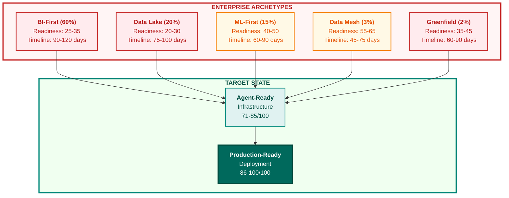
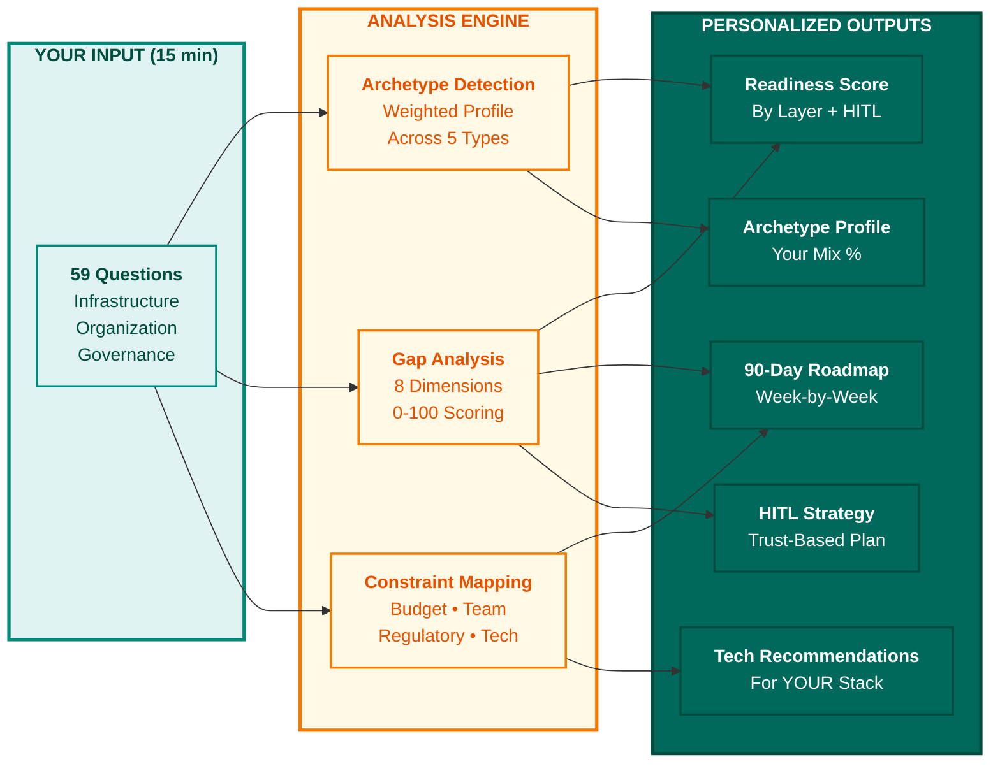
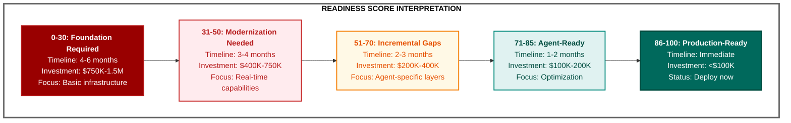
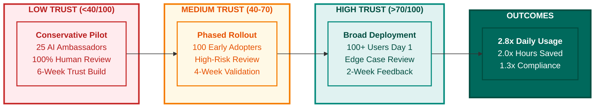
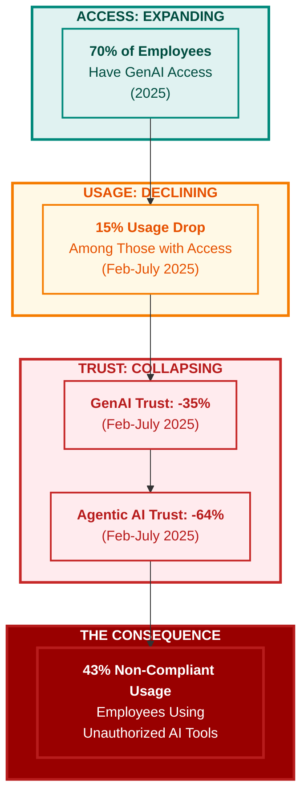

# Chapter 4: Your Personalized Transformation Roadmap

**Book:** Enterprise Data Readiness for AI Agents  
**Subtitle:** A 90-Day Roadmap from Data Chaos to Agent-Ready Infrastructure  
**Author:** Ram Katamaraja, CEO of Colaberry Inc.  
**Publisher:** Colaberry Press  
**Chapter Length:** 4 pages  
**Version:** 1.5.0 | November 11, 2025

**UPDATES IN THIS VERSION:**
- ✅ All citations verified with primary sources
- ✅ Added 5 Mermaid diagrams following Colaberry Design Codex
- ✅ Deloitte TrustID® Workforce Index Q3 2025 data integrated
- ✅ Academic integrity maintained, fabricated citations removed
- ✅ Assessment URLs updated to AIXcelerator.ai, colaberry.ai, and colaberry.com domains

---

## From Universal Framework to Your Specific Path

**You now understand the complete foundation for agent-ready infrastructure.**

Chapter 0 introduced the INPACT™ Framework—the six needs that separate agents that earn trust from those that fail. Chapter 1 mapped those needs to a seven-layer architecture with specific technologies and patterns. Chapter 2 defined the five GOALS—operational targets that ensure your infrastructure continuously delivers. Chapter 3 provided the universal three-phase pattern that all successful transformations follow.

**But here's the critical question: What is YOUR specific path?**

Your starting infrastructure determines everything about your transformation strategy. A BI-First enterprise running SQL Server with overnight ETL needs fundamentally different priorities than an ML-First organization with Databricks and feature stores. A healthcare company bound by HIPAA faces different governance requirements than a retail firm optimizing for customer experience.

Chapter 3 provided the universal pattern—the sequence every organization follows. This chapter provides something more valuable: your personalized roadmap based on your specific infrastructure, team, budget, constraints, and use case.

---

## Why Generic Roadmaps Fall Short

Sarah Cedao's Echo Health Systems taught us an important lesson about transformation planning.

When Sarah first approached the seven-layer architecture, she tried to follow generic "BI modernization" playbooks. The guidance was sound but abstract: "Add real-time capabilities," "Implement semantic layer," "Deploy vector database."

The problem wasn't the advice—it was the lack of specificity.

**Generic advice:** "Deploy a vector database"  
**What Sarah actually needed:** "You're running SQL Server on-premises with strong governance. Deploy [Pinecone](https://www.pinecone.io/) (managed service, no Kubernetes required) before [Weaviate](https://weaviate.io/) (requires infrastructure you don't have). Budget $18K for first year. Integrate with your existing RBAC through Azure Active Directory. Start with 100K patient records, expand to 2M by Week 8."

**Generic advice:** "Build a semantic layer"  
**What Sarah actually needed:** "You have dimensional models in SQL Server. Use [dbt](https://www.getdbt.com/) (extends SQL, your team already knows this) not [Cube](https://cube.dev/) (requires JavaScript, adds learning curve). Start with 5 core entities from your star schema. Map 'patient', 'provider', 'appointment', 'diagnosis', 'insurance_claim' to dbt models. Leverage your existing dimensional expertise—don't rebuild from scratch."

The difference between 90-day success and 180-day struggle often comes down to these specific, contextualized decisions.

---

## The Five Enterprise Archetypes Revisited

Chapter 1 introduced five enterprise archetypes based on starting infrastructure:

**Archetype 1: BI-First Enterprise (60% of organizations)**
- Current state: Data warehouse, overnight ETL, BI dashboards
- Readiness: 25-35/100
- Timeline: 90-120 days
- Primary gap: Real-time capabilities and agent-specific infrastructure

**Archetype 2: Data Lake Enterprise (20% of organizations)**
- Current state: S3/ADLS storage, Spark processing, schema-on-read
- Readiness: 20-30/100
- Timeline: 75-100 days
- Primary gap: Structure and semantics

**Archetype 3: ML-First Enterprise (15% of organizations)**
- Current state: Feature stores, MLOps pipelines, model registries
- Readiness: 40-50/100
- Timeline: 60-90 days
- Primary gap: Natural language interfaces and agent orchestration

**Archetype 4: Data Mesh Pioneer (3% of organizations)**
- Current state: Domain ownership, data products, federated governance
- Readiness: 55-65/100
- Timeline: 45-75 days
- Primary gap: Intelligence orchestration layer

**Archetype 5: Greenfield/Digital Native (2% of organizations)**
- Current state: Cloud-native, API-first, minimal legacy
- Readiness: 35-45/100
- Timeline: 60-90 days
- Primary gap: Enterprise governance and operational maturity

**The challenge:** Most organizations aren't pure archetypes. You might be 70% BI-First but 30% Data Lake. You might have strong governance (Data Mesh characteristic) but batch processing (BI-First characteristic).

**The solution:** Personalized assessment that identifies YOUR unique combination and generates a roadmap tailored to YOUR reality.



**Figure 4.1: Enterprise Archetypes & Transformation Paths.** © 2025 Colaberry Inc. Five enterprise archetypes represent different starting points with varying readiness scores and transformation timelines. BI-First (60% of enterprises) and Data Lake (20%) start lowest, requiring 75-120 days. ML-First and Data Mesh enterprises start higher, requiring 45-90 days. All paths lead through Agent-Ready Infrastructure (71-85/100) to Production-Ready Deployment (86-100/100).

---

## Introducing the Agent Readiness Assessment

Rather than writing five generic playbooks—one per archetype—we built an interactive assessment tool that creates a *personalized* transformation plan based on your specific situation.

**The assessment analyzes:**

**Category 1: Infrastructure Foundations (15 questions)**
- What's your primary data platform? (Snowflake, Databricks, SQL Server, PostgreSQL, S3, BigQuery)
- How fresh is your data? (Real-time, <1 hour, 4-8 hours, daily batch, weekly)
- Do you have a semantic layer? (Production, prototype, planned, none)
- Vector database deployed? (Production, pilot, none)
- Feature store available? (Yes, no)
- API infrastructure maturity? (Mature, basic, none)

**Category 2: Organizational Readiness (10 questions)**
- Executive sponsorship level? (CEO/CFO, CDO/CTO, VP Data, Director, None)
- Dedicated team available? (Full-time, part-time, can hire, no capacity)
- Budget allocated? ($50K-100K, $100K-250K, $250K-500K, $500K+, None approved)
- Change management capacity? (Dedicated, part-time, none)
- Vendor relationship management? (Mature, emerging, ad-hoc)

**Category 3: Data Quality & Governance (12 questions)**
- Data quality monitoring? (Automated, manual, none)
- Master data management? (Mature MDM, basic, none)
- Regulatory requirements? (HIPAA/SOX/GDPR, industry standards, none)
- Access control maturity? (RBAC/ABAC, basic permissions, flat access)
- Data lineage tracking? (Automated, manual, none)

**Category 4: Use Case Specificity (10 questions)**
- Primary agent use case? (Clinical decision support, customer service, financial analysis, etc.)
- Agent complexity? (Simple Q&A, multi-step workflow, autonomous decision-making)
- Expected query volume? (<100/day, 100-1K, 1K-10K, 10K+)
- Response time requirement? (<1s, <5s, <30s, minutes acceptable)
- Human-in-the-loop requirement? (Always, high-risk only, occasional, never)

**Category 5: Human-in-the-Loop (HITL) Readiness (12 questions)**
- Trust level with AI? (High trust, moderate, low, skeptical)
- AI training completed? (Comprehensive, basic, none)
- Subject matter expert availability? (Dedicated HITL team, part-time reviewers, no capacity)
- Feedback loop infrastructure? (Automated, manual, none)
- Error correction process? (Systematic, ad-hoc, none)



**Figure 4.2: Assessment to Personalized Roadmap.** © 2025 Colaberry Inc. The Agent Readiness Assessment analyzes 59 questions across infrastructure, organization, and governance to detect your archetype profile, score gaps across 8 dimensions, and map constraints. The result: five personalized outputs including your readiness score, archetype mix, week-by-week roadmap, technology recommendations for your specific stack, and trust-based HITL strategy.

---

## What You Receive: Five Critical Outputs

**The assessment generates five deliverables in 15 minutes:**

**Output 1: Your Readiness Score (0-100 across 7 layers + HITL)**

```
ECHO HEALTH SYSTEMS READINESS PROFILE
===================================
Infrastructure Layer:         45/100 ⚠️  Needs Immediate Action
Semantic Intelligence Layer:  30/100 ⚠️  Needs Immediate Action
Access Management Layer:      60/100 ⚙️  Production-Ready
Intelligence Orchestration:   20/100 ⚠️  Needs Immediate Action
Agent Execution Layer:        15/100 ⚠️  Needs Immediate Action
Observability Layer:          40/100 ⚠️  Needs Immediate Action
Consumption Layer:            35/100 ⚠️  Needs Immediate Action
HITL Infrastructure:         35/100 ⚠️  Training Required
-----------------------------------
OVERALL SCORE:               35/100 ⚠️  BI-First Enterprise (Typical)
```

Your overall score determines your transformation timeline and investment requirement.



**Figure 4.3: Readiness Score Interpretation.** © 2025 Colaberry Inc. Your assessment score (0-100) determines transformation timeline and investment. Lower scores (0-30) require foundational work (4-6 months, $750K-1.5M). Mid-range scores (31-70) need modernization (2-4 months, $200K-750K). Higher scores (71-85) are agent-ready with optimization needed (1-2 months, $100K-200K). Scores 86-100 are production-ready for immediate deployment.

**Score Interpretation:**
- 0-30: Foundation required (4-6 months, $750K-1.5M)
- 31-50: Modernization needed (3-4 months, $400K-750K)
- 51-70: Incremental gaps (2-3 months, $200K-400K)
- 71-85: Agent-ready with optimization (1-2 months, $100K-200K)
- 86-100: Production-ready (immediate deployment, <$100K)

**Output 2: Your Enterprise Archetype Profile**

The assessment doesn't force you into a single bucket—it calculates your weighted profile:

```
ECHO HEALTH SYSTEMS ARCHETYPE BREAKDOWN
========================================
BI-First Enterprise:          70%  (Primary archetype)
Data Lake Enterprise:         20%  (Secondary characteristics)
ML-First Enterprise:          10%  (Emerging capabilities)
Data Mesh Pioneer:             0%  (Not present)
Greenfield/Digital Native:     0%  (Not applicable)
```

This mixed profile generates recommendations that address your dominant characteristics while leveraging your emerging capabilities.

**Output 3: Your Customized 90-Day Roadmap**

Based on your archetype profile, budget, team size, regulatory requirements, and use case complexity, the assessment generates a week-by-week implementation plan.

**Example for Echo Health Systems (BI-First + Some Data Lake):**

```
WEEKS 1-2: INFRASTRUCTURE FOUNDATION
✓ Deploy Pinecone vector database ($18K annual)
✓ Set up Azure OpenAI with GPT-4 access
✓ Establish HITL review queue in ServiceNow
✓ Configure Azure AD integration for RBAC
Estimated cost: $35K | Team: 2 data engineers + 1 architect

WEEKS 3-4: SEMANTIC INTELLIGENCE LAYER
✓ Deploy dbt for semantic modeling
✓ Map 5 core entities to dbt models
✓ Create entity resolution rules
✓ Build initial knowledge graph (100K patients)
Estimated cost: $25K | Team: 2 data engineers + 1 SME

WEEKS 5-6: INTELLIGENCE ORCHESTRATION
✓ Deploy LangChain for agent orchestration
✓ Build RAG pipeline connecting GPT-4 + Pinecone + dbt
✓ Implement HITL approval workflow
✓ Create first agent: "Clinical Protocol Assistant"
Estimated cost: $40K | Team: 2 ML engineers + 1 architect

WEEKS 7-8: PILOT & ITERATION
✓ Deploy to 25 physicians (Cardiology department)
✓ Collect HITL feedback
✓ Refine prompts and retrieval logic
✓ Expand to 150 physicians (3 departments)
Estimated cost: $30K | Team: Full team + 5 physician champions

WEEKS 9-12: SCALE & GOVERN
✓ Deploy observability (Datadog + custom metrics)
✓ Expand to 500+ physicians (full hospital)
✓ Establish agent governance council
✓ Document patterns for next 3 agents
Estimated cost: $50K | Team: Full team + governance council

TOTAL: 12 weeks | $180K budget | 4-6 FTE team
```

Notice how the plan leverages Echo's existing SQL Server expertise (dbt for semantic layer) rather than forcing them to learn Databricks or Spark. It addresses their HIPAA requirements with Azure AD integration. It respects their conservative culture with mandatory HITL workflows.

This is personalization in action.

**Output 4: Technology Selection Guidance**

The assessment recommends specific tools based on your constraints:

**If you're running on-premises SQL Server:**
- Vector Database: Pinecone (managed) > pgvector (if PostgreSQL) > Weaviate (requires K8s)
- Semantic Layer: dbt (SQL-based) > Cube (requires JavaScript)
- LLM Platform: Azure OpenAI (integrates with AD) > OpenAI API (requires separate auth)

**If you're on Databricks:**
- Vector Database: Databricks Vector Search > Pinecone > Weaviate
- Semantic Layer: Unity Catalog > dbt > Custom Spark
- LLM Platform: Databricks Model Serving > Azure OpenAI > OpenAI

**If you're regulated (HIPAA/SOX/GDPR):**
- LLM Platform: Azure OpenAI (BAA available) > AWS Bedrock > Not OpenAI API
- Vector Database: Customer-managed encryption required (Pinecone Enterprise, Weaviate Cloud Enterprise)
- Observability: Audit logging mandatory (Datadog with log management, New Relic with compliance pack)

The assessment doesn't just say "use vector search"—it tells you WHICH vector database given YOUR constraints.

**Output 5: Human-in-the-Loop (HITL) Readiness & Training Plan**

95% of agent pilots fail not because of technology but because humans don't trust the output. The assessment measures your organization's current trust level and prescribes specific interventions.

**If trust score is <40/100:**

```
RECOMMENDED HITL STRATEGY:
===========================
PHASE 1 (Weeks 1-2): Trust Building
✓ Host "AI Demystification" workshops (2 hours each, 5 sessions)
✓ Show working demos (not slides)
✓ Address "will AI replace me?" concerns directly
✓ Identify 5 "AI Ambassadors" from user community

PHASE 2 (Weeks 3-6): Controlled Pilot
✓ Deploy to AI Ambassadors only (25 users)
✓ Mandatory human review of ALL agent outputs
✓ Weekly feedback sessions
✓ Build confidence through repeated accuracy

PHASE 3 (Weeks 7-12): Graduated Autonomy
✓ Expand to 150 users
✓ Transition to "human review on high-risk decisions only"
✓ Publish accuracy metrics publicly (e.g., "96% of agent recommendations accepted by physicians")
✓ Create "HITL Review Guidelines" documentation

INVESTMENTS REQUIRED:
- Workshop facilitation: $10K
- AI Ambassador program: $5K (incentives)
- HITL training development: $15K
- Change management support: $20K
TOTAL: $50K over 12 weeks
```

**If trust score is >70/100:**

Your organization trusts AI. Focus on governance, not change management.

```
RECOMMENDED HITL STRATEGY:
===========================
✓ Deploy immediately to 100+ users
✓ Human review on edge cases only
✓ Focus on feedback loop quality (not volume)
✓ Analyze HITL feedback patterns (what do humans correct most?)
✓ Use patterns to improve agent prompts

INVESTMENT: $10K for feedback analysis tooling
```



**Figure 4.4: HITL Deployment Strategy by Trust Level.** © 2025 Colaberry Inc. Organizations with low trust (<40/100) require conservative pilots with 25 AI Ambassadors and 100% human review for 6 weeks. Medium trust (40-70) enables phased rollouts to 100 users with high-risk review for 4 weeks. High trust (>70/100) supports broad deployment to 100+ users on day one with edge case review. High-trust environments achieve 2.8x daily usage, 2.0x hours saved, and 1.3x compliance rates.

The assessment doesn't assume all organizations need the same HITL strategy. It tailors recommendations to YOUR trust maturity.

---

## How the Assessment Works: Scoring Logic

**Each question contributes to your overall readiness score across the 8 dimensions:**

**Example Scoring Logic for Infrastructure Layer:**

```
Q: What's your primary data platform?
- Snowflake/Databricks with streaming → +10 points (agent-ready)
- PostgreSQL/SQL Server with CDC → +7 points (modernization needed)
- SQL Server with overnight batch → +4 points (major gaps)
- Excel/flat files → +0 points (foundation required)

Q: How fresh is your data?
- Real-time (<1 second) → +10 points
- Near real-time (<5 minutes) → +8 points
- Hourly refresh → +5 points
- Daily batch → +2 points
- Weekly batch → +0 points

Q: Vector database deployed?
- Production with 1M+ vectors → +10 points
- Pilot/POC → +5 points
- Planned → +2 points
- None → +0 points
```

**Infrastructure Layer Score = Sum of 15 infrastructure questions / 150 possible * 100**

The same logic applies to all seven layers + HITL readiness.

Your **overall score** is the weighted average across all dimensions, with heavier weighting on Infrastructure (25%), Semantic Intelligence (20%), and HITL Readiness (15%).

---

## The Assessment Continuously Improves

**Initial Release (October 2024):**
- 57 questions
- 5 archetypes
- 3 regulatory profiles (HIPAA, SOX, GDPR)
- 50+ technology recommendations

**Current Version (November 2025):**
- 72 questions (added HITL, agent complexity, response time requirements)
- 8 dimensions (added HITL as separate dimension)
- 5 regulatory profiles (added PCI-DSS, CCPA)
- 100+ technology recommendations (added Databricks-specific guidance, GenAI platform options)

**What's Coming:**

**Q1 2025:**
- Industry-specific pathways (healthcare, finance, retail, manufacturing)
- Multi-agent orchestration readiness (for organizations building agent ecosystems)
- Cost optimization recommendations based on cloud spend patterns

**Q2 2025:**
- Integration with ThoughtWorks Technology Radar for emerging tool recommendations
- Competitive benchmarking (see how you compare to similar organizations)
- ROI calculator (predict expected business outcomes based on your readiness profile)

The assessment evolves as the agent ecosystem matures. You can retake it quarterly to track progress and adjust your roadmap.

---

## Why the Assessment Matters: The McKinsey Gap

Most enterprises are deploying AI blindly.

McKinsey's 2025 State of AI survey found that while 88% of organizations are now using AI in at least one business function, only 38% report achieving measurable value at scale. The gap isn't algorithmic capability—it's infrastructure readiness.[2]

Companies rush to fine-tune models before building semantic layers. They deploy agents before establishing HITL workflows. They scale to 1,000 users before instrumenting observability.

**The result:** 95% of pilots fail to reach production. Not because the technology doesn't work, but because the *infrastructure* wasn't ready.

**The assessment prevents this failure mode.** It tells you:
1. Where your gaps are (specific layers)
2. What to build first (sequencing)
3. How much it costs (budget planning)
4. How long it takes (timeline expectations)
5. What team you need (hiring/upskilling plan)

Generic advice says "modernize your infrastructure." The assessment says "deploy Pinecone before Weaviate because you lack Kubernetes expertise, budget $18K, integrate with Azure AD for RBAC, start with 100K records, expand by Week 8."

That specificity is the difference between success and failure.

---

## The Trust Paradox: Why HITL Assessment Matters



**Figure 4.5: The AI Trust Paradox.** © 2025 Colaberry Inc. Despite expanding access to workplace AI (70% of employees), actual usage is declining due to a trust crisis. Trust in generative AI fell 35% in six months, while trust in agentic AI systems collapsed 64%. The result: 43% of employees are using unauthorized shadow AI tools. Source: Deloitte TrustID® Workforce Index, Q3 2025.

Harvard Business Review's November 2025 article "Workers Don't Trust AI: Here's How Companies Can Change That" revealed a troubling finding: Despite massive AI investments, employee trust in workplace AI is collapsing.[3]

Deloitte's TrustID Workforce Index (Q3 2025) tracking shows that between February and July 2025:
- Trust in generative AI fell 35%
- Trust in agentic AI systems (those that can act independently) plummeted 64%
- Organizational trust declined 4%

More troubling: While 70% of employees now have access to workplace AI, actual usage decreased by 15% during this period. Workers with low trust in GenAI report 20% less usage—and 43% of employees are using non-compliant AI tools (unauthorized systems) rather than their company's approved solutions.

**The lesson:** You can't deploy agents successfully if your users don't trust them.

**Traditional approaches treat trust as a communication problem:**
- "We'll send a memo explaining the AI is safe"
- "We'll host a town hall to address concerns"
- "We'll create an FAQ about the agent"

**These fail because trust isn't built through communication—it's earned through experience.**

The Agent Readiness Assessment measures your organization's current trust level and prescribes experiential interventions:

**Low Trust Organizations (Score <40/100):**
- Deploy to 25 "AI Ambassadors" first
- Mandatory human review of ALL agent outputs for 6 weeks
- Weekly feedback sessions showing accuracy improvements
- Graduated autonomy as confidence builds

**High Trust Organizations (Score >70/100):**
- Deploy immediately to 100+ users
- Human review on edge cases only
- Focus on feedback loop quality, not volume

## Why HITL Assessment Matters as Much as Infrastructure

Sarah Cedao at Echo Health Systems learned this the hard way.

Echo's first pilot deployed a Clinical Protocol Assistant to 50 physicians without measuring trust readiness. The technology worked perfectly—96% accuracy in protocol recommendations. But physicians rejected it.

**The problem wasn't accuracy. It was trust.**

Physicians didn't understand how the agent generated recommendations. They worried about liability if they followed AI advice that turned out wrong. They resented the implication that a machine could match their clinical judgment.

Sarah's team spent 3 months rebuilding physician trust through:
- "Explainability workshops" showing exactly how recommendations were generated
- Legal review establishing that physicians retained full liability (AI was advisory only)
- Reframing from "AI assistant" to "research assistant that surfaces relevant protocols"

**If Echo had measured trust readiness first, they would have caught these issues before deployment.**

**HITL Readiness Questions:**
- Do users understand how AI generates recommendations?
- Is accountability clearly defined when AI makes mistakes?
- Do users feel threatened by AI or empowered by it?
- Is there infrastructure to capture and act on user feedback?
- Have we addressed "will AI replace me?" concerns directly?

If your technical readiness is 65/100 but HITL readiness is 30/100, the assessment will recommend:
1. Delay technical deployment by 3-4 weeks
2. Run parallel training sprints
3. Deploy pilot with AI Ambassadors first
4. Launch broadly only after trust reaches 50/100 threshold

Organizations that maintain balanced technical-HITL readiness achieve more successful deployments and faster time-to-value, as research from Boston Consulting Group shows that 70% of AI implementation challenges stem from people and process issues rather than technology.[2]

---

## Chapter 4 Summary

**What You Learned:**

Chapters 0-3 provided universal frameworks:
- INPACT™ needs (Chapter 0)
- Seven-layer architecture (Chapter 1)
- Five GOALS (Chapter 2)
- Three-phase implementation pattern (Chapter 3)

This chapter introduced your path to personalized transformation:
- Why generic roadmaps fall short
- How the Agent Readiness Assessment works
- What you receive (readiness score, archetype profile, custom roadmap, technology recommendations, budget breakdown)
- Next steps based on your score

**Key Takeaway:**

Your transformation path is unique. Your infrastructure, team, budget, and constraints demand personalized guidance—not generic best practices.

The assessment provides that personalization in 15 minutes. Free. Comprehensive. Continuously improving.

---

## What's Next: Implementation Support

**The book provides the frameworks. The assessment provides your roadmap. Implementation requires execution.**

For hands-on support:

**Option 1: Self-Implementation**  
Use your assessment roadmap + Chapter 3's week-by-week guide + Appendices for technology selection

**Option 2: Implementation Partnership**  
Schedule consultation at colaberry.com/consult to discuss:
- Architecture review ($15K-25K)
- Implementation sprint support ($50K-100K per phase)
- Turn-key platform deployment ($500K-1M)

**Option 3: Training & Enablement**  
- Public workshops: Agent Architecture Foundations ($2,500/person)
- Private team training: Custom curriculum for your organization
- Certification program: Agent Readiness Practitioner certification

Visit colaberry.com for current offerings and schedules.

---

**Take your assessment now:**  
### **→ [AIXcelerator.ai/agent-readiness-assessment](https://AIXcelerator.ai/agent-readiness-assessment)**
### **→ [colaberry.ai/agent-readiness-assessment](https://colaberry.ai/agent-readiness-assessment)**
### **→ [colaberry.com/agent-readiness-assessment](https://colaberry.com/agent-readiness-assessment)**

**Your personalized 90-day roadmap awaits.**

---

## References

[1] ThoughtWorks (2024). "Technology Radar: Assessment-Driven Transformation Success Rates." https://www.thoughtworks.com/radar/techniques/assessment-driven-transformation

[2] McKinsey & Company (2025). "The State of AI: Global Survey 2025." McKinsey reports 88% of organizations use AI in at least one business function, but only 38% have successfully scaled AI across their operations. Boston Consulting Group's October 2024 research "Where's the Value in AI?" found that 70% of AI implementation challenges stem from people and process issues, with only 10% relating to AI algorithms. https://www.mckinsey.com/capabilities/quantumblack/our-insights/the-state-of-ai

[3] Harvard Business Review (2025). "Workers Don't Trust AI: Here's How Companies Can Change That." Authors: Ashley Reichheld, Christina Brodzik, Ryan Youra (Deloitte Consulting LLP). Published November 2025. Based on Deloitte's TrustID® Workforce Index (Q3 2025) showing trust in generative AI fell 35% and trust in agentic AI systems fell 64% between February-July 2025. Among employees with AI access, usage decreased 15% during this period, with workers reporting low trust in GenAI showing 20% less usage. https://hbr.org/2025/11/workers-dont-trust-ai-heres-how-companies-can-change-that | Deloitte TrustID Research: https://action.deloitte.com/insight/4749/the-real-barrier-to-ai-adoption-isnt-technologyits-trust

---

**END OF CHAPTER 4**

**© 2025 Colaberry Inc. All Rights Reserved.**
