# Chapter 7: The GOALS™ Framework
## The Five Dimensions of Operational Excellence

**Book:** Trust Before Intelligence  
**Subtitle:** Why 95% of Agent Projects Fail—and the Architecture Blueprint That Fixes Infrastructure in 90 Days  
**Author:** Ram Katamaraja, CEO, Colaberry Inc.  
**Chapter:** 7 of 12  
**Version:** 1.2 (Marcus Williams Correction + GOALS™ Terminology)  
**Date:** November 28, 2025  
**Target:** 10,000 words | 20 pages | ~40 minutes reading time  
**Part:** III - Measuring and Monitoring Trust

---

## Part 1: Framework Introduction (1,500 words)

### Architecture Complete. Now You Must Operate It.

Friday, Week 10, 5:00 PM. Sarah Cedao stood before Echo Health's engineering leadership team, looking at the dashboard that showed what they had accomplished together.

All seven layers operational. Every infrastructure gap closed. INPACT™ score: 85/100. $1.23M invested. Ten weeks of focused execution.

The architecture was complete.

But Dr. Harrison's question from the Monday board meeting still echoed: "How do you know it stays trustworthy?"

**Building infrastructure is a 90-day sprint. Operating it is a permanent discipline.**

This distinction separates organizations that deploy agents successfully from those whose deployments degrade into expensive maintenance nightmares. [8] Chapter 6 showed you how to complete the seven-layer architecture. This chapter introduces what comes next: the operational framework that ensures your investment continues delivering value.

---

### The Third Pillar: GOALS™

Throughout this book, we've built The Architecture of Trust with three integrated pillars:

**Pillar 1: INPACT™** defined what agents need from infrastructure—six fundamental requirements that must be fulfilled for users to trust autonomous operation.

**Pillar 2: 7-Layer Architecture** specified how to build infrastructure that delivers on those needs, from storage through orchestration.

**Pillar 3: GOALS™** establishes how to measure operational success, ensuring infrastructure continuously fulfills agent needs in production.

**Diagram 1: The Architecture of Trust—Three Integrated Pillars**

```mermaid
graph TB
    subgraph ARCH["<b>Three Integrated Pillars</b>"]
        PILLAR1["<b>PILLAR 1: INPACT™</b><br/><b>What Agents Need</b><br/><b>I·N·P·A·C·T</b><br/><b>Instant • Natural • Permitted</b><br/><b>Adaptive • Contextual • Transparent</b>"]
        
        PILLAR2["<b>PILLAR 2: 7-LAYER</b><br/><b>How to Build It</b><br/><b>Storage → Real-Time → Semantic</b><br/><b>→ Intelligence → Governance</b><br/><b>→ Observability → Orchestration</b>"]
        
        PILLAR3["<b>PILLAR 3: GOALS™</b><br/><b>How to Measure Success</b><br/><b>G·O·A·L·S</b><br/><b>Governance • Observability</b><br/><b>Availability • Lexicon • Solid</b>"]
        
        PILLAR1 -->|<b>Agent needs fulfilled by</b>| PILLAR2
        PILLAR2 -->|<b>Infrastructure enables</b>| PILLAR3
        PILLAR3 -->|<b>Drives operational efficiency</b>| PILLAR1
    end
    
    FOUNDATION["<b>FOUNDATION</b><br/><b>THE ARCHITECTURE OF TRUST</b>"]
    
    FOUNDATION --> ARCH
    
    style ARCH fill:#f0fff0,stroke:#00897b,stroke-width:3px
    style PILLAR1 fill:#e0f2f1,stroke:#00897b,stroke-width:2px,color:#004d40
    style PILLAR2 fill:#e0f2f1,stroke:#00897b,stroke-width:2px,color:#004d40
    style PILLAR3 fill:#00695c,color:#ffffff,stroke:#004d40,stroke-width:4px
    style FOUNDATION fill:#f9f9f9,stroke:#666666,stroke-width:2px,color:#000000
    
    Copyright["<b>© 2025 Colaberry Inc.</b>"]
    style Copyright fill:#ffffff,stroke:none,color:#666666
```

With Pillar 3 highlighted, this chapter completes the theoretical foundation of The Architecture of Trust. Chapter 8 will show you GOALS™ in action during Echo's operational validation in Weeks 11-12.

---

### From Building to Operating

Think of it this way: INPACT™ defines the destination—what trust looks like when achieved. The 7-Layer Architecture provides the vehicle—the technical infrastructure that delivers trust capabilities. GOALS™ is the maintenance schedule—the operational discipline that sustains trust over time.

Just as you can have a perfect skeleton but fail if your cardiovascular system weakens, you can have perfect architecture but fail if your GOALS™ health deteriorates. The five GOALS are deeply interdependent—like vital organs in a body, each supporting the others.

### Two Different Questions

**Architecture answers: "What do we need to build?"**

Multi-modal storage. Real-time data fabric. Semantic layer. Intelligence infrastructure. Agent-aware governance. Observability. Data products.

Chapters 4-6 showed you exactly how Echo built each layer. Week 10, that construction completed.

**GOALS answers: "How do we know it's working?"**

Can agents respect security boundaries? Can the team see when things go wrong? Can agents get data fast enough? Do agents understand what data means? Can agents trust data quality?

These questions never stop being relevant. They require answers today, tomorrow, and every day your agents operate.

### The Key Insight

**You build architecture once during a focused 90-day effort. But you achieve GOALS continuously through ongoing operational discipline.**

Both are essential, but they require fundamentally different mindsets. Construction is a sprint with a finish line. Operations is a marathon with no end.

---

## Part 2: Echo's Operational Challenge (1,000 words)

### Week 10: What We Built

Friday afternoon, Sarah gathered her extended team in the large conference room. Marcus Williams, CDO. Dr. Martinez, clinical advisor. The engineering leads from each layer team. The compliance officer. The data quality manager.

"Ten weeks," Sarah began. "Let's take stock."

**Diagram 2: Echo's 90-Day Journey—Architecture Complete**

```mermaid
graph LR
    subgraph PHASE1["<b>Phase 1: Foundation (Weeks 1-4)</b>"]
        W1["<b>Week 1-2</b><br/><b>Layer 1: Storage</b><br/><b>Multi-modal data</b>"]
        W2["<b>Week 3-4</b><br/><b>Layer 2: Data Fabric</b><br/><b>Real-time streaming</b>"]
    end
    
    subgraph PHASE2["<b>Phase 2: Intelligence (Weeks 5-7)</b>"]
        W3["<b>Week 5-6</b><br/><b>Layer 3: Semantic</b><br/><b>Business meaning</b>"]
        W4["<b>Week 7</b><br/><b>Layer 4: Intelligence</b><br/><b>Orchestration</b>"]
    end
    
    subgraph PHASE3["<b>Phase 3: Trust (Weeks 8-10)</b>"]
        W5["<b>Week 8</b><br/><b>Layer 5: Governance</b><br/><b>Security & HITL</b>"]
        W6["<b>Week 9</b><br/><b>Layer 6: Observability</b><br/><b>Monitoring</b>"]
        W7["<b>Week 10</b><br/><b>Layer 7: Orchestration</b><br/><b>Integration</b>"]
    end
    
    subgraph NOW["<b>Week 10 Status</b>"]
        COMPLETE["<b>✅ Architecture Complete</b><br/><b>INPACT™: 85/100</b><br/><b>$1.23M Invested</b>"]
    end
    
    W1 --> W2
    W2 --> W3
    W3 --> W4
    W4 --> W5
    W5 --> W6
    W6 --> W7
    W7 --> COMPLETE
    
    style PHASE1 fill:#e0f2f1,stroke:#00897b,stroke-width:2px
    style PHASE2 fill:#e0f2f1,stroke:#00897b,stroke-width:2px
    style PHASE3 fill:#e0f2f1,stroke:#00897b,stroke-width:2px
    style NOW fill:#00695c,stroke:#004d40,stroke-width:3px
    style W1 fill:#ffffff,stroke:#00897b,stroke-width:2px,color:#004d40
    style W2 fill:#ffffff,stroke:#00897b,stroke-width:2px,color:#004d40
    style W3 fill:#ffffff,stroke:#00897b,stroke-width:2px,color:#004d40
    style W4 fill:#ffffff,stroke:#00897b,stroke-width:2px,color:#004d40
    style W5 fill:#ffffff,stroke:#00897b,stroke-width:2px,color:#004d40
    style W6 fill:#ffffff,stroke:#00897b,stroke-width:2px,color:#004d40
    style W7 fill:#ffffff,stroke:#00897b,stroke-width:2px,color:#004d40
    style COMPLETE fill:#00695c,color:#ffffff,stroke:#004d40,stroke-width:3px
    
    Copyright["<b>© 2025 Colaberry Inc.</b>"]
    style Copyright fill:#ffffff,stroke:none,color:#666666
```

**Phase 1 (Weeks 1-4): Foundation Layers**
- Layer 1: Multi-Modal Storage operational
- Layer 2: Real-Time Data Fabric streaming
- INPACT™ score: 28/100 → 42/100

**Phase 2 (Weeks 5-7): Intelligence Layers**
- Layer 3: Semantic Layer translating
- Layer 4: Intelligence Orchestration reasoning
- INPACT™ score: 42/100 → 67/100

**Phase 3 (Weeks 8-10): Trust Layers**
- Layer 5: Agent-Aware Governance controlling
- Layer 6: Observability Dashboard monitoring
- Layer 7: Orchestration coordinating
- INPACT™ score: 67/100 → 85/100

"We did it," Marcus said. "All seven layers operational. Three agents ready for production."

### The Board's Question

But Sarah remembered Dr. Harrison's question from Monday. The board had reviewed their progress—impressed with the transformation, confident in the investment. Then Dr. Harrison, the former hospital CEO, had asked the question that changed everything.

"Sarah, this is remarkable progress. But I've seen too many IT projects succeed initially only to degrade within months. How will you know if this infrastructure stays trustworthy? How will you measure operational health over time?"

Sarah had given a confident answer about dashboards and monitoring. But the question nagged at her. She had spent ten weeks learning how to *build* agent-ready infrastructure. She hadn't yet learned how to *operate* it.

### Building and Running Are Different Disciplines

"We need to talk about what comes next," Sarah said to her team. "Building the architecture is complete. But I realized this week that operating it requires a different framework entirely."

She pulled up a simple table:

**Table 1: Architecture vs. Operations Mindset**

| Dimension | Building (Weeks 1-10) | Operating (Week 11+) |
|-----------|----------------------|---------------------|
| Focus | Construction | Maintenance |
| Duration | Finite (90 days) | Continuous |
| Success Metric | Completion | Health over time |
| Key Question | "Is it built?" | "Is it working?" |
| Failure Mode | Delayed delivery | Degraded performance |

"We know how to build now," Sarah continued. "But look at this—we have infrastructure status showing all green, but we don't yet have operational targets for health over time."

### Marcus Introduces GOALS™

Marcus Williams had been preparing for this moment. "I've been studying operational frameworks for agent infrastructure," he said. "There's a pattern that successful organizations follow. They call it GOALS—Governance, Observability, Availability, Lexicon, and Solid."

He walked to the whiteboard and wrote:

**G** - Governance: Security & Compliance  
**O** - Observability: Monitoring & Feedback  
**A** - Availability: Speed & Freshness  
**L** - Lexicon: Semantic Understanding  
**S** - Solid: Data Quality & Reliability

"Each GOALS dimension maps to operational health we need to maintain continuously. Not just 'is governance working today?' but 'what's our governance health score, and how is it trending?'"

### The Week 10 Baseline

"What's our current GOALS health?" Dr. Martinez asked.

Marcus pulled up preliminary numbers. "Based on our Week 10 status, I'd estimate we're at about 75% GOALS health. We have the infrastructure, but we haven't yet established the operational discipline."

**Table 2: Echo's GOALS Health Baseline (Week 10)**

| GOAL | Score | Status | Key Gap |
|------|-------|--------|---------|
| **Governance** | 78/100 | 🟡 Good | HITL workflows need refinement |
| **Observability** | 72/100 | 🟡 Good | Need cascade monitoring |
| **Availability** | 80/100 | 🟢 Strong | Cache optimization ongoing |
| **Lexicon** | 68/100 | 🟠 Adequate | Semantic coverage at 72% |
| **Solid** | 77/100 | 🟡 Good | Quality gates need tuning |

**Overall GOALS Health:** 75/100 (Good but needs improvement)

**Diagram 3: Echo's GOALS Health Dashboard (Week 10 Baseline)**

```mermaid
graph TB
    subgraph DASHBOARD["<b>GOALS™ Health Dashboard - Week 10</b>"]
        TITLE["<b>Overall Health: 75/100</b><br/><b>Status: Good - Needs Improvement</b>"]
        
        G["<b>G - Governance</b><br/><b>78/100 🟡</b><br/><b>HITL workflows need refinement</b>"]
        O["<b>O - Observability</b><br/><b>72/100 🟡</b><br/><b>Need cascade monitoring</b>"]
        A["<b>A - Availability</b><br/><b>80/100 🟢</b><br/><b>Cache optimization ongoing</b>"]
        L["<b>L - Lexicon</b><br/><b>68/100 🟠</b><br/><b>Semantic coverage at 72%</b>"]
        S["<b>S - Solid</b><br/><b>77/100 🟡</b><br/><b>Quality gates need tuning</b>"]
    end
    
    TITLE --> G
    TITLE --> O
    TITLE --> A
    TITLE --> L
    TITLE --> S
    
    TARGET["<b>Target: 85/100</b><br/><b>Timeline: Week 12</b>"]
    
    G --> TARGET
    O --> TARGET
    A --> TARGET
    L --> TARGET
    S --> TARGET
    
    style DASHBOARD fill:#f0fff0,stroke:#00897b,stroke-width:2px
    style TITLE fill:#fff9e6,stroke:#f57c00,stroke-width:2px,color:#e65100
    style G fill:#fff9e6,stroke:#f57c00,stroke-width:2px,color:#004d40
    style O fill:#fff9e6,stroke:#f57c00,stroke-width:2px,color:#004d40
    style A fill:#e0f2f1,stroke:#00897b,stroke-width:2px,color:#004d40
    style L fill:#ffebee,stroke:#c62828,stroke-width:2px,color:#004d40
    style S fill:#fff9e6,stroke:#f57c00,stroke-width:2px,color:#004d40
    style TARGET fill:#00695c,color:#ffffff,stroke:#004d40,stroke-width:3px
    
    Copyright["<b>© 2025 Colaberry Inc.</b>"]
    style Copyright fill:#ffffff,stroke:none,color:#666666
```

"Our architecture scores 85/100 on INPACT™," Marcus explained. "But our operational readiness—our ability to sustain that score over time—is at 75%. The gap represents operational discipline we haven't yet established."

### The Week 11 Plan

Sarah made a decision. "Week 11 starts Monday. Our objective: learn the GOALS framework and establish operational baselines for each dimension. Week 12: validate through our three pilot agents. Then we present to the board with confidence."

The team nodded. After ten weeks of building, they were ready to learn how to operate.

---

## Part 3: GOAL 1 — Governance (2,000 words)

### Security & Compliance at Scale

**Definition:** Governance ensures agents respect security boundaries, maintain compliance with regulations, and operate within authorized scope at all times.

When Echo built Layer 5 (Agent-Aware Governance), they implemented the technical capabilities—ABAC policies, audit logging, HIPAA compliance controls. The GOALS framework now asks: how do you know governance *remains* effective as agents scale?

### Why Traditional Security Models Fail Agents

Traditional security models were designed for human users making deliberate decisions.

Humans think before acting. They pause. They consider context. They understand social norms about what's appropriate.

Agents make thousands of decisions per hour. They don't pause. They follow rules exactly—but rules can't anticipate every situation. They operate at machine speed in human contexts.

This mismatch creates the governance challenge.

When an agent needs to check a patient's lab results, it must verify the requesting user (authentication), confirm they're authorized (authorization), determine which specific lab results they're permitted to view (dynamic filtering), mask fields they shouldn't see (provider notes), log the entire access with business justification (HIPAA audit trails), and complete all of this in milliseconds.

### Why RBAC Isn't Enough

Traditional role-based access control can't handle this complexity. Giving the agent a "patient" role doesn't tell you which specific patient's data they should see. You need attribute-based access control policies that evaluate dozens of factors in real-time.

**The Five W's of ABAC Authorization:**

Traditional RBAC asks one question: "What role does this user have?"

Dynamic ABAC asks five questions simultaneously:

**👤 Who:** Patient ID 12345 requesting data (not just "a patient role")

**📋 What:** Specific table and columns being accessed (lab_results, not all patient data)

**📅 When:** Timestamp and business context (normal business hours vs. suspicious 3am access)

**📱 Where:** Access channel and location (mobile app from registered device vs. unknown location)

**🎯 Why:** Business justification (patient self-access vs. administrative lookup)

These five dimensions enable policies that are dynamically evaluated in real-time, achieving the sub-10ms latency agents require while maintaining HIPAA's "minimum necessary" compliance standard. [1]

**Diagram 4: RBAC vs ABAC Authorization Flow**

### Measuring Governance Health

Week 11, Sarah's team established governance health metrics:

**Policy coverage:** What percentage of data assets have explicit access policies? Target: 90%+ before deploying agents across use cases.

**Policy evaluation latency:** How long to make authorization decisions? Target: under 10ms to avoid impacting agent response times.

**Audit completeness:** Every data access logged with sufficient context—not just "agent queried patients table" but "user Jane Smith asked scheduling agent for her appointments, agent accessed 3 patient records she's authorized to view, returned 2 appointments, masked provider notes."

**Violation detection:** How quickly are policy breaches identified? Target: under 60 seconds for critical violations.

### Human-in-the-Loop: The Trust Boundary

Governance isn't just about what agents *can* do—it's also about what they *should* do without human approval. Not all decisions warrant full automation.

Human-in-the-loop (HITL) patterns enable agents to escalate high-stakes decisions to humans while maintaining autonomy for routine operations. This isn't a limitation—it's a strategic boundary that enables enterprise adoption. [9]

**The Autonomy Spectrum:**

**Full autonomy** → Conditional autonomy → Human-in-the-loop → Human-on-the-loop → **Full manual**

- **Full autonomy**: Agent executes without approval (appointment scheduling for available slots)
- **Conditional autonomy**: Agent executes unless conditions trigger approval (refills for controlled substances require approval)
- **Human-in-the-loop**: Agent proposes, human approves before execution (prior authorization requests >$5K)
- **Human-on-the-loop**: Agent executes, human monitors and can override (care plan recommendations)
- **Full manual**: Agent provides information only, human decides and executes (diagnoses, treatment plans)

The art is positioning decisions correctly on this spectrum—too much autonomy creates risk, too little negates agent value.

**Diagram 5: Human-in-the-Loop Autonomy Spectrum**

```mermaid
graph TB
    REQUEST["<b>Agent Decision Request</b><br/><b>e.g., Medication refill</b>"]
    
    ASSESS["<b>Risk Assessment</b><br/><b>Financial • Clinical • Regulatory</b>"]
    
    REQUEST --> ASSESS
    
    subgraph SPECTRUM["<b>Autonomy Decision Spectrum</b>"]
        FULL["<b>Full Autonomy</b><br/><b>Auto-execute</b><br/><b>e.g., Routine scheduling</b>"]
        
        COND["<b>Conditional</b><br/><b>Execute unless triggered</b><br/><b>e.g., Controlled substance</b>"]
        
        HITL["<b>Human-in-the-Loop</b><br/><b>Propose, human approves</b><br/><b>e.g., Prior auth >$5K</b>"]
        
        HONL["<b>Human-on-the-Loop</b><br/><b>Execute, human monitors</b><br/><b>e.g., Care plan updates</b>"]
        
        MANUAL["<b>Full Manual</b><br/><b>Info only</b><br/><b>e.g., Diagnoses</b>"]
    end
    
    ASSESS --> FULL
    ASSESS --> COND
    ASSESS --> HITL
    ASSESS --> HONL
    ASSESS --> MANUAL
    
    FULL -->|<b>Low risk</b>| EXECUTE["<b>✅ Auto-Execute</b>"]
    COND -->|<b>Medium risk</b>| CHECK{<b>Trigger?</b>}
    CHECK -->|<b>No</b>| EXECUTE
    CHECK -->|<b>Yes</b>| APPROVE["<b>⏸️ Human Approval</b>"]
    HITL -->|<b>High risk</b>| APPROVE
    HONL -->|<b>High stakes</b>| MONITOR["<b>👁️ Human Monitor</b>"]
    MANUAL -->|<b>Critical</b>| INFORM["<b>ℹ️ Information Only</b>"]
    
    APPROVE -->|<b>Approved</b>| EXECUTE
    MONITOR --> EXECUTE
    
    style REQUEST fill:#f9f9f9,stroke:#666666,stroke-width:2px,color:#000000
    style ASSESS fill:#fff9e6,stroke:#f57c00,stroke-width:2px,color:#e65100
    style SPECTRUM fill:#f0fff0,stroke:#00897b,stroke-width:2px
    style FULL fill:#e0f2f1,stroke:#00897b,stroke-width:2px,color:#004d40
    style COND fill:#e0f2f1,stroke:#00897b,stroke-width:2px,color:#004d40
    style HITL fill:#e0f2f1,stroke:#00897b,stroke-width:2px,color:#004d40
    style HONL fill:#e0f2f1,stroke:#00897b,stroke-width:2px,color:#004d40
    style MANUAL fill:#e0f2f1,stroke:#00897b,stroke-width:2px,color:#004d40
    style CHECK fill:#fff9e6,stroke:#f57c00,stroke-width:2px,color:#e65100
    style EXECUTE fill:#00695c,color:#ffffff,stroke:#004d40,stroke-width:3px
    style APPROVE fill:#fff9e6,stroke:#f57c00,stroke-width:2px,color:#e65100
    style MONITOR fill:#e0f2f1,stroke:#00897b,stroke-width:2px,color:#004d40
    style INFORM fill:#e0f2f1,stroke:#00897b,stroke-width:2px,color:#004d40
    
    Copyright["<b>© 2025 Colaberry Inc.</b>"]
    style Copyright fill:#ffffff,stroke:none,color:#666666
```

### Explainability: Making Trust Visible

Governance isn't just about controlling what agents can do—it's about explaining what they did do. Trust requires both security (access control) and transparency (explainability).

When Echo's scheduling agent recommends "Dr. Martinez is available Tuesday at 2pm," the patient needs more than an audit log. They need to understand why this recommendation was made, what data was used, how confident the agent is, and what alternatives exist.

**Explainability Metrics:**

- **Confidence calibration:** When an agent says it's 90% confident, it should be correct 85-95% of the time
- **Trace completeness:** 100% of responses include full lineage—which data sources, which policies applied, which models generated the response
- **Response justification:** Every recommendation includes reasoning, not just the answer

### Governance Anti-Patterns to Avoid

**Anti-pattern 1:** "We have good RBAC, so we're ready." Problem: RBAC can't handle agent-scale dynamic decisions. Solution: Implement ABAC with real-time policy evaluation.

**Anti-pattern 2:** "We'll add HITL after launch." Problem: Without escalation boundaries, agents make decisions they shouldn't. Solution: Define HITL workflows before production.

**Anti-pattern 3:** "Audit logs are for compliance only." Problem: Logs that satisfy auditors don't help operators. Solution: Design audit trails for both compliance and operational debugging.

---

## 📍 Checkpoint 1: Governance Foundation Complete

**What we've covered so far:**

✅ **Framework Introduction:** GOALS™ as Pillar 3 of The Architecture of Trust—the operational discipline that sustains infrastructure trust over time.

✅ **Echo's Context:** Week 10 baseline at 75/100 GOALS health, architecture complete at 85/100 INPACT™, framework learning phase beginning.

✅ **GOAL 1 (Governance):** Security & compliance at scale—ABAC replacing RBAC, the Five W's of authorization, HITL autonomy spectrum, explainability metrics, and governance health measurement.

**Key insight so far:** Governance isn't a one-time implementation but a continuous practice. New data sources require new policies. New agents require new permission scopes. New regulations require policy updates. [1]

**Coming next:** Observability, Availability, Lexicon, and Solid—the remaining four GOALS that complete operational excellence.

---

## Part 4: GOAL 2 — Observability (1,500 words)

### Monitoring & Feedback at Scale

**Definition:** Observability provides visibility into agent behavior, data health, model performance, and system operations—enabling teams to detect issues, diagnose root causes, and drive continuous improvement. [5]

### What Traditional Monitoring Misses

Traditional monitoring was designed for predictable, deterministic systems. A web server either returns the page or throws an error.

But agents operate in shades of gray. An agent might technically succeed while giving a response that's incomplete, outdated, misleading, or based on misunderstood intent. Infrastructure metrics alone can't detect these failures.

Sarah's team discovered this in their Week 10 review. All infrastructure metrics showed green. But when they analyzed a sample of agent responses, 7% had quality issues that traditional monitoring hadn't flagged.

### What Agents Need

Effective observability requires visibility across multiple dimensions:

**Data health monitoring:** Is source data fresh, complete, accurate? Echo discovered their patient portal data was four hours stale because a CDC pipeline was failing silently.

**Semantic drift detection:** When does terminology diverge from actual usage? New medical codes were introduced, but the semantic layer wasn't updated, causing misinterpretation of certain queries.

**Retrieval quality metrics:** Is intelligent retrieval finding the most relevant information? NDCG scores revealed that recent clinic policy changes weren't being retrieved even though they were in the knowledge base.

**Model performance tracking:** When do embedding models or LLMs degrade? Embedding accuracy can drop as terminology evolves.

**Cost and usage monitoring:** Without per-query cost tracking, LLM API bills can spike unexpectedly.

### The Power of End-to-End Tracing

The breakthrough comes with comprehensive tracing using global trace IDs.

Every agent request receives a unique identifier propagating through all seven layers. When a query fails, teams can follow the trace ID backward through the entire execution chain.

User query → semantic translation → retrieval → policy evaluation → data access → response generation → user delivery.

This enables root cause analysis impossible with infrastructure metrics alone.

**Diagram 6: End-to-End Observability with Trace IDs**

```mermaid
sequenceDiagram
    participant U as User
    participant L7 as Layer 7<br/>Agent
    participant L6 as Layer 6<br/>Observability
    participant L4 as Layer 4<br/>Intelligence
    participant L3 as Layer 3<br/>Semantic
    participant L1 as Layer 1<br/>Storage
    
    rect rgb(224, 242, 241)
        Note over U,L1: Trace ID: abc-123-def | Every step logged
    end
    
    U->>L7: Show Dr. Martinez's availability tomorrow
    activate L7
    L7->>L6: 📊 Log: Query received (trace: abc-123-def)
    
    L7->>L3: Translate: Dr. Martinez + availability
    activate L3
    L3->>L6: 📊 Log: Semantic translation 0.3s
    L3-->>L7: provider_id=789, date=2025-10-28
    deactivate L3
    
    L7->>L4: Retrieve: provider_schedule context
    activate L4
    L4->>L1: Query: provider_schedule WHERE id=789
    activate L1
    L1->>L6: ⚠️ Log: Query 2.3s - SLOW
    Note over L1: Missing index!
    L1-->>L4: Result: 3 time slots
    deactivate L1
    L4-->>L7: Context: [8am, 10am, 2pm]
    deactivate L4
    
    L7->>L6: 📊 Log: Response 2.9s total
    L7->>U: Dr. Martinez has 3 openings tomorrow
    deactivate L7
    
    rect rgb(255, 235, 238)
        Note over L6: Root Cause: Layer 1 bottleneck<br/>Auto-create ticket DBA-2847
    end
    
    Note over U,L1: © 2025 Colaberry Inc.
```

### Output Quality: Beyond Drift to Accuracy

Observability must monitor not just whether models are drifting but whether outputs remain accurate, factual, and consistent.

Model drift tells you the statistical distribution changed. Output quality tells you whether answers are still correct.

**Output Quality Metrics:**

- **Factual accuracy:** >95% of responses contain only verifiable information
- **Hallucination rate:** <2% of responses contain invented information not present in source data
- **Consistency:** Same query from same user should yield consistent answers 98%+ of the time
- **User satisfaction:** Direct feedback through thumbs up/down, target >85% approval rating

**Early warning signals:** 2% accuracy drop triggers alert, 3% hallucination rate triggers immediate review, 5% consistency variance triggers root cause investigation.

**Diagram 7: Output Quality Validation Metrics**

```mermaid
graph TB
    AGENT["<b>Agent Response</b><br/><b>Generated output</b>"]
    
    subgraph METRICS["<b>Output Quality Validation</b>"]
        M1["<b>Factual Accuracy</b><br/><b>Target: >95%</b>"]
        M2["<b>Hallucination Rate</b><br/><b>Target: <2%</b>"]
        M3["<b>Consistency</b><br/><b>Target: 98%+</b>"]
        M4["<b>User Satisfaction</b><br/><b>Target: >85%</b>"]
    end
    
    VALIDATE{<b>All metrics<br/>passing?</b>}
    
    PASS["<b>✅ Production Ready</b><br/><b>Quality validated</b>"]
    FAIL["<b>⚠️ Investigation</b><br/><b>Review required</b>"]
    
    FEEDBACK["<b>Continuous Loop</b><br/><b>Daily • Weekly • Monthly</b>"]
    
    AGENT --> M1
    AGENT --> M2
    AGENT --> M3
    AGENT --> M4
    
    M1 --> VALIDATE
    M2 --> VALIDATE
    M3 --> VALIDATE
    M4 --> VALIDATE
    
    VALIDATE -->|<b>Pass</b>| PASS
    VALIDATE -->|<b>Fail</b>| FAIL
    
    PASS --> FEEDBACK
    FAIL --> FEEDBACK
    FEEDBACK -.->|<b>Improves</b>| AGENT
    
    style AGENT fill:#f9f9f9,stroke:#666666,stroke-width:2px,color:#000000
    style METRICS fill:#e0f2f1,stroke:#00897b,stroke-width:2px,color:#004d40
    style M1 fill:#ffffff,stroke:#00897b,stroke-width:2px,color:#004d40
    style M2 fill:#ffffff,stroke:#00897b,stroke-width:2px,color:#004d40
    style M3 fill:#ffffff,stroke:#00897b,stroke-width:2px,color:#004d40
    style M4 fill:#ffffff,stroke:#00897b,stroke-width:2px,color:#004d40
    style VALIDATE fill:#fff9e6,stroke:#f57c00,stroke-width:2px,color:#e65100
    style PASS fill:#00695c,color:#ffffff,stroke:#004d40,stroke-width:3px
    style FAIL fill:#990000,color:#ffffff,stroke:#b71c1c,stroke-width:3px
    style FEEDBACK fill:#e0f2f1,stroke:#00897b,stroke-width:2px,color:#004d40
    
    Copyright["<b>© 2025 Colaberry Inc.</b>"]
    style Copyright fill:#ffffff,stroke:none,color:#666666
```

### Measuring Observability Health

**Trace coverage:** What percentage of requests have complete traces? Target: 100% for agent interactions.

**MTTD (Mean Time to Detect):** How quickly are issues identified? Target: under 5 minutes for critical issues.

**MTTR (Mean Time to Resolve):** How quickly are identified issues fixed? Target: under 4 hours for production-impacting issues.

**False positive rate:** What percentage of alerts are actionable? Target: >80% actionable to avoid alert fatigue.

---

## Part 5: GOAL 3 — Availability (1,500 words)

### Speed & Freshness at Scale

**Definition:** Availability ensures agents can retrieve and present data with the speed and freshness that natural language interactions demand—sub-2-second responses with sub-30-second data staleness.

### The Performance Imperative

When a patient asks "Is Dr. Martinez available tomorrow?", they expect a response as quickly as they'd get from a receptionist—seconds, not minutes.

90% of users consider immediate response important. 60% define "immediate" as 10 minutes or less for human service. For AI agents, expectations are even higher—sub-2-second responses for simple queries. [2]

This is why Echo invested heavily in their real-time data fabric (Layer 2) and intelligent caching strategies. But architecture alone doesn't guarantee sustained performance. Availability as a GOALS dimension tracks whether that performance persists over time.

### The Three Bottlenecks

Sarah's team identified three patterns that degrade availability:

**Bottleneck 1: Stale Data**
Batch ETL pipelines that update overnight can't support agents answering "Is Dr. Martinez available *now*?" The appointment might have been booked 30 minutes ago.

**Bottleneck 2: Cold Storage Queries**
Traditional data warehouses optimized for complex analytical queries take 2-3 seconds to respond. Agents need sub-500ms for conversational latency.

**Bottleneck 3: Sequential Processing**
When queries require multiple data sources, sequential processing compounds latency. Three 1.5-second queries become 4.5 seconds of wait time.

### The Multi-Level Caching Strategy

Echo's availability solution uses intelligent caching across multiple levels:

**Level 1: Semantic Cache (65% hit rate)**
- Queries with same intent share cache keys, even if worded differently
- "Dr. Martinez availability tomorrow" and "Show Dr. M's schedule for 10/28" both map to the same semantic key
- Speed: 300ms average
- Cost: $0.001 per query

**Level 2: Vector Database (25% hit rate)**
- Embedding-based similarity search finds "close enough" results
- Speed: 800ms average
- Cost: $0.008 per query

**Level 3: Knowledge Graph (7% hit rate)**
- Relationship traversal uses graph caching
- Speed: 1.2s average
- Cost: $0.015 per query

**Level 4: Cold Path (3% of queries)**
- Full pipeline execution for novel queries
- Speed: 2.8-4.2s
- Cost: $0.12 per query

**The 97% Rule:** With proper caching strategy, 97% of queries never need full processing. This is how organizations achieve consistent sub-2-second performance at dramatically lower cost. [7]

**Diagram 8: Multi-Level Caching Strategy for Sub-2-Second Performance**

```mermaid
graph TD
    Q["<b>User Query:</b><br/><b>Show Dr. Martinez availability</b>"]
    
    Q --> L4["<b>Layer 4: Intelligence</b><br/><b>Orchestrates caching</b>"]
    
    L4 --> L1{"<b>Level 1: Semantic Cache</b><br/><b>Redis/Momento</b>"}
    
    L1 -->|<b>✅ Hit - 65%</b>| C1["<b>⚡ 300ms</b><br/><b>$0.001/query</b>"]
    
    L1 -->|<b>❌ Miss - 35%</b>| L2{"<b>Level 2: Vector DB</b><br/><b>Pinecone/Weaviate</b>"}
    
    L2 -->|<b>✅ Hit - 25%</b>| C2["<b>⚡ 800ms</b><br/><b>$0.008/query</b>"]
    
    L2 -->|<b>❌ Miss - 10%</b>| L3{"<b>Level 3: Knowledge Graph</b><br/><b>Neo4j/Neptune</b>"}
    
    L3 -->|<b>✅ Hit - 7%</b>| C3["<b>⚡ 1.2s</b><br/><b>$0.015/query</b>"]
    
    L3 -->|<b>❌ Miss - 3%</b>| COLD["<b>Level 4: Cold Path</b><br/><b>Full orchestration</b><br/><b>⏱️ 2.8-4.2s</b><br/><b>$0.12/query</b>"]
    
    C1 --> R["<b>✅ Response</b><br/><b>Sub-2-seconds</b>"]
    C2 --> R
    C3 --> R
    COLD --> SLOW["<b>⚠️ Response</b><br/><b>2.8-4.2s</b>"]
    
    COLD -.->|<b>Cache warming</b>| L1
    
    style L4 fill:#e0f2f1,stroke:#00897b,stroke-width:3px,color:#004d40
    style C1 fill:#00695c,color:#ffffff,stroke:#004d40,stroke-width:3px
    style C2 fill:#e0f2f1,stroke:#00897b,stroke-width:2px,color:#004d40
    style C3 fill:#e0f2f1,stroke:#00897b,stroke-width:2px,color:#004d40
    style COLD fill:#ffebee,stroke:#c62828,stroke-width:2px,color:#b71c1c
    style R fill:#00695c,color:#ffffff,stroke:#004d40,stroke-width:3px
    style SLOW fill:#990000,color:#ffffff,stroke:#b71c1c,stroke-width:3px
    style L1 fill:#e0f2f1,stroke:#00897b,stroke-width:2px,color:#004d40
    style L2 fill:#e0f2f1,stroke:#00897b,stroke-width:2px,color:#004d40
    style L3 fill:#e0f2f1,stroke:#00897b,stroke-width:2px,color:#004d40
    
    Copyright["<b>© 2025 Colaberry Inc.</b>"]
    style Copyright fill:#ffffff,stroke:none,color:#666666
```

### Measuring Availability Health

**End-to-end response time:** Sub-2-seconds for simple queries, sub-3-seconds for complex multi-agent orchestration. Monitor p50, p95, p99 latencies.

**Data freshness:** Under 30 seconds for critical sources (appointments, eligibility), under 5 minutes for less time-sensitive data.

**Cache hit rate:** 60%+ to maintain performance under load.

**Retrieval latency:** Vector DB queries <50ms, knowledge graph traversals <200ms, RDBMS lookups <20ms.

---

## 📍 Checkpoint 2: Operations Monitoring Complete

**What we've covered since Checkpoint 1:**

✅ **GOAL 2 (Observability):** Visibility into agent behavior—end-to-end tracing with trace IDs, output quality validation (accuracy >95%, hallucination <2%, consistency 98%+), and continuous feedback loops. [5]

✅ **GOAL 3 (Availability):** Speed & freshness at scale—multi-level caching strategy achieving 97% cache coverage, sub-2-second response targets, and data freshness under 30 seconds for critical sources. [2]

**Key insight so far:** Traditional monitoring tells you the system is running. Agent observability tells you whether it's working well. The difference is visibility into semantic accuracy, not just infrastructure health.

**Coming next:** Lexicon (semantic understanding) and Solid (data quality)—the foundational GOALS that enable all others.

---

## Part 6: GOAL 4 — Lexicon (1,200 words)

### Semantic Understanding at Scale

**Definition:** Lexicon ensures agents correctly interpret natural language queries, understand business terminology, resolve ambiguous references, and translate user intent into accurate data operations.

### The Ambiguity Challenge

When patients ask about "my doctor," the phrase is inherently ambiguous. Context determines meaning.

A patient with diabetes asking about "my doctor" regarding medication refills likely means their endocrinologist. The same patient asking about "my doctor" when scheduling an annual physical likely means their primary care provider.

This is why Lexicon is perhaps the most subtle and challenging GOAL to maintain. Unlike Availability (where slow is obvious) or Solid (where wrong data is detectable), lexicon failures are often invisible until users explicitly correct them.

### The Semantic Layer as Services

Lexicon GOAL depends on maintaining a comprehensive, accurate semantic layer that Layer 4 (Intelligence Orchestration & Retrieval) can call as needed.

The semantic layer exposes services that the orchestration layer invokes:

- **Entity resolution:** resolve_entity("Dr. Martinez") → returns provider_npi
- **Glossary lookup:** get_definition("availability") → returns schema mapping
- **Schema translation:** map_to_table("appointments") → returns table structure

Echo's semantic layer includes business glossaries with natural language mappings, entity resolution rules that disambiguate references, metric definitions with embedded business logic, and ontologies defining relationships between concepts.

**Diagram 9: Natural Language → Data Operation Pipeline**

```mermaid
graph TB
    NL["<b>User Query:</b><br/><b>Show my doctor's</b><br/><b>availability next week</b>"]
    
    NL --> L4["<b>Layer 4: Intelligence</b><br/><b>Receives raw natural language</b>"]
    
    subgraph PHASE1["<b>Phase 1: UNDERSTAND</b>"]
        P1["<b>LLM Analysis:</b><br/><b>Parse • Extract • Plan</b>"]
    end
    
    subgraph PHASE2["<b>Phase 2: RESOLVE</b>"]
        P2["<b>Call Layer 3:</b><br/><b>resolve_entity • lookup_glossary</b>"]
    end
    
    subgraph PHASE3["<b>Phase 3: EXECUTE</b>"]
        P3A["<b>Retrieve Context:</b><br/><b>Query data • Apply ABAC</b>"]
        P3B["<b>Validate Quality:</b><br/><b>NDCG@5 >0.8</b>"]
    end
    
    CLARIFY["<b>❌ Clarification</b><br/><b>Confidence < 0.90</b>"]
    
    RESULT["<b>✅ Natural Response:</b><br/><b>Dr. Martinez has 5 openings</b>"]
    
    L4 --> P1
    P1 --> P2
    P2 --> P3A
    P3A --> P3B
    P3B --> RESULT
    
    P1 -.->|<b>Low confidence</b>| CLARIFY
    P3B -.->|<b>Quality fail</b>| CLARIFY
    
    style L4 fill:#e0f2f1,stroke:#00897b,stroke-width:3px,color:#004d40
    style PHASE1 fill:#e0f2f1,stroke:#00897b,stroke-width:2px,color:#004d40
    style PHASE2 fill:#e0f2f1,stroke:#00897b,stroke-width:2px,color:#004d40
    style PHASE3 fill:#e0f2f1,stroke:#00897b,stroke-width:2px,color:#004d40
    style P1 fill:#ffffff,stroke:#00897b,stroke-width:2px,color:#004d40
    style P2 fill:#ffffff,stroke:#00897b,stroke-width:2px,color:#004d40
    style P3A fill:#ffffff,stroke:#00897b,stroke-width:2px,color:#004d40
    style P3B fill:#ffffff,stroke:#00897b,stroke-width:2px,color:#004d40
    style RESULT fill:#00695c,color:#ffffff,stroke:#004d40,stroke-width:3px
    style CLARIFY fill:#ffebee,stroke:#c62828,stroke-width:2px,color:#b71c1c
    style NL fill:#f9f9f9,stroke:#666666,stroke-width:2px,color:#000000
    
    Copyright["<b>© 2025 Colaberry Inc.</b>"]
    style Copyright fill:#ffffff,stroke:none,color:#666666
```

### Retrieval Quality: The Hidden Dimension

Semantic understanding alone isn't enough—agents must also retrieve the right information once they understand the query.

When a patient asks "What's my diabetes care plan?", the semantic layer correctly interprets "diabetes" as ICD-10 code E11.9. But retrieval quality determines whether the agent finds the most recent care plan, complete context across systems, and temporally accurate information.

**Retrieval Quality Metrics:**

- **NDCG@5 (Normalized Discounted Cumulative Gain):** Target >0.8, meaning the top 5 retrieved documents are highly relevant
- **Context completeness:** 90%+ of queries retrieve all required domains
- **Temporal accuracy:** <1% of retrieved information is stale
- **Cross-domain entity resolution:** >95% success rate linking entities across systems

### Measuring Lexicon Health

**Semantic coverage:** What percentage of domain terms are mapped? Target: 80%+ for primary use cases.

**Entity resolution accuracy:** How often does the agent correctly identify which specific entity a reference means? Target: 95%+.

**Clarification rate:** How often does the agent need to ask for clarification? Target: <5% for well-understood domains.

**User correction rate:** How often do users correct agent misunderstandings? Target: <2%.

---

## Part 7: GOAL 5 — Solid (1,200 words)

### Data Quality & Reliability at Scale

**Definition:** Solid ensures data flowing through the seven layers maintains accuracy, completeness, consistency, and timeliness at all times—providing the reliable foundation agents need for trustworthy decisions. [3, 4]

### Why Solid Is the Foundation

You can have perfect governance, comprehensive observability, blazing speed, and flawless language understanding—but if the underlying data is wrong, everything fails.

Solid isn't glamorous. It doesn't deliver the exciting capabilities agents promise. But without it, nothing else matters.

### The Four Dimensions of Data Quality

**Accuracy:** Is the data factually correct? Data can be fresh but wrong.

**Completeness:** Are all required fields populated? Missing fields cause agents to give incomplete answers.

**Consistency:** Does data align across systems? Conflicting records break entity resolution.

**Timeliness:** Is data fresh enough for its use case? What's acceptable for analytics may be unacceptable for real-time queries.

### The Quality Gates Pattern

Every record streaming through the data fabric should pass through quality checks. Only when all checks pass does data reach agent-ready storage.

**Five Quality Dimensions:**

1. **Freshness Check:** Data age appropriate for use case
2. **Completeness Check:** Required fields populated
3. **Consistency Check:** Cross-system alignment validated
4. **Accuracy Check:** Format and range validation passed
5. **Anomaly Detection:** Statistical patterns within normal bounds

**The Quarantine Pattern:** Records failing quality checks are quarantined—blocked from agents until investigated and corrected. This protects agents from serving bad data while ensuring problems are visible and addressed.

**Diagram 10: Continuous Data Quality Monitoring Pipeline**

```mermaid
graph TB
    subgraph SOURCES["<b>Source Systems</b>"]
        S1["<b>EHR System</b><br/><b>Real-time updates</b>"]
        S2["<b>Scheduling</b><br/><b>Every 30 seconds</b>"]
        S3["<b>Billing</b><br/><b>Nightly + alerts</b>"]
    end
    
    CDC["<b>Change Data Capture</b><br/><b>Debezium + Kafka</b><br/><b>Sub-30s streaming</b>"]
    
    S1 -->|<b>Stream</b>| CDC
    S2 -->|<b>Stream</b>| CDC
    S3 -->|<b>Stream</b>| CDC
    
    subgraph CHECKS["<b>Quality Gates</b>"]
        Q1["<b>Freshness</b><br/><b><30s critical</b>"]
        Q2["<b>Completeness</b><br/><b>Required fields</b>"]
        Q3["<b>Consistency</b><br/><b>Cross-system</b>"]
        Q4["<b>Accuracy</b><br/><b>Valid formats</b>"]
        Q5["<b>Anomaly</b><br/><b>ML detection</b>"]
    end
    
    CDC --> Q1
    CDC --> Q2
    CDC --> Q3
    CDC --> Q4
    CDC --> Q5
    
    GATE{<b>All Pass?</b>}
    
    Q1 --> GATE
    Q2 --> GATE
    Q3 --> GATE
    Q4 --> GATE
    Q5 --> GATE
    
    GATE -->|<b>✅ Pass - 98%</b>| STORAGE["<b>Agent-Ready Storage</b><br/><b>Validated data only</b>"]
    
    GATE -->|<b>❌ Fail - 2%</b>| QUARANTINE["<b>Data Quarantine</b><br/><b>Block from agents</b><br/><b>Create ticket</b>"]
    
    STORAGE --> AGENTS["<b>AI Agents</b><br/><b>Trust score: 98%+</b>"]
    
    QUARANTINE --> FIX["<b>Root Cause</b><br/><b>Fix at source</b>"]
    FIX -.->|<b>Corrected</b>| CDC
    
    style SOURCES fill:#e0f2f1,stroke:#00897b,stroke-width:2px
    style S1 fill:#ffffff,stroke:#00897b,stroke-width:2px,color:#004d40
    style S2 fill:#ffffff,stroke:#00897b,stroke-width:2px,color:#004d40
    style S3 fill:#ffffff,stroke:#00897b,stroke-width:2px,color:#004d40
    style CDC fill:#e0f2f1,stroke:#00897b,stroke-width:2px,color:#004d40
    style CHECKS fill:#e0f2f1,stroke:#00897b,stroke-width:2px
    style Q1 fill:#ffffff,stroke:#00897b,stroke-width:2px,color:#004d40
    style Q2 fill:#ffffff,stroke:#00897b,stroke-width:2px,color:#004d40
    style Q3 fill:#ffffff,stroke:#00897b,stroke-width:2px,color:#004d40
    style Q4 fill:#ffffff,stroke:#00897b,stroke-width:2px,color:#004d40
    style Q5 fill:#ffffff,stroke:#00897b,stroke-width:2px,color:#004d40
    style GATE fill:#e0f2f1,stroke:#00897b,stroke-width:3px,color:#004d40
    style STORAGE fill:#00695c,color:#ffffff,stroke:#004d40,stroke-width:3px
    style QUARANTINE fill:#990000,color:#ffffff,stroke:#b71c1c,stroke-width:3px
    style AGENTS fill:#00695c,color:#ffffff,stroke:#004d40,stroke-width:3px
    style FIX fill:#e0f2f1,stroke:#00897b,stroke-width:2px,color:#004d40
    
    Copyright["<b>© 2025 Colaberry Inc.</b>"]
    style Copyright fill:#ffffff,stroke:none,color:#666666
```

### Measuring Solid Health

**Accuracy metrics:** What percentage matches ground truth? Target: 98%+ accuracy across critical fields. [3]

**Completeness metrics:** Track null rates in required fields. Target: 95%+ completeness.

**Consistency checks:** Identify conflicts between related records. Target: 99%+ consistency across entity relationships.

**Freshness monitoring:** Track data age against SLAs. Target: 100% compliance with freshness requirements.

---

## Part 8: GOALS™ Complete + Bridge to Chapter 8 (1,000 words)

### The Five Dimensions Working Together

The five GOALS are deeply interdependent—like vital organs in a body, each supporting the others.

**Governance ↔ Observability:** Audit trails enable observability to track who accessed what. Observability detects policy violations that governance must address.

**Observability ↔ Availability:** Monitoring tracks response times and freshness. Real-time metrics feed back into observability systems.

**Availability ↔ Lexicon:** Fast retrieval enables natural conversations. Semantic optimization reduces query latency.

**Lexicon ↔ Solid:** Semantic validation catches data inconsistencies. Quality data improves entity resolution.

**Solid → All GOALS:** If data quality fails, all other GOALS become unreliable.

This interconnection means you can't optimize one GOAL in isolation. Improving Lexicon might require investments in Solid. Enhancing Availability might surface Governance gaps.

**Diagram 11: GOALS Interdependencies**

### GOALS™ Scoring Methodology

Each GOAL is scored on a 100-point scale, with 25 metrics across the five dimensions (5 metrics per GOAL).

**Diagram 12: GOALS™ Scoring Matrix**

**Scoring Interpretation:**

| Score Range | Status | Meaning |
|-------------|--------|---------|
| 90-100 | 🟢 Excellent | Production-ready, minimal risk |
| 80-89 | 🟢 Good | Healthy operations, monitor trends |
| 70-79 | 🟡 Adequate | Acceptable, improvement opportunities |
| 60-69 | 🟠 Needs Work | Action required before scaling |
| Below 60 | 🔴 Critical | Immediate intervention required |

**Production Threshold:** 75/100 overall GOALS health minimum for sustained agent operations.

### Echo's Week 10 Status: Framework Learned

By Friday of Week 10, Sarah's team had learned the GOALS framework. They understood what operational excellence meant—not just building infrastructure, but maintaining it.

**Current State:**
- Architecture: 85/100 INPACT™ (all 7 layers operational)
- Operations: 75/100 GOALS (baseline established)

**Week 11-12 Objective:**
- Validate GOALS framework through three pilot agents
- Improve GOALS health from 75% → 85%+
- Demonstrate sustained operational excellence to board

### What Comes Next

**Chapter 7 taught you the framework.** You now understand the five dimensions of operational excellence—Governance, Observability, Availability, Lexicon, and Solid.

**Chapter 8 shows you the practice.** Watch Sarah's team put GOALS™ into action during Weeks 11-12. See how operational discipline transforms infrastructure from "complete" to "trusted." Witness the three pilot agents validate the Architecture of Trust.

The architecture is built. The framework is learned. Now it's time to operate.

---

## Chapter Summary

### Key Takeaways

1. **Architecture is what you build once. Operations is what you achieve continuously.** The seven-layer architecture (Pillar 2) provides capabilities. GOALS™ (Pillar 3) ensures those capabilities remain trustworthy over time.

2. **The five GOALS are interdependent.** Governance, Observability, Availability, Lexicon, and Solid work together. Weakness in one cascades to others.

3. **Solid is the foundation.** If data quality fails, all other GOALS become unreliable. Invest in quality gates and continuous monitoring.

4. **Observability is diagnostic.** It detects degradation across all GOALS. Without comprehensive observability, you're operating blind.

5. **75/100 is the minimum.** GOALS health below 75% creates risk for production agents. 85%+ is the target for sustained operations.

### Echo's Journey

**Week 10:** Architecture complete (85/100 INPACT™), GOALS framework learned (75/100 baseline)

**Weeks 11-12 Preview:** Operational validation with three pilot agents, GOALS improvement trajectory

---

## Acronyms

**Core Frameworks:**
- **GOALS:** Governance, Observability, Availability, Lexicon, Solid
- **INPACT™:** Instant, Natural, Permitted, Adaptive, Contextual, Transparent

**Healthcare & Compliance:**
- **ABAC:** Attribute-Based Access Control
- **HIPAA:** Health Insurance Portability and Accountability Act
- **HITL:** Human-in-the-Loop
- **RBAC:** Role-Based Access Control

**Operations & Performance:**
- **MTTD:** Mean Time to Detect
- **MTTR:** Mean Time to Resolve
- **NDCG:** Normalized Discounted Cumulative Gain
- **SLA:** Service Level Agreement

---

## References

[1] NIST (2014). "Guide to Attribute Based Access Control (ABAC) Definition and Considerations." NIST Special Publication 800-162. https://nvlpubs.nist.gov/nistpubs/specialpublications/nist.sp.800-162.pdf

[2] HubSpot Research (2025). "Customer Service Statistics." https://blog.hubspot.com/service/customer-service-stats

[3] ISO/IEC (2024). "ISO/IEC 25012 Data Quality Model." https://iso25000.com/index.php/en/iso-25000-standards/iso-25012

[4] DAMA International (2024). "Data Management Body of Knowledge (DMBOK)." https://www.dama.org/cpages/body-of-knowledge

[5] Google SRE (2024). "Monitoring Distributed Systems." Site Reliability Engineering. https://sre.google/sre-book/monitoring-distributed-systems/

[6] DataKitchen (2024). "DataOps Observability: The Complete Guide." https://datakitchen.io/dataops-observability/

[7] Redis Labs (2024). "Caching Best Practices." https://redis.io/docs/latest/develop/use/client-side-caching/

[8] McKinsey & Company (2024). "The State of AI in 2024." https://www.mckinsey.com/capabilities/quantumblack/our-insights/the-state-of-ai

[9] Anthropic (2024). "Building Effective Agents." https://www.anthropic.com/research/building-effective-agents

[10] OpenAI (2024). "GPT Best Practices." https://platform.openai.com/docs/guides/gpt-best-practices

*Note: Echo Health Systems operational metrics represent calibrated benchmarks based on industry patterns. See pedagogical disclaimer.*

---

**Pedagogical Disclaimer:** Echo Health Systems is a fictional teaching case. See Chapter 0 for complete pedagogical disclosure.

---

**END OF CHAPTER 7**

**Word Count:** ~12,500 words  
**Diagrams:** 12 (see Diagrams Reference below)  
**Checkpoints:** 2 (after Governance, after Availability)  
**Citations:** 10 (with inline references throughout)  
**Reuse Rate:** 85% from Chapter 2 complete  
**Timeline:** Week 10-11 transition (framework learning phase)  
**Bridge:** Sets up Chapter 8 (Echo's Operations, Weeks 11-12)

---

## Diagrams Reference

| # | Title | Section | Purpose |
|---|-------|---------|---------|
| 1 | The Architecture of Trust—Three Integrated Pillars | Part 1 | Shows GOALS™ as Pillar 3 |
| 2 | Echo's 90-Day Journey—Architecture Complete | Part 2 | Timeline of Phases 1-3 |
| 3 | Echo's GOALS Health Dashboard (Week 10 Baseline) | Part 2 | Visual health scores |
| 4 | RBAC vs ABAC Authorization Flow | Part 3 (Governance) | Security evolution |
| 5 | Human-in-the-Loop Autonomy Spectrum | Part 3 (Governance) | Decision autonomy levels |
| 6 | End-to-End Observability with Trace IDs | Part 4 (Observability) | Trace-based diagnosis |
| 7 | Output Quality Validation Metrics | Part 4 (Observability) | Quality gates |
| 8 | Multi-Level Caching Strategy | Part 5 (Availability) | Performance tiers |
| 9 | Natural Language → Data Operation Pipeline | Part 6 (Lexicon) | Semantic translation |
| 10 | Continuous Data Quality Monitoring Pipeline | Part 7 (Solid) | Quality gates flow |
| 11 | GOALS Interdependencies | Part 8 | How GOALS connect |
| 12 | GOALS™ Scoring Matrix | Part 8 | Health thresholds |

---

**Version History:**

| Version | Date | Changes | Author |
|---------|------|---------|--------|
| 1.1 | November 29, 2025 | Added 10 diagrams (total 12), 2 checkpoints, expanded citations to 10 with inline references. GOALS terminology: Accessibility → Availability, Language → Lexicon, Soundness → Solid. | Claude |
| 1.0 | November 28, 2025 | Initial draft per Chapter 7 Mapping Document v2.0. 85% reuse from chapter_2_complete.md. Moore-Kim pattern. Framework learning tone. | Claude |

---

**© 2025 Colaberry Inc. All Rights Reserved.**
