# CHAPTER 8 MAPPING DOCUMENT
## "The Architecture of Trust in Action: Echo's Operations (Weeks 11-12)"

**Version:** 1.0  
**Date:** November 25, 2025  
**Status:** 🎯 READY FOR REFACTORING  
**Target File:** `manuscript/09_chapter_8_architecture_of_trust_in_action.md`  
**Compliant With:** Book Structure Codex v6.7, Book Codex Master v3.2

**Reuse Strategy:** 49% from Chapter 2 & Chapter 3 complete

---

## BOOK IDENTITY

**Title:** Trust Before Intelligence  
**Subtitle:** Why 95% of Agent Projects Fail—and the Architecture Blueprint That Fixes Infrastructure in 90 Days  
**Author:** Ram Katamaraja, CEO, Colaberry Inc.

**Title Finalized:** November 13, 2025

---

## CRITICAL CONTEXT

**This chapter concludes Part III: "Measuring and Monitoring Trust"**

**Chapter Positioning:**
- Chapter 7: GOALS™ Framework introduction (framework learning)
- **Chapter 8: GOALS™ in action (framework application)**
- Bridge to Part IV: Your roadmap (Chapters 9-12)

**Echo Timeline:**
- Week 10: Architecture complete (85/100 INPACT™, 75% GOALS™)
- Week 11: Operations begin, GOALS™ monitoring active
- Week 12: Operations mature, final validation (88/100 INPACT™, 88% GOALS™)

**Chapter 8 Role:**
- Completes Pillar 3 (GOALS™ Framework)
- Concludes Echo case study (90-day journey)
- Demonstrates "Architecture of Trust" working
- Three agents first detailed operational appearance

---

## TARGET SPECIFICATIONS

### Chapter Objectives
- **Target Word Count:** 10,000 words (18 pages at ~555 words/page)
- **Target Pages:** 18 pages
- **Primary Purpose:** Show GOALS™ framework in production operations
- **Echo Timeline:** Weeks 11-12 (Days 71-84)
- **Three Agents:** Care Coordination, Clinical Documentation, Revenue Cycle
- **Reading Time:** ~40 minutes

### Structural Requirements (Operational Narrative Pattern)

**Chapter 8 follows operational narrative structure (different from Moore-Kim):**

```
[SECTION 1: OPERATIONS BEGIN - 4 pages]
Week 11 kickoff: Framework → Practice
  Monday 8:00 AM: Operations team assembled
  Handoff from architecture to operations
  GOALS™ baseline: 75% established
  First production queries
  Initial operational challenges
  Team roles and structure

[SECTION 2: GOALS™ IN ACTION - 8 pages]  
Five operational dimensions (G-O-A-L-S)
  Each dimension: ~1.5 pages (800w)
  Week 11 operations for each GOAL
  Real metrics, real challenges, real solutions
  Three agents operational context
  Continuous monitoring and adjustment

[SECTION 3: OPERATIONS MATURE - 6 pages]
Week 12: Optimization and validation
  Performance optimization based on Week 11 data
  Metrics stabilization across five GOALS
  Three agents detailed validation
  Final assessment: 88/100 INPACT™, 88% GOALS™
  Board presentation preparation
  Bridge to Part IV
```

---

## PRIMARY REUSE SOURCES

### Source 1: Chapter 2 Complete (16,047 words)
**File:** `/mnt/project/chapter_2_complete.md`  
**Version:** 3.7.2 | November 7, 2025  
**VERT Score:** 9.5/10 GREEN  

**Reusable Content (~2,800 words for Chapter 8):**
- Operational narrative structure (lines 74-135)
- GOALS health dashboard concept (lines 98-112)
- Governance operations examples (lines 221-725)
- Observability operations examples (lines 726-1006)
- Accessibility operations examples (lines 1007-1272)
- Language operations examples (lines 1273-1520)
- Soundness operations examples (lines 1521-1852)
- Cascade effect narrative (lines 1853-2062)

### Source 2: Chapter 3 Complete (19,455 words)
**File:** `/mnt/project/chapter_3_complete.md`  
**Version:** Final | Multiple dates  

**Reusable Content (~2,100 words for Chapter 8):**
- Week 11 implementation guide (lines 3753-3813)
- Week 11 HITL workflow (lines 3755-3790)
- Week 11 health check (lines 3813-3819)
- Week 12 implementation guide (lines 3873-3915)
- Week 12 deployment approach (lines 3875-3888)
- Week 12 monitoring guide (lines 3891-3898)
- Week 12 operations handoff (lines 3903-3912)
- Final achievement summary (lines 3927-4065)
- Final INPACT™ assessment (lines 3945-4013)
- Final GOALS assessment (lines 4019-4032)
- Success metrics table (lines 4055-4063)

**TOTAL REUSE: ~4,900 words (49% of 10,000 target)**

---

## SECTION-BY-SECTION REUSE MAPPING

### SECTION 1: Week 11 - Operations Begin (~2,000w, 4 pages)

**Target:** Transition from architecture to operations, Week 11 Monday kickoff

#### 1.1 Monday Morning: Operations Kickoff (~500w)

**NEW CONTENT (~500w, 100%):**

**Content Structure:**
- **Opening Scene** (~200w)
  - Week 11, Monday 8:00 AM
  - Sarah's conference room
  - Operations team assembled: Sarah (CDO), Marcus (Solutions Architect), Dr. Martinez (Medical Director), James (Infrastructure Lead), Priya (Data Engineer)
  - Moment of transition: "We built it. Now we operate it."
  - Celebration of Week 10 completion, pivot to operations

- **Architecture → Operations Handoff** (~200w)
  - Architecture team review: All 7 layers operational
  - 85/100 INPACT™ achieved
  - GOALS™ baseline: 75% established
  - Operations team readiness check
  - Roles and responsibilities defined

- **First Day Plan** (~100w)
  - 9:00 AM: Governance monitoring begins
  - 10:00 AM: First production queries
  - Throughout day: Observability dashboards active
  - 5:00 PM: Day 1 retrospective
  - Week 11 objectives: Establish operations rhythm

**Writing Approach:**
- Scene-setting: Specific timestamp, people, location
- Sarah's voice: Leader transitioning from builder to operator
- Team dynamics: Confidence mixed with operational realism
- Forward momentum: Architecture complete, operations begin

---

#### 1.2 Operations Team Structure (~300w)

**REUSE FROM Chapter 3 lines 3903-3912 (~100w, 33%):**
- Operations team training concept
- Architecture documentation handoff
- Weekly check-ins for first month

**NEW CONTENT (~200w, 67%):**

**Content Structure:**
- **Operations Team** (~150w)
  - Sarah: Operations leader, GOALS™ champion
  - Marcus: Technical advisor, architecture owner
  - Dr. Martinez: Clinical governance, HITL oversight
  - James: Infrastructure operations, Layer 6 monitoring
  - Priya: Data operations, Layer 1-3 health
  - On-call rotation established

- **Operational Rhythm** (~50w)
  - Daily standups: 9:00 AM (15 minutes)
  - GOALS™ dashboard review: Throughout day
  - End-of-day retrospective: 5:00 PM (30 minutes)
  - Weekly deep-dive: Friday afternoon
  - Escalation protocols defined

**Adaptation Required:**
- Expand Chapter 3 bullets into narrative
- Add Echo-specific team members
- Add operational rhythms and cadences

---

#### 1.3 GOALS™ Baseline Established (~400w)

**REUSE FROM Chapter 2 lines 98-112 (~200w, 50%):**
- GOALS health dashboard structure
- Five GOALS scoring concept
- Status indicators (green/yellow/red)

**NEW CONTENT (~200w, 50%):**

**Content Structure:**
- **Week 10 Final Baseline** (~200w)
  - Governance: 70/100 (policies operational, tuning needed)
  - Observability: 75/100 (monitoring live, alert tuning ongoing)
  - Accessibility: 80/100 (performance good, optimization opportunities)
  - Language: 75/100 (semantic monitoring active, drift detection starting)
  - Soundness: 75/100 (quality monitoring operational, validation ongoing)
  - Overall: 75/100 GOALS™

- **Week 11 Targets** (~200w)
  - Governance: 78/100 (policy coverage improvement)
  - Observability: 82/100 (alert accuracy improvement)
  - Accessibility: 85/100 (response time optimization)
  - Language: 82/100 (terminology coverage expansion)
  - Soundness: 82/100 (accuracy validation refinement)
  - Target: 82/100 GOALS™ overall

**Table: Echo's GOALS™ Progression**
```
| GOAL | Week 10 | Week 11 Target | Week 12 Target |
|------|---------|----------------|----------------|
| Governance | 70/100 | 78/100 | 85/100 |
| Observability | 75/100 | 82/100 | 90/100 |
| Accessibility | 80/100 | 85/100 | 90/100 |
| Language | 75/100 | 82/100 | 85/100 |
| Soundness | 75/100 | 82/100 | 90/100 |
| **OVERALL** | **75/100** | **82/100** | **88/100** |
```

**Adaptation Required:**
- Update Chapter 2's Month 3 dashboard to Week 10-11
- Change post-deployment problems to pre-operations baseline
- Add progression targets for Week 11-12

---

#### 1.4 First Production Queries (~400w)

**REUSE FROM Chapter 3 lines 3875-3888 (~100w, 25%):**
- Gradual rollout concept: 10% → 25% → 50% → 100%
- Smoke testing approach

**NEW CONTENT (~300w, 75%):**

**Content Structure:**
- **10:00 AM: First Queries** (~200w)
  - Care Coordination agent: First patient scheduling query
  - Clinical Documentation agent: First note generation query
  - Revenue Cycle agent: First billing inquiry
  - All queries successful
  - Response times: 2.8s, 3.1s, 2.4s (within target <3s)
  - Team monitoring dashboards nervously

- **Initial Observations** (~100w)
  - Governance: HITL escalations working (0 false positives Day 1)
  - Observability: Traces complete, metrics flowing
  - Accessibility: Response times acceptable
  - Language: Terminology accurate
  - Soundness: No quality issues detected
  - Sarah: "It's working. Now let's watch carefully."

- **Day 1 Challenges** (~100w)
  - Alert noise higher than expected (observability)
  - Cache hit rate lower than Week 10 testing (accessibility)
  - One terminology uncertainty escalated (language)
  - All challenges documented for evening retrospective

**Adaptation Required:**
- Expand Chapter 3's gradual rollout into Day 1 narrative
- Add three agents specific queries
- Add Echo team observing operations

---

#### 1.5 Week 11 Monday: End of Day (~400w)

**NEW CONTENT (~400w, 100%):**

**Content Structure:**
- **5:00 PM Retrospective** (~200w)
  - Day 1 successes: All queries successful, no critical issues
  - Day 1 challenges: Alert tuning needed, cache optimization
  - GOALS™ Day 1: Confirmed 75/100 baseline
  - Tomorrow's focus: Alert accuracy, cache warming
  - Team confidence: Cautious optimism

- **Sarah's Reflection** (~100w)
  - Week 10: Built infrastructure
  - Week 11 Day 1: Operated infrastructure
  - Different skills, different mindset
  - GOALS™ framework guiding operations
  - Ready for Week 11 full operations

- **Bridge to Section 2** (~100w)
  - "Monday proved the architecture works. Tuesday through Friday proved the operations work. This is GOALS™ in action."
  - Preview five GOALS operational stories

**SECTION 1 SUMMARY:**
- **Total words:** 2,000
- **Reuse:** 400w (20%)
- **New content:** 1,600w (80%)
- **Effort:** 2 hours

---

## SECTION 2: Week 11 - GOALS™ in Action (~4,000w, 8 pages)

**Target:** Five operational dimensions, ~800w each

### 2.1 Governance (G) - Operations (~800w)

**REUSE FROM Chapter 2 lines 221-725 (~500w, 62.5%):**

**Source Content to Reuse:**
- **HITL Workflow Operations** (lines 361-420)
  - Escalation rates: "8.2% within target"
  - High-stakes decision patterns
  - Clinical reviewer oversight
  - Approval/modification workflow
  
- **OPA Policy Operations** (lines 421-480)
  - Policy enforcement in production
  - Access control validation
  - Permission accuracy metrics
  - Daily policy maintenance

- **Governance Metrics** (lines 481-540)
  - Policy coverage: % workflows with policies
  - Access accuracy: % permission decisions correct
  - Audit completeness: % actions logged
  - Escalation speed: Time to human review

**NEW CONTENT (~300w, 37.5%):**

**Content Structure:**
- **Week 11 Governance Operations** (~200w)
  - Dr. Martinez as clinical reviewer
  - First week escalations: 47 queries escalated (8.4% rate, within 5-10% target)
  - All clinical recommendations require approval
  - Zero false negatives (all high-risk caught)
  - 2 false positives (low-risk unnecessarily escalated)
  - Policy adjustments: Refined high-risk criteria Thursday

- **Governance Operational Win** (~100w)
  - Wednesday: Care Coordination agent recommended risky patient schedule
  - HITL caught: Patient contraindication in history
  - Dr. Martinez modified recommendation
  - Potential adverse event prevented
  - Team validation: "Governance working as designed"

**REUSE FROM Chapter 3 lines 3755-3790 (~100w additional):**
- HITL workflow technical implementation
- Python code example (condense to narrative)

**Adaptation Required:**
- Change: Generic examples → Echo Week 11 specific
- Keep: Metrics and escalation rates verbatim
- Add: Dr. Martinez as governance champion
- Update: Timeline references to Week 11

---

### 2.2 Observability (O) - Operations (~800w)

**REUSE FROM Chapter 2 lines 726-1006 (~500w, 62.5%):**

**Source Content to Reuse:**
- **Monitoring Operations** (lines 781-840)
  - Datadog dashboards: 24/7 monitoring
  - OpenTelemetry tracing: End-to-end visibility
  - LLM cost tracking: "$26K/month baseline"
  - Performance bottleneck identification

- **Alert Management** (lines 841-900)
  - Alert accuracy: <5% false positives target
  - MTTD: <5 minutes for critical issues
  - Alert tuning process
  - On-call rotation effectiveness

- **Observability Metrics** (lines 901-960)
  - Trace coverage: 95%+ end-to-end
  - Metric completeness: All critical metrics
  - Dashboard utilization: Daily review cadence

**NEW CONTENT (~300w, 37.5%):**

**Content Structure:**
- **Week 11 Observability Operations** (~200w)
  - Monday: 127 alerts (excessive, 15% false positives)
  - Tuesday: Alert tuning session, reduced to 43 alerts
  - Wednesday: Identified Layer 4 bottleneck (embedding cache)
  - Thursday: Cache optimization, 40% latency improvement
  - Friday: 21 alerts (5% false positives, target achieved)
  - LLM costs: $24.3K Week 11 (below $26K budget)

- **Observability Operational Win** (~100w)
  - Tuesday afternoon: P95 latency spike detected
  - OpenTelemetry trace revealed: Vector database timeout
  - Root cause: Azure AI Search throttling
  - Fix: Increased throughput tier
  - Resolution time: 47 minutes (MTTD target <5 min, MTTR 47 min acceptable)
  - James: "Observability paid for itself Tuesday"

**Adaptation Required:**
- Change: Generic monitoring → Echo Week 11 specific timeline
- Keep: LLM cost $26K baseline, alert accuracy targets
- Add: Specific incidents and resolutions
- Add: Team members (James) owning observability

---

### 2.3 Accessibility (A) - Operations (~800w)

**REUSE FROM Chapter 2 lines 1007-1272 (~400w, 50%):**

**Source Content to Reuse:**
- **Performance Operations** (lines 1051-1110)
  - Response time monitoring: "3.2s average"
  - P95 latency: <2s target
  - Cache hit rates: Performance optimization
  - User experience tracking

- **Availability Operations** (lines 1111-1160)
  - Uptime monitoring: "99.2%" baseline
  - API availability: 99.9%+ target
  - Data freshness: "15-min latency"
  - SLA tracking

- **Accessibility Metrics** (lines 1161-1220)
  - P50/P95/P99 latency percentiles
  - Error rate: <0.1% target
  - User satisfaction: >4.5/5 stars

**NEW CONTENT (~400w, 50%):**

**Content Structure:**
- **Week 11 Accessibility Operations** (~250w)
  - Monday: Response times 2.9s avg (P95: 4.2s, above 2s target)
  - Cache hit rate: 52% (below 60% target from testing)
  - Tuesday: Cache warming strategy implemented
  - Wednesday: Cache hit rate 64%, P95 improved to 1.8s
  - Thursday: First 20 production users onboarded
  - Friday: Response times 2.1s avg (P95: 1.7s, within target)
  - Uptime: 99.7% Week 11 (one 4-minute maintenance window)
  - Data freshness: 12-minute average (within 15-min target)

- **Accessibility Operational Win** (~150w)
  - Thursday: User feedback "feels slow on complex queries"
  - Priya investigated: Snowflake query optimization opportunity
  - Friday morning: Optimized 3 high-frequency queries
  - Result: 35% latency improvement on affected queries
  - User follow-up: "Much better, thank you"
  - Priya: "User feedback loops working"

**Adaptation Required:**
- Change: Generic performance → Echo Week 11 day-by-day
- Keep: Metrics (3.2s, 99.2%, 15-min) as starting baseline
- Add: Cache optimization narrative
- Add: First production users (20 clinicians)

---

### 2.4 Language (L) - Operations (~800w)

**REUSE FROM Chapter 2 lines 1273-1520 (~400w, 50%):**

**Source Content to Reuse:**
- **Semantic Monitoring** (lines 1321-1380)
  - Terminology accuracy monitoring
  - "847 business terms monitored"
  - Semantic drift detection: Daily monitoring
  - Context freshness: <7 days staleness

- **Terminology Operations** (lines 1381-1440)
  - Medical terminology validation
  - Glossary maintenance: Weekly reviews
  - Clinical liaison: Monthly terminology audits
  - User correction rate: <5% target

- **Language Metrics** (lines 1441-1500)
  - Semantic accuracy: >95% terminology correct
  - Context refresh: Weekly user patterns, daily business rules
  - Drift detection: Automated daily checks

**NEW CONTENT (~400w, 50%):**

**Content Structure:**
- **Week 11 Language Operations** (~250w)
  - Monday: 847 business terms baseline established
  - Semantic accuracy: 94.2% (below 95% target)
  - Tuesday: 3 terminology conflicts detected
    - "Admit" (hospital admission vs. verbal acknowledgment)
    - "Discharge" (patient release vs. battery discharge)
    - "Critical" (medical urgency vs. critical care unit)
  - Wednesday: Clinical liaison (Dr. Martinez) reviewed conflicts
  - Thursday: Glossary updated, context windows refined
  - Friday: Semantic accuracy improved to 96.1%
  - User corrections: 3.2% (within <5% target)

- **Language Operational Win** (~150w)
  - Wednesday: Revenue Cycle agent misinterpreted "charge"
  - Context: "Charge nurse" vs. "billing charge"
  - Agent: Attempted to bill for nurse's time incorrectly
  - HITL caught: Dr. Martinez reviewed, corrected
  - Thursday: Added "charge" to medical context glossary
  - Validated: No further "charge" misinterpretations
  - Marcus: "Language precision matters in healthcare"

**Adaptation Required:**
- Change: Generic terminology → Echo Week 11 medical examples
- Keep: 847 business terms, 95% accuracy target, <5% corrections
- Add: Specific terminology conflicts and resolutions
- Add: Medical terminology validation stories

---

### 2.5 Soundness (S) - Operations (~800w)

**REUSE FROM Chapter 2 lines 1521-1852 (~400w, 50%):**

**Source Content to Reuse:**
- **Quality Monitoring** (lines 1571-1630)
  - Data quality: "99.7% accuracy"
  - Factual accuracy: >99% for clinical facts
  - Consistency validation: Same question = same answer
  - Hallucination detection: <0.1% target

- **HITL Quality Loop** (lines 1631-1710)
  - HITL feedback improving quality
  - Medical director spot-checks: High-risk queries
  - User trust scoring: >4.5/5 stars
  - Daily fact-checking sample: 50 queries

- **Soundness Metrics** (lines 1711-1770)
  - Accuracy validation: Clinical fact verification
  - Hallucination rate monitoring
  - User trust tracking
  - Quality trend analysis

**NEW CONTENT (~400w, 50%):**

**Content Structure:**
- **Week 11 Soundness Operations** (~250w)
  - Monday: Baseline 99.7% data quality established
  - Daily fact-checking: 50 query sample (Dr. Martinez review)
  - Monday-Friday samples: 250 queries total
  - Clinical accuracy: 99.2% (within target)
  - Zero hallucinations detected Week 11
  - One inconsistency found Thursday (corrected)
  - User trust score: 4.6/5 stars (above 4.5 target)
  - HITL modifications: 47 queries, 8 for accuracy improvements

- **Soundness Operational Win** (~150w)
  - Thursday: Fact-checking detected outdated medication dosage
  - Context: Agent used 2023 guidelines, 2024 update available
  - Universal Context refresh triggered
  - Medical protocol layer updated (Layer 3)
  - Validation: All subsequent queries used 2024 guidelines
  - Dr. Martinez: "This is why we monitor. Soundness protects patients."
  - Immediate fix prevented potential clinical errors

**Adaptation Required:**
- Change: Generic quality → Echo Week 11 clinical accuracy
- Keep: 99.7% accuracy, <0.1% hallucination, >4.5/5 trust
- Add: Medical accuracy validation stories
- Add: Dr. Martinez as soundness champion

**SECTION 2 SUMMARY:**
- **Total words:** 4,000 (800w × 5 GOALS)
- **Reuse:** 2,200w (55%)
- **New content:** 1,800w (45%)
- **Effort:** 4 hours

---

## SECTION 3: Week 12 - Operations Mature (~4,000w, 6 pages)

**Target:** Performance optimization, metrics stabilization, three agents validation

### 3.1 Week 12: Performance Optimization (~1,000w)

**REUSE FROM Chapter 3 lines 3875-3888 (~300w, 30%):**

**Source Content to Reuse:**
- **Production Deployment Approach**
  - Gradual rollout: 10% → 25% → 50% → 100%
  - Smoke testing validation
  - Auto-scaling configuration
  - Redundancy setup

**NEW CONTENT (~700w, 70%):**

**Content Structure:**
- **Week 12 Monday: Optimization Week Begins** (~300w)
  - Week 11 retrospective complete
  - GOALS™ achieved: 82/100 (target met)
  - Week 12 objective: Optimize and scale to 88/100
  - Performance baseline established
  - Optimization opportunities identified:
    - Governance: Policy coverage gaps (3 edge cases)
    - Observability: Alert accuracy (still 5% false positives)
    - Accessibility: Cache hit rate (64%, target 75%)
    - Language: Terminology coverage (96%, target 98%)
    - Soundness: Consistency validation (one weekly check needed)

- **Week 12 Tuesday-Wednesday: Optimizations Applied** (~250w)
  - **Governance:** 3 edge case policies added
  - **Observability:** Alert rules refined, false positives reduced to 2%
  - **Accessibility:** Cache warming strategy enhanced, 73% hit rate
  - **Language:** 15 terminology additions, 97.4% accuracy
  - **Soundness:** Automated consistency checks deployed
  - Team working systematically through GOALS™ dimensions
  - Metrics improving daily

- **Week 12 Thursday: Scaling Preparation** (~150w)
  - Production user expansion: 20 → 100 clinicians
  - Infrastructure auto-scaling tested
  - Load testing: 5x query volume validated
  - All three agents scaled successfully
  - Performance maintained under load
  - Ready for full production deployment

**Adaptation Required:**
- Expand Chapter 3 deployment bullets into Week 12 narrative
- Add Echo team optimization activities
- Add specific GOALS™ improvements
- Connect optimization to three agents scaling

---

### 3.2 Week 12: Metrics Stabilization (~800w)

**REUSE FROM Chapter 3 lines 4055-4063 (~400w, 50%):**

**Source Content to Reuse:**
- **Success Metrics Table**
```
| Metric | Week 1 Baseline | Week 12 Final | Target | Status |
|--------|----------------|---------------|--------|--------|
| Query Latency | 9-13s | 1.8s avg (98ms with cache) | <2s | ✓ |
| Natural Language Understanding | 40-60% | 87% | >85% | ✓ |
| ABAC Policy Evaluation | N/A | 6ms | <10ms | ✓ |
| Data Freshness | 24+ hours | 45 minutes | <1 hour | ✓ |
| Audit Coverage | Basic logs | 100% PHI access | 100% | ✓ |
| Agent Accuracy | 40-60% | 87% | >85% | ✓ |
```

**NEW CONTENT (~400w, 50%):**

**Content Structure:**
- **GOALS™ Metrics: Week 10 → Week 12 Progression** (~200w)

**Table: Echo's GOALS™ Final Metrics**
```
| GOAL | Week 10 | Week 11 | Week 12 | Target | Status |
|------|---------|---------|---------|--------|--------|
| Governance | 70/100 | 78/100 | 88/100 | 85+ | ✓ Excellent |
| Observability | 75/100 | 82/100 | 91/100 | 85+ | ✓ Excellent |
| Accessibility | 80/100 | 85/100 | 89/100 | 85+ | ✓ Excellent |
| Language | 75/100 | 82/100 | 86/100 | 85+ | ✓ Excellent |
| Soundness | 75/100 | 82/100 | 90/100 | 85+ | ✓ Excellent |
| **OVERALL** | **75/100** | **82/100** | **88.8/100** | **85+** | **✓ Excellent** |
```

- **INPACT™ Metrics: Week 10 → Week 12 Progression** (~200w)

**Table: Echo's INPACT™ Final Assessment**
```
| Need | Week 10 | Week 12 | Target | Status |
|------|---------|---------|--------|--------|
| I - Instant | 5/6 | 6/6 | 6/6 | ✓ Cache optimized |
| N - Natural | 5/6 | 6/6 | 6/6 | ✓ 87% accuracy |
| P - Permitted | 5/6 | 6/6 | 6/6 | ✓ HITL operational |
| A - Adaptive | 5/6 | 6/6 | 6/6 | ✓ Feedback loops |
| C - Contextual | 5/6 | 6/6 | 6/6 | ✓ 8+ sources live |
| T - Transparent | 4/6 | 4/6 | 6/6 | • Full explainability Wk 13+ |
| **TOTAL** | **29/36** | **34/36** | **36/36** | **94% Achievement** |
```

Note: Transparency at 4/6 by design - full explainability requires Week 13+ advanced features

**Adaptation Required:**
- Update Chapter 3 table to show Week 10-11-12 progression
- Add GOALS™ metrics table (new content)
- Keep success metrics structure from Chapter 3
- Show INPACT™ improvement alongside GOALS™

---

### 3.3 Week 12: Three Agents Validation (~1,200w)

**NEW CONTENT (~1,200w, 100%):**

This is the first detailed appearance of the three agents in the book.

**Content Structure:**

#### Agent 1: Care Coordination Agent (~400w)

- **What It Does** (~100w)
  - Automates patient appointment scheduling
  - Checks: Provider availability, patient preferences, insurance coverage, medical history
  - Integrates: EHR, scheduling system, insurance verification
  - Natural language interface: "Schedule patient for cardiologist this week"

- **Week 12 Operations** (~200w)
  - Queries handled Week 12: 347
  - HITL escalations: 29 (8.4%, within target)
  - Average response time: 1.9s (within <2s target)
  - Accuracy: 89% (above 85% target)
  - User satisfaction: 4.7/5 stars
  - Most common escalations: Complex multi-provider coordination (requires clinical judgment)

- **GOALS™ Breakdown** (~100w)
  - Governance: 85/100 (strong HITL, some policy edge cases)
  - Observability: 88/100 (excellent tracing, alert accuracy)
  - Accessibility: 92/100 (fast response, high availability)
  - Language: 78/100 (scheduling terminology mostly accurate, some ambiguity)
  - Soundness: 87/100 (high accuracy, one consistency issue corrected)
  - **Overall: 86/100** - Excellent operational readiness

**Operational Win:** Tuesday prevented double-booking error through HITL escalation

---

#### Agent 2: Clinical Documentation Agent (~400w)

- **What It Does** (~100w)
  - Generates clinical note drafts from physician dictation
  - Checks: Medical terminology, SOAP format, diagnosis codes, medication accuracy
  - Integrates: EHR, medical coding system, drug database
  - Natural language interface: "Generate progress note for patient visit"

- **Week 12 Operations** (~200w)
  - Queries handled Week 12: 523
  - HITL escalations: 41 (7.8%, within target)
  - Average response time: 2.3s (within <3s target for complex task)
  - Accuracy: 91% (above 85% target)
  - User satisfaction: 4.8/5 stars
  - Most common escalations: Unusual diagnosis combinations (requires medical expertise)

- **GOALS™ Breakdown** (~100w)
  - Governance: 92/100 (excellent HITL, all clinical decisions approved)
  - Observability: 91/100 (comprehensive monitoring, low false positives)
  - Accessibility: 85/100 (acceptable response time for complexity)
  - Language: 89/100 (medical terminology highly accurate)
  - Soundness: 93/100 (highest accuracy of three agents)
  - **Overall: 90/100** - Exceptional operational readiness

**Operational Win:** Thursday caught outdated medication dosage through soundness monitoring

---

#### Agent 3: Revenue Cycle Agent (~400w)

- **What It Does** (~100w)
  - Answers billing and insurance questions
  - Checks: Coverage details, claim status, payment policies, authorization requirements
  - Integrates: Billing system, insurance databases, payment processor
  - Natural language interface: "What's the status of claim 12345?"

- **Week 12 Operations** (~200w)
  - Queries handled Week 12: 621
  - HITL escalations: 31 (5.0%, within target, lowest rate)
  - Average response time: 1.6s (fastest of three agents)
  - Accuracy: 94% (highest of three agents)
  - User satisfaction: 4.9/5 stars (highest satisfaction)
  - Most common escalations: Unusual insurance edge cases (complex billing rules)

- **GOALS™ Breakdown** (~100w)
  - Governance: 93/100 (excellent policies, minimal escalations needed)
  - Observability: 94/100 (best instrumentation of three)
  - Accessibility: 95/100 (fastest response times)
  - Language: 91/100 (billing terminology very accurate)
  - Soundness: 94/100 (highest factual accuracy)
  - **Overall: 93.4/100** - Outstanding operational readiness

**Operational Win:** Wednesday's language catch prevented billing error through terminology monitoring

---

### 3.4 Week 12: Final Assessment & Bridge (~1,000w)

**REUSE FROM Chapter 3 lines 3945-4016 (~600w, 60%):**

**Source Content to Reuse:**
- **Final INPACT™ Assessment** (lines 3945-4013)
  - Six dimensions final scores
  - 35/36 total (97% of possible trust)
  - Status: Excellent - Production-ready

- **Final GOALS Assessment** (lines 4019-4032)
  - Five dimensions final scores
  - 23/25 total (92% operational maturity)
  - Status: Production-grade - Enterprise-ready

**NEW CONTENT (~400w, 40%):**

**Content Structure:**

- **Week 12 Friday: 90-Day Achievement** (~200w)
  - 12 weeks: $1.23M invested
  - All 7 layers operational
  - 88/100 INPACT™ (from 28/100 Week 0)
  - 88.8/100 GOALS™ (from 75/100 Week 10)
  - Three agents operational: 86, 90, 93.4/100 GOALS™
  - 477% ROI projected
  - 10-week payback period
  - Sarah to board: "We're agent-ready. We're operationally excellent. We're trustworthy."

- **The Architecture of Trust: Complete** (~100w)
  - **Pillar 1 (INPACT™):** Agent needs fulfilled - Instant, Natural, Permitted, Adaptive, Contextual, Transparent
  - **Pillar 2 (7-Layer Architecture):** Infrastructure built - Storage, Fabric, Semantic, Intelligence, Governance, Observability, Orchestration
  - **Pillar 3 (GOALS™):** Operations validated - Governance, Observability, Accessibility, Language, Soundness
  - Three pillars working together: Trust before intelligence achieved

- **Bridge to Part IV: Your Roadmap** (~100w)
  - Echo's journey complete: 90 days, $1.23M, agent-ready
  - Part IV: Your architecture of trust
  - Chapter 9: Assessment and planning
  - Chapters 10-12: Your 90-day roadmap
  - "Echo showed what's possible. Now it's your turn."

**Adaptation Required:**
- Keep Chapter 3 final assessment tables
- Update scores to Echo's 88/100 INPACT™, 88.8/100 GOALS™
- Add three agents summary
- Add bridge to Part IV

**SECTION 3 SUMMARY:**
- **Total words:** 4,000
- **Reuse:** 1,300w (32.5%)
- **New content:** 2,700w (67.5%)
- **Effort:** 4.5 hours

---

## OVERALL CONTENT ALLOCATION

| Section | Target | Reuse % | Reuse Words | New Words | Effort |
|---------|--------|---------|-------------|-----------|--------|
| **Section 1: Week 11 Begin** | 2,000 | 20% | 400 | 1,600 | 2h |
| **Section 2: GOALS™ in Action** | 4,000 | 55% | 2,200 | 1,800 | 4h |
| **Section 3: Week 12 Mature** | 4,000 | 32.5% | 1,300 | 2,700 | 4.5h |
| **TOTAL** | **10,000** | **39%** | **3,900** | **6,100** | **10.5h** |

**Note:** Reuse rate 39% (not 49% as initially estimated) because three agents detailed narrative is 100% new content. This is still 2.8x better than initial 14% estimate!

---

## DIAGRAM SPECIFICATIONS

### Diagram 1: Week 11-12 Operations Timeline

**Type:** Horizontal timeline with key milestones  
**Content:**
- Week 11 Monday: Operations begin
- Week 11 Tuesday-Friday: GOALS™ monitoring, optimization
- Week 11 Friday: 82/100 GOALS™ achieved
- Week 12 Monday-Thursday: Performance optimization, scaling
- Week 12 Friday: 88.8/100 GOALS™, 90-day complete

**Mermaid Structure:**


```mermaid
%%{init: {'theme':'base', 'themeVariables': { 'primaryColor':'#e0f2f1','primaryTextColor':'#004d40','primaryBorderColor':'#00897b'}}}%%

timeline
    title Echo's Operational Journey - Weeks 11-12
    section Week 11
        Monday : Operations Begin : GOALS™ 75/100
        Tuesday-Friday : GOALS™ Monitoring : Optimization Daily
        Friday : Week 11 Complete : GOALS™ 82/100
    section Week 12
        Monday-Thursday : Performance Optimization : Scaling Prep
        Friday : 90-Day Complete : GOALS™ 88.8/100 : INPACT™ 88/100
```

**Caption:** "Figure 8.1: Echo's Operational Timeline - Weeks 11-12"  
**Compliance:** Colaberry Mermaid Design Codex compliant

---

### Diagram 2: Three Agents Architecture Integration

**Type:** Architecture diagram showing three agents connecting to 7 layers  
**Content:**
- Top: Three agents (Care Coordination, Clinical Documentation, Revenue Cycle)
- Middle: Intelligence Orchestration Layer (Layer 4)
- Bottom: Six supporting layers (1-3, 5-7)
- GOALS™ scores shown for each agent

**Mermaid Structure:**


```mermaid
%%{init: {'theme':'base', 'themeVariables': { 'primaryColor':'#e0f2f1','primaryTextColor':'#004d40','primaryBorderColor':'#00897b'}}}%%

graph TB
    CARE["<b>Care Coordination Agent</b><br/><b>GOALS™: 86/100</b><br/>Scheduling & Coordination"]
    
    CLINICAL["<b>Clinical Documentation Agent</b><br/><b>GOALS™: 90/100</b><br/>Note Generation"]
    
    REVENUE["<b>Revenue Cycle Agent</b><br/><b>GOALS™: 93.4/100</b><br/>Billing & Insurance"]
    
    ORCH["<b>Layer 4: Intelligence Orchestration</b><br/>LangChain • LangGraph • OpenAI"]
    
    LAYERS["<b>Layers 1-3, 5-7</b><br/>Storage • Fabric • Semantic<br/>Governance • Observability • Orchestration"]
    
    CARE --> ORCH
    CLINICAL --> ORCH
    REVENUE --> ORCH
    ORCH --> LAYERS
    
    Copyright["<b>© 2025 Colaberry Inc.</b>"]
    
    style CARE fill:#e0f2f1,stroke:#00897b,stroke-width:2px,color:#004d40
    style CLINICAL fill:#e0f2f1,stroke:#00897b,stroke-width:2px,color:#004d40
    style REVENUE fill:#00695c,color:#ffffff,stroke:#004d40,stroke-width:3px
    style ORCH fill:#e0f2f1,stroke:#00897b,stroke-width:2px,color:#004d40
    style LAYERS fill:#f9f9f9,stroke:#666666,stroke-width:2px,color:#000000
    style Copyright fill:#ffffff,stroke:none,color:#666666
```

**Caption:** "Figure 8.2: Three Production Agents - Architecture Integration"  
**Compliance:** Colaberry Mermaid Design Codex compliant

---

### Diagram 3: GOALS™ Progression (Week 10-12)

**Type:** Multi-line chart showing five GOALS dimensions progressing  
**Content:**
- X-axis: Week 10, Week 11, Week 12
- Y-axis: GOALS™ score (0-100)
- Five lines: G, O, A, L, S
- Target line at 85/100

**Mermaid Structure:**


```mermaid
%%{init: {'theme':'base', 'themeVariables': { 'primaryColor':'#e0f2f1','primaryTextColor':'#004d40','primaryBorderColor':'#00897b'}}}%%

graph LR
    subgraph WEEK10["<b>Week 10 Baseline</b><br/>Overall: 75/100"]
        G10["<b>G:</b> 70"]
        O10["<b>O:</b> 75"]
        A10["<b>A:</b> 80"]
        L10["<b>L:</b> 75"]
        S10["<b>S:</b> 75"]
    end
    
    subgraph WEEK11["<b>Week 11 Operations</b><br/>Overall: 82/100"]
        G11["<b>G:</b> 78"]
        O11["<b>O:</b> 82"]
        A11["<b>A:</b> 85"]
        L11["<b>L:</b> 82"]
        S11["<b>S:</b> 82"]
    end
    
    subgraph WEEK12["<b>Week 12 Mature</b><br/>Overall: 88.8/100"]
        G12["<b>G:</b> 88"]
        O12["<b>O:</b> 91"]
        A12["<b>A:</b> 89"]
        L12["<b>L:</b> 86"]
        S12["<b>S:</b> 90"]
    end
    
    TARGET["<b>🎯 Target: 85/100</b><br/><b>Achieved Week 12</b>"]
    
    WEEK10 --> WEEK11
    WEEK11 --> WEEK12
    WEEK12 --> TARGET
    
    Copyright["<b>© 2025 Colaberry Inc.</b>"]
    
    style WEEK10 fill:#f9f9f9,stroke:#666666,stroke-width:2px,color:#000000
    style WEEK11 fill:#e0f2f1,stroke:#00897b,stroke-width:2px,color:#004d40
    style WEEK12 fill:#00695c,color:#ffffff,stroke:#004d40,stroke-width:3px
    style TARGET fill:#fff9e6,stroke:#f57c00,stroke-width:2px,color:#e65100
    style Copyright fill:#ffffff,stroke:none,color:#666666
```

**Caption:** "Figure 8.3: GOALS™ Maturity Progression - Weeks 10-12"  
**Compliance:** Colaberry Mermaid Design Codex compliant

---

### Diagram 4: Operations Team Structure (Optional)

**Type:** Organizational chart showing operational roles  
**Content:**
- Sarah (CDO): Operations Leader
- Marcus: Technical Advisor
- Dr. Martinez: Clinical Governance
- James: Infrastructure Operations
- Priya: Data Operations
- GOALS™ dimension ownership shown

**Mermaid Structure:**


**Caption:** "Figure 8.4: Echo's Operations Team Structure"  
**Compliance:** Colaberry Mermaid Design Codex compliant  
**Note:** Optional diagram, include if space permits

---

**Total Diagrams:** 3-4 (1 hour effort)

---

## ECHO HEALTH SYSTEMS INTEGRATION

### Timeline Consistency

**Week 10 (Chapter 6 ending, Chapter 7 beginning):**
- Friday 5:00 PM: Architecture complete
- 85/100 INPACT™ achieved
- 75/100 GOALS™ baseline
- All 7 layers operational

**Week 11 (Chapter 8 Section 1-2):**
- Monday 8:00 AM: Operations begin
- Daily: GOALS™ monitoring and optimization
- Friday: 82/100 GOALS™ achieved
- First week operational success

**Week 12 (Chapter 8 Section 3):**
- Monday-Thursday: Performance optimization
- Three agents scaled: 20 → 100 users
- Friday: 88.8/100 GOALS™, 88/100 INPACT™
- 90-day journey complete

### Three Agents Context

**Week 11 (Operational Beginning):**
- Care Coordination: First scheduling queries
- Clinical Documentation: First note drafts
- Revenue Cycle: First billing questions
- All agents monitored, baseline established

**Week 12 (Operational Validation):**
- Care Coordination: 347 queries, 86/100 GOALS™
- Clinical Documentation: 523 queries, 90/100 GOALS™
- Revenue Cycle: 621 queries, 93.4/100 GOALS™
- Detailed validation, scaling successful

### Canonical Metrics Consistency

All metrics must align with Echo master data:
- Investment: $1.23M total
- Timeline: 90 days (12 weeks)
- ROI: 477%
- Payback: 10 weeks
- INPACT™: 28/100 → 85/100 → 88/100
- GOALS™: N/A → 75/100 → 82/100 → 88.8/100

---

## WRITING STYLE & TONE

### Voice: Operational Narrative

**This is NOT:**
- Framework introduction (that was Chapter 7)
- Technical deep-dive (that was Chapters 4-6)
- Theoretical discussion (that was Chapters 0-2)

**This IS:**
- Operational story: What happened Weeks 11-12
- GOALS™ application: Framework in action
- Three agents narrative: Real production operations
- Sarah's leadership: From builder to operator

### Narrative Techniques

**Scene-Setting:**
- Specific timestamps: "Monday 8:00 AM"
- Specific people: Sarah, Marcus, Dr. Martinez, James, Priya
- Specific locations: Conference room, monitoring dashboards
- Specific metrics: 82/100, 8.4% escalation, 2.1s response time

**Operational Realism:**
- Day-by-day progression (Week 11)
- Challenges and solutions
- Metrics improving over time
- Team learning and adapting
- Real incidents and wins

**Human Elements:**
- Sarah's confidence building
- Dr. Martinez's clinical expertise
- James's infrastructure pride
- Priya's data precision
- Marcus's architectural guidance

### What to Avoid

❌ Over-explaining GOALS™ (reader learned in Chapter 7)  
❌ Re-teaching architecture (reader learned in Chapters 4-6)  
❌ Generic operational advice (this is Echo's specific story)  
❌ Theoretical "what could happen" (show what did happen)  
❌ Technical jargon without context (keep accessible)

---

## QUALITY STANDARDS

### TCC Compliance Requirements

- [ ] Evidence-based: All operational metrics realistic for healthcare
- [ ] Healthcare-only examples: All three agents healthcare-specific
- [ ] Zero hallucinations: All metrics verified against canonical data
- [ ] Citations: Minimal (operational narrative, not research-heavy)
- [ ] Echo canonical data: All metrics consistent with master data

### VERT Certification Targets

- **Verification (V):** 9.0/10 - Echo metrics match canonical data
- **Ethics (E):** 9.5/10 - Honest about operational challenges and wins
- **Reliability (R):** 9.0/10 - Operational narrative realistic and achievable
- **Transparency (T):** 9.5/10 - Clear operational expectations, no hidden complexity
- **Overall Target:** 9.0+/10 GREEN

**Note:** Slightly lower V/R than Chapter 7 (9.5/10) because:
- More narrative, less framework rigor
- Three agents are new content (not previously VERT certified)
- Operational stories require narrative license

### Architecture of Trust Alignment

- **Pillar 1 (INPACT™):** Validated through operations (88/100)
- **Pillar 2 (7-Layer Architecture):** All layers operational, supporting agents
- **Pillar 3 (GOALS™):** Applied in production, metrics prove effectiveness
- **Three Pillars Together:** Echo demonstrates "Architecture of Trust" complete

---

## DEPENDENCIES & CONSTRAINTS

### Must Reference (Backward)

✅ Chapter 6: Architecture complete Week 10, all 7 layers operational  
✅ Chapter 7: GOALS™ framework learned, ready to apply  
✅ Week 10 Baseline: 85/100 INPACT™, 75/100 GOALS™  
✅ Chapters 4-6: Layer references for operational context  
✅ Chapter 2: INPACT™ dimensions validated  

### Must Enable (Forward)

✅ Chapter 9: Echo as complete reference, transition to "your roadmap"  
✅ Part IV: Echo metrics as benchmarks for reader's assessment  
✅ Appendices: Operational runbooks reference Echo's approach  
✅ Reader confidence: "If Echo did it, I can do it"  

### Must NOT Do

❌ Introduce new frameworks (GOALS™ complete, no additions)  
❌ Explain architecture again (reader knows from Ch 4-6)  
❌ Add Week 13+ content (90 days ends Week 12)  
❌ Introduce new Echo characters without purpose  
❌ Provide generic operational advice (Echo-specific only)  

---

## SUCCESS CRITERIA

### Content Success
- [ ] 10,000 words ±5% (9,500-10,500 acceptable)
- [ ] 39%+ reuse from Chapter 2 & 3 achieved
- [ ] Three agents detailed for first time
- [ ] GOALS™ application clear through examples
- [ ] Echo Week 11-12 narrative compelling
- [ ] Bridge to Part IV natural

### Structure Success
- [ ] Three-section structure clear (Begin, Action, Mature)
- [ ] Five GOALS each get ~800w operational narrative
- [ ] Three agents each get ~400w validation
- [ ] Diagrams support operational story (3-4 total)
- [ ] Timeline progression clear (Week 11 → Week 12)

### Quality Success
- [ ] TCC compliant (healthcare examples, canonical metrics)
- [ ] VERT 9.0+/10 GREEN (operational narrative quality)
- [ ] No technical errors in metrics or architecture
- [ ] Echo canonical data consistency maintained
- [ ] Citations from Chapter 2 & 3 preserved

### Efficiency Success
- [ ] 39%+ reuse rate achieved
- [ ] 10.5-hour effort target (not 12 hours)
- [ ] Quality preserved from source chapters
- [ ] Three agents new content high-quality despite 100% new

---

## REFACTORING CHECKLIST

### Phase 1: Extract from Chapter 2 & 3 (1 hour)
- [ ] Copy relevant sections from chapter_2_complete.md
- [ ] Copy relevant sections from chapter_3_complete.md
- [ ] Organize by Section 1, 2, 3 structure
- [ ] Mark sections for reuse vs. new content
- [ ] Prepare adaptation notes

### Phase 2: Section 1 - Operations Begin (2 hours)
- [ ] Write Monday kickoff scene (~500w new)
- [ ] Adapt operations team structure (~300w, 33% reuse)
- [ ] Adapt GOALS™ baseline from Ch 2 (~400w, 50% reuse)
- [ ] Write first production queries (~400w, 25% reuse)
- [ ] Write end of day retrospective (~400w new)
- [ ] Verify: 2,000w total, 20% reuse achieved

### Phase 3: Section 2 - GOALS™ in Action (4 hours)
- [ ] **Governance subsection** (~800w, 62.5% reuse from Ch 2)
  - [ ] Adapt HITL operations examples
  - [ ] Adapt OPA policy operations
  - [ ] Add Week 11 Dr. Martinez governance win
- [ ] **Observability subsection** (~800w, 62.5% reuse from Ch 2)
  - [ ] Adapt Datadog/OpenTelemetry examples
  - [ ] Adapt alert management narrative
  - [ ] Add Week 11 James observability win
- [ ] **Accessibility subsection** (~800w, 50% reuse from Ch 2)
  - [ ] Adapt response time monitoring
  - [ ] Adapt cache optimization story
  - [ ] Add Week 11 Priya accessibility win
- [ ] **Language subsection** (~800w, 50% reuse from Ch 2)
  - [ ] Adapt terminology monitoring
  - [ ] Adapt semantic accuracy examples
  - [ ] Add Week 11 Marcus language win
- [ ] **Soundness subsection** (~800w, 50% reuse from Ch 2)
  - [ ] Adapt quality monitoring examples
  - [ ] Adapt HITL quality loop
  - [ ] Add Week 11 Dr. Martinez soundness win
- [ ] Verify: 4,000w total, 55% reuse achieved

### Phase 4: Section 3 - Operations Mature (4.5 hours)
- [ ] **Performance optimization** (~1,000w, 30% reuse from Ch 3)
  - [ ] Adapt Week 12 deployment approach
  - [ ] Write optimization activities
  - [ ] Write scaling preparation
- [ ] **Metrics stabilization** (~800w, 50% reuse from Ch 3)
  - [ ] Adapt success metrics table from Ch 3
  - [ ] Create GOALS™ progression table (new)
  - [ ] Create INPACT™ progression table (new)
- [ ] **Three agents validation** (~1,200w, 100% new)
  - [ ] Write Care Coordination agent (~400w)
  - [ ] Write Clinical Documentation agent (~400w)
  - [ ] Write Revenue Cycle agent (~400w)
- [ ] **Final assessment & bridge** (~1,000w, 60% reuse from Ch 3)
  - [ ] Adapt final assessment from Ch 3
  - [ ] Write 90-day achievement summary
  - [ ] Write Architecture of Trust complete
  - [ ] Write bridge to Part IV
- [ ] Verify: 4,000w total, 32.5% reuse achieved

### Phase 5: Diagrams (1 hour)
- [ ] Create Diagram 1: Week 11-12 timeline (15 min)
- [ ] Create Diagram 2: Three agents architecture (20 min)
- [ ] Create Diagram 3: GOALS™ progression chart (20 min)
- [ ] Optional Diagram 4: Operations team (5 min)
- [ ] Verify all diagrams Colaberry Mermaid Design Codex compliant

### Phase 6: Quality Review (1 hour)
- [ ] Verify timeline consistency (Week 10-11-12)
- [ ] Check Echo canonical data accuracy
- [ ] Verify GOALS™ score progression (75→82→88.8)
- [ ] Verify INPACT™ score progression (85→88)
- [ ] Check three agents metrics consistency
- [ ] Verify bridge to Part IV clarity
- [ ] Confirm TCC compliance
- [ ] Confirm VERT 9.0+/10 target

### Phase 7: Final Polish (30 minutes)
- [ ] Add version header with change log
- [ ] Update chapter references
- [ ] Add refactoring notes
- [ ] Generate change summary document
- [ ] Create quick reference guide
- [ ] Final word count verification (10,000 ±5%)

**Total Estimated Effort:** 10.5 hours

---

## RISK MANAGEMENT

### Potential Issues

| Risk | Likelihood | Impact | Mitigation Strategy |
|------|-----------|--------|---------------------|
| **Three agents narrative weak** | Medium | High | Invest time in agent details, each gets 400w, operational wins included |
| **Week 11-12 distinction unclear** | Low | Medium | Clear section breaks, Week 11=establishing, Week 12=optimizing |
| **Metrics inconsistent with canonical** | Low | High | Cross-reference 90-Day Tracker, verify every metric before writing |
| **Reuse adaptation loses quality** | Low | Medium | Preserve Chapter 2's operational examples verbatim where possible |
| **Timeline confusion with Ch 7** | Low | High | Explicit Week 11 Monday transition point, clear from Chapter 7 Week 10 Friday |
| **Three agents feel generic** | Medium | High | Healthcare-specific use cases, clinical accuracy emphasis, real operational wins |
| **Bridge to Part IV weak** | Low | Medium | Explicit "Echo showed what's possible. Now it's your turn." transition |

---

## APPROVAL CHECKLIST

### Structure Approval
- [ ] Three-section structure (Begin, Action, Mature) approved
- [ ] 10,000-word target confirmed
- [ ] Five GOALS ~800w each approved
- [ ] Three agents ~400w each approved

### Content Approval
- [ ] 39% reuse from Chapter 2 & 3 approved
- [ ] Week 11-12 timeline approved
- [ ] Three agents first detailed appearance approved
- [ ] GOALS™ application focus (not re-teaching) approved

### Quality Approval
- [ ] VERT 9.0+/10 target acceptable
- [ ] TCC compliance approach verified
- [ ] Echo canonical metrics cross-referenced
- [ ] Citations from Chapter 2 & 3 preserved

### Timeline Approval
- [ ] Week 11 operations narrative approved
- [ ] Week 12 optimization narrative approved
- [ ] 90-day completion at end of Week 12 approved
- [ ] Bridge to Part IV approach approved

### Efficiency Approval
- [ ] 10.5-hour effort estimate approved
- [ ] Reuse methodology appropriate
- [ ] Three agents new content necessary
- [ ] Refactoring checklist clear

---

## NEXT PHASE: PART IV PLANNING

**After Chapter 8 Complete:**

**Part IV: "Your Architecture of Trust Roadmap"**
- Chapter 9: Assessment & Planning (Week 0 readiness)
- Chapter 10: Foundation Phase (Weeks 1-4)
- Chapter 11: Intelligence Phase (Weeks 5-8)
- Chapter 12: Production Phase (Weeks 9-12)

**Chapter 8 Enables Part IV:**
- Echo as complete reference case
- Metrics as benchmarks
- Three agents as examples
- GOALS™ as operational target
- Reader confidence: "This is achievable"

---

**© 2025 Colaberry Inc. All Rights Reserved.**

**END OF CHAPTER 8 MAPPING DOCUMENT v1.0**
