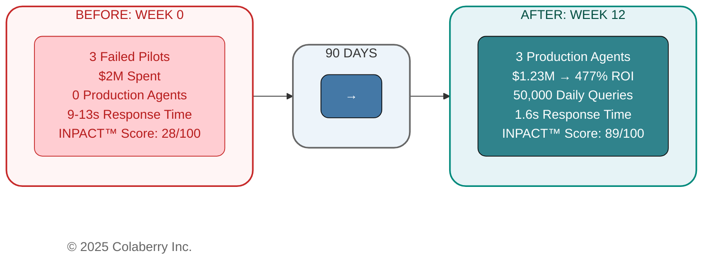
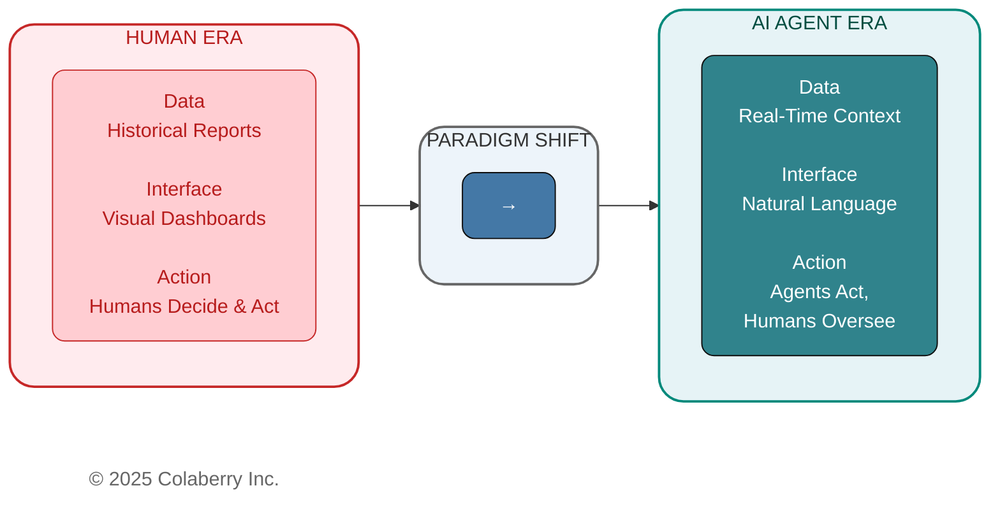
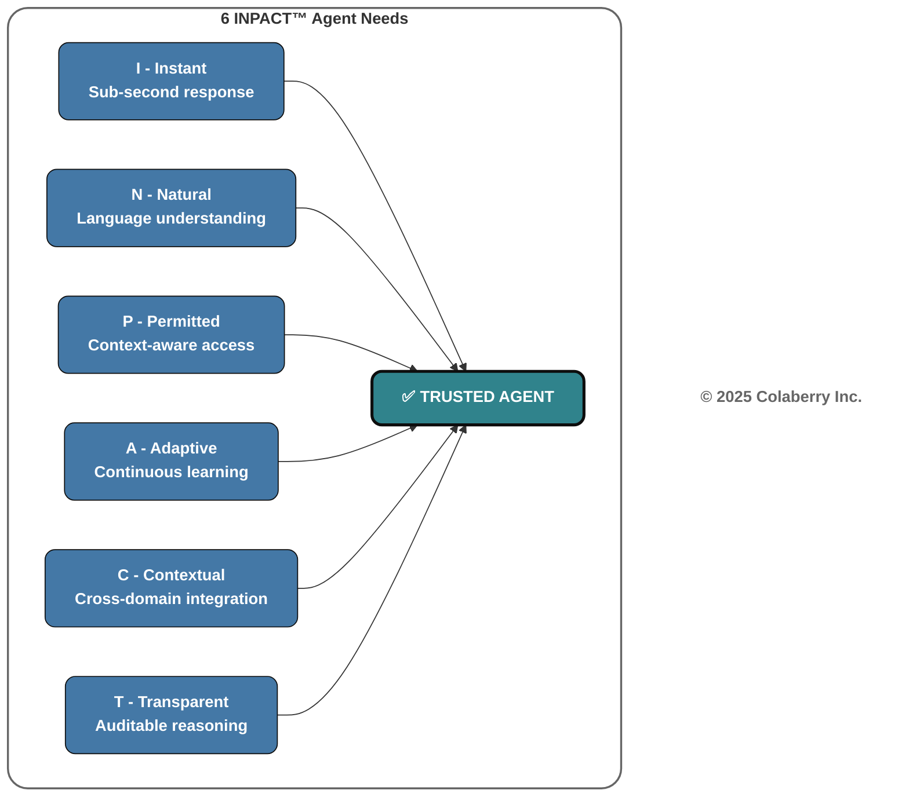
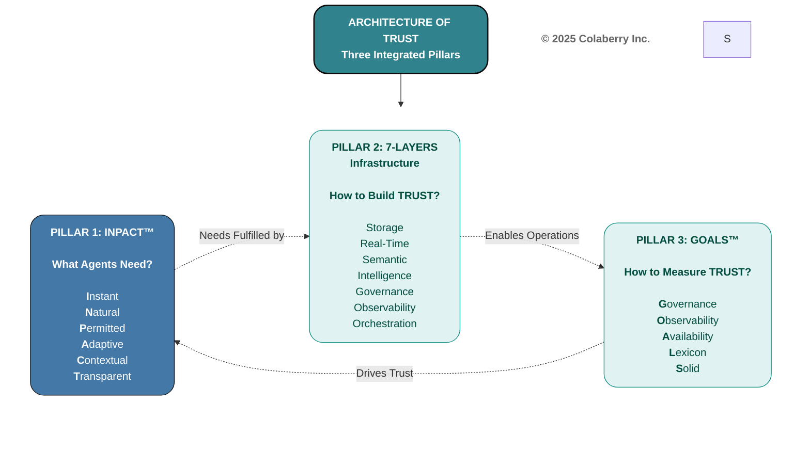

# Chapter 0: Trust Before Intelligence

**The Foundation Chapter**

*"Fix this in 90 days or we're shelving AI."*

Dr. Arun Raj didn't raise his voice. He didn't need to. The Echo Health board chair had spent fifteen years building businesses, and he'd learned that the quietest statements carry the most weight. Across the boardroom table, Sarah Cedao,Echo's CTO,understood exactly what those twelve words meant: her career was on a ninety-day countdown.

**Key Takeaway:** Understanding the Architecture of Trust - three integrated pillars that separate the 5% who succeed from the 95% who fail

---

**Figure 0.0: Echo Health Transformation - From Failed Pilots to Production Success**

## The Crisis: When $40 Billion Can't Buy Trust

In July 2025, MIT's NANDA initiative released a sobering report. After analyzing over 300 enterprise AI initiatives, interviewing 52 executives, and surveying 153 leaders, the researchers uncovered a stark reality: **95% of enterprise generative AI pilots fail to deliver measurable business value.**[1]

Not 60%. Not 75%. Ninety-five percent.[1]

Despite $30-40 billion in investment, only 5% of organizations translate AI pilots into production systems with real financial impact.

The puzzling part? The technology works. Claude Sonnet 4 and GPT-4 achieve superhuman performance on benchmark after benchmark. Vendors deliver on their promises. The code runs. The models respond. Yet pilots fail anyway.

Something fundamental is missing, and it's not in the AI.

**The answer lies in infrastructure, not intelligence.**

---
<i>
## What Trust Means in This Book

This isn't a book about whether society should trust AI. It's not about bias, ethics, or existential risk - important topics covered elsewhere.

This book is about **operational trust**: the confidence that an AI agent will access the right data, understand the question, respect permissions, explain its reasoning, and perform consistently at scale. It's the trust a physician needs before accepting an agent's recommendation. The trust a CFO needs before letting an agent process claims. The trust that turns a pilot into production.

More specifically, this book answers five questions:

- **What is trust?** What do agents need to earn user confidence?
- **How do you earn it?** By fulfilling those needs not once, but every interaction
- **How do you build it?** Through systematic architecture designed for agent-era requirements
- **How do you measure it?** With operational targets that validate trust continuously
- **How do you sustain it?** By monitoring, adapting, and reinforcing trust as systems scale

Operational trust isn't earned through promises or policies. It's earned through architecture, systems designed from the ground up to deliver what agents need. That architecture is what 95% of organizations lack.
</i>
---

Users abandon agents they can't understand regardless of technical sophistication. July 2025 research confirms it: transparency and design are the mediators of trust.[2] A global study of 48,000 people across 47 countries reinforces this reality: only 46% are willing to trust AI systems, reflecting deep tension between AI's benefits and perceived risks.[6] When users can't see how agents make decisions, research shows distrust commonly spreads to both the AI and the company behind it.[3] Technical excellence means nothing without earned trust.

The data paints an even grimmer picture. Between February and July 2025, Deloitte's TrustID® survey tracked a **64-percentage-point collapse** in trust for agentic AI systems.[4] The decline accelerated sharply in the later months. Trust in agentic AI that can act independently (not just make recommendations) plummeted **89% between May and July alone**, as employees grew uneasy with technology taking over decisions that were once theirs to make. The research, published in Harvard Business Review, shows this represents a shift from cautious optimism to widespread distrust in just months.

What caused such a dramatic shift? Organizations rushed agents into production without addressing fundamental infrastructure gaps. Users experienced the consequences firsthand: agents that couldn't access current data, couldn't understand business context, couldn't explain their decisions, and couldn't maintain consistent performance over time.

The trust collapse wasn't about the technology. Claude Sonnet 4, GPT-4, and other frontier models consistently demonstrate exceptional capabilities in controlled environments. The collapse was about the infrastructure gap between what these models can do and what enterprise systems can deliver to them.

McKinsey's State of AI 2025 report quantified this gap: **63% of organizations remain stuck in experimentation (32%) or pilot (30%) phases, unable to scale AI enterprise-wide**, a clear indicator that infrastructure isn't ready.[5] While 62% report experimenting with AI agents, McKinsey warns that "without reliable infrastructure and governance, early AI agent deployments are likely to hit performance and trust issues." The report emphasizes that agents require AI-ready data, and "most organizations simply aren't there yet."

The primary reasons for failure weren't what most expected. Not model quality. Not regulation. Not talent shortage. The core barriers were:

- **Data foundation gaps (30%):** Batch ETL that refreshes overnight. Siloed systems that can't talk to each other. BI-era schema names that no semantic layer can parse.

- **BI-era architecture (25%):** Bolting agents onto fifteen-year-old infrastructure instead of rebuilding for a different era.

- **Demo-driven development (20%):** Flashy pilots that impress executives but collapse under production load.

- **Build-from-scratch syndrome (15%):** Reinventing proven patterns instead of adopting frameworks that already work.

- **Wrong mental model (10%):** Treating agents like smarter search bars instead of autonomous actors that need fundamentally different infrastructure.

MIT's recommendation was clear: *"Create a strong data foundation. Prioritize long-term strategy over hype."*[1]

**But what does that foundation look like?**

Before we can answer that, you need to meet someone who faced this crisis head-on.

> **Your Turn:** Where does your infrastructure stand? The 15-minute INPACT™ assessment at **colaberry.ai/assessment** measures your readiness across six dimensions and generates a personalized gap analysis. Consider taking it now, your results will make the frameworks ahead immediately actionable.

---

## Meet Echo Health Systems: The $2M Wake-Up Call

Sarah Cedao stared at her screen. The INPACT™ assessment had finished processing.

28 out of 100.

She refreshed the page. Still 28.

Echo Health wasn't some struggling regional hospital scraping by on legacy systems. Four hospitals. Two dozen clinics. Twelve thousand employees. They'd won awards for data excellence twice. Sarah's team had spent fifteen years building what everyone called sophisticated infrastructure: pristine SQL Server warehouse, Azure data lake, Databricks for machine learning. Modern. Well-governed. Award-winning.

And completely inadequate for what came next.

Then came the request from Dr. Arun Raj, Echo's Board Chair. A former cardiologist who had served as CEO before transitioning to the board three years ago, Dr. Raj had a gift for cutting through technical complexity to operational reality. "Can we deploy an AI agent for patient scheduling by Q3?"

Sarah's team spent the next six months and **$2 million** building three pilot agents. What they delivered was technically functional - the code ran, the agents responded, the infrastructure didn't crash. But functional isn't the same as usable, and usable isn't the same as trusted.

1. **Care Coordination Agent**: Response times of nine to thirteen seconds, patients hung up waiting. Query understanding hovered at 40-60%, forcing constant rephrasing. No dynamic authorization meant HIPAA compliance failed: the agent couldn't distinguish between a nurse checking her patient's schedule during her shift versus at 3 AM from home.

2. **Clinical Documentation Agent**: Could only access yesterday's data, overnight batch ETL completed at 2 AM, but emergency physicians needed this hour's context. Couldn't parse medical terminology consistently: "MI" sometimes meant myocardial infarction, sometimes mitral insufficiency, sometimes triggered errors. No audit trail meant they couldn't use it for any clinical decision requiring documentation.

3. **Revenue Cycle Agent**: Siloed in billing, it could see claims but not clinical context. When claims were denied, it couldn't cross-reference diagnosis codes with visit notes to identify documentation gaps. Role-based access couldn't handle dynamic relationships. A billing specialist who transferred departments still had access to her old patients' financial data.

**All three pilots failed.** Not in the dramatic way of systems crashing or data breaches. They failed in the slow, grinding way of tools nobody wants to use. Physicians stopped asking the clinical agent questions after the fifth rephrasing attempt. Patients hung up on the care coordination agent and called the human line instead. Billing specialists manually processed claims because the agent couldn't see what they needed.

The board meeting was brutal. Six months of work, $2 million spent, zero production deployments. The CFO, Krish Yadav, asked the question everyone was thinking: "If we have a state-of-the-art data warehouse, a modern data lake, and ML infrastructure that won awards, why can't we make a simple care coordination agent work?"

Dr. Raj set a deadline: "Fix this in 90 days or we're shelving AI for another year."

Sarah knew the problem wasn't talent, her team was excellent. It wasn't the budget,$2 million proved they were willing to invest. It wasn't technology, the AI models themselves were sophisticated. The problem was architectural. Everything they'd built served human decision-makers beautifully, but agents weren't humans.

That's when Marcus Williams, Echo's Chief Data Officer, discovered the assessment framework. The 28/100 score wasn't arbitrary, it measured six specific needs their infrastructure failed to deliver:

**I - Instant (1/6):** Queries took nine to thirteen seconds. Overnight ETL meant stale data. No caching layer existed. Agent speed equals infrastructure speed and Echo's infrastructure was built for humans reviewing yesterday's reports, not agents needing this second's context.

**N - Natural (2/6):** Understanding rate of 40-60% stemmed from cryptic table names like `TBL_PT_ENC_DTL` and undocumented column relationships. No semantic layer translated "patient's last three visits" into the complex joins required across seven tables.

**P - Permitted (1/6):** Role-based access alone couldn't handle dynamic contexts. A nurse authorized to view Patient A's records during her shift shouldn't access them at 3 AM from home. HIPAA requires this contextual authorization, but Echo's fifteen-year-old permission system had no attribute-based access layer to evaluate context.

**A - Adaptive (2/6):** No feedback loops existed. When agents got queries wrong, no mechanism learned from corrections. Model performance drifted over time with no detection or retraining workflows. Quarterly manual reviews were their only "improvement" process.

**C - Contextual (3/6):** EHR integration existed but systems remained siloed. Care coordination couldn't see clinical history. Documentation couldn't access billing status. Weekly batch jobs moved data between systems, but agents needed real-time cross-domain integration.

**T - Transparent (1/6):** Incomplete audit logs violated HIPAA Section 164.312(b). When agents made recommendations, clinicians couldn't see the reasoning. When errors occurred, no trace existed to diagnose root causes. Transparency was theoretical, not operational.

Sarah realized something profound: **Her infrastructure wasn't broken. It was brilliant for the human era, but wrong for the agent era.**

Everything Echo built served human decision-makers beautifully. Data warehouses summarized history for analysts. Dashboards visualized trends for executives. Batch processes gave time for human review before action. But agents need different infrastructure. They need instant access to current data, semantic understanding of business context, dynamic authorization, continuous learning, cross-domain integration, and complete transparency.

The paradigm had shifted beneath them.

**Figure 0.1: The Infrastructure Paradigm Shift - From Human-Era BI to Agent-Era Architecture**

> **Note:** Echo Health Systems is a fictional case study created for pedagogical purposes. The organization, people, and specific metrics are composites based on patterns observed across 40+ real enterprise implementations. While Echo is fictional, the challenges, solutions, and outcomes reflect verified patterns from actual deployments in healthcare and other regulated industries.

**Sarah needed a framework. So do you.**

---

## What Trust Means in This Book

This isn't a book about whether society should trust AI. It's not about bias, ethics, or existential risk - important topics covered elsewhere.

This book is about **operational trust**: the confidence that an AI agent will access the right data, understand the question, respect permissions, explain its reasoning, and perform consistently at scale. It's the trust a physician needs before accepting an agent's recommendation. The trust a CFO needs before letting an agent process claims. The trust that turns a pilot into production.

More specifically, this book answers five questions:

- **What is trust?** What do agents need to earn user confidence?
- **How do you earn it?** By fulfilling those needs not once, but every interaction
- **How do you build it?** Through systematic architecture designed for agent-era requirements
- **How do you measure it?** With operational targets that validate trust continuously
- **How do you sustain it?** By monitoring, adapting, and reinforcing trust as systems scale

Operational trust isn't earned through promises or policies. It's earned through architecture, systems designed from the ground up to deliver what agents need. That architecture is what 95% of organizations lack.

---

## The Architecture of Trust: Three Pillars for Agent-Ready Infrastructure

Sarah didn't need another framework. She needed an **architecture**, a blueprint showing how proven patterns integrate to transform infrastructure from human-era to agent-era.

The Architecture of Trust provides that blueprint through three integrated pillars:

1. **INPACT™** - What agents need (trust requirements)
2. **7-Layer Architecture** - How to build it (technical blueprint)
3. **GOALS™** - How to measure success (operational targets)

These pillars aren't implemented independently. They reinforce each other: INPACT™ defines needs that drive trust and architecture decisions. The 7-Layer Architecture delivers infrastructure that fulfills those needs. GOALS™ validates that both remain structurally sound as the system scales to continuously reinforce trust.

Let's explore each pillar of the architecture.

### Pillar 1: INPACT™ - What Agents Need

The first pillar answers the fundamental question: What does infrastructure need to deliver for agents to earn user trust?

You just saw what happens when these needs go unmet. Echo's 28/100 score measured six specific gaps: responses too slow (Instant), queries misunderstood (Natural), permissions too rigid (Permitted), no learning from errors (Adaptive), systems siloed (Contextual), and decisions unexplainable (Transparent).

Six needs. All six must be fulfilled for agents to earn trust. When any single need goes unmet, users abandon the agent, regardless of how sophisticated the AI model is.

Chapter 2 details each INPACT™ dimension and shows how to assess your own infrastructure against them.

**Figure 0.2: INPACT™ Framework - Six Agent Needs Leading to Trust**

**Scoring:** Each dimension scores 0-6, yielding a 0-36 raw score, then normalized to 0-100 total score. Below 50 means not ready for production agents. Echo's 28 told Sarah exactly where to focus.

This is the first pillar of the Architecture of Trust defining the requirements that drive all subsequent infrastructure decisions.

### Pillar 2: 7-Layer Architecture - How to Build It

The second pillar answers: What technical infrastructure delivers these needs?

Seven layers, each serving a distinct function:

1. **Data Storage Foundation**: Hybrid multi-modal storage (relational, vector, graph)
2. **Real-Time Data Fabric**: Change data capture and streaming pipelines
3. **Semantic Layer**: Business-friendly abstractions over technical schemas
4. **Intelligence Layer**: RAG systems, LLM integration, context assembly
5. **Governance Layer**: Attribute-based access control, human-in-the-loop workflows
6. **Observability Layer**: Distributed tracing, cost tracking, audit logging
7. **Agent Orchestration**: Multi-agent coordination, feedback loops, continuous learning

Each layer maps to INPACT™ needs. Skip a layer, and the architecture collapses. Chapters 4-6 construct each layer in detail, showing exactly how Echo built theirs in 90 days.

This is the second pillar of the Architecture of Trust - the technical blueprint for fulfilling agent needs.

### Pillar 3: GOALS™ - How to Measure Success

The third pillar answers: How do you validate that the architecture remains structurally sound in production?

Infrastructure isn't built once and forgotten. It requires continuous validation across five operational dimensions:

- **G - Governance:** Policy enforcement, compliance validation, accountability
- **O - Observability:** Real-time monitoring, performance metrics, anomaly detection
- **A - Availability:** Speed and freshness for real-time agent interactions
- **L - Lexicon:** Semantic interoperability, shared ontologies, consistent terminology
- **S - Solid:** Data quality validation, schema enforcement, consistency checks

GOALS™ isn't just implemented once, it's measured continuously. Chapter 7 details each dimension and shows how Echo used them to validate their transformation.

This is the third pillar of the Architecture of Trust - the operational framework ensuring the architecture remains sound as it scales.

---

## Framework Integration: The Architecture of Trust in Action

This integration creates what we call "The Architecture of Trust" - not three separate frameworks, but three pillars of a unified structure, each reinforcing the others:

- **INPACT™ → 7-Layer:** Needs drive architecture decisions. "Instant" (I) requires Layer 2 real-time fabric. "Natural" (N) requires Layers 3-4 semantic and graph layers.

- **7-Layer → GOALS™:** Infrastructure fulfills measurement. Layer 6 observability fulfills GOALS™ monitoring. Layer 2 data fabric fulfills GOALS™ soundness validation.

- **GOALS™ → INPACT™:** Measurement validates trust. Governance (G) confirms Permitted (P) fulfillment. Observability (O) validates Transparent (T) compliance.

**Figure 0.3: The Architecture of Trust Triad - Three Pillars Working Together**

This architecture rests on three pillars working in harmony. Each pillar supports and validates the others. INPACT™ defines what agents need—.Those needs drive 7-Layer architecture decisions. The 7-Layer Architecture shows how to build infrastructure that delivers INPACT™ needs. GOALS™ validates that both pillars remain structurally sound as the system scales to production.

**The Trust Equation:**

> **TRUSTED AGENTS = INPACT™ + 7-Layer Architecture + GOALS™**

This equation captures the book's thesis. Chapters 1-2 define INPACT™ - what agents need. Chapters 3-6 construct the 7-Layer Architecture - how to build it. Chapters 7-8 establish GOALS™ - how to sustain it. By Chapter 8, Echo proves all three.

**Echo's transformation proves the architecture works:**

- **Week 0:** 28/100 score, failing infrastructure, $2M sunk cost
- **Week 4:** 42/100 - Layers 1-2 operational (storage + real-time fabric)
- **Week 7:** 67/100 - Layers 3-4 operational (semantic layer + intelligence)
- **Week 10:** 86/100 - All layers operational, three agents in production

From infrastructure chaos to agent-ready in 10 weeks. Not because they found a magic tool or hired consultants, but because they followed an architecture that integrated proven frameworks into a coherent system.

**The investment:** $1.23M (60% of their failed pilot cost)  
**The return:** 209% Year 1 ROI (477% 3-year), 10-week payback from production deployment  
**The result:** Trust earned through architecture

The remainder of this book builds this architecture, pillar by pillar:

- **Chapters 1-3** establish the foundation - why infrastructure readiness matters, what INPACT™ measures, how the BI→Agent transformation unfolds
- **Chapters 4-7** construct the second pillar layer by layer - the complete 7-Layer Architecture from storage to orchestration
- **Chapters 8-10** build the third pillar - GOALS™ operational framework, assessment methodology, and 90-day execution roadmap
- **Chapters 11-12** complete the architecture - technology selection and production operations

Sarah Cedao needed an architecture. Chapter 1 shows you why infrastructure isn't ready, setting up the need for the Architecture of Trust that transforms chaos into agent-ready infrastructure in 90 days.

---

## References

[1] Challapally, A., Pease, C., Raskar, R., & Chari, P. (2025, July). "The GenAI Divide: State of AI in Business 2025." MIT NANDA (Networked Agents and Decentralized AI). https://mlq.ai/media/quarterly_decks/v0.1_State_of_AI_in_Business_2025_Report.pdf

[2] ScienceDirect (July 2025). "The Key Role of Design and Transparency in Enhancing Trust in AI-Powered Digital Agents." *Journal of Innovation & Knowledge*. https://www.sciencedirect.com/science/article/pii/S2444569X25001155

[3] Park, K., Yoon, H.Y. (July 2025). "AI Algorithm Transparency, Pipelines for Trust Not Prisms: Mitigating General Negative Attitudes and Enhancing Trust Toward AI." *Humanities and Social Sciences Communications, Nature*. https://www.nature.com/articles/s41599-025-05116-z

[4] Deloitte (Q3 2025). "TrustID® Workforce AI Report Q3 2025." Analysis of trust collapse in agentic AI systems, February-July 2025 cohort: 64-percentage-point collapse overall, 89% drop May-July 2025. Primary report: https://d1lzrgdbvkolkd.cloudfront.net/4749_Deloitte_Trust_ID_Workforce_AI_Report_Q3_2025_3aa42f916c.pdf. Related analysis: https://action.deloitte.com/insight/4749/the-real-barrier-to-ai-adoption-isnt-technologyits-trust. Also cited in: Reichheld, A., Brodzik, C., & Youra, R. (November 6, 2025). "Workers Don't Trust AI. Here's How Companies Can Change That." *Harvard Business Review*. https://hbr.org/2025/11/workers-dont-trust-ai-heres-how-companies-can-change-that

[5] McKinsey & Company (November 2025). "The State of AI in 2025: Agents, Innovation, and Transformation." Global survey of 1,993 respondents across 105 countries. Key findings: 63% of organizations in experimentation/pilot phase (not yet scaled), 62% experimenting with AI agents, infrastructure and governance gaps limiting deployment success. https://www.mckinsey.com/capabilities/quantumblack/our-insights/the-state-of-ai

[6] Gillespie, N., Lockey, S., Ward, T., Macdade, A., & Hassed, G. (2025). "Trust, Attitudes and Use of Artificial Intelligence: A Global Study 2025." The University of Melbourne and KPMG. Global survey of 48,000+ people across 47 countries. Key finding: Only 46% of people globally are willing to trust AI systems. https://kpmg.com/xx/en/our-insights/ai-and-technology/trust-attitudes-and-use-of-ai.html

---

## Acronyms

- **ABAC:** Attribute-Based Access Control
- **CDC:** Change Data Capture
- **CDO:** Chief Data Officer
- **CFO:** Chief Financial Officer
- **CTO:** Chief Technology Officer
- **EHR:** Electronic Health Record
- **ETL:** Extract, Transform, Load
- **HBR:** Harvard Business Review
- **HIPAA:** Health Insurance Portability and Accountability Act
- **HITL:** Human-in-the-Loop
- **LLM:** Large Language Model
- **MIT:** Massachusetts Institute of Technology
- **RAG:** Retrieval-Augmented Generation
- **RBAC:** Role-Based Access Control
- **ROI:** Return on Investment

---

**© 2025 Colaberry Inc. All Rights Reserved.**  
INPACT™ and GOALS™ are trademarks of Colaberry Inc.
