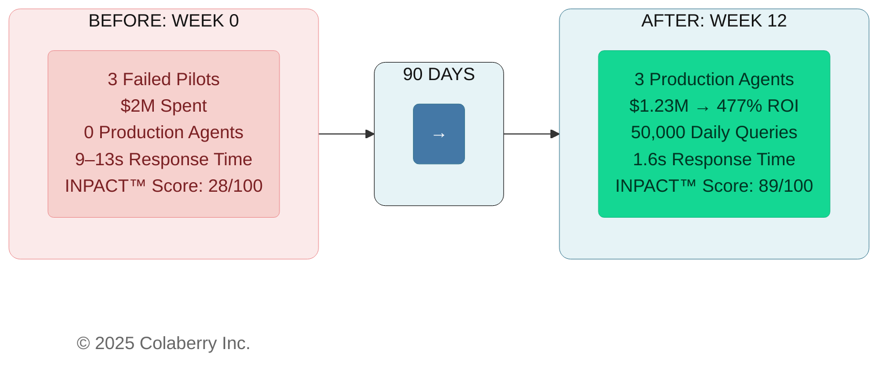
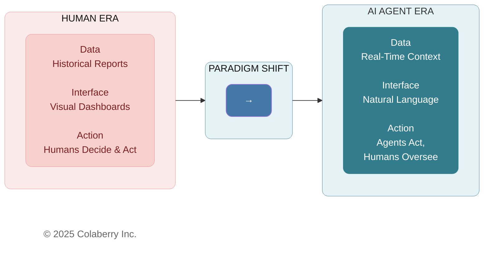
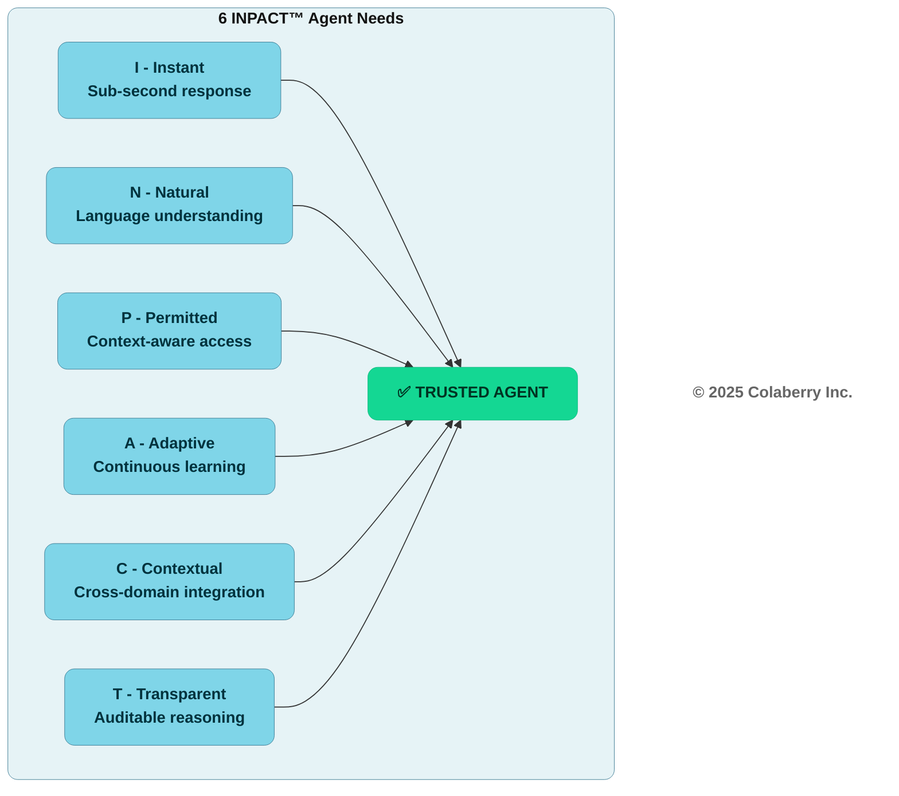
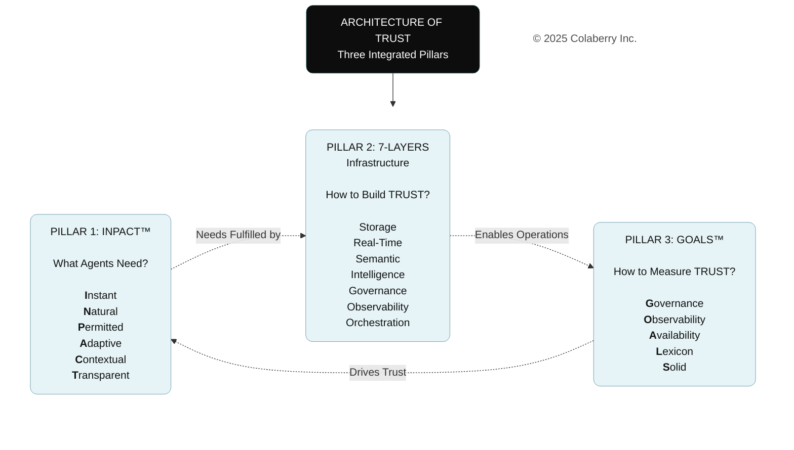

# Chapter 0: Trust Before Intelligence

**Key Takeaway:** Understanding the Architecture of Trust—three integrated pillars that separate the 5% who succeed from the 95% who fail

---

> **Key Takeaway:** *"Fix this in 90 days or we're shelving AI."* — Dr. Arun Raj, Board Chair

## The Crisis: When $40 Billion Can't Buy Trust

In July 2025, MIT's NANDA initiative released a sobering report. After analyzing over 300 enterprise AI initiatives, interviewing 52 executives, and surveying 153 leaders, the researchers uncovered a stark reality: **95% of enterprise generative AI pilots fail to deliver measurable business value.**[1]

Despite $30-40 billion in investment, only 5% of organizations successfully translate AI pilots into production systems with real financial impact. The study revealed a "GenAI Divide"—a widening gap between companies achieving success and the vast majority stuck in failed experiments.

Here's what's puzzling: AI agents are more accurate than ever. Models like Claude Sonnet 4 and GPT-4 achieve superhuman performance on many tasks. Yet pilots keep failing.

**The answer lies in trust, not technology.**

Users abandon agents they can't understand—regardless of technical sophistication. July 2025 research confirms what practitioners already know: transparency and design are the mediators of trust.[2] A global study of 48,000 people across 47 countries reinforces this reality: only 46% are willing to trust AI systems, reflecting deep tension between AI's benefits and perceived risks.[6] When users can't see how agents make decisions, research shows distrust commonly spreads to both the AI and the company behind it.[3] Technical excellence means nothing without earned trust.

The data paints an even grimmer picture. Between February and July 2025, Deloitte's TrustID® survey tracked a **64-percentage-point collapse** in trust for agentic AI systems.[4] The decline accelerated sharply in the later months—trust in agentic AI that can act independently (not just make recommendations) plummeted **89% between May and July alone**, as employees grew uneasy with technology taking over decisions that were once theirs to make. The research, published in Harvard Business Review, shows this represents a shift from cautious optimism to widespread distrust in just months.

What caused such a dramatic shift? Organizations rushed agents into production without addressing fundamental infrastructure gaps. Users experienced the consequences firsthand: agents that couldn't access current data, couldn't understand business context, couldn't explain their decisions, and couldn't maintain consistent performance over time.

The trust collapse wasn't about the technology—Claude Sonnet 4, GPT-4, and other frontier models consistently demonstrate exceptional capabilities in controlled environments. The collapse was about the infrastructure gap between what these models can do and what enterprise systems can deliver to them.

McKinsey's State of AI 2025 report quantified this gap: **63% of organizations remain stuck in experimentation (32%) or pilot (30%) phases, unable to scale AI enterprise-wide**—a clear indicator that infrastructure isn't ready.[5] While 62% report experimenting with AI agents, McKinsey warns that "without reliable infrastructure and governance, early AI agent deployments are likely to hit performance and trust issues." The report emphasizes that agents require AI-ready data, and "most organizations simply aren't there yet."

The primary reasons for failure weren't what most expected. Not model quality. Not regulation. Not talent shortage. The core barriers were:

- **Poor data foundation (30% of failures):** Batch ETL, siloed systems, cryptic schemas
- **AI as an add-on (25%):** Bolting agents onto BI-era infrastructure instead of rearchitecting
- **Demo-focused development (20%):** Flashy pilots that can't survive production realities
- **Internal custom builds (15%):** Reinventing proven patterns instead of adopting frameworks
- **Misaligned expectations (10%):** Treating agents like enhanced search instead of autonomous actors

MIT's recommendation was clear: *"Create a strong data foundation. Prioritize long-term strategy over hype."*[1]

**But what does that foundation look like?**

Before we can answer that, you need to meet someone who faced this crisis head-on.

**→ Take the assessment first:** Before reading further, measure your own readiness at **colaberry.ai/assessment** or **aiXcelerator.ai/assess**. The 15-minute assessment will show you exactly where you stand across six critical dimensions. You'll receive a personalized report identifying your gaps and a prioritized action plan. Your results will make the frameworks in this chapter immediately actionable.

---

## Meet Echo Health Systems: The $2M Wake-Up Call

Sarah Cedao, Chief Technology Officer of Echo Health Systems in Boston, stared at the assessment results on her screen: **28 out of 100**.

Twenty-eight.

Echo Health was a mid-sized regional health system with an impressive footprint: 4 hospitals, 23 outpatient clinics, 847 physicians, 12,000 employees, and 340,000 annual patient encounters. Over fifteen years, Sarah's team had built what they believed was a sophisticated data infrastructure—a pristine SQL Server data warehouse, Azure data lake, Databricks for ML workloads, and strong governance throughout. They had won awards for data excellence at each stage.

Then came the request from Dr. Arun Raj, Echo's Board Chair. A former cardiologist who had served as CEO before transitioning to the board three years ago, Dr. Raj had a gift for cutting through technical complexity to operational reality. "Can we deploy an AI agent for patient scheduling by Q3?"

Sarah's team spent the next six months and **$2 million** building three pilot agents. What they delivered was technically functional—the code ran, the agents responded, the infrastructure didn't crash. But functional isn't the same as usable, and usable isn't the same as trusted.

1. **Care Coordination Agent**: Response time 9-13 seconds (patients hung up waiting). Query understanding 40-60% (constant need for rephrasing). No dynamic authorization (HIPAA compliance failed when the agent couldn't distinguish between a nurse checking her patient's schedule during her shift versus at 3 AM from home).

2. **Clinical Documentation Agent**: Could only access data from yesterday because overnight batch ETL jobs ran at 2 AM (emergency room physicians needed current visit context, not yesterday's notes). Couldn't understand medical terminology consistently—"MI" sometimes meant myocardial infarction, sometimes meant mitral insufficiency, sometimes triggered error messages. No audit trail for regulatory review meant they couldn't use it for any clinical decisions that required documentation.

3. **Revenue Cycle Agent**: Siloed in the billing system, it could see claims but not clinical context. When claims were denied, it couldn't cross-reference diagnosis codes with actual visit notes to identify documentation gaps. Role-based access alone prevented it from dynamically authorizing access based on current patient relationships—a billing specialist who transferred to a different department still had access to her old patients' financial data.

**All three pilots failed.** Not in the dramatic way of systems crashing or data breaches—they failed in the slow, grinding way of tools nobody wants to use. Physicians stopped asking the clinical agent questions after the fifth rephrasing attempt. Patients hung up on the care coordination agent and called the human line instead. Billing specialists manually processed claims because the agent couldn't see what they needed.

The board meeting was brutal. Six months of work, $2 million spent, zero production deployments. The CFO, Krish Yadav, asked the question everyone was thinking: "If we have a state-of-the-art data warehouse, a modern data lake, and ML infrastructure that won awards, why can't we make a simple care coordination agent work?"

Dr. Raj set a deadline: "Fix this in 90 days or we're shelving AI for another year."

Sarah knew the problem wasn't talent—her team was excellent. It wasn't budget—$2 million proved they were willing to invest. It wasn't technology—the AI models themselves were sophisticated. The problem was architectural. Everything they'd built served human decision-makers beautifully, but agents weren't humans.

That's when Marcus Williams, Echo's Chief Data Officer, discovered the INPACT™ assessment framework. The 28/100 score wasn't arbitrary—it measured six specific needs their infrastructure failed to deliver:

**I - Instant (1/6):** Queries took 9-13 seconds because overnight ETL created data staleness and batch processing dominated. No caching layer existed. Agent speed equals infrastructure speed, and Echo's infrastructure was built for humans reviewing yesterday's data, not agents needing this second's context.

**N - Natural (2/6):** Understanding rate of 40-60% stemmed from cryptic table names like `TBL_PT_ENC_DTL` and undocumented column relationships. No semantic layer existed to translate "patient's last three visits" into the complex joins required across seven tables.

**P - Permitted (1/6):** Role-based access control (RBAC) alone couldn't handle dynamic contexts. A nurse authorized to view Patient A's records during her shift shouldn't access them at 3 AM from home. HIPAA requires this contextual authorization, but Echo's fifteen-year-old permission system had no ABAC layer to evaluate context.

**A - Adaptive (2/6):** No feedback loops existed. When agents got queries wrong, there was no mechanism to learn from corrections. Model performance drifted over time with no detection or retraining workflows. Quarterly manual reviews were their only "improvement" process.

**C - Contextual (3/6):** EHR integration existed but systems remained siloed. The care coordination agent couldn't see clinical history. The documentation agent couldn't access billing status. Weekly batch jobs moved data between systems—agents needed real-time cross-domain integration.

**T - Transparent (1/6):** Incomplete audit logs violated HIPAA Section 164.312(b). When agents made recommendations, clinicians couldn't see the reasoning. When errors occurred, no trace existed to diagnose root causes. Transparency was theoretical, not technical.

Sarah realized something profound: **Her infrastructure wasn't broken. It was brilliant—for the wrong era.**

Everything Echo built served human decision-makers beautifully. Data warehouses summarized history for analysts. Dashboards visualized trends for executives. Batch processes gave time for human review before action. But agents need different infrastructure—they need instant access to current data, semantic understanding of business context, dynamic authorization, continuous learning, cross-domain integration, and complete transparency.

The paradigm had shifted beneath them.

**Figure 0.1: The Infrastructure Paradigm Shift—From Human-Era BI to Agent-Era Architecture**

> **Note:** Echo Health Systems is a fictional case study created for pedagogical purposes. The organization, people, and specific metrics are composites based on patterns observed across 40+ real enterprise implementations. While Echo is fictional, the challenges, solutions, and outcomes reflect verified patterns from actual deployments in healthcare and other regulated industries.

**Sarah needed a framework. So do you.**

---

## The Architecture of Trust: Three Pillars for Agent-Ready Infrastructure

Sarah didn't need another framework. She needed an **architecture**—a comprehensive blueprint showing how frameworks integrate to transform infrastructure from human-era to agent-era.

The Architecture of Trust provides that blueprint. Like a building requires structural pillars working in harmony, agent-ready infrastructure requires three integrated pillars:

1. **INPACT™** - What agents need (trust requirements)
2. **7-Layer Architecture** - How to build it (technical blueprint)
3. **GOALS™** - How to measure success (operational targets)

These aren't separate frameworks you implement independently. They're three pillars of a unified architecture, each supporting and validating the others. INPACT™ defines the six agent needs that must be fulfilled to be trusted. The 7-Layer Architecture prescribes the technical infrastructure to fulfill those six agent needs. GOALS™ dives the operational efficiency metrics so that both pillars remain structurally sound in production.

Let's explore each pillar of the architecture.

### Pillar 1: INPACT™ - What Agents Need

The first pillar, INPACT™, answers the fundamental question: What does infrastructure need to deliver for agents to earn user trust?

Through analysis of 40+ enterprise implementations, we've identified six essential needs. When infrastructure fulfills all six, agents earn trust. When any need goes unmet, users abandon the agent—regardless of how sophisticated the AI model is.

**I - Instant:** Sub-second response times. Agents must respond at conversation speed, not batch-processing speed. Echo's 9-13 second responses killed adoption—patients hung up. The requirement isn't "fast enough"—it's "instant."

**N - Natural:** Understanding user intent in natural language. When Echo's agents understood only 40-60% of queries, users gave up after multiple rephrasings. Natural language understanding requires semantic layers that map business terminology to technical schemas.

**P - Permitted:** Dynamic, context-aware authorization. Role-based access alone is insufficient for agent scenarios. Echo's HIPAA violations occurred because their system couldn't enforce "Nurse A can access Patient X's data during her shift, but not at 3 AM from home." Agents need attribute-based access control (ABAC) layered on RBAC to evaluate context in real-time.

**A - Adaptive:** Continuous learning from feedback. Echo's quarterly reviews meant agents couldn't improve in real-time. When agents misunderstand queries or make errors, they must learn immediately—not wait months for manual retraining.

**C - Contextual:** Integration across domains and time. Echo's agents were siloed—care coordination couldn't see clinical history, documentation couldn't access billing data. Agents need unified context spanning all relevant systems and incorporating historical patterns.

**T - Transparent:** Complete audit trails and explainable decisions. Echo's incomplete logs violated HIPAA and prevented clinicians from trusting agent recommendations. Every agent action must be traceable, every decision explainable.

**Figure 0.2: INPACT™ Framework—Six Agent Needs Leading to Trust**

**Scoring:** Each dimension scores 0-6, yielding a 0-100 total score:
- **70-100:** Agent-ready infrastructure
- **50-69:** Significant gaps, pilot-ready only
- **Below 50:** Not ready for production agents

Echo's 28/100 score meant their infrastructure wasn't close to agent-ready. But the score did something more valuable—it gave Sarah and Marcus a precise diagnosis of what needed fixing.

INPACT™ isn't just a framework—it's the first pillar of the Architecture of Trust, defining the requirements that drive all subsequent infrastructure decisions.

### Pillar 2: 7-Layer Architecture - How to Build It

The second pillar, the 7-Layer Architecture, answers: What technical infrastructure delivers INPACT™ needs?

Think of these layers as the structural elements of a building. Each layer serves a distinct function, but they work together as an integrated system. Skip a layer, and the architecture collapses.

**Layer 1 - Data Storage Foundation:** Hybrid storage for different data types—relational databases for transactional data, vector databases for embeddings, graph databases for relationships. Echo had strong relational storage but no vector or graph capabilities.

**Layer 2 - Real-Time Data Fabric:** Change data capture (CDC) and streaming pipelines to eliminate batch delays. This layer delivers the "Instant" need from INPACT™. Echo's overnight ETL jobs violated this layer—agents need real-time data, not yesterday's snapshots.

**Layer 3 - Normalized Schema & Semantic Layer:** Business-friendly abstractions over technical schemas. This layer enables the "Natural" need—translating "patient's last three visits" into the SQL joins across seven tables. Echo's cryptic table names (`TBL_PT_ENC_DTL`) blocked natural language understanding.

**Layer 4 - Intelligence Layer:** RAG (Retrieval-Augmented Generation) systems, LLM integration, and context assembly. This layer connects AI models to retrieved data, enabling accurate responses grounded in enterprise information. Echo had GPT-4 access but no RAG pipeline to prevent hallucinations.

**Layer 5 - Governance Layer:** Attribute-based access control (ABAC) layered on existing role-based permissions, plus human-in-the-loop (HITL) workflows for high-risk decisions. This layer delivers the "Permitted" need from INPACT™. Echo's RBAC defined who could access what; ABAC adds when, where, and why—the contextual intelligence agents require.

**Layer 6 - Observability Layer:** Distributed tracing, LLM cost tracking, and audit logging. This layer delivers the "Transparent" need from INPACT™—complete visibility into what agents accessed, why decisions were made, and how costs accumulate. Echo's incomplete audit logs violated HIPAA transparency requirements.

**Layer 7 - Agent Orchestration:** Multi-agent coordination, feedback loops for continuous learning, and human-in-the-loop integration. This layer delivers the "Adaptive" need agents learn from corrections. Echo had no feedback mechanism at all.

Each layer maps to INPACT™ needs. Layer 2 fulfills Instant. Layer 3 fulfills Natural. Layer 4 fulfills Contextual. Layer 5 fulfills Permitted. Layer 6 fulfills Transparent. Layer 7 fulfills Adaptive. The 7-Layer Architecture is the second pillar of the Architecture of Trust—the technical blueprint for fulfilling the needs defined by the first pillar.

### Pillar 3: GOALS™ - How to Measure Success

The third pillar, GOALS™, answers: How do you validate that the architecture remains structurally sound in production?

Infrastructure isn't built once and forgotten. It requires continuous validation across five operational dimensions:

**G - Governance:** Policy enforcement, compliance validation, accountability mechanisms. In healthcare, this means HIPAA audit logs, consent management, and regulatory reporting. Echo's incomplete audit logs meant they couldn't prove HIPAA compliance—a showstopper for production deployment.

**O - Observability:** Real-time monitoring, performance metrics, anomaly detection. Echo couldn't diagnose why their agents were slow (9-13 seconds) because they had no latency monitoring across the stack. Observability makes infrastructure problems visible before users experience them.

**A - Availability:** Speed and freshness for real-time agent interactions. Echo's agents took 9-13 seconds to respond because batch ETL created stale data. Availability ensures agents retrieve and present data fast enough for natural conversation—sub-2-second responses with sub-30-second data freshness.

**L - Lexicon:** Semantic interoperability, shared ontologies, consistent terminology across domains. Echo's "MI" terminology problem (myocardial infarction vs. mitral insufficiency) stemmed from lack of standard medical ontologies. Lexicon standardization is foundational for semantic understanding.

**S - Solid:** Data quality validation, schema enforcement, consistency checks. Echo's agents occasionally accessed outdated data because their CDC pipelines had gaps. Solid data foundations ensure agents reason from accurate, current information.

GOALS™ isn't implemented once—it's measured continuously. Organizations typically start at maturity level 1-2 and progress toward level 6 over 6-18 months. The framework provides operational targets that validate both INPACT™ fulfillment (are users trusting the agents?) and 7-Layer implementation (is the infrastructure delivering what agents need?).

GOALS™ is the third pillar of the Architecture of Trust—the operational framework ensuring the architecture remains sound as it scales.

---

## Framework Integration: The Architecture of Trust in Action

This integration creates what we call "The Architecture of Trust" — not three separate frameworks, but three pillars of a unified structure, each reinforcing the others:

- **INPACT™ → 7-Layer:** Needs drive architecture decisions. "Instant" (I) requires Layer 2 real-time fabric. "Natural" (N) requires Layers 3-4 semantic and graph layers.

- **7-Layer → GOALS™:** Infrastructure fulfills measurement. Layer 6 observability fulfills GOALS™ monitoring. Layer 2 data fabric fulfills GOALS™ soundness validation.

- **GOALS™ → INPACT™:** Measurement validates trust. Governance (G) confirms Permitted (P) fulfillment. Observability (O) validates Transparent (T) compliance.

**Figure 0.3: The Architecture of Trust Triad—Three Pillars Working Together**

This architecture rests on three pillars working in harmony. Each pillar supports and validates the others. INPACT™ defines what agents need—those needs drive 7-Layer architecture decisions. The 7-Layer Architecture shows how to build infrastructure that delivers INPACT™ needs. GOALS™ validates that both pillars remain structurally sound as the system scales to production.

**The Trust Equation:**

> **TRUSTED AGENTS = INPACT™ + 7-Layer Architecture + GOALS™**

This equation captures the book's thesis. Chapters 1-2 define INPACT™—what agents need. Chapters 3-6 construct the 7-Layer Architecture—how to build it. Chapters 7-8 establish GOALS™—how to sustain it. By Chapter 8, Echo proves all three.

**Echo's transformation proves the architecture works:**

- **Week 0:** 28/100 score, failing infrastructure, $2M sunk cost
- **Week 4:** 42/100 - Layers 1-2 operational (storage + real-time fabric)
- **Week 7:** 67/100 - Layers 3-4 operational (semantic layer + intelligence)
- **Week 10:** 86/100 - All layers operational, three agents in production

From infrastructure chaos to agent-ready in 10 weeks. Not because they found a magic tool or hired consultants—because they followed an architecture that integrated proven frameworks into a coherent system.

**The investment:** $1.23M (60% of their failed pilot cost)  
**The return:** 209% Year 1 ROI (477% 3-year), 10-week payback from production deployment
**The result:** Trust earned through architecture

The remainder of this book builds this architecture, pillar by pillar:

- **Chapters 1-3** establish the foundation—why infrastructure readiness matters, what INPACT™ measures, how the BI→Agent transformation unfolds
- **Chapters 4-7** construct the second pillar layer by layer—the complete 7-Layer Architecture from storage to orchestration
- **Chapters 8-10** build the third pillar—GOALS™ operational framework, assessment methodology, and 90-day execution roadmap
- **Chapters 11-12** complete the architecture—technology selection and production operations

Sarah Cedao needed an architecture. Chapter 1 shows you why infrastructure isn't ready—setting up the need for the Architecture of Trust that transforms chaos into agent-ready infrastructure in 90 days.

---

## References

[1] Challapally, A., Pease, C., Raskar, R., & Chari, P. (2025, July). "The GenAI Divide: State of AI in Business 2025." MIT NANDA (Networked Agents and Decentralized AI). https://mlq.ai/media/quarterly_decks/v0.1_State_of_AI_in_Business_2025_Report.pdf

[2] ScienceDirect (July 2025). "The Key Role of Design and Transparency in Enhancing Trust in AI-Powered Digital Agents." *Journal of Innovation & Knowledge*. https://www.sciencedirect.com/science/article/pii/S2444569X25001155

[3] Park, K., Yoon, H.Y. (July 2025). "AI Algorithm Transparency, Pipelines for Trust Not Prisms: Mitigating General Negative Attitudes and Enhancing Trust Toward AI." *Humanities and Social Sciences Communications, Nature*. https://www.nature.com/articles/s41599-025-05116-z

[4] Deloitte (Q3 2025). "TrustID® Workforce AI Report Q3 2025." Analysis of trust collapse in agentic AI systems, February-July 2025 cohort: 64-percentage-point collapse overall, 89% drop May-July 2025. Primary report: https://d1lzrgdbvkolkd.cloudfront.net/4749_Deloitte_Trust_ID_Workforce_AI_Report_Q3_2025_3aa42f916c.pdf. Related analysis: https://action.deloitte.com/insight/4749/the-real-barrier-to-ai-adoption-isnt-technologyits-trust. Also cited in: Reichheld, A., Brodzik, C., & Youra, R. (November 6, 2025). "Workers Don't Trust AI. Here's How Companies Can Change That." *Harvard Business Review*. https://hbr.org/2025/11/workers-dont-trust-ai-heres-how-companies-can-change-that

[5] McKinsey & Company (November 2025). "The State of AI in 2025: Agents, Innovation, and Transformation." Global survey of 1,993 respondents across 105 countries. Key findings: 63% of organizations in experimentation/pilot phase (not yet scaled), 62% experimenting with AI agents, infrastructure and governance gaps limiting deployment success. https://www.mckinsey.com/capabilities/quantumblack/our-insights/the-state-of-ai

[6] Gillespie, N., Lockey, S., Ward, T., Macdade, A., & Hassed, G. (2025). "Trust, Attitudes and Use of Artificial Intelligence: A Global Study 2025." The University of Melbourne and KPMG. Global survey of 48,000+ people across 47 countries. Key finding: Only 46% of people globally are willing to trust AI systems. https://kpmg.com/xx/en/our-insights/ai-and-technology/trust-attitudes-and-use-of-ai.html

---

## Acronyms

- **ABAC:** Attribute-Based Access Control
- **CDC:** Change Data Capture
- **CDO:** Chief Data Officer
- **CFO:** Chief Financial Officer
- **CTO:** Chief Technology Officer
- **EHR:** Electronic Health Record
- **ETL:** Extract, Transform, Load
- **HBR:** Harvard Business Review
- **HIPAA:** Health Insurance Portability and Accountability Act
- **HITL:** Human-in-the-Loop
- **LLM:** Large Language Model
- **MIT:** Massachusetts Institute of Technology
- **RAG:** Retrieval-Augmented Generation
- **RBAC:** Role-Based Access Control
- **ROI:** Return on Investment

---

**© 2025 Colaberry Inc. All Rights Reserved.**  
INPACT™ and GOALS™ are trademarks of Colaberry Inc.
