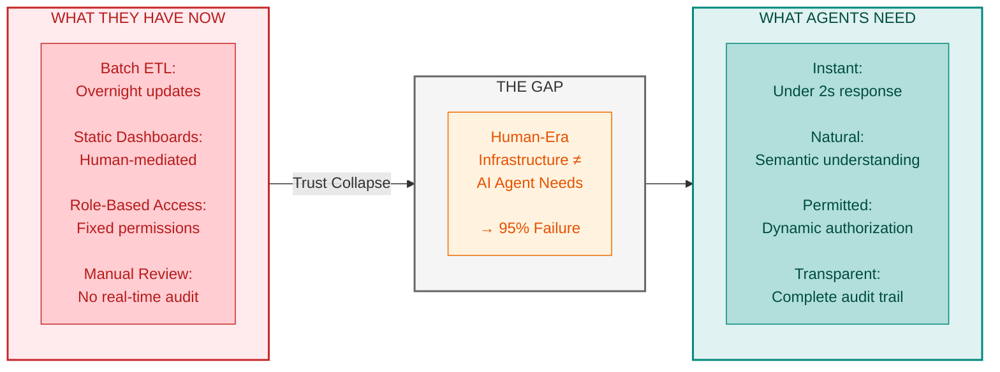
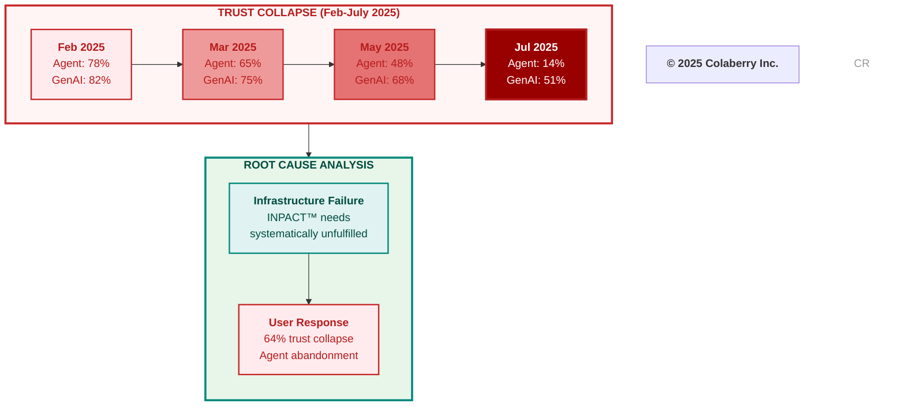
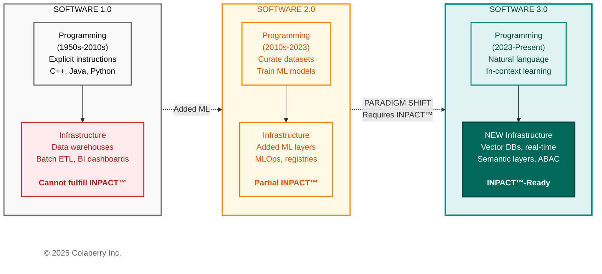
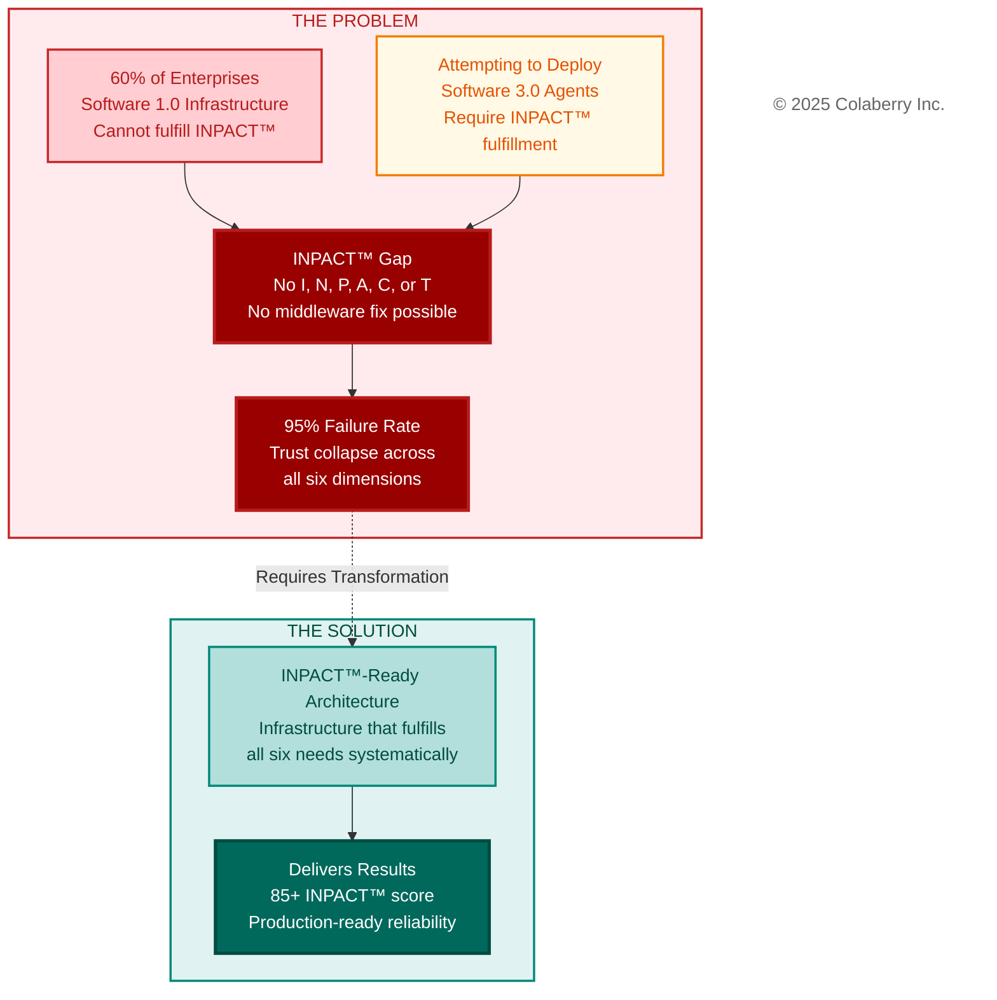
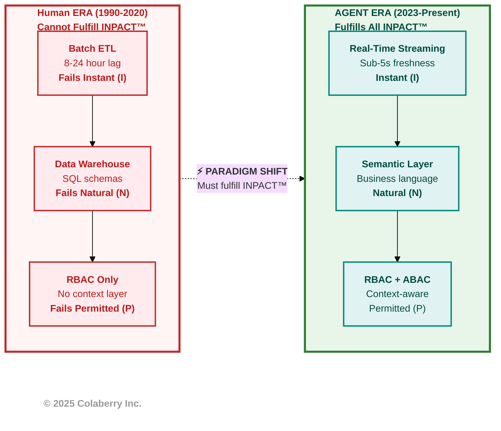
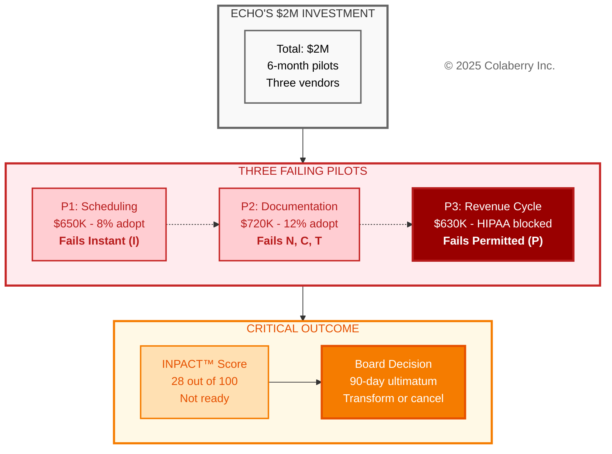

# Chapter 1: Why 95% of Agent Pilots Fail

**The Diagnosis Chapter**

---


## Maria's Impossible Appointment

*Tuesday, 10:03 AM  
Echo Health Systems, Patient Scheduling Department  
Floor 3, Building A*

Maria Rodriguez had been a care coordinator for twelve years. She'd scheduled thousands of appointments, navigated insurance nightmares that would break lesser mortals, and kept physicians' calendars running like Swiss watches through flu seasons, pandemics, and system migrations. At 10:03 AM on a Tuesday morning, she was about to discover that Echo's new $650,000 AI scheduling agent couldn't do what a phone call could accomplish in thirty seconds.

"Schedule Mrs. Johnson with Dr. Martinez for diabetes follow-up next Tuesday," she typed into the agent interface.

The cursor blinked. And blinked. And blinked.

Nine seconds passed. Maria glanced at her desk phone. In nine seconds, she could have called the scheduling desk, confirmed the slot, and moved on to the next patient. But Sarah Cedao, Echo's CTO, had been clear in the all-staff email: "Give the agent a fair chance. It's learning."

Twelve seconds. Maria's hand drifted toward the phone.

At thirteen seconds, the agent responded: **"Dr. Martinez has availability Tuesday at 2:00 PM. Confirming appointment for Mrs. Johnson."**

Maria picked up her phone. "Hey, it's Maria. Did the agent just book Mrs. Johnson with Dr. Martinez for Tuesday at 2?"

"Hold on! The scheduler's keyboard clicked. "Uh, Maria, Dr. Martinez had a 2 PM slot this morning, but it was filled at 9:47 by a walk-in. System shows it's booked."

Maria's stomach dropped. She pulled up the appointment confirmation the agent had generated. There it was: Tuesday, 2:00 PM, Dr. Martinez. **Confirmed.**

Except it wasn't.

She typed: "Cancel that appointment. The slot is already filled."

The agent took eleven seconds to respond: **"I apologize for the confusion. Let me find alternative times for Mrs. Johnson..."**

Maria closed the agent interface. She picked up her phone and scheduled Mrs. Johnson manually in forty-two seconds, the old-fashioned way that actually worked.

At 10:47 AM, she sent an email to her supervisor: "The agent is booking appointments that don't exist. I can't use it. Going back to manual scheduling."

By noon, six other coordinators had sent the same email.

By 5 PM, adoption had dropped to 8%.

**The agent wasn't lying. It was working exactly as designed - pulling data from Echo's data warehouse, which refreshed nightly at 2 AM via batch ETL. That 9:47 AM cancellation wouldn't be visible to the agent until tomorrow morning's refresh. To the agent, the 2 PM slot was still open. To Maria's patients, it was a broken promise.**

Sarah Cedao would see these emails at 6:15 PM. She wouldn't sleep that night.

This wasn't a technology failure. **This was an infrastructure failure to fulfill the first of six needs that agents require: Instant responses.** Without real-time data, even the most sophisticated AI agent becomes untrustworthy. And untrustworthy agents get abandoned regardless of how much they cost.

This $650,000 failure was just the beginning.

**Figure 1.0: The Infrastructure Gap — Why Human-Era Systems Can't Support AI Agents**



> **Key Takeaway:** The infrastructure gap IS the trust gap. Human-era systems cannot fulfill AI Agent needs.

---

## PART 1: THE HUMAN-AI TRUST GAP

### Six Systematic Failure Patterns: The INPACT™ Diagnostic

As Chapter 0 established, 95% of enterprise AI pilots fail to deliver measurable business value despite $30-40 billion in investment. Understanding the failure rate isn't enough. We need to understand **why** these projects fail and identify the systematic patterns driving trust collapse.

Analysis of failed enterprise AI deployments reveals six recurring infrastructure gaps. These patterns are so consistent across industries, vendors, and use cases that they form a diagnostic framework: **INPACT™** - six fundamental needs that agents require from infrastructure to earn user trust.

**I - Instant: Sub-2-Second Response**  
Agents need real-time answers to maintain conversational flow. When Maria Rodriguez's scheduling agent took 9-13 seconds to respond, users abandoned it not because the AI was wrong, but because slow responses break trust. Batch ETL systems that refresh overnight cannot fulfill the Instant need.

**N - Natural: Business Language Understanding**  
Agents need to understand domain terminology as humans use it. When Echo's clinical documentation agent couldn't map "diabetes follow-up" to proper diagnosis codes, physicians lost trust. Cryptic table names (FCT_PTNT_ENCT) and rigid schemas cannot fulfill the Natural need.

**P - Permitted: Context-Aware Access Control**  
Agents need dynamic permissions that adapt to context. When Echo's revenue cycle agent couldn't distinguish between "billing staff viewing claims for processing" vs. "billing staff browsing out of curiosity," compliance blocked deployment. RBAC alone cannot fulfill the Permitted need.

**A - Adaptive: Continuous Learning**  
Agents need to improve from feedback in real-time, not quarterly retraining cycles. When agents repeat the same mistakes users already corrected, trust erodes. Siloed feedback loops and manual model updates cannot fulfill the Adaptive need.

**C - Contextual: Universal Context Assembly**  
Agents need unified access across all relevant systems. When Dr. Chen's documentation agent had access to today's visit data but not eight years of A1C trends, it operated with 86% context blindness. Siloed databases cannot fulfill the Contextual need.

**T - Transparent: Observable Reasoning**  
Agents need to explain their reasoning for audit and validation. When Echo's legal team couldn't determine which data sources an agent accessed or why it made specific recommendations, compliance blocked production deployment. Black-box LLMs without reasoning traces cannot fulfill the Transparent need.

**The Diagnostic Pattern:**  
When infrastructure fails to fulfill even one INPACT™ need, trust collapses regardless of how sophisticated the AI model is. Maria's experience demonstrates this: the scheduling agent's AI was excellent, but infrastructure's failure to fulfill the Instant need drove abandonment to 8% within three weeks.

The pattern repeats across every failed pilot: **infrastructure gaps drive the 95% failure rate, not AI limitations.**

These six needs aren't arbitrary. They emerge from analyzing what users require to trust autonomous systems. Chapter 2 provides complete assessment rubrics, architectural mappings, and improvement strategies for each need. For now, these six needs serve as our diagnostic lens for understanding why Echo's three pilots failed.

The research validates this thesis.

### How Unfulfilled INPACT™ Needs Destroy Trust

Deloitte's TrustID® Workforce AI Report Q3 2025 provides compelling evidence that infrastructure failures translate directly to trust collapse.[1]

The data is stark:

**Trust in Agentic AI:** -64% collapse (Feb-July 2025)  
**Trust in GenAI:** -31% decline (same period)

**Figure 1.1: Trust Collapse Timeline (February-July 2025)**



*Source: Deloitte TrustID® Workforce AI Report Q3 2025. Trust levels tracked monthly Feb-July 2025, showing accelerated decline for agentic AI (autonomous decision-making) vs general GenAI (human-supervised generation).*

Deloitte's research tracked trust collapse month-over-month, revealing an accelerating decline between May and July as enterprises rushed agents into production without addressing INPACT™ readiness. The 2x faster collapse for autonomous agents (compared to general GenAI) validates that autonomy amplifies infrastructure failure consequences.

This trust collapse drives concrete behaviors. Research from 1Password's 2025 Annual Report reveals that **27% of knowledge workers use unauthorized AI tools** despite enterprise policies prohibiting them, while **73% of IT leaders actively encourage experimentation with AI tools** to maintain competitive innovation.[3]

**Why did agentic AI trust collapse nearly twice as fast as general GenAI?**

Because autonomy amplifies the consequences of infrastructure failures. When a GenAI tool like ChatGPT gives a wrong answer, users can catch it as they're still in the loop, reviewing outputs before action. But when an autonomous agent schedules the wrong appointment (like Maria's experience), processes an incorrect insurance claim, or routes a patient to the wrong specialist, the consequences materialize before humans intervene.

**Each need failure creates specific trust damage:**

**Instant failures** → Users abandon before results appear (nine to thirteen seconds = trust death)  
**Natural failures** → Users can't communicate needs as they get irrelevant results  
**Permitted failures** → Compliance violations, unauthorized access, regulatory risk  
**Adaptive failures** → Same mistakes repeated, no improvement over time  
**Contextual failures** → Incomplete answers, missing critical information  
**Transparent failures** → Black box decisions, no auditability, legal exposure

Deloitte identified two trust dimensions that map directly to INPACT™ needs:

**Communicative Trust: "Can I trust what it says?"**
- Fulfilled by: **Natural** (understands queries), **Contextual** (complete answers), **Transparent** (explains reasoning)
- Infrastructure requirements: Semantic layers, cross-system integration, reasoning chain observability

**Experiential Trust: "Can I trust it to do its job?"**
- Fulfilled by: **Instant** (fast responses), **Permitted** (safe access), **Adaptive** (continuous improvement)
- Infrastructure requirements: Real-time data fabric, dynamic authorization, feedback loops

When communicative trust fails, users question individual responses. When experiential trust fails, users abandon the entire system. **Both require infrastructure that fulfills INPACT™ needs.**

Trust doesn't emerge from access to AI tools. It's earned when infrastructure consistently fulfills all six needs, not through better marketing or training programs.

### Why Success Metrics Lie

The trust collapse might suggest executives are retreating from AI. **They're not**. Bain's Q3 2025 executive survey found that 74% of companies now rank AI as a top-three strategic priority, up from 60% just twelve months earlier. One in five calls it their *number one* initiative.[10]

The technology works. Eighty percent of generative AI use cases met or exceeded expectations. Forty percent of software development pilots have reached production scale.

And yet only 23% of companies can tie their AI investments to actual revenue gains or cost reductions.

This is the infrastructure gap in one statistic. Pilots succeed. Production stalls. ROI vanishes.

One additional finding matters for understanding INPACT™: companies using AI for agentic workflow automation were twice as likely to exceed goals as those using AI as a simple assistant. Agents outperform assistants, but only when the infrastructure supports them.

The problem isn't AI. The problem is what AI runs on.

### Why Most Pilots Never Reach Production

While trust collapse explains why users abandon agents, infrastructure barriers explain why pilots never reach production. According to KPMG's Q1 2025 AI Pulse Survey, **65% of enterprises are piloting AI agents—but only 11% have reached full deployment.**[4] This 54-point gap from pilot to production reveals a critical infrastructure crisis: organizations are rapidly experimenting with agents but lack the foundational capabilities to deploy them safely at scale.

The McKinsey Superagency in the Workplace report confirms this infrastructure maturity gap: while **92% of companies plan to increase AI spending** over the next three years, only **1% report their AI deployments have reached maturity.**[5] Even more telling, **47% of C-suite leaders acknowledge their organizations are moving too slowly** on AI development not because of lacking ambition, but because of infrastructure readiness barriers.[5]

The Tray.ai survey of 1,000+ IT leaders reveals the specific infrastructure barriers blocking agent deployment:[6]

- **57%** cite security and compliance as their primary concern when deploying agents
- **38%** struggle with integration complexity across their tech stack  
- **42%** report that successful agent deployment requires access to 8+ data sources
- **80%** cite data challenges (quality, access, governance) as obstacles to AI rollout
- **54%** are moving agents from prototype to production in under 3 weeks forcing speed over stability

KPMG data shows what happens when infrastructure can't keep pace with deployment pressure: **82% of leaders expect risk management to be their biggest challenge** throughout 2025, with **64% specifically citing the quality of organizational data** as a barrier to agent success.[4]

Anthropic's Economic Index research reinforces this finding: enterprises struggle most when required context is "not already centralized or digitized," requiring firms to "restructure how they organize and maintain information" and "invest in new data infrastructure" before agents can operate effectively.[7]

**These infrastructure barriers map directly to INPACT™ need failures:**

| Research Finding | Infrastructure Gap | INPACT™ Need | Required Capability |
|-----------------|-------------------|--------------|-------------------|
| 57% cite security/compliance concerns | Agents access data without contextual controls | **Permitted (P)** | Dynamic ABAC layered on RBAC |
| Integration complexity affects 38% | Agents can't access real-time data across systems | **Instant (I)** | Streaming data fabric, CDC pipelines, API orchestration |
| 42% need 8+ data sources per agent | Context scattered across silos | **Contextual (C)** | Unified data platform, cross-system semantic synthesis |
| 80% face data quality/governance challenges | Agents lack business understanding | **Natural (N)** | Semantic layer, data quality controls, business glossary |
| 82% cite risk management as top challenge | Can't explain agent decisions or control behavior | **Transparent (T)** | Reasoning chain capture, audit logs, explainability framework |
| 54% rush from prototype to production in <3 weeks | No feedback/improvement infrastructure | **Adaptive (A)** | Feedback loops, continuous learning, human-in-loop validation |
| Only 1% report AI maturity despite 92% increasing spend | Organizational readiness gaps | **Multiple** | Agent-ready architecture across all layers |

**These aren't random problems requiring bespoke solutions. They're systematic INPACT™ need fulfillment gaps requiring architectural transformation.** 

The pattern is consistent across research: Lyzr's State of AI Agents Report found that 62% of enterprises exploring AI agents "lack a clear starting point," while 64% of successful deployments focus on business process automation use cases where infrastructure already fulfills enough INPACT™ needs to enable trust.[8]

When infrastructure systematically fails to fulfill INPACT™ needs, trust collapses and pilots fail at the 95% rate we established in Chapter 0. The INPACT™ framework both diagnoses why failures happen and prescribes what successful organizations must build.

### Three Forces Accelerating the Crisis

Three convergent forces make addressing INPACT™ need fulfillment urgent:

**1. Competitive Pressure:** Early movers achieving 200%+ ROI have infrastructure that fulfills INPACT™ needs. The gap between leaders (INPACT score 85+) and laggards (INPACT score <70) widens monthly.

**2. User Expectations:** Post-ChatGPT, stakeholders expect natural language interaction at conversation speed. Infrastructure that fails the **Instant** or **Natural** needs feels broken, not modern.

**3. Talent Implications:** Top talent gravitates to organizations with agent-ready infrastructure. Engineers evaluate companies by their INPACT™ readiness scores. Losing key talent to competitors with higher scores compounds the infrastructure gap.

The window for transformation is measured in quarters, not years. Organizations that wait for infrastructure to "stabilize" will find themselves unable to compete with those who've already built INPACT™-ready foundations.

### Trust is Earned, Not Given

Many enterprises treat trust as a prerequisite: "We need trusted AI agents."

This framing reverses cause and effect.

Trust isn't something you give or require. **Trust is the outcome users experience when infrastructure consistently fulfills all six needs.**

- **Instant:** Sub-2-second responses build confidence
- **Natural:** Business language keeps users engaged
- **Permitted:** Context-aware Access satisfies regulators
- **Adaptive:** Continuous improvement builds reliability
- **Contextual:** Complete answers earn credibility
- **Transparent:** Auditable reasoning enables validation

Fulfill all six, and trust emerges. Miss even one, and join the 95% who fail.

**This infrastructure gap causes the trust crisis.**

---

The research is clear: infrastructure gaps, not AI limitations, drive the 95% failure rate. Sarah's $2M lesson comes next.

---

## PART 2: SARAH'S MOMENT OF CRISIS

### The Board Meeting - Week -2

Sarah Cedao walked into the Echo Health Systems boardroom on a Tuesday morning carrying a laptop, fifteen years of progressive IT leadership experience, and the uncomfortable knowledge that she was about to explain $2 million in failed AI investments to seven board members who expected results.

The email from Krish Yadav, Echo's CFO, had been direct: "Board wants answers on AI spend. Tuesday 9 AM. Bring metrics."

She'd spent the previous weekend preparing a presentation titled "AI Agent Pilot Program - 6 Month Review." As she connected her laptop to the boardroom screen, she knew the 23 slides of carefully worded explanations wouldn't matter. The numbers spoke for themselves, and they were bad.

Dr. Arun Raj opened the meeting without any preamble. Echo's Board Chair had spent fifteen years as a practicing cardiologist before moving into health IT leadership, then served as CEO for a decade before transitioning to the board. He had a gift for asking questions that cut through technical complexity to the heart of operational reality. "Sarah, you've been CTO for six years. Echo's data infrastructure has won awards. We've invested aggressively in analytics, data lakes and governance. Now we're investing in AI agents $2 million over six months on three pilot programs. Walk us through where we are."

Sarah advanced to slide 3: "Pilot Summary."

**Pilot 1: Patient Scheduling Agent**  
Investment: $650,000  
Status: Suspended  
Adoption: 8% (Target: 60%)

**Pilot 2: Clinical Documentation Assistant**  
Investment: $720,000  
Status: Legal review pending  
Adoption: 12% (Physicians rejecting it)

**Pilot 3: Revenue Cycle Optimization**  
Investment: $630,000  
Status: Rolled back to manual process  
ROI: Negative 15%

Silence.

Then Krish, the CFO: "Walk me through the math, Sarah. Two million dollars. Six months. Three pilots. Zero adoption. What am I missing?"

"The vendors delivered what they promised," Sarah said. "Azure OpenAI, Pinecone vector database, state-of-the-art RAG implementation. The technology works. The problem is.." she paused, choosing words carefully "..our data infrastructure wasn't ready for agents."

A board member leaned forward. "But you said Echo has excellent data infrastructure. We've invested millions over the past decade. SQL Server data warehouse. Azure data lake. Databricks. You've won data excellence awards."

"For BI and analytics," Sarah said. "We built infrastructure that's brilliant at putting information in front of humans who make decisions. But agents need something fundamentally different. They need data that's current within seconds, not hours. They need to understand business language, not just SQL. They need contextual authorization layered on their existing roles. Our infrastructure, as sophisticated as it is, wasn't designed for autonomous agents."

Dr. Raj's expression was unreadable. "Other health systems are deploying scheduling agents. Clinical documentation is being automated. Why can't we do what our competitors are doing?"

That was the question that had kept Sarah up for the past three nights. She clicked to slide 8: a diagram showing 9-13 second response times on the scheduling agent.

"Our scheduling agent takes nine to thirteen seconds to respond," she said. "Users abandon before hearing the answer. Why? Because our appointment data is refreshed overnight at 2 AM. By 10 AM, it's eight hours stale. The agent is querying yesterday's schedule. That morning cancellation at 9:47? The agent can't see it."

"Can't we just refresh more frequently?" Krish asked.

"That's treating infrastructure designed for batch processing like it can do real-time. It's like trying to turn a cargo ship into a speedboat by adding more engines. The fundamental architecture is wrong for the requirement."

She advanced through slides detailing the clinical documentation pilot. 45% accuracy on diagnoses because the agent couldn't access patient history across systems and the revenue cycle disaster, where RBAC without contextual controls led to the agent accessing records it shouldn't, triggering a legal review that nearly cost them Medicare certification.

Dr. Raj stopped her on slide 14. "I need you to be honest with me, Sarah. Can this be fixed?"

"Yes," Sarah said. "But not by upgrading what we have. We need to build agent-ready infrastructure. There's a framework, INPACT™, that defines the six needs agents must have for users to trust them. Instant responses, Natural language understanding, Permitted access, Adaptive learning, Contextual synthesis, Transparent reasoning. We're failing on all six because our infrastructure was built for humans analyzing reports, not agents taking autonomous action."

"What's that cost?" Krish asked.

Sarah had rehearsed this moment. "$1.23 million. Ten weeks. We start with a complete infrastructure assessment measuring exactly where we fall short on each INPACT™ dimension. Then we transform the architecture, layer by layer. Real-time data fabric for Instant responses. Semantic understanding for Natural queries. Dynamic authorization for Permitted access. Observable reasoning for Transparency. By week ten, we will deploy our first production agent with the foundation in place to support it."

"You want us to spend another $1.23 million after we just spent $2 million on pilots that don't work?" A board member's voice carried frustration.

"I'm asking you to invest in the infrastructure those pilots needed to succeed," Sarah said. "The alternative is continuing to fail, spending millions more on agents that will never work on BI-era foundations that weren't designed to fulfill INPACT™ needs without augmentation."

Dr. Raj looked at Sarah for a long moment. "Ninety days," he said finally. "Weekly progress metrics. If we don't see measurable improvement in infrastructure readiness by week four, we're canceling all AI initiatives and you'll need to explain to the staff why Echo is pulling back while our competitors move forward."

Sarah closed her laptop. Ninety days. Ten weeks to transform fifteen years of infrastructure decisions. She knew the first thing she needed to do: stop treating agents like a feature to add to existing systems and start building architecture that fulfilled INPACT™ needs.

As the board members filed out, Marcus Williams, Echo's Chief Data Officer, caught her arm. "You did the right thing," he said quietly. "I've been saying for months that our data warehouse can't support agents. But I need you to be right about this. Because if you're not, both our careers are over."

Sarah nodded. She'd spent the weekend studying frameworks, reading case studies, analyzing what separated the 5% who succeeded from the 95% who failed. The answer was consistent: **INPACT™ readiness.** Not better models. Not more training. Infrastructure that fulfilled the six needs agents require.

She had ten weeks to prove it.

---

## PART 3: THE INFRASTRUCTURE READINESS GAP

### PART 3A: The Paradigm Shift - Why Software 3.0 Agents Require INPACT™ Ready Infrastructure

When enterprises deploy AI agents on existing infrastructure and watch them fail, the instinct is to blame the models, the data quality, or the implementation team. But the failure runs deeper. Andrej Karpathy, former Director of AI at Tesla and co-founder of OpenAI, explains why in his June 2025 keynote at Y Combinator AI Startup School.[9] His thesis: "Software is changing quite fundamentally again. LLMs are a new kind of computer, and you program them in English."

This paradigm shift explains why the 95% pilot failure rate isn't about insufficient technology, it's about fundamental architectural mismatch. **Software 3.0 agents require infrastructure that fulfills INPACT™ needs. Software 1.0 infrastructure cannot fulfill these needs without augmentation.** The databases, warehouses, and governance systems remain essential, but they need new layers for semantic understanding, real-time access, and dynamic permissions that enable agent operation.

**The Three Paradigms of Software Development**

Karpathy identifies three distinct eras requiring different infrastructure:

**Software 1.0 (1950s-2010s):** Explicit logic in C++, Java, and Python. Enterprise data infrastructure(data warehouses, ETL pipelines, BI dashboards) was built in this era with rigid schemas, predefined queries, and deterministic outputs. **This infrastructure was designed for human-mediated decision-making, not autonomous agent operation.**

**Software 2.0 (2010s-2023):** Neural networks where "code" became learned weights. Enterprises adopted this selectively: computer vision for quality control, recommendation engines for personalization, fraud detection for security. These remained point solutions within larger Software 1.0 architectures.

**Software 3.0 (2023-present):** Large Language Models programmable in natural language. Unlike narrow task-specific models, LLMs are general-purpose reasoning engines. Karpathy observes that Software 3.0 is "eating" Software 1.0/2.0 over time, many user-facing applications will be rewritten for natural language interaction.[9] In the near term, all three paradigms coexist: enterprises maintain Software 1.0 databases and business logic, leverage Software 2.0 ML models where specialized, while adding Software 3.0 agent layers. The long-term trajectory favors agents replacing traditional interfaces, but the transformation takes years, not months.

**The INPACT™ connection:** Software 3.0 agents need infrastructure that fulfills all six INPACT™ needs. Software 1.0 infrastructure wasn't designed for these capabilities and requires augmentation across all six dimensions:

| INPACT™ Need | Software 1.0 Infrastructure | Software 3.0 Requirement |
|--------------|---------------------------|-------------------------|
| **Instant (I)** | Batch ETL, 8-24 hour lag | Real-time streaming, <2s responses |
| **Natural (N)** | Fixed SQL schemas | Semantic layers, business language |
| **Permitted (P)** | RBAC only (no context) | RBAC + contextual ABAC |
| **Adaptive (A)** | Manual updates | Continuous feedback loops |
| **Contextual (C)** | Siloed databases | Unified multi-modal platform |
| **Transparent (T)** | Basic query logs | Reasoning chain observability |

The enterprise challenge: attempting to run Software 3.0 agents on unaugmented Software 1.0 infrastructure is like running cloud-native microservices on mainframe batch processing systems without middleware. **The architectural assumptions don't align because INPACT™ needs cannot be fulfilled by legacy systems alone.** Enterprises must add agent-ready layers while preserving proven data platforms, creating a hybrid architecture where agents orchestrate across all three paradigms.

**Figure 1.2: Software Evolution and INPACT™ Needs**



Karpathy's framework shows why Software 3.0 requires fundamentally new infrastructure. **Each paradigm demands different architectural foundations because the operational requirements shifted from human-mediated to agent-autonomous. INPACT™ defines those new requirements.**[9]

---

Software 3.0 agents require fundamentally different infrastructure. The paradigm shift is real and it explains why incremental upgrades fail.

---

### PART 3B: Six Infrastructure Mismatches - The INPACT™ Readiness Gap

The paradigm shift Karpathy describes manifests as concrete architectural differences between BI-era and Agent-era infrastructure. Understanding these differences through the INPACT™ lens explains why incremental upgrades fail and transformation is required.

When enterprises attempt agent deployments on BI-era infrastructure, critical mismatches emerge **across all six INPACT™ dimensions:**

**Instant (I) - Data access patterns diverge.** Agents need sub-second semantic search. Traditional systems provide overnight batch ETL and rigid schemas. Maria Rodriguez's 9-13 second scheduling agent failed because of this mismatch.

**Natural (N) - Query interfaces clash.** Agents require natural language understanding of business concepts. Traditional systems use cryptic table names and fixed SQL schemas. When physicians say "uncontrolled DM2," agents need semantic layers to map this to diagnosis codes E11.9, E11.65, E11.22.

**Permitted (P) - Permission models clash.** Agents require dynamic, context-aware authorization. Traditional RBAC grants role-based access but lacks contextual evaluation. Echo's revenue cycle agent accessed 47 unauthorized patient records because RBAC alone couldn't enforce "minimum necessary" contextually.

**Adaptive (A) - Learning cycles transform.** Software 1.0 required code changes. Software 2.0 required model retraining. Software 3.0 enables in-context learning through interaction. But capturing that learning requires feedback loops and validation mechanisms that BI-era infrastructure never contemplated.

**Contextual (C) - Data silos prevent synthesis.** Agents need unified access across systems - clinical records, billing, scheduling, labs. Traditional systems isolate each domain in separate databases with weekly batch integrations. Incomplete context leads to incomplete (and untrustworthy) answers.

**Transparent (T) - Failure modes differ.** Traditional systems fail with exceptions and stack traces. Agents fail probabilistically retrieving irrelevant context or generating plausible but incorrect responses. Infrastructure must support reasoning chain observability, not just query logs.

**Figure 1.3: INPACT™ Need Failures Drive 95% Failure Rate**



Most enterprises attempt to deploy Software 3.0 agents on unaugmented Software 1.0 infrastructure, creating the INPACT™ gap that drives the 95% pilot failure rate. The solution isn't replacing existing systems, it's augmenting them with agent-ready layers.

### PART 3C: The Technology Works - Infrastructure Doesn't

The models work. This cannot be overstated.

**GPT-4** achieves human-level performance on professional exams (90th percentile on Uniform Bar Exam, 89th percentile on SAT Math). **Claude Sonnet 4.5** demonstrates superhuman coding ability and extended reasoning. These aren't research prototypes, they're production systems processing millions of queries daily.

**RAG infrastructure is proven.** Pinecone handles 50+ billion queries monthly. Weaviate powers semantic search for enterprises across 30+ industries. ChromaDB enables developers to build production-grade retrieval systems in days, not months. Vector search achieves sub-50ms retrieval latency at scale. Semantic chunking strategies reach 85%+ accuracy in context retrieval.

**So why the failures?**

**Because LLMs and RAG stacks don't solve INPACT™ readiness.** A brilliant reasoning engine can't overcome infrastructure that wasn't designed to fulfill the six needs agents require. The gap isn't in model capability, **it's in infrastructure's ability to fulfill INPACT™ needs.**

For enterprises, "building for agents" requires implementation at two layers:

**Interface Layer (Karpathy's focus):** How agents discover and understand available systems - llm.txt documentation, actionable API specs, clear error messages.

**Infrastructure Layer (INPACT™'s focus):** What underlying capabilities systems must provide once agents attempt to operate - real-time data access, semantic understanding, dynamic permissions, continuous learning, cross-system context, observable reasoning.

Both layers are essential. Agents need discoverability (Karpathy) AND operational infrastructure (INPACT™). The INPACT™ framework addresses the six infrastructure needs enterprises must systematically fulfill:

**I - Instant:** Semantic data layers agents can query in <2 seconds  
**N - Natural:** Business glossaries mapping "diabetes follow-up" to diagnostic codes  
**P - Permitted:** Dynamic permission systems enforcing contextual access  
**A - Adaptive:** Feedback loops enabling continuous improvement  
**C - Contextual:** Cross-system integration providing universal context  
**T - Transparent:** Reasoning chain observability enabling validation

This isn't about replacing data warehouses or abandoning BI dashboards. It's about adding the semantic understanding, dynamic access, real-time retrieval, and observable reasoning layers that fulfill INPACT™ needs, while preserving the data quality, governance controls, and audit trails that enterprises demand.

**Software 3.0 agents require INPACT™ ready infrastructure. Attempting to avoid that transformation is why 95% fail.**

**BI-Era vs. Agent-Era: INPACT™ Need Fulfillment**

**Figure 1.4: Human Era vs INPACT™Ready Agent Era**



**INPACT™ Need Fulfillment: BI Era vs Agent Era**

| INPACT™ Need | BI Era Infrastructure | Agent Era Infrastructure | Failure When Unfulfilled |
|--------------|----------------------|-------------------------|-------------------------|
| **Instant (I)** | Daily batch (8-24hr lag) | Real-time streaming (<2s) | User abandonment (9-13s = death) |
| **Natural (N)** | Fixed SQL, cryptic schemas | Semantic layer, business language | 40-60% accuracy, user frustration |
| **Permitted (P)** | RBAC only (no context) | RBAC + contextual ABAC | Compliance violations, regulatory risk |
| **Adaptive (A)** | Quarterly reviews | Continuous feedback loops | No improvement, model drift |
| **Contextual (C)** | Siloed databases | Unified multi-modal platform | Incomplete answers, low trust |
| **Transparent (T)** | Basic query logs | Reasoning chain observability | Audit failures, legal exposure |

The gap between what BI-era infrastructure delivers and what Agent-era applications need **is precisely the INPACT™ fulfillment gap.** Incremental improvements keep organizations in the failing majority. **INPACT™-focused transformation** moves them to the successful 5%.

---

## PART 4: SARAH'S $2M WAKE-UP CALL

### Three Pilots, Six INPACT™ Need Failures

After the board meeting, Sarah Cedao sat in her office reviewing the forensic analysis Marcus Williams had compiled. Three pilots. Three different vendors. Three distinct failure modes. But when Sarah looked at the root causes through the INPACT™ lens, a pattern emerged: **every failure traced to infrastructure's inability to fulfill specific INPACT™ needs.**

**Figure 1.5: Echo's Three Failing Pilots - The $2M Wake-Up Call**



The visual pattern was unmistakable: three independent failures, three different vendors, but one systematic cause - infrastructure's inability to fulfill INPACT™ needs across all six dimensions. Each pilot's detailed analysis would reveal the specific need failures that drove abandonment.

### Pilot 1: Patient Scheduling Agent -Instant (I) Need Failure (Detailed Analysis)

**Investment:** $650,000 (6-month pilot)  
**Goal:** Automate appointment booking via natural language  
**Vendor:** Leading healthcare AI platform + Azure OpenAI  
**Technology Stack:** GPT-4, Pinecone vector database, state-of-the-art RAG implementation

**The Promise:**  
Care coordinators could simply type "Schedule Mrs. Johnson with Dr. Martinez for diabetes follow-up next Tuesday" and the agent would handle slot availability, insurance verification, and confirmation - all in natural language, all in under 2 seconds.

**The Reality:**  
9-13 second response times. Users abandoned the interface before seeing results. Maria Rodriguez's experience with the 9:47 AM cancellation was typical, not exceptional.

**INPACT™ Analysis: Instant (I) Need Failure**

Sarah and Marcus traced every millisecond:
- Query parsing: 100ms (acceptable)
- Resolving "Dr. Martinez" to provider_id: 200ms (acceptable)
- Checking appointment availability: 5-8 seconds (**catastrophic Instant failure**)

Why? The `appointment_slots` table refreshed nightly at 2 AM via batch ETL:

```sql
-- The overnight ETL that killed the Instant (I) need
INSERT INTO warehouse.appointment_slots
SELECT provider_id, slot_datetime, is_available  
FROM source_ehr.schedule
WHERE load_date = DATEADD(day, -1, GETDATE());
```

By 10 AM, data was 8 hours stale. That morning cancellation at 9:47 AM? The agent couldn't see it. A double-booked appointment? Invisible until tomorrow's ETL run.

The database was cold, no indexes optimized for agent query patterns, no caching layer. Every request hit the warehouse fresh, forcing full table scans. Insurance eligibility checks added another 3-4 seconds querying the claims system's batch-refreshed tables. (See Appendix A, Section A.1 for detailed performance breakdown and infrastructure architecture.)

**Failure Impact:**
- **Adoption:** 8% after 6 months (target was 60%)
- **User Feedback:** "Faster to just call the scheduling desk"
- **Pilot Status:** Suspended
- **INPACT™ Score for Instant (I):** 2/6 (overnight ETL = 8-24 hour lag)

**The Infrastructure Gap:** Echo's BI-era batch ETL architecture **wasn't designed to fulfill the Instant (I) need** that agents require. Real-time data fabric (Layer 2 of the 7-Layer Architecture) must be added to achieve sub-2-second responses.

---

Pilot 1's failure wasn't about the AI, it was about eight-hour-old data  in a non-indexed data warehouse. Pilots 2 and 3 reveal different gaps, same root cause.

---

### Pilot 2: Clinical Documentation Assistant - Natural (N), Contextual (C), and Transparent (T) Need Failures

**Investment:** $720,000 (6-month pilot)  
**Goal:** Ambient AI transcribing physician-patient conversations into structured notes  
**Technology Stack:** Whisper API for transcription, medical LLM fine-tuned on clinical notes

**The Reality:** 40-60% accuracy on diagnosis codes. Physicians didn't trust the output and spent more time correcting notes than writing them manually.

**INPACT™ Analysis: Three Simultaneous Need Failures**

**Natural (N) Need Failure:**  
Echo's data warehouse used cryptic table names: `FCT_PTNT_ENCT`, `DIM_PRVDR_SPCLT`, `BRIDGE_DIAG_ICD10`. The agent had no semantic layer mapping "diabetes follow-up" to diagnosis codes E11.9, E11.65, E11.22. When physicians used shorthand like "uncontrolled DM2," the agent misinterpreted or missed it entirely. No business glossary. No entity resolution. No natural language mapping to technical schemas. (See Appendix A, Section A.2 for detailed schema analysis.)

**Contextual (C) Need Failure -Seven Missing Context Dimensions:**  

Agents require seven types of context to generate accurate, trustworthy outputs. Echo's infrastructure provided only **1 of 7**:

**Echo's Context Coverage: 1 of 7 (86% Context Blindness)**

- **User Context:** Missing - No physician personalization (Dr. Chen's documentation style unknown)  
- **Task Context:** Missing - Generic templates only (progress note structure not optimized for diabetes follow-up)  
- **Data Context:** Present - Current visit data available (vitals, labs from today's session)  
- **Environmental Context:** Missing - No workflow adaptation (15-minute time slots, voice recognition constraints ignored)  
- **Business Context:** Missing - No protocol integration (diabetes care protocols, reimbursement requirements missing)  
- **History Context:** Missing - No 8-year A1C trends (couldn't reference "ongoing management" or medication adjustments)  
- **Tooling Context:** Missing - Read-only, no actions (couldn't trigger prescription system or lab orders)

**Result:** The agent operated with 86% context blindness. It couldn't see 8 years of patient history, care protocols, or physician documentation patterns. When Dr. Chen said "ongoing management," the agent needed History Context to see the progression. When discussing medication adjustments, it needed Business Context to reference diabetes care protocols. (See Appendix A, Section A.3 for complete seven-context taxonomy.)

**Transparent (T) Need Failure:**  
Legal reviewed 50 AI-generated notes and couldn't determine which data sources the agent accessed, why specific diagnoses were included/excluded, whether protected health information was handled appropriately, or what the audit trail showed. With no reasoning chain visibility and no complete audit logging, legal blocked production deployment. The risk of malpractice liability was too high.

**Failure Impact:**
- **Adoption:** 12% of physicians (most rejected after initial trial)
- **Pilot Status:** Legal review pending (effectively dead)
- **INPACT™ Scores:** Natural (N): 3/6 | Contextual (C): 2/6 | Transparent (T): 2/6

**Infrastructure Gaps:** No semantic layer (Layer 3), no intelligence orchestration for cross-system context (Layer 4), no observable reasoning (Layer 6).

---

### Pilot 3: Revenue Cycle Optimization - Permitted (P) Need Failure

**Investment:** $630,000 (6-month pilot)  
**Goal:** Automated claims processing and denial management

**The Reality:** HIPAA violation in Week 4. Medicare certification nearly revoked. Pilot terminated immediately.

**What Happened:**

The agent's logic was sound: to optimize coding for one patient, it needed to compare similar cases from the same insurance plan. So it queried the database:

```sql
-- The query that violated the Permitted (P) need
SELECT patient_id, diagnosis_codes, procedure_codes, claim_amount
FROM claims_history
WHERE insurance_plan_id = 'BCBS_PPO_457'
  AND diagnosis_primary LIKE 'E11%'  -- Diabetes codes
ORDER BY claim_date DESC
LIMIT 50;
```

No treatment relationship filter. No temporal context. No "minimum necessary" enforcement. **The infrastructure had no way to enforce the Permitted (P) need dynamically.**

Forty-seven records. Fortyseven HIPAA violations. One record belonged to the adult daughter of a state legislator, a woman whose medical history had nothing to do with the query except shared insurance provider and diagnosis.

**The Permitted (P) Need Failure:**

The agent used a service account, **SVC_REVENUE_AGENT**, with database-level permissions Echo's data team had granted for BI reporting. Standard practice. But analysts were humans who applied judgment and understood HIPAA's "minimum necessary" rule. **The agent was not human, and Echo's RBAC-only infrastructure could not enforce the Permitted (P) need contextually.**

Echo's RBAC defined roles and granted the service account blanket access to claims data. What was missing: contextual evaluation of whether this access was required for this specific task, whether this user had a treatment relationship with this patient, whether this was the minimum necessary information, and whether this action required human approval.

BI-era infrastructure assumed humans would apply judgment. **Agents need infrastructure that enforces the Permitted (P) need programmatically through dynamic authorization.**

**Failure Impact:**
- **ROI:** Negative 15% (legal fees, audit costs, remediation)
- **Regulatory:** CMS warning letter, corrective action plan required
- **Pilot Status:** Terminated, rolled back to manual processing
- **INPACT™ Score for Permitted (P):** 1/6 (RBAC only, no contextual ABAC layer)

**Infrastructure Gap:** Echo's RBAC alone **wasn't designed to fulfill the Permitted (P) need** for context-aware access control. Contextual ABAC (Layer 5) must be layered on existing RBAC to enforce "minimum necessary" dynamically.

---

Three pilots. Three vendors. One systematic cause: infrastructure that couldn't fulfill what agents need.

---

### The Realization: INPACT™ Assessment Reveals Systematic Failures

Sarah stared at the failure analysis spread across three monitors. Three different failure modes. Three different vendors. But when analyzed through the INPACT™ framework, one pattern emerged: **infrastructure systematically failed to fulfill the six needs across all pilots.**

The scheduling pilot failed because infrastructure couldn't fulfill **Instant (I)**.  
The documentation pilot failed because infrastructure couldn't fulfill **Natural (N), Contextual (C), or Transparent (T)**.  
The revenue pilot failed because infrastructure couldn't fulfill **Permitted (P)**.

No amount of model tuning, prompt engineering, or vendor changes would fix problems that originated in infrastructure's inability to fulfill INPACT™ needs. Sarah had been treating infrastructure readiness as a binary checkbox: "Yes, we have a data warehouse." But readiness wasn't binary, **it was dimensional, measurable through INPACT™, and Echo scored catastrophically low.**

Sarah anxiously loaded the INPACT™ assessment tool results:

**Echo Health INPACT™ Score: 28/100**

**I - Instant:** 1/6 → Overnight ETL, 8-24 hour data lag  
**N - Natural:** 2/6 → No semantic layer, cryptic table names  
**P - Permitted:** 1/6 → RBAC only, no contextual ABAC layer  
**A - Adaptive:** 2/6 → No feedback loops, quarterly reviews only  
**C - Contextual:** 3/6 → Siloed systems, no cross-domain synthesis  
**T - Transparent:** 1/6 → Basic query logs, no reasoning chain capture

**10/36 = 28 out of 100.** Not even close to the 70+ required for agent deployments to succeed.

But the assessment also showed the path forward: **a 7-layer architecture that systematically delivers all six INPACT™ needs.** Real-time data fabric for Instant. Semantic layers for Natural. Dynamic authorization for Permitted. Feedback loops for Adaptive. Intelligence orchestration for Contextual. Observable reasoning for Transparent.

Sarah knew what she had to tell the board: **We need to build INPACT™-ready infrastructure before we deploy more agents.** Not as separate IT modernization. Not as optional improvement. As the foundation that makes agent deployments actually succeed.

The $2 million in failed pilots? That was the cost of learning that **agents require infrastructure that fulfills INPACT™ needs.** The question now was whether Echo's board would invest in the transformation before competitors with higher INPACT™ scores captured the market.

---

## PART 5: KEY TAKEAWAYS AND THE PATH FORWARD

### Three Critical Insights

**Insight 1: Trust Requires INPACT™ Need Fulfillment, Not Better AI Models**

The 95% failure rate isn't about model quality, regulatory compliance, or talent gaps. It's about **infrastructure's failure to fulfill INPACT™ needs.** Deloitte's Q3 2025 data proves it: **agentic AI trust collapsed 64% in five months** because infrastructure couldn't deliver on the six needs agents require.

Users abandon agents that don't respond instantly, understand naturally, access only permitted data, learn from feedback, synthesize complete context, and explain reasoning transparently. **No amount of model sophistication compensates for INPACT™ need failures.**

Trust isn't something you require or declare. **Trust is earned when infrastructure consistently fulfills all six INPACT™ needs.** Miss even one dimension, and join the 95% who fail.

**Insight 2: Technology Works—Infrastructure Isn't INPACT™ Ready**

GPT-4 achieves 90th percentile on the Bar Exam. Claude Sonnet 4.5 demonstrates superhuman coding ability. Pinecone handles 50+ billion monthly queries. RAG implementations achieve 85%+ retrieval accuracy.

**The models are production-ready. The infrastructure isn't INPACT™-ready.**

Attempting to run Software 3.0 agents on Software 1.0 infrastructure, batch ETL, cryptic schemas, RBAC without contextual layers, siloed systems, creates the INPACT™ gap that drives failure. Karpathy's paradigm shift is real: LLMs are fundamentally different computers that **require infrastructure fulfilling INPACT™ needs.**

**Insight 3: Six INPACT™ Need Failures Map to Six Failure Patterns**

Every failed pilot follows predictable patterns that map to INPACT™ dimensions:

**Instant failures** (9-13 second responses) → No real-time data fabric  
**Natural failures** (40-60% query precision) → No semantic layer  
**Permitted failures** (HIPAA violations) → No dynamic authorization  
**Adaptive failures** (no improvement) → No feedback loops  
**Contextual failures** (partial answers) → No cross-system synthesis; agents missing 6 of 7 context types (user, task, environmental, business, tooling, history)  
**Transparent failures** (black box reasoning) → No reasoning chain observability

These aren't random problems requiring bespoke solutions. They're systematic INPACT™ need fulfillment gaps requiring architectural transformation. **The INPACT™ framework diagnoses the needs. The 7-Layer Architecture delivers them.**

### Where Does Your Infrastructure Stand?

Echo scored 28/100. Most enterprises scoring between 25-45 are firmly in the "high risk" zone where agent deployments consistently fail.

The assessment at **colaberry.ai/assessment** measures your readiness across all six dimensions in 15 minutes. Chapter 2 provides the detailed scoring rubrics and shows Echo's path from 28 to 86.

### Bridge to Chapter 2: INPACT™ Deep Dive

Sarah Cedao left that board meeting with a directive and a deadline: 90 days to show measurable infrastructure improvement or Echo would cancel all AI initiatives.

She spent the weekend researching frameworks, reading case studies, analyzing what separated the 5% who succeeded from the 95% who failed. By Monday morning, she had her answer: **INPACT™, the framework that defines what agents need from infrastructure and how to systematically fulfill those needs.**

Not generic "AI readiness." Not checklist compliance. **A systematic approach to fulfilling the six needs that earn user trust.**

**Chapter 2 shows you the same INPACT™ framework Sarah used to transform Echo from 28/100 to 86/100 in 10 weeks.**

You'll learn:
- How to assess your current state across all six INPACT™ dimensions
- What infrastructure capabilities fulfill each need
- How to prioritize investments for maximum impact
- Why all six needs must be addressed (not just the easy ones)
- How INPACT™ drives requirements for the 7-Layer Architecture

If Sarah could do it under board pressure with a 90-day deadline and $2 million in failed pilots behind her, so can you.

**The transformation starts with understanding INPACT™ needs. Chapter 2 builds that foundation.**

---

## Chapter Summary

| Part | Content | Key Takeaway |
|------|---------|--------------|
| **Part 1** | The Human-AI Trust Gap | Six INPACT™ needs define what agents require; 64% trust collapse proves infrastructure gaps drive failure |
| **Part 2** | Sarah's Moment of Crisis | $2M in failed pilots, 90-day ultimatum, technology worked, infrastructure didn't |
| **Part 3** | The Infrastructure Readiness Gap | Software 3.0 requires INPACT™-ready infrastructure; BI-era systems cannot fulfill agent needs |
| **Part 4** | Sarah's $2M Wake-Up Call | Three pilots failed across different INPACT™ dimensions; Echo scored 28/100 |
| **Part 5** | Key Takeaways | Trust is earned through need fulfillment; the path forward requires architectural transformation |

---

## Technical References

For detailed technical analysis supporting this chapter, see:

- **Appendix A: Chapter 1 Technical Deep-Dives**
  - A.1: Performance Metrics & Infrastructure Architecture (Pilot 1)
  - A.2: Database Schema Details (Pilot 2)
  - A.3: Seven Context Types Taxonomy (Pilot 2)
  - A.4: Extended Research Methodology (Part 1)

- **Appendix B: Chapter 1 Pilot Case Studies**
  - B.1: Patient Scheduling Agent Complete Technical Analysis
  - B.2: Clinical Documentation Assistant Complete Context Analysis
  - B.3: Revenue Cycle Optimization HIPAA Violation Timeline

---

## References

[1] Deloitte. (2025). "TrustID® Workforce AI Report Q3 2025." Analysis of trust collapse in agentic AI systems, February-July 2025 cohort. https://d1lzrgdbvkolkd.cloudfront.net/4749_Deloitte_Trust_ID_Workforce_AI_Report_Q3_2025_3aa42f916c.pdf

[2] Reichheld, A., Brodzik, C., & Roesch, A. (2025). "Workers Don't Trust AI. Here's How Companies Can Change That." Harvard Business Review. https://hbr.org/2025/11/workers-dont-trust-ai-heres-how-companies-can-change-that

[3] 1Password. (2025). "2025 Annual Report: Shadow AI and Unauthorized Tool Usage in Enterprise." Survey of 5,000 knowledge workers. Referenced in: Infosecurity Magazine. https://www.infosecurity-magazine.com/news/shadow-ai-employees-use-unapproved/

[4] KPMG LLP. (2025, April 16). "KPMG AI Quarterly Pulse Survey: Q1 2025." Analysis of risk management, trust, and workforce readiness in GenAI adoption. Survey of 130 U.S.-based C-suite and business leaders from organizations with $1B+ annual revenue. https://kpmg.com/us/en/media/news/q1-ai-pulse-2025.html

[5] McKinsey & Company. (2025, January 28). "Superagency in the Workplace: Empowering People to Unlock AI's Full Potential at Work." Research based on surveys of 3,613 employees and 238 C-level executives across six countries. https://www.mckinsey.com/capabilities/tech-and-ai/our-insights/superagency-in-the-workplace-empowering-people-to-unlock-ais-full-potential-at-work

[6] Tray.ai. (2025). "The State of Enterprise AI Agents: Insights from 1,000+ IT Leaders." Survey of 1,000+ IT leaders on AI agent adoption challenges, security concerns, and infrastructure requirements. https://242774090.fs1.hubspotusercontent-na2.net/hubfs/242774090/Downloadable%20assets%20for%20website/State_of_Enterprise_AI_Agents_2025.pdf

[7] Anthropic. (2025, September). "Anthropic Economic Index Report: Uneven Geographic and Enterprise AI Adoption." Analysis of enterprise Claude API usage patterns. https://www.anthropic.com/research/anthropic-economic-index-september-2025-report

[8] Lyzr. (2025, Q3). "The State of AI Agents in Enterprise: Q3 2025." Analysis of 200,000+ user interactions and 2,000+ enterprise conversations. https://www.lyzr.ai/state-of-ai-agents/

[9] Karpathy, Andrej. (2025). "Software Is Changing (Again)." Y Combinator AI Startup School Keynote, San Francisco, June 17, 2025. https://www.ycombinator.com/library/MW-andrej-karpathy-software-is-changing-again

[10] Bain & Company. (November 2025). "Executive Survey: AI Moves from Pilots to Production." Key findings: 74% rate AI as top-three priority (vs. 60% in 2024), 80% of use cases met/exceeded expectations, only 23% tied to revenue/cost impact, agentic workflows 2x more likely to exceed goals. https://www.bain.com/insights/executive-survey-ai-moves-from-pilots-to-production/

---

## Acronyms

- **ABAC:** Attribute-Based Access Control
- **API:** Application Programming Interface
- **BI:** Business Intelligence
- **CDC:** Change Data Capture
- **CDO:** Chief Data Officer
- **CFO:** Chief Financial Officer
- **CMS:** Centers for Medicare & Medicaid Services
- **CTO:** Chief Technology Officer
- **DM2:** Diabetes Mellitus Type 2
- **EHR:** Electronic Health Record
- **ETL:** Extract, Transform, Load
- **GenAI:** Generative Artificial Intelligence
- **GPT:** Generative Pre-trained Transformer
- **HIPAA:** Health Insurance Portability and Accountability Act
- **ICD-10:** International Classification of Diseases, 10th Revision
- **LLM:** Large Language Model
- **ML:** Machine Learning
- **MLOps:** Machine Learning Operations
- **RAG:** Retrieval-Augmented Generation
- **RBAC:** Role-Based Access Control
- **ROI:** Return on Investment
- **SQL:** Structured Query Language

---

**© 2025 Colaberry Inc. All Rights Reserved.**  
INPACT™ and GOALS™ are trademarks of Colaberry Inc.
