# Chapter 2: The INPACT™ Framework

**The Six Needs Chapter**

---

*Monday morning, conference room 3B.*

Sarah Cedao pulled up the assessment dashboard. Krish Yadav, CFO, studied the numbers in silence.

**28/100.**

"We spent fifteen years building data excellence," Krish said. "How are we failing this badly?"

"We haven't failed at data excellence, we succeeded brilliantly at building the wrong thing for the agent era." Sarah advanced to the breakdown. "Our infrastructure was built for humans analyzing reports over coffee. Agents need something different. They need six things, actually. And we're failing at five of them."

This chapter explains what those six things are.

---

**Figure 2.0: The INPACT™ Framework - Six Infrastructure Needs for Agent Trust**

```mermaid

graph LR
    subgraph WITHOUT["WITHOUT INPACT™"]
        direction TB
        W1["Why is this so slow?<br/><br/>It doesn't understand me<br/><br/>Who authorized this?<br/><br/>It keeps making mistakes<br/><br/>It doesn't know context<br/><br/><b>I don't trust it</b>"]
    end
    
    subgraph TRANSFORM["TRANSFORM"]
        direction TB
        T1["→"]
    end
    
    subgraph WITH["WITH INPACT™"]
        direction TB
        I1["I — Instant<br/>Under 2 seconds<br/><br/>N — Natural<br/>97% comprehension<br/><br/>P — Permitted<br/>Dynamic access<br/><br/>A — Adaptive<br/>Learns from feedback<br/><br/>C — Contextual<br/>Cross-system aware<br/><br/>T — Transparent<br/>Full audit trail</br></br><b>I trust it</b>"]
    end
    
    WITHOUT --> TRANSFORM --> WITH
    
    style WITHOUT fill:#ffebee,stroke:#c62828,stroke-width:2px,color:#b71c1c,rx:2O,ry:20
    style TRANSFORM fill:#f5f5f5,stroke:#666666,stroke-width:2px,color:#333333,rx:2O,ry:20
    style WITH fill:#e0f2f1,stroke:#00897b,stroke-width:2px,color:#004d40,rx:2O,ry:20
    style W1 fill:#ffcdd2,stroke:#c62828,color:#b71c1c,rx:1O,ry:10
    style T1 fill:#f5f5f5,stroke:#666666,color:#333333,rx:1O,ry:10
    style I1 fill:#b2dfdb,stroke:#00897b,color:#004d40,rx:1O,ry:10
    

```

> **Key Takeaway:** Six infrastructure needs. One framework. Trust.

## PART 1: FRAMEWORK INTRODUCTION

### The Architecture of Trust: Building Pillar 1

Chapter 1 revealed why 95% of enterprise AI agent projects fail not from inadequate AI, but from infrastructure unreadiness [1]. The solution requires an integrated architecture, not bolt-on tools.

**The Architecture of Trust rests on three pillars:**

**Pillar 1: INPACT™** defines what agents need from infrastructure - six fundamental requirements that must be fulfilled for users to trust autonomous operation.

**Pillar 2: 7-Layer Architecture** specifies how to build infrastructure that delivers on those needs, from storage through orchestration.

**Pillar 3: GOALS™** establishes how to measure operational success, ensuring infrastructure continuously fulfills agent needs in production.

**Figure 2.1: The Architecture of Trust - Three Integrated Pillars**

```mermaid


graph TB
    Title["ARCHITECTURE OF TRUST<br/>Three Integrated Pillars"]
    
    subgraph PILLARS[" "]
        direction LR
        INPACT["PILLAR 1: INPACT™<br/><br/>What Agents Need?<br/><br/><b>I</b>nstant<br/><b>N</b>atural<br/><b>P</b>ermitted<br/><b>A</b>daptive<br/><b>C</b>ontextual<br/><b>T</b>ransparent"]
        
        Layers["PILLAR 2: 7-LAYERS<br/>Infrastructure<br/><br/>How to Build TRUST?<br/><br/>Storage<br/>Real-Time<br/>Semantic<br/>Intelligence<br/>Governance<br/>Observability<br/>Orchestration"]
        
        GOALS["PILLAR 3: GOALS™<br/><br/>How to Measure TRUST?<br/><br/><b>G</b>overnance<br/><b>O</b>bservability<br/><b>A</b>vailability<br/><b>L</b>exicon<br/><b>S</b>olid"]
    end
    
    Copyright["© 2025 Colaberry Inc."]
    
    Title --> PILLARS
    
    INPACT -.->|"Needs Fulfilled by"| Layers
    Layers -.->|"Enables Operations"| GOALS
    GOALS -.->|"Drives Trust"| INPACT
    
    style Title fill:#00695c,color:#ffffff,stroke:#004d40,stroke-width:3px,rx:2O,ry:20
    style PILLARS fill:none,stroke:none,rx:2O,ry:20
    style INPACT fill:#f57c00,stroke:#e65100,stroke-width:3px,color:#ffffff,rx:2O,ry:20
    style Layers fill:#e0f2f1,stroke:#00897b,stroke-width:2px,color:#004d40,rx:2O,ry:20
    style GOALS fill:#e0f2f1,stroke:#00897b,stroke-width:2px,color:#004d40,rx:2O,ry:20
    style Copyright fill:none,stroke:none,color:#666666



```

**This chapter builds Pillar 1 completely.** You'll understand what agents need, why traditional infrastructure fails each need, and how Echo Health transformed from 28/100 readiness to 86/100 in ten weeks.

### The Origin: Pattern Recognition Across Industry Deployments

INPACT™ emerged from analyzing patterns across production agent deployments in healthcare, life sciences, utility, finance, retail, and manufacturing. Chapter 1 showed you **why** agents fail by infrastructure gaps, not AI quality. But **which** gaps matter most? How do you diagnose them systematically?

Three patterns emerged consistently:

**The Accuracy Paradox:** Scheduling agents achieving 95% accuracy, yet abandoned by users. Why? Response times of 9-13 seconds destroyed conversational experience.

**The Efficiency Paradox:** Documentation agents cutting transcription time 80%, yet sitting unused. Why? Static permissions required two-week provisioning, blocking clinical workflows.

**The Trust Paradox:** Recommendation engines providing evidence-based guidance, yet overridden 70% of the time. Why? Opaque reasoning gave physicians no basis for trust.

When we analyzed these failures, six needs emerged. When any single need went unfulfilled, trust collapsed. When all six were addressed systematically, adoption soared. These six needs became INPACT™.

---

### The Tony Robbins Parallel: From Human Needs to Agent Needs

Tony Robbins built an empire on one insight: humans have six core needs - significance, variety, certainty, growth, connection, and contribution. When fulfilled, humans flourish. When neglected, people stagnate.

**AI agents follow the same pattern.** They don't need psychological fulfillment - they need architectural fulfillment. Agent six core needs - instant, natural, permitted, adaptive, contextual, and transparent. When fulfilled, Agents earn trust. When neglected, agents are abandoned.

**Figure 2.2: Human Needs to Agent Needs Parallel**

```mermaid
graph TB
    TITLE["<b>HUMAN (Tony Robbins) → <br/>INPACT™ AGENT PARALLEL</b>"]
    
    TITLE --> ROW
    
    subgraph ROW[" "]
        direction LR
        
        subgraph HUMAN["<b>6 HUMAN NEEDS </b>"]
            direction TB
            H1["<b>Significance</b><br/>Importance<br/>Validation"]
            H2["<b>Variety</b><br/>Challenge<br/>Novelty"]
            H3["<b>Certainty</b><br/>Predictability<br/>Safety"]
            H4["<b>Growth</b><br/>Progress<br/>Development"]
            H5["<b>Connection</b><br/>Belonging<br/>Relationships"]
            H6["<b>Contribution</b><br/>Purpose<br/>Meaning"]
        end
        
        subgraph AGENT["<b>6 AGENT NEEDS</b>"]
            direction TB
            A1["<b>I - Instant</b><br/>Real-time data<br/>Sub-2s response"]
            A2["<b>N - Natural</b><br/>Business language<br/>Understanding"]
            A3["<b>P - Permitted</b><br/>Authorization<br/>Security boundaries"]
            A4["<b>A - Adaptive</b><br/>Continuous learning<br/>Improvement"]
            A5["<b>C - Contextual</b><br/>Cross-system<br/>Integration"]
            A6["<b>T - Transparent</b><br/>Explainable value<br/>Delivery"]
        end
        
        TRUST["<b>✅ TRUSTED AGENT</b><br/><b>Infrastructure Fulfills <br/>All 6 Needs</b>"]
        
        H1 -.->|<b>Parallels</b>| A1
        H2 -.->|<b>Parallels</b>| A2
        H3 -.->|<b>Parallels</b>| A3
        H4 -.->|<b>Parallels</b>| A4
        H5 -.->|<b>Parallels</b>| A5
        H6 -.->|<b>Parallels</b>| A6
        
        A1 --> TRUST
        A2 --> TRUST
        A3 --> TRUST
        A4 --> TRUST
        A5 --> TRUST
        A6 --> TRUST
    end
    
    COPYRIGHT["<b>© 2025 Colaberry Inc.</b>"]
    
    style TITLE fill:#f9f9f9,stroke:#666666,stroke-width:2px,color:#000000,rx:2O,ry:20
    
    style ROW fill:#ffffff,stroke:none
    
    style HUMAN fill:#fff9e6,stroke:#f57c00,stroke-width:3px,color:#e65100,rx:2O,ry:20
    style H1 fill:#ffffff,stroke:#f57c00,stroke-width:2px,color:#e65100,rx:1O,ry:10
    style H2 fill:#ffffff,stroke:#f57c00,stroke-width:2px,color:#e65100,rx:1O,ry:10
    style H3 fill:#ffffff,stroke:#f57c00,stroke-width:2px,color:#e65100,rx:1O,ry:10
    style H4 fill:#ffffff,stroke:#f57c00,stroke-width:2px,color:#e65100,rx:1O,ry:10
    style H5 fill:#ffffff,stroke:#f57c00,stroke-width:2px,color:#e65100,rx:1O,ry:10
    style H6 fill:#ffffff,stroke:#f57c00,stroke-width:2px,color:#e65100,rx:1O,ry:10
    
    style AGENT fill:#e0f2f1,stroke:#00897b,stroke-width:3px,color:#004d40,rx:2O,ry:20
    style A1 fill:#ffffff,stroke:#00897b,stroke-width:2px,color:#004d40,rx:1O,ry:10
    style A2 fill:#ffffff,stroke:#00897b,stroke-width:2px,color:#004d40,rx:1O,ry:10
    style A3 fill:#ffffff,stroke:#00897b,stroke-width:2px,color:#004d40,rx:1O,ry:10
    style A4 fill:#ffffff,stroke:#00897b,stroke-width:2px,color:#004d40,rx:1O,ry:10
    style A5 fill:#ffffff,stroke:#00897b,stroke-width:2px,color:#004d40,rx:1O,ry:10
    style A6 fill:#ffffff,stroke:#00897b,stroke-width:2px,color:#004d40,rx:1O,ry:10
    
    style TRUST fill:#00695c,color:#ffffff,stroke:#004d40,stroke-width:3px,rx:2O,ry:20
    
    style COPYRIGHT fill:#ffffff,stroke:none,color:#666666
```

**The parallel mappings:**

**Significance** (importance, validation) → **Instant**: When someone is significant, they receive immediate attention. VIP treatment means instant response. An agent taking 10+ seconds to respond signals "you're not important enough." Sub-2-second responses validate user significance through immediate, attentive service.

**Variety** (challenge, novelty, diversity) → **Natural**: Humans need variety in how they communicate - casual and formal, terse and detailed, spoken and written. Natural language understanding provides this variety, allowing agents to comprehend the rich diversity of human expression without rigid syntax.

**Certainty** (safety, predictability) → **Permitted**: Agents need secure authorization boundaries to operate safely. Just as humans require certainty through stable, secure environments, agents require dynamic permission systems that establish clear boundaries while adapting to context.

**Growth** (progress, development) → **Adaptive**: Humans require continuous growth and development. Agents mirror this through adaptive learning by incorporating feedback, detecting drift, and continuously improving performance over time.

**Connection** (belonging, relationships) → **Contextual**: Just as humans need connection through relationships that see them completely, agents need contextual awareness across all systems for seeing the full picture, not fragmented silos.

**Contribution** (purpose, meaning) → **Transparent**: Humans need to contribute value they can see and understand. Agents fulfill this through transparent reasoning by showing exactly how they deliver value, with explainable decisions and complete audit trails.

**The crucial difference:** Humans advocate for their own needs. When humans need certainty, they ask for clarification. When they need connection, they build relationships.

**Agents cannot advocate for themselves.** They depend entirely on infrastructure to fulfill their needs. An agent can't request real-time data when batch ETL is all that's available. It can't negotiate for dynamic permissions when RBAC alone is all that exists.

### Trust = Earned Outcome, Not Built Component

Traditional enterprise software could require trust: "You must use this ERP system." Users had no alternative. Distrust meant workarounds, but the system remained in use because it was mandated.

**AI agents cannot operate on mandated trust.** When users distrust an agent, they don't work around it, they abandon it entirely. Echo Health proved this: within three weeks, adoption dropped from 74% to 8% after repeated failures.

**Trust emerges when infrastructure consistently fulfills needs:**

**Figure 2.3: Six INPACT™ Needs Fulfilled**

```mermaid
graph TB
    subgraph BOX["<b>INPACT™ AGENT</b>"]
        I["<b>I - Instant</b><br/><b>Users trust responses<br/> are current</b>"]
        N["<b>N - Natural</b><br/><b>Users trust agent<br/> understands</b>"]
        P["<b>P - Permitted</b><br/><b>Users trust agent<br/> respects boundaries</b>"]
        A["<b>A - Adaptive</b><br/><b>Users trust agent<br/> learns & improves</b>"]
        C["<b>C - Contextual</b><br/><b>Users trust agent<br/> sees complete picture</b>"]
        T["<b>T - Transparent</b><br/><b>Users trust agent's<br/> reasoning</b>"]
        
        TRUST["<b>✅ TRUSTED AGENT</b><br/><b>Users<br/> Collaborate & Delegate<br/> with Confidence</b>"]
        
        I --> TRUST
        N --> TRUST
        P --> TRUST
        A --> TRUST
        C --> TRUST
        T --> TRUST
    end
    
    COPYRIGHT["<b>© 2025 Colaberry Inc.</b>"]
    
    style BOX fill:#f0fff0,stroke:#00897b,stroke-width:3px,rx:2O,ry:20
    style I fill:#e0f2f1,stroke:#00897b,stroke-width:2px,color:#004d40,rx:1O,ry:10
    style N fill:#e0f2f1,stroke:#00897b,stroke-width:2px,color:#004d40,rx:1O,ry:10
    style P fill:#e0f2f1,stroke:#00897b,stroke-width:2px,color:#004d40,rx:1O,ry:10
    style A fill:#e0f2f1,stroke:#00897b,stroke-width:2px,color:#004d40,rx:1O,ry:10
    style C fill:#e0f2f1,stroke:#00897b,stroke-width:2px,color:#004d40,rx:1O,ry:10
    style T fill:#e0f2f1,stroke:#00897b,stroke-width:2px,color:#004d40,rx:1O,ry:10
    
    style TRUST fill:#00695c,color:#ffffff,stroke:#004d40,stroke-width:3px,rx:2O,ry:20
    
    style COPYRIGHT fill:none,stroke:none,color:#666666
```

**When even one need fails, trust collapses across all dimensions.** Agents operate on binary trust. Users either trust enough to delegate, or they don't trust at all. Echo's scheduling agent achieved 95% accuracy but took 9-13 seconds to respond. Users abandoned it. Accuracy didn't matter when speed destroyed conversational experience.

### INPACT™ as Requirements Definition

This chapter establishes INPACT™ as the first and foundational pillar of the Architecture of Trust. Every architectural decision in Chapters 4-7 flows from these six needs.

**The framework provides:**

**Diagnostic lens** for assessing infrastructure readiness across six dimensions.

**Requirements definition** showing what capabilities infrastructure must deliver, mapped to architectural layers.

**Prioritization framework** helping leaders decide which needs to address first based on business impact and dependencies.

**Validation criteria** establishing clear thresholds of 1-6 scoring scale per dimension, 86/100 minimum for agent readiness.

Every one of the six needs are interconnected through multiple layers of architecture. For example, Instant (I) requires real-time streaming, query optimization, and caching, Natural (N) demands semantic layers, embedding models, and vector databases. No layer solves any need alone.

### How INPACT™ Assessment Works

INPACT™ assessment quantifies infrastructure readiness using a 1-6 scoring system per dimension, creating a 36-point maximum (6 dimensions × 6 points). Convert to 100-point scale: (score/36) × 100.

**Figure 2.4: INPACT™ Assessment Methodology - From Dimensions to Decision**

```mermaid
graph TB
    TITLE["<b>INPACT™ ASSESSMENT<br/> METHODOLOGY</b>"]
    
    ASSESS["<b>STEP 1: ASSESS<br/> 6 DIMENSIONS</b><br/><b>I · N · P · A · C · T</b><br/><b>(Score each 1-6 points)</br>Max points: 36</b>"]
    
    CALC["<b>STEP 2: CALCULATE SCORE:</b><br/><b>Add 6 dimensions points</b><br/><b>Convert: (score/36) × 100</b>"]
    
    DECISION{"<b>STEP 3: EVALUATE</b><br/><b>Score ≥ 86/100?</b>"}
    
    READY["<b>✅ AGENT-READY</b><br/><b>Production approved</b><br/><b>Sustainable adoption</b>"]
    
    GAPS["<b>⚠️ GAPS FOUND</b><br/><b>Roadmap needed</b><br/><b>High risk</b>"]
    
    COPYRIGHT["<b>© 2025 Colaberry Inc.</b>"]
    
    TITLE --> ASSESS --> CALC --> DECISION
    DECISION -->|<b>YES</b>| READY
    DECISION -->|<b>NO</b>| GAPS
    
    style TITLE fill:#f9f9f9,stroke:#666666,stroke-width:2px,color:#000000,rx:2O,ry:20
    style ASSESS fill:#e0f2f1,stroke:#00897b,stroke-width:2px,color:#004d40,rx:2O,ry:20
    style CALC fill:#fff9e6,stroke:#f57c00,stroke-width:2px,color:#e65100,rx:2O,ry:20
    style DECISION fill:#fff9e6,stroke:#f57c00,stroke-width:2px,color:#e65100,rx:2O,ry:20
    style READY fill:#00695c,color:#ffffff,stroke:#004d40,stroke-width:3px,rx:2O,ry:20
    style GAPS fill:#990000,color:#ffffff,stroke:#b71c1c,stroke-width:3px,rx:2O,ry:20
    style COPYRIGHT fill:#ffffff,stroke:none,color:#666666
```

**The six INPACT™ dimensions assessed:**

- **I (Instant):** Real-time data delivery, sub-2-second response times
- **N (Natural):** Semantic understanding of business language
- **P (Permitted):** Dynamic authorization with attribute-based policies
- **A (Adaptive):** Continuous learning through feedback loops
- **C (Contextual):** Cross-system integration for complete picture
- **T (Transparent):** Audit trails and explainable reasoning

**Scoring methodology:** Infrastructure blocks agent deployment. Major capability gaps would cause compliance failures or user abandonment.

**Score 3 (Moderate):** Pilot-appropriate but not production-ready. Requires significant improvement.

**Score 4 (Adequate):** Core capabilities functional. Production-acceptable with room for optimization.

**Score 5-6 (Strong/Excellent):** Solid production capability meeting or exceeding requirements. Best-in-class at level 6.

**86/100 Threshold:** Industry analysis shows 86/100 (~31/36 points) as minimum for production readiness [15,16]. Below 86: high abandonment risk. Above 86: sustainable adoption, manageable risk, continuous improvement foundation.

**Practical Application:** INPACT™ assessment takes 2-4 hours with infrastructure and data teams. Output: current score per dimension, gap analysis, prioritized roadmap. Tool available at colaberry.ai/assessment.

### Echo Health's Reality Check

Sarah's dashboard revealed the brutal truth - dimension by dimension:

**I (Instant): 1/6** (critical - batch only)  
**N (Natural): 2/6** (weak - minimal semantic)  
**P (Permitted): 1/6** (critical - RBAC only)  
**A (Adaptive): 2/6** (weak - no feedback)  
**C (Contextual): 3/6** (moderate - EHR integration exists but limited)  
**T (Transparent): 1/6** (critical - no audit trails)  

**Total: 10/36 = 28% → 28/100**

Five critical gaps. One moderate strength. A 21-point climb to reach the 86/100 production threshold.

The transformation roadmap began there.

**Figure 2.5: Echo Health's INPACT™ Transformation - 28/100 to 86/100 in 10 Weeks**

```mermaid
graph TB
    TITLE["<b>ECHO HEALTH'S<br/>INFRASTRUCTURE<br/>TRANSFORMATION</b>"]
    
    TITLE --> BEFORE
    
    subgraph BEFORE["<b>WEEK 0: SCORE =28/100</b>"]
        B_SCORE["<b>Overall Score: 28/100</b><br/><b>(10 out of 36 points)</b>"]
        
        B_DIMS["<b>Dimension Breakdown:</b><br/><b>I=1/6 🔴 | N=2/6 🔴 </b><br/><b>P=1/6 🔴 | A=2/6 🔴</b><br/> C=3/6 🟡 | T=1/6 🔴</b>"]
        
        B_STATUS["<b>Not Production Ready</b><br/><b>• 5 critical gaps </b><br/><b>• Compliance risk</b><br/><b>• Cannot proceed to prod</b>"]
        
        B_SCORE --> B_DIMS
        B_DIMS --> B_STATUS
    end
    
    BEFORE --> TRANSFORM["<b>90-DAY TRANSFORMATION<br/>ROADMAP</b><br/><b>Investment: $1.23M </b><br/><b> Timeline: 10 weeks</b><br/><b>Sequence: </b><br/><b>I → N+P → C → A+T</b>"]
    
    TRANSFORM --> AFTER
    
    subgraph AFTER["<b>WEEK 10: SCORE = 86/100</b>"]
        A_SCORE["<b>Overall Score: 86/100</b><br/><b>(31 out of 36 points)</b>"]
        
        A_DIMS["<b>Dimension Breakdown:</b><br/><b>I=5/6 ✅ | N=5/6 ✅ </b><br/><b> P=5/6 ✅ | A=5/6 ✅</b><br/><b>C=6/6 ✅ | T=5/6 ✅</b>"]
        
A_STATUS["<b>Production-Ready</b><br/><b>• All dimensions ≥5/6 </b><br/><b>• ROI: 209% Year 1 </b><br/><b>• Payback: 10 weeks</b>"]
        
        A_SCORE --> A_DIMS
        A_DIMS --> A_STATUS
    end
    
    COPYRIGHT["<b>© 2025 Colaberry Inc.</b>"]
    
    style TITLE fill:#f9f9f9,stroke:#666666,stroke-width:2px,color:#000000,rx:2O,ry:20
    
    style BEFORE fill:#fff5f5,stroke:#c62828,stroke-width:2px,color:#b71c1c,rx:2O,ry:20
    style B_SCORE fill:#990000,color:#ffffff,stroke:#b71c1c,stroke-width:3px,rx:1O,ry:10
    style B_DIMS fill:#ffebee,stroke:#c62828,stroke-width:2px,color:#b71c1c,rx:1O,ry:10
    style B_STATUS fill:#ffebee,stroke:#c62828,stroke-width:2px,color:#b71c1c,rx:1O,ry:10
    
    style TRANSFORM fill:#fff9e6,stroke:#f57c00,stroke-width:2px,color:#e65100,rx:2O,ry:20
    
    style AFTER fill:#f0fff0,stroke:#00897b,stroke-width:2px,color:#004d40,rx:2O,ry:20
    style A_SCORE fill:#00695c,color:#ffffff,stroke:#004d40,stroke-width:3px,rx:1O,ry:10
    style A_DIMS fill:#e0f2f1,stroke:#00897b,stroke-width:2px,color:#004d40,rx:1O,ry:10
    style A_STATUS fill:#e0f2f1,stroke:#00897b,stroke-width:2px,color:#004d40,rx:1O,ry:10
    
    style COPYRIGHT fill:none,stroke:none,color:#666666
```

---

## PART 2: ECHO'S DISCOVERY AND PRIORITIZATION

### The Assessment That Changed Everything

Sarah's assessment made the rounds. The board wanted answers. Dr. Arun Raj scheduled a follow-up.

"We built excellence for the human era," Sarah explained. "Overnight batch processing, visual dashboards, analysts who could wait hours for reports. That infrastructure is sophisticated, well-governed, and completely wrong for agents needing sub-second responses to natural language questions with dynamic authorization."

### Two Critical Dimensions Explained

**Instant (I): Why Score 1/6 Kills Adoption**

Sarah's first agent prototype took 9-13 seconds to respond. The team traced two distinct problems:

**Problem 1: Slow Queries (5-8 seconds)**
The data warehouse was optimized for analyst workloads (large aggregations, complex joins) not agent workloads (fast point lookups). The appointment availability queries suffered from table scans instead of indexed lookups, no query result caching, and cold storage.

**Problem 2: Stale Data (8-24 hours old)**
The warehouse refreshed overnight via batch ETL. By 10 AM, data was 8+ hours stale. That morning's 9:47 AM cancellation? Invisible to the agent querying at 10:00 AM. The agent booked an already-taken slot. Patient called back, frustrated.

**User abandonment: 92%.** Speed killed adoption before accuracy mattered.

**What's needed:**
- **For speed:** Query-optimized storage achieving sub-200ms lookups (Layer 1), semantic caching with 60%+ hit rates (Layer 4)
- **For freshness:** Change data capture streaming updates with under 30-second freshness (Layer 2)
- **Combined target:** Sub-2-second agent responses with current data

**Permitted (P): Why Score 1/6 Is Dangerous**

Echo's SQL Server database used traditional role-based access control with four roles: reader, writer, admin, and app_service. When they gave their agent the app_service account, it could access ANY patient's data regardless of who asked.

The compliance audit failed catastrophically. The agent used one service account for all users. Permissions did't vary by requester. Role-based access operated at table level, granting all records or nothing. Static permissions didn't consider context like time of day or purpose. Audit logs showed "scheduling_agent made query" but not which human user and which agent triggered it or why.

**HIPAA penalty exposure: $50,000+ per violation [2].** With 3,000+ daily agent interactions, the risk was existential.

**What's needed:** Attribute-based access control (ABAC) layered on existing RBAC, evaluating permissions per query based on user identity, data sensitivity, action type, and environmental context [3]. Dynamic masking protects sensitive fields. Complete audit trails with trace IDs connecting human users through agent actions to data access. Policy evaluation in under 10ms without breaking response times.

### The Roadmap Decision

The CEO studied the assessment. "Sarah, you're recommending $1.23M over 90 days to reach 86/100. What's your implementation sequence?"

"Three phases, ten weeks," Sarah explained. "Phase 1: Layers 1-2 addressing Instant and Contextual. Phase 2: Layers 3-4 addressing Natural. Phase 3: Layers 5 to 7 addressing Permitted, Transparent, and Adaptive. Dependencies force this sequence. We can't implement dynamic authorization without real-time data infrastructure."

The board approved. Week 12 target: 86/100 with first production agent deployed.

---

## PART 3: THE SIX NEEDS

### I - Instant: Real-Time or Abandoned

**The User Need**

When a patient asks "Can I see Dr. Martinez today?", they expect answers in seconds. Research shows 90% of customers expect instant responses, 61% prefer faster AI replies over waiting for humans [4]. For conversational AI, "instant" means sub-2-second responses.

Every second of latency costs trust. A patient calls to schedule. The agent queries last night's data dump. The cancellation 30 minutes ago? Invisible. The agent books an already-taken slot. Patient calls back, frustrated. Trust evaporates.

**The Infrastructure Gap**

**Figure 2.6: Batch Processing vs. Real-Time Response**

```mermaid
graph TB
    subgraph ERA1["<b>Analytics Era: Batch</b>"]
        direction LR
        A1["<b>Overnight<br/>ETL Job</b>"] --> B1["<b>Data<br/>Warehouse</b>"]
        B1 --> C1["<b>BI Query<br/>8-13 seconds</b>"]
        C1 --> D1["<b>Stale Data<br/>8-24 hours old</b>"]
        
        style D1 fill:#b71c1c,color:#ffffff,stroke:#c62828,stroke-width:3px,rx:1O,ry:10
    end
    
    ERA1 -.->|<b>Evolution</b>| ERA2
    
    subgraph ERA2["<b>Agent Era: Real-Time</b>"]
        direction LR
        A2["<b>CDC<br/>Continuous</b>"] --> B2["<b>Streaming<br/>Platform</b>"]
        B2 --> C2["<b>Agent Query<br/>&lt;2 seconds</b>"]
        C2 --> D2["<b>Fresh Data<br/>&lt;30 seconds old</b>"]
        
        style D2 fill:#00695c,color:#ffffff,stroke:#00897b,stroke-width:3px,rx:1O,ry:10
    end
    
    style ERA1 fill:#ffebee,stroke:#c62828,stroke-width:2px,color:#b71c1c,rx:2O,ry:20
    style A1 fill:#ffffff,stroke:#c62828,stroke-width:2px,color:#b71c1c,rx:1O,ry:10
    style B1 fill:#ffffff,stroke:#c62828,stroke-width:2px,color:#b71c1c,rx:1O,ry:10
    style C1 fill:#ffffff,stroke:#c62828,stroke-width:2px,color:#b71c1c,rx:1O,ry:10
    
    style ERA2 fill:#e0f2f1,stroke:#00897b,stroke-width:2px,color:#004d40,rx:2O,ry:20
    style A2 fill:#ffffff,stroke:#00897b,stroke-width:2px,color:#004d40,rx:1O,ry:10
    style B2 fill:#ffffff,stroke:#00897b,stroke-width:2px,color:#004d40,rx:1O,ry:10
    style C2 fill:#ffffff,stroke:#00897b,stroke-width:2px,color:#004d40,rx:1O,ry:10
    
    Copyright["<b>© 2025 Colaberry Inc.</b>"]
    style Copyright fill:none,stroke:none,color:#666666
```

Echo's agent took 9-13 seconds to respond. Appointment availability queries hit data warehouses refreshed overnight via batch ETL. By 10 AM, data was 8+ hours stale. The database was cold with no indexes optimized for agent patterns, no caching. Every request forced table scans.

Enterprise data systems were built for patience. Overnight batch jobs. Queries taking 9-13 seconds. Data hours or days old. That worked when humans analyzed reports over coffee. It fails when agents must respond at conversational speed.

**The Architecture Fix**

Sub-2-second responses require three architectural capabilities: 

**Storage optimization** (Layer 1) with query-optimized databases such as vector databases for semantic search under 50ms, knowledge graphs for relationships under 200ms, transactional databases for lookups under 20ms [5]. 

**Real-time streaming** (Layer 2) using change data capture maintaining under 30-second freshness, eliminating overnight batch processing [6]. 

**Intelligent caching** (Layer 4) achieving 60%+ hit rates, reducing latency from seconds to milliseconds [7].

**Echo's Transformation**

Week 0: 9-13 second responses, 8-24 hour stale data, 92% user abandonment.

Week 4 after implementing Layers 1-2: Databricks lakehouse replaced SQL Server warehouse [5]. Debezium CDC captured EHR changes in real-time [6]. Redis cached frequently accessed reference data [7].

Results: 1.8 second average response (82% improvement), under 30-second data freshness, 8% user abandonment (84% improvement). The same Dr. Martinez' query now took 1.6 seconds, fast enough that patients stayed engaged and completed bookings.

**Specific scenario:** 9:47 AM cancellation captured by CDC within 12 seconds. Patient calling at 10:00 AM sees slot as available with current data. Booking completes successfully.

**Measuring Success:** Score 1 = response times over 10 seconds, data over 24 hours stale, user abandonment over 80%. Score 6 = response times under 1 second, data under 30 seconds stale, abandonment under 5%. Echo moved from 1/6 to 5/6.

---

### N - Natural: Understood or Useless

**The User Need**

A care coordinator asks: "Show me patients needing diabetes follow-up this quarter." Traditional systems think: "What is table FCT_PTNT_ENCT?" Users don't speak SQL. Agents must understand natural language without requiring users to know table names, join logic, or schemas.

Research shows GPT-4 achieves 73% execution accuracy on complex database schemas [8]. Enterprise environments with cryptically-named tables see 40-60% accuracy without semantic optimization. **A 40% failure rate is unacceptable** in healthcare or finance where wrong answers cause harm.

**The Infrastructure Gap**

**Figure 2.7: Manual Translation vs. Semantic Understanding**

```mermaid
graph TB
    subgraph ERA1["<b>Analytics Era: Manual</b>"]
        direction LR
        A1["<b>Natural<br/>Language Query</b>"] --> B1["<b>Developer<br/>Translates to SQL</b>"]
        B1 --> C1["<b>Cryptic Table<br/>FCT_PTNT_ENCT</b>"]
        C1 --> D1["<b>2-3 days<br/>40-60% accuracy</b>"]
        
        style D1 fill:#b71c1c,color:#ffffff,stroke:#c62828,stroke-width:3px,rx:1O,ry:10
    end
    
    ERA1 -.->|<b>Evolution</b>| ERA2
    
    subgraph ERA2["<b>Agent Era: Semantic</b>"]
        direction LR
        A2["<b>Natural<br/>Language Query</b>"] --> B2["<b>Semantic<br/>Layer</b>"]
        B2 --> C2["<b>Business Terms<br/>'Patient Encounters'</b>"]
        C2 --> D2["<b>Instant<br/>87-93% accuracy</b>"]
        
        style D2 fill:#00695c,color:#ffffff,stroke:#00897b,stroke-width:3px,rx:1O,ry:10
    end
    
    style ERA1 fill:#ffebee,stroke:#c62828,stroke-width:2px,color:#b71c1c,rx:2O,ry:20
    style A1 fill:#ffffff,stroke:#c62828,stroke-width:2px,color:#b71c1c,rx:1O,ry:10
    style B1 fill:#ffffff,stroke:#c62828,stroke-width:2px,color:#b71c1c,rx:1O,ry:10
    style C1 fill:#ffffff,stroke:#c62828,stroke-width:2px,color:#b71c1c,rx:1O,ry:10
    
    style ERA2 fill:#e0f2f1,stroke:#00897b,stroke-width:2px,color:#004d40,rx:2O,ry:20
    style A2 fill:#ffffff,stroke:#00897b,stroke-width:2px,color:#004d40,rx:1O,ry:10
    style B2 fill:#ffffff,stroke:#00897b,stroke-width:2px,color:#004d40,rx:1O,ry:10
    style C2 fill:#ffffff,stroke:#00897b,stroke-width:2px,color:#004d40,rx:1O,ry:10
    
    Copyright["<b>© 2025 Colaberry Inc.</b>"]
    style Copyright fill:none,stroke:none,color:#757575
```

Echo's database schema: 347 tables, average table name 23 characters of cryptic abbreviations. DIM_CUST_LOC_ADDR_FACT_D_KEY meant "customer location address fact dimension key." Legacy naming was chosen for technical reasons fifteen years ago. Perfect for batch ETL. Unintelligible to LLMs and humans.

Test queries revealed 43% accuracy. 
Simple single-table queries: 78%. 
Moderate 2-3 table joins: 51%. 
Complex 4+ table queries: 31%. 
The worst failure: "Which diabetic patients are overdue for HbA1c tests?" should have found 34 patients. The agent found 3, missed 31, hallucinated 2 false positives.

**The Architecture Fix**

Natural language understanding requires three capabilities: 

**Semantic layer** (Layer 3) mapping business terms to technical schemas. "patient encounters" translates to FCT_PTNT_ENCT, "diabetes" maps to specific ICD-10 codes, "overdue" calculates from last_test_date and clinical_frequency fields. 

**RAG architecture** (Layer 4) retrieving relevant schema documentation, examples, and business rules to guide LLM translation. 

**Vector embeddings** (Layer 4) enabling semantic similarity search across clinical concepts. "HbA1c" matches "hemoglobin A1c," "glycated hemoglobin," "blood sugar control" [9].

**Echo's Transformation**

Week 0: 347 cryptic table names, no glossary, 43% query accuracy, clinical staff frustrated.

Week 7 after implementing Layers 3-4-5: Semantic layer with 2,400 clinical concepts mapped to database schema. Vector database (Pinecone) with embedding models encoding medical terminology relationships [9]. Retrieval system providing top-5 relevant examples per query type.

Results: Query accuracy improved from 43% to 87% (103% improvement). 
Simple queries: 78% → 96%. 
Moderate queries: 51% → 89%. 
Complex queries: 31% → 78%. 
"Diabetic HbA1c overdue" query: found all 34 patients, zero false positives.

**Specific scenario:** Prompt "Show recent labs" previously failed. "recent" undefined, "labs" mapped to 27 different test types. Post-semantic layer: "recent" = 30 days in clinical context, "labs" scoped by user role. Query success rate: 31% → 87%.

**Measuring Success:** Score 1 = under 30% accuracy, no semantic layer, frequent errors. Score 6 = over 90% accuracy, universal semantic layer, handles ambiguous queries. Echo moved from 2/6 to 5/6.

---

### P - Permitted: Authorized or Liable

**The User Need**

Healthcare faces regulations where inability to prove proper authorization results in penalties. HIPAA audits require demonstrating that every data access was authorized, attributable to a specific human, and auditable with complete justification [2].

Role-based access control (RBAC) operates at table level: grant all patient records or none. Modern agents require contextual ABAC layered on this RBAC foundation: Patient 10243's appointment can be viewed by Patient 10243 themselves, physicians assigned to their case, schedulers in their region, and administrators with auditable justification [3].

**The Infrastructure Gap**

**Figure 2.8: RBAC Only vs. RBAC + ABAC**

```mermaid
graph TB
    subgraph ERA1["<b>RBAC Only</b>"]
        direction LR
        A1["<b>User = Scheduler<br/>Role Granted</b>"] --> B1["<b>Access ALL<br/>Patient Records</b>"]
        B1 --> D1["<b>HIPAA<br/>Violation</b>"]
        
        style D1 fill:#b71c1c,color:#ffffff,stroke:#c62828,stroke-width:3px,rx:1O,ry:10
    end
    
    ERA1 -.->|<b>Add Context Layer</b>| ERA2
    
    subgraph ERA2["<b>RBAC + ABAC</b>"]
        direction LR
        A2["<b>User + Context<br/>Per-Query Eval</b>"] --> B2["<b>Policy<br/>Engine OPA</b>"]
        B2 --> C2["<b>Dynamic<br/>Masking</b>"]
        C2 --> D2["<b>HIPAA<br/>Compliant</b>"]
        
        style D2 fill:#00695c,color:#ffffff,stroke:#00897b,stroke-width:3px,rx:1O,ry:10
    end
    
    style ERA1 fill:#ffebee,stroke:#c62828,stroke-width:2px,color:#b71c1c,rx:2O,ry:20
    style A1 fill:#ffffff,stroke:#c62828,stroke-width:2px,color:#b71c1c,rx:1O,ry:10
    style B1 fill:#ffffff,stroke:#c62828,stroke-width:2px,color:#b71c1c,rx:1O,ry:10
    
    style ERA2 fill:#e0f2f1,stroke:#00897b,stroke-width:2px,color:#004d40,rx:2O,ry:20
    style A2 fill:#ffffff,stroke:#00897b,stroke-width:2px,color:#004d40,rx:1O,ry:10
    style B2 fill:#ffffff,stroke:#00897b,stroke-width:2px,color:#004d40,rx:1O,ry:10
    style C2 fill:#ffffff,stroke:#00897b,stroke-width:2px,color:#004d40,rx:1O,ry:10
    
    Copyright["<b>© 2025 Colaberry Inc.</b>"]
    style Copyright fill:none,stroke:none,color:#757575
```

Echo used four RBAC roles: reader (view only), writer (edit appointments), admin (configuration), app_service (agent). The agent used app_service credentials with table-level SELECT permissions across all patient tables. 
First test query: scheduling agent accessed Patient 10243's mental health diagnoses while booking an appointment. 
Authorization system: no context awareness of "why" or "what data needed." 
HIPAA requirement: prove agent accessed only appointment-relevant data. 
Echo's system: couldn't prove. Audit: failed.

**The Architecture Fix**

Dynamic authorization requires three capabilities: 

**ABAC policy engine** (Layer 6) evaluating permissions per-query using user identity, data sensitivity, action purpose, time, location, and organizational role [3]. 
Policies written as: "Schedulers may access appointment_date, provider_id, patient_name for patients in their assigned region during business hours when action_type='schedule_appointment'." 

**Dynamic data masking** (Layer 6) applying field-level redaction based on policy decisions. Social Security Numbers masked to *** -** -1234 unless admin with audit justification. 

**Human-in-the-loop workflows** (Layer 6) escalating high-risk decisions requiring human approval [10].

**Echo's Transformation**

Week 0: RBAC only, single service account, HIPAA violations, deployment blocked.

Week 8 after implementing Layer 6: Open Policy Agent (OPA) deployed with 47 granular policies [11]. Dynamic masking implemented at query execution. Trace IDs connecting user→agent→query→data. Escalation workflows for sensitive data access.

Results: 
HIPAA compliance restored. 
Policy evaluation: 6ms average (sub-10ms requirement met). 240 daily escalations (8% of interactions) handled by human schedulers for edge cases. 
Zero compliance violations in 90-day monitoring period.

**Specific scenario:** Scheduler requests "show all appointments for Dr. Martinez today." Pre-ABAC: agent returned ALL fields including diagnoses, medications, insurance details (HIPAA violation). Post-ABAC: agent dynamically masked sensitive fields, returned only appointment_time, patient_name, reason_for_visit. Audit trail: scheduler_id→agent_request_id→policy_evaluated→fields_returned.

**Measuring Success:** Score 1 = RBAC only, no masking, compliance failures. Score 6 = RBAC + ABAC with sub-10ms evaluation, dynamic masking, zero violations. Echo moved from 1/6 to 5/6.

---

### A - Adaptive: Evolve or Erode

**The User Need**

AI models degrade over time. Research shows 91% of (model, dataset) pairs experience temporal degradation [12]. Symptoms: accuracy drops from 87% to 73% over 3 months, query patterns change (summer flu vs. winter flu), new medical codes added without retraining, terminology evolves ("COVID" → "Long COVID" → "Post-COVID Syndrome").

Manual quarterly retraining creates 3-month windows where agents operate with degraded models. Agents must adapt continuously through feedback loops detecting drift, automated retraining triggered by performance thresholds, and human-in-the-loop correction workflows [10].

**The Infrastructure Gap**

**Figure 2.9: Quarterly Retraining vs. Continuous Learning**

```mermaid
graph TB
    subgraph ERA1["<b>Manual Era: Quarterly</b>"]
        direction LR
        A1["<b>Model<br/>Deployed Q1</b>"] --> B1["<b>Performance<br/>Degrades 91%</b>"]
        B1 --> C1["<b>Manual Retrain<br/>Q2 (3 months)</b>"]
        C1 --> D1["<b>3-Month<br/>Degradation Window</b>"]
        
        style D1 fill:#b71c1c,color:#ffffff,stroke:#c62828,stroke-width:3px,rx:1O,ry:10
    end
    
    ERA1 -.->|<b>Evolution</b>| ERA2
    
    subgraph ERA2["<b>Adaptive Era: Continuous</b>"]
        direction LR
        A2["<b>Model<br/>Deployed</b>"] --> B2["<b>Monitor<br/>Performance</b>"]
        B2 --> C2["<b>Auto Retrain<br/>Drift Detected</b>"]
        C2 --> D2["<b>Continuous<br/>Improvement</b>"]
        
        style D2 fill:#00695c,color:#ffffff,stroke:#00897b,stroke-width:3px,rx:1O,ry:10
    end
    
    style ERA1 fill:#ffebee,stroke:#c62828,stroke-width:2px,color:#b71c1c,rx:2O,ry:20
    style A1 fill:#ffffff,stroke:#c62828,stroke-width:2px,color:#b71c1c,rx:1O,ry:10
    style B1 fill:#ffffff,stroke:#c62828,stroke-width:2px,color:#b71c1c,rx:1O,ry:10
    style C1 fill:#ffffff,stroke:#c62828,stroke-width:2px,color:#b71c1c,rx:1O,ry:10
    
    style ERA2 fill:#e0f2f1,stroke:#00897b,stroke-width:2px,color:#004d40,rx:2O,ry:20
    style A2 fill:#ffffff,stroke:#00897b,stroke-width:2px,color:#004d40,rx:1O,ry:10
    style B2 fill:#ffffff,stroke:#00897b,stroke-width:2px,color:#004d40,rx:1O,ry:10
    style C2 fill:#ffffff,stroke:#00897b,stroke-width:2px,color:#004d40,rx:1O,ry:10
    
    Copyright["<b>© 2025 Colaberry Inc.</b>"]
    style Copyright fill:none,stroke:none,color:#757575
```

Echo deployed their scheduling agent in September with 87% appointment booking accuracy. By November, accuracy dropped to 73%. Analysis revealed three drift categories: 
**Data drift**: new physicians added, locations changed, service offerings expanded
**Concept drift**: seasonal patterns shifted (September = back-to-school physicals, November = flu season). 
**Performance drift**: model optimized for 200 daily queries now handling 600, response patterns changed.

Manual retraining required data science team availability, retraining pipeline execution, validation testing, and production deployment. Total time: 3-4 weeks. During drift period: frustrated users, abandoned bookings, manual intervention required.

**The Architecture Fix**

Continuous adaptation requires three capabilities: 

**Monitoring and alerting** (Layer 7) tracking accuracy, latency, user feedback in real-time. Alerts triggered when accuracy drops below 80%, latency exceeds 2.5 seconds, or user abandonment exceeds 15% [13]. 

**Automated retraining pipelines** (Layer 7) triggered by drift detection, incorporating recent data, validating against test sets, deploying with A/B testing. 

**Human-in-the-loop feedback** (Layer 7) capturing corrections, edge cases, and explicit user feedback to guide model improvements [10].

**Echo's Transformation**

Week 0: Quarterly manual retraining, 3-month degradation windows, no drift detection.

Week 9 after implementing Layer 7: LangSmith deployed for observability and trace monitoring [13]. Retraining pipelines automated with drift detection thresholds. Feedback loop capturing human corrections on 240 daily escalations.

Results: 
Drift detection latency: 48 hours (was 3 months). 
Retraining cycle: 3 days (was 3-4 weeks). 
Accuracy maintained: 85-89% continuous range (was 87% → 73% degradation). 
Model improvement: 240 daily human corrections incorporated weekly, improving edge case handling.

**Specific scenario:** New clinic opened in March with 4 new physicians. Traditional approach: model unaware of new providers until Q2 retraining (3 months). Adaptive approach: drift detected within 48 hours ("query patterns referencing unknown provider IDs"), automated retraining triggered, new provider data incorporated, model redeployed within 72 hours.

**Measuring Success:** Score 1 = manual quarterly retraining, no drift detection, 3+ month windows of degradation. Score 6 = real-time monitoring, automated retraining within days, continuous accuracy above 85%. Echo moved from 2/6 to 5/6.

---

### C - Contextual: Whole Picture or Half Answers

**The User Need**

Healthcare data spans multiple systems: EHR for clinical records, scheduling system for appointments, billing system for insurance, lab system for test results, pharmacy system for medications. When a patient asks "What appointments do I have?", the answer requires integrating: appointment schedules, provider availability, insurance eligibility, outstanding lab orders, medication refill timing.

Agents operating on single-system data provide incomplete answers: "You have an appointment Tuesday at 2 PM with Dr. Martinez" (missing: you need to fast 12 hours before because there's a lab order, and you're due for medication refill, so bring your prescription).

**The Infrastructure Gap**

**Figure 2.10: Single-System vs. Cross-System Integration**

```mermaid
graph TB
    subgraph ERA1["<b>Siloed Era: Single-System</b>"]
        direction LR
        A1["<b>Agent Query</b>"] --> B1["<b>EHR<br/>Only</b>"]
        B1 --> D1["<b>Incomplete<br/>Answer</b>"]
        
        style D1 fill:#b71c1c,color:#ffffff,stroke:#c62828,stroke-width:3px,rx:1O,ry:10
    end
    
    ERA1 -.->|<b>Evolution</b>| ERA2
    
    subgraph ERA2["<b>Contextual Era: Integrated</b>"]
        direction LR
        A2["<b>Agent Query</b>"] --> B2["<b>5 Systems<br/>Integrated</b>"]
        B2 --> C2["<b>Context<br/>Enriched</b>"]
        C2 --> D2["<b>Complete<br/>Answer</b>"]
        
        style D2 fill:#00695c,color:#ffffff,stroke:#00897b,stroke-width:3px,rx:1O,ry:10
    end
    
    style ERA1 fill:#ffebee,stroke:#c62828,stroke-width:2px,color:#b71c1c,rx:2O,ry:20
    style A1 fill:#ffffff,stroke:#c62828,stroke-width:2px,color:#b71c1c,rx:1O,ry:10
    style B1 fill:#ffffff,stroke:#c62828,stroke-width:2px,color:#b71c1c,rx:1O,ry:10
    
    style ERA2 fill:#e0f2f1,stroke:#00897b,stroke-width:2px,color:#004d40,rx:1O,ry:10
    style A2 fill:#ffffff,stroke:#00897b,stroke-width:2px,color:#004d40,rx:1O,ry:10
    style B2 fill:#ffffff,stroke:#00897b,stroke-width:2px,color:#004d40,rx:1O,ry:10
    style C2 fill:#ffffff,stroke:#00897b,stroke-width:2px,color:#004d40,rx:1O,ry:10
    
    Copyright["<b>© 2025 Colaberry Inc.</b>"]
    style Copyright fill:none,stroke:none,color:#757575
```

Echo's initial agent had partial integration. EHR connected to scheduling, with read-only lab access. But billing, pharmacy, and patient portal remained siloed. Query: "What do I need to know about my Tuesday appointment?" Agent response: "You have an appointment Tuesday at 2 PM with Dr. Martinez for annual physical. Labs ordered: comprehensive metabolic panel." Missing context: Lab requires 12-hour fasting (instruction not surfaced). Insurance needs prior auth for specific tests (billing not connected). Pharmacy flagged medication interaction (pharmacy not connected). Two outstanding forms (patient portal not connected).

Patient arrived unfasted, insurance rejected claim, medication interaction discovered during visit, forms caused delays. A complete answer required all 5 systems working together. Echo had 2 partially connected.

**The Architecture Fix**

Cross-system context requires three capabilities: 

**Unified data layer** (Layer 1) providing single query interface across heterogeneous systems - EHR, scheduling, billing, lab, pharmacy [5]. 

**Integration middleware** (Layer 2) handling API/MCP orchestration, data transformation, error handling across system boundaries. 

**Context enrichment** (Layer 4) combining data from multiple sources before agent processing. Appointment record enriched with lab requirements, insurance status, medication flags, outstanding tasks.

**Echo's Transformation**

Week 0: Single-system access (EHR only), incomplete answers, patient frustration.

Week 4 after implementing Layers 1-2: Databricks Unity Catalog provided a unified query layer across 5 systems [5]. Integration pipelines synchronized data with real-time CDC. Context enrichment combined appointment, lab, billing, pharmacy, and portal data.

Results: Query completeness: 40% → 92% (130% improvement). Systems integrated: 1 → 5 (EHR, scheduling, billing, lab, pharmacy). Patient satisfaction: "helpful agent" ratings 34% → 78%. Operational efficiency: calls requiring human escalation 47% → 12% (agents now had complete context to answer first time).

**Specific scenario:** Patient asks "What do I need for Tuesday appointment?" Pre-integration: "2 PM appointment with Dr. Martinez." Post-integration: "2 PM appointment with Dr. Martinez for annual physical. Please fast 12 hours before (lab ordered: comprehensive metabolic panel). Bring insurance card (prior auth confirmed). Pharmacy flagged: bring current medication list. Dr. Martinez ordered new prescription with potential interaction. Outstanding: complete health history form in patient portal."

**Measuring Success:** Score 1 = single-system access, answers incomplete, high escalation rate. Score 6 = 5+ systems integrated, context-enriched responses, low escalation. Echo moved from 3/6 to 6/6 (the dimension where they achieved excellence).

---

### T - Transparent: Show Your Work or Lose Their Trust

**The User Need**

Physicians don't trust black-box recommendations. When an agent suggests "Consider alternative treatment for Patient 10243," the physician needs to know: What clinical evidence supports this? Which patient factors influenced the recommendation? What guidelines were consulted? How confident is the model?

Without transparency, physicians override 70% of agent recommendations, not because agents are wrong, but because physicians can't verify reasoning. Research shows transparency is key to trust: users must understand AI decision-making processes to accept autonomous recommendations [14].

**The Infrastructure Gap**

**Figure 2.11: Opaque Decisions vs. Explainable Reasoning**

```mermaid
graph TB
    subgraph ERA1["<b>Black-Box: Opaque</b>"]
        direction LR
        A1["<b>Agent<br/>Recommendation</b>"] --> B1["<b>No<br/>Explanation</b>"]
        B1 --> D1["<b>70% Override<br/>Rate</b>"]
        
        style D1 fill:#b71c1c,color:#ffffff,stroke:#c62828,stroke-width:3px,rx:1O,ry:10
    end
    
    ERA1 -.->|<b>Evolution</b>| ERA2
    
    subgraph ERA2["<b>Transparent: Explainable</b>"]
        direction LR
        A2["<b>Agent<br/>Recommendation</b>"] --> B2["<b>Audit<br/>Trail</b>"]
        B2 --> C2["<b>Clinical<br/>Evidence</b>"]
        C2 --> D2["<b>15% Override<br/>Rate</b>"]
        
        style D2 fill:#00695c,color:#ffffff,stroke:#00897b,stroke-width:3px,rx:1O,ry:10
    end
    
    style ERA1 fill:#ffebee,stroke:#c62828,stroke-width:2px,color:#b71c1c,rx:2O,ry:20
    style A1 fill:#ffffff,stroke:#c62828,stroke-width:2px,color:#b71c1c,rx:1O,ry:10
    style B1 fill:#ffffff,stroke:#c62828,stroke-width:2px,color:#b71c1c,rx:1O,ry:10
    
    style ERA2 fill:#e0f2f1,stroke:#00897b,stroke-width:2px,color:#004d40,rx:2O,ry:20
    style A2 fill:#ffffff,stroke:#00897b,stroke-width:2px,color:#004d40,rx:1O,ry:10
    style B2 fill:#ffffff,stroke:#00897b,stroke-width:2px,color:#004d40,rx:1O,ry:10
    style C2 fill:#ffffff,stroke:#00897b,stroke-width:2px,color:#004d40,rx:1O,ry:10
    
    Copyright["<b>© 2025 Colaberry Inc.</b>"]
    style Copyright fill:none,stroke:none,color:#757575
```

Echo's initial agent provided recommendations without explanation. Physician query: "Treatment options for Patient 10243's Type 2 diabetes." Agent response: "Consider Ozempic (semaglutide) as first-line therapy." Physician question: "Why Ozempic specifically?" Agent: [no explanation available]. Physician override: prescribes metformin instead (standard first-line per institutional protocol).

Analysis revealed: Agent recommendation was correct based on patient's specific contraindications for metformin (kidney function), insurance coverage (Ozempic covered), and clinical guidelines (ADA 2024 recommendations) [17] . But without transparent reasoning, physician couldn't verify and defaulted to institutional protocol despite patient-specific factors.

**The Architecture Fix**

Transparency requires three capabilities: 

**Complete audit trails** (Layer 7) tracking every decision step, user query → semantic understanding → data retrieved → reasoning process → final recommendation [13]. 

**Evidence linking** (Layer 7) connecting recommendations to source materials,clinical guidelines, patient data points, insurance policies, institutional protocols. 

**Explainability interfaces** (Layer 7) presenting reasoning in human-readable format with confidence scores, evidence hierarchies, and alternative options considered.

**Echo's Transformation**

Week 0: No audit trails, opaque recommendations, 70% override rate.

Week 9 after implementing Layer 7: LangSmith deployed for full trace logging [13]. Evidence linking connected recommendations to ADA guidelines, patient data, and insurance policies. Explainability interface showed the reasoning hierarchy with confidence scores.

Results: Override rate: 70% → 15% (79% improvement). Physician trust: "confident in agent recommendations" 23% → 81%. Audit compliance: complete trace IDs for all 3,000+ daily agent interactions. Reasoning transparency: physicians could verify evidence for 100% of recommendations.

**Specific scenario:** Same Ozempic recommendation, now with transparency: "Recommendation: Ozempic (semaglutide) 0.5mg weekly. Reasoning: (1) Patient's eGFR 42 mL/min contraindicates metformin [evidence: lab result 03-01]. (2) Insurance covers Ozempic tier 2 copay $35 [evidence: benefits check 03-04]. (3) ADA 2024 guidelines recommend GLP-1 agonists for patients with renal impairment [evidence: ADA Standards of Care 2024]. Alternative considered: DPP-4 inhibitors (less effective per GRADE evidence). Confidence: 89%."

Physician response: "This makes sense. Proceed with Ozempic." Override: avoided.

**Measuring Success:** Score 1 = no audit trails, opaque decisions, override rate above 60%. Score 6 = complete traceability, evidence-linked reasoning, override rate under 20%. Echo moved from 1/6 to 5/6.

---

Echo fulfilled all six needs. 
The question now: how do you assess your own readiness?

---

## PART 4: ASSESSMENT AND SCORING

### Aggregate Scoring

INPACT™ assessment produces actionable insights across six dimensions. Each dimension scored 1-6 creates 36-point maximum, converted to 100-point scale for executive communication.

**Practical Use:** Assessment identifies specific infrastructure gaps preventing agent readiness. Echo's 28/100 revealed five critical dimensions (scores 1-2/6), one moderate strength (Contextual at 3/6), and a clear roadmap: prioritize Instant, Natural, Permitted first (highest impact, foundational dependencies).

Complete assessment methodology and diagnostic tool available at colaberry.ai/assessment. Appendix DA-1 provides technology selection guidance across 138+ evaluated products.

### Which Need to Fix First?

Dependencies determine optimal sequence. You cannot build capabilities on inadequate foundations:

**Phase 1: Instant (I) + Contextual (C) - Layers 1-2.** Real-time data infrastructure and cross-system integration enable everything downstream.

**Phase 2: Natural (N) - Layers 3-4.** Semantic layer provides context. Requires real-time data foundation.

**Phase 3: Permitted (P) + Adaptive (A) + Transparent (T) - Layers 5-7.** Authorization, continuous learning, and observability build on complete infrastructure.

Echo followed this sequence, achieving 86/100 in 10 weeks through disciplined dependency management.

### The Board-Level Business Case

Infrastructure readiness isn't a technical detail, it's a competitive position. Industry research reveals only 13% of enterprises have achieved agent-ready infrastructure, creating a significant early-mover advantage window [15,16].

The cost of delayed readiness compounds in three ways. First, abandoned pilots: Echo nearly wrote off ~$2M in pilot investments before addressing root infrastructure gaps. Second, lost revenue opportunity: Echo's 477% ROI demonstrates what readiness enables, $12.8M in value over three years that competitors operating at median readiness (40-50/100) cannot capture. Third, the gap widens: organizations operating at the 86/100 threshold achieve 24% revenue growth versus 16% for less mature peers [15].

The 87% not yet ready face a choice: invest now in systematic infrastructure upgrades, or watch the 13% capture market advantage.

---

## PART 5: KEY TAKEAWAYS

### The INPACT™ Principles

**1. Trust is architectural, not algorithmic.** Agents achieve 95% accuracy but fail from 9-13 second responses. Infrastructure readiness determines success.

**2. All six needs must be fulfilled.** Binary trust: users delegate or abandon. One failed dimension collapses trust across all dimensions.

**3. Dependencies force sequencing.** Can't build authorization on batch data. Can't implement observability without real-time foundations. Architecture flows from needs through layers.

**4. Scoring drives accountability.** 86/100 minimum for production readiness. Quantified gaps enable prioritization. Measurable progress builds confidence.

**5. Speed matters more than perfection.** Echo hit production-ready in 10 weeks, not 10 months. They improved from there. Perfection delayed is opportunity lost.

**6. Human-in-the-loop scales trust.** 240 escalations daily (8% of interactions) maintained quality while expanding autonomy. Goal: right-sized human judgment, not zero human judgment.

### What Makes INPACT™ Different

Traditional frameworks focus on AI model quality, prompt engineering, or RAG optimization. INPACT™ focuses on **infrastructure readiness**, the capabilities agents need from architecture, not the capabilities agents provide to users.

**INPACT™ is:**
- **Diagnostic:** Reveals where infrastructure fails agent needs
- **Prioritized:** Dependencies determine optimal sequence
- **Measurable:** 1-6 scoring enables gap tracking
- **Actionable:** Maps to 7-layer architecture (Chapters 4-7)

**INPACT™ is not:**
- Model selection guidance (choose GPT-4 vs Claude vs Llama)
- Prompt engineering techniques (few-shot vs chain-of-thought)
- RAG optimization methods (retrieval strategies, reranking)
- Application-specific patterns (customer service vs coding vs research)

Those topics matter. But they assume infrastructure readiness. INPACT™ establishes the foundation enabling AI capabilities to deliver business value.

### Next Steps: From Needs to Architecture

**Chapter 2 established Pillar 1:** What agents need (INPACT™ six needs).

**Chapters 4-7 establish Pillar 2:** How to build infrastructure fulfilling those needs (7-layer architecture built across four chapters).

**Chapter 8 establishes Pillar 3:** How to measure operational success (GOALS™ operational framework).

**Together, the three pillars form The Architecture of Trust**, an integrated system ensuring agents operate reliably, compliantly, and effectively in production environments.

**Echo Health's transformation demonstrates the pattern:** Diagnose readiness (INPACT™ assessment), prioritize gaps (dependencies and business impact), implement systematically (phased layered approach), measure progress (scoring discipline), deploy confidently (86/100 threshold).

Your organization's journey follows the same pattern. The specifics differ, your data systems, your regulatory requirements, your user needs, but the six architectural needs remain universal.

**Ready to assess your infrastructure?** Visit colaberry.ai/assessment for the complete INPACT™ diagnostic tool and implementation guidance.

---

## Chapter Summary

| Part | Content | Key Takeaway |
|------|---------|--------------|
| **Part 1** | Framework Introduction | Trust is architectural. Six needs must be fulfilled for agents to earn user trust |
| **Part 2** | Echo's Discovery | The 86/100 threshold determines production readiness; Echo started at 28/100 |
| **Part 3** | The Six Needs | Deep dive into all six INPACT™ needs: Instant, Natural, Permitted, Adaptive, Contextual, Transparent |
| **Part 4** | Assessment and Scoring | Dependencies force sequence; only 13% of enterprises are agent-ready |
| **Part 5** | Key Takeaways | Infrastructure readiness determines success, not AI quality |

---

## References

[1] Challapally, A., et al. (2025, July). "The GenAI Divide: State of AI in Business 2025." MIT NANDA. Based on 150 executive interviews, 350 employee survey, and analysis of 300 public AI deployments. Retrieved from https://mlq.ai/media/quarterly_decks/v0.1_State_of_AI_in_Business_2025_Report.pdf (Accessed November 2025)

[2] HIPAA Security Rule. 45 CFR § 164.312(b) - Audit Controls. U.S. Department of Health & Human Services. https://www.law.cornell.edu/cfr/text/45/164.312 (Accessed November 2025)

[3] NIST. (2014). "Guide to Attribute Based Access Control (ABAC) Definition and Considerations." NIST Special Publication 800-162. https://nvlpubs.nist.gov/nistpubs/specialpublications/nist.sp.800-162.pdf (Accessed November 2025)

[4] HubSpot Research. (2025). "Customer Service Statistics." 90% of customers rate an "immediate" response as important, 61% prefer faster AI replies over waiting for humans, 60% define "immediate" as 10 minutes or less. Retrieved from https://blog.hubspot.com/service/customer-service-stats (Accessed November 2025)

[5] Databricks. (2024). "Unity Catalog: Unified governance for data and AI." Databricks Documentation. Query-optimized lakehouse architecture with centralized governance. https://docs.databricks.com/data-governance/unity-catalog/ (Accessed November 2025)

[6] Debezium. (2024). "Debezium Features." Change data capture with sub-30-second latency for real-time streaming. https://debezium.io/documentation/reference/stable/features.html (Accessed November 2025)

[7] Redis. (2024). "Redis Caching Solutions." In-memory caching achieving 60%+ hit rates with sub-millisecond latency. https://redis.io/solutions/caching/ (Accessed November 2025)

[8] Scale AI. (2024). "We Fine-Tuned GPT-4 to Beat the Industry Standard for Text2SQL." GPT-4 baseline achieves 70% execution accuracy on Spider benchmark, improving to 73% with schema RAG. Retrieved from https://scale.com/blog/text2sql-fine-tuning (Accessed November 2025)

[9] Pinecone. (2024). "Semantic Search Guide." Sub-50ms vector similarity search for RAG architecture and semantic understanding. https://docs.pinecone.io/guides/search/semantic-search (Accessed November 2025)

[10] LangChain. (2024). "LangGraph Interrupts for Human-in-the-Loop." Documentation for HITL workflows, feedback loops, and escalation patterns. https://docs.langchain.com/oss/python/langgraph/interrupts (Accessed November 2025)

[11] Open Policy Agent. (2024). "OPA Policy Performance." Policy evaluation achieving sub-10ms latency for ABAC authorization. https://www.openpolicyagent.org/docs/policy-performance and https://developer.gs.com/blog/posts/scaling-opa-for-oces (Accessed November 2025)

[12] Bayram, F., Ahmed, B., & Kassler, A. (2022). "Temporal quality degradation in AI models." Scientific Reports, Nature. Study of 128 (model, dataset) pairs observed temporal model degradation in 91% of cases. https://www.nature.com/articles/s41598-022-15245-z (Accessed November 2025)

[13] LangSmith. (2024). "LangSmith Observability." Observability and tracing for LLM applications with trace ID correlation and long-term retention capabilities. https://docs.langchain.com/langsmith/observability (Accessed November 2025)

[14] Kang, S., Park, Y., Yoon, H. (2025). "The Key Role of Design and Transparency in Enhancing Trust in AI-Powered Digital Agents." Journal of Innovation & Knowledge. https://www.sciencedirect.com/science/article/pii/S2444569X25001155 (Accessed November 2025)

[15] Nadkarni, A., & Pearson, D. (2025, October). "Scaling Enterprise AI Responsibly: The Critical Role of Data Readiness and an Intelligent Data Infrastructure." IDC InfoBrief, sponsored by NetApp, doc #US53841625. Survey of 1,213 global decision makers (June 2025) across enterprise IT operations, data science, and software development. Key findings: 13% achieve "AI Masters" status, 84% report storage not fully optimized for AI, Masters achieve 24.1% revenue growth vs 15.8% for less mature enterprises. Retrieved from https://www.netapp.com/media/142474-idc-2025-ai-maturity-findings.pdf (Accessed November 2025)

[16] Cisco. (2025, August). "Cisco AI Readiness Index 2025: Realizing the Value of AI." Survey of 8,039 senior business leaders across 30 markets measuring readiness across Strategy, Infrastructure, Data, Governance, Talent, and Culture. Key findings: 13% "Pacesetters" (fully prepared), 36% "Chasers," 48% "Followers," 3% "Laggards;" only 32% measure AI impact systematically, 24% can control agent actions with guardrails. Retrieved from https://www.cisco.com/c/dam/m/en_us/solutions/ai/readiness-index/2025-m10/documents/cisco-ai-readiness-index-2025-realizing-the-value-of-ai.pdf (Accessed November 2025)

[17] American Diabetes Association. (2024). "Standards of Care in Diabetes—2024." Diabetes Care, Volume 47, Supplement 1. https://diabetesjournals.org/care/issue/47/Supplement_1 (Accessed November 2025)

---

**Pedagogical Disclaimer:** Echo Health Systems is a fictional teaching case. See Chapter 0 for complete pedagogical disclosure.

---

## Acronyms

- **ABAC:** Attribute-Based Access Control
- **API:** Application Programming Interface
- **BI:** Business Intelligence
- **CDC:** Change Data Capture
- **CDO:** Chief Data Officer
- **CTO:** Chief Technology Officer
- **EHR:** Electronic Health Record
- **ETL:** Extract, Transform, Load
- **HIPAA:** Health Insurance Portability and Accountability Act
- **HITL:** Human-in-the-Loop
- **IDC:** International Data Corporation
- **LLM:** Large Language Model
- **NIST:** National Institute of Standards and Technology
- **OPA:** Open Policy Agent
- **RAG:** Retrieval-Augmented Generation
- **RBAC:** Role-Based Access Control
- **ROI:** Return on Investment
- **SQL:** Structured Query Language

---

**© 2025 Colaberry Inc. All Rights Reserved.**  
INPACT™ and GOALS™ are trademarks of Colaberry Inc.
