# Chapter 3: From BI-Era to Agent-Era

**The Seven Gaps Chapter**

---

*"Run me through it again," Marcus said. "How does fifteen years of excellence add up to 28 out of 100?"*

*Sarah pulled up her analysis. "Because we measured the wrong things. Our dashboards were fast. Our data quality was pristine. Our governance was bulletproof. But agents don't use dashboards."*

*She shared her screen. Seven lines that explained everything:*

Gap 1: Storage that couldn't handle vectors or graphs.
Gap 2: Data that was always a day old.
Gap 3: Schemas no agent could understand.
Gap 4: Search that couldn't find meaning.
Gap 5: Permissions frozen at login.
Gap 6: Decisions no one could explain.
Gap 7: Agents that couldn't coordinate.

*Seven gaps. Each one a death sentence for agent deployments. Each one invisible to the metrics that had won Echo industry awards.*

*This chapter maps those gaps and explains why transformation, not retrofit, is the only path forward.*

---

**Figure 3.0: Echo's 70-Day Transformation**

```mermaid
graph LR
    subgraph BEFORE["<b>DAY 0: THE PROBLEM</b>"]
        direction TB
        B1["<b>INPACT™: 28/100</b><br/><br/><b>7 Infrastructure Gaps</b><br/><br/><b>No vectors or graphs</b><br/><b>Data always stale</b><br/><b>Schemas unreadable</b><br/><b>Search without meaning</b><br/><b>Permissions frozen</b><br/><b>Decisions unexplainable</b><br/><b>Agents isolated</b>"]
    end
    
    subgraph SOLUTION["<b>THE SOLUTION</b>"]
        direction TB
        S1["<b>7 Gaps → 7 Layers</b><br/><br/><b>3 Phases</b><br/><b>70 Days</b><br/><b>$1.23M</b>"]
    end
    
    subgraph AFTER["<b>DAY 70: THE RESULT</b>"]
        direction TB
        A1["<b>INPACT™: 86/100</b><br/><br/><b>7 Layers Complete</b><br/><b>3 Agents Live</b><br/><br/><b>Production Ready</b>"]
    end
    
    Copyright["<b>© 2025 Colaberry Inc.</b>"]
    
    BEFORE --> SOLUTION --> AFTER
    
    %% 🔴 RED — FAILURE / OLD ERA
    style BEFORE fill:#fff5f5,stroke:#c62828,stroke-width:2px,color:#b71c1c,rx:20,ry:20
    style B1 fill:#ffebee,stroke:#c62828,stroke-width:1px,color:#b71c1c,rx:10,ry:10
    
    %% 🔵 BLUE — ACTIVE TRANSFORMATION
    style SOLUTION fill:#edf4fa,stroke:#666666,stroke-width:2px,color:#333333,rx:20,ry:20
    style S1 fill:#4478A6,stroke:#0D0D0D,stroke-width:1px,color:#ffffff,rx:10,ry:10
    
    %% 🟢 TEAL — TRUSTED OUTCOME
    style AFTER fill:#e6f3f6,stroke:#00897b,stroke-width:2px,color:#004d40,rx:20,ry:20
    style A1 fill:#30838C,stroke:#0D0D0D,stroke-width:1px,color:#ffffff,rx:10,ry:10
    
    %% FOOTER
    style Copyright fill:#ffffff,stroke:none,color:#666666
```

> **Key Takeaway:** Seven gaps. Seven layers. One transformation.

## When Excellence Became Inadequate

Chapter 2 established what agents need: INPACT™ six needs requirements for infrastructure to earn user trust. Echo Health scored 28 out of 100, failing five of six dimensions.

**But why did Echo's infrastructure fail?**

Sarah Cedao's team had invested eight million dollars over fifteen years building state-of-the-art data systems: SQL Server warehouse with dimensional models, Azure cloud migration for scale and reliability, Databricks lakehouse for ML experimentation, strong governance with excellent data quality and zero HIPAA violations, and industry recognition as a "Data-Driven Healthcare Organization."

They did everything right. Their infrastructure was excellent **for Humans looking to analyze dashboards.**

The problem: **agents aren't humans analyzing dashboards. They're autonomous systems making real-time decisions.** BI-era infrastructure optimized for one use case cannot support the other.

This chapter explains why and what transformation actually means.

---

## PART 1: BI ERA TO AGENT ERA

### The BI Era: Batch, Dashboards, Human Decisions

For three decades (1990-2020), enterprise data architecture optimized for human decision-making:

**The First Wave: Data Warehousing (1990s-2000s)**

Organizations built centralized warehouses using Ralph Kimball's dimensional modeling methodology. [3] ETL jobs ran overnight, extracting from transactional systems, transforming into star schemas, loading by 6 AM. Analysts arrived to find yesterday's data ready.

The model fit its era. Decisions took days or weeks of strategic planning, quarterly reviews. Query patterns were predictable. Accuracy mattered more than freshness. "Precisely right tomorrow" beat "approximately right today."

**The Second Wave: BI Dashboards (2000s-2010s)**

OLAP cubes pre-aggregated calculations. [Tableau](https://www.tableau.com) and [Power BI](https://powerbi.microsoft.com) democratized data access. Executives got their "single pane of glass" sales pipeline, inventory, customer metrics, all updated daily.

Self-service reduced analyst bottlenecks. Visual analytics accelerated insight discovery. Pre-aggregation delivered millisecond performance for common queries. RBAC controlled who saw what. The dashboard era had arrived.

**The Third Wave: Big Data & Cloud (2010s-2020)**

Data lakes on HDFS, then cloud storage (Azure Data Lake, AWS S3). [Databricks](https://www.databricks.com) combined data lake flexibility with warehouse performance. Machine learning appeared as point solutions such as fraud detection, recommendations, predictive maintenance, etc. But ran in batch on historical data.

Cloud economics made storage cheap. Horizontal scaling handled growing volumes. ML models retrained monthly or quarterly. Data scientists had their own tools. The architecture worked until agents arrived.

### Fifteen Years, Eight Million Dollars

Echo exemplifies this evolution:

**2008-2012:** $1.2M SQL Server warehouse. Over two hundred ETL jobs nightly. More than fifty Tableau dashboards serving hundreds of users. Eliminated manual reporting, reduced denials, improved patient flow. **ROI: fourteen months.**

**2013-2017:** $2.5M Azure migration. 99.9% uptime, elastic scaling, multi-region replication. Power BI replaced Tableau. **CFO relied on dashboards for board presentations.**

**2018-2023:** Over four million dollars for Databricks lakehouse. Data science team built exploratory models (readmission prediction, fraud detection), but never reached production scale models. They ran monthly, generating reports analysts reviewed.

**Total investment: eight million dollars. Zero HIPAA violations in ten years. Industry recognition for data excellence.**

Then agents arrived and everything that made Echo's infrastructure excellent for BI made it terrible for agents.

### The Agent Era: Real-Time, Autonomous, Conversational

Andrej Karpathy, former Director of AI at Tesla and co-founder of OpenAI, explains the paradigm shift: "Software is changing quite fundamentally again. LLMs are a new kind of computer, and you program them in English." [1]

He identifies three distinct eras:

**Software 1.0: (1950s-2010s)** Explicit logic in C++, Java, Python. BI infrastructure was built here with rigid schemas, predefined queries, deterministic outputs.

**Software 2.0: (2010s-2023)** Neural networks where "code" became learned weights. Enterprises adopted this selectively (computer vision, recommendations) but as point solutions within Software 1.0 architecture.

**Software 3.0: (2023-Present)** Large Language Models programmable in natural language. As Karpathy emphasizes: "Software 3.0 is eating Software 1.0/2.0" and existing software will be rewritten. [1]

The implications for enterprise infrastructure are profound. MIT NANDA research examining 300+ enterprise GenAI initiatives found that 95% fail to deliver measurable business value. [2] The primary barrier isn't model quality, it's systems built on BI-era assumptions that can't adapt to agent-era requirements.

**Figure 3.1: Software 1.0 to 3.0 Evolution**

As Figure 3.1 illustrates, running Software 3.0 agents on Software 1.0 infrastructure is like running cloud-native microservices on mainframe batch processing. The assumptions don't align.

### Where the Two Eras Collide

**1. Data Access Patterns Diverge**

BI expects predefined queries: "What were Q3 sales?" Agents generate unpredictable queries: "Show me patients like Mrs. Johnson who improved after medication changes."

BI operates on overnight batch ETL. Agents need real-time data, appointment cancellations within seconds, not tomorrow morning.

BI uses SQL against rigid schemas. Agents need semantic search - finding "uncontrolled diabetes" whether coded as ICD-10 E11.9, documented as "HbA1c 9.2%", or noted as "glucose control suboptimal."

**2. Permission Models Clash**

BI uses static RBAC: "Finance users can see revenue tables." Agents require context-aware authorization: "Dr. Smith can see Patient 10243 because Patient 10243 is assigned to Dr. Smith. Emergency override exists but triggers audit alerts."

RBAC decisions are made at login. ABAC decisions are made at query time, evaluating user attributes, resource attributes, environmental context, and policy rules.

**3. Failure Modes Differ**

Traditional systems fail predictably: exception thrown, stack trace logged, error message displayed. Agents fail probabilistically: retrieving irrelevant context, generating plausible but incorrect responses, missing edge cases.

Infrastructure must support reasoning chain observability and monitor which documents were retrieved, how the LLM interpreted the query, which policies were evaluated, what confidence scores were assigned. BI-era query logs don't capture this.

**4. Learning Cycles Transform**

Software 1.0 required code changes (iteration: days to weeks). Software 2.0 required model retraining (iteration: weeks to months). Software 3.0 enables in-context learning through interaction and agents improve from every correction.

Capturing that learning requires feedback loops, validation mechanisms, and continuous retraining pipelines BI infrastructure never contemplated.

**Figure 3.2: BI Era vs Agent Era**

```mermaid
graph TB
    subgraph old["<b>BI-ERA:HUMAN ANALYSIS</b>"]
        direction LR
        O1["<b>Batch ETL</b><br/>8-24 hour lag"]
        O2["<b>Data Warehouse</b><br/>OLAP cubes"]
        O3["<b>Dashboards</b><br/>Fixed queries"]
        O4["<b>Human Analysts</b><br/>Manual decisions"]
        
        O1 --> O2 --> O3 --> O4
    end
    
    Shift["<b>PARADIGM EVOLUTION</b>"]
    
    subgraph new["<b>AGENT-ERA:AUTONOMOUS     SYSTEMS</b>"]
        direction LR
        N1["<b>Real-Time</b><br/>Sub-30s freshness"]
        N2["<b>Multi-Modal</b><br/>Vector + Graph + SQL"]
        N3["<b>Semantic + RAG</b><br/>Natural language"]
        N4["<b>Autonomous Agents</b><br/>Instant decisions"]
        
        N1 --> N2 --> N3 --> N4
    end
    
    Copyright["<b>© 2025 Colaberry Inc.</b>"]
    
    old -.->|<b>Must Transform</b>| Shift
    Shift -.->|<b>To Enable</b>| new
    
    
    %% 🔴 BI ERA — OLD / TRUST-BREAKING FOR AGENTS
    style old fill:#fff5f5,stroke:#c62828,stroke-width:2px,color:#b71c1c,rx:20,ry:20
    style O1 fill:#ffebee,stroke:#c62828,stroke-width:1px,color:#b71c1c,rx:10,ry:10
    style O2 fill:#ffebee,stroke:#c62828,stroke-width:1px,color:#b71c1c,rx:10,ry:10
    style O3 fill:#ffebee,stroke:#c62828,stroke-width:1px,color:#b71c1c,rx:10,ry:10
    style O4 fill:#990000,stroke:#b71c1c,stroke-width:1px,color:#ffffff,rx:10,ry:10
    
    %% 🟠 TRANSITION — ACTIVE EVOLUTION
    style Shift fill:#fff9e6,stroke:#f57c00,stroke-width:2px,color:#e65100,rx:20,ry:20
    
    %% 🟢 AGENT ERA — TRUSTED / AGENT-READY
    style new fill:#e6f3f6,stroke:#00897b,stroke-width:2px,color:#004d40,rx:20,ry:20
    style N1 fill:#e0f2f1,stroke:#00897b,stroke-width:1px,color:#004d40,rx:10,ry:10
    style N2 fill:#e0f2f1,stroke:#00897b,stroke-width:1px,color:#004d40,rx:10,ry:10
    style N3 fill:#e0f2f1,stroke:#00897b,stroke-width:1px,color:#004d40,rx:10,ry:10
    style N4 fill:#30838C,stroke:#0D0D0D,stroke-width:1px,color:#ffffff,rx:10,ry:10
    
    %% FOOTER
    style Copyright fill:none,stroke:none,color:#666666
```

Figure 3.2 captures this paradigm shift. The key differences are stark:

| Dimension | BI Systems | Agent Systems |
|-----------|------------|---------------|
| **Response time** | Minutes to hours | Under two seconds |
| **Data freshness** | Daily batch | Sub-minute |
| **Query interface** | Fixed dashboards, SQL | Natural language |
| **Decision maker** | Human analysts | Autonomous agents |
| **Access control** | Static RBAC | Dynamic ABAC |
| **Failure impact** | Predictable exceptions. User waits, retries | Probabilistic errors.User loses trust, abandons |
| **Observability** | Query logs, stack traces | Reasoning chain tracing |
| **Learning Cycle** | Code changes (days-weeks) | In-context training (immediate)) |

BI thinking is batch, human-mediated, report-oriented. Agent thinking is real-time, autonomous, conversation-oriented. **The architecture must match the requirements.**

---

## PART 2: THE SEVEN GAPS

### What Sarah Found

Monday morning Sarah Cedao reviewed Echo's INPACT™ assessment: 28 out of 100. Five dimensions critical or weak. One moderate.

But **which specific infrastructure gaps caused each failure?** And why couldn't middleware bridge them?

Chapter 2 showed what agents need. This section shows what BI infrastructure lacks and why each gap requires architectural transformation, not API layers.

### Seven Infrastructure Gaps

**Gap 1: Multi-Modal Storage**

BI primarily uses relational databases. Unstructured data stored separately, referenced by file paths.

Agents need to reason across SQL (appointments, labs), vector (clinical note embeddings), graph (patient-provider relationships), blob (images, PDFs).

Different modalities need different storage.

**Blocked need:** Contextual (C)
**Why middleware fails:** Different indexing algorithms required.
**Impact:** Can't find "similar patients" across data types.

**Gap 2: Real-Time Data Access**

BI systems refresh overnight. Informatica ETL runs at 8 PM, and completes by 6 AM. For trend analysis, this works.

For agents, an overnight batch is catastrophic. The 9:47 AM appointment cancellation won't appear until tomorrow. At 10:00 AM, the agent books an already-taken slot.

**Blocked need:** Instant (I), Contextual (C)
**Why middleware fails:** APIs on stale data return stale answers faster. Real-time requires CDC at source.
**Impact:** Patients see outdated schedules, book unavailable slots.

**Gap 3: Semantic Understanding**

BI schemas optimize for storage and ETL. Echo's encounter fact table: `FCT_PTNT_ENCT`. Provider dimension: `DIM_PROV_SPEC`.

When agents see "Which diabetic patients are overdue for HbA1c tests?", they must translate: "diabetic" -> ICD-10 E11.9, "HbA1c tests" -> lab code 83036, "overdue" -> >90 days since last test.

Without semantic understanding, accuracy drops to 40-60%.

**Blocked need:** Natural (N)
**Why middleware fails:** Business knowledge lives in tribal knowledge, not metadata
**Impact:** Simple questions require complex joins across cryptic tables.

**Gap 4: Intelligent Retrieval**

BI uses SQL for exact matches: `WHERE dx_code = 'E11.9'`. This fails for "patients with uncontrolled diabetes" which might appear as ICD-10 E11.9, HbA1c >7.0%, clinical note "glucose control suboptimal", or medication "metformin 2000mg."

SQL cannot find semantic similarities. Agents need vector search.

**Blocked need:** Natural (N), Contextual (C)
**Why middleware fails:** Vector search requires embedding models and specialized indexes. Can't bolt onto SQL Server.
**Impact:** Agents miss relevant cases, return incomplete results.

**Gap 5: Dynamic Permissions**

BI uses static RBAC: roles assigned at onboarding, permissions rarely change.

Agents need ABAC: "Dr. Smith can see Patient 10243 because Patient 10243 is assigned to Dr. Smith. If Dr. Smith tries to access Patient 10244 to check for clinical reasons; if none, deny and alert compliance."

Runtime evaluation of user + resource + environment + policy rules.

**Blocked need:** Permitted (P)
**Why middleware fails:** ABAC requires policy engines and attribute stores. RBAC tables can't evaluate runtime policies.
**Impact:** Agents over-retrieve (HIPAA violations) or under-retrieve (incomplete context).

**Gap 6: Reasoning Chain Observability**

BI logs SQL queries: what was asked, what returned, how long it took.Agents need observability of which documents were retrieved, what confidence scores assigned, how LLM interpreted ambiguity, which policies evaluated, what tokens consumed.

When agents err, BI logs cannot diagnose why.

**Blocked need:** Transparent (T), Adaptive (A)
**Why middleware fails:** LLM observability requires distributed tracing with embeddings, prompts, completions, token counts.
**Impact:** Can't explain why the agent recommended Dr. Smith vs Dr. Jones.

**Gap 7: Multi-Agent Orchestration**

BI reports don't negotiate. Dashboards don't coordinate.

Agents scheduling complex appointments need: Scheduling Agent (find slots), Clinical Agent (check pre-visit labs), Billing Agent (verify authorization), Pharmacy Agent (ensure prescriptions current).

These agents must coordinate while handling failures gracefully and maintaining conversational state.

**Blocked need:** All needs at scale
**Why middleware fails:** Agents Orchestration requires state management, routing, error handling. BI orchestrates batch jobs, not agents.
**Impact:** Appointments booked before authorization confirmed.

### The Retrofit Trap: When Cheaper Costs More

Sarah's architecture team evaluated three approaches:

**Option 1: Retrofit ($2.5M, 18 months)**

Add middleware atop BI infrastructure: API gateway, semantic translation service, permission proxy, observability layer.

The problems compound quickly. You maintain two systems. BI continues while middleware adds a second layer. Every query passes through translation, degrading performance. Middleware can't create real-time from batch. It just serves stale data faster. Technical debt accumulates at $400K per year maintaining both systems.

**Option 2: Incremental (Ongoing, 3+ years)**

Add layers one at a time: Year 1 real-time, Year 2 semantic, Year 3 governance.

The fragmentation undermines the goal. Capabilities arrive gradually while competitors move faster. Each layer must integrate with existing systems, creating coordination challenges. Architecture drift means Year 1 choices become obsolete by Year 3.

**Option 3: Transform ($1.23M, 90 days)**

Build 7-layer agent-ready architecture systematically.

Single cohesive system eliminates dual maintenance. Optimal performance because it's designed for agents, not retrofitted. Complete capabilities address all seven gaps. Lower TCO over three years: $1.77M vs $3.7M for retrofit.

### Retrofit or Transform?

**Retrofit only when:**
- Compliance prevents infrastructure changes (rare)
- Timeline under 30 days (emergency workaround)
- Scale under 100 queries/day (overhead acceptable at low volume)

**Transform when:**
- Production agents required (not just pilots)
- Scale exceeds 1,000 queries/day
- INPACT™ score below 50/100
- Long-term agent strategy exists

**Echo's reality:** 28 out of 100 score, over 3,000 daily queries projected, production agents required for patient care. **Clear case for transformation.**

---

## PART 3: SARAH'S DECISION

### The Board Presentation

Friday Sarah presented to Echo's board:

"We have three options." She pulled up the comparison. "Two preserve our BI investment but compromise agent capabilities. One transforms infrastructure in ninety days."

She walked through the retrofit trap. $2.5M over eighteen months, dual systems, incomplete capabilities. Then the incremental path at$250K per year stretching past three years, fragmented experience, architecture drift.

"Option 3 is the Transform path. $1.23M over ninety days. Build the 7-layer architecture. Best path to production agents."

CEO: "What's the ROI?"

Sarah: "Conservative estimate: 477% over eighteen months that builds on the strong Year 1 returns with compounding benefits as adoption scales. Payback: four months. Three agents in production."

CFO Krish Yadav: "Why is transform cheaper than retrofit?"

Sarah: "Retrofit maintains two systems, BI plus middleware. Every BI change requires middleware updates. Transform builds one modern system. Our BI users migrate gradually. Long-term, we maintain a single architecture."

Board member: "What if it fails?"

Sarah: "We gate investments with checkpoints:

**Week 4:** Foundation layers functional. If not at 45-50/100, we reassess. 
**Week 7:** Intelligence layers operational. Target 65-70/100. This is point of no return. 
**Week 10:** First production agent. 86/100 minimum.

We don't commit $1.23M day one. We validate: $470K Phase 1, $380K Phase 2, $380K Phase 3."

**The vote: Unanimous approval.**

Conditions: weekly progress reviews, mandatory checkpoints, first agent by Week 10, ROI tracking from Week 12.

Team: Sarah (architecture), Marcus Williams (governance), Jamie Rodriguez (Director of IT), Swapna Ram (technical lead), +4 engineers full-time.

### The World Changed

Walking to her car: "We just committed to transforming fifteen years of infrastructure in ninety days."

But the conviction was clear. The blueprint existed in the form of the 7-Layer Architecture, which we'll explore in Chapters 4-7. **This wasn't invention, it was execution.**

Marcus's perspective: "Our data quality is strong. Our governance is solid. We're not starting from chaos. We're building the next layer."

Jamie: "We have Azure. We have the team. We have the budget. Now we build."

Sarah's private thought: **"We didn't fail. The world changed. BI-era infrastructure was excellent for its era. Agent-era requires agent-ready infrastructure. This isn't failure, it's evolution."**

---

## PART 4: THE PATH FORWARD

### Seven Gaps Map to Seven Layers

Each infrastructure gap requires a specific architectural layer:

**Figure 3.3: Seven Gaps --> Six Needs --> Seven Layers**

```mermaid

graph LR
    subgraph gaps["7 INFRASTRUCTURE GAPS"]
        direction TB
        G1["Gap 1: Multi-Modal<br/>Storage<br/>Relational only<br/>No vectors/graphs"]
        G2["Gap 2: Real-Time Data<br/>Overnight batch ETL<br/>8-24 hour staleness"]
        G3["Gap 3: Semantic<br/>Understanding<br/>SQL schemas only<br/>No business language"]
        G4["Gap 4: Intelligent<br/>Retrieval<br/>Keyword search only<br/>No context awareness"]
        G5["Gap 5: Dynamic<br/>Permissions<br/>Static RBAC<br/>No context evaluation"]
        G6["Gap 6: Reasoning<br/>Observability<br/>Query logs only<br/>No reasoning traces"]
        G7["Gap 7: Multi-Agent<br/>Coordination<br/>Single-user systems<br/>No orchestration"]
    end
    
    subgraph needs["INPACT™ NEEDS"]
        direction TB
        N1["I - Instant"]
        N2["N - Natural"]
        N3["P - Permitted"]
        N4["A - Adaptive"]
        N5["C - Contextual"]
        N6["T - Transparent"]
    end
    
    subgraph layers["7-LAYER ARCHITECTURE"]
        direction TB
        L1["Layer 1<br/>Storage<br/>Multi-Modal Data"]
        L2["Layer 2<br/>Real-Time<br/>CDC, Streaming"]
        L3["Layer 3<br/>Semantic Layer<br/>Business Glossary"]
        L4["Layer 4<br/>Intelligence<br/>RAG + Retrieval<br/>Vector Search"]
        L5["Layer 5<br/>Governance<br/>ABAC, Policies"]
        L6["Layer 6<br/>Observability<br/>Distributed Tracing"]
        L7["Layer 7<br/>Orchestration<br/>Multi-Agent Framework"]
    end
    
    Copyright["© 2025 Colaberry Inc."]
    
    %% Gap to Need connections
    G1 -.->|"Requires"| N5
    G2 -.->|"Requires"| N1
    G2 -.->|"Requires"| N5
    G3 -.->|"Requires"| N2
    G4 -.->|"Requires"| N2
    G4 -.->|"Requires"| N5
    G5 -.->|"Requires"| N3
    G6 -.->|"Requires"| N4
    G6 -.->|"Requires"| N6
    G7 -.->|"at scale"| N1
    G7 -.->|"Requires"| N2
    G7 -.->|"Requires"| N4
    
    %% Need to Layer connections
    N1 -.->|"Solved by"| L2
    N2 -.->|"Solved by"| L3
    N2 -.->|"Solved by"| L4
    N3 -.->|"Solved by"| L5
    N4 -.->|"Solved by"| L6
    N4 -.->|"Solved by"| L7
    N5 -.->|"Solved by"| L1
    N5 -.->|"Solved by"| L4
    N6 -.->|"Solved by"| L6
    
    %% 🔴 GAPS — PROBLEMS / BI ERA
    style gaps fill:#fff5f5,stroke:#c62828,stroke-width:2px,color:#b71c1c,rx:20,ry:20
    style G1 fill:#ffebee,stroke:#c62828,stroke-width:1px,color:#b71c1c,rx:10,ry:10
    style G2 fill:#ffebee,stroke:#c62828,stroke-width:1px,color:#b71c1c,rx:10,ry:10
    style G3 fill:#ffebee,stroke:#c62828,stroke-width:1px,color:#b71c1c,rx:10,ry:10
    style G4 fill:#ffebee,stroke:#c62828,stroke-width:1px,color:#b71c1c,rx:10,ry:10
    style G5 fill:#ffebee,stroke:#c62828,stroke-width:1px,color:#b71c1c,rx:10,ry:10
    style G6 fill:#ffebee,stroke:#c62828,stroke-width:1px,color:#b71c1c,rx:10,ry:10
    style G7 fill:#ffebee,stroke:#c62828,stroke-width:1px,color:#b71c1c,rx:10,ry:10
    
    %% ⚪ NEEDS — REQUIREMENTS (NEUTRAL)
    style needs fill:#f9f9f9,stroke:#666666,stroke-width:2px,color:#000000,rx:20,ry:20
    style N1 fill:#ffffff,stroke:#666666,stroke-width:1px,color:#000000,rx:10,ry:10
    style N2 fill:#ffffff,stroke:#666666,stroke-width:1px,color:#000000,rx:10,ry:10
    style N3 fill:#ffffff,stroke:#666666,stroke-width:1px,color:#000000,rx:10,ry:10
    style N4 fill:#ffffff,stroke:#666666,stroke-width:1px,color:#000000,rx:10,ry:10
    style N5 fill:#ffffff,stroke:#666666,stroke-width:1px,color:#000000,rx:10,ry:10
    style N6 fill:#ffffff,stroke:#666666,stroke-width:1px,color:#000000,rx:10,ry:10
    
    %% 🟢 LAYERS — SOLUTIONS / AGENT-READY
    style layers fill:#e6f3f6,stroke:#00897b,stroke-width:2px,color:#004d40,rx:20,ry:20
    style L1 fill:#e0f2f1,stroke:#00897b,stroke-width:1px,color:#004d40,rx:10,ry:10
    style L2 fill:#e0f2f1,stroke:#00897b,stroke-width:1px,color:#004d40,rx:10,ry:10
    style L3 fill:#e0f2f1,stroke:#00897b,stroke-width:1px,color:#004d40,rx:10,ry:10
    style L4 fill:#e0f2f1,stroke:#00897b,stroke-width:1px,color:#004d40,rx:10,ry:10
    style L5 fill:#e0f2f1,stroke:#00897b,stroke-width:1px,color:#004d40,rx:10,ry:10
    style L6 fill:#e0f2f1,stroke:#00897b,stroke-width:1px,color:#004d40,rx:10,ry:10
    style L7 fill:#30838C,stroke:#0D0D0D,stroke-width:1px,color:#ffffff,rx:10,ry:10
    
    %% FOOTER
    style Copyright fill:none,stroke:none,color:#666666

```

Figure 3.3 maps the complete transformation path:
- **Left (Red):** Seven infrastructure gaps from BI-era systems
- **Middle (Gray):** INPACT™ needs that each gap violates  
- **Right (Teal):** Seven architectural layers that solve each gap

**Key insight:** Miss one layer, agents fail. Build all seven, fulfill all six INPACT™ needs.

| Gap | INPACT™ Need | Layer | Solution |
|-----|--------------|-------|----------|
| **Gap 1: Multi-modal storage** | Contextual (C) | 1 | Vector + Graph + SQL |
| **Gap 2: Real-time data** | Instant (I), Contextual (C) | 2 | CDC + Streaming |
| **Gap 3: Semantic understanding** | Natural (N) | 3 | Business glossary + Ontologies |
| **Gap 4: Intelligent retrieval** | Natural (N), Contextual (C) | 4 | RAG + Vector search |
| **Gap 5: Dynamic permissions** | Permitted (P) | 5 | ABAC + Policy engines |
| **Gap 6: Reasoning observability** | Transparent (T), Adaptive (A) | 6 | Distributed tracing |
| **Gap 7: Multi-agent coordination** | All needs at scale | 7 | Orchestration framework |

### Echo's Three-Phase Roadmap

**Phase 1: Foundation (Weeks 1-4) - $470K**

Build Layers 1-2: Multi-Modal Storage + Real-Time Data Fabric

**Deliverables:**
- [Azure SQL](https://azure.microsoft.com/en-us/products/azure-sql/) with agent-optimized indexes
- [Debezium](https://debezium.io) CDC capturing EHR changes within fifteen seconds
- [Kafka](https://kafka.apache.org) streaming operational
- [Pinecone](https://www.pinecone.io) vector database provisioned

**INPACT™ progression:** 28/100 -> 42/100
- Instant (I): 1 -> 4 (real-time data, faster queries)
- Contextual (C): 3 -> 4 (better multi-source storage)

**Checkpoint Week 4:** Foundation functional or stop.

**Phase 2: Intelligence (Weeks 5-7) - $380K**

Build Layers 3-6: Semantic + Intelligence (RAG + LLM)

**Deliverables:**
- [dbt](https://www.getdbt.com) semantic models (business-friendly views)
- RAG pipeline: embeddings -> retrieval -> reranking
- [Azure OpenAI](https://azure.microsoft.com/en-us/products/ai-services/openai-service) integration (GPT-4)
- [OPA](https://www.openpolicyagent.org) policy engine with ABAC rules
- [OpenTelemetry](https://opentelemetry.io) + [Datadog](https://www.datadoghq.com) observability

**INPACT™ progression:** 42/100 -> 67/100
- Natural (N): 2 -> 5 (semantic layer working)
- Permitted (P): 1 -> 5 (ABAC operational)
- Transparent (T): 1 -> 4 (reasoning visible)

**Checkpoint Week 7:** Intelligence functional or don't deploy agents.

**Phase 3: Trust + Orchestration (Weeks 8-10) - $380K**

Build Layers 5-6-7: Governance + Observability + Orchestration

**Deliverables:**
- [LangGraph](https://langchain-ai.github.io/langgraph/) orchestration framework
- Multi-agent state management
- Human-in-the-loop workflows
- First production agent live

**INPACT™ progression:** 67/100 -> 86/100
- Adaptive (A): 2 -> 5 (feedback loops operational)
- All dimensions optimized through final tuning

**Target Week 10:** Care Coordination Agent serving 500 daily interactions.

**Week 12+:** Production operations, continuous improvement (1-2% weekly gains).

### From Blueprint to Build

Sarah's team had the blueprint. Seven gaps mapped to seven layers. Three phases spanning ten weeks. The Architecture of Trust provided the roadmap, now comes execution.

**What comes next:**

- **Chapters 4-7** build the seven layers systematically from overnight batch to sub-second streaming, from 40% query accuracy to 87%, from HIPAA violations to zero incidents, from isolated pilots to production deployment.

- **Chapter 8** introduces GOALS™ how to measure operational success.

- **Chapters 9-10** provide the 90-day implementation roadmap.

Seven gaps require seven layers. The next four chapters show exactly how Sarah transformed Echo's infrastructure from 28/100 to 86/100 and how you can do the same.

**From infrastructure that blocked agents to architecture that enables them.**

---

## Chapter Summary

| Part | Content | Key Takeaway |
|------|---------|--------------|
| **Part 1** | BI Era to Agent Era | Two eras require fundamentally different infrastructure |
| **Part 2** | The Seven Gaps | Each gap requires architectural transformation, not middleware |
| **Part 3** | Sarah's Decision | Transform beats retrofit: $1.23M, 90 days, 477% ROI |
| **Part 4** | The Path Forward | Seven gaps map to seven layers across three phases |

---

## References

[1] Karpathy, A. (2025, June). "Building AGI in Real-Time." Y Combinator AI Startup School Keynote. https://www.youtube.com/watch?v=c3b-JASoPi0

[2] Challapally, A., Pease, C., Raskar, R., & Chari, P. (2025, July). "The GenAI Divide: State of AI in Business 2025." MIT NANDA. https://mlq.ai/media/quarterly_decks/v0.1_State_of_AI_in_Business_2025_Report.pdf

[3] Kimball, R., & Ross, M. (2013). *The Data Warehouse Toolkit: The Definitive Guide to Dimensional Modeling* (3rd ed.). Wiley. https://www.kimballgroup.com/data-warehouse-business-intelligence-resources/kimball-techniques/dimensional-modeling-techniques/

---

**Pedagogical Disclaimer:** Echo Health Systems is a fictional teaching case developed to illustrate infrastructure transformation patterns. See Chapter 0 for complete disclosure.

---

## Acronyms

- **ABAC:** Attribute-Based Access Control
- **AI:** Artificial Intelligence
- **API:** Application Programming Interface
- **BI:** Business Intelligence
- **CDC:** Change Data Capture
- **CDO:** Chief Data Officer
- **CTO:** Chief Technology Officer
- **EHR:** Electronic Health Record
- **ETL:** Extract, Transform, Load
- **HIPAA:** Health Insurance Portability and Accountability Act
- **LLM:** Large Language Model
- **ML:** Machine Learning
- **RAG:** Retrieval-Augmented Generation
- **RBAC:** Role-Based Access Control
- **SQL:** Structured Query Language

---

**© 2025 Colaberry Inc. All Rights Reserved.**  
INPACT™ and GOALS™ are trademarks of Colaberry Inc.
