# THE 95% SOLUTION - PART 1
## The Architecture of Trust: Foundation Layers

---

**Diagram 1: Foundation Layers — Why Layers 1-2 Are Prerequisites**

```mermaid

graph LR
    subgraph WITHOUT["WITHOUT LAYERS 1-2"]
        direction TB
        W1["Siloed databases<br/>No unified access<br/><br/>Overnight batch ETL<br/>Stale data<br/><br/>No vector storage<br/>No semantic search<br/><br/><b>Minutes to query<br/>Users abandon</b>"]
    end
    
    subgraph TRANSFORM["TRANSFORM"]
        direction TB
        T1["→"]
    end
    
    subgraph WITH["WITH LAYERS 1-2"]
        direction TB
        L1["Layer 1:<br/>Unified multi-modal<br/>storage<br/><br/>Layer 2:<br/>Sub-second freshness<br/><br/>Vector + Graph ready<br/><br/><b>Under 2s response<br/>Users trust</b>"]
    end
    
    WITHOUT --> TRANSFORM --> WITH
    
    style WITHOUT fill:#ffebee,stroke:#c62828,stroke-width:2px,color:#b71c1c
    style TRANSFORM fill:#f5f5f5,stroke:#666666,stroke-width:2px,color:#333333
    style WITH fill:#e0f2f1,stroke:#00897b,stroke-width:2px,color:#004d40
    style W1 fill:#ffcdd2,stroke:#c62828,color:#b71c1c
    style T1 fill:#f5f5f5,stroke:#666666,color:#333333
    style L1 fill:#b2dfdb,stroke:#00897b,color:#004d40

```



> **Key Takeaway:** Foundation first. Without Layers 1-2, nothing else works.

## SECTION 1: ARCHITECTURE INTRODUCTION

Three chapters prepared us for this moment.

Chapter 0 introduced the Architecture of Trust—three integrated pillars working together to transform infrastructure chaos into agent-ready systems. Chapter 1 diagnosed why 95% of agent projects fail: the trust gap between what executives expect and what infrastructure delivers. Chapter 2 defined what agents need through INPACT™—six dimensions separating trusted agents from those that fail. Chapter 3 revealed why traditional BI infrastructure cannot deliver those needs, exposing seven specific gaps.

**Now we build.**

This chapter begins Part II: "The 95% Solution—Building the Seven Layers That Work." Chapters 4-7 construct the 7-Layer Architecture layer by layer, transforming diagnosis into deployment, problems into solutions, gaps into capabilities.

**This chapter builds the foundation: Layers 1 and 2.**

**Diagram 2: The Architecture of Trust—Three Integrated Pillars**


### Why Foundation Matters

Think of enterprise architecture like building construction. You cannot build floors three through seven without a solid foundation. Skip the foundation, and the structure becomes unstable—regardless of the intelligence layers above.

Foundation equals data availability and accessibility. Before agents can understand language (Layer 3) or generate intelligent responses (Layer 4), they need two fundamental capabilities:

**Layer 1 (Multi-Modal Storage):** Right storage for the right query pattern. Patient records need semantic search (vector database). Provider relationships need graph traversal (graph database). Clinical notes need flexible schema (document store). Medical imaging needs object storage. Model training needs lakehouse platforms. Each query pattern requires specialized, optimized storage.

**Layer 2 (Real-Time Data Fabric):** Fresh data always available. Overnight ETL creates 8-24 hour lag between operational reality and agent perception. Real-time CDC and streaming architectures ensure agents query current state, not yesterday's snapshot.

**Diagram 3: 7-Layer Agent-Ready Architecture—Foundation Highlighted**

```mermaid
graph TB
    L7["<b>Layer 7: Orchestration</b><br/><b>Multi-Agent Coordination</b>"]
    L6["<b>Layer 6: Observability</b><br/><b>Tracing & Audit</b>"]
    L5["<b>Layer 5: Governance</b><br/><b>Dynamic Access Control</b>"]
    L4["<b>Layer 4: Intelligence</b><br/><b>LLM + RAG Pipeline</b>"]
    L3["<b>Layer 3: Semantic</b><br/><b>Business Context</b>"]
    
    subgraph "<b>🏗️ FOUNDATION</b>"
        L2["<b>Layer 2: Real-Time Data</b><br/><b>CDC & Streaming</b>"]
        L1["<b>Layer 1: Multi-Modal Storage</b><br/><b>8 Phase 1 Categories</b>"]
    end
    
    Copyright["<b>© 2025 Colaberry Inc.</b>"]
    
    L7 --> L6 --> L5 --> L4 --> L3
    L3 --> L2 --> L1
    
    style L7 fill:#f9f9f9,stroke:#666666,stroke-width:2px,color:#000000
    style L6 fill:#f9f9f9,stroke:#666666,stroke-width:2px,color:#000000
    style L5 fill:#f9f9f9,stroke:#666666,stroke-width:2px,color:#000000
    style L4 fill:#f9f9f9,stroke:#666666,stroke-width:2px,color:#000000
    style L3 fill:#f9f9f9,stroke:#666666,stroke-width:2px,color:#000000
    style L2 fill:#00695c,color:#ffffff,stroke:#004d40,stroke-width:3px
    style L1 fill:#00695c,color:#ffffff,stroke:#004d40,stroke-width:3px
    style Copyright fill:#ffffff,stroke:none,color:#666666
```



These foundation layers directly address specific gaps from Chapter 3:

### The Seven Infrastructure Gaps

Chapter 3 identified seven infrastructure gaps preventing agent deployment. Chapter 4 addresses the foundation: **Gaps 1-2**.

| Gap | Infrastructure Need | Addressed By | Coverage |
|-----|---------------------|--------------|----------|
| **Gap 1** | Multi-Modal Storage | Layer 1: Storage | Chapter 4 ✓ |
| **Gap 2** | Real-Time Data | Layer 2: Real-Time | Chapter 4 ✓ |
| **Gap 3** | Semantic Understanding | Layer 3: Semantic | Chapter 5 |
| **Gap 4** | Intelligent Retrieval | Layer 4: Intelligence | Chapter 5 |
| **Gap 5** | Dynamic Permissions | Layer 5: Governance | Chapter 6 |
| **Gap 6** | Reasoning Observability | Layer 6: Observability | Chapter 6 |
| **Gap 7** | Multi-Agent Coordination | Layer 7: Orchestration | Chapter 6 |

**This Chapter's Scope:** Layers 1-2 build the foundation that enables intelligence (Chapters 5), governance (Chapter 6), and orchestration (Chapter 7).

**Specific Solutions:**

- **Gap 1 (Multi-Modal Storage):** RDBMS-only architecture can't handle vectors, graphs, or unstructured data → Layer 1 solves with eight foundation categories in Phase 1 (expanding to eleven total categories when Phase 2 adds vector database and semantic search infrastructure)
- **Gap 2 (Real-Time Data):** Overnight ETL creates 8-24 hour lag → Layer 2 solves with CDC and streaming (sub-30 second freshness)

Without foundation, intelligence layers fail:
- Semantic models (Layer 3) query stale data → outdated answers
- Intelligence layer (Layer 4) searches limited storage → missed context
- Governance layer (Layer 5) operates on incomplete data → poor access control

**Build the foundation first. Build it right. Everything else depends on it.**

### Echo's 10-Week Transformation Journey

Echo Health Systems started from a familiar position: strong BI infrastructure for reporting, inadequate for agents. Their transformation followed a three-phase roadmap, each phase building on the previous foundation.

#### **Week 0: Not Agent-Ready (28/100)**

*Storage:* SQL Server only—2.4TB normalized database for transactional workflows and overnight reporting. No vector database (semantic search impossible). No graph database (relationship queries require slow recursive CTEs). No document store (clinical notes in varchar(max) columns). No object storage, lakehouse, model registry, feature store, time-series database, or cache layer.

*Data Freshness:* 24-hour batch ETL. Operational data changes continuously, but reporting database refreshes overnight at 2 AM. Agents querying at 3 PM see data 13 hours stale—unacceptable for clinical decision support.

*INPACT™ Score:* 28/100 (10 out of 36 points)
- **I=1/6** | **N=2/6** | **P=1/6** | **A=2/6** | **C=3/6** | **T=1/6**

#### **Week 4: Foundation Complete (42/100)** - Phase 1: $470K

*Storage:* Eight core categories operational—SQL Server (existing), Databricks lakehouse, MongoDB (NoSQL), Neo4j (graph), MLflow (model registry), Azure Blob (object storage), Redis (cache), InfluxDB (time-series). Foundation ready for intelligence layers.

*Data Freshness:* Sub-30 second CDC and streaming. Change data capture from 3 operational systems feeds real-time pipelines. Agents query current state with <30 second lag.

*INPACT™ Score:* 42/100 (15 out of 36 points)
- **I=4/6** (+3 from cache + real-time) | **N=2/6** (±0) | **P=1/6** (±0) | **A=3/6** (+1 from registries) | **C=4/6** (+1 from multi-modal) | **T=1/6** (±0)

**Gap closed: 14 points.** Foundation enables intelligence layers in Phase 2.

#### **Week 7: Intelligence Operational (67/100)** - Phase 2: $380K

*Preview (Details in Chapter 5):* Semantic layer and intelligence orchestration built on foundation. RAG pipeline operational. Natural language understanding enabled.

*INPACT™ Score:* 67/100 (24 out of 36 points)
- Foundation dimensions maintained; Natural and Contextual dimensions significantly improved through intelligence layers

**Gap closed: 25 points.** Intelligence enables governance layers in Phase 3.

#### **Week 10: Production-Ready (85/100)** - Phase 3: $380K

*Preview (Details in Chapters 6-7):* Governance framework operational with dynamic permissions and human-in-the-loop workflows. Full observability and audit trails. First production agent deployed.

*INPACT™ Score:* 85/100 (31 out of 36 points)
- All six dimensions reach production-ready levels (≥5/6)

**Gap closed: 18 points.** Production-ready: all dimensions strong.

**Total transformation: 28 → 85 in 10 weeks (57-point improvement).**

### Foundation Layer Impact on INPACT™ (Chapter 4 Scope)

| Dimension | Week 0 | Week 4<br/>(This Chapter) | Chapters 5-7 Target | Foundation Contribution |
|-----------|--------|---------------------------|---------------------|------------------------|
| **Instant (I)** | 1/6 | **4/6** | 5/6 | Cache layer + optimized storage + real-time data |
| **Natural (N)** | 2/6 | 2/6 | 5/6 | *Requires semantic layer (Chapter 5)* |
| **Permitted (P)** | 1/6 | 1/6 | 5/6 | *Requires governance layer (Chapter 6)* |
| **Adaptive (A)** | 2/6 | **3/6** | 5/6 | Model registry + lakehouse infrastructure |
| **Contextual (C)** | 3/6 | **4/6** | 6/6 | Multi-modal storage + real-time freshness |
| **Transparent (T)** | 1/6 | 1/6 | 5/6 | *Requires observability layer (Chapter 6)* |
| **TOTAL** | **10/36** | **15/36** | **31/36** | **+5 points from foundation** |
| **Percentage** | **28%** | **42%** | **86%** | **+14% (this chapter)** |

**Key Insight:** Foundation layers (1-2) directly improve three dimensions: Instant, Adaptive, and Contextual. Natural, Permitted, and Transparent require intelligence and governance layers built in Chapters 5-7. Foundation provides the infrastructure that enables those improvements.

### Bridge from Chapter 3

Chapter 3's seven infrastructure gaps revealed the failures of BI-era architecture confronting agent-era requirements. This chapter addresses two gaps—the foundation for the other five solutions.

**Gap 1 (Multi-Modal Storage):** Traditional BI stores everything in RDBMS or warehouses. Agents need specialized storage for vectors, graphs, documents, objects, time-series, and ML artifacts. Layer 1's architecture supports eleven categories total—eight deployed in Phase 1 (Weeks 1-4), with three intelligence-specific categories (Pinecone vector DB, Tecton, Azure Search) added in Phase 2 (Weeks 5-7).

**Gap 2 (Real-Time Data):** Traditional BI refreshes overnight. Agents need current state. Layer 2's CDC and streaming eliminates batch lag, providing <30 second freshness.

Chapters 5-7 address the remaining five gaps (semantic understanding, intelligent retrieval, dynamic permissions, observability, orchestration). But those depend on foundation. You cannot build semantic understanding on stale data. You cannot implement intelligence without vector and graph storage. You cannot deploy governance without proper data access patterns.

**Foundation first. Intelligence second. Let's build.**

---

## 📍 Checkpoint 1: Foundation Architecture Established

**What we've covered so far:**

✅ **The Architecture of Trust:** Three integrated pillars working together—INPACT™ (agent needs), 7-Layer Architecture (infrastructure blueprint), GOALS™ (operational targets). This chapter builds the foundation: Layers 1-2.

✅ **Gap-to-Layer Mapping:** Chapter 3 identified seven infrastructure gaps. Chapter 4 addresses Gaps 1-2: Multi-Modal Storage (Gap 1) and Real-Time Data (Gap 2). Foundation layers directly enable intelligence layers above.

✅ **Echo's Transformation Journey:** Week 0 (28/100) → Week 4 (42/100) → Week 7 (67/100) → Week 10 (85/100). This chapter covers Week 0-4, building the foundation that makes intelligence possible.

**Key insight so far:** Foundation equals data availability and accessibility. Before agents can understand language or generate intelligent responses, they need the right storage for each query pattern and fresh data always available.

**Coming next:** Echo's foundation challenge—Sarah's team must choose technologies wisely while managing constraints. We'll see how they navigated the decision process before building began.

---

## SECTION 2: ECHO'S FOUNDATION CHALLENGE

Monday morning, Week 0. Sarah Cedao's office at Echo Health Systems headquarters.

Swapna Ram, Echo's Lead Data Engineer, connected her laptop to the conference room display. Infrastructure audit results filled the screen—three months of analysis compressed into harsh reality.

"Show me the storage limitations first," Sarah said.

Swapna advanced to the next slide. "We have one storage type: SQL Server. 2.4 terabytes, normalized schema, optimized for transactional workflows." She paused. "Excellent for what it was designed for—billing, scheduling, clinical documentation. Inadequate for what we're asking it to do now."

Sarah leaned forward. "Spell it out."

"Vector search: impossible. We can't store embeddings in SQL Server at required scale—10 million patient records with 1,536-dimensional vectors. Even if we could, similarity search would take 15-20 seconds per query. Agents need sub-50 millisecond semantic search."

"Graph queries: possible but painful. We model provider referral networks with foreign keys. Recursive CTEs for 'find all physicians within three reporting levels' take 8+ seconds. Neo4j (https://neo4j.com) could do the same query in 340 milliseconds—24x faster."

"Document search: basic. Clinical notes live in varchar(max) columns with full-text indexing. Keyword search works. Semantic understanding doesn't. We find notes containing 'diabetes' but not notes about 'uncontrolled blood sugar' that never use that exact word."

"Model registry: none. Our data science team has 47 ML model versions in production. Version tracking happens in Git commits and Excel spreadsheets. When the sepsis model performance degraded three weeks ago, it took 6 hours to identify which version was deployed and roll back. MLflow (https://mlflow.org) would make that a 10-minute task."

Marcus Williams, Echo's CDO, interrupted. "We've discussed this. We can't rip out SQL Server and rebuild everything. We have a 90-day timeline to demonstrate agent readiness, not a 2-year modernization project."

"We're not ripping anything out," Swapna said. "SQL Server stays. We're adding storage types for agent workloads—vector databases for semantic search, graph for relationships, document stores for flexible schema, object storage for training data. Expanding our portfolio, not replacing the core."

Sarah turned to the next concern. "Data freshness. Show me the ETL timeline."

Swapna pulled up the pipeline diagram. "Overnight batch. Operational databases—Epic for EHR, Workday for HR, Cerner for labs—run continuously. Our reporting database refreshes at 2 AM via ETL. During business hours, data lags 8-24 hours behind operational reality."

**Diagram 4: Batch ETL Creates Patient Safety Risk**

```mermaid
graph LR
    subgraph "<b>Week 0: Batch ETL</b>"
        OPS["<b>Operational Systems</b><br/>Epic, Cerner, Workday<br/>Real-time updates"]
        ETL["<b>2 AM ETL</b><br/>Overnight batch<br/>24-hour cycle"]
        REPORT["<b>Reporting Database</b><br/>Stale by afternoon<br/>8-24 hour lag"]
    end
    
    RISK["<b>Patient Safety Risk</b><br/>Medication orders<br/>invisible 12+ hours"]
    
    Copyright["<b>© 2025 Colaberry Inc.</b>"]
    
    OPS -->|<b>Continuous changes</b>| ETL
    ETL -->|<b>Batch load</b>| REPORT
    REPORT -.->|<b>Agents query stale data</b>| RISK
    
    style OPS fill:#f9f9f9,stroke:#666666,stroke-width:2px,color:#000000
    style ETL fill:#990000,color:#ffffff,stroke:#b71c1c,stroke-width:3px
    style REPORT fill:#ffebee,stroke:#c62828,stroke-width:2px,color:#b71c1c
    style RISK fill:#990000,color:#ffffff,stroke:#b71c1c,stroke-width:3px
    style Copyright fill:#ffffff,stroke:none,color:#666666
```



"Concrete example," Sarah requested.

"Friday afternoon, physician schedules Monday appointment. That appointment exists in Epic immediately. Our agent infrastructure won't see it until Saturday morning's ETL. Patient calls Friday at 4 PM asking about Monday appointments—agents query stale data. They might say 'no appointments available' when three slots opened an hour ago."

"For clinical decision support, this gets dangerous. Medication order placed at 10 AM. Drug interaction alert should fire immediately. With batch ETL, that alert won't trigger until after midnight—12+ hours late."

Marcus shook his head. "Real-time CDC is expensive. Apache Kafka (https://kafka.apache.org) clusters, stream processing, operational overhead. Our infrastructure team is two people."

"It's expensive to build yourself," Swapna countered. "Managed services—Confluent Cloud for Kafka, Debezium (https://debezium.io) for CDC, Databricks (https://www.databricks.com) for stream processing—eliminate operational burden. We configure, not manage. Yes, it costs $8,200 per month for Layer 2 infrastructure. But compare that to the cost of agents making decisions on stale data. One wrong medication interaction because we didn't see the latest drug order? That's a patient safety event, possibly a sentinel event. The financial and reputational cost exceeds our annual real-time infrastructure budget."

Sarah made the decision. "We build foundation first, intelligence second."

### The Foundation Decision

"Here's the sequence," Sarah said. "Week 1-2: Layer 1—Multi-Modal Storage. We deploy eight core categories in parallel using three teams. Week 3-4: Layer 2—Real-Time Data Fabric. CDC operational, streaming pipelines live, freshness under 30 seconds. Weeks 5-7: Intelligence layers. Weeks 8-10: Governance and first agent deployment. We don't start intelligence until foundation is solid."

Marcus raised the concern every CDO raises. "That's 4 weeks just on plumbing. The board expects to see agents doing something intelligent."

Swapna provided the technical counter. "Intelligence layers *query* foundation layers. If foundation is slow or incomplete, intelligence fails. Try to build semantic search (Layer 3) without vector storage—fails. Try to implement intelligent retrieval (Layer 4) without real-time freshness—serves outdated context. Try to deploy governance (Layer 5) without proper data organization—incomplete access control."

"It's not plumbing," Swapna continued. "It's the architectural prerequisite for everything above it. We're following the principle every structural engineer knows: **build bottom-up, not top-down.**"

Sarah established the timeline:
- **Week 1-2:** Layer 1 (Multi-Modal Storage)—8 core categories deployed
- **Week 3-4:** Layer 2 (Real-Time Data Fabric)—CDC and streaming operational  
- **Weeks 5-7:** Intelligence layers (Chapter 5)—semantic, RAG, LLM + 3 more storage categories
- **Weeks 8-10:** Governance and orchestration (Chapters 6-7)—ABAC, observability, first agent deployment

"Ten weeks from infrastructure chaos to agent-ready systems," Sarah said. "But only if we build the foundation right."

### Technology Selection Constraints

The team documented their constraints—boundaries within which technology decisions would be made.

**Cloud Provider:** Azure (existing infrastructure, enterprise agreement). Echo ran 80% of systems on Azure. Cross-cloud data transfer costs ($3,600/month for 40TB/month egress) made multi-cloud painful. Decision: Azure-native where possible, AWS for services Azure lacked (MemoryDB for caching), Google Cloud avoided.

**Team Expertise:** SQL Server (20+ years institutional knowledge), Python (data science team proficient), basic Spark (used in Synapse for analytics). Limited Kubernetes experience (one engineer had dabbled, not production-ready). Decision: Managed services over self-hosted, avoid technologies requiring Kubernetes unless absolutely necessary.

**Budget:** Echo's complete 10-week transformation investment: $1,230,000

**Three-Phase Investment:**
| Phase | Weeks | Layers | Total | Scope |
|-------|-------|--------|-------|-------|
| **Phase 1: Foundation** | 1-4 | 1-2 | **$470K** | Storage (8 categories) + Real-time data fabric |
| **Phase 2: Intelligence** | 5-7 | 3-4 | **$380K** | *Details in Chapter 5* |
| **Phase 3: Governance** | 8-10 | 5-6-7 | **$380K** | *Details in Chapters 6-7* |

**Phase 1 Allocation ($470K) - This Chapter:**
- Layer 1 (Multi-Modal Storage - 8 core categories): $288,000 setup, $16,400/month net operational
- Layer 2 (Real-Time Data Fabric): $210,000 setup, $8,200/month operational  
- Services (Databricks consulting, CDC implementation, integration): $100,000
- Staff (2 Senior Data Engineers, 1 Cloud Architect): $50,000

**Phase 2 and Phase 3** add intelligence-specific storage (Pinecone vector DB, semantic search index) and governance infrastructure. See Chapters 5-7 for detailed breakdowns.

**Operational Costs** (separate from $1.23M implementation): Foundation layers require $24,600/month ongoing. *(See Appendix D for complete breakdown including Phases 2-3)*

**Compliance:** HIPAA, HITECH, state privacy regulations. Every storage technology required Business Associate Agreement (BAA). Encryption at rest (AES-256) and in transit (TLS 1.2+) mandatory. Seven-year retention for medical records. Audit logging for all data access. Decision: Exclude vendors without healthcare BAA or HIPAA-compliant deployment path.

**Timeline:** Four weeks for foundation, non-negotiable. Board presentation scheduled Week 13 demonstrating agent readiness. Missing that deadline risked budget cuts for 2026. Decision: Favor managed services and proven technologies over cutting-edge alternatives requiring extended learning curves.

**Risk Tolerance:** Medium. Echo accepted some vendor lock-in (Pinecone (https://www.pinecone.io) for vectors, Tecton (https://www.tecton.ai) for features) for faster deployment. Avoided bleeding-edge technologies (early-stage startups, version 1.0 releases). Preferred technologies with healthcare deployments (Mayo Clinic using MongoDB (https://www.mongodb.com), Mount Sinai using Databricks).

"These constraints eliminate 80% of technology options before we even evaluate," Sarah observed. "That's good. Decision paralysis kills projects. Clear constraints accelerate decisions."

**For detailed technology selection criteria, product comparisons with INPACT™ + GOALS™ scoring, healthcare-specific guidance, and budget-tier recommendations across all storage and real-time data technologies, see Appendix DA-1: Technology Selection Guide (Sections 2.1-2.2).**

The team was ready to build.

---

## 📍 Checkpoint 2: Foundation Strategy Set

**What we've covered since Checkpoint 1:**

✅ **Echo's Baseline State:** 28/100 INPACT™ score. SQL Server only for storage (no vectors, graphs, documents). 24-hour batch ETL creating unacceptable staleness. Strong BI infrastructure inadequate for agents.

✅ **Technology Selection Constraints:** Healthcare compliance (HIPAA/HITECH/FDA), Azure-native preference for support, managed services over DIY for 90-day timeline, open-source where strategic (avoid vendor lock-in).

✅ **The Foundation Decision:** Sarah's team committed to Layers 1-2 first. Phase 1 (Weeks 1-4) investment: $470K. Parallel workstreams for speed. Weekly milestones for accountability.

**Key insight so far:** Technology choices must balance compliance, cost, capability, and timeline. Echo chose proven solutions over bleeding-edge, managed services over self-hosting, and multi-vendor over single-vendor to meet their 90-day deadline.

**Coming next:** Layer 1 (Multi-Modal Storage) technical deep-dive—eleven distinct storage categories, each optimized for specific query patterns. We'll see what each category provides and why agents need them all.

---

## SECTION 3: LAYER 1—MULTI-MODAL STORAGE

### What It Is

Layer 1 provides eleven distinct storage categories, each optimized for specific agent query patterns. Production AI deployments in 2024-2025 typically use 7-9 storage categories; Echo selected all 11 to meet healthcare's comprehensive requirements.

**Diagram 5: Layer 1 Multi-Modal Storage—11 Categories by Function**


Traditional BI infrastructure assumes one or two storage types handle everything—usually a relational database for operational data and a data warehouse for analytics. This works for reporting but fails for agents. Agents need semantic search across patient records, relationship traversal through provider networks, flexible schema for clinical notes, petabyte-scale training data, sub-second response times, ML artifact versioning, feature reuse across models, continuous time-series data from ICU monitors, and unified ML pipelines with ACID transactions.

No single storage technology handles all these patterns efficiently. Multi-modal storage matches storage type to query pattern, optimizing performance, cost, and developer productivity.

**The eleven distinct storage categories:**

### Category 1: Relational Database (RDBMS)

**What:** SQL Server (existing), extended with Azure SQL Database Hyperscale (https://azure.microsoft.com/en-us/products/azure-sql/database/) tier for agent-specific workloads.

**Why:** Transactional consistency, referential integrity, ACID guarantees. Critical for patient demographics, appointments, billing, insurance claims—data requiring strict consistency and complex joins.

**Echo's Implementation:**
- Existing SQL Server: 2.4TB patient data, billing, scheduling (no changes)
- New Azure SQL Hyperscale: 840GB agent-specific tables (conversation history, audit logs, permission mappings)
- **INPACT™ Impact:** Permitted +0.5 (RBAC tables for fine-grained authorization)

**Deployment Details:**
- Setup: 3 days (schema design, migration scripts, testing)
- Cost: $2,800/month (Azure SQL Hyperscale tier, 8 vCores)
- Team: 1 database administrator + 1 backend developer

### Category 2: NoSQL Document Store

**What:** MongoDB Atlas (https://www.mongodb.com/atlas) (managed).

**Why:** Flexible schema for clinical notes varying by specialty (cardiology notes ≠ radiology notes). JSON documents avoid varchar(max) limitations. Native array support for medication lists, allergy histories, problem lists.

**Echo's Implementation:**
- Clinical notes: 2.1M documents, average 8KB each (16.8GB storage)
- Medication histories: 890K documents with nested arrays
- **INPACT™ Impact:** Contextual +0.5 (flexible schema enables multi-specialty synthesis)

**Deployment Details:**
- Setup: 5 days (MongoDB Atlas cluster, data migration from SQL varchar fields)
- Cost: $1,200/month (M30 tier, 3-node replica set, 32GB RAM per node)
- Performance: 340ms average query time (vs. 2.8s SQL full-text search)
- Team: 1 database administrator + 2 backend developers

### Category 3: Vector Database (Phase 2 - Chapter 5)

**The Gap:** Semantic search requires cosine similarity across high-dimensional embeddings. RDBMS cannot index vectors efficiently—similarity search across 10M patient records takes 15-20 seconds in SQL Server. Agents need <50ms semantic search.

**Foundation Requirement:** Layer 1 establishes the architectural pattern and data pipelines that vector databases will consume. Patient records, clinical notes, and guidelines must be accessible and properly structured before vectorization.

**Phase 2 Solution (Chapter 5):** Pinecone vector database deployment, embedding generation, and semantic search implementation. The infrastructure foundation built in Phase 1 enables rapid Phase 2 deployment.

*For vector database implementation details, embedding strategies, and RAG pipeline construction, see Chapter 5: Intelligence Layers.*

### Category 4: Graph Database

**What:** Neo4j Aura (https://neo4j.com/cloud/platform/aura-graph-database/) (managed graph database).

**Why:** Provider referral networks, organizational hierarchies, clinical pathways—relationships are first-class entities. Graph traversal (Cypher queries) 24x faster than SQL recursive CTEs.

**Echo's Implementation:**
- 2,847 provider nodes (physicians, nurses, specialists)
- 8,423 relationship edges (reports_to, refers_to, consults_with)
- **INPACT™ Impact:** Contextual +0.5 (relationship queries enable referral network insights)

**Deployment Details:**
- Setup: 6 days (graph modeling, data migration from SQL foreign keys, Cypher query development)
- Cost: $3,600/month (Neo4j Aura Professional, 16GB RAM)
- Performance: 340ms average graph traversal (vs. 8.2s SQL recursive CTE)
- Team: 1 data architect + 1 backend developer

### Category 5: Model Registry

**What:** MLflow (self-hosted on Azure Container Instances).

**Why:** 47 ML models in production require version control, artifact storage, lineage tracking. Git commits and Excel spreadsheets don't scale. MLflow provides centralized registry with rollback capabilities.

**Echo's Implementation:**
- 47 models registered (sepsis detection, readmission risk, medication interaction)
- 230 model versions (average 4.9 versions per model)
- **INPACT™ Impact:** Adaptive +1.0 (model versioning enables drift detection and rollback)

**Deployment Details:**
- Setup: 5 days (MLflow deployment, model migration, CI/CD integration)
- Cost: $840/month (Azure Container Instances, 4 vCPUs, 8GB RAM)
- Team: 2 ML engineers + 1 DevOps engineer

### Category 6: Feature Store (Phase 2 - Chapter 5)

**The Gap:** ML models across the organization calculate the same metrics differently. "30-day readmission risk" computed one way in the sepsis model, another way in the discharge planning agent, and yet another way in the utilization dashboard. When predictions conflict, clinicians lose trust.

**Foundation Requirement:** Layer 1 establishes the model registry (MLflow) and lakehouse (Databricks) infrastructure that feature stores integrate with. ML pipelines must be operational before feature management can be layered on top.

**Phase 2 Solution (Chapter 5):** Tecton feature store deployment, feature definition standardization, and integration with training/inference pipelines. The ML infrastructure foundation built in Phase 1 enables rapid Phase 2 deployment.

*For feature store implementation details, feature engineering strategies, and ML pipeline integration, see Chapter 5: Intelligence Layers.*

### Category 7: Object Storage

**What:** Azure Blob Storage (https://azure.microsoft.com/en-us/products/storage/blobs/) (hot tier for active data, cool tier for archives).

**Why:** Petabyte-scale unstructured data (medical imaging, training datasets, model artifacts). Native integration with Azure ecosystem. Tiered storage (hot/cool/archive) optimizes costs.

**Echo's Implementation:**
- DICOM images: 420TB (radiology, cardiology)
- Training datasets: 87TB (historical EHR exports for model training)
- **INPACT™ Impact:** Adaptive +0.5 (training data enables model improvement cycles)

**Deployment Details:**
- Setup: 3 days (blob containers, lifecycle policies, access controls)
- Cost: $8,400/month (420TB hot, 87TB cool, LRS redundancy)
- Team: 1 infrastructure engineer

### Category 8: Time-Series Database

**What:** InfluxDB Cloud (https://www.influxdata.com) (managed time-series database).

**Why:** ICU monitor data (heart rate, blood pressure, SpO2) arrives at 1Hz frequency. Time-series databases optimize for append-heavy workloads with time-based queries and downsampling.

**Echo's Implementation:**
- 43 ICU beds × 12 vital signs × 86,400 measurements/day = 44.6M data points daily
- 90-day retention (full resolution), 2-year retention (downsampled to 1-minute intervals)
- **INPACT™ Impact:** Instant +0.5 (real-time vitals enable sub-second alerting)

**Deployment Details:**
- Setup: 5 days (InfluxDB setup, HL7 integration for monitor data, downsampling policies)
- Cost: $3,200/month (InfluxDB Cloud Dedicated, 250GB storage, 100K writes/sec)
- Team: 1 integration engineer + 1 clinical informaticist

### Category 9: Search Index

**What:** Azure Cognitive Search (https://azure.microsoft.com/en-us/products/ai-services/cognitive-search/) (managed search service).

**Why:** Full-text search across clinical notes, research papers, clinical guidelines. Supports faceted search, highlighting, fuzzy matching. Complements vector search (keyword) and semantic search (meaning).

**Echo's Implementation:**
- 2.1M clinical notes indexed
- 24K clinical guidelines (UpToDate, Lexicomp)
- **INPACT™ Impact:** Contextual +0.5 (full-text search finds exact matches vector search misses)

**Deployment Details:**
- Setup: 4 days (index creation, analyzer configuration, integration with MongoDB)
- Cost: $2,400/month (Standard S2 tier, 100GB index)
- Team: 1 search engineer + 1 backend developer

### Category 10: Lakehouse Platform

**What:** Databricks (managed lakehouse, consolidating existing Azure Synapse warehouse).

**Why:** ACID transactions on data lakes (Delta Lake format). Unified batch and streaming. Time travel for reproducibility. Consolidates warehouse ($4,000/month savings) and lake ($6,200 new cost) into single lakehouse platform.

**Echo's Implementation:**
- 840GB Delta tables (patient encounters, lab results, medications)
- 30-day time travel enabled (reproducible training datasets)
- **INPACT™ Impact:** Transparent +1.0 (time travel provides complete lineage)

**Deployment Details:**
- Setup: 8 days (Databricks workspace, Synapse migration, Delta table conversion)
- Cost: $6,200/month net ($10,200 Databricks - $4,000 Synapse eliminated)
- Team: 2 data engineers + 1 data architect

### Category 11: Cache Layer

**What:** AWS MemoryDB for Redis (managed in-memory cache).

**Why:** Caching infrastructure reduces latency and costs for repeated queries. Foundation layer establishes the cache architecture that intelligence layers will leverage for LLM response caching.

**Echo's Phase 1 Implementation:**
- Redis cluster for query result caching
- Session state management
- Real-time data buffering
- **INPACT™ Impact:** Instant +1.0 (cache reduces query latency)

**Deployment Details:**
- Setup: 4 days (MemoryDB cluster, integration with data pipelines)
- Cost: $2,400/month (MemoryDB cluster)
- Team: 1 infrastructure engineer

**Phase 2 Enhancement (Chapter 5):** Semantic caching using vector similarity on LLM prompts enables 85% cache hit rate and $12,200/month LLM cost savings. This intelligence-layer optimization builds on the Redis infrastructure established here.

### Storage Selection Decision Framework

**Phase 1 Categories (Foundation - This Chapter):**
| Need | Required Categories | Skip If |
|------|---------------------|---------|
| Transactional workloads | RDBMS (1) | Never skip (always needed) |
| JSON documents >50GB | NoSQL (2) | Relational schema works |
| Multi-hop relationships | Graph (4) | Simple foreign keys work |
| ML models in production | Model Registry (5) | No ML deployment |
| >5 ML models deployed | Feature Store (6) | ML not core capability |
| Unstructured data >100GB | Object Storage (7) | All data structured |
| IoT / monitoring streams | Time-Series (8) | No continuous metrics |
| Warehouse + Lake both | Lakehouse (10) | Warehouse-only or Lake-only |

**Phase 2 Categories (Intelligence - Chapter 5):**
| Need | Required Categories | Skip If |
|------|---------------------|---------|
| Semantic search / RAG | Vector Database (3) | Keyword search sufficient |
| LLM response caching | Semantic Cache (11) | Low LLM usage |

### Echo's Single-Modal Limitations (Week 0)

Echo started with SQL Server only. Here's what failed:

**Diagram 6: Echo's Storage Transformation—Single-Modal to Multi-Modal**


**Vector search:** Impossible at scale. Storing 10M patient records with 1,536-dimensional embeddings in SQL Server would require 61.4GB just for vectors. Similarity search (cosine distance) across 10M rows takes 15-20 seconds—unacceptable for real-time agents needing <50ms semantic search. Pinecone solves this with specialized indexing (HNSW algorithm) delivering 42ms average query time.

**Graph traversal:** Painful. "Find all providers within three reporting levels of Dr. Sarah Chen" requires recursive CTE in SQL Server. Echo's implementation took 8.2 seconds on average (p95: 12.4s). Neo4j's native graph traversal (Cypher query) completes same query in 340ms—24x faster. When agents need referral network analysis for care coordination, 8 seconds is prohibitive.

**Flexible schema:** Awkward. Clinical notes vary by specialty—cardiology notes have "ejection fraction," radiology notes have "contrast administration," psychiatry notes have "mental status exam." Storing all in varchar(max) columns forces application-level schema management. MongoDB's flexible schema allows specialty-specific fields without schema migration for every new specialty.

**Training data:** Fragmented. Medical imaging (420TB DICOM files), historical EHR exports (87TB), research datasets (34TB) scattered across file shares, NAS devices, and aging SAN systems. No centralized object storage. No lifecycle policies. No tiered storage (hot/cool/archive). Azure Blob Storage consolidates all with lifecycle management reducing costs 40%.

**Model versioning:** Excel spreadsheets. 47 ML models in production tracked in Git commits and Excel files. When sepsis model performance degraded Week -3, took 6 hours to identify deployed version and roll back. No lineage. No artifact storage. No A/B testing capability. MLflow provides all three with 10-minute rollback time.

**Feature reuse:** Definition drift. "30-day readmission risk" calculated differently in sepsis model (Python), discharge planning agent (SQL), utilization dashboard (DAX). Feature stores eliminate drift through centralized, reusable feature definitions.

### Layer 1 Summary

**Week 0 → Week 2 Transformation:**

- Storage categories: 1 → 8 (Phase 1: foundation) → 11 (Phase 2 adds Pinecone, Tecton, Azure Search)
- Patient record access patterns: 1 (SQL queries) → 4 (SQL, vector, graph, NoSQL)
- ML model governance: 0 (spreadsheets) → 1 (registry operational)
- Unstructured data strategy: Fragmented file shares → Centralized object storage
- Real-time cache: None → 100K responses cached (85% hit rate projected)

**Costs:**
- Phase 1 setup: $288,000 (8 core foundation categories)
- Phase 2 adds: Pinecone vector DB ($60K from Phase 2 budget), Tecton enhancements, Azure Search
- Total: 11 categories operational by Week 7
- Monthly operational: $16,400 net (after $12,200 cache savings + $4,000 warehouse elimination)
- Cost per storage category: $1,490/month average

**Team:**
- 3 parallel deployment teams (4-5 engineers each)
- 2 weeks deployment time (Week 1-2)
- 6-8 hours deployment per category average

**INPACT™ Score Impact (Week 0 → Week 2):**
- Instant: 3/6 → 4/6 (+1, cache reduces query times)
- Contextual: 2/6 → 3/6 (+1, multi-modal enables synthesis)
- Adaptive: 1/6 → 2/6 (+1, model registry operational)
- Transparent: 2/6 → 2/6 (unchanged, requires Layer 2 lineage)
- **Week 2 total: 32/100 (+4 points from Layer 1 alone)**

**Technology Selection Note:** Echo's vendor selections (Pinecone, Neo4j, MongoDB, Tecton, etc.) reflect their specific constraints (Azure-first, HIPAA compliance, 4-week timeline). Your organization's optimal choices may differ based on cloud platform, budget tier, team expertise, and compliance requirements. For comprehensive vendor comparisons with INPACT™ + GOALS™ scoring, alternative options, and decision criteria for each storage category, see **Appendix DA-1, Section 2.1: Layer 1 Multi-Modal Storage.**

---

## 📍 Checkpoint 3: Multi-Modal Storage Complete

**What we've covered since Checkpoint 2:**

✅ **Layer 1 Architecture:** Eight foundation categories operational in Phase 1—RDBMS (SQL Server), NoSQL (MongoDB), Graph (Neo4j), Model Registry (MLflow), Object Storage (Azure Blob), Lakehouse (Databricks), Cache (Redis), Time-Series (InfluxDB). Vector database and semantic search infrastructure added in Phase 2 (Chapter 5).

✅ **Storage-to-Query Pattern Mapping:** Patient records → RDBMS for ACID transactions. Provider relationships → Graph for traversal. Clinical notes → NoSQL for flexibility. Medical imaging → Object storage for scale. ML models → Model registry for versioning. Real-time vitals → Time-series for performance.

✅ **INPACT™ Foundation Impact:** Multi-modal storage improves Contextual (C) dimension—agents access diverse data types. Cache improves Instant (I) dimension—sub-second response times. Model registry improves Adaptive (A) dimension—controlled ML deployment.

**Key insight so far:** One-size-fits-all storage (RDBMS-only) forces compromises. Agents need specialized storage for each query pattern—vector search for semantics, graph traversal for relationships, time-series for IoT. Right tool for the right job.

**Coming next:** Layer 2 (Real-Time Data Fabric) ensures these diverse storage systems always contain fresh data, eliminating the 8-24 hour staleness problem from overnight batch ETL.

---

## SECTION 4: LAYER 2—REAL-TIME DATA FABRIC

### What It Is

Layer 2 provides sub-30 second data freshness through change data capture (CDC), event streaming, and stream processing. Replaces overnight batch ETL with continuous real-time synchronization.

**Diagram 7: Layer 2 Real-Time Data Fabric—Change Data Capture (CDC) to Agents**


Traditional BI refreshes overnight (2 AM ETL). Agents querying at 3 PM see data 13 hours stale. For clinical decision support, this creates patient safety risks—medication orders placed at 10 AM won't trigger drug interaction alerts until midnight.

Layer 2 solves this with three integrated components:

### Component 1: Change Data Capture (CDC)

**What:** Debezium CDC connectors monitoring operational databases for INSERT, UPDATE, DELETE operations.

**Why:** CDC captures database changes within milliseconds without impacting operational system performance. Reads database transaction logs (binlog for MySQL, Write-Ahead Log for PostgreSQL, Change Tracking for SQL Server)—no additional load on production databases.

**Echo's Implementation:**
- 43 source tables from Epic EHR (patient demographics, appointments, medications)
- 18 source tables from Cerner Lab system (results, orders, reference ranges)
- 7 source tables from Workday HR (provider schedules, credentials, organizational hierarchy)
- Average CDC latency: 850ms (p95: 1.2s) from database commit to Kafka topic

**How it works:**
1. Medication order committed to Epic database → SQL Server Change Tracking logs operation
2. Debezium connector reads Change Tracking within 200ms
3. Connector transforms database row into JSON event
4. Event published to Kafka topic "medications.orders" within 850ms total

**INPACT™ Impact:** Instant +0.5 (real-time event capture eliminates batch lag)

### Component 2: Event Streaming (Apache Kafka)

**What:** Confluent Cloud managed Kafka (3-node cluster, US East region).

**Why:** Durable message queue decouples event capture (CDC) from event processing (stream processing). Provides replay capability (30-day retention) for reprocessing historical events. Enables multiple consumers (real-time analytics, audit logging, agent inference) from single event stream.

**Echo's Implementation:**
- 68 Kafka topics (one per source table)
- 6.1M events/day average (70 events/second sustained)
- 30-day retention policy (180GB total storage)
- 3 consumer groups (real-time storage sync, audit trail, operational dashboard)

**Kafka Topic Structure:**
```
epic.patients.demographics
epic.patients.encounters
epic.medications.orders
epic.medications.administrations
cerner.labs.results
cerner.labs.reference_ranges
workday.providers.schedules
workday.providers.credentials
```

**INPACT™ Impact:** Transparent +0.5 (event log provides complete audit trail)

### Component 3: Stream Processing (Apache Flink)

**What:** Apache Flink on Databricks (same platform as Layer 1 lakehouse).

**Why:** Stateful stream processing with exactly-once semantics. Supports time-based windows (5-minute aggregations), complex event processing (detect sepsis patterns), and enrichment (join patient demographics with lab results before storing).

**Echo's Implementation:**

**Use Case 1: Time-Series Aggregation**
- Raw vital signs (1Hz from ICU monitors) → 5-minute averages stored in InfluxDB
- Reduces storage 300x (1 data point/second → 1 data point/5 minutes)
- Retains sub-second data in 24-hour sliding window for anomaly detection
- **INPACT™ Impact:** Instant +0.5 (windowing reduces query times)

**Use Case 2: Complex Event Processing**
- Sepsis detection pattern: Fever (>100.4°F) + Elevated WBC (>12K) + Hypotension (SBP <90) within 2-hour window
- Flink maintains stateful session per patient
- Triggers alert 4.2 hours earlier than overnight batch (Week 4 actual measurement)
- **INPACT™ Impact:** Instant +0.5 (real-time alerts enable early intervention)

**Use Case 3: Stream Enrichment**
- Lab result event (patient_id, test_code, value) joined with patient demographics (age, gender, comorbidities)
- Enriched event stored in vector database for semantic search
- Eliminates multi-table joins at query time
- **INPACT™ Impact:** Contextual +0.5 (enriched context improves search relevance)

### Training vs. Inference: Different Latency Requirements

**Diagram 8: Real-Time Inference vs. Batch Training Paths**

```mermaid
graph LR
    subgraph "<b>Real-Time Inference Path</b>"
        I1["<b>User Query</b>"]
        I2["<b>Real-Time CDC</b><br/><b>< 30s lag</b>"]
        I3["<b>Agent Response</b><br/><b>< 3s total</b>"]
    end
    
    subgraph "<b>Batch Training Path</b>"
        T1["<b>Historical Data</b>"]
        T2["<b>Overnight ETL</b><br/><b>OK for batch</b>"]
        T3["<b>Model Training</b><br/><b>Hours/days OK</b>"]
    end
    
    STORAGE["<b>Layer 1 Storage</b><br/><b>Serves both paths</b>"]
    
    Copyright["<b>© 2025 Colaberry Inc.</b>"]
    
    I1 --> I2 --> STORAGE --> I3
    T1 --> T2 --> STORAGE --> T3
    
    style I1 fill:#e0f2f1,stroke:#00897b,stroke-width:2px,color:#004d40
    style I2 fill:#e0f2f1,stroke:#00897b,stroke-width:2px,color:#004d40
    style I3 fill:#00695c,color:#ffffff,stroke:#004d40,stroke-width:3px
    style T1 fill:#f9f9f9,stroke:#666666,stroke-width:2px,color:#000000
    style T2 fill:#f9f9f9,stroke:#666666,stroke-width:2px,color:#000000
    style T3 fill:#f9f9f9,stroke:#666666,stroke-width:2px,color:#000000
    style STORAGE fill:#e0f2f1,stroke:#00897b,stroke-width:2px,color:#004d40
    style Copyright fill:#ffffff,stroke:none,color:#666666
```



**Critical distinction:** Agent inference requires real-time data (<30 second lag). Model training tolerates batch data (overnight ETL acceptable). Layer 2 serves both needs:

**Real-Time Inference (Critical Path):**
- Physician queries agent: "Any drug interactions for this patient?"
- Agent needs current medication list (order placed 10 minutes ago must be visible)
- CDC → Kafka → Flink → MongoDB (medications collection) within 28 seconds
- Agent queries MongoDB, retrieves current list, checks interactions, responds in 2.8 seconds total

**Batch Training (Non-Critical Path):**
- Data science team trains sepsis prediction model
- Training dataset: 2 years historical encounters (840K records)
- Acceptable to use previous night's data snapshot (24-hour lag tolerable)
- Overnight ETL populates Databricks Delta tables for training
- Model training runs for 6 hours (latency irrelevant)

**Why this matters:** Don't over-engineer training pipelines for real-time when batch suffices. Focus real-time investment on inference path only.

### Streaming LLM Responses (Layer 2 Component 4)

**What:** Server-Sent Events (SSE) endpoint streaming GPT-4 responses token-by-token.

**Why:** Perceived latency vs. actual latency. GPT-4 generates 40 tokens/second. For 120-token response, actual generation time is 3.0 seconds. If UI waits for complete response, user stares at frozen screen for 3 seconds (poor experience). If UI streams tokens as they generate, user sees response building in real-time (perceived latency <1 second).

**Echo's Implementation:**

```python
# Intelligence layer uses Layer 2's streaming service
async def stream_clinical_response(query, patient_context):
    prompt = assemble_prompt(query, patient_context)
    
    async for token_chunk in openai.stream_completion(prompt):
        await sse_push(token_chunk, session_id)
        conversation_buffer.append(token_chunk)
```

**Benefits:**
- Completion rate: 73% → 94% (users don't abandon streaming responses)
- Perceived latency: 3.2s → 0.8s (first tokens arrive <1 second)
- **INPACT™ Impact:** Natural +0.5 (streaming improves user experience, though Layer 3 semantic understanding drives most Natural score)

### Layer 2 Summary

**Week 2 → Week 4 Transformation:**

- Data freshness: 24 hours → 28 seconds (51x improvement)
- CDC-enabled tables: 0 → 43 (Epic EHR) + 18 (Cerner Labs) + 7 (Workday HR)
- Event throughput: 0 → 6.1M events/day (70 events/second sustained)
- Stream processing jobs: 0 → 3 (time-series aggregation, sepsis detection, enrichment)
- Sepsis alert timing: Overnight batch → 4.2 hours earlier (Week 4 measurement)

**Costs:**
- Setup: $210,000 (CDC connectors, Kafka cluster, Flink deployment, integration testing)
- Monthly operational: $8,200 ($4,800 Confluent Cloud + $2,200 Databricks Flink + $1,200 operational overhead)
- Cost per event: $0.000045 (6.1M events/day × 30 days)

**Team:**
- 2 deployment teams (3-4 engineers each)
- 2 weeks deployment time (Week 3-4)
- Primary bottleneck: Epic EHR CDC connector configuration (HL7 integration complexity)

**INPACT™ Score Impact (Week 2 → Week 4):**
- Instant: 4/6 → 5/6 (+1, real-time alerts + streaming LLM responses)
- Contextual: 3/6 → 4/6 (+1, enriched events improve context)
- Transparent: 2/6 → 3/6 (+1, event log provides complete lineage)
- **Week 4 total: 42/100 (+10 points from Layer 2)**

**Technology Selection Note:** Echo's real-time fabric choices (Debezium CDC, Confluent Cloud Kafka, Apache Flink on Databricks) reflect their Azure-first strategy and managed services preference. Alternative architectures include AWS-native (Kinesis + DMS), Google Cloud-native (Pub/Sub + Datastream), or open-source (self-hosted Kafka + Flink). For comprehensive CDC, streaming, and event processing vendor comparisons, see **Appendix DA-1, Section 2.2: Layer 2 Real-Time Data Fabric.**

---

## 📍 Checkpoint 4: Real-Time Data Fabric Complete

**What we've covered since Checkpoint 3:**

✅ **Layer 2 Architecture:** CDC (Change Data Capture) replacing overnight batch ETL. Streaming pipelines (Kafka/Event Hub) processing 6.1M daily events. Sub-30 second freshness across all storage categories. 43 tables monitored with real-time replication.

✅ **Real-Time Impact on Clinical Operations:** Medication interaction alerts reduced from 12+ hour batch delay to 8.2 seconds real-time. Sepsis prediction model latency dropped from 72 hours to <30 seconds. Provider availability updates instant, not next-day.

✅ **INPACT™ Real-Time Impact:** Layer 2 improves Instant (I) dimension—data freshness <30 seconds. Improves Transparent (T) dimension—audit trails capture all changes. Improves Adaptive (A) dimension—model registry enables ML versioning.

✅ **Foundation Layers Complete:** Layers 1-2 improved Echo's INPACT™ score from 28/100 to 42/100 (+14 points). Foundation dimensions (I, A, C, T) improved. Natural (N) and Permitted (P) dimensions require intelligence and governance layers (Chapters 5-6).

**Key insight so far:** Multi-modal storage (Layer 1) provides diverse data access. Real-time fabric (Layer 2) ensures data is always fresh. Together, they create the foundation that intelligence layers depend on. Without foundation, intelligence layers cannot function.

**Coming next:** Echo's Week 1-4 implementation journey—how Sarah's team built these foundation layers in parallel workstreams with weekly milestones, risks managed, and measurable progress.

---

## SECTION 5: ECHO'S WEEK 1-4 BUILD

### The Build Timeline

**Diagram 9: Echo's Week 1-4 Foundation Build Timeline**


*© 2025 Colaberry Inc.*

**Timeline Notes:**
- **Week 1-2 (Layer 1):** Eight storage categories deployed in parallel by three teams. Databricks (8 days) is the critical path. All categories operational by end of Week 2.
- **Week 3-4 (Layer 2):** Real-time data fabric components deployed sequentially. CDC connectors first (enable change capture), then Kafka (message streaming), then Flink (stream processing).

### INPACT™ Score: Week 0 → Week 4

**Diagram 10: INPACT™ Transformation (28 → 42)**


*© 2025 Colaberry Inc.*

**Foundation Impact on INPACT™ Dimensions:**
- **Instant (I):** 1→4 (+3) — Cache layer + real-time data fabric eliminate latency
- **Natural (N):** 2→2 (±0) — Requires semantic layer (Chapter 5)
- **Permitted (P):** 1→1 (±0) — Requires governance layer (Chapter 6)
- **Adaptive (A):** 2→3 (+1) — Model registry + lakehouse enable ML workflows
- **Contextual (C):** 3→4 (+1) — Multi-modal storage enables cross-system synthesis
- **Transparent (T):** 1→1 (±0) — Requires observability layer (Chapter 6)

Sarah established three parallel teams:

**Team 1 (AI/ML Storage):** Graph database, model registry, NoSQL document store
- Lead: Swapna Ram (data engineering)
- Engineers: 2 ML engineers, 1 data engineer, 1 backend developer
- Timeline: Week 1-2

**Team 2 (Specialized Storage):** Object storage, time-series database, cache layer, RDBMS extension
- Lead: Jamie Rodriguez (Director of IT)
- Engineers: 1 infrastructure engineer, 1 database admin, 1 backend developer
- Timeline: Week 1-2

**Team 3 (Platform + Real-Time):** Lakehouse platform, CDC connectors, Kafka cluster, Flink stream processing
- Lead: Ruth Ganesh (integration)
- Engineers: 2 integration engineers, 1 data engineer, 1 clinical informaticist
- Timeline: Week 1-4 (Lakehouse Week 1-2, Real-Time Week 3-4)

NoSQL and lakehouse deployment split between teams (MongoDB to Team 1, Databricks to Team 3).

### First Victories (Week 1-2)

**Day 4: Neo4j Graph Database Operational**

Swapna ran the benchmark query: "Find all physicians within three reporting levels of Dr. Sarah Chen."

SQL Server recursive CTE: 8.2 seconds.  
Neo4j Cypher query: 340 milliseconds.

24x faster. The room went silent.

"This isn't optimization," Marcus said. "This is different physics. Graph databases traverse relationships as first-class operations. SQL databases simulate relationships with joins."

Sarah asked the critical question. "Does this speed matter for agents?"

Swapna demonstrated. Care coordination agent analyzing provider referral networks for high-risk patients. SQL version: 8.2 seconds per patient × 40 patients/day = 5.5 minutes total. Neo4j version: 340ms × 40 = 13.6 seconds total. 

"Agents need sub-second response times," Swapna said. "Neo4j delivers. SQL doesn't."

### The Breakthrough (Week 3-4)

**Day 18: CDC Operational (43 Tables)**

Real-time data flowing. Medication order committed to Epic EHR at 10:17:34 AM. Order visible in MongoDB (medications collection) at 10:18:02 AM. 28-second end-to-end latency.

Physician placed medication order. Drug interaction alert fired 28 seconds later (system detected contraindication with existing prescription). Previous batch system would have waited until 2 AM next day—14+ hours late.

Patient safety impact: immediate.

**Day 21: Stream Processing Live (Apache Flink)**

Sepsis detection pattern operational. Three-condition rule: fever >100.4°F + WBC >12K + SBP <90 within 2-hour window.

Batch system (Week 0): Overnight ETL ran at 2 AM. If patient developed sepsis Thursday afternoon, alert fired Friday morning—potentially 16 hours late.

Stream system (Week 4): Real-time vitals monitored. ICU patient met sepsis criteria Thursday 2:47 PM. Alert fired Thursday 2:52 PM—5 minutes later.

4.2 hours earlier on average (median across 6 sepsis events during Week 4 testing).

Medical director's reaction: "This is why we're building agents. Not to replace clinicians. To give them superhuman awareness of deteriorating patients."

### INPACT™ Score Progression

**Diagram 11: Foundation Impact—Week 0 to Week 4 INPACT™ Transformation**


| Dimension | Week 0 | Week 4 | Improvement | Driver |
|-----------|--------|--------|-------------|--------|
| Instant (I) | 3/6 | 5/6 | +2 | Cache layer (85% hit rate), real-time alerts (28s vs. 12+ hours), streaming LLM responses |
| Natural (N) | 2/6 | 2/6 | — | Requires Layer 3 semantic layer (Weeks 5-6) |
| Permitted (P) | 4/6 | 4/6 | — | Requires Layer 7 orchestration (Weeks 9-10) |
| Adaptive (A) | 1/6 | 3/6 | +2 | Feature store eliminates drift, model registry enables rollback, lakehouse time travel |
| Contextual (C) | 2/6 | 4/6 | +2 | Multi-modal storage (8 foundation categories), semantic search ready, graph traversal, enriched streams |
| Transparent (T) | 2/6 | 3/6 | +1 | Event log audit trail, Delta Lake lineage, feature provenance |
| **Total** | **28/100** | **42/100** | **+14** | Foundation layers operational |

**Key Insight:** Foundation layers improve Instant, Adaptive, Contextual, and Transparent dimensions. Natural and Permitted dimensions require intelligence and orchestration layers (Weeks 5-10).

---

## 📍 Checkpoint 5: Foundation Build Journey Complete

**What we've covered since Checkpoint 4:**

✅ **Echo's 4-Week Execution:** Week 1 (Infrastructure provisioning), Week 2 (CDC deployment begins), Week 3 (Storage integration testing), Week 4 (Real-time validation, foundation operational). Parallel workstreams maximized speed without compromising quality.

✅ **Technology Choices Validated:** Neo4j graph database processing 847 provider relationships with 24× query improvement (8.2s → 340ms). InfluxDB time-series handling 460K vitals/hour. Redis cache achieving 89% hit rate, reducing LLM costs $12.2K/month.

✅ **Risk Management in Action:** Weekly stakeholder reviews caught issues early. Compliance checkpoints ensured HIPAA alignment. Technical milestones gated next-phase investment. Sarah's leadership balanced speed with governance.

✅ **Measurable Progress:** INPACT™ score improved 28 → 42 (+14 points). Foundation operational costs: $24.6K/month, offset by $16.2K/month verified savings (cache + lakehouse consolidation). Net operational cost: $8.4K/month for foundation.

**Key insight so far:** Foundation deployment is systematic, not chaotic. Parallel workstreams with weekly milestones, clear ownership, risk management, and measurable progress. Echo built Layers 1-2 in 4 weeks because they planned carefully and executed systematically.

**Coming next:** Foundation status review and investment summary—complete metrics, ROI analysis, and the bridge to Chapter 5 (Intelligence Layers). Foundation complete, now we build intelligence.

---

## SECTION 6: FOUNDATION COMPLETE

Friday afternoon, Week 4. Sarah convened the leadership team for foundation review. CFO Krish Yadav joined via video to verify Phase 1 spend against the approved $470,000 budget.

### Foundation Status (Week 4 Complete)

| Component | Phase 1 Metrics |
|-----------|-----------------|
| **Storage (Layer 1)** | 8 foundation categories operational, graph database with 847 relationships, time-series processing 460K vitals/hour, lakehouse with Delta Lake |
| **Real-Time (Layer 2)** | 43 CDC tables, 6.1M daily events, 28s average freshness, 8.2s alert latency |
| **Foundation Economics** | $4K/month warehouse consolidation savings, infrastructure ready for intelligence layer optimizations |
| **INPACT™ Progress** | 28/100 → 42/100 (+14 points) |

*Note: Additional storage categories (vector database, semantic search index) and LLM cache savings are Phase 2 deliverables covered in Chapter 5.*

### Investment Summary

**Complete 10-Week Project: $1,230,000**

| Phase | Weeks | Layers | **Total** | Chapter Coverage |
|-------|-------|--------|-----------|------------------|
| **Phase 1: Foundation** | 1-4 | 1-2 | **$470K** | **This Chapter** |
| **Phase 2: Intelligence** | 5-7 | 3-4 | **$380K** | Chapter 5 |
| **Phase 3: Trust & Orchestration** | 8-10 | 5-6-7 | **$380K** | Chapter 6 |

**Phase 1 Investment Detail (This Chapter):**

| Component | Technology | Services | Staff | Total |
|-----------|------------|----------|-------|-------|
| Layer 1 (Storage) | $230K | $40K | $20K | $290K |
| Layer 2 (Real-Time) | $90K | $60K | $30K | $180K |
| **Phase 1 Total** | **$320K** | **$100K** | **$50K** | **$470K** |

**Phase 1 Operational Costs:**
- Monthly: $24,600 (Layer 1: $16,400 + Layer 2: $8,200)
- Annual: $295,200
- Net after verified savings: $100,800/year (cache + consolidation savings of $194,400)

**Phases 2-3:** See Chapters 5-6 for detailed investment breakdowns and operational costs. Complete project economics in Appendix D.
- **Net operational:** $377,400/year

**Total Year 1 Investment:**
- Implementation (10 weeks): $1,230,000 (one-time)
- Net operations (12 months): $377,400 (ongoing)
- **Year 1 Total: $1,607,400**

**Note:** These costs reflect Echo's specific context (mid-size healthcare system, Azure-native, managed services preference, 10-week accelerated timeline, HIPAA compliance). The $1.23M is the complete implementation budget for Weeks 1-10 covering all seven layers. Operational costs are separate and ongoing. Your organization's costs will vary based on scale, existing infrastructure, team expertise, cloud platform, vendor negotiations, and timeline requirements. For detailed budget methodology, phase-by-phase breakdowns, cost drivers (technology 56%, services 31%, staff 13%), ROI calculations, and sensitivity analysis, see **Appendix D: Budget Methodology.**

### ROI Analysis: Foundation Value Delivery

**Quantified Recurring Savings (Verified):**
- **Cache Layer LLM cost reduction:** $12,200/month = $146,400/year
- **Lakehouse warehouse consolidation:** $4,000/month = $48,000/year
- **Total verified annual savings: $194,400**

**Additional Operational Benefits (Estimated, Not Included in Conservative ROI):**

*The following improvements were observed during Phase 1 deployment but are not included in the $194,400 verified savings due to context-specific variability:*

- **Patient safety improvements:** Medication interaction alerts reduced from 12+ hour batch delay to 8.2 seconds real-time, enabling clinical intervention before drug administration
- **Sepsis detection acceleration:** Real-time streaming reduced sepsis model prediction lag from 72 hours to <30 seconds, enabling earlier intervention protocols
- **Clinician efficiency gains:** Graph query performance improved 24× (8.2s → 340ms) for provider network analysis and care coordination workflows, reducing time spent navigating complex organizational structures
- **Compliance risk reduction:** Complete audit trails and data lineage for all data access, reducing HIPAA compliance risk and improving audit preparation efficiency

*Note: Healthcare safety event costs ($50K-$500K per event), lawsuit prevention values, and clinician time savings ($120-$180/hour loaded) vary widely by organization size, case severity, regulatory context, and incident probability. Conservative ROI calculation uses only verified technology cost reductions ($194,400/year). Actual value realized when including operational improvements typically 2-4× higher but requires organization-specific measurement.*

**Foundation ROI (Conservative):**
- Phase 1 implementation: $470,000 (one-time)
- Phase 1 net operational Year 1: $100,800 ($295.2K gross - $194.4K savings)
- **Foundation Year 1 total: $570,800**
- **Payback from verified savings alone: 29 months**

**Full Project ROI** (all three phases, including operational benefits): See Appendix D for complete analysis showing 477% ROI and 10-week payback when operational improvements are quantified.
- **Payback period: 30.8 months** (2.6 years) on foundation alone

However, this calculation covers only Phase 1 foundation. Phases 2-3 (Weeks 5-10) add intelligence and governance layers, enabling complete agent deployment. Full project ROI (all three phases) shows 477% return and 10-week payback when operational improvements are quantified (see Appendix D).

### Bridge to Chapter 5: Intelligence Layers

Foundation complete. Now we build intelligence.

**What Chapter 5 delivers:**
- **Layer 3 (Semantic Layer):** Business glossary, entity resolution, clinical concept mapping
- **Layer 4 (Intelligence):** RAG pipeline, LLM integration, context assembly

**Why foundation enables intelligence:**

The infrastructure built in Weeks 1-4 directly enables intelligence deployment:
- Multi-modal storage provides diverse data sources for RAG retrieval
- Real-time data ensures semantic models operate on current information
- Model registry enables version control for ML components
- Feature store provides consistent feature definitions across agents

**Foundation first, intelligence second.** Echo progresses to Phase 2 (Weeks 5-7), building intelligence capabilities on the foundation established here. Phase 3 (Weeks 8-10) adds governance and observability before deploying the first production agent.

Chapter 5 begins the intelligence build.


---

**© 2025 Colaberry Inc. All Rights Reserved.**


## Acronyms

- **API:** Application Programming Interface
- **BI:** Business Intelligence
- **CDC:** Change Data Capture
- **CDO:** Chief Data Officer
- **CEO:** Chief Executive Officer
- **CTO:** Chief Technology Officer
- **EHR:** Electronic Health Record
- **ETL:** Extract, Transform, Load
- **HIPAA:** Health Insurance Portability and Accountability Act
- **LLM:** Large Language Model
- **ML:** Machine Learning
- **RAG:** Retrieval-Augmented Generation
- **RBAC:** Role-Based Access Control
- **SQL:** Structured Query Language

---

**© 2025 Colaberry Inc. All Rights Reserved.**  
INPACT™ and GOALS™ are trademarks of Colaberry Inc.
