# Chapter 5: THE 95% SOLUTION - PART 2
## The Architecture of Trust: Intelligence Layers

---

## The Wrong Dr. Martinez

*Monday, 8:15 AM  
Echo Health Systems, Executive Conference Room  
Week 5, Day 1*

"Show me Dr. Martinez's patients with pending lab results."

The scheduling agent responded in 2.8 seconds. Fast. Marcus smiled—four weeks of foundation work paying off.

Then Dr. Torres leaned forward. "Wait. Those are dermatology patients."

Marcus checked the query. The agent had returned Dr. Carlos Martinez, Dermatology. The team wanted Dr. Sarah Martinez, Cardiology—whose cardiac patients had pending troponin results that actually mattered.

"It picked the wrong doctor," Sarah said quietly.

"Forty-seven percent accuracy," Marcus admitted. "We're fast. But we're returning confident wrong answers. That's worse than returning nothing."

The foundation was solid. The data was fresh. But the agent couldn't tell the difference between two doctors with the same last name—or understand that "pending labs" for cardiac patients meant something urgent.

Fast wasn't enough. Confident wrong was dangerous.

---

**Diagram 1: Intelligence Layers — Why Layers 3-4 Enable Understanding**

```mermaid

graph LR
    subgraph WITHOUT["WITHOUT LAYERS 3-4"]
        direction TB
        W1["'My doctor'<br/>Which doctor?<br/><br/>'MI'<br/>Heart attack or valve?<br/><br/>No business context<br/>Raw data only<br/><br/>40%-60% Query Accuracy<br/><br/><b>Frictional Conversions</b>"]
    end
    
    subgraph TRANSFORM["TRANSFORM"]
        direction TB
        T1["→"]
    end
    
    subgraph WITH["WITH LAYERS 3-4"]
        direction TB
        L1["Layer 3:<br/>Entity resolution 97%<br/><br/>Layer 4:<br/>Context-aware RAG<br/><br/>Healthcare terminology<br/>mapped<br/><br/>>85% Query Accuracy<br/><br/><b>Natural Conversions</b>"]
    end
    
    WITHOUT --> TRANSFORM --> WITH
    
    style WITHOUT fill:#ffebee,stroke:#c62828,stroke-width:2px,color:#b71c1c
    style TRANSFORM fill:#f5f5f5,stroke:#666666,stroke-width:2px,color:#333333
    style WITH fill:#e0f2f1,stroke:#00897b,stroke-width:2px,color:#004d40
    style W1 fill:#ffcdd2,stroke:#c62828,color:#b71c1c
    style T1 fill:#f5f5f5,stroke:#666666,color:#333333
    style L1 fill:#b2dfdb,stroke:#00897b,color:#004d40

```



> **Key Takeaway:** Intelligence requires understanding. Layers 3-4 give agents semantic awareness.

## PART 1: INTELLIGENCE ARCHITECTURE INTRODUCTION

The demo exposed the gap: infrastructure could deliver data fast, but couldn't make it meaningful. This chapter closes that gap.

**This chapter builds intelligence: Layers 3 and 4.**

**Diagram 2: The Architecture of Trust—Intelligence Layers Highlighted**


### Why Intelligence Matters

Foundation without intelligence is like having a well-stocked library with no catalog and no librarian. Data availability alone doesn't create agent capability. Intelligence transforms accessible data into understanding and reasoning.

**Layer 3 (Semantic Layer):** Business language understanding. When a clinician asks about "high-risk diabetic patients," semantic infrastructure translates this to diagnosis codes (E11.*), lab thresholds (HbA1c > 7.0), and scheduling logic—without requiring database schemas or SQL queries.

**Layer 4 (Intelligence):** Complete reasoning pipeline encompassing query understanding, embedding generation, hybrid retrieval, reranking, context assembly, LLM generation, and semantic caching. RAG and LLMs are tightly coupled components of the same layer—effective retrieval-augmented generation requires both.[8][9]

**Diagram 3: 7-Layer Agent-Ready Architecture—Intelligence Highlighted**

```mermaid
graph TB
    L7["<b>Layer 7: Orchestration</b><br/><b>Multi-Agent Coordination</b>"]
    L6["<b>Layer 6: Observability</b><br/><b>Tracing & Audit</b>"]
    L5["<b>Layer 5: Governance</b><br/><b>Dynamic Access Control</b>"]
    
    subgraph "<b>🧠 INTELLIGENCE</b>"
        L4["<b>Layer 4: Intelligence</b><br/><b>RAG + LLM Pipeline</b>"]
        L3["<b>Layer 3: Semantic</b><br/><b>Business Context</b>"]
    end
    
    L2["<b>Layer 2: Real-Time Data</b><br/><b>CDC & Streaming</b>"]
    L1["<b>Layer 1: Multi-Modal Storage</b><br/><b>8 Foundation Categories</b>"]
    
    Copyright["<b>© 2025 Colaberry Inc.</b>"]
    
    L7 --> L6 --> L5 --> L4 --> L3
    L3 --> L2 --> L1
    
    style L7 fill:#f9f9f9,stroke:#666666,stroke-width:2px,color:#000000
    style L6 fill:#f9f9f9,stroke:#666666,stroke-width:2px,color:#000000
    style L5 fill:#f9f9f9,stroke:#666666,stroke-width:2px,color:#000000
    style L4 fill:#00695c,color:#ffffff,stroke:#004d40,stroke-width:3px
    style L3 fill:#00695c,color:#ffffff,stroke:#004d40,stroke-width:3px
    style L2 fill:#e0f2f1,stroke:#00897b,stroke-width:2px,color:#004d40
    style L1 fill:#e0f2f1,stroke:#00897b,stroke-width:2px,color:#004d40
    style Copyright fill:#ffffff,stroke:none,color:#666666
```



These intelligence layers directly address specific gaps from Chapter 3:

### The Seven Infrastructure Gaps (Intelligence Focus)

Chapter 3 identified seven infrastructure gaps preventing agent deployment. Chapter 4 addressed Gaps 1-2 (storage and real-time). Chapter 5 addresses **Gaps 3-4**.

| Gap | Infrastructure Need | Addressed By | Coverage |
|-----|---------------------|--------------|----------|
| **Gap 1** | Multi-Modal Storage | Layer 1: Storage | Chapter 4 ✓ |
| **Gap 2** | Real-Time Data | Layer 2: Real-Time | Chapter 4 ✓ |
| **Gap 3** | Semantic Understanding | Layer 3: Semantic | **Chapter 5** ✓ |
| **Gap 4** | Intelligent Retrieval | Layer 4: Intelligence | **Chapter 5** ✓ |
| **Gap 5** | Dynamic Permissions | Layer 5: Governance | Chapter 6 |
| **Gap 6** | Reasoning Observability | Layer 6: Observability | Chapter 6 |
| **Gap 7** | Multi-Agent Coordination | Layer 7: Orchestration | Chapter 6 |

**This Chapter's Scope:** Layers 3-4 build intelligence on the foundation, enabling natural language understanding (Gap 3) and intelligent retrieval with reasoning (Gap 4). These capabilities must exist before governance, observability, and orchestration (Chapter 6) can function.

**Build intelligence on the foundation. Build it right. Everything above depends on it.**

Sarah's team would close these gaps in three weeks.

### INPACT™ Dimension Focus: Natural (N)

Chapter 5 primarily addresses the **Natural (N)** dimension of INPACT™—the need for agents to understand and respond in natural language. This dimension had the largest gap at Echo Health Systems after foundation completion.

At Week 4 (end of Chapter 4), Echo's INPACT™ score was 42/100:

| Dimension | Score | Status |
|-----------|-------|--------|
| **I (Instant)** | 4/6 | ✓ Cache + real-time operational |
| **N (Natural)** | 2/6 | ✓ No semantic understanding |
| **P (Permitted)** | 1/6 | ✓ Requires governance layer |
| **A (Adaptive)** | 3/6 | Model registry + feature store |
| **C (Contextual)** | 4/6 | Multi-modal, needs retrieval |
| **T (Transparent)** | 1/6 | ✓ Requires observability layer |

The Natural dimension scored 2/6 because Echo's infrastructure could not:
- Translate natural language to data queries
- Resolve business concepts across systems
- Understand clinical terminology relationships
- Generate natural language responses grounded in retrieved data

**Chapter 5's goal: Raise Natural (N) from 2/6 to 5/6 through Layers 3-4 implementation.**

---

## PART 2: ECHO'S INTELLIGENCE CHALLENGE

Monday morning, Week 5. Sarah Cedao convened the intelligence kickoff in Echo's conference room overlooking Boston Harbor. The February sun cast long shadows across the whiteboard, still covered with Phase 1 architecture diagrams.

"Foundation is live," Sarah announced. "Eight storage categories operational. Real-time streaming at 28-second freshness. INPACT™ score: 42/100. We hit our Phase 1 targets."

The Phase 2 team assembled: Marcus Williams (CDO), Swapna Ram (Lead Data Engineer), Jamie Rodriguez (Director of IT), Krish Yadav (CFO, via video), and Dr. Angela Torres (Chief Medical Officer, joining for her first infrastructure meeting after the Phase 1 clinical validation results).

Marcus displayed the agent pilot results. "Scheduling agent pilot—launched in the final days of Phase 1 to stress-test the foundation—live with 5 internal users. Query response: 2.8 seconds, down from 9-13 seconds. Storage works. Real-time works." He paused. "But accuracy is 47%."

For a scheduling agent clinicians would depend on, that failure rate was unacceptable.

Marcus demonstrated: "Show me Dr. Martinez's available appointments next week." The agent responded in 2.8 seconds:

> *"I found 847 records matching 'Martinez' across 3 systems. Unable to determine which Dr. Martinez you mean. Please specify: provider_id, physician_npi, or schedule_id."*

"Users won't provide NPI numbers," Dr. Torres said. "They'll say 'Dr. Martinez in Cardiology' or 'the heart doctor on the fourth floor.' The agent needs context understanding."

The National Provider Identifier (NPI) is a 10-digit HIPAA-mandated identifier for healthcare providers, maintained by CMS through the National Plan and Provider Enumeration System.[7] While essential for cross-system interoperability, clinical users rarely know these technical identifiers.

"That's the problem," Marcus continued. "We have the data and speed. But the agent doesn't understand what users are asking. It can't translate 'Dr. Martinez' to the specific provider across systems or understand that 'high-risk diabetic patients' means diagnosis codes E11.*, HbA1c > 7.0, and scheduling criteria. It's literal, not intelligent."

Swapna displayed the architecture slide. "The issue is structural. Layers 1-2 deliver data availability—we store and stream any data type with sub-30-second freshness. But we have no semantic layer to translate business language to data language, and no intelligence layer to retrieve relevant context and reason about it."

She traced the failure mode:

**Current State: Direct SQL Generation (No Intelligence)**

```
User Query: "Dr. Martinez's appointments"
     →
Natural Language → Direct SQL Generation (GPT-4)
     →  
SELECT * FROM providers WHERE name LIKE '%Martinez%'
     →
Hits 3 systems independently:
  - EHR: 312 records with provider_id containing 'Martinez'
  - Credentialing: 245 records with physician_name containing 'Martinez'
  - Scheduling: 290 records with provider matching 'Martinez'
     →
Returns 847 unfiltered, unresolved records
     →
Agent cannot determine which records refer to the same provider
     →
Response: "Which Dr. Martinez do you mean? Please provide provider_id."
```

"Without semantic understanding," Swapna explained, "the agent can't resolve that provider_id 78234, physician_npi 1234567890, and schedule_provider_id SCH-456 all refer to Dr. Sarah Martinez, MD, Cardiology. Without intelligent retrieval, it cannot assemble relevant context."

Krish Yadav's face on screen showed careful attention. "What's the cost of intelligence? We have $380,000 allocated for Phase 2. Sufficient?"

"Tight but workable," Swapna replied. "Largest costs are LLM APIs and vector database. We've architected for efficiency—semantic caching will reduce LLM costs by 80-85% once operational."

Sarah walked to the whiteboard. "The business problem: We promised the board agent-ready infrastructure by Week 10. INPACT™ score of 86/100 or higher. We're at 42. The gap is 43 points."

She drew a simple progression:

```
Week 4: 42/100 (Foundation complete)
Week 7: 67/100 (Intelligence complete) → +25 points
Week 10: 86/100 (Governance + Orchestration) → +18 points
```

"Phase 2 is the steepest climb. We need 25 points in three weeks. That means intelligence layers must work, not just exist. Walk me through the plan."

Swapna nodded to Jamie Rodriguez, who displayed the Phase 2 architecture diagram:

**Diagram 4: Echo's Intelligence Challenge—Current State vs. Target State**


"Three weeks," Swapna said. "Week 5: Layer 3—semantic infrastructure. Business glossary with 2,400 clinical terms, entity resolution across all provider and patient systems, clinical concept mapping to SNOMED, ICD-10, and LOINC.[3][4][5] Week 6: Layer 4 stages 1-5—vector database deployment with 10 million document embeddings, hybrid retrieval pipeline, reranking optimization, context assembly. Week 7: Layer 4 stages 6-7—LLM integration with multi-model routing, semantic caching activation. By Friday of Week 7, we'll have our first fully intelligent query."

Marcus raised the key question: "How do we get from 47% accuracy to 85%+?"

"The semantic layer is the bridge," Swapna answered. "Right now, 'Dr. Martinez' hits three different ID systems and returns confusion. With entity resolution, 'Dr. Martinez' resolves to a single golden ID—provider_npi=1234567890—that connects all three systems. The agent knows exactly who we're talking about before it even queries."

"And the RAG pipeline?" Sarah asked.

"RAG grounds the LLM in our actual data.[8] Instead of generating responses from training data—which leads to hallucinations—the agent retrieves specific records from our systems, assembles them as context, and generates responses based on what it actually found. The 847 Martinez records become the 3 most relevant records about Dr. Sarah Martinez's schedule, with citations pointing to source systems."

Dr. Torres leaned forward. "What about clinical safety? We can't have the agent hallucinating medication dosages or missing allergies."

"Healthcare-specific guardrails are built into the prompt architecture," Swapna explained. "The LLM is instructed to cite every clinical claim from retrieved sources. If it cannot find supporting documentation, it must say so rather than fabricate. And for high-risk queries—medication orders, diagnostic interpretations—we route to human review through Layer 5 governance workflows. But governance is Chapter 6. First, we build intelligence."

Sarah stood. "Phase 2 approved. Let's make the data intelligent."

---

## PART 3: LAYER 3—SEMANTIC LAYER

Sarah's directive—"make the data intelligent"—began with Layer 3. Before agents could reason, they needed to understand.

### Translating Human Language to Agent Queries

Layer 3 is the business understanding layer—a machine-readable representation of your organization's concepts, terminology, and relationships that agents can navigate without knowing database schemas, table names, or join logic.

The semantic layer translates human language to data structures.[1] When a care coordinator asks "Show me patients needing diabetes follow-up," it resolves this to: diagnosis codes E11.*, HbA1c lab results > 7.0, last appointment > 90 days, excluding deceased patients—automatically, without the coordinator writing SQL or knowing which tables contain which fields.

**Diagram 5: Layer 3—Semantic Layer Architecture**

```mermaid
flowchart TB
    NL["<b>Natural Language</b><br/>'High-risk diabetic patients'"]
    
    subgraph PARSE_ROW["<b>Parse & Enrich</b>"]
        direction LR
        PARSE["<b>Semantic Parser</b>"] --> GLOSS["<b>Business Glossary</b><br/><b>2,400 terms</b>"]
    end
    
    subgraph RESOLVE_ROW["<b>Entity Resolution</b>"]
        direction LR
        E1["<b>EHR ID</b>"] --> GOLD["<b>Golden ID</b>"]
        E2["<b>Claims ID</b>"] --> GOLD
        E3["<b>Lab ID</b>"] --> GOLD
    end
    
    subgraph OUTPUT_ROW["<b>Output</b>"]
        direction LR
        ONTO["<b>Clinical Ontology</b><br/><b>SNOMED/ICD/LOINC</b>"] --> RESULT["<b>Unified Query</b>"]
    end
    
    NL --> PARSE_ROW
    PARSE_ROW --> RESOLVE_ROW
    RESOLVE_ROW --> OUTPUT_ROW
    
    Copyright["<b>© 2025 Colaberry Inc.</b>"]
    
    style NL fill:#f9f9f9,stroke:#666666,stroke-width:2px,color:#000000
    style PARSE fill:#e0f2f1,stroke:#00897b,stroke-width:2px,color:#004d40
    style GLOSS fill:#e0f2f1,stroke:#00897b,stroke-width:2px,color:#004d40
    style E1 fill:#e0f2f1,stroke:#00897b,stroke-width:2px,color:#004d40
    style E2 fill:#e0f2f1,stroke:#00897b,stroke-width:2px,color:#004d40
    style E3 fill:#e0f2f1,stroke:#00897b,stroke-width:2px,color:#004d40
    style GOLD fill:#00695c,color:#ffffff,stroke:#004d40,stroke-width:3px
    style ONTO fill:#e0f2f1,stroke:#00897b,stroke-width:2px,color:#004d40
    style RESULT fill:#00695c,color:#ffffff,stroke:#004d40,stroke-width:3px
    style Copyright fill:#ffffff,stroke:none,color:#666666
```



### Components of the Semantic Layer

**Business Glossary:** The authoritative dictionary of organizational terminology. Every metric, dimension, and concept has a formal definition, calculation logic, data sources, owners, and lineage. "Active patient" means "patient with encounter in past 12 months, excluding deceased"—not open to interpretation.

**Entity Resolution:** The capability to recognize that the same real-world entity appears under different identifiers across systems.[22] Patient MRN (Medical Record Number) 12345 in Epic equals member_id CUST-890 in claims equals specimen_id LAB-456 in the lab system. Entity resolution creates "golden IDs" that unify these disparate identifiers.

**Clinical Ontologies:** Healthcare-specific terminologies that enable precise concept mapping:
- [SNOMED CT](https://www.snomed.org) (Systematized Nomenclature of Medicine—Clinical Terms): 350,000+ clinical concepts with formal relationships[3]
- [ICD-10](https://icd.who.int/browse10/2019/en) (International Classification of Diseases, 10th Revision): WHO standard diagnosis and procedure codes for billing and clinical tracking, with over 14,000 unique codes used in 117+ countries[4]
- [LOINC](https://loinc.org) (Logical Observation Identifiers Names and Codes): 25,000+ laboratory and clinical observation codes maintained by the Regenstrief Institute[5]

**Knowledge Graphs:** Relationship networks that encode how concepts connect.[21] "Dr. Martinez" is_a "Cardiologist" who works_at "Echo Cardiac Center" and treats patients with "Heart Failure"—enabling the agent to traverse relationships, not just match keywords.

### Healthcare Ontology Deep Dive

Healthcare presents unique semantic challenges. A single clinical concept can have dozens of representations across systems, coding standards, and clinical contexts.

**SNOMED CT (Systematized Nomenclature of Medicine—Clinical Terms):**

[SNOMED CT](https://www.snomed.org) provides the most comprehensive clinical terminology with over 350,000 concepts organized in formal hierarchies.[3] When an agent encounters "heart attack," SNOMED CT provides the preferred term (Myocardial infarction), concept ID (22298006), hierarchical parents (Ischemic heart disease → Heart disease → Cardiovascular disease), and related concepts (Troponin elevation, chest pain, coronary artery disease).

This hierarchy enables semantic reasoning. An agent searching for "cardiovascular patients" can traverse the hierarchy to include myocardial infarction, heart failure, arrhythmias, and hypertension—without explicit enumeration of each condition.

**ICD-10 (International Classification of Diseases):**

The World Health Organization's [ICD-10](https://icd.who.int/browse10/2019/en) serves as the universal language for diagnosis coding, billing, and population health analytics.[4] The classification structure enables precise filtering: E08-E13 covers diabetes mellitus by type and complication, I20-I25 covers ischemic heart diseases, and J00-J99 covers respiratory diseases.

ICD-10's specificity matters for agent accuracy. "Diabetes" alone matches E08-E13 (diabetes mellitus), but "Type 2 diabetes with diabetic chronic kidney disease" requires E11.22 specifically. The semantic layer maintains these mappings so agents can operate at the appropriate specificity level.

**LOINC (Logical Observation Identifiers Names and Codes):**

[LOINC](https://loinc.org) standardizes laboratory and clinical observations—essential for agents interpreting diagnostic results.[5] Consider HbA1c (glycated hemoglobin): LOINC Code 4548-4 specifies Hemoglobin A1c/Hemoglobin.total in Blood on a Quantitative scale.

Without LOINC mapping, "HbA1c" in one lab system might be stored as "GLYCOHEMOGLOBIN" in another, "A1C" in a third, and "HEMOGLOBIN A1C" in a fourth. The semantic layer unifies these representations so agents can consistently interpret lab results regardless of source system terminology.

**Cross-Ontology Mapping:**

Real clinical queries span multiple ontologies. "High-risk diabetic patients needing eye exams" requires SNOMED for diabetes mellitus concepts, ICD-10 for E08-E13 diagnosis codes in population identification, LOINC for 4548-4 HbA1c lab values, and CPT for 92004 (comprehensive eye exam) procedure history. Echo's semantic layer maintains crosswalks between ontologies, enabling agents to traverse concept spaces fluently.

### Entity Resolution Patterns

Healthcare entity resolution handles patients (same person across EHR, claims, lab, pharmacy), providers (same physician across credentialing, scheduling, billing), facilities (same location across licensing, operations, property records), and medications (same drug across NDC, RxNorm, formulary systems).

**Deterministic vs. Probabilistic Matching:**

Deterministic matching uses guaranteed unique identifiers: MRN within a health system, NPI for providers[7], CMS Certification Numbers for facilities. Probabilistic matching handles ambiguous cases: name variations ("Robert Smith" vs. "Bob Smith" vs. "R. Smith"), date of birth discrepancies (transposed digits), and address changes.

**Confidence Thresholds:**

Echo implemented tiered confidence handling: greater than 0.95 confidence triggers auto-match (deterministic identifiers align); 0.85-0.95 confidence triggers auto-match with audit flag; 0.70-0.85 confidence routes to human review queue; less than 0.70 confidence returns no match and requests clarification. This prevents false positives (matching wrong patients) while minimizing false negatives (missing valid matches).

### Why Agents Need It

Agents speak natural language. Databases speak schemas. The semantic layer bridges this gap.

Without semantic understanding, a clinician asks: "Which of my diabetic patients haven't been seen in 90 days?" The agent attempts direct SQL generation, guesses column names, fails to find "diagnosis" (it's `dx_code` in claims, `problem_list` in EHR), and returns "I couldn't find diabetes information."

With Layer 3, the semantic parser extracts intent, condition, filter, and scope. The business glossary resolves "diabetes" → ICD-10 codes E08-E13[4], "my patients" → provider_npi=current_user[7]. Entity resolution links dx_code (claims) + problem_list (EHR) + lab_flag (lab). The agent executes precise query and returns: "You have 23 diabetic patients without appointments in 90+ days. Here are the top 5 by risk score..."

The difference is transformational. Research benchmarks show that direct natural language-to-SQL conversion achieves only 40-55% accuracy on complex cross-domain queries; adding semantic layer context—business glossaries, entity resolution, and schema understanding—improves accuracy to 75-90%.[23][24]

**Diagram 6: Before/After—Keyword Search vs. Semantic Search**


### Key Technologies

Echo evaluated tools across five categories, prioritizing healthcare compliance, existing team expertise, and integration with their Databricks lakehouse. The following options represent the market landscape:

**Semantic Modeling Platforms:**
- [dbt Semantic Layer](https://docs.getdbt.com/docs/build/semantic-models) - Metrics definitions integrated with transformation[1]
- [Cube](https://cube.dev) - Semantic layer API with caching
- [AtScale](https://www.atscale.com) - Enterprise semantic layer
- [LookML](https://cloud.google.com/looker/docs/what-is-lookml) - Looker's semantic modeling

**Natural Language to SQL:**
- [Vanna.AI](https://vanna.ai) - RAG-based text-to-SQL
- [Databricks AI/BI Genie](https://www.databricks.com/product/ai-bi) - Natural language interface
- [ThoughtSpot](https://www.thoughtspot.com) - Search-driven analytics

**Ontology & Knowledge Management:**
- [Stardog](https://www.stardog.com) - Knowledge graph platform
- [TopBraid](https://www.topquadrant.com/topbraid-edg/) - Ontology governance
- [Protégé](https://protege.stanford.edu) - Open-source ontology editor

**Data Cataloging & Metadata:**
- [Atlan](https://atlan.com) - Active metadata platform
- [Collibra](https://www.collibra.com) - Data governance catalog
- [Alation](https://www.alation.com) - Data catalog with intelligence
- [DataHub](https://datahubproject.io) - Open-source metadata platform

**Entity Resolution:**
- [Zingg](https://www.zingg.ai) - Open-source ML-powered resolution
- [Senzing](https://senzing.com) - Real-time entity resolution API
- [Tamr](https://www.tamr.com) - Enterprise data mastering

Echo's selections—dbt, Senzing, and Alation—are detailed in the implementation section below.

### Echo's Gap

Echo's data infrastructure had 487 tables with cryptic names like `FCT_PTNT_ENCT` and `DIM_PRVDR_SPCLT`. Documentation existed in SharePoint—18 months out of date. The data lake had even less structure: files named `epic_extract_20240315.parquet` with no catalog entry.

No system connected natural language concepts to these technical artifacts. Every agent query required custom translation logic. There was no entity resolution—"Dr. Martinez" in one system was not linked to the same provider in another. No metric versioning—when definitions changed, agents broke silently. No ontology mapping—clinical concepts existed as free text, not structured codes.

The result: 47% accuracy on natural language queries. More than half of user requests resulted in errors, empty results, or confused responses.

### Echo's Implementation: Week 5

**Technology Selection:**

Echo chose [dbt Cloud](https://www.getdbt.com/product/dbt-cloud) for semantic modeling because their data engineering team already used dbt for transformations.[1] Adding the semantic layer to existing dbt models minimized learning curve.

For entity resolution, Echo deployed [Senzing](https://senzing.com) because healthcare requires deterministic matching on regulated identifiers (MRN, NPI[7], member ID) with probabilistic fallback for name/DOB matching.

For data cataloging, Echo implemented [Alation](https://www.alation.com) to provide business users with searchable, governed definitions.

**Week 5 Deliverables:**

| Component | Specification | Status |
|-----------|--------------|--------|
| **Business Glossary** | 2,400 clinical terms defined | Complete |
| **Entity Resolution** | 847 provider entities unified | Complete |
| **Golden IDs** | patient_master_id, provider_npi, facility_id | Complete |
| **Ontology Mapping** | SNOMED[3], ICD-10[4], LOINC[5] crosswalks | Complete |
| **dbt Semantic Models** | 156 metrics, 89 dimensions | Complete |

**Investment (Layer 3):**
- Alation Data Catalog: $28,000 (annual license, 10 users)
- Senzing Entity Resolution: $12,000 (annual license)
- dbt Cloud Semantic Layer: $5,000 (incremental to existing)
- Professional Services: $45,000 (glossary population, ontology mapping)
- **Layer 3 Total: $90,000**

### INPACT™ Contribution

**Layer 3 primarily fulfills Natural (N):** Enabling business language understanding—"diabetes follow-up patients" translates to precise queries without SQL knowledge.

> **📓 For complete technology evaluation criteria and implementation details, see Appendix DA-4, Section H.3: Technology Selection Methodology.**

### Operational Metrics

| Metric | Target | Critical Threshold |
|--------|--------|-------------------|
| **Term Resolution Accuracy** | >95% | >90% |
| **Entity Match Confidence** | >0.85 | >0.70 |
| **Semantic Query Latency** | <200ms | <500ms |
| **Glossary Coverage** | >90% of queries | >80% |
| **Ontology Mapping Completeness** | 100% clinical concepts | >95% |

---

By Friday of Week 5, semantic queries that had returned 847 confused results now returned 3 precise matches. Over 2,400 business terms mapped, entity resolution above 90%.

Sarah's team had taught the infrastructure to understand. Layer 4 would teach it to reason.

---

## PART 4: LAYER 4—INTELLIGENCE (RAG + LLM)

### Teaching Agents to Respond Intelligently

Layer 4 is the complete intelligence pipeline—the system that transforms user queries into grounded, accurate responses through retrieval-augmented generation with large language model integration.[8] This is not a single technology but an orchestrated workflow encompassing seven stages: query understanding, embedding generation, hybrid retrieval, reranking, context assembly, LLM generation, and semantic caching.

**Critical Architectural Note:** LLMs are part of Layer 4, not a separate layer. The 7-Layer Architecture represents infrastructure concerns, not technology lists. Layer 4's concern is "HOW agents understand and respond"—which requires the complete pipeline from query to response. Separating RAG from LLMs would be like separating a car's engine from its transmission—theoretically possible but architecturally incoherent.

**Diagram 7: Layer 4—Complete Intelligence Pipeline**

```mermaid
graph TB
    Q["<b>User Query</b><br/>'High-risk diabetic patients'"]
    
    subgraph ROW1["<b>Retrieval</b>"]
        direction LR
        S1["<b>1. Query</b>"] --> S2["<b>2. Embed</b>"] --> S3["<b>3. Retrieve</b>"]
    end
    
    subgraph ROW2["<b>Processing</b>"]
        direction LR
        S4["<b>4. Rerank</b>"] --> S5["<b>5. Context</b>"]
    end
    
    subgraph ROW3["<b>Generation</b>"]
        direction LR
        S6["<b>6. LLM</b>"] --> S7["<b>7. Cache</b>"]
    end
    
    RESULT["<b>Grounded Response</b>"]
    
    Q --> ROW1
    ROW1 --> ROW2
    ROW2 --> ROW3
    ROW3 --> RESULT
    
    Copyright["<b>© 2025 Colaberry Inc.</b>"]
    
    style Q fill:#f9f9f9,stroke:#666666,stroke-width:2px,color:#000000
    style S1 fill:#e0f2f1,stroke:#00897b,stroke-width:2px,color:#004d40
    style S2 fill:#e0f2f1,stroke:#00897b,stroke-width:2px,color:#004d40
    style S3 fill:#e0f2f1,stroke:#00897b,stroke-width:2px,color:#004d40
    style S4 fill:#e0f2f1,stroke:#00897b,stroke-width:2px,color:#004d40
    style S5 fill:#e0f2f1,stroke:#00897b,stroke-width:2px,color:#004d40
    style S6 fill:#e0f2f1,stroke:#00897b,stroke-width:2px,color:#004d40
    style S7 fill:#e0f2f1,stroke:#00897b,stroke-width:2px,color:#004d40
    style RESULT fill:#00695c,color:#ffffff,stroke:#004d40,stroke-width:3px
    style Copyright fill:#ffffff,stroke:none,color:#666666
```



### Why Agents Need RAG

Without RAG, language models rely solely on their training data—knowledge frozen at their cutoff date, containing no information about your specific organization, patients, or operations. The result is confident hallucination: responses that sound authoritative but are factually wrong.

RAG solves this by grounding LLM responses in retrieved context.[8][9] Instead of asking "What are the risk factors for this patient?" and hoping the LLM remembers general medical knowledge, RAG retrieves the specific patient's records—lab results, diagnoses, medications, encounters—and provides them as context. The LLM generates responses based on actual data, with citations pointing to source documents.

Anthropic's production RAG guidance explains that well-implemented retrieval architectures significantly reduce hallucination rates by grounding language model responses in retrieved factual information, with retrieval latency targets of 200ms or less for real-time conversational applications.[2]

### Stage 1: Query Understanding

Query understanding extracts intent, entities, and constraints from natural language—enabling "Show me Dr. Martinez's high-risk patients" to become executable logic. Components include intent classification (search/command/question), entity extraction (patients, providers, conditions), constraint identification (filters, ranges), and query reformulation for optimal retrieval.

### Stage 2: Embedding Generation

Embedding models transform text into high-dimensional vectors where similar concepts cluster together—enabling "diabetes management" to match "glycemic control" without shared keywords.[15] Echo chose text-embedding-3-large (3,072 dimensions) for production accuracy, text-embedding-3-small for batch cost optimization.

| Model | Provider | Dimensions | Best For | Cost |
|-------|----------|------------|----------|------|
| text-embedding-3-large | [OpenAI](https://platform.openai.com/docs/guides/embeddings)[15] | 3,072 | Highest accuracy | $0.13/1M tokens |
| text-embedding-3-small | [OpenAI](https://platform.openai.com/docs/guides/embeddings)[15] | 1,536 | Cost-optimized | $0.02/1M tokens |
| embed-v3 | [Cohere](https://docs.cohere.com/docs/embeddings) | 1,024 | RAG-optimized | $0.10/1M tokens |

### Stage 3: Hybrid Retrieval

Single-strategy retrieval misses relevant results. Vector search excels at semantic similarity but struggles with exact matches. Keyword search handles precise terms but misses synonyms. Graph traversal captures relationships but requires structured data. Hybrid retrieval combines all three strategies in parallel, merging results for comprehensive coverage.

**Diagram 8: Hybrid Retrieval Architecture**


**Vector Database Selection:**

Echo deployed [Pinecone](https://www.pinecone.io) for vector storage because: managed service reduces operational overhead, serverless scaling handles variable query loads, HIPAA BAA available for healthcare compliance, and 42ms average query latency (p50, meaning 50% of requests are faster) meets real-time requirements.[13] Configuration: 10M embeddings, 3,072 dimensions, 15.4GB storage, HNSW index[10].

The HNSW (Hierarchical Navigable Small World) algorithm, introduced by Malkov and Yashunin in 2018, provides efficient approximate nearest neighbor search with logarithmic query time complexity through a multi-layer graph structure.[10]

Healthcare documents require semantic-aware chunking. Echo split progress notes by SOAP sections, discharge summaries by clinical headings, lab reports by test panels, with 15% overlap using sentence-aware boundaries to preserve clinical meaning.

Echo integrated [Azure Cognitive Search](https://azure.microsoft.com/en-us/products/ai-services/cognitive-search) for keyword search running parallel with Pinecone. Reciprocal Rank Fusion (RRF) combines rankings from multiple strategies, giving documents appearing in multiple results higher scores.[11] The RRF algorithm, introduced by Cormack, Clarke, and Buettcher in 2009, uses the formula 1/(k+rank) where k=60 is the empirically optimal constant, enabling effective rank aggregation without hyperparameter tuning.[11]

### Stage 4: Reranking

Initial retrieval returns candidates based on surface similarity. Reranking applies sophisticated relevance scoring to identify truly relevant results.[14] Vector search might return 50 documents about "diabetes"; reranking determines which 5 are actually relevant to "this patient's diabetes management plan"—considering recency, patient context, and clinical importance.

Echo implemented [Cohere Rerank](https://docs.cohere.com/docs/rerank-overview) with custom scoring: 40% clinical relevance, 30% temporal recency, 20% patient specificity, 10% source authority.[14] Post-reranking selects top 5-10 results for context assembly.

### Stage 5: Context Assembly

Retrieved and reranked results must be assembled into coherent context within the LLM's token window while maximizing information density. Challenges include token limits (GPT-4 Turbo: 128K, Claude 3: 200K), relevance ordering (most important first), citation tracking (each chunk links to source), and deduplication (consolidate overlapping content).

### Universal Context Architecture: Seven-Stream Synthesis

Echo's intelligence pipeline doesn't just retrieve documents; it orchestrates retrieval across seven distinct context dimensions, assembling complete situational awareness for every agent interaction.

| Context Type | What It Provides | Example |
|--------------|------------------|---------|
| **User** | Who is asking (role, permissions, specialty) | "my patients" → Dr. Chen's provider NPI |
| **Task** | Current objective and constraints | 15-min appointment → concise response |
| **Data** | Relevant documents and structured info | Patient labs, medications, encounters |
| **Environmental** | Where/when (location, device, time) | Inpatient vs. telehealth formatting |
| **Business** | Policies, protocols, compliance rules | Formulary restrictions, care protocols |
| **Tooling** | Available APIs and actions | Prevents suggesting unavailable actions |
| **History** | Longitudinal patterns and outcomes | Previous encounters, decision patterns |

#### Architectural Implementation

Echo deployed seven Pinecone namespaces—one per context type—with specialized retrieval strategies for each dimension.[13] Each namespace uses optimized chunking: business context chunks are larger (1,500 tokens) because policies need full context; data context chunks are smaller (600 tokens) because clinical notes need precision.

Echo's synthesis engine orchestrates retrieval within <400ms: Query Analysis (50ms), Parallel Retrieval across seven namespaces (180ms), Relevance Scoring (40ms), Deduplication (30ms), Priority Assembly (60ms), Token Optimization (40ms). Echo's median: 312ms.

**INPACT™ Impact:** Universal context enables Natural (N) through business language translation, Contextual (C) through complete situational awareness, and Adaptive (A) through automatic response adjustment.

### Confidence Handling and Hallucination Prevention

Healthcare demands explicit uncertainty handling. Echo implemented three-tier confidence: High (>0.85): provide answer with citations; Medium (0.70-0.85): surface with caveats; Low (<0.70): decline to answer, request clarification.

Detection monitors for unsupported claims, confidence inflation, temporal inconsistency, and entity confusion—triggering automated review, response suppression in high-risk scenarios, and feedback to retrieval pipeline.

### Stage 6: LLM Generation

Context assembled, citations tracked—now comes reasoning. The LLM synthesizes retrieved information into natural language responses grounded in actual data.

| Model | Provider | Context | Strengths | Cost (per 1M tokens) |
|-------|----------|---------|-----------|---------------------|
| Claude Sonnet 4 | [Anthropic](https://www.anthropic.com) | 200K | Reasoning, safety | $3 input / $15 output |
| GPT-4 Turbo | [OpenAI](https://openai.com) | 128K | Structured output | $10 input / $30 output |
| GPT-4o | [OpenAI](https://openai.com) | 128K | Speed, multimodal | $2.50 input / $10 output |

**Echo's Multi-LLM Architecture:**

Healthcare requires different LLM capabilities for different tasks. Echo implemented a multi-LLM router:

**Diagram 9: Multi-LLM Router Architecture**

```mermaid
graph TB
    TITLE["<b>Multi-LLM Router</b>"]
    
    Q["<b>Incoming Query</b>"]
    
    CLASS["<b>Query Classifier</b><br/><b>Complexity scoring</b>"]
    
    subgraph routing["<b>LLM Selection</b>"]
        CLAUDE["<b>Claude Sonnet 4</b><br/><b>Complex reasoning</b><br/><b>Clinical analysis</b>"]
        GPT["<b>GPT-4 Turbo</b><br/><b>Structured output</b><br/><b>API integrations</b>"]
        LLAMA["<b>Llama 3.1 70B</b><br/><b>High volume</b><br/><b>Simple queries</b>"]
    end
    
    OUT["<b>Response</b>"]
    
    TITLE -.-> Q
    Q --> CLASS
    CLASS -->|<b>High complexity</b>| CLAUDE
    CLASS -->|<b>Structured need</b>| GPT
    CLASS -->|<b>Simple/bulk</b>| LLAMA
    CLAUDE --> OUT
    GPT --> OUT
    LLAMA --> OUT
    
    Copyright["<b>© 2025 Colaberry Inc.</b>"]
    
    style TITLE fill:#00897b,color:#ffffff,stroke:#004d40,stroke-width:3px
    style Q fill:#f9f9f9,stroke:#666666,stroke-width:2px,color:#000000
    style CLASS fill:#e0f2f1,stroke:#00897b,stroke-width:2px,color:#004d40
    style routing fill:#fafafa,stroke:#00897b,stroke-width:2px,color:#000000
    style CLAUDE fill:#e0f2f1,stroke:#00897b,stroke-width:2px,color:#004d40
    style GPT fill:#e0f2f1,stroke:#00897b,stroke-width:2px,color:#004d40
    style LLAMA fill:#e0f2f1,stroke:#00897b,stroke-width:2px,color:#004d40
    style OUT fill:#00695c,color:#ffffff,stroke:#004d40,stroke-width:3px
    style Copyright fill:#ffffff,stroke:none,color:#666666
```



**Routing Logic:**
- Claude Sonnet 4: Complex clinical reasoning (45% of queries)
- GPT-4 Turbo: Structured output, FHIR[6] API calls (25% of queries)
- Llama 3.1 70B (self-hosted): Simple lookups, bulk operations (30% of queries)

### Prompt Engineering for Healthcare

Healthcare LLM applications require structured prompts balancing clinical accuracy, patient safety, and regulatory compliance. Echo's Claude system prompt includes role definition, safety guardrails, citation requirements, and scope boundaries.

Modern LLMs support native structured outputs through [OpenAI Structured Outputs](https://platform.openai.com/docs/guides/structured-outputs) and [Anthropic Tool Use](https://docs.anthropic.com/en/docs/agents-and-tools/tool-use/overview), enforcing JSON schemas that guarantee parseable responses.

### Model Context Protocol (MCP) Integration

The [Model Context Protocol](https://docs.anthropic.com/en/docs/mcp) (MCP), introduced by Anthropic in late 2024, provides a standardized way for LLMs to interact with external data sources.[2] Echo deployed MCP servers for Epic FHIR[6], lab systems, scheduling, and clinical guidelines. MCP enables fresh data retrieval, reduces context bloat, maintains audit trails, and supports modular architecture.

### Stage 7: Semantic Caching

Similar queries should not incur redundant LLM costs. Semantic caching stores responses indexed by query embedding, returning cached results for semantically similar queries.

**How It Works:** New query → generate embedding → search cache index (similarity > 0.92) → if match: return cached response; if no match: execute full pipeline, cache response.

**Diagram 10: Semantic Cache Architecture**

```mermaid
graph TB
    QUERY["<b>Incoming Query</b><br/>'High-risk diabetic patients'"]
    
    EXACT["<b>Level 1: Exact Match</b><br/><b>Redis Cache</b>"]
    
    SEMANTIC["<b>Level 2: Semantic Match</b><br/><b>Pinecone Vector Cache</b>"]
    
    PIPELINE["<b>Full RAG Pipeline</b><br/><b>If no cache hit</b>"]
    
    RESPONSE["<b>Response</b>"]
    
    CDC["<b>CDC Events</b>"]
    
    INVALIDATE["<b>Cache Invalidation</b>"]
    
    Copyright["<b>© 2025 Colaberry Inc.</b>"]
    
    QUERY --> EXACT
    EXACT -->|Hit 15%| RESPONSE
    EXACT -->|Miss| SEMANTIC
    SEMANTIC -->|Hit 70%| RESPONSE
    SEMANTIC -->|Miss 15%| PIPELINE
    PIPELINE --> RESPONSE
    RESPONSE -.->|Cache| SEMANTIC
    
    CDC --> INVALIDATE
    INVALIDATE -.->|Clear| EXACT
    INVALIDATE -.->|Clear| SEMANTIC
    
    style QUERY fill:#f9f9f9,stroke:#666666,stroke-width:2px,color:#000000
    style EXACT fill:#e0f2f1,stroke:#00897b,stroke-width:2px,color:#004d40
    style SEMANTIC fill:#e0f2f1,stroke:#00897b,stroke-width:2px,color:#004d40
    style PIPELINE fill:#fff9e6,stroke:#f57c00,stroke-width:2px,color:#e65100
    style RESPONSE fill:#00695c,color:#ffffff,stroke:#004d40,stroke-width:3px
    style CDC fill:#f9f9f9,stroke:#666666,stroke-width:2px,color:#000000
    style INVALIDATE fill:#ffebee,stroke:#c62828,stroke-width:2px,color:#b71c1c
    style Copyright fill:#ffffff,stroke:none,color:#666666
```



**Level 1: Exact Match (Redis):** Character-for-character matches hit instantly. TTL (Time To Live)[18]: 1 hour. Hit rate: ~15%.

**Level 2: Semantic Match (Pinecone):** Semantically similar queries (similarity > 0.92) return cached responses. TTL[18]: 24 hours. Hit rate: ~70%.

**Cache Invalidation:** Healthcare data changes continuously. Echo balances cost savings with accuracy through CDC-integrated invalidation.

**Cost Impact:**
- Before caching: $14,500/month LLM costs
- After caching (85% hit rate): $2,175/month effective
- Monthly savings: $12,325
- Net savings: $12,200/month (after $125/month cache infrastructure)

### Prompt Caching for Additional Savings

Modern LLMs support prompt-level caching for system prompts and context preambles. Echo implemented [Anthropic's prompt caching](https://www.anthropic.com/news/prompt-caching) and [OpenAI's prompt caching](https://platform.openai.com/docs/guides/prompt-caching), caching system instructions (8K tokens) and clinical context (4K tokens). Combined with semantic response caching, total LLM cost reduction: 93%, bringing effective cost per query from $0.034 to $0.0023.

### Key Technologies Summary

For the intelligence pipeline, Echo evaluated RAG frameworks and evaluation tools based on healthcare integration requirements and observability needs:

**RAG Frameworks:**
- [LlamaIndex](https://www.llamaindex.ai) - Data framework for LLM applications
- [LangChain](https://www.langchain.com) - Building blocks for LLM applications
- [Haystack](https://haystack.deepset.ai) - NLP framework
- [Canopy](https://github.com/pinecone-io/canopy) - RAG framework by Pinecone

**RAG Evaluation:**
- [RAGAS](https://docs.ragas.io) - RAG evaluation metrics
- [DeepEval](https://docs.confident-ai.com) - LLM evaluation framework
- [TruLens](https://www.trulens.org) - Evaluation and tracking

Echo chose LlamaIndex for its healthcare document handling and RAGAS for retrieval quality measurement.

### Echo's Gap (Pre-Chapter 5)

Echo had no intelligence infrastructure. Their initial agent prototype converted natural language to SQL using GPT-4 directly—which worked only 47% of the time. No embedding models meant no semantic search. No caching meant every query hit the LLM API. No reranking meant arbitrary result ordering. No context assembly meant truncation and token waste.

Agent responses were slow (3-8 seconds), frequently wrong (53% error rate), and often incomplete. Users couldn't tell when answers were uncertain. LLM costs spiked unpredictably.

### Echo's Implementation: Weeks 6-7

**Week 6 Deliverables (RAG Pipeline Stages 1-5):**

| Component | Technology | Specification |
|-----------|------------|---------------|
| **Vector Database** | Pinecone[13] | 10M embeddings, 42ms average |
| **Embeddings** | OpenAI text-embedding-3-large[15] | 3,072 dimensions |
| **Keyword Search** | Azure Cognitive Search | Integrated |
| **Graph Retrieval** | Neo4j | 847 concept traversals |
| **Reranking** | Cohere Rerank[14] | Top-5 selection |
| **Context Assembly** | LlamaIndex | 800-token chunks, 15% overlap |

**Week 7 Deliverables (LLM Integration + Caching):**

| Component | Technology | Specification |
|-----------|------------|---------------|
| **Primary LLM** | Claude Sonnet 4 | Complex clinical reasoning |
| **Secondary LLM** | GPT-4 Turbo | Structured output, FHIR[6] |
| **Bulk LLM** | Llama 3.1 70B | Self-hosted, simple queries |
| **Query Router** | Custom classifier | Complexity-based routing |
| **Semantic Cache** | GPTCache + Pinecone | 85% hit rate |

**Investment (Layer 4):**
- Pinecone Vector DB: $60,000/year
- OpenAI Embeddings: $15,000 (initial indexing)
- Cohere Rerank: $8,000/year
- LLM APIs (annual): $102,000 (post-caching)
- LlamaIndex Enterprise: $12,000/year
- Self-hosted Llama infrastructure: $33,600/year
- Professional Services: $60,000 (pipeline development)
- **Layer 4 Total: $290,600**

### INPACT™ Contribution

Layer 4 fulfills:

- **N (Natural):** Complete pipeline from natural language query to natural language response
- **C (Contextual):** RAG orchestration retrieves cross-system context
- **A (Adaptive):** Retrieval quality metrics enable continuous optimization

Supporting contributions:

- **T (Transparent):** Citation mechanisms with confidence scores
- **I (Instant):** Semantic caching reduces latency to milliseconds

> **📓 For complete operational metrics calculation methodologies and monitoring configurations, see Appendix DA-4, Section H.4.**

### Operational Metrics

| Metric | Target | Critical Threshold |
|--------|--------|-------------------|
| **Retrieval Recall@10** | >0.90 | >0.85 |
| **Reranking NDCG@5** | >0.85 | >0.80 |
| **End-to-end Latency** | <2s | <4s |
| **Cache Hit Rate** | >80% | >70% |
| **Response Accuracy** | >85% | >80% |
| **Hallucination Rate** | <5% | <10% |

NDCG (Normalized Discounted Cumulative Gain) is a standard ranking evaluation metric that measures result quality with logarithmic discount based on position, producing scores between 0 and 1.[12]

---

## PART 5: ECHO'S WEEK 5-7 BUILD

### Week 5: Semantic Infrastructure (Layer 3)

Following the kickoff, Swapna's semantic team began glossary construction in Echo's war room.

"We have 487 database tables," Swapna announced. "By Friday, we need 2,400 business terms mapped to them. That's 480 terms per day."

The room absorbed the scale. Marcus raised an eyebrow. "Is that even possible?"

"With automation, yes." Swapna displayed the approach. "Alation's AI suggestions will propose initial mappings. Our job is validation and refinement."

The team divided into workstreams: clinical terminology (validating definitions with Dr. Torres), entity resolution (deploying Senzing with NPI matching[7]), and dbt semantic models[1] (translating business questions to SQL across systems).

Tuesday brought friction. Quality team's definition of "readmission" (any admission within 30 days) conflicted with finance's (unplanned admission within 30 days to same service line).

Sarah convened rapid governance. "We're not picking winners. We're documenting both clearly. The agent needs to know that `readmission_quality` differs from `readmission_finance` and understand when each applies."

By Wednesday, first entity resolution results arrived. Patient matching achieved 94% confidence; provider matching reached 98%—NPI numbers[7] provided deterministic matching.

Thursday brought first semantic query success: "Show me Dr. Martinez's schedule" resolved correctly through entity resolution → provider_npi=1234567890 → 3 specific appointments returned.

"That's our first intelligent resolution," Swapna reported.

**Week 5 Metrics:**
- Business terms defined: 2,400
- Entity resolution accuracy: 94% (patients), 98% (providers)
- Semantic query latency: 180ms average
- Test accuracy improvement: 47% → 72%

### Week 6: RAG Pipeline (Layer 4 Stages 1-5)

Week 6 focused on intelligent retrieval. Document chunking and embedding generation took 72 hours across three OpenAI accounts[15]—8.2 million document chunks reaching 10 million with historical data.

By Thursday, the vector index was live. First retrieval test demonstrated the transformation:

> **Week 0 (SQL full-text):** "Find cases clinically similar to patient #127834" → 2.8 seconds, keyword matches only (finds 'diabetes' but misses 'uncontrolled blood sugar').
>
> **Week 6 (Pinecone semantic):** Same query → 42ms, semantic matches (finds all glucose control issues regardless of exact wording).
>
> **67x faster. Infinitely more relevant.**

"This enables RAG," Swapna explained. "Before invoking the LLM, we retrieve semantically similar cases as context. The model sees patterns from analogous patients. Better clinical reasoning, grounded in actual data."

Friday's integration milestone: hybrid retrieval operational. Vector search, keyword search, and graph traversal running in parallel, results fused via RRF.[11]

**Week 6 Metrics:**
- Documents chunked: 10.2 million
- Embedding dimensions: 3,072
- Vector index size: 15.4GB
- Retrieval latency: 42ms average, 67ms at 95th percentile
- Hybrid retrieval recall@10: 0.91

### Week 6 Victory: Feature Store Consistency

The Databricks-Tecton integration announcement[20] simplified Echo's roadmap. Rather than deploying a separate feature store platform, Swapna's team enabled Tecton capabilities directly within their existing Databricks workspace—same lakehouse, same governance, new capability.

The data science team's chronic pain point was finally solved. "30-day readmission risk" had been calculated three different ways:
- Sepsis model (Python, scikit-learn, 14 features)
- Discharge planning agent (SQL stored procedure, 11 features)  
- Utilization dashboard (DAX calculated column, 9 features)

Same metric, three conflicting implementations. When the sepsis model predicted 23% readmission risk but the dashboard showed 17%, clinicians lost trust.

With Tecton on Databricks: single feature definition in Python. All three consumers use identical logic. No drift. No additional vendor. Foundation investment paying forward.

"Trust Before Intelligence," Sarah observed. "Consistent definitions before sophisticated models."

**Feature Store Metrics:**
- Feature definitions migrated: 47
- Consumers unified: 3 (model, agent, dashboard)
- Definition drift eliminated: 100%
- Setup time: 5 days (no new vendor onboarding)

---

### Week 7: LLM Integration + Caching (Layer 4 Stages 6-7)

The final week brought the complete pipeline together.

Monday and Tuesday: LLM integration. Multi-LLM router required careful prompt engineering—Claude received system prompts emphasizing clinical reasoning, GPT-4 received schema definitions for structured output, Llama received simplified prompts for high-volume queries.

Wednesday: Query routing logic deployment. Complexity classifier analyzed incoming queries for routing decisions.

Thursday morning: Semantic cache activation. First cached response returned in 23ms instead of 2.1 seconds.

"Cache hit," Swapna announced. "We're officially intelligent."

**The Climactic Moment: Thursday, 2:47 PM**

The team gathered around Sarah's workstation. Seven weeks of infrastructure work led to this moment.

Sarah typed the test query: *"Find high-risk diabetic patients who need intervention."*

The interface showed the pipeline processing in real-time:

**Stage 1 (Query Understanding, 45ms):**
```
Intent: patient_list_query
Entities: condition=diabetes, filter=high_risk, action=intervention_needed
```

**Stage 2 (Embedding, 12ms):** Query vector generated: 3,072 dimensions[15]

**Stage 3 (Hybrid Retrieval, 45ms):** 847 unique candidates from vector, keyword, and graph

**Stage 4 (Reranking, 67ms):** Top 10 selected[14]

**Stage 5 (Context Assembly, 23ms):** 10 patient summaries, 4,234 tokens

**Stage 6 (LLM Generation, 1.6s):** Routed to Claude Sonnet 4

**Stage 7 (Cache, 3ms):** Query-response pair cached

Total pipeline time: 1.8 seconds.

The response appeared:

> "I found **23 high-risk diabetic patients** who need intervention. Here are the top 5 by clinical urgency:
> 
> **1. Maria Santos** (MRN: 34521)
> - HbA1c: 9.2% (last: Oct 15)
> - Last diabetes visit: 127 days ago
> - Care gap: Retinal exam overdue (18 months)
> [Sources: Epic Problem List, Lab Results]
> 
> **2. James Wilson** (MRN: 22890)
> - HbA1c: 8.8% (last: Oct 22)
> - Last diabetes visit: 94 days ago
> - Care gap: Metformin refill overdue (21 days)
> [Sources: Epic Medication List, Lab Results]
> 
> **3. Robert Chen** (MRN: 45123)
> - HbA1c: 8.5% (last: Sep 30)
> - Last diabetes visit: 112 days ago
> - Care gap: Podiatry referral not completed
> [Sources: Epic Encounter History, Referral Management]
> 
> [View all 23 patients] | [Export to care management]"

"That's it," Sarah said quietly. "Citations to specific sources. Confidence implied by specificity. Actionable next steps."

Dr. Torres examined the response. "These are accurate. I recognize three of these patients. The care gaps are real."

Marcus ran the validation suite: 96% accuracy across 500 test queries.

"Forty-seven percent to 96% in three weeks," Swapna said.

The room was silent for a moment. Then applause.

**Week 7 Metrics:**
- Query accuracy: 96%
- End-to-end latency: 1.8s average (23ms cached)
- Cache hit rate: 85%
- LLM cost reduction: 84% (from baseline)
- INPACT™ score: 67/100

**Diagram 11: Echo's Week 5-7 Timeline**


### INPACT™ Score: Week 4 → Week 7

**Diagram 12: INPACT™ Transformation (42 → 67)**

```mermaid
graph LR
    subgraph "<b>Week 4:Foundation Layer</b>"
        W4_TOTAL["<b>TOTAL: 42/100</b>"]
    end
    
    ARROW["<b>→</b><br/><b>+25 pts</b>"]
    
    subgraph "<b>Week 7:Intelligence Layer</b>"
        W7_TOTAL["<b>TOTAL: 67/100</b>"]
    end
    
    Copyright["<b>© 2025 Colaberry Inc.</b>"]
    
    W4_TOTAL --> ARROW
    ARROW --> W7_TOTAL
    
    style W4_TOTAL fill:#f9f9f9,stroke:#666666,stroke-width:2px,color:#000000
    style ARROW fill:#ffffff,stroke:none,color:#000000
    style W7_TOTAL fill:#00695c,color:#ffffff,stroke:#004d40,stroke-width:3px
    style Copyright fill:#ffffff,stroke:none,color:#666666
```



| Dimension | Week 4 | Week 7 | Change | Driver |
|-----------|--------|--------|--------|--------|
| **I (Instant)** | 4/6 | 5/6 | **+1** | Semantic caching |
| **N (Natural)** | 2/6 | 5/6 | **+3** | Semantic + RAG |
| **P (Permitted)** | 1/6 | 2/6 | **+1** | Basic query-level controls |
| **A (Adaptive)** | 3/6 | 5/6 | **+2** | Semantic cache learns |
| **C (Contextual)** | 4/6 | 5/6 | **+1** | RAG retrieves cross-system |
| **T (Transparent)** | 1/6 | 3/6 | **+2** | Citations link sources |
| **TOTAL** | 42/100 | 67/100 | **+25** | Intelligence operational |

*Note: INPACT™ scores incorporate weighted factors for production readiness assessment. See Appendix DA-5 for complete scoring methodology.*

---

## PART 6: INTELLIGENCE LAYERS COMPLETE

### What We Built

**Diagram 13: Complete Intelligence Architecture—Layers 3-4**

```mermaid
graph TB
    USER["<b>User Query</b><br/>'Find high-risk diabetic patients'"]
    
    subgraph L3["<b>Layer 3: Semantic</b>"]
        direction LR
        GLOSS["<b>Glossary</b>"] --> ENTITY["<b>Entity Resolution</b>"] --> ONTO["<b>Ontology</b>"]
    end
    
    subgraph L4["<b>Layer 4: Intelligence</b>"]
        direction LR
        EMBED["<b>Embed</b>"] --> HYBRID["<b>Retrieve</b>"] --> RERANK["<b>Rerank</b>"] --> LLM["<b>LLM</b>"] --> CACHE["<b>Cache</b>"]
    end
    
    RESPONSE["<b>Grounded Response</b>"]
    
    USER --> L3
    L3 --> L4
    L4 --> RESPONSE
    
    Copyright["<b>© 2025 Colaberry Inc.</b>"]
    
    style USER fill:#f9f9f9,stroke:#666666,stroke-width:2px,color:#000000
    style GLOSS fill:#e0f2f1,stroke:#00897b,stroke-width:2px,color:#004d40
    style ENTITY fill:#e0f2f1,stroke:#00897b,stroke-width:2px,color:#004d40
    style ONTO fill:#e0f2f1,stroke:#00897b,stroke-width:2px,color:#004d40
    style EMBED fill:#e0f2f1,stroke:#00897b,stroke-width:2px,color:#004d40
    style HYBRID fill:#e0f2f1,stroke:#00897b,stroke-width:2px,color:#004d40
    style RERANK fill:#e0f2f1,stroke:#00897b,stroke-width:2px,color:#004d40
    style LLM fill:#e0f2f1,stroke:#00897b,stroke-width:2px,color:#004d40
    style CACHE fill:#e0f2f1,stroke:#00897b,stroke-width:2px,color:#004d40
    style RESPONSE fill:#00695c,color:#ffffff,stroke:#004d40,stroke-width:3px
    style Copyright fill:#ffffff,stroke:none,color:#666666
```



### Metrics Summary

| Metric | Week 4 | Week 7 | Improvement |
|--------|--------|--------|-------------|
| **INPACT™ Score** | 42/100 | 67/100 | +25 points |
| **Query Accuracy** | 47% | 96% | 2× improvement |
| **Response Latency** | 9-13s | 1.8s (23ms cached) | 5-400× faster |
| **LLM Cost** | Uncontrolled | $2,300/month | 84% reduction |

### Investment Summary: Phase 2

| Category | Amount | Notes |
|----------|--------|-------|
| **Layer 3 (Semantic)** | $90,000 | Glossary, entity resolution |
| **Layer 4 (Intelligence)** | $290,000 | RAG pipeline, LLMs, caching |
| **Phase 2 Total** | $380,000 | Weeks 5-7 |

**Cumulative Investment:**
- Phase 1 (Foundation): $470,000
- Phase 2 (Intelligence): $380,000
- **Total through Week 7: $850,000**

### Gaps Addressed

| Gap | Status | Solution |
|-----|--------|----------|
| **Gap 3:** Semantic Understanding | ✅ Resolved | Layer 3: Business glossary, entity resolution |
| **Gap 4:** Intelligent Retrieval | ✅ Resolved | Layer 4: RAG pipeline with LLM integration |

**Remaining (Chapter 6):**
- Gap 5: Dynamic Permissions → Layer 5 (Governance)
- Gap 6: Reasoning Observability → Layer 6 (Observability)
- Gap 7: Multi-Agent Coordination → Layer 7 (Orchestration)

### Foundation Dependency Proven

Intelligence layers validated the foundation investment. Without multi-modal storage (Layer 1), the vector database could not integrate with graph queries. Without real-time fabric (Layer 2), retrieved context would be stale. The layered architecture proved its value: each layer builds on the one below.

### Bridge to Chapter 6: Trust Layers

Intelligence is powerful. Ungoverned intelligence is dangerous.

Echo's agents can now understand natural language, retrieve relevant context, and generate grounded responses. But they cannot yet:
- Enforce dynamic access control based on user context
- Audit reasoning chains for compliance review
- Detect and respond to model drift
- Coordinate multiple agents on complex tasks

**The Governance Gap:**

Consider when Echo's scheduling agent receives: *"Show me all patients with HIV who missed appointments."*

The intelligence layers process correctly, but should this query be answered? The answer depends on who is asking, what access is permitted, what audit trail is required, and what human review is needed.

Without Layer 5 (Governance), the intelligent response creates a compliance violation. Without Layer 6 (Observability), there's no audit trail.

**What Chapter 6 delivers:**

- **Layer 5 (Governance):** ABAC evaluates who, what, when, where. Policy engines like [Open Policy Agent](https://www.openpolicyagent.org) evaluate policies at agent speed. HITL workflows route high-risk decisions to human reviewers.

- **Layer 6 (Observability):** Distributed tracing follows queries through the pipeline. Model monitoring detects quality degradation. Feedback loops capture corrections.

- **Layer 7 (Orchestration):** Multi-agent coordination using frameworks like LangGraph. State management across workflows. Integration with all layers below.

**The principle:** Intelligence before governance, but governance before production. Echo's agents are intelligent. Chapter 6 makes them trustworthy and coordinated—completing the architecture.

**Echo's Remaining Journey:**

| Phase | Weeks | Layers | INPACT™ Progress | Chapter |
|-------|-------|--------|------------------|---------|
| Phase 1: Foundation | 1-4 | 1-2 | 28 → 42 | Chapter 4 ✓ |
| Phase 2: Intelligence | 5-7 | 3-4 | 42 → 67 | **Chapter 5 ✓** |
| Phase 3: Trust + Orchestration | 8-10 | 5-6-7 | 67 → 85 | Chapter 6 |

At Week 7, Echo has covered 70% of the journey from 28/100 to 86/100. The final 18 points require governance, observability, and orchestration—completing the architecture.

Chapter 6 completes the 7-Layer Architecture, making intelligent agents production-ready.

---

## CHAPTER 5 SUMMARY

### Key Takeaways

**Intelligence = Understanding + Reasoning:** Layer 3 translates business language to data structures. Layer 4 retrieves, assembles, and reasons over that data.

**LLMs integrate within Layer 4:** The 7-Layer Architecture organizes by infrastructure concern. Layer 4's concern is intelligence—the complete pipeline from query understanding through LLM generation.

**RAG prevents hallucination:** Grounding LLM responses in retrieved data reduces hallucination from >30% to <5%.[8][9]

**Semantic caching transforms economics:** 85% cache hit rate reduced Echo's LLM costs from $14,500/month to $2,300/month—$12,200/month savings.

**Natural (N) is the primary gain:** INPACT™ Natural dimension improved from 2/6 to 5/6, enabling true natural language interaction.

### Echo Health Systems: Week 7 Status

| Metric | Week 0 | Week 7 | Improvement |
|--------|--------|--------|-------------|
| **INPACT™ Score** | 28/100 | 67/100 | +39 points |
| **Query Accuracy** | 47% | 96% | 2× improvement |
| **Response Latency** | 9-13s | 1.8s (23ms cached) | 5-400× faster |
| **Investment** | $0 | $850,000 | Phase 1-2 complete |

### Technologies Deployed

**Layer 3:** dbt Cloud[1], Alation, Senzing, SNOMED[3]/ICD-10[4]/LOINC[5] mappings

**Layer 4:** Pinecone[13], OpenAI Embeddings[15], Cohere Rerank[14], LlamaIndex, Claude Sonnet 4, GPT-4 Turbo, Llama 3.1, GPTCache

### What's Next

**Chapter 6:** Trust + Orchestration Layers (Layers 5-6-7)
- Governance: ABAC, OPA policy engines, HITL workflows
- Observability: OpenTelemetry tracing, model monitoring
- Orchestration: Multi-agent coordination, LangGraph
- Echo: Weeks 8-10, INPACT™ 67 → 85
- Architecture complete

---

## ACRONYMS

- **ABAC:** Attribute-Based Access Control
- **API:** Application Programming Interface
- **BI:** Business Intelligence
- **CDC:** Change Data Capture
- **EHR:** Electronic Health Record
- **ETL:** Extract, Transform, Load
- **FHIR:** Fast Healthcare Interoperability Resources[6]
- **HIPAA:** Health Insurance Portability and Accountability Act
- **HNSW:** Hierarchical Navigable Small World (vector index algorithm)[10]
- **ICD-10:** International Classification of Diseases, 10th Revision[4]
- **LLM:** Large Language Model
- **LOINC:** Logical Observation Identifiers Names and Codes[5]
- **MRN:** Medical Record Number
- **NDCG:** Normalized Discounted Cumulative Gain[12]
- **NPI:** National Provider Identifier[7]
- **RAG:** Retrieval-Augmented Generation[8]
- **RRF:** Reciprocal Rank Fusion[11]
- **SNOMED CT:** Systematized Nomenclature of Medicine—Clinical Terms[3]
- **SQL:** Structured Query Language
- **TTL:** Time To Live[18]

---

## REFERENCES

[1] dbt Labs. (2024). "Semantic Layer Documentation." https://docs.getdbt.com/docs/build/semantic-models

[2] Anthropic. (2024). "Model Context Protocol." https://docs.anthropic.com/en/docs/mcp

[3] SNOMED International. (2024). "SNOMED CT." https://www.snomed.org

[4] World Health Organization. (2019). "ICD-10: International Statistical Classification of Diseases and Related Health Problems, 10th Revision." https://icd.who.int/browse10/2019/en

[5] Regenstrief Institute. (2024). "LOINC: Logical Observation Identifiers Names and Codes." https://loinc.org

[6] HL7 International. (2024). "FHIR R5: Fast Healthcare Interoperability Resources." https://www.hl7.org/fhir/

[7] Centers for Medicare & Medicaid Services. (2024). "National Provider Identifier Standard." https://www.cms.gov/regulations-and-guidance/administrative-simplification/nationalprovidentstand

[8] Lewis, P., Perez, E., Piktus, A., et al. (2020). "Retrieval-Augmented Generation for Knowledge-Intensive NLP Tasks." *arXiv preprint arXiv:2005.11401*. https://arxiv.org/abs/2005.11401

[9] Gao, Y., Xiong, Y., Gao, X., et al. (2024). "Retrieval-Augmented Generation for Large Language Models: A Survey." *arXiv preprint arXiv:2312.10997*. https://arxiv.org/abs/2312.10997

[10] Malkov, Y. A., & Yashunin, D. A. (2018). "Efficient and Robust Approximate Nearest Neighbor Search Using Hierarchical Navigable Small World Graphs." *IEEE Transactions on Pattern Analysis and Machine Intelligence*, 42(4), 824-836. https://arxiv.org/abs/1603.09320

[11] Cormack, G. V., Clarke, C. L. A., & Buettcher, S. (2009). "Reciprocal Rank Fusion Outperforms Condorcet and Individual Rank Learning Methods." *Proceedings of the 32nd International ACM SIGIR Conference on Research and Development in Information Retrieval*, 758-759. https://dl.acm.org/doi/10.1145/1571941.1572114

[12] Wang, Y., Wang, L., Li, Y., et al. (2013). "A Theoretical Analysis of NDCG Ranking Measures." *Proceedings of the 26th Annual Conference on Learning Theory (COLT)*. https://arxiv.org/abs/1304.6480

[13] Pinecone. (2024). "Vector Database Documentation." https://docs.pinecone.io

[14] Cohere. (2024). "Rerank: Neural Search Reranking." https://docs.cohere.com/docs/rerank-overview

[15] OpenAI. (2024). "Embeddings: Text Embedding Models." https://platform.openai.com/docs/guides/embeddings

[16] National Institute of Standards and Technology. (2023). "AI Risk Management Framework (AI RMF 1.0)." https://www.nist.gov/itl/ai-risk-management-framework

[17] Office of the National Coordinator for Health IT. (2024). "Interoperability Standards Advisory." https://www.healthit.gov/isa/

[18] Internet Engineering Task Force. (1981). "RFC 791: Internet Protocol." https://datatracker.ietf.org/doc/html/rfc791

[19] Regmi, S. K., & Aryal, S. (2024). "Semantic Caching for Retrieval-Augmented Generation Systems." https://arxiv.org/abs/2409.02878

[20] Databricks. (2025). "Tecton is Joining Databricks to Power Real-Time Data for Personalized AI Agents." https://www.databricks.com/blog/tecton-joining-databricks-power-real-time-data-personalized-ai-agents

[21] Hogan, A., Blomqvist, E., Cochez, M., et al. (2021). "Knowledge Graphs." *ACM Computing Surveys*, 54(4), Article 71, 1-37. https://doi.org/10.1145/3447772

[22] Christophides, V., Efthymiou, V., Palpanas, T., Papadakis, G., & Stefanidis, K. (2021). "An Overview of End-to-End Entity Resolution for Big Data." *ACM Computing Surveys*, 53(6), Article 127, 1-42. https://doi.org/10.1145/3418896

[23] Yu, T., Zhang, R., Yang, K., et al. (2018). "Spider: A Large-Scale Human-Labeled Dataset for Complex and Cross-Domain Semantic Parsing and Text-to-SQL Task." *Proceedings of EMNLP*, 3911-3921. https://arxiv.org/abs/1809.08887

[24] Li, B., Luo, Y., Chai, C., Li, G., & Tang, N. (2024). "The Dawn of Natural Language to SQL: Are We Fully Ready?" *Proceedings of the VLDB Endowment*, 17(11). https://arxiv.org/abs/2406.01265

---

**© 2025 Colaberry Inc. All Rights Reserved.**  
INPACT™ and GOALS™ are trademarks of Colaberry Inc.
