# Chapter 6: THE 95% SOLUTION - PART 3
## The Architecture of Trust: Transparency + Orchestration Layers

---

## The Warfarin Question

*Monday, 7:32 AM  
Echo Health Systems, Clinical Informatics Office  
Week 8, Day 1*

Sarah Cedao stared at the incident report from Friday afternoon. A near-miss that kept her up all weekend.

"What's the recommended Warfarin adjustment for a patient on concurrent aspirin therapy with an elevated INR?"

The agent had responded in 1.4 seconds. Accurate retrieval. Correct clinical guidelines. Medically sound recommendation.

For James Morrison, 67, with a history of GI bleeding. A patient for whom any anticoagulation adjustment required gastroenterology consultation.

Dr. Chen had caught it. Barely. "The agent gave the right answer for the wrong situation," she'd written. "No one asked whether it should be answering at all."

Sarah pulled up the access logs. The agent had retrieved Morrison's medication list, INR values, current prescriptions. All accurate. All properly sourced. But nothing had flagged this as a high-risk medication decision requiring human review.

Marcus arrived with coffee. "Week 8. Governance week."

"It can't wait," Sarah said, sliding the incident report across the table. "We built intelligence that doesn't know its own limits. A Warfarin recommendation without pharmacist review isn't AI assistance. It's malpractice waiting to happen."

The intelligence layers worked. The foundation was solid. But an agent that couldn't distinguish routine queries from life-threatening decisions wasn't ready for production.

Fast and accurate isn't enough. Ungoverned AI is dangerous AI.

**This chapter builds Trust Layers 5, 6, and 7.**

---

**Figure 6.1: Transparency + Orchestration Layers - Why Layers 5-6-7 Complete Trust**


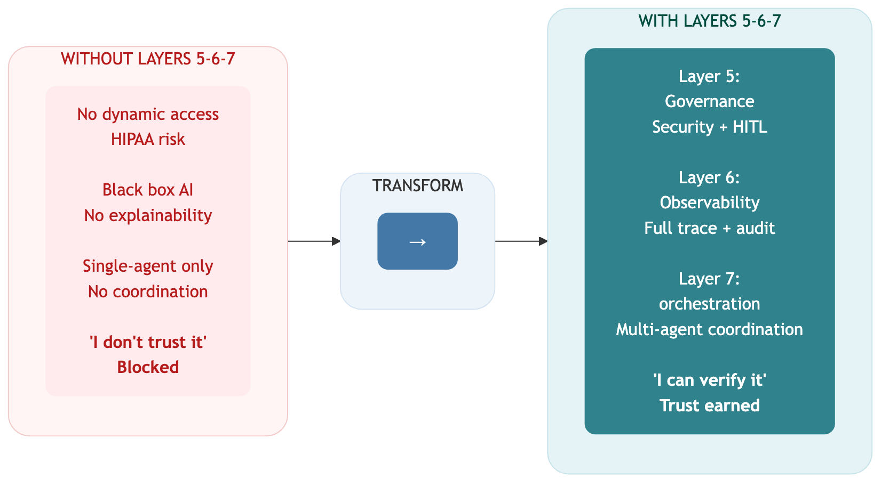
> **Key Takeaway:** Trust requires transparency. Layers 5-6-7 make AI verifiable.

## PART 1: THE TRUST RISK

Intelligence is operational. But intelligence alone isn't enough.


The Warfarin incident crystallized what Sarah had suspected - intelligence without governance is dangerous. Week 7's achievements: 95.6% RAG accuracy, 1.8-second semantic queries, 2,400 clinical terms resolved meant nothing if agents couldn't distinguish routine questions from life-threatening decisions.

Three risks remained unaddressed:

- **Governance risk:** No dynamic authorization. No HITL for high-risk decisions.
- **Observability risk:** No end-to-end tracing. No cost visibility. No explainability.
- **Orchestration risk:** No multi-agent coordination. Complex queries required manual assembly.

These final three layers would complete the architecture.

**Figure 6.2: The Architecture of Trust - Completing Pillar 2**


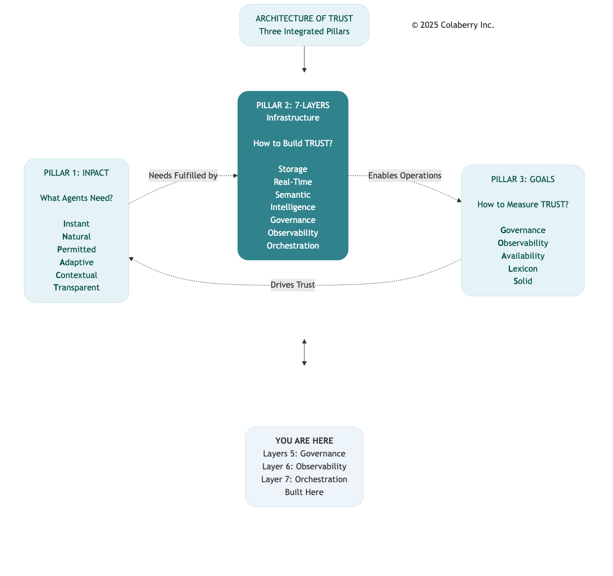
### Architectural Context

Chapters 4-5 built the foundation and intelligence layers. Chapter 4 delivered data availability: eight storage categories and real-time pipelines with less than 30 seconds freshness. Chapter 5 delivered data understanding: semantic resolution of 2,400 clinical terms and a 7-stage RAG pipeline with 85% cache hit rates. Together, these four layers transformed Echo's data infrastructure from legacy BI to agent-capable.

Chapter 6 completes the architecture with three final layers:

**Layer 5 (Governance):** Policy-based authorization controlling what agents can do. ABAC (Attribute-Based Access Control) evaluates every request against four dimensions: who is asking, what they're accessing, when they're accessing it, and where they're accessing it from. OPA (Open Policy Agent) enforces policies. HITL (Human-in-the-Loop) workflows escalate high-risk decisions to human experts.

**Layer 6 (Observability):** Complete visibility into what agents did. Distributed tracing with OpenTelemetry tracks every request across all seven layers. MLOps monitoring detects model drift. LLM cost tracking gives granular visibility into the $26,000 monthly API spend that would otherwise be a black box.

**Layer 7 (Orchestration):** Multi-agent coordination enabling how agents work together. LangGraph provides the framework for supervisor patterns, shared state management, and conditional routing. Three specialized agents (Care Coordination, Clinical Documentation, and Revenue Cycle) collaborate on complex queries that span multiple domains.

**A Note on Agent Development:** These three agents are the same ones from Echo's failed $2M pilot (Chapter 1), now retrofitted to the complete infrastructure. The Layer 7 cost covers orchestration integration only. Agent logic was already built. **The agents were never the problem. The infrastructure was.**

Why cover three layers in one chapter? Because trust and orchestration are interdependent. Orchestration without governance means uncontrolled agents collaborating on decisions they shouldn't make. Orchestration without observability means invisible coordination failures. All three layers must be operational together for production deployment.

The three-week build timeline (Week 8 Governance, Week 9 Observability, Week 10 Orchestration) is detailed in Part 2.

**Figure 6.3: 7-Layer Agent-Ready Architecture - Transparency + Orchestration Highlighted**


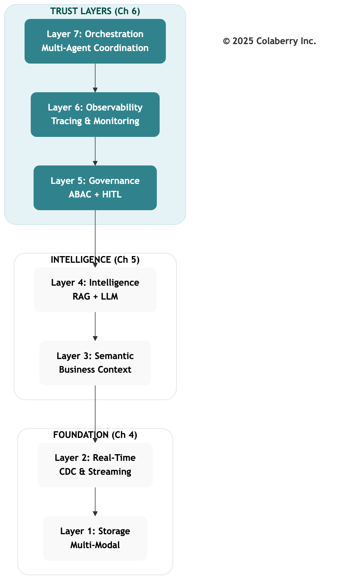
### The Remaining Gaps

Chapter 3 identified seven infrastructure gaps preventing agent deployment. Chapters 4-5 addressed Gaps 1-4. Three gaps remain:

| Gap | Infrastructure Need | Layer | Status |
|-----|---------------------|-------|--------|
| Gap 1 | Multi-Modal Storage | Layer 1 | ✓ Chapter 4 |
| Gap 2 | Real-Time Data | Layer 2 | ✓ Chapter 4 |
| Gap 3 | Semantic Understanding | Layer 3 | ✓ Chapter 5 |
| Gap 4 | Intelligent Retrieval | Layer 4 | ✓ Chapter 5 |
| **Gap 5** | **Dynamic Permissions** | **Layer 5: Governance** | **Chapter 6** |
| **Gap 6** | **Reasoning Observability** | **Layer 6: Observability** | **Chapter 6** |
| **Gap 7** | **Multi-Agent Coordination** | **Layer 7: Orchestration** | **Chapter 6** |

This chapter closes all remaining gaps. By Week 10, Echo's architecture will be complete.

### INPACT™ Dimensions Enabled

Each layer directly drives specific INPACT™ dimensions:

**Layer 5 delivers Permitted (P):** Dynamic authorization that considers context, not just role-based yes/no decisions, but attribute-based evaluation of who, what, when, and where. A physician accessing their own patient's records during a scheduled appointment receives immediate authorization. The same physician accessing a celebrity patient's records from a home IP address at 2 AM triggers HITL review.

**Layer 6 delivers Transparent (T):** Complete visibility and explainability. Every response includes citation sources. Every decision includes an explanation trail. Every anomaly triggers alerts. Trust requires transparency. Users trust what they can see and verify.

**Layer 7 powers orchestration across all dimensions:** Multi-agent coordination makes Instant (I) practical for complex queries, Natural (N) seamless for multi-domain questions, and Contextual (C) coherent across agent handoffs.

These three layers will take Echo's INPACT™ score from 67/100 to 86/100, the production readiness threshold. (See Part 7 for complete dimension-by-dimension progression.)

The 86/100 threshold represents production readiness, the point at which agent infrastructure can reliably support clinical workflows with appropriate safeguards. This threshold aligns with NIST AI Risk Management Framework guidance on deploying AI systems in high-stakes environments.[1]

---

## PART 2: THE FINAL SPRINT

Marcus studied the incident report, then set it down. "This is exactly what we've been warning about."

Sarah walked to the whiteboard and wrote three words:

**GOVERNANCE. OBSERVABILITY. ORCHESTRATION.**

"Get Jamie and Dr. Chen on a call. We're planning the final sprint."

Twenty minutes later, the team was assembled. Jamie Rodriguez, Director of IT, had joined in person, coffee in hand. Dr. Chen dialed in from the hospitalist office.

Sarah gestured at the whiteboard. "Three weeks. Three layers. One goal: architecture completion by Week 10."

She turned to Dr. Chen first. "You caught the Warfarin issue. Walk everyone through what happened."

Dr. Chen's voice came through the speakerphone. "Friday afternoon. An agent recommended a Warfarin dose adjustment for a patient on concurrent aspirin therapy. Medically sound recommendation for most patients. But this patient had a history of GI bleeding. Any anticoagulation change required gastroenterology consultation. The agent had no way to know that. No way to flag it. No way to escalate."

"And if you hadn't caught it?" Marcus asked.

"The recommendation would have gone to the care team as a routine suggestion. Someone might have acted on it without checking the full history."

The room was quiet.

"That's why governance comes first," Sarah said. She began writing beneath each word on the whiteboard.

**Week 8: Layer 5 - Governance**
- OPA policy engine deployment
- ABAC policy design (200+ authorization rules)
- HITL workflow implementation
- Target: Dynamic authorization operational

**Week 9: Layer 6 - Observability**
- OpenTelemetry distributed tracing
- Datadog APM integration
- LLM cost tracking dashboard
- Target: Complete operational visibility

**Week 10: Layer 7 - Orchestration**
- LangGraph framework deployment
- Three-agent coordination pattern
- State management and routing
- Target: Multi-agent queries working

"By Week 10, we hit 86/100 INPACT™," Sarah continued. "Governance gets Permitted from 2 to 6. Observability gets Transparent from 3 to 6. Orchestration ties it together for production."

Jamie nodded. "What about the Warfarin scenario specifically? That's the test case."

Sarah circled "HITL" on the whiteboard. "Any medication classified as high-interaction Warfarin, methotrexate, lithium automatically triggers human review. The agent drafts the recommendation. A clinician approves before it reaches the patient. The system knows its limits."

Dr. Chen's voice came through one final time. "When this works, Dr. Martinez can ask one question and get a complete care coordination answer, That's when clinical staff will believe AI actually helps them."

Sarah turned to her team. "Let's build trust."

---

## PART 3: LAYER 5 - THE GOVERNANCE ENGINE

Layer 5 delivers policy-based authorization and audit infrastructure: the capability to control what agents can do by adding contextual evaluation to existing role-based permissions.

This is the governance engine: the integrated system of policies, contextual evaluation, human escalation, and audit that makes agent operations trustworthy.

Traditional role-based access control operates on identity: a physician role grants access to patient records. Agent-era access control preserves this foundation and adds contextual evaluation: that same physician role grants access to their assigned patients' records during clinical hours from approved locations for clinically justified purposes.

**The Architecture Principle:** RBAC grants the badge; ABAC decides if you can use it right now.

This contextual evaluation requires four capabilities:

**Policy Engine:** A decision service that evaluates authorization requests against defined rules. OPA (Open Policy Agent) has emerged as the standard, with native Rego policy language enabling complex conditional logic.[2]

**ABAC Framework:** Attribute-Based Access Control evaluates four dimensions (Subject, Resource, Action, and Context) to produce dynamic authorization decisions.[3]

**HITL Workflows:** Human-in-the-Loop escalation paths for decisions that exceed policy thresholds. High-risk actions trigger human review rather than automatic approval or denial.

**Audit Infrastructure:** Complete decision logging for compliance, debugging, and policy refinement. Every authorization decision (granted, denied, or escalated) is recorded with full context.

**Figure 6.4: Layer 5 Governance Architecture**


### Why Agents Need Governance

Agents operate differently than human users. A human physician accessing EHR records makes deliberate choices, navigating to specific patients, reviewing specific documents, for specific reasons. The implicit governance of user interfaces constrains access patterns. Agents eliminate these constraints. An agent with data access can iterate through thousands of records in seconds, aggregate information across patients, and correlate data in ways that human navigation never enabled.

This capability expansion requires governance expansion. Consider the scenario: a clinical agent asked to "summarize medication trends across diabetic patients" could legitimately access thousands of patient records. Without governance, how does the system distinguish this legitimate analytical query from a data exfiltration attempt? Both look identical at the data layer.

ABAC solves this. The legitimate query comes from a credentialed analyst, during business hours, from an approved workstation, requesting aggregate statistics without individual identifiers. The exfiltration attempt comes from a compromised credential, at 2 AM, from an unknown IP, requesting raw patient records. Same data access pattern. Different authorization decision.

HITL adds the second line of defense. Some decisions require human judgment regardless of policy evaluation. Medication interactions with potentially life-threatening consequences shouldn't be auto-approved even when the requesting credential is valid. The governance layer recognizes risk thresholds and escalates appropriately. Research on human-AI collaboration demonstrates that appropriate task allocation between humans and AI systems improves both safety and performance.[4]

### Technologies and Approaches

**OPA (Open Policy Agent):** The CNCF graduated project provides a unified policy framework.[2] Policies written in Rego language evaluate structured input against defined rules, achieving 10,000 decisions per second with sub-millisecond latency when deployed as a sidecar.

```rego
# Example: Healthcare PHI access policy
package healthcare.phi

default allow = false

allow {
    input.subject.role == "physician"
    input.subject.department == input.resource.department
    input.action == "read"
    input.context.time_of_day >= 6
    input.context.time_of_day <= 22
    input.resource.patient_id in input.subject.assigned_patients
}
```

**ABAC Implementation:** NIST SP 800-162 defines the standard.[3] The four-factor model extends role-based permissions with contextual evaluation:

- **Subject:** Role, department, credentials, license validity, patient assignments
- **Resource:** Data classification, sensitivity level, patient consent status
- **Action:** Read, write, delete, export, aggregate
- **Context:** Time, location, device type, network origin

NIST guidance recognizes that RBAC and ABAC are complementary, and organizations implement hybrid architectures that preserve role-based foundations while adding contextual evaluation.

**HITL Workflow Patterns:**

1. **Synchronous:** Request blocks until human approval (high-risk irreversible actions like medication prescriptions)
2. **Asynchronous:** Request proceeds provisionally pending review (time-sensitive, reversible actions like scheduling)
3. **Post-hoc:** Immediate execution with mandatory audit review (low-risk queries with compliance requirements)

Pattern selection depends on reversibility, urgency, and risk magnitude.

**Figure 6.5: ABAC Four-Factor Authorization Model**


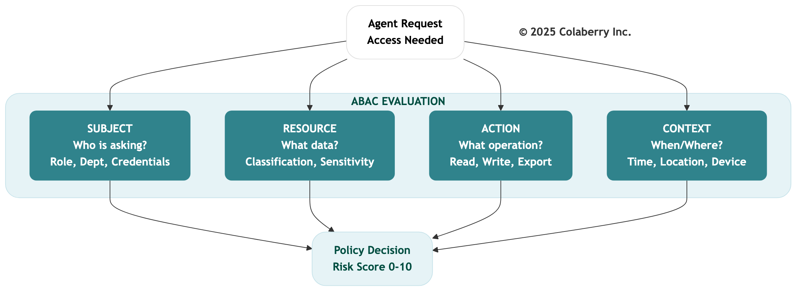
### Echo's Gap Before Layer 5

Echo's pre-transformation authorization relied on Epic's native RBAC, a solid foundation that defined role-based permissions: physicians access patient records, nurses view orders, administrators have department scope. This RBAC baseline remains in place. What was missing was the contextual layer to evaluate when, where, and why.

**Scenario: The After-Hours Access**
A physician accessed a celebrity patient's records at 2 AM from a home IP address. The access was legitimate. The physician was on-call and the patient had called with symptoms. But the system couldn't distinguish this legitimate emergency access from a privacy breach. RBAC correctly authorized the physician's access. What was missing: contextual evaluation asking "why is this physician accessing this patient at this time from this location?"

The most concerning gap appeared with medication queries. Echo's agent could retrieve drug interaction information and suggest dosing adjustments. But the underlying authorization made no distinction between querying acetaminophen interactions and Warfarin interactions. Both received identical treatment: immediate response with no escalation.

"We can't have an agent providing Warfarin dosing suggestions without pharmacist review," Dr. Chen stated in the Week 6 review. "That's not AI assistance. It's AI malpractice waiting to happen."

HIPAA's "minimum necessary" principle requires limiting PHI access to what's needed for the specific purpose. An RBAC-only model doesn't satisfy this in an agent context where access is automated and high-volume. FDA guidance emphasizes human oversight for clinical decision support systems.[5]

### Echo's Implementation

Echo deployed Layer 5 across Week 8-9 with the following architecture:

**OPA Policy Engine:** Deployed as a Kubernetes sidecar alongside the agent service, enabling sub-millisecond policy evaluation without network latency.[2]

**Policy Design:** 247 authorization rules covering:
- Patient record access (73 rules)
- Medication queries (52 rules)
- Scheduling operations (41 rules)
- Financial data access (38 rules)
- Administrative functions (43 rules)

**ABAC Attributes Evaluated:**
- Subject: Role, department, credential type, patient assignments
- Resource: Data classification, patient ID, sensitivity level
- Action: Read, write, prescribe, schedule, authorize
- Context: Time, IP address, device type, session duration

**HITL Triggers:** Eight high-risk categories automatically escalate:
1. Warfarin-class medication recommendations (narrow therapeutic index drugs)
2. Controlled substance queries
3. Mental health record access
4. Pediatric patient data
5. Financial authorizations exceeding $10,000
6. Cross-department patient access
7. Bulk data exports
8. Access from unrecognized devices


**Figure 6.6: HITL Escalation Patterns**


### The Warfarin Moment

Thursday, Week 9. 2:34 PM.

The first true HITL escalation arrived during afternoon rounds. Dr. Martinez queried the clinical agent about a patient's post-surgical anticoagulation protocol. The patient, recently discharged after hip replacement, was on Warfarin for DVT prophylaxis and had been prescribed aspirin for cardiovascular history.

The agent recognized the query intent, retrieved the relevant medication records, identified the drug interaction, and prepared a response. But before returning that response, the governance layer intervened.

**HITL Trigger:** Warfarin-class medication + drug interaction detected  
**Risk Score:** 8/10  
**Escalation:** Synchronous HITL - Pharmacist review required

Dr. Chen received the escalation notification on her workstation. The agent's draft response appeared alongside the source data: current Warfarin dose (5mg daily), aspirin prescription (81mg daily), recent INR values (trending high at 3.2), and the interaction flag.

The agent had correctly identified the interaction. It had even drafted an appropriate recommendation: consider INR monitoring frequency increase and potential Warfarin dose adjustment. But the governance layer ensured a human pharmacist reviewed this recommendation before it reached the care team.

Dr. Chen approved the recommendation with one modification: adding a specific INR target range. The entire escalation took 47 seconds from trigger to approval.

"That's exactly what we needed," she told Sarah later. "The agent did the work: gathering data, identifying the interaction, drafting the recommendation. But a human made the final call on a high-risk medication. That's trustworthy AI."

### INPACT™ Contribution

Layer 5 directly delivers **Permitted (P)**: from 2/6 to 6/6.

The four-point improvement reflects the addition of contextual ABAC on top of RBAC:
- **Points 1-2:** Contextual evaluation considers time, location, device, and purpose, not just identity
- **Points 3-4:** HITL workflows provide safe escalation paths for decisions exceeding policy confidence

Combined, these capabilities enable agents to operate in clinical contexts where RBAC alone would either over-permit (allowing risky access) or under-permit (blocking legitimate use). Contextual governance finds the appropriate middle ground.

**Operational Metrics:**

| Metric | Target | Critical Threshold |
|--------|--------|-------------------|
| Policy Evaluation Latency | <10ms | >50ms |
| HITL Escalation Rate | 2-5% | >10% |
| HITL Resolution Time | <2 min | >5 min |
| False Positive Rate | <1% | >3% |

---

## PART 4: LAYER 6 - INSIDE THE BLACK BOX

Layer 6 delivers complete visibility into agent operations: the capability to understand what agents did, why they did it, and how much it cost.

This layer takes you inside the black box.

Observability differs from monitoring in scope and intent. Monitoring checks whether systems are running. Observability explains why systems behave as they do. For AI agents, this distinction is critical. A monitoring alert tells you the agent returned an error. Observability tells you which layer failed, what input triggered the failure, which model was involved, how long each stage took, and what the cost implications are.

This comprehensive visibility requires four capabilities:

**Distributed Tracing:** Request tracking across all seven layers, enabling end-to-end visibility for any agent interaction. Modern distributed tracing builds on foundational work in large-scale systems monitoring.[7]


**MLOps Monitoring:** Model performance tracking including accuracy degradation, drift detection, and quality metrics. When underlying data distributions shift, MLOps monitoring detects the change before it impacts outputs. Research on machine learning operations emphasizes continuous monitoring as essential for production AI systems.[8]

**LLM Metrics:** Quality, cost, and latency tracking specifically for large language model operations. LLM API calls represent significant operational cost and require dedicated visibility.

**Centralized Logging:** Aggregated logs with structured data enabling correlation across services. Debugging distributed systems without centralized logging means correlating timestamps across dozens of separate log files.

**Figure 6.7: Layer 6 Observability Architecture**


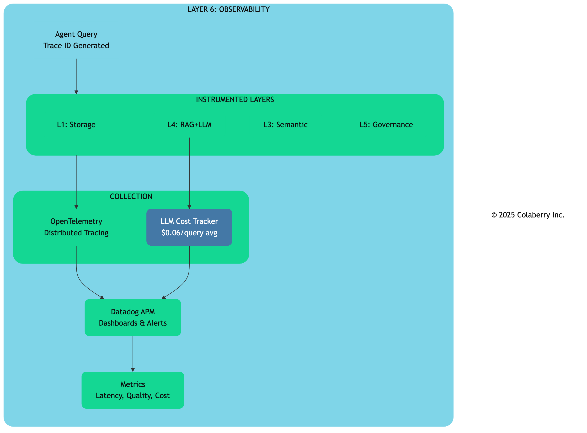
### Why Agents Need Observability

Agents are black boxes by default. A user submits a query. An answer returns. What happened in between? Which documents were retrieved? Which model generated the response? How confident was the system? How much did it cost? Without observability, these questions have no answers.

This opacity creates three operational challenges:

**Debugging Challenge:** When an agent returns an incorrect response, troubleshooting requires understanding the full processing chain. Did the semantic layer misinterpret the query? Did RAG retrieve irrelevant documents? Did the LLM hallucinate despite having correct context? Each failure mode has different remediation, and lacking observability, identifying the failure mode requires guesswork.

**Cost Management Challenge:** LLM API calls carry meaningful cost. Claude Sonnet 4 pricing at $3 per million input tokens and $15 per million output tokens seems economical until query volume scales.[9] A healthcare system processing 10,000 daily agent queries with average 2,000 input tokens and 500 output tokens generates monthly LLM costs exceeding $2,000 for a single model. Most RAG pipelines involve multiple model calls per query. Lacking granular cost visibility, organizations cannot optimize spend.

**Quality Assurance Challenge:** LLM outputs vary. The same query can produce slightly different responses. Context retrieval quality affects output quality. Model drift occurs over time as underlying APIs evolve. Without quality metrics, organizations cannot detect degradation until users complain.

### Technologies and Approaches

**OpenTelemetry** provides vendor-neutral distributed tracing.[6] Core concepts: **Spans** (individual work units), **Traces** (collections of spans across a request; a single clinical query generates 15-25 spans), and **Context Propagation** (automatic trace ID forwarding across service boundaries).

**Datadog APM** provides visualization with native OpenTelemetry support.[10] Key capabilities: LLM token tracking for cost attribution, anomaly detection that alerts before users complain, and service maps showing latency distribution.

**LLM-Specific Observability Patterns:**
- **Token Tracking:** Cost allocation by query type and model
- **Prompt Versioning:** Git-managed templates with version hashes in traces
- **Cache Analytics:** Identifying near-duplicate queries suitable for caching

### Echo's Gap Before Layer 6

Echo's pre-transformation monitoring consisted of CloudWatch logs and basic uptime checks. When issues emerged, debugging followed a painful pattern: user reports problem → operations identifies timestamp → engineers search logs across multiple services → correlation requires manual timestamp matching → root cause takes hours or days.

CFO Krish Yadav raised this concern: "We're spending $26,000 monthly on LLM APIs. I can see the total. I can't see the breakdown. That's not a cost center. It's a mystery."

The most frustrating gap appeared during the Week 6 accuracy regression. Response quality dropped from 95% to 87% over three days. The cause: a Pinecone index corruption that degraded retrieval quality. But identifying this root cause took 18 hours of investigation. With proper tracing, this diagnosis would have taken minutes.

"We were flying blind," Jamie Rodriguez recalled. "We knew something was wrong because users complained. But finding the actual problem meant reading thousands of log lines and hoping to spot a pattern."

### Echo's Implementation

Echo deployed OpenTelemetry instrumentation across all seven layers during Week 9, with Datadog APM providing visualization and alerting.

**Figure 6.8: Echo's Seven-Layer Service Map**

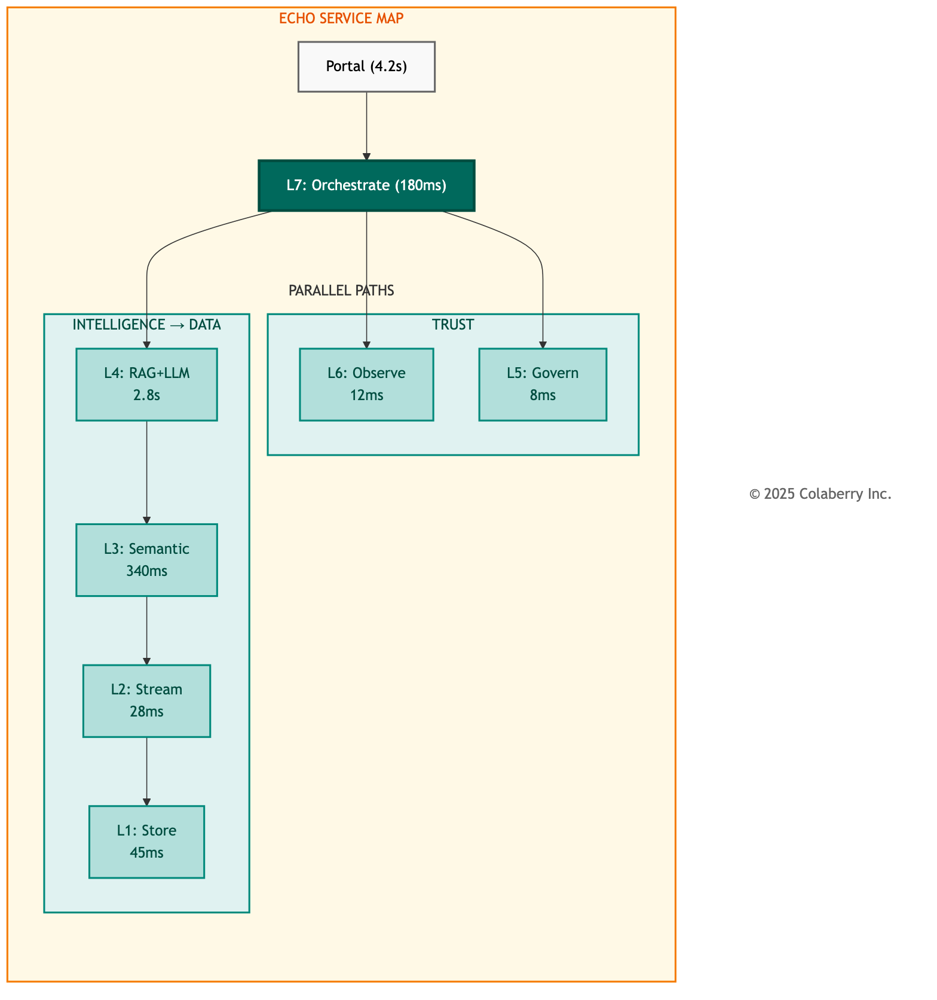
**© 2025-2026 Colaberry Inc.**

The service map reveals latency distribution: Layer 4 (RAG + LLM) dominates at 2.8 seconds P95, representing 67% of total request time. This visibility enabled Echo to focus optimization on LLM generation rather than infrastructure layers.

**Implementation Results:**
- **Token Tracking:** 73% of latency came from LLM generation, not retrieval
- **Prompt Versioning:** Accuracy improved from 94.2% to 95.6% after clinical reasoning prompt update
- **Cache Analytics:** 34% of queries identified as near-duplicates suitable for caching

**Datadog Integration:** APM agents deployed alongside application services, with custom dashboards for:
- Query latency by layer (P50, P95, P99)
- LLM cost per query (breakdown by model)
- Cache hit rates (semantic cache, RAG cache)
- HITL escalation volume and resolution time
- Error rates by category

**Alert Configuration:**
- Latency: P95 > 3s triggers warning, P95 > 5s triggers page
- Cost: Daily spend > 120% of baseline triggers review
- Quality: Accuracy drop > 5% triggers investigation
- Errors: Error rate > 2% triggers immediate response


### Visibility Achieved

With Layer 6 operational, Echo gained unprecedented visibility into agent operations. Complete request traces now show timing for every layer when latency spikes occur, engineers immediately identify whether the bottleneck is semantic parsing, governance checks, vector search, or LLM generation.

**Cost Visibility Example:**
Monthly LLM spend of $26,000 now decomposed:
- Claude Sonnet 4: $18,200 (clinical reasoning queries)
- GPT-4 Turbo: $4,100 (complex analytical queries)
- Llama 3.1: $2,400 (simple lookups, cached prompt responses)
- Embedding generation: $1,300 (OpenAI ada-002)

This visibility revealed optimization opportunity: 34% of clinical reasoning queries were cache-eligible but cache-missing due to minor prompt variations. Normalizing prompts increased cache hit rate from 85% to 91%, saving $3,100 monthly.

### INPACT™ Contribution

Layer 6 directly delivers **Transparent (T)**: from 3/6 to 6/6.

The three-point improvement reflects the shift from opaque operations to complete visibility:
- **Point 1:** Request tracing provides explainability so that users and operators can understand what happened and why
- **Point 2:** Quality monitoring provides confidence so that the organization knows system accuracy in real-time
- **Point 3:** Cost attribution provides accountability so that every dollar of LLM spend traces to specific use cases

Combined, these capabilities transform agents from black boxes into transparent systems where every decision has an explanation and every trend has visibility.

**Operational Metrics:**

| Metric | Target | Critical Threshold |
|--------|--------|-------------------|
| Trace Completeness | >99% | <95% |
| Dashboard Latency | <5s refresh | >30s |
| Alert False Positive Rate | <5% | >15% |
| Cost Attribution Coverage | 100% | <90% |

---

## PART 5: LAYER 7 - THE ORCHESTRATOR

Layer 7 delivers multi-agent coordination: the capability for specialized agents to work together on complex queries that span multiple domains.

Layer 7 is the orchestrator. It turns multiple agents into one coherent answer.


**Figure 6.9: Layer 7 Orchestration Architecture**


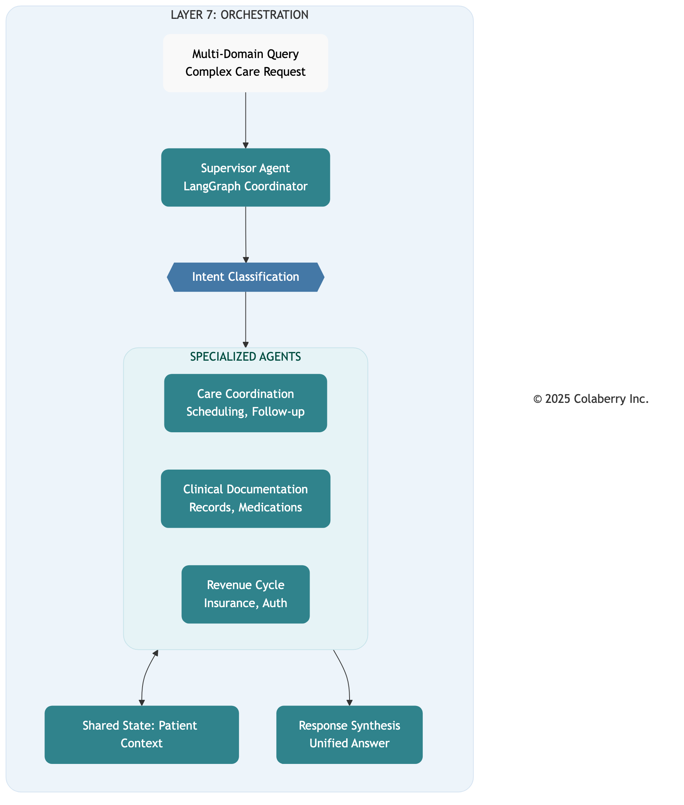
### Why Agents Need Orchestration

Single-agent architectures work well for focused queries: "What is this patient's latest A1C?" routes to the clinical agent, retrieves the lab result, and returns an answer. But healthcare workflows rarely involve single domains. A discharge planning query: "prepare this patient for discharge" requires care coordination (scheduling follow-up appointments), clinical documentation (summarizing the stay and medications), and revenue cycle (verifying insurance coverage and authorizations). Three domains, three specialized knowledge bases, one coherent answer needed.

The alternative to orchestration is decomposition, forcing users to break complex queries into simple components, submit them separately, and manually integrate the results. This approach has three problems:

**Cognitive Load:** Users must understand system boundaries to phrase queries correctly. Asking "prepare this patient for discharge" when the system only handles clinical questions forces the user to rephrase: "What medications is this patient on? What follow-up appointments are scheduled? Is insurance coverage verified?" The AI should handle decomposition, not the human.

**Context Loss:** Sequential queries lose context. When a user asks about medications, then asks about appointments, the second query doesn't know the first query's results unless the user manually includes them. Orchestration maintains a shared state across agent boundaries.

**Latency Multiplication:** Sequential queries multiply latency. If each domain query takes 2 seconds, three sequential queries take 6 seconds minimum. Orchestration allows parallel execution, so that the same three queries complete in 2-3 seconds total.

### Technologies and Approaches

Orchestration solves the multi-domain problem through structured coordination:

**Supervisor Pattern:** A coordinating agent classifies query intent, routes to specialized agents, and synthesizes responses. The supervisor doesn't answer directly, it manages agents that do. This pattern reflects decades of research in multi-agent systems coordination.[11]

**Shared State:** All agents access common context about the current interaction, ensuring consistency across agent boundaries. When the clinical agent retrieves medication information, the revenue agent sees that context without re-querying.

**Conditional Routing:** Query characteristics determine which agents activate. Simple queries route to single agents. Complex queries activate multiple agents in parallel or sequence.

**LangGraph** models agent workflows as graphs. Nodes are agents, edges are transitions.[12] This builds on research showing structured workflows outperform unstructured approaches.[13]

```python
# Simplified LangGraph workflow definition
from langgraph.graph import StateGraph

workflow = StateGraph(AgentState)
workflow.add_node("supervisor", supervisor_agent)
workflow.add_node("care", care_coordination_agent)
workflow.add_node("clinical", clinical_documentation_agent)
workflow.add_node("revenue", revenue_cycle_agent)
workflow.add_conditional_edges("supervisor", route_to_agents,
    {"care": "care", "clinical": "clinical", "revenue": "revenue"})
```

**Coordination Patterns:**

1. **Supervisor Pattern:** Central coordinator routes to specialists and synthesizes responses. Echo uses this to classify intent into care, clinical, revenue, or multi-domain categories.

2. **Sequential Pattern:** Agents process in order, each enriching shared state. Example: prior authorization workflow where clinical gathers diagnosis, revenue checks coverage, authorization submits to payer.

3. **Parallel Pattern:** Multiple agents process simultaneously, latency equals slowest agent. Echo dispatches multi-domain queries to all three agents in parallel.

**State Management:** Redis with 15-minute TTL provides shared context across agents.[14] State includes query context, intermediate results, session history, and coordination metadata. (TTL configurable per use case.)

**Error Handling:** 10-second agent timeouts, partial failure responses with clear indication, graceful degradation when agents are unavailable.

### Echo's Gap Before Layer 7

Echo's pilot supported only single-agent queries. Complex requests failed:

**User:** "Prepare discharge summary, follow-up appointments, and insurance verification."  
**System:** "I can help with clinical documentation. For scheduling and insurance, please contact the respective departments."

The clinical agent did its job correctly, but the system couldn't orchestrate across domains.

Dr. Chen's Week 7 feedback captured the frustration: "Every complex question becomes three simple questions I have to ask separately. That's not assistance. It's a to-do list generator. I spend more time managing the AI than I would spend doing the work manually."

Pilot usage data confirmed: high engagement for simple lookups but declining engagement for complex workflows. Users tried multi-domain queries once, received fragmented responses, and stopped asking.

### Echo's Implementation

Echo deployed Layer 7 across Week 10 with the following architecture:

**LangGraph Framework:** Deployed as the orchestration layer, managing agent coordination through graph-based workflows.[12]

**Three Specialized Agents:**

1. **Care Coordination Agent:** Handles scheduling, appointment management, care team communication, and follow-up planning. Integrated with Epic scheduling APIs and provider directory.

2. **Clinical Documentation Agent:** Handles medical records, medication summaries, lab results, and clinical narratives. Integrated with Epic EHR and document management systems.

3. **Revenue Cycle Agent:** Handles insurance verification, prior authorization, coverage determination, and financial counseling referrals. Integrated with claims management and payer portals.

**Supervisor Design:** Intent classification determines routing:
- Single-domain queries → direct routing to relevant agent
- Multi-domain queries → parallel or sequential execution with synthesis
- Ambiguous queries → clarification request

**Governance Integration:** All agent operations pass through Layer 5 ABAC evaluation. The orchestration layer doesn't bypass governance. It coordinates with governance-approved operations.

**Observability Integration:** All agent operations generate OpenTelemetry traces. The orchestration layer provides visibility into coordination patterns, not opacity.


### The Multi-Agent Moment

Friday, Week 10. 4:47 PM.

Sarah watched the terminal as Jamie Rodriguez submitted the test query:

**Query:** "Patient Maria Santos, MRN 78234156, is being discharged today following hip replacement surgery. Schedule post-discharge follow-up, medication review, and verify insurance coverage."

The orchestration layer activated. Intent classification identified three domains: Care (follow-up scheduling), Clinical (medication review), Revenue (insurance verification). The supervisor delegated the request to all three agents in parallel.

**Figure 6.10: Multi-Agent Query Flow - Maria Santos Discharge**


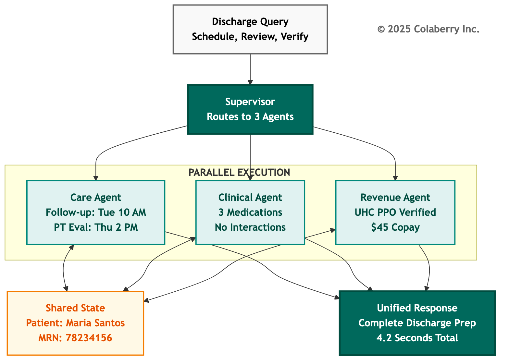
**Care Coordination Agent (2.1s):**
- Scheduled follow-up: Orthopedics, Dr. Kim, next Tuesday 10:00 AM
- Scheduled physical therapy evaluation: Thursday 2:00 PM
- Confirmed patient transportation preferences

**Clinical Documentation Agent (1.8s):**
- Medication summary: 3 active prescriptions post-surgery
- Drug interaction check: No high-risk interactions detected
- Discharge instructions: Prepared and staged for review

**Revenue Cycle Agent (2.3s):**
- Insurance verified: UnitedHealthcare PPO
- Prior authorization: Not required for follow-up visits
- Patient responsibility estimate: $45 copay per visit

**Total Execution Time:** 4.2 seconds (parallel execution)

The supervisor synthesized the responses into a coherent discharge preparation summary. One query, three agents, one coordinated answer.

The Datadog trace showed the complete flow, intent classification and routing (~400ms), parallel agent execution (2.3s slowest path), state synchronization and synthesis (~1.5s). Every layer visible. Every agent auditable. Every decision traceable.

Marcus checked the governance log. All three agents had passed ABAC evaluation. No HITL escalations triggered. Medication review found no Warfarin-class drugs. Clean execution.

"This is what we built for," Sarah said quietly. "Three agents, one response, complete care coordination."

The room was silent for a moment. Then Jamie grinned. "**The Architecture of Trust** is operational. Now we need to prove it would stay that way."


### INPACT™ Contribution

Layer 7 doesn't directly add points to the INPACT™ score. The 86/100 score is achieved through Layers 5-6 improvements to Permitted and Transparent. But orchestration enables INPACT™ dimensions at scale:

**Instant (I):** Multi-agent workflows complete in seconds through parallel execution. Without orchestration, the same tasks would require sequential human navigation across systems in minutes instead of seconds.

**Natural (N):** Users ask complex questions naturally. "Prepare for discharge" doesn't require understanding system boundaries. Orchestration handles decomposition invisibly.

**Contextual (C):** Shared state ensures all agents operate with full patient context. The revenue agent knows what medications the clinical agent found. Context doesn't get lost crossing agent boundaries.

Orchestration readiness is what makes 86/100 "production-ready." The score reflects capability. Orchestration reflects scalability.

**Operational Metrics:**

| Metric | Target | Critical Threshold |
|--------|--------|-------------------|
| Orchestration Success Rate | >95% | <90% |
| Multi-Agent Latency | <5s | >10s |
| State Consistency | 100% | <99% |
| Agent Timeout Rate | <2% | >5% |

---

## PART 6: TRUST THROUGH TRANSPARENCY

Trust is the outcome. Transparency is the mechanism.[15]

**How the seven layers create transparency:**
- **Layers 1-2:** Data availability and freshness (agents citing outdated data lose trust)
- **Layers 3-4:** Understanding and reasoning (each stage instrumentable, traceable)
- **Layers 5-6:** Safety and visibility (black boxes become glass boxes)
- **Layer 7:** Coordination without opacity

**The Three Transparency Mechanisms:**

**Citations:** Every factual claim includes its source. When Echo's agent reports "Patient's A1C was 7.2%," the response includes: Epic Labs, MRN reference, timestamp. Users can verify. Agents can't hallucinate what they must cite.[16]

**Explainability:** HITL escalations include reasoning: "Risk score 8/10. Trigger: Warfarin + drug interaction. Policy requires pharmacist review." Users see reasoning they can evaluate.

**HITL as Trust Feature:** Systems that know when to ask for help earn trust. HITL isn't a failure mode. It communicates: "This system knows its limits."

**Echo's Response Format:**
> **Query:** Maria Santos's medication list?  
> **Response:** 3 active prescriptions [Source: Epic Orders, 11/24/2025]  
> **Confidence:** High (primary EHR, updated within 24 hours)  
> **Governance:** Auto-approved (no high-risk flags)

---

## PART 7: ECHO'S WEEK 8-10 BUILD

### Week 8: Governance Foundation

Marcus Williams led policy development, working with compliance to translate regulatory requirements into OPA rules. 247 policies emerged from sessions that felt like contract negotiations. Clinical operations wanted flexibility. Compliance wanted constraints.

Thursday brought the first policy conflict: a scheduling rule required department-head approval for cross-department appointments, but care coordination needed to schedule cardiology follow-ups without manual approval. Resolution: explicit "care coordination workflow" exception with enhanced audit logging.

By Friday, 193 of 247 policies were deployed. The remaining 54 covered edge cases requiring additional review.

### Week 9: Observability Operational

The observability build proceeded faster than planned. Echo's Layer 4 already had basic OpenTelemetry tracing. Extending to all seven layers required consistent patterns, not greenfield development. By Wednesday, trace completeness exceeded 98%.

Thursday afternoon brought the first HITL escalation in production - the Warfarin scenario. The trace told the complete story:
- T+0ms: Query received
- T+23ms: Governance evaluation (risk score: 8, trigger: Warfarin-class medication)
- T+24ms: HITL escalation initiated
- T+47,234ms: Human approval received (Dr. Chen)
- T+47,456ms: Response delivered

"That's not a test," Sarah noted. "That's production."

### Week 10: Orchestration Complete

The three agents had been in design since Week 8. Week 10 was production integration: connecting agents to LangGraph, implementing shared state, testing coordination patterns.

Tuesday brought integration failures. Epic rate limits and payer disambiguation issues. Normal problems with normal fixes.

Wednesday-Thursday: 47 test scenarios across single-domain, dual-domain, triple-domain, error handling, and HITL integration. All passed by Thursday evening.

Friday, 4:47 PM. The Maria Santos discharge query succeeded. Three agents. One response. Architecture complete.

**Figure 6.11: Echo's Week 8-10 Timeline**


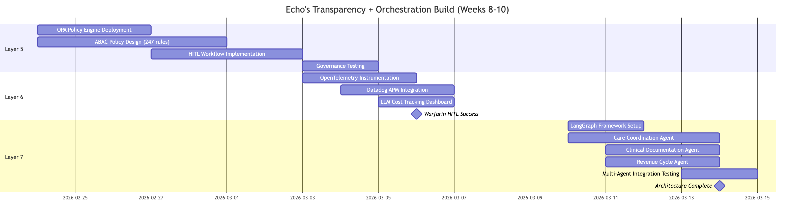
**© 2025-2026 Colaberry Inc.**

### INPACT™ Score: Week 7 → Week 10

**Figure 6.12: INPACT™ Transformation (67 → 86)**


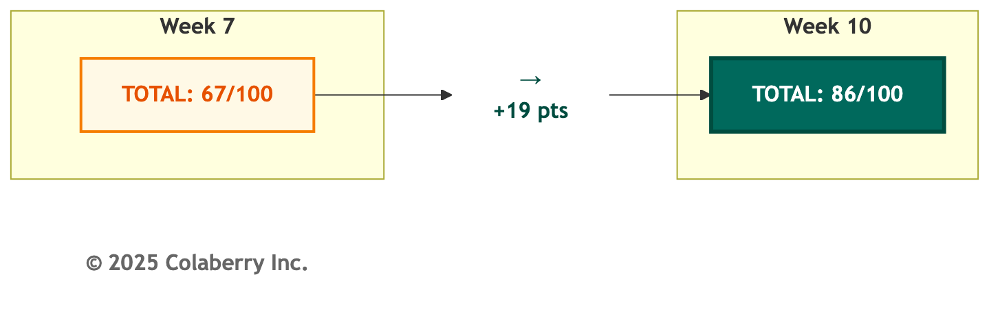
**INPACT™ Dimension Changes:**

| Dimension | Week 7 | Week 10 | Change | Enabling Layer |
|-----------|--------|---------|--------|----------------|
| **I** (Instant) | 5/6 | 5/6 | NA | NA |
| **N** (Natural) | 5/6 | 5/6 | NA | NA |
| **P** (Permitted) | 2/6 | 6/6 | **+4** | Layer 5: Governance |
| **A** (Adaptive) | 5/6 | 5/6 | NA | NA |
| **C** (Contextual) | 5/6 | 5/6 | NA | NA |
| **T** (Transparent) | 3/6 | 6/6 | **+3** | Layer 6: Observability |
| **Total** | **67/100** | **86/100** | **+19** | + Orchestration Readiness |

### The Metrics That Matter

**Week 10 Final Status:**

| Metric | Target | Achieved |
|--------|--------|----------|
| INPACT™ Score | 86/100 | 86/100 |
| Policy Coverage | 95% | 98% (242/247 policies) |
| Trace Completeness | 99% | 99% |
| Orchestration Success | 95% | 96% |
| HITL Resolution Time | <2 min | 47s average |
| Multi-Agent Latency | <5s | 4.2s average |

### Investment Summary: Phase 3

**Phase 3 Investment ($380K budget / $82K actual):**

| Component | Technology | Services | Total |
|-----------|------------|----------|-------|
| Layer 5 (Governance) | $0 | $15K | $15K |
| Layer 6 (Observability) | $24K | $10K | $34K |
| Layer 7 (Orchestration) | $6K | $27K | $33K |
| **Phase 3 Total** | **$30K** | **$52K** | **$82K** |

**Layer 5 Detail ($15K):**
- OPA Policy Engine: $0 (open source)
- Policy development: $8,000 (40 hours consulting)
- Integration testing: $5,000
- HITL workflow tooling: $2,000

**Layer 6 Detail ($34K):**
- Datadog licensing: $24,000/year
- OpenTelemetry instrumentation: $6,000 (development)
- Custom dashboards: $4,000 (development)

**Layer 7 Detail ($33K):**
- LangGraph: $0 (open source)
- Redis state management: $6,000/year
- Agent orchestration integration: $18,000 (retrofitting existing agents)
- Integration testing: $9,000

**Phase 3 Operational Costs:**
- Monthly: $2,500 (Datadog: $2,000 + Redis: $500)
- Annual: $30,000

**Cumulative Investment:**

| Phase | Weeks | Budgeted | Actual | Chapter |
|-------|-------|----------|--------|---------|
| Phase 1: Foundation | 1-4 | $470K | $468K | Chapter 4 ✓ |
| Phase 2: Intelligence | 5-7 | $380K | $392K | Chapter 5 ✓ |
| Phase 3: Trust + Orchestration | 8-10 | $380K | $82K | **This Chapter** ✓ |
| **Total through Week 10** | | **$1,230K** | **$942K** | **23% under budget** |

**Remaining:** Phase 4 validation (~$50K) and $238K buffer for contingency.

*Use the Stack Builder at trustbeforeintelligence.ai/tools for investment planning and ROI estimation.*
---

## PART 8: THE FINISH LINE

### The Budget Surprise

Friday, Week 10. 4:30 PM.

Krish Yadav, Echo's CFO, pulled up the Phase 3 actuals on his laptop. He'd allocated $380,000 for the trust and orchestration layers, the same budget methodology that had proven accurate for Phases 1 and 2. What he saw made him scroll back to double-check.

$82,000.

"Sarah, walk me through this," he said, turning his screen toward her. "We budgeted $380K. We spent $82K. That's not a rounding error. That's 78% under budget."

Sarah smiled. "Three factors. First, OPA is open source. We budgeted $137K for a commercial policy engine we didn't need. Second, we already had Datadog licensing from the infrastructure team.$33K we didn't have to spend. Third, the agents themselves. Remember the $2M in failed pilots?"

Krish nodded. The failed pilots had been a recurring topic in board meetings.

"Those agents still work. The logic is sound, the Epic integrations are built, the clinical workflows are mapped. What failed was the infrastructure underneath them. We didn't rebuild the agents. We retrofitted them onto infrastructure that finally fulfills their needs. That saved $128K in development costs."

Krish studied the numbers. "So the original pilots weren't a wasted investment."

"They were premature investments. The agents were ready. The infrastructure wasn't. Now it is."

### The Seven-Layer Achievement

Week 10, Friday, 5:15 PM.

Sarah Cedao stood at the whiteboard one final time. The three words from Week 8 Monday remained: **GOVERNANCE. OBSERVABILITY. ORCHESTRATION.** Each now had a checkmark beside it.

Seventy days. Seven layers. From 28/100 to 86/100.

**Figure 6.13: Complete 7-Layer Agent-Ready Architecture**


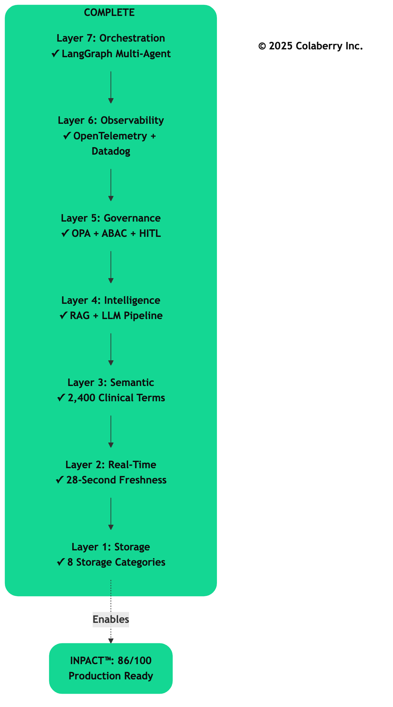
**Figure 6.14: The Architecture of Trust - Two Pillars Complete**


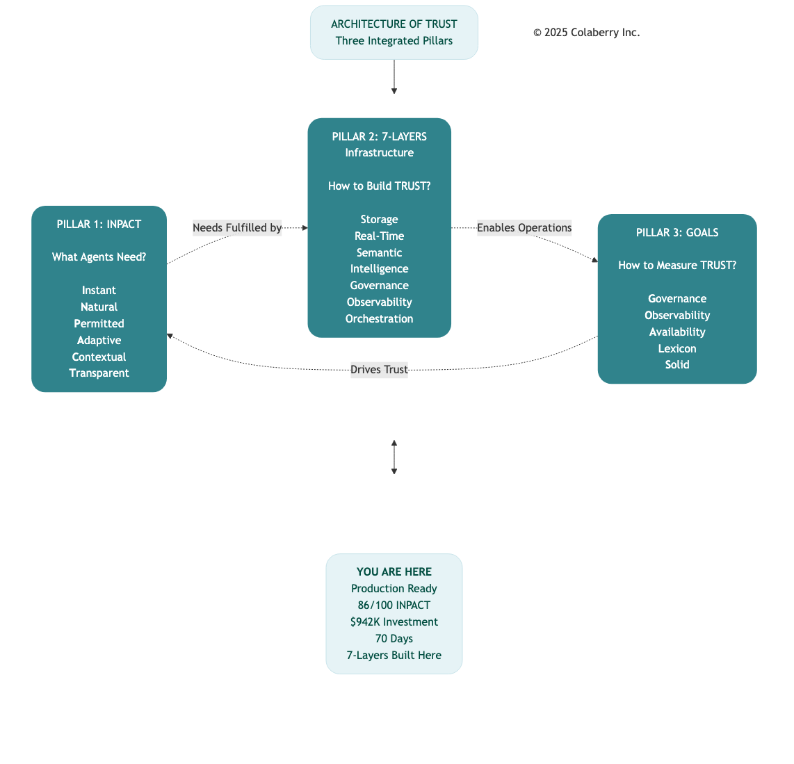
### What Echo Achieved

The journey started with a simple question: Why do 95% of agent projects fail? The answer was TRUST. The infrastructure gap between what agents could theoretically do and what organizations could safely let them do.

Echo closed that gap. Layer by layer, week by week, capability by capability. The complete transformation metrics are detailed in the Chapter Summary.

### The Seven Gaps: Resolved

The gaps identified in Chapter 3 are all resolved. All seven layers operational. The architecture is complete. (See Chapter Summary for the complete gap resolution table.)

### The ROI Preview

Krish Yadav, Echo's CFO, reviewed the numbers Friday evening:

**Investment:** $942,000 actual against $1.23M budget (23% under, with Phase 4 validation pending)  
**First-Year Value:** $3.8M (209% ROI)  
**18-Month Projected Value:** $5.87M (477% ROI)  
**Break-even Timeline:** 10 weeks post-deployment

"We spent $298,000 less than projected," Krish noted. "And the architecture is production-ready two weeks ahead of the board presentation. That never happens."

The remaining two weeks, Weeks 11-12, would validate these projections through operational deployment and measurement. Chapter 8 will document that validation. But the infrastructure prerequisite was complete.

---

## CHAPTER SUMMARY

| Part | Content | Key Takeaway |
|------|---------|--------------|
| **Part 1** | The Trust Risk | Intelligence without governance, observability, or orchestration is risk |
| **Part 2** | The Final Sprint | Week 8-10 planning: $82K budget, three layers, 67→86 target |
| **Part 3** | Layer 5 - Governance | ABAC + HITL for dynamic, context-aware authorization |
| **Part 4** | The Warfarin Scenario | AI drafts recommendations, humans approve high-risk decisions |
| **Part 5** | Layer 6 - Observability | Distributed tracing, MLOps monitoring, LLM cost tracking |
| **Part 6** | Layer 7 - Orchestration | Multi-agent coordination via LangGraph supervisor pattern |
| **Part 7** | Echo's Week 8-10 Build | Three-week implementation achieving 86/100 INPACT™ |
| **Part 8** | Architecture Complete | All 7 gaps closed, $942K invested, production ready |

### Key Takeaways

1. **Trust requires governance:** ABAC and HITL ensure agents operate within appropriate boundaries. The Warfarin scenario demonstrated this: AI drafts recommendations, humans approve high-risk decisions.

2. **Trust requires transparency:** Distributed tracing transforms black boxes into glass boxes. When systems fail or costs spike, operators need to understand why.

3. **Scale requires orchestration:** Multi-agent coordination supports complex workflows like discharge planning across scheduling, clinical and revenue that single agents cannot address.

4. **The 7-Layer Architecture is complete:** Foundation (Layers 1-2), Intelligence (Layers 3-4), and Trust + Orchestration (Layers 5-6-7) together create production-ready infrastructure.

5. **Architecture is a milestone, not a destination:** The 86/100 INPACT™ score represents capability. The GOALS™ framework in Chapter 7 measures operational reality.

### What Changed from Week 0 to Week 10

The complete transformation closed all seven gaps across three phases:

| Phase | Weeks | Layers | INPACT™ | Investment |
|-------|-------|--------|---------|------------|
| Foundation (Ch 4) | 1-4 | 1-2 | 28→42 | $468K |
| Intelligence (Ch 5) | 5-7 | 3-4 | 42→67 | $392K |
| Trust + Orchestration (Ch 6) | 8-10 | 5-7 | 67→86 | $82K |
| **Total** | **10 weeks** | **7 layers** | **28→86** | **$942K** |

(See Chapters 4-5 for detailed phase breakdowns. Phase 4 validation in Weeks 11-12: ~$50K pending. Gap resolution details in Part 1.)

### Echo Week 10 Status

| Metric | Week 0 | Week 10 | Improvement |
|--------|--------|---------|-------------|
| **INPACT™ Score** | 28/100 | 86/100 | +58 points |
| **Total Investment** | $0 | $942,000 | 23% under budget |
| **Architecture Layers** | 0/7 | 7/7 | Complete |
| **Gaps Remaining** | 7 | 0 | All resolved |

### Technologies Deployed (Chapter 6)

**Layer 5:** OPA (Open Policy Agent)[2], ABAC framework per NIST 800-162[3]

**Layer 6:** OpenTelemetry[6], Datadog APM[10]

**Layer 7:** LangGraph[12], Redis[14]

### What's Next

**Chapter 7:** GOALS™ Framework
- Operational excellence methodology
- Five measurement dimensions
- Echo Weeks 11-12: Validation and optimization
- Board presentation preparation

---

## REFERENCES

[1] National Institute of Standards and Technology. (2023). "AI Risk Management Framework (AI RMF 1.0)." https://www.nist.gov/itl/ai-risk-management-framework

[2] Cloud Native Computing Foundation. (2024). "Open Policy Agent." https://www.openpolicyagent.org

[3] National Institute of Standards and Technology. (2014). "Guide to Attribute Based Access Control (ABAC) Definition and Considerations." NIST Special Publication 800-162. https://csrc.nist.gov/publications/detail/sp/800-162/final

[4] Amershi, S., Weld, D., Vorvoreanu, M., et al. (2019). "Guidelines for Human-AI Interaction." *Proceedings of the 2019 CHI Conference on Human Factors in Computing Systems*. https://dl.acm.org/doi/10.1145/3290605.3300233

[5] U.S. Food and Drug Administration. (2024). "Artificial Intelligence and Machine Learning in Software as a Medical Device." https://www.fda.gov/medical-devices/software-medical-device-samd/artificial-intelligence-and-machine-learning-software-medical-device

[6] Cloud Native Computing Foundation. (2024). "OpenTelemetry." https://opentelemetry.io/docs/concepts/instrumentation/

[7] Sigelman, B. H., Barroso, L. A., Burrows, M., et al. (2010). "Dapper, a Large-Scale Distributed Systems Tracing Infrastructure." Google Technical Report. https://research.google/pubs/pub36356/

[8] Sculley, D., Holt, G., Golovin, D., et al. (2015). "Hidden Technical Debt in Machine Learning Systems." *Advances in Neural Information Processing Systems*, 28. https://papers.nips.cc/paper/2015/hash/86df7dcfd896fcaf2674f757a2463eba-Abstract.html

[9] Anthropic. (2024). "Claude Pricing." https://www.anthropic.com/pricing

[10] Datadog. (2024). "Application Performance Monitoring." https://www.datadoghq.com/product/apm/

[11] Wooldridge, M. (2009). *An Introduction to MultiAgent Systems* (2nd ed.). John Wiley & Sons. ISBN: 978-0470519462. https://www.wiley.com/en-us/An+Introduction+to+MultiAgent+Systems,+2nd+Edition-p-9780470519462

[12] LangChain. (2024). "LangGraph: Build Stateful, Multi-Agent Applications." https://github.com/langchain-ai/langgraph

[13] Yao, S., Zhao, J., Yu, D., et al. (2023). "ReAct: Synergizing Reasoning and Acting in Language Models." *International Conference on Learning Representations (ICLR)*. https://arxiv.org/abs/2210.03629

[14] Redis. (2024). "Redis Documentation." https://redis.io/docs/latest/integrate/redis-data-integration/data-pipelines/transform-examples/redis-expiration-example/

[15] Jacovi, A., Marasović, A., Miller, T., & Goldberg, Y. (2021). "Formalizing Trust in Artificial Intelligence: Prerequisites, Causes and Goals of Human Trust in AI." *Proceedings of the 2021 ACM Conference on Fairness, Accountability, and Transparency*, 624-635. https://arxiv.org/abs/2010.07487

[16] Gao, Y., Xiong, Y., Gao, X., et al. (2024). "Retrieval-Augmented Generation for Large Language Models: A Survey." *arXiv preprint arXiv:2312.10997*. https://arxiv.org/abs/2312.10997

---

**© 2025-2026 Colaberry Inc. All Rights Reserved.**
INPACT™ and GOALS™ are trademarks of Colaberry Inc.

*Acronyms and key terms are defined in the Glossary.*
