# Chapter 7: The GOALS™ Framework
## The Five Dimensions of Operational Excellence

---

**Diagram 1: GOALS™ Framework — From Build Complete to Operate Continuously**

```mermaid

graph LR
    subgraph BUILD["BUILD COMPLETE - WEEK 10"]
        direction TB
        B1["Architecture: Done<br/><br/>INPACT™: 86/100<br/><br/>7 Layers: Complete<br/><br/><b>How do you know<br/>it stays trustworthy?</b>"]
    end
    
    subgraph TRANSFORM["TRANSFORM"]
        direction TB
        T1["→"]
    end
    
    subgraph OPERATE["OPERATIONAL EXCELLENCE"]
        direction TB
        O1["G — Governance: 5/5<br/><br/>O — Observability: 4/5<br/><br/>A — Availability: 4/5<br/><br/>L — Lexicon: 4/5<br/><br/>S — Solid: 4/5<br/><br/><b>GOALS Total: 21/25 = 84%<br/>I can measure Trust<br/>Agents are trustworthy!"]
    end
    
    BUILD --> TRANSFORM --> OPERATE
    
    style BUILD fill:#FBEAEA,stroke:#EB898B,stroke-width:0.5px,color:#121212,rx:10,ry:10
    style TRANSFORM fill:#E6F3F6,stroke:#32738C,stroke-width:0.5px,color:#121212,rx:10,ry:10
    style OPERATE fill:#E6F3F6,stroke:#32738C,stroke-width:0.5px,color:#121212,rx:10,ry:10
    style B1 fill:#F6D1CE,stroke:#EB898B,stroke-width:0.5px,color:#7A1F22,rx:10,ry:10
    style T1 fill:#4478A6,stroke:#e4ebed,stroke-width:0.5px,color:#FFFFFF,rx:10,ry:10
    style O1 fill:#14D793,color:#003322,stroke:#0FB67D,stroke-width:0.5px,rx:10,ry:10


```

> **Key Takeaway:** *"Building is a 90-day project. Operating is forever."* — Dr. Arun Raj

## Part 1: The Architecture Is Complete. Now What?

### The Second Pillar Complete

Six chapters brought us here.

Chapter 0 introduced the Architecture of Trust—three pillars working together to transform infrastructure into agent-ready systems. Chapters 1-2 built the first pillar: INPACT™, defining the six needs agents require for trusted operation. Chapters 3-6 built the second pillar: the 7-Layer Architecture, the technical blueprint that fulfills those needs.

Last week, Echo Health completed that second pillar. Layer 7 orchestration went live. All seven layers operational. The architecture—beautifully designed, expertly constructed—stood complete.

But architecture alone doesn't create trust. Buildings need maintenance. Vehicles need service. Infrastructure needs operational discipline.

**This chapter builds the third pillar: GOALS™.**

### Week 10, Friday, 5:47 PM

Sarah Cedao stood at the window of Echo Health's technology center, watching the sun set over the campus. Behind her, the conference room still held the energy of celebration.

All seven layers operational. Every infrastructure gap closed. INPACT™ score: 86/100. $992K invested—19% under the $1.23M budget with $238K contingency preserved. Ten weeks of focused execution.

The architecture was complete.

But Dr. Raj's question from Monday's status briefing still echoed: "How do you know it stays trustworthy?"

Dr. Arun Raj, Echo's Board Chair, had spent fifteen years as a practicing cardiologist before moving into health IT leadership, then served as CEO for a decade before transitioning to the board. He had a gift for asking questions that cut through technical complexity to the heart of operational reality. It was Dr. Raj who had set the 90-day deadline after the failed pilots. Now, ten weeks in, he wanted to know not just what they'd built—but whether it would last.

Sarah had answered with architecture—layers, integrations, security controls. Dr. Raj had nodded politely, then asked again: "I understand what you built. But how do you know it *keeps working* six months from now? A year from now?"

That question changed everything.

### Building and Operating Are Different Disciplines

Marcus Williams, Echo's CDO and the architect of their transformation, joined Sarah at the window.

"You're thinking about Dr. Raj's question," he said.

"I've been thinking about nothing else. We built something remarkable. But building and running are different disciplines."

Marcus nodded slowly. "I've been researching exactly that problem. Not just operational best practices—but what regulators will require. The EU AI Act classifies clinical AI as 'high-risk.' NIST has published an AI Risk Management Framework. I've mapped what auditors will demand." [16] [17]

He pulled up a document on his tablet.

**Table: Regulatory Requirements for High-Risk Clinical AI**

| Regulatory Requirement | EU AI Act (2024/1689) | NIST AI RMF 1.0 | What Auditors Will Ask |
|------------------------|----------------------|-----------------|------------------------|
| **Risk Management** | Art. 9 (Risk Management System) | GOVERN 1.1, 1.2 | "Show me your documented policies and human-in-loop controls" |
| **Continuous Monitoring** | Art. 12 (Record-Keeping), Art. 19 (Logs), Art. 72 (Post-Market) | MEASURE 2.11, MANAGE 4.1 | "How do you detect incidents and track performance?" |
| **System Reliability** | Art. 15 (Accuracy, Robustness, Cybersecurity) | MAP 3, MEASURE functions | "What are your uptime guarantees and failover capabilities?" |
| **Transparency** | Art. 13 (Transparency), Art. 11 (Documentation) | MAP 5.1, GOVERN 1.2 | "Can users understand why the AI made this recommendation?" |
| **Data Governance** | Art. 10 (Data and Data Governance) | MAP 4, GOVERN 6 | "How do you ensure data quality and detect bias?" |

"Five categories," Marcus said. "Risk management. Monitoring. Reliability. Transparency. Data governance. Every high-risk AI system in healthcare will be audited against these requirements. The EU AI Act enforcement begins in 2025, with penalties up to €35 million or 7% of global revenue."

Sarah studied the table. "So this isn't about best practices anymore. It's about compliance."

"Exactly. And that's what drove me to develop a framework that maps directly to these requirements." Marcus set down the tablet. "But before I show you what I've built, let me ground it in a metaphor."

He continued. "Construction workers build hospitals. But hospitals need operational staff to keep them running—nurses, administrators, maintenance crews. We've been construction workers for ten weeks. Starting Monday, we need to become operators."

The metaphor crystallized what Sarah had been feeling. The 7-layer architecture was their hospital—beautifully designed, expertly constructed. But without operational excellence, even the best building deteriorates.

"The board will want to see that we can sustain this," Sarah said. "Dr. Raj will ask again at the Week 12 presentation."

"Then we need a framework for thinking about operational excellence," Marcus replied. "Something as rigorous as INPACT™ was for defining agent needs, but focused on sustainability rather than capability."

### From INPACT™ to GOALS™

Sarah turned to face him. "You've been thinking about this."

"I've developed a framework for thinking about this systematically," Marcus said. "I call it GOALS—Governance, Observability, Availability, Lexicon, and Solid." [12]

He walked to the whiteboard and sketched five interconnected circles.

"INPACT™ defines what agents *need*—the six requirements for trusted operation. The 7-layer architecture defines what you *build*—the technical infrastructure that fulfills those needs. GOALS™ defines what you *maintain*—the five dimensions of operational excellence that keep the architecture trustworthy over time."

Sarah thought about this distinction. "So INPACT™ is like a medical diagnosis—it tells you what the patient needs. The architecture is the treatment plan—the specific interventions. And GOALS™ is ongoing care—making sure the treatment keeps working."

"Exactly," Marcus said. "And just like in medicine, you can have the right diagnosis and the right treatment, but without ongoing monitoring and adjustment, outcomes deteriorate."

**The Architecture of Trust: Three Pillars**

**Diagram 2: The Architecture of Trust—Three Integrated Pillars**

```mermaid

graph TB
    Title["ARCHITECTURE OF TRUST<br/>Three Integrated Pillars"]
    
    subgraph PILLARS[" "]
        direction LR
        INPACT["PILLAR 1: INPACT™<br/><br/>What Agents Need?<br/><br/><b>I</b>nstant<br/><b>N</b>atural<br/><b>P</b>ermitted<br/><b>A</b>daptive<br/><b>C</b>ontextual<br/><b>T</b>ransparent"]
        
        Layers["PILLAR 2: 7-LAYERS<br/>Infrastructure<br/><br/>How to Build TRUST?<br/><br/>Storage<br/>Real-Time<br/>Semantic<br/>Intelligence<br/>Governance<br/>Observability<br/>Orchestration"]
        
        GOALS["PILLAR 3: GOALS™<br/><br/>How to Measure TRUST?<br/><br/><b>G</b>overnance<br/><b>O</b>bservability<br/><b>A</b>vailability<br/><b>L</b>exicon<br/><b>S</b>olid"]
    end
    
    Copyright["© 2025 Colaberry Inc."]
    
    Title --> PILLARS
    
    INPACT -.->|"Needs Fulfilled by"| Layers
    Layers -.->|"Enables Operations"| GOALS
    GOALS -.->|"Drives Trust"| INPACT
    
    style Title fill:#30838C,color:#ffffff,stroke:#0D0D0D,stroke-width:0.5px,rx:10,ry:10
    style PILLARS fill:none,stroke:none,rx:10,ry:10
    style INPACT fill:#327C8C,stroke:#30838C,stroke-width:0.5px,color:#ffffff,rx:10,ry:10
    style Layers fill:#4478A6,stroke:#32738C,stroke-width:0.5px,color:#ffffff,rx:10,ry:10
    style GOALS fill:#14D793,color:#121212,stroke:#0FB67D,stroke-width:0.5px,rx:10,ry:10
    style Copyright fill:none,stroke:none,stroke-width:0.5px,color:#000000


```

| Pillar | Framework | Purpose | When Applied |
|--------|-----------|---------|--------------|
| **Pillar 1** | INPACT™ | What agents NEED (6 trust requirements) | Assessment & Design |
| **Pillar 2** | 7-Layer Architecture | What you BUILD (technical infrastructure) | Construction |
| **Pillar 3** | GOALS™ | What you MAINTAIN (operational excellence) | Operations |

"Think of it this way," Marcus continued. "INPACT™ is the destination—agents that users trust. The architecture is the vehicle—the technical platform that makes trust possible. GOALS™ is the maintenance program—the operational discipline that keeps the vehicle running smoothly."

### Why Three Pillars, Not Two?

Dr. Chen raised the question many would ask: "Why do we need GOALS™ separately? Isn't observability already built into Layer 6? Isn't governance already in Layer 5?"

Marcus nodded—he'd anticipated this. "Layer 6 gives you the *capability* to observe. GOALS™ gives you the *targets* for what good looks like. A hospital can have monitoring equipment in every room—that's capability. But without target vital signs, nurses don't know when to intervene."

He pointed to the architecture diagram. "The 7-Layer Architecture tells you *what* to build. GOALS™ tells you *how well* it's working. They're complementary, not redundant."

Sarah added the business perspective: "We can have all seven layers operational and still fail in production if we're not measuring the right things. INPACT™ defines success. The architecture enables success. GOALS™ *validates* success."

### The Cross-Pillar Connection

Marcus expanded on the integration. "Each GOALS™ dimension validates specific INPACT™ needs by measuring specific 7-Layer components."

**Table: Cross-Pillar Mapping—How the Three Pillars Connect**

| GOALS™ Dimension | Validates INPACT™ Need | Measures 7-Layer Component |
|------------------|------------------------|---------------------------|
| **G** (Governance) | **P** (Permitted) | Layer 5: Policy Engine |
| **O** (Observability) | **T** (Transparent) | Layer 6: Observability |
| **A** (Availability) | **I** (Instant) | Layer 2: Real-Time Fabric |
| **L** (Lexicon) | **N** (Natural), **C** (Contextual) | Layer 3: Semantic Layer |
| **S** (Solid) | **A** (Adaptive) | Layer 1: Storage Foundation |

"When Governance scores drop," Marcus explained, "it signals the Permitted need is degrading—and points to Layer 5 as the problem area. When Lexicon scores drop, Natural language understanding is failing—check Layer 3. GOALS™ isn't just measurement. It's a diagnostic framework that traces operational issues back to their architectural roots."

Dr. Chen saw the elegance. "So GOALS™ closes the loop. INPACT™ defines what users need. The architecture fulfills those needs. GOALS™ proves the fulfillment is working—and tells us where to look when it isn't."

"Exactly," Marcus confirmed. "Three pillars, one Architecture of Trust."

### The Trust Equation

Sarah synthesized what she was hearing into a formula:

> **TRUSTED AGENTS = INPACT™ (What They Need) + 7-Layer (How You Build) + GOALS™ (How You Sustain)**

"For Echo, that means:"
- **INPACT™:** 86/100 capability achieved
- **7-Layer:** 7/7 layers operational  
- **GOALS™:** Target 21/25 for sustainability

"All three must be in place," she said. "Capability without sustainability degrades. Infrastructure without measurement is blind. Measurement without architecture has nothing to measure."

Sarah studied the diagram. "So our 86/100 INPACT™ score measures *capability*—what our infrastructure can do. But we need a different metric for *sustainability*—our ability to maintain that capability."

"Exactly. And that's what GOALS™ provides."

### The Scoring Philosophy

"Why five points per dimension?" the compliance officer asked.

"Because operational excellence isn't binary," Marcus explained. "You don't just 'have' governance or not. There are levels of maturity."

He sketched the progression:

**1/5 — Absent:** No formal capability
**2/5 — Basic:** Minimal implementation, reactive
**3/5 — Developing:** Structured but incomplete
**4/5 — Proficient:** Comprehensive, mostly automated
**5/5 — Advanced:** Full automation with continuous improvement

"Healthcare specifically requires 4/5 minimum in all dimensions and 5/5 in Governance for clinical AI," Marcus added. "These aren't arbitrary thresholds—they're mandated by regulation. The EU AI Act (Regulation 2024/1689) classifies clinical AI as 'high-risk,' with Articles 9—15 requiring risk management, data governance, transparency, human oversight, and continuous monitoring. [16] NIST's AI Risk Management Framework reinforces these through its GOVERN, MAP, MEASURE, and MANAGE functions. [17] Below these operational thresholds, you're not just risking failure—you're risking non-compliance."

### The Interdependence Principle

Marcus drew connecting lines between the five circles on the whiteboard.

"Here's what makes GOALS™ different from a simple checklist. These aren't five independent dimensions—they're interconnected like vital organs. Weakness in one cascades to the others."

He traced the connections:

**Governance ↔ Observability:** Audit trails enable observability to track who accessed what. Observability detects policy violations that governance must address.

**Observability ↔ Availability:** Monitoring tracks response times and freshness. Real-time metrics feed back into observability systems.

**Observability ↔ Lexicon:** Drift detection identifies when semantic mappings diverge. Improved language understanding increases query accuracy metrics.

**Observability ↔ Solid:** Data quality monitoring detects issues. Reliable data enables effective observability.

**Availability ↔ Lexicon:** Fast retrieval enables natural conversations. Semantic optimization reduces query latency.

**Lexicon ↔ Solid:** Semantic validation catches data inconsistencies. Quality data improves entity resolution.

**Solid ↔ Availability:** Clean data enables faster queries. Fresh data maintains quality.

**Governance ↔ Solid:** Access policies protect data integrity. Audit completeness depends on sound data.

"This interconnection means you can't optimize one GOAL in isolation," Marcus explained. "Improving Lexicon might require investments in Solid. Enhancing Availability might surface Governance gaps. Maintaining all five requires holistic thinking."

---

## Part 2: Echo's Operational Challenge

### Week 11, Monday, 8:00 AM

Sarah gathered her extended team in the large conference room. Marcus Williams, CDO. Dr. Chen, clinical liaison. The engineering leads from each layer team. The compliance officer. The data quality manager.

"We built something remarkable," Sarah began. "In ten weeks, we went from a 28/100 INPACT™ score to 86/100. We constructed all seven layers of agent-ready infrastructure. We came in at $942K through Week 10—23% under our $1.23M budget."

**Diagram 3: Echo's 90-Day Journey—Architecture Complete**

```mermaid

graph TB
    subgraph JOURNEY["ECHO'S 90-DAY JOURNEY"]
        direction TB
        subgraph PHASE1["Foundation (Weeks 1-4)"]
            direction LR
            W1["Week 1-2<br/>Layer 1: Storage<br/>Multi-modal data"]
            W2["Week 3-4<br/>Layer 2: Data Fabric<br/>Real-time streaming"]
            W1 --> W2
        end
        
        subgraph PHASE2["Intelligence (Weeks 5-7)"]
            direction LR
            W3["Week 5-6<br/>Layer 3: Semantic<br/>Business meaning"]
            W4["Week 7<br/>Layer 4: Intelligence<br/>RAG + LLM"]
            W3 --> W4
        end
        
        subgraph PHASE3["Trust (Weeks 8-10)"]
            direction LR
            W5["Week 8<br/>Layer 5: Governance<br/>Security & HITL"]
            W6["Week 9<br/>Layer 6: Observability<br/>Tracing & Monitoring"]
            W7["Week 10<br/>Layer 7: Orchestration<br/>Multi-Agent Coordination"]
            W5 --> W6 --> W7
        end
    end
    
    COMPLETE["Architecture Complete<br/>INPACT™: 86/100 | $942K Invested"]
    
    Copyright["© 2025 Colaberry Inc."]
    
    PHASE1 --> PHASE2 --> PHASE3 --> COMPLETE

    style JOURNEY fill:#E6F3F6,stroke:#666666,stroke-width:0.5px,color:#121212,rx:10,ry:10
    style PHASE1 fill:#E6F3F6,stroke:#32738C,stroke-width:0.5px,color:#121212,rx:10,ry:10
    style PHASE2 fill:#E6F3F6,stroke:#32738C,stroke-width:0.5px,color:#121212,rx:10,ry:10
    style PHASE3 fill:#E6F3F6,stroke:#32738C,stroke-width:0.5px,color:#121212,rx:10,ry:10
    style W1 fill:#327C8C,stroke:#30838C,stroke-width:0.5px,color:#ffffff,rx:10,ry:10
    style W2 fill:#327C8C,stroke:#30838C,stroke-width:0.5px,color:#ffffff,rx:10,ry:10
    style W3 fill:#327C8C,stroke:#30838C,stroke-width:0.5px,color:#ffffff,rx:10,ry:10
    style W4 fill:#327C8C,stroke:#30838C,stroke-width:0.5px,color:#ffffff,rx:10,ry:10
    style W5 fill:#327C8C,stroke:#30838C,stroke-width:0.5px,color:#ffffff,rx:10,ry:10
    style W6 fill:#327C8C,stroke:#30838C,stroke-width:0.5px,color:#ffffff,rx:10,ry:10
    style W7 fill:#327C8C,stroke:#30838C,stroke-width:0.5px,color:#ffffff,rx:10,ry:10
    style COMPLETE fill:#14D793,stroke:#0FB67D,stroke-width:0.5px,color:#003322,rx:10,ry:10
    style Copyright fill:none,stroke:none,stroke-width:0.5px,color:#000000

```

Nods around the room. Tired but satisfied faces.

"But Dr. Raj asked a question Monday that we need to answer before the Week 12 board presentation: How do we know it *stays* trustworthy?"

The room grew quiet.

"Building infrastructure and operating infrastructure require different disciplines," Sarah continued. "For ten weeks, we've been construction workers. Starting today, we become operators. And that requires a framework for operational excellence."

She turned to Marcus. "Walk us through GOALS™."

### The Five GOALS™

Marcus stood and displayed the framework on the conference room screen.

"GOALS™ defines five dimensions of operational excellence for agent-ready infrastructure. Like vital organs in a body, each supports the others. Weakness in one cascades throughout the system."

**Table 1: The Five GOALS™ Dimensions**

| Dimension | Full Name | What It Covers |
|-----------|-----------|----------------|
| **G** | Governance: Security, Compliance & Control | ABAC, HITL workflows, audit trails, change management, model versioning with rollback |
| **O** | Observability: Monitoring, Cost & Maintainability | APM, distributed tracing, LLM cost tracking, alerting, drift detection, explainability |
| **A** | Availability: Speed, Freshness & Scale | Sub-2-second response, sub-30-second freshness, 10x scalability, 99.9%+ uptime |
| **L** | Lexicon: Semantic Understanding & Accuracy | Entity resolution, terminology mapping, query interpretation, ontology, disambiguation |
| **S** | Solid: Data Quality & Integrity | Accuracy, completeness, consistency, timeliness, schema validation |

"Each dimension has measurable targets," Marcus continued. "And each dimension connects to our INPACT™ requirements."

### Understanding the Gap

"What's our current GOALS™ health?" Dr. Chen asked, leaning forward. As clinical liaison, she needed to translate operational metrics into language the clinical staff would understand.

Marcus pulled up preliminary numbers. "Based on our Week 10 status, I'd estimate we're at about 75% GOALS™ health—that's 15 out of 25 possible points."

Sarah frowned. "But we just said INPACT™ is 86/100. Why the gap?"

"Different measurements for different purposes," Marcus explained. "INPACT™ measures whether infrastructure *can* fulfill agent needs—the capability we've built. GOALS™ measures whether we can *sustain* that capability over time—operational excellence. Think of it this way: we built a great car, but we haven't yet proven we can maintain it."

He pulled up a validation chart. "Colaberry's research is clear: proficiency across all five regulatory categories correlates with production success. Gaps lead to degraded outcomes. Major gaps lead to failure. We're at 15—below the 21-point threshold for proficiency across all five. That's why Weeks 11-12 matter so much."

"So the 86/100 INPACT™ score means we *can* support trusted agents," Dr. Chen said. "But the 15/25 GOALS™ score means we haven't proven we can *keep* them trusted."

"Exactly. The 10-point gap represents operational discipline we haven't yet established. By Week 12, we need GOALS™ at 21 or above."

**Table 2: Echo's GOALS™ Operational Health Baseline (Week 10)**
*Note: GOALS™ (max 25 points) measures operational sustainability, distinct from INPACT™ (max 100) capability score. Healthcare production requires 21+ GOALS™ points.*

**Diagram 4: Echo's GOALS Health Dashboard (Week 10 Baseline)**

| GOAL | Current | Target | Gap | Priority |
|------|---------|--------|-----|----------|
| **G - Governance** | 3/5 | 5/5 | 2 | Week 11 |
| **O - Observability** | 3/5 | 4/5 | 1 | Week 11 |
| **A - Availability** | 4/5 | 4/5 | 0 | Maintain |
| **L - Lexicon** | 2/5 | 4/5 | 2 | Week 11-12 |
| **S - Solid** | 3/5 | 4/5 | 1 | Week 11 |
| **Total** | **15/25** | **21/25** | **6** | — |

"Let's go through each dimension," Sarah said. "I want everyone to understand not just what we need to do, but why it matters."

---

## Part 3: GOAL 1 — Governance
### Security, Compliance & Control

### What Governance Means

Governance answers the fundamental question: *Who can do what, when, and why—and who's watching?*

For traditional BI systems, governance was primarily about dashboard permissions. For AI agents, governance becomes exponentially more complex. Agents make autonomous decisions. They access data dynamically. They operate at machine speed.

"Without governance, agents violate compliance requirements, access unauthorized data, and expose us to legal and regulatory risk," Marcus explained. "In healthcare, HIPAA penalties can reach $50,000+ per violation. The Montefiore settlement in 2024 cost $4.75M for unauthorized access issues." [2]

Chapter 6 introduced ABAC implementation—the technical "how" of attribute-based access control. Here we focus on measuring its *operational health*: not just "is ABAC deployed?" but "is ABAC working effectively at scale?"

The difference matters. A policy that evaluates in 6ms today might degrade to 60ms under load. A policy that covers 95% of access patterns might miss the 5% that matter most.

### Why Agents Need Governance

Dr. Chen raised a concern. "Our physicians already complain about too many login screens. Will governance slow them down further?"

"Done poorly, yes," Marcus acknowledged. "Done well, governance is invisible to authorized users while blocking unauthorized access in real-time."

He displayed Echo's governance architecture.

"Our ABAC policies evaluate in under 10 milliseconds—imperceptible to users. But they evaluate *five* attributes on every data request."

**The Five W's of ABAC Authorization:**

Traditional RBAC asks one question: "What role does this user have?"

Dynamic ABAC asks five questions simultaneously:

- **💤 Who:** Patient ID 12345 requesting data (not just "a patient role")
- **📝 What:** Specific table and columns being accessed (lab_results, not all patient data)
- **📦 When:** Timestamp and business context (normal business hours vs. suspicious 3am access)
- **📱 Where:** Access channel and location (mobile app from registered device vs. unknown location)
- **🤝 Why:** Business justification (patient self-access vs. administrative lookup)

These five dimensions enable policies that are dynamically evaluated in real-time, achieving the sub-10ms latency agents require while maintaining HIPAA's "minimum necessary" compliance standard. [1]

**Diagram 5: RBAC vs ABAC Authorization Flow**

```mermaid
graph LR
    subgraph OLD["<b>Analytics Era: RBAC</b>"]
        TITLE1["<b>Role-Based Access Control</b>"]
        R1["<b>User Request</b>"]
        R2["<b>Check Role</b>"]
        R3["<b>Role = Patient</b>"]
        R4["<b>Grant Broad Access</b>"]
        R5["<b>Violates minimum <br/>necessary access</b>"]
        
        TITLE1 --> R1
        R1 --> R2
        R2 --> R3
        R3 --> R4
        R4 --> R5
    end
    
    OLD -.->|<b>Evolution</b>| NEW
    
    subgraph NEW["<b>Agent Era: ABAC</b>"]
        TITLE2["<b>Attribute-Based Access Control</b>"]
        A1["<b>User Request</b>"]
        A2["<b>Context Eval</b><br/><b>Who • What • When <br/> Where • Why</b>"]
        A3["<b>Dynamic Policy</b>"]
        A4["<b>Filter Rows</b>"]
        A5["<b>Sub-10ms secure access</b>"]
        
        TITLE2 --> A1
        A1 --> A2
        A2 --> A3
        A3 --> A4
        A4 --> A5
    end
    
    style TITLE1 fill:#EB898B,color:#ffffff,stroke:#7A1F22,stroke-width:0.5px,rx:10,ry:10
    style R1 fill:#F6D1CE,stroke:#EB898B,stroke-width:0.5px,color:#7A1F22,rx:10,ry:10
    style R2 fill:#F6D1CE,stroke:#EB898B,stroke-width:0.5px,color:#7A1F22,rx:10,ry:10
    style R3 fill:#F6D1CE,stroke:#EB898B,stroke-width:0.5px,color:#7A1F22,rx:10,ry:10
    style R4 fill:#F6D1CE,stroke:#EB898B,stroke-width:0.5px,color:#7A1F22,rx:10,ry:10
    style R5 fill:#EB898B,color:#ffffff,stroke:#7A1F22,stroke-width:0.5px,rx:10,ry:10
    
    style TITLE2 fill:#327C8C,stroke:#30838C,stroke-width:0.5px,color:#ffffff,rx:10,ry:10
    style A1 fill:#7FD5E8,stroke:#32738C,stroke-width:0.5px,color:#00323D,rx:10,ry:10
    style A2 fill:#7FD5E8,stroke:#32738C,stroke-width:0.5px,color:#00323D,rx:10,ry:10
    style A3 fill:#7FD5E8,stroke:#32738C,stroke-width:0.5px,color:#00323D,rx:10,ry:10
    style A4 fill:#7FD5E8,stroke:#32738C,stroke-width:0.5px,color:#00323D,rx:10,ry:10
    style A5 fill:#30838C,color:#ffffff,stroke:#0D0D0D,stroke-width:0.5px,rx:10,ry:10

    style OLD fill:#FBEAEA,stroke:#EB898B,stroke-width:0.5px,color:#121212,rx:10,ry:10
    style NEW fill:#E6F3F6,stroke:#32738C,stroke-width:0.5px,color:#121212,rx:10,ry:10
    
    Copyright["<b>© 2025 Colaberry Inc.</b>"]
    style Copyright fill:none,stroke:none,color:#4d4d4d
```

### The Authentication Challenge

When a patient asks Echo's agent: "Show me my recent lab results," the agent must:

1. Verify the requesting user (authentication)
2. Confirm they're authorized (authorization)
3. Determine which specific lab results they're permitted to view (dynamic filtering)
4. Mask fields they shouldn't see (provider notes)
5. Log the entire access with business justification (HIPAA audit trails)

And complete all of this in milliseconds.

Traditional role-based access control can't handle this complexity. Giving the agent a "patient" role doesn't tell you which specific patient's data they should see. You need attribute-based access control policies that evaluate dozens of factors in real-time.

### Human-in-the-Loop: Balancing Autonomy and Oversight

Governance isn't just about what agents *can* do—it's also about what they *should* do without human approval. Not all decisions warrant full automation.

Human-in-the-loop (HITL) patterns enable agents to escalate high-stakes decisions to humans while maintaining autonomy for routine operations. This isn't a limitation—it's a strategic boundary that enables enterprise adoption. [3]

**The Autonomy Spectrum:**

Agents operate across a spectrum from fully automated to fully supervised:

- **Full autonomy**: Agent executes without approval (appointment scheduling for available slots)
- **Conditional autonomy**: Agent executes unless conditions trigger approval (refills for controlled substances require approval)
- **Human-in-the-loop**: Agent proposes, human approves before execution (prior authorization requests >$5K)
- **Human-on-the-loop**: Agent executes, human monitors and can override (care plan recommendations)
- **Full manual**: Agent provides information only, human decides and executes (diagnoses, treatment plans)

The art is positioning decisions correctly on this spectrum—too much autonomy creates risk, too little negates agent value.

**Diagram 6: Human-in-the-Loop Autonomy Spectrum**

**Echo Health's HITL Decision Matrix:**

| Decision Type | Risk Level | Autonomy | Approval Required? |
|---------------|------------|----------|-------------------|
| Appointment scheduling | Low | Full | No |
| Medication refill (routine) | Low | Full | No |
| Medication refill (controlled) | High | HITL | Always |
| Lab result delivery (abnormal) | High | HITL | Always |
| Prior authorization (>$5K) | High | HITL | Always |
| Care plan modification | High | Human-on-loop | Provider reviews |

### Measuring Governance

Marcus outlined the key metrics:

**Governance Operational Metrics:**
- ABAC policy evaluation: <10ms (currently: 6ms ✓)
- Audit log coverage: 100% of data access (currently: 95%)
- HITL escalation time: <30 seconds (currently: 45 seconds)
- Secrets encryption: 100% (currently: 100%)
- Model rollback capability: <15 minutes (currently: untested)

"The audit coverage gap concerns me," the compliance officer said. "What's missing?"

"Cached responses," Marcus replied. "When an agent returns a cached answer, we're not logging the access consistently. That's a Week 11 priority."

### Governance Scoring Calibration

| Score | What It Looks Like |
|-------|-------------------|
| **2/5** | Basic RBAC only, login audit logs, no HITL workflows |
| **3/5** | ABAC policies defined but inconsistent enforcement, 70% audit coverage |
| **4/5** | ABAC operational, 100% audit trails, HITL for medication overrides |
| **5/5** | ABAC + complete audit + HITL for all clinical decisions + SOC2/HITRUST + tested rollback |

"Healthcare requires 5/5 for clinical AI deployment," Marcus emphasized. "Organizations with Governance below 5 face compliance blocks or restricted scope. This isn't optional."

### AI-Specific Threats

Governance explicitly includes adversarial threat modeling for AI-specific attacks: prompt injection, data poisoning, and semantic drift. Unlike traditional security threats, these exploit the AI's learning and interpretation mechanisms.

Detection requires combined monitoring across Governance (audit trails for unusual patterns), Observability (query anomaly detection), and Solid (cross-system reconciliation to catch data poisoning).

Model versioning with tested rollback capability (<15 minutes to revert) provides recovery when attacks succeed or when model updates introduce quality regressions.

### Echo's ABAC Impact

"Let me show you what proper governance looks like operationally," Marcus said, pulling up before/after metrics:

**Echo's ABAC Implementation Results (Week 10):**

*Improvement targets based on Colaberry implementation patterns:*

| Metric | Before ABAC | After ABAC | Industry Benchmark |
|--------|-------------|------------|-------------------|
| Violation detection time | Manual audit (batch) | Real-time (<60 sec) | ABAC enables real-time vs. periodic [1] |
| Audit trail completeness | ~60% | 94%+ | HIPAA requires comprehensive logging [18] |
| False positive alerts | ~300-400/mo | <15/mo | Industry avg: >50% are false positives [19] |
| Authorization latency | ~45ms | <10ms | NIST recommends ABAC for dynamic permissions [1] |

*Note: Pre-implementation baselines estimated from initial assessment. Post-implementation results validated through Week 10 testing.*

"The false positive reduction is critical," the compliance officer noted. "Security operations centers face over 10,000 alerts daily with more than 50% being false positives. Research shows this causes analysts to turn off alerts, ignore them, or offload to colleagues—and 66% of SOC teams report they cannot keep pace with incoming alert volumes. Before ABAC, we were experiencing exactly this pattern. After implementation, we're down to actionable alerts only. Every alert gets investigated." [19]

### Key Technologies for Agent Governance

*For detailed vendor recommendations including ABAC policy engines and audit logging platforms, see Appendix DA-1: Technology Selection Guide, Layer 5 (Security & Policy) section.*

**Selection criteria:** Prioritize ABAC over RBAC for dynamic permissions, sub-10ms policy evaluation latency, comprehensive audit trails with business context, and integration with your cloud provider's identity systems.

### Multi-Agent Governance Complexity

The governance challenge intensifies with multi-agent systems.

Echo's insurance pre-authorization agent coordinates with the scheduling agent, clinical documentation agent, and pharmacy agent. Each specialist has different data access requirements.

The orchestrator must enforce permissions for each agent independently while maintaining a coherent audit trail showing the complete request chain.

### Why Governance Comes First

Governance is first not because it's most important—all five GOALS matter equally—but because governance failures have immediate, severe consequences.

A performance degradation in Availability frustrates users.

A governance failure results in HIPAA violations, security breaches, or compliance fines.

### The Continuous Practice

Governance isn't a one-time implementation but a continuous practice.

New data sources require new policies. New agents require new permission scopes. New regulations require policy updates.

Echo reviews governance health weekly, updates policies monthly, conducts compliance audits quarterly.

This operational cadence separates organizations that maintain governance health from those whose governance degrades over time.

### Echo's Governance Operations

"For Week 11, we need three things," Marcus said. "First, complete the audit trail coverage—every cached response logged. Second, reduce HITL escalation time from 45 to under 30 seconds. Third, test our rollback capability."

Dr. Chen nodded. "I'll work with the clinical staff on HITL workflows. We need to make sure escalations get to the right people."

---

## 📓 Checkpoint 1: Governance Foundation Complete

**What we've covered:**

✅ **GOAL 1 (Governance):** Security, compliance, and control at agent scale—ABAC vs RBAC evolution, the Five W's framework, HITL autonomy spectrum, audit trail requirements, and model versioning with rollback capability. [1]

**Key metrics established:**
- ABAC policy evaluation: <10ms target
- Audit log coverage: 100% of data access
- HITL escalation time: <30 seconds
- Model rollback capability: <15 minutes

**Healthcare insight:** Governance requires 5/5 for clinical AI deployment. Organizations with Governance below 5 face compliance blocks. This dimension is non-negotiable in regulated industries.

**Coming next:** Observability (the diagnostic layer), Availability (speed and freshness), Lexicon (semantic understanding), and Solid (data quality foundation).

---

## Part 4: GOAL 2 — Observability
### Monitoring, Cost & Maintainability

### What Observability Means

Observability answers: *Can you see what's happening inside your system—and explain why?*

"If you can't see it, you can't trust it," Marcus stated. "And if you can't explain it, regulators won't trust it either."

Observability rests on three pillars: logs (what happened), metrics (how much), and traces (the journey). For AI agents, observability extends to cost tracking (LLM calls are expensive), drift detection (models degrade over time), and explainability (why did the agent say that?). [5]

### The Mystery of Declining Satisfaction

*This composite scenario illustrates a pattern observed across multiple implementations:*

Four months after launch at a healthcare system, teams noticed something strange: user satisfaction scores were declining, but they couldn't figure out why.

The agent responded quickly (1.8 seconds average). Accuracy seemed reasonable (85% of queries handled). Infrastructure metrics showed all systems operational.

Yet patients were increasingly frustrated.

The problem wasn't what they were measuring—it was what they weren't measuring.

Monitoring focused on infrastructure health: database query times, API response codes, server CPU, network latency. These metrics said the system was running, but not whether it was working well.

They had no visibility into whether answers were actually correct, whether semantic understanding was degrading, whether certain queries consistently failed, or which data quality issues caused wrong answers.

### Why Agents Need Observability

"Here's a scenario," Marcus said. "At 3 AM, the on-call engineer gets paged. Response times have spiked from 1.8 seconds to 12 seconds. Without observability, they're flying blind. Which layer is the problem? The database? The LLM? The cache? Network latency?"

He showed a trace visualization. "With distributed tracing, they can see the entire journey of a request—across all seven layers, across all services. They can identify that the LLM provider is having an outage in under two minutes instead of two hours."

### The Power of End-to-End Tracing

The breakthrough comes with comprehensive tracing using global trace IDs.

Every agent request receives a unique identifier propagating through all seven layers. When a query fails, teams can follow the trace ID backward through the entire execution chain:

User query → semantic translation → retrieval → policy evaluation → data access → response generation → user delivery.

This enables root cause analysis impossible with infrastructure metrics alone.

**Diagram 7: End-to-End Observability with Trace IDs (All 7 Layers)**

```mermaid
sequenceDiagram
    participant U as User
    participant L7 as Layer 7<br/>Agent
    participant L6 as Layer 6<br/>Observability
    participant L5 as Layer 5<br/>Governance
    participant L4 as Layer 4<br/>Intelligence
    participant L3 as Layer 3<br/>Semantic
    participant L2 as Layer 2<br/>Real-Time
    participant L1 as Layer 1<br/>Storage
    
    rect rgb(224, 242, 241)
        Note over U,L1: Trace ID: abc-123-def | All 7 layers instrumented
    end
    
    U->>L7: Show Dr. Martinez's availability tomorrow
    activate L7
    L7->>L6: 📊 Log: Query received (trace: abc-123-def)
    
    L7->>L3: Translate: Dr. Martinez + availability
    activate L3
    L3->>L6: 📊 Log: Semantic translation 0.3s
    L3-->>L7: provider_id=789, date=2025-10-28
    deactivate L3
    
    L7->>L5: Check: User authorized for provider schedule?
    activate L5
    L5->>L6: 📊 Log: ABAC policy eval 8ms ✓
    L5-->>L7: Authorized (policy: patient-provider-access)
    deactivate L5
    
    L7->>L4: Retrieve: provider_schedule context
    activate L4
    L4->>L2: Subscribe: schedule_updates stream
    activate L2
    L2->>L6: 📊 Log: Stream check 15ms (fresh)
    L2-->>L4: Last update: 12s ago ✓
    deactivate L2
    L4->>L1: Query: provider_schedule WHERE id=789
    activate L1
    L1->>L6: ⚠️¸ Log: Query 2.3s - SLOW
    Note over L1: Missing index!
    L1-->>L4: Result: 3 time slots
    deactivate L1
    L4-->>L7: Context: [8am, 10am, 2pm]
    deactivate L4
    
    L7->>L6: 📊 Log: Response 2.9s total | All layers traced
    L7->>U: Dr. Martinez has 3 openings tomorrow
    deactivate L7
    
    rect rgb(255, 235, 238)
        Note over L6: Root Cause: Layer 1 bottleneck<br/>All 7 layers visible in trace
    end
    
    Note over U,L1: © 2025 Colaberry Inc.
```

**Echo's Observability Improvement Targets:**

*Targets informed by Google SRE principles and industry observability benchmarks:* [5]

| Metric | Before (Week 10) | Target (Week 12) | Industry Reference |
|--------|------------------|------------------|-------------------|
| Mean time to root cause | ~4 hours | <10 minutes | Google SRE: <30 min |
| Auto-diagnosed issues | ~5% | >60% | Industry leaders: 65-70% achievable |
| False positive alerts | High volume | 87% reduction | Reduces alert fatigue [19] |
| Human investigation required | ~95% | <40% | Enables team scaling |

*Note: Pre-implementation estimates based on initial observability assessment. Targets validated through proof-of-concept testing.*

### The Explainability Requirement

EU AI Act Article 13 requires transparency for high-risk AI systems—which includes healthcare AI. Organizations must be able to explain agent decisions to clinicians, patients, and regulators.

"This isn't just nice to have," Marcus emphasized. "The EU AI Act requires full compliance by August 2026. Healthcare AI is classified as high-risk. We need to be able to answer: Why did the agent recommend this? What data did it use? How confident is it?" [4]

**Explainability Metrics:**

- **Confidence calibration:** When an agent says it's 90% confident, it should be correct 85-95% of the time. Track calibration curves monthly, recalibrating when drift exceeds ±5%.
- **Trace completeness:** 100% of responses include full lineage—which data sources, which policies applied, which models generated the response.
- **Response justification:** Every recommendation includes reasoning. Not just "approved" but "approved because HbA1c >7.0 AND insurance covers program AND patient engagement score 85."

**Diagram 8: Output Quality Validation Metrics**

```mermaid
graph TB
    AGENT["<b>Agent Response</b><br/><b>Generated output</b>"]
    
    subgraph METRICS["<b>Output Quality Validation</b>"]
        M1["<b>Factual Accuracy</b><br/><b>Target: >95%</b>"]
        M2["<b>Hallucination Rate</b><br/><b>Target: <2%</b>"]
        M3["<b>Consistency</b><br/><b>Target: 98%+</b>"]
        M4["<b>User Satisfaction</b><br/><b>Target: >85%</b>"]
    end
    
    VALIDATE{<b>All metrics<br/>passing?</b>}
    
    PASS["<b>Production Ready</b><br/><b>Quality validated</b>"]
    FAIL["<b>Investigation</b><br/><b>Review required</b>"]
    
    FEEDBACK["<b>Continuous Loop</b><br/><b>Daily • Weekly • Monthly</b>"]
    
    AGENT --> M1
    AGENT --> M2
    AGENT --> M3
    AGENT --> M4
    
    M1 --> VALIDATE
    M2 --> VALIDATE
    M3 --> VALIDATE
    M4 --> VALIDATE
    
    VALIDATE -->|<b>Pass</b>| PASS
    VALIDATE -->|<b>Fail</b>| FAIL
    
    PASS --> FEEDBACK
    FAIL --> FEEDBACK
    FEEDBACK -.->|<b>Improves</b>| AGENT
    
    style AGENT fill:#ffffff,stroke:#666666,stroke-width:0.5px,color:#000000,rx:10,ry:10
    style METRICS fill:#E6F3F6,stroke:#32738C,stroke-width:0.5px,color:#121212,rx:10,ry:10
    style M1 fill:#7FD5E8,stroke:#32738C,stroke-width:0.5px,color:#00323D,rx:10,ry:10
    style M2 fill:#7FD5E8,stroke:#32738C,stroke-width:0.5px,color:#00323D,rx:10,ry:10
    style M3 fill:#7FD5E8,stroke:#32738C,stroke-width:0.5px,color:#00323D,rx:10,ry:10
    style M4 fill:#7FD5E8,stroke:#32738C,stroke-width:0.5px,color:#00323D,rx:10,ry:10
    style VALIDATE fill:#4478A6,stroke:#32738C,stroke-width:0.5px,color:#ffffff,rx:10,ry:10
    style PASS fill:#14D793,stroke:#0FB67D,stroke-width:0.5px,color:#003322,rx:10,ry:10
    style FAIL fill:#EB898B,stroke:#7A1F22,stroke-width:0.5px,color:#ffffff,rx:10,ry:10
    style FEEDBACK fill:#327C8C,stroke:#30838C,stroke-width:0.5px,color:#ffffff,rx:10,ry:10
    
    Copyright["<b>© 2025 Colaberry Inc.</b>"]
    style Copyright fill:none,stroke:none,color:#4d4d4d
```

### Measuring Observability

**Observability Operational Metrics:**
- APM coverage: All services instrumented (currently: 94%)
- LLM call tracing: 100% with cost attribution (currently: 100%)
- MTTD (Mean Time to Detection): <5 minutes (currently: 8 minutes)
- Daily LLM cost visibility: Yes (currently: $850/day)
- High-risk decisions retrievable: Explainability enabled (currently: partial)

### Observability Scoring Calibration

| Score | What It Looks Like |
|-------|-------------------|
| **2/5** | Application logs only, no APM, no LLM cost tracking |
| **3/5** | APM deployed, dashboards exist, basic alerting |
| **4/5** | APM + LLM tracing + cost attribution + MTTD <10 min |
| **5/5** | Full observability + anomaly detection + drift monitoring + MTTD <5 min + explainability |

### The Prioritization Principle

"Here's something counterintuitive," Marcus said. "When resources are limited, fix Observability first—even before other dimensions that seem more broken."

The room looked skeptical.

"Without Observability, you can't detect failures in other dimensions. If Governance fails but you can't see it, the breach continues. If data quality degrades but you can't measure it, wrong answers accumulate. Observability is the foundation that makes everything else fixable."

When resource constraints require sequencing, follow this prioritization: **O→S→G→L→A**. Observability first (can't improve what you can't measure), then Solid (data quality cascades everywhere), then Governance (compliance risk), then Lexicon (semantic refinement), then Availability (performance polish). As Google's SRE handbook states in Chapter 6: "If you can't monitor a service, you don't know what's happening, and if you're blind to what's happening, your service can't be reliable." [5]

### Key Technologies for Agent Observability

*For detailed vendor recommendations including ML/LLM monitoring platforms and data quality tools, see Appendix DA-1: Technology Selection Guide, Layer 6 (Observability) section.*

**Selection criteria:** Choose platforms supporting trace IDs across all seven layers, model drift detection for embeddings and LLMs, data quality monitoring with automated alerting, and closed-loop feedback capabilities.

### Echo's Observability Maturity Journey

**Stage 1: Basic Monitoring (Score: 52/100)**

Infrastructure health tracked. Error logs captured exceptions. Quarterly reviews found some issues.

No trace-level debugging. No model performance tracking. No automated quality detection.

**Stage 2: Enhanced Observability (Score: 75/100)**

Trace IDs enabled end-to-end debugging. Model drift detection automated. Data quality monitoring comprehensive. Most issues found within hours.

**Stage 3: Advanced with Closed-Loop Feedback (Score: 88/100)**

Automated root cause analysis diagnosed problems within minutes. Feedback loops automatically triggered improvements. System learned from every failure.

### Continuous Observability Operations

Observability requires continuous vigilance at multiple cadences:

**Daily:** Review dashboards for anomalies. Check alert queue for emerging issues. Verify critical pipelines running.

**Weekly:** Analyze semantic drift trends. Review user feedback patterns. Calibrate model confidence scores.

**Monthly:** Analyze trends in semantic drift, data quality, cost patterns. Adjust coverage for new sources.

**Quarterly:** Comprehensive audit. Validate monitoring captures all critical failure modes. Update alerting rules.

---

## 📓 Checkpoint 2: Observability Foundation Complete

**What we've covered:**

✅ **GOAL 2 (Observability):** The diagnostic foundation—end-to-end tracing with global trace IDs across all 7 layers, output quality validation metrics (accuracy >95%, hallucination <2%), explainability for EU AI Act compliance, and the three pillars of logs, metrics, and traces.

**Key insight:** The prioritization principle O→S→G→L→A places Observability first because without visibility, you can't detect or diagnose failures in other dimensions.

**Echo's status:** Observability at 3/5 → targeting 4/5 by Week 12 (explainability gap)

**Coming next:** Availability (the speed dimension), Lexicon (semantic understanding), and Solid (data quality foundation).

---

## Part 5: GOAL 3 — Availability
### Speed, Freshness & Scale

### What Availability Means

Availability answers: *Can users actually use the system when they need it—and does it respond fast enough to be useful?*

For AI agents, availability has three dimensions: speed (response time), freshness (data currency), and scale (handling load growth).

### The Nine-Second Wait That Lost Users

Two weeks after an early agent launch, Sarah watched a usability test from another implementation.

The patient asked: "Can I see Dr. Martinez tomorrow morning?"

The agent processed. Retrieved data. Evaluated availability. Checked insurance. Assembled response.

Nine seconds later, it answered: "Dr. Martinez has three openings tomorrow morning: 8:00am, 9:30am, and 11:00am."

But the patient had already closed the browser tab and picked up the phone.

Users expect conversational speed because ChatGPT, Alexa, and Siri trained them that AI responds in seconds. A nine-second response feels broken even when it's technically successful.

"Our original system had 9-13 second response times," Sarah recalled. "User abandonment exceeded 90%. We built beautiful infrastructure that nobody wanted to use."

This aligns with broader AI research: 59% of customers expect chatbots to respond within 5 seconds, and 60% of customers abandon support requests if they wait too long. [21] For conversational AI specifically, research shows each additional second of latency reduces customer satisfaction by 16% and increases abandonment rates by 23%. Response tolerance degrades rapidly—beyond 10 seconds, users assume the system is broken.

### Why Agents Need Availability

Marcus displayed the adoption curve. "When we got response times below 2 seconds, adoption increased dramatically—from single digits to over 70%. Speed isn't a nice-to-have—it's a trust signal. Slow agents get abandoned. Fast, wrong agents get abandoned faster. We need fast *and* right."

Data freshness matters equally. When a patient's medication list updates at 2:00 PM but the agent reports the old list until 6:00 PM, clinicians lose trust immediately.

### The Three Bottlenecks

Investigation typically reveals three bottlenecks destroying performance:

**Bottleneck 1: Stale Data Requiring Slow Queries**

Scheduling table updated nightly. By 10 AM, data was eight hours stale. When users asked about "today's availability," the agent had to query multiple systems in real-time to reconcile stale warehouse with current state. This added 3-4 seconds per query.

**Bottleneck 2: Cold Storage and Missing Indexes**

Appointment data lived in a general-purpose warehouse optimized for analytical queries. Retrieval queries hit cold storage with no semantic indexes. Every query required full table scans. Average retrieval time: 2-3 seconds.

**Bottleneck 3: Sequential Processing**

When queries required multiple data sources (checking availability + verifying insurance + retrieving preferences), the agent processed sequentially. Three 1.5-second queries became 4.5 seconds of latency.

### The Transformation to Sub-2-Second Performance

Echo's transformation to 1.8-second average required addressing all three simultaneously:

**Solution 1: Real-Time Data Fabric**

CDC on critical tables with streaming updates maintaining sub-30-second freshness. This eliminated reconciling stale warehouse data with live systems.

**Solution 2: Query-Optimized Storage**

Migrated appointment queries to vector databases with semantic indexing. Cold warehouse queries (2-3 seconds) became warm vector lookups (50ms) and graph traversals (200ms).

**Solution 3: Parallel Retrieval**

Redesigned Intelligence Layer to orchestrate parallel retrieval across multiple sources. Three sequential 1.5-second queries became three parallel 1.5-second queries with 1.6-second total latency.

**Solution 4: Intelligent Caching**

Semantic caching achieving 60%+ hit rates. Common queries returned from cache in 300ms instead of querying data sources.

### Measuring Availability

**Availability Operational Metrics:**
- Agent response time (p95): <2 seconds (currently: 1.8s)
- Data freshness (p95): <30 seconds (currently: 28s)
- System uptime: 99.9%+ (currently: 99.95%)
- Cache hit rate: >60% (currently: 65%)
- Scale capacity: 10x current load (currently: tested to 5x)

### Availability Scoring Calibration

| Score | What It Looks Like |
|-------|-------------------|
| **2/5** | Batch data refreshes, 10-30 second response times |
| **3/5** | Near-real-time data (15-min refresh), 3-5 second responses |
| **4/5** | Real-time streaming, <2 second responses, handles current load |
| **5/5** | Sub-second freshness, <2s responses under 10x load, 99.9%+ uptime |

"We're at 4/5 for Availability," Marcus noted. "That's our target for Week 12. The gap is scale testing—we've only validated to 5x load. We need to prove 10x before the board presentation."

### Key Technologies for Availability

*For detailed vendor recommendations including event streaming, CDC, vector databases, and caching platforms, see Appendix DA-1: Technology Selection Guide, Layers 1-2 (Storage & Processing) sections.*

**Selection criteria:** Prioritize sub-30-second data freshness for critical tables, semantic caching with >60% hit rates, parallel retrieval capabilities, and proven 10x scale capacity.

### Understanding the Caching Hierarchy

The multi-level caching strategy is what enables sub-2-second responses. *The following targets represent typical ranges based on Colaberry implementation patterns:*

**Caching Level 1: Semantic Cache (60-70% hit rate)**
- Technology: Redis or Momento with semantic key generation
- Speed: 200-400ms average
- How it works: Queries with same *intent* share cache keys, even if worded differently
- Example: "Dr. Martinez availability tomorrow" and "Show Dr. M's schedule for 10/28" both map to the same semantic key
- Cost: ~$0.001 per query (significantly cheaper than cold path)

**Caching Level 2: Vector Database (20-30% additional hit rate)**
- Technology: Pinecone, Weaviate, or Qdrant
- Speed: 600-1000ms average
- How it works: Embedding-based similarity search finds "close enough" results
- Example: Query about "Dr. Martinez" retrieves cached results for "Dr. Maria Martinez" even if exact name differs
- Cost: ~$0.01 per query

**Caching Level 3: Knowledge Graph (5-10% additional hit rate)**
- Technology: Neo4j or Amazon Neptune
- Speed: 1-1.5s average
- How it works: Graph traversal finds related entities through relationships
- Cost: ~$0.02 per query

**Caching Level 4: Cold Path (typically <5% of queries)**
- Speed: 2.5-4.5s response
- When it happens: All caches miss, full orchestration through all layers required
- Cost: ~$0.10-0.15 per query
- Important: Cold path results warm all cache levels for next similar query

This hierarchy explains why the vast majority of queries return in under 2 seconds—only a small fraction hit the expensive cold path. [7]

**Diagram 9: Multi-Level Caching Strategy for Sub-2-Second Performance**

```mermaid
graph TD
    Q["<b>User Query:</b><br/><b>Show Dr. Martinez availability</b>"]
    
    Q --> L4["<b>Layer 4: Intelligence</b><br/><b>Orchestrates caching</b>"]
    
    L4 --> L1{"<b>Level 1: Semantic Cache</b><br/><b>Redis/Momento</b>"}
    
    L1 -->|<b>✅ Hit - 65%</b>| C1["<b>⚡ 300ms</b><br/><b>$0.001/query</b>"]
    
    L1 -->|<b>❌ Miss - 35%</b>| L2{"<b>Level 2: Vector DB</b><br/><b>Pinecone/Weaviate</b>"}
    
    L2 -->|<b>✅ Hit - 25%</b>| C2["<b>⚡ 800ms</b><br/><b>$0.008/query</b>"]
    
    L2 -->|<b>❌ Miss - 10%</b>| L3{"<b>Level 3: Knowledge Graph</b><br/><b>Neo4j/Neptune</b>"}
    
    L3 -->|<b>✅ Hit - 7%</b>| C3["<b>⚡ 1.2s</b><br/><b>$0.015/query</b>"]
    
    L3 -->|<b>❌ Miss - 3%</b>| COLD["<b>Level 4: Cold Path</b><br/><b>Full orchestration</b><br/><b>2.8–4.2s</b><br/><b>$0.12/query</b>"]
    
    C1 --> R["<b>Response</b><br/><b>Sub-2-seconds</b>"]
    C2 --> R
    C3 --> R
    COLD --> SLOW["<b>Response</b><br/><b>2.8–4.2s</b>"]
    
    COLD -.->|<b>Cache warming</b>| L1
    
    style Q fill:#7FD5E8,stroke:#32738C,stroke-width:0.5px,color:#00323D,rx:10,ry:10
    style L4 fill:#30838C,stroke:#0D0D0D,stroke-width:0.5px,color:#ffffff,rx:10,ry:10
    
    style L1 fill:#327C8C,stroke:#30838C,stroke-width:0.5px,color:#ffffff,rx:10,ry:10
    style L2 fill:#4478A6,stroke:#32738C,stroke-width:0.5px,color:#ffffff,rx:10,ry:10
    style L3 fill:#4478A6,stroke:#32738C,stroke-width:0.5px,color:#ffffff,rx:10,ry:10
    
    style C1 fill:#14D793,stroke:#0FB67D,stroke-width:0.5px,color:#003322,rx:10,ry:10
    style C2 fill:#327C8C,stroke:#30838C,stroke-width:0.5px,color:#ffffff,rx:10,ry:10
    style C3 fill:#327C8C,stroke:#30838C,stroke-width:0.5px,color:#ffffff,rx:10,ry:10
    
    style COLD fill:#EB898B,stroke:#7A1F22,stroke-width:0.5px,color:#ffffff,rx:10,ry:10
    style R fill:#14D793,stroke:#0FB67D,stroke-width:0.5px,color:#003322,rx:10,ry:10
    style SLOW fill:#0D0D0D,stroke:#30838C,stroke-width:0.5px,color:#ffffff,rx:10,ry:10
    
    Copyright["<b>© 2025 Colaberry Inc.</b>"]
    style Copyright fill:none,stroke:none,stroke-width:0.5px,color:#000000
```

---

## 📓 Checkpoint 3: Availability Foundation Complete

**What we've covered since Checkpoint 2:**

✅ **GOAL 3 (Availability):** Speed and freshness at scale—multi-level caching strategy achieving 97% cache coverage, sub-2-second response targets, sub-30-second data freshness, and 10x scale capacity validation. [2][7]

**Key metrics established:**
- Availability: p95 response <2 seconds, cache hit rate >60%, uptime 99.9%+

**Echo's status:** Availability at 4/5 → maintaining through Week 12 (scale validation needed)

**Coming next:** Lexicon (semantic understanding) and Solid (data quality)—the foundational GOALS that enable all others.

---

## Part 6: GOAL 4 — Lexicon
### Semantic Understanding & Accuracy

### What Lexicon Means

Lexicon answers: *Does the agent understand what users are actually asking—and can it resolve ambiguity correctly?*

When Dr. Chen asks about "the Martinez patient in room 412," the agent must resolve which Martinez (there might be three in the system), which room 412 (the hospital has two buildings), and whether she means current status or historical records.

"Agents that don't understand business language produce wrong answers," Marcus explained. "And wrong answers in healthcare can harm patients."

### Why Agents Need Lexicon

Entity resolution failure is particularly dangerous. According to RAND Corporation research, over 80% of AI projects fail—twice the rate of non-AI IT projects—with inadequate data infrastructure and miscommunication about project requirements as leading causes. [8] MIT's Project NANDA confirms this pattern for generative AI specifically: 95% of enterprise GenAI pilots yield no measurable business return, with the primary cause being "lack of learning, memory, and adaptation in deployed systems"—precisely what the Lexicon dimension addresses. [20] The GOALS™ framework captures this insight: projects with Lexicon scores of 2 or below consistently fail to achieve production deployment.

"Think about clinical terminology," Dr. Chen said. "Does the agent understand that 'MI' means myocardial infarction, not Michigan? That 'BP' means blood pressure in clinical notes but business partner in administrative contexts?"

"Exactly. And when terminology drifts—when clinical staff start using new abbreviations—the system needs to learn."

### The Seven Stages of Semantic Translation

**Stage 1: Intent Parsing**
- Identifies action verb ("show" → SELECT operation)
- Extracts subject ("doctor" → provider entity)
- Recognizes qualifiers ("my" requires personalization)
- Interprets temporal references ("next week" → date range calculation)

**Stage 2: Entity Resolution**
- Resolves ambiguous references using multiple signals
- Considers user context (patient history, recent appointments)
- Evaluates relationship strength (primary care vs. specialist)
- Generates confidence score (0.94 = very confident)

**Stage 3: Ambiguity Check**
- High confidence (>0.90): Proceed with resolved entity
- Low confidence (<0.90): Ask clarifying question
- Prevents wrong answers from ambiguous queries

**Stage 4: Glossary Lookup**
- Maps business terms to technical schema
- "availability" → `provider_schedule.status = 'open'`
- "next week" → DATE BETWEEN logic with timezone handling

**Stage 5: Semantic Query Construction**
- Generates valid SQL with proper JOINs
- Includes all necessary filters and conditions
- Applies business rules

**Stage 6: ABAC Validation**
- Security check before execution
- Verifies user authorized to see requested data

**Stage 7: Natural Language Response + Feedback**
- Translates results back to conversational language
- Logs translation for accuracy tracking
- Updates entity resolution confidence scores

**Key Insight:** The 0.90 confidence threshold is critical. Below 90%, the system asks for clarification rather than guessing. This prevents the "confident but wrong" answers that destroy user trust.

**The Golden ID Connection:** Entity resolution in Stage 2 depends on the **Golden IDs** established during Layer 3 implementation (see Chapter 5). Golden IDs create canonical identifiers that unify entities across systems—`patient_master_id` resolves the same patient across EHR, billing, and portal. Lexicon operational health measures whether this entity resolution continues working correctly over time. When Golden ID accuracy degrades (e.g., duplicate records created, matching rules drift), Lexicon scores drop correspondingly. This is why Lexicon and Solid are interdependent: data quality issues in Layer 1 corrupt the Golden IDs in Layer 3, which degrades Lexicon scores in operations.

**Diagram 10: Natural Language → Data Operation Pipeline**

```mermaid
graph TB
    NL["<b>User Query:</b><br/><b>Show my doctor's</b><br/><b>availability next week</b>"]
    
    NL --> L4["<b>Layer 4: Intelligence</b><br/><b>Receives raw natural language</b>"]
    
    subgraph PHASE1["<b>Phase 1: UNDERSTAND</b>"]
        P1["<b>LLM Analysis:</b><br/><b>Parse • Extract • Plan</b>"]
    end
    
    subgraph PHASE2["<b>Phase 2: RESOLVE</b>"]
        P2["<b>Call Layer 3:</b><br/><b>resolve_entity • lookup_glossary</b>"]
    end
    
    subgraph PHASE3["<b>Phase 3: EXECUTE</b>"]
        P3A["<b>Retrieve Context:</b><br/><b>Query data • Apply ABAC</b>"]
        P3B["<b>Validate Quality:</b><br/><b>NDCG@5 >0.8</b>"]
    end
    
    CLARIFY["<b>Clarification</b><br/><b>Confidence < 0.90</b>"]
    
    RESULT["<b>Natural Response:</b><br/><b>Dr. Martinez has 5 openings</b>"]
    
    L4 --> P1
    P1 --> P2
    P2 --> P3A
    P3A --> P3B
    P3B --> RESULT
    
    P1 -.->|<b>Low confidence</b>| CLARIFY
    P3B -.->|<b>Quality fail</b>| CLARIFY
    
    style NL fill:#7FD5E8,stroke:#32738C,stroke-width:0.5px,color:#00323D,rx:10,ry:10
    style L4 fill:#30838C,stroke:#0D0D0D,stroke-width:0.5px,color:#ffffff,rx:10,ry:10
    
    style PHASE1 fill:#E6F3F6,stroke:#32738C,stroke-width:0.5px,color:#121212,rx:10,ry:10
    style PHASE2 fill:#E6F3F6,stroke:#32738C,stroke-width:0.5px,color:#121212,rx:10,ry:10
    style PHASE3 fill:#E6F3F6,stroke:#32738C,stroke-width:0.5px,color:#121212,rx:10,ry:10
    
    style P1 fill:#7FD5E8,stroke:#32738C,stroke-width:0.5px,color:#00323D,rx:10,ry:10
    style P2 fill:#7FD5E8,stroke:#32738C,stroke-width:0.5px,color:#00323D,rx:10,ry:10
    style P3A fill:#327C8C,stroke:#30838C,stroke-width:0.5px,color:#ffffff,rx:10,ry:10
    style P3B fill:#327C8C,stroke:#30838C,stroke-width:0.5px,color:#ffffff,rx:10,ry:10
    
    style RESULT fill:#14D793,stroke:#0FB67D,stroke-width:0.5px,color:#003322,rx:10,ry:10
    style CLARIFY fill:#EB898B,stroke:#7A1F22,stroke-width:0.5px,color:#ffffff,rx:10,ry:10
    
    Copyright["<b>© 2025 Colaberry Inc.</b>"]
    style Copyright fill:none,stroke:none,stroke-width:0.5px,color:#000000
```

### The Multi-Agent Challenge

Multi-agent systems amplify lexicon challenges.

Echo's insurance pre-authorization orchestrator coordinates with specialist agents, each interpreting terminology within its domain context.

The clinical documentation specialist understands "recent" as three months for medical history. The pharmacy specialist interprets "recent" as 30 days for prescriptions. The scheduling specialist considers "recent" as seven days for appointment history.

Echo addresses this through domain-specific glossaries. Each specialist has its own semantic layer, but the orchestrator maintains a meta-layer handling cross-domain terminology alignment.

### Measuring Lexicon

Lexicon metrics are harder to measure than other dimensions because they require "ground truth" about user intent. Use these proxy approaches:

**Lexicon Proxy Measurements:**

| Metric | Proxy Measurement | Target |
|--------|-------------------|--------|
| Entity resolution accuracy | User correction rate | <2% |
| Query interpretation accuracy | Zero-result query rate | <5% |
| Terminology coverage | Query reformulation rate | <10% |
| Disambiguation success | Clarification request rate | <5% |

Additionally, implement **human evaluation sampling**: review 100 random queries weekly, scoring interpretation correctness. This provides ground truth calibration until automated scoring is operational.

### Lexicon Scoring Calibration

| Score | What It Looks Like |
|-------|-------------------|
| **2/5** | Static glossary of 200 terms, no entity resolution, users must know exact field names |
| **3/5** | Semantic layer with 1,000+ terms, basic entity resolution, 80% query success rate |
| **4/5** | Full ontology with clinical terminology, disambiguation prompts, >90% accuracy |
| **5/5** | Comprehensive ontology + continuous learning from corrections + >95% accuracy |

"We're at 3/5," Marcus said. "The gap is disambiguation and continuous learning. When users rephrase queries, we're not capturing that signal to improve the ontology."

### Key Technologies for Semantic Understanding

*For detailed vendor recommendations including semantic layer platforms, metadata management, and ontology tools, see Appendix DA-1: Technology Selection Guide, Layer 3 (Semantic) section.*

**Selection criteria:** Choose platforms with natural language query support, versioned metric definitions, entity resolution across systems, integration with your semantic storage (vector DB, knowledge graph), and collaborative curation workflows for domain experts.

### Echo's Lexicon Maturity Journey

**Stage 1: Basic Semantic Layer (Score: 58/100)**

Core entities defined. Common queries worked. But coverage limited. Many specialized medical terms not mapped. Entity resolution basic. Metrics had informal definitions. No versioning.

**Stage 2: Enhanced Semantic Layer (Score: 73/100)**

Comprehensive business glossary covered 70% of domain terms. Entity resolution used contextual signals. Metric definitions formalized with versioning. Cross-system terminology unified.

**Stage 3: Advanced Semantic Understanding (Score: 89/100)**

Continuous learning detected new terms automatically. Contextual disambiguation resolved ambiguity without user intervention. Predictive mapping suggested definitions for emerging concepts. Domain-specific optimizations for specialist agents.

### Semantic Observability

Echo doesn't just track whether queries succeed but whether they're understood correctly.

When users rephrase queries, it signals the first attempt was misunderstood.

When users abandon mid-conversation, it often indicates semantic confusion.

When users explicitly correct the agent ("no, I meant my primary care doctor, not my cardiologist"), it provides direct feedback on entity resolution failures.

These signals guide where semantic layer improvements are most needed.

Echo discovered that maintaining Lexicon health requires approximately four hours per week of dedicated semantic curation.

This modest investment prevents semantic decay that would otherwise require major remediation efforts every few months.

### Retrieval Quality: Beyond Understanding to Finding

Semantic understanding is necessary but insufficient. Agents must not only interpret queries correctly but retrieve the RIGHT context.

When a patient asks "What's my diabetes care plan?", the semantic layer correctly interprets "diabetes" as ICD-10 code E11.9. But retrieval quality determines whether the agent finds the most recent care plan (not outdated versions), complete context (clinical notes + medications + lab results + appointments), and cross-domain coherence.

**Retrieval Quality Metrics:**

- **NDCG@5:** Target >0.8, meaning the top 5 retrieved documents are highly relevant
- **Context completeness:** 90%+ of queries retrieve all required domains
- **Temporal accuracy:** <1% of retrieved information is stale

---

## 📓 Checkpoint 4: Semantic Understanding Complete

**What we've covered:**

✅ **GOAL 4 (Lexicon):** Semantic understanding and accuracy—the seven stages of semantic translation, entity resolution with confidence thresholds (0.90), disambiguation prompts, multi-agent terminology alignment, and retrieval quality metrics (NDCG@5 >0.8).

**Key connection:** Lexicon validates the INPACT™ Natural (N) and Contextual (C) dimensions by measuring Layer 3 (Semantic Layer) health.

**Echo's status:** Lexicon at 2/5 → targeting 4/5 by Week 12 (disambiguation and continuous learning gaps)

**Coming next:** Solid (the data quality foundation that enables everything else).

---

## Part 7: GOAL 5 — Solid
### Data Quality & Integrity

### What Solid Means

Solid answers: *Can you trust the underlying data—and does the agent know when it shouldn't?* [9]

Data quality has four dimensions: accuracy (does it reflect reality?), completeness (are critical fields populated?), consistency (same data, same value across systems?), and timeliness (does it reflect current state?).

"Agents are only as good as their data," Marcus said. "Wrong data leads to wrong answers. In healthcare, wrong answers can lead to patient harm."

### The Three-Day Trust Collapse

*This composite scenario illustrates a pattern observed across multiple implementations:*

Ten months after launch, a healthcare system faced their most serious crisis.

Not a security breach. Not a performance problem. A trust collapse.

Over three days, the agent gave demonstrably wrong answers to nearly a quarter of queries.

Patients told appointments were available when they weren't. Providers shown schedules including canceled visits. Insurance eligibility checks returned outdated coverage information.

Users lost confidence rapidly.

### When Perfect Infrastructure Meets Bad Data

The infrastructure was working perfectly. All seven layers operational. Performance excellent. Semantic understanding accurate.

The problem was the data itself.

A source system migration had gone wrong. Patient demographics corrupted. Provider schedules incomplete. Insurance records hadn't updated in five days.

The agent was doing exactly what it was designed to do—providing fast, natural language access to data—but the data wasn't sound.

### Why Solid Is the Foundation

This is why solid is the foundation of all other GOALS.

You can have perfect governance, comprehensive observability, blazing speed, and flawless language understanding—but if the underlying data is wrong, everything fails.

Solid isn't glamorous. It doesn't deliver the exciting capabilities agents promise.

But without it, nothing else matters.

### The Four Dimensions of Data Quality

**Accuracy:** Is the data factually correct? Provider schedules showed Dr. Martinez working on days she was on vacation. Data was fresh (updated hourly) but wrong.

**Completeness:** Are all required fields populated? Insurance records missing coverage details for 8% of patients. Agents couldn't verify eligibility.

**Consistency:** Does data align across systems? Patient demographics in EHR showed different addresses than billing records for 3% of patients. Entity resolution failed.

**Timeliness:** Is data fresh enough for its use case? Lab results were 24 hours old—fine for analytical reports but problematic when patients asked about "my recent test results" meaning tests from this morning. [10]

### Silent Data Corruption

Silent data corruption is the most dangerous failure mode. When data becomes incorrect without detection, agents confidently provide wrong answers—the worst possible outcome.

"Imagine a decimal point error in the lab interface causes all hemoglobin values to be recorded as 10x actual," Marcus illustrated. "The agent reports 'critically high hemoglobin' for normal patients until someone questions why *every* patient appears abnormal."

### Measuring Solid

**Solid Operational Metrics:**

*Targets aligned with DAMA DMBOK data quality standards:* [9]

| Metric | Target | Echo Week 10 | DMBOK Benchmark |
|--------|--------|--------------|-----------------|
| Data accuracy | >95% | ~97% | 95%+ for clinical data |
| Completeness (critical fields) | >98% | ~99% | 98%+ required |
| Cross-system consistency | >95% | ~92% | 95%+ for master data |
| Schema validation | 100% | 100% | 100% enforced |
| Error rate | <1% | ~0.4% | <1% for production |

*Note: Echo's current values are assessment estimates; precise measurement requires Week 11 monitoring implementation.*

### Solid Scoring Calibration

| Score | What It Looks Like |
|-------|-------------------|
| **2/5** | Data quality measured quarterly, known issues logged but not prioritized |
| **3/5** | Automated quality checks, >90% accuracy, issues addressed within 1 week |
| **4/5** | Real-time quality monitoring, >95% accuracy, issues addressed within 24 hours |
| **5/5** | Continuous monitoring + automated remediation + >98% accuracy + cross-system reconciliation |

"Our cross-system consistency is the gap," Marcus noted. "We have cases where a patient's primary care physician shows as Dr. Nguyen in scheduling but Dr. Chen in the EHR—because the patient changed providers but scheduling wasn't updated. The agent gives different answers depending on which system it queries."

### Key Technologies for Data Quality

*For detailed vendor recommendations including data quality monitoring, lineage platforms, and schema validation tools, see Appendix DA-1: Technology Selection Guide, Layer 1 (Foundation) section.*

**Selection criteria:** Choose platforms supporting real-time quality monitoring (not just batch), automated anomaly detection with ML, quality gates that block bad data from reaching agents, and comprehensive lineage tracking to source systems.

### The Quality Gate Architecture

Echo implements quality gates at multiple points in the data pipeline:

**Gate 1: Source System Validation**
- Validates data at point of capture
- Catches obvious errors immediately (invalid formats, null required fields)
- Blocks corrupt records from entering pipeline

**Gate 2: Transformation Validation**
- Validates after each transformation step
- Ensures business rules properly applied
- Catches drift from expected distributions

**Gate 3: Pre-Agent Validation**
- Final validation before data becomes available to agents
- Cross-system reconciliation checks
- Freshness verification

**Gate 4: Post-Response Validation**
- Validates agent responses against known good patterns
- Detects confident-but-wrong answers
- Triggers human review for edge cases

"Each gate catches different failure modes," Marcus explained. "The layered approach means no single point of failure can allow bad data to reach users."

**Diagram 11: Continuous Data Quality Monitoring Pipeline**

### Echo's Data Quality Targets

| Metric | Minimum | Target | Current |
|--------|---------|--------|---------|
| Accuracy | 95% | 98% | 97% |
| Completeness (critical fields) | 98% | 99.5% | 99% |
| Consistency (cross-system) | 90% | 95% | 92% |
| Timeliness (critical data) | 99% within SLA | 99.9% | 99.5% |
| Schema compliance | 100% | 100% | 100% |

"The cross-system consistency gap at 92% is our focus for Week 11," Marcus said. "Every patient should have consistent PCP information across all systems before we go to production."

---

## 📓 Checkpoint 5: Data Quality Foundation Complete

**What we've covered:**

✅ **GOAL 5 (Solid):** Data quality and integrity—the four dimensions (accuracy, completeness, consistency, timeliness), the quality gate architecture, silent data corruption detection, and the foundation principle that bad data breaks everything.

**The interdependence insight:** Solid is the foundation of all other GOALS™. You can have perfect governance, comprehensive observability, blazing speed, and flawless language understanding—but if the underlying data is wrong, everything fails.

**Echo's complete GOALS™ baseline (Week 10):**
- G: 3/5 → 5/5 (Week 11 priority)
- O: 3/5 → 4/5 (Week 11)
- A: 4/5 → 4/5 (maintain)
- L: 2/5 → 4/5 (Week 12)
- S: 3/5 → 4/5 (Week 11)
- **Total: 15/25 → 21/25**

**Coming next:** The Trust Flywheel—how all three pillars work together in continuous motion.

---

## Part 8: GOALS™ Complete — The Interdependence Principle

### Vital Organs, Not Independent Systems

Sarah looked at the five dimensions on the whiteboard. "These aren't independent, are they?"

"No," Marcus confirmed. "They're like vital organs. You can't say 'I have a great heart, so my liver doesn't matter.' Weakness in one cascades to the others."

He drew arrows between the circles.

### Cascade Failure Patterns

The most dangerous cascade is **S→L→G**: bad data gets cached in the semantic layer, causes entity resolution to serve wrong data, which constitutes a governance violation. This cascade can occur silently and persist for weeks.

"Understanding these cascades is why we document failure modes," Marcus explained.

**Diagram 12: GOALS Interdependencies**

```mermaid
graph TB
    G["<b>G - Governance</b><br/><b>Security & Compliance</b>"]
    O["<b>O - Observability</b><br/><b>Monitoring & Feedback</b>"]
    A["<b>A - Availability</b><br/><b>Speed & Freshness</b>"]
    L["<b>L - Lexicon</b><br/><b>Semantic Understanding</b>"]
    S["<b>S - Solid</b><br/><b>Data Quality</b>"]
    
    G <-->|<b>Audit trails ↔ Policy violations</b>| O
    O <-->|<b>Performance metrics ↔ Monitoring</b>| A
    A <-->|<b>Fast retrieval ↔ Query optimization</b>| L
    L <-->|<b>Semantic validation ↔ Quality data</b>| S
    
    S -.->|<b>Foundation: Enables all GOALS</b>| G
    O -.->|<b>Diagnostic: Detects issues in all GOALS</b>| L
    
    style G fill:#327C8C,stroke:#30838C,stroke-width:0.5px,color:#ffffff,rx:10,ry:10
    style O fill:#327C8C,stroke:#30838C,stroke-width:0.5px,color:#ffffff,rx:10,ry:10
    style A fill:#327C8C,stroke:#30838C,stroke-width:0.5px,color:#ffffff,rx:10,ry:10
    style L fill:#327C8C,stroke:#30838C,stroke-width:0.5px,color:#ffffff,rx:10,ry:10
    style S fill:#14D793,stroke:#0FB67D,stroke-width:0.5px,color:#003322,rx:10,ry:10
    
    Copyright["<b>© 2025 Colaberry Inc.</b>"]
    style Copyright fill:none,stroke:none,stroke-width:0.5px,color:#000000
```

### The Trust Flywheel

Marcus stepped back from the whiteboard. "There's one more concept that makes the three pillars truly powerful. They don't just stack—they cycle."

He drew a circular arrow connecting all three pillars:

**Diagram 13: The Trust Flywheel—Three Pillars in Motion**

"GOALS™ measurements reveal whether INPACT™ needs are truly being met," Marcus explained. "When Lexicon scores drop, it signals the Natural (N) need is degrading. When Availability drops, Instant (I) is at risk. This feedback drives architecture improvements—which layers need attention, what upgrades are needed."

Sarah saw the elegance. "So the cycle continues: better architecture leads to better GOALS™ scores, which validates more INPACT™ fulfillment, which builds more user trust, which generates usage patterns that inform better need definitions."

"Exactly. The three pillars create a flywheel. Each revolution builds more trust—not linearly, but exponentially. The first turns are hard. Once momentum builds, trust compounds."

Dr. Chen added the clinical perspective: "Our physicians started skeptical. When the agents consistently delivered accurate, fast, compliant responses—when they saw the GOALS™ dashboard proving it—they started relying on them. That reliance generated feedback that made the agents better. The flywheel turned."

"That's why this isn't a one-time implementation," Marcus concluded. "It's a continuous system. Build the architecture. Measure with GOALS™. Improve based on what you learn. The three pillars don't just create trust—they *sustain* it."

Each GOALS™ dimension has documented failure patterns. Critically, each failure mode traces back through all three pillars—indicating which INPACT™ need is violated and which 7-Layer component requires attention:

| Code | Failure Mode | Severity | INPACT™ Violated | 7-Layer Root | Real-World Example |
|------|--------------|----------|------------------|--------------|-------------------|
| G1 | ABAC Policy Bypass | Critical | Permitted (P) | Layer 5 | Montefiore paid $4.75M in 2024 |
| G2 | HITL Escalation Failure | High | Permitted (P) | Layer 5 | Critical decisions without human review |
| G3 | Audit Trail Gap | High | Transparent (T) | Layer 6 | Unable to demonstrate compliance |
| G4 | Model Regression | High | Adaptive (A) | Layer 4 | Days of degraded answers |
| O1 | Blind Spots in Tracing | High | Transparent (T) | Layer 6 | 279-day average breach detection |
| O2 | Alert Fatigue | Medium | Transparent (T) | Layer 6 | Security team ignoring alerts |
| O3 | Cost Visibility Failure | Medium | Transparent (T) | Layer 6 | Unexpected $50K monthly LLM bill |
| A1 | Response Time Degradation | Medium | Instant (I) | Layer 2 | >90% abandonment at 9+ seconds |
| A2 | Data Freshness Lag | High | Instant (I) | Layer 2 | Stale appointment availability |
| A3 | Scale Failure Under Load | Critical | Instant (I) | Layer 2 | System collapse during peak |
| L1 | Entity Resolution Failure | Critical | Natural (N), Contextual (C) | Layer 3 | Wrong patient = HIPAA violation |
| L2 | Terminology Mapping Failure | High | Natural (N) | Layer 3 | Medical abbreviations misinterpreted |
| L3 | Query Interpretation Drift | Medium | Natural (N) | Layer 3 | Semantic understanding degrades |
| S1 | Silent Data Corruption | Critical | Adaptive (A) | Layer 1 | Wrong answers with high confidence |
| S2 | Completeness Degradation | High | Contextual (C) | Layer 1 | Missing fields cause failures |
| S3 | Cross-System Inconsistency | High | Contextual (C) | Layer 1 | Different answers per system |

"This is the diagnostic power of three pillars working together," Marcus explained. "When we detect a GOALS™ failure, we immediately know which INPACT™ need is at risk and which layer to investigate. L1 failure? Check Layer 3 semantic infrastructure—Natural language understanding is degrading. S1 failure? Check Layer 1 storage—Adaptive capability is compromised by bad data."

*See Appendix DA-2 for all 16 failure modes with detection methods, prevention strategies, and Echo Health scenarios.*

### Detection and Prevention

Marcus explained how the failure modes inform operational practices.

"Each failure mode has three components: detection indicators, prevention controls, and recovery procedures."

**Example: S1 - Silent Data Corruption**

- **Detection indicators:** Statistical distribution shifts, user complaints about specific data, cross-validation failures
- **Prevention controls:** Automated anomaly detection, quality gates, regular reconciliation
- **Recovery procedures:** Identify corruption source, quarantine affected data, notify downstream consumers, remediate at source

"The key insight," Marcus said, "is that most failures are detectable if you know what to look for. That's why we document these patterns—so teams can build detection into their monitoring."

### GOALS™ and Industry Standards

The GOALS™ framework synthesizes operational concerns from established standards:

| Standard | Publication | Primary GOALS™ Alignment | Key Requirement |
|----------|-------------|-------------------------|-----------------|
| NIST AI RMF 1.0 | January 2023 | Governance, Observability, Lexicon, Solid | US de facto AI governance standard [13] |
| NIST AI 600-1 (GenAI Profile) | July 2024 | Governance, Observability | GenAI-specific risk management [14] |
| EU AI Act | August 2024 | Governance (human oversight), Observability (transparency), Solid | Healthcare = high-risk classification [4] |
| DAMA DMBOK 2.0 Revised | 2024 | Governance, Availability, Lexicon, Solid | Data management industry standard [9] |
| ISO/IEC 27001:2022 | Transition deadline: October 2025 | Governance, Observability | Information security certification [15] |
| Google SRE | 2016, 2018 | Observability, Availability | Site reliability engineering principles [5] |

"These aren't competing frameworks," Marcus explained. "GOALS™ integrates their operational requirements into a unified model specifically designed for AI agent infrastructure."

### Critical Compliance Dates

Dr. Chen asked about timelines. "What deadlines should we be aware of?"

Marcus highlighted the key dates:

**October 31, 2025:** ISO/IEC 27001:2022 transition deadline. Organizations must migrate from 27001:2013 to maintain certification.

**August 2026:** EU AI Act full compliance deadline. Healthcare AI classified as "high-risk" requires:
- Human oversight mechanisms (Governance 5/5)
- Technical documentation (Observability complete)
- Data governance (Solid 4/5+)
- Transparency requirements (Observability + explainability)

"Even though we're US-based, EU AI Act matters if we serve EU patients or use EU patient data," Marcus noted. "And US regulations are increasingly aligned with EU standards."

### The GOALS™ Dashboard

Marcus displayed the operational dashboard they'd designed.

"This is how we'll track GOALS™ health daily."

**GOALS™ Health Dashboard Components:**

1. **Summary Score:** Overall 5-dimension average with trend indicator
2. **Dimension Drill-Down:** Each GOAL with sub-metrics and status
3. **Alert Queue:** Active issues requiring attention
4. **Trend Analysis:** 30-day trends for each dimension
5. **Incident Log:** Recent failures with root cause analysis
6. **Compliance Calendar:** Upcoming audits and deadlines

"The dashboard becomes our operational nerve center," Sarah said. "Every morning standup starts with GOALS™ health."

**Diagram 14: GOALS™ Scoring Matrix**

```mermaid
graph TB
    subgraph SCORING["<b>GOALS™ Health Scoring (5-Point Scale)</b>"]
        EXCELLENT["<b>5/5: 🚢 EXCELLENT</b><br/><b>Production-ready</b><br/><b>Continuous improvement</b>"]
        GOOD["<b>4/5: 🚢 GOOD</b><br/><b>Healthy operations</b><br/><b>Monitor trends</b>"]
        ADEQUATE["<b>3/5: 🚀 ADEQUATE</b><br/><b>Functional</b><br/><b>Improvement needed</b>"]
        NEEDS["<b>2/5: 🚠 NEEDS WORK</b><br/><b>Gaps present</b><br/><b>Action required</b>"]
        CRITICAL["<b>1/5: 🔴 CRITICAL</b><br/><b>Major gaps</b><br/><b>Immediate intervention</b>"]
    end
    
    THRESHOLD["<b>Healthcare Threshold:</b><br/> 21/25</b><br/><b>G=5, O/A/L/S ≥4</b>"]
    
    EXCELLENT --> THRESHOLD
    GOOD --> THRESHOLD
    ADEQUATE -.->|<b>Below threshold</b>| THRESHOLD
    NEEDS -.->|<b>Below threshold</b>| THRESHOLD
    CRITICAL -.->|<b>Below threshold</b>| THRESHOLD
    
    style SCORING fill:#E6F3F6,stroke:#32738C,stroke-width:0.5px,color:#121212,rx:10,ry:10
    
    style EXCELLENT fill:#14D793,stroke:#0FB67D,stroke-width:0.5px,color:#003322,rx:10,ry:10
    style GOOD fill:#327C8C,stroke:#30838C,stroke-width:0.5px,color:#ffffff,rx:10,ry:10
    style ADEQUATE fill:#4478A6,stroke:#32738C,stroke-width:0.5px,color:#ffffff,rx:10,ry:10
    style NEEDS fill:#F6D1CE,stroke:#EB898B,stroke-width:0.5px,color:#7A1F22,rx:10,ry:10
    style CRITICAL fill:#EB898B,stroke:#7A1F22,stroke-width:0.5px,color:#ffffff,rx:10,ry:10
    
    style THRESHOLD fill:#30838C,stroke:#0D0D0D,stroke-width:0.5px,color:#ffffff,rx:10,ry:10
    
    Copyright["<b>© 2025 Colaberry Inc.</b>"]
    style Copyright fill:none,stroke:none,stroke-width:0.5px,color:#000000
```

### The Week 12 Target

Sarah summarized the path forward. "We need to move from 15/25 to 21/25 in the next two weeks. That means:"

**Week 11-12 GOALS™ Improvement Plan:**

| GOAL | Current | Target | Key Actions |
|------|---------|--------|-------------|
| G | 3 → 5 | Complete audit coverage, reduce HITL time, test rollback |
| O | 3 → 4 | Instrument remaining services, reduce MTTD, enable explainability |
| A | 4 | Maintain—validate 10x scale capacity |
| L | 3 → 4 | Implement disambiguation, start correction feedback loop |
| S | 4 | Maintain—fix cross-system consistency for PCP data |

"When we present to the board at Week 12," Sarah said, "we won't just show them what we built. We'll show them how we're operating it. We'll show them GOALS™ health at 21+. We'll answer Dr. Raj's question: *This is how we know it stays trustworthy.*"

---

## Bridge to Chapter 8

The framework was understood. The gaps were identified. The plan was clear.

What remained was execution.

"Chapter 7 taught us what operational excellence looks like," Sarah said as the meeting concluded. "Chapter 8 will show us achieving it. Two weeks to prove we can not only build agent-ready infrastructure—but sustain it."

Marcus gathered his materials. "The architecture got us to 86/100 INPACT™. Operational discipline will get us to 21/25 GOALS™. And that's when we'll be ready for production."

Dr. Chen stood. "I'll have the clinical team ready for HITL workflow optimization tomorrow. They understand what's at stake."

### What Chapter 8 Will Show

The next chapter follows Echo through Weeks 11-12 as they transform GOALS™ from framework to reality—and complete the Architecture of Trust:

**Week 11: Foundation Fixes**
- Completing audit trail coverage for cached responses
- Reducing HITL escalation time from 45 seconds to under 30
- Testing model rollback capability
- Instrumenting remaining services for observability
- Fixing cross-system PCP consistency

**Week 12: Validation and Presentation**
- Full GOALS™ assessment showing 21+ score
- Production readiness validation
- Board presentation answering Dr. Raj's question
- Deployment approval for first production agent

### The Three-Pillar Completion

Chapter 8 will demonstrate each GOALS™ improvement validating the full Architecture of Trust:

| Chapter 8 Moment | GOALS™ Win | Validates INPACT™ | Proves 7-Layer |
|------------------|------------|-------------------|----------------|
| HITL catches controlled substance override | Governance 4→5 | Permitted (P) working | Layer 5 operational |
| 3 AM alert diagnosed in 4 minutes | Observability 3→4 | Transparent (T) working | Layer 6 operational |
| 10x scale test passes | Availability maintained | Instant (I) working | Layer 2 operational |
| "My doctor" disambiguation works | Lexicon 3→4 | Natural (N) working | Layer 3 operational |
| PCP consistency reaches 98% | Solid maintained | Adaptive (A) working | Layer 1 operational |

"Each operational win in Chapter 8 isn't just a GOALS™ improvement," Marcus noted. "It's validation that all three pillars are working together. That's what we'll show the board."

### The Transformation Pattern

Echo's journey follows a pattern other organizations can replicate:

**Phase 1: Assess (Week 10)**
- Calculate baseline GOALS™ score
- Identify gaps against target
- Prioritize using O→S→G→L→A sequence

**Phase 2: Improve (Weeks 11-12)**
- Execute improvement plan
- Track daily progress
- Iterate on blockers

**Phase 3: Validate (Week 12)**
- Re-assess GOALS™ score
- Validate against production thresholds
- Document for stakeholders

**Phase 4: Operate (Ongoing)**
- Maintain GOALS™ health dashboard
- Continuous monitoring
- Quarterly deep assessments

The room emptied, but Sarah remained. She looked at the three-pillar diagram one more time.

INPACT™. 7-Layer. GOALS™.

Three pillars. One Architecture of Trust.

Week 11 would prove whether the architecture held under operational pressure.

---

## Key Takeaways

1. **The Architecture of Trust requires all three pillars.** INPACT™ defines what agents need (capability). The 7-Layer Architecture fulfills those needs (infrastructure). GOALS™ validates fulfillment is sustained (operations). Missing any pillar means missing trust.

2. **INPACT™ measures capability; GOALS™ measures sustainability.** An 86/100 INPACT™ score means your infrastructure *can* support trusted agents. A 21/25 GOALS™ score means you can *sustain* that capability over time.

3. **The five GOALS™ are interdependent.** Governance, Observability, Availability, Lexicon, and Solid work together like vital organs. Weakness in one cascades to the others.

4. **Healthcare requires specific thresholds.** Governance 5/5 for clinical decisions. All other dimensions at 4/5 minimum. Total score 21+ for production deployment.

5. **When prioritizing improvements, follow O→S→G→L→A.** Fix Observability first—you can't improve what you can't measure.

6. **Lexicon (L≤2) is the strongest failure predictor.** Projects with inadequate semantic understanding consistently fail—RAND Corporation identifies data issues as a leading cause of the 80% AI project failure rate [8], while MIT's NANDA research attributes 95% of GenAI failures to "lack of learning, memory, and adaptation." [20]

7. **The S→L→G cascade is the most dangerous failure pattern.** Bad data cached in semantic layers causes entity resolution failures that constitute governance violations—and can persist silently for weeks.

8. **Each GOALS™ failure traces to a specific pillar.** Use the Cross-Pillar Mapping to diagnose: GOALS™ gap → INPACT™ need violated → 7-Layer component to fix.

9. **The Trust Flywheel creates compound growth.** INPACT™ → 7-Layer → GOALS™ → User Trust → better INPACT™ understanding. Each revolution builds momentum; trust compounds over time.

10. **Operational excellence requires continuous investment.** Expect 4 hours/week for semantic curation, daily dashboard review, weekly trend analysis, and quarterly deep assessments.

---

## Operational Cadence Summary

**Daily Operations:**
- Morning GOALS™ dashboard review
- Alert queue triage
- Critical incident response

**Weekly Operations:**
- Semantic drift analysis
- User feedback pattern review
- Model confidence calibration check
- 100-query human evaluation sampling

**Monthly Operations:**
- Trend analysis across all dimensions
- Policy and procedure updates
- Stakeholder reporting
- Technology stack review

**Quarterly Operations:**
- Comprehensive GOALS™ assessment
- Compliance audit preparation
- Failure mode detection validation
- Training and process updates

---

## Quick Reference: GOALS™ Minimum Thresholds

**For Healthcare AI Production:**

| Dimension | Minimum | Notes |
|-----------|---------|-------|
| Governance | 5/5 | Required for clinical decisions |
| Observability | 4/5 | EU AI Act transparency |
| Availability | 4/5 | User adoption dependent |
| Lexicon | 4/5 | Failure predictor |
| Solid | 4/5 | Foundation for all others |
| **Total** | **21/25** | Below this = high failure risk |

---

## Appendix References

- **Appendix DA-2: GOALS™ Framework Reference** — Complete scoring calibration, all 16 failure modes, industry standards mapping, health dashboard template
- **Appendix DA-3: Healthcare Compliance Checklist** — HIPAA requirements mapped to GOALS™ dimensions

---

## Self-Assessment Checklist

Use this checklist to evaluate your organization's GOALS™ readiness:

### Governance Self-Assessment

- [ ] ABAC policies deployed and evaluating in <10ms
- [ ] 100% of data access logged with business context
- [ ] HITL workflows defined for high-risk decisions
- [ ] Model versioning implemented with tested rollback
- [ ] AI-specific threat modeling completed (prompt injection, data poisoning)
- [ ] Compliance mapping to HIPAA/EU AI Act documented

### Observability Self-Assessment

- [ ] All services instrumented with APM
- [ ] Distributed tracing with global trace IDs across all layers
- [ ] LLM cost tracking with per-query attribution
- [ ] MTTD (Mean Time to Detection) measured and under 10 minutes
- [ ] Model drift detection automated
- [ ] Explainability enabled for high-risk decisions

### Availability Self-Assessment

- [ ] Response time p95 under 2 seconds
- [ ] Data freshness p95 under 30 seconds for critical data
- [ ] Cache hit rate above 60%
- [ ] System uptime at 99.9%+
- [ ] Load tested to 10x current capacity
- [ ] Parallel retrieval implemented for multi-source queries

### Lexicon Self-Assessment

- [ ] Entity resolution accuracy above 95%
- [ ] Business glossary covers 80%+ of domain terms
- [ ] Disambiguation prompts for low-confidence queries (<90%)
- [ ] Continuous learning from user corrections implemented
- [ ] Cross-domain terminology alignment documented
- [ ] Weekly human evaluation sampling (100 queries)

### Solid Self-Assessment

- [ ] Data accuracy above 95%
- [ ] Critical field completeness above 98%
- [ ] Cross-system consistency above 95%
- [ ] Schema validation enforced at 100%
- [ ] Quality gates at source, transformation, and pre-agent stages
- [ ] Anomaly detection with ML-based flagging operational

**Scoring Guide:** For each dimension, count checks completed:
- 0-2 checks: Score 2/5
- 3 checks: Score 3/5
- 4-5 checks: Score 4/5
- 6 checks: Score 5/5

---

## Diagrams Reference

| # | Title | Part | Purpose |
|---|-------|------|---------|
| 1 | The Architecture of Trust—Three Integrated Pillars | Part 1 | Shows GOALS™ as Pillar 3 |
| 2 | Echo's 90-Day Journey—Architecture Complete | Part 2 | Timeline of Phases 1-3 |
| 3 | Echo's GOALS Health Dashboard (Week 10 Baseline) | Part 2 | Visual health scores |
| 4 | RBAC vs ABAC Authorization Flow | Part 3 (Governance) | Security evolution |
| 5 | Human-in-the-Loop Autonomy Spectrum | Part 3 (Governance) | Decision autonomy levels |
| 6 | End-to-End Observability with Trace IDs | Part 4 (Observability) | Trace-based diagnosis |
| 7 | Output Quality Validation Metrics | Part 4 (Observability) | Quality gates |
| 8 | Multi-Level Caching Strategy | Part 5 (Availability) | Performance tiers |
| 9 | Natural Language → Data Operation Pipeline | Part 6 (Lexicon) | Semantic translation |
| 10 | Continuous Data Quality Monitoring Pipeline | Part 7 (Solid) | Quality gates flow |
| 11 | GOALS Interdependencies | Part 8 | How GOALS connect |
| 12 | The Trust Flywheel—Three Pillars in Motion | Part 8 | Continuous improvement cycle |
| 13 | GOALS™ Scoring Matrix | Part 8 | Health thresholds |

---

## Acronyms

| Acronym | Definition |
|---------|------------|
| ABAC | Attribute-Based Access Control |
| APM | Application Performance Monitoring |
| CDC | Change Data Capture |
| EDR | Endpoint Detection and Response |
| HITL | Human-in-the-Loop |
| LLM | Large Language Model |
| MTBF | Mean Time Between Failures |
| MTTD | Mean Time to Detection |
| MTTR | Mean Time to Recovery |
| NDCG | Normalized Discounted Cumulative Gain |
| OPA | Open Policy Agent |
| PHI | Protected Health Information |
| RBAC | Role-Based Access Control |
| RAG | Retrieval-Augmented Generation |
| SLO | Service Level Objective |
| SOC | Security Operations Center |
| SRE | Site Reliability Engineering |
| TTL | Time to Live |

---

## References

[1] NIST (2014). "Guide to Attribute Based Access Control (ABAC) Definition and Considerations." NIST Special Publication 800-162. https://nvlpubs.nist.gov/nistpubs/specialpublications/nist.sp.800-162.pdf

[2] HHS Office for Civil Rights (2024). "HIPAA Enforcement Highlights." U.S. Department of Health and Human Services. https://www.hhs.gov/hipaa/for-professionals/compliance-enforcement/

[3] Anthropic (2024). "Building Effective Agents." Anthropic Research. https://www.anthropic.com/research/building-effective-agents

[4] European Union (2024). "Regulation (EU) 2024/1689 - Artificial Intelligence Act." Official Journal of the European Union. https://eur-lex.europa.eu/eli/reg/2024/1689

[5] Google SRE (2016). "Monitoring Distributed Systems." Site Reliability Engineering. https://sre.google/sre-book/monitoring-distributed-systems/

[7] Redis (2024). "Caching Best Practices for AI Applications." Redis Documentation. https://redis.io/docs/latest/develop/use/client-side-caching/

[8] RAND Corporation (2024). "The Root Causes of Failure for Artificial Intelligence Projects and How They Can Succeed: Avoiding the Anti-Patterns of AI." Research Report RRA2680-1. Based on interviews with 65 experienced data scientists and engineers. Key finding: Over 80% of AI projects fail—twice the rate of non-AI IT projects. https://www.rand.org/pubs/research_reports/RRA2680-1.html

[9] DAMA International (2024). "Data Management Body of Knowledge (DMBOK) 2.0." https://www.dama.org/cpages/body-of-knowledge

[10] ISO/IEC (2024). "ISO/IEC 25012:2008 - Data Quality Model." International Organization for Standardization. https://iso25000.com/index.php/en/iso-25000-standards/iso-25012

[11] Colaberry Inc. (2025). "Agent Infrastructure Readiness Analysis." Internal implementation research based on client engagements, corroborated by EU AI Act (2024/1689) and NIST AI RMF requirements.

[12] OpenAI (2024). "GPT Best Practices." OpenAI Platform Documentation. https://platform.openai.com/docs/guides/gpt-best-practices

[13] NIST (2023). "AI Risk Management Framework 1.0." NIST AI 100-1. https://www.nist.gov/itl/ai-risk-management-framework

[14] NIST (2024). "Artificial Intelligence Risk Management Framework: Generative Artificial Intelligence Profile." NIST AI 600-1. https://nvlpubs.nist.gov/nistpubs/ai/NIST.AI.600-1.pdf

[15] ISO/IEC (2022). "ISO/IEC 27001:2022 - Information Security Management Systems." International Organization for Standardization. https://www.iso.org/standard/27001

[16] European Parliament and Council (2024). "Regulation (EU) 2024/1689 (EU AI Act)," Chapter III, Section 2, Articles 9—15: Requirements for High-Risk AI Systems. Official Journal of the European Union. https://artificialintelligenceact.eu/chapter/3/

[17] National Institute of Standards and Technology (2023). "AI Risk Management Framework (AI RMF 1.0)," NIST AI 100-1, Tables 1—4: GOVERN, MAP, MEASURE, MANAGE Functions. https://nvlpubs.nist.gov/nistpubs/ai/nist.ai.100-1.pdf

[18] HHS Office for Civil Rights (2024). "OCR's HIPAA Audit Program." U.S. Department of Health and Human Services. Requires comprehensive audit logging for all ePHI access. https://www.hhs.gov/hipaa/for-professionals/compliance-enforcement/audit/index.html

[19] Tariq, S., et al. (2025). "Alert Fatigue in Security Operations Centres: Research Challenges and Opportunities." ACM Computing Surveys, Vol. 57, No. 9, Article 224. Peer-reviewed systematic review. Key findings: SOCs face over 10,000 alerts daily with more than 50% being false positives; this causes analysts to turn off alerts, ignore them, or offload to colleagues; 66% of SOC teams cannot keep pace with incoming volumes. https://dl.acm.org/doi/10.1145/3700752

[20] MIT Project NANDA (2025). "The GenAI Divide: State of AI in Business 2025." Challapally, Pease, Raskar, Chari. MIT Media Lab. Based on 300+ public AI initiatives, 52 organizational interviews, and 153 executive surveys. Key finding: Despite $30-40B in enterprise investment, 95% of generative AI projects yield no measurable business return; primary cause is lack of learning, memory, and adaptation in deployed systems. https://nanda.media.mit.edu/ai_report_2025.pdf

[21] Drift/Fullview (2025). "AI Chatbot Statistics and Trends 2025." Key finding: 59% of customers expect chatbot responses within 5 seconds; 68% value fast responses as a primary feature. Sobot (2025). "AI Customer Service Response Trends 2025." Key finding: 60% of customers abandon support requests if they wait too long. Gnani.ai (2025). "Voice AI Latency Research." Key finding: Each additional second of latency reduces customer satisfaction by 16% and increases abandonment rates by 23%. https://www.fullview.io/blog/ai-chatbot-statistics

*Note: Echo Health Systems operational metrics represent calibrated benchmarks based on industry patterns. See pedagogical disclaimer in Chapter 0.*

---

**Pedagogical Disclaimer:** Echo Health Systems is a fictional teaching case. Metrics are calibrated to industry benchmarks but do not represent actual organizational data. See Chapter 0 for complete pedagogical disclosure.

---

**© 2025 Colaberry Inc. All Rights Reserved.**  
**INPACT™ and GOALS™ are trademarks of Colaberry Inc.**
