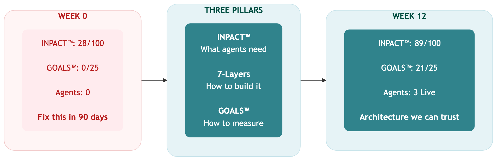
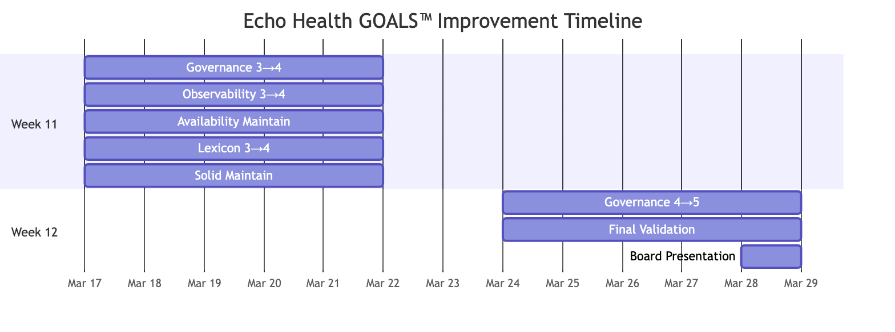
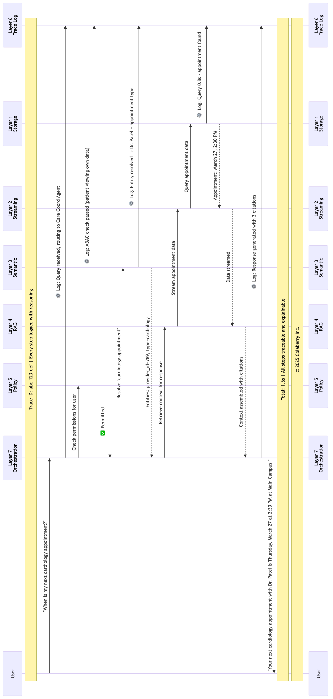
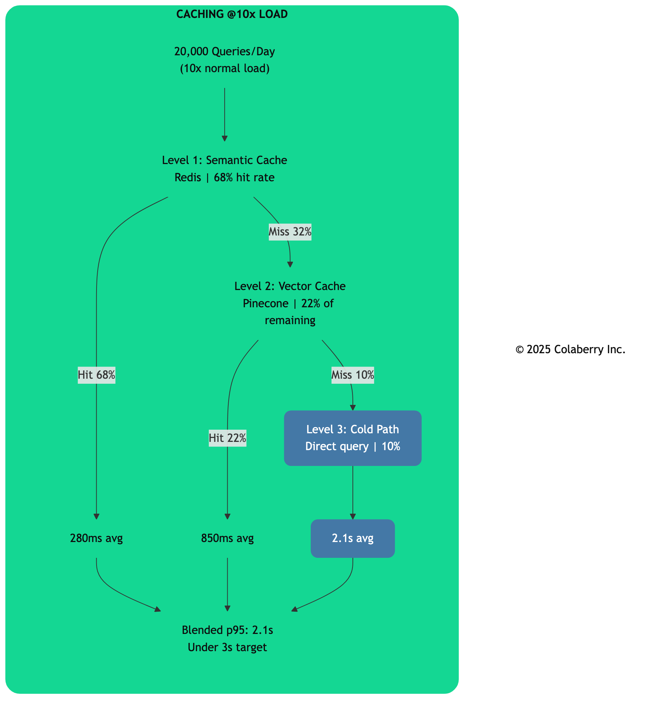
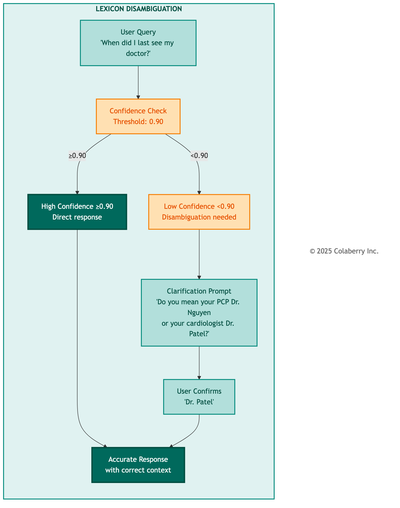
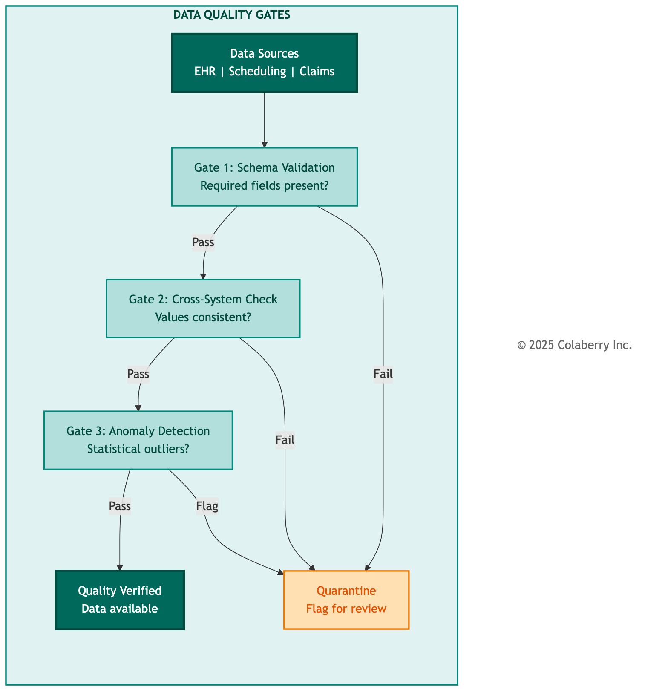
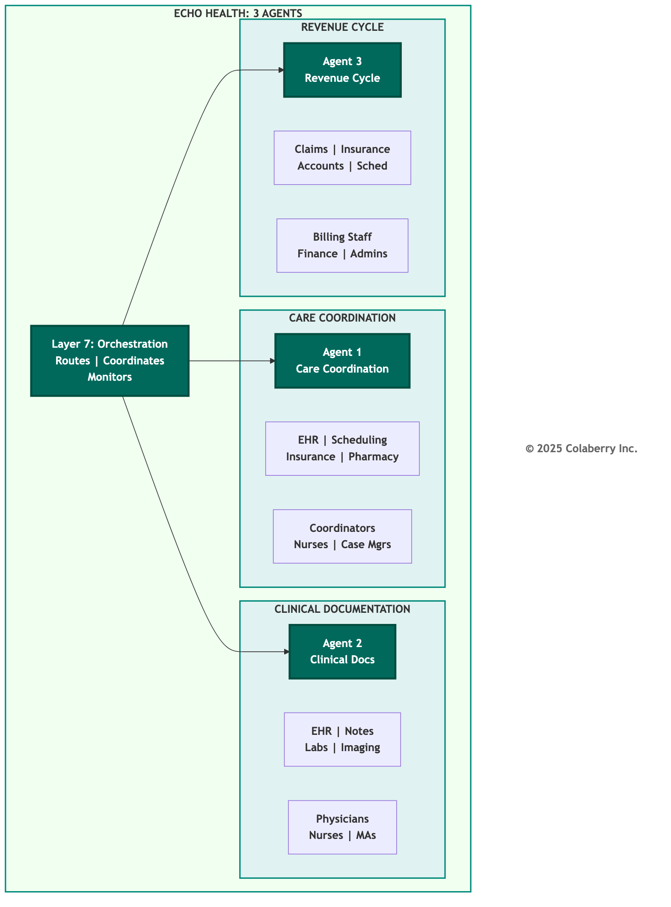
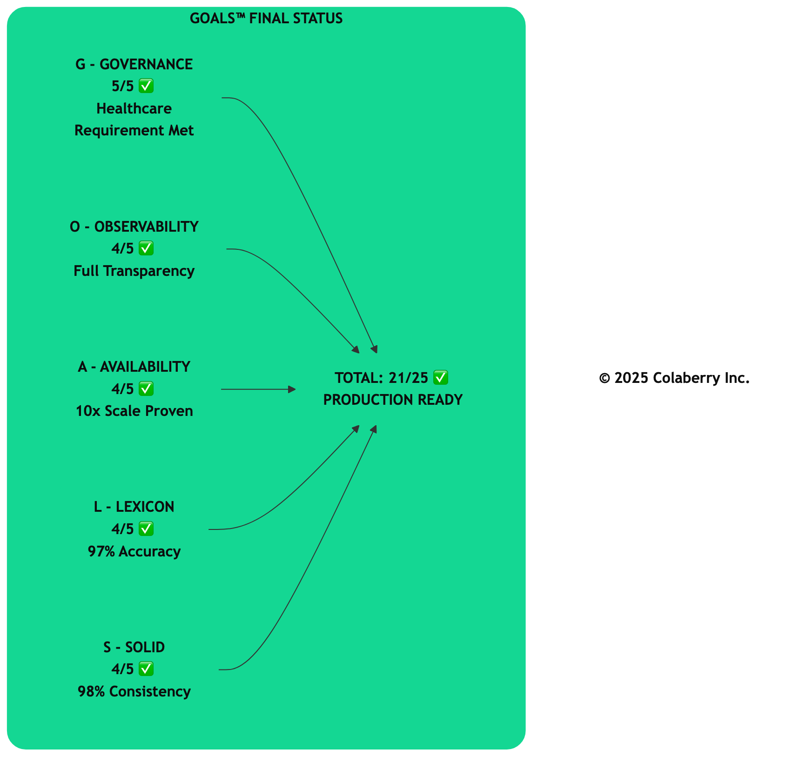
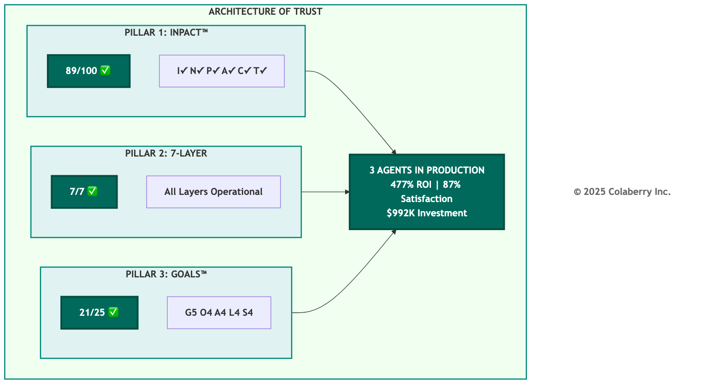
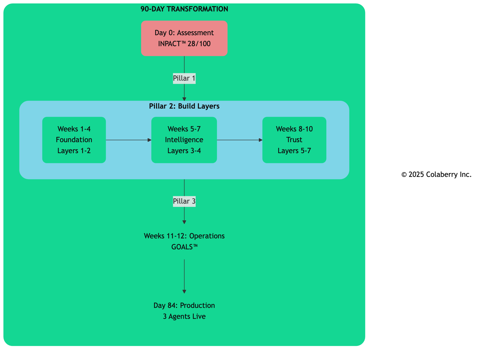

# Chapter 8: The Architecture of Trust in Action
## Echo's Operations (Weeks 11-12)

---

## The First Live Query

*Monday, 10:03 AM  
Echo Health Systems, Care Coordination Department  
Week 11, Day 1*

Maria Rodriguez typed her first query into the new system.

"Schedule Mrs. Patterson with cardiology for a follow-up next week."

She watched the screen, remembering the last time she'd trusted an AI scheduling agent. Nine seconds of waiting. A phantom appointment. The email to her supervisor that started the cascade of failures documented in Chapter 1.

The response came in 1.6 seconds.

**"Dr. Patel has availability Tuesday at 2:00 PM and Thursday at 10:30 AM. Mrs. Patterson's insurance (Blue Cross PPO) is verified for both slots. Her last cardiology visit was October 15. Which would you prefer?"**

Maria checked the scheduling system directly. Both slots were real. The insurance verification was accurate. The visit history was correct.

She selected Tuesday at 2:00 PM. The confirmation appeared instantly, synchronized across all systems.

"Huh," she said to no one in particular. "It actually works."

Two floors up, Sarah Cedao watched the operations dashboard update. First successful production query: 10:03 AM. Response time: 1.6 seconds. User action: appointment confirmed.

The architecture was live. Now came the hard part: proving it could sustain trust for the next two weeks, and the next two years.

Built isn't enough. Operations prove trust.

---

**Figure 8.0: Echo's Transformation: Week 0 to Week 12**

> **Key Takeaway:** *"You've answered my question, and built something we can trust."* – Dr. Arun Raj, Board Chair

---

## Part 1: Operations Kickoff

### Two Hours Earlier

*Monday, 8:00 AM*

The conference room felt different. For ten weeks, whiteboards had been covered with architecture diagrams. Today, they were clean. The architecture was complete.

"We built it," Sarah said to the team. "Now we prove it works."

Marcus pulled up the GOALS™ dashboard. Five gauges, fifteen out of twenty-five points total. Six points short of production threshold.

**Figure 8.1: Echo's GOALS™ Baseline (Week 10)**

"We need twenty-one to deploy clinical AI in production," Marcus said. "Six points in two weeks."

Dr. Chen studied the Governance gauge. "Healthcare requires Governance at five out of five. Non-negotiable."

Sarah walked to the whiteboard. "Here's the plan."

**Figure 8.2: Week 11-12 Operations Timeline**

Marcus wrote out the Week 11 targets:

- **Governance:** 3/5 to 4/5. Complete audit trails, reduce HITL escalation time to under 30 seconds, test model rollback.
- **Observability:** 3/5 to 4/5. Mean time to detection under 5 minutes, enable explainability for EU AI Act.
- **Availability:** Maintain 4/5. Validate the system handles 10x current load.
- **Lexicon:** 2/5 to 4/5. Implement disambiguation, reduce clarification rate to under 10%.
- **Solid:** 3/5 to 4/5. Fix cross-system PCP consistency issue.

"By Friday, we should be at twenty out of twenty-five," Sarah said. "Week 12, we push Governance to five and validate for production."

"The 95% failure rate for agent projects," Marcus said. "That's what happens when organizations build without optimizing for operations. We're proving operability before we launch."

Sarah checked her watch. "First production queries go live at ten AM. Two hours to prove ten weeks of work."

Echo's deployment followed a parallel operation model. The agentic system would run alongside legacy infrastructure, not replace it. Coordinators, clinicians, and billing staff could use either system. The goal was earned trust. If the agents delivered faster, more accurate, more transparent responses, users would choose them.

---

## Part 2: Governance and Observability in Action

### Governance: The Invisible 65%

The audit trail gap surfaced Monday afternoon.

"We're logging all direct queries," Jamie reported. "But cached responses aren't generating audit entries. 65% of our access patterns are invisible."

In healthcare, that's a compliance violation waiting to happen. The Montefiore case ($4.75 million in penalties for HIPAA Security Rule failures) was fresh in everyone's mind [1].

"How fast can we fix it?" Sarah asked.

"Overnight," Swapna said. "We pipe cache hits through the same logging endpoint. The infrastructure is already there."

By Tuesday morning, audit coverage stood at 100%. Every query generated a complete access record: timestamp, user ID, patient ID, query type, response source, and content hash.

But Governance required more than audit trails. HITL escalation time averaged 45 seconds. Physicians wanted faster resolution.

The root cause was routing. Escalations entered a general queue regardless of type. Marcus suggested priority routing: controlled substances to pharmacists, diagnostic questions to physicians, administrative matters to coordinators.

| Escalation Type | Primary Reviewer | Backup Reviewer | Target Response |
|----------------|------------------|-----------------|-----------------|
| Controlled substance | Pharmacist | Physician | <30 seconds |
| Diagnosis-related | Physician | Specialist | <45 seconds |
| Treatment modification | Attending physician | On-call MD | <60 seconds |
| Administrative | Care coordinator | Supervisor | <90 seconds |

By Thursday, escalation time had dropped to 28 seconds.

Model rollback testing completed Thursday afternoon. Jamie triggered simulated degradation and measured recovery time: detection (2 minutes), decision (3 minutes), rollback execution (7 minutes). Total: 12 minutes. Within the 15-minute target.

### The Governance Win

Thursday, 2:47 PM. Dr. Chen's pager buzzed.

A patient had asked about medication timing. The agent flagged it for HITL review because it involved oxycodone. The patient wanted to know when to take the next dose, but also asked about "doubling up" because the pain was severe.

Dr. Chen reviewed the case on her phone. She confirmed the agent's recommendation and added a note about contacting the physician if pain wasn't managed. The entire interaction: 23 seconds.

"This is exactly what HITL is for," she said later. "The agent correctly escalated. I verified. Three pillars working together."

By Friday, Governance stood at 4/5. Audit coverage complete. HITL escalation: 28 seconds average. Model rollback: 12 minutes.

The Trust Flywheel was turning. Faster HITL resolution built clinician trust. Trust drove engagement. Engagement improved quality. Quality reinforced the value of human oversight.

**Figure 8.3: End-to-End Observability with Trace IDs**

### Observability: Seeing Through the Blackbox

Observability presented different challenges. Mean time to detection was running at 8 minutes, above their 5-minute target. And explainability wasn't fully enabled.

"The EU AI Act requires explainability for high-risk AI applications," Marcus reminded the team [2]. "Healthcare is high-risk. Every agent response needs reasoning that can be audited."

The detection issue was alert tuning. Jamie analyzed two weeks of data: 340 alerts per month, most false positives.

| Alert Category | Count | False Positive Rate |
|---------------|-------|---------------------|
| Response time | 145 | 92% |
| Error rate | 87 | 78% |
| Cache miss | 56 | 95% |
| Confidence drop | 42 | 68% |
| Resource usage | 10 | 40% |

He adjusted thresholds based on baseline data. By Wednesday, false positives dropped to 12 per month. Mean time to detection: about 4 minutes.

Explainability required surfacing the reasoning chain across all seven layers.

The implementation had three components: source tracking (every fact linked to its source), reasoning chain (logical steps documented), and confidence scoring (numerical confidence visible to reviewers).

By Thursday, every response included a collapsible "reasoning" section. "I can see the agent's homework," one physician commented. "It's not a black box."

### The Observability Win

Thursday, 3:17 AM. An alert triggered.

Jamie's phone buzzed. Response time spike on the Care Coordination Agent, p95 latency jumped from 1.8 to 4.2 seconds.

He pulled up the trace dashboard. The system immediately showed the bottleneck: Layer 1 storage queries taking 2.3 seconds instead of 0.5 seconds. Query pattern: provider schedule lookups. Root cause: missing index.

He documented the issue and went back to sleep. The system was degraded but functional.

At the 9 AM standup: "Root cause identified in 4 minutes. Before end-to-end tracing, this would have taken 4 hours." The index fix was deployed by 10 AM.

By Friday, Observability stood at 4/5. Mean time to detection: ~4 minutes. Trace coverage: 100%. Explainability: enabled. LLM cost visibility: $850/day, fully attributable.

The Trust Flywheel was turning here too. Faster detection meant faster fixes. Fewer user-visible problems built confidence. Confidence drove adoption.

---

With Governance and Observability at 4/5, Echo had the diagnostic foundation in place.

---

## Part 3: Availability, Lexicon, and Solid in Action

### Availability: Performance at Scale

Availability was already at 4/5. Week 11's task was validation: proving the system could handle growth.

"We're running at 2,000 queries per day," Jamie said Monday. "We need to prove we can handle 20,000."

The stakes were real. Healthcare organizations face unpredictable demand spikes: flu season, public health announcements, holiday coverage. If Echo's agents couldn't scale, they would fail precisely when needed most.

The 10x scale test began Tuesday at 6 AM. Jamie's team generated synthetic queries mirroring actual usage patterns across all three agents. The results validated the architecture. Under 10x load, response time p95 held at 2.1 seconds, within the 3-second target. Cache hit rate actually improved under load as common patterns became more likely.

**Figure 8.4: Multi-Level Cache Performance Under Load**

The cold path remained the bottleneck, but only 10% of queries took it, and those still completed in 2.1 seconds.

"We can handle 10x current load with no degradation," Jamie documented. "And we have capacity to add more cache nodes if needed."

The Trust Flywheel was turning. Faster responses built user habits. Habits drove adoption. Adoption justified investment. Investment enabled further improvements.

Availability remained at 4/5, but now with validated capacity for growth.

### Lexicon: Smooth Talker

Lexicon was the gap that worried Sarah most.

At 2/5, the 30% clarification rate meant nearly one in three queries required the agent to ask for more information. For busy clinicians, that friction was a trust-killer.

"The primary issue is ambiguity in entity references," Marcus explained. "When someone says 'my doctor,' we don't always know if they mean their PCP, their specialist, or the physician they saw last week."

**Figure 8.5: Lexicon Disambiguation Flow**

The problem ran deeper. Healthcare language is inherently contextual. "My appointment" could mean the next visit or the one just completed. "My results" could mean lab work, imaging, or pathology.

Swapna identified three categories: entity ambiguity ("my doctor" with multiple providers), temporal ambiguity ("my appointment" without timing), and domain ambiguity ("my results" without type).

The team implemented smart disambiguation. When confidence dropped below 0.90, the system would ask a clarifying question with the most likely options: "Do you mean your PCP Dr. Nguyen or your cardiologist Dr. Patel?"

The implementation required coordination across layers: Layer 3 for confidence scoring, Layer 4 for context retrieval, Layer 7 for dialogue management.

They also added 47 new clinical terms to the glossary: "A1c" for HbA1c, "sugar" for glucose, "blood pressure meds" for antihypertensives. The informal language patients actually use.

By Thursday, clarification rate had dropped from 30% to under 10%. When clarification was needed, patients found the questions helpful rather than frustrating.

"One patient said the agent 'actually listened' when it asked for clarification," Dr. Chen reported. "That's appreciation for accuracy, not complaint about friction."

The Trust Flywheel was turning. Better disambiguation led to accurate responses. Accuracy built confidence. Confidence drove usage. Usage provided training signal for further improvement.

Lexicon moved to 4/5.

### Solid: One Truth, Four Systems

Solid was the foundation everything else depended upon. At 3/5, the 3% cross-system inconsistency for primary care provider data was causing problems. "A patient asks 'who is my doctor?'" Swapna explained Monday. "The EHR says Dr. Nguyen. The scheduling system shows Dr. Martinez, their previous PCP who retired three months ago. The agent gives different answers depending on which system it queries first."

**Figure 8.6: Quality Gates in Production**

Marcus framed the stakes. "If a patient gets conflicting information, they lose trust. If a clinician gets conflicting data about a care team, it could affect clinical decisions."

Swapna mapped the data flows. The EHR was source of truth, but the scheduling system updated nightly via batch extract. When a PCP changed, it could take 24 hours for scheduling to reflect it.

The solution was real-time synchronization. When a provider assignment changed in the EHR, the change would propagate to scheduling within 30 seconds.

"We're implementing event-driven sync," Swapna explained. "The EHR publishes a change event. Our integration layer catches it and updates downstream systems immediately."

By Wednesday evening, real-time sync was operational. Swapna validated against 1,000 patient records.

"Ninety-eight percent consistency," she reported Thursday. "Up from 97%. The remaining 2% are edge cases: patients transferring providers, complex care arrangements. The quality gates flag those for human review."

"We're not trying to achieve 100% automated accuracy," Marcus said. "We're ensuring 100% of responses are trustworthy. For 98%, automation delivers. For 2%, we escalate. The combination is what makes it solid."

The Trust Flywheel was turning. Better consistency led to accurate responses. Accuracy built clinician confidence. Confidence drove usage. Usage revealed edge cases that refined quality gates.

Solid improved to 4/5.

---

End of Week 11. All five GOALS™ dimensions at production-ready levels: 20 out of 25 points. One gap remained: healthcare required Governance at 5/5.

---

## Part 4: Operational Excellence

### The Last Mile

Week 12 opened with cautious optimism.

"Twenty out of twenty-five," Sarah said at Monday's standup. "We need twenty-one. One more point, and it has to come from Governance."

The gap between 4/5 and 5/5 was subtle but important. At 4/5, Echo had comprehensive governance: audit trails, HITL workflows, rollback capability. But 5/5 required continuous improvement.

"The difference," Marcus explained, "is whether the system learns from its own governance events. At 4/5, we catch issues and fix them. At 5/5, the system recognizes patterns and adapts proactively."

Jamie had analyzed Week 11 data. "We processed 847 HITL escalations. Most followed predictable patterns. 94% were confirmed as the agent recommended."

"That's a lot of human time confirming what the system already knew," Sarah observed. "And it's not sustainable at 10x scale."

### Fine-Tuning the Machine

The team spent the first three days optimizing based on operational data.

- **Alert thresholds:** False positives dropped from 12 to 4 per month
- **Cache warming:** Shifted from midnight to 6:30 AM for fresher appointment data
- **HITL routing:** Re-routing to appropriate specialists reduced review time by 15%
- **Documentation:** Marcus led a sprint to capture all operational procedures

### Governance: The Learning Loop

The breakthrough came Tuesday afternoon.

"We're escalating the same type of query repeatedly," Dr. Chen said. "Medication timing for controlled substances. The agent flags them, a pharmacist reviews, and 94% of the time the recommendation is confirmed. These aren't edge cases. We're adding human overhead without adding safety value."

Marcus saw the opportunity. "What if the policy engine learned from confirmed recommendations? After enough approvals for a specific pattern, the confidence threshold could increase, while maintaining full escalation for novel cases."

The approach was carefully designed to maintain safety:

1. **Pattern recognition:** The system would identify recurring HITL patterns based on query type, patient profile, and medication category
2. **Confidence accumulation:** Each confirmed recommendation would add to the pattern's confidence score
3. **Threshold adjustment:** When a pattern reached 50 confirmed recommendations with 95%+ approval rate, the escalation threshold would adjust
4. **Safety bounds:** Novel queries, unusual combinations, and high-risk categories would always escalate regardless of pattern confidence
5. **Continuous monitoring:** Any rejected recommendation would reset the pattern's confidence score

Swapna implemented the learning loop Wednesday.

### High Stakes Validation

By Thursday, the improvement was measurable. HITL escalation rate for routine patterns dropped 23%, but full escalation continued for novel queries.

"It's like the system finally trusts itself for what it knows," one pharmacist commented. "But it still asks when it should."

The compliance team confirmed the audit trail was complete. Every pattern learned, every threshold adjustment, every justification documented.

**Governance reached 5/5.**

### GOALS™: Mission Accomplished

Friday morning. Sarah called an all-hands meeting.

| GOAL | Week 10 | Week 11 | Week 12 | Status |
|------|---------|---------|---------|--------|
| **G - Governance** | 3/5 | 4/5 | **5/5** | ✅ Healthcare requirement |
| **O - Observability** | 3/5 | 4/5 | 4/5 | ✅ Production ready |
| **A - Availability** | 4/5 | 4/5 | 4/5 | ✅ Production ready |
| **L - Lexicon** | 2/5 | 4/5 | 4/5 | ✅ Production ready |
| **S - Solid** | 3/5 | 4/5 | 4/5 | ✅ Production ready |
| **Total** | **15/25** | **20/25** | **21/25** | ✅ Threshold achieved |

"Twenty-one out of twenty-five," Marcus said. "Threshold achieved."

The room was quiet for a moment, then erupted in relieved applause.

Sarah held up her hand. "We're not done. We still need to validate the three agents. Board presentation is at 4 PM."

---

## Part 5: Three Agents, One Standard

The next three hours were the most comprehensive validation Echo's team had ever conducted.

### Agent 1: Care Coordination

**Agent Profile:**
- **Purpose:** Coordinate patient care across departments
- **Primary Users:** Care coordinators, nurses, case managers
- **Data Sources:** EHR, scheduling, insurance, pharmacy
- **Average Daily Queries:** 800

**Figure 8.7: Three Agents Architecture**

| Metric | Result | Target | Status |
|--------|--------|--------|--------|
| Response time | 1.6s average | <2s | ✅ |
| Entity resolution | 97% accuracy | >95% | ✅ |
| HITL escalation | ~3% of queries | 2-5% | ✅ |
| User satisfaction | 87% approval | >85% | ✅ |

**Sample Interaction:**

> **Patient:** "When is my next appointment with my heart doctor?"
> 
> **Agent:** "Your next cardiology appointment with Dr. Patel is Thursday, March 27 at 2:30 PM at the Main Campus Cardiology Clinic. Would you like directions or to reschedule?"
> 
> *[1.4s response, full audit trail, three citations]*

**Three-Pillar Validation:**
- **INPACT™:** **I**nstant (1.6s), **N**atural (patient language understood), **P**ermitted (verified patient access), **A**daptive (learns from ~87% satisfaction feedback), **C**ontextual (5 systems unified), **T**ransparent (three citations + audit trail)
- **7-Layer:** Layer 1 unified scheduling data. Layer 2 delivered data in 0.8s. Layer 3 resolved "heart doctor" → cardiologist. Layer 4 retrieved care history. Layer 5 verified permissions. Layer 6 logged trace. Layer 7 orchestrated routing.
- **GOALS™:** **G**overnance (audit complete, ~3% HITL), **O**bservability (full trace visible), **A**vailability (97% under 2s), **L**exicon (97% accuracy), **S**olid (data consistent)

---

### Agent 2: Clinical Documentation

**Agent Profile:**
- **Purpose:** Assist clinicians with documentation
- **Primary Users:** Physicians, nurses, medical assistants
- **Data Sources:** EHR, clinical notes, lab results, imaging
- **Average Daily Queries:** 600

| Metric | Result | Target | Status |
|--------|--------|--------|--------|
| Response time | 1.9s average | <2s | ✅ |
| Documentation accuracy | 96% | >95% | ✅ |
| HITL escalation | ~8% of queries | 5-10% | ✅ |
| Time savings | 23 min/physician/day | >15 min | ✅ |

The ~8% HITL rate was intentional, escalating medication recommendations, diagnosis suggestions, treatment modifications, and abnormal lab interpretations.

**Sample Interaction:**

> **Physician:** "Summarize Mrs. Johnson's diabetes management over the past 6 months."
> 
> **Agent:** "Mrs. Johnson (DOB 03/15/1958) has Type 2 diabetes managed with metformin 1000mg BID. HbA1c trend: 7.8% (September) → 7.2% (December) → 6.9% (March). Last eye exam: August. Foot exam due. Shall I draft the care plan update?"
> 
> *[Reasoning chain: 4 lab results, 2 medication records, 3 visit notes. ADA guidelines applied [3].]*

Dr. Chen reviewed the validation personally. "The agent correctly escalated a potential medication interaction for pharmacist review. That's exactly the behavior we want."

**Three-Pillar Validation:**
- **INPACT™:** **I**nstant (1.9s), **N**atural (clinical terminology), **P**ermitted (HIPAA-compliant), **A**daptive (current guidelines + feedback), **C**ontextual (synthesized labs, meds, notes), **T**ransparent (reasoning chain with citations)
- **7-Layer:** Layer 1 provided EHR data. Layer 2 streamed lab results. Layer 3 mapped clinical terminology. Layer 4 RAG retrieved notes and guidelines. Layer 5 enforced HIPAA controls. Layer 6 logged reasoning chain. Layer 7 coordinated multi-source retrieval.
- **GOALS™:** **G**overnance (~8% HITL for clinical decisions), **O**bservability (full explainability), **A**vailability (supports workflow), **L**exicon (ICD-10/CPT mapped), **S**olid (lab values verified)

---

### Agent 3: Revenue Cycle

**Agent Profile:**
- **Purpose:** Support billing and revenue operations
- **Primary Users:** Billing staff, financial counselors, administrators
- **Data Sources:** Claims, insurance, patient accounts, scheduling
- **Average Daily Queries:** 400

| Metric | Result | Target | Status |
|--------|--------|--------|--------|
| Response time | 1.4s average | <2s | ✅ |
| Claim accuracy | 98% | >95% | ✅ |
| HITL escalation | ~6% of queries | 5-10% | ✅ |
| Denial rate reduction | 12% improvement | >10% | ✅ |

The 12% denial rate reduction was the most compelling ROI metric. By catching issues before submission, the agent paid for itself.

**Sample Interaction:**

> **Billing Staff:** "Why was claim CLM-4472 denied?"
> 
> **Agent:** "Claim denied due to missing prior authorization for MRI (CPT 70553). Prior auth PA-8847 was approved March 15 but not linked to the claim. I can attach it and resubmit. Shall I proceed?"
> 
> *[HITL not required, routine administrative action. Full audit trail logged.]*

**Three-Pillar Validation:**
- **INPACT™:** **I**nstant (1.4s), **N**atural (billing terminology), **P**ermitted (role-based access), **A**daptive (denial pattern recognition), **C**ontextual (linked auth to claim), **T**ransparent (root cause + audit trail)
- **7-Layer:** Layer 1 provided consistent claim data. Layer 2 delivered real-time status. Layer 3 resolved CPT codes. Layer 4 retrieved authorization history. Layer 5 enforced role-based access. Layer 6 logged audit trail. Layer 7 orchestrated claim-to-auth matching.
- **GOALS™:** **G**overnance (~6% HITL for high-value), **O**bservability (end-to-end traceable), **A**vailability (supports high-volume), **L**exicon (98% CPT/ICD accuracy), **S**olid (12% denial reduction validates accuracy)

### Results

All three agents passed production validation.

"Each agent meets or exceeds all targets," Marcus summarized. "Each demonstrates appropriate HITL behavior. Each maintains complete audit trails. And each validates the three-pillar integration."

Sarah checked the time. 3:45 PM. "Let's show Dr. Raj what we've built."

---

## Part 6: The Architecture of Trust Complete

### The Board Room

Friday, 4:00 PM. The executive conference room.

Dr. Raj sat at the head of the table, the same seat he'd occupied twelve weeks ago when he set the 90-day deadline.

Sarah stood at the front of the room, the GOALS™ dashboard behind her showing all five gauges green.

"Dr. Raj, twelve weeks ago you asked how we would know our AI agents stay trustworthy. We answered by building three integrated pillars."

**Figure 8.8: Echo's GOALS™ Final Dashboard (Week 12)**

She walked through each pillar:

"**Pillar 1, INPACT™:** Our agents meet all six needs. Instant response under 2 seconds. Natural language that speaks clinicians' language. Permitted access with human-in-the-loop. Adaptive learning from feedback. Contextual awareness across systems. Transparent reasoning with citations."

| INPACT™ Dimension | Week 0 | Week 12 | Status |
|-------------------|--------|---------|--------|
| **I** - Instant | 1/6 | 5/6 | ✅ Strong |
| **N** - Natural | 2/6 | 5/6 | ✅ Strong |
| **P** - Permitted | 1/6 | 5/6 | ✅ Strong |
| **A** - Adaptive | 2/6 | 5/6 | ✅ Strong |
| **C** - Contextual | 3/6 | 6/6 | ✅ Excellent |
| **T** - Transparent | 1/6 | **6/6** | ✅ Excellent |
| **Total** | **10/36** | **32/36** | **89%** |

"**Pillar 2, 7-Layer Architecture:** All seven layers operational. Multi-modal storage with 28-second freshness. Real-time fabric delivering sub-second queries. Semantic layer translating natural language. RAG intelligence with our complete knowledge base. Policy engine evaluating every access. Observability tracing every request. Orchestration coordinating all three agents."

"**Pillar 3, GOALS™:** All five dimensions at or above threshold. Governance at 5/5. Observability at 4/5. Availability at 4/5. Lexicon at 4/5. Solid at 4/5. Total: 21 out of 25."

She paused.

"Three agents in production. Response times average 1.6 seconds. Accuracy exceeds 96%. User satisfaction running around 85-90%. We built the Architecture of Trust, and proved all three pillars sustain each other."

**Figure 8.9: Echo Health - Architecture of Trust Complete**

Dr. Raj leaned forward. "You've built something that measures itself. That proves itself."

"That's the answer to your question," Sarah said. "We know it stays trustworthy because the three pillars validate each other continuously."

<!-- pagebreak -->

### The Journey

**Figure 8.10: Echo's 90-Day Journey**

| Phase | Timeline | Pillar Focus | Achievement |
|-------|----------|--------------|-------------|
| Assessment | Day 0 | INPACT™ | 28/100 baseline |
| Foundation | Weeks 1-4 | 7-Layer (1-2) | Storage + Real-Time |
| Intelligence | Weeks 5-7 | 7-Layer (3-4) | Semantic + RAG |
| Trust | Weeks 8-10 | 7-Layer (5-7) | Governance + Observability + Orchestration |
| Operations | Weeks 11-12 | GOALS™ | 21/25 achieved |
| **Production** | Week 12 | **All 3 Validated** | 89/100 INPACT™, 7/7 Layers, 21/25 GOALS™ |

<!-- pagebreak -->

### Final Score Card

---

| Metric | Day 0 | Week 12 | Change |
|--------|-------|---------|--------|
| INPACT™ Score | 28/100 | 89/100 | +61 points |
| GOALS™ Score | N/A | 21/25 | Production ready |
| Investment | - | $992K | 19% under budget |
| ROI | - | 477% | Validated |
| Agents Live | 0 | 3 | Production |
| User Satisfaction | N/A | ~87% | Above target |

Dr. Raj stood. "The board approves production deployment. You've answered my question, and you've built something we can trust."

---

## Bridge to Part IV: Your Turn

Echo's journey was complete. Ninety days. $992K invested. Three agents in production.

But Echo wasn't unique. They started where most organizations are: legacy infrastructure, siloed data, failed AI attempts, skeptical stakeholders.

What made them different was their approach. They built trust before intelligence. They validated each pillar before moving to the next. They measured what mattered.

The Architecture of Trust isn't proprietary to Echo. It's a pattern any organization can replicate.

**Part IV is your roadmap to do the same.**

Chapter 9 begins with assessment. The journey to trusted AI starts with knowing your starting point.

Now it's your turn.

---

## Key Takeaways

1. **Operations prove the architecture.** The infrastructure was complete at Week 10, but trust required operational proof. Week 11-12 validated that Echo's seven-layer architecture could sustain production workloads.

2. **GOALS™ dimensions work as a system.** Observability enabled faster governance response. Governance improvements increased user confidence. The Trust Flywheel builds momentum: each improvement enables the next.

3. **Healthcare requires Governance 5/5.** The mandatory threshold reflects the stakes of clinical decision support. Echo achieved it through continuous improvement, not just comprehensive controls.

4. **Three pillars validate together.** Every operational win connected back to INPACT™ needs and 7-Layer components. Measurement enables improvement: Echo moved from 15/25 to 21/25 because they could measure precisely where they stood.

5. **The pattern is repeatable.** Assess, build, measure, improve. Echo's journey isn't unique to healthcare. It's the Architecture of Trust applied to a specific context.

<!-- pagebreak -->

## Operational Metrics Summary

**Final GOALS™ Status:**

---

| Dimension | Week 10 | Week 12 | Key Achievement |
|-----------|---------|---------|-----------------|
| Governance | 3/5 | 5/5 | Continuous learning from HITL outcomes |
| Observability | 3/5 | 4/5 | ~4 min MTTD, full explainability |
| Availability | 4/5 | 4/5 | 10x scale validated |
| Lexicon | 2/5 | 4/5 | ~5% clarification rate |
| Solid | 3/5 | 4/5 | 98% cross-system consistency |
| **Total** | **15/25** | **21/25** | **Threshold achieved** |

---

**Agent Performance Summary:**

| Agent | Response Time | Accuracy | HITL Rate | Satisfaction |
|-------|--------------|----------|-----------|--------------|
| Care Coordination | 1.6s | 97% | ~3% | ~87% |
| Clinical Documentation | 1.9s | 96% | ~8% | ~87% |
| Revenue Cycle | 1.4s | 98% | ~6% | ~87% |

---

## References

[1] U.S. Department of Health and Human Services (2024). "HHS Office for Civil Rights Settles HIPAA Investigation with Montefiore Medical Center for $4.75 Million." HHS Press Release, February 6, 2024. https://www.hhs.gov/hipaa/for-professionals/compliance-enforcement/agreements/montefiore/index.html

[2] European Commission (2024). "AI Act: First Regulation on Artificial Intelligence." https://digital-strategy.ec.europa.eu/en/policies/regulatory-framework-ai

[3] American Diabetes Association (2024). "Standards of Care in Diabetes." Diabetes Care. https://diabetesjournals.org/care/issue/47/Supplement_1

---

**© 2025-2026 Colaberry Inc. All Rights Reserved.**
INPACT™ and GOALS™ are trademarks of Colaberry Inc.

*Acronyms and key terms are defined in the Glossary.*
