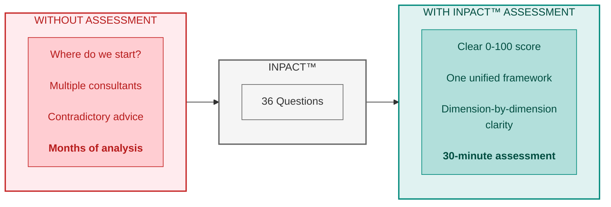
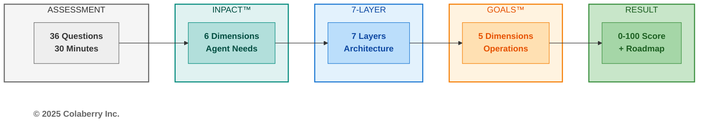
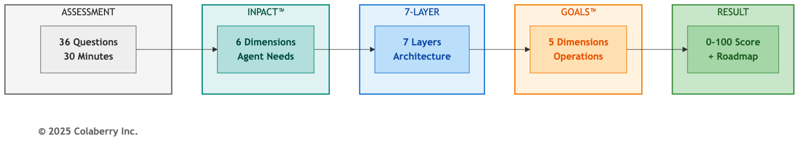
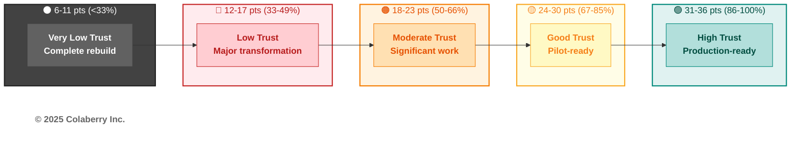
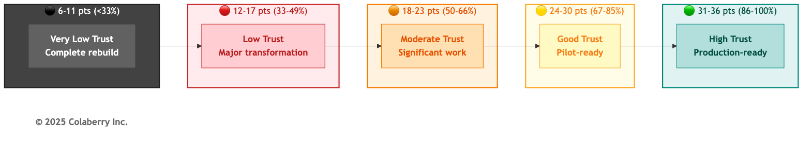
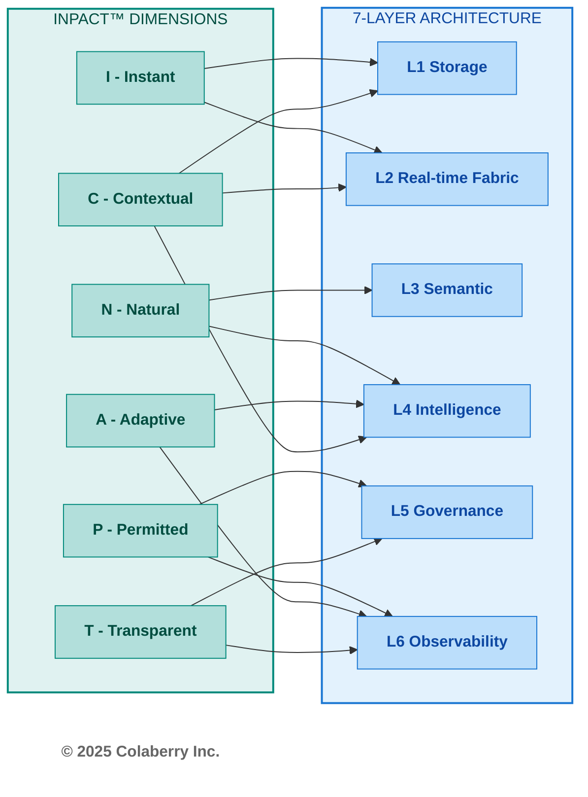
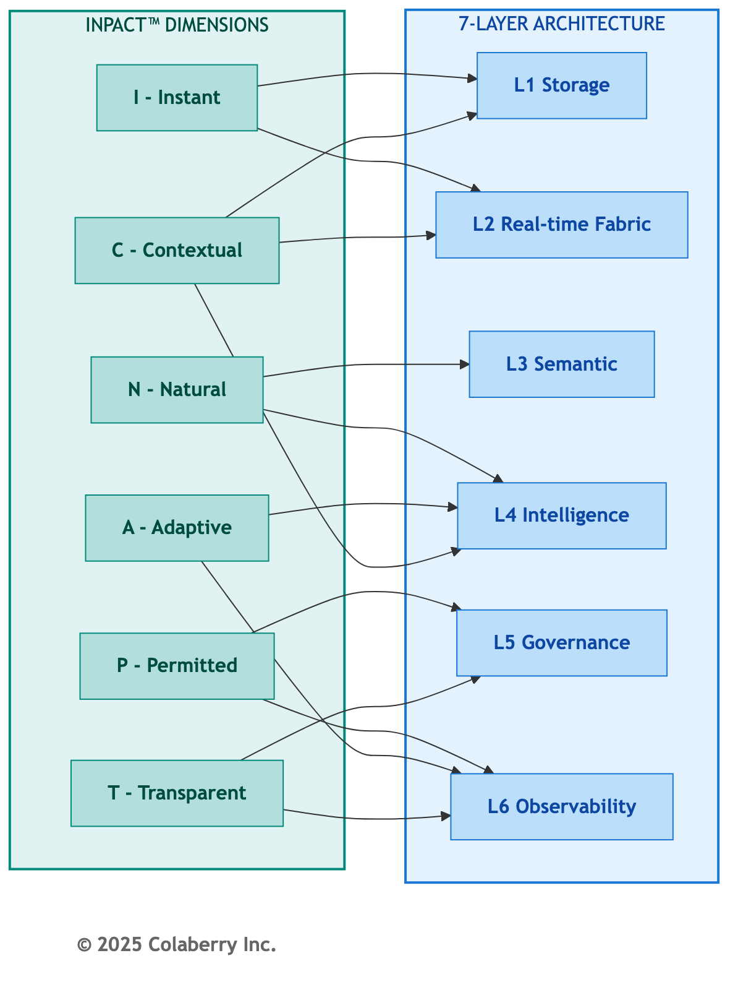
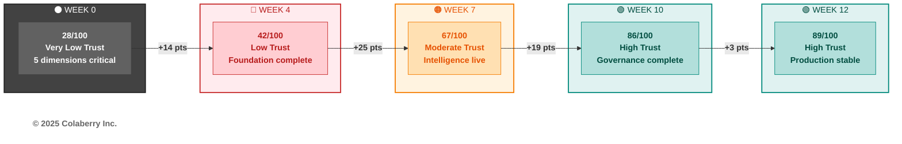
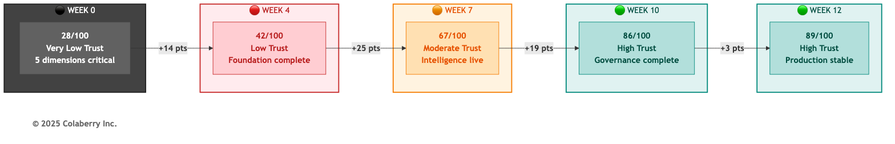
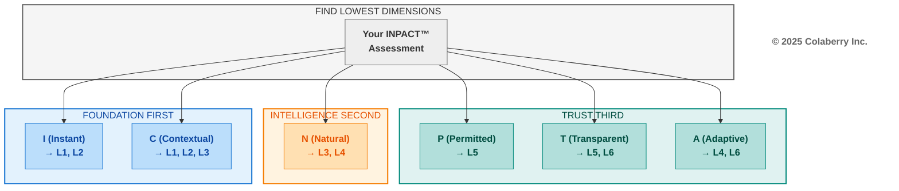

# Chapter 9: What's Your Score?

## The Assessment Chapter

---

## The Assessment That Almost Didn't Exist

*Friday, 4:15 PM - Echo Health Systems, Innovation Lab - Week 14*

"We got lucky," Sarah Cedao said.

Marcus Williams looked up from his laptop. The operations dashboard showed green across all metrics. Fifty thousand queries processed. 1.6-second average response. Zero compliance incidents.

"Lucky? We planned this for ninety days."

"We planned the *build*. But we stumbled into the starting point." Sarah pulled up the Week 0 gap analysis. "Remember? Five days arguing about where to begin. Then Swapna ran that informal assessment and everything clicked. One number told us more than six consultants."

"The twenty-eight."

"Other organizations will face the same chaos. Board mandates, budget pressure, no idea where to start." Sarah walked to the whiteboard. "What if we gave them what we didn't have? Thirty-six questions. Six dimensions. Thirty minutes. Their score tells them exactly what we wished we'd known on day one."

"And Echo's journey becomes the benchmark."

"Twenty-eight to eighty-nine. Every data point and every week documented." Sarah stepped back. "They don't have to guess what's possible."

This chapter is what they wrote down.

---

**Figure 9.1: Assessment Value, From Confusion to Clarity**

> **Key Takeaway:** One assessment. Six dimensions. Complete clarity on where to invest.

---

## Part 1: One Assessment Is All It Takes

### Why One Assessment Works

Every enterprise attempting AI agent deployment faces the same question: Where do we start? The choices seem overwhelming: infrastructure gaps, governance requirements, operational concerns, technology choices. Many organizations commission multiple assessments, hire different consultants for each layer, and end up with contradictory recommendations that consume months before any real work begins.

There's a simpler path. A single assessment can measure everything that matters.

The Architecture of Trust integrates three frameworks into one coherent system. Understanding this integration reveals why one assessment delivers comprehensive insight:

**INPACT™ defines what agents need.** The six dimensions (Instant, Natural, Permitted, Adaptive, Contextual, and Transparent) capture the fundamental requirements any AI agent must have to operate reliably in an enterprise environment. For complete framework details, see Chapters 2 and 3.

**The 7-Layer Architecture delivers those needs.** Each layer addresses specific INPACT™ dimensions. For complete 7-Layer details, see Chapters 4, 5, and 6.

**GOALS™ ensures sustainable operation.** Five operational targets (Governance, Observability, Availability, Lexicon, and Solid) translate infrastructure capability into organizational outcomes. *For complete GOALS™ framework detail, see Chapter 7.*

These three frameworks form a chain of dependency. INPACT™ requirements drive architecture decisions. Architecture capabilities enable operational excellence. Operational excellence delivers the trust that makes agent adoption successful.

**Figure 9.2: Architecture of Trust Assessment Flow**

The integration principle is simple: **if you assess INPACT™ comprehensively, you've assessed everything.**

When you measure whether your infrastructure delivers *Instant* responses, you're simultaneously assessing Layer 1 (storage performance), Layer 2 (data freshness), and Layer 4 (caching efficiency). When you evaluate *Permitted* access control, you're measuring Layer 5 (governance) and Layer 6 (audit trails). Every INPACT™ dimension maps to specific layers and indicates GOALS™ readiness.

This is why 36 questions can measure your entire agent readiness posture. Not because the assessment is shallow, but because the questions target root causes that ripple through the entire system.

**What This Chapter Gives You:**

By the end of this chapter, you will have:

1. **Your INPACT™ score (0-100)**: A single number capturing your current agent readiness
2. **Dimension-by-dimension breakdown**: Which of the six needs your infrastructure fulfills and which remain gaps
3. **Layer priorities**: Which of the seven architecture layers need the most investment
4. **Timeline guidance**: How long your transformation will take based on your starting point
5. **Benchmark comparison**: How your journey compares to Echo Health Systems' 28→89 progression

The assessment takes approximately 30 minutes. The clarity it provides saves months of misdirected effort.

With the assessment's structure established, you need to understand what the numbers mean.

---

### 36 Questions, One Answer

The INPACT™ scoring system provides a standardized, repeatable method for measuring agent readiness. Every organization, regardless of industry, size, or current technology stack, can apply the same scale and achieve comparable results.

**Scoring Scale (1-6 per dimension)**

Each INPACT™ dimension is scored on a six-point scale:

| Score | Label | Description | Infrastructure State |
|-------|-------|-------------|---------------------|
| **6** | Excellent | Best-in-class, competitive advantage | Production-grade, exceeds requirements |
| **5** | Strong | Production-ready, meets all requirements | Full deployment appropriate |
| **4** | Functional | Adequate for limited production | Deploy with monitoring |
| **3** | Moderate | Basic capability, improvement needed | Pilot-only acceptable |
| **2** | Significant Gap | Poor capability, major gaps | Not deployment-ready |
| **1** | Critical Gap | Inadequate, blocks production | Immediate remediation required |

This scale captures meaningful distinctions. The difference between a 3 and a 4 isn't arbitrary. It represents the threshold between pilot-only capability and production deployment. The difference between a 5 and a 6 distinguishes meeting requirements from achieving competitive advantage.

**Calculation Method**

The INPACT™ score calculation is simple:

1. **Score each dimension**: Rate your infrastructure 1-6 on each of the six dimensions (I, N, P, A, C, T)
2. **Sum the raw scores**: Total = I + N + P + A + C + T (range: 6-36)
3. **Calculate percentage**: INPACT™ Score = (Total ÷ 36) × 100

For example, Echo Health Systems' Week 0 assessment scored 10/36 points (28/100), with five dimensions at critical levels (1-2/6) and only Contextual reaching moderate (3/6). Chapter 2 details the full breakdown.

**Trust Bands**

Raw scores translate into five trust bands that indicate agent readiness:

**Figure 9.3: The Five Trust Bands**

| Raw Score | Percentage | Trust Band | Agent Readiness |
|-----------|------------|------------|-----------------|
| 31-36 | 86-100% | 🟢 **High Trust** | Production-ready for enterprise agents |
| 24-30 | 67-85% | 🟡 **Good Trust** | Pilot-ready, minor gaps remain |
| 18-23 | 50-66% | 🟠 **Moderate Trust** | Significant work needed before agents |
| 12-17 | 33-49% | 🔴 **Low Trust** | Major transformation required |
| 6-11 | <33% | ⚫ **Very Low Trust** | Complete rebuild required |

These thresholds aren't arbitrary. They emerge from Colaberry's pattern recognition across enterprise implementations. Organizations scoring below 80/100 consistently experience agent failures in production. Those scoring 86+ achieve successful deployment with minimal post-launch issues.

*See Part 4 for detailed guidance on what your trust band means for timeline, budget, and chapter navigation.*

---

### Six Dimensions & Seven Layers

INPACT™ covers the full architecture. Each dimension doesn't exist in isolation. It requires specific infrastructure layers to be fulfilled. When you score an INPACT™ dimension, you're simultaneously assessing the health of those underlying layers.

**Figure 9.4: INPACT™ Dimension to Layer Mapping**

**Coverage Verification**: This mapping touches all seven layers. L7 (Orchestration) emerges when multiple dimensions reach production thresholds simultaneously. When you discover a low score in a particular dimension, you immediately know which layers require investment.

---

### INPACT™ & GOALS™: The Connection

The INPACT™ assessment measures infrastructure readiness: can you *build* agents? The GOALS™ framework measures operational readiness: can you *run* agents? These are different questions, but they're connected.

**INPACT™ → GOALS™ Indicators**

| INPACT™ Dimension | GOALS™ Indicator | The Connection |
|-------------------|------------------|----------------|
| **P - Permitted** | G - Governance | ABAC policies, HITL workflows, and compliance controls constitute your governance capability |
| **T - Transparent** | O - Observability | Audit trails, trace infrastructure, and monitoring dashboards enable organizational visibility |
| **I - Instant** | A - Availability | Response time and uptime directly determine whether users can access agent capabilities |
| **N - Natural** | L - Language | Semantic accuracy and NLU quality define whether users and agents speak the same language |
| **A + C + T** | S - Solid | Learning, context, and transparency combine to ensure reliable, trustworthy output |

This mapping is *indicative*, not deterministic. A high INPACT™ score means your infrastructure *foundation* is strong, but operational excellence requires policies, procedures, training, and accountability structures that go beyond infrastructure. Chapter 8 detailed Echo's GOALS™ journey; Chapter 12 provides the operational playbook.

With the methodology clear, it's time to take the assessment.

---

## Part 2: Take the Assessment

### The Online Assessment

Complete your INPACT assessment at [trustbeforeintelligence.ai/assessment](https://trustbeforeintelligence.ai/assessment).

The online tool provides:

- 36 questions across six dimensions (30 minutes)
- Automated scoring with instant results
- Visual gap analysis showing your strengths and weaknesses
- Custom roadmap generation based on your specific scores
- Benchmark comparison against Echo Health and industry peers
- Progress tracking as your infrastructure matures

The assessment is free for book readers.

---

### What You'll Be Measuring

The assessment evaluates six questions per INPACT dimension. Each question scores your infrastructure from 1 (critical gap) to 6 (production-ready). Here's a sample question from each dimension to illustrate the methodology:

**I (Instant) - Sample Question:**
*How quickly can your data infrastructure return query results for typical agent workloads?*

| Score | Criteria |
|-------|----------|
| 6 | Sub-1-second P99 latency for complex queries |
| 5 | Sub-2-second P95 latency, sub-5-second P99 |
| 4 | 2-5 second typical response, occasional delays |
| 3 | 5-10 second responses common |
| 2 | 10-30 second responses typical |
| 1 | Over 30 seconds, frequent timeouts |

**N (Natural) - Sample Question:**
*Do you have a semantic layer that translates business terms to data structures?*

| Score | Criteria |
|-------|----------|
| 6 | Universal semantic layer covering all domains |
| 5 | Comprehensive coverage (80%+ of business concepts) |
| 4 | Functional coverage (core concepts mapped) |
| 3 | Partial coverage (limited domains) |
| 2 | Minimal semantic layer (basic glossary only) |
| 1 | No semantic layer |

**P (Permitted) - Sample Question:**
*What authorization approach governs agent data access?*

| Score | Criteria |
|-------|----------|
| 6 | Zero-trust ABAC with ML anomaly detection |
| 5 | Comprehensive ABAC (40+ policies), sub-10ms evaluation |
| 4 | ABAC operational with core attributes |
| 3 | RBAC with some attribute-based rules |
| 2 | Static RBAC only, shared service accounts |
| 1 | No authorization or open access |

**A (Adaptive) - Sample Question:**
*Do you have infrastructure to capture user feedback on agent responses?*

| Score | Criteria |
|-------|----------|
| 6 | Multi-channel feedback with sentiment analysis |
| 5 | Systematic feedback capture, integrated with training |
| 4 | Feedback collection operational |
| 3 | Basic feedback mechanism |
| 2 | Feedback captured but not connected |
| 1 | No feedback infrastructure |

**C (Contextual) - Sample Question:**
*How many source systems feed your agent-accessible data layer?*

| Score | Criteria |
|-------|----------|
| 6 | 10+ systems with automated discovery |
| 5 | 7-10 systems integrated |
| 4 | 4-6 systems integrated |
| 3 | 2-3 systems integrated |
| 2 | Single system only |
| 1 | No integration |

**T (Transparent) - Sample Question:**
*How completely do you capture the reasoning chain from question to answer?*

| Score | Criteria |
|-------|----------|
| 6 | Complete trails with ML-powered analysis |
| 5 | 100% coverage, end-to-end trace IDs, 7+ year retention |
| 4 | Comprehensive trails, partial correlation |
| 3 | Basic audit trails, user identity captured |
| 2 | Database query logs only |
| 1 | No audit trails |

---

### Honest Scoring Matters

The assessment's value depends entirely on honest answers. Inflated scores produce incorrect priorities and wasted investment.

**Common traps to avoid:**

- **Aspirational scoring:** Score your *current* state, not your roadmap
- **Best-case scoring:** Score *typical* performance, not peak performance
- **Technology-possession scoring:** Owning Databricks is not the same as operational capability

Echo Health scored 28/100 on their initial assessment. That painful number told them exactly where to invest. An inflated score would have led them to skip foundational work and fail.

**Ready to assess?** Visit [trustbeforeintelligence.ai/assessment](https://trustbeforeintelligence.ai/assessment)

---

## Part 3: 28 to 89: Echo's Path

Your INPACT™ score gains meaning through comparison. Echo Health Systems' transformation from 28/100 to 89/100 provides the definitive benchmark: a real progression through real infrastructure challenges with real investment decisions.

This section establishes Echo's journey as your reference point. Whether you're starting higher or lower, Echo's experience illuminates what each score means in practice.

---

### Starting at 28

Echo Health Systems approached their initial assessment with confidence. Four hospitals, 23 clinics, 847 physicians, 340,000 annual patient encounters. They had data. They had technology. They had a board mandate to deploy AI agents.

They scored 28 out of 100.

Sarah Cedao, Echo's CTO, remembers the moment: "Twenty-eight out of a hundred. We're not ready for AI agents. We're barely ready for the questions."

The score exposed painful truth: five dimensions at critical gaps (1-2), only C (Contextual) showing any strength at 3/6, and all seven layers needing investment. At 28/100, the full 90-day transformation with no shortcuts wasn't optional. *For Echo's complete dimension breakdown at Week 0, see Chapter 8.*

---

### The 90-Day Climb

Echo's progression from 28/100 to 89/100 followed a deliberate sequence. Each phase addressed specific dimensions, building capability that enabled subsequent phases.

**Figure 9.5: Echo's 90-Day INPACT™ Transformation**

**Echo's INPACT™ Progression: Milestone View**

| Milestone | Week | Score | Key Achievement | Trust Band |
|-----------|------|-------|-----------------|------------|
| **Baseline** | 0 | 28/100 | Assessment complete, gaps identified | ⚫ Very Low Trust |
| **Foundation** | 4 | 42/100 | L1-L2 operational, real-time data flowing | 🔴 Low Trust |
| **Intelligence** | 7 | 67/100 | L3-L4 operational, semantic layer live | 🟠 Moderate Trust |
| **Trust** | 10 | 86/100 | L5-L7 operational, governance complete | 🟢 High Trust |
| **Operations** | 12 | 89/100 | GOALS™ validated, production stable | 🟢 High Trust |

*For complete dimension-by-dimension progression and what drove each jump, see Chapter 8.*

---

### What's Your Starting Point?

Echo's journey provides calibration for your own assessment.

**If Your Score Matches Echo's Week 0 (25-35)**

You face a complete transformation. You need:
- Full 90-day roadmap (Chapter 10)
- All four phases: Foundation → Intelligence → Trust → Operations
- Timeline: 10-12 weeks minimum to production readiness

**If Your Score Exceeds Echo's Week 4 (40-65)**

You have foundations in place. Your transformation compresses:
- Skip or abbreviate Phase 1 (Foundation)
- Focus on your weakest dimensions
- Timeline: 6-10 weeks to production readiness

**If Your Score Exceeds Echo's Week 7 (65-80)**

You're close to production readiness:
- Focus on dimensions scoring 3-4
- Governance and transparency often remain as final gaps
- Timeline: 4-6 weeks to production readiness

**If Your Score Falls Below Echo's Week 0 (<25)**

Consider extended timeline (16+ weeks), AIXcelerator acceleration, or phased approach to achieve pilot readiness first.

*For complete budget guidance by score range, see Chapter 10 and Chapter 11*

**Finding Your Starting Point**

| Your Lowest Dimensions | Echo Phase Match | Chapter 10 Entry Point |
|------------------------|------------------|------------------------|
| I and C below 3 | Echo Week 0-4 | Phase 1: Foundation |
| N below 3 | Echo Week 4-7 | Phase 2: Intelligence |
| P and T below 3 | Echo Week 7-10 | Phase 3: Trust |
| A below 3 | Echo Week 10-12 | Phase 4: Operations |

---

## Part 4: Breaking Down Your Score

You have your INPACT™ score. You've seen how Echo progressed from 28 to 89. Now translate your specific results into action.

---

### Your Trust Band

Your trust band estimates your transformation **timeline and investment level**. Your lowest dimensions (next section) determine **where to focus**.

**🟢 HIGH TRUST (86-100%)**  
**Timeline:** 2-4 weeks | **Budget:** $20K-$150K | **Guide:** Chapter 12

You're ready. Your infrastructure fulfills agent needs across all six dimensions. Deploy with confidence. Organizations in this band often arrived through prior modernization efforts: cloud migrations, data platform investments, or governance initiatives that weren't labeled "AI readiness" but delivered exactly that.

**🟡 GOOD TRUST (67-85%)**  
**Timeline:** 4-8 weeks | **Budget:** $60K-$500K | **Guide:** Chapters 10-11

Solid foundations with gaps in specific dimensions. Production deployment is achievable with targeted investment. But don't underestimate P (Permitted) and T (Transparent). Organizations assume governance and transparency can be "added at the end." They're wrong. These dimensions become deployment blockers.

**🟠 MODERATE TRUST (50-66%)**
**Timeline:** 8-12 weeks | **Budget:** $120K-$900K | **Guide:** Chapters 10-11

You can see your data. You can run queries quickly. But your agents don't understand user questions, and you can't enforce who sees what. This is the dangerous zone. Don't deploy now and "add governance later." Organizations who tried crashed - agents returning confidential data to unauthorized users, misunderstanding questions so badly that users stopped trusting them entirely.

**🔴 LOW TRUST (33-49%)**
**Timeline:** 12-16 weeks | **Budget:** $190K-$1.2M | **Guide:** Chapters 10-11

Your infrastructure was built for a different era - BI reports, analyst queries, batch processing. Agents need something fundamentally different. Attempting to deploy agents on this foundation produces failures that get blamed on AI rather than infrastructure. Echo started at 28/100 in this band. Their 90-day transformation proves it's achievable, but it requires systematic investment.

**⚫ VERY LOW TRUST (<33%)**  
**Timeline:** 16+ weeks | **Budget:** $190K-$1.5M+ | **Guide:** Chapters 10-12

Your current infrastructure cannot support agent workloads. This isn't a gap to close - it's a foundation to build. Organizations who attempt deployment anyway experience predictable failures: agents that take minutes to respond, answers that contradict each other, security violations that trigger compliance investigations. The damage poisons future AI initiatives. "We tried AI and it didn't work" becomes organizational mythology.

*Budget ranges reflect the spectrum from pure open-source (low end) to commercial platforms (high end). See Chapter 10, Part 3 for detailed track options.*

---

### Closing Your Gaps

Your trust band tells you *how long* and *how much*. Your lowest dimensions tell you *where to focus*.

Regardless of your overall score, your lowest-scoring dimensions reveal which layers need the most attention. A score of 70 with weak Instant (I) still requires Phase 1 foundation work. Not all gaps are equal.

**Figure 9.6: Gap-to-Phase Prioritization Flow**

**Gap Prioritization Matrix**

| If Your Lowest Dimension Is... | Priority Layers | Chapter 10 Phase |
|--------------------------------|-----------------|------------------|
| **I (Instant)** | L1, L2 | Phase 1: Foundation |
| **N (Natural)** | L3, L4 | Phase 2: Intelligence |
| **P (Permitted)** | L5 | Phase 3: Trust |
| **A (Adaptive)** | L4, L6 | Phase 3-4 |
| **C (Contextual)** | L1, L2, L3 | Phase 1-2 |
| **T (Transparent)** | L5, L6 | Phase 3 |

*For detailed INPACT™-to-Layer mapping with technology recommendations, see Chapter 11, Section 1.1.*

**Interpreting Multiple Low Dimensions**

If several dimensions score 1-2, prioritize based on dependencies: I and C first (foundational), N second (builds on data), P and T third (enable deployment), A fourth (can mature during production).

**Your Action Plan**

1. Record your six dimension scores
2. Identify your two lowest dimensions
3. Map those dimensions to priority layers (table above)
4. Proceed to Chapter 10 with clear focus

---

## Bridge to Chapter 10

You now have:
- Your **INPACT™ score** (overall readiness)
- Your **trust band** (timeline and budget estimate)
- Your **priority dimensions** (where to focus)
- Your **priority layers** (from the Gap Prioritization Matrix)

Chapter 10 provides the week-by-week playbook. The four-phase sequence (Foundation → Intelligence → Trust → Operations) is fixed. What varies is where you invest the most time based on your priority layers.

Your assessment revealed the gaps. The playbook shows how to close them.

Turn the page to build your plan.

---

## Chapter 9 Summary

| Section | Key Takeaway |
|---------|--------------|
| **Part 1: Methodology** | One INPACT™ assessment measures all three pillars: needs, architecture, and operations |
| **Part 2: The 36 Questions** | Complete self-assessment tool covering six dimensions with 1-6 scoring |
| **Part 3: Echo's Benchmark** | 28→89 progression provides calibration for your own journey |
| **Part 4: Interpretation** | Trust bands estimate timeline and budget; lowest dimensions determine focus |

**Your INPACT™ Score**: ___/100

**Your Trust Band**: _______________

**Your Priority Dimensions**: _______________, _______________

**Your Chapter 10 Entry Point**: Phase ___

---

**© 2025-2026 Colaberry Inc. All Rights Reserved.**
INPACT™ and GOALS™ are trademarks of Colaberry Inc.

*Acronyms and key terms are defined in the Glossary.*
