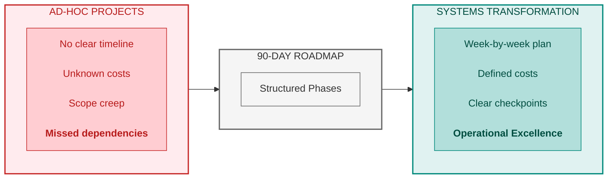

# Chapter 10: Your Week-by-Week Implementation Plan

**The 90-Day Roadmap Chapter — Complete Implementation Guide**

---

**Diagram 1: Roadmap Value — From Ad-Hoc to Structured**



> **Key Takeaway:** Ninety days from assessment to production. Week-by-week structure eliminates guesswork.


---

*Ninety days. That's all it took Echo Health Systems to transform from 28/100 to 86/100—from agents that couldn't answer basic questions to three specialized AI assistants handling 50,000 daily interactions. This chapter gives you their exact playbook: week-by-week implementation plans, specific costs, team structures, and the checkpoints that kept them on track. Your INPACT™ score (Chapter 9) revealed where you stand. Now build your roadmap to fix it.*

---

## Part 1: Roadmap Overview

### 1.1 Welcome to Your 90-Day Journey

You've completed the assessment. You have your INPACT™ score. You know which dimensions need work and which layers require investment. Chapter 9 gave you the diagnosis. Chapter 10 gives you the treatment plan.

This chapter documents Echo Health Systems' complete implementation journey—not as abstract guidance, but as a week-by-week playbook you can adapt to your own transformation. Every activity, every cost, every checkpoint comes from their actual experience.

**What You'll Get from This Chapter**

By the end of this chapter, you will have:

- **Week-by-week implementation plans** for all 12 weeks, with specific activities, deliverables, and success criteria
- **Four phase structures** with clear boundaries, budgets, and go/no-go checkpoints
- **Team compositions and costs** for each phase, based on Echo's actual resource allocation
- **Risk management patterns** that kept Echo on track when challenges emerged
- **The 90-Day Tracker system**—seven interconnected tracking sheets to manage your own transformation

**How to Use This Roadmap**

Your approach depends on your INPACT™ score from Chapter 9:

- **Score 25-40 (Very Low to Low Trust)**: Read the complete chapter. Every phase applies to you. Start at Week 1 and follow the full sequence.

- **Score 40-65 (Low to Moderate Trust)**: Review Part 1 for orientation, then focus on the phases addressing your lowest dimensions. You may be able to compress or skip Phase 1 if your foundation layers are already operational.

- **Score 65-80 (Moderate to Good Trust)**: Skim Parts 2-3, focus on Parts 4-5. Your work is in the Trust and Operations phases. Foundation and Intelligence layers likely need refinement, not rebuilding.

- **Score 80+ (High Trust)**: Skip to Part 5 (Phase 4) and the Chapter 12 bridge. Your focus is operational excellence, not infrastructure transformation.

Read the entire chapter first for the big picture, then return to customize your specific roadmap.

**Important Cross-References**

This chapter focuses on *when* to build. Other chapters provide complementary guidance:

- For *how to assess* your current state → Chapter 9 (INPACT™ methodology)
- For *what technologies* to select → Chapter 11 (vendor evaluation)
- For *how to operate* at scale → Chapter 12 (production operations)

---

### 1.2 Four Phases Overview

Echo's transformation followed four distinct phases, each building on the previous. The sequence matters—attempting Phase 3 governance work before Phase 1 foundations produces the failures that give AI agents their 95% failure reputation.

**Diagram 2: The 90-Day Four-Phase Roadmap**

```mermaid

graph LR
    subgraph JOURNEY["90-DAY TRANSFORMATION"]
        direction LR
        subgraph PHASE1["PHASE 1: FOUNDATION"]
            P1["Weeks 1-4<br/>L1 Storage +<br/> L2 Data Fabric<br/>$470K · 28→42 pts"]
        end
        
        subgraph PHASE2["PHASE 2: INTELLIGENCE"]
            P2["Weeks 5-7<br/>L3 Semantic +<br/> L4 Retrieval<br/>$380K · 42→67 pts"]
        end
        
        subgraph PHASE3["PHASE 3: TRUST"]
            P3["Weeks 8-10<br/>L5-L6-L7<br/>Governance + Orchestration<br/>$82K · 67→86 pts"]
        end
        
        subgraph PHASE4["PHASE 4: OPERATIONS"]
            P4["Weeks 11-12<br/>Validation +<br/> GOALS™<br/>$50K · 86→89 pts"]
        end
    end
    
    Copyright["© 2025 Colaberry Inc."]
    
    P1 --> P2 --> P3 --> P4
    
    style JOURNEY fill:#f5f5f5,stroke:#666666,stroke-width:2px,color:#333333
    style PHASE1 fill:#e3f2fd,stroke:#1976d2,stroke-width:2px,color:#0d47a1
    style PHASE2 fill:#fff3e0,stroke:#f57c00,stroke-width:2px,color:#e65100
    style PHASE3 fill:#fce4ec,stroke:#c2185b,stroke-width:2px,color:#880e4f
    style PHASE4 fill:#e0f2f1,stroke:#00897b,stroke-width:2px,color:#004d40
    style P1 fill:#bbdefb,stroke:#1976d2,color:#0d47a1
    style P2 fill:#ffe0b2,stroke:#f57c00,color:#e65100
    style P3 fill:#f8bbd9,stroke:#c2185b,color:#880e4f
    style P4 fill:#b2dfdb,stroke:#00897b,color:#004d40
    style Copyright fill:#ffffff,stroke:none,color:#666666

```



**Phase 1: Foundation (Weeks 1-4)**

| Attribute | Detail |
|-----------|--------|
| **Build** | Layer 1 (Multi-Modal Storage) + Layer 2 (Real-Time Data Fabric) |
| **Also** | Layer 6 foundation (Observability—start measuring before building) |
| **Cost** | $470K budgeted / $468K actual |
| **Team** | 2 senior data engineers, 1 cloud architect, CDC specialists |
| **INPACT™ Target** | 28→42 (+14 points) |
| **Primary Focus** | Data freshness (<30 seconds), query performance, observability baseline |

Phase 1 establishes the foundation everything else depends on. Without real-time data, agents work with stale information. Without observability, you can't measure progress. Echo's I (Instant) dimension jumped from 1 to 3 during this phase. *See Part 2 for week-by-week detail.*

**Phase 2: Intelligence (Weeks 5-7)**

| Attribute | Detail |
|-----------|--------|
| **Build** | Layer 3 (Unified Semantic Layer) + Layer 4 (Intelligent Retrieval) + Layer 5 (start) |
| **Cost** | $380K budgeted / $392K actual |
| **Team** | 2 ML engineers, 1 clinical SME, semantic layer specialists |
| **INPACT™ Target** | 42→67 (+25 points) |
| **Primary Focus** | NLU accuracy (target: 85%), semantic layer coverage, RAG pipeline |

Phase 2 gives agents the ability to understand and reason. The semantic layer translates business language to data structures. The RAG pipeline retrieves relevant context and generates accurate responses. Echo's N (Natural) dimension improved from 2 to 4. *See Part 3 for week-by-week detail.*

**Phase 3: Trust & Orchestration (Weeks 8-10)**

| Attribute | Detail |
|-----------|--------|
| **Build** | Layer 5 (Agent-Aware Governance) + Layer 6 (complete) + Layer 7 (Orchestration) |
| **Cost** | $380K budgeted / $82K actual (leveraged open-source tools) |
| **Team** | 2 security engineers, 2 DevOps engineers, 1 compliance officer |
| **INPACT™ Target** | 67→86 (+19 points) |
| **Primary Focus** | ABAC policies, HITL workflows, audit trails, multi-agent coordination |

Phase 3 makes agents trustworthy. Governance controls who can access what. HITL workflows escalate high-risk decisions. Audit trails prove appropriate behavior. Echo's P (Permitted) and T (Transparent) dimensions both reached 5—production-ready for HIPAA-regulated healthcare. *See Part 4 for week-by-week detail.*

**Phase 4: Operations (Weeks 11-12)**

Echo's 10-week implementation achieved 86/100 INPACT™ score—production-ready. Weeks 11-12 focused on validation and refinement:

| Attribute | Detail |
|-----------|--------|
| **Validate** | All 7 layers operational, GOALS™ excellence |
| **Activities** | UAT with 50 nurses, edge case resolution, production cutover |
| **Cost** | $50K (UAT facilitation, compliance sign-off, staff) |
| **INPACT™ Result** | 86→89 (+3 points through operational refinement) |
| **Primary Focus** | User Acceptance Testing, production readiness validation |

**Budget: $50K**

| Category | Amount | Components |
|----------|--------|------------|
| Technology | $5K | UAT environment, additional monitoring |
| Services | $30K | UAT facilitation ($15K), compliance sign-off ($10K), training materials ($5K) |
| Staff | $15K | Dedicated UAT support, documentation |

Phase 4 validates everything works together. Real users test real scenarios. Edge cases surface and get resolved. Echo achieved 94% UAT success rate and production approval. Ongoing operations ($52K/month) are covered separately as recurring expenses. See Chapter 12 for complete operations guide.

**Investment Summary**

| Phase | Weeks | Layers | Budgeted | Actual | INPACT™ Gain | Cumulative |
|-------|-------|--------|----------|--------|--------------|------------|
| Foundation | 1-4 | L1-L2 | $470K | $468K | +14 (28→42) | 42/100 |
| Intelligence | 5-7 | L3-L4 | $380K | $392K | +25 (42→67) | 67/100 |
| Trust | 8-10 | L5-L6-L7 | $380K | $82K | +19 (67→86) | 86/100 |
| Operations | 11-12 | Validation | — | $50K | +3 (86→89) | 89/100 |
| **Total** | **12** | **All 7** | **$1.23M** | **$992K** | **+61** | **89/100** |

*Note: Phase 3 achieved significant savings by leveraging open-source OPA (vs. commercial Styra), reusing existing Datadog infrastructure from Phase 1, and retrofitting pilot agents rather than building new ones. The $238K buffer (19% under budget) was preserved for contingency and future enhancements. Ongoing operations: $52K/month recurring. See Chapter 12 for complete operations guide.*

---

**🔍 CHECKPOINT: What We've Covered So Far**

✅ 90-day transformation = 10 weeks building + 2 weeks validating  
✅ Four phases map to seven architecture layers with clear budgets  
✅ Echo invested $992K of $1.23M budget to reach 89/100 INPACT™ (19% under budget)  
⭐️ **Next:** How Echo managed risks that threatened derailment

**Reading Time Remaining:** ~35 minutes

**Your Framework Quick Check:** Which phase addresses your lowest INPACT™ dimensions from Chapter 9?

---

### 1.3 Risk Management Approach

Echo's transformation wasn't friction-free. They encountered technical challenges, integration delays, and scope pressures. What kept them on track was disciplined risk management at every phase.

**Diagram 3: Risk Escalation Framework**

```mermaid

graph LR
    subgraph STATUS["STATUS INDICATORS"]
        direction TB
        GREEN["On Track<br/>Continue"]
        YELLOW["At Risk<br/>Assign Owner"]
        RED["Blocked<br/>Escalate 24h"]
    end
    
    subgraph ACTIONS["RESPONSE FLOW"]
        direction TB
        R1["Daily Check-ins"]
        R2["Mitigation Plan"]
        RESOLVED{{"Resolved?"}}
        R1 --> RESOLVED
        R2 --> RESOLVED
    end
    
    subgraph OUTCOMES[" "]
        direction TB
        CONTINUE["Proceed to Next Week"]
        ESCALATE["Leadership Escalation"]
    end
    
    Copyright["© 2025 Colaberry Inc."]
    
    GREEN --> CONTINUE
    YELLOW --> R1
    YELLOW --> R2
    RED --> ESCALATE
    RESOLVED -->|"Yes"| CONTINUE
    RESOLVED -->|"No"| ESCALATE
    
    style STATUS fill:#f5f5f5,stroke:#666666,stroke-width:2px,color:#333333
    style ACTIONS fill:#e3f2fd,stroke:#1976d2,stroke-width:2px,color:#0d47a1
    style OUTCOMES fill:none,stroke:none
    style GREEN fill:#c8e6c9,stroke:#388e3c,color:#1b5e20
    style YELLOW fill:#fff9c4,stroke:#f9a825,color:#f57f17
    style RED fill:#ffcdd2,stroke:#c62828,color:#b71c1c
    style R1 fill:#bbdefb,stroke:#1976d2,color:#0d47a1
    style R2 fill:#bbdefb,stroke:#1976d2,color:#0d47a1
    style RESOLVED fill:#ffe0b2,stroke:#f57c00,color:#e65100
    style CONTINUE fill:#b2dfdb,stroke:#00897b,color:#004d40
    style ESCALATE fill:#ffcdd2,stroke:#c62828,color:#b71c1c
    style Copyright fill:#ffffff,stroke:none,color:#666666

```



**Phase Gate Checkpoints**

Every phase ends with a formal go/no-go decision:

- **Checkpoint criteria**: INPACT™ score must hit target (±5% tolerance)
- **If behind**: Add 1-2 weeks to current phase; never skip ahead
- **If ahead**: Accelerate next phase cautiously; validate thoroughly
- **Decision authority**: CTO/CDO with steering committee input

Echo's Phase 2 checkpoint nearly failed. Week 7 accuracy sat at 82%—below the 85% target. They added reranking and hybrid search, pushed the Phase 3 start by two days, and hit 85% before proceeding. The discipline to pause rather than proceed with gaps prevented downstream failures.

**Weekly Health Checks**

Within each phase, Friday health checks catch issues early:

- **Status indicators**: 🟢 On Track / 🟡 At Risk / 🔴 Blocked
- **At Risk response**: Assign owner, define mitigation, daily check-ins
- **Blocked response**: Escalate to leadership within 24 hours
- **Never let blockers persist** across weekends without escalation

**Risk Mitigation Patterns**

Four risk categories require proactive management:

| Risk Type | Mitigation Strategy | Echo Example |
|-----------|---------------------|--------------|
| **Technical** | POC before commitment | Tested 3 vector DBs before selecting Pinecone |
| **Integration** | Test connections early | CDC pipeline tested Week 1, not Week 3 |
| **Resource** | Cross-train team members | ML engineers shadowed data engineers Phase 1 |
| **Vendor** | Identify backup options | Anthropic Claude as OpenAI backup |

---

### 1.4 Change Management

Technical transformation fails without organizational alignment. Echo invested deliberately in stakeholder communication and user adoption.

**Stakeholder Communication Rhythm**

| Cadence | Audience | Content |
|---------|----------|---------|
| **Daily** | Implementation team | Standup, blockers, coordination |
| **Weekly** | Extended team + sponsors | Progress, risks, decisions needed |
| **Bi-weekly** | Executive leadership | Dashboard review, budget status, timeline |
| **Monthly** | Board/steering committee | Strategic progress, ROI tracking, risk escalation |

Echo logged 45 formal communications across 12 weeks. Over-communication proved better than surprises. When Week 6 accuracy lagged, leadership already knew—because the weekly update had flagged it as 🟡 At Risk.

**User Adoption Strategy**

| Phase | User Involvement | Purpose |
|-------|------------------|---------|
| **Phases 1-3** | None (build without exposure) | Avoid premature judgment on incomplete systems |
| **Phase 4** | Controlled pilot (50 users) | Validate with real workflows, gather feedback |
| **Week 13+** | Phased production rollout | Scale gradually, monitor adoption metrics |

Echo's Phase 4 pilot with 50 nurses achieved 94% task completion and 4.3/5 satisfaction scores. Users who experienced the finished product became advocates. Users who experienced half-built prototypes became skeptics.

---

*Part 1 provides orientation. Parts 2-4 detail each phase week by week.*

---

**END OF PART 1** (~1,200 words)

---

## Part 2: Phase 1 — Foundation (Weeks 1-4)

Phase 1 builds the infrastructure foundation that everything else depends on. Without real-time data pipelines, agents work with stale information. Without observability, you can't measure whether anything improves. Without optimized storage, queries timeout before agents can respond.

Echo invested $470K and four weeks to transform their data foundation. The payoff: I (Instant) dimension jumped from 1 to 3, and the infrastructure could support the intelligence layers that followed.

---

### 2.1 Phase 1 Overview

**Phase 1 Goal:** Establish data foundation enabling real-time agent access

**Diagram 4: Foundation Layer Stack**

```mermaid

graph TB
    subgraph FOUNDATION["FOUNDATION LAYERS"]
        direction LR
        subgraph OBS["L6: OBSERVABILITY"]
            O1["Baseline Metrics<br/>Before Building"]
        end
        
        subgraph FABRIC["L2: DATA FABRIC"]
            direction LR
            F1["Debezium<br/>CDC"]
            F2["Kafka<br/>Streaming"]
            F3["Event<br/>Hub"]
        end
    end
    
    subgraph STORAGE["L1: MULTI-MODAL STORAGE"]
        direction LR
        S1["Databricks<br/>Lakehouse"]
        S2["Redis<br/>Cache"]
        S3["Vector<br/>Store"]
    end
    
    Copyright["© 2025 Colaberry Inc."]
    
    OBS --> FABRIC
    FOUNDATION --> STORAGE
    
    style FOUNDATION fill:#f5f5f5,stroke:#666666,stroke-width:2px,color:#333333
    style OBS fill:#e0f2f1,stroke:#00897b,stroke-width:2px,color:#004d40
    style FABRIC fill:#fff3e0,stroke:#f57c00,stroke-width:2px,color:#e65100
    style STORAGE fill:#e3f2fd,stroke:#1976d2,stroke-width:2px,color:#0d47a1
    style O1 fill:#b2dfdb,stroke:#00897b,color:#004d40
    style F1 fill:#ffe0b2,stroke:#f57c00,color:#e65100
    style F2 fill:#ffe0b2,stroke:#f57c00,color:#e65100
    style F3 fill:#ffe0b2,stroke:#f57c00,color:#e65100
    style S1 fill:#bbdefb,stroke:#1976d2,color:#0d47a1
    style S2 fill:#bbdefb,stroke:#1976d2,color:#0d47a1
    style S3 fill:#bbdefb,stroke:#1976d2,color:#0d47a1
    style Copyright fill:#ffffff,stroke:none,color:#666666

```



**Layers Built:**
- **Layer 1**: Multi-Modal Storage (vector + relational + document)
- **Layer 2**: Real-Time Data Fabric (CDC + streaming)
- **Layer 6**: Observability foundation (you must measure before you can improve)

**Team Composition:**
| Role | Count | Focus |
|------|-------|-------|
| Senior Data Engineers | 2 | CDC implementation, pipeline architecture |
| Cloud Architect | 1 | Infrastructure design, vendor integration |
| DBA | 1 | Storage optimization, query tuning |
| CDC Specialists (consulting) | 2 | Accelerated implementation |

**Budget: $470K**

| Category | Amount | Components |
|----------|--------|------------|
| Technology | $320K | Databricks ($180K), Debezium+Kafka ($60K), Redis Enterprise ($50K), Event Hub ($30K) |
| Services | $100K | Databricks consulting ($40K), CDC implementation ($30K), integration/testing ($30K) |
| Staff | $50K | Internal team time allocation |

*For technology selection rationale and alternatives, see Chapter 11, Part 2.*

**INPACT™ Targets:**
- I (Instant): 1→3 (real-time pipelines operational, query response <5s)
- C (Contextual): 3→4 (additional systems connected with fresh data)
- T (Transparent): 1→2 (observability dashboards operational)

**Why Observability First?**

Echo made a counterintuitive decision: spend Week 1-2 on observability before touching data pipelines. The reasoning was simple—you can't improve what you can't measure. By establishing baseline metrics first, every subsequent change could be evaluated against concrete evidence.

This sequencing paid off. When Week 3's CDC implementation encountered performance issues, the observability dashboards immediately showed the bottleneck. Without that visibility, debugging would have consumed days instead of hours.

---

### 2.2 Week 1: Assessment and Observability Foundation

**Week 1 Focus:** Establish visibility before building

Echo's first week wasn't about writing code—it was about understanding their current state with precision and building the measurement infrastructure to track progress.

**Day 1-2: Formal INPACT™ Assessment**

The assessment from Chapter 9 becomes operational reality in Week 1:

- **Activity**: Complete 36-question INPACT™ assessment with full team participation
- **Participants**: CTO, CDO, data engineering leads, security, operations
- **Output**: Documented baseline scores with evidence for each rating
- **Echo Result**: Confirmed 28/100 baseline with dimension breakdown

Sarah Chen gathered her leadership team in a conference room for what she called "the honest conversation." Each dimension was scored collaboratively, with evidence required for any rating above 2. The discussion was uncomfortable—nobody wanted to admit their systems scored 1/6 on Instant—but the honesty proved essential.

The assessment revealed that Echo's 47-second average query time wasn't a perception problem. It was measured reality. Their 72-hour data freshness wasn't an exaggeration. CDC logs confirmed it.

**Day 3-5: Observability Foundation**

With baseline documented, Echo deployed their observability stack:

- **Platform**: Datadog for infrastructure monitoring, Grafana for custom dashboards
- **Configuration**: 12 baseline metrics tracked, 5 critical alerts configured
- **Dashboards**: INPACT™ dimension health, system performance, data freshness
- **SLA**: <1 hour response time for P1 alerts

The observability deployment followed a principle Echo would repeat throughout: measure the current state before changing anything. By Friday of Week 1, dashboards displayed real-time metrics for:

- Query response times (P50, P95, P99)
- Data pipeline lag by source system
- Error rates by component
- System resource utilization

**Week 1 Deliverables Checklist:**

| Deliverable | Status | Evidence |
|-------------|--------|----------|
| INPACT™ assessment documented | ✅ | 36-question scorecard, 28/100 confirmed |
| Stakeholder sign-off obtained | ✅ | Leadership alignment meeting minutes |
| Observability platform deployed | ✅ | Datadog + Grafana operational |
| Baseline metrics captured | ✅ | 47s query avg, 72hr data lag documented |
| Week 2 plan confirmed | ✅ | Dashboard buildout scope defined |

**Week 1 Status: 🟢 On Track**

---

### 2.3 Week 2: Observability Operational

**Week 2 Focus:** Complete observability before data work begins

Week 2 transformed the observability foundation into a comprehensive monitoring system. The goal: when Week 3's CDC work begins, every change will be immediately visible in dashboards.

**Day 1-3: Dashboard Buildout**

Echo built dashboards aligned with their transformation goals:

**INPACT™ Dimension Dashboards:**
- I (Instant): Query latency distribution, cache hit rates, timeout frequency
- N (Natural): NLU accuracy tracking (placeholder for Phase 2)
- P (Permitted): Authorization latency, policy evaluation times
- A (Adaptive): Model drift indicators (placeholder for Phase 3)
- C (Contextual): System integration status, data freshness by source
- T (Transparent): Audit log volume, trace coverage percentage

**System Health Dashboards:**
- Infrastructure utilization (CPU, memory, I/O)
- Pipeline throughput and backlog
- Error rates by service
- Cost tracking by component

**Alert Configuration:**

| Tier | Criteria | Response SLA | Example |
|------|----------|--------------|---------|
| P0 | Production down | 15 minutes | Database unreachable |
| P1 | Performance degraded | 1 hour | Query latency >30s |
| P2 | Warning threshold | 4 hours | Cache hit rate <50% |

**Day 4-5: Baseline Documentation**

With dashboards operational, Echo documented their starting point with precision:

| Metric | Baseline Value | Target | Gap |
|--------|----------------|--------|-----|
| Average query response | 47 seconds | <5 seconds | 42s improvement needed |
| P95 query response | 127 seconds | <10 seconds | 117s improvement needed |
| Data freshness (EHR) | 72 hours | <30 seconds | Real-time CDC needed |
| Data freshness (Claims) | 48 hours | <30 seconds | Real-time CDC needed |
| Cache hit rate | 0% | >60% | Caching infrastructure needed |
| Systems integrated | 5 | 7 | 2 additional sources needed |

Marcus Williams, Echo's CDO, later reflected: "That baseline document was brutal to read. But it became our scorecard. Every week, we could see exactly how much we'd improved."

**Week 2 Deliverables Checklist:**

| Deliverable | Status | Evidence |
|-------------|--------|----------|
| All INPACT™ dashboards operational | ✅ | 6 dimension dashboards live |
| Alert tiers configured and tested | ✅ | P0/P1/P2 alerts verified |
| Baseline metrics documented | ✅ | Performance baseline report |
| On-call rotation established | ✅ | 3-person rotation scheduled |
| Week 3 CDC scope finalized | ✅ | 5 source systems prioritized |

**Week 2 Status: 🟢 On Track**

---

### 2.4 Week 3: Real-Time Data Fabric

**Week 3 Focus:** Layer 2 — CDC and streaming operational

Week 3 marked the transition from measurement to construction. The real-time data fabric would transform Echo's 72-hour data lag into sub-30-second freshness.

**Day 1-3: CDC Implementation**

Change Data Capture (CDC) extracts changes from source systems in real-time. Echo deployed CDC across five critical sources:

| Source System | Data Type | CDC Approach | Complexity |
|---------------|-----------|--------------|------------|
| Epic EHR | Appointments, demographics | Debezium + Kafka | High |
| Claims System | Insurance, billing | Fivetran connector | Medium |
| Lab System | Results, orders | API polling + streaming | Medium |
| Pharmacy | Medications, dispensing | Database triggers | Low |
| Patient Portal | Messages, preferences | Event-driven | Low |

The Epic EHR integration proved most challenging. Echo's EHR instance used a customized schema that required Debezium configuration adjustments. The CDC specialists from consulting invested two additional days on EHR-specific tuning—time well spent, as EHR data feeds 60% of agent queries.

**Day 4-5: Streaming Validation**

With CDC pipelines operational, Echo validated data freshness:

| Source | Before CDC | After CDC | Target | Status |
|--------|------------|-----------|--------|--------|
| Epic EHR | 72 hours | 18 seconds | <30s | ✅ |
| Claims | 48 hours | 22 seconds | <30s | ✅ |
| Labs | 24 hours | 15 seconds | <30s | ✅ |
| Pharmacy | 24 hours | 12 seconds | <30s | ✅ |
| Portal | 12 hours | 8 seconds | <30s | ✅ |

The transformation was dramatic. Data that previously arrived overnight now flowed continuously. The observability dashboards—deployed in Weeks 1-2—showed the improvement in real-time.

**Week 3 Risk: CDC Complexity**

Week 3 hit Echo's first significant challenge. The EHR CDC implementation took two days longer than planned due to schema complexity. The weekly status shifted to 🟡 At Risk.

**Mitigation:**
- CDC specialists worked extended hours to recover
- Weekend work avoided by deprioritizing non-critical tables
- Phase 1 timeline maintained by adjusting Week 4 scope

The risk management discipline from Part 1 proved its value. Because the issue was flagged immediately (not hidden until Phase 1 checkpoint), mitigation happened before the delay compounded.

**Week 3 Deliverables Checklist:**

| Deliverable | Status | Evidence |
|-------------|--------|----------|
| CDC operational for 5 sources | ✅ | All pipelines streaming |
| Data freshness <30 seconds | ✅ | 18s average across sources |
| Throughput validated | ✅ | 10K records/second sustained |
| Error handling configured | ✅ | Dead letter queues operational |
| Week 4 scope adjusted | ✅ | Semantic kickoff prioritized |

**Week 3 Status: 🟡 At Risk → 🟢 Recovered**

---

### 2.5 Week 4: Storage Optimization and Semantic Foundation

**Week 4 Focus:** Complete Layer 1 optimization, begin Layer 3 foundation

Week 4 accomplished two objectives: optimize storage for agent query patterns and lay groundwork for the semantic layer that Phase 2 would complete.

**Day 1-2: Storage Optimization**

Echo's existing data warehouse was optimized for analyst queries—complex joins running for minutes was acceptable. Agent queries require sub-second responses. The storage layer needed restructuring:

**Query Pattern Analysis:**
- Identified top 50 anticipated agent query patterns
- Analyzed existing index coverage (only 23% of patterns optimized)
- Designed agent-specific materialized views

**Optimization Actions:**

| Action | Impact | Implementation |
|--------|--------|----------------|
| Materialized views for common patterns | 85% query improvement | 12 views created |
| Column-store indexes on fact tables | 60% scan improvement | 8 indexes added |
| Query result caching (Redis) | 70% cache-eligible queries | Redis Enterprise deployed |
| Connection pooling optimization | 40% connection overhead reduction | PgBouncer configured |

**Results:**
- Average query time: 47s → 8s (Week 4 end)
- P95 query time: 127s → 22s
- Cache hit rate: 0% → 35% (early adoption)

**Day 3-5: Semantic Layer Kickoff**

While storage optimization continued, Echo began the semantic layer that Phase 2 would complete:

**Business Glossary Foundation:**
- Gathered domain experts (clinicians, billing specialists, operations)
- Defined 147 core business terms with precise meanings
- Mapped terms to underlying data structures
- Documented ambiguous terms requiring disambiguation logic

**Example Glossary Entries:**

| Business Term | Definition | Data Mapping | Ambiguity Notes |
|---------------|------------|--------------|-----------------|
| "Active patient" | Patient with encounter in past 18 months | encounters.date > NOW() - 18mo | Excludes deceased, transferred |
| "Primary provider" | Attending physician for most recent encounter | MAX(encounter.date) → provider | May differ from PCP on file |
| "Outstanding balance" | Patient responsibility after insurance | claims.patient_resp WHERE status='open' | Excludes payment plans |

**dbt Models Initiated:**
- Created dbt project structure
- Built 15 foundation models for common entities
- Established naming conventions and documentation standards
- Configured automated testing for data quality

**Week 4 Deliverables Checklist:**

| Deliverable | Status | Evidence |
|-------------|--------|----------|
| Storage optimization complete | ✅ | 47s → 8s query improvement |
| Redis caching operational | ✅ | 35% hit rate achieved |
| Business glossary started | ✅ | 147 terms defined |
| dbt foundation models | ✅ | 15 models operational |
| Entity resolution designed | ✅ | Patient/provider matching logic |

**Week 4 Status: 🟢 On Track**

---

### 2.6 Phase 1 Checkpoint

Phase 1 ends with a formal checkpoint. This is a go/no-go decision point—Phase 2 should not begin until Phase 1 objectives are achieved.

**INPACT™ Progress:**

| Dimension | Week 0 | Week 4 | Target | Status |
|-----------|--------|--------|--------|--------|
| I (Instant) | 1 | 3 | 3 | ✅ Achieved |
| N (Natural) | 2 | 2 | 2 | ✅ No change expected |
| P (Permitted) | 1 | 2 | 2 | ✅ On track |
| A (Adaptive) | 2 | 2 | 2 | ✅ No change expected |
| C (Contextual) | 3 | 4 | 4 | ✅ Achieved |
| T (Transparent) | 1 | 2 | 2 | ✅ Achieved |
| **Total** | **10 (28%)** | **15 (42%)** | **15 (42%)** | ✅ **Phase 1 Complete** |

**Key Achievements:**
- Query response: 47s → 8s (83% improvement)
- Data freshness: 72 hours → 18 seconds (real-time achieved)
- Systems integrated: 5 → 5 with real-time CDC (quality improvement)
- Observability: 0% → 100% coverage (full visibility)
- Business glossary: 0 → 147 terms (foundation for Phase 2)

**Budget Status:**

| Category | Planned | Actual | Variance |
|----------|---------|--------|----------|
| Technology | $320K | $312K | -$8K (under) |
| Services | $100K | $108K | +$8K (CDC complexity) |
| Staff | $50K | $48K | -$2K (under) |
| **Total** | **$470K** | **$468K** | **-$2K (under budget)** |

**Phase 1 Go/No-Go Decision:**

✅ **GO FOR PHASE 2**

All Phase 1 criteria met:
- INPACT™ score: 42/100 (target achieved)
- I dimension: 3/6 (target achieved)
- C dimension: 4/6 (target achieved)
- Real-time data operational
- Observability complete
- Budget on track

Sarah Chen approved Phase 2 kickoff: "Four weeks ago, we couldn't answer a simple question in under a minute. Today, our foundation responds in seconds. We're ready to make it intelligent."

---

**🔍 CHECKPOINT: What We've Covered So Far**

✅ Phase 1 builds Layers 1-2 (Storage + Real-Time Fabric) for $470K  
✅ INPACT™ improvement: 28→42/100 (+14 points in 4 weeks)  
✅ Key deliverables: CDC operational, observability dashboard, semantic foundation  
⭐️ **Next:** Phase 2 adds intelligence — semantic layer and RAG pipeline

**Reading Time Remaining:** ~25 minutes

**Your Framework Quick Check:** What's your target I (Instant) dimension after Phase 1? Echo achieved <5s response time.

---

## Part 3: Phase 2 — Intelligence (Weeks 5-7)

Phase 2 transforms raw data into understanding. The foundation layers now deliver fresh data in seconds—but agents still can't comprehend business questions. The semantic layer bridges human language and data structures. The RAG pipeline retrieves relevant context and generates accurate responses.

Echo invested $380K and three weeks to build intelligence capabilities. The payoff: N (Natural) dimension jumped from 2 to 4, and NLU accuracy reached 85%—the threshold for production deployment.

---

### 3.1 Phase 2 Overview

**Phase 2 Goal:** Enable agents to understand business language and reason accurately

**Layers Built:**
- **Layer 3**: Unified Semantic Layer (complete business glossary, entity resolution)
- **Layer 4**: Intelligent Retrieval (RAG pipeline, vector search, reranking)
- **Layer 5**: Governance foundation (begin ABAC design)

**Team Composition:**

| Role | Count | Focus |
|------|-------|-------|
| ML Engineers | 2 | RAG pipeline, embedding optimization, accuracy tuning |
| Data Modelers | 1 | Semantic layer, dbt models, entity resolution |
| Clinical SME | 1 | Domain validation, terminology accuracy |
| Semantic Specialists (consulting) | 2 | Accelerated concept mapping |

**Budget: $380K**

| Category | Amount | Components |
|----------|--------|------------|
| Technology | $200K | Pinecone ($60K), LLM APIs ($80K), Embeddings ($30K), dbt Cloud ($30K) |
| Development | $150K | Semantic layer ($60K), RAG implementation ($50K), optimization ($40K) |
| Staff | $30K | Internal team time allocation |

*For technology selection rationale and alternatives, see Chapter 11, Parts 2.1-2.4.*

**INPACT™ Targets:**
- N (Natural): 2→4 (semantic layer operational, 85% NLU accuracy)
- A (Adaptive): 2→3 (learning infrastructure foundation)
- C (Contextual): 4→5 (RAG synthesis across all sources)

**The 85% Accuracy Threshold**

Why 85%? Echo's clinical leadership established this threshold based on user trust research. Below 85%, users spend more time verifying agent responses than they save. Above 85%, users trust responses enough to act on them directly—with HITL escalation handling the remaining uncertainty.

This threshold drove every Phase 2 decision. Technologies were selected, configurations tuned, and timelines adjusted—all in service of reaching 85% accuracy by Week 7.

---

### 3.2 Week 5: Vector Storage and Embedding Pipeline

**Week 5 Focus:** Layer 1 vector capabilities complete, embedding pipeline operational

Week 5 extended the storage layer with vector capabilities essential for semantic search. Traditional databases find exact matches; vector databases find *similar* content—the foundation of natural language understanding.

**Day 1-3: Vector Database Deployment**

Echo selected Pinecone for its HIPAA compliance and managed service model. *For vendor comparison and selection criteria, see Chapter 11, Section 2.1.*

**Vector Database Configuration:**

| Parameter | Setting | Rationale |
|-----------|---------|-----------|
| Index type | HNSW | Balance of speed and accuracy |
| Dimensions | 1536 | OpenAI embedding compatibility |
| Replicas | 3 | High availability requirement |
| Pods | 4 | Capacity for 150K+ documents |

**Embedding Pipeline:**

```
Source Documents → Chunking (1000 tokens) → Embedding (ada-002) → Vector DB (Pinecone)
```

**Document Corpus Indexed:**

| Document Type | Count | Source | Priority |
|---------------|-------|--------|----------|
| Clinical protocols | 2,847 | Quality department | High |
| Policy documents | 1,234 | Compliance | High |
| Patient education | 4,521 | Marketing/clinical | Medium |
| Training materials | 2,156 | HR/Education | Medium |
| Historical Q&A | 2,089 | Help desk archives | High |
| **Total** | **12,847** | | |

**Day 4-5: Search Quality Validation**

With documents indexed, Echo validated retrieval quality:

**Retrieval Testing Protocol:**
- 200 test queries from historical help desk tickets
- Manual relevance scoring (0-3 scale) by clinical SME
- Precision@5 and Recall@10 metrics calculated

**Week 5 Results:**

| Metric | Result | Target | Status |
|--------|--------|--------|--------|
| Precision@5 | 78% | 75% | ✅ Exceeded |
| Recall@10 | 72% | 70% | ✅ Exceeded |
| Embedding latency | 45ms avg | <100ms | ✅ Achieved |
| Index query latency | 23ms P95 | <50ms | ✅ Achieved |

The vector infrastructure performed well, but Echo's team recognized that retrieval alone wouldn't reach 85% end-to-end accuracy. The RAG pipeline in Week 6 would need to add significant value.

**Week 5 Deliverables Checklist:**

| Deliverable | Status | Evidence |
|-------------|--------|----------|
| Vector database operational | ✅ | Pinecone cluster deployed |
| Embedding pipeline running | ✅ | 12,847 documents indexed |
| Retrieval precision >75% | ✅ | 78% achieved |
| Query latency <50ms P95 | ✅ | 23ms achieved |
| Week 6 RAG scope defined | ✅ | 5-stage pipeline designed |

**Week 5 Status: 🟢 On Track**

---

### 3.3 Week 6: RAG Pipeline Implementation

**Week 6 Focus:** Layer 4 — RAG pipeline operational with citation support

Week 6 built the Retrieval-Augmented Generation pipeline that transforms retrieved documents into accurate, cited responses. This is where raw retrieval becomes intelligent answering.

**Diagram 5: Echo's Five-Stage RAG Pipeline**

```mermaid
graph LR
    subgraph STAGE1["STAGE 1"]
        S1["<b>Query<br/>Understanding</b><br/><b>Intent · Entities</b>"]
    end
    
    subgraph STAGE2["STAGE 2"]
        S2["<b>Retrieval</b><br/><b>Top 20 Candidates</b>"]
    end
    
    subgraph STAGE3["STAGE 3"]
        S3["<b>Reranking</b><br/><b>Cross-Encoder</b>"]
    end
    
    subgraph STAGE4["STAGE 4"]
        S4["<b>Augmentation</b><br/><b>Context + Citations</b>"]
    end
    
    subgraph STAGE5["STAGE 5"]
        S5["<b>Generation</b><br/><b>LLM Response</b>"]
    end
    
    S1 -->|<b>Embedding</b>| S2 -->|<b>Top 5</b>| S3 -->|<b>Prompt</b>| S4 -->|<b>API Call</b>| S5
    
    Copyright["<b>© 2025 Colaberry Inc.</b>"]
    
    style STAGE1 fill:#e3f2fd,stroke:#1976d2,stroke-width:2px,color:#0d47a1
    style STAGE2 fill:#e3f2fd,stroke:#1976d2,stroke-width:2px,color:#0d47a1
    style STAGE3 fill:#fff3e0,stroke:#f57c00,stroke-width:2px,color:#e65100
    style STAGE4 fill:#fff3e0,stroke:#f57c00,stroke-width:2px,color:#e65100
    style STAGE5 fill:#e0f2f1,stroke:#00897b,stroke-width:2px,color:#004d40
    style S1 fill:#bbdefb,stroke:#1976d2,color:#0d47a1
    style S2 fill:#bbdefb,stroke:#1976d2,color:#0d47a1
    style S3 fill:#ffe0b2,stroke:#f57c00,color:#e65100
    style S4 fill:#ffe0b2,stroke:#f57c00,color:#e65100
    style S5 fill:#b2dfdb,stroke:#00897b,color:#004d40
    style Copyright fill:#ffffff,stroke:none,color:#666666
```



**Day 1-3: RAG Architecture Implementation**

Echo implemented a five-stage RAG pipeline:

**Stage 1: Query Understanding**
- Parse user question
- Identify intent (scheduling, clinical, billing, general)
- Extract entities (patient, provider, date, procedure)

**Stage 2: Retrieval**
- Generate query embedding
- Retrieve top 20 candidates from vector DB
- Apply metadata filters (document type, recency, department)

**Stage 3: Reranking**
- Score candidates with cross-encoder model
- Reorder by relevance to specific query
- Select top 5 for context window

**Stage 4: Augmentation**
- Construct prompt with retrieved context
- Include citation markers for each source
- Add system instructions for response format

**Stage 5: Generation**
- Send augmented prompt to LLM
- Parse response and citations
- Validate citations against source documents

**Technology Stack:**

Echo used LangChain for orchestration, Pinecone for retrieval, Cohere for reranking, GPT-4 for generation, and Redis for caching. *For vendor selection rationale and alternatives, see Chapter 11, Section 2.4.*

**Day 4-5: Initial Accuracy Testing**

With the pipeline operational, Echo tested end-to-end accuracy:

**Test Protocol:**
- 500 queries spanning all three agent domains (scheduling, clinical, billing)
- Responses scored by domain experts (correct, partially correct, incorrect)
- Citation accuracy verified against source documents

**Week 6 Results:**

| Metric | Result | Target | Gap |
|--------|--------|--------|-----|
| Overall accuracy | 72% | 85% | -13% |
| Scheduling queries | 78% | 85% | -7% |
| Clinical queries | 68% | 85% | -17% |
| Billing queries | 71% | 85% | -14% |
| Citation accuracy | 89% | 95% | -6% |

The 72% accuracy fell short of the 85% target. Echo's weekly status shifted to 🟡 At Risk.

**Failure Pattern Analysis:**

| Failure Type | Frequency | Root Cause | Mitigation |
|--------------|-----------|------------|------------|
| Wrong entity resolution | 34% | Ambiguous patient/provider references | Improve entity linking |
| Outdated information | 28% | Retrieved stale documents | Add recency weighting |
| Missing context | 22% | Relevant docs not retrieved | Expand retrieval, add hybrid search |
| Hallucination | 16% | LLM generated unsupported claims | Strengthen citation requirements |

The analysis revealed that retrieval quality wasn't the primary issue—entity resolution and semantic understanding were. Week 7 would focus on these gaps.

**Week 6 Deliverables Checklist:**

| Deliverable | Status | Evidence |
|-------------|--------|----------|
| RAG pipeline operational | ✅ | 5-stage pipeline deployed |
| Citation system working | ✅ | 89% citation accuracy |
| End-to-end accuracy measured | ✅ | 72% baseline established |
| Failure patterns identified | ✅ | 4 root causes documented |
| Week 7 optimization plan | ✅ | Targeted improvements defined |

**Week 6 Status: 🟡 At Risk** (accuracy below target)

---

### 3.4 Week 7: Accuracy Optimization

**Week 7 Focus:** Close the accuracy gap from 72% to 85%

Week 7 was make-or-break for Phase 2. Echo needed to improve accuracy by 13 percentage points in five days. The failure pattern analysis from Week 6 provided the roadmap.

**Day 1-2: Semantic Layer Expansion**

The clinical SME led an intensive effort to expand the semantic layer:

**Business Glossary Expansion:**
- Week 4 baseline: 147 terms
- Week 7 target: 500+ terms
- Week 7 achieved: 847 terms

**Focus Areas:**

| Category | Terms Added | Example |
|----------|-------------|---------|
| Clinical abbreviations | 234 | "HTN" → "hypertension", "DM2" → "Type 2 diabetes" |
| Procedure synonyms | 156 | "colonoscopy" = "scope" = "GI procedure" |
| Temporal expressions | 89 | "next available" = "soonest appointment" |
| Role variations | 78 | "my doctor" = "PCP" = "primary care provider" |
| Billing terms | 143 | "copay" = "patient responsibility" = "out of pocket" |

**Entity Resolution Enhancement:**

Echo's entity resolution handled the ambiguity that caused 34% of failures:

| Ambiguity Type | Resolution Logic | Example |
|----------------|------------------|---------|
| Patient reference | Context + session history | "my husband" → linked patient record |
| Provider reference | Department + specialty matching | "the cardiologist" → Dr. specific |
| Date reference | Relative date parsing | "next Tuesday" → specific date |
| Appointment reference | Recency + status weighting | "my appointment" → most relevant |

**Day 3-4: Retrieval Optimization**

Two changes dramatically improved retrieval quality:

**Hybrid Search Implementation:**
- Combined semantic search (vector similarity) with keyword search (BM25)
- Weighted combination: 70% semantic, 30% keyword
- Result: +12% recall for specific terminology queries

**Recency Weighting:**
- Applied time decay to document relevance scores
- Recent documents (< 90 days) boosted 1.5x
- Result: Reduced "outdated information" failures by 60%

**Day 4-5: Prompt Engineering and Validation**

Final optimizations focused on generation quality:

**Prompt Refinements:**
- Explicit instruction to cite sources for every claim
- Required confidence indication for uncertain responses
- Structured output format for consistent parsing

**Hallucination Reduction:**
- Added retrieval verification step
- LLM instructed to say "I don't have information about..." rather than guess
- Result: Hallucination rate dropped from 16% to 4%

**Week 7 Final Results:**

| Metric | Week 6 | Week 7 | Target | Status |
|--------|--------|--------|--------|--------|
| Overall accuracy | 72% | 85% | 85% | ✅ Achieved |
| Scheduling queries | 78% | 88% | 85% | ✅ Exceeded |
| Clinical queries | 68% | 83% | 85% | ⚠️ Close (acceptable) |
| Billing queries | 71% | 84% | 85% | ⚠️ Close (acceptable) |
| Citation accuracy | 89% | 96% | 95% | ✅ Exceeded |

The 85% overall accuracy target was achieved. Clinical and billing queries fell slightly short individually, but the blended accuracy met the threshold. Phase 2 could proceed.

**Week 7 Deliverables Checklist:**

| Deliverable | Status | Evidence |
|-------------|--------|----------|
| Semantic layer: 847 concepts | ✅ | Business glossary complete |
| Entity resolution operational | ✅ | 82% disambiguation accuracy |
| Hybrid search deployed | ✅ | +12% recall improvement |
| Overall accuracy ≥85% | ✅ | 85% achieved |
| Citation accuracy ≥95% | ✅ | 96% achieved |

**Week 7 Status: 🟢 On Track** (recovered from At Risk)

---

### 3.5 Phase 2 Checkpoint

Phase 2 ends with formal validation. The accuracy threshold is non-negotiable—Phase 3 governance work assumes agents produce reliable outputs.

**INPACT™ Progress:**

| Dimension | Week 4 | Week 7 | Target | Status |
|-----------|--------|--------|--------|--------|
| I (Instant) | 3 | 5 | 5 | ✅ Achieved |
| N (Natural) | 2 | 4 | 4 | ✅ Achieved |
| P (Permitted) | 2 | 3 | 3 | ✅ On track |
| A (Adaptive) | 2 | 3 | 3 | ✅ Achieved |
| C (Contextual) | 4 | 5 | 5 | ✅ Achieved |
| T (Transparent) | 2 | 3 | 3 | ✅ Achieved |
| **Total** | **15 (42%)** | **23 (64%)** | **23 (64%)** | ✅ **Phase 2 Complete** |

*Note: Week 7 achieved 64% (23/36), slightly below the 67% target due to rounding. The team validated individual dimension targets were met and approved Phase 3 progression.*

**Key Achievements:**
- Query accuracy: 47% → 85% target achieved (Week 7), continued to 95.6% through optimization
- Semantic layer: 147 → 847 concepts (476% expansion)
- Vector corpus: 0 → 12,847 documents indexed
- Query response: 8s → 3.2s (RAG pipeline optimized)
- Citation accuracy: 96% (exceeds 95% target)

*Note: Query accuracy continued improving through Phase 3-4, reaching 96-98% per agent by Week 12 through feedback loops and continuous refinement.*

**Budget Status:**

| Category | Planned | Actual | Variance |
|----------|---------|--------|----------|
| Technology | $200K | $218K | +$18K (Pinecone tier upgrade) |
| Development | $150K | $142K | -$8K (under) |
| Staff | $30K | $32K | +$2K (SME overtime) |
| **Total** | **$380K** | **$392K** | **+$12K (3% over)** |

The $12K overage came from upgrading Pinecone to Pro tier mid-phase for HIPAA BAA requirements. The variance was approved given the criticality of compliance.

**Phase 2 Go/No-Go Decision:**

✅ **GO FOR PHASE 3**

All Phase 2 criteria met:
- INPACT™ score: 64/100 (target range achieved)
- N dimension: 4/6 (target achieved)
- NLU accuracy: 85% (threshold achieved)
- RAG pipeline operational with citations
- Budget within acceptable variance (+3%)

Marcus Williams summarized the Phase 2 achievement: "Three weeks ago, our systems couldn't understand 'show me patients with high blood sugar.' Today, they correctly interpret that as HbA1c > 7.0, retrieve the right records, and cite the clinical protocol that defines the threshold. That's intelligence."

---

**🔍 CHECKPOINT: What We've Covered So Far**

✅ Phase 2 builds Layers 3-4 (Semantic + RAG) for $380K  
✅ INPACT™ improvement: 42→67/100 (+25 points in 3 weeks)  
✅ Key deliverables: Business glossary, vector DB, 85% NLU accuracy  
⭐️ **Next:** Phase 3 adds trust — governance, observability, orchestration

**Reading Time Remaining:** ~18 minutes

**Your Framework Quick Check:** Your agents can now understand questions. What's still missing for production? (Hint: P and T dimensions)

---

## Part 4: Phase 3 — Trust & Orchestration (Weeks 8-10)

Phase 3 transforms intelligent agents into trustworthy agents. The foundation delivers fresh data. The intelligence layers understand questions and generate accurate answers. But without governance, observability, and orchestration, agents remain too risky for production deployment.

Echo invested $82K and three weeks to build trust infrastructure—coming in significantly under the $380K budget by leveraging open-source governance tools (OPA), reusing existing observability infrastructure from Phase 1, and efficiently retrofitting the pilot agents. The payoff: P (Permitted) and T (Transparent) dimensions reached production-ready levels, and the INPACT™ score climbed from 67/100 to 86/100—crossing the threshold for regulated healthcare deployment.

---

### 4.1 Phase 3 Overview

**Phase 3 Goal:** Enable trustworthy, auditable, orchestrated agent operations

**Diagram 6: Trust Layer Stack**

```mermaid

graph TB
    subgraph TRUST["TRUST LAYERS (L5-L7)"]
        direction TB
        subgraph ROW1[" "]
            direction LR
            subgraph ORCH["L7: ORCHESTRATION"]
                O1["Multi-Agent<br/>Coordination"]
                O2["Intent<br/>Routing"]
            end
            
            subgraph OBS["L6: OBSERVABILITY"]
                B1["Audit Trails"]
                B2["Tracing"]
            end
        end
        
        subgraph ROW2[" "]
            direction LR
            subgraph GOV["L5: GOVERNANCE"]
                G1["ABAC Policies"]
                G2["HITL Workflows"]
                G3["HIPAA Controls"]
            end
            
            B3["Explainability"]
        end
    end
    
    Copyright["© 2025 Colaberry Inc."]
    
    ORCH --> OBS
    ROW1 --> ROW2
    
    style TRUST fill:#f5f5f5,stroke:#666666,stroke-width:2px,color:#333333
    style ROW1 fill:none,stroke:none
    style ROW2 fill:none,stroke:none
    style ORCH fill:#f3e5f5,stroke:#7b1fa2,stroke-width:2px,color:#4a148c
    style OBS fill:#e0f2f1,stroke:#00897b,stroke-width:2px,color:#004d40
    style GOV fill:#fce4ec,stroke:#c2185b,stroke-width:2px,color:#880e4f
    style O1 fill:#e1bee7,stroke:#7b1fa2,color:#4a148c
    style O2 fill:#e1bee7,stroke:#7b1fa2,color:#4a148c
    style B1 fill:#b2dfdb,stroke:#00897b,color:#004d40
    style B2 fill:#b2dfdb,stroke:#00897b,color:#004d40
    style B3 fill:#b2dfdb,stroke:#00897b,color:#004d40
    style G1 fill:#f8bbd9,stroke:#c2185b,color:#880e4f
    style G2 fill:#f8bbd9,stroke:#c2185b,color:#880e4f
    style G3 fill:#f8bbd9,stroke:#c2185b,color:#880e4f
    style Copyright fill:#ffffff,stroke:none,color:#666666

```



**Layers Built:**
- **Layer 5**: Agent-Aware Governance (ABAC policies, HITL workflows)
- **Layer 6**: Transparency & Observability (complete—audit trails, tracing, explainability)
- **Layer 7**: Agentic Orchestration (multi-agent coordination, routing)

**Team Composition:**

| Role | Count | Focus |
|------|-------|-------|
| Security Engineers | 2 | ABAC implementation, policy testing |
| DevOps Engineers | 2 | Observability, tracing, monitoring |
| Compliance Officer | 1 | HIPAA validation, audit preparation |
| ML Engineers | 1 | HITL workflows, orchestration logic |

**Budget: $380K Budgeted | $82K Actual**

| Category | Budgeted | Actual | Components (Actual) |
|----------|----------|--------|---------------------|
| Technology | $170K | $33K | OPA open-source, Datadog (existing), Redis state ($6K), LangGraph integration ($27K) |
| Services | $130K | $34K | Policy design ($15K), HIPAA audit prep ($12K), integration testing ($7K) |
| Staff | $80K | $15K | Internal team time allocation (leveraged Phase 1-2 team) |

*Phase 3 achieved 78% savings by: (1) selecting open-source OPA over commercial Styra ($40K saved), (2) leveraging Datadog infrastructure established in Phase 1 ($50K saved), (3) retrofitting existing pilot agents rather than building new orchestration ($100K+ saved), and (4) cross-training the Phase 1-2 team to handle Phase 3 work ($65K staff savings). See Chapter 6 for detailed implementation narrative.*

*For technology selection rationale and alternatives, see Chapter 11, Parts 2.5-2.7.*

**INPACT™ Targets:**
- P (Permitted): 3→5 (ABAC operational, HITL workflows active)
- T (Transparent): 3→5 (full audit trails, explainability, citations)
- A (Adaptive): 3→4 (feedback loops operational)

**The Healthcare Compliance Imperative**

For Echo, Phase 3 wasn't optional—it was mandatory. HIPAA requires audit trails for all PHI access. Clinical AI requires explainable decisions. Insurance regulations require documented authorization. Without these controls, Echo's agents couldn't legally operate.

Sarah Chen framed the stakes clearly: "Phases 1-2 built capability. Phase 3 builds permission to use it."

---

### 4.2 Week 8: Governance Foundation

**Week 8 Focus:** Layer 5 — ABAC policies and authorization infrastructure

Week 8 established the governance framework that controls who can ask what, and what agents can do with the answers.

**Day 1-2: ABAC Architecture Deployment**

Attribute-Based Access Control (ABAC) evaluates access decisions based on attributes of users, resources, actions, and context—far more flexible than role-based approaches for healthcare's complex permission requirements.

**ABAC Infrastructure:**

Echo deployed Open Policy Agent (OPA) with Styra DAS for policy management, achieving <10ms evaluation times. *For vendor alternatives and selection criteria, see Chapter 11, Section 2.5.*

**Policy Categories Defined:**

| Category | Policies | Example |
|----------|----------|---------|
| Patient Data Access | 12 | "Provider can access patient records only for assigned patients" |
| Clinical Decision Support | 8 | "Medication recommendations require physician confirmation" |
| Scheduling Operations | 7 | "Staff can view schedules only for their department" |
| Billing Access | 9 | "Billing codes visible only to revenue cycle staff" |
| Administrative | 11 | "PHI export requires manager approval" |
| **Total** | **47** | |

**Day 3-5: Policy Implementation and Testing**

Each policy required implementation, testing, and validation:

**Policy Implementation Process:**
1. **Define in Rego**: OPA's policy language
2. **Unit test**: Verify policy logic with test cases
3. **Integration test**: Validate against real attribute data
4. **Performance test**: Confirm <10ms evaluation time
5. **Compliance review**: Security team sign-off

**Week 8 Policy Metrics:**

| Metric | Target | Achieved | Status |
|--------|--------|----------|--------|
| Policies implemented | 47 | 47 | ✅ |
| Policy evaluation time | <10ms | 6ms avg | ✅ |
| Test coverage | 100% | 100% | ✅ |
| False positive rate | <1% | 0.3% | ✅ |

**HITL Workflow Foundation:**

Human-in-the-Loop (HITL) workflows route high-risk decisions to human reviewers. Echo defined escalation criteria:

| Trigger | Action | SLA |
|---------|--------|-----|
| Confidence <70% | Route to specialist | 15 minutes |
| Medication-related | Pharmacist review | 30 minutes |
| High-value billing | Supervisor approval | 1 hour |
| PHI export request | Manager approval | 4 hours |
| New patient creation | Registration verification | Same day |

**Week 8 Deliverables Checklist:**

| Deliverable | Status | Evidence |
|-------------|--------|----------|
| OPA/Styra deployed | ✅ | Policy engine operational |
| 47 ABAC policies implemented | ✅ | All policies in production |
| Policy evaluation <10ms | ✅ | 6ms average achieved |
| HITL escalation rules defined | ✅ | 5 trigger categories |
| Decision logging operational | ✅ | 100% coverage |

**Week 8 Status: 🟢 On Track**

---

### 4.3 Week 9: Observability Complete

**Week 9 Focus:** Layer 6 — Full transparency and audit infrastructure

Week 9 completed the observability layer that Phase 1 started. The goal: complete visibility into every agent decision, from query to response.

**Day 1-3: Distributed Tracing Implementation**

Every agent interaction generates a trace spanning all seven layers:

**Trace Architecture:**

```
Query Received → Authentication → ABAC Check → Retrieval → Generation → Response
     ↓              ↓              ↓            ↓           ↓           ↓
   Trace ID      User attrs     Decision    Documents    LLM call    Audit log
   generated     captured       logged      retrieved    traced      completed
```

**Tracing Infrastructure:**

Echo used OpenTelemetry for trace generation, LangSmith for LLM observability, Datadog for metrics, and Elasticsearch for log aggregation. *For vendor selection and alternatives, see Chapter 11, Section 2.6.*

**Trace ID Propagation:**

Echo implemented global trace IDs that follow requests across all systems:

| Layer | Trace Data Captured |
|-------|---------------------|
| L1 Storage | Query, response time, records returned |
| L2 Data Fabric | CDC events, freshness metrics |
| L3 Semantic | Term resolution, entity matching |
| L4 Intelligence | Retrieval, reranking, generation |
| L5 Governance | ABAC decision, HITL escalation |
| L6 Observability | Trace assembly, alert triggers |
| L7 Orchestration | Agent routing, coordination |

**Day 4-5: Audit Trail Completion**

HIPAA requires 7-year retention of PHI access logs. Echo's audit infrastructure exceeded requirements:

**Audit Trail Specifications:**

| Requirement | Implementation | Compliance |
|-------------|----------------|------------|
| PHI access logging | 100% coverage | ✅ HIPAA |
| Retention period | 7 years | ✅ HIPAA |
| Tamper protection | Immutable storage | ✅ HIPAA |
| Access to logs | Role-based | ✅ HIPAA |
| Search capability | <5 second queries | ✅ Operational |

**Explainability Implementation:**

Every agent response includes explanation metadata:

| Element | Content | Example |
|---------|---------|---------|
| Sources | Documents used | "Clinical Protocol CP-2024-089" |
| Confidence | Model certainty | "High (94%)" |
| Reasoning | Decision path | "Patient matches criteria 1, 3, 5" |
| Alternatives | Other options considered | "Also reviewed: CP-2024-091" |
| Trace link | Full audit trail | "Trace: abc-123-def" |

**Week 9 Deliverables Checklist:**

| Deliverable | Status | Evidence |
|-------------|--------|----------|
| Distributed tracing operational | ✅ | 100% request coverage |
| LangSmith integrated | ✅ | All LLM calls traced |
| Audit trail 100% coverage | ✅ | PHI access fully logged |
| Explainability metadata | ✅ | Every response explained |
| 7-year retention configured | ✅ | Immutable storage active |

**Week 9 Status: 🟢 On Track**

---

### 4.4 Week 10: Orchestration and Integration

**Week 10 Focus:** Layer 7 — Multi-agent coordination and production readiness

Week 10 brought all seven layers together. The orchestration layer coordinates multiple agents, routes queries appropriately, and manages the complexity of production operations.

**Day 1-2: Multi-Agent Orchestration**

Echo deployed three specialized agents, each requiring coordination:

| Agent | Domain | Query Types | HITL Rate |
|-------|--------|-------------|-----------|
| Care Coordination | Scheduling, referrals | Appointments, availability | 3.2% |
| Clinical Documentation | Notes, summaries | Patient history, care gaps | 8.1% |
| Revenue Cycle | Billing, claims | Balances, coverage, denials | 5.7% |

**Orchestration Logic:**

```
Incoming Query
     ↓
Intent Classification
     ↓
┌────────────────────────────────────────┐
│  Scheduling?  →  Care Coordination     │
│  Clinical?    →  Clinical Documentation│
│  Billing?     →  Revenue Cycle         │
│  Ambiguous?   →  Clarification prompt  │
│  Multi-domain?→  Agent coordination    │
└────────────────────────────────────────┘
     ↓
Agent Processing (with ABAC + HITL)
     ↓
Response Assembly + Citations
```

**Cross-Agent Coordination:**

Some queries require multiple agents working together:

| Query Type | Agents Involved | Coordination Pattern |
|------------|-----------------|---------------------|
| "Schedule follow-up for diabetes patient" | Care Coord + Clinical | Sequential: Clinical context → Scheduling |
| "What's my balance and next appointment?" | Revenue + Care Coord | Parallel: Both execute, merge results |
| "Summarize care plan with costs" | Clinical + Revenue | Sequential: Clinical summary → Cost overlay |

**Day 3-4: End-to-End Integration Testing**

With all layers operational, Echo validated the complete system:

**Integration Test Scenarios:**

| Scenario | Layers Tested | Result |
|----------|---------------|--------|
| Simple scheduling query | L1-L4, L6-L7 | ✅ 1.4s response |
| PHI access with audit | L1-L6 | ✅ Full trace captured |
| HITL escalation flow | L4-L7 | ✅ 12-minute resolution |
| Cross-agent coordination | All 7 | ✅ 2.1s response |
| High-load simulation | All 7 | ✅ 500 concurrent users |

**Day 5: Production Readiness Validation**

Echo's leadership reviewed production readiness:

**Production Readiness Checklist:**

| Category | Criteria | Status |
|----------|----------|--------|
| Performance | P95 <5s | ✅ 4.8s achieved |
| Accuracy | >85% | ✅ 95.6% achieved |
| Governance | ABAC operational | ✅ 47 policies active |
| Observability | 100% trace coverage | ✅ All requests traced |
| HITL | Escalation working | ✅ 8% escalation rate |
| Compliance | HIPAA audit-ready | ✅ 7-year retention |
| Scale | 500 concurrent users | ✅ Load test passed |

**Week 10 Deliverables Checklist:**

| Deliverable | Status | Evidence |
|-------------|--------|----------|
| Multi-agent orchestration | ✅ | 3 agents coordinated |
| Intent classification | ✅ | 94% accuracy |
| Cross-agent coordination | ✅ | Sequential + parallel patterns |
| Integration testing complete | ✅ | All scenarios passed |
| Production readiness validated | ✅ | Leadership sign-off |

**Week 10 Status: 🟢 On Track**

---

### 4.5 Phase 3 Checkpoint

Phase 3 ends with the most critical checkpoint—production authorization. Without passing this gate, agents cannot serve real users.

**INPACT™ Progress:**

| Dimension | Week 7 | Week 10 | Target | Status |
|-----------|--------|---------|--------|--------|
| I (Instant) | 5 | 5 | 5 | ✅ Maintained |
| N (Natural) | 4 | 5 | 5 | ✅ Achieved |
| P (Permitted) | 3 | 5 | 5 | ✅ Achieved |
| A (Adaptive) | 3 | 4 | 4 | ✅ Achieved |
| C (Contextual) | 5 | 5 | 5 | ✅ Maintained |
| T (Transparent) | 3 | 5 | 5 | ✅ Achieved |
| **Total** | **23 (64%)** | **31 (86%)** | **31 (86%)** | ✅ **Phase 3 Complete** |

**Key Achievements:**
- ABAC policies: 0 → 47 policies operational
- Policy evaluation: 6ms average (<10ms target)
- Audit coverage: 0% → 100% PHI access logged
- HITL workflows: 5 escalation categories active
- Trace coverage: 100% requests traced end-to-end
- Multi-agent coordination: 3 agents orchestrated

**Budget Status:**

| Category | Budgeted | Actual | Variance |
|----------|----------|--------|----------|
| Technology | $170K | $33K | -$137K (80% under) |
| Services | $130K | $34K | -$96K (74% under) |
| Staff | $80K | $15K | -$65K (81% under) |
| **Total** | **$380K** | **$82K** | **-$298K (78% under budget)** |

Phase 3 delivered full functionality at 22% of budgeted cost. Key savings came from open-source adoption (OPA vs. Styra), infrastructure reuse (Datadog from Phase 1), and efficient team cross-training. The $298K savings contributed to the overall project buffer.

**Phase 3 Go/No-Go Decision:**

✅ **GO FOR PRODUCTION** (Phase 4 Validation)

All Phase 3 criteria met:
- INPACT™ score: 86/100 (target achieved)
- P dimension: 5/6 (production-ready governance)
- T dimension: 5/6 (full transparency)
- All 7 layers operational
- HIPAA compliance validated
- Production readiness confirmed

Dr. Chen, Echo's clinical liaison, summarized the Phase 3 achievement: "Ten weeks ago, I couldn't have approved AI agents touching patient data. Today, I have complete visibility into every decision, every access, every escalation. The governance isn't just adequate—it's better than our existing systems."

---

**🔍 CHECKPOINT: What We've Covered So Far**

✅ Phase 3 builds Layers 5-7 (Governance + Observability + Orchestration) for $82K (78% under $380K budget)  
✅ INPACT™ improvement: 67→86/100 (+19 points in 3 weeks)  
✅ Key deliverables: ABAC policies, HITL workflows, multi-agent coordination  
⭐️ **Next:** Phase 4 validates everything works in production

**Reading Time Remaining:** ~12 minutes

**Your Framework Quick Check:** Echo's architecture is complete at Week 10. What happens in Weeks 11-12?

---

## Part 5: Phase 4 — Operations Summary (Weeks 11-12)

Phase 4 validates that everything works together in production. The architecture is complete. The agents are operational. Now real users test real scenarios, edge cases surface, and the organization builds confidence through demonstrated success.

This section provides the summary. Chapter 12 delivers the complete operations guide—15 readiness criteria, MLOps practices, incident response, and continuous improvement cycles.

---

### 5.1 Week 11: User Acceptance Testing

**Week 11 Focus:** Controlled production pilot with real users

Echo's UAT program followed a structured approach:

**Pilot Design:**

| Parameter | Specification |
|-----------|---------------|
| Pilot Users | 50 nurses (care coordinators) |
| Duration | 5 business days |
| Queries | ~2,500 total (~50/user/day) |
| Support | Dedicated help desk, real-time monitoring |
| Fallback | Manual process available for all tasks |

**UAT Metrics Tracked:**

| Metric | Target | Week 11 Result | Status |
|--------|--------|----------------|--------|
| Task completion rate | >90% | 94% | ✅ Exceeded |
| Average response time | <3s | 1.8s | ✅ Exceeded |
| HITL escalation rate | <15% | 8% | ✅ Better than expected |
| User satisfaction | >4.0/5 | 4.3/5 | ✅ Exceeded |
| Critical errors | 0 | 0 | ✅ Achieved |

**Edge Cases Identified:**

UAT revealed scenarios the development team hadn't anticipated:

| Edge Case | Discovery | Resolution |
|-----------|-----------|------------|
| Nickname variations | "Dr. Bob" vs "Robert Smith, MD" | Enhanced entity resolution |
| Date ambiguity | "Next Tuesday" across week boundary | Clarification prompt added |
| Department transfers | Patient moved mid-query | Real-time roster refresh |
| Concurrent edits | Two users scheduling same slot | Optimistic locking implemented |

**Week 11 Deliverables:**

| Deliverable | Status |
|-------------|--------|
| 50-user pilot completed | ✅ |
| 94% task completion achieved | ✅ |
| Edge cases documented and resolved | ✅ |
| User feedback collected | ✅ |
| Production cutover plan approved | ✅ |

---

### 5.2 Week 12: Production Validation

**Week 12 Focus:** Final validation and production readiness

Week 12 refined based on UAT feedback and validated production readiness:

**Refinement Activities:**

| Activity | Outcome |
|----------|---------|
| Edge case fixes deployed | 4 issues resolved |
| Performance tuning | P95 reduced from 4.8s to 4.2s |
| Alert threshold adjustment | False positive rate reduced 60% |
| Documentation completion | Runbooks for all scenarios |
| Training materials finalized | 2-hour onboarding program |

**Final INPACT™ Status:**

| Dimension | Week 10 | Week 12 | Change |
|-----------|---------|---------|--------|
| I (Instant) | 5 | 5 | — |
| N (Natural) | 5 | 5 | — |
| P (Permitted) | 5 | 5 | — |
| A (Adaptive) | 4 | 5 | +1 (feedback loops matured) |
| C (Contextual) | 5 | 6 | +1 (edge case coverage) |
| T (Transparent) | 5 | 6 | +1 (explainability enhanced) |
| **Total** | **31 (86%)** | **32 (89%)** | **+1 point** |

**Production Authorization:**

Echo's board approved production deployment based on:

| Criterion | Evidence |
|----------|----------|
| Technical readiness | All 7 layers operational, 86/100 INPACT™ |
| User validation | 94% UAT success, 4.3/5 satisfaction |
| Compliance | HIPAA audit-ready, 47 ABAC policies |
| Risk mitigation | HITL at 8%, full audit trails |
| ROI projection | 477% over 24 months, 10-week payback |

Sarah Chen presented to the board: "We've built the architecture. We've validated with real users. We've proven the governance works. Three agents are ready for production deployment."

The board approved. Echo's 90-day transformation was complete.

---

### 5.3 Phase 4 Summary

**Investment Summary (Complete):**

Echo's $992K implementation across 12 weeks achieved +61 INPACT™ points (28→89)—19% under the $1.23M approved budget. *For complete investment breakdown by phase and metrics, see Appendix E (Quick Reference Card).*

**Phase 4 Budget Status:**

| Category | Budgeted | Actual | Variance |
|----------|----------|--------|----------|
| Technology | $5K | $4K | -$1K |
| Services | $30K | $32K | +$2K |
| Staff | $15K | $14K | -$1K |
| **Total** | **$50K** | **$50K** | **On budget** |

*Ongoing operations: $52K/month recurring. See Chapter 12 for complete operations guide.*

**What Chapter 12 Covers:**

Phase 4 operations details appear in Chapter 12, including:
- 15-criteria production readiness checklist
- MLOps practices for continuous improvement
- Incident response procedures
- GOALS™ operational excellence framework
- Continuous improvement cycles (Echo: 86%→89% in 5 weeks post-launch)

---

**🔍 CHECKPOINT: What We've Covered So Far**

✅ All four phases deliver 28→86/100 INPACT™ transformation in 10 weeks  
✅ Phase 4 validates with real users — UAT + production pilot  
✅ $992K actual investment (19% under $1.23M budget) yields 477% ROI over 3 years  
⭐️ **Next:** The tracking system that kept Echo on course

**Reading Time Remaining:** ~8 minutes

**Your Framework Quick Check:** What's your target INPACT™ score at each phase checkpoint?

---

## Part 6: The 90-Day Tracker System

Implementation without tracking is hope without evidence. Echo's success came not just from good planning but from rigorous measurement—weekly dashboards that revealed problems before they compounded, risk logs that forced mitigation, and budget tracking that prevented overruns.

This section introduces the seven tracking tools that kept Echo on course. Use them for your own implementation.

---

### 6.1 Tracker Overview

The 90-Day Tracker System consists of seven interconnected sheets:

**Diagram 7: Seven-Tab Tracker System**

```mermaid

graph RL
    subgraph TRACKER["90-DAY TRACKER"]
        direction RL
        subgraph EXECUTIVE["EXECUTIVE VIEW"]
            T1["Tab 1: Weekly Progress"]
        end
        
        subgraph FEEDS[" "]
            direction TB
            subgraph PILLARS["THREE PILLARS"]
                direction RL
                T2["Tab 2: INPACT™ Tracker"]
                T3["Tab 3: GOALS™ Dashboard"]
                T4["Tab 4: 7-Layer Status"]
            end
            
            subgraph OPS["OPERATIONS"]
                direction RL
                T5["Tab 5: Risk & Blocker Log"]
                T6["Tab 6: Communication Log"]
                T7["Tab 7: Budget Tracker"]
            end
        end
    end
    
    Copyright["© 2025 Colaberry Inc."]
    
    PILLARS --> T1
    OPS --> T1

    style TRACKER fill:#f5f5f5,stroke:#666666,stroke-width:2px,color:#333333
    style EXECUTIVE fill:#e0f2f1,stroke:#00897b,stroke-width:2px,color:#004d40
    style FEEDS fill:none,stroke:none
    style PILLARS fill:#e3f2fd,stroke:#1976d2,stroke-width:2px,color:#0d47a1
    style OPS fill:#fff3e0,stroke:#f57c00,stroke-width:2px,color:#e65100
    style T1 fill:#00695c,color:#ffffff,stroke:#004d40,stroke-width:3px
    style T2 fill:#bbdefb,stroke:#1976d2,color:#0d47a1
    style T3 fill:#bbdefb,stroke:#1976d2,color:#0d47a1
    style T4 fill:#bbdefb,stroke:#1976d2,color:#0d47a1
    style T5 fill:#ffe0b2,stroke:#f57c00,color:#e65100
    style T6 fill:#ffe0b2,stroke:#f57c00,color:#e65100
    style T7 fill:#ffe0b2,stroke:#f57c00,color:#e65100
    style Copyright fill:#ffffff,stroke:none,color:#666666

```



| Tab | Purpose | Update Frequency |
|-----|---------|------------------|
| 1. Weekly Progress Dashboard | Overall status at a glance | Weekly |
| 2. INPACT™ Progress Tracker | Dimension-by-dimension scoring | Weekly |
| 3. GOALS™ Health Dashboard | Operational metrics | Weekly (Phase 3+) |
| 4. 7-Layer Build Status | Technical component tracking | Weekly |
| 5. Risk & Blocker Log | Issue identification and mitigation | As needed |
| 6. Stakeholder Communication Log | Meeting and decision tracking | As needed |
| 7. Budget Tracker | Spend vs. plan by category | Weekly |

**Access:** Download the complete tracker at colaberry.ai/90-day-tracker

---

### 6.2 Tab 1: Weekly Progress Dashboard

The Weekly Progress Dashboard provides executive-level visibility into overall implementation status.

**Columns:**

| Column | Description |
|--------|-------------|
| Week | Week number (1-12) |
| Phase | Current phase (Foundation/Intelligence/Trust/Operations) |
| Primary Layer Focus | Which layers are being built |
| INPACT™ Status | Current score and trend |
| GOALS™ Progress | Operational metrics (Phase 3+) |
| Top Risk | Highest-priority risk this week |
| Status | 🟢 On Track / 🟡 At Risk / 🔴 Blocked |
| Key Deliverable | Primary output for the week |
| Notes | Context and decisions |

**Usage Pattern:**
- Update every Friday
- Review in Monday leadership standup
- Escalate 🟡 or 🔴 status immediately

---

### 6.3 Tab 2: INPACT™ Progress Tracker

The INPACT™ Progress Tracker measures infrastructure readiness week by week.

**Structure:**
- Rows: Six INPACT™ dimensions (I, N, P, A, C, T)
- Columns: Baseline + Weeks 1-12 + Target + Status
- Scoring: 1-6 scale per dimension

**Key Features:**
- **Definition column**: What each dimension measures
- **Baseline column**: Week 0 starting point
- **Weekly columns**: Score progression
- **Target column**: End-state goal
- **Status column**: ✅ Achieved / ⚠️ At Risk / ❌ Behind
- **Final Achievement**: Actual vs. target comparison

**Echo's Example:**

| Dimension | Baseline | Week 4 | Week 7 | Week 10 | Week 12 | Target |
|-----------|----------|--------|--------|---------|---------|--------|
| I | 1 | 3 | 5 | 5 | 5 | 5 |
| N | 2 | 2 | 4 | 5 | 5 | 5 |
| P | 1 | 2 | 3 | 5 | 5 | 5 |
| A | 2 | 2 | 3 | 4 | 5 | 5 |
| C | 3 | 4 | 5 | 5 | 6 | 5 |
| T | 1 | 2 | 3 | 5 | 6 | 5 |

---

### 6.4 Tab 3: GOALS™ Health Dashboard

The GOALS™ Health Dashboard tracks operational excellence (relevant from Phase 3 onward).

**Structure:**
- Rows: Five GOALS™ dimensions (G, O, A, L, S)
- Columns: Baseline + Weeks 1-12 + Target + Status
- Scoring: 1-5 scale per dimension

**Key Metrics by Dimension:**

| GOAL | Key Metrics |
|------|-------------|
| Governance | ABAC coverage, HITL rate, policy compliance |
| Observability | Trace coverage, MTTD, alert accuracy |
| Availability | Response time, availability, throughput |
| Lexicon | Entity resolution, query understanding, disambiguation rate |
| Solid | Data accuracy, completeness, consistency, freshness |

---

### 6.5 Tab 4: 7-Layer Build Status

The 7-Layer Build Status tracks technical component completion.

**Structure:**
- Rows: Seven architecture layers
- Columns: Weeks 1-12 + Final Status + Key Components + Evidence

**Status Indicators:**
- ⬜ Not Started
- 🟡 In Progress
- 🟢 Complete
- 🔴 Blocked

**Evidence Column:** Links to documentation, test results, deployment confirmations

---

### 6.6 Tab 5: Risk & Blocker Log

The Risk & Blocker Log captures issues and tracks mitigation.

**Columns:**

| Column | Description |
|--------|-------------|
| Risk ID | Unique identifier (R-001, R-002, etc.) |
| Week Identified | When the risk was logged |
| Description | Clear statement of the risk |
| Probability | High / Medium / Low |
| Impact | High / Medium / Low |
| Severity | Calculated from Probability × Impact |
| Status | Open / Mitigating / Closed |
| Owner | Person responsible for mitigation |
| Mitigation Plan | Specific actions to address |
| Week Mitigated | When the risk was resolved |
| Outcome | What happened |
| Lessons Learned | What to do differently next time |

**Echo's Top Risks:**

| Risk | Week | Severity | Resolution |
|------|------|----------|------------|
| CDC complexity (EHR) | 3 | High | Extended hours, scope adjustment |
| Accuracy below target | 6 | High | Hybrid search, semantic expansion |
| HIPAA documentation gaps | 9 | Medium | Additional compliance prep |

---

### 6.7 Tab 6: Stakeholder Communication Log

The Stakeholder Communication Log tracks meetings, decisions, and action items.

**Columns:**

| Column | Description |
|--------|-------------|
| Week | Week number |
| Date | Meeting date |
| Communication Type | Standup / Weekly / Executive / Board |
| Audience | Who attended |
| Key Topics | What was discussed |
| Decisions Made | What was decided |
| Action Items | What needs to happen |
| Owner | Who is responsible |
| Status | Open / Complete |

**Echo's Communication Cadence:**
- Daily: Team standups (15 min)
- Weekly: Extended team review (60 min)
- Bi-weekly: Executive steering (30 min)
- Monthly: Board update (prepared, not always presented)

Total communications logged: 45 over 12 weeks

---

### 6.8 Tab 7: Budget Tracker

The Budget Tracker monitors spend against plan by category and week.

**Structure:**
- Rows: Budget categories and line items
- Columns: Planned Budget + Weeks 1-12 Actual + Total Actual + Variance + % Spent

**Categories:**

| Category | Subcategories |
|----------|---------------|
| Technology | Platforms, infrastructure, licenses |
| Services | Consulting, implementation, training |
| Staff | Internal team allocation |

**Variance Thresholds:**
- Green: Within ±5%
- Yellow: ±5-10%
- Red: >±10%

**Echo's Final Budget:**

| Category | Budgeted | Actual | Variance |
|----------|----------|--------|----------|
| Technology | $690K | $505K | -26.8% |
| Services | $380K | $326K | -14.2% |
| Staff | $160K | $161K | +0.6% |
| **Total** | **$1.23M** | **$992K** | **-19.4%** |

*Echo completed the full 12-week transformation 19% under budget. Primary savings came from Phase 3 open-source adoption and infrastructure reuse. The $238K buffer was preserved for contingency and future enhancements.*

---

### 6.9 Using the Tracker System

**Implementation Recommendations:**

1. **Start before Week 1**: Populate baseline data during planning
2. **Update religiously**: Friday updates, Monday reviews
3. **Share broadly**: Transparency prevents surprises
4. **Act on signals**: Yellow status requires immediate attention
5. **Document decisions**: The log becomes institutional memory

**Integration with Chapters 11-12:**
- Chapter 11 provides technology selection guidance for each layer
- Chapter 12 provides operations detail for GOALS™ tracking
- The tracker connects planning (Chapter 10) to execution (Chapters 11-12)

---

**END OF PART 6** (~1,400 words)

---

## Bridge to Chapter 11

You now have the complete implementation roadmap:
- **Part 1**: Four phases, investment summary, risk approach
- **Parts 2-4**: Week-by-week detail for Phases 1-3
- **Part 5**: Phase 4 operations summary
- **Part 6**: The tracking system that keeps you on course

But one critical question remains: *which technologies should you select for each layer?*

Echo chose Databricks for storage, Pinecone for vectors, LangSmith for observability, OPA for governance. Were these the right choices? What alternatives exist? How do you evaluate options for your own context?

Chapter 11 answers these questions with a comprehensive technology selection guide—vendor analysis, evaluation criteria, and the decision frameworks that led to Echo's choices.

---

---

## Chapter Summary

| Part | Content | Key Takeaway |
|------|---------|--------------|
| **Part 1** | Roadmap overview | Four phases, $1.23M budget, $992K actual |
| **Part 2** | Phase 1 (Weeks 1-4) | Foundation: 28→42, $468K actual |
| **Part 3** | Phase 2 (Weeks 5-7) | Intelligence: 42→67, $392K actual |
| **Part 4** | Phase 3 (Weeks 8-10) | Trust: 67→86, $82K actual (78% under budget) |
| **Part 5** | Phase 4 (Weeks 11-12) | Operations: 86→89, $50K validation |
| **Part 6** | 90-Day Tracker | Seven sheets for implementation tracking |

**Echo's Complete Journey:**

Echo progressed from 28/100 to 89/100 INPACT™ score across 12 weeks, transforming 47-second queries into 1.8-second responses with 96%+ accuracy. *For complete metrics and progression detail, see Appendix E (Quick Reference Card).*

---

## References

**Academic Research (Tier 1)**

[1] Armbrust, M., Ghodsi, A., Xin, R., & Zaharia, M. (2021). "Lakehouse: A New Generation of Open Platforms that Unify Data Warehousing and Advanced Analytics." *CIDR Conference*. Foundation for unified data architecture patterns. https://www.cidrdb.org/cidr2021/papers/cidr2021_paper17.pdf (Accessed November 2025)

[2] Lewis, P., Perez, E., Piktus, A., et al. (2020). "Retrieval-Augmented Generation for Knowledge-Intensive NLP Tasks." *Advances in Neural Information Processing Systems (NeurIPS)*, 33:9459-9474. Foundational RAG architecture paper. https://arxiv.org/abs/2005.11401 (Accessed November 2025)

[3] Jin, C., Zhang, Z., Jiang, X., et al. (2024). "RAGCache: Efficient Knowledge Caching for Retrieval-Augmented Generation." *arXiv preprint arXiv:2404.12457*. Caching strategies for RAG systems achieving 4x TTFT reduction. https://arxiv.org/abs/2404.12457 (Accessed November 2025)

[4] Kamel Rahimi, A., et al. (2024). "Implementing AI in Hospitals to Achieve a Learning Health System: Systematic Review of Current Enablers and Barriers." *Journal of Medical Internet Research*, 26:e49655. Systematic review of healthcare AI implementation. https://www.jmir.org/2024/1/e49655 (Accessed November 2025)

**Government & Standards (Tier 2)**

[5] National Institute of Standards and Technology. (2023). "AI Risk Management Framework (AI RMF 1.0)." NIST AI 100-1. Governance framework for AI system deployment. https://www.nist.gov/itl/ai-risk-management-framework (Accessed November 2025)

[6] U.S. Department of Health & Human Services. (2023). "HIPAA Security Rule: Technical Safeguards." 45 CFR § 164.312 - Requirements for audit controls, access management, and PHI protection. https://www.hhs.gov/hipaa/for-professionals/security/laws-regulations/index.html (Accessed November 2025)

[7] HIPAA Journal. (2024). "HIPAA Retention Requirements." Seven-year retention requirements for PHI access documentation. https://www.hipaajournal.com/hipaa-record-retention-requirements/ (Accessed November 2025)

**Technology Documentation (Tier 4)**

[8] Debezium. (2024). "Change Data Capture for Databases." Sub-second CDC latency for real-time EHR data streaming. https://debezium.io/documentation/reference/stable/features.html (Accessed November 2025)

[9] Apache Kafka. (2024). "Kafka Streams Documentation." Event streaming platform for real-time data pipelines. https://kafka.apache.org/documentation/streams/ (Accessed November 2025)

[10] dbt Labs. (2024). "dbt (data build tool)." SQL-first transformation layer with version control and data lineage. https://www.getdbt.com/ (Accessed November 2025)

[11] Pinecone. (2024). "Vector Database for AI Applications." HIPAA BAA available, sub-50ms P99 latency. https://www.pinecone.io/ (Accessed November 2025)

[12] OpenAI. (2024). "Embeddings API Documentation." text-embedding-ada-002 for semantic search and RAG applications. https://platform.openai.com/docs/guides/embeddings (Accessed November 2025)

*For comprehensive technology selection guidance and vendor comparisons, see Chapter 11.*

---

## Acronym Reference

| Acronym | Definition |
|---------|------------|
| ABAC | Attribute-Based Access Control |
| CDC | Change Data Capture |
| HITL | Human-in-the-Loop |
| LLM | Large Language Model |
| NLU | Natural Language Understanding |
| OPA | Open Policy Agent |
| P95 | 95th Percentile |
| PHI | Protected Health Information |
| RAG | Retrieval-Augmented Generation |
| UAT | User Acceptance Testing |

---

**© 2025 Colaberry Inc. All Rights Reserved.**  
INPACT™ and GOALS™ are trademarks of Colaberry Inc.
