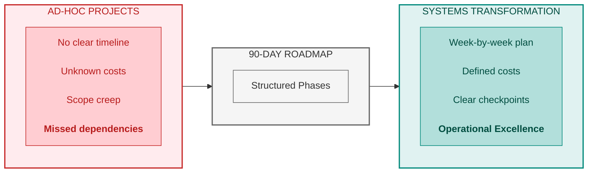
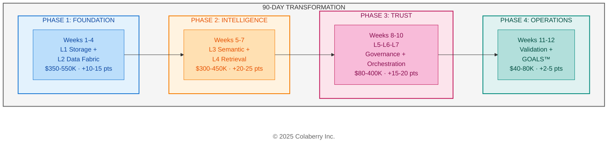
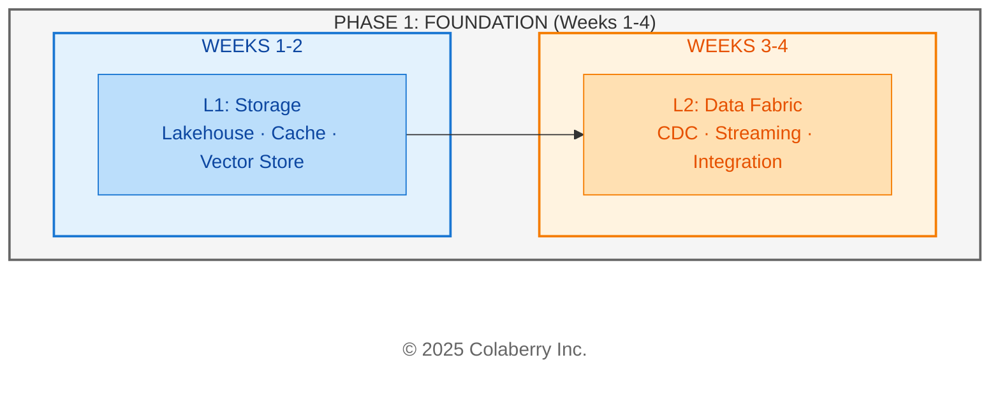
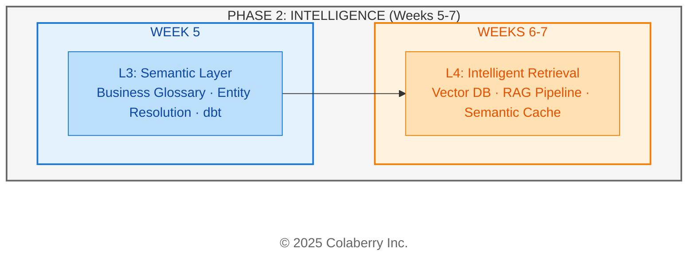
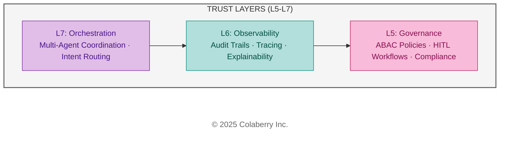
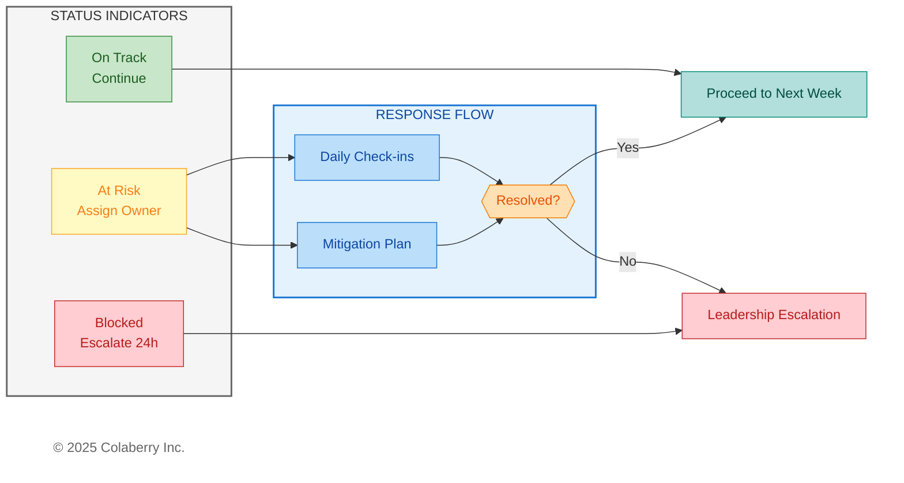
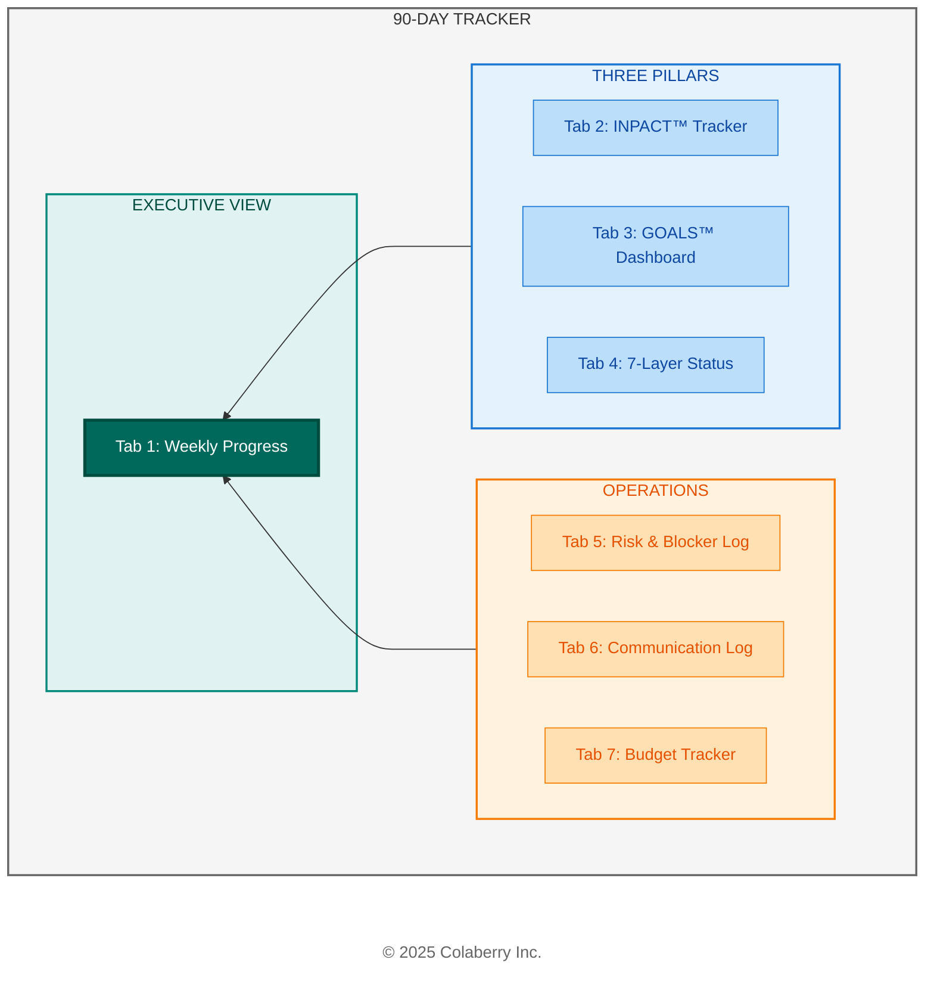

# Chapter 10: The AI Agent Readiness Playbook

## From Assessment to Production in 90 Days

---

## The Clock Starts Now

*Tuesday, 2:15 PM
Enterprise AI Summit, Main Stage
Six Months After Production Launch*

Sarah Cedao stepped to the podium. The room held four hundred IT leaders, all facing the same question her team had faced a year ago: how do you actually get from assessment to production?

"We scored twenty-eight out of a hundred," she began. "Ninety days later, we were at eighty-nine - three agents in production, fifty thousand daily interactions, zero compliance incidents." She clicked to her first slide. "Everyone asks for our secret. There isn't one. Just a playbook we followed week by week."

A hand went up. "You're healthcare. How do we know it works for manufacturing? Or finance?"

"The layers are the same," Sarah replied. "Foundation, intelligence, trust, operations. The sequence doesn't change. Your technologies might. Your timeline might. But the playbook? That's universal."

She clicked to the four-phase roadmap. "Let me show you exactly what we did."

This chapter is that presentation.

---

**Diagram 1: Roadmap Value: From Ad-Hoc to Structured**

```mermaid

graph LR
    subgraph BEFORE["AD-HOC PROJECTS"]
        direction TB
        B1["No clear timeline<br/><br/>Unknown costs<br/><br/>Scope creep<br/><br/><b>Missed dependencies</b>"]
    end
    
    subgraph TRANSFORM["90-DAY ROADMAP"]
        direction TB
        T1["Structured Phases"]
    end

    subgraph AFTER["SYSTEMS TRANSFORMATION"]
        direction TB
        A1["Week-by-week plan<br/><br/>Defined costs<br/><br/>Clear checkpoints<br/><br/><b>Operational Excellence</b>"]
    end
    
    BEFORE --> TRANSFORM --> AFTER
    
    style BEFORE fill:#ffebee,stroke:#c62828,stroke-width:2px,color:#b71c1c
    style TRANSFORM fill:#f5f5f5,stroke:#666666,stroke-width:2px,color:#333333
    style AFTER fill:#e0f2f1,stroke:#00897b,stroke-width:2px,color:#004d40
    style B1 fill:#ffcdd2,stroke:#c62828,color:#b71c1c
    style T1 fill:#f5f5f5,stroke:#666666,color:#333333
    style A1 fill:#b2dfdb,stroke:#00897b,color:#004d40

```

> **Key Takeaway:** Ninety days from assessment to production. Week-by-week structure eliminates guesswork.

---

## Part 1: The Roadmap

### Your 90-Day Journey

Chapter 9 gave you the diagnosis: your INPACT™ score, trust band, and priority layers. This chapter gives you the treatment plan - a week-by-week playbook for transforming your infrastructure from assessment to production-ready. The playbook is universal; where specific numbers help, we reference real implementations as evidence.

**Why 90 Days?**

The 90-day timeline isn't arbitrary. It's the result of balancing three constraints:

1. **Business urgency**: Executives lose patience with multi-year transformation programs. 90 days delivers measurable results before budget reviews and leadership changes.

2. **Technical dependency chains**: The seven layers have dependencies. Layer 4 (Intelligence) requires Layer 1 (Storage) and Layer 3 (Semantic). Rushing creates gaps; extending creates complexity. 90 days provides enough time for sequential layer building with validation.

3. **Team sustainability**: Transformation projects demand intense focus. Beyond 90 days, teams burn out, priorities shift, and momentum dissipates. The four-phase structure creates natural milestones that maintain energy.

The 90-day timeline typically breaks into 10 weeks of building plus 2 weeks of validation. Your timeline may vary based on starting point (Part 4), but the phase sequence remains constant.

**What You'll Get from This Chapter**

By the end of this chapter, you will have:

- **Four phase structures** with clear boundaries, budgets, and go/no-go checkpoints
- **Implementation architecture diagrams** showing technology stack options for each phase
- **Risk management patterns** that keep transformations on track when challenges emerge
- **The 90-Day Tracker system** - seven interconnected tracking sheets to manage your own transformation

**How to Use This Roadmap**

Chapter 9 gave you four things:
1. Your **INPACT™ score** (overall readiness)
2. Your **trust band** (timeline and budget estimate)
3. Your **priority dimensions** (your two lowest-scoring dimensions)
4. Your **priority layers** (from the Gap Prioritization Matrix)

Your trust band (from Chapter 9) tells you *how long* and *how much*. Your priority layers tell you *where to focus* in this playbook:

| If Your Priority Layers Are... | Your Focus in This Playbook |
|-------------------------------|----------------------------|
| L1, L2 (Foundation gaps) | Full attention to Phase 1; continue sequentially |
| L3, L4 (Intelligence gaps) | Validate Phase 1 (1-2 weeks); invest deeply in Phase 2 |
| L5, L6, L7 (Trust gaps) | Validate Phases 1-2 (1-2 weeks each); invest deeply in Phase 3 |
| Multiple layers across phases | Execute all phases fully as documented |

The phase sequence never changes: Foundation → Intelligence → Trust → Operations. What varies is where you compress (validate only) and where you expand (full investment).

**Important Cross-References**

This chapter focuses on *when* to build. Other chapters provide complementary guidance:

- For *how to assess* your current state → Chapter 9 (INPACT™ methodology)
- For *what technologies* to select → Chapter 11 (vendor evaluation)
- For *how to operate* at scale → Chapter 12 (production operations)
- For *week-by-week layer detail* → Chapters 4-6

### Change Management Approach

Technical transformation fails without organizational alignment. Invest deliberately in stakeholder communication and user adoption.

**Communication Rhythm**

| Cadence | Audience | Content |
|---------|----------|---------|
| Daily | Implementation team | Standup, blockers, coordination |
| Weekly | Extended team + sponsors | Progress, risks, decisions needed |
| Bi-weekly | Executive steering | Strategic decisions, budget status |
| Monthly | Board (prepared) | Transformation progress, ROI trajectory |

**Stakeholder Engagement**

Identify four stakeholder groups with different concerns:

- **End users**: Will this make my job easier or harder? (Focus: workflow integration, training)
- **IT/Operations**: Can we support this? (Focus: infrastructure, monitoring, on-call burden)
- **Compliance/Legal**: Is this safe and auditable? (Focus: audit trails, liability, regulatory requirements)
- **Finance**: What's the ROI? (Focus: costs, benefits, payback period)

Schedule dedicated sessions with each group at phase boundaries, not just project kickoff. Early engagement prevents late-stage resistance.

---

### Four Phases Overview

The transformation follows four distinct phases, each building on the previous. The sequence matters - attempting Phase 3 governance work before Phase 1 foundations produces the failures behind AI agents' 95% failure rate.[1]

**Diagram 2: The 90-Day Four-Phase Roadmap**

```mermaid

graph LR
    subgraph JOURNEY["90-DAY TRANSFORMATION"]
        direction LR
        subgraph PHASE1["PHASE 1: FOUNDATION"]
            P1["Weeks 1-4<br/>L1 Storage +<br/> L2 Data Fabric<br/>$350-550K · +10-15 pts"]
        end
        
        subgraph PHASE2["PHASE 2: INTELLIGENCE"]
            P2["Weeks 5-7<br/>L3 Semantic +<br/> L4 Retrieval<br/>$300-450K · +20-25 pts"]
        end
        
        subgraph PHASE3["PHASE 3: TRUST"]
            P3["Weeks 8-10<br/>L5-L6-L7<br/>Governance + Orchestration<br/>$80-400K · +15-20 pts"]
        end
        
        subgraph PHASE4["PHASE 4: OPERATIONS"]
            P4["Weeks 11-12<br/>Validation +<br/> GOALS™<br/>$40-80K · +2-5 pts"]
        end
    end
    
    Copyright["© 2025 Colaberry Inc."]
    
    P1 --> P2 --> P3 --> P4
    
    style JOURNEY fill:#f5f5f5,stroke:#666666,stroke-width:2px,color:#333333
    style PHASE1 fill:#e3f2fd,stroke:#1976d2,stroke-width:2px,color:#0d47a1
    style PHASE2 fill:#fff3e0,stroke:#f57c00,stroke-width:2px,color:#e65100
    style PHASE3 fill:#fce4ec,stroke:#c2185b,stroke-width:2px,color:#880e4f
    style PHASE4 fill:#e0f2f1,stroke:#00897b,stroke-width:2px,color:#004d40
    style P1 fill:#bbdefb,stroke:#1976d2,color:#0d47a1
    style P2 fill:#ffe0b2,stroke:#f57c00,color:#e65100
    style P3 fill:#f8bbd9,stroke:#c2185b,color:#880e4f
    style P4 fill:#b2dfdb,stroke:#00897b,color:#004d40
    style Copyright fill:#ffffff,stroke:none,color:#666666

```

---

## Part 2: The Four Phases

### Phase 1: Foundation (Weeks 1-4)

**Diagram 3: Foundation Layer Stack**

```mermaid

graph LR
    subgraph PHASE1["PHASE 1: FOUNDATION (Weeks 1-4)"]
        direction LR
        subgraph WEEK12["WEEKS 1-2"]
            L1["L1: Storage<br/>Lakehouse · Cache · Vector Store"]
        end
        
        subgraph WEEK34["WEEKS 3-4"]
            L2["L2: Data Fabric<br/>CDC · Streaming · Integration"]
        end
    end
    
    Copyright["© 2025 Colaberry Inc."]
    
    L1 --> L2
    
    style PHASE1 fill:#f5f5f5,stroke:#666666,stroke-width:2px,color:#333333
    style WEEK12 fill:#e3f2fd,stroke:#1976d2,stroke-width:2px,color:#0d47a1
    style WEEK34 fill:#fff3e0,stroke:#f57c00,stroke-width:2px,color:#e65100
    style L1 fill:#bbdefb,stroke:#1976d2,color:#0d47a1
    style L2 fill:#ffe0b2,stroke:#f57c00,color:#e65100
    style Copyright fill:#ffffff,stroke:none,color:#666666

```

| Attribute | Detail |
|-----------|--------|
| **Weeks** | 1-4 |
| **Layers** | L1 (Multi-Modal Storage) → L2 (Real-Time Data Fabric) |
| **INPACT™ Target** | +10-15 points |
| **Budget Range** | $80K-$550K (see Part 3: The Investment Approach) |
| **Team** | 2 senior data engineers, 1 cloud architect, 1 DBA, 2 CDC specialists (consulting) |
| **Primary Focus** | Data freshness (<30 seconds), query performance |

**What Gets Built**

Phase 1 establishes the foundation everything else depends on. Build layer-by-layer to maintain momentum and clear dependencies:

**Weeks 1-2: Layer 1 (Multi-Modal Storage)**
- Unified lakehouse for analytics (Databricks, Snowflake, or equivalent)
- In-memory cache for sub-millisecond access (Redis, Memcached)
- Vector store preparation for Phase 2 semantic search

**Weeks 3-4: Layer 2 (Real-Time Data Fabric)**
- CDC captures changes from source systems (Debezium, Fivetran, or native connectors)
- Event streaming for real-time data flow (Kafka, Pulsar, or cloud-native)
- Target: <30-second data freshness (down from batch cycles)

**Common Risk:** CDC integration delays are typical - legacy system complexity often adds 1-3 days. Have parallel workstreams ready to maintain momentum.

**Technology Options**

For Layer 1 and Layer 2 technology details, see Chapter 4. For vendor selection guidance, see Chapter 11.

**Phase Gate Checkpoint**

- INPACT™ score ≥40 (±5% tolerance)
- CDC operational for critical tables (e.g., customers, transactions, core entities)
- Storage infrastructure provisioned and tested
- If behind: Add 1-2 weeks to Phase 1; never skip ahead to Phase 2

**→ For complete week-by-week detail: Chapter 4 (Foundation Layers)**

---

### Phase 2: Intelligence (Weeks 5-7)

**Diagram 4: Intelligence Layer Stack**

```mermaid

graph LR
    subgraph PHASE2["PHASE 2: INTELLIGENCE (Weeks 5-7)"]
        direction LR
        subgraph WEEK5["WEEK 5"]
            L3["L3: Semantic Layer<br/>Business Glossary · Entity Resolution · dbt"]
        end
        
        subgraph WEEK67["WEEKS 6-7"]
            L4["L4: Intelligent Retrieval<br/>Vector DB · RAG Pipeline · Semantic Cache"]
        end
    end
    
    Copyright["© 2025 Colaberry Inc."]
    
    L3 --> L4
    
    style PHASE2 fill:#f5f5f5,stroke:#666666,stroke-width:2px,color:#333333
    style WEEK5 fill:#e3f2fd,stroke:#1976d2,stroke-width:2px,color:#0d47a1
    style WEEK67 fill:#fff3e0,stroke:#f57c00,stroke-width:2px,color:#e65100
    style L3 fill:#bbdefb,stroke:#1976d2,color:#0d47a1
    style L4 fill:#ffe0b2,stroke:#f57c00,color:#e65100
    style Copyright fill:#ffffff,stroke:none,color:#666666

```

*For RAG pipeline architecture details, see Chapter 5, Diagram 7: Layer 4 - Complete Intelligence Pipeline.*

| Attribute | Detail |
|-----------|--------|
| **Weeks** | 5-7 |
| **Layers** | L3 (Semantic Layer) → L4 (Intelligent Retrieval) |
| **INPACT™ Target** | +20-25 points |
| **Budget Range** | $60K-$450K (see Part 3: The Investment Approach) |
| **Team** | 2 ML engineers, 1 domain SME, semantic layer specialists |
| **Primary Focus** | NLU accuracy (target: 85%), semantic layer coverage, RAG pipeline |

**What Gets Built**

Phase 2 gives agents the ability to understand and reason. Build layer-by-layer:

**Week 5: Layer 3 (Semantic Layer)**
- Business glossary mapping domain terms to data structures (target: 1,000+ terms)
- Entity resolution achieving 95%+ accuracy across source systems
- Semantic models translating business concepts to technical queries (dbt, Cube, or equivalent)

**Weeks 6-7: Layer 4 (Intelligent Retrieval)**
- Vector database for semantic search (Pinecone, Weaviate, Chroma, or equivalent)
- Seven-stage intelligence pipeline (see Chapter 5, Diagram 7): Query → Embed → Retrieve → Rerank → Context → LLM → Cache
- Semantic caching to reduce LLM costs (target: 70%+ hit rate)

**Common Risk:** Accuracy often plateaus at 80-82% before hitting the 85% target. Solutions include adding reranking, hybrid search (combining vector and keyword retrieval), or expanding the semantic layer. Don't proceed with gaps - they compound in Phase 3.

**Technology Options**

For Layer 3 and Layer 4 technology details, see Chapter 5. For vendor selection guidance, see Chapter 11.

**Phase Gate Checkpoint**

- INPACT™ score ≥65 (±5% tolerance)
- Query accuracy ≥85% on test set (500 queries across all domains)
- Semantic layer operational with entity resolution
- If behind: Tune RAG pipeline; add reranking; extend Phase 2 by 1 week

**→ For complete week-by-week detail: Chapter 5 (Intelligence Layers)**

---

### Phase 3: Trust & Orchestration (Weeks 8-10)

**Diagram 5: Trust Layer Stack**

```mermaid

graph LR
    subgraph TRUST["TRUST LAYERS (L5-L7)"]
        direction LR
        L7["L7: Orchestration<br/>Multi-Agent Coordination · Intent Routing"]
        L6["L6: Observability<br/>Audit Trails · Tracing · Explainability"]
        L5["L5: Governance<br/>ABAC Policies · HITL Workflows · Compliance"]
    end
    
    Copyright["© 2025 Colaberry Inc."]
    
    L7 --> L6 --> L5
    
    style TRUST fill:#f5f5f5,stroke:#666666,stroke-width:2px,color:#333333
    style L7 fill:#e1bee7,stroke:#7b1fa2,color:#4a148c
    style L6 fill:#b2dfdb,stroke:#00897b,color:#004d40
    style L5 fill:#f8bbd9,stroke:#c2185b,color:#880e4f
    style Copyright fill:#ffffff,stroke:none,color:#666666

```

| Attribute | Detail |
|-----------|--------|
| **Weeks** | 8-10 |
| **Layers** | L5 (Agent-Aware Governance) + L6 (Observability complete) + L7 (Orchestration) |
| **INPACT™ Target** | +15-20 points |
| **Budget Range** | $30K-$400K (see Part 3: The Investment Approach) |
| **Team** | 2 security engineers, 2 DevOps engineers, 1 compliance officer, 1 ML engineer |
| **Primary Focus** | ABAC policies, HITL workflows, audit trails, multi-agent coordination |

**What Gets Built**

Phase 3 makes agents trustworthy:

- **ABAC governance**: Policy engine (OPA, Styra, or equivalent) evaluates access policies in <10ms - who is asking, what they're accessing, when, and from where
- **HITL workflows**: Confidence-based escalation routes high-risk decisions to human reviewers; target escalation rate <15%
- **Observability complete**: Distributed tracing (OpenTelemetry), APM (Datadog, New Relic, or equivalent), complete audit trails for compliance requirements
- **Multi-agent orchestration**: Coordination framework (LangGraph, AutoGen, or custom) manages specialized agents with shared state

**Common Risk:** Policy complexity often exceeds initial estimates - enterprises typically have 3-5× more access control edge cases than documented. Start with high-impact policies (PHI access, financial transactions) and expand iteratively.

**Cost Optimization Opportunity**

Phase 3 offers the largest budget variance potential. Open-source choices (OPA vs. commercial Styra, leveraging existing monitoring licenses, retrofitting pilot agents vs. rebuilding) can reduce costs by 50-80%. Evaluate build-vs-buy carefully - see Chapter 11.

**Technology Options**

For Layer 5, 6, and 7 technology details, see Chapter 6. For vendor selection guidance, see Chapter 11, Section 3.

**Phase Gate Checkpoint**

- INPACT™ score ≥80 (±5% tolerance)
- All 7 layers operational
- HITL escalation rate <15%
- Audit trail 100% complete
- If behind: Focus on governance policies; extend Phase 3 by 1 week

**→ For complete week-by-week detail: Chapter 6 (Transparency + Orchestration Layers)**

---

### Phase 4: Operations (Weeks 11-12)

| Attribute | Detail |
|-----------|--------|
| **Weeks** | 11-12 |
| **Focus** | Validation, UAT, Production Readiness |
| **INPACT™ Target** | +2-5 points (refinement) |
| **Budget Range** | $20K-$80K (see Part 3: The Investment Approach) |
| **Team** | UAT facilitators, compliance sign-off, training staff |
| **Primary Focus** | User Acceptance Testing, production cutover |

**What Gets Validated**

Phase 4 validates everything works together:

- **UAT with real users**: Representative user group tests real scenarios over 2 weeks
- **Edge case resolution**: Identify and resolve edge cases before production (expect 30-60)
- **Production readiness**: 15-criteria checklist verified (see Chapter 12)
- **GOALS™ operational targets**: All five metrics at target levels

**Success Criteria**

| Metric | Target |
|--------|--------|
| UAT success rate | ≥90% |
| Task completion | ≥90% of workflows completed successfully |
| User satisfaction | ≥4.0/5.0 |
| NLU accuracy (production) | ≥85% |
| HITL override rate | <15% |

**Common Risk:** UAT reveals unexpected workflow gaps - expect 30-60 edge cases requiring resolution. Build buffer time for iteration; rushing to production with unresolved issues creates post-launch incidents.

**Phase Gate Checkpoint**

- UAT success rate ≥90%
- All 15 production readiness criteria met
- Stakeholder sign-off obtained
- Go-live decision made

**→ For complete operations guide: Chapter 12 (Production Operations)**

---

## Part 3: The Investment Approach

### Budget Framework

Your investment depends on your technology strategy. Three tracks reflect different build-vs-buy decisions:

**Commercial Track** (Speed priority, smaller technical teams)

| Phase | Weeks | Budget Range | INPACT™ Gain |
|-------|-------|--------------|--------------|
| Foundation | 1-4 | $350K-$550K | +10-15 points |
| Intelligence | 5-7 | $300K-$450K | +20-25 points |
| Trust | 8-10 | $200K-$400K | +15-20 points |
| Operations | 11-12 | $40K-$80K | +2-5 points |
| **Total** | **12 weeks** | **$890K-$1.5M** | **+50-65 points** |

**Hybrid Track** (Balanced approach, selective open-source)

| Phase | Weeks | Budget Range | INPACT™ Gain |
|-------|-------|--------------|--------------|
| Foundation | 1-4 | $200K-$350K | +10-15 points |
| Intelligence | 5-8 | $150K-$300K | +20-25 points |
| Trust | 9-11 | $80K-$200K | +15-20 points |
| Operations | 12-14 | $30K-$60K | +2-5 points |
| **Total** | **14 weeks** | **$460K-$910K** | **+50-65 points** |

**Pure Open-Source Track** (Budget priority, strong engineering team)

| Phase | Weeks | Budget Range | INPACT™ Gain |
|-------|-------|--------------|--------------|
| Foundation | 1-5 | $80K-$150K | +10-15 points |
| Intelligence | 6-10 | $60K-$120K | +20-25 points |
| Trust | 11-14 | $30K-$80K | +15-20 points |
| Operations | 15-16 | $20K-$50K | +2-5 points |
| **Total** | **16 weeks** | **$190K-$400K** | **+50-65 points** |

**Choosing Your Track**

| Factor | Commercial | Hybrid | Pure Open-Source |
|--------|------------|--------|------------------|
| Timeline | 12 weeks | 14 weeks | 16 weeks |
| Internal engineering strength | Low-Medium | Medium | High |
| Ongoing operational burden | Low | Medium | High |
| Vendor support/SLAs | Yes | Partial | No |
| Best for | Speed to production | Balanced cost/speed | Maximum savings |

Your Chapter 9 trust band provides timeline and total budget guidance. Use this framework to select the track that fits your organization's capabilities and constraints.

### Cost Categories

Investment typically breaks down across three categories:

| Category | Commercial | Hybrid | Open-Source |
|----------|------------|--------|-------------|
| **Technology** (platforms, licenses) | 45-55% | 25-35% | 10-20% |
| **Cloud Infrastructure** | 10-15% | 20-30% | 25-35% |
| **Services** (consulting, training) | 20-30% | 20-25% | 15-20% |
| **Staff** (internal team time) | 15-20% | 25-30% | 35-45% |

Open-source shifts cost from software licenses to staff time and cloud infrastructure.

### Key Investment Insights

**Track Selection Drives Total Cost**

The same transformation can cost $190K or $1.5M depending on your technology choices. The INPACT™ outcome is the same - what differs is timeline, operational burden, and where the money goes.

**Phase 3 Has Highest Variance Within Each Track**

Trust & Orchestration costs vary most based on:
- Policy engine: OPA (free) vs. Styra ($100K+)
- Monitoring: Grafana/Prometheus (free) vs. Datadog ($50K+)
- Orchestration: LangChain (free) vs. commercial platforms ($50K+)

Evaluate build-vs-buy carefully - see Chapter 11, Section 3.

**Ongoing Operations**

Monthly recurring costs after go-live vary by track:

| Cost Component | Commercial | Hybrid | Open-Source |
|----------------|------------|--------|-------------|
| Cloud infrastructure | $20K-$35K | $18K-$30K | $25K-$45K |
| LLM API/inference | $10K-$20K | $5K-$12K | $2K-$8K |
| Platform licenses | $8K-$15K | $3K-$8K | $0-$2K |
| Support/maintenance | $5K-$10K | $5K-$10K | $8K-$15K |
| **Total monthly** | **$43K-$80K** | **$31K-$60K** | **$35K-$70K** |

Open-source reduces platform license costs but increases cloud infrastructure (self-managed systems require more compute) and support/maintenance (internal staff time). The total cost of ownership converges across tracks - the difference is where the money goes, not how much.

### ROI Expectations

| Metric | Typical Range |
|--------|---------------|
| Year 1 ROI | 150-250% |
| 3-Year ROI | 400-600% |
| Payback Period | 8-14 weeks from production |

ROI sources vary by industry but typically include: operational efficiency gains, reduced manual workload, improved accuracy, faster response times, and avoided compliance incidents.

> **Note:** Budget and timeline figures in this chapter reflect typical ranges for mid-size enterprise implementations based on the 7-Layer Architecture methodology.

---

## Part 4: Your Path

### Receiving Your Chapter 9 Results

You arrived with:
- **Trust band** → Your timeline and budget envelope (from Chapter 9)
- **Priority layers** → Where to focus (from Chapter 9's Gap Prioritization Matrix)

This section shows how to adapt each phase based on your priority layers.

### Phase Compression vs. Full Investment

| Your Priority Layers | Phase 1 | Phase 2 | Phase 3 | Phase 4 |
|---------------------|---------|---------|---------|---------|
| L1, L2 | **FULL** (4 weeks) | Standard (3 weeks) | Standard (3 weeks) | Standard (2 weeks) |
| L3, L4 | Validate (1-2 weeks) | **FULL** (3 weeks) | Standard (3 weeks) | Standard (2 weeks) |
| L5, L6, L7 | Validate (1-2 weeks) | Validate (1-2 weeks) | **FULL** (3 weeks) | Standard (2 weeks) |
| All layers need work | **FULL** (4 weeks) | **FULL** (3 weeks) | **FULL** (3 weeks) | **FULL** (2 weeks) |

**FULL** = Maximum investment - this is where your gaps live
**Standard** = Execute as documented in Part 2  
**Validate** = Audit existing infrastructure, confirm phase gate criteria, fill gaps only (1-2 weeks)  

### Handling Multiple Priority Layers

If Chapter 9 identified priority layers spanning multiple phases (e.g., C dimension maps to L1, L2, L3):

1. **Start with foundational layers first** - L1/L2 before L3/L4 before L5/L6/L7
2. **Don't skip phases** - even if L3 is your priority, validate L1/L2 first
3. **Budget accordingly** - your Chapter 9 trust band accounts for this complexity

### Common Adaptation Patterns

| Starting Condition | Adaptation | Rationale |
|--------------------|------------|-----------|
| Strong data warehouse, weak real-time | Compress L1, expand L2 | Your storage works; CDC is the gap |
| Good CDC infrastructure, no vector storage | Skip L2, expand L1 | Real-time exists; semantic search is missing |
| Semantic layer exists (dbt, Cube) | Validate L3, focus on L4 | Business terms defined; RAG pipeline needed |
| RBAC only, no attribute-based access | Expand Phase 3 by 1-2 weeks | Governance requires more policy work |
| Single agent working in pilot | Focus L7 orchestration | Agent logic proven; coordination missing |
| Regulated industry (healthcare, finance, government) | Add 1 week to Phase 3 | Additional compliance validation needed |
| Multi-cloud environment | Add 1 week to Phase 1 | Cross-cloud data fabric complexity |

### Scaling Considerations

The baseline roadmap scales for a mid-size organization (1,000-15,000 employees). Adjust timelines for your scale:

| Organization Size | Timeline Adjustment | Budget Adjustment |
|-------------------|---------------------|-------------------|
| Small (<1,000 employees) | -2 weeks | 0.6× |
| Mid-size (1,000-15,000 employees) | Baseline | 1.0× |
| Large (15,000-50,000 employees) | +2 weeks | 1.5× |
| Enterprise (50,000+ employees) | +4 weeks | 2.0-3.0× |

Larger organizations require more stakeholder alignment, broader testing, and phased rollout across business units.

---

## Part 5: Managing Risk

### Risk Escalation Framework

**Diagram 6: Risk Escalation Framework**

```mermaid

graph LR
    subgraph STATUS["STATUS INDICATORS"]
        direction TB
        GREEN["On Track<br/>Continue"]
        YELLOW["At Risk<br/>Assign Owner"]
        RED["Blocked<br/>Escalate 24h"]
    end
    
    subgraph ACTIONS["RESPONSE FLOW"]
        direction TB
        R1["Daily Check-ins"]
        R2["Mitigation Plan"]
        RESOLVED{{"Resolved?"}}
        R1 --> RESOLVED
        R2 --> RESOLVED
    end
    
    subgraph OUTCOMES[" "]
        direction TB
        CONTINUE["Proceed to Next Week"]
        ESCALATE["Leadership Escalation"]
    end
    
    Copyright["© 2025 Colaberry Inc."]
    
    GREEN --> CONTINUE
    YELLOW --> R1
    YELLOW --> R2
    RED --> ESCALATE
    RESOLVED -->|"Yes"| CONTINUE
    RESOLVED -->|"No"| ESCALATE
    
    style STATUS fill:#f5f5f5,stroke:#666666,stroke-width:2px,color:#333333
    style ACTIONS fill:#e3f2fd,stroke:#1976d2,stroke-width:2px,color:#0d47a1
    style OUTCOMES fill:none,stroke:none
    style GREEN fill:#c8e6c9,stroke:#388e3c,color:#1b5e20
    style YELLOW fill:#fff9c4,stroke:#f9a825,color:#f57f17
    style RED fill:#ffcdd2,stroke:#c62828,color:#b71c1c
    style R1 fill:#bbdefb,stroke:#1976d2,color:#0d47a1
    style R2 fill:#bbdefb,stroke:#1976d2,color:#0d47a1
    style RESOLVED fill:#ffe0b2,stroke:#f57c00,color:#e65100
    style CONTINUE fill:#b2dfdb,stroke:#00897b,color:#004d40
    style ESCALATE fill:#ffcdd2,stroke:#c62828,color:#b71c1c
    style Copyright fill:#ffffff,stroke:none,color:#666666

```

### Phase Gate Checkpoints

Every phase ends with a formal go/no-go decision. These gates prevent the most common failure mode: proceeding with gaps that compound into production failures. Phase gate criteria are documented in each phase section (Part 2). The critical discipline: never skip a gate, never proceed with gaps.

**Gate Decision Authority**

CTO/CDO makes the final call with steering committee input. Never delegate gate decisions to the implementation team - they have incentive to proceed even with gaps.

### Weekly Health Checks

Within each phase, Friday health checks catch issues early:

- **🟢 On Track**: Continue as planned. No action required.
- **🟡 At Risk**: Assign owner, define mitigation plan, begin daily check-ins. Target resolution within 5 business days.
- **🔴 Blocked**: Escalate to leadership within 24 hours. Block cannot be resolved at team level.

**Never let blockers persist across weekends without escalation.**

### Common Risk Patterns

Most transformations encounter 1-3 yellow weeks. Common patterns and mitigations:

**Phase 1 Risk: CDC Complexity**
- Issue: Legacy system CDC integration takes longer than planned
- Mitigation: Parallelize other workstreams while resolving; have batch fallback ready
- Prevention: Budget 1-2 extra days for CDC; engage source system experts early

**Phase 2 Risk: Accuracy Plateau**
- Issue: RAG accuracy stalls at 80-82%, below 85% gate requirement
- Mitigation: Add reranking layer; implement hybrid search; expand semantic layer
- Prevention: Build accuracy testing into daily workflow; don't wait for phase gate

**Phase 3 Risk: Policy Complexity**
- Issue: ABAC policy definition takes longer as edge cases emerge
- Mitigation: Start with core policies; add edge cases iteratively post-launch
- Prevention: Involve compliance early; document policy requirements in Phase 1

The weekly health check discipline catches issues before they become blockers.

---

## Part 6: The AI Agent Readiness Tracker

### Seven-Tab Overview

**Diagram 7: Seven-Tab Tracker System**

```mermaid

graph RL
    subgraph TRACKER["90-DAY TRACKER"]
        direction RL
        subgraph EXECUTIVE["EXECUTIVE VIEW"]
            T1["Tab 1: Weekly Progress"]
        end
        
        subgraph FEEDS[" "]
            direction TB
            subgraph PILLARS["THREE PILLARS"]
                direction RL
                T2["Tab 2: INPACT™ Tracker"]
                T3["Tab 3: GOALS™ Dashboard"]
                T4["Tab 4: 7-Layer Status"]
            end
            
            subgraph OPS["OPERATIONS"]
                direction RL
                T5["Tab 5: Risk & Blocker Log"]
                T6["Tab 6: Communication Log"]
                T7["Tab 7: Budget Tracker"]
            end
        end
    end
    
    Copyright["© 2025 Colaberry Inc."]
    
    PILLARS --> T1
    OPS --> T1

    style TRACKER fill:#f5f5f5,stroke:#666666,stroke-width:2px,color:#333333
    style EXECUTIVE fill:#e0f2f1,stroke:#00897b,stroke-width:2px,color:#004d40
    style FEEDS fill:none,stroke:none
    style PILLARS fill:#e3f2fd,stroke:#1976d2,stroke-width:2px,color:#0d47a1
    style OPS fill:#fff3e0,stroke:#f57c00,stroke-width:2px,color:#e65100
    style T1 fill:#00695c,color:#ffffff,stroke:#004d40,stroke-width:3px
    style T2 fill:#bbdefb,stroke:#1976d2,color:#0d47a1
    style T3 fill:#bbdefb,stroke:#1976d2,color:#0d47a1
    style T4 fill:#bbdefb,stroke:#1976d2,color:#0d47a1
    style T5 fill:#ffe0b2,stroke:#f57c00,color:#e65100
    style T6 fill:#ffe0b2,stroke:#f57c00,color:#e65100
    style T7 fill:#ffe0b2,stroke:#f57c00,color:#e65100
    style Copyright fill:#ffffff,stroke:none,color:#666666

```

### How the Tabs Work Together

| Tab | Purpose | Primary User | Update Frequency |
|-----|---------|--------------|------------------|
| **Tab 1: Weekly Progress** | Executive dashboard - overall status | Project Manager | Weekly (Friday) |
| **Tab 2: INPACT™ Tracker** | Six dimensions, week-by-week scores | Data Architect | Weekly |
| **Tab 3: GOALS™ Dashboard** | Five operational metrics | Operations Lead | Weekly (Phase 3+) |
| **Tab 4: 7-Layer Status** | Layer-by-layer build progress | Technical Lead | Weekly |
| **Tab 5: Risk & Blocker Log** | Issue tracking and mitigation | Project Manager | As needed |
| **Tab 6: Communication Log** | Meetings, decisions, action items | Project Manager | Per meeting |
| **Tab 7: Budget Tracker** | Spend vs. plan by category | Finance | Weekly |

### Inside the Seven Tabs

**Tab 1: Weekly Progress Dashboard**

The executive view showing overall status at a glance. Columns include Week, Phase, Primary Layer Focus, INPACT™ Status, GOALS™ Progress (Phase 3+), Top Risk, Status (🟢/🟡/🔴), Key Deliverable, and Notes. Update every Friday; review in Monday leadership standup.

**Tab 2: INPACT™ Progress Tracker**

Tracks the six INPACT™ dimensions (I, N, P, A, C, T) week by week on a 1-6 scale. Your two lowest dimensions from Chapter 9 identify your priority layers. Use this tab to track whether those dimensions are improving as you execute the corresponding phases.

**Tab 3: GOALS™ Health Dashboard**

Monitors the five GOALS™ operational metrics: Governance, Observability, Availability, Lexicon, and Soundness. Activates in Phase 3 when operational concerns become primary. Target: all five metrics at ≥80% by Week 12.

**Tab 4: 7-Layer Build Status**

Technical tracking of layer-by-layer progress. Each layer shows weekly status (🔴 Not Started / 🟡 In Progress / 🟢 Operational / ✅ Production). Includes Key Components and Evidence columns to document what's deployed and how it's validated.

**Tab 5: Risk & Blocker Log**

Issue tracking with probability, impact, severity, owner, mitigation plan, and resolution status. Expect 10-15 risks over 12 weeks; most resolve within the week, 1-2 may require phase adjustments.

**Tab 6: Stakeholder Communication Log**

Documents every meeting, decision, and action item. Critical for maintaining alignment and providing audit trail. Expect 40-50 logged communications across 12 weeks including daily standups, weekly reviews, and bi-weekly executive steering.

**Tab 7: Budget Tracker**

Monitors spend by category (Technology, Services, Staff) against plan. Weekly actuals with variance tracking and percentage spent. Threshold alerts: Green (within ±5%), Yellow (±5-10%), Red (>±10%).

### Getting Started with the Tracker

**Before Week 1:**
1. Download the template at trustbeforeintelligence.ai/tools
2. Complete your INPACT™ assessment (Chapter 9) to establish baseline scores
3. Customize phase focus based on your priority layers (Part 4)
4. Assign tab owners and establish update cadence

**Week 1 Onward:**
- Friday: Update all tabs with current week's progress
- Monday: Review Tab 1 in leadership standup, address any 🟡/🔴 status
- Ongoing: Log risks immediately in Tab 5; don't wait for Friday
- Per meeting: Update Tab 6 with decisions and action items

**Integration with Other Chapters**

- Chapter 11 provides technology selection guidance for each layer tracked in Tab 4
- Chapter 12 provides operations detail for GOALS™ metrics in Tab 3
- The tracker connects planning (Chapter 10) to execution (Chapters 11-12)

---

## Part 7: Bridge to Chapters 11-12

You now have the complete implementation roadmap:

- **Part 1**: Four phases with the rationale behind the 90-day timeline
- **Part 2**: Phase-by-phase detail with technology stacks and phase gates
- **Parts 3-4**: Investment summary and adaptation guidance for your context
- **Part 5**: Risk management framework and phase gate checkpoints
- **Part 6**: The 90-Day Tracker system with seven interconnected tabs

**What's Next**

Two questions remain: *What technologies should you select?* and *How do you operate at scale?*

**Chapter 11: Technology Selection Guide**

How do you choose between Databricks and Snowflake? Pinecone and Weaviate? Build or buy? Chapter 11 provides:
- Vendor evaluation methodology for each of the seven layers
- Technology stack options with selection rationale
- Build vs. buy analysis framework
- Alternative options for different contexts and budgets

**Chapter 12: Production Operations**

Deployment is not the finish line. Chapter 12 covers everything after go-live:
- 15-criteria production readiness checklist
- MLOps practices for agent systems (model monitoring, drift detection, retraining)
- Incident response and escalation procedures
- Continuous improvement from feedback loops
- Ongoing operations cost management

**Your Monday Morning**

Week 1 starts with Layer 1 storage provisioning. By Friday, you should have:

- Current-state documentation complete (all seven layers assessed)
- Stakeholder alignment confirmed (steering committee formed)
- Storage infrastructure provisioning underway
- Budget approved and resources allocated
- Week 2 plan finalized with assigned owners

The frameworks are proven. The tracker is ready.

**The 90-day clock starts now.**

---

## Chapter Summary

| Part | Content | Key Takeaway |
|------|---------|--------------|
| **Part 1** | Roadmap overview | Four phases with clear boundaries and checkpoints |
| **Part 2** | Phase summaries | Foundation → Intelligence → Trust → Operations |
| **Part 3** | Investment summary | $770K-$1.5M range, 400-600% 3-year ROI potential |
| **Part 4** | Adaptation guidance | Customize based on your priority layers from Chapter 9 |
| **Part 5** | Risk management | Phase gates, escalation framework |
| **Part 6** | 90-Day Tracker | Seven tabs for implementation tracking |

> **Note:** Budget and timeline figures in this chapter reflect typical ranges for mid-size enterprise implementations based on the 7-Layer Architecture methodology.

---

## References

[1] Challapally, A., et al. (2025). "The GenAI Divide: Why 95% of Enterprise GenAI Projects Fail and How to Be in the 5%." MIT Sloan School of Management, New Architectures for Next-Generation Data Analytics (NANDA) Lab. Analysis of 300+ enterprise GenAI initiatives. https://mitsloan.mit.edu/ideas-made-to-matter/why-95-enterprise-genai-projects-fail

*For technology selection references and vendor documentation, see Chapter 11.*

---

## Acronym Reference

| Acronym | Definition |
|---------|------------|
| ABAC | Attribute-Based Access Control |
| CDC | Change Data Capture |
| HITL | Human-in-the-Loop |
| LLM | Large Language Model |
| NLU | Natural Language Understanding |
| OPA | Open Policy Agent |
| RAG | Retrieval-Augmented Generation |
| UAT | User Acceptance Testing |

---

**© 2025 Colaberry Inc. All Rights Reserved.**  
INPACT™ and GOALS™ are trademarks of Colaberry Inc.
