# Chapter 10: Your 90-Day Implementation Roadmap

**The Complete Implementation Guide**

---

**Diagram 1: Roadmap Value — From Ad-Hoc to Structured**

> **Key Takeaway:** Ninety days from assessment to production. Week-by-week structure eliminates guesswork.

---

*Ninety days. That's all it took Echo Health Systems to transform from 28/100 to 89/100—from agents that couldn't answer basic questions to three specialized AI assistants handling 50,000 daily interactions. This chapter gives you their roadmap: four phases, specific costs, and the checkpoints that kept them on track. Your INPACT™ score (Chapter 9) revealed where you stand. Now build your plan to fix it.*

---

## Part 1: Roadmap Overview

### 1.1 Welcome to Your 90-Day Journey

You've completed the assessment. You have your INPACT™ score. You know which dimensions need work and which layers require investment. Chapter 9 gave you the diagnosis. Chapter 10 gives you the treatment plan.

This chapter documents Echo Health Systems' complete implementation journey—not as abstract guidance, but as a roadmap you can adapt to your own transformation. Every cost, every checkpoint comes from their actual experience.

**Why 90 Days?**

The 90-day timeline isn't arbitrary. It's the result of balancing three constraints:

1. **Business urgency**: Executives lose patience with multi-year transformation programs. 90 days delivers measurable results before budget reviews and leadership changes.

2. **Technical dependency chains**: The seven layers have dependencies. Layer 4 (Intelligence) requires Layer 1 (Storage) and Layer 3 (Semantic). Rushing creates gaps; extending creates complexity. 90 days provides enough time for sequential layer building with validation.

3. **Team sustainability**: Transformation projects demand intense focus. Beyond 90 days, teams burn out, priorities shift, and momentum dissipates. The four-phase structure creates natural milestones that maintain energy.

Echo's board gave Sarah 90 days. She delivered in 10 weeks of building plus 2 weeks of validation. Your timeline may vary based on starting point (Part 4), but the phase sequence remains constant.

**What You'll Get from This Chapter**

By the end of this chapter, you will have:

- **Four phase structures** with clear boundaries, budgets, and go/no-go checkpoints
- **Implementation architecture diagrams** showing Echo's technology stack for each phase
- **Risk management patterns** that kept Echo on track when challenges emerged
- **The 90-Day Tracker system**—seven interconnected tracking sheets to manage your own transformation

**How to Use This Roadmap**

Your approach depends on your INPACT™ score from Chapter 9:

| Score Range | Trust Level | Your Focus | Start Here |
|-------------|-------------|------------|------------|
| 25-40 | Very Low to Low | Full transformation | Part 2 (all phases) |
| 40-65 | Low to Moderate | Intelligence + Trust | Parts 2.2-2.3 |
| 65-80 | Moderate to Good | Trust + Operations | Parts 2.3-2.4 |
| 80+ | High | Operations only | Part 2.4 → Chapter 12 |

**Important Cross-References**

This chapter focuses on *when* to build. Other chapters provide complementary guidance:

- For *how to assess* your current state → Chapter 9 (INPACT™ methodology)
- For *what technologies* to select → Chapter 11 (vendor evaluation)
- For *how to operate* at scale → Chapter 12 (production operations)
- For *week-by-week layer detail* → Chapters 4-6

### 1.2 Change Management Approach

Technical transformation fails without organizational alignment. Echo invested deliberately in stakeholder communication and user adoption.

**Communication Rhythm**

| Cadence | Audience | Content |
|---------|----------|---------|
| Daily | Implementation team | Standup, blockers, coordination |
| Weekly | Extended team + sponsors | Progress, risks, decisions needed |
| Bi-weekly | Executive steering | Strategic decisions, budget status |
| Monthly | Board (prepared) | Transformation progress, ROI trajectory |

**Stakeholder Engagement**

Echo identified four stakeholder groups with different concerns:

- **Clinical staff**: Will this make my job easier or harder? (Focus: workflow integration, training)
- **IT/Operations**: Can we support this? (Focus: infrastructure, monitoring, on-call burden)
- **Compliance/Legal**: Is this safe and auditable? (Focus: HIPAA, audit trails, liability)
- **Finance**: What's the ROI? (Focus: costs, benefits, payback period)

Sarah scheduled dedicated sessions with each group at phase boundaries, not just project kickoff. Early engagement prevented late-stage resistance.

---

### 1.3 Four Phases Overview

Echo's transformation followed four distinct phases, each building on the previous. The sequence matters—attempting Phase 3 governance work before Phase 1 foundations produces the failures that give AI agents their 95% failure reputation.

**Diagram 2: The 90-Day Four-Phase Roadmap**

```mermaid

graph LR
    subgraph JOURNEY["90-DAY TRANSFORMATION"]
        direction LR
        subgraph PHASE1["PHASE 1: FOUNDATION"]
            P1["Weeks 1-4<br/>L1 Storage +<br/> L2 Data Fabric<br/>$468K · 28→42 pts"]
        end
        
        subgraph PHASE2["PHASE 2: INTELLIGENCE"]
            P2["Weeks 5-7<br/>L3 Semantic +<br/> L4 Retrieval<br/>$392K · 42→67 pts"]
        end
        
        subgraph PHASE3["PHASE 3: TRUST"]
            P3["Weeks 8-10<br/>L5-L6-L7<br/>Governance + Orchestration<br/>$82K · 67→86 pts"]
        end
        
        subgraph PHASE4["PHASE 4: OPERATIONS"]
            P4["Weeks 11-12<br/>Validation +<br/> GOALS™<br/>$50K · 86→89 pts"]
        end
    end
    
    Copyright["© 2025 Colaberry Inc."]
    
    P1 --> P2 --> P3 --> P4
    
    style JOURNEY fill:#f5f5f5,stroke:#666666,stroke-width:2px,color:#333333
    style PHASE1 fill:#e3f2fd,stroke:#1976d2,stroke-width:2px,color:#0d47a1
    style PHASE2 fill:#fff3e0,stroke:#f57c00,stroke-width:2px,color:#e65100
    style PHASE3 fill:#fce4ec,stroke:#c2185b,stroke-width:2px,color:#880e4f
    style PHASE4 fill:#e0f2f1,stroke:#00897b,stroke-width:2px,color:#004d40
    style P1 fill:#bbdefb,stroke:#1976d2,color:#0d47a1
    style P2 fill:#ffe0b2,stroke:#f57c00,color:#e65100
    style P3 fill:#f8bbd9,stroke:#c2185b,color:#880e4f
    style P4 fill:#b2dfdb,stroke:#00897b,color:#004d40
    style Copyright fill:#ffffff,stroke:none,color:#666666

```

---

## Part 2: Phase Summaries

### 2.1 Phase 1: Foundation (Weeks 1-4)

**Diagram 4: Foundation Layer Stack**

```mermaid

graph TB
    subgraph FOUNDATION["FOUNDATION LAYERS"]
        direction LR
        subgraph OBS["L6: OBSERVABILITY"]
            O1["Baseline Metrics<br/>Before Building"]
        end
        
        subgraph FABRIC["L2: DATA FABRIC"]
            direction LR
            F1["Debezium<br/>CDC"]
            F2["Kafka<br/>Streaming"]
            F3["Event<br/>Hub"]
        end
    end
    
    subgraph STORAGE["L1: MULTI-MODAL STORAGE"]
        direction LR
        S1["Databricks<br/>Lakehouse"]
        S2["Redis<br/>Cache"]
        S3["Vector<br/>Store"]
    end
    
    Copyright["© 2025 Colaberry Inc."]
    
    OBS --> FABRIC
    FOUNDATION --> STORAGE
    
    style FOUNDATION fill:#f5f5f5,stroke:#666666,stroke-width:2px,color:#333333
    style OBS fill:#e0f2f1,stroke:#00897b,stroke-width:2px,color:#004d40
    style FABRIC fill:#fff3e0,stroke:#f57c00,stroke-width:2px,color:#e65100
    style STORAGE fill:#e3f2fd,stroke:#1976d2,stroke-width:2px,color:#0d47a1
    style O1 fill:#b2dfdb,stroke:#00897b,color:#004d40
    style F1 fill:#ffe0b2,stroke:#f57c00,color:#e65100
    style F2 fill:#ffe0b2,stroke:#f57c00,color:#e65100
    style F3 fill:#ffe0b2,stroke:#f57c00,color:#e65100
    style S1 fill:#bbdefb,stroke:#1976d2,color:#0d47a1
    style S2 fill:#bbdefb,stroke:#1976d2,color:#0d47a1
    style S3 fill:#bbdefb,stroke:#1976d2,color:#0d47a1
    style Copyright fill:#ffffff,stroke:none,color:#666666

```

| Attribute | Detail |
|-----------|--------|
| **Weeks** | 1-4 |
| **Layers** | L1 (Multi-Modal Storage) + L2 (Real-Time Data Fabric) + L6 (Observability baseline) |
| **INPACT™ Target** | 28 → 42 (+14 points) |
| **Budget** | $470K budgeted / $468K actual |
| **Team** | 2 senior data engineers, 1 cloud architect, 1 DBA, 2 CDC specialists (consulting) |
| **Primary Focus** | Data freshness (<30 seconds), query performance, observability baseline |

**What Gets Built**

Phase 1 establishes the foundation everything else depends on:

- **Multi-modal storage**: Databricks lakehouse for unified analytics, Redis cache for sub-millisecond access, vector store preparation for Phase 2
- **Real-time CDC pipelines**: Debezium captures changes from Epic EHR, Kafka streams events, Event Hub provides Azure integration—achieving 28-second data freshness
- **Observability baseline**: Grafana dashboards and basic monitoring deployed first, because you must measure before you can improve

**Echo's Experience**

Week 3 hit yellow status when EHR CDC integration took 2 extra days due to legacy system complexity. The team recovered by parallelizing storage testing while completing CDC work. Foundation was operational by end of Week 4.

**Phase Gate Checkpoint**

- INPACT™ score ≥40 (±5% tolerance)
- CDC operational for critical tables (appointments, demographics, insurance)
- Storage infrastructure provisioned and tested
- If behind: Add 1-2 weeks to Phase 1; never skip ahead to Phase 2

**→ For complete week-by-week detail: Chapter 4 (Foundation Layers)**

---

### 2.2 Phase 2: Intelligence (Weeks 5-7)

**Diagram 5: Echo's Five-Stage RAG Pipeline**

```mermaid
graph LR
    subgraph STAGE1["STAGE 1"]
        S1["<b>Query<br/>Understanding</b><br/><b>Intent · Entities</b>"]
    end
    
    subgraph STAGE2["STAGE 2"]
        S2["<b>Retrieval</b><br/><b>Top 20 Candidates</b>"]
    end
    
    subgraph STAGE3["STAGE 3"]
        S3["<b>Reranking</b><br/><b>Cross-Encoder</b>"]
    end
    
    subgraph STAGE4["STAGE 4"]
        S4["<b>Augmentation</b><br/><b>Context + Citations</b>"]
    end
    
    subgraph STAGE5["STAGE 5"]
        S5["<b>Generation</b><br/><b>LLM Response</b>"]
    end
    
    S1 -->|<b>Embedding</b>| S2 -->|<b>Top 5</b>| S3 -->|<b>Prompt</b>| S4 -->|<b>API Call</b>| S5
    
    Copyright["<b>© 2025 Colaberry Inc.</b>"]
    
    style STAGE1 fill:#e3f2fd,stroke:#1976d2,stroke-width:2px,color:#0d47a1
    style STAGE2 fill:#e3f2fd,stroke:#1976d2,stroke-width:2px,color:#0d47a1
    style STAGE3 fill:#fff3e0,stroke:#f57c00,stroke-width:2px,color:#e65100
    style STAGE4 fill:#fff3e0,stroke:#f57c00,stroke-width:2px,color:#e65100
    style STAGE5 fill:#e0f2f1,stroke:#00897b,stroke-width:2px,color:#004d40
    style S1 fill:#bbdefb,stroke:#1976d2,color:#0d47a1
    style S2 fill:#bbdefb,stroke:#1976d2,color:#0d47a1
    style S3 fill:#ffe0b2,stroke:#f57c00,color:#e65100
    style S4 fill:#ffe0b2,stroke:#f57c00,color:#e65100
    style S5 fill:#b2dfdb,stroke:#00897b,color:#004d40
    style Copyright fill:#ffffff,stroke:none,color:#666666
```

| Attribute | Detail |
|-----------|--------|
| **Weeks** | 5-7 |
| **Layers** | L3 (Unified Semantic Layer) + L4 (Intelligent Retrieval) |
| **INPACT™ Target** | 42 → 67 (+25 points) |
| **Budget** | $380K budgeted / $392K actual |
| **Team** | 2 ML engineers, 1 clinical SME, semantic layer specialists |
| **Primary Focus** | NLU accuracy (target: 85%), semantic layer coverage, RAG pipeline |

**What Gets Built**

Phase 2 gives agents the ability to understand and reason:

- **Business glossary**: 2,400 clinical terms mapped to data structures—"my doctor" resolves to the correct provider, "MI" disambiguates between myocardial infarction and mitral insufficiency based on context
- **Entity resolution**: 97% accuracy linking patients, providers, and encounters across Epic, lab systems, and scheduling databases
- **Five-stage RAG pipeline**: The intelligence core that transforms questions into accurate answers:
  - *Stage 1 (Query Understanding)*: Parse intent and extract entities—is this scheduling, clinical, or billing?
  - *Stage 2 (Retrieval)*: Generate embeddings, retrieve top 20 candidates from vector DB with metadata filters
  - *Stage 3 (Reranking)*: Cross-encoder model reorders candidates by relevance to the specific query
  - *Stage 4 (Augmentation)*: Construct prompt with retrieved context and citation markers
  - *Stage 5 (Generation)*: LLM generates response with validated citations
- **Semantic caching**: 85% cache hit rate for similar queries, reducing LLM costs from $14,500/month to $2,300/month ($12,200/month savings)

**Technology Stack**

Echo used LangChain for orchestration, Pinecone for vector retrieval, Cohere for reranking, GPT-4 for generation, and Redis for semantic caching. For vendor selection rationale and alternatives, see Chapter 11, Section 2.

**Echo's Experience**

Week 7 nearly failed the phase gate. Accuracy sat at 82%—below the 85% target. The team added Cohere reranking and hybrid search (combining vector and keyword retrieval), pushing accuracy to 85% before proceeding. The discipline to pause rather than proceed with gaps prevented downstream failures.

**Phase Gate Checkpoint**

- INPACT™ score ≥65 (±5% tolerance)
- Query accuracy ≥85% on test set (500 queries across all domains)
- Semantic layer operational with entity resolution
- If behind: Tune RAG pipeline; add reranking; extend Phase 2 by 1 week

**→ For complete week-by-week detail: Chapter 5 (Intelligence Layers)**

---

### 2.3 Phase 3: Trust & Orchestration (Weeks 8-10)

**Diagram 6: Trust Layer Stack**

```mermaid

graph TB
    subgraph TRUST["TRUST LAYERS (L5-L7)"]
        direction TB
        subgraph ROW1[" "]
            direction LR
            subgraph ORCH["L7: ORCHESTRATION"]
                O1["Multi-Agent<br/>Coordination"]
                O2["Intent<br/>Routing"]
            end
            
            subgraph OBS["L6: OBSERVABILITY"]
                B1["Audit Trails"]
                B2["Tracing"]
            end
        end
        
        subgraph ROW2[" "]
            direction LR
            subgraph GOV["L5: GOVERNANCE"]
                G1["ABAC Policies"]
                G2["HITL Workflows"]
                G3["HIPAA Controls"]
            end
            
            B3["Explainability"]
        end
    end
    
    Copyright["© 2025 Colaberry Inc."]
    
    ORCH --> OBS
    ROW1 --> ROW2
    
    style TRUST fill:#f5f5f5,stroke:#666666,stroke-width:2px,color:#333333
    style ROW1 fill:none,stroke:none
    style ROW2 fill:none,stroke:none
    style ORCH fill:#f3e5f5,stroke:#7b1fa2,stroke-width:2px,color:#4a148c
    style OBS fill:#e0f2f1,stroke:#00897b,stroke-width:2px,color:#004d40
    style GOV fill:#fce4ec,stroke:#c2185b,stroke-width:2px,color:#880e4f
    style O1 fill:#e1bee7,stroke:#7b1fa2,color:#4a148c
    style O2 fill:#e1bee7,stroke:#7b1fa2,color:#4a148c
    style B1 fill:#b2dfdb,stroke:#00897b,color:#004d40
    style B2 fill:#b2dfdb,stroke:#00897b,color:#004d40
    style B3 fill:#b2dfdb,stroke:#00897b,color:#004d40
    style G1 fill:#f8bbd9,stroke:#c2185b,color:#880e4f
    style G2 fill:#f8bbd9,stroke:#c2185b,color:#880e4f
    style G3 fill:#f8bbd9,stroke:#c2185b,color:#880e4f
    style Copyright fill:#ffffff,stroke:none,color:#666666

```

| Attribute | Detail |
|-----------|--------|
| **Weeks** | 8-10 |
| **Layers** | L5 (Agent-Aware Governance) + L6 (Observability complete) + L7 (Orchestration) |
| **INPACT™ Target** | 67 → 86 (+19 points) |
| **Budget** | $380K budgeted / **$82K actual** |
| **Team** | 2 security engineers, 2 DevOps engineers, 1 compliance officer, 1 ML engineer |
| **Primary Focus** | ABAC policies, HITL workflows, audit trails, multi-agent coordination |

**What Gets Built**

Phase 3 makes agents trustworthy:

- **ABAC governance**: Open Policy Agent (OPA) evaluates 247 policies in <8ms—who is asking, what they're accessing, when, and from where
- **HITL workflows**: Confidence-based escalation routes high-risk decisions to human reviewers; initial 22% escalation rate tuned to <15%
- **Observability complete**: OpenTelemetry distributed tracing, Datadog APM, complete audit trails for HIPAA compliance
- **Multi-agent orchestration**: LangGraph coordinates three specialized agents (Care Coordination, Clinical Documentation, Revenue Cycle) with shared state management

**Echo's Experience**

Phase 3 achieved **$298K in savings** (78% under budget) through strategic decisions:
- Open-source OPA instead of commercial Styra ($137K saved)
- Reused existing Datadog infrastructure from Phase 1 ($33K saved)
- Retrofitted original pilot agents instead of rebuilding ($128K saved)

The pilot agents that failed in Chapter 0 weren't broken—they lacked infrastructure. With Layers 1-6 operational, those same agents finally had the foundation they required.

**Phase Gate Checkpoint**

- INPACT™ score ≥80 (±5% tolerance)
- All 7 layers operational
- HITL escalation rate <15%
- Audit trail 100% complete
- If behind: Focus on governance policies; extend Phase 3 by 1 week

**→ For complete week-by-week detail: Chapter 6 (Transparency + Orchestration Layers)**

---

### 2.4 Phase 4: Operations (Weeks 11-12)

| Attribute | Detail |
|-----------|--------|
| **Weeks** | 11-12 |
| **Focus** | Validation, UAT, Production Readiness |
| **INPACT™ Target** | 86 → 89 (+3 points) |
| **Budget** | ~$50K |
| **Team** | UAT facilitators, compliance sign-off, training staff |
| **Primary Focus** | User Acceptance Testing, production cutover |

**What Gets Validated**

Phase 4 validates everything works together:

- **UAT with real users**: 50 nurses tested real clinical scenarios over 2 weeks
- **Edge case resolution**: 47 edge cases identified and resolved
- **Production readiness**: 15-criteria checklist verified (see Chapter 12)
- **GOALS™ operational targets**: All five metrics at target levels

**Echo's Results**

- UAT success rate: 94% (target: 90%)
- Task completion: 94% of clinical workflows completed successfully
- User satisfaction: 4.3/5.0
- NLU accuracy (production): 87%
- HITL override rate: <8%
- Production approval: Granted

**Phase Gate Checkpoint**

- UAT success rate ≥90%
- All 15 production readiness criteria met
- Stakeholder sign-off obtained
- Go-live decision made

**→ For complete operations guide: Chapter 12 (Production Operations)**

---

## Part 3: Investment Summary

### 3.1 Complete Investment Breakdown

| Phase | Weeks | Layers | Budgeted | Actual | INPACT™ Gain | Cumulative |
|-------|-------|--------|----------|--------|--------------|------------|
| Foundation | 1-4 | L1-L2 | $470K | $468K | +14 (28→42) | 42/100 |
| Intelligence | 5-7 | L3-L4 | $380K | $392K | +25 (42→67) | 67/100 |
| Trust | 8-10 | L5-L6-L7 | $380K | $82K | +19 (67→86) | 86/100 |
| Operations | 11-12 | Validation | — | $50K | +3 (86→89) | 89/100 |
| **Total** | **12** | **All 7** | **$1.23M** | **$992K** | **+61** | **89/100** |

### 3.2 Cost by Category

Echo's investment broke down across three categories:

| Category | Budgeted | Actual | Variance | Components |
|----------|----------|--------|----------|------------|
| **Technology** | $690K | $505K | -26.8% | Platforms, infrastructure, licenses |
| **Services** | $380K | $326K | -14.2% | Consulting, implementation, training |
| **Staff** | $160K | $161K | +0.6% | Internal team time allocation |
| **Total** | **$1.23M** | **$992K** | **-19.4%** | |

The technology underspend came primarily from Phase 3 open-source adoption. Services underspend reflected faster-than-expected implementation once foundation layers were operational.

### 3.3 Key Investment Insights

**19% Under Budget**

Echo completed the full 12-week transformation with $238K preserved for contingency and future enhancements. This buffer proved valuable for post-launch optimizations and the unexpected need to add a fourth specialized agent six weeks after go-live.

**Phase 3 Savings (78% Under Budget)**

Three strategic decisions drove Phase 3 from $380K budgeted to $82K actual:
- **Open-source OPA**: $137K saved vs. commercial Styra
- **Datadog reuse**: $33K saved by extending Phase 1 infrastructure
- **Agent retrofit**: $128K saved by updating pilot agents vs. rebuilding

**Ongoing Operations**

Monthly recurring costs after go-live: $52K/month, comprising:
- Cloud infrastructure: $28K
- LLM API usage: $12K (after caching optimization)
- Monitoring and observability: $8K
- Support and maintenance: $4K

### 3.4 ROI Analysis

| Metric | Value |
|--------|-------|
| Total Implementation Investment | $992K |
| Year 1 Operational Costs | $624K ($52K × 12) |
| Year 1 Quantified Benefits | $2.1M |
| **Year 1 ROI** | **209%** |
| **3-Year ROI** | **477%** |
| **Payback Period** | **10 weeks** from production deployment |

Benefits included scheduling efficiency gains ($890K), reduced call center volume ($540K), clinical documentation time savings ($420K), and avoided compliance incidents ($250K).

---

## Part 4: Adapting Your Roadmap

### 4.1 Starting from Different INPACT™ Scores

Not everyone starts at 28/100. Your Chapter 9 assessment determines where to focus:

**Score 25-40 (Full Transformation)**

You're starting where Echo started. The complete roadmap applies:
- Execute all 4 phases as documented
- Expect 10-12 weeks total
- Budget: $800K-$1.5M depending on scale and existing infrastructure
- Focus: Everything needs work; follow the sequence

**Score 40-65 (Intelligence Focus)**

Your foundation has some capability. Validate before rebuilding:
- Phase 1 may compress to 2 weeks (audit existing infrastructure, fill gaps only)
- Focus investment on Phases 2-3 (semantic layer, RAG, governance)
- Expect 8-10 weeks total
- Budget: $500K-$900K
- Focus: Your data infrastructure exists; build intelligence and trust on top

**Score 65-80 (Trust Focus)**

You have working intelligence. Trust is the gap:
- Phases 1-2 are refinement, not construction (1-2 weeks each)
- Primary investment in Phase 3 governance and orchestration
- Expect 6-8 weeks total
- Budget: $200K-$500K
- Focus: ABAC policies, HITL workflows, audit trails, multi-agent coordination

**Score 80+ (Operations Focus)**

You're nearly production-ready. Polish and scale:
- Skip directly to Phase 4 and Chapter 12
- Focus on operational excellence and scaling
- Expect 2-4 weeks total
- Budget: $50K-$150K
- Focus: UAT, production hardening, monitoring optimization

### 4.2 Common Adaptation Patterns

| Starting Condition | Adaptation | Rationale |
|--------------------|------------|-----------|
| Strong data warehouse, weak real-time | Compress L1, expand L2 | Your storage works; CDC is the gap |
| Good CDC infrastructure, no vector storage | Skip L2, expand L1 | Real-time exists; semantic search is missing |
| Semantic layer exists (dbt, Cube) | Validate L3, focus on L4 | Business terms defined; RAG pipeline needed |
| RBAC only, no attribute-based access | Expand Phase 3 by 1-2 weeks | Governance requires more policy work |
| Single agent working in pilot | Focus L7 orchestration | Agent logic proven; coordination missing |
| Healthcare with strict HIPAA requirements | Add 1 week to Phase 3 | Additional compliance validation needed |
| Multi-cloud environment | Add 1 week to Phase 1 | Cross-cloud data fabric complexity |

### 4.3 Scaling Considerations

Echo's roadmap scaled for a mid-size healthcare system (4 hospitals, 12,000 employees). Adjust timelines for your scale:

| Organization Size | Timeline Adjustment | Budget Adjustment |
|-------------------|---------------------|-------------------|
| Small (1-2 facilities) | -2 weeks | 0.6× |
| Mid-size (3-5 facilities) | Baseline | 1.0× |
| Large (6-10 facilities) | +2 weeks | 1.5× |
| Enterprise (10+ facilities) | +4 weeks | 2.0-3.0× |

Larger organizations require more stakeholder alignment, broader testing, and phased rollout across facilities.

---

## Part 5: Risk Management & Phase Gates

### 5.1 Risk Escalation Framework

**Diagram 3: Risk Escalation Framework**

```mermaid

graph LR
    subgraph STATUS["STATUS INDICATORS"]
        direction TB
        GREEN["On Track<br/>Continue"]
        YELLOW["At Risk<br/>Assign Owner"]
        RED["Blocked<br/>Escalate 24h"]
    end
    
    subgraph ACTIONS["RESPONSE FLOW"]
        direction TB
        R1["Daily Check-ins"]
        R2["Mitigation Plan"]
        RESOLVED{{"Resolved?"}}
        R1 --> RESOLVED
        R2 --> RESOLVED
    end
    
    subgraph OUTCOMES[" "]
        direction TB
        CONTINUE["Proceed to Next Week"]
        ESCALATE["Leadership Escalation"]
    end
    
    Copyright["© 2025 Colaberry Inc."]
    
    GREEN --> CONTINUE
    YELLOW --> R1
    YELLOW --> R2
    RED --> ESCALATE
    RESOLVED -->|"Yes"| CONTINUE
    RESOLVED -->|"No"| ESCALATE
    
    style STATUS fill:#f5f5f5,stroke:#666666,stroke-width:2px,color:#333333
    style ACTIONS fill:#e3f2fd,stroke:#1976d2,stroke-width:2px,color:#0d47a1
    style OUTCOMES fill:none,stroke:none
    style GREEN fill:#c8e6c9,stroke:#388e3c,color:#1b5e20
    style YELLOW fill:#fff9c4,stroke:#f9a825,color:#f57f17
    style RED fill:#ffcdd2,stroke:#c62828,color:#b71c1c
    style R1 fill:#bbdefb,stroke:#1976d2,color:#0d47a1
    style R2 fill:#bbdefb,stroke:#1976d2,color:#0d47a1
    style RESOLVED fill:#ffe0b2,stroke:#f57c00,color:#e65100
    style CONTINUE fill:#b2dfdb,stroke:#00897b,color:#004d40
    style ESCALATE fill:#ffcdd2,stroke:#c62828,color:#b71c1c
    style Copyright fill:#ffffff,stroke:none,color:#666666

```

### 5.2 Phase Gate Checkpoints

Every phase ends with a formal go/no-go decision. These gates prevent the most common failure mode: proceeding with gaps that compound into production failures.

**Phase 1 Gate (End of Week 4)**
- INPACT™ score ≥40 (±5% tolerance)
- CDC operational for critical tables
- Storage infrastructure provisioned and tested
- Observability baseline collecting metrics
- Decision: Proceed to Phase 2 or extend Phase 1

**Phase 2 Gate (End of Week 7)**
- INPACT™ score ≥65 (±5% tolerance)
- Query accuracy ≥85% on 500-query test set
- Semantic layer operational with entity resolution
- RAG pipeline end-to-end functional
- Decision: Proceed to Phase 3 or tune accuracy

**Phase 3 Gate (End of Week 10)**
- INPACT™ score ≥80 (±5% tolerance)
- All 7 layers operational
- HITL escalation rate <15%
- Audit trail 100% complete
- HIPAA compliance validated
- Decision: Proceed to Phase 4 or strengthen governance

**Phase 4 Gate (End of Week 12)**
- UAT success rate ≥90%
- All 15 production readiness criteria met (see Chapter 12)
- Stakeholder sign-off obtained
- Operations team trained
- Decision: Go-live or extend validation

**Gate Decision Authority**

CTO/CDO makes the final call with steering committee input. Never delegate gate decisions to the implementation team—they have incentive to proceed even with gaps.

### 5.3 Weekly Health Checks

Within each phase, Friday health checks catch issues early:

- **🟢 On Track**: Continue as planned. No action required.
- **🟡 At Risk**: Assign owner, define mitigation plan, begin daily check-ins. Target resolution within 5 business days.
- **🔴 Blocked**: Escalate to leadership within 24 hours. Block cannot be resolved at team level.

**Never let blockers persist across weekends without escalation.**

### 5.4 Echo's Risk Experience

Echo had two yellow weeks across 12 weeks. Both were resolved within the week:

**Week 3 (Yellow): CDC Complexity**
- Issue: EHR CDC integration took 2 extra days due to legacy system constraints
- Mitigation: Parallelized storage testing while completing CDC work
- Resolution: Foundation still operational by Week 4; no phase extension needed

**Week 7 (Yellow): Accuracy Below Target**
- Issue: RAG accuracy at 82%, below 85% gate requirement
- Mitigation: Added Cohere reranking; implemented hybrid search
- Resolution: Reached 85% accuracy; Phase 3 started on schedule

Zero red-status weeks. The weekly health check discipline caught issues before they became blockers.

---

## Part 6: 90-Day Tracker System

### 6.1 Seven-Tab Overview

**Diagram 7: Seven-Tab Tracker System**

```mermaid

graph RL
    subgraph TRACKER["90-DAY TRACKER"]
        direction RL
        subgraph EXECUTIVE["EXECUTIVE VIEW"]
            T1["Tab 1: Weekly Progress"]
        end
        
        subgraph FEEDS[" "]
            direction TB
            subgraph PILLARS["THREE PILLARS"]
                direction RL
                T2["Tab 2: INPACT™ Tracker"]
                T3["Tab 3: GOALS™ Dashboard"]
                T4["Tab 4: 7-Layer Status"]
            end
            
            subgraph OPS["OPERATIONS"]
                direction RL
                T5["Tab 5: Risk & Blocker Log"]
                T6["Tab 6: Communication Log"]
                T7["Tab 7: Budget Tracker"]
            end
        end
    end
    
    Copyright["© 2025 Colaberry Inc."]
    
    PILLARS --> T1
    OPS --> T1

    style TRACKER fill:#f5f5f5,stroke:#666666,stroke-width:2px,color:#333333
    style EXECUTIVE fill:#e0f2f1,stroke:#00897b,stroke-width:2px,color:#004d40
    style FEEDS fill:none,stroke:none
    style PILLARS fill:#e3f2fd,stroke:#1976d2,stroke-width:2px,color:#0d47a1
    style OPS fill:#fff3e0,stroke:#f57c00,stroke-width:2px,color:#e65100
    style T1 fill:#00695c,color:#ffffff,stroke:#004d40,stroke-width:3px
    style T2 fill:#bbdefb,stroke:#1976d2,color:#0d47a1
    style T3 fill:#bbdefb,stroke:#1976d2,color:#0d47a1
    style T4 fill:#bbdefb,stroke:#1976d2,color:#0d47a1
    style T5 fill:#ffe0b2,stroke:#f57c00,color:#e65100
    style T6 fill:#ffe0b2,stroke:#f57c00,color:#e65100
    style T7 fill:#ffe0b2,stroke:#f57c00,color:#e65100
    style Copyright fill:#ffffff,stroke:none,color:#666666

```

### 6.2 How the Tabs Work Together

| Tab | Purpose | Primary User | Update Frequency |
|-----|---------|--------------|------------------|
| **Tab 1: Weekly Progress** | Executive dashboard—overall status | Project Manager | Weekly (Friday) |
| **Tab 2: INPACT™ Tracker** | Six dimensions, week-by-week scores | Data Architect | Weekly |
| **Tab 3: GOALS™ Dashboard** | Five operational metrics | Operations Lead | Weekly (Phase 3+) |
| **Tab 4: 7-Layer Status** | Layer-by-layer build progress | Technical Lead | Weekly |
| **Tab 5: Risk & Blocker Log** | Issue tracking and mitigation | Project Manager | As needed |
| **Tab 6: Communication Log** | Meetings, decisions, action items | Project Manager | Per meeting |
| **Tab 7: Budget Tracker** | Spend vs. plan by category | Finance | Weekly |

### 6.3 Tab Details

**Tab 1: Weekly Progress Dashboard**

The executive view showing overall status at a glance. Columns include Week, Phase, Primary Layer Focus, INPACT™ Status, GOALS™ Progress (Phase 3+), Top Risk, Status (🟢/🟡/🔴), Key Deliverable, and Notes. Update every Friday; review in Monday leadership standup.

**Tab 2: INPACT™ Progress Tracker**

Tracks the six INPACT™ dimensions (I, N, P, A, C, T) week by week on a 1-6 scale. Shows baseline, weekly scores, target, and current status. Use this to identify which dimensions are lagging and adjust focus.

**Tab 3: GOALS™ Health Dashboard**

Monitors the five GOALS™ operational metrics: Governance, Observability, Availability, Lexicon, and Soundness. Activates in Phase 3 when operational concerns become primary. Target: all five metrics at ≥80% by Week 12.

**Tab 4: 7-Layer Build Status**

Technical tracking of layer-by-layer progress. Each layer shows weekly status (🔴 Not Started / 🟡 In Progress / 🟢 Operational / ✅ Production). Includes Key Components and Evidence columns to document what's deployed and how it's validated.

**Tab 5: Risk & Blocker Log**

Issue tracking with probability, impact, severity, owner, mitigation plan, and resolution status. Echo logged 12 risks over 12 weeks; 10 resolved within the week, 2 required phase adjustments.

**Tab 6: Stakeholder Communication Log**

Documents every meeting, decision, and action item. Critical for maintaining alignment and providing audit trail. Echo logged 45 communications across 12 weeks including daily standups, weekly reviews, and bi-weekly executive steering.

**Tab 7: Budget Tracker**

Monitors spend by category (Technology, Services, Staff) against plan. Weekly actuals with variance tracking and percentage spent. Threshold alerts: Green (within ±5%), Yellow (±5-10%), Red (>±10%).

### 6.4 Getting Started with the Tracker

**Before Week 1:**
1. Download the template at colaberry.ai/90-day-tracker
2. Complete your INPACT™ assessment (Chapter 9) to establish baseline scores
3. Customize phase timelines based on your starting score (Part 4)
4. Assign tab owners and establish update cadence

**Week 1 Onward:**
- Friday: Update all tabs with current week's progress
- Monday: Review Tab 1 in leadership standup, address any 🟡/🔴 status
- Ongoing: Log risks immediately in Tab 5; don't wait for Friday
- Per meeting: Update Tab 6 with decisions and action items

**Integration with Other Chapters**

- Chapter 11 provides technology selection guidance for each layer tracked in Tab 4
- Chapter 12 provides operations detail for GOALS™ metrics in Tab 3
- The tracker connects planning (Chapter 10) to execution (Chapters 11-12)

---

## Part 7: Bridge to Chapters 11-12

You now have the complete implementation roadmap:

- **Part 1**: Four phases with the rationale behind the 90-day timeline
- **Part 2**: Phase-by-phase detail with technology stacks and phase gates
- **Parts 3-4**: Investment summary and adaptation guidance for your context
- **Part 5**: Risk management framework and phase gate checkpoints
- **Part 6**: The 90-Day Tracker system with seven interconnected tabs

**What's Next**

Two questions remain: *What technologies should you select?* and *How do you operate at scale?*

**Chapter 11: Technology Selection Guide**

Echo chose Databricks, Pinecone, LangChain, OPA, and Datadog. Were these the right choices? Chapter 11 provides:
- Vendor evaluation methodology for each of the seven layers
- Echo's complete technology stack with selection rationale
- Build vs. buy analysis framework
- Alternative options for different contexts and budgets

**Chapter 12: Production Operations**

Deployment is not the finish line. Chapter 12 covers everything after go-live:
- 15-criteria production readiness checklist
- MLOps practices for agent systems (model monitoring, drift detection, retraining)
- Incident response and escalation procedures
- Continuous improvement from feedback loops
- Ongoing operations breakdown ($52K/month)

**Your Monday Morning**

Week 1 starts with assessment and observability baseline. By Friday, you should have:

- Current-state documentation complete (all seven layers assessed)
- Stakeholder alignment confirmed (steering committee formed)
- Observability dashboards operational (measure before you build)
- Budget approved and resources allocated
- Week 2 plan finalized with assigned owners

The infrastructure exists. The frameworks are proven. The tracker is ready.

**The 90-day clock starts now.**

---

## Chapter Summary

| Part | Content | Key Takeaway |
|------|---------|--------------|
| **Part 1** | Roadmap overview | Four phases, $992K actual of $1.23M budget |
| **Part 2** | Phase summaries | Foundation → Intelligence → Trust → Operations |
| **Part 3** | Investment summary | 19% under budget, 477% 3-year ROI |
| **Part 4** | Adaptation guidance | Customize based on your INPACT™ score |
| **Part 5** | Risk management | Phase gates, escalation framework |
| **Part 6** | 90-Day Tracker | Seven tabs for implementation tracking |

**Echo's Complete Journey:** 28/100 → 89/100 INPACT™ score across 12 weeks, transforming 9-13 second queries into 1.6-second responses with 87% NLU accuracy and <8% HITL override rate.

---

## Acronym Reference

| Acronym | Definition |
|---------|------------|
| ABAC | Attribute-Based Access Control |
| CDC | Change Data Capture |
| HITL | Human-in-the-Loop |
| LLM | Large Language Model |
| NLU | Natural Language Understanding |
| OPA | Open Policy Agent |
| RAG | Retrieval-Augmented Generation |
| UAT | User Acceptance Testing |

---

**© 2025 Colaberry Inc. All Rights Reserved.**  
INPACT™ and GOALS™ are trademarks of Colaberry Inc.
