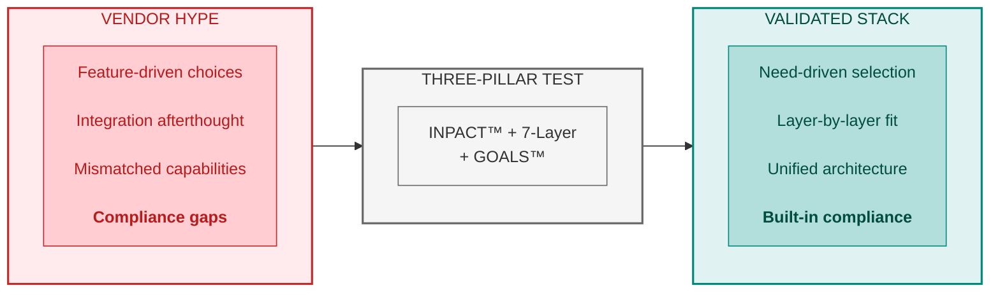
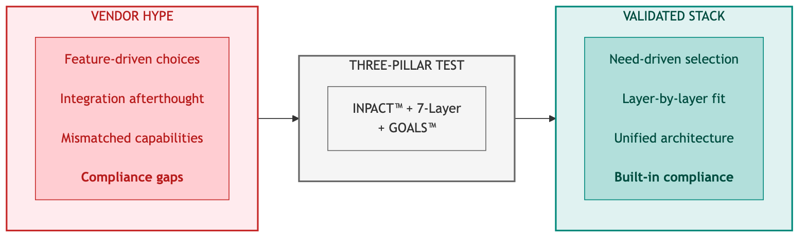
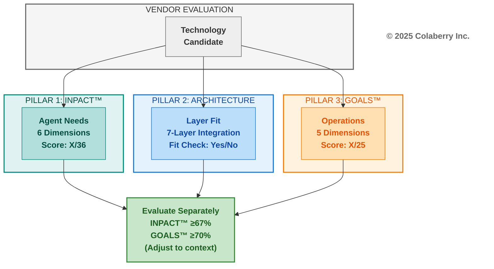
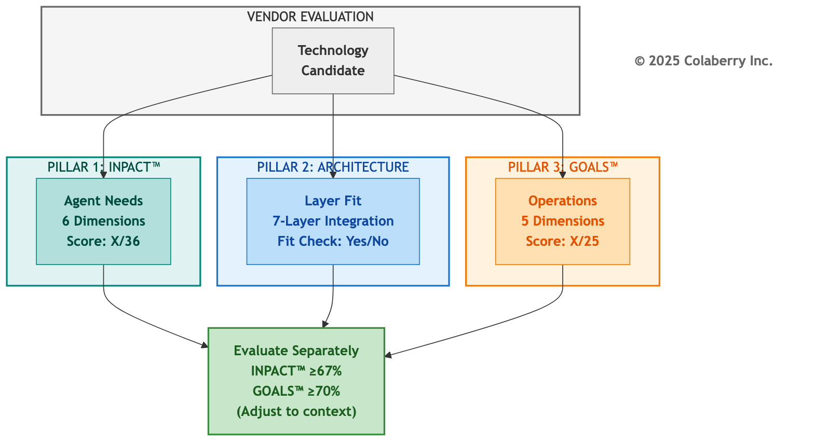
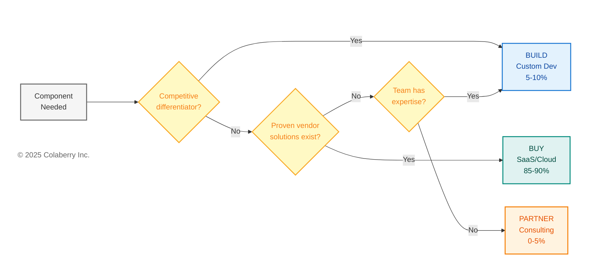
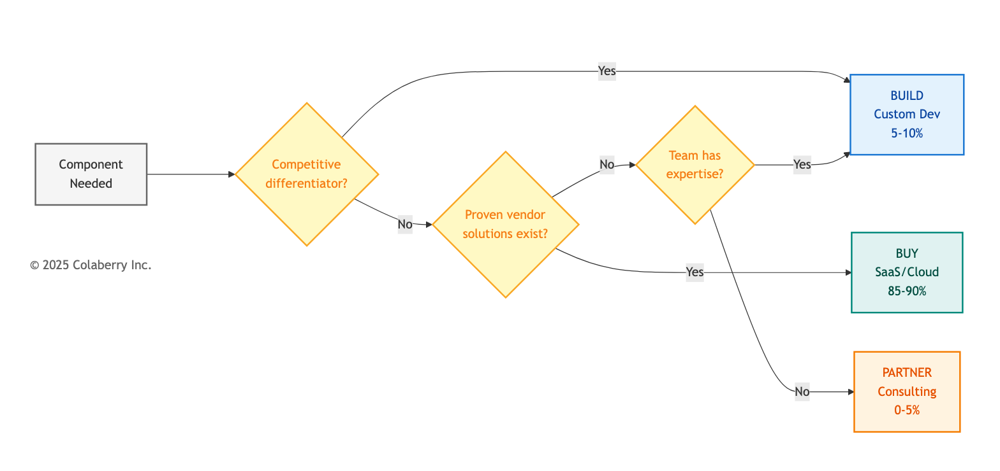
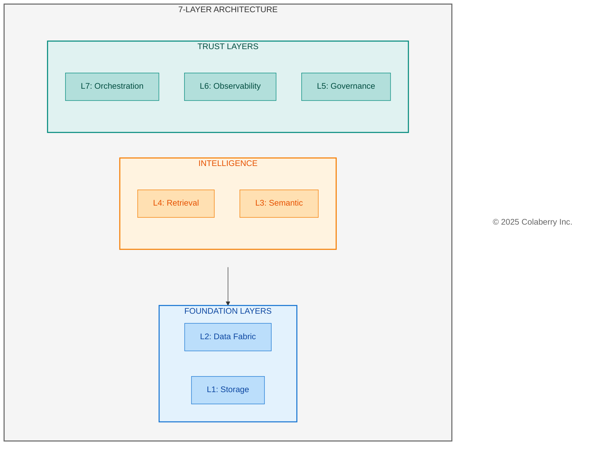
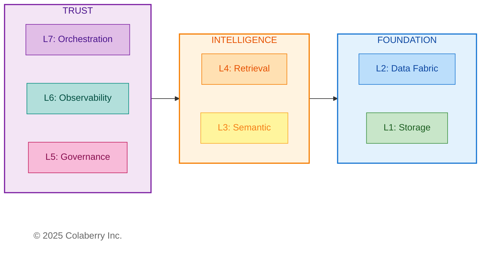
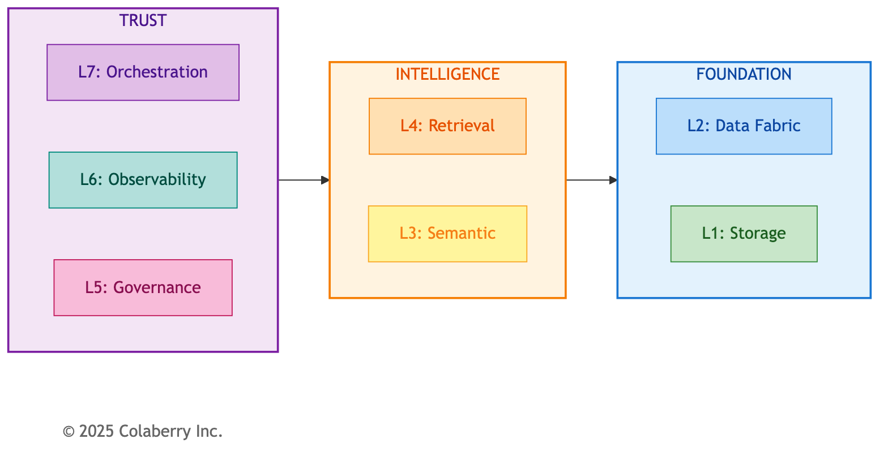

# Chapter 11: Build Your Tech Stack

**The Technology Selection Chapter**

---

*Week 1, Wednesday afternoon. Ten weeks before production.*

Sarah stared at the vendor comparison spreadsheet. Fourteen vector databases. Eight CDC platforms. Six semantic layer tools.

Marcus asked about Pinecone's impressive demo: sub-50ms retrieval, slick UI.

"Did they have a BAA?" Sarah asked.

Marcus paused. "I didn't ask."

"Then they're not on the list." She'd learned this lesson the hard way: INPACT™ first, GOALS™ second, verify integration. Impressive demos don't mean production-ready.

---

**Figure 11.1: Vendor Selection Transformation**

> **Key Takeaway:** Every vendor must pass the three-pillar test. No exceptions.

---

*Technology selection methodology determines success or failure. This chapter provides the criteria, frameworks, and processes to evaluate any vendor against the Architecture of Trust. Your roadmap (Chapter 10) shows when to build. This chapter shows how to decide what to build with.*

> **📚 Online Tools:** For interactive vendor evaluation scorecards, assessment templates, and current vendor comparisons, see the **Online Tools** section at the end of this chapter.

---

## Part 1: Selection Framework

### 1.1 Your Assessment Drives Your Stack

Your INPACT™ score from Chapter 9 determines your technology priorities. The mapping is direct:

| Low Score | Priority Layers | Selection Focus |
|-----------|-----------------|-----------------|
| **I (Instant)** | L1, L2 | Sub-100ms queries, <30s CDC latency |
| **N (Natural)** | L3, L4 | Semantic glossaries, embedding quality |
| **P (Permitted)** | L5 | ABAC engines, HITL workflows, audit platforms |
| **T (Transparent)** | L6 | LLM tracing, citation tracking, explainability |
| **A or C** | L2, L4, L7 | Feedback loops, cross-system integration |

*For complete INPACT™-to-Layer mapping, see Chapter 9, Part 1.3.*

**Three Selection Principles**

Every vendor evaluation follows three principles:

1. **INPACT™-First**: Does the technology help agents meet the six fundamental needs?
2. **GOALS™-Ready**: Can your team operate this technology with excellence?
3. **Layer-Aligned**: Does it fit the 7-Layer Architecture without gaps or overlaps?

**Chapter Structure**

- **Part 1:** Selection framework (three-pillar vendor test, build vs buy, budget tiers)
- **Part 2:** Layer-by-layer selection criteria (what to evaluate, not whom to select)
- **Part 3:** Evaluation process (RFP templates, POC approach, contract negotiation)
- **Part 4:** Applying the methodology (Echo's selection process as example)

> **Note:** Budget ranges and discount percentages in this chapter are illustrative. Your actual pricing will vary based on vendor negotiations, deployment scale, and market conditions.

---

### 1.2 The Three-Pillar Vendor Test

Every technology in a production stack must pass the same evaluation. Three pillars, separately scored, identify vendors that meet both agent needs and operational requirements.

**Figure 11.2: The Three-Pillar Vendor Evaluation Framework**

**Pillar 1: INPACT™ Agent Needs (Score Separately)**

The first pillar asks: does this technology help agents meet the six fundamental needs? Each INPACT™ dimension translates into specific vendor evaluation questions:

| INPACT™ Need | Vendor Evaluation Question | What to Look For |
|--------------|---------------------------|------------------|
| **I (Instant)** | Does it support <100ms queries? Real-time data access? | Sub-50ms response times, efficient caching, streaming support |
| **N (Natural)** | Does it support NLU, semantic capabilities? | Vector embeddings, semantic search, terminology mapping |
| **P (Permitted)** | Does it support ABAC, HITL, audit trails? | Role-based + attribute-based access, human escalation, logging |
| **A (Adaptive)** | Does it enable feedback loops, continuous learning? | Model versioning, A/B testing, feedback integration |
| **C (Contextual)** | Does it integrate with multiple sources? | API breadth, connector ecosystem, data federation |
| **T (Transparent)** | Does it provide explainability, citations, compliance? | Audit trails, decision traces, regulatory support |

Score each relevant dimension 1-6. Not every dimension applies to every vendor category. A vector database primarily addresses I (speed) and N (semantic), while a policy engine focuses on P (permitted) and T (transparent). Score only the dimensions relevant to that technology's purpose. *(For complete scoring rubrics, see the INPACT™ Practitioner Reference.)*

**INPACT™ Vendor Score**: Sum of relevant dimensions (maximum 36 if all apply)

**Pillar 2: Architecture Fit (Qualitative Check)**

The second pillar ensures the technology integrates cleanly into the 7-Layer Architecture:

- **Layer Alignment**: Which layer does this vendor serve? Is it the right tool for that layer's specific purpose?
- **Adjacent Integration**: Does it connect smoothly with the layers above and below?
- **Gap Prevention**: Does selecting this vendor create gaps in your architecture, or complete a capability you need?
- **Overlap Avoidance**: Does this vendor duplicate functionality you're getting elsewhere?

**Architecture Fit**: Pass/Fail based on layer alignment and integration quality

**Pillar 3: GOALS™ Operations (Score Separately)**

The third pillar measures operational readiness. A technology might score perfectly on INPACT™ but fail if your team can't operate it effectively:

| GOALS™ Dimension | Vendor Evaluation Question | What to Look For |
|------------------|---------------------------|------------------|
| **G (Governance)** | Does it support policy enforcement, compliance? | Industry certifications (SOC2, ISO27001, etc.), audit features |
| **O (Observability)** | Does it provide monitoring, tracing, dashboards? | Built-in metrics, logging quality, alerting integration |
| **A (Availability)** | What's the uptime SLA? Support quality? | 99.9%+ SLA, responsive support, documentation quality |
| **L (Lexicon)** | Does it support semantic accuracy, terminology? | API quality, SDK maturity, integration breadth |
| **S (Solid)** | Is it reliable, consistent, high-quality? | Production track record, error handling, data integrity |

Score each dimension 1-5 (GOALS™ uses 5-point scale).

**GOALS™ Vendor Score**: Sum of relevant dimensions (maximum 25)

**Why Separate Scores Matter**

INPACT™ measures what infrastructure must *provide* to agents. GOALS™ measures how you *operate* that infrastructure. A vendor scoring high on INPACT™ but low on GOALS™ delivers impressive technology your team can't sustain. Both scores must exceed minimum thresholds independently.

**What This Means for Your Vendor Search**

Your three-pillar scores become your vendor conversation framework. When evaluating any technology:

1. **Filter first**: Compliance requirements eliminate vendors before technical evaluation
2. **Score INPACT™**: Does it meet agent needs for its layer?
3. **Score GOALS™**: Can your team operate it?
4. **Verify architecture fit**: Does it integrate with adjacent layers?

This methodology applies regardless of which specific vendors you evaluate. The vendor landscape changes; the evaluation criteria remain constant.

---

### 1.3 Build vs Buy vs Partner

Not every component requires a vendor purchase. The Architecture of Trust supports a hybrid approach: buy commodity capabilities, build differentiators, partner for expertise.

**Figure 11.3: Build vs Buy vs Partner Decision Flow**

**Build (Custom Development): 5-10% of Stack**

Custom development makes sense when:

- The capability is a competitive differentiator unique to your organization
- No vendor solution fits your specific workflow or compliance requirements
- You need deep integration with proprietary systems
- Long-term maintenance costs are acceptable

**Typical Build Candidates**:
- Custom HITL user interfaces matching specific domain workflows
- Specialized agent prompts incorporating domain-specific concepts
- Integration layers connecting proprietary source systems to semantic layers

**Build Trade-offs**:
- ✅ Perfect fit for unique requirements
- ✅ No vendor dependency
- ⚠️ Higher upfront development cost
- ⚠️ Ongoing maintenance burden
- ⚠️ Slower time-to-value

**Buy (SaaS/Cloud Services): 85-90% of Stack**

Purchasing makes sense when:

- The capability is commodity (many proven solutions exist)
- Time-to-value matters more than perfect fit
- Your team lacks specialized expertise to build and maintain
- Vendor provides compliance certifications you need (SOC2, ISO27001, industry-specific)

**Typical Buy Candidates**:
- Vector databases, data warehouses, graph databases
- CDC platforms, streaming infrastructure
- Observability and monitoring tools
- LLM APIs and embedding services

**Buy Trade-offs**:
- ✅ Fastest time-to-value
- ✅ Vendor handles maintenance, scaling, security
- ✅ Predictable recurring costs
- ⚠️ Vendor dependency and potential lock-in
- ⚠️ Less customization flexibility

**Partner (Managed Services/Consulting): 0-5% of Stack**

Partnering makes sense when:

- You need expertise your team doesn't have
- Implementation requires specialized knowledge
- One-time setup matters more than ongoing capability
- Knowledge transfer to your team is included

**Typical Partner Candidates**:
- Implementation consulting for transformation projects
- Domain-specific content mapping (industry terminology, regulatory requirements)
- Compliance validation and audit preparation

**Partner Trade-offs**:
- ✅ Access specialized expertise without hiring
- ✅ Compressed timelines through experienced guidance
- ✅ Knowledge transfer builds internal capability
- ⚠️ Variable costs based on scope
- ⚠️ Dependency on partner availability

---

## Part 2: Layer-by-Layer Selection Criteria

This section provides selection criteria for each of the seven architecture layers. For each layer, you'll find: the purpose and INPACT™ dimensions to prioritize, minimum requirements and questions to ask vendors, red flags that eliminate vendors, and subcategories to evaluate.

> **📚 For specific vendor comparisons:** Use the **Vendor Advisor at trustbeforeintelligence.ai/tools** for personalized recommendations based on your context.

**Figure 11.4: The 7-Layer Architecture Technology Stack**

---

### 2.1 Layer 1: Multi-Modal Storage

**Purpose:** Store vectors, structured data, and graph relationships for agent retrieval

**INPACT™ Dimensions to Prioritize:** I (speed), C (integration), N (vectors)

**Implementation Timing:** Weeks 1-4 (Foundation Phase)

Without performant multi-modal storage, agents can't retrieve context quickly enough for conversational interaction. See Chapter 4 for implementation details.

**Selection Criteria**

| Criterion | Minimum Requirement | Questions to Ask Vendors |
|-----------|---------------------|--------------------------|
| Query Latency | <100ms p95 | What is your p95 latency at 500 concurrent users? |
| Regulatory Compliance | Industry certifications available | What compliance certifications do you hold? (SOC2, ISO27001, etc.) |
| Embedding Support | Native vector operations | Which embedding models integrate natively? |
| Scalability | 10x headroom | How do you handle 10x current load? |
| Data Residency | Region-specific storage | Can you guarantee US-only data storage? |

**Red Flags (Eliminate Vendor If Present)**

- No compliance certifications for your industry's regulatory requirements
- Latency benchmarks only for small datasets (<1M records)
- Requires self-managed infrastructure without DevOps support
- No native integration with common embedding providers
- Pricing model that scales unpredictably with query volume

**Subcategories to Evaluate**

| Subcategory | Primary Use | Key Differentiator |
|-------------|-------------|-------------------|
| Vector Databases | Semantic search, RAG | Sub-50ms similarity search |
| Data Warehouses | Structured analytics | SQL compatibility, compliance certifications |
| Graph Databases | Relationship traversal | Multi-hop query performance |
| Document Stores | Flexible schema | JSON native, unstructured text |

---

### 2.2 Layer 2: Real-Time Data Fabric

**Purpose:** Keep data fresh (<30 seconds), enable streaming for agents

**INPACT™ Dimensions to Prioritize:** I (freshness), C (CDC), A (streaming)

**Implementation Timing:** Weeks 1-4 (Foundation Phase)

Without real-time data, agents make decisions on stale context. In healthcare, the difference between catching a medication interaction before administration versus after can be life or death. See Chapter 4 for implementation details.

**Selection Criteria**

| Criterion | Minimum Requirement | Questions to Ask Vendors |
|-----------|---------------------|--------------------------|
| CDC Latency | <30 seconds end-to-end | What is your typical CDC latency from source to target? |
| Connector Coverage | Source systems supported | Do you have native connectors for our key systems? |
| Schema Evolution | Auto-adapt to changes | How do you handle source schema changes? |
| Throughput | >10K events/second | What's your sustained throughput capacity? |
| Exactly-Once Delivery | Guaranteed | How do you ensure no duplicate or lost events? |

**Red Flags (Eliminate Vendor If Present)**

- CDC latency measured in minutes, not seconds
- No native connectors for your key source systems (requires custom development)
- Manual intervention required for schema changes
- No exactly-once delivery guarantee
- Pricing based on row count without volume discounts

**Subcategories to Evaluate**

| Subcategory | Primary Use | Key Differentiator |
|-------------|-------------|-------------------|
| CDC Tools | Database change capture | Connector ecosystem breadth |
| Streaming Platforms | Event processing | Throughput and latency |
| Stream Processing | Real-time transformation | Windowing and aggregation |

---

### 2.3 Layer 3: Semantic Layer

**Purpose:** Translate business language to data structures

**INPACT™ Dimensions to Prioritize:** N (natural language), C (context), T (transparency)

**Implementation Timing:** Weeks 5-7 (Intelligence Phase)

When a user asks a domain-specific question, the semantic layer resolves this to precise query logic without requiring SQL knowledge. See Chapter 5 for implementation details.

**Selection Criteria**

| Criterion | Minimum Requirement | Questions to Ask Vendors |
|-----------|---------------------|--------------------------|
| Term Resolution | >95% accuracy | What is your term resolution accuracy on domain terminology? |
| Entity Resolution | >90% confidence | How do you handle entity disambiguation across systems? |
| Lineage Tracking | Complete | Can you trace any metric back to source tables? |
| Glossary Scale | >2,000 terms | How many business terms can your glossary support? |
| Ontology Support | Industry standards | Do you support industry-standard ontologies and taxonomies? |

**Red Flags (Eliminate Vendor If Present)**

- No support for industry-standard ontologies required by your domain
- Manual-only term definition (no automation assistance)
- No lineage tracking to source systems
- Entity resolution limited to exact matches only
- No API for programmatic glossary updates

**Subcategories to Evaluate**

| Subcategory | Primary Use | Key Differentiator |
|-------------|-------------|-------------------|
| Semantic Modeling | Metric definitions | SQL-native transformation |
| Data Catalogs | Discovery and governance | Auto-classification, PII detection |
| Entity Resolution | Identity matching | Probabilistic matching confidence |

---

### 2.4 Layer 4: Intelligence Layer

**Purpose:** Transform queries into grounded, accurate responses through RAG

**INPACT™ Dimensions to Prioritize:** N (NLU), A (adaptive), T (citations)

**Implementation Timing:** Weeks 5-7 (Intelligence Phase)

The intelligence pipeline includes query understanding, embedding generation, hybrid retrieval, reranking, context assembly, LLM generation, and semantic caching. This is not a single technology but an orchestrated workflow. See Chapter 5 for implementation details.

**Selection Criteria**

| Criterion | Minimum Requirement | Questions to Ask Vendors |
|-----------|---------------------|--------------------------|
| RAG Accuracy | >85% on domain queries | What accuracy do you achieve on domain-specific RAG tasks? |
| Citation Support | Source attribution | Can responses include source citations? |
| Hybrid Retrieval | Vector + keyword | Do you support hybrid search with RRF? |
| Context Window | >100K tokens | What's your maximum context window? |
| Streaming Response | SSE support | Can you stream responses token-by-token? |

**Red Flags (Eliminate Vendor If Present)**

- No compliance certifications for LLM providers handling sensitive data
- Citation/attribution not supported
- Vector-only retrieval (no keyword fallback)
- No prompt versioning or management
- Cost model opaque or unpredictable

**Subcategories to Evaluate**

| Subcategory | Primary Use | Key Differentiator |
|-------------|-------------|-------------------|
| LLM Providers | Text generation | Quality, latency, cost |
| Embedding Models | Vectorization | Domain-specific quality |
| RAG Frameworks | Pipeline orchestration | Ecosystem and flexibility |
| Reranking | Result refinement | Accuracy improvement |

---

### 2.5 Layer 5: Governance

**Purpose:** Control what agents can do based on context

**INPACT™ Dimensions to Prioritize:** P (permitted), T (transparent)

**Implementation Timing:** Weeks 8-10 (Trust Phase)

Agents make thousands of decisions daily and can't rely on human review for every query. Context-aware authorization evaluates the full situation: who is asking, what they're asking for, when, and why. See Chapter 6 for implementation details.

**Selection Criteria**

| Criterion | Minimum Requirement | Questions to Ask Vendors |
|-----------|---------------------|--------------------------|
| Policy Evaluation | <50ms latency | What is your policy evaluation latency at scale? |
| ABAC Support | Four-factor evaluation | Do you support subject, resource, action, and context attributes? |
| HITL Integration | Workflow support | Can policies trigger human escalation? |
| Audit Completeness | 100% coverage | Are all decisions logged with full context? |
| Policy Versioning | Git-compatible | Can policies be version-controlled? |

**Red Flags (Eliminate Vendor If Present)**

- RBAC only (no attribute-based policies)
- No audit trail or incomplete logging
- Policy changes require code deployments
- No HITL escalation capability
- Latency >100ms (impacts user experience)

**Subcategories to Evaluate**

| Subcategory | Primary Use | Key Differentiator |
|-------------|-------------|-------------------|
| Policy Engines | ABAC evaluation | Rego/policy language flexibility |
| Data Governance | Compliance management | Industry-specific compliance features |
| HITL Platforms | Human escalation | Workflow customization |

---

### 2.6 Layer 6: Observability

**Purpose:** See what agents are doing, detect issues, optimize performance

**INPACT™ Dimensions to Prioritize:** T (transparent), A (adaptive)

**Implementation Timing:** Weeks 8-10 (Trust Phase)

Without observability, agents are black boxes. You can't debug failures, optimize costs, or detect quality degradation. See Chapter 6 for implementation details.

**Selection Criteria**

| Criterion | Minimum Requirement | Questions to Ask Vendors |
|-----------|---------------------|--------------------------|
| Distributed Tracing | End-to-end | Can you trace requests across all seven layers? |
| LLM Cost Tracking | Per-query attribution | Can you break down cost by query type and model? |
| Latency Percentiles | P50/P95/P99 | What latency metrics do you provide? |
| Alert Integration | PagerDuty/Slack | How do alerts route to on-call teams? |
| Retention | >30 days | How long are traces and logs retained? |

**Red Flags (Eliminate Vendor If Present)**

- No LLM-specific metrics (token usage, cost)
- Sampling-only tracing (misses rare failures)
- No correlation between traces and logs
- Alert fatigue from poor threshold defaults
- Expensive retention pricing

**Subcategories to Evaluate**

| Subcategory | Primary Use | Key Differentiator |
|-------------|-------------|-------------------|
| APM Platforms | Full-stack monitoring | LLM integration depth |
| LLM Observability | AI-specific tracing | Prompt versioning, quality metrics |
| Log Management | Centralized logging | Search and correlation |

---

### 2.7 Layer 7: Orchestration

**Purpose:** Coordinate multiple agents working together on complex queries

**INPACT™ Dimensions to Prioritize:** A (adaptive), C (contextual), all dimensions at integration

**Implementation Timing:** Weeks 8-10 (Trust Phase)

Complex queries often span multiple domains, requiring expertise from multiple specialized agents simultaneously. See Chapter 6 for implementation details.

**Selection Criteria**

| Criterion | Minimum Requirement | Questions to Ask Vendors |
|-----------|---------------------|--------------------------|
| Multi-Agent Support | Supervisor patterns | Can you coordinate multiple specialized agents? |
| State Management | Persistent across steps | How do you maintain state across agent interactions? |
| Routing Logic | Conditional flows | Can routing decisions be based on query content? |
| Integration | Layers 1-6 | How do you integrate with governance and observability? |
| Error Handling | Graceful degradation | What happens when one agent fails? |

**Red Flags (Eliminate Vendor If Present)**

- Single-agent only (no coordination patterns)
- Stateless execution (no memory across steps)
- No integration with observability layer
- Opaque routing decisions (can't explain why agent X was selected)
- No timeout or circuit breaker patterns

**Subcategories to Evaluate**

| Subcategory | Primary Use | Key Differentiator |
|-------------|-------------|-------------------|
| Agent Frameworks | Multi-agent coordination | State management approach |
| Workflow Engines | Process orchestration | Retry and error handling |
| Integration Platforms | Cross-system coordination | Connector ecosystem |

---

**Your Layer Choices Now Constrain Each Other**

Technology selections are not independent. Your Layer 1 storage choices constrain which Layer 4 retrieval approaches work efficiently. Your Layer 5 governance choices determine what observability data Layer 6 must capture. Your Layer 3 semantic layer must integrate with both Layer 1 storage below and Layer 4 intelligence above.

Before finalizing any layer, verify integration with adjacent layers. The best individual component that doesn't integrate is worse than a good component that does.

---

## Part 3: Vendor Evaluation Process

Selecting vendors requires more than scoring spreadsheets. This section provides practical tools for evaluation: RFP templates structured around the three pillars, POC validation approaches, and contract negotiation guidance.

---

### 3.1 Three-Pillar RFP Template

Structure your vendor requests around the Architecture of Trust: INPACT™ requirements, Architecture fit, and GOALS™ operations.

| Section | Scoring | Focus Areas |
|---------|---------|-------------|
| INPACT™ | X/36 (per Section 1.2) | Latency, semantic support, ABAC/HITL, feedback loops, connectors, explainability |
| Architecture | Pass/Fail | Layer alignment, adjacent integration, gap/overlap analysis |
| GOALS™ | X/25 (per Section 1.2) | Compliance certs, monitoring, SLA/support, API quality, production track record |

Score each pillar separately. Suggested minimum thresholds: INPACT™ ≥67% and GOALS™ ≥70%. Adjust based on your risk tolerance and operational capacity.

*See Online Tools section for downloadable RFP template with question banks.*

---

### 3.2 POC Approach

Run 2-week POCs for shortlisted vendors using representative data, not demo environments.

**Week 1 (INPACT™ Validation):** Test latency with 1,000 queries, accuracy with 100 business-language queries, policy evaluation speed, feedback loop responsiveness, multi-source connectivity, and audit log completeness.

**Week 2 (GOALS™ + Integration):** Validate layer integration latency, monitoring dashboards, support responsiveness, documentation quality, and failure recovery.

**POC Failure Patterns:** Latency degradation under realistic load, data volume limitations, integration complexity requiring professional services, documentation gaps requiring support tickets.

POC failures save you from costly mistakes. A vendor that fails POC would have failed in production. Better to discover this in two weeks than twelve months.

---

### 3.3 Contract Negotiation

Use your evaluation process in negotiations. Vendors competing through structured POCs know you're evaluating alternatives seriously.

**Negotiation Points**

| Lever | Typical Discount | How to Use |
|-------|------------------|------------|
| Annual Commitment | 15-25% | Commit to 12-month minimum for discount |
| Multi-Year | 20-30% | 2-3 year commitment for deeper discount |
| Pilot Success | 10-15% | Reference POC success as proof of value |
| Volume | 10-20% | Commit to higher usage tier upfront |
| Case Study | 5-10% | Offer to be reference customer |

**Must-Have Contract Terms**

| Term | Requirement | Why It Matters |
|------|-------------|----------------|
| **Compliance** | Industry-required certifications (SOC2, ISO27001, or industry-specific) | Regulatory compliance mandatory |
| **Data Residency** | Data storage in required jurisdictions confirmed | Sensitive data cannot leave jurisdiction |
| **SLA** | Uptime guarantee with financial penalties | Accountability for reliability |
| **Exit Clause** | Data portability and transition period | Avoid vendor lock-in |
| **Security Audit** | Right to audit or security certification | Verify security claims |

Negotiate all five terms with every vendor handling sensitive data. Walk away from vendors who resist compliance requirements. They'll eventually agree when you demonstrate serious evaluation of alternatives.

---

## Part 4: Applying the Methodology

This section shows how to apply the selection methodology. Echo Health Systems serves as an example of the process, not an endorsement of specific vendors.

---

### 4.1 Echo's Selection Criteria

Echo began with constraints, not vendor lists. Their context (healthcare/PHI, $1.23M budget, 12-week timeline, 2-person team) shaped every decision: BAA required first, managed services preferred, Growth tier pricing, operational simplicity prioritized.

**How Filters Narrowed the Field**

1. **BAA filter**: Vendors without healthcare BAA capability eliminated before technical review
2. **INPACT™ threshold**: Vendors below 67% eliminated after paper evaluation
3. **GOALS™ threshold**: Vendors below 70% on operations eliminated
4. **POC validation**: Remaining vendors validated against real workloads

The filters did the work. By the time Echo ran POCs, they were choosing between good options, not eliminating bad ones.

**Build vs Buy Decisions**

| Question | Echo's Answer | Decision |
|----------|---------------|----------|
| Is vector search a competitive differentiator? | No, commodity capability | BUY |
| Does a proven CDC solution exist for Epic EHR? | Yes, multiple vendors | BUY |
| Does our clinical HITL workflow exist off-the-shelf? | No, unique to our process | BUILD |
| Do we have ABAC policy expertise internally? | No | PARTNER (implementation) then BUY |

Result: 90% buy, 5% build, 5% partner.

---

### 4.2 Your Turn: Applying the Methodology

Your context will shape your criteria differently than Echo's.

**Different Contexts, Different Criteria**

A financial services firm might prioritize:
- SOC2 Type II over BAA
- Sub-10ms latency over sub-100ms
- On-premises deployment over managed cloud

A manufacturing company might prioritize:
- OT/IT integration capability
- Edge deployment options
- Vendor longevity over startup innovation

**The methodology remains constant. The criteria adapt to context.**

---

### 4.3 Your Selection Toolkit

Interactive tools and downloadable templates to apply this methodology are available at **trustbeforeintelligence.ai/tools**.

---

### 4.4 What the Methodology Prevents

Structured methodology prevents common selection failures:

| Failure Mode | How Methodology Prevents It |
|--------------|----------------------------|
| "Shiny object" syndrome | GOALS™ scoring exposes operational gaps behind impressive demos |
| Compliance gaps | Regulatory filter applied before technical evaluation |
| Vendor lock-in | Exit clause required in contract terms checklist |
| Budget overruns | Three-pillar test aligns selection to actual budget tier |
| Integration failures | POC Week 2 validates layer integration before commitment |
| Operational burden | GOALS™ Availability and Solid dimensions expose hidden complexity |

The methodology doesn't guarantee perfect selections. It prevents predictable mistakes.

---

### 4.5 Echo's Complete Stack

Echo's final technology choices demonstrate the methodology in action. Every vendor passed the three-pillar test.

> **Note:** Echo's choices reflect their specific context (healthcare, $1.23M budget, 12-week timeline). Your selections will differ based on your constraints. For detailed vendor comparisons, use the Vendor Advisor tool.

**Figure 11.5: Echo's Complete Technology Stack**

**Echo's Selection Principles:** (1) Managed over self-hosted, (2) Healthcare-first (BAA required), (3) Integration-proven over best-in-class, (4) Cost-optimized for Growth tier.

**Echo's Results:** Completed under budget ($992K of $1.23M), achieved INPACT™ 89/100 and GOALS™ 21/25, went live in 12 weeks. *(Use the Stack Builder and Vendor Advisor at trustbeforeintelligence.ai/tools to plan your investment and select vendors.)*

---

## Bridge to Chapter 12

You've learned the methodology for selecting your technology stack. Every vendor evaluation uses the three-pillar test. Every layer has clear selection criteria. The Architecture of Trust provides the framework.

Now comes the harder part: keeping it running.

Chapter 12 completes your journey with MLOps practices for versioning and testing, incident response runbooks for when things go wrong, and the continuous improvement cycles that sustain trust over time. You've learned to select the right tools. Now learn to operate them.

---

## Chapter Summary

| Part | Content | Key Deliverable |
|------|---------|-----------------|
| Part 1 | Selection Framework | Three-pillar vendor test, build/buy/partner |
| Part 2 | Layer-by-Layer Criteria | Selection criteria for all 7 layers |
| Part 3 | Evaluation Process | RFP approach, POC validation, negotiation |
| Part 4 | Applying the Methodology | Echo's process, your toolkit, complete stack reference |

---

## Online Tools

Interactive tools and downloadable templates supporting this chapter are available at **trustbeforeintelligence.ai/tools**, including the Vendor Advisor, Stack Builder, Three-Pillar RFP Template, and POC Test Plan Template. High-resolution versions of all figures are available in the **Figures Gallery** at trustbeforeintelligence.ai/figures.

---

## Further Reading

**Academic Research**

- Malkov, Y. A., & Yashunin, D. A. (2018). "Efficient and Robust Approximate Nearest Neighbor Search Using Hierarchical Navigable Small World Graphs." *IEEE Transactions on Pattern Analysis and Machine Intelligence*, 42(4), 824-836. https://arxiv.org/abs/1603.09320

- Gao, Y., Xiong, Y., Gao, X., et al. (2024). "Retrieval-Augmented Generation for Large Language Models: A Survey." *arXiv preprint arXiv:2312.10997*. https://arxiv.org/abs/2312.10997

**Government & Standards**

- National Institute of Standards and Technology. (2014). "Guide to Attribute Based Access Control (ABAC) Definition and Considerations." NIST Special Publication 800-162. https://nvlpubs.nist.gov/nistpubs/specialpublications/nist.sp.800-162.pdf

- National Institute of Standards and Technology. (2023). "AI Risk Management Framework (AI RMF 1.0)." NIST AI 100-1. https://www.nist.gov/itl/ai-risk-management-framework

---

**© 2025-2026 Colaberry Inc. All Rights Reserved.**
INPACT™ and GOALS™ are trademarks of Colaberry Inc.

*Acronyms and key terms are defined in the Glossary.*
