# Chapter 11: Choosing the Right Tools for Your Stack

**The Technology Selection Chapter — Your Three-Pillar Vendor Guide**

---

<!-- CHAPTER OPENING GRAPHIC -->

```mermaid

 graph LR
    subgraph BEFORE["VENDOR HYPE"]
        direction TB
        B1["Feature-driven choices<br/><br/>Integration afterthought<br/><br/>Mismatched capabilities<br/><br/><b>Compliance gaps</b>"]
    end
    
    subgraph TRANSFORM["THREE-PILLAR TEST"]
        direction TB
        T1["INPACT™ + 7-Layer<br/>+ GOALS™"]
    end
    
    subgraph AFTER["VALIDATED STACK"]
        direction TB
        A1["Need-driven selection<br/><br/>Layer-by-layer fit<br/><br/>Unified architecture<br/><br/><b>Built-in compliance</b>"]
    end
    
    BEFORE --> TRANSFORM --> AFTER
    
    style BEFORE fill:#ffebee,stroke:#c62828,stroke-width:2px,color:#b71c1c
    style TRANSFORM fill:#f5f5f5,stroke:#666666,stroke-width:2px,color:#333333
    style AFTER fill:#e0f2f1,stroke:#00897b,stroke-width:2px,color:#004d40
    style B1 fill:#ffcdd2,stroke:#c62828,color:#b71c1c
    style T1 fill:#f5f5f5,stroke:#666666,color:#333333
    style A1 fill:#b2dfdb,stroke:#00897b,color:#004d40

```

> **Key Takeaway:** Every vendor must pass the three-pillar test. No exceptions.

<!-- END CHAPTER OPENING GRAPHIC -->

---

*Every vendor in Echo's production stack passed the same test: Does it meet INPACT™ agent needs? Does it fit the 7-Layer Architecture? Does it enable GOALS™ operational excellence? This chapter gives you their exact selection criteria, vendor scorecards, and the rationale behind every choice. Your roadmap (Chapter 10) shows when to build. This chapter shows what to build with.*

---

## Part 1: Selection Framework

### 1.1 Your Assessment Drives Your Stack

Your INPACT™ score from Chapter 9 determines your technology priorities. The mapping is direct:

| Low Score | Priority Layers | Vendor Focus |
|-----------|-----------------|--------------|
| **I (Instant)** | L1, L2 | Sub-100ms queries, <30s CDC latency |
| **N (Natural)** | L3, L4 | Semantic glossaries, healthcare embeddings |
| **P (Permitted)** | L5 | ABAC engines, HITL workflows, audit platforms |
| **T (Transparent)** | L6 | LLM tracing, citation tracking, explainability |
| **A or C** | L2, L4, L7 | Feedback loops, cross-system integration |

*For complete INPACT™-to-Layer mapping, see Chapter 9, Part 1.3.*

**Three Selection Principles**

Every vendor evaluation follows three principles:

1. **INPACT™-First**: Does the technology help agents meet the six fundamental needs?
2. **GOALS™-Ready**: Can your team operate this technology with excellence?
3. **Echo-Validated**: What did Echo choose, and why?

**Chapter Structure**

- **Part 1:** Selection framework—three-pillar vendor test, build vs buy, budget tiers
- **Part 2:** Layer-by-layer vendor recommendations with INPACT™/GOALS™ scores
- **Part 3:** Evaluation tools—RFP templates, POC approach, contract negotiation
- **Part 4:** Echo's complete stack as reference architecture

---

### 1.2 The Three-Pillar Vendor Test

Every technology in Echo's stack passed the same evaluation. Three pillars, weighted to reflect their importance, combine into a single score that separates recommended vendors from rejected ones.

**Diagram: The Three-Pillar Vendor Evaluation Framework**

```mermaid
graph TD
    subgraph VENDOR["VENDOR EVALUATION"]
        V["<b>Technology<br/>Candidate</b>"]
    end
    
    subgraph PILLAR1["PILLAR 1:INPACT™(40%)"]
        P1["<b>Agent Needs</b><br/><b>6 Dimensions</b>"]
    end
    
    subgraph PILLAR2["PILLAR-2:ARCHITECTURE(30%)"]
        P2["<b>Layer Fit</b><br/><b>7-Layer Integration</b>"]
    end
    
    subgraph PILLAR3["PILLAR 3:GOALS™(30%)"]
        P3["<b>Operations</b><br/><b>5 Dimensions</b>"]
    end
    
    V --> P1
    V --> P2
    V --> P3
    
    P1 --> SCORE["<b>Combined Score</b><br/><b>≥77% = Recommend</b>"]
    P2 --> SCORE
    P3 --> SCORE
    
    Copyright["<b>© 2025 Colaberry Inc.</b>"]
    
    style VENDOR fill:#f5f5f5,stroke:#666666,stroke-width:2px,color:#333333
    style PILLAR1 fill:#e0f2f1,stroke:#00897b,stroke-width:2px,color:#004d40
    style PILLAR2 fill:#e3f2fd,stroke:#1976d2,stroke-width:2px,color:#0d47a1
    style PILLAR3 fill:#fff3e0,stroke:#f57c00,stroke-width:2px,color:#e65100
    style V fill:#eeeeee,stroke:#666666,color:#333333
    style P1 fill:#b2dfdb,stroke:#00897b,color:#004d40
    style P2 fill:#bbdefb,stroke:#1976d2,color:#0d47a1
    style P3 fill:#ffe0b2,stroke:#f57c00,color:#e65100
    style SCORE fill:#c8e6c9,stroke:#388e3c,stroke-width:2px,color:#1b5e20
    style Copyright fill:#ffffff,stroke:none,color:#666666
```

**Pillar 1: INPACT™ Agent Needs (40% Weight)**

The first pillar asks: does this technology help agents meet the six fundamental needs? Each INPACT™ dimension translates into specific vendor evaluation questions:

| INPACT™ Need | Vendor Evaluation Question | What to Look For |
|--------------|---------------------------|------------------|
| **I (Instant)** | Does it support <100ms queries? Real-time data access? | Sub-50ms response times, efficient caching, streaming support |
| **N (Natural)** | Does it support NLU, semantic capabilities? | Vector embeddings, semantic search, terminology mapping |
| **P (Permitted)** | Does it support ABAC, HITL, audit trails? | Role-based + attribute-based access, human escalation, logging |
| **A (Adaptive)** | Does it enable feedback loops, continuous learning? | Model versioning, A/B testing, feedback integration |
| **C (Contextual)** | Does it integrate with multiple sources? | API breadth, connector ecosystem, data federation |
| **T (Transparent)** | Does it provide explainability, citations, compliance? | Audit trails, decision traces, regulatory support |

Score each relevant dimension 1-6:

- **6 (Excellent)**: Best-in-class support, competitive advantage
- **5 (Strong)**: Production-ready, meets all requirements
- **4 (Functional)**: Adequate with monitoring
- **3 (Moderate)**: Basic capability, some gaps
- **2 (Significant Gap)**: Major limitations
- **1 (Critical Gap)**: Does not support this need

Not every dimension applies to every vendor category. A vector database primarily addresses I (speed) and N (semantic), while a policy engine focuses on P (permitted) and T (transparent). Score only the dimensions relevant to that technology's purpose.

**INPACT™ Vendor Score**: Sum of relevant dimensions (maximum 36 if all apply)

**Pillar 2: Architecture Fit (30% Weight)**

The second pillar ensures the technology integrates cleanly into the 7-Layer Architecture. Using the layer mapping from Chapter 9, Part 1.3, evaluate:

- **Layer Alignment**: Which layer does this vendor serve? Is it the right tool for that layer's specific purpose?
- **Adjacent Integration**: Does it connect smoothly with the layers above and below? Data must flow from Layer 1 storage through Layer 4 retrieval to Layer 7 orchestration.
- **Gap Prevention**: Does selecting this vendor create gaps in your architecture, or does it complete a capability you need?
- **Overlap Avoidance**: Does this vendor duplicate functionality you're getting elsewhere? Redundancy increases cost and complexity.

**Architecture Fit Score**: 1-6 based on layer alignment and integration quality

**Pillar 3: GOALS™ Operations (30% Weight)**

The third pillar measures operational readiness. A technology might score perfectly on INPACT™ but fail if your team can't operate it effectively:

| GOALS™ Dimension | Vendor Evaluation Question | What to Look For |
|------------------|---------------------------|------------------|
| **G (Governance)** | Does it support policy enforcement, compliance? | HIPAA/SOC2 certification, BAA availability, audit features |
| **O (Observability)** | Does it provide monitoring, tracing, dashboards? | Built-in metrics, logging quality, alerting integration |
| **A (Availability)** | What's the uptime SLA? Support quality? | 99.9%+ SLA, responsive support, documentation quality |
| **L (Language)** | Does it support semantic accuracy, terminology? | API quality, SDK maturity, integration breadth |
| **S (Solid)** | Is it reliable, consistent, high-quality? | Production track record, error handling, data integrity |

Score each dimension 1-6 using the same scale as INPACT™.

**GOALS™ Vendor Score**: Sum of relevant dimensions (maximum 30)

**Combined Three-Pillar Score**

Combine the three pillars into a weighted total:

- INPACT™ Score: X/36 × 40% weight
- Architecture Fit: X/6 × 30% weight (normalized to same scale)
- GOALS™ Score: X/30 × 30% weight

For simplicity in vendor comparison, we use unweighted addition with a combined maximum of 66 points (36 INPACT™ + 30 GOALS™, with Architecture Fit reflected in INPACT™ scoring for layer-appropriate dimensions).

**Minimum Thresholds for Healthcare**

Echo established minimum scores for any vendor in their stack:

| Threshold | Minimum Score | Rationale |
|-----------|---------------|-----------|
| INPACT™ | ≥24/36 (67%) | Agents must meet core needs |
| GOALS™ | ≥18/30 (60%) | Operations must be sustainable |
| Combined | ≥45/66 (68%) | Both pillars must pass |

Vendors scoring below these thresholds were rejected regardless of other strengths. Echo learned this lesson early: they rejected three vendors with high INPACT™ scores but low GOALS™ scores—impressive technology that would have overwhelmed their operations team. They also rejected two vendors with high GOALS™ but low INPACT™—easy to operate but unable to meet agent requirements.

**Interpretation Bands**

Use these bands to interpret combined scores:

- **≥51/66 (77%+)**: Highly Recommended ✅ — Strong on both pillars, proceed with confidence
- **45-50/66 (68-76%)**: Recommended with Caveats 🟡 — Acceptable but monitor specific gaps
- **<45/66 (<68%)**: Not Recommended ❌ — Too many gaps, find alternatives

---

**🔍 CHECKPOINT: What We've Covered So Far**

✅ Your INPACT™ score from Chapter 9 determines which layers need attention  
✅ Three-Pillar Vendor Test: INPACT™ (30 pts) + GOALS™ (30 pts) + Trust (6 pts) = 66 max  
✅ Score ≥51/66 means proceed with confidence; <45/66 means find alternatives  
⭐️ **Next:** When to build, buy, or partner for each component

**Reading Time Remaining:** ~25 minutes

**Your Framework Quick Check:** Which of your layers scored lowest in Chapter 9? That's where vendor selection matters most.

---

### 1.3 Build vs Buy vs Partner

Not every component requires a vendor purchase. The Architecture of Trust supports a hybrid approach: buy commodity capabilities, build differentiators, partner for expertise.

**Diagram: Build vs Buy vs Partner Decision Flow**

```mermaid

graph LR
    START["Component<br/>Needed"]
    
    subgraph DECISIONS[" "]
        direction TB
        Q1{"Competitive<br/>differentiator?"}
        Q2{"Proven vendor<br/>solutions exist?"}
        Q3{"Team has<br/>expertise?"}
    end
    
    subgraph OUTCOMES[" "]
        direction TB
        BUILD["BUILD<br/>Custom Dev<br/>5-10%"]
        BUY["BUY<br/>SaaS/Cloud<br/>85-90%"]
        PARTNER["PARTNER<br/>Consulting<br/>0-5%"]
    end
    
    Copyright["© 2025 Colaberry Inc."]
    
    START --> Q1
    Q1 -->|"Yes"| BUILD
    Q1 -->|"No"| Q2
    Q2 -->|"Yes"| BUY
    Q2 -->|"No"| Q3
    Q3 -->|"Yes"| BUILD
    Q3 -->|"No"| PARTNER
    
    style DECISIONS fill:none,stroke:none
    style OUTCOMES fill:none,stroke:none
    style START fill:#f5f5f5,stroke:#666666,stroke-width:2px,color:#333333
    style Q1 fill:#fff9c4,stroke:#f9a825,stroke-width:2px,color:#f57f17
    style Q2 fill:#fff9c4,stroke:#f9a825,stroke-width:2px,color:#f57f17
    style Q3 fill:#fff9c4,stroke:#f9a825,stroke-width:2px,color:#f57f17
    style BUILD fill:#e3f2fd,stroke:#1976d2,stroke-width:2px,color:#0d47a1
    style BUY fill:#e0f2f1,stroke:#00897b,stroke-width:2px,color:#004d40
    style PARTNER fill:#fff3e0,stroke:#f57c00,stroke-width:2px,color:#e65100
    style Copyright fill:#ffffff,stroke:none,color:#666666

```

**Build (Custom Development) — 5-10% of Stack**

Custom development makes sense when:

- The capability is a competitive differentiator unique to your organization
- No vendor solution fits your specific workflow or compliance requirements
- You need deep integration with proprietary systems
- Long-term maintenance costs are acceptable

**What Echo Built (5% of stack)**:
- Custom HITL user interface matching their clinical workflow
- Specialized agent prompts incorporating 847 clinical concepts
- Integration layer connecting Epic EHR to their semantic layer

**Build Trade-offs**:
- ✅ Perfect fit for unique requirements
- ✅ No vendor dependency
- ⚠️ Higher upfront development cost
- ⚠️ Ongoing maintenance burden
- ⚠️ Slower time-to-value

**Buy (SaaS/Cloud Services) — 85-90% of Stack**

Purchasing makes sense when:

- The capability is commodity (many proven solutions exist)
- Time-to-value matters more than perfect fit
- Your team lacks specialized expertise to build and maintain
- Vendor provides compliance certifications you need (HIPAA, SOC2)

**What Echo Bought (90% of stack)**:
- Vector database: Pinecone ($28K/year)
- Data warehouse: Snowflake ($32K/year)
- CDC platform: Fivetran ($26K/year)
- Observability: Datadog ($25K/year)
- LLM APIs: OpenAI ($70K/year)
- And 10+ additional SaaS components

**Buy Trade-offs**:
- ✅ Fastest time-to-value
- ✅ Vendor handles maintenance, scaling, security
- ✅ Predictable recurring costs
- ⚠️ Vendor dependency and potential lock-in
- ⚠️ Less customization flexibility

**Partner (Managed Services/Consulting) — 0-5% of Stack**

Partnering makes sense when:

- You need expertise your team doesn't have
- Implementation requires specialized knowledge
- One-time setup matters more than ongoing capability
- Knowledge transfer to your team is included

**What Echo Partnered (5% of stack)**:
- Implementation consulting for 10-week transformation
- Clinical concept mapping (847 medical terms)
- HIPAA compliance validation

**Partner Trade-offs**:
- ✅ Access specialized expertise without hiring
- ✅ Compressed timelines through experienced guidance
- ✅ Knowledge transfer builds internal capability
- ⚠️ Variable costs based on scope
- ⚠️ Dependency on partner availability

**Echo's Build/Buy/Partner Split**

| Approach | Percentage | Investment | Components |
|----------|------------|------------|------------|
| Buy | 90% | $485K/year | 15 SaaS vendors across all 7 layers |
| Build | 5% | $15K/year | Custom HITL, agent prompts, EHR integration |
| Partner | 5% | $38K (one-time) | Implementation consulting, compliance |

This split worked for Echo's context: a healthcare organization needing fast time-to-value with HIPAA compliance, lacking internal expertise in agent infrastructure, and with budget for managed services. Your split may differ based on existing capabilities, compliance requirements, and strategic priorities.

---

### 1.4 Budget Tiers

Technology selection depends heavily on available budget. The three-pillar vendor test identifies capable tools, but budget constraints determine which tier of solutions you can deploy.

**Tier Overview**

| Tier | Total Investment | Monthly Ops | Best For | Stack Philosophy |
|------|------------------|-------------|----------|------------------|
| **Starter** | $150-250K | <$20K | POC, <1,000 users | Open source + minimal SaaS |
| **Growth** | $400-600K | $30-50K | Production healthcare, <50K users | Enterprise SaaS + strategic OSS |
| **Enterprise** | $800K-1.5M | $60-100K | Multi-region, >50K users | Best-in-class everything |

*For detailed budget allocation by layer for each tier, see Appendix D (Budget Methodology).*

**Tier 2: Growth (Echo's Tier)**

Echo operated at Growth tier: **$1.23M implementation, $52K/month operations**.

| Characteristic | Tier 2 Approach |
|----------------|-----------------|
| **Philosophy** | Mix of enterprise SaaS + strategic open source |
| **Operations** | Managed services for critical paths, OSS for flexibility |
| **Trade-offs** | Balanced cost/capability, some vendor lock-in |
| **Typical Stack** | Pinecone, Fivetran, dbt Cloud, LangChain Enterprise, Datadog |

**Echo's Phase Investment:**

| Phase | Weeks | Layers | Investment |
|-------|-------|--------|------------|
| Foundation | 1-4 | L1-L2, L6 start | $470K |
| Intelligence | 5-7 | L3-L5 start | $380K |
| Trust | 8-10 | L5-L7 | $380K |
| **Total** | **10** | **All 7** | **$1.23M** |

*Ongoing operations: $52K/month ($624K/year). See Chapter 10 for week-by-week breakdown.*

Tier 2 is recommended for healthcare organizations. Managed services reduce operational burden, enterprise support ensures help when needed, and HIPAA compliance comes built-in.

**Selecting Your Tier**

| If Your Situation Is... | Choose Tier |
|-------------------------|-------------|
| Proof of concept, internal tools, <1K users | Tier 1: Starter |
| Production system, healthcare compliance, <50K users | Tier 2: Growth |
| Enterprise scale, multi-region, mission-critical | Tier 3: Enterprise |
| Unsure | Start with Tier 2, adjust based on results |

---

### 1.5 Scoring Quick Reference

**1-6 Scoring Scale (Same for INPACT™ and GOALS™)**

| Score | Label | Description |
|-------|-------|-------------|
| **6** | Excellent | Best-in-class; competitive advantage |
| **5** | Strong | Production-ready; meets all requirements |
| **4** | Functional | Adequate with monitoring |
| **3** | Moderate | Basic capability; gaps workable |
| **2** | Significant Gap | Major limitations; workarounds needed |
| **1** | Critical Gap | Blocks deployment |

**Combined Score Bands**

| Score | Verdict | Action |
|-------|---------|--------|
| ≥51/66 (77%+) | Highly Recommended ✅ | Proceed |
| 45-50/66 (68-76%) | Recommended with Caveats 🟡 | Monitor gaps |
| <45/66 (<68%) | Not Recommended ❌ | Find alternatives |

**Healthcare Minimums:** P (Permitted) ≥5, T (Transparent) ≥4, G (Governance) ≥5, BAA Required

---

**🔍 CHECKPOINT: What We've Covered So Far**

✅ Build vs Buy vs Partner: Buy 85-90%, Build 5-10% (differentiators only), Partner 0-5%  
✅ Budget tiers: Starter ($150-250K), Growth ($400-600K), Enterprise ($800K-1.5M)  
✅ Scoring quick reference gives you criteria without lengthy evaluation  
⭐️ **Next:** Specific vendor recommendations for each of the seven layers

**Reading Time Remaining:** ~20 minutes

**Your Framework Quick Check:** What's your budget tier? That determines how many premium vendors you can include.

---

## Part 2: Layer-by-Layer Technology Guide

This section provides top vendor recommendations for each of the seven architecture layers. Every vendor includes INPACT™ and GOALS™ scores, healthcare applicability, and Echo's specific choice with rationale.

For implementation timing, reference Chapter 10's week-by-week roadmap. For scoring methodology details, reference Chapter 9, Part 1.2.

**Diagram: The 7-Layer Architecture Technology Stack**

```mermaid

graph TB
    subgraph STACK["7-LAYER ARCHITECTURE"]
        direction TB
        subgraph ROW1[" "]
            direction LR
            subgraph TRUST["TRUST LAYERS"]
                direction TB
                L7["L7: Orchestration<br/>LangChain · CrewAI"]
                L6["L6: Observability<br/>LangSmith · Datadog"]
                L5["L5: Governance<br/>Collibra · Privacera"]
            end
            
            subgraph INTEL["INTELLIGENCE"]
                direction TB
                L4["L4: Retrieval<br/>LlamaIndex · Vectara"]
                L3["L3: Semantic<br/>dbt · Cube"]
            end
        end
        
        subgraph FOUND["FOUNDATION LAYERS"]
            direction LR
            L2["L2: Data Fabric<br/>Debezium · Kafka · Flink"]
            L1["L1: Storage<br/>Pinecone · Weaviate · Neo4j"]
        end
    end
    
    Copyright["© 2025 Colaberry Inc."]
    
    ROW1 --> FOUND
    
    style STACK fill:#f5f5f5,stroke:#666666,stroke-width:2px,color:#333333
    style ROW1 fill:none,stroke:none
    style TRUST fill:#e0f2f1,stroke:#00897b,stroke-width:2px,color:#004d40
    style INTEL fill:#fff3e0,stroke:#f57c00,stroke-width:2px,color:#e65100
    style FOUND fill:#e3f2fd,stroke:#1976d2,stroke-width:2px,color:#0d47a1
    style L7 fill:#b2dfdb,stroke:#00897b,color:#004d40
    style L6 fill:#b2dfdb,stroke:#00897b,color:#004d40
    style L5 fill:#b2dfdb,stroke:#00897b,color:#004d40
    style L4 fill:#ffe0b2,stroke:#f57c00,color:#e65100
    style L3 fill:#ffe0b2,stroke:#f57c00,color:#e65100
    style L2 fill:#bbdefb,stroke:#1976d2,color:#0d47a1
    style L1 fill:#bbdefb,stroke:#1976d2,color:#0d47a1
    style Copyright fill:#ffffff,stroke:none,color:#666666

```

---

### 2.1 Layer 1: Multi-Modal Storage

**Purpose:** Store vectors, structured data, and graph relationships for agent retrieval

**INPACT™ Needs Addressed:** I (speed), C (integration), N (vectors)

**Implementation Timing:** Weeks 1-4 (Foundation Phase) — See Chapter 10, Part 2

Layer 1 establishes the storage foundation everything else depends on. Without performant multi-modal storage, agents can't retrieve context quickly enough for conversational interaction. Echo implemented three storage types: a data warehouse for structured analytics, a vector database for semantic search, and a graph database for relationship traversal.

#### Vector Databases

**🥇 Pinecone**

| Attribute | Detail |
|-----------|--------|
| **URL** | https://www.pinecone.io/ |
| **INPACT™** | 31/36 (I=6, N=5, P=5, A=5, C=5, T=5) |
| **GOALS™** | 23/25 (G=5, O=5, A=4, L=5, S=4) |
| **Combined** | 54/61 ✅ Highly Recommended |
| **Healthcare** | SOC2, HIPAA BAA available |

**Strengths:** Best documentation in the industry. Cloud-agnostic (works with any cloud). Fastest time-to-value with 5-minute setup. Sub-50ms query latency at scale.

**Considerations:** Cost escalates quickly at scale (most expensive option). Proprietary protocol creates vendor dependency.

**Pricing:** Starter $70/month, Standard $280/month, Enterprise custom (~$5K+/month)

**Echo Choice:** ✅ YES — Selected for cloud flexibility, documentation quality, and HIPAA BAA. Annual cost: $28K.

---

**🥈 Weaviate**

| Attribute | Detail |
|-----------|--------|
| **URL** | https://weaviate.io/ |
| **INPACT™** | 29/36 (I=5, N=5, P=5, A=5, C=5, T=4) |
| **GOALS™** | 20/25 (G=4, O=4, A=3, L=4, S=5) |
| **Combined** | 49/61 ✅ Recommended |
| **Healthcare** | SOC2, self-hosted HIPAA option |

**Strengths:** Open-source (free self-hosted). Multi-modal support (text, images, video). GraphQL API provides flexible queries. Hybrid search (vector + keyword) built-in.

**Considerations:** Self-hosted complexity requires DevOps expertise. Smaller ecosystem than Pinecone. GraphQL learning curve.

**Pricing:** Free (self-hosted), Cloud from $25/month

**Echo Choice:** ❌ NO — Passed due to operational complexity; Echo preferred managed services.

---

**🥉 pgvector**

| Attribute | Detail |
|-----------|--------|
| **URL** | https://github.com/pgvector/pgvector |
| **INPACT™** | 23/36 (I=4, N=3, P=4, A=3, C=4, T=5) |
| **GOALS™** | 19/25 (G=4, O=3, A=4, L=4, S=4) |
| **Combined** | 42/61 🟡 Budget Option |
| **Healthcare** | Depends on PostgreSQL hosting |

**Strengths:** Free open-source PostgreSQL extension. Leverages existing Postgres infrastructure. SQL-native query language. Production-proven (used by Notion, OpenAI).

**Considerations:** Slower than purpose-built vector DBs (100-200ms vs 50ms). Manual scaling required at scale. Limited advanced features.

**Pricing:** Free (infrastructure costs only)

**Echo Choice:** ❌ NO — Performance requirements exceeded pgvector capabilities.

---

#### Data Warehouses

**🥇 Snowflake**

| Attribute | Detail |
|-----------|--------|
| **URL** | https://www.snowflake.com/ |
| **INPACT™** | 29/36 (I=5, N=5, P=5, A=5, C=5, T=4) |
| **GOALS™** | 23/25 (G=5, O=5, A=4, L=5, S=4) |
| **Combined** | 52/61 ✅ Highly Recommended |
| **Healthcare** | HIPAA Certified, row-level security |

**Strengths:** Healthcare-proven with HIPAA certification. Cross-cloud deployment (AWS, Azure, GCP). Zero-copy cloning for instant dev/test environments. Time travel for historical queries. Separation of compute/storage for independent scaling.

**Considerations:** Can get expensive with poor query optimization. Requires tuning expertise for cost control.

**Pricing:** Pay-per-use (~$2/credit, ~$1K-5K/month typical)

**Echo Choice:** ✅ YES — Selected for healthcare compliance and cross-cloud flexibility. Annual cost: $32K.

---

**🥈 Google BigQuery**

| Attribute | Detail |
|-----------|--------|
| **URL** | https://cloud.google.com/bigquery |
| **INPACT™** | 30/36 (I=6, N=5, P=5, A=5, C=5, T=4) |
| **GOALS™** | 22/25 (G=5, O=4, A=5, L=4, S=4) |
| **Combined** | 52/61 ✅ Highly Recommended |
| **Healthcare** | HIPAA Eligible |

**Strengths:** Serverless with zero infrastructure management. ML-native with BigQuery ML for in-warehouse training. Cost-effective at scale with flat-rate pricing. Petabyte-scale queries in seconds.

**Considerations:** GCP lock-in. Less mature data sharing capabilities versus Snowflake.

**Pricing:** $5/TB queried (on-demand), or $2K-10K/month (flat-rate)

**Echo Choice:** ❌ NO — Azure-native strategy prioritized Snowflake's cross-cloud flexibility.

---

#### Graph Databases

**🥇 Neo4j Enterprise**

| Attribute | Detail |
|-----------|--------|
| **URL** | https://neo4j.com/ |
| **INPACT™** | 30/36 (I=6, N=5, P=5, A=5, C=5, T=4) |
| **GOALS™** | 22/25 (G=5, O=4, A=3, L=5, S=5) |
| **Combined** | 52/61 ✅ Highly Recommended |
| **Healthcare** | HIPAA Eligible with Enterprise license |

**Strengths:** Healthcare-proven with Epic and Cerner integrations. Sub-50ms traversal for 3-hop queries. Cypher query language intuitive for graph queries. Graph Data Science library for ML on graphs.

**Considerations:** Expensive at enterprise scale. Cypher learning curve for SQL-native teams.

**Pricing:** Community (free), Professional ($2K/month), Enterprise ($6K+/month)

**Echo Choice:** ✅ YES — Selected for patient→provider→facility relationship queries. Annual cost: $65K.

---

**🥈 Amazon Neptune**

| Attribute | Detail |
|-----------|--------|
| **URL** | https://aws.amazon.com/neptune/ |
| **INPACT™** | 29/36 (I=6, N=4, P=5, A=5, C=5, T=4) |
| **GOALS™** | 21/25 (G=5, O=4, A=3, L=4, S=5) |
| **Combined** | 50/61 ✅ Recommended |
| **Healthcare** | HIPAA Eligible, BAA available |

**Strengths:** Fully managed with zero DevOps overhead. Multi-model support (property graph + RDF). Deep AWS integration (IAM, VPC, KMS).

**Considerations:** AWS lock-in. Less mature than Neo4j. Smaller community.

**Pricing:** $0.10/hour per instance + storage + I/O (~$1-3K/month)

**Echo Choice:** ❌ NO — Neo4j's healthcare ecosystem and Cypher maturity won.

---

**Echo's Layer 1 Investment:** $125K/year (Snowflake $32K + Pinecone $28K + Neo4j $65K)

---

### 2.2 Layer 2: Real-Time Data Fabric

**Purpose:** Keep data fresh (<30 seconds), enable streaming for agents

**INPACT™ Needs Addressed:** I (freshness), C (CDC), A (streaming)

**Implementation Timing:** Weeks 1-4 (Foundation Phase) — See Chapter 10, Part 2

Layer 2 ensures agents work with current information. Without real-time data, agents make decisions on stale context—the difference between catching a medication interaction before administration versus after. Echo's CDC infrastructure reduced data latency from batch (24+ hours) to near-real-time (<30 seconds).

#### CDC Tools

**🥇 Fivetran**

| Attribute | Detail |
|-----------|--------|
| **URL** | https://www.fivetran.com/ |
| **INPACT™** | 29/36 (I=6, N=4, P=5, A=5, C=6, T=3) |
| **GOALS™** | 23/25 (G=5, O=5, A=5, L=4, S=4) |
| **Combined** | 52/61 ✅ Highly Recommended |
| **Healthcare** | HIPAA BAA available |

**Strengths:** 5-minute setup (connect EHR to warehouse in minutes). 350+ pre-built connectors including Epic, Cerner, Salesforce. Fully managed with zero maintenance. Auto-schema-migration adapts to source changes.

**Considerations:** Most expensive CDC option ($5K+/month at scale). Proprietary connectors create vendor dependency.

**Pricing:** Starting $1K/month (based on rows synced)

**Echo Choice:** ✅ YES — Selected for Epic connector and time-to-value. Annual cost: $26K.

---

**🥈 Airbyte**

| Attribute | Detail |
|-----------|--------|
| **URL** | https://airbyte.com/ |
| **INPACT™** | 25/36 (I=5, N=4, P=4, A=4, C=6, T=2) |
| **GOALS™** | 20/25 (G=4, O=4, A=4, L=4, S=4) |
| **Combined** | 45/61 🟡 Recommended with Caveats |
| **Healthcare** | SOC2, HIPAA with Cloud version |

**Strengths:** Open-source core (free self-hosted). 300+ connectors with active community. Lower cost than Fivetran. Extensible connector development kit.

**Considerations:** Self-hosted requires more operational effort. Less mature than Fivetran for enterprise. Connector quality varies.

**Pricing:** Open Source (free), Cloud from $300/month

**Echo Choice:** ❌ NO — Fivetran's Epic connector and managed service won for healthcare.

---

**🥉 Debezium**

| Attribute | Detail |
|-----------|--------|
| **URL** | https://debezium.io/ |
| **INPACT™** | 22/36 (I=4, N=3, P=4, A=3, C=5, T=4) |
| **GOALS™** | 18/25 (G=3, O=3, A=2, L=4, S=6) |
| **Combined** | 40/61 🟡 Budget Option |
| **Healthcare** | Depends on deployment configuration |

**Strengths:** Free open-source (Apache 2.0). Kafka-native for existing Kafka users. Full customization control. Active community with Red Hat backing.

**Considerations:** Self-hosted complexity requires DevOps expertise. Steep learning curve. Manual connector configuration.

**Pricing:** Free (infrastructure costs only, ~$500/month)

**Echo Choice:** ❌ NO — Operational complexity exceeded Echo's DevOps capacity.

---

#### Event Streaming

**🥇 Confluent Cloud**

| Attribute | Detail |
|-----------|--------|
| **URL** | https://www.confluent.io/confluent-cloud/ |
| **INPACT™** | 30/36 (I=6, N=4, P=5, A=5, C=6, T=4) |
| **GOALS™** | 24/25 (G=5, O=5, A=4, L=5, S=5) |
| **Combined** | 54/61 ✅ Highly Recommended |
| **Healthcare** | HIPAA BAA available |

**Strengths:** Founded by Kafka creators—deepest expertise. Fully managed with zero Kafka operations. ksqlDB for stream processing with SQL. 99.99% SLA for production reliability.

**Considerations:** Most expensive streaming option. Confluent platform creates some lock-in (though Kafka-compatible).

**Pricing:** Basic $1/hour, Standard $1.50/hour, Enterprise custom (~$3-8K/month)

**Echo Choice:** ❌ NO — AWS Kinesis selected for existing AWS infrastructure alignment.

---

**🥈 AWS Kinesis**

| Attribute | Detail |
|-----------|--------|
| **URL** | https://aws.amazon.com/kinesis/ |
| **INPACT™** | 28/36 (I=6, N=3, P=5, A=5, C=5, T=4) |
| **GOALS™** | 22/25 (G=5, O=4, A=3, L=5, S=5) |
| **Combined** | 50/61 ✅ Recommended |
| **Healthcare** | HIPAA Eligible, BAA available |

**Strengths:** Deepest AWS integration. Mature platform (launched 2013). Serverless option with Kinesis Data Streams On-Demand.

**Considerations:** Not Kafka-compatible (proprietary API). More complex than Kafka for developers new to AWS.

**Pricing:** $0.015/shard-hour + $0.014/million PUT (~$500-2K/month)

**Echo Choice:** ✅ YES — Selected for AWS integration and cost efficiency. Annual cost: $35K.

---

**Echo's Layer 2 Investment:** $61K/year (Fivetran $26K + AWS Kinesis $35K)

---

### 2.3 Layer 3: Unified Semantic Layer

**Purpose:** Define business logic once, enable natural language queries

**INPACT™ Needs Addressed:** N (language), C (context), T (definitions)

**Implementation Timing:** Weeks 5-7 (Intelligence Phase) — See Chapter 10, Part 3

Layer 3 translates business language to data structures. Without a semantic layer, agents can't understand that "Dr. Martinez's diabetic patients" means specific ICD-10 codes, HbA1c thresholds, and care gap criteria. Echo mapped 847 clinical concepts in their semantic layer—the foundation for natural language understanding.

#### Semantic Layer Platforms

**🥇 dbt Cloud**

| Attribute | Detail |
|-----------|--------|
| **URL** | https://www.getdbt.com/ |
| **INPACT™** | 28/36 (I=5, N=6, P=5, A=5, C=5, T=2) |
| **GOALS™** | 22/25 (G=4, O=5, A=4, L=5, S=4) |
| **Combined** | 50/61 ✅ Recommended |
| **Healthcare** | HIPAA Support |

**Strengths:** Healthcare metrics library with pre-built measures. SQL-native (familiar to data teams). Git-based version control (treats data like code). Semantic Layer API exposes metrics to agents. Complete data lineage tracking.

**Considerations:** Less real-time than API-first options. Requires data warehouse (not standalone).

**Pricing:** Developer $100/month, Team $250/month, Enterprise custom (~$3K/month)

**Echo Choice:** ✅ YES — Selected for SQL-native approach and healthcare metrics. Annual cost: $10K.

---

**🥈 Cube**

| Attribute | Detail |
|-----------|--------|
| **URL** | https://cube.dev/ |
| **INPACT™** | 26/36 (I=6, N=5, P=4, A=5, C=5, T=1) |
| **GOALS™** | 20/25 (G=3, O=4, A=4, L=5, S=4) |
| **Combined** | 46/61 🟡 Recommended with Caveats |
| **Healthcare** | SOC2, self-hosted HIPAA option |

**Strengths:** API-first design (REST, GraphQL, SQL). Built-in caching for sub-second queries. Open-source core (free self-hosted). Multi-database query federation.

**Considerations:** Less enterprise maturity than dbt. Requires JavaScript/YAML (not pure SQL).

**Pricing:** Free (OSS), Cloud from $500/month

**Echo Choice:** ❌ NO — dbt's SQL-native approach better fit Echo's data team skills.

---

#### Data Catalogs

**🥇 Alation**

| Attribute | Detail |
|-----------|--------|
| **URL** | https://www.alation.com/ |
| **INPACT™** | 29/36 (I=5, N=5, P=5, A=5, C=6, T=3) |
| **GOALS™** | 21/25 (G=4, O=4, A=4, L=5, S=4) |
| **Combined** | 50/61 ✅ Recommended |
| **Healthcare** | HIPAA Support |

**Strengths:** Strong healthcare adoption. Auto-PII detection for sensitive data. Visual data lineage. Collaboration features (Slack-like experience). Active metadata for programmatic access.

**Considerations:** Newer than Collibra (less mature). Smaller partner ecosystem.

**Pricing:** Starting $1K/month

**Echo Choice:** ✅ YES — Selected for healthcare focus and modern UX. Annual cost: $75K.

---

**🥈 Collibra**

| Attribute | Detail |
|-----------|--------|
| **URL** | https://www.collibra.com/ |
| **INPACT™** | 28/36 (I=4, N=5, P=5, A=4, C=6, T=4) |
| **GOALS™** | 21/25 (G=5, O=4, A=3, L=4, S=5) |
| **Combined** | 49/61 ✅ Recommended |
| **Healthcare** | HIPAA Support |

**Strengths:** Most mature (Gartner leader 8+ years). Comprehensive data governance platform. Fortune 500 standard. Workflow engine for approval processes.

**Considerations:** Very expensive (overkill for <500 users). Complex setup takes months not weeks.

**Pricing:** Starting $10K/month

**Echo Choice:** ❌ NO — Alation's faster implementation and modern UX won for Echo's timeline.

---

**Echo's Layer 3 Investment:** $85K/year (dbt Cloud $10K + Alation $75K)

---

**🔍 CHECKPOINT: What We've Covered So Far**

✅ Layer 1 (Storage): Pinecone/Weaviate for vectors, PostgreSQL for relational  
✅ Layer 2 (Data Fabric): Debezium for CDC, Kafka/Confluent for streaming  
✅ Layer 3 (Semantic): dbt for transformations, Alation/Collibra for governance  
⭐️ **Next:** Layers 4-7 complete the intelligence and trust stack

**Reading Time Remaining:** ~12 minutes

**Your Framework Quick Check:** Which foundation layer (1-3) is your biggest gap? That's where to focus vendor selection.

---

### 2.4 Layer 4: Intelligent Retrieval

**Purpose:** LLMs, embeddings, retrieval, reranking, caching for agents

**INPACT™ Needs Addressed:** N (RAG), A (learning), C (synthesis)

**Implementation Timing:** Weeks 5-7 (Intelligence Phase) — See Chapter 10, Part 3

Layer 4 gives agents the ability to understand and reason. The RAG pipeline retrieves relevant context and generates accurate responses. Echo's query accuracy jumped from 47% to 95.6% after implementing Layer 4—the difference between agents that frustrate users and agents that earn trust.

#### LLM Providers

**🥇 OpenAI API (GPT-4, GPT-4o)**

| Attribute | Detail |
|-----------|--------|
| **URL** | https://platform.openai.com/ |
| **INPACT™** | 29/36 (I=6, N=6, P=5, A=5, C=5, T=2) |
| **GOALS™** | 24/25 (G=5, O=5, A=5, L=5, S=4) |
| **Combined** | 53/61 ✅ Highly Recommended |
| **Healthcare** | HIPAA BAA available |

**Strengths:** Best-in-class quality (GPT-4o leads benchmarks). HIPAA BAA for healthcare eligibility. Function calling for tool use. Structured outputs with JSON mode. Mature SDKs across languages.

**Considerations:** Most expensive LLM option. OpenAI dependency creates vendor lock-in.

**Pricing:** GPT-4o $2.50/1M input, $10/1M output (~$1-5K/month typical)

**Echo Choice:** ✅ YES — Selected for quality leadership and healthcare BAA. Annual cost: $70K.

---

**🥈 Anthropic Claude**

| Attribute | Detail |
|-----------|--------|
| **URL** | https://www.anthropic.com/ |
| **INPACT™** | 29/36 (I=6, N=6, P=5, A=5, C=5, T=2) |
| **GOALS™** | 23/25 (G=5, O=4, A=5, L=5, S=4) |
| **Combined** | 52/61 ✅ Highly Recommended |
| **Healthcare** | HIPAA BAA available |

**Strengths:** 200K context window for long documents. Strong safety focus (Constitutional AI). HIPAA BAA available. Competitive quality (often matches GPT-4). Better pricing than OpenAI.

**Considerations:** Smaller ecosystem than OpenAI. Function calling less mature.

**Pricing:** Claude Sonnet $3/1M input, $15/1M output

**Echo Choice:** ❌ NO — OpenAI selected as primary; Claude considered for backup.

---

#### RAG Frameworks

**🥇 LangChain Enterprise**

| Attribute | Detail |
|-----------|--------|
| **URL** | https://www.langchain.com/ |
| **INPACT™** | 26/36 (I=5, N=5, P=4, A=5, C=5, T=2) |
| **GOALS™** | 21/25 (G=4, O=4, A=4, L=5, S=4) |
| **Combined** | 47/61 🟡 Recommended with Caveats |
| **Healthcare** | Enterprise tier includes compliance features |

**Strengths:** Largest ecosystem and community. Comprehensive RAG building blocks. LangSmith for observability included. Active development and documentation. LangGraph for multi-agent orchestration.

**Considerations:** Rapid change creates upgrade burden. Abstraction complexity for simple use cases.

**Pricing:** Open Source (free), Enterprise custom (~$5K/month)

**Echo Choice:** ✅ YES — Selected for ecosystem breadth and LangSmith integration. Annual cost: $60K.

---

**🥈 LlamaIndex**

| Attribute | Detail |
|-----------|--------|
| **URL** | https://www.llamaindex.ai/ |
| **INPACT™** | 25/36 (I=5, N=5, P=4, A=5, C=5, T=1) |
| **GOALS™** | 20/25 (G=3, O=4, A=4, L=5, S=4) |
| **Combined** | 45/61 🟡 Recommended with Caveats |
| **Healthcare** | Depends on deployment |

**Strengths:** RAG-focused (simpler than LangChain for retrieval). Strong indexing capabilities. Growing enterprise features.

**Considerations:** Smaller ecosystem than LangChain. Less mature for production.

**Pricing:** Open Source (free), Cloud pricing varies

**Echo Choice:** ❌ NO — LangChain's broader ecosystem and LangSmith won.

---

**Echo's Layer 4 Investment:** $130K/year (OpenAI $70K + LangChain Enterprise $60K)

*Note: Pinecone for vector search counted in Layer 1.*

---

### 2.5 Layer 5: Agent-Aware Governance

**Purpose:** ABAC, audit logging, secrets management, HITL workflows

**INPACT™ Needs Addressed:** P (ABAC), T (audit)

**Implementation Timing:** Weeks 8-10 (Trust Phase) — See Chapter 10, Part 4

Layer 5 makes agents trustworthy. Governance controls who can access what data under what circumstances. HITL workflows escalate high-risk decisions to human reviewers. Audit trails prove appropriate behavior. Echo implemented 47 ABAC policies and achieved 100% audit coverage—production-ready for HIPAA-regulated healthcare.

#### Policy Engines

**🥇 OPA + Styra DAS**

| Attribute | Detail |
|-----------|--------|
| **URL** | https://www.openpolicyagent.org/ / https://www.styra.com/ |
| **INPACT™** | 22/36 (I=4, N=3, P=5, A=4, C=4, T=2) |
| **GOALS™** | 22/25 (G=5, O=4, A=3, L=5, S=5) |
| **Combined** | 44/61 🟡 Recommended with Caveats |
| **Healthcare** | Depends on deployment; Styra adds compliance features |

**Strengths:** Open-source core (CNCF graduated project). Cloud-agnostic (works anywhere). Powerful Rego policy language. Kubernetes-native. Styra DAS adds management UI and audit dashboards.

**Considerations:** Rego learning curve (new language). Self-hosted requires expertise. Needs Styra for enterprise features.

**Pricing:** OPA free, Styra DAS custom (~$3K/month)

**Echo Choice:** ✅ YES — Selected for policy flexibility and Kubernetes integration. Annual cost: $35K (including Styra DAS).

---

**🥈 AWS Cedar**

| Attribute | Detail |
|-----------|--------|
| **URL** | https://www.cedarpolicy.com/ |
| **INPACT™** | 24/36 (I=5, N=3, P=5, A=4, C=4, T=3) |
| **GOALS™** | 21/25 (G=5, O=4, A=3, L=5, S=4) |
| **Combined** | 45/61 🟡 Recommended with Caveats |
| **Healthcare** | AWS Verified Permissions is HIPAA Eligible |

**Strengths:** AWS-backed with active development. Simpler than Rego for common patterns. Integrated with AWS Verified Permissions. Formal verification for policy correctness.

**Considerations:** Newer (less mature than OPA). AWS-centric ecosystem.

**Pricing:** Cedar open-source free, AWS Verified Permissions usage-based

**Echo Choice:** ❌ NO — OPA's maturity and broader ecosystem won.

---

#### HITL Platforms

Echo built custom HITL workflows integrated with their clinical systems rather than adopting a third-party platform. Key requirements: integration with Epic EHR, clinical reviewer queues, escalation SLAs, and audit logging.

**Echo's Custom HITL Investment:** $15K/year (development and maintenance)

---

**Echo's Layer 5 Investment:** $50K/year (OPA + Styra $35K + Custom HITL $15K)

---

### 2.6 Layer 6: Observability & Feedback

**Purpose:** Monitor agents, track quality, enable continuous improvement

**INPACT™ Needs Addressed:** T (traces), A (feedback)

**Implementation Timing:** Foundation in Weeks 1-4, Complete in Weeks 8-10 — See Chapter 10

Layer 6 provides visibility into agent behavior. Without observability, you can't detect accuracy drift, cost overruns, or performance degradation. Echo established observability baselines in Week 1 (before building anything) and expanded coverage throughout implementation—measuring before building.

#### APM Platforms

**🥇 Datadog**

| Attribute | Detail |
|-----------|--------|
| **URL** | https://www.datadoghq.com/ |
| **INPACT™** | 28/36 (I=6, N=4, P=5, A=5, C=6, T=2) |
| **GOALS™** | 23/25 (G=5, O=5, A=4, L=5, S=4) |
| **Combined** | 51/61 ✅ Highly Recommended |
| **Healthcare** | HIPAA BAA available |

**Strengths:** Healthcare BAA available. AI monitoring with LLM-specific features. Full-stack coverage (APM + logs + metrics + traces). 400+ integrations connecting to everything.

**Considerations:** Most expensive observability option. Complexity grows with feature adoption.

**Pricing:** APM $31/host/month + ingestion (~$3-10K/month)

**Echo Choice:** ✅ YES — Selected for full-stack coverage and healthcare BAA. Annual cost: $25K.

---

**🥈 Grafana Cloud**

| Attribute | Detail |
|-----------|--------|
| **URL** | https://grafana.com/products/cloud/ |
| **INPACT™** | 24/36 (I=5, N=4, P=4, A=4, C=5, T=2) |
| **GOALS™** | 20/25 (G=4, O=5, A=4, L=4, S=3) |
| **Combined** | 44/61 🟡 Recommended with Caveats |
| **Healthcare** | SOC2, self-hosted HIPAA option |

**Strengths:** Open-source foundation (Prometheus, Loki, Tempo). Excellent visualization. Cost-effective for metrics-heavy workloads. Strong community.

**Considerations:** Less integrated than Datadog. Requires more configuration. Multiple products to manage.

**Pricing:** Free tier, Pro from $50/month

**Echo Choice:** ✅ YES — Selected as complement to Datadog for dashboards. Annual cost: $12K.

---

#### LLM Observability

**🥇 LangSmith**

| Attribute | Detail |
|-----------|--------|
| **URL** | https://www.langchain.com/langsmith |
| **INPACT™** | 26/36 (I=5, N=4, P=4, A=5, C=5, T=3) |
| **GOALS™** | 21/25 (G=4, O=5, A=4, L=4, S=4) |
| **Combined** | 47/61 🟡 Recommended with Caveats |
| **Healthcare** | Enterprise tier includes compliance |

**Strengths:** LangChain-native integration. Prompt playground for testing. Full trace visibility across chains. Dataset management for test suites.

**Considerations:** LangChain lock-in (less useful without LangChain). Cloud-hosted only.

**Pricing:** Developer $39/month, Team $99/month, Enterprise custom

**Echo Choice:** ✅ YES — Included with LangChain Enterprise selection.

---

**Echo's Layer 6 Investment:** $37K/year (Datadog $25K + Grafana Cloud $12K)

*Note: LangSmith included in LangChain Enterprise.*

---

### 2.7 Layer 7: Multi-Agent Orchestration

**Purpose:** Orchestrate multi-agent systems, expose APIs, enable HITL

**INPACT™ Needs Addressed:** All dimensions coordinated

**Implementation Timing:** Weeks 8-10 (Trust Phase) — See Chapter 10, Part 4

Layer 7 coordinates everything. Multi-agent orchestration ensures specialized agents collaborate effectively. Workflow orchestration manages complex, multi-step processes. Echo deployed three specialized agents (scheduling, clinical documentation, care coordination) that hand off tasks to each other seamlessly.

#### Agent Frameworks

**🥇 LangGraph**

| Attribute | Detail |
|-----------|--------|
| **URL** | https://www.langchain.com/langgraph |
| **INPACT™** | 27/36 (I=5, N=5, P=4, A=5, C=6, T=2) |
| **GOALS™** | 21/25 (G=4, O=4, A=4, L=5, S=4) |
| **Combined** | 48/61 ✅ Recommended |
| **Healthcare** | Via LangChain Enterprise |

**Strengths:** Multi-agent coordination built-in. HITL integration for human-in-the-loop. Persistent state management. LangChain ecosystem integration.

**Considerations:** Python-only (no TypeScript yet). LangChain dependency.

**Pricing:** Included with LangSmith

**Echo Choice:** ✅ YES — Selected for multi-agent capability and LangChain integration. Included in LangChain Enterprise.

---

**🥈 CrewAI**

| Attribute | Detail |
|-----------|--------|
| **URL** | https://www.crewai.com/ |
| **INPACT™** | 25/36 (I=5, N=5, P=4, A=5, C=5, T=1) |
| **GOALS™** | 19/25 (G=3, O=4, A=4, L=4, S=4) |
| **Combined** | 44/61 🟡 Recommended with Caveats |
| **Healthcare** | Depends on deployment |

**Strengths:** Role-based agent design. Simpler mental model than LangGraph. Growing community.

**Considerations:** Less mature than LangGraph. Fewer enterprise features.

**Pricing:** Open Source free, Enterprise pricing varies

**Echo Choice:** ❌ NO — LangGraph's integration with existing LangChain stack won.

---

#### Workflow Orchestration

**🥇 Prefect**

| Attribute | Detail |
|-----------|--------|
| **URL** | https://www.prefect.io/ |
| **INPACT™** | 26/36 (I=5, N=4, P=4, A=5, C=5, T=3) |
| **GOALS™** | 22/25 (G=4, O=5, A=4, L=5, S=4) |
| **Combined** | 48/61 ✅ Recommended |
| **Healthcare** | SOC2, self-hosted HIPAA option |

**Strengths:** Python-native (natural for ML teams). Modern UI and UX. Hybrid execution (cloud + self-hosted). Strong observability built-in.

**Considerations:** Smaller community than Airflow. Newer platform.

**Pricing:** Free tier, Cloud from $500/month

**Echo Choice:** ✅ YES — Selected for Python-native approach and modern UX. Annual cost: $8K.

---

**🥈 Apache Airflow**

| Attribute | Detail |
|-----------|--------|
| **URL** | https://airflow.apache.org/ |
| **INPACT™** | 24/36 (I=4, N=4, P=4, A=4, C=5, T=3) |
| **GOALS™** | 21/25 (G=4, O=4, A=3, L=5, S=5) |
| **Combined** | 45/61 🟡 Recommended with Caveats |
| **Healthcare** | Depends on deployment |

**Strengths:** Industry standard for data orchestration. Massive community and ecosystem. Mature and battle-tested. Cloud-managed options (Astronomer, MWAA).

**Considerations:** Complex setup for simple workflows. DAG-centric model has learning curve. Heavier operational burden.

**Pricing:** Open Source free, Astronomer from $1K/month

**Echo Choice:** ❌ NO — Prefect's simpler model and modern UX won for Echo's use case.

---

**Echo's Layer 7 Investment:** $8K/year (Prefect $8K)

*Note: LangGraph included in LangChain Enterprise. Remaining ~$14K covers infrastructure and contingency.*

*For Echo's complete technology stack with costs and rationale, see Part 4.*

---

**🔍 CHECKPOINT: What We've Covered So Far**

✅ Layer 4 (Retrieval): OpenAI/Anthropic for LLMs, Cohere for reranking  
✅ Layer 5 (Governance): OPA/Styra for ABAC, Privacera for enterprise  
✅ Layer 6 (Observability): LangSmith for LLM, Datadog for infrastructure  
✅ Layer 7 (Orchestration): LangChain/LangGraph for agents, Prefect for workflows  
⭐️ **Next:** How to run vendor evaluations — RFPs, POCs, contracts

**Reading Time Remaining:** ~6 minutes

**Your Framework Quick Check:** Calculate your total stack cost using Echo's investments as reference. Does it fit your budget tier?

---

## Part 3: Vendor Evaluation ProcessINPACT™ and GOALS™ are trademarks of Colaberry Inc.
## Part 3: Vendor Evaluation Process

Selecting vendors requires more than scoring spreadsheets. This section provides practical tools for evaluation: RFP templates structured around the three pillars, POC validation approaches, and contract negotiation guidance.

---

### 3.1 Three-Pillar RFP Template

Structure your vendor requests around the Architecture of Trust. This ensures responses address what matters for agent infrastructure, not generic enterprise software criteria.

**RFP Structure (100 Points Total)**

**Part 1: INPACT™ Requirements (40 Points)**

| Dimension | Points | Questions to Include |
|-----------|--------|---------------------|
| I (Instant) | 7 | What is your p95 query latency? Describe caching capabilities. How do you handle latency spikes? |
| N (Natural) | 7 | How do you support semantic search? Describe NLU capabilities. What embedding models integrate natively? |
| P (Permitted) | 7 | Describe your ABAC capabilities. How do you support HITL workflows? What audit trail features exist? |
| A (Adaptive) | 6 | How do you enable feedback loops? Describe model versioning. What A/B testing capabilities exist? |
| C (Contextual) | 6 | How many data sources can you integrate? Describe your connector ecosystem. How do you handle data federation? |
| T (Transparent) | 7 | What explainability features exist? How do you support citations? Describe compliance certifications. |

**Part 2: Architecture Requirements (30 Points)**

| Criterion | Points | Questions to Include |
|-----------|--------|---------------------|
| Layer Alignment | 10 | Which architecture layer does your product serve? What is your primary purpose? |
| Adjacent Integration | 10 | How do you integrate with [Layer N-1] and [Layer N+1] technologies? Provide integration examples. |
| Gap/Overlap Analysis | 10 | What capabilities does your product NOT provide? How do you complement vs. compete with [adjacent products]? |

**Part 3: GOALS™ Requirements (30 Points)**

| Dimension | Points | Questions to Include |
|-----------|--------|---------------------|
| G (Governance) | 6 | What compliance certifications do you hold? Describe policy enforcement capabilities. Is BAA available? |
| O (Observability) | 6 | What monitoring dashboards exist? Describe alerting capabilities. How do you support distributed tracing? |
| A (Availability) | 6 | What is your uptime SLA? Describe support tiers and response times. What is your documentation quality? |
| L (Language) | 6 | Describe API quality and SDK availability. How mature are your integrations? What languages/frameworks? |
| S (Solid) | 6 | What is your production track record? Describe error handling. How do you ensure data integrity? |

**Echo's RFP Results**

Echo sent structured RFPs to 24 vendors across all seven layers:

| Stage | Count | Outcome |
|-------|-------|---------|
| RFPs Sent | 24 | Across all 7 layers |
| Responses Received | 18 | 75% response rate |
| Scored >70 Points | 12 | Met minimum threshold |
| Invited to POC | 8 | Top scorers per layer |
| Selected for Stack | 6 | Final vendor choices |

Key insight: Six vendors failed to respond—a useful filter. Non-responsive vendors during sales rarely improve during implementation.

---

### 3.2 POC Approach

Proof-of-concept validation tests vendors against your specific requirements, not demo environments. Echo ran 2-week POCs for shortlisted vendors using actual healthcare data (de-identified for compliance).

**Three-Pillar POC Structure**

**Week 1: INPACT™ Validation**

Test each dimension against your specific context:

| Dimension | Validation Test | Success Criteria |
|-----------|-----------------|------------------|
| I (Instant) | Run 1,000 representative queries | p95 latency < target (Echo: <5s) |
| N (Natural) | Test 100 business-language queries | Accuracy > 85% |
| P (Permitted) | Configure 10 representative policies | Policy evaluation < 10ms |
| A (Adaptive) | Simulate feedback loop | Feedback reflected in < 24 hours |
| C (Contextual) | Connect to 3+ data sources | All sources accessible in single query |
| T (Transparent) | Generate audit logs for all operations | 100% operation coverage |

**Week 2: Layer Integration + GOALS™ Validation**

Test production-readiness:

| Test | Validation Approach | Success Criteria |
|------|---------------------|------------------|
| Layer Integration | Connect to adjacent layers, test data flow | End-to-end latency < target |
| Monitoring | Configure dashboards and alerts | All key metrics visible |
| Support | Submit support ticket | Response within SLA |
| Documentation | Complete setup using docs only | Setup achievable without vendor help |
| Failure Recovery | Simulate outage | Recovery within SLA |

**Echo's POC Wins**

| Vendor | POC Result | Key Validation |
|--------|------------|----------------|
| Pinecone | ✅ Selected | 98% retrieval accuracy on healthcare queries |
| Fivetran | ✅ Selected | <30s CDC latency from Epic EHR |
| LangChain | ✅ Selected | 85%+ RAG accuracy on clinical queries |
| OPA | ✅ Selected | <10ms policy evaluation on complex ABAC rules |

POC failures saved Echo from costly mistakes. One vector database vendor scored well on paper but failed latency requirements under realistic load. Another semantic layer tool couldn't handle Echo's data volume within acceptable timeframes.

---

### 3.3 Contract Negotiation

Leverage your evaluation process in negotiations. Vendors competing through structured POCs know you're evaluating alternatives seriously.

**Negotiation Leverage Points**

| Lever | Typical Discount | How to Use |
|-------|------------------|------------|
| Annual Commitment | 15-25% | Commit to 12-month minimum for discount |
| Multi-Year | 20-30% | 2-3 year commitment for deeper discount |
| Pilot Success | 10-15% | Reference POC success as proof of value |
| Volume | 10-20% | Commit to higher usage tier upfront |
| Case Study | 5-10% | Offer to be reference customer |

**Echo's Negotiation Savings**

| Negotiation | Annual Savings |
|-------------|----------------|
| Annual commits (vs. monthly) | ~$35K |
| Multi-year (3-year Alation) | ~$15K |
| **Total Negotiated Savings** | **~$50K/year** |

**Must-Have Contract Terms**

For healthcare organizations, non-negotiable terms include:

| Term | Requirement | Why It Matters |
|------|-------------|----------------|
| **BAA** | Signed Business Associate Agreement | HIPAA compliance mandatory |
| **Data Residency** | US-only data storage confirmed | PHI cannot leave jurisdiction |
| **SLA** | Uptime guarantee with financial penalties | Accountability for reliability |
| **Exit Clause** | Data portability and transition period | Avoid vendor lock-in |
| **Security Audit** | Right to audit or SOC2/HIPAA certification | Verify security claims |

Echo negotiated all five terms with every PHI-touching vendor. Three vendors initially resisted BAA requirements—Echo walked away. The remaining vendors eventually agreed when Echo demonstrated serious evaluation of alternatives.

---

## Part 4: Echo's Complete Stack Summary

This section provides the authoritative reference for Echo Health Systems' technology stack. Every vendor passed the three-pillar test. Every selection has documented rationale.

---

### 4.1 Echo's Stack Through Three Pillars

**Diagram: Echo's Complete Technology Stack**

```mermaid

graph LR
    subgraph TRUST["TRUST"]
        direction LR
        L7["L7: Orchestration<br/>LangGraph · Prefect"]
        L6["L6: Observability<br/>Datadog · Grafana"]
        L5["L5: Governance<br/>OPA · HITL"]
    end
    
    subgraph INTEL["INTELLIGENCE"]
        direction LR
        L4["L4: Retrieval<br/>LangChain · OpenAI"]
        L3["L3: Semantic<br/>dbt · Alation"]
    end
    
    subgraph FOUND["FOUNDATION"]
        direction LR
        L2["L2: Data Fabric<br/>Fivetran · Kinesis"]
        L1["L1: Storage<br/>Snowflake · Pinecone · Neo4j"]
    end
    
    Copyright["© 2025 Colaberry Inc."]
    
    TRUST --> INTEL --> FOUND
    
    style TRUST fill:#f3e5f5,stroke:#7b1fa2,stroke-width:2px,color:#4a148c
    style INTEL fill:#fff3e0,stroke:#f57c00,stroke-width:2px,color:#e65100
    style FOUND fill:#e3f2fd,stroke:#1976d2,stroke-width:2px,color:#0d47a1
    style L7 fill:#e1bee7,stroke:#7b1fa2,color:#4a148c
    style L6 fill:#b2dfdb,stroke:#00897b,color:#004d40
    style L5 fill:#f8bbd9,stroke:#c2185b,color:#880e4f
    style L4 fill:#ffe0b2,stroke:#f57c00,color:#e65100
    style L3 fill:#fff59d,stroke:#f9a825,color:#f57f17
    style L2 fill:#bbdefb,stroke:#1976d2,color:#0d47a1
    style L1 fill:#c8e6c9,stroke:#388e3c,color:#1b5e20
    style Copyright fill:#ffffff,stroke:none,color:#666666

```

**Complete Technology Stack**

| Layer | Technology | Annual Cost | Primary INPACT™ | Primary GOALS™ | Selection Rationale |
|-------|-----------|-------------|-----------------|----------------|---------------------|
| L1 | Snowflake | $32K | I, C | S | Healthcare-certified, cross-cloud |
| L1 | Pinecone | $28K | I, N | S | Best docs, 5-min setup, HIPAA BAA |
| L1 | Neo4j | $65K | C | G | Patient relationship graphs, Epic integration |
| L2 | Fivetran | $26K | I, C | A | Epic connector, <30s latency |
| L2 | AWS Kinesis | $35K | I, C | A | AWS integration, cost-effective |
| L3 | dbt Cloud | $10K | N, C | L | SQL-native, healthcare metrics |
| L3 | Alation | $75K | N, T | L, G | Auto-PII detection, lineage |
| L4 | OpenAI | $70K | N, A | S | Best quality, HIPAA BAA |
| L4 | LangChain Enterprise | $60K | N, C, T | O, S | Ecosystem breadth, LangSmith |
| L5 | OPA + Styra | $35K | P, T | G | Policy flexibility, audit UI |
| L5 | Custom HITL | $15K | P | G | Clinical workflow integration |
| L6 | Datadog | $25K | T, A | O | Full-stack, healthcare BAA |
| L6 | Grafana Cloud | $12K | T | O | Visualization, cost-effective |
| L7 | LangGraph | (incl.) | A, C | O | Multi-agent, LangChain integration |
| L7 | Prefect | $8K | A | O | Python-native, modern UX |
| | Infrastructure/Contingency | ~$128K | | | Cloud, support, buffer |
| **TOTAL** | | **$624K/year** | **All 6 ✅** | **All 5 ✅** | |

*Monthly operations: $52K. Implementation investment: $1.23M (separate). See Chapter 10 for implementation details.*

**Three-Pillar Coverage Verification**

Echo's stack covers all six INPACT™ needs, all seven layers, and all five GOALS™ dimensions. The table above shows primary coverage; most technologies contribute to multiple dimensions. No architectural gaps exist.

---

### 4.2 Why Echo's Stack Passes All Three Pillars

Echo's technology selections reflect four design principles:

**1. Managed Over Self-Hosted**

Echo chose managed services for 90% of their stack. This wasn't laziness—it was strategic. Healthcare organizations can't afford to staff 24/7 on-call rotations for every infrastructure component. Managed services shift operational burden to vendors with dedicated SRE teams.

Trade-off accepted: Some vendor lock-in. Trade-off avoided: Infrastructure operations consuming clinical IT resources.

**2. Healthcare-First**

Every PHI-touching vendor has BAA capability. This wasn't optional—it was a filter applied before any technical evaluation. Vendors without HIPAA compliance path were eliminated regardless of technical merit.

Trade-off accepted: Smaller vendor pool. Trade-off avoided: Compliance risk.

**3. Integration-Proven**

Echo selected vendors that work together. LangChain serves as the orchestration hub connecting LLM, retrieval, and agent components. Datadog serves as the observability hub aggregating metrics, traces, and logs across all layers. These hub choices simplified integration versus best-of-breed selections that don't talk to each other.

Trade-off accepted: Not always best-in-class for every capability. Trade-off avoided: Integration nightmares.

**4. Cost-Optimized**

Echo operated in the Growth tier, not Enterprise. They negotiated annual commits for discounts. They right-sized to actual scale rather than buying for hypothetical future growth. They used open-source where operational burden was acceptable (OPA core, Grafana dashboards).

Trade-off accepted: Some manual effort. Trade-off avoided: Over-spending on unused enterprise features.

**Result:**

Echo's stack achieved all three-pillar targets: INPACT™ 86→89/100, GOALS™ 21/25, implementation under budget. *Complete metrics: Appendix E (Quick Reference Card).*

---

### Bridge to Chapter 12

You've selected your technology stack. Every vendor has passed the three-pillar test. Every layer has production-ready technology. The Architecture of Trust is built.

Now comes the harder part: keeping it running.

Chapter 12 completes your journey with MLOps practices for versioning and testing, incident response runbooks for when things go wrong, and the continuous improvement cycles that took Echo from 86% to 89% INPACT™ accuracy. You've built the Architecture of Trust. Now learn to sustain it.

---

## Chapter Summary

| Part | Content | Key Deliverable |
|------|---------|-----------------|
| Part 1 | Selection Framework | Three-pillar vendor test, budget tiers |
| Part 2 | Layer-by-Layer Guide | Top vendors per layer with scores |
| Part 3 | Evaluation Process | RFP templates, POC approach, negotiation |
| Part 4 | Echo's Stack | Complete technology reference |

*For complete canonical metrics (investment, ROI, timeline), see Appendix E (Quick Reference Card).*

---

## References

**Academic Research (Tier 1)**

[1] Malkov, Y. A., & Yashunin, D. A. (2018). "Efficient and Robust Approximate Nearest Neighbor Search Using Hierarchical Navigable Small World Graphs." *IEEE Transactions on Pattern Analysis and Machine Intelligence*, 42(4), 824-836. Foundation for vector database indexing. https://arxiv.org/abs/1603.09320 (Accessed November 2025)

[2] Gao, Y., Xiong, Y., Gao, X., et al. (2024). "Retrieval-Augmented Generation for Large Language Models: A Survey." *arXiv preprint arXiv:2312.10997*. Comprehensive RAG architecture patterns. https://arxiv.org/abs/2312.10997 (Accessed November 2025)

[3] Armbrust, M., Ghodsi, A., Xin, R., & Zaharia, M. (2021). "Lakehouse: A New Generation of Open Platforms that Unify Data Warehousing and Advanced Analytics." *CIDR Conference*. Foundation for unified storage architecture. https://www.cidrdb.org/cidr2021/papers/cidr2021_paper17.pdf (Accessed November 2025)

[4] Regmi, S. K., & Aryal, S. (2024). "Semantic Caching for Retrieval-Augmented Generation Systems." *arXiv preprint arXiv:2409.02878*. Semantic caching achieving 60%+ cache hit rates. https://arxiv.org/abs/2409.02878 (Accessed November 2025)

[5] Cormack, G. V., Clarke, C. L. A., & Buettcher, S. (2009). "Reciprocal Rank Fusion Outperforms Condorcet and Individual Rank Learning Methods." *Proceedings of the 32nd International ACM SIGIR Conference*, 758-759. Foundation for hybrid search ranking. https://dl.acm.org/doi/10.1145/1571941.1572114 (Accessed November 2025)

[6] Johnson, J., Douze, M., & Jégou, H. (2019). "Billion-scale similarity search with GPUs." *IEEE Transactions on Big Data*, 7(3), 535-547. Foundation for FAISS vector search. https://arxiv.org/abs/1702.08734 (Accessed November 2025)

**Government & Standards (Tier 2)**

[7] National Institute of Standards and Technology. (2014). "Guide to Attribute Based Access Control (ABAC) Definition and Considerations." NIST Special Publication 800-162. https://nvlpubs.nist.gov/nistpubs/specialpublications/nist.sp.800-162.pdf (Accessed November 2025)

[8] National Institute of Standards and Technology. (2023). "AI Risk Management Framework (AI RMF 1.0)." NIST AI 100-1. https://www.nist.gov/itl/ai-risk-management-framework (Accessed November 2025)

**Layer 1: Storage & Retrieval (Tier 4)**

[9] Pinecone. (2024). "Vector Database for AI Applications." HIPAA BAA available, sub-50ms P99 latency at billion-scale. https://www.pinecone.io/ (Accessed November 2025)

[10] Weaviate. (2024). "Open Source Vector Database." Hybrid search capabilities combining vector and keyword search. https://weaviate.io/ (Accessed November 2025)

[11] pgvector. (2024). "Open-source vector similarity search for Postgres." Used by Notion and OpenAI for production workloads. https://github.com/pgvector/pgvector (Accessed November 2025)

[12] Snowflake. (2024). "Healthcare & Life Sciences Data Cloud." HIPAA certification, zero-copy cloning, cross-cloud deployment. https://www.snowflake.com/en/data-cloud/workloads/healthcare/ (Accessed November 2025)

[13] Google Cloud. (2024). "BigQuery Overview." Serverless data warehouse with HIPAA eligibility and BigQuery ML. https://cloud.google.com/bigquery (Accessed November 2025)

[14] Neo4j. (2024). "Neo4j Graph Database Platform." Enterprise graph database with native graph storage. https://neo4j.com/ (Accessed November 2025)

**Layer 2: Data Fabric (Tier 4)**

[15] Fivetran. (2024). "Automated Data Movement Platform." 300+ pre-built connectors with sub-30-minute sync latency. https://www.fivetran.com/ (Accessed November 2025)

[16] Debezium. (2024). "Change Data Capture for Databases." Sub-second CDC latency for real-time streaming. https://debezium.io/ (Accessed November 2025)

[17] dbt Labs. (2024). "dbt (data build tool)." SQL-first transformation layer with version control and lineage. https://www.getdbt.com/ (Accessed November 2025)

**Layer 3: Semantic Layer (Tier 4)**

[18] Databricks. (2024). "Unity Catalog." Unified governance for data and AI with centralized metadata management. https://docs.databricks.com/data-governance/unity-catalog/ (Accessed November 2025)

**Layer 4: Intelligence Orchestration & Retrieval (Tier 4)**

[19] LangChain. (2024). "LangGraph for Agentic Workflows." Agent orchestration with state management and tool integration. https://www.langchain.com/langgraph (Accessed November 2025)

[20] Redis. (2024). "Redis Caching Solutions." In-memory caching achieving 60%+ hit rates with sub-millisecond latency. https://redis.io/solutions/caching/ (Accessed November 2025)

**Layer 5: Governance (Tier 4)**

[21] Open Policy Agent. (2024). "Policy-based control for cloud native environments." Sub-10ms policy evaluation for ABAC authorization. https://www.openpolicyagent.org/ (Accessed November 2025)

**Layer 6: Observability (Tier 4)**

[22] LangSmith. (2024). "LLM Observability and Tracing Platform." Trace ID correlation, prompt versioning, and cost tracking for LLM applications. https://docs.langchain.com/langsmith/observability (Accessed November 2025)

[23] Datadog. (2024). "Application Performance Monitoring." End-to-end APM with LLM-specific integrations. https://www.datadoghq.com/product/apm/ (Accessed November 2025)

**Layer 7: Agent Platform (Tier 4)**

[24] Anthropic. (2024). "Claude AI Model Documentation." Claude 3.5 Sonnet capabilities for healthcare agent applications. https://docs.anthropic.com/ (Accessed November 2025)

[25] OpenAI. (2024). "GPT-4 API Documentation." GPT-4 Turbo 128K context window for complex healthcare queries. https://platform.openai.com/docs (Accessed November 2025)

---

## Acronym Reference

| Acronym | Definition |
|---------|------------|
| ABAC | Attribute-Based Access Control |
| APM | Application Performance Monitoring |
| BAA | Business Associate Agreement |
| CDC | Change Data Capture |
| EHR | Electronic Health Record |
| GOALS™ | Governance, Observability, Availability, Lexicon, Solid |
| HIPAA | Health Insurance Portability and Accountability Act |
| HITL | Human-in-the-Loop |
| INPACT™ | Instant, Natural, Permitted, Adaptive, Contextual, Transparent |
| LLM | Large Language Model |
| MLOps | Machine Learning Operations |
| NLU | Natural Language Understanding |
| POC | Proof of Concept |
| RAG | Retrieval-Augmented Generation |
| RFP | Request for Proposal |
| SLA | Service Level Agreement |

---

© 2025 Colaberry Inc. All Rights Reserved.

INPACT™ and GOALS™ are trademarks of Colaberry Inc.
