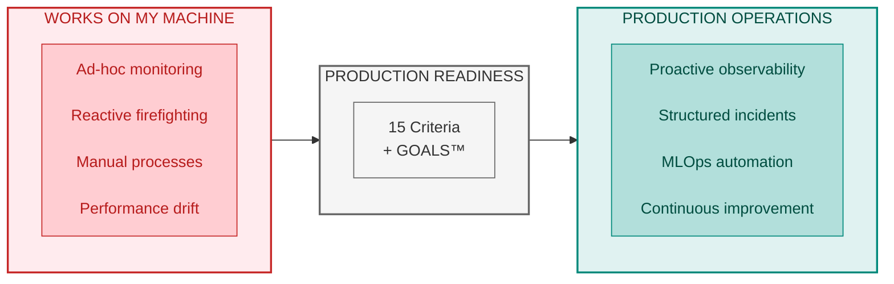
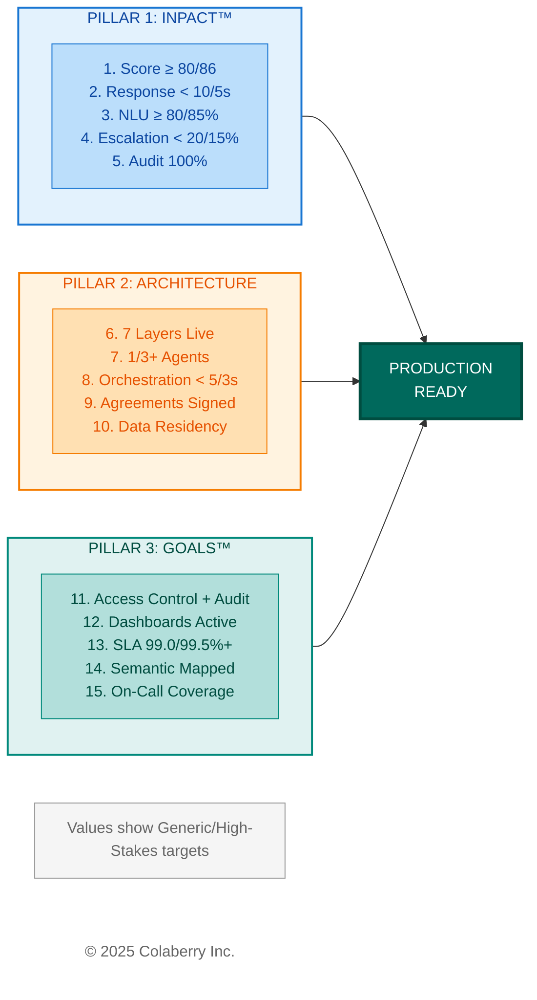
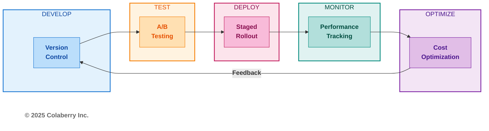
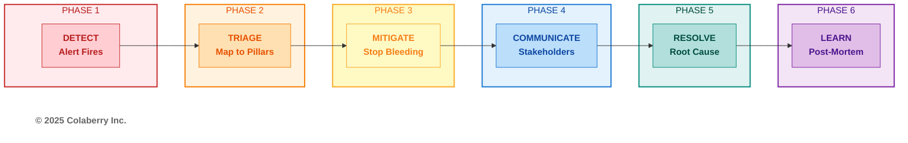
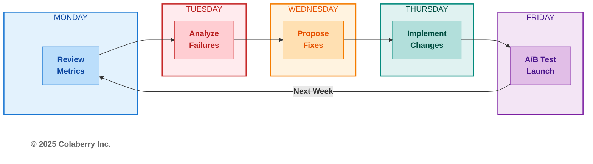
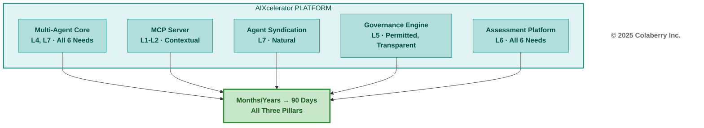

# Chapter 12: Running Agents at Scale

**The Operations Chapter**

---

*About a year ago.*

*Friday, 4:47 PM, Week 10.*

*Echo Health Systems, Sarah's Office.*

"What's the worst thing that can happen Monday morning?"

Marcus didn't hesitate. "LLM provider goes down. Agents start hallucinating. A nurse gets bad information about a patient's medication."

Sarah nodded. They'd spent 10 weeks building the architecture. Seven layers. Three agents. Eighty-six on the INPACT™ scale. All the checkboxes checked.

But checkboxes don't answer phones at 2 AM.

"Show me the runbook," Sarah said. "The one for when everything breaks at once."

Marcus pulled up a document. It was three pages long. By Monday morning, it would be twelve.

---

**Figure 12.1: Operations Value (From Reactive to Proactive)**



> **Key Takeaway:** Building is easy. Operating at scale requires systematic discipline.

---

*You've built the architecture. All seven layers operational. Three agents validated. Now comes the harder part: keeping it running at scale. This chapter transforms you from architect to operator. Fifteen readiness criteria to validate, MLOps practices to master, incidents to handle, and continuous improvement cycles that can drive 3-5% accuracy gains in the first month. The Architecture of Trust is built. Now learn to sustain it.*

---


## Part 1: Production Readiness

### 1.1 The Production Readiness Decision

You've completed the hardest part. Chapters 4-6 built the architecture layer by layer. Chapter 10 executed the 90-day roadmap. Chapter 11 selected technologies for each layer. Your INPACT™ score has climbed from wherever you started toward the threshold that signals agent-readiness: typically 80+ for standard enterprise deployments, 86+ for high-stakes environments.

But building isn't operating. The gap between "architecture complete" and "production ready" has derailed more agent initiatives than infrastructure gaps ever did. Organizations celebrate Week 10 architecture milestones only to stumble in Week 11 pilots. The Architecture of Trust needs operational discipline to deliver sustained value.

This chapter completes your journey with five operational components:

**Part 1: Production Readiness.** Fifteen criteria that separate "ready for production" from "ready for failure." Validate all 15 before your pilot launch.

**Part 2: MLOps for Agents.** Model versioning, A/B testing, prompt management, and cost optimization practices adapted from traditional ML operations to agentic systems.

**Part 3: Monitoring and Incident Response.** SLA definitions, alerting strategy, incident triage, and post-mortem processes. When things break (and they will), your response determines whether users lose trust or gain confidence.

**Part 4: Continuous Improvement.** Weekly improvement cycles that can drive 3-5% accuracy gains in the first month. The Architecture of Trust isn't static. It improves continuously.

**Part 5: AIXcelerator Platform.** For organizations seeking a proven path, how Colaberry's platform makes the 90-day transformation achievable while maintaining all three pillars.

Let's begin with the question every organization faces at Week 10: are you actually ready?

---

### 1.2 The 15-Criteria Production Readiness Checklist

Production readiness isn't a feeling. It's a measurable state. Validate against 15 specific criteria organized around the Architecture of Trust's three pillars. Each criterion has a clear target, measurement method, and evidence requirement.

Throughout this chapter, reference benchmarks are drawn from Echo Health Systems, the pedagogical case study used in this book. Adjust these numbers based on your industry, use case, and risk tolerance. Part 6 consolidates Echo's complete results for easy reference.

**Figure 12.2: The 15-Criteria Production Readiness Framework**



**Pillar 1: INPACT™ Readiness (5 Criteria)**

| # | Criterion | INPACT™ Need | How to Measure | Generic Target | High-Stakes Target |
|---|-----------|--------------|----------------|----------------|-------------------|
| 1 | INPACT™ Score | All 6 | Chapter 9 assessment | ≥80/100 | ≥86/100 |
| 2 | Response Time | I (Instant) | Load testing, APM traces | <10s P95 | <5s P95 |
| 3 | NLU Accuracy | N (Natural) | Validation set testing | ≥80% | ≥85% |
| 4 | HITL Escalation | P (Permitted) | Governance logs | <20% | <15% |
| 5 | Audit Coverage | T (Transparent) | Audit log validation | 100% | 100% |

**Choosing Your Targets:**
- **Generic targets** suit most enterprise deployments where agent errors cause inconvenience but not significant harm
- **High-stakes targets** apply to regulated industries, safety-critical systems, and environments where errors have serious consequences

Criterion 3 often sparks debate. If you're near threshold with a clear improvement trajectory, launching with aggressive monitoring may be safer than delaying indefinitely. The key: have weekly improvement cycles ready to close the gap.

---

**Pillar 2: Architecture Readiness (5 Criteria)**

| # | Criterion | Layers | How to Measure | Generic Target | High-Stakes Target |
|---|-----------|--------|----------------|----------------|-------------------|
| 6 | All 7 Layers Operational | L1-L7 | Layer health checks | All functional | All functional + redundancy |
| 7 | Agents Validated | L7 | UAT completion | ≥1 agent | ≥3 agents |
| 8 | Multi-Agent Orchestration | L7 | Coordination testing | <5s latency | <3s latency |
| 9 | Vendor Agreements Signed | All | Contract audit | 100% | 100% + compliance addenda |
| 10 | Data Residency Confirmed | L1-L2 | Cloud region audit | Documented | Per regulatory requirements |

Architecture criteria are typically pass/fail. If you've followed the 90-day roadmap, these should pass cleanly. High-stakes environments may require additional compliance documentation for Criterion 9 (such as BAAs, SOC 2 attestations, or PCI-DSS certifications depending on your industry).

---

**Pillar 3: GOALS™ Readiness (5 Criteria)**

| # | Criterion | GOALS™ | How to Measure | Generic Target | High-Stakes Target |
|---|-----------|--------|----------------|----------------|-------------------|
| 11 | Access Control + Audit | G (Governance) | Policy testing | <50ms eval | <10ms eval |
| 12 | Dashboards Active | O (Observability) | Dashboard review | Near real-time | Real-time |
| 13 | SLA Achievable | A (Availability) | Availability testing | 99.0% uptime | 99.5%+ uptime |
| 14 | Semantic Layer Mapped | L (Language) | Term coverage audit | Core terms | Comprehensive |
| 15 | On-Call Coverage | S (Solid) | Schedule review | Business hours | 24/7 coverage |

Criterion 15 is often the last to complete. For organizations not requiring 24/7 coverage, business-hours support with automated alerting may suffice initially. Finding engineers willing to carry pagers may require negotiation. Consider on-call bonuses, or leverage distributed teams across time zones to provide follow-the-sun coverage without requiring overnight shifts.

---

**Scoring Interpretation**

| Score | Interpretation | Recommendation |
|-------|----------------|----------------|
| 15/15 | Production ready | Launch pilot |
| 12-14 | Pilot ready | Controlled rollout with gaps documented |
| 9-11 | Not ready | 2-4 more weeks of remediation |
| <9 | Significant gaps | Continue building, reassess |

Aim for 15/15, but recognize that some criteria may require judgment calls rather than clean passes.

---

### 1.3 Operational Monitoring Essentials

Production operations require ongoing monitoring across all three pillars. Here's what to track:

**INPACT™ Operational Metrics**

| Dimension | What to Monitor | Generic Target | High-Stakes Target | Check Frequency |
|-----------|-----------------|----------------|-------------------|-----------------|
| I (Instant) | P95 response time | <10s | <5s | Real-time |
| N (Natural) | NLU accuracy rate | ≥80% weekly avg | ≥85% weekly avg | Daily |
| P (Permitted) | HITL escalation rate | <20% | <15% | Daily |
| A (Adaptive) | Model drift score | <15% deviation | <10% deviation | Weekly |
| C (Contextual) | Context retrieval success | ≥85% | ≥90% | Daily |
| T (Transparent) | Audit log completeness | 100% | 100% | Real-time |

Select targets based on your industry requirements and risk tolerance. High-stakes environments should use the stricter targets.

**GOALS™ Operational Metrics**

| Dimension | What to Monitor | Generic Target | High-Stakes Target | Check Frequency |
|-----------|-----------------|----------------|-------------------|-----------------|
| G (Governance) | Policy evaluation latency | <50ms | <10ms | Real-time |
| O (Observability) | Dashboard availability | ≥99.0% | ≥99.9% | Real-time |
| A (Availability) | System uptime | ≥99.0% | ≥99.5% | Real-time |
| L (Language) | Terminology match rate | ≥90% | ≥95% | Weekly |
| S (Solid) | On-call response time | <15min for P1 | <5min for P1 | Per incident |

**Layer Health Checks**

| Layer | Health Check | Frequency |
|-------|--------------|-----------|
| L1: Storage | Connection pool, query latency | Every 5 min |
| L2: Data Fabric | CDC lag, sync status | Every 1 min |
| L3: Semantic | Embedding freshness, term coverage | Daily |
| L4: Intelligence | LLM API latency, token usage | Real-time |
| L5: Governance | Policy sync, ABAC evaluation | Every 5 min |
| L6: Observability | Log ingestion, dashboard load | Every 1 min |
| L7: Orchestration | Agent handoff latency, queue depth | Real-time |

*For detailed scoring methodology, see Chapter 9. For team responsibilities by layer, see Chapter 10.*

---

### 1.4 Go-Live Planning

Production readiness enables launch, but it doesn't guarantee success. Phased rollout reduces risk by expanding gradually based on demonstrated success.

**Phase 1: Internal Pilot (Week 11)**

| Dimension | Guidance | Generic Target | High-Stakes Target |
|-----------|----------|----------------|-------------------|
| Users | Start small with friendly users who provide feedback | 25-50 users | 50-100 users |
| Duration | Minimum observation period | 1 week | 2 weeks |
| Monitoring | Intensive: catch issues early | Daily reviews | Hourly reviews |
| Success Criteria | High task completion rate | ≥85% | ≥90% |
| HITL Threshold | Lower than production target | <15% escalation | <10% escalation |
| Decision Gate | Proceed only if criteria met | All green to advance | All green to advance |

Phase 1 validates with friendly users who provide detailed feedback. Intensive monitoring catches issues before they propagate. Success at Phase 1 builds confidence for expansion.

**Phase 2: Department Pilot (Week 12)**

| Dimension | Guidance | Generic Target | High-Stakes Target |
|-----------|----------|----------------|-------------------|
| Users | Expand to full department or team | 50-100 users | 100-200 users |
| Duration | Minimum observation period | 1 week | 1-2 weeks |
| Monitoring | Shift to sustainable cadence | Weekly reviews | Daily reviews |
| Success Criteria | Slightly relaxed from Phase 1 | ≥80% | ≥85% |
| HITL Threshold | Closer to production target | <18% escalation | <12% escalation |
| Decision Gate | Proceed only if criteria met | All green to advance | All green to advance |

Phase 2 tests at department scale with diverse users and workflows. Sustainable monitoring balances vigilance with operational efficiency. Success at Phase 2 proves scalability.

**Phase 3: Full Production (Week 13+)**

| Dimension | Guidance | Generic Target | High-Stakes Target |
|-----------|----------|----------------|-------------------|
| Users | All target users | Full rollout | Full rollout |
| Duration | Ongoing | Continuous | Continuous |
| Monitoring | Steady-state cadence | Monthly reviews | Weekly reviews |
| Success Criteria | Production target | ≥75% | ≥80% |
| HITL Threshold | Production target | <20% escalation | <15% escalation |
| Decision Gate | Rollback if thresholds breached | SLA review monthly | SLA review weekly |

Phase 3 is steady-state operations with continuous improvement cycles replacing intensive monitoring. The decision gate shifts from "proceed to next phase" to "maintain or rollback." If metrics breach thresholds, trigger incident response.

---

### 1.5 The Go/No-Go Decision

The 15-criteria checklist provides data. The go/no-go meeting interprets it. These questions determine whether your organization is ready:

**Domain Risk**
- What happens if an agent gives a bad recommendation in your context?
- Can your HITL workflows catch high-risk decisions before they cause harm?
- Does your team have capacity to handle the projected escalation rate?

**Business Risk**
- What's the cost of waiting another month?
- What competitive pressure exists?
- Will stakeholder confidence survive another delay?

**Operational Risk**
- Have you tested scenarios that aren't in the checklist?
- Do you have rollback procedures documented and tested?
- Is your on-call team ready for the first 48 hours?

**The Question Nobody Asks Out Loud**
- What happens to this initiative if you launch and it fails?

The answer isn't "don't launch." The answer is "launch small." Fifty users, not five hundred. Hourly monitoring, not daily. Weekly steering committee, not monthly.

A controlled pilot limits blast radius while generating real-world data no staging environment can provide.

---

## Part 2: MLOps for Agents

Traditional MLOps practices (model versioning, A/B testing, performance monitoring) require adaptation for agentic systems. Agents combine multiple models, orchestration logic, and prompt configurations that evolve together. This section provides practical MLOps patterns for agentic systems.

**Figure 12.3: Agent MLOps Lifecycle**



---

### 2.1 Model Versioning

Agent systems have more versioned components than traditional ML: base LLMs, embedding models, prompts, orchestration logic, and retrieval configurations all change independently. Without disciplined versioning, debugging production issues becomes impossible.

**Semantic Versioning for Agents**

Adopt semantic versioning (MAJOR.MINOR.PATCH) with agent-specific interpretations:

| Version Component | Agent Interpretation | Example Change |
|-------------------|---------------------|----------------|
| **MAJOR** | Breaking changes requiring user retraining | New agent capabilities, response format changes |
| **MINOR** | New features, backward-compatible | Additional data sources, improved accuracy |
| **PATCH** | Bug fixes, prompt refinements | Typo corrections, edge case handling |

**Example progression:** v1.0.0 → v1.0.1 (prompt fix) → v1.1.0 (new retrieval source) → v2.0.0 (multi-agent orchestration)

**What to Version**

Every configuration affecting agent behavior requires version control:

| Component | Version Control Method | Update Frequency |
|-----------|----------------------|------------------|
| System prompts | Git repository | Weekly |
| Few-shot examples | Git repository | Weekly |
| Orchestration logic | Git repository | Monthly |
| Retrieval configurations | Git repository | Monthly |
| Base LLM version | Configuration file | Quarterly |
| Embedding model | Configuration file | Quarterly |

**Recommended Repository Structure**

Maintain a `prompts/` repository with versioned folders per agent (e.g., `scheduling/v1.0.0/`, `support_docs/v1.1.0/`). Each version folder contains system.md, few_shot.json, and config.yaml. Every production change should require pull request, code review, and staging validation before deployment.

**Tools**

| Tool | Purpose | Recommendation |
|------|---------|----------------|
| LangSmith | Prompt versioning, tracing | Primary |
| Git | Source control for all configs | Required |
| PromptLayer | Prompt analytics | Optional |

---

### 2.2 A/B Testing

Agent improvements require validation against real user behavior. A/B testing compares new versions (challengers) against existing versions (champions) using actual production traffic.

**Champion vs. Challenger Framework**

| Element | Specification |
|---------|---------------|
| Traffic split | 50/50 between versions |
| Duration | Minimum 1 week (statistical significance) |
| Metrics | All INPACT™ dimensions + user satisfaction |
| Rollback | Automatic if challenger shows >5% regression |

**Metrics to Track**

Every A/B test should measure impact across the Architecture of Trust:

| Pillar | Metrics | Threshold for Winner |
|--------|---------|---------------------|
| INPACT™ | Accuracy, latency, escalation rate | >2% improvement |
| GOALS™ | SLA compliance, error rate | No regression |
| User | Satisfaction score, task completion | >5% improvement |

**Example A/B Test**

A prompt refinement test (v1.1 vs v1.2) for a scheduling agent:

| Metric | v1.1 (Champion) | v1.2 (Challenger) | Result |
|--------|-----------------|-------------------|--------|
| Accuracy | 85% | 87% | ✅ +2% |
| P95 Latency | 3.2s | 3.1s | Tie |
| HITL Rate | 9% | 8% | ✅ -1% |
| Citations/Query | 2.1 avg | 2.8 avg | ✅ +33% |
| User Satisfaction | 4.2/5 | 4.4/5 | ✅ +5% |

**Decision:** Promote v1.2 to champion. The accuracy and citation improvements justified the change, with no regression on latency or operational metrics.

**A/B Testing Pitfalls**

| Pitfall | Consequence | Prevention |
|---------|-------------|------------|
| Insufficient duration | False positives | Minimum 1 week, 1,000+ queries |
| Ignoring user segments | Hidden regressions | Segment analysis by role, shift |
| Single metric focus | Unbalanced optimization | Track all INPACT™ dimensions |
| No rollback plan | Extended exposure to bugs | Automatic rollback triggers |

---

### 2.3 Prompt Management

Prompts are the primary interface between business intent and agent behavior. Effective prompt management requires the same discipline as code management: version control, testing, review, and deployment processes.

**Best Practices**

**1. Version Control Your Prompts**

Prompts require version control with history tracking, diff capabilities, and review workflows. Many specialized prompt management tools exist (LangSmith, PromptLayer, Humanloop, Phoenix, Agno, and others) alongside traditional Git-based approaches. Tool selection is beyond the scope of this book, but the principle is universal: treat prompts with the same rigor as production code.

**2. Template with Variables**

Separate static instructions from dynamic context:

| Variable Type | Example | Update Frequency |
|---------------|---------|------------------|
| Static | Core instructions, constraints | Monthly |
| Session | User context, conversation history | Per query |
| Dynamic | Resource availability, current date | Real-time |

**3. Automated Testing**

Every prompt change triggers validation against test suites:

| Test Type | Purpose | Reference Benchmark |
|-----------|---------|---------------------|
| Regression | Ensure existing capabilities work | 200 golden queries |
| Edge cases | Validate boundary handling | 50 edge case queries |
| Safety | Confirm guardrails hold | 30 adversarial queries |

**4. Two-Person Review**

All prompt changes require review before deployment:

| Change Type | Review Requirement |
|-------------|-------------------|
| PATCH | 1 reviewer |
| MINOR | 2 reviewers |
| MAJOR | 2 reviewers + domain expert sign-off |

**Recommended Prompt Pipeline**

The pipeline flows from developer change → automated tests (regression, edge, safety) → pull request → peer review → staging deployment → A/B test (1 week minimum) → production promotion. This catches problematic prompt changes before they reach production.

---

### 2.4 Cost Optimization

LLM costs accumulate quickly at production scale. Without optimization, a system processing 50,000 daily queries can face monthly bills exceeding $100,000. Four strategies can reduce per-query cost by 60-70%.

**Strategy 1: Semantic Caching**

Cache responses for semantically similar queries:

| Metric | Before Caching | After Caching |
|--------|----------------|---------------|
| Cache hit rate | 0% | 65% |
| Avg. queries hitting LLM | 50,000/day | 17,500/day |
| Daily LLM cost | ~$6,000 | ~$2,100 |

**Implementation:** Redis with vector similarity matching. Queries within cosine similarity threshold (0.95) return cached responses instead of calling LLM.

**Strategy 2: Prompt Compression**

Reduce token count without sacrificing quality:

| Technique | Token Reduction | Quality Impact |
|-----------|-----------------|----------------|
| Remove redundant instructions | 15-20% | None |
| Use abbreviations in system prompts | 10-15% | None |
| Compress few-shot examples | 20-30% | Minimal |

**Reference benchmark:** Average prompt reduced from 3,200 to 1,800 tokens (44% reduction) with no measurable accuracy impact.

**Strategy 3: Model Routing**

Use cheaper models for simpler queries:

| Query Complexity | Model | Cost/1K tokens |
|------------------|-------|----------------|
| Simple queries | GPT-4o-mini | $0.15 |
| Standard queries | GPT-4o | $2.50 |
| Complex reasoning | GPT-4o | $2.50 |

**Reference traffic distribution:**
- 70% routed to GPT-4o-mini (simple queries)
- 30% routed to GPT-4o (complex queries)
- Blended cost: 70% cheaper than GPT-4o-only

**Strategy 4: Batch Processing**

Aggregate non-urgent queries for batch API pricing:

| Processing Mode | Use Case | Cost Savings |
|-----------------|----------|--------------|
| Real-time | User-facing queries | Baseline |
| Batch | Report generation, analytics | 50% discount |

**Reference benchmark:** 20% of queries (scheduled reports, daily summaries) processed in batch mode.

**Combined Result**

| Metric | Before Optimization | After Optimization |
|--------|--------------------|--------------------|
| Cost per query | $0.12 | $0.04 |
| Monthly LLM spend | ~$180K | ~$60K |
| Annual savings | n/a | **$1.44M** |

Your results will vary based on query volume, complexity distribution, and caching effectiveness. Review cost metrics weekly to identify new optimization opportunities as usage patterns evolve.

---

---

## Part 3: Monitoring & Incident Response

Production agents will fail. Databases go down. LLM APIs timeout. Policies misconfigure. The question isn't whether incidents occur. It's how quickly you detect, respond, and recover. This section establishes monitoring foundations and incident response processes for production operations.

---

### 3.1 SLA Definition

Service Level Agreements define your commitments to users. Without explicit SLAs, expectations drift and accountability disappears. Define SLAs across all three pillars:

**Three-Pillar SLA Framework**

| SLA | Target | INPACT™ | GOALS™ | Measurement |
|-----|--------|---------|--------|-------------|
| Availability | 99.5% uptime | I | A | Monthly uptime calculation |
| Performance | <5s P95 response | I | A | APM percentile tracking |
| Accuracy | >85% correct responses | N | S | Weekly validation testing |
| HITL Rate | <10% escalation | P | G | Daily escalation tracking |
| Audit Coverage | 100% | T | G | Real-time audit verification |

**SLA Tiers by Agent Type**

Not all agents require the same SLAs. Classify by user impact and error consequences:

| Agent Type | Availability | Performance | Accuracy | When to Use |
|------------|--------------|-------------|----------|-------------|
| Tier 1: Critical | 99.9% | <3s P95 | >90% | External-facing, revenue-impacting, safety-related |
| Tier 2: Standard | 99.5% | <5s P95 | >85% | Internal user-facing, operational decisions |
| Tier 3: Basic | 99.0% | <10s P95 | >80% | Administrative, back-office, non-urgent |

Classify your agents by user impact. An external-facing agent typically warrants Tier 1, while an internal documentation assistant may use Tier 3.

**SLA Breach Consequences**

Define what happens when SLAs are missed:

| Severity | Threshold | Response | Escalation |
|----------|-----------|----------|------------|
| Warning | 1 breach/week | Team review | None |
| Minor | 3 breaches/week | Root cause analysis | Engineering lead |
| Major | SLA < 95% for day | War room | VP Engineering |
| Critical | SLA < 90% for hour | All-hands | Executive team |

---

### 3.2 Alert Strategy

Effective alerting balances sensitivity with noise. Too few alerts miss problems; too many cause alert fatigue. Structure alerts by priority based on user impact:

**Four-Tier Alert Priority**

| Priority | Impact | Response Time | Example |
|----------|--------|---------------|---------|
| P0 | All agents down, data breach | <5 minutes | LLM API complete failure |
| P1 | Major INPACT™ degradation | <30 minutes | Accuracy below 80% |
| P2 | Single layer or agent affected | <4 hours | CDC lag exceeding 5 minutes |
| P3 | No immediate user impact | Next business day | Non-critical log errors |

**Alert Configuration by Pillar**

**INPACT™ Alerts:**

| Need | P1 Threshold | P2 Threshold | P3 Threshold |
|------|--------------|--------------|--------------|
| I (Instant) | P95 > 10s | P95 > 7s | P95 > 5s |
| N (Natural) | Accuracy < 80% | Accuracy < 83% | Accuracy < 85% |
| P (Permitted) | HITL > 20% | HITL > 15% | HITL > 12% |
| A (Adaptive) | Feedback stale > 1 month | Stale > 2 weeks | Stale > 1 week |
| C (Contextual) | CDC lag > 10 min | Lag > 5 min | Lag > 2 min |
| T (Transparent) | Audit gap detected | Coverage < 99% | Any audit error |

**Architecture Alerts:**

| Layer | P1 Trigger | P2 Trigger |
|-------|------------|------------|
| L1 Storage | Query timeout > 30s | Latency > 5x baseline |
| L2 Real-Time | CDC complete failure | Lag > 5x threshold |
| L3 Semantic | Disambiguation failure > 50% | Failure > 20% |
| L4 Intelligence | LLM API down | Retrieval precision < 80% |
| L5 Governance | ABAC evaluation failure | Policy load error |
| L6 Observability | Trace collection stopped | Dashboard data stale |
| L7 Orchestration | Agent coordination failure | Handoff latency > 5s |

**GOALS™ Alerts:**

| Dimension | P1 Trigger | P2 Trigger |
|-----------|------------|------------|
| G (Governance) | Unauthorized access detected | Policy violation rate > 5% |
| O (Observability) | Blind spot in monitoring | Alert coverage < 90% |
| A (Availability) | Availability < 99% | Availability < 99.5% |
| L (Language) | Semantic layer down | Term resolution failure > 10% |
| S (Solid) | Data corruption detected | Quality score drop > 10% |

**Reference Benchmark: Alert Results**

| Priority | Alerts Triggered | False Positives | MTTR |
|----------|------------------|-----------------|------|
| P0 | 0 | 0 | N/A |
| P1 | 2 | 0 | 18 minutes |
| P2 | 8 | 2 | 2.1 hours |
| P3 | 34 | 12 | Next day |

Your alert volume will vary based on system maturity and threshold configuration. Aim for zero P0s, minimal P1s, and low false positive rates at P2-P3.

---

### 3.3 Incident Response

When alerts fire, structured response prevents chaos. Adopt a six-phase incident response process mapped to the Architecture of Trust:

**Figure 12.4: Six-Phase Incident Response**



**Phase 1: DETECT**

Automated monitoring triggers alert. On-call engineer acknowledges within response time SLA.

| Action | Owner | Timeline |
|--------|-------|----------|
| Alert fires | System | Immediate |
| Acknowledge | On-call | <5 min (P0-P1), <15 min (P2) |
| Initial assessment | On-call | +5 minutes |

**Phase 2: TRIAGE**

Map incident to affected pillars and layers:

| Question | Purpose |
|----------|---------|
| Which INPACT™ needs affected? | Scope user impact |
| Which layers involved? | Identify root cause area |
| Which GOALS™ dimensions degraded? | Assess operational impact |

**Three-Pillar Incident Mapping**

| Incident Type | INPACT™ | Layer | GOALS™ | Initial Response |
|---------------|---------|-------|--------|------------------|
| LLM API outage | I, N | L4 | A | Failover to backup |
| Database failure | I, C | L1-L2 | A, S | Promote replica |
| ABAC misconfiguration | P | L5 | G | Rollback policy |
| Semantic drift | N | L3 | L | Update terminology |
| Audit gap | T | L6 | G, O | Fix logging pipeline |
| Agent conflict | C | L7 | S | Restart orchestrator |

**Phase 3: MITIGATE**

Stop the bleeding before fixing root cause:

| Mitigation | When to Use | Trade-off |
|------------|-------------|-----------|
| Failover | Primary system down | May have reduced capacity |
| Rollback | Bad deployment | Lose new features |
| Feature flag | Single feature broken | Partial functionality |
| Throttle | Overload | Reduced throughput |
| HITL override | Agent misbehaving | Higher manual load |

**Phase 4: COMMUNICATE**

Keep stakeholders informed throughout:

| Audience | Update Frequency | Channel |
|----------|-----------------|---------|
| Technical team | Real-time | Slack war room |
| Leadership | Every 30 min (P0-P1) | Email/text |
| Users | At start, resolution | In-app banner |
| External (if required) | Per compliance | Official channels |

**Phase 5: RESOLVE**

Fix the root cause, not just symptoms:

| Action | Verification |
|--------|--------------|
| Implement fix | Code review if applicable |
| Test in staging | Reproduce original issue |
| Deploy to production | Gradual rollout |
| Confirm resolution | Metrics return to baseline |
| Close incident | All SLAs restored |

**Phase 6: POST-MORTEM**

Learn from every significant incident (P0-P1 mandatory, P2 recommended).

---

### 3.4 Post-Mortem Process

Post-mortems prevent repeat incidents. Conduct post-mortems within 48 hours of P0-P1 incidents using a three-pillar template:

**Three-Pillar Post-Mortem Template**

**1. Summary**
- Incident description (1-2 sentences)
- Duration (detection to resolution)
- Pillars affected: INPACT™ [which], Layers [which], GOALS™ [which]

**2. Timeline**
- Detection time and method
- Key response actions with timestamps
- Resolution time and verification

**3. Three-Pillar Impact Assessment**

| Pillar | Impact | Metrics |
|--------|--------|---------|
| INPACT™ | Which needs degraded, by how much | Accuracy dropped to X%, latency increased to Y |
| Architecture | Which layers failed | L4 offline for 18 minutes |
| GOALS™ | Operational impact | Availability at 99.2% for incident period |

**4. Root Cause Analysis**

| Question | Answer |
|----------|--------|
| What failed? | [Technical description] |
| Why did it fail? | [Contributing factors] |
| Why wasn't it caught earlier? | [Detection gaps] |
| What layer owns this component? | [Clear ownership] |

**5. Action Items**

| Action | Owner | Due Date | Status |
|--------|-------|----------|--------|
| [Specific remediation] | [Name] | [Date] | Open |
| [Detection improvement] | [Name] | [Date] | Open |
| [Process change] | [Name] | [Date] | Open |

**Example P1 Post-Mortem**

**Summary:** LLM API degradation caused 18-minute accuracy drop to 72%. Pillars affected: INPACT™ (I, N), Layer 4, GOALS™ (A, S).

**Root Cause:** LLM provider experienced regional degradation. Backup region not configured for automatic failover.

**Key Actions:** Configure automatic failover, add health check probes, document manual failover procedure.

**Result:** Second LLM incident (3 weeks later) detected in 2 minutes, failed over automatically, zero user impact.

---

## Part 4: Continuous Improvement

The Architecture of Trust isn't a destination. It's a foundation for continuous improvement. Your INPACT™ score shouldn't stop at 86/100. Through systematic weekly improvement cycles, organizations can achieve 3-5% accuracy gains in the first month. This section provides the processes that drive ongoing improvement.

---

### 4.1 Weekly Improvement Cycle

Structured weekly cycles transform operational data into agent improvements. A five-day pattern can yield consistent 1-2% weekly accuracy gains.

**Figure 12.5: Five-Day Improvement Cycle**



**The Five-Day Cycle**

| Day | Activity | INPACT™ Focus | Layer Focus | GOALS™ Focus |
|-----|----------|---------------|-------------|--------------|
| Monday | Review metrics | All 6 dimensions | Health checks | O (Observability) |
| Tuesday | Analyze failures | N (Natural) | L3-L4 | S (Solid) |
| Wednesday | Propose fixes | Dimension needing most improvement | Targeted layer | L (Language) |
| Thursday | Implement changes | Validate fix | Deploy to staging | G (Governance) |
| Friday | A/B test launch | Compare versions | Monitor | All |

**Key Activities by Day:**
- **Monday:** Review INPACT™ scores, error logs, user feedback, cost metrics
- **Tuesday:** Cluster failures, categorize by root cause, map to layers, estimate complexity
- **Wednesday:** Propose fixes (prompt refinement, few-shot additions, retrieval tuning, semantic updates)
- **Thursday:** Implement with appropriate review (1-2 reviewers based on change type)
- **Friday:** Deploy A/B test with 50/50 traffic split, 1-week minimum duration, rollback if >5% regression

**Reference Benchmark: Weekly Results**

| Week | Starting Accuracy | Improvement | Ending Accuracy |
|------|-------------------|-------------|-----------------|
| Week 11 | 85.0% | +0.8% | 85.8% |
| Week 12 | 85.8% | +0.9% | 86.7% |
| Week 13 | 86.7% | +0.5% | 87.2% |
| Week 14 | 87.2% | +0.4% | 87.6% |
| Week 15 | 87.6% | +0.4% | 88.0% |

Compound improvements of 3-5% over five weeks translate to thousands of better user interactions. Your results will vary based on starting accuracy and optimization opportunities.

---

### 4.2 Feedback Loop Automation

Manual feedback analysis doesn't scale. Automate feedback collection, aggregation, and integration to maintain improvement velocity as volume grows.

**Feedback Pipeline**

```
User interactions (L7)
    ↓
Quality signals captured (L5-L6)
    ↓
Feedback aggregated (Monday)
    ↓
Training data updated (L4)
    ↓
Model/prompt evaluated
    ↓
Improvements deployed
    ↓
Metrics monitored
```

**Feedback Signal Types**

| Signal | Source | Weight | Automation |
|--------|--------|--------|------------|
| Explicit thumbs up/down | User interface | High | Fully automated |
| HITL corrections | Governance layer | High | Fully automated |
| Query reformulations | Session analysis | Medium | Semi-automated |
| Abandonment | Session analysis | Medium | Fully automated |
| Escalation patterns | Support tickets | Low | Manual review |

**From Feedback to Improvement**

**Example Improvement Cycle:**
- 127 actionable feedback items identified
- 89 mapped to prompt improvements
- 23 mapped to retrieval tuning
- 15 required semantic layer updates
- Changes deployed in following week's A/B tests
- Result: 2% accuracy improvement

---

### 4.3 Drift Detection

Agent performance degrades over time. Data distributions shift. User expectations evolve. Model capabilities change. Systematic drift detection catches degradation before users notice.

**Three-Pillar Drift Types**

| Pillar | Drift Type | Detection Method | Prevention |
|--------|-----------|------------------|------------|
| INPACT™ | Accuracy drift | Weekly validation testing | Monthly retraining |
| Architecture | Performance drift | Daily metrics baselines | Auto-scaling, alerts |
| GOALS™ | Operational drift | Weekly score tracking | Monthly audit |

**INPACT™ Drift Detection**

| Dimension | Baseline | Warning | Action Trigger |
|-----------|----------|---------|----------------|
| I (Instant) | P95 established at launch | +20% from baseline | +50% from baseline |
| N (Natural) | Accuracy at launch | -2% from baseline | -5% from baseline |
| P (Permitted) | HITL rate at launch | +3% from baseline | +5% from baseline |
| A (Adaptive) | Feedback integration time | +50% from baseline | +100% from baseline |
| C (Contextual) | CDC lag at launch | +50% from baseline | +100% from baseline |
| T (Transparent) | Audit coverage | Any gap | Persistent gap |

**Example Drift Response**

Drift detection identified declining retrieval precision (78% → 74% over two weeks). Root cause: new document formats introduced by a source system upgrade not reflected in the chunking strategy.

Response:
- Tuesday: Identified drift pattern
- Wednesday: Diagnosed format changes
- Thursday: Updated chunking configuration
- Friday: Deployed fix in A/B test
- Following week: Precision restored to 79%

Early detection prevented user-visible degradation. At Echo Health Systems, this same pattern occurred when their EHR system introduced new documentation templates. The universal response process applied regardless of the specific source system.

---

## Part 5: AIXcelerator Platform

For organizations seeking to accelerate their journey, Colaberry's AIXcelerator platform provides pre-built components validated across multiple enterprise deployments. This section explains what AIXcelerator offers, how it reduces implementation time, and how to access it.

---

### 5.1 What is AIXcelerator?

AIXcelerator is a complete platform that accelerates agent infrastructure deployment while maintaining all three pillars of the Architecture of Trust. Rather than building every component from scratch, organizations use production-validated modules.

**Figure 12.6: AIXcelerator Five-Component Platform**



**Five Core Components**

| Component | INPACT™ Coverage | Layers Addressed | Key Benefit |
|-----------|------------------|-----------------|-------------|
| Multi-Agent Core | All 6 needs | L4, L7 | Production-validated orchestration |
| MCP Server | C (Contextual) | L1-L2 |  Pre-built connectors |
| Agent Syndication Hub | N (Natural) | L7 | Reusable agent patterns |
| Governance Engine | P, T | L5 | Compliance-ready from day one |
| Assessment Platform | All 6 | L6 | Continuous INPACT™ measurement |

**Multi-Agent Core**

Pre-built orchestration framework with:
- LangGraph-based supervisor patterns
- Configurable agent definitions
- Built-in HITL workflows
- Production-validated handoff logic

**MCP Server (Model Context Protocol)**

Standardized data connectivity:
- Pre-built connectors for 50+ enterprise systems
- Industry-specific connectors (EHR, ERP, CRM, core banking, e-commerce platforms)
- CDC pipeline templates
- Real-time data fabric patterns

**Agent Syndication Hub**

Reusable agent marketplace:
- Pre-trained domain agents (scheduling, documentation, etc.)
- Customization framework
- Version management
- Multi-tenant deployment

**Governance Engine**

Enterprise-grade access control:
- ABAC policy templates
- Compliance-ready audit trails
- HITL workflow builder
- Compliance reporting

**Assessment Platform**

Continuous measurement:
- Automated INPACT™ scoring
- Real-time GOALS™ dashboards
- Drift detection
- Improvement recommendations

---


### 5.2 How to Access AIXcelerator

Three paths to evaluate and adopt AIXcelerator:

**Option 1: Self-Assessment**

Start with free INPACT™ assessment:
- 30-minute online assessment
- Automated scoring and gap analysis
- Personalized recommendations
- No commitment required

**Option 2: Consultation**

Schedule expert consultation:
- Review your specific requirements
- Architecture recommendation
- Implementation roadmap
- Pricing discussion

**Option 3: 4-Week Pilot**

Hands-on validation:
- Deploy AIXcelerator in your environment
- Build one production agent
- Validate against your requirements
- Investment: $50K (credited toward subscription)

**Subscription Tiers**

**Access:** Visit aiXcelerator.ai or contact Colaberry for consultation.

---

## Part 6: Echo Health Systems Results

Echo Health Systems is a pedagogical case study used throughout this book to illustrate the Architecture of Trust in practice. While fictional, Echo's metrics reflect realistic outcomes based on Colaberry's production deployments.

**How to Use These Benchmarks:**

Echo represents a high-stakes deployment with stringent requirements. Your targets may differ based on your industry, use case, and risk tolerance. Use Echo's metrics as:
- **Reference points** for what's achievable with disciplined execution
- **Upper-bound targets** if you operate in a similarly regulated environment
- **Validation benchmarks** to compare your own progress

This section consolidates Echo's results for easy reference.

**Production Readiness (Week 10)**

| Criterion Category | Result |
|-------------------|--------|
| INPACT™ Criteria (5) | 5/5 passed |
| Architecture Criteria (5) | 5/5 passed |
| GOALS™ Criteria (5) | 5/5 passed |
| **Total Score** | **15/15** |

**Key Metrics at Launch**

| Metric | Week 10 Value |
|--------|---------------|
| INPACT™ Score | 86/100 |
| Response Time (P95) | 2.2 seconds |
| NLU Accuracy | 83% (reached 85% Week 11) |
| HITL Escalation Rate | 8% |
| Audit Coverage | 100% |

**Operational Results (Weeks 11-15)**

| Metric | Result |
|--------|--------|
| Availability | 99.7% |
| P1 Incidents | 2 (both resolved within SLA) |
| Accuracy Improvement | 85% → 88% (+3%) |
| Cost per Query | $0.12 → $0.04 (67% reduction) |
| Annual LLM Savings | $1.44M |

**Investment Summary**

| Category | Amount |
|----------|--------|
| Total Implementation | $1.23M |
| Timeline | 12 weeks (10 build + 2 validation) |
| Team Size | 12 specialists |
| First-Year ROI | 209% |
| 18-Month ROI | 477% |

*Use the INPACT™ Assessment at trustbeforeintelligence.ai/assessment to benchmark your organization against Echo's results.*

---

## Closing

You've completed the journey.

The INPACT™ framework defines what agents need. The 7-Layer Architecture delivers those needs. The GOALS™ framework sustains success. Together, they form the Architecture of Trust that separates the 5% who succeed from the 95% who fail.

Whether you build from scratch following the patterns in Chapters 4-12 or accelerate with AIXcelerator, you now have the knowledge to join the 5% who succeed with enterprise AI agents.

Trust before intelligence. Architecture before agents. The three pillars are yours.

---

## Chapter Summary

| Part | Content | Key Deliverable |
|------|---------|-----------------|
| Part 1 | Production Readiness | 15-criteria checklist |
| Part 2 | MLOps for Agents | Versioning, A/B testing, cost optimization |
| Part 3 | Monitoring & Incidents | SLAs, alerting, response process |
| Part 4 | Continuous Improvement | Weekly cycles, feedback loops, drift detection |
| Part 5 | AIXcelerator | Platform overview, access paths |
| Part 6 | Echo Health Systems Results | Consolidated reference benchmark |

*Visit trustbeforeintelligence.ai/tools for interactive assessment and planning tools.*

---

## Further Reading

**Academic Research**

- Bayram, F., Ahmed, B., & Kassler, A. (2022). "From Concept Drift to Model Degradation: An Overview on Performance-Aware Drift Detectors." *Scientific Reports*, Nature. https://www.nature.com/articles/s41598-022-15245-z

- Sculley, D., Holt, G., Golovin, D., et al. (2015). "Hidden Technical Debt in Machine Learning Systems." *Advances in Neural Information Processing Systems (NeurIPS)*. https://papers.nips.cc/paper/2015/hash/86df7dcfd896fcaf2674f757a2463eba-Abstract.html

- Beyer, B., Jones, C., Petoff, J., & Murphy, N. R. (2016). "Site Reliability Engineering: How Google Runs Production Systems." *O'Reilly Media*. https://sre.google/sre-book/table-of-contents/

- Kamel Rahimi, A., et al. (2024). "Implementing AI in Hospitals to Achieve a Learning Health System." *Journal of Medical Internet Research*, 26:e49655. https://www.jmir.org/2024/1/e49655

- Asai, A., Wu, Z., Wang, Y., et al. (2024). "Self-RAG: Learning to Retrieve, Generate, and Critique through Self-Reflection." *ICLR*. https://arxiv.org/abs/2310.11511

**Government & Standards**

- National Institute of Standards and Technology. (2023). "NIST Cybersecurity Framework 2.0." https://www.nist.gov/cyberframework

- National Institute of Standards and Technology. (2023). "AI Risk Management Framework (AI RMF 1.0)." NIST AI 100-1. https://www.nist.gov/itl/ai-risk-management-framework

- U.S. Department of Health & Human Services. (2023). "HIPAA Security Rule: Technical Safeguards." 45 CFR § 164.312. https://www.hhs.gov/hipaa/for-professionals/security/laws-regulations/index.html

- ONC. (2024). "Health IT Certification Program." https://www.healthit.gov/topic/certification-ehrs/about-onc-health-it-certification-program

**MLOps & Model Management**

- Semantic Versioning. (2024). "Semantic Versioning 2.0.0." https://semver.org/

- LangSmith. (2024). "LLM Observability and Tracing Platform." https://docs.langchain.com/langsmith/observability

- MLflow. (2024). "MLflow Model Registry." https://mlflow.org/docs/latest/model-registry.html

**Monitoring & Observability**

- Datadog. (2024). "Application Performance Monitoring." https://www.datadoghq.com/product/apm/

- Grafana Labs. (2024). "Grafana Dashboard Documentation." https://grafana.com/docs/grafana/latest/

- PagerDuty. (2024). "Incident Response Platform." https://www.pagerduty.com/

- Evidently AI. (2024). "ML Monitoring and Observability Platform." https://www.evidentlyai.com/

**Agent Orchestration**

- LangChain. (2024). "LangGraph Human-in-the-Loop Patterns." https://docs.langchain.com/oss/python/langgraph/interrupts

- Anthropic. (2024). "Model Context Protocol (MCP)." https://modelcontextprotocol.io/

---

**© 2025-2026 Colaberry Inc. All Rights Reserved.**
INPACT™ and GOALS™ are trademarks of Colaberry Inc.

*Acronyms and key terms are defined in the Glossary.*
