# Appendix C: GOALS Framework Reference
## Quick Reference Guide for Operational Readiness

**Purpose:** Quick reference for the GOALS Framework introduced in Chapter 2  
**Use:** Measure operational maturity during implementation (Chapters 3-12)  
**Date:** November 8, 2025  
**Version:** 1.0

---

## What is GOALS?

**GOALS = Operational Excellence Targets for Agent-Ready Data**

While INPACT™ (Chapter 0) defines what agents need and 7-layer architecture (Chapter 1) defines what you build, **GOALS defines how you know it's working operationally.**

The acronym stands for:
- **G** - Governance
- **O** - Observability
- **A** - Accessibility
- **L** - Language
- **S** - Soundness

**All five GOALS are interdependent.** Like vital organs in a body, each supports the others. Weakness in one cascades to others.

---

## How GOALS Relates to INPACT™ and Architecture

```mermaid
%%{init: {'theme':'base', 'themeVariables': { 'primaryColor':'#e0f2f1','primaryTextColor':'#004d40','primaryBorderColor':'#00897b','lineColor':'#00897b','secondaryColor':'#f0fff0','tertiaryColor':'#fff'}}}%%

graph TD
    INPACT["<b>INPACT™ Framework</b><br/>(Chapter 0)<br/><br/>What agents NEED<br/>6 trust requirements<br/>I-N-P-A-C-T"]
    
    ARCH["<b>7-Layer Architecture</b><br/>(Chapter 1)<br/><br/>What you BUILD<br/>Technical infrastructure<br/>L1 through L7"]
    
    GOALS["<b>GOALS Framework</b><br/>(Chapter 2)<br/><br/>What you MAINTAIN<br/>Operational excellence<br/>G-O-A-L-S"]
    
    ROADMAP["<b>90-Day Roadmap</b><br/>(Chapter 3)<br/><br/>HOW you implement<br/>Week-by-week execution<br/>Assessment → Build → Deploy"]
    
    INPACT -->|"Defines requirements for"| ARCH
    ARCH -->|"Must maintain via"| GOALS
    GOALS -->|"Executed through"| ROADMAP
    
    ROADMAP -.->|"Validates achievement of"| INPACT
    
    Note1["<b>The Complete Framework</b><br/>INPACT™ = destination (user trust)<br/>Architecture = vehicle (technical platform)<br/>GOALS = maintenance (operational discipline)<br/>Roadmap = journey (implementation path)"]
    
    ROADMAP -.-> Note1
    
    classDef framework fill:#e0f2f1,stroke:#00897b,stroke-width:3px,color:#004d40,font-weight:bold
    classDef note fill:#00695c,stroke:#004d40,stroke-width:2px,color:#ffffff
    
    class INPACT,ARCH,GOALS,ROADMAP framework
    class Note1 note
```

**Figure C.1: How the Three Frameworks Connect**

The book's frameworks work together as a complete system: INPACT™ defines what agents need (destination), 7-layer architecture specifies what you build (vehicle), GOALS establishes what you maintain (operational discipline), and the 90-day roadmap shows how to execute (journey). Each framework informs and validates the others.

**Key Insight:** You build architecture once during 90 days, but you achieve GOALS continuously through operational discipline.

---

## The Five GOALS

**Figure C.2: GOALS Operational Excellence Framework**

The GOALS framework defines five interdependent operational targets for maintaining agent-ready data infrastructure. Like vital organs in a body, each GOAL supports the others—weakness in one cascades throughout the system.

---

### G - Governance

**What It Means:** Security, compliance, policy enforcement for agent operations

**Why It Matters:** Without governance, agents violate compliance (HIPAA, GDPR), access unauthorized data, and expose the organization to legal/regulatory risk.

**Target Metrics:**
- ABAC policies operational (<10ms evaluation)
- 100% data access audited
- Secrets encrypted (100%)
- HITL workflows for critical decisions
- Compliance certifications (HIPAA BAA, SOC2, etc.)

**Scoring (1-5):**
- **1:** No governance - Dangerous
- **2:** Basic RBAC only - Inadequate
- **3:** ABAC policies defined - Basic governance
- **4:** ABAC + audit operational - Good governance
- **5:** ABAC + audit + HITL + compliance - Comprehensive governance

**Healthcare Requirement:** 4/5 minimum (ABAC + audit), 5/5 for clinical decisions (HITL)

**Primary Layers:** Layer 5 (Agent-Aware Governance)

---

### O - Observability

**What It Means:** Can see what's happening, diagnose problems, understand agent behavior

**Why It Matters:** Without observability, you're blind. Can't debug failures, optimize performance, or understand cost drivers.

**Target Metrics:**
- APM operational (Datadog, Dynatrace, or equivalent)
- LLM calls 100% traced (LangSmith, W&B, or equivalent)
- Dashboards visible (latency, errors, costs, cache hit rate)
- Alerts configured (latency >5s, error rate >5%, cost >$1K/day)
- Mean time to detection (MTTD) <5 minutes

**Scoring (1-5):**
- **1:** No monitoring - Flying blind
- **2:** Basic logs only - Can't diagnose issues
- **3:** APM + dashboards - Can see problems
- **4:** APM + LLM tracing - Can debug agent behavior
- **5:** Full observability + proactive alerts - Can predict issues

**Healthcare Requirement:** 4/5 minimum (APM + LLM tracing)

**Primary Layers:** Layer 6 (Observability & Feedback)

---

### A - Accessibility

**What It Means:** Ease of use, learning curve, team adoption

**Why It Matters:** If only experts can operate the system, it's not accessible. Team burnout, slow iteration, operational bottlenecks.

**Target Metrics:**
- Self-service UI available (data catalog, agent playground)
- API documentation complete (>80% coverage)
- Team training complete (100% of operators trained)
- Onboarding time <2 weeks (new team member productive)
- Support tickets <10/week (stable operations)

**Scoring (1-5):**
- **1:** Expert-only - 1-2 people can operate
- **2:** Technical team only - Requires deep expertise
- **3:** Data team self-service - SQL/Python required
- **4:** Business user self-service - No coding required
- **5:** Universal self-service - Anyone can use

**Healthcare Requirement:** 3/5 minimum (Data team self-service)

**Primary Layers:** Layer 7 (Self-Service Data Products), Layer 3 (Semantic Layer)

---

### L - Language

**What It Means:** API quality, SDK maturity, integration ease

**Why It Matters:** Poor APIs = integration hell. Good APIs = ecosystem growth.

**Target Metrics:**
- REST/GraphQL APIs available
- Python SDK available (pip install works)
- TypeScript/JavaScript SDK available (npm install works)
- API documentation complete (>90% endpoints documented)
- Integration examples (5-10 common use cases)

**Scoring (1-5):**
- **1:** No APIs - Internal only
- **2:** Basic REST APIs - Limited functionality
- **3:** REST + GraphQL - Good API design
- **4:** REST + GraphQL + Python SDK - Multi-language support
- **5:** REST + GraphQL + SDKs (Python, JS, Java, etc.) - Universal language support

**Healthcare Requirement:** 4/5 minimum (REST + Python SDK for integrations)

**Primary Layers:** Layer 7 (Data Products), Layer 4 (Agent APIs)

---

### S - Soundness

**What It Means:** Reliability, data quality, error handling, stability

**Why It Matters:** Unstable systems erode trust faster than anything else. Data quality issues lead to wrong answers.

**Target Metrics:**
- System uptime 99.9%+ (SLA)
- Data quality >95% (completeness, accuracy)
- Error rate <1% (successful query rate >99%)
- Data freshness <1 hour (p95)
- Mean time to recovery (MTTR) <1 hour

**Scoring (1-5):**
- **1:** Frequently breaks - Unstable
- **2:** Occasional outages - Unreliable
- **3:** Dev/test stable - Production candidate
- **4:** Production stable - 99%+ uptime
- **5:** Production-grade - 99.9%+ uptime, comprehensive error handling

**Healthcare Requirement:** 4/5 minimum (Production stable)

**Primary Layers:** All layers (system-wide reliability)

---

## GOALS Scoring System

### Overall GOALS Score

**Total Score:** Sum of 5 dimensions (1-5 each) = **5 to 25 points**

**Interpretation:**
- **21-25 points:** Production-Grade (Enterprise-ready, healthcare-ready)
- **16-20 points:** Adoption-Ready (Good for most enterprise use cases)
- **11-15 points:** Emerging (Pilot-ready, but needs operational improvement)
- **6-10 points:** Early-Stage (Not ready for production)
- **5 points:** Experimental (Research/prototype only)

---

## GOALS Scoring Template

**Use this template during Chapter 3 implementation to track progress:**

| GOAL | Week 1 | Week 4 | Week 8 | Week 12 | Target |
|------|--------|--------|--------|---------|--------|
| **G** - Governance | ___/5 | ___/5 | ___/5 | ___/5 | 4-5/5 |
| **O** - Observability | ___/5 | ___/5 | ___/5 | ___/5 | 4-5/5 |
| **A** - Accessibility | ___/5 | ___/5 | ___/5 | ___/5 | 3-4/5 |
| **L** - Language | ___/5 | ___/5 | ___/5 | ___/5 | 4-5/5 |
| **S** - Soundness | ___/5 | ___/5 | ___/5 | ___/5 | 4/5 |
| **TOTAL** | ___/25 | ___/25 | ___/25 | ___/25 | **21-23/25** |

**Phase Targets:**
- **Phase 1 (Week 4):** 17/25 (Adoption-Ready)
- **Phase 2 (Week 8):** 21/25 (Production-Grade)
- **Phase 3 (Week 12):** 23/25 (Excellent)

---

## GOALS by Industry

### Healthcare

**Critical GOALS:** G (Governance), S (Soundness) - Compliance and reliability non-negotiable

**Target Scores:**
- G (Governance): 5/5 (ABAC + HITL + HIPAA compliance)
- S (Soundness): 4/5 (99.9%+ uptime, <1% error rate)
- O (Observability): 4/5 (Full tracing, can debug issues)
- L (Language): 4/5 (REST + Python SDK for integrations)
- A (Accessibility): 3/5 (Data team self-service)

**Minimum for Healthcare:** 20/25 (Production-Grade)

---

### Financial Services

**Critical GOALS:** G (Governance), O (Observability) - Regulatory compliance, explainability

**Target Scores:**
- G (Governance): 5/5 (ABAC + HITL + SOC2 compliance)
- O (Observability): 5/5 (Full tracing for regulators)
- S (Soundness): 4/5 (99.9%+ uptime)
- L (Language): 4/5 (REST + SDKs for trading systems)
- A (Accessibility): 3/5 (Analyst self-service)

**Minimum for Finance:** 21/25 (Production-Grade)

---

### Retail/E-Commerce

**Critical GOALS:** S (Soundness), A (Accessibility) - Customer experience, ease of use

**Target Scores:**
- S (Soundness): 5/5 (99.99%+ uptime, customers don't tolerate downtime)
- A (Accessibility): 4/5 (Business users can operate)
- L (Language): 4/5 (REST + JavaScript SDK for web)
- O (Observability): 4/5 (Can debug customer issues)
- G (Governance): 3/5 (Basic ABAC for customer data)

**Minimum for Retail:** 20/25 (Production-Grade)

---

### Internal Tools

**Critical GOALS:** A (Accessibility), L (Language) - Ease of use, integration

**Target Scores:**
- A (Accessibility): 4/5 (Self-service for employees)
- L (Language): 4/5 (REST + Python SDK)
- O (Observability): 3/5 (Can see issues)
- S (Soundness): 3/5 (Stable but not mission-critical)
- G (Governance): 3/5 (Basic ABAC)

**Minimum for Internal:** 17/25 (Adoption-Ready)

---

## GOALS Cascade Failures

**The five GOALS are interdependent. Weakness in one cascades to others.**

### Example: Language Drift Cascade (Echo Health Systems, Month 8)

**Timeline:**
- **Day 1 - Language (L) Failure:** New medical billing code (CPT-2025) not added to semantic layer. Language score drops 89 → 65.
- **Day 1-2 - Soundness (S) Impact:** Queries use wrong codes, retrieve incomplete records. Soundness drops 93 → 78.
- **Day 2 - Accessibility (A) Degradation:** Agent makes multiple fallback queries, response time 1.8s → 4.2s. Accessibility drops 88 → 72.
- **Day 2-3 - Observability (O) Blindspot:** Monitoring detects slow queries but can't diagnose root cause. Observability drops 88 → 74.
- **Day 3 - Governance (G) Violation:** Wrong code mapping causes agent to access unauthorized records. Governance drops 94 → 81.

**Result:** Single semantic layer gap cascaded across all five GOALS within 72 hours. Overall GOALS health 90/100 → 74/100.

**Resolution:** After semantic mapping corrected, all five GOALS recovered within 24 hours.

**Lesson:** Monitor all five GOALS continuously. Problems rarely stay isolated.

---

## Common GOALS Anti-Patterns

### ❌ Anti-Pattern 1: "We Have Good Governance, So We're Ready"

**Problem:** G=5/5 but O=2/5 (no observability). Can't see when governance policies fail or when agents misbehave.

**Fix:** Build all five GOALS, not just one.

---

### ❌ Anti-Pattern 2: "We'll Add Observability After Launch"

**Problem:** Launching blind. When issues occur (and they will), you can't diagnose or fix them quickly.

**Fix:** Observability (O) must be operational before production launch (Week 9).

---

### ❌ Anti-Pattern 3: "Our System is Stable in Dev/Test"

**Problem:** S=3/5 (dev/test stable) doesn't mean production-ready. Production has 100x traffic, edge cases, and user expectations.

**Fix:** Load testing (Week 10), chaos engineering, production-grade error handling before launch.

---

### ❌ Anti-Pattern 4: "Only Engineers Need to Use This"

**Problem:** A=2/5 (technical team only). Creates operational bottleneck, team burnout, slow iteration.

**Fix:** Self-service UI (Layer 7) enables data team to operate without engineering for every change.

---

### ❌ Anti-Pattern 5: "We Don't Need APIs, Users Use the UI"

**Problem:** L=2/5 (basic REST only). Can't integrate with other systems, ecosystem can't grow.

**Fix:** REST + Python SDK (minimum) enables integrations, extensions, and ecosystem growth.

---

## Using GOALS in Practice

### During Design (Before Week 1)

**Question:** Which GOALS are most critical for our use case?

**Healthcare Example:**
- **Critical:** G (Governance - HIPAA), S (Soundness - patient safety)
- **Very Important:** O (Observability - can debug issues)
- **Important:** L (Language - integration with EHR), A (Accessibility - clinician self-service)

**Prioritization:** Build G first (Week 1), then S (Weeks 2-4), then O (Week 9), then L and A (Weeks 10-11).

---

### During Implementation (Weeks 1-12)

**Question:** Are we on track to achieve target GOALS scores?

**Use the scoring template above.** Measure at phase exits (Weeks 4, 8, 12).

**Example (Week 4 - Phase 1 Exit):**
- G (Governance): 4/5 - ABAC + audit operational ✅
- O (Observability): 3/5 - Basic monitoring (APM in Week 9) ⚠️
- A (Accessibility): 3/5 - Data team can self-serve ✅
- L (Language): 4/5 - Python SDK available ✅
- S (Soundness): 3/5 - Dev/test stable ✅
- **Total: 17/25 (Adoption-Ready - on track!)** ✅

---

### During Operations (Post-Week 12)

**Question:** Is GOALS health degrading over time?

**Weekly GOALS Health Review:** Re-score GOALS dimensions weekly. Watch for degradation:
- **G (Governance):** Are ABAC policies still enforced? Audit logs still 100%?
- **O (Observability):** Are dashboards still updating? Alerts still firing?
- **A (Accessibility):** Are support tickets increasing? Onboarding time increasing?
- **L (Language):** Are API response times degrading? SDKs still working?
- **S (Soundness):** Is uptime still 99.9%+? Data quality still >95%?

**Action:** If any dimension drops >1 point, investigate and remediate within 1 week.

---

## GOALS Health Dashboard Template

**Create this dashboard (using Datadog, Grafana, or similar):**

| GOAL | Metric | Current | Target | Status |
|------|--------|---------|--------|--------|
| **G** | ABAC policy evaluation | 6ms | <10ms | 🟢 |
| **G** | Audit log coverage | 100% | 100% | 🟢 |
| **G** | Secrets encrypted | 100% | 100% | 🟢 |
| **O** | System uptime | 99.95% | 99.9%+ | 🟢 |
| **O** | MTTD (mean time to detect) | 3 min | <5 min | 🟢 |
| **O** | LLM call tracing | 100% | 100% | 🟢 |
| **A** | Support tickets/week | 7 | <10 | 🟢 |
| **A** | Onboarding time (new user) | 1.5 weeks | <2 weeks | 🟢 |
| **L** | API response time (p95) | 450ms | <500ms | 🟢 |
| **L** | SDK downloads/week | 23 | >20 | 🟢 |
| **S** | Error rate | 0.4% | <1% | 🟢 |
| **S** | Data freshness (p95) | 38 min | <60 min | 🟢 |
| **S** | Data quality | 97% | >95% | 🟢 |

**Legend:**
- 🟢 Green: On target
- 🟡 Yellow: Close to threshold (action soon)
- 🔴 Red: Threshold exceeded (action now)

**Review Frequency:** Weekly review in team standup, monthly deep-dive

---

## GOALS Incident Response

**When GOALS dimension drops >1 point, follow this process:**

### Step 1: Detect (Automated)

**Alerting rules:**
- G (Governance): If audit coverage <100% for >1 hour → Alert
- O (Observability): If MTTD >5 minutes for 3 consecutive incidents → Alert
- A (Accessibility): If support tickets >15/week → Alert
- L (Language): If API p95 latency >500ms for >5 minutes → Alert
- S (Soundness): If error rate >1% for >5 minutes → Alert

---

### Step 2: Triage (Manual)

**Questions to ask:**
1. Which GOAL dimension dropped?
2. What changed recently? (deployment, config, data drift?)
3. Is it affecting users? (customer-facing or internal?)
4. Severity: P0 (critical), P1 (high), P2 (medium), P3 (low)?

---

### Step 3: Investigate (Manual)

**Use observability tools:**
- G (Governance): Check ABAC logs, audit logs
- O (Observability): Check dashboard gaps, alert failures
- A (Accessibility): Check user feedback, support tickets
- L (Language): Check API logs, SDK error reports
- S (Soundness): Check error logs, data quality reports

---

### Step 4: Remediate (Manual)

**Example remediations:**
- G (Governance): Restore ABAC policy, fix audit log pipeline
- O (Observability): Restart monitoring agent, fix dashboard query
- A (Accessibility): Add documentation, simplify UI
- L (Language): Optimize API endpoint, release SDK patch
- S (Soundness): Fix data quality issue, deploy bug fix

---

### Step 5: Post-Mortem (Manual)

**Within 48 hours of resolution:**
1. What happened? (timeline, root cause)
2. Why did it happen? (5 whys analysis)
3. How do we prevent recurrence? (preventive measures)
4. Did our alerting work? (improve if not)

**Document in runbook for future reference**

---

## GOALS Glossary

**ABAC:** Attribute-Based Access Control - Dynamic authorization (part of Governance)

**Accessibility:** Ease of use, self-service capability (GOAL dimension)

**Adoption-Ready:** GOALS score 16-20/25 (good for most enterprise use cases)

**APM:** Application Performance Monitoring (tool for Observability)

**Cascade Failure:** When weakness in one GOAL dimension affects others

**Early-Stage:** GOALS score 6-10/25 (not ready for production)

**Emerging:** GOALS score 11-15/25 (pilot-ready, needs operational improvement)

**GOALS:** Governance, Observability, Accessibility, Language, Soundness (operational framework)

**Governance:** Security, compliance, policy enforcement (GOAL dimension)

**HITL:** Human-in-the-Loop (part of Governance)

**Language:** API quality, SDK maturity (GOAL dimension)

**MTTD:** Mean Time to Detection (how fast you detect issues)

**MTTR:** Mean Time to Recovery (how fast you fix issues)

**Observability:** Monitoring, tracing, debugging capability (GOAL dimension)

**Production-Grade:** GOALS score 21-25/25 (enterprise-ready, healthcare-ready)

**Self-Service:** Users can operate without engineering intervention (part of Accessibility)

**Soundness:** Reliability, data quality, stability (GOAL dimension)

---

## Reference

**For complete details on GOALS, see Chapter 2.**

**For architecture that enables GOALS, see Chapter 1.**

**For implementation guidance, see Chapter 3.**

---

**© 2025 Colaberry Inc. All rights reserved.**  
**INPACT™ is a trademark of Colaberry Inc.**

---

**END OF APPENDIX C**
