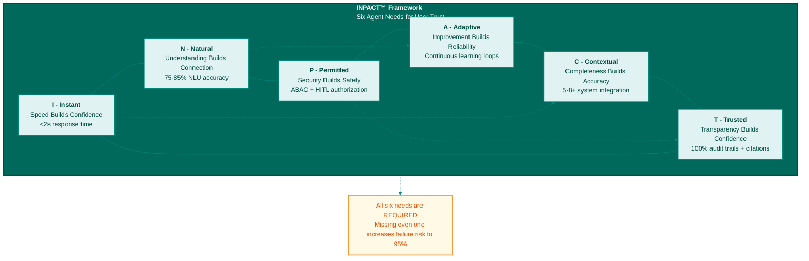
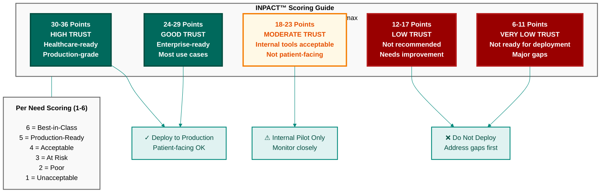

# Appendix C: INPACT™ Framework Reference
## Quick Reference Guide for Agent Trust Requirements

**Purpose:** Quick reference for the INPACT™ Framework introduced in Chapter 2  
**Use:** Measure agent trust during implementation (Chapters 3-12)  
**Date:** November 27, 2025  
**Version:** 1.1 (RBAC+ABAC Hybrid Framing)

---

## What is INPACT™?

**INPACT™** (pronounced "impact") is a framework for building agents users trust.

Just as Tony Robbins identified six human needs for fulfillment, the INPACT™ framework identifies **six architectural needs agents must have to earn user trust.**

The acronym stands for:
- **I** - Instant
- **N** - Natural
- **P** - Permitted
- **A** - Adaptive
- **C** - Contextual
- **T** - Trusted

**All six needs are required.** Missing even one significantly increases the risk of joining the 95% of AI pilots that fail.



**Figure B.1: INPACT™ Six Agent Needs Framework**

The INPACT™ framework identifies six architectural requirements agents must fulfill to earn user trust. All six needs are interdependent—missing even one significantly increases the risk of joining the 95% of AI pilots that fail to achieve ROI.

---

## The Six INPACT™ Needs

### I - Instant: Speed Builds Confidence

**What It Means:** Agents must respond within 2 seconds (sub-second ideal)

**Why It Matters:** Slow responses break conversational flow and erode user confidence. Research shows users abandon applications with >3-second response times.

**Target Metrics:**
- **Minimum:** <2 seconds (p95 latency)
- **Good:** <1 second (p95 latency)
- **Excellent:** <100ms with caching (p50 latency)

**Scoring (1-6):**
- **1:** >10s response time - Unacceptable
- **2:** 5-10s response time - Poor
- **3:** 2-5s response time - Adequate for internal tools
- **4:** 1-2s response time - Good for most use cases
- **5:** <1s response time - Excellent for production
- **6:** <100ms response time - Best-in-class (with caching)

**Infrastructure Requirements:**
- Real-time data streaming (<1 hour freshness)
- Query-optimized storage (vector DB, in-memory caching)
- Semantic caching (60%+ hit rate)
- Optimized retrieval pipelines (RAG)

**Primary Layers:** Layer 2 (Real-Time Data), Layer 1 (Storage), Layer 4 (Caching)

---

### N - Natural: Understanding Builds Connection

**What It Means:** Agents must understand natural language queries with 75-85%+ accuracy

**Why It Matters:** If users must learn special syntax or keywords, the agent isn't truly "natural language." Poor understanding leads to frustration and abandonment.

**Target Metrics:**
- **Minimum:** 75% query understanding accuracy
- **Good:** 80-85% query understanding accuracy
- **Excellent:** 90%+ query understanding accuracy

**Scoring (1-6):**
- **1:** <40% understanding - Worse than baseline
- **2:** 40-60% understanding - Basic keyword matching
- **3:** 60-75% understanding - Adequate with semantic layer
- **4:** 75-80% understanding - Good production quality
- **5:** 80-85% understanding - Excellent quality
- **6:** >85% understanding - Best-in-class (with fine-tuning)

**Infrastructure Requirements:**
- Universal semantic layer (business glossary, 50-100+ terms)
- Embedding models (text-embedding-3-large or equivalent)
- RAG with reranking (NDCG@5 >0.85)
- Entity resolution and disambiguation

**Primary Layers:** Layer 3 (Semantic Layer), Layer 4 (RAG), Layer 1 (Vector DB)

---

### P - Permitted: Security Builds Safety

**What It Means:** Agents must enforce dynamic, context-aware authorization (RBAC baseline + contextual ABAC layer)

**Why It Matters:** Agents accessing data they shouldn't violates compliance (HIPAA, GDPR) and erodes trust. RBAC alone isn't sufficient—agents need ABAC (Attribute-Based Access Control) layered on role-based permissions.

**Target Metrics:**
- **Minimum:** ABAC policies operational, <10ms evaluation
- **Good:** ABAC + audit logging (100% coverage)
- **Excellent:** ABAC + audit + HITL (human-in-the-loop) for critical decisions

**Scoring (1-6):**
- **1:** No access controls - Dangerous
- **2:** RBAC only (no contextual layer) - Inadequate for agents
- **3:** Basic ABAC - Policies defined but not comprehensive
- **4:** ABAC operational - <10ms evaluation, policies tested
- **5:** ABAC + audit - 100% data access logged
- **6:** ABAC + audit + HITL - Critical decisions escalate to humans

**Infrastructure Requirements:**
- ABAC policy engine (Azure AD, OPA, AWS Verified Permissions)
- Policy evaluation <10ms (real-time authorization)
- Audit logging (100% data access coverage)
- HITL workflows for high-stakes decisions

**Primary Layers:** Layer 5 (Governance), Layer 6 (Observability)

---

### A - Adaptive: Improvement Builds Reliability

**What It Means:** Agents must learn and improve continuously (not quarterly reviews)

**Why It Matters:** Static agents degrade over time as data and business logic change. Adaptive agents improve weekly through feedback loops.

**Target Metrics:**
- **Minimum:** Feedback capture operational (thumbs up/down)
- **Good:** Weekly feedback review and prompt improvements
- **Excellent:** Automated retraining pipelines, 1-2% accuracy improvement per week

**Scoring (1-6):**
- **1:** No feedback mechanism - Static agent
- **2:** Feedback capture only - No action taken
- **3:** Manual feedback review - Quarterly improvements
- **4:** Weekly feedback review - Regular improvements
- **5:** Automated monitoring - Continuous improvement
- **6:** Automated retraining - Weekly 1-2% accuracy gains

**Infrastructure Requirements:**
- Feedback capture system (thumbs up/down, user ratings)
- LLM observability (LangSmith, Weights & Biases)
- Evaluation datasets (50-100 test queries)
- A/B testing framework

**Primary Layers:** Layer 6 (Observability), Layer 2 (Real-Time Feedback), Layer 4 (Model Updates)

---

### C - Contextual: Completeness Builds Accuracy

**What It Means:** Agents must access real-time data from 5-8+ systems (not single source)

**Why It Matters:** Incomplete context leads to wrong answers. Healthcare agents need EHR + lab + pharmacy + billing context. Finance agents need CRM + ERP + market data.

**Target Metrics:**
- **Minimum:** 5+ data sources connected
- **Good:** 8+ data sources, real-time streaming (<1 hour freshness)
- **Excellent:** 10+ data sources, <5 minute freshness

**Scoring (1-6):**
- **1:** 1-2 data sources - Insufficient context
- **2:** 3-4 data sources - Limited context
- **3:** 5-6 data sources - Adequate context
- **4:** 7-8 data sources - Good context
- **5:** 9-10 data sources - Excellent context
- **6:** 10+ data sources, real-time - Best-in-class

**Infrastructure Requirements:**
- Multi-source integration (CDC, APIs, streaming)
- Real-time data fabric (<1 hour freshness)
- Universal semantic layer (unified business logic across sources)
- RAG context assembly (multi-source retrieval)

**Primary Layers:** Layer 2 (Real-Time Data), Layer 3 (Semantic Layer), Layer 1 (Storage), Layer 4 (RAG)

---

### T - Trusted: Transparency Builds Confidence

**What It Means:** Agents must explain decisions with complete audit trails and reasoning

**Why It Matters:** Black-box agents erode trust. Users need to see: "Why did you say that?" and "What data did you use?"

**Target Metrics:**
- **Minimum:** Audit logs capture 100% of data access
- **Good:** Audit logs + citations (source attribution)
- **Excellent:** Audit logs + citations + reasoning traces (explainable AI)

**Scoring (1-6):**
- **1:** No audit trails - Black box
- **2:** Basic logs only - No traceability
- **3:** Audit logs operational - Data access tracked
- **4:** Audit logs + trace IDs - Can replay queries
- **5:** Audit logs + citations - Source attribution
- **6:** Audit logs + citations + reasoning - Full explainability

**Infrastructure Requirements:**
- Comprehensive audit logging (100% data access)
- Trace IDs (correlate LLM calls, data access, decisions)
- Citation system (source attribution for all claims)
- Reasoning trace visualization (optional, for full explainability)

**Primary Layers:** Layer 5 (Governance), Layer 6 (Observability), Layer 4 (RAG), Layer 3 (Semantic)

---

## INPACT™ Scoring System

### Overall INPACT™ Score

**Total Score:** Sum of 6 dimensions (1-6 each) = **6 to 36 points**

**Interpretation:**
- **30-36 points:** High Trust (Healthcare-ready, production-grade)
- **24-29 points:** Good Trust (Enterprise-ready, most use cases)
- **18-23 points:** Moderate Trust (Internal tools acceptable)
- **12-17 points:** Low Trust (Not recommended for production)
- **6-11 points:** Very Low Trust (Not ready for deployment)

---

## INPACT™ Scoring Template

**Use this template during Chapter 10 implementation to track progress:**

| Need | Week 1 | Week 4 | Week 8 | Week 12 | Target |
|------|--------|--------|--------|---------|--------|
| **I** - Instant | ___/6 | ___/6 | ___/6 | ___/6 | 6/6 |
| **N** - Natural | ___/6 | ___/6 | ___/6 | ___/6 | 6/6 |
| **P** - Permitted | ___/6 | ___/6 | ___/6 | ___/6 | 5-6/6 |
| **A** - Adaptive | ___/6 | ___/6 | ___/6 | ___/6 | 5-6/6 |
| **C** - Contextual | ___/6 | ___/6 | ___/6 | ___/6 | 6/6 |
| **T** - Trusted | ___/6 | ___/6 | ___/6 | ___/6 | 5-6/6 |
| **TOTAL** | ___/36 | ___/36 | ___/36 | ___/36 | **33-36/36** |

**Phase Targets:**
- **Phase 1 (Week 4):** 27/36 (Good Trust)
- **Phase 2 (Week 8):** 33/36 (High Trust)
- **Phase 3 (Week 12):** 35/36 (Excellent Trust)

---

## How INPACT™ Maps to Architecture

**The 7-layer architecture (Chapters 4-6) delivers the 6 INPACT™ needs:**

| INPACT™ Need | Primary Layers | Infrastructure Capability |
|--------------|----------------|---------------------------|
| **I** - Instant | L2, L1, L4, L7 | Sub-Second Response Architecture |
| **N** - Natural | L3, L4, L1 | Semantic Understanding |
| **P** - Permitted | L5, L6 | Dynamic Authorization + HITL |
| **A** - Adaptive | L6, L2, L4 | Continuous Learning |
| **C** - Contextual | L2, L3, L1, L4 | Cross-Domain Integration |
| **T** - Trusted | L5, L6, L4, L3 | Auditability & Explainability |

**Key Insight:** Every INPACT™ need requires **multiple layers working together**. No single layer solves any need alone.

---

## Common INPACT™ Anti-Patterns

### ❌ Anti-Pattern 1: "We Have a Vector DB, So We're Agent-Ready"

**Problem:** Vector DB alone only addresses part of "I" (Instant) and "N" (Natural). Missing: real-time data (C), governance (P), observability (A, T).

**Fix:** Build all 7 layers, not just Layer 1 (Storage).

---

### ❌ Anti-Pattern 2: "We'll Add HITL Later"

**Problem:** Starting without HITL means training users to trust agent recommendations. When you add HITL later, users resist human oversight.

**Fix:** Start with HITL for critical decisions from Week 1 (Layer 5 governance).

---

### ❌ Anti-Pattern 3: "Accuracy Will Improve Over Time Without Feedback"

**Problem:** Static agents degrade as data and business logic drift. Accuracy drops 1-2% per month without feedback loops.

**Fix:** Implement feedback capture (Week 9) and weekly review cycles (Adaptive need).

---

### ❌ Anti-Pattern 4: "Batch ETL is Fine for Agents"

**Problem:** Agents need real-time context. 24-hour-old data = wrong answers (e.g., "Is this patient still in the hospital?" using yesterday's data).

**Fix:** Implement CDC and streaming (Week 4, Layer 2) for <1 hour freshness.

---

### ❌ Anti-Pattern 5: "Users Don't Need to See Sources"

**Problem:** Black-box agents erode trust. "Because I said so" doesn't work for humans or agents.

**Fix:** Implement citations and reasoning traces (Trusted need, Layer 6).

---

## Using INPACT™ in Practice

### During Design (Before Week 1)

**Question:** Which INPACT™ needs are most critical for our use case?

**Healthcare Example:**
- **Critical:** P (Permitted - HIPAA compliance), T (Trusted - audit trails)
- **Very Important:** N (Natural - clinicians use natural language), C (Contextual - need EHR + lab + pharmacy)
- **Important:** I (Instant - <2s acceptable), A (Adaptive - continuous improvement)

**Prioritization:** Build P and T first (Week 1: Layer 5 Governance), then N and C (Weeks 2-3), then I and A (Weeks 4+).

---

### During Implementation (Weeks 1-12)

**Question:** Are we on track to achieve target INPACT™ scores?

**Use the scoring template above.** Measure weekly during Phase 1-2, then at phase exits.

**Example (Week 4 - Phase 1 Exit):**
- I (Instant): 5/6 - Real-time data <1hr ✓
- N (Natural): 5/6 - Semantic layer operational ✓
- P (Permitted): 4/6 - ABAC operational ✓
- A (Adaptive): 4/6 - Monitoring in place ✓
- C (Contextual): 5/6 - 5-8 sources connected ✓
- T (Trusted): 4/6 - Audit logs 100% coverage ✓
- **Total: 27/36 (Good Trust - on track!)** ✓

---

### During Operations (Post-Week 12)

**Question:** Is INPACT™ trust degrading over time?

**Monthly Re-Assessment:** Re-score INPACT™ needs monthly. Watch for degradation:
- **I (Instant):** Did latency increase? (Cache hit rate declining?)
- **N (Natural):** Did accuracy drop? (Semantic layer drift?)
- **P (Permitted):** Are ABAC policies still enforced? (Policy evaluation working?)
- **A (Adaptive):** Are we still improving? (Feedback loops active?)
- **C (Contextual):** Are data sources still fresh? (CDC still running?)
- **T (Trusted):** Are audit logs still capturing 100%? (Logging gaps?)

**Action:** If any dimension drops >1 point, investigate and remediate within 1 week.

---

## INPACT™ by Industry

### Healthcare

**Critical Needs:** P (Permitted), T (Trusted) - HIPAA compliance non-negotiable

**Target Scores:**
- P (Permitted): 6/6 (ABAC + HITL for all clinical decisions)
- T (Trusted): 6/6 (100% audit trails, full reasoning traces)
- N (Natural): 5-6/6 (Medical terminology understanding)
- C (Contextual): 5-6/6 (EHR + lab + pharmacy + billing)
- I (Instant): 5/6 (Sub-2s acceptable for clinical workflows)
- A (Adaptive): 5/6 (Weekly improvements, bias testing)

**Minimum for Healthcare:** 33/36 (High Trust)

---

## INPACT™ Scoring Quick Reference



**Figure B.2: INPACT™ Scoring Interpretation Guide**

INPACT™ scores range from 6 to 36 points (6 needs × 1-6 points each). Scores of 30-36 indicate High Trust suitable for production healthcare environments. Scores of 24-29 represent Good Trust for most enterprise use cases. Scores below 18 indicate the system is not ready for deployment and requires improvement.

| Need | Score | Interpretation |
|------|-------|----------------|
| 6/6 | Best-in-Class | Exceeds industry standards |
| 5/6 | Production-Ready | Meets requirements for launch |
| 4/6 | Acceptable | Basic functionality, needs improvement |
| 3/6 | At Risk | Significant gaps, may fail user trust |
| 1-2/6 | Not Ready | Critical failures, do not deploy |

**Overall INPACT™ Score:**
- **30-36/36 (83-100%):** High Trust - Deploy to production
- **24-29/36 (67-83%):** Good Trust - Deploy with monitoring
- **18-23/36 (50-67%):** Moderate Trust - Internal pilots only
- **<18/36 (<50%):** Low Trust - Not ready for users

```mermaid
%%{init: {'theme':'base', 'themeVariables': { 'primaryColor':'#e0f2f1','primaryTextColor':'#004d40','primaryBorderColor':'#00897b','lineColor':'#00897b','secondaryColor':'#f0fff0','tertiaryColor':'#fff'}}}%%

graph TD
    subgraph INPACT["<b>INPACT™ Needs</b>"]
        I["<b>I - Instant</b><br/>Speed"]
        N["<b>N - Natural</b><br/>Understanding"]
        P["<b>P - Permitted</b><br/>Security"]
        A["<b>A - Adaptive</b><br/>Learning"]
        C["<b>C - Contextual</b><br/>Completeness"]
        T["<b>T - Trusted</b><br/>Transparency"]
    end
    
    subgraph ARCH["<b>7-Layer Architecture</b>"]
        L1["<b>Layer 1</b><br/>Multi-Modal Storage<br/>Vector DB + Cache"]
        L2["<b>Layer 2</b><br/>Real-Time Data Fabric<br/>CDC + Streaming"]
        L3["<b>Layer 3</b><br/>Unified Semantic Layer<br/>Business Glossary"]
        L4["<b>Layer 4</b><br/>Intelligent Retrieval<br/>RAG + Reranking"]
        L5["<b>Layer 5</b><br/>Agent-Aware Governance<br/>ABAC + Audit"]
        L6["<b>Layer 6</b><br/>Observability<br/>APM + LLM Tracing"]
        L7["<b>Layer 7</b><br/>Multi-Agent Orchestration<br/>Workflow Engine"]
    end
    
    I -->|"Primary"| L2
    I -->|"Primary"| L1
    I -->|"Supporting"| L4
    
    N -->|"Primary"| L3
    N -->|"Primary"| L4
    N -->|"Supporting"| L1
    
    P -->|"Primary"| L5
    P -->|"Supporting"| L6
    
    A -->|"Primary"| L6
    A -->|"Supporting"| L2
    A -->|"Supporting"| L4
    
    C -->|"Primary"| L2
    C -->|"Primary"| L3
    C -->|"Supporting"| L1
    C -->|"Supporting"| L4
    
    T -->|"Primary"| L5
    T -->|"Primary"| L6
    T -->|"Supporting"| L4
    T -->|"Supporting"| L3
    
    classDef need fill:#fff9e6,stroke:#f57c00,stroke-width:2px,color:#e65100
    classDef layer fill:#e0f2f1,stroke:#00897b,stroke-width:2px,color:#004d40
    classDef subgraph fill:#f0fff0,stroke:#00897b,stroke-width:2px
    
    class I,N,P,A,C,T need
    class L1,L2,L3,L4,L5,L6,L7 layer
```

**Figure B.3: INPACT™ Needs Mapped to 7-Layer Architecture**

Each INPACT™ need is fulfilled by specific architectural layers. For example, Instant (speed) requires Layer 2 (Real-Time Data) and Layer 1 (Storage with caching). Natural (understanding) depends on Layer 3 (Semantic Layer) and Layer 4 (RAG). This mapping helps teams prioritize layer development based on which INPACT™ needs are most critical for their use case.

---

## INPACT™ Glossary

**ABAC:** Attribute-Based Access Control - Contextual authorization layer evaluating user attributes, resource attributes, and context, layered on top of RBAC

**Adaptive:** Continuous learning and improvement (vs quarterly reviews or static models)

**Agent Needs:** The six requirements agents must have to earn user trust (INPACT™)

**Audit Trail:** Complete log of data access, decisions, and reasoning (for compliance and explainability)

**Black Box:** Agent that doesn't explain decisions or show sources (opposite of Trusted)

**Citation:** Source attribution for agent responses (which documents/data influenced the answer)

**Contextual:** Access to real-time, cross-domain data from 5-8+ systems (vs single source or stale data)

**HITL:** Human-in-the-Loop - Human approval required for critical decisions (part of Permitted need)

**Instant:** Sub-2-second response times (ideally <1s, best-in-class <100ms with caching)

**Natural:** 75-85%+ natural language understanding accuracy (vs keyword matching or SQL)

**Permitted:** Dynamic, context-aware authorization (ABAC + HITL) enforcing security boundaries

**RAG:** Retrieval-Augmented Generation - Semantic search + reranking + context assembly for agent responses

**Reasoning Trace:** Step-by-step explanation of how agent arrived at decision (full explainability)

**Semantic Layer:** Business glossary + entity resolution that translates natural language to data queries

**Trusted:** Transparency through audit trails, citations, and reasoning traces (vs black box)

---

## Reference

**For complete details on INPACT™, see Chapter 2.**

**For architecture that delivers INPACT™, see Chapters 4-6.**

**For implementation guidance, see Chapter 10.**

---

**© 2025 Colaberry Inc. All rights reserved.**  
**INPACT™ is a trademark of Colaberry Inc.**

---

**END OF APPENDIX B**
