# Appendix DA-2: GOALS™ Framework Reference
## Quick Reference Guide for Operational Readiness

**Purpose:** Quick reference for the GOALS™ Framework introduced in Chapter 7  
**Use:** Measure operational maturity during implementation (Chapters 3-12)  
**Date:** November 29, 2025  
**Version:** 2.3

---

## What is GOALS™?

**GOALS™ = Operational Excellence Targets for Agent-Ready Infrastructure**

While INPACT™ defines what agents need and the 7-Layer Architecture defines what you build, **GOALS™ defines how you know it's working operationally.**

The acronym stands for:
- **G** - Governance: Security, Compliance & Control
- **O** - Observability: Monitoring, Cost & Maintainability
- **A** - Availability: Speed, Freshness & Scale
- **L** - Lexicon: Semantic Understanding & Accuracy
- **S** - Solid: Data Quality & Integrity

**All five GOALS are interdependent.** Like vital organs in a body, each supports the others. Weakness in one cascades to others.

**Scope Boundary:** GOALS™ measures the operational excellence of *your* agent-ready infrastructure—the systems you build and control. External dependencies (EHR vendors, third-party APIs, government registries) require companion monitoring practices. When evaluating GOALS™ scores, ensure integration points with external systems have separate health monitoring, as upstream failures can masquerade as internal issues.

---

## How GOALS™ Relates to INPACT™ and Architecture

```mermaid
%%{init: {'theme':'base', 'themeVariables': { 'primaryColor':'#e0f2f1','primaryTextColor':'#004d40','primaryBorderColor':'#00897b','lineColor':'#00897b','secondaryColor':'#f0fff0','tertiaryColor':'#fff'}}}%%

graph TD
    INPACT["<b>INPACT™ Framework</b><br/>(Chapters 0, 2)<br/><br/>What agents NEED<br/>6 trust requirements<br/>I-N-P-A-C-T"]
    
    ARCH["<b>7-Layer Architecture</b><br/>(Chapters 4-6)<br/><br/>What you BUILD<br/>Technical infrastructure<br/>L1 through L7"]
    
    GOALS["<b>GOALS™ Framework</b><br/>(Chapter 7)<br/><br/>What you MAINTAIN<br/>Operational excellence<br/>G-O-A-L-S"]
    
    ROADMAP["<b>90-Day Roadmap</b><br/>(Chapter 3)<br/><br/>HOW you implement<br/>Week-by-week execution<br/>Assessment → Build → Deploy"]
    
    INPACT -->|"Defines requirements for"| ARCH
    ARCH -->|"Must maintain via"| GOALS
    GOALS -->|"Executed through"| ROADMAP
    
    ROADMAP -.->|"Validates achievement of"| INPACT
    
    Note1["<b>The Complete Framework</b><br/>INPACT™ = destination (user trust)<br/>Architecture = vehicle (technical platform)<br/>GOALS™ = maintenance (operational discipline)<br/>Roadmap = journey (implementation path)"]
    
    ROADMAP -.-> Note1
    
    classDef framework fill:#e0f2f1,stroke:#00897b,stroke-width:3px,color:#004d40,font-weight:bold
    classDef note fill:#00695c,stroke:#004d40,stroke-width:2px,color:#ffffff
    
    class INPACT,ARCH,GOALS,ROADMAP framework
    class Note1 note
```



**Figure C.1: How the Three Frameworks Connect**

The book's frameworks work together as a complete system: INPACT™ defines what agents need (destination), 7-Layer Architecture specifies what you build (vehicle), GOALS™ establishes what you maintain (operational discipline), and the 90-day roadmap shows how to execute (journey). Each framework informs and validates the others.

**Key Insight:** You build architecture once during 90 days, but you achieve GOALS™ continuously through operational discipline.

---

## The Five GOALS™


**Figure C.2: GOALS™ Operational Excellence Framework**

The GOALS™ framework defines five interdependent operational targets for maintaining agent-ready data infrastructure. Like vital organs in a body, each GOAL supports the others—weakness in one cascades throughout the system.

---

## Part 1: The Five GOALS™ Dimensions

### G - Governance: Security, Compliance & Control

**What It Means:** Authorization, policy enforcement, human oversight, audit trails, regulatory compliance, and change management for agent operations.

**What It Covers:**
- Access control (ABAC layered on RBAC)
- Human-in-the-Loop (HITL) workflows for high-risk decisions
- Policy enforcement and audit trails
- Regulatory compliance (HIPAA, GDPR, etc.)
- Change management and approval workflows
- AI-specific threat modeling (prompt injection, data poisoning, semantic drift attacks)
- Model versioning, deployment approval, and rollback capability

**Why It Matters:** Without governance, agents violate compliance requirements, access unauthorized data, and expose the organization to legal/regulatory risk. In healthcare, HIPAA penalties can reach $50,000+ per violation. Additionally, AI systems face novel attack vectors—adversarial manipulation of training data, prompt injection, and gradual semantic drift—that traditional security frameworks don't address. Model versioning ensures you can quickly revert when a new model introduces quality regressions.

**Target Metrics:**
- ABAC policies operational (<10ms evaluation)
- 100% data access audited with trace IDs
- Secrets encrypted (100%)
- HITL workflows for critical decisions (<30s escalation)
- Compliance certifications maintained (HIPAA BAA, SOC2, etc.)
- Model versions tracked with rollback capability (<15 min to revert)

**Scoring (1-5):**
- **1:** No governance - Dangerous
- **2:** Basic RBAC only - Inadequate for agents
- **3:** ABAC policies defined - Basic governance
- **4:** ABAC + audit + model versioning operational - Good governance
- **5:** ABAC + audit + HITL + compliance + tested rollback - Comprehensive governance

**Healthcare Requirement:** 4/5 minimum (ABAC + audit), 5/5 for clinical decisions (HITL)

**Primary Layers:** Layer 5 (Governance)

---

### O - Observability: Monitoring, Cost & Maintainability

**What It Means:** Complete visibility into system behavior, cost tracking, debugging capability, and operational maintainability.

**What It Covers:**
- Distributed tracing across all layers
- Performance monitoring (APM)
- LLM/agent cost tracking and optimization
- Alerting and incident detection
- Debugging visibility and feedback loops
- Model drift detection
- Explainability and interpretability (why did the agent produce this output?)
- Decision audit trails for high-risk outputs

**Why It Matters:** Without observability, you're flying blind. Can't debug failures, optimize performance, control costs, or understand agent behavior. When issues occur at 3 AM, you need to trace failures across all seven layers. Additionally, EU AI Act Article 13 requires transparency for high-risk AI—you must be able to explain agent decisions to clinicians, patients, and regulators.

**Target Metrics:**
- APM operational (Datadog, Dynatrace, or equivalent)
- LLM calls 100% traced with cost attribution
- Dashboards visible (latency, errors, costs, cache hit rate)
- Alerts configured (latency >5s, error rate >5%, cost >$1K/day)
- Mean time to detection (MTTD) <5 minutes
- Model drift detection operational
- High-risk decisions have retrievable explanations

**Scoring (1-5):**
- **1:** No monitoring - Flying blind
- **2:** Basic logs only - Can't diagnose issues
- **3:** APM + dashboards - Can see problems
- **4:** APM + LLM tracing + cost tracking - Can debug and optimize
- **5:** Full observability + proactive alerts + drift detection + explainability - Can predict and explain

**Healthcare Requirement:** 4/5 minimum (APM + LLM tracing + cost tracking)

**Primary Layers:** Layer 6 (Observability)

---

### A - Availability: Speed, Freshness & Scale

**What It Means:** Response time, data freshness, throughput capacity, and ability to maintain performance under load.

**What It Covers:**
- Response time (sub-2-second agent responses)
- Data freshness (sub-30-second staleness)
- Throughput and scalability under load
- Caching efficiency
- System uptime and reliability

**Why It Matters:** Slow agents get abandoned. Stale data leads to wrong answers. Systems that can't scale fail when adoption grows. Echo Health's original 9-13 second response times drove 92% user abandonment.

**Target Metrics:**
- Agent response time <2 seconds (p95)
- Data freshness <30 seconds (p95)
- Throughput handles 10x current load
- Cache hit rate >60%
- System uptime 99.9%+

**Scoring (1-5):**
- **1:** Batch only, minutes-to-hours response - Unusable
- **2:** Near-real-time, 10-30 second response - Frustrating
- **3:** Real-time, 2-10 second response - Acceptable
- **4:** Real-time, <2 second response, handles current load - Good
- **5:** Real-time, <2 second response, scales to 10x load - Production-grade

**Healthcare Requirement:** 4/5 minimum (<2 second response with <30 second freshness)

**Primary Layers:** Layer 1 (Storage), Layer 2 (Real-Time), Layer 4 (Intelligence - caching)

---

### L - Lexicon: Semantic Understanding & Accuracy

**What It Means:** Ability to understand natural language queries, resolve business terminology, disambiguate references, and translate user intent into accurate data operations.

**What It Covers:**
- Entity resolution (who/what is being referenced)
- Terminology mapping (business terms to technical schemas)
- Query interpretation accuracy
- Ontology coverage (relationships between concepts)
- Disambiguation of ambiguous references

**Why It Matters:** Agents that don't understand business language produce wrong answers. When "Dr. Martinez" maps to three different provider IDs across systems, the agent must resolve which one the user means.

**Target Metrics:**
- Entity resolution accuracy >95%
- Business term coverage >90% of common queries
- Query interpretation accuracy >85%
- Ontology completeness for domain (e.g., 2,400 clinical terms)
- Disambiguation success rate >90%

**Measurement Methodology:** Lexicon metrics are harder to measure than other dimensions because they require "ground truth" about user intent. Use these proxy approaches:

| Metric | Proxy Measurement | Method |
|--------|-------------------|--------|
| Entity resolution accuracy | User correction rate | Track when users rephrase after "wrong patient/provider" responses |
| Query interpretation accuracy | Zero-result query rate | Queries returning no results often indicate misinterpretation |
| Terminology coverage | Query reformulation rate | Users rephrasing suggests terminology gap |
| Disambiguation success | Clarification request rate | System asking "did you mean X or Y?" indicates ambiguity handling |

Additionally, implement **human evaluation sampling**: review 100 random queries weekly, scoring interpretation correctness. This provides ground truth calibration for proxy metrics.

**Scoring (1-5):**
- **1:** No semantic layer - Schema-dependent queries only
- **2:** Basic glossary - Limited term coverage
- **3:** Semantic layer with entity resolution - Good understanding
- **4:** Full ontology with disambiguation - Strong understanding
- **5:** Comprehensive semantic layer with continuous learning - Production-grade

**Healthcare Requirement:** 4/5 minimum (full ontology with clinical terminology coverage)

**Primary Layers:** Layer 3 (Semantic), Layer 4 (Intelligence)

---

### S - Solid: Data Quality & Integrity

**What It Means:** Trustworthiness of underlying data across four dimensions: accuracy, completeness, consistency, and timeliness. Plus schema validation and integrity checks.

**What It Covers:**
- Accuracy (data reflects reality)
- Completeness (no missing critical fields)
- Consistency (same data, same value across systems)
- Timeliness (data reflects current state)
- Schema validation and enforcement
- Data integrity checks

**Why It Matters:** Agents are only as good as their data. Wrong data leads to wrong answers, which destroys trust faster than anything else. In healthcare, data quality issues can lead to patient harm.

**Target Metrics:**
- Data accuracy >95%
- Data completeness >98% (critical fields)
- Cross-system consistency >95%
- Data freshness per Availability targets
- Schema validation 100% enforced
- Error rate <1%

**Scoring (1-5):**
- **1:** Unknown quality - No measurement
- **2:** Measured but poor - Quality issues known but unaddressed
- **3:** Acceptable quality - >90% on key metrics
- **4:** Good quality - >95% on key metrics with monitoring
- **5:** Excellent quality - >98% with automated remediation

**Healthcare Requirement:** 4/5 minimum (>95% with monitoring)

**Primary Layers:** Layer 1 (Storage), Layer 3 (Semantic - validation)

---

## Part 2: GOALS™ Alignment with Industry Standards

The GOALS™ framework synthesizes operational concerns from established industry standards and frameworks. This section demonstrates how each GOALS™ dimension aligns with recognized standards, providing credibility and enabling organizations to leverage existing compliance investments.

### Standards Mapping Overview

| GOALS™ Dimension | Primary Standards Alignment |
|------------------|---------------------------|
| **G - Governance** | NIST AI RMF, EU AI Act, ISO 27001, DAMA DMBOK |
| **O - Observability** | NIST AI RMF, EU AI Act, Google SRE |
| **A - Availability** | Google SRE, DAMA DMBOK |
| **L - Lexicon** | DAMA DMBOK |
| **S - Solid** | NIST AI RMF, DAMA DMBOK |

### Standard 1: NIST AI Risk Management Framework (AI RMF 1.0)

**Overview:** Released January 2023, the NIST AI RMF is the US government's voluntary framework for managing AI risks. Updated in 2024-2025 with a Generative AI Profile (NIST AI 600-1) addressing LLM-specific risks. The framework is organized around four core functions: Govern, Map, Measure, and Manage.

**Why It Matters:** The NIST AI RMF is emerging as the de facto US standard for AI governance. Federal agencies and regulated industries increasingly reference it for compliance expectations. Its alignment with GOALS™ validates our operational approach.

**GOALS™ Alignment:**

| NIST AI RMF Function | GOALS™ Dimension | Alignment |
|---------------------|------------------|-----------|
| **GOVERN** | **G - Governance** | NIST GOVERN establishes policies, roles, and accountability for AI risk management. GOALS™ Governance operationalizes this through ABAC policies, HITL workflows, and compliance tracking. |
| **MAP** | **G, L** | NIST MAP identifies AI system context, stakeholders, and dependencies. GOALS™ addresses this through Governance (policy mapping) and Lexicon (semantic context understanding). |
| **MEASURE** | **O - Observability** | NIST MEASURE monitors performance, trustworthiness, and outcomes. GOALS™ Observability provides the technical implementation through distributed tracing, cost tracking, and drift detection. |
| **MANAGE** | **S - Solid** | NIST MANAGE prioritizes and mitigates risks. GOALS™ Solid ensures data quality and integrity as the foundation for trustworthy AI outputs. |

**Key NIST AI RMF Principles Reflected in GOALS™:**
- **Trustworthiness:** Valid and reliable, safe, secure and resilient, accountable and transparent, explainable and interpretable, privacy-enhanced, and fair
- **Lifecycle Approach:** Risk assessment from design through deployment and decommissioning
- **Human Oversight:** Appropriate human control over AI decisions (GOALS™ HITL)

**Reference:** NIST AI 100-1 (January 2023), NIST AI 600-1 Generative AI Profile (July 2024). https://www.nist.gov/itl/ai-risk-management-framework

---

### Standard 2: EU AI Act (Regulation EU 2024/1689)

**Overview:** The world's first comprehensive AI regulation, entered into force August 1, 2024, with full applicability by August 2026. The Act classifies AI systems by risk level (prohibited, high-risk, limited-risk, minimal-risk) and establishes binding requirements for high-risk AI systems. Healthcare AI is explicitly classified as high-risk.

**Why It Matters:** Any organization serving EU customers must comply. Non-compliance penalties reach €35 million or 7% of global revenue. The Act's requirements for transparency, human oversight, and risk management directly align with GOALS™.

**GOALS™ Alignment:**

| EU AI Act Requirement | GOALS™ Dimension | Alignment |
|----------------------|------------------|-----------|
| **Risk Management Systems** | **G - Governance** | The Act requires comprehensive risk management frameworks. GOALS™ Governance operationalizes this through ABAC, HITL, and compliance tracking. |
| **Human Oversight** | **G - Governance** | Article 14 mandates human oversight for high-risk AI. GOALS™ HITL workflows directly implement this requirement. |
| **Transparency** | **O - Observability** | Articles 13-14 require clear information about AI capabilities and limitations. GOALS™ Observability provides audit trails and explainability. |
| **Data Governance** | **S - Solid** | Article 10 requires high-quality training data. GOALS™ Solid ensures accuracy, completeness, consistency, and timeliness. |
| **Technical Documentation** | **O - Observability** | Article 11 requires detailed records of AI functionality. GOALS™ Observability provides tracing and logging infrastructure. |
| **Logging & Monitoring** | **O - Observability** | Article 12 requires automatic logging of AI operations. GOALS™ implements this through distributed tracing. |

**Key EU AI Act Requirements Reflected in GOALS™:**
- **High-Risk Classification:** Healthcare AI requires stringent compliance (GOALS™ minimum scores)
- **Conformity Assessment:** Third-party verification for medical devices (GOALS™ audit readiness)
- **AI Literacy:** Organizations must ensure staff understand AI systems (GOALS™ documentation)

**Enforcement Timeline:**
- February 2025: Prohibited AI practices effective
- August 2025: GPAI model obligations effective
- August 2027: High-risk medical device AI obligations effective

**Reference:** Regulation (EU) 2024/1689. https://digital-strategy.ec.europa.eu/en/policies/regulatory-framework-ai

---

### Standard 3: DAMA DMBOK 2.0 (Data Management Body of Knowledge)

**Overview:** The definitive industry reference for data management, published by DAMA International. The 2024 revision (DMBOK 2.0 Revised) standardized terminology and added currency as a data quality dimension. DMBOK 3.0 is in development (2025) to address AI and emerging data practices.

**Why It Matters:** DAMA DMBOK is the foundation for data management certification (CDMP) and is recognized globally by CDOs and data professionals. Its principles underpin GOALS™ data-centric dimensions.

**GOALS™ Alignment:**

| DAMA DMBOK Knowledge Area | GOALS™ Dimension | Alignment |
|--------------------------|------------------|-----------|
| **Data Governance** | **G - Governance** | DMBOK defines governance as the exercise of authority over data management. GOALS™ Governance extends this to agent-specific controls. |
| **Data Quality** | **S - Solid** | DMBOK's six quality dimensions (accuracy, completeness, consistency, timeliness, uniqueness, validity) map directly to GOALS™ Solid. |
| **Metadata Management** | **L - Lexicon** | DMBOK metadata practices enable GOALS™ Lexicon's semantic understanding through business glossaries and data dictionaries. |
| **Data Architecture** | **A - Availability** | DMBOK architecture principles support GOALS™ Availability through optimized data structures. |
| **Reference & Master Data** | **L - Lexicon** | DMBOK reference data management enables GOALS™ entity resolution and terminology mapping. |

**Key DAMA DMBOK Principles Reflected in GOALS™:**
- **Data as an Asset:** Data has unique properties and measurable value
- **Metadata for Management:** Effective data management requires metadata (Lexicon)
- **Quality Management:** Data quality must be measured and managed (Solid)
- **Lifecycle Management:** Different data types have different lifecycle requirements

**Reference:** DAMA International (2024). DAMA-DMBOK 2.0 Revised Edition. https://dama.org/learning-resources/dama-data-management-body-of-knowledge-dmbok/

---

### Standard 4: ISO/IEC 27001:2022 (Information Security Management)

**Overview:** The world's most recognized standard for Information Security Management Systems (ISMS). The 2022 version reorganized controls into 93 controls across four themes: organizational, people, physical, and technological. A 2024 amendment addressed climate action considerations.

**Why It Matters:** ISO 27001 certification signals enterprise-grade security commitment. Healthcare organizations often require it, and HITRUST CSF builds upon it. GOALS™ Governance aligns with ISO 27001's security controls.

**GOALS™ Alignment:**

| ISO 27001:2022 Theme | GOALS™ Dimension | Alignment |
|---------------------|------------------|-----------|
| **Organizational Controls** | **G - Governance** | ISO 27001 organizational controls (policies, roles, responsibilities) map to GOALS™ Governance framework. |
| **Access Control (A.5.15-5.18)** | **G - Governance** | ISO 27001 access control requirements align with GOALS™ ABAC implementation. |
| **Logging & Monitoring (A.8.15-8.16)** | **O - Observability** | ISO 27001 logging requirements support GOALS™ Observability audit trails. |
| **Incident Management (A.5.24-5.28)** | **O - Observability** | ISO 27001 incident response aligns with GOALS™ alerting and MTTD/MTTR metrics. |
| **Cryptography (A.8.24)** | **G - Governance** | ISO 27001 encryption requirements support GOALS™ secrets management. |

**Key ISO 27001:2022 Requirements Reflected in GOALS™:**
- **Risk Assessment:** Systematic identification and treatment of security risks
- **Access Control:** Authorization based on business and security requirements
- **Audit Logging:** Recording of security-relevant events
- **Incident Response:** Detection, reporting, and response to security incidents

**Certification Note:** Organizations transitioning from ISO 27001:2013 must complete transition to 2022 version by October 31, 2025.

**Reference:** ISO/IEC 27001:2022. https://www.iso.org/standard/27001

---

### Standard 5: Google SRE (Site Reliability Engineering)

**Overview:** Google's Site Reliability Engineering practices, documented in two books (SRE Book 2016, SRE Workbook 2018), define modern operational excellence for distributed systems. The SRE approach emphasizes Service Level Objectives (SLOs), error budgets, and the "Four Golden Signals" (latency, traffic, errors, saturation).

**Why It Matters:** Google SRE has become the industry standard for operating reliable distributed systems at scale. Its principles directly inform GOALS™ Observability and Availability dimensions.

**GOALS™ Alignment:**

| Google SRE Concept | GOALS™ Dimension | Alignment |
|-------------------|------------------|-----------|
| **Four Golden Signals** | **O - Observability** | Latency, traffic, errors, and saturation map to GOALS™ Observability metrics. |
| **SLOs/SLIs** | **A - Availability** | Service Level Objectives define GOALS™ Availability targets (response time, uptime). |
| **Error Budgets** | **A, S** | Error budget philosophy informs acceptable degradation thresholds in Availability and Solid. |
| **Monitoring & Alerting** | **O - Observability** | SRE monitoring practices directly inform GOALS™ alerting thresholds and MTTD targets. |
| **Incident Management** | **O - Observability** | SRE incident response practices inform GOALS™ incident detection and remediation. |
| **Capacity Planning** | **A - Availability** | SRE capacity practices inform GOALS™ scalability targets (10x load). |

**Key Google SRE Principles Reflected in GOALS™:**
- **Simplicity in Monitoring:** Design monitoring with simplicity; complex systems are fragile
- **Black-Box vs White-Box:** Use symptom-based alerting (user impact) over cause-based (internal metrics)
- **Automation:** Automate toil to focus human effort on improvement
- **Blameless Postmortems:** Focus on system improvement, not individual blame

**The Four Golden Signals in GOALS™ Context:**
1. **Latency:** Agent response time (Availability)
2. **Traffic:** Query volume and throughput (Availability)
3. **Errors:** Failed queries, wrong answers (Solid)
4. **Saturation:** System capacity utilization (Availability)

**Reference:** Google (2016). Site Reliability Engineering. https://sre.google/sre-book/
Google (2018). The Site Reliability Workbook. https://sre.google/workbook/

---

### Standards Mapping Summary

```mermaid
%%{init: {'theme':'base', 'themeVariables': { 'primaryColor':'#e0f2f1','primaryTextColor':'#004d40','primaryBorderColor':'#00897b','lineColor':'#00897b','secondaryColor':'#f0fff0','tertiaryColor':'#fff'}}}%%

graph TB
    subgraph GOALS["<b>GOALS™ Framework</b>"]
        G["<b>G - Governance</b>"]
        O["<b>O - Observability</b>"]
        A["<b>A - Availability</b>"]
        L["<b>L - Lexicon</b>"]
        S["<b>S - Solid</b>"]
    end
    
    subgraph STANDARDS["<b>Industry Standards</b>"]
        NIST["<b>NIST AI RMF</b><br/>Govern, Map, Measure, Manage"]
        EU["<b>EU AI Act</b><br/>High-Risk AI Requirements"]
        DAMA["<b>DAMA DMBOK</b><br/>Data Management"]
        ISO["<b>ISO 27001</b><br/>Security Management"]
        SRE["<b>Google SRE</b><br/>Operational Excellence"]
    end
    
    NIST --> G
    NIST --> O
    NIST --> S
    
    EU --> G
    EU --> O
    
    DAMA --> G
    DAMA --> L
    DAMA --> S
    
    ISO --> G
    ISO --> O
    
    SRE --> O
    SRE --> A
    
    Copyright["<b>© 2025 Colaberry Inc.</b>"]
    
    classDef goalBox fill:#e0f2f1,stroke:#00897b,stroke-width:2px,color:#004d40
    classDef standardBox fill:#f9f9f9,stroke:#666666,stroke-width:2px,color:#000000
    classDef framework fill:#00695c,stroke:#004d40,stroke-width:3px,color:#ffffff
    
    class G,O,A,L,S goalBox
    class NIST,EU,DAMA,ISO,SRE standardBox
    class GOALS,STANDARDS framework
    style Copyright fill:#ffffff,stroke:none,color:#666666
```



**Figure C.3: GOALS™ Alignment with Industry Standards**

---

## Part 3: GOALS™ Scoring Guide

### Overall Maturity Levels

| Score | Level | Description | Production Readiness |
|-------|-------|-------------|---------------------|
| **5-10** | Early-Stage | Foundational gaps, not ready for pilots | ❌ Not ready |
| **11-15** | Emerging | Pilot-ready, significant operational gaps | ⚠️ Pilot only |
| **16-20** | Adoption-Ready | Good for most enterprise use cases | ✅ Limited production |
| **21-25** | Production-Grade | Enterprise-ready, healthcare-ready | ✅ Full production |

### Healthcare-Specific Requirements

| GOALS™ Dimension | Minimum Score | Rationale |
|------------------|---------------|-----------|
| **G - Governance** | 5/5 for clinical | HIPAA requires comprehensive access controls and audit trails |
| **O - Observability** | 4/5 | Must trace agent decisions for compliance audits |
| **A - Availability** | 4/5 | Clinical workflows require responsive systems |
| **L - Lexicon** | 4/5 | Medical terminology must be accurately resolved |
| **S - Solid** | 4/5 | Patient safety depends on data accuracy |

**Healthcare Production Threshold:** 21/25 minimum (average 4.2/5 per dimension)

### Scoring Calibration Examples

To ensure consistent scoring across organizations, use these calibration examples:

**Governance (G) Calibration:**

| Score | Example Organization Profile |
|-------|------------------------------|
| **2/5** | Regional clinic with RBAC only, basic login audit logs, no HITL workflows |
| **3/5** | Mid-size hospital with ABAC policies defined but not consistently enforced, 70% audit coverage |
| **4/5** | Health system with ABAC operational, 100% audit trails, HITL for medication overrides |
| **5/5** | IDN with ABAC + complete audit + HITL for all clinical decisions + SOC2/HITRUST certified |

**Observability (O) Calibration:**

| Score | Example Organization Profile |
|-------|------------------------------|
| **2/5** | Application logs only, no APM, no LLM cost tracking, alerts via email |
| **3/5** | APM deployed (Datadog/similar), dashboards exist, basic alerting, no LLM tracing |
| **4/5** | APM + LLM call tracing + cost attribution + PagerDuty alerting + MTTD <10 min |
| **5/5** | Full observability + anomaly detection + drift monitoring + MTTD <5 min + automated remediation |

**Availability (A) Calibration:**

| Score | Example Organization Profile |
|-------|------------------------------|
| **2/5** | Batch data refreshes overnight, agent responses 10-30 seconds |
| **3/5** | Near-real-time data (15-min refresh), responses 3-5 seconds |
| **4/5** | Real-time streaming, responses <2 seconds, handles current load |
| **5/5** | Sub-second freshness, <2s responses under 10x load, 99.9%+ uptime |

**Lexicon (L) Calibration:**

| Score | Example Organization Profile |
|-------|------------------------------|
| **2/5** | Static glossary of 200 terms, no entity resolution, users must know exact field names |
| **3/5** | Semantic layer with 1,000+ terms, basic entity resolution, 80% query success rate |
| **4/5** | Full ontology with clinical terminology, disambiguation prompts, >90% accuracy |
| **5/5** | Comprehensive ontology + continuous learning from corrections + >95% accuracy |

**Solid (S) Calibration:**

| Score | Example Organization Profile |
|-------|------------------------------|
| **2/5** | Data quality measured quarterly, known issues logged but not prioritized |
| **3/5** | Automated quality checks, >90% accuracy, issues addressed within 1 week |
| **4/5** | Real-time quality monitoring, >95% accuracy, issues addressed within 24 hours |
| **5/5** | Continuous monitoring + automated remediation + >98% accuracy + cross-system reconciliation |

---

## Part 4: GOALS™ Anti-Patterns

### ❌ Anti-Pattern 1: "We Have Good Governance, So We're Ready"

**Problem:** G=5/5 but O=2/5 (no observability). Can't see when governance policies fail or when agents misbehave.

**Fix:** Build all five GOALS, not just one. They're interdependent like vital organs.

---

### ❌ Anti-Pattern 2: "We'll Add Observability After Launch"

**Problem:** Launching blind. When issues occur (and they will), you can't diagnose or fix them quickly.

**Fix:** Observability (O) must be operational before production launch (Week 9).

---

### ❌ Anti-Pattern 3: "Fast Responses Mean We're Production-Ready"

**Problem:** A=5/5 (fast responses) but S=2/5 (poor data quality). Fast wrong answers are worse than slow right answers.

**Fix:** Balance Availability with Solid. Speed without accuracy destroys trust.

---

### ❌ Anti-Pattern 4: "Our Semantic Layer Understands Everything"

**Problem:** L=4/5 (good semantic coverage) but no feedback loop. Lexicon doesn't improve when agents misunderstand queries.

**Fix:** Integrate Observability with Lexicon. Track query interpretation failures and expand ontology based on real usage.

---

### ❌ Anti-Pattern 5: "We Measure Data Quality Quarterly"

**Problem:** S=3/5 measured quarterly, but data quality can degrade in days. By the time you measure, agents have been giving wrong answers for weeks.

**Fix:** Continuous data quality monitoring integrated with Observability. Alert when quality metrics drop.

---

## Part 5: GOALS™ Health Dashboard Template

**Create this dashboard (using Datadog, Grafana, or similar):**

| GOAL | Metric | Current | Target | Status |
|------|--------|---------|--------|--------|
| **G** | ABAC policy evaluation | 6ms | <10ms | 🟢 |
| **G** | Audit log coverage | 100% | 100% | 🟢 |
| **G** | HITL escalation time | 25s | <30s | 🟢 |
| **O** | MTTD (mean time to detect) | 3 min | <5 min | 🟢 |
| **O** | LLM call tracing | 100% | 100% | 🟢 |
| **O** | Daily LLM cost | $850 | <$1,000 | 🟢 |
| **A** | Agent response time (p95) | 1.8s | <2s | 🟢 |
| **A** | Data freshness (p95) | 28s | <30s | 🟢 |
| **A** | System uptime | 99.95% | 99.9%+ | 🟢 |
| **L** | Entity resolution accuracy | 96% | >95% | 🟢 |
| **L** | Query interpretation accuracy | 87% | >85% | 🟢 |
| **S** | Data accuracy | 97% | >95% | 🟢 |
| **S** | Data completeness | 99% | >98% | 🟢 |
| **S** | Error rate | 0.4% | <1% | 🟢 |

**Legend:**
- 🟢 Green: On target
- 🟡 Yellow: Close to threshold (action soon)
- 🔴 Red: Threshold exceeded (action now)

**Review Frequency:** Weekly review in team standup, monthly deep-dive

---

## Part 6: GOALS™ Failure Mode Analysis

Understanding what breaks when each GOALS™ dimension fails is essential for risk management and operational planning. This section documents failure modes, their impacts, detection methods, and cascade effects across dimensions.

### Why Failure Modes Matter

The "vital organs" metaphor for GOALS™ isn't just illustrative—it's predictive. When one dimension fails, the effects cascade through the system in predictable patterns. Understanding these patterns enables proactive monitoring and faster incident response.

**Real-World Context:** Healthcare AI failures have become increasingly documented. A 2025 Nature Medicine study analyzing 1.7 million AI-generated medical responses found that demographic characteristics influenced treatment recommendations even when patients had identical conditions. Meanwhile, healthcare data breaches cost an average of $7.42 million per incident in 2025—the highest of any industry for 14 consecutive years.

---

### G - Governance Failure Modes

#### Failure Mode G1: ABAC Policy Bypass

**What Breaks:** Agent accesses data it shouldn't, violating HIPAA/GDPR requirements.

**How It Happens:**
- Policy misconfiguration during deployment
- Stale policies not updated when roles change
- Agent finds path around policy evaluation
- Emergency "break glass" access left open

**Impact:**
- Regulatory violations (HIPAA penalties up to $50,000+ per violation)
- Patient privacy breach
- Loss of trust with patients and partners
- Potential litigation

**Real-World Example:** In 2024, Montefiore Medical Center paid $4.75 million to settle HIPAA violations after a former employee improperly accessed 12,517 patient records. The root cause: failure to conduct adequate risk analysis and implement post-breach review procedures.

**Detection:** Audit log anomalies, unusual access patterns, compliance scanning

**Cascade Effects:**
- **→ O (Observability):** Can't determine scope of unauthorized access if audit logs incomplete
- **→ S (Solid):** Data integrity unknown—was data modified during unauthorized access?

**Echo Health Scenario:** An agent serving the billing department inadvertently gains access to clinical notes because a policy update wasn't propagated. The breach isn't detected for three weeks because observability dashboards only track successful queries, not access patterns.

---

#### Failure Mode G2: HITL Escalation Failure

**What Breaks:** High-risk decisions execute without human review.

**How It Happens:**
- Escalation thresholds set too high
- Human reviewers overwhelmed, rubber-stamping approvals
- Escalation queue backed up, timeout triggers auto-approval
- Classification model fails to identify high-risk scenarios

**Impact:**
- Automated decisions cause patient harm
- Liability shifts to organization
- EU AI Act violations (Article 14 mandates human oversight for high-risk AI)
- Loss of clinical trust

**Real-World Example:** Research published in Frontiers in Medicine (2025) documented how "black-box" AI models limit error traceability, with underrepresentation in training datasets linked to 23% higher false-negative rates for pneumonia detection in rural populations.

**Detection:** HITL queue depth monitoring, approval rate anomalies, decision outcome tracking

**Cascade Effects:**
- **→ O (Observability):** Without tracing, can't reconstruct decision path for post-incident review
- **→ L (Lexicon):** If escalation triggered by query misinterpretation, Lexicon issues masked

**Echo Health Scenario:** Marcus Williams notices the HITL queue averaging 2-minute reviews for medication interaction alerts. Investigation reveals reviewers are approving 98% of escalations in under 30 seconds—effectively bypassing the safety control.

---

#### Failure Mode G3: Audit Trail Gap

**What Breaks:** Unable to reconstruct what happened during an incident.

**How It Happens:**
- Audit logging disabled for "performance"
- Log retention too short
- Log aggregation pipeline failure
- Incomplete trace IDs across services

**Impact:**
- Cannot prove compliance during audit
- Cannot determine breach scope
- Cannot identify root cause
- Regulatory fines for inadequate record-keeping

**Real-World Example:** HHS OCR's 2025 HIPAA enforcement initiative specifically targets "risk analysis failures"—the most commonly identified HIPAA Security Rule violation. Organizations that cannot demonstrate comprehensive audit trails face accelerated investigation and higher penalties.

**Detection:** Log coverage monitoring, trace ID validation, audit completeness checks

**Cascade Effects:**
- **→ O (Observability):** Observability depends on audit data; gaps blind the entire monitoring system
- **→ S (Solid):** Cannot verify data integrity without audit trail of changes

---

#### Failure Mode G4: Model Regression Without Rollback

**What Breaks:** New model deployment degrades quality; no ability to quickly revert.

**How It Happens:**
- Model updated without versioning
- Rollback procedure untested or nonexistent
- Quality regression not detected until widespread impact
- Deployment approval bypassed for "urgent" updates

**Impact:**
- Extended period of degraded answers
- User trust destruction
- Clinical risk if healthcare decisions affected
- Emergency manual intervention required

**Real-World Example:** AI-native companies report model updates causing subtle quality regressions that go undetected for days. Without versioning, teams must debug forward rather than rollback—extending incident duration from minutes to days.

**Detection:** A/B quality comparison pre-deployment, automated regression testing, user feedback monitoring, rollback drill testing

**Cascade Effects:**
- **→ S (Solid):** Quality degradation appears as data quality issue
- **→ L (Lexicon):** Model regression may affect query interpretation
- **→ O (Observability):** Without baseline comparison, regression hard to detect

**Echo Health Scenario:** A prompt engineering update intended to improve medication queries inadvertently degrades insurance eligibility responses. Without model versioning, the team spends 3 days debugging before realizing they should simply revert. With versioning, rollback would take 15 minutes.

---

### O - Observability Failure Modes

#### Failure Mode O1: Blind Spots in Tracing

**What Breaks:** Cannot diagnose failures or understand agent behavior.

**How It Happens:**
- New service deployed without instrumentation
- Trace sampling drops critical requests
- Cross-service correlation IDs not propagated
- LLM calls not captured in trace

**Impact:**
- Extended mean time to resolution (MTTR)
- Repeated incidents from same root cause
- Cost overruns undetected
- Performance degradation unnoticed

**Real-World Example:** The Google SRE Book emphasizes that "without monitoring, you have no way to tell whether the service is even working... you want to be aware of problems before your users notice them." Healthcare systems with 279-day average breach detection times demonstrate the cost of observability gaps.

**Detection:** Trace coverage metrics, orphan span detection, instrumentation audits

**Cascade Effects:**
- **→ G (Governance):** Cannot verify governance policies are enforced
- **→ A (Availability):** Cannot identify latency bottlenecks
- **→ S (Solid):** Cannot correlate data quality issues with source

**Echo Health Scenario:** After deploying a new caching layer, response times improve but cache invalidation bugs cause stale data. Without tracing through the cache layer, the team spends two weeks debugging what appears to be a "random" data freshness issue.

---

#### Failure Mode O2: Alert Fatigue

**What Breaks:** Real problems ignored because teams desensitized to alerts.

**How It Happens:**
- Too many low-priority alerts
- Thresholds not tuned to actual impact
- Same alert fires repeatedly without resolution
- No clear ownership of alert response

**Impact:**
- Critical alerts missed or delayed
- Team burnout and turnover
- Extended incident duration
- False confidence in monitoring

**Real-World Example:** Google SRE principles state that "the rules that catch real incidents most often should be as simple, predictable, and reliable as possible." Teams that exercise rules less than once per quarter should consider removing them—complexity breeds fragility.

**Detection:** Alert-to-incident ratio, response time tracking, alert acknowledgment rates

**Cascade Effects:**
- **→ All Dimensions:** If alerts ignored, failures in G/A/L/S go undetected

**Echo Health Scenario:** The operations team receives 47 alerts per day, of which 3 are actionable. When a genuine Governance failure occurs (ABAC policy misconfiguration), the alert is buried in noise and not investigated for 6 hours.

---

#### Failure Mode O3: Cost Visibility Failure

**What Breaks:** LLM costs spiral out of control undetected.

**How It Happens:**
- No per-query cost attribution
- Runaway retry loops on failed queries
- Expensive model used for simple queries
- Cache miss rate increases unnoticed

**Impact:**
- Budget overruns (potentially 10-100x expected costs)
- Project cancellation due to unsustainable economics
- Inability to optimize spending

**Detection:** Cost anomaly detection, per-query cost tracking, budget threshold alerts

**Cascade Effects:**
- **→ A (Availability):** Cost controls may throttle availability
- **→ L (Lexicon):** May force downgrade to cheaper, less capable models

**Echo Health Scenario:** A prompt engineering change accidentally removes caching hints, causing cache hit rate to drop from 65% to 12%. Daily LLM costs spike from $850 to $4,200 before anyone notices the weekly cost report.

---

### A - Availability Failure Modes

#### Failure Mode A1: Response Time Degradation

**What Breaks:** Agent responses too slow for practical use; users abandon system.

**How It Happens:**
- Database queries unoptimized as data grows
- LLM provider latency increases
- Network congestion between services
- Cache effectiveness degrades

**Impact:**
- User abandonment (Echo Health's original 92% abandonment at 9-13 seconds)
- Workflow disruption
- Shadow IT adoption (users find workarounds)
- Project perceived as failure despite correct answers

**Real-World Example:** Echo Health's transformation from 9-13 second response times to sub-2-second responses wasn't a "nice to have"—it was the difference between 8% and 73% adoption. Speed is a trust signal.

**Detection:** p95/p99 latency monitoring, user session tracking, timeout rate monitoring

**Cascade Effects:**
- **→ L (Lexicon):** Users simplify queries to get faster responses, reducing Lexicon effectiveness
- **→ S (Solid):** Pressure to skip validation steps to improve speed

**Echo Health Scenario:** Black Friday-equivalent surge in benefits enrollment queries causes response times to spike to 8 seconds. Rather than wait, users start calling the support line, creating a secondary overload.

---

#### Failure Mode A2: Data Freshness Lag

**What Breaks:** Agent provides stale information; users lose trust.

**How It Happens:**
- ETL pipeline delays
- Real-time sync failures
- Database replication lag
- Cache TTL too long

**Impact:**
- Wrong answers based on outdated data
- Clinical decisions based on stale lab results
- Compliance violations (reporting with outdated data)
- Trust destruction faster than any other failure mode

**Detection:** Data freshness monitoring, pipeline lag alerts, staleness checks on query

**Cascade Effects:**
- **→ S (Solid):** Stale data may appear as data quality issue
- **→ G (Governance):** Decisions based on stale data may violate policies

**Echo Health Scenario:** A patient's medication list updates at 2:00 PM, but due to a stuck sync job, the agent reports the old medication list until 6:00 PM. A clinician asks about drug interactions and receives incorrect "no conflicts" response.

---

#### Failure Mode A3: Scale Failure Under Load

**What Breaks:** System collapses during peak usage.

**How It Happens:**
- Autoscaling too slow
- Resource limits hit (connections, memory, CPU)
- Thundering herd after partial recovery
- No load shedding / graceful degradation

**Impact:**
- Complete service outage
- Cascading failures across dependent systems
- Extended recovery time
- Loss of confidence in platform reliability

**Real-World Example:** The 2024 Change Healthcare ransomware attack disrupted billing and claims processing for weeks, affecting a system that processes 15 billion transactions annually—approximately 50% of U.S. healthcare claims.

**Detection:** Capacity utilization trending, load testing, chaos engineering

**Cascade Effects:**
- **→ O (Observability):** Observability infrastructure may also fail under load
- **→ G (Governance):** Emergency access procedures may bypass normal controls

---

### L - Lexicon Failure Modes

#### Failure Mode L1: Entity Resolution Failure

**What Breaks:** Agent retrieves data for wrong entity (wrong patient, wrong provider, wrong facility).

**How It Happens:**
- Ambiguous references ("Dr. Martinez" matches three providers)
- Name changes not propagated
- Merged/split entities not handled
- Context insufficient for disambiguation

**Impact:**
- Wrong patient data accessed (HIPAA violation)
- Incorrect information provided
- Clinical safety risk
- Fundamental trust destruction

**Real-World Example:** The Johns Hopkins Center for Diagnostic Excellence notes that "misdiagnoses are not systematically recorded in the EHR"—creating a "dataset ceiling effect" where AI trained on standard records perpetuates existing ambiguities and errors.

**Detection:** Entity resolution confidence scoring, disambiguation failure tracking, user correction monitoring

**Cascade Effects:**
- **→ G (Governance):** Access controls assume correct entity—wrong entity = unauthorized access
- **→ S (Solid):** Data quality metrics may pass while serving wrong data

**Echo Health Scenario:** A query about "the Martinez patient in room 412" matches two patients (one discharged yesterday, one admitted today). The agent confidently returns the discharged patient's information because that record has more complete data.

---

#### Failure Mode L2: Terminology Mapping Failure

**What Breaks:** Agent doesn't understand business/clinical terminology.

**How It Happens:**
- New terminology not added to ontology
- Regional/specialty variations not captured
- Abbreviations ambiguous ("MS" = multiple sclerosis or mental status?)
- Slang/informal terms not mapped

**Impact:**
- Query returns wrong results
- User gives up on system
- Workarounds emerge (users learn "magic words" that work)
- Ontology debt accumulates

**Real-World Example:** Medical terminology systems like SNOMED CT contain hundreds of thousands of concepts precisely because clinical language is complex and context-dependent. Systems without robust terminology mapping fail on edge cases that matter most.

**Detection:** Query failure analysis, zero-result query tracking, user reformulation patterns

**Cascade Effects:**
- **→ A (Availability):** Bad queries may be expensive (long-running searches that find nothing)
- **→ O (Observability):** Without query intent tracking, can't identify terminology gaps

**Echo Health Scenario:** Clinical staff start asking about "readmit risk" but the semantic layer only recognizes "30-day readmission probability." The agent returns "no data found" until someone maps the informal term.

---

#### Failure Mode L3: Query Interpretation Drift

**What Breaks:** Accuracy degrades over time as language patterns change.

**How It Happens:**
- New use cases not reflected in training
- User population changes (new departments onboarded)
- Business terminology evolves
- Seasonal patterns not captured

**Impact:**
- Gradual accuracy decline goes unnoticed
- Users lose confidence slowly
- Expensive retraining needed

**Detection:** Interpretation accuracy trending, user feedback analysis, A/B testing against baseline

**Cascade Effects:**
- **→ O (Observability):** Drift detection requires baseline observability
- **→ S (Solid):** Drift may be misattributed to data quality issues

---

### S - Solid (Data Quality) Failure Modes

#### Failure Mode S1: Silent Data Corruption

**What Breaks:** Data becomes incorrect without detection; agent confidently provides wrong answers.

**How It Happens:**
- Upstream system bug writes incorrect values
- Integration mapping error
- Character encoding issues
- Timezone handling bugs

**Impact:**
- Wrong answers with high confidence (worst case)
- Clinical decisions based on incorrect data
- Trust destroyed when discovered
- Difficult to determine scope of corruption

**Real-World Example:** A 2024 study in npj Digital Medicine emphasized that "the consequences of AI tool errors are vital to understand and report because they have the potential to cause profound and harmful effects on people." Silent corruption—where errors aren't surfaced—is particularly dangerous.

**Detection:** Statistical anomaly detection, cross-system reconciliation, data validation rules

**Cascade Effects:**
- **→ L (Lexicon):** Semantic layer may cache/index corrupted data
- **→ G (Governance):** Compliance reports based on corrupted data
- **→ O (Observability):** Metrics calculated from corrupted data misleading

**Echo Health Scenario:** A decimal point error in the lab interface causes all hemoglobin values to be recorded as 10x actual. The agent reports "critically high hemoglobin" for normal patients until a nurse questions why every patient appears abnormal.

---

#### Failure Mode S2: Completeness Degradation

**What Breaks:** Required data fields become empty; agent can't fulfill queries.

**How It Happens:**
- Upstream system changes remove fields
- Integration pipeline filter misconfigured
- Optional fields become required
- Source system data entry declining

**Impact:**
- Queries fail or return partial results
- Biased results (only complete records returned)
- Calculations incorrect (averages skewed by missing values)

**Detection:** Completeness monitoring by field, null rate trending, query failure analysis

**Cascade Effects:**
- **→ A (Availability):** Incomplete data may cause query timeouts
- **→ L (Lexicon):** Entity resolution harder with missing attributes

**Echo Health Scenario:** After an EHR upgrade, the patient address field starts arriving as null for 40% of records. Geographic analysis becomes unreliable, but no alert fires because the null rate threshold is set at 50%.

---

#### Failure Mode S3: Cross-System Inconsistency

**What Breaks:** Same data has different values in different systems; agent provides contradictory answers.

**How It Happens:**
- Master data management failures
- Synchronization timing issues
- System-specific transformations
- Manual updates in one system only

**Impact:**
- Contradictory answers based on query routing
- User confusion and lost trust
- Compliance risk (which value is "official"?)
- Debugging nightmare (intermittent "wrong" answers)

**Detection:** Cross-system reconciliation, consistency scoring, golden record comparison

**Cascade Effects:**
- **→ L (Lexicon):** Which source of truth should entity resolution use?
- **→ G (Governance):** Audit trail shows different values—which is authoritative?

**Echo Health Scenario:** Patient's primary care physician is "Dr. Nguyen" in the scheduling system but "Dr. Chen" in the EHR (patient transferred care, but scheduling wasn't updated). Depending on which system the agent queries, it provides different answers to "Who is this patient's PCP?"

---

### Cascade Failure Patterns

The following diagram illustrates how failures propagate across GOALS™ dimensions:

```
G (Governance) Fails
    │
    ├──→ O: Can't audit what happened
    │       │
    │       └──→ S: Data integrity unknown
    │               │
    │               └──→ L: Semantic layer may cache bad data
    │
    └──→ S: Was data modified during breach?
            │
            └──→ A: Must halt service to investigate

O (Observability) Fails
    │
    ├──→ G: Can't verify policies enforced
    │
    ├──→ A: Can't identify performance issues
    │       │
    │       └──→ L: Can't correlate query failures to latency
    │
    └──→ S: Can't detect data quality drift

A (Availability) Fails
    │
    ├──→ L: Users simplify queries, reducing effectiveness
    │
    ├──→ S: Pressure to skip validation for speed
    │       │
    │       └──→ G: Quality shortcuts may violate compliance
    │
    └──→ O: Observability may also be overloaded

L (Lexicon) Fails
    │
    ├──→ G: Wrong entity = unauthorized access
    │
    ├──→ S: Serving wrong data appears as quality issue
    │
    └──→ A: Bad queries expensive (timeout, no results)

S (Solid/Data Quality) Fails
    │
    ├──→ L: Semantic layer indexes/caches bad data
    │
    ├──→ G: Compliance reports based on bad data
    │
    ├──→ O: Metrics from bad data misleading
    │
    └──→ A: Confidence lost → usage drops → project fails
```

**Key Insight:** The most dangerous cascade is S→L→G: bad data gets cached in the semantic layer, causes entity resolution to serve wrong data, which constitutes a governance violation. This cascade can occur silently and persist for extended periods.

---

### Failure Mode Summary Table

| Dimension | Failure Mode | Severity | Detection Difficulty | Cascade Risk |
|-----------|--------------|----------|---------------------|--------------|
| **G** | ABAC Policy Bypass | Critical | Medium | High |
| **G** | HITL Escalation Failure | Critical | Medium | High |
| **G** | Audit Trail Gap | High | Low | High |
| **G** | Model Regression Without Rollback | High | Medium | High |
| **O** | Blind Spots in Tracing | High | Medium | Very High |
| **O** | Alert Fatigue | Medium | Low | High |
| **O** | Cost Visibility Failure | Medium | Low | Medium |
| **A** | Response Time Degradation | High | Low | Medium |
| **A** | Data Freshness Lag | Critical | Medium | High |
| **A** | Scale Failure Under Load | Critical | Medium | High |
| **L** | Entity Resolution Failure | Critical | High | Very High |
| **L** | Terminology Mapping Failure | Medium | Medium | Medium |
| **L** | Query Interpretation Drift | Medium | High | Medium |
| **S** | Silent Data Corruption | Critical | Very High | Very High |
| **S** | Completeness Degradation | High | Low | Medium |
| **S** | Cross-System Inconsistency | High | Medium | High |

**Legend:**
- **Severity:** Impact if failure occurs (Critical = patient safety/major compliance risk)
- **Detection Difficulty:** How hard to identify (Very High = may go undetected for weeks)
- **Cascade Risk:** Likelihood of triggering failures in other dimensions

---

### GOALS™ Improvement Priority Matrix

When resources are limited, use this prioritization logic:

**Priority 1: Fix What You Can't See (Observability First)**

Without Observability, you can't detect failures in other dimensions. If O < 4/5, prioritize Observability improvements before other dimensions. This is counterintuitive—teams often want to fix the "broken" dimension—but you need visibility to know if fixes work.

**Priority 2: Fix Upstream Before Downstream**

Based on cascade analysis, failures propagate in predictable patterns:
1. **S (Solid)** failures cascade to L, G, O, A
2. **O (Observability)** failures blind you to G, A, S issues
3. **G (Governance)** failures cascade to O, S
4. **L (Lexicon)** failures cascade to G, S, A
5. **A (Availability)** failures cascade to L, S

**Recommended improvement sequence:** O → S → G → L → A

**Priority 3: Fix High Detection Difficulty Issues First**

Failures you can't easily detect persist longer and cause more damage:

| Detection Difficulty | Priority | Examples |
|---------------------|----------|----------|
| Very High | Fix immediately | Silent data corruption, interpretation drift |
| High | Fix within 2 weeks | Entity resolution failure, tracing blind spots |
| Medium | Fix within 1 month | ABAC bypass, freshness lag, inconsistency |
| Low | Fix within quarter | Alert fatigue, completeness, response time |

**Priority 4: Consider Severity vs. Effort**

For two issues with similar detection difficulty:

| Scenario | Action |
|----------|--------|
| High severity, low effort | Fix immediately (quick win) |
| High severity, high effort | Plan and resource properly |
| Low severity, low effort | Fix opportunistically |
| Low severity, high effort | Deprioritize or accept risk |

**Example Prioritization (Echo Health Scenario):**

Current scores: G=4, O=3, A=4, L=3, S=4 (Total: 18/25)

Recommended sequence:
1. **O: 3→4** (Priority 1 - can't see other issues without observability)
2. **L: 3→4** (Priority 2 - entity resolution failures cascade to G)
3. **G: 4→5** (Priority 3 - add HITL for clinical decisions)

---

## GOALS™ Glossary

**ABAC:** Attribute-Based Access Control - Dynamic authorization based on attributes (who, what, when, where)

**Availability:** Speed, freshness, and scalability of agent infrastructure (GOALS™ dimension)

**DAMA DMBOK:** Data Management Body of Knowledge - Industry standard for data management practices

**EU AI Act:** European Union AI regulation classifying AI systems by risk level

**GOALS™:** Governance, Observability, Availability, Lexicon, Solid (operational framework)

**Governance:** Security, compliance, and control mechanisms for agent operations (GOALS™ dimension)

**HITL:** Human-in-the-Loop - Escalating high-risk decisions to human experts

**Lexicon:** Semantic understanding and accuracy of agent queries (GOALS™ dimension)

**MTTD:** Mean Time to Detection - How quickly issues are identified

**MTTR:** Mean Time to Recovery - How quickly issues are resolved

**NIST AI RMF:** US National Institute of Standards and Technology AI Risk Management Framework

**Observability:** Monitoring, cost tracking, and maintainability (GOALS™ dimension)

**Solid:** Data quality and integrity across accuracy, completeness, consistency, timeliness (GOALS™ dimension)

**SLO:** Service Level Objective - Target performance threshold (Google SRE concept)

**SRE:** Site Reliability Engineering - Google's approach to operational excellence

---

## References

**For complete details on GOALS™, see Chapter 7.**

**For architecture that enables GOALS™, see Chapters 4-6.**

**For implementation guidance, see Chapter 3.**

**Standards References:**
- NIST AI RMF: https://www.nist.gov/itl/ai-risk-management-framework
- EU AI Act: https://digital-strategy.ec.europa.eu/en/policies/regulatory-framework-ai
- DAMA DMBOK: https://dama.org/learning-resources/dama-data-management-body-of-knowledge-dmbok/
- ISO 27001: https://www.iso.org/standard/27001
- Google SRE: https://sre.google/books/

---

**© 2025 Colaberry Inc. All rights reserved.**  
**INPACT™ and GOALS™ are trademarks of Colaberry Inc.**

---

**END OF APPENDIX C**
