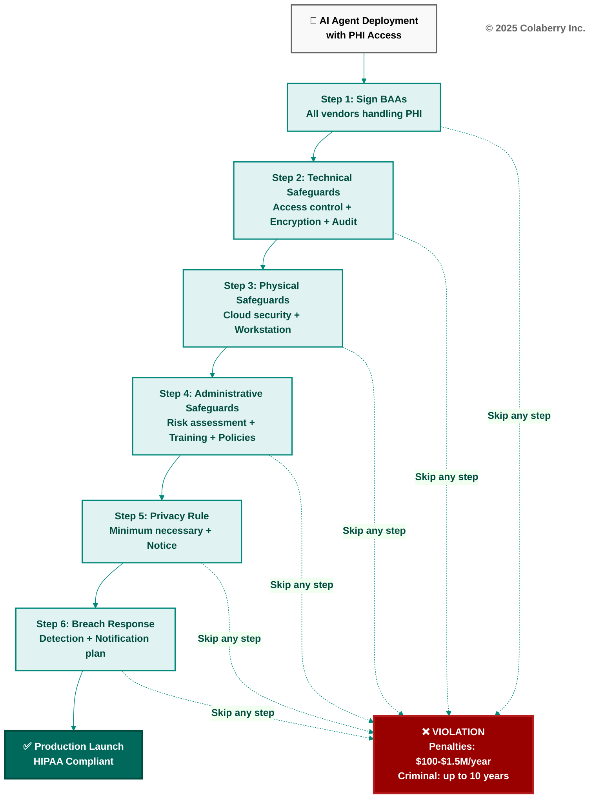
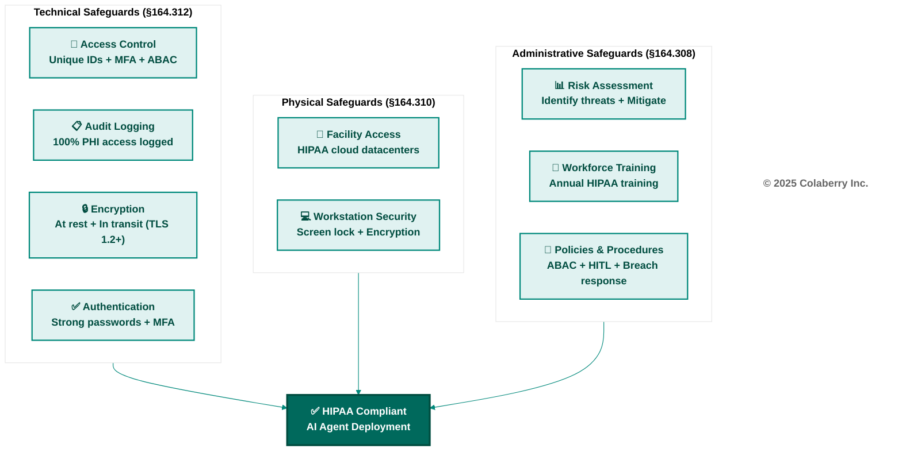
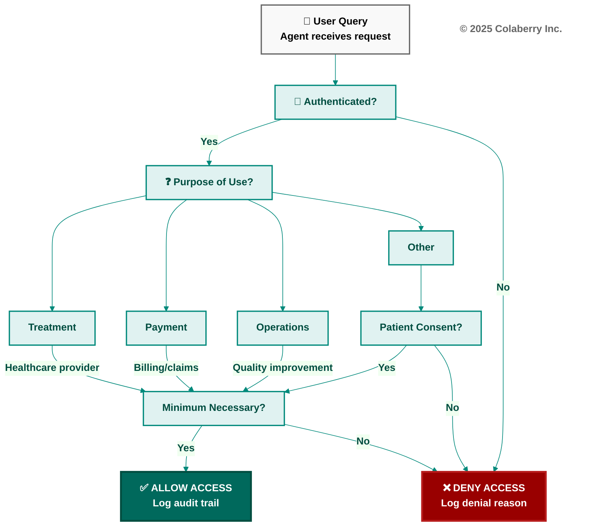

# Appendix DA-3: Healthcare Compliance Checklist
## HIPAA Requirements for AI Agent Deployment

**Purpose:** Comprehensive HIPAA compliance checklist for healthcare AI agents  
**Use:** Ensure all regulatory requirements met before production deployment  
**Date:** November 8, 2025  
**Version:** 1.0

---

## Important Disclaimer

**This checklist is for informational purposes only and does not constitute legal advice.** 

Consult with your organization's legal counsel, compliance officer, and HIPAA privacy/security officers before deploying AI agents that access Protected Health Information (PHI).

HIPAA regulations are complex and subject to interpretation. This checklist covers common requirements but may not be exhaustive for your specific use case.

---

## HIPAA Overview

**HIPAA = Health Insurance Portability and Accountability Act (1996)**

**Three Key Rules:**
1. **Privacy Rule:** How PHI can be used and disclosed
2. **Security Rule:** Technical, physical, and administrative safeguards for ePHI (electronic PHI)
3. **Breach Notification Rule:** Requirements when PHI is compromised

**Covered Entities:**
- Healthcare providers
- Health plans
- Healthcare clearinghouses

**Business Associates:**
- Vendors who process PHI on behalf of covered entities (e.g., cloud providers, AI vendors)

**Key Requirement:** Business Associate Agreements (BAAs) required with ALL vendors handling PHI

---

**Figure D.1: HIPAA Compliance Flow for AI Agent Deployment**

This diagram shows the sequential process for achieving HIPAA compliance before launching AI agents in production. Each step must be completed—skipping any step creates a compliance violation with severe civil and criminal penalties. The 6-step process begins with obtaining Business Associate Agreements from all vendors and ends with a documented breach response plan. Organizations should budget 4-8 weeks for BAA negotiations and 8-12 weeks total for implementing all technical, physical, and administrative safeguards before Week 12 production launch.

---

## Pre-Deployment Checklist

### Section 1: Business Associate Agreements (BAAs)

**✅ Required BAAs Obtained:**

- [ ] Cloud provider (Azure, AWS, GCP)
- [ ] Vector database vendor (Azure AI Search, Pinecone, etc.)
- [ ] LLM provider (OpenAI, Anthropic, etc.)
- [ ] Data warehouse vendor (Snowflake, BigQuery, etc.)
- [ ] CDC/streaming vendor (Fivetran, Confluent, etc.)
- [ ] Monitoring vendor (Datadog, Splunk, etc.)
- [ ] Data catalog vendor (Atlan, Collibra, etc.)
- [ ] Any other vendor processing PHI

**BAA Must Include:**
- Permitted uses and disclosures of PHI
- Safeguards to prevent misuse
- Subcontractor agreements (if vendor uses subcontractors)
- Breach notification obligations
- Return or destruction of PHI at contract termination

**Action:** Obtain signed BAAs from ALL vendors before Week 1. Lead time: 1-4 weeks.

---

### Section 2: HIPAA Security Rule - Technical Safeguards (§164.312)

#### § 164.312(a) - Access Control

**✅ Access Control Implemented:**

- [ ] **Unique User IDs (§164.312(a)(2)(i) - Required):**
  - No shared accounts
  - Every user has unique identifier
  - User ID tied to individual (not role like "admin")

- [ ] **Emergency Access Procedure (§164.312(a)(2)(ii) - Required):**
  - Break-glass access for emergencies documented
  - Emergency access requires justification (purpose-of-use)
  - Emergency access automatically audited

- [ ] **Automatic Logoff (§164.312(a)(2)(iii) - Addressable):**
  - Sessions timeout after 15 minutes of inactivity (recommended)
  - Or implement alternative (e.g., screen lock after 5 minutes)

- [ ] **Encryption and Decryption (§164.312(a)(2)(iv) - Addressable):**
  - PHI encrypted at rest (database encryption, Azure Key Vault)
  - PHI encrypted in transit (TLS 1.2+ for all network traffic)
  - Encryption keys managed separately (not stored with data)

**Agent-Specific Requirements:**
- [ ] ABAC policies operational (context-aware authorization)
- [ ] MFA required for PHI access
- [ ] Agent service accounts have unique IDs (not shared)

---

#### § 164.312(b) - Audit Controls (Required)

**✅ Audit Logging Implemented:**

- [ ] **100% PHI access logged:**
  - User ID (who accessed)
  - Timestamp (when accessed)
  - Action (read/write/delete)
  - Resource (what PHI accessed - patient ID, record ID)
  - Purpose of use (treatment/payment/operations)
  - Result (access allowed/denied)
  - Trace ID (for correlation)

- [ ] **Audit logs immutable:**
  - Cannot be deleted or modified
  - Write-once, read-many storage
  - Tamper-evident (checksums, blockchain, or similar)

- [ ] **Audit logs retained 6+ years:**
  - HIPAA requires 6 years minimum
  - Some states require longer (check state laws)

- [ ] **Audit log review process:**
  - Weekly automated review (anomaly detection)
  - Monthly manual review (compliance team)
  - Escalation process for suspicious activity

**Agent-Specific Requirements:**
- [ ] All LLM calls accessing PHI logged
- [ ] All RAG retrievals accessing PHI logged
- [ ] Multi-agent orchestration logged (which agent accessed what)
- [ ] Reasoning traces logged (why agent made decision)

---

#### § 164.312(c) - Integrity (Addressable)

**✅ Data Integrity Controls:**

- [ ] **Checksums or hashes:**
  - Verify data not corrupted in transit
  - Verify data not corrupted in storage
  - Alert on integrity violations

- [ ] **Version control:**
  - Track changes to PHI
  - Audit trail of modifications
  - Ability to restore previous versions

**Agent-Specific Requirements:**
- [ ] Embedding checksums (verify vector integrity)
- [ ] Semantic layer version control (track business logic changes)
- [ ] Model version tracking (which LLM version generated response)

---

#### § 164.312(d) - Person or Entity Authentication (Required)

**✅ Authentication Implemented:**

- [ ] **Strong authentication:**
  - Password complexity requirements (12+ characters, mixed case, numbers, symbols)
  - Or certificate-based authentication
  - Or biometric authentication

- [ ] **Multi-Factor Authentication (MFA) for PHI access:**
  - SMS, authenticator app, or hardware token
  - Required for all users accessing PHI
  - Required for administrator accounts

**Agent-Specific Requirements:**
- [ ] Users authenticate before querying agents about PHI
- [ ] Agent service accounts use managed identities (Azure) or IAM roles (AWS) - no passwords
- [ ] API keys rotated every 90 days

---

#### § 164.312(e) - Transmission Security (Addressable)

**✅ Transmission Security Implemented:**

- [ ] **Encryption in transit (TLS 1.2+):**
  - All API calls encrypted
  - All database connections encrypted
  - All streaming data encrypted
  - No unencrypted PHI transmission

- [ ] **Integrity controls:**
  - Checksums verify data not modified in transit
  - Digital signatures for critical transactions

**Agent-Specific Requirements:**
- [ ] LLM API calls encrypted (OpenAI, Anthropic use HTTPS)
- [ ] Vector DB queries encrypted
- [ ] CDC/streaming encrypted (Kafka SSL, Event Hubs encryption)

---

**Figure D.2: HIPAA Security Rule - Three Safeguard Categories**

HIPAA requires three types of safeguards for electronic PHI protection. **Technical safeguards** (§164.312) include access control with unique IDs and MFA, comprehensive audit logging of 100% of PHI access, encryption both at rest and in transit using TLS 1.2+, and strong authentication mechanisms. **Physical safeguards** (§164.310) mandate HIPAA-eligible cloud datacenters and workstation security with automatic screen locks and device encryption. **Administrative safeguards** (§164.308) require formal risk assessments, annual workforce training on HIPAA policies, and documented policies for ABAC authorization, HITL workflows, and breach response procedures. All three safeguard categories must be fully implemented before AI agents can access PHI in production.

---

### Section 3: HIPAA Security Rule - Physical Safeguards (§164.310)

#### § 164.310(a) - Facility Access Controls

**✅ Cloud Datacenter Security:**

- [ ] **Cloud provider is HIPAA-eligible:**
  - Azure (HIPAA regions: US Gov, US East, US West, etc.)
  - AWS (HIPAA regions: us-east-1, us-west-2, etc.)
  - GCP (HIPAA compliance available)

- [ ] **No local PHI storage:**
  - All PHI in cloud (not on laptops, workstations)
  - Developers cannot download PHI to local machines
  - Test data de-identified (no real PHI in dev/test)

**Agent-Specific Requirements:**
- [ ] No PHI in LLM prompts sent to non-BAA providers
- [ ] No PHI in logs stored locally (all logs in cloud with BAA)

---

#### § 164.310(b) - Workstation Use

**✅ Workstation Security:**

- [ ] **Screen lock after 5 minutes:**
  - Automatic timeout
  - Requires password/biometric to unlock

- [ ] **No PHI on unencrypted devices:**
  - Laptops encrypted (BitLocker, FileVault, etc.)
  - USB drives prohibited or encrypted

- [ ] **Physical security:**
  - Workstations in secure areas
  - No PHI visible to unauthorized persons

**Agent-Specific Requirements:**
- [ ] Agent UI screens lock after inactivity
- [ ] No PHI in agent response screenshots/exports without authorization

---

### Section 4: HIPAA Security Rule - Administrative Safeguards (§164.308)

#### § 164.308(a)(1) - Security Management Process (Required)

**✅ Risk Assessment:**

- [ ] **Formal risk assessment conducted:**
  - Identify threats to PHI (unauthorized access, breach, loss)
  - Assess likelihood and impact
  - Document risks and mitigations

- [ ] **Risk mitigation implemented:**
  - Technical controls (encryption, access control)
  - Policies (ABAC, minimum necessary)
  - Monitoring (audit log review, anomaly detection)

**Agent-Specific Risks:**
- ❌ Agent accesses wrong patient (Patient A sees Patient B's data)
- ❌ Agent discloses PHI to unauthorized person
- ❌ Agent training data contains identifiable PHI
- ❌ Prompt injection bypasses ABAC policies
- ❌ LLM hallucination creates false medical information

**Mitigations:**
- ✅ ABAC policies enforce row-level security
- ✅ HITL review for clinical decisions
- ✅ De-identification for training data
- ✅ Input validation prevents prompt injection
- ✅ Guardrails prevent hallucinations (confidence thresholds, human review)

---

#### § 164.308(a)(2) - Assigned Security Responsibility (Required)

**✅ Security Officer Designated:**

- [ ] **HIPAA Security Officer appointed:**
  - Responsible for implementing security measures
  - Authority to enforce policies
  - Reports to senior leadership

**Agent-Specific Responsibilities:**
- [ ] Reviews agent ABAC policies before deployment
- [ ] Approves agent vendor BAAs
- [ ] Monitors audit logs for agent-related anomalies

---

#### § 164.308(a)(3) - Workforce Security (Required)

**✅ Workforce Training:**

- [ ] **HIPAA training completed:**
  - All workforce members trained within 30 days of hire
  - Annual refresher training
  - Training documented (who, when, topic)

- [ ] **Agent-specific training:**
  - How agents work (LLMs, RAG, ABAC)
  - When to use HITL (clinical decisions)
  - How to detect agent errors (hallucinations, wrong patient)
  - Breach notification procedures (agent shows wrong data)

---

#### § 164.308(a)(4) - Information Access Management (Required)

**✅ Access Authorization:**

- [ ] **Access based on role:**
  - Doctors see all patient data (within scope of care)
  - Nurses see assigned patients only
  - Billing sees financial data (no clinical notes)
  - Agents inherit user's access (no additional privileges)

- [ ] **Access reviews (quarterly):**
  - Verify access still appropriate
  - Revoke access for terminated employees
  - Update agent ABAC policies as roles change

---

#### § 164.308(a)(5) - Security Awareness and Training (Required)

**✅ Security Training:**

- [ ] **Phishing awareness:**
  - Recognize phishing emails
  - Don't click suspicious links
  - Report suspected phishing

- [ ] **Password security:**
  - Strong passwords (12+ characters)
  - Don't share passwords
  - MFA enabled

- [ ] **Agent-specific security:**
  - Don't share agent credentials
  - Don't screenshot PHI
  - Don't copy PHI to personal devices

---

#### § 164.308(a)(6) - Security Incident Procedures (Required)

**✅ Incident Response:**

- [ ] **Incident detection:**
  - Automated alerts (unusual PHI access)
  - Manual reporting (workforce reports suspicious activity)
  - Agent-specific alerts (wrong patient access, ABAC violations)

- [ ] **Incident response plan:**
  - Contain incident (isolate affected systems)
  - Investigate (who, what, when, why)
  - Remediate (fix vulnerability, notify affected)
  - Document (incident log, lessons learned)

**Agent-Specific Incidents:**
- ❌ Agent accesses wrong patient → Alert immediately, review ABAC policies
- ❌ Agent discloses PHI to unauthorized person → Assess if breach, notify patients
- ❌ Prompt injection bypasses ABAC → Fix input validation, audit all similar queries

---

#### § 164.308(a)(7) - Contingency Plan (Required)

**✅ Disaster Recovery:**

- [ ] **Data backup:**
  - Daily backups of all PHI
  - Backups tested quarterly (restore from backup)
  - Backups encrypted and stored securely

- [ ] **Disaster recovery plan:**
  - RTO (Recovery Time Objective): 4 hours for critical systems
  - RPO (Recovery Point Objective): 1 hour (max data loss)
  - Agent-specific recovery: Vector DB, semantic layer, ABAC policies

---

#### § 164.308(a)(8) - Evaluation (Required)

**✅ Periodic Evaluation:**

- [ ] **Annual HIPAA assessment:**
  - Review compliance with Privacy Rule, Security Rule, Breach Notification Rule
  - Identify gaps
  - Remediate findings

- [ ] **Agent-specific evaluation:**
  - Review ABAC policy effectiveness (any unauthorized access?)
  - Review HITL workflows (any clinical decisions bypassed?)
  - Review bias testing (any disparate impact?)

---

### Section 5: HIPAA Privacy Rule (§164.500-§164.534)

#### § 164.502(b) - Minimum Necessary

**✅ Minimum Necessary Enforced:**

- [ ] **Access limited to minimum necessary:**
  - Users only see PHI needed for their job
  - Agents only retrieve PHI relevant to query
  - No "SELECT * FROM patients" (retrieve all columns)

**Agent Implementation:**
- [ ] **Query filtering:**
  - User asks "What's my lab result?" → Agent retrieves only that user's lab results
  - User asks "Show all patients" → DENIED (not minimum necessary without specific purpose)

- [ ] **Column-level filtering:**
  - Billing agent sees: patient ID, diagnosis codes, charges
  - Billing agent does NOT see: clinical notes, lab results (not needed for billing)

**Exceptions (minimum necessary NOT required):**
- Treatment between healthcare providers
- Patient requests for own records
- Required by law (court order, subpoena)

---

#### § 164.520 - Notice of Privacy Practices (Required)

**✅ Notice Provided:**

- [ ] **Notice of Privacy Practices updated to include AI agents:**
  - How agents use PHI (e.g., "We use AI to help answer your questions about your health records")
  - Patient rights (access, amendment, accounting)
  - How to opt-out (if applicable)

- [ ] **Notice provided to all patients:**
  - At first encounter
  - Posted in facility
  - Available on website
  - Acknowledgment of receipt obtained

---

#### § 164.524 - Access to PHI (Required)

**✅ Patient Access Supported:**

- [ ] **Patients can access their PHI:**
  - Within 30 days of request
  - In format requested (paper, electronic)
  - Reasonable fees (copying, postage)

**Agent-Specific:**
- [ ] Patients can request "what did AI agents say about me?"
- [ ] Agent logs available to patients (what queries run, what data accessed)
- [ ] Patients can opt-out of agent access (if clinically feasible)

---

#### § 164.528 - Accounting of Disclosures (Required)

**✅ Accounting Provided:**

- [ ] **Track all PHI disclosures:**
  - Date of disclosure
  - Recipient (who received PHI)
  - Description of PHI disclosed
  - Purpose of disclosure

- [ ] **Patient can request accounting:**
  - Past 6 years of disclosures
  - Within 60 days of request
  - Free (first request in 12 months)

**Agent-Specific:**
- [ ] Agent disclosures tracked (e.g., agent shared data with external API)
- [ ] Patients can request "what did AI agents say about me?"

---

**Figure D.3: HIPAA Privacy Rule Decision Tree for PHI Access**

This decision tree shows how AI agents determine whether PHI access is permitted under HIPAA Privacy Rule. The agent first verifies user authentication, then evaluates the purpose of use. **Treatment, Payment, and Operations (TPO)** purposes proceed directly to minimum necessary check and do not require patient consent. For **all other purposes**, explicit patient consent is required before evaluating minimum necessary. The minimum necessary standard ensures the agent retrieves only the specific PHI needed for the stated purpose—for example, a billing query retrieves diagnosis codes and charges but not clinical notes. All access attempts (allowed or denied) are logged with timestamp, user ID, purpose, and result for HIPAA audit compliance.

---

### Section 6: HIPAA Breach Notification Rule (§164.400-§164.414)

#### Breach Definition

**Breach = Unauthorized acquisition, access, use, or disclosure of PHI that compromises privacy/security**

**Exceptions (not considered breaches):**
- Unintentional access by workforce within scope of authority
- Inadvertent disclosure to another person with authorization
- Disclosure where recipient couldn't reasonably retain information

**Agent-Specific Breach Scenarios:**
- ❌ Agent shows Patient A's data to Patient B → BREACH
- ❌ Agent accesses patient record without authorization → BREACH
- ❌ Agent discloses PHI to unauthorized third party → BREACH
- ❌ Data breach exposes patient embeddings with identifiable info → BREACH
- ✅ Agent error caught by HITL before disclosure → NOT a breach (if caught before patient sees it)

---

#### Breach Notification Requirements

**✅ Breach Response Plan:**

- [ ] **Immediate assessment:**
  - Detect breach within 24 hours (monitoring/alerts)
  - Assess scope (how many patients? what data?)
  - Contain breach (isolate affected systems)

- [ ] **Notification to individuals (<500 affected):**
  - Within 60 days of discovery
  - By mail or email (if authorized)
  - Includes: what happened, what data involved, what organization is doing, patient steps

- [ ] **Notification to HHS (≥500 affected):**
  - Within 60 days of discovery
  - Submit to HHS Breach Portal (public "wall of shame")

- [ ] **Notification to media (≥500 affected in same state/jurisdiction):**
  - Within 60 days
  - Prominent media outlets

- [ ] **Documentation:**
  - All breaches documented (including <500)
  - Breach log maintained for 6 years
  - Includes actions taken to mitigate

**Agent-Specific Requirements:**
- [ ] Automated breach detection (agent accessed wrong patient → alert immediately)
- [ ] Runbook for agent-caused breaches (what to do when agent shows wrong data)
- [ ] Breach notification templates ready (can notify within 60 days)

---

## Agent-Specific HIPAA Requirements

### 1. Human-in-the-Loop (HITL) for Clinical Decisions

**✅ HITL Required:**

- [ ] **All clinical recommendations reviewed by licensed clinician:**
  - Diagnoses
  - Treatment plans
  - Medication prescriptions
  - Patient discharge decisions

- [ ] **HITL workflow operational:**
  - Agent generates recommendation
  - Routes to clinician for approval
  - Clinician can approve, reject, or modify
  - Final decision documented (who approved, when, why if modified)

- [ ] **Agent CANNOT auto-approve clinical decisions**

**Rationale:** Avoids practicing medicine without a license, maintains professional liability

---

### 2. De-Identification for Non-Clinical Uses

**✅ De-Identification Used:**

- [ ] **Agent training/fine-tuning uses de-identified data:**
  - Remove 18 HIPAA identifiers (names, dates, ZIP codes, etc.)
  - Or use Expert Determination method (statistician certifies low re-identification risk)

- [ ] **Agent evaluation/testing uses de-identified data:**
  - Test datasets don't contain real PHI
  - Or use synthetic data (generated, not real patients)

**18 HIPAA Identifiers to Remove:**
1. Names
2. Geographic subdivisions smaller than state
3. Dates (except year) - birth date, admission date, discharge date, death date
4. Telephone numbers
5. Fax numbers
6. Email addresses
7. Social Security Numbers
8. Medical Record Numbers
9. Health Plan Beneficiary Numbers
10. Account numbers
11. Certificate/license numbers
12. Vehicle identifiers
13. Device identifiers/serial numbers
14. URLs
15. IP addresses
16. Biometric identifiers (fingerprints, voiceprints)
17. Full-face photos
18. Any other unique identifying number/characteristic

**Agent-Specific:**
- [ ] Embeddings de-identified (no names/dates in vector metadata)
- [ ] LLM prompts de-identified for non-clinical testing

---

### 3. Third-Party AI Model Vendors

**✅ AI Vendor Compliance:**

- [ ] **OpenAI/Anthropic/etc. BAA signed:**
  - Zero data retention (OpenAI's zero retention policy for BAA customers)
  - No training on customer data
  - Encryption at rest and in transit
  - SOC2 Type II certified

- [ ] **Data residency understood:**
  - Where is data processed? (US, EU, other?)
  - Complies with state laws? (e.g., California CMIA)

- [ ] **Model versioning:**
  - Which model version used? (GPT-4o, Claude 3.5 Sonnet, etc.)
  - Model updates controlled (not auto-upgraded without testing)

---

### 4. Bias and Fairness (Civil Rights Act, ADA)

**✅ Non-Discrimination:**

- [ ] **Bias testing completed:**
  - Across age, gender, race, ethnicity, income
  - Disparate impact <10% (no group accuracy <80% if overall 85%)

- [ ] **Mitigation strategies:**
  - Diverse training data
  - Fairness constraints in model
  - Human review of edge cases

- [ ] **Documentation:**
  - Bias testing results documented
  - Mitigation strategies documented
  - Ongoing monitoring (quarterly bias re-assessment)

**Rationale:** Avoid discrimination claims under Title VI (Civil Rights Act) and ADA

---

## Pre-Launch Final Checklist

**Before Week 12 production launch, verify ALL items:**

### Technical Safeguards
- [ ] Access control (unique IDs, emergency access, MFA)
- [ ] Audit logging (100% PHI access, immutable, 6+ year retention)
- [ ] Encryption (at rest and in transit, TLS 1.2+)
- [ ] Authentication (strong passwords, MFA for PHI)

### Physical Safeguards
- [ ] Cloud datacenters HIPAA-eligible
- [ ] No local PHI storage
- [ ] Workstations secured (screen lock, encryption)

### Administrative Safeguards
- [ ] Risk assessment completed
- [ ] Workforce trained (HIPAA + agent-specific)
- [ ] ABAC policies operational
- [ ] HITL workflows tested

### Privacy Rule
- [ ] Minimum necessary enforced
- [ ] Notice of Privacy Practices updated
- [ ] Patient rights supported (access, accounting)

### Breach Notification
- [ ] Breach response plan documented
- [ ] Breach detection automated
- [ ] Notification templates ready

### Agent-Specific
- [ ] BAAs signed with ALL vendors
- [ ] HITL operational for clinical decisions
- [ ] Bias testing passed (<10% disparate impact)
- [ ] De-identification for non-clinical uses

---

## HIPAA Penalties

**Why compliance matters: Penalties are severe**

### Civil Penalties (HHS OCR)
- **Tier 1:** $100-50,000 per violation (unknowing)
- **Tier 2:** $1,000-50,000 per violation (reasonable cause)
- **Tier 3:** $10,000-50,000 per violation (willful neglect, corrected)
- **Tier 4:** $50,000 per violation (willful neglect, not corrected)
- **Annual Maximum:** $1.5 million per violation type

### Criminal Penalties (DOJ)
- **Tier 1:** Up to $50,000 and 1 year (unknowing)
- **Tier 2:** Up to $100,000 and 5 years (false pretenses)
- **Tier 3:** Up to $250,000 and 10 years (intent to sell/transfer/misuse)

### Additional Consequences
- Loss of patient trust
- Reputation damage
- State attorney general lawsuits
- Class action lawsuits
- Exclusion from federal health programs

---

## Resources

**HIPAA Regulations:**
- HHS OCR: https://www.hhs.gov/hipaa/index.html
- HIPAA Privacy Rule: https://www.hhs.gov/hipaa/for-professionals/privacy/index.html
- HIPAA Security Rule: https://www.hhs.gov/hipaa/for-professionals/security/index.html

**Cloud Provider HIPAA Resources:**
- Azure HIPAA: https://learn.microsoft.com/en-us/azure/compliance/offerings/offering-hipaa-us
- AWS HIPAA: https://aws.amazon.com/compliance/hipaa-compliance/
- GCP HIPAA: https://cloud.google.com/security/compliance/hipaa

**AI Vendor HIPAA Resources:**
- OpenAI BAA: https://openai.com/enterprise-privacy
- Anthropic BAA: https://www.anthropic.com/legal/privacy

---

**© 2025 Colaberry Inc. All rights reserved.**

**DISCLAIMER:** This checklist is for informational purposes only and does not constitute legal advice. Consult with qualified legal counsel and HIPAA compliance experts before deploying healthcare AI agents.

---

**END OF APPENDIX D**
