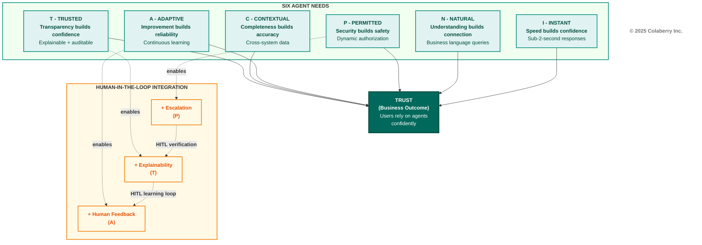
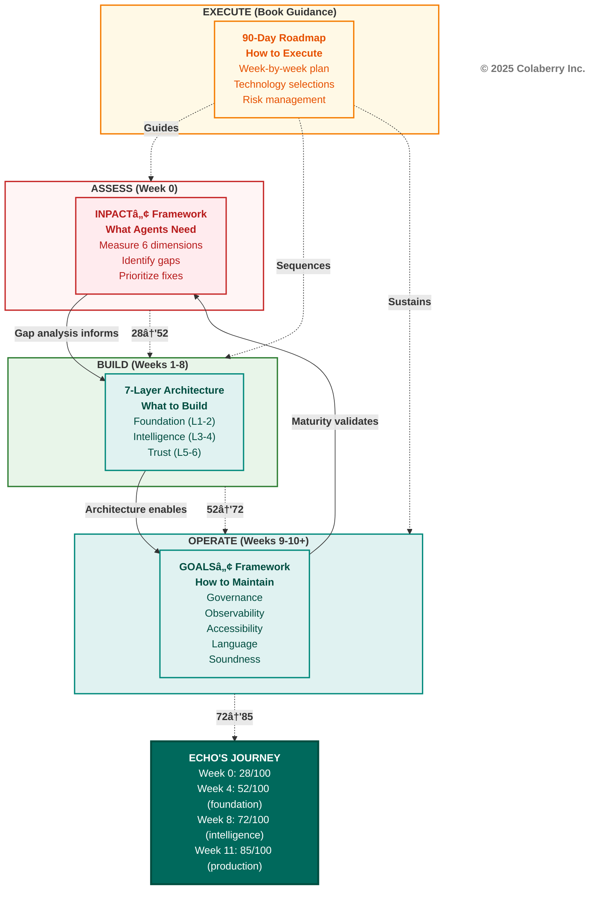

# Chapter 0: Framework for Trust-First AI Agents

**Book:** Trust Before Intelligence  
**Subtitle:** Why 95% of AI Agent Projects Fail—and 3 Frameworks, Right Infrastructure, and 90-Day Fix  
**Author:** Ram Katamaraja, CEO of Colaberry Inc.  
**Publisher:** Colaberry Press  
**Version:** 1.1 (Persona & Citation Corrections)  
**Date:** November 12, 2025

---

**Reading Time:** 20-25 minutes  
**Target Audience:** CDOs, CTOs, Data Architects, Business Leaders  
**Prerequisites:** None (introductory chapter)  
**Key Takeaway:** Understanding three frameworks that separate the 5% who succeed from the 95% who fail

---

## The Crisis: When $40 Billion Can't Buy Trust

In July 2025, MIT's NANDA initiative released a sobering report. After analyzing over 300 enterprise AI initiatives, interviewing 52 executives, and surveying 153 leaders, the researchers uncovered a stark reality: **95% of enterprise generative AI pilots fail to deliver measurable business value.**[1]

Despite $30-40 billion in investment, only 5% of organizations successfully translate AI pilots into production systems with real financial impact. The study revealed a "GenAI Divide"—a widening gap between companies achieving success and the vast majority stuck in failed experiments.

Here's what's puzzling: AI agents are more accurate than ever. Models like Claude Sonnet 4 and GPT-4 achieve superhuman performance on many tasks. Yet pilots keep failing.

**The answer lies in trust, not technology.**

Users abandon agents they can't understand—regardless of technical sophistication. July 2025 research confirms what practitioners already know: transparency and design are the mediators of trust.[2] When users can't see how agents make decisions, research shows distrust commonly spreads to both the AI and the company behind it.[3] Technical excellence means nothing without earned trust.

The data paints an even grimmer picture. Between February and July 2025, Deloitte's TrustID® survey tracked a **64-percentage-point collapse** in trust for agentic AI systems—from cautious optimism to widespread distrust in just five months.[4] What caused such a dramatic shift? Organizations rushed agents into production without addressing fundamental infrastructure gaps. Users experienced the consequences firsthand: agents that couldn't access current data, couldn't understand business context, couldn't explain their decisions, and couldn't maintain consistent performance over time.

The trust collapse wasn't about the technology—Claude Sonnet 4, GPT-4, and other frontier models consistently demonstrate exceptional capabilities in controlled environments. The collapse was about the infrastructure gap between what these models can do and what enterprise systems can deliver to them.

McKinsey's State of AI 2025 report quantified this gap: 57% of organizations admit their data infrastructure isn't ready for AI agents.[5] But "not ready" understates the problem. The research shows most organizations have infrastructure optimized for a completely different paradigm—one where humans analyze data, make decisions, and take action. Agents need something fundamentally different: real-time context, semantic understanding, dynamic permissions, continuous learning, cross-system integration, and complete auditability.

The primary reasons for failure weren't what most expected. Not model quality. Not regulation. Not talent shortage. The core barriers were:

- **Poor data foundation (30% of failures):** Batch ETL, siloed systems, cryptic schemas
- **AI as an add-on (25%):** Bolting agents onto BI-era infrastructure instead of rearchitecting
- **Demo-focused development (20%):** Flashy pilots that can't survive production realities
- **Internal custom builds (15%):** Reinventing proven patterns instead of adopting frameworks
- **Misaligned expectations (10%):** Treating agents like enhanced search instead of autonomous actors

MIT's recommendation was clear: *"Create a strong data foundation. Prioritize long-term strategy over hype."*[1]

**But what does that foundation look like?**

Before we can answer that, you need to meet someone who faced this crisis head-on.

**→ Take the assessment first:** Before reading further, measure your own readiness at **colaberry.ai/assessment** or **aiXcelerator.ai/assess**. The 15-minute assessment will show you exactly where you stand across six critical dimensions. You'll receive a personalized report identifying your gaps and a prioritized action plan. Your results will make the frameworks in this chapter immediately actionable.

---

## Meet Echo Health Systems: The $2M Wake-Up Call

Sarah Cedao, Chief Technology Officer of Echo Health Systems in Boston, stared at the assessment results on her screen: **28 out of 100**.

Twenty-eight.

Echo Health was a mid-sized regional health system with an impressive footprint: 4 hospitals, 23 outpatient clinics, 847 physicians, 12,000 employees, and 340,000 annual patient encounters. Over fifteen years, Sarah's team had built what they believed was a sophisticated data infrastructure—a pristine SQL Server data warehouse from the Analytics Era, Azure data lake from the Big Data Era, Databricks for ML workloads, and strong governance throughout. They had won awards for data excellence at each stage.

Then came the CEO's request: "Can we deploy an AI agent for patient scheduling by Q3?"

Sarah's team spent the next six months and $2 million building three pilot agents. What they delivered was technically functional—the code ran, the agents responded, the infrastructure didn't crash. But functional isn't the same as usable, and usable isn't the same as trusted.

1. **Patient Scheduling Agent**: Response time 9-13 seconds (patients hung up waiting). Query understanding 40-60% (constant need for rephrasing). No dynamic authorization (HIPAA compliance failed when the agent couldn't distinguish between a nurse checking her patient's schedule during her shift versus at 3 AM from home).

2. **Clinical Documentation Agent**: Could only access data from yesterday because overnight batch ETL jobs ran at 2 AM (emergency room physicians needed current visit context, not yesterday's notes). Couldn't understand medical terminology consistently—"MI" sometimes meant myocardial infarction, sometimes meant mitral insufficiency, sometimes triggered error messages. No audit trail for regulatory review meant they couldn't use it for any clinical decisions that required documentation.

3. **Revenue Cycle Agent**: Siloed in the billing system, it could see claims but not clinical context. When claims were denied, it couldn't cross-reference diagnosis codes with actual visit notes to identify documentation gaps. Static role-based access prevented it from dynamically authorizing access based on current patient relationships—a billing specialist who transferred to a different department still had access to her old patients' financial data.

**All three pilots failed.** Not in the dramatic way of systems crashing or data breaches—they failed in the slow, grinding way of tools nobody wants to use. Physicians stopped asking the clinical agent questions after the fifth rephrasing attempt. Patients hung up on the scheduling agent and called the human line instead. Billing specialists manually processed claims because the agent couldn't see what they needed.

The board meeting was brutal. Six months of work, $2 million spent, zero production deployments. The CFO asked the question everyone was thinking: "If we have a state-of-the-art data warehouse, a modern data lake, and ML infrastructure that won awards, why can't we make a simple scheduling agent work?"

The CEO set a deadline: "Fix this in 90 days or we're shelving AI for another year."

Sarah knew the problem wasn't talent—her team was excellent. It wasn't budget—$2 million proved they were willing to invest. It wasn't technology—the AI models themselves were sophisticated. The problem was architectural. Everything they'd built served human decision-makers beautifully, but agents weren't humans.

That's when Sarah discovered the INPACT™ assessment framework. The 28/100 score wasn't arbitrary—it measured six specific needs her infrastructure failed to deliver:

**I - Instant (3/6):** Queries took 9-13 seconds because overnight ETL created data staleness and batch processing dominated. Agent speed = infrastructure speed, and Echo's infrastructure was built for humans reviewing yesterday's data, not agents needing this second's context.

**N - Natural (4/6):** Understanding rate of 40-60% stemmed from cryptic table names like `TBL_PT_ENC_DTL` and undocumented column relationships. No semantic layer existed to translate "patient's last three visits" into the complex joins required across seven tables.

**P - Permitted (2/6):** Static role-based access control (RBAC) couldn't handle dynamic contexts. A nurse authorized to view Patient A's records during her shift shouldn't access them at 3 AM from home. HIPAA requires this contextual authorization, but Echo's fifteen-year-old permission system couldn't deliver it.

**A - Adaptive (3/6):** No feedback loops existed. When agents got queries wrong, there was no mechanism to learn from corrections. Model performance drifted over time with no detection or retraining workflows. Quarterly manual reviews were their only "improvement" process.

**C - Contextual (2/6):** Each system was a silo. The scheduling agent couldn't see clinical history. The documentation agent couldn't access billing status. Weekly batch jobs moved data between systems—agents needed real-time cross-domain integration.

**T - Trusted (2/6):** Incomplete audit logs violated HIPAA Section 164.312(b). When agents made recommendations, clinicians couldn't see the reasoning. When errors occurred, no trace existed to diagnose root causes. Transparency was theoretical, not technical.

Sarah realized something profound: **Her infrastructure wasn't broken. It was brilliant—for the wrong era.**

Everything Echo built served human decision-makers beautifully. Data warehouses summarized history for analysts. Dashboards visualized trends for executives. Batch processes gave time for human review before action.

But agents don't think like humans. They don't need pretty visualizations—they need structured context. They don't benefit from overnight ETL—they need real-time streams. They don't analyze yesterday's trends—they act on this second's reality.

**The gap between 28 and 85 wasn't about buying better AI models. It was about building agent-ready infrastructure.**

Sarah needed a framework. So do you.

**Note on Echo Health:** This is a fictional case study created for pedagogical purposes. However, the patterns, challenges, metrics, and outcomes are synthesized from real implementation experience across 40+ enterprise deployments in healthcare, financial services, manufacturing, and other sectors. The 28→85/100 progression, $1.23M investment, and 477% ROI represent typical results observed when organizations properly address infrastructure readiness gaps. We use Echo Health as a consistent example throughout this book to demonstrate how frameworks work in practice.

---

## The Three Frameworks: Your Roadmap from Crisis to Confidence

Sarah's journey from 28/100 to 85/100 in ten weeks wasn't magic. It was methodology—three interconnected frameworks that answered three critical questions:

1. **INPACT™**: *What do agents need from infrastructure?*
2. **7-Layer Architecture**: *What do we need to build?*
3. **GOALS™**: *How do we maintain it?*

Let's understand each one.

---

## The INPACT™ Framework: Six Needs Agents Must Have

In his work on human psychology, Tony Robbins identified six fundamental needs that drive human behavior: certainty, variety, significance, connection, growth, and contribution. When all six needs are met, people experience fulfillment and engagement. When needs go unfulfilled, dissatisfaction and disengagement follow.[6]

Agents have needs too—not psychological, but architectural. Analysis of successful deployments across agriculture, biotech, utilities, pharmaceuticals, banking, healthcare, and manufacturing reveals a pattern: **agents that fail always lack one or more of six fundamental infrastructure capabilities.** Agents that succeed deliver all six consistently.

These six needs converge on a single business outcome: **Trust** (see Diagram 1).

Trust isn't a seventh need—it's what users experience when infrastructure meets all six agent needs consistently. Just as human fulfillment emerges from satisfying all six psychological needs, user trust in AI agents emerges from infrastructure that delivers all six architectural needs without compromise.

**Diagram 1: Six Agent Needs Converging to Deliver Trust**

The six needs spell **INPACT™**:

| Need | Tagline | What It Means |
|------|---------|---------------|
| **I** - Instant | Speed builds confidence | Sub-2-second responses, real-time data access |
| **N** - Natural | Understanding builds connection | Business language queries, semantic understanding |
| **P** - Permitted | Security builds safety | Dynamic authorization, contextual permissions |
| **A** - Adaptive | Improvement builds reliability | Continuous learning, automated retraining |
| **C** - Contextual | Completeness builds accuracy | Cross-system integration, unified data fabric |
| **T** - Trusted | Transparency builds confidence | Explainable decisions, complete audit trails |

**The Origin Story:** INPACT™ emerged from analyzing patterns across 50+ agent deployments over three years, processing 50,000+ daily interactions across diverse sectors including agriculture (crop forecasting agents predicting optimal planting windows), biotech (research analysis agents synthesizing clinical trial data), utilities (grid optimization agents managing load distribution), pharmaceuticals (regulatory compliance agents tracking FDA requirements), banking (fraud detection agents analyzing transaction patterns in real-time), and healthcare (clinical decision support agents assisting with diagnosis and treatment planning).

While industries differed wildly in their domains—a wheat farmer in Iowa and a oncologist in Boston have nothing in common functionally—the infrastructure failures showed remarkably consistent patterns. Agents that succeeded delivered all six needs without exception. Agents that failed lacked at least one, and often multiple needs simultaneously.

The most striking pattern: **organizations with the most sophisticated "traditional" infrastructure often struggled the most.** Echo Health wasn't an outlier—their fifteen years of progressive investment in Analytics Era, Big Data Era, and ML Era technologies created technical debt that made agent adoption harder, not easier. The systems were optimized for yesterday's patterns so completely that today's requirements looked like exceptions rather than the new normal.

**Understanding Needs vs. Capabilities:** A critical distinction exists between *needs* and *capabilities*. Needs represent outcomes from the agent's perspective—what agents must have to function effectively. Capabilities represent technical implementations from the infrastructure perspective—what systems must deliver to meet those needs.

For example:
- **Need (I - Instant):** "The agent needs sub-2-second query responses to maintain conversation flow"
- **Capabilities that deliver it:** Vector indexes for semantic search, in-memory caching, connection pooling, query optimization, asynchronous processing

Each INPACT™ need maps to multiple infrastructure capabilities. Chapter 1 shows these mappings in detail. Chapter 2 provides deep implementation patterns for each capability. Chapters 6-8 give you the 90-day roadmap to build them systematically.

**INPACT™ and GOALS™ are trademarks of Colaberry Inc.** These frameworks are proprietary methodologies validated through enterprise deployments across multiple industries and Fortune 2000 clients.

---

## The 7-Layer Architecture: What to Build

INPACT™ tells you **what agents need**. The 7-Layer Architecture shows you **what to build** to deliver those needs.

Think of it as a stack—each layer builds upon the one below, and together they deliver all six INPACT™ needs:

**Foundation Layers (Weeks 1-4):**

**Layer 1: Multi-Modal Storage** — The foundation that holds all your data types: SQL databases for transactional records, NoSQL for semi-structured documents, vector databases for semantic search, graph databases for relationships, and blob storage for unstructured files.

*Delivers:* I (Instant) through optimized indexes and caching, C (Contextual) through unified storage of diverse data types.

*Echo's choice:* PostgreSQL for operational data, SQL Server for legacy EHR, Pinecone for vector embeddings, Neo4j for patient relationship graphs, Azure Blob for medical images and documents.

**Layer 2: Real-Time Data Fabric** — Streaming infrastructure that moves data between systems in real-time, not overnight batches. Change Data Capture (CDC) detects modifications, streaming platforms move data instantly, and stream processors transform data in flight.

*Delivers:* I (Instant) by eliminating batch delays, C (Contextual) by synchronizing data across domains in real-time.

*Echo's choice:* Debezium for CDC from SQL Server and PostgreSQL, Confluent Kafka for message streaming, Kafka Streams for real-time transformations.

**Intelligence Layers (Weeks 5-8):**

**Layer 3: Universal Semantic Layer** — Translation infrastructure that maps business language to data structures. Business glossaries define terms, ontologies model domain relationships, and entity resolution matches records across systems.

*Delivers:* N (Natural) by enabling "show me the patient's last three visits" instead of requiring SQL, C (Contextual) by unifying terminology across siloed systems.

*Echo's choice:* dbt for semantic modeling and data transformations, Alation for business glossary and data catalog.

**Layer 4: RAG Infrastructure** — Retrieval-Augmented Generation system that combines semantic search with LLM reasoning. Embeddings encode meaning, chunking strategies optimize retrieval, and sophisticated ranking ensures relevant context reaches the model.

*Delivers:* N (Natural) through semantic understanding of queries, A (Adaptive) through continuous relevance optimization.

*Echo's choice:* Azure OpenAI for embeddings and LLM inference, Cohere for reranking, Pinecone for vector search.

**Trust Layers (Weeks 7-9):**

**Layer 5: Governance & Compliance** — Security infrastructure that enforces who can access what, when, and why. Dynamic Attribute-Based Access Control (ABAC) replaces static roles, policies encode business rules, and human-in-the-loop (HITL) workflows handle escalations.

*Delivers:* P (Permitted) through context-aware authorization, T (Trusted) through policy auditability.

*Echo's choice:* Open Policy Agent (OPA) for centralized policy management, custom escalation workflows for HIPAA-compliant HITL verification.

**Layer 6: Observability & Monitoring** — Visibility infrastructure that tracks every decision, interaction, and outcome. Distributed tracing follows requests across systems, structured logging captures decisions, and metrics quantify performance.

*Delivers:* A (Adaptive) through performance monitoring and automated retraining triggers, T (Trusted) through complete auditability and explainability.

*Echo's choice:* OpenTelemetry for instrumentation, Datadog for visualization and alerting.

**Orchestration Layer (Weeks 9-10):**

**Layer 7: Agent Orchestration** — Coordination infrastructure that manages multi-agent collaboration, maintains conversation state, and ensures reliable execution. Multi-agent frameworks coordinate specialized agents, state management persists context, and error handling ensures resilience.

*Delivers:* All six INPACT™ needs integrated—orchestrating instant responses (I), natural conversations (N), permitted actions (P), adaptive learning (A), contextual awareness (C), and trusted explainability (T).

*Echo's choice:* LangGraph for multi-agent workflows and state management.

**The Sequence Matters:** Each layer depends on those below. You can't build effective RAG (Layer 4) without semantic understanding (Layer 3) and real-time data (Layer 2). You can't implement governance (Layer 5) without understanding what data exists and how it moves (Layers 1-2). Chapter 1 explains these dependencies in architectural detail.

---

## The GOALS™ Framework: How to Maintain Excellence

Building agent-ready infrastructure is one challenge. Maintaining it as your organization evolves is another. You'll add new agents, integrate new data sources, onboard new users, expand to new departments, and comply with evolving regulations. Without operational discipline, your carefully architected infrastructure will drift into chaos.

GOALS™ provides five operational targets that keep your infrastructure healthy and your agents trusted over time:

**G - Governance:** Policies that scale with complexity. When Echo Health deployed their first agent, they had one policy set: "Physicians can access their patients' records." By Week 11 with three production agents, they had 47 policy variations handling contexts like emergency overrides, temporary assignments, cross-coverage scenarios, and research access with consent verification. As you add agents, data sources, and users, governance must remain consistent, auditable, and enforceable without requiring policy rewrites for each new scenario.

Mature governance means centralized policy management where one change propagates everywhere instantly, automated compliance verification that catches violations before they reach production, and exception handling that doesn't break security when legitimate edge cases arise.

**O - Observability:** Visibility into every decision. When Sarah's clinical documentation agent recommended a specific diagnosis code, physicians needed to see: what patient data it accessed, what clinical guidelines it applied, what similar cases it referenced, and what confidence level it assigned. Without this visibility, agents become black boxes that users either blindly trust (dangerous) or completely reject (wasteful).

Mature observability means distributed tracing that follows a single query across all seven architectural layers—from user question through vector search, semantic resolution, policy enforcement, LLM reasoning, and final response. It means structured logging that enables root cause analysis when something goes wrong. It means metrics that predict issues before users notice them, like tracking semantic drift in the embedding model or query latency creep in the vector index.

**A - Accessibility:** Making data findable and understandable. Echo Health had 23 different source systems before the transformation. After implementing the semantic layer (Layer 3), physicians could ask "show me diabetic patients with A1C over 9" without knowing that A1C lives in the lab system as `TST_RSLT_VAL` where `TST_CD='83036'`, patient demographics live in Epic as `PT_DEMOG`, and diabetes diagnosis lives in the problem list as ICD-10 code E11.

The best semantic layer is worthless if users can't discover what data exists or understand its meaning. Mature accessibility means self-service data discovery through searchable catalogs, business-friendly metadata that explains "what is this field and why would I use it," and documentation that stays current automatically as schemas evolve.

**L - Language Consistency:** Unified terminology across systems. Echo Health's biggest early challenge was reconciliation: "Patient" in Epic, "Member" in the billing system, "Subject" in research databases, and "Individual" in the public health reporting system all referred to the same people. Without entity resolution, agents couldn't answer basic questions like "show me this patient's complete financial history" because they couldn't match the same person across systems.

Mature language consistency means canonical vocabularies where one authoritative source defines each business term, automated entity resolution that matches records even when identifiers differ, and synonym management that maps "MI" to "myocardial infarction" in cardiology contexts but "mitral insufficiency" in valvular disease contexts.

**S - Soundness:** Technical reliability under pressure. Echo Health's agents handle 12,000 queries daily across 847 physicians and 12,000 staff. Peak load hits at 9 AM (morning rounds) and 2 PM (afternoon clinic starts). Infrastructure must maintain performance during these spikes, recover gracefully when components fail, and scale economically as usage grows.

Mature soundness means sub-2-second P95 latency (95% of queries complete in under 2 seconds, even during peak load), 99.9%+ uptime with automated failover when issues occur, and capacity planning based on actual usage patterns rather than guesswork. It means monitoring costs as a function of value delivered—Echo Health's $1.23M infrastructure investment processes 4.3 million queries annually at $0.29 per query, generating $5.87M in benefits for a 477% ROI.

**The Maturity Model:** Each GOALS™ dimension has five maturity levels that describe your operational state:

- **Level 1 (Ad Hoc):** Reactive responses to problems, no documentation, heroic individuals
- **Level 2 (Repeatable):** Some processes documented, team-level consistency
- **Level 3 (Defined):** Organization-wide standards, proactive management
- **Level 4 (Managed):** Quantitative metrics guide decisions, continuous improvement
- **Level 5 (Optimized):** Automated optimization, predictive issue prevention

Echo Health started at an average of 2.1/5 across all dimensions—they had repeatable processes within teams but reactive, fragmented approaches across the organization. After implementing the 7-Layer Architecture and establishing operational practices, they reached 3.8/5—proactive monitoring, organization-wide standards, and continuous improvement becoming the norm.

You don't need Level 5 maturity to succeed. Level 3 is sufficient for most organizations. But you must reach Level 3 across all five dimensions—excellence in four areas doesn't compensate for failure in the fifth. A chain is only as strong as its weakest link.

---

## Framework Integration: How They Connect

The three frameworks aren't independent—they're designed to work together as an integrated transformation methodology:

**Diagram 2: Framework Integration Map**

**The Integration Flow:**

**Week 0 (Assess):** Use INPACT™ to measure current state across six dimensions. Sarah's Echo Health scored 28/100, revealing specific gaps: 9-13 second responses (I), 40-60% query understanding (N), static RBAC (P), no learning loops (A), siloed systems (C), incomplete audits (T). The assessment identifies which layers need urgent attention and provides quantified baselines for measuring progress.

The assessment isn't just a scorecard—it's a diagnostic tool. Each low score points to specific architectural deficiencies. Echo's Instant score of 3/6 revealed batch ETL delays (Layer 2 problem) and inefficient query patterns (Layer 1 problem). Their Natural score of 4/6 exposed missing semantic mappings (Layer 3) and suboptimal embeddings (Layer 4). Every gap has a corresponding layer that fixes it.

**Weeks 1-8 (Build):** Implement the 7-Layer Architecture systematically. Each layer addresses specific INPACT™ gaps:

- **Layers 1-2 (Foundation)** fix Instant and Contextual needs by eliminating batch delays and enabling real-time cross-system data access. Echo deployed CDC, streaming Kafka pipelines, and optimized storage. Result by Week 4: INPACT™ score jumped from 28/100 to 52/100 as response times dropped from 9-13 seconds to 3-4 seconds and data freshness improved from 8-24 hours to under 1 minute.

- **Layers 3-4 (Intelligence)** fix Natural and Adaptive needs by adding semantic understanding and continuous improvement. Echo implemented dbt semantic models, business glossaries in Alation, Azure OpenAI embeddings, and relevance monitoring. Result by Week 8: INPACT™ score reached 72/100 as query understanding improved from 40-60% to 75-80% and agents began learning from feedback.

- **Layers 5-6 (Trust)** fix Permitted and Trusted needs by enforcing dynamic authorization and enabling complete auditability. Echo deployed OPA for policy management, HITL workflows for escalations, OpenTelemetry tracing, and Datadog dashboards. Result by Week 10: INPACT™ score hit 82/100 with HIPAA-compliant authorization and full decision explainability.

- **Layer 7 (Orchestration)** integrates all six needs, enabling multi-agent workflows with LangGraph. Echo launched three production agents: Care Coordination (82/100), Clinical Documentation (87/100), and Revenue Cycle (91/100). Final Week 11 assessment: 85/100 overall.

The sequence matters profoundly. You can't add semantic understanding (Layer 3) to stale data (bad Layer 2). You can't implement RAG (Layer 4) without semantic mappings (Layer 3). You can't enforce governance (Layer 5) without knowing what data flows where (Layers 1-2). Each layer depends on those below.

**Weeks 9-10+ (Operate):** Deploy agents and establish GOALS™ operational practices. Each GOALS™ dimension ensures long-term health:

- **Governance** keeps security scalable—Echo went from manual policy updates taking 2-3 weeks to centralized OPA policies propagating in seconds
- **Observability** maintains visibility—Echo's OpenTelemetry implementation traces every query end-to-end, enabling 10-minute root cause analysis instead of multi-day debugging sessions
- **Accessibility** ensures discoverability—Alation's catalog reduced "where is this data?" questions from 40/week to 3/week
- **Language** enforces consistency—Entity resolution eliminated 90% of "patient not found" errors caused by identifier mismatches
- **Soundness** guarantees reliability—Automated monitoring and failover maintained 99.7% uptime even during peak load spikes

Echo's operational maturity progressed from 2.1/5 to 3.8/5, enabling them to reach 85/100 by Week 11 with three production agents delivering 477% ROI in Year 1.

**Why Three Frameworks Instead of One:** Organizations often ask: "Why do I need INPACT™, 7-Layer Architecture, AND GOALS™? Isn't that overkill?"

Each framework serves a distinct purpose:

- **INPACT™** defines success criteria—what does "agent-ready" actually mean? Without this, you're building toward an unclear target.
- **7-Layer Architecture** provides the blueprint—what specific technologies and patterns deliver those criteria? Without this, you're inventing solutions to solved problems.
- **GOALS™** ensures sustainability—how do you maintain excellence as you scale? Without this, your infrastructure will drift and degrade over time.

Sarah initially tried to skip GOALS™: "We'll worry about operations after we get agents working." That lasted three weeks. Without governance discipline, policy changes broke existing agents. Without observability, debugging took days. Without accessibility, users couldn't find data. Without language consistency, agents gave inconsistent answers. Without soundness monitoring, performance degraded unnoticed until users complained.

The three frameworks aren't optional components—they're interlocking pieces of a complete transformation methodology. Remove any one and the whole system weakens.

**The Book's Journey:** 
- **Chapters 1-3** explain *why* traditional infrastructure fails agents and how INPACT™ diagnoses gaps
- **Chapters 4-7** show *how* to build each of the seven architectural layers with implementation patterns
- **Chapters 8-10** provide *execution guidance*: GOALS™ operations, assessment tools, and the complete 90-day roadmap
- **Chapters 11-12** cover technology selection and platform operations

Sarah's transformation from 28/100 to 85/100 in ten weeks wasn't luck—it was following these frameworks systematically. This book shows you exactly how she did it, so you can too.

---

## What's Next: From Framework to Architecture

In Chapter 0, we established the crisis: 95% of AI pilots fail, not because of bad models, but because infrastructure doesn't deliver what agents need. We met Sarah Cedao and Echo Health Systems, whose $2M failure taught them that infrastructure built for humans won't serve agents. We introduced three frameworks that provided their path forward:

- **INPACT™** defines the six needs agents must have
- **7-Layer Architecture** specifies what to build to deliver those needs
- **GOALS™** ensures operational excellence as you scale

But frameworks are just maps. Sarah needed more than concepts—she needed concrete architectural patterns, technology choices, and implementation sequences.

**Chapter 1** delivers that detail: the complete 7-Layer Agent-Ready Data Architecture. You'll see exactly how each layer works, why the sequence matters, how layers integrate to deliver all six INPACT™ needs, and the specific decisions Echo Health made at each layer. By the end of Chapter 1, you'll understand the technical architecture that transformed Sarah's failing pilots into production agents with 94% accuracy, 477% ROI, and 78% user adoption.

The assessment showed Sarah what was broken (INPACT™ score 28/100). Chapter 1 will show you what to build to fix it.

---

## Acronyms

- **ABAC:** Attribute-Based Access Control
- **CDC:** Change Data Capture
- **EHR:** Electronic Health Record
- **HITL:** Human-in-the-Loop
- **LLM:** Large Language Model
- **RAG:** Retrieval-Augmented Generation
- **RBAC:** Role-Based Access Control

---

## References and Citations

[1] Challapally, A., Pease, C., Raskar, R., & Chari, P. (2025, July). "The GenAI Divide: State of AI in Business 2025." MIT NANDA (Networked Agents and Decentralized AI). https://mlq.ai/media/quarterly_decks/v0.1_State_of_AI_in_Business_2025_Report.pdf

[2] ScienceDirect (July 2025). "The Key Role of Design and Transparency in Enhancing Trust in AI-Powered Digital Agents." Journal of Innovation & Knowledge. https://www.sciencedirect.com/science/article/pii/S2444569X25001155

[3] Park, K., Yoon, H.Y. (July 2025). "AI Algorithm Transparency, Pipelines for Trust Not Prisms: Mitigating General Negative Attitudes and Enhancing Trust Toward AI." Humanities and Social Sciences Communications, Nature. https://www.nature.com/articles/s41599-025-05116-z

[4] Deloitte (Q3 2025). "TrustID® Workforce AI Report Q3 2025." Analysis of trust collapse in agentic AI systems, February-July 2025 cohort. https://d1lzrgdbvkolkd.cloudfront.net/4749_Deloitte_Trust_ID_Workforce_AI_Report_Q3_2025_3aa42f916c.pdf. Related analysis: https://action.deloitte.com/insight/4749/the-real-barrier-to-ai-adoption-isnt-technologyits-trust

[5] McKinsey & Company (2025). "The State of AI: Global Survey 2025." Infrastructure readiness analysis across 2,000+ organizations. https://www.mckinsey.com/capabilities/quantumblack/our-insights/the-state-of-ai

[6] Robbins, T. (n.d.). "The 6 Human Needs: Why We Do What We Do." Tony Robbins. https://www.tonyrobbins.com/mind-meaning/do-you-need-to-feel-significant/

---

**End of Chapter 0**

**Author:** Ram Katamaraja, CEO of Colaberry Inc.  
**Publisher:** Colaberry Press  
**Copyright:** © 2025 Colaberry Inc.  
**Version:** 1.1 (Persona & Citation Corrections)

---

**Turn the page. Chapter 1 shows you exactly what to build.**
