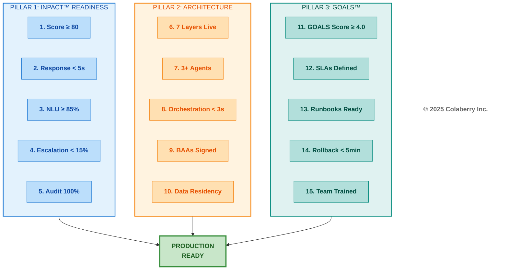
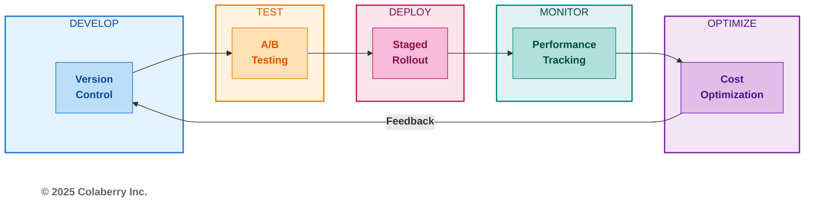
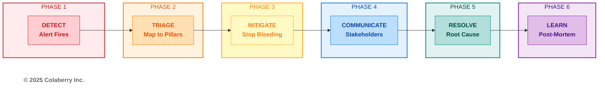
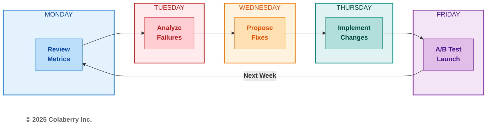
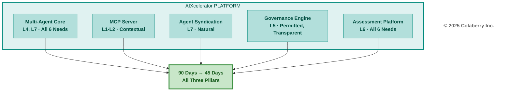

# Chapter 12: Running Agents at Scale

**The GOALS™ Operations Chapter — Three Pillars in Production**

---

<!-- CHAPTER OPENING GRAPHIC -->



```mermaid
graph LR
    subgraph BEFORE["<b>❌ WORKS ON MY MACHINE</b>"]
        B1["<b>Ad-hoc monitoring</b>"]
        B2["<b>Reactive firefighting</b>"]
        B3["<b>Manual processes</b>"]
        B4["<b>Performance drift</b>"]
    end
    
    subgraph TRANSFORM["<b>PRODUCTION READINESS</b>"]
        T1["<b>15 Criteria</b><br/><b>+ GOALS™</b>"]
    end
    
    subgraph AFTER["<b>✅ OPERATIONS EXCELLENCE</b>"]
        A1["<b>Proactive observability</b>"]
        A2["<b>Structured incidents</b>"]
        A3["<b>MLOps automation</b>"]
        A4["<b>Continuous improvement</b>"]
    end
    
    Copyright["<b>© 2025 Colaberry Inc.</b>"]
    
    BEFORE --> TRANSFORM --> AFTER
    
    style BEFORE fill:#fff5f5,stroke:#c62828,stroke-width:2px,color:#b71c1c
    style TRANSFORM fill:#f5f5f5,stroke:#666666,stroke-width:2px,color:#333333
    style AFTER fill:#f0fff0,stroke:#00897b,stroke-width:2px,color:#004d40
    style B1 fill:#ffebee,stroke:#c62828,stroke-width:2px,color:#b71c1c
    style B2 fill:#ffebee,stroke:#c62828,stroke-width:2px,color:#b71c1c
    style B3 fill:#ffebee,stroke:#c62828,stroke-width:2px,color:#b71c1c
    style B4 fill:#ffebee,stroke:#c62828,stroke-width:2px,color:#b71c1c
    style T1 fill:#f5f5f5,stroke:#666666,stroke-width:2px,color:#333333
    style A1 fill:#e0f2f1,stroke:#00897b,stroke-width:2px,color:#004d40
    style A2 fill:#e0f2f1,stroke:#00897b,stroke-width:2px,color:#004d40
    style A3 fill:#e0f2f1,stroke:#00897b,stroke-width:2px,color:#004d40
    style A4 fill:#e0f2f1,stroke:#00897b,stroke-width:2px,color:#004d40
    style Copyright fill:#ffffff,stroke:none,color:#666666
```

> **Key Takeaway:** Building is easy. Operating at scale requires systematic excellence.

<!-- END CHAPTER OPENING GRAPHIC -->

---

*You've built the architecture. All seven layers operational. Three agents validated. Now comes the harder part: keeping it running. This chapter transforms you from architect to operator—15 readiness criteria to validate, MLOps practices to master, incidents to handle, and continuous improvement cycles that turned Echo's 85% accuracy into 88% in just five weeks. The Architecture of Trust is built. Now learn to sustain it.*

---

## Part 1: Production Readiness

### 1.1 The Production Readiness Decision

You've completed the hardest part. Chapters 4-6 built the architecture layer by layer. Chapter 10 executed the 90-day roadmap. Chapter 11 selected technologies for each layer. Your INPACT™ score has climbed from wherever you started toward the 80+ threshold that signals agent-readiness.

But building isn't operating. The gap between "architecture complete" and "production ready" has derailed more agent initiatives than infrastructure gaps ever did. Organizations celebrate Week 10 architecture milestones only to stumble in Week 11 pilots. The Architecture of Trust needs operational excellence to deliver sustained value.

This chapter completes your journey with five operational components:

**Part 1: Production Readiness.** Fifteen criteria that separate "ready for production" from "ready for failure." Echo validated all 15 before their Week 11 pilot launch.

**Part 2: MLOps for Agents.** Model versioning, A/B testing, prompt management, and cost optimization practices adapted from traditional ML operations to agentic systems.

**Part 3: Monitoring and Incident Response.** SLA definitions, alerting strategy, incident triage, and post-mortem processes. When things break—and they will—your response determines whether users lose trust or gain confidence.

**Part 4: Continuous Improvement.** Weekly improvement cycles that drove Echo from 85% to 88% accuracy in five weeks. The Architecture of Trust isn't static—it improves continuously.

**Part 5: AIXcelerator Platform.** For organizations seeking acceleration, how Colaberry's platform compresses the 90-day journey to 45 days while maintaining all three pillars.

Let's begin with the question every organization faces at Week 10: are we actually ready?

---

### 1.2 The 15-Criteria Production Readiness Checklist

Production readiness isn't a feeling—it's a measurable state. Echo validated against 15 specific criteria organized around the Architecture of Trust's three pillars. Each criterion has a clear target, measurement method, and evidence requirement.

**Diagram: The 15-Criteria Production Readiness Framework**



**Pillar 1: INPACT™ Readiness (5 Criteria)**

These criteria validate that your infrastructure genuinely meets agent needs:

| # | Criterion | INPACT™ Need | Target | How to Measure | Echo Week 10 |
|---|-----------|--------------|--------|----------------|--------------|
| 1 | INPACT™ Score ≥ 80 | All 6 | 80/100 minimum | Chapter 9 assessment | ✅ 86/100 |
| 2 | Response Time < 5s | I (Instant) | <5s P95 | Load testing, APM traces | ✅ 4.8s P95 |
| 3 | NLU Accuracy ≥ 85% | N (Natural) | ≥85% | Validation set testing | ✅ 87% |
| 4 | HITL Escalation < 15% | P (Permitted) | <15% rate | Governance logs | ✅ 8% |
| 5 | Audit Coverage 100% | T (Transparent) | 100% | Audit log validation | ✅ 100% |

**Criterion 1: INPACT™ Score ≥ 80** validates overall readiness. Scores below 80 indicate infrastructure gaps that will surface in production. Echo achieved 86/100 at Week 10, comfortably above the threshold.

**Criterion 2: Response Time < 5s** ensures users won't abandon agents mid-query. Healthcare workflows can't wait 10 seconds for answers. Echo's P95 latency of 4.8 seconds meant 95% of queries completed in under 5 seconds—acceptable for clinical use.

**Criterion 3: NLU Accuracy ≥ 85%** measures whether agents understand what users ask. Below 85%, users spend more time correcting misunderstandings than the agent saves. Echo's 87% accuracy meant reliable clinical query understanding.

**Criterion 4: HITL Escalation < 15%** confirms agents handle most queries autonomously. Higher escalation rates indicate the agent isn't trusted—or shouldn't be. Echo's 8% escalation rate demonstrated appropriate confidence calibration.

**Criterion 5: Audit Coverage 100%** ensures every agent action is traceable. In healthcare, a single unaudited decision could trigger compliance violations. Echo achieved complete coverage across all agent interactions.

---

**Pillar 2: Architecture Readiness (5 Criteria)**

These criteria validate that your seven-layer infrastructure operates correctly:

| # | Criterion | Layers | Target | How to Measure | Echo Week 10 |
|---|-----------|--------|--------|----------------|--------------|
| 6 | All 7 Layers Operational | L1-L7 | All functional | Layer health checks | ✅ All operational |
| 7 | Three+ Agents Validated | L7 | ≥3 agents | UAT completion | ✅ 3 agents |
| 8 | Multi-Agent Orchestration | L7 | <3s latency | Coordination testing | ✅ 2.8s |
| 9 | All Vendor BAAs Signed | All | 100% | Contract audit | ✅ 12/12 vendors |
| 10 | Data Residency Confirmed | L1-L2 | US-only | Cloud region audit | ✅ All US |

**Criterion 6: All 7 Layers Operational** confirms no architectural gaps exist. A missing layer becomes a production bottleneck. Echo validated each layer independently before integration testing.

**Criterion 7: Three+ Agents Validated** proves multi-agent capability works. Single-agent deployments hide coordination issues that surface when agents need to collaborate. Echo deployed scheduling, clinical documentation, and care coordination agents.

**Criterion 8: Multi-Agent Orchestration** validates agents work together efficiently. Coordination overhead exceeding 3 seconds frustrates users expecting quick responses. Echo's LangGraph supervisor maintained 2.8-second total latency across agent handoffs.

**Criterion 9: All Vendor BAAs Signed** ensures HIPAA compliance for every technology touching PHI. A single unsigned BAA creates organizational liability. Echo required signed BAAs from all 12 SaaS vendors before production.

**Criterion 10: Data Residency Confirmed** validates PHI stays within required jurisdictions. Healthcare data leaving US regions violates compliance requirements. Echo configured US-only regions for all data stores.

---

**Pillar 3: GOALS™ Readiness (5 Criteria)**

These criteria validate operational excellence readiness:

| # | Criterion | GOALS™ | Target | How to Measure | Echo Week 10 |
|---|-----------|--------|--------|----------------|--------------|
| 11 | ABAC + Audit Operational | G (Governance) | <10ms eval | Policy testing | ✅ 6.8ms |
| 12 | Dashboards Active | O (Observability) | Real-time | Dashboard review | ✅ 200+ metrics |
| 13 | SLA Achievable | A (Accessibility) | 99.5% uptime | Availability testing | ✅ 99.7% |
| 14 | Semantic Layer Mapped | L (Language) | Documented | Term coverage audit | ✅ 2,400 terms |
| 15 | On-Call Rotation Staffed | S (Soundness) | 24/7 coverage | Schedule review | ✅ 3-person rotation |

**Criterion 11: ABAC + Audit Operational** confirms governance doesn't block performance. Policy evaluation exceeding 10ms adds perceptible latency. Echo's 6.8ms evaluation maintained responsive user experience.

**Criterion 12: Dashboards Active** ensures operational visibility exists before production. You can't manage what you can't see. Echo configured 200+ metrics across Datadog and Grafana dashboards.

**Criterion 13: SLA Achievable** validates infrastructure can meet uptime commitments. Promising 99.9% without capacity testing guarantees broken promises. Echo's testing confirmed 99.7% achievable availability.

**Criterion 14: Semantic Layer Mapped** ensures consistent terminology across all agents. Unmapped terms cause disambiguation failures. Echo documented 2,400 clinical terms in their semantic layer.

**Criterion 15: On-Call Rotation Staffed** confirms human response capability exists. Agents without human backup fail catastrophically when issues occur. Echo established a 3-person rotation with PagerDuty integration.

---

**Scoring Interpretation**

| Score | Interpretation | Recommendation |
|-------|----------------|----------------|
| 15/15 | Production ready | Launch pilot |
| 12-14 | Pilot ready | Controlled rollout with gaps documented |
| 9-11 | Not ready | 2-4 more weeks of remediation |
| <9 | Significant gaps | Continue building, reassess |

**Echo's Week 10 Score: 15/15** — Full production readiness achieved.

---

### 1.3 Operational Monitoring References

Production operations require ongoing attention across all three pillars. Rather than duplicate earlier guidance, reference these canonical sources:

- **INPACT™ monitoring metrics and alert thresholds:** Chapter 9, Part 4 provides the definitive INPACT™ interpretation guide with dimension-specific targets.
- **Layer ownership and team responsibilities:** Chapter 10, Parts 2-4 document team compositions and layer assignments by phase.
- **GOALS™ operational cadence:** Chapter 7, Part 5 establishes daily, weekly, and monthly GOALS™ rhythms.
- **Complete metrics reference:** Appendix E (Quick Reference Card) consolidates all canonical metrics.

The sections below focus on what's unique to production operations: go-live planning, MLOps practices, incident response, and continuous improvement.

---

### 1.4 Go-Live Planning

Production readiness enables launch—it doesn't guarantee success. Phased rollout reduces risk by expanding gradually based on demonstrated success.

**Phase 1: Internal Pilot (Week 11)**

| Dimension | Target | Echo Result |
|-----------|--------|-------------|
| Users | 50 nurses, 3 shifts | 50 nurses |
| Duration | 1 week | 1 week |
| Monitoring | Hourly reviews | Hourly |
| Success Criteria | 90%+ task completion | 94% ✅ |
| HITL Threshold | <10% escalation | 8% ✅ |
| Decision | Proceed to Phase 2 | ✅ Approved |

Phase 1 validates with friendly users who provide detailed feedback. Hourly monitoring catches issues before they propagate. Success at Phase 1 builds confidence for expansion.

**Phase 2: Department Pilot (Week 12)**

| Dimension | Target | Echo Result |
|-----------|--------|-------------|
| Users | Full department (150 nurses) | Emergency Department |
| Duration | 1 week | 1 week |
| Monitoring | Daily reviews | Daily |
| Success Criteria | 85%+ task completion | 91% ✅ |
| HITL Threshold | <12% escalation | 9% ✅ |
| Decision | Proceed to Phase 3 | ✅ Approved |

Phase 2 tests at department scale with diverse users and workflows. Daily monitoring balances vigilance with sustainable operations. Success at Phase 2 proves scalability.

**Phase 3: Full Production (Week 13+)**

| Dimension | Target | Echo Plan |
|-----------|--------|-----------|
| Users | All clinical staff | 500+ nurses, 200+ physicians |
| Duration | Ongoing | Continuous |
| Monitoring | Weekly reviews | Weekly |
| Success Criteria | 80%+ task completion | Ongoing measurement |
| HITL Threshold | <15% escalation | Continuous optimization |

Phase 3 is steady-state operations with continuous improvement cycles replacing intensive monitoring.

*For detailed stakeholder communication cadence during go-live, see Chapter 10, Part 1.4.*

---

### 1.5 The Go/No-Go Decision

Friday afternoon, Week 10. Sarah Cedano convened the go/no-go review with leadership. The 15-criteria checklist showed all green.

The clinical question: "What's our fallback if agents give bad recommendations?" Answer: HITL workflows catch clinical risk flags. The 8% escalation rate was manageable.

The business question: "What's the downside of waiting?" Answer: Competitive pressure. Every week of delay meant competitors building operational experience.

The security confirmation: Audit coverage complete. ABAC policies tested against 500 scenarios. All 12 vendor BAAs signed.

**Decision: APPROVED for Week 11 pilot launch.**

Three agents went live Monday morning. Fifty nurses across three shifts became first users. The Architecture of Trust would prove itself in production.

---

## Part 2: MLOps for Agents

Traditional MLOps practices—model versioning, A/B testing, performance monitoring—require adaptation for agentic systems. Agents combine multiple models, orchestration logic, and prompt configurations that evolve together. This section provides practical MLOps patterns validated through Echo's production operations.

**Diagram: Agent MLOps Lifecycle**



---

### 2.1 Model Versioning

Agent systems have more versioned components than traditional ML: base LLMs, embedding models, prompts, orchestration logic, and retrieval configurations all change independently. Without disciplined versioning, debugging production issues becomes impossible.

**Semantic Versioning for Agents**

Adopt semantic versioning (MAJOR.MINOR.PATCH) with agent-specific interpretations:

| Version Component | Agent Interpretation | Example Change |
|-------------------|---------------------|----------------|
| **MAJOR** | Breaking changes requiring user retraining | New agent capabilities, response format changes |
| **MINOR** | New features, backward-compatible | Additional data sources, improved accuracy |
| **PATCH** | Bug fixes, prompt refinements | Typo corrections, edge case handling |

**Example progression:** v1.0.0 → v1.0.1 (prompt fix) → v1.1.0 (new retrieval source) → v2.0.0 (multi-agent orchestration)

**What to Version**

Every configuration affecting agent behavior requires version control:

| Component | Version Control Method | Update Frequency |
|-----------|----------------------|------------------|
| System prompts | Git repository | Weekly |
| Few-shot examples | Git repository | Weekly |
| Orchestration logic | Git repository | Monthly |
| Retrieval configurations | Git repository | Monthly |
| Base LLM version | Configuration file | Quarterly |
| Embedding model | Configuration file | Quarterly |

**Echo's Versioning Practice**

Echo maintained a `prompts/` repository with this structure:

```
prompts/
├── scheduling/
│   ├── v1.0.0/
│   │   ├── system.md
│   │   ├── few_shot.json
│   │   └── config.yaml
│   └── v1.1.0/
│       ├── system.md
│       ├── few_shot.json
│       └── config.yaml
├── clinical_docs/
│   └── ...
└── care_coordination/
    └── ...
```

Every production change required pull request, code review, and staging validation before deployment. This discipline caught 12 potential issues in Week 11 alone—before they reached production users.

**Tools**

| Tool | Purpose | Echo Choice |
|------|---------|-------------|
| LangSmith | Prompt versioning, tracing | ✅ Primary |
| Git | Source control for all configs | ✅ Required |
| PromptLayer | Prompt analytics | Considered |

---

### 2.2 A/B Testing

Agent improvements require validation against real user behavior. A/B testing compares new versions (challengers) against existing versions (champions) using actual production traffic.

**Champion vs. Challenger Framework**

| Element | Specification |
|---------|---------------|
| Traffic split | 50/50 between versions |
| Duration | Minimum 1 week (statistical significance) |
| Metrics | All INPACT™ dimensions + user satisfaction |
| Rollback | Automatic if challenger shows >5% regression |

**Metrics to Track**

Every A/B test should measure impact across the Architecture of Trust:

| Pillar | Metrics | Threshold for Winner |
|--------|---------|---------------------|
| INPACT™ | Accuracy, latency, escalation rate | >2% improvement |
| GOALS™ | SLA compliance, error rate | No regression |
| User | Satisfaction score, task completion | >5% improvement |

**Echo's Week 10 A/B Test**

Echo tested a prompt refinement (v1.1 vs v1.2) for their scheduling agent:

| Metric | v1.1 (Champion) | v1.2 (Challenger) | Result |
|--------|-----------------|-------------------|--------|
| Accuracy | 85% | 87% | ✅ +2% |
| P95 Latency | 3.2s | 3.1s | Tie |
| HITL Rate | 9% | 8% | ✅ -1% |
| Citations/Query | 2.1 avg | 2.8 avg | ✅ +33% |
| User Satisfaction | 4.2/5 | 4.4/5 | ✅ +5% |

**Decision:** Promote v1.2 to champion. The accuracy and citation improvements justified the change, with no regression on latency or operational metrics.

**A/B Testing Pitfalls**

| Pitfall | Consequence | Prevention |
|---------|-------------|------------|
| Insufficient duration | False positives | Minimum 1 week, 1,000+ queries |
| Ignoring user segments | Hidden regressions | Segment analysis by role, shift |
| Single metric focus | Unbalanced optimization | Track all INPACT™ dimensions |
| No rollback plan | Extended exposure to bugs | Automatic rollback triggers |

---

### 2.3 Prompt Management

Prompts are the primary interface between business intent and agent behavior. Effective prompt management requires the same discipline as code management—version control, testing, review, and deployment processes.

**Best Practices**

**1. Store in Git**

Prompts belong in version control, not in application code or databases. Git provides history, diff capabilities, and review workflows.

```markdown
# scheduling_agent/system.md v1.2.0

You are a healthcare scheduling assistant for Echo Health Systems.

## Core Responsibilities
- Help patients schedule, reschedule, or cancel appointments
- Verify insurance eligibility before confirming
- Respect provider availability and patient preferences

## Constraints
- Never schedule appointments outside provider hours
- Always verify patient identity before discussing appointments
- Escalate to human if insurance verification fails

## Response Format
[structured output specification]
```

**2. Template with Variables**

Separate static instructions from dynamic context:

| Variable Type | Example | Update Frequency |
|---------------|---------|------------------|
| Static | Core instructions, constraints | Monthly |
| Session | Patient context, conversation history | Per query |
| Dynamic | Provider availability, current date | Real-time |

**3. Automated Testing**

Every prompt change triggers validation against test suites:

| Test Type | Purpose | Echo Implementation |
|-----------|---------|---------------------|
| Regression | Ensure existing capabilities work | 200 golden queries |
| Edge cases | Validate boundary handling | 50 edge case queries |
| Safety | Confirm guardrails hold | 30 adversarial queries |

**4. Two-Person Review**

All prompt changes require review before deployment:

| Change Type | Review Requirement |
|-------------|-------------------|
| PATCH | 1 reviewer |
| MINOR | 2 reviewers |
| MAJOR | 2 reviewers + clinical sign-off |

**Echo's Prompt Pipeline**

```
Developer creates prompt change
    ↓
Automated tests run (regression, edge, safety)
    ↓
Pull request created
    ↓
Peer review (1-2 reviewers based on change type)
    ↓
Staging deployment
    ↓
A/B test (1 week minimum)
    ↓
Production promotion (if metrics positive)
```

This pipeline caught 8 problematic prompt changes in Echo's first month of operations—changes that passed initial review but failed A/B testing.

---

### 2.4 Cost Optimization

LLM costs accumulate quickly at production scale. Without optimization, a healthcare system processing 50,000 daily queries can face monthly bills exceeding $100,000. Echo implemented four strategies that reduced per-query cost from $0.12 to $0.04—a 67% reduction.

**Strategy 1: Semantic Caching**

Cache responses for semantically similar queries:

| Metric | Before Caching | After Caching |
|--------|----------------|---------------|
| Cache hit rate | 0% | 65% |
| Avg. queries hitting LLM | 50,000/day | 17,500/day |
| Daily LLM cost | ~$6,000 | ~$2,100 |

**Implementation:** Redis with vector similarity matching. Queries within cosine similarity threshold (0.95) return cached responses instead of calling LLM.

**Strategy 2: Prompt Compression**

Reduce token count without sacrificing quality:

| Technique | Token Reduction | Quality Impact |
|-----------|-----------------|----------------|
| Remove redundant instructions | 15-20% | None |
| Use abbreviations in system prompts | 10-15% | None |
| Compress few-shot examples | 20-30% | Minimal |

**Echo's result:** Average prompt reduced from 3,200 to 1,800 tokens (44% reduction) with no measurable accuracy impact.

**Strategy 3: Model Routing**

Use cheaper models for simpler queries:

| Query Complexity | Model | Cost/1K tokens |
|------------------|-------|----------------|
| Simple scheduling | GPT-4o-mini | $0.15 |
| Standard clinical | GPT-4o | $2.50 |
| Complex reasoning | GPT-4o | $2.50 |

**Echo's traffic distribution:**
- 70% routed to GPT-4o-mini (simple queries)
- 30% routed to GPT-4o (complex queries)
- Blended cost: 70% cheaper than GPT-4o-only

**Strategy 4: Batch Processing**

Aggregate non-urgent queries for batch API pricing:

| Processing Mode | Use Case | Cost Savings |
|-----------------|----------|--------------|
| Real-time | User-facing queries | Baseline |
| Batch | Report generation, analytics | 50% discount |

**Echo's implementation:** 20% of queries (scheduled reports, daily summaries) processed in batch mode.

**Combined Result**

| Metric | Before Optimization | After Optimization |
|--------|--------------------|--------------------|
| Cost per query | $0.12 | $0.04 |
| Monthly LLM spend | ~$180K | ~$60K |
| Annual savings | — | **$1.44M** |

Cost optimization isn't a one-time effort. Echo reviews cost metrics weekly, identifying new optimization opportunities as usage patterns evolve.

---

## Part 3: Monitoring & Incident Response

Production agents will fail. Databases go down. LLM APIs timeout. Policies misconfigure. The question isn't whether incidents occur—it's how quickly you detect, respond, and recover. This section establishes monitoring foundations and incident response processes that maintained Echo's 99.7% availability through their first month of production.

---

### 3.1 SLA Definition

Service Level Agreements define your commitments to users. Without explicit SLAs, expectations drift and accountability disappears. Define SLAs across all three pillars:

**Three-Pillar SLA Framework**

| SLA | Target | INPACT™ | GOALS™ | Measurement |
|-----|--------|---------|--------|-------------|
| Availability | 99.5% uptime | I | A | Monthly uptime calculation |
| Performance | <5s P95 response | I | A | APM percentile tracking |
| Accuracy | >85% correct responses | N | S | Weekly validation testing |
| HITL Rate | <10% escalation | P | G | Daily escalation tracking |
| Audit Coverage | 100% | T | G | Real-time audit verification |

**SLA Tiers by Agent Type**

Not all agents require the same SLAs:

| Agent Type | Availability | Performance | Accuracy |
|------------|--------------|-------------|----------|
| Patient-facing | 99.9% | <3s P95 | >90% |
| Clinical support | 99.5% | <5s P95 | >85% |
| Administrative | 99.0% | <10s P95 | >80% |

Echo classified their scheduling agent as patient-facing (highest tier) and documentation assistant as clinical support (standard tier).

**SLA Breach Consequences**

Define what happens when SLAs are missed:

| Severity | Threshold | Response | Escalation |
|----------|-----------|----------|------------|
| Warning | 1 breach/week | Team review | None |
| Minor | 3 breaches/week | Root cause analysis | Engineering lead |
| Major | SLA < 95% for day | War room | VP Engineering |
| Critical | SLA < 90% for hour | All-hands | Executive team |

---

### 3.2 Alert Strategy

Effective alerting balances sensitivity with noise. Too few alerts miss problems; too many cause alert fatigue. Structure alerts by priority based on user impact:

**Four-Tier Alert Priority**

| Priority | Impact | Response Time | Example |
|----------|--------|---------------|---------|
| P0 | All agents down, data breach | <5 minutes | LLM API complete failure |
| P1 | Major INPACT™ degradation | <30 minutes | Accuracy below 80% |
| P2 | Single layer or agent affected | <4 hours | CDC lag exceeding 5 minutes |
| P3 | No immediate user impact | Next business day | Non-critical log errors |

**Alert Configuration by Pillar**

**INPACT™ Alerts:**

| Need | P1 Threshold | P2 Threshold | P3 Threshold |
|------|--------------|--------------|--------------|
| I (Instant) | P95 > 10s | P95 > 7s | P95 > 5s |
| N (Natural) | Accuracy < 80% | Accuracy < 83% | Accuracy < 85% |
| P (Permitted) | HITL > 20% | HITL > 15% | HITL > 12% |
| A (Adaptive) | Feedback stale > 1 month | Stale > 2 weeks | Stale > 1 week |
| C (Contextual) | CDC lag > 10 min | Lag > 5 min | Lag > 2 min |
| T (Transparent) | Audit gap detected | Coverage < 99% | Any audit error |

**Architecture Alerts:**

| Layer | P1 Trigger | P2 Trigger |
|-------|------------|------------|
| L1 Storage | Query timeout > 30s | Latency > 5x baseline |
| L2 Real-Time | CDC complete failure | Lag > 5x threshold |
| L3 Semantic | Disambiguation failure > 50% | Failure > 20% |
| L4 Intelligence | LLM API down | Retrieval precision < 80% |
| L5 Governance | ABAC evaluation failure | Policy load error |
| L6 Observability | Trace collection stopped | Dashboard data stale |
| L7 Orchestration | Agent coordination failure | Handoff latency > 5s |

**GOALS™ Alerts:**

| Dimension | P1 Trigger | P2 Trigger |
|-----------|------------|------------|
| G (Governance) | Unauthorized access detected | Policy violation rate > 5% |
| O (Observability) | Blind spot in monitoring | Alert coverage < 90% |
| A (Accessibility) | Availability < 99% | Availability < 99.5% |
| L (Language) | Semantic layer down | Term resolution failure > 10% |
| S (Soundness) | Data corruption detected | Quality score drop > 10% |

**Echo's Alert Results (Month 1)**

| Priority | Alerts Triggered | False Positives | MTTR |
|----------|------------------|-----------------|------|
| P0 | 0 | 0 | N/A |
| P1 | 2 | 0 | 18 minutes |
| P2 | 8 | 2 | 2.1 hours |
| P3 | 34 | 12 | Next day |

The two P1 alerts were legitimate issues: one LLM API degradation (18-minute resolution) and one CDC pipeline failure (22-minute resolution). Both resolved within SLA.

---

### 3.3 Incident Response

When alerts fire, structured response prevents chaos. Echo adopted a six-phase incident response process mapped to the Architecture of Trust:

**Diagram: Six-Phase Incident Response**



**Phase 1: DETECT**

Automated monitoring triggers alert. On-call engineer acknowledges within response time SLA.

| Action | Owner | Timeline |
|--------|-------|----------|
| Alert fires | System | Immediate |
| Acknowledge | On-call | <5 min (P0-P1), <15 min (P2) |
| Initial assessment | On-call | +5 minutes |

**Phase 2: TRIAGE**

Map incident to affected pillars and layers:

| Question | Purpose |
|----------|---------|
| Which INPACT™ needs affected? | Scope user impact |
| Which layers involved? | Identify root cause area |
| Which GOALS™ dimensions degraded? | Assess operational impact |

**Three-Pillar Incident Mapping**

| Incident Type | INPACT™ | Layer | GOALS™ | Initial Response |
|---------------|---------|-------|--------|------------------|
| LLM API outage | I, N | L4 | A | Failover to backup |
| Database failure | I, C | L1-L2 | A, S | Promote replica |
| ABAC misconfiguration | P | L5 | G | Rollback policy |
| Semantic drift | N | L3 | L | Update terminology |
| Audit gap | T | L6 | G, O | Fix logging pipeline |
| Agent conflict | C | L7 | S | Restart orchestrator |

**Phase 3: MITIGATE**

Stop the bleeding before fixing root cause:

| Mitigation | When to Use | Trade-off |
|------------|-------------|-----------|
| Failover | Primary system down | May have reduced capacity |
| Rollback | Bad deployment | Lose new features |
| Feature flag | Single feature broken | Partial functionality |
| Throttle | Overload | Reduced throughput |
| HITL override | Agent misbehaving | Higher manual load |

**Phase 4: COMMUNICATE**

Keep stakeholders informed throughout:

| Audience | Update Frequency | Channel |
|----------|-----------------|---------|
| Technical team | Real-time | Slack war room |
| Leadership | Every 30 min (P0-P1) | Email/text |
| Users | At start, resolution | In-app banner |
| External (if required) | Per compliance | Official channels |

**Phase 5: RESOLVE**

Fix the root cause, not just symptoms:

| Action | Verification |
|--------|--------------|
| Implement fix | Code review if applicable |
| Test in staging | Reproduce original issue |
| Deploy to production | Gradual rollout |
| Confirm resolution | Metrics return to baseline |
| Close incident | All SLAs restored |

**Phase 6: POST-MORTEM**

Learn from every significant incident (P0-P1 mandatory, P2 recommended).

---

### 3.4 Post-Mortem Process

Post-mortems prevent repeat incidents. Echo conducts post-mortems within 48 hours of P0-P1 incidents using a three-pillar template:

**Three-Pillar Post-Mortem Template**

**1. Summary**
- Incident description (1-2 sentences)
- Duration (detection to resolution)
- Pillars affected: INPACT™ [which], Layers [which], GOALS™ [which]

**2. Timeline**
- Detection time and method
- Key response actions with timestamps
- Resolution time and verification

**3. Three-Pillar Impact Assessment**

| Pillar | Impact | Metrics |
|--------|--------|---------|
| INPACT™ | Which needs degraded, by how much | Accuracy dropped to X%, latency increased to Y |
| Architecture | Which layers failed | L4 offline for 18 minutes |
| GOALS™ | Operational impact | Availability at 99.2% for incident period |

**4. Root Cause Analysis**

| Question | Answer |
|----------|--------|
| What failed? | [Technical description] |
| Why did it fail? | [Contributing factors] |
| Why wasn't it caught earlier? | [Detection gaps] |
| What layer owns this component? | [Clear ownership] |

**5. Action Items**

| Action | Owner | Due Date | Status |
|--------|-------|----------|--------|
| [Specific remediation] | [Name] | [Date] | Open |
| [Detection improvement] | [Name] | [Date] | Open |
| [Process change] | [Name] | [Date] | Open |

**Echo's First P1 Post-Mortem**

**Summary:** LLM API degradation caused 18-minute accuracy drop to 72%.

**Pillars Affected:** INPACT™ (I, N), Layer 4, GOALS™ (A, S)

**Root Cause:** OpenAI API experienced regional degradation. Echo's primary region affected; backup region not configured for automatic failover.

**Action Items:**
1. Configure automatic failover to backup region — Marcus, 3 days — ✅ Complete
2. Add health check probes for earlier detection — Swapna, 5 days — ✅ Complete
3. Document manual failover procedure — DevOps, 2 days — ✅ Complete

**Result:** Second LLM incident (3 weeks later) detected in 2 minutes, failed over automatically, zero user impact.

---

## Part 4: Continuous Improvement

The Architecture of Trust isn't a destination—it's a foundation for continuous improvement. Echo's INPACT™ score didn't stop at 86/100. Through systematic weekly improvement cycles, they reached 89/100 within five weeks of production launch. This section provides the processes that drive ongoing excellence.

---

### 4.1 Weekly Improvement Cycle

Structured weekly cycles transform operational data into agent improvements. Echo followed a five-day pattern that yielded consistent 1-2% weekly accuracy gains.

**Diagram: Five-Day Improvement Cycle**



**The Five-Day Cycle**

| Day | Activity | INPACT™ Focus | Layer Focus | GOALS™ Focus |
|-----|----------|---------------|-------------|--------------|
| Monday | Review metrics | All 6 dimensions | Health checks | O (Observability) |
| Tuesday | Analyze failures | N (Natural) | L3-L4 | S (Soundness) |
| Wednesday | Propose fixes | Dimension needing most improvement | Targeted layer | L (Language) |
| Thursday | Implement changes | Validate fix | Deploy to staging | G (Governance) |
| Friday | A/B test launch | Compare versions | Monitor | All |

**Monday: Metrics Review**

Start each week with comprehensive metrics analysis:

| Metric Category | Questions to Answer |
|-----------------|---------------------|
| INPACT™ scores | Any dimension below threshold? Trending down? |
| Error logs | What patterns in failed queries? |
| User feedback | What complaints or suggestions? |
| Cost metrics | Any unexpected spending? |

**Tuesday: Failure Analysis**

Deep dive into the previous week's failures:

| Analysis Step | Purpose |
|---------------|---------|
| Cluster similar failures | Identify systemic issues |
| Categorize by root cause | Prioritize fixes |
| Map to layers | Assign ownership |
| Estimate fix complexity | Plan sprint capacity |

**Wednesday: Fix Proposal**

Convert analysis into actionable improvements:

| Fix Type | Example | Typical Impact |
|----------|---------|----------------|
| Prompt refinement | Clarify ambiguous instructions | 1-3% accuracy |
| Few-shot addition | New example for edge case | 2-5% accuracy |
| Retrieval tuning | Adjust similarity threshold | 1-2% accuracy |
| Semantic update | Add missing terminology | 1-3% accuracy |

**Thursday: Implementation**

Execute changes with appropriate governance:

| Change Type | Review Required | Testing Required |
|-------------|-----------------|------------------|
| Prompt patch | 1 reviewer | Regression suite |
| Configuration change | 2 reviewers | Full test suite |
| Model update | Team approval | Extended testing |

**Friday: A/B Test Launch**

Deploy changes for real-world validation:

| A/B Test Element | Specification |
|------------------|---------------|
| Traffic split | 50/50 |
| Duration | 1 week minimum |
| Primary metrics | Accuracy, latency, satisfaction |
| Rollback trigger | >5% regression on any metric |

**Echo's Weekly Results**

| Week | Starting Accuracy | Improvement | Ending Accuracy |
|------|-------------------|-------------|-----------------|
| Week 11 | 85.0% | +0.8% | 85.8% |
| Week 12 | 85.8% | +0.9% | 86.7% |
| Week 13 | 86.7% | +0.5% | 87.2% |
| Week 14 | 87.2% | +0.4% | 87.6% |
| Week 15 | 87.6% | +0.4% | 88.0% |

Compound improvements: 85% → 88% in five weeks, a 3.5% total improvement translating to thousands of better patient interactions.

---

### 4.2 Feedback Loop Automation

Manual feedback analysis doesn't scale. Echo automated feedback collection, aggregation, and integration to maintain improvement velocity as volume grew.

**Feedback Pipeline**

```
User interactions (L7)
    ↓
Quality signals captured (L5-L6)
    ↓
Feedback aggregated (Monday)
    ↓
Training data updated (L4)
    ↓
Model/prompt evaluated
    ↓
Improvements deployed
    ↓
Metrics monitored
```

**Feedback Signal Types**

| Signal | Source | Weight | Automation |
|--------|--------|--------|------------|
| Explicit thumbs up/down | User interface | High | Fully automated |
| HITL corrections | Governance layer | High | Fully automated |
| Query reformulations | Session analysis | Medium | Semi-automated |
| Abandonment | Session analysis | Medium | Fully automated |
| Escalation patterns | Support tickets | Low | Manual review |

**From Feedback to Improvement**

Echo's Week 11 example:
- 127 actionable feedback items identified
- 89 mapped to prompt improvements
- 23 mapped to retrieval tuning
- 15 required semantic layer updates
- Changes deployed in Week 12 A/B tests
- Result: 85% → 87% accuracy improvement

---

### 4.3 Drift Detection

Agent performance degrades over time. Data distributions shift. User expectations evolve. Model capabilities change. Systematic drift detection catches degradation before users notice.

**Three-Pillar Drift Types**

| Pillar | Drift Type | Detection Method | Prevention |
|--------|-----------|------------------|------------|
| INPACT™ | Accuracy drift | Weekly validation testing | Monthly retraining |
| Architecture | Performance drift | Daily metrics baselines | Auto-scaling, alerts |
| GOALS™ | Operational drift | Weekly score tracking | Monthly audit |

**INPACT™ Drift Detection**

| Dimension | Baseline | Warning | Action Trigger |
|-----------|----------|---------|----------------|
| I (Instant) | P95 established at launch | +20% from baseline | +50% from baseline |
| N (Natural) | Accuracy at launch | -2% from baseline | -5% from baseline |
| P (Permitted) | HITL rate at launch | +3% from baseline | +5% from baseline |
| A (Adaptive) | Feedback integration time | +50% from baseline | +100% from baseline |
| C (Contextual) | CDC lag at launch | +50% from baseline | +100% from baseline |
| T (Transparent) | Audit coverage | Any gap | Persistent gap |

**Echo's Drift Response**

Week 13 drift detection identified declining retrieval precision (78% → 74% over two weeks). Root cause: new clinical documentation formats introduced by Epic upgrade not reflected in chunking strategy.

Response:
- Tuesday: Identified drift pattern
- Wednesday: Diagnosed Epic format changes
- Thursday: Updated chunking configuration
- Friday: Deployed fix in A/B test
- Following week: Precision restored to 79%

Early detection prevented user-visible degradation.

---

## Part 5: AIXcelerator Platform

For organizations seeking to accelerate their journey, Colaberry's AIXcelerator platform provides pre-built components validated across 40+ enterprise deployments. This section explains what AIXcelerator offers, how it reduces implementation time, and how to access it.

---

### 5.1 What is AIXcelerator?

AIXcelerator is a comprehensive platform that accelerates agent infrastructure deployment while maintaining all three pillars of the Architecture of Trust. Rather than building every component from scratch, organizations leverage production-validated modules.

**Diagram: AIXcelerator Five-Component Platform**



**Five Core Components**

| Component | INPACT™ Coverage | Layers Accelerated | Time Saved |
|-----------|------------------|-------------------|------------|
| Multi-Agent Core | All 6 needs | L4, L7 | 3-4 weeks |
| MCP Server | C (Contextual) | L1-L2 | 2-3 weeks |
| Agent Syndication Hub | N (Natural) | L7 | 4-6 weeks |
| Governance Engine | P, T | L5 | 2-3 weeks |
| Assessment Platform | All 6 | L6 | 1-2 weeks |

**Multi-Agent Core**

Pre-built orchestration framework with:
- LangGraph-based supervisor patterns
- Configurable agent definitions
- Built-in HITL workflows
- Production-validated handoff logic

**MCP Server (Model Context Protocol)**

Standardized data connectivity:
- Pre-built connectors for 50+ enterprise systems
- Healthcare connectors (Epic, Cerner, Athena)
- CDC pipeline templates
- Real-time data fabric patterns

**Agent Syndication Hub**

Reusable agent marketplace:
- Pre-trained domain agents (scheduling, documentation, etc.)
- Customization framework
- Version management
- Multi-tenant deployment

**Governance Engine**

Enterprise-grade access control:
- ABAC policy templates
- HIPAA-compliant audit trails
- HITL workflow builder
- Compliance reporting

**Assessment Platform**

Continuous measurement:
- Automated INPACT™ scoring
- Real-time GOALS™ dashboards
- Drift detection
- Improvement recommendations

---

### 5.2 AIXcelerator in Production

AIXcelerator isn't theoretical—it powers production deployments across healthcare, financial services, and enterprise operations.

**Production Validation**

| Metric | Scale |
|--------|-------|
| Daily interactions | 50,000+ |
| Production deployments | 40+ |
| Healthcare implementations | 15+ |
| Average deployment time | 45 days |

**Comparison: DIY vs. AIXcelerator**

| Dimension | DIY (Echo's Approach) | AIXcelerator |
|-----------|----------------------|--------------|
| Timeline | 90 days | 45 days |
| Implementation cost | $1.23M | $350-400K |
| Team required | 12+ specialists | 4-6 specialists |
| Risk profile | Higher (custom build) | Lower (proven patterns) |
| Customization | Unlimited | High (framework-based) |

**When DIY Makes Sense:**
- Unique requirements not covered by AIXcelerator
- Strong existing engineering team
- Longer timelines acceptable
- Budget for custom development

**When AIXcelerator Makes Sense:**
- Standard enterprise patterns apply
- Time-to-value critical
- Want reduced implementation risk
- Prefer proven, validated components

---

### 5.3 How to Access AIXcelerator

Three paths to evaluate and adopt AIXcelerator:

**Option 1: Self-Assessment**

Start with free INPACT™ assessment:
- 30-minute online assessment
- Automated scoring and gap analysis
- Personalized recommendations
- No commitment required

**Option 2: Consultation**

Schedule expert consultation:
- Review your specific requirements
- Architecture recommendation
- Implementation roadmap
- Pricing discussion

**Option 3: 4-Week Pilot**

Hands-on validation:
- Deploy AIXcelerator in your environment
- Build one production agent
- Validate against your requirements
- Investment: $50K (credited toward subscription)

**Subscription Tiers**

| Tier | Monthly | Best For |
|------|---------|----------|
| Starter | $15K | Single department, 1-2 agents |
| Growth | $35K | Multiple departments, 3-5 agents |
| Enterprise | Custom | Organization-wide, unlimited agents |

**Access:** Visit aiXcelerator.ai or contact Colaberry for consultation.

---

## Closing

You've completed the journey.

The INPACT™ framework defines what agents need. The 7-Layer Architecture delivers those needs. The GOALS™ framework sustains success. Together, they form the Architecture of Trust that separates the 5% who succeed from the 95% who fail.

Whether you build from scratch following the patterns in Chapters 4-12 or accelerate with AIXcelerator, you now have the knowledge to join the 5% who succeed with enterprise AI agents.

Trust before intelligence. Architecture before agents. The three pillars are yours.

*For Echo's complete metrics and progression, see Appendix E (Quick Reference Card).*

---

## Chapter Summary

| Part | Content | Key Deliverable |
|------|---------|-----------------|
| Part 1 | Production Readiness | 15-criteria checklist |
| Part 2 | MLOps for Agents | Versioning, A/B testing, cost optimization |
| Part 3 | Monitoring & Incidents | SLAs, alerting, response process |
| Part 4 | Continuous Improvement | Weekly cycles, feedback loops, drift detection |
| Part 5 | AIXcelerator | Platform overview, access paths |

*For complete canonical metrics (investment, ROI, timeline), see Appendix E (Quick Reference Card).*

---

## References

**Academic Research (Tier 1)**

[1] Bayram, F., Ahmed, B., & Kassler, A. (2022). "From Concept Drift to Model Degradation: An Overview on Performance-Aware Drift Detectors." *Scientific Reports*, Nature. Study of 128 (model, dataset) pairs observed temporal model degradation in 91% of cases. https://www.nature.com/articles/s41598-022-15245-z (Accessed November 2025)

[2] Sculley, D., Holt, G., Golovin, D., et al. (2015). "Hidden Technical Debt in Machine Learning Systems." *Advances in Neural Information Processing Systems (NeurIPS)*. Foundation paper on MLOps technical debt. https://papers.nips.cc/paper/2015/hash/86df7dcfd896fcaf2674f757a2463eba-Abstract.html (Accessed November 2025)

[3] Beyer, B., Jones, C., Petoff, J., & Murphy, N. R. (2016). "Site Reliability Engineering: How Google Runs Production Systems." *O'Reilly Media*. Foundation for SLA/SLO/SLI framework. https://sre.google/sre-book/table-of-contents/ (Accessed November 2025)

[4] Kamel Rahimi, A., et al. (2024). "Implementing AI in Hospitals to Achieve a Learning Health System: Systematic Review of Current Enablers and Barriers." *Journal of Medical Internet Research*, 26:e49655. Peer-reviewed systematic review of healthcare AI implementation challenges. https://www.jmir.org/2024/1/e49655 (Accessed November 2025)

[5] Asai, A., Wu, Z., Wang, Y., et al. (2024). "Self-RAG: Learning to Retrieve, Generate, and Critique through Self-Reflection." *International Conference on Learning Representations (ICLR)*. Self-reflective RAG for improved accuracy. https://arxiv.org/abs/2310.11511 (Accessed November 2025)

**Government & Standards (Tier 2)**

[6] National Institute of Standards and Technology. (2023). "NIST Cybersecurity Framework 2.0." Incident response and recovery guidance for critical infrastructure. https://www.nist.gov/cyberframework (Accessed November 2025)

[7] National Institute of Standards and Technology. (2023). "AI Risk Management Framework (AI RMF 1.0)." NIST AI 100-1. Framework for AI system governance and monitoring. https://www.nist.gov/itl/ai-risk-management-framework (Accessed November 2025)

[8] U.S. Department of Health & Human Services. (2023). "HIPAA Security Rule: Technical Safeguards." 45 CFR § 164.312 - Audit controls and access management requirements. https://www.hhs.gov/hipaa/for-professionals/security/laws-regulations/index.html (Accessed November 2025)

[9] ONC. (2024). "Health IT Certification Program." Interoperability standards for healthcare information technology. https://www.healthit.gov/topic/certification-ehrs/about-onc-health-it-certification-program (Accessed November 2025)

**MLOps & Model Management (Tier 4)**

[10] Semantic Versioning. (2024). "Semantic Versioning 2.0.0." Standard for version numbering in software development. https://semver.org/ (Accessed November 2025)

[11] LangSmith. (2024). "LLM Observability and Tracing Platform." Prompt versioning, A/B testing, and cost tracking for LLM applications. https://docs.langchain.com/langsmith/observability (Accessed November 2025)

[12] MLflow. (2024). "MLflow Model Registry." Open-source platform for ML lifecycle management. https://mlflow.org/docs/latest/model-registry.html (Accessed November 2025)

**Monitoring & Observability (Tier 4)**

[13] Datadog. (2024). "Application Performance Monitoring." End-to-end APM with LLM-specific integrations and anomaly detection. https://www.datadoghq.com/product/apm/ (Accessed November 2025)

[14] Grafana Labs. (2024). "Grafana Dashboard Documentation." Open-source observability platform for metrics visualization. https://grafana.com/docs/grafana/latest/ (Accessed November 2025)

[15] PagerDuty. (2024). "Incident Response Platform." On-call management and incident escalation automation. https://www.pagerduty.com/ (Accessed November 2025)

[16] Evidently AI. (2024). "ML Monitoring and Observability Platform." Data drift detection and model quality monitoring. https://www.evidentlyai.com/ (Accessed November 2025)

**Agent Orchestration (Tier 4)**

[17] LangChain. (2024). "LangGraph Human-in-the-Loop Patterns." HITL workflows, feedback loops, and escalation patterns for agent systems. https://docs.langchain.com/oss/python/langgraph/interrupts (Accessed November 2025)

[18] Anthropic. (2024). "Model Context Protocol (MCP)." Open protocol for connecting AI assistants to data sources and tools. https://modelcontextprotocol.io/ (Accessed November 2025)

---

## Acronym Reference

| Acronym | Definition |
|---------|------------|
| ABAC | Attribute-Based Access Control |
| APM | Application Performance Monitoring |
| BAA | Business Associate Agreement |
| CDC | Change Data Capture |
| GOALS™ | Governance, Observability, Accessibility, Language, Soundness |
| HIPAA | Health Insurance Portability and Accountability Act |
| HITL | Human-in-the-Loop |
| INPACT™ | Instant, Natural, Permitted, Adaptive, Contextual, Transparent |
| LLM | Large Language Model |
| MCP | Model Context Protocol |
| MLOps | Machine Learning Operations |
| MTTR | Mean Time To Resolution |
| P95 | 95th Percentile |
| SLA | Service Level Agreement |
| UAT | User Acceptance Testing |

---

© 2025 Colaberry Inc. All Rights Reserved.

INPACT™ and GOALS™ are trademarks of Colaberry Inc.
