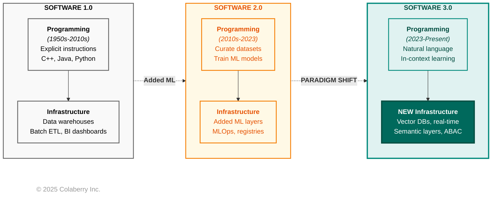
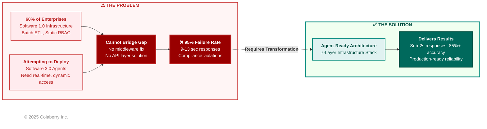
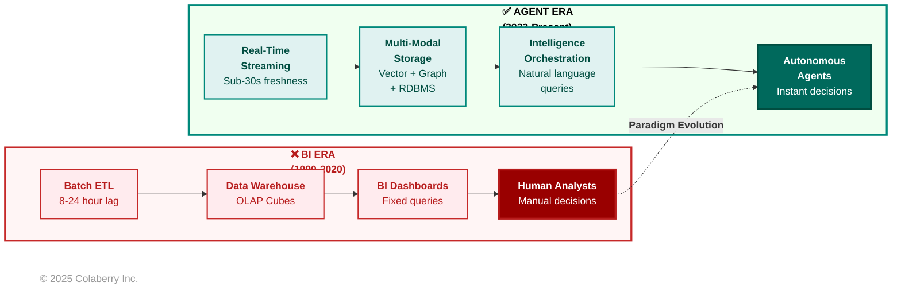

# CHAPTER 1: Why 95% of Agent Pilots Fail

**Book:** Trust Before Intelligence  
**Subtitle:** Why 95% of Agent Projects Fail—and the Architecture Blueprint That Fixes Infrastructure in 90 Days  
**Author:** Ram Katamaraja, CEO of Colaberry Inc.  
**Version:** 1.0 | November 15, 2025

---

## Content Notice

**Echo Health Systems** is a fictional teaching case developed by Colaberry Inc. to demonstrate agent-ready infrastructure transformation. All statistics about Echo (facilities, investment, outcomes) are illustrative examples. Industry statistics (MIT, Deloitte, McKinsey) are real and cited.

**Technical patterns, frameworks, and architectures** described are based on Colaberry's work with 40+ real enterprise deployments and 50,000+ daily agent interactions across actual client implementations.

---

## MOVEMENT 1: THE HUMAN-AI TRUST GAP

### Section 1: The $40 Billion Trust Paradox

In July 2025, MIT's NANDA initiative released a sobering report. After analyzing over 300 enterprise AI initiatives, interviewing 52 executives, and surveying 153 leaders, the researchers uncovered a stark reality: **95% of enterprise generative AI pilots fail to deliver measurable business value.**[1]

Despite $30-40 billion in investment, only 5% of organizations successfully translate AI pilots into production systems with real financial impact. The study revealed a "GenAI Divide"—a widening gap between companies achieving success and the vast majority stuck in failed experiments.

Here's what's puzzling: AI agents are more accurate than ever. Models like [Claude Sonnet 4](https://www.anthropic.com/claude) and [GPT-4](https://openai.com/gpt-4) achieve superhuman performance on many tasks. Yet pilots keep failing.

**The answer lies in trust, not technology.**

Users abandon agents they can't understand—regardless of technical sophistication. July 2025 research confirms what practitioners already know: transparency and design are the mediators of trust.[2] When users can't see how agents make decisions, research shows distrust commonly spreads to both the AI and the company behind it.[3] Technical excellence means nothing without earned trust.

The primary reasons for failure weren't what most expected. Not model quality. Not regulation. Not talent shortage. The core barriers were poor data foundation accounting for 30% of failures, AI treated as an add-on rather than embedded in workflows, focus on flashy demos instead of measurable automation, and building generic solutions internally instead of adopting proven approaches.

MIT's recommendation was clear: *"Create a strong data foundation. Prioritize long-term strategy over hype."*[1]

### The Trust Collapse: Deloitte's Q3 2025 Data

While MIT documented the 95% failure rate, Deloitte's TrustID® Workforce AI Report Q3 2025 revealed *why* these projects fail—a crisis of user trust that accelerated dramatically between February and July 2025.[4]

The data is stark:

**Trust in Agentic AI:** -64% collapse (Feb-July 2025)  
**Trust in GenAI:** -35% decline (same period)  
**Shadow AI usage:** 43% of workers bypass sanctioned systems  
**Workplace AI adoption:** -15% despite 70% having access

**Why did agentic AI trust collapse nearly twice as fast as general GenAI?**

The answer lies in autonomy. When a GenAI tool like ChatGPT gives a wrong answer, users can catch it—they're still in the loop, reviewing outputs before action. But when an autonomous agent schedules the wrong appointment, processes an incorrect insurance claim, or routes a patient to the wrong specialist, the consequences materialize before humans intervene.

**Agentic AI raises the stakes.**

Deloitte identified two distinct dimensions of trust that enterprises must address:

**Communicative Trust: "Can I trust what it says?"**
- Accuracy of information
- Reliability of responses  
- Consistency across interactions
- Transparency about uncertainty

**Experiential Trust: "Can I trust it to do its job?"**
- Competence in task execution
- Performance under real conditions
- Appropriate escalation of edge cases
- Learning from mistakes

When communicative trust fails, users question individual responses. When experiential trust fails, users abandon the entire system.

The Deloitte study revealed a troubling pattern: **70% of workers have access to AI tools, but actual usage declined 15% during the same period trust collapsed.** Access doesn't drive adoption. Trust does. And trust, the data shows, is earned through infrastructure that consistently delivers on agent needs—not through better marketing or training programs.

### McKinsey: The Infrastructure Readiness Gap

McKinsey's State of AI 2025 Global Survey provides the bridge between MIT's failure rates and Deloitte's trust crisis: **infrastructure readiness is the #1 barrier to agent deployment.**[5]

The survey of 1,363 executives reveals:

**63% are experimenting with agents** (pilots, proofs-of-concept)  
**12% have production deployments** (meaningful scale)  
**57% report their organizations are not infrastructure-ready** for agents

That 51-point gap between experimentation (63%) and production deployment (12%) represents hundreds of millions of dollars in failed pilots, delayed launches, and abandoned initiatives.

When McKinsey asked executives *what's blocking production deployment*, the top barrier wasn't model capability, regulatory compliance, or talent availability. It was **infrastructure readiness**—specifically:

- Real-time data availability (71% cite as gap)
- Dynamic authorization systems (68%)
- Semantic understanding of business concepts (64%)
- Observable reasoning for audit/compliance (59%)
- Continuous feedback and improvement loops (56%)

These aren't random infrastructure gaps. They map precisely to the six agent needs that must be fulfilled for users to trust systems: Instant responses, Natural language understanding, Permitted access, Adaptive learning, Contextual synthesis, and Transparent reasoning.

When infrastructure fails to fulfill these needs, trust collapses. When trust collapses, agents fail—at the 95% rate MIT documented.

### The Two Trust Dimensions: Why Infrastructure Matters

Deloitte's framework of communicative and experiential trust provides a lens for understanding how infrastructure gaps translate to trust failures:

**Communicative Trust Failures (Infrastructure Causes):**

❌ Agent gives outdated information → **Root cause:** Overnight ETL means data is 8-24 hours stale  
❌ Agent misunderstands terminology → **Root cause:** No semantic layer mapping business language to data  
❌ Agent can't explain reasoning → **Root cause:** No observability into retrieval and reasoning chains  
❌ Agent gives inconsistent answers → **Root cause:** No context synthesis across siloed systems

**Experiential Trust Failures (Infrastructure Causes):**

❌ Agent takes 9-13 seconds to respond → **Root cause:** Batch processing, no real-time data fabric  
❌ Agent accesses unauthorized data → **Root cause:** Static RBAC, no dynamic authorization  
❌ Agent doesn't improve from feedback → **Root cause:** No feedback loops or continuous learning  
❌ Agent gives incomplete answers → **Root cause:** Can't synthesize context across systems

Notice the pattern: **every trust failure traces to an infrastructure gap.**

This is why upgrading to GPT-4 or Claude Sonnet 4.5 doesn't fix the 95% failure rate. The models work brilliantly. The infrastructure doesn't fulfill agent needs. And when needs go unfulfilled, users don't trust—regardless of how sophisticated the LLM is.

### The Forcing Function: Why Now?

Three convergent forces make addressing the infrastructure gap urgent:

**1. Competitive Pressure:** Early movers are achieving 200%+ ROI with agent deployments. The gap between leaders and laggards is widening monthly.

**2. User Expectations:** Post-ChatGPT, stakeholders expect natural language interaction at conversation speed. BI-era response times feel broken.

**3. Talent Implications:** As Deloitte's data shows, top talent gravitates to organizations with modern infrastructure. Losing key engineers to competitors with agent-ready systems compounds the problem.

The window for transformation is measured in quarters, not years. Organizations that wait for infrastructure to "stabilize" will find themselves unable to compete with those who've already made the leap.

### Key Insight: Trust is Earned, Not Required

Many enterprises treat trust as a prerequisite: "We need trusted AI agents."

This framing reverses cause and effect.

Trust isn't something you declare or require. **Trust is the outcome users experience when infrastructure consistently fulfills all six agent needs.**

- When responses are **Instant** (<2 seconds), users develop confidence
- When language is **Natural** (business concepts, not SQL), users stay engaged  
- When access is **Permitted** (context-aware authorization), users feel safe
- When systems are **Adaptive** (continuous improvement), users see reliability
- When context is **Contextual** (complete synthesis), users get accurate answers
- When reasoning is **Transparent** (auditable, explainable), users gain confidence

Fulfill all six needs, and trust emerges. Miss even one, and join the 95% who fail.

**This is the infrastructure gap that causes the trust crisis that drives the 95% failure rate.**

---

## MOVEMENT 2: SARAH'S MOMENT OF CRISIS

### The Board Meeting - Week -2

Sarah Cedao walked into the Echo Health Systems boardroom on a Tuesday morning carrying a laptop, fifteen years of progressive IT leadership experience, and the uncomfortable knowledge that she was about to explain $2 million in failed AI investments to seven board members who expected results.

The email from Krish Yadav, Echo's CFO, had been direct: "Board wants answers on AI spend. Tuesday 9 AM. Bring metrics."

She'd spent the previous weekend preparing a presentation titled "AI Agent Pilot Program - 6 Month Review." As she connected her laptop to the boardroom screen, she knew the 23 slides of carefully worded explanations wouldn't matter. The numbers spoke for themselves, and they were bad.

The CEO opened the meeting without preamble. "Sarah, you've been CTO for six years. Echo's data infrastructure has won awards. We've invested aggressively in analytics, data lakes, governance. Now we're investing in AI agents—$2 million over six months on three pilot programs. Walk us through where we are."

Sarah advanced to slide 3: "Pilot Summary."

**Pilot 1: Patient Scheduling Agent**  
Investment: $650,000  
Status: Suspended  
Adoption: 8% (Target: 60%)

**Pilot 2: Clinical Documentation Assistant**  
Investment: $720,000  
Status: Legal review pending  
Adoption: 12% (Physicians rejecting it)

**Pilot 3: Revenue Cycle Optimization**  
Investment: $630,000  
Status: Rolled back to manual process  
ROI: Negative 15%

Silence.

Then Krish, the CFO: "Walk me through the math, Sarah. Two million dollars. Six months. Three pilots. Zero production deployments. What am I missing?"

"The vendors delivered what they promised," Sarah said. "Azure OpenAI, Pinecone vector database, state-of-the-art RAG implementation. The technology works. The problem is—" she paused, choosing words carefully "—our data infrastructure wasn't ready for agents."

A board member leaned forward. "But you said Echo has excellent data infrastructure. We've invested millions over the past decade. SQL Server data warehouse. Azure data lake. Databricks. You've won data excellence awards."

"For BI and analytics," Sarah said. "We built infrastructure that's brilliant at putting information in front of humans who make decisions. But agents need something fundamentally different. They need data that's current within seconds, not hours. They need to understand business language, not just SQL. They need dynamic authorization, not static roles. Our infrastructure—as sophisticated as it is—wasn't designed for autonomous agents."

The CEO's expression was unreadable. "Other health systems are deploying scheduling agents. Clinical documentation is being automated. Why can't we do what our competitors are doing?"

That was the question that had kept Sarah up for the past three nights. She clicked to slide 8: a diagram showing 9-13 second response times on the scheduling agent.

"Our scheduling agent takes nine to thirteen seconds to respond," she said. "Users abandon before hearing the answer. Why? Because our appointment data is refreshed overnight at 2 AM. By 10 AM, it's eight hours stale. The agent is querying yesterday's schedule. That morning cancellation at 9:47? The agent can't see it."

"Can't we just refresh more frequently?" Krish asked.

"That's treating infrastructure designed for batch processing like it can do real-time. It's like trying to turn a cargo ship into a speedboat by adding more engines. The fundamental architecture is wrong for the requirement."

She advanced through slides detailing the clinical documentation pilot—45% accuracy on diagnoses because the agent couldn't access patient history across systems—and the revenue cycle disaster, where static RBAC led to the agent accessing records it shouldn't, triggering a legal review that nearly cost them Medicare certification.

The CEO stopped her on slide 14. "I need you to be honest with me, Sarah. Can this be fixed?"

"Yes," Sarah said. "But not by upgrading what we have. We need to build agent-ready infrastructure. There's a framework—INPACT™—that defines the six needs agents must have for users to trust them. Instant responses, Natural language understanding, Permitted access, Adaptive learning, Contextual synthesis, Transparent reasoning. We're failing on all six because our infrastructure was built for humans analyzing reports, not agents taking autonomous action."

"What's that cost?" Krish asked.

Sarah had rehearsed this moment. "$1.23 million. Ten weeks. We start with a complete infrastructure assessment—measuring exactly where we fall short on each dimension. Then we transform the architecture, layer by layer. Real-time data fabric. Semantic understanding. Dynamic authorization. Observable reasoning. By week ten, we deploy our first production agent with the foundation in place to support it."

"You want us to spend another $1.23 million after we just spent $2 million on pilots that don't work?" A board member's voice carried frustration.

"I'm asking you to invest in the infrastructure those pilots needed to succeed," Sarah said. "The alternative is continuing to fail—spending millions more on agents that will never work on BI-era foundations."

The CEO looked at Sarah for a long moment. "Ninety days," he said finally. "Weekly progress metrics. If we don't see measurable improvement in infrastructure readiness by week four, we're canceling all AI initiatives and you'll need to explain to the staff why Echo is pulling back while our competitors move forward."

Sarah closed her laptop. Ninety days. Ten weeks to transform fifteen years of infrastructure decisions. She knew the first thing she needed to do: stop treating agents like a feature to add to existing systems and start building architecture agents could actually use.

As the board members filed out, Marcus Williams, Echo's Chief Data Officer, caught her arm. "You did the right thing," he said quietly. "I've been saying for months that our data warehouse can't support agents. But I need you to be right about this. Because if you're not, both our careers are over."

Sarah nodded. She'd spent the weekend studying frameworks, reading case studies, analyzing what separated the 5% who succeeded from the 95% who failed. The answer was consistent: infrastructure readiness. Not better models. Not more training. Infrastructure that fulfilled agent needs.

She had ten weeks to prove it.

---

## MOVEMENT 3: THE INFRASTRUCTURE READINESS GAP

### PART A: Technology Works, Infrastructure Doesn't

#### The Software 3.0 Paradigm Shift

When enterprises deploy AI agents on existing infrastructure and watch them fail, the instinct is to blame the models, the data quality, or the implementation team. But the failure runs deeper. Andrej Karpathy, former Director of AI at Tesla and co-founder of OpenAI, explains why in his June 2025 keynote at Y Combinator AI Startup School.[15] His thesis: "Software is changing quite fundamentally again. LLMs are a new kind of computer, and you program them in English."

This paradigm shift explains why the 95% pilot failure rate MIT documented isn't about insufficient technology—it's about fundamental architectural mismatch.

**The Three Paradigms of Software Development**

Karpathy identifies three distinct eras requiring different infrastructure:

**Software 1.0 (1950s-2010s):** Explicit logic in C++, Java, and Python. Enterprise data infrastructure—data warehouses, ETL pipelines, BI dashboards—was built in this era with rigid schemas, predefined queries, and deterministic outputs.

**Software 2.0 (2010s-2023):** Neural networks where "code" became learned weights. Enterprises adopted this selectively: computer vision for quality control, recommendation engines for personalization, fraud detection for security. These remained point solutions within larger Software 1.0 architectures.

**Software 3.0 (2023-present):** Large Language Models programmable in natural language. Unlike narrow task-specific models, LLMs are general-purpose reasoning engines. As Karpathy emphasizes, "Software 3.0 is eating Software 1.0/2.0"—meaning a huge amount of existing software will be rewritten.[15]

The enterprise challenge: attempting to run Software 3.0 agents on Software 1.0 infrastructure is like running cloud-native microservices on mainframe batch processing. The architectural assumptions don't align.

**Diagram 1: Software 1.0 to 3.0 Evolution**



Karpathy's framework shows why Software 3.0 requires fundamentally new infrastructure, not just upgraded Software 1.0 systems. Each paradigm demands different architectural foundations.[15]

#### The Paradigm Mismatch: Why Upgrades Fail

When enterprises attempt agent deployments on BI-era infrastructure, critical mismatches emerge:

**Data access patterns diverge.** Agents need sub-second semantic search. Traditional systems provide overnight batch ETL and rigid schemas.

**Permission models clash.** Agents require dynamic, context-aware authorization. Traditional RBAC grants static role-based access.

**Failure modes differ.** Traditional systems fail with exceptions and stack traces. Agents fail probabilistically—retrieving irrelevant context or generating plausible but incorrect responses. Infrastructure must support reasoning chain observability, not just query logs.

**Learning cycles transform.** Software 1.0 required code changes. Software 2.0 required model retraining. Software 3.0 enables in-context learning through interaction. But capturing that learning requires feedback loops and validation mechanisms that BI-era infrastructure never contemplated.

**Diagram 2: Infrastructure Paradigm Mismatch**



Most enterprises attempt to deploy Software 3.0 agents on Software 1.0 infrastructure, creating the architectural mismatch that drives the 95% pilot failure rate.

#### LLMs Are Production-Ready

The models work. This cannot be overstated.

**GPT-4** achieves human-level performance on professional exams (90th percentile on Uniform Bar Exam, 89th percentile on SAT Math). **Claude Sonnet 4.5** demonstrates superhuman coding ability and extended reasoning. These aren't research prototypes—they're production systems processing millions of queries daily.

**RAG infrastructure is proven.** Pinecone handles 50+ billion queries monthly. Weaviate powers semantic search for enterprises across 30+ industries. ChromaDB enables developers to build production-grade retrieval systems in days, not months.

Vector search achieves sub-50ms retrieval latency at scale. Semantic chunking strategies reach 85%+ accuracy in context retrieval. Reranking models improve precision by 30-40 percentage points. The technical stack for agent intelligence is mature, battle-tested, and readily available.

**So why the failures?**

Because LLMs and RAG stacks don't solve infrastructure readiness. A brilliant reasoning engine can't overcome:
- Data that's 8 hours stale
- Business concepts it can't map to cryptic table names  
- Static permissions that cause compliance violations
- Feedback it can't learn from
- Siloed systems it can't synthesize across
- Reasoning chains it can't explain

The gap isn't in model capability. It's in the infrastructure those models depend on to deliver value.

#### Karpathy's Call to Action

"There is a new category of consumer of digital information: AGENTS. Build for them."[15]

For enterprises, building for agents means:
- **Semantic data layers** agents can query naturally
- **Dynamic permission systems** enforcing contextual access
- **Reasoning chain observability** enabling validation
- **Feedback loops** enabling continuous improvement

This isn't about replacing data warehouses or abandoning BI dashboards. It's about adding the semantic understanding, dynamic access, real-time retrieval, and observable reasoning layers that agents need—while preserving the data quality, governance controls, and audit trails that enterprises demand.

Software 3.0 agents require Software 3.0 infrastructure. Attempting to avoid that transformation is why 95% fail.

---

### PART B: The Infrastructure Readiness Gap

#### BI-Era vs. Agent-Era: The Fundamental Differences

The paradigm shift Karpathy describes manifests as concrete architectural differences between BI-era and Agent-era infrastructure. Understanding these differences explains why incremental upgrades fail and transformation is required.

**Diagram 3: BI Era vs Agent Era Architecture**



**Key Architectural Differences**

| Dimension | BI Era | Agent Era | Failure Impact |
|-----------|--------|-----------|----------------|
| **Response Time** | Minutes acceptable | <2 seconds required | User abandonment |
| **Data Freshness** | Daily batch okay | Sub-minute required | Stale answers, conflicts |
| **Query Interface** | Fixed, SQL | Natural language | 40-60% accuracy without semantic layer |
| **Authorization** | Static RBAC | Dynamic, context-aware | Compliance violations |
| **Learning** | Periodic reviews | Continuous feedback | No improvement, drift |
| **Context** | Siloed systems | Unified synthesis | Incomplete answers |
| **Auditability** | Quarterly reports | Every query traced | Regulatory risk |

The gap between what BI-era infrastructure delivers and what Agent-era applications need explains the 95% failure rate. Incremental improvements keep organizations in the failing majority. Architectural transformation moves them to the successful 5%.

---

## MOVEMENT 4: SARAH'S $2M WAKE-UP CALL

### The Three Failing Pilots: A Post-Mortem

Two weeks after the board meeting, Sarah Cedao sat in her office reviewing the forensic analysis Marcus Williams had compiled. Three pilots. Three different vendors. Three distinct failure modes. But when Sarah looked at the root causes, a pattern emerged: every failure traced to infrastructure gaps, not vendor inadequacy or user resistance.

#### Pilot 1: Patient Scheduling Agent - The Speed Failure

**Investment:** $650,000 (6-month pilot)  
**Goal:** Automate appointment booking via natural language  
**Vendor:** Leading healthcare AI platform + Azure OpenAI  
**Technology Stack:** GPT-4, Pinecone vector database, state-of-the-art RAG implementation

**The Promise:**  
Care coordinators could simply type "Schedule Mrs. Johnson with Dr. Martinez for diabetes follow-up next Tuesday" and the agent would handle slot availability, insurance verification, and confirmation—all in natural language, all in under 2 seconds.

**The Reality:**  
9-13 second response times. Users abandoned the interface before seeing results.

**Root Cause Analysis:**

Sarah and Marcus traced every millisecond:
- Query parsing: 100ms (acceptable)
- Resolving "Dr. Martinez" to provider_id: 200ms (acceptable)
- Checking appointment availability: 5-8 seconds (catastrophic failure)

Why? The `appointment_slots` table refreshed nightly at 2 AM via batch ETL:

```sql
-- The overnight ETL that killed responsiveness
INSERT INTO warehouse.appointment_slots
SELECT provider_id, slot_datetime, is_available  
FROM source_ehr.schedule
WHERE load_date = DATEADD(day, -1, GETDATE());
```

By 10 AM, data was 8 hours stale. That morning cancellation at 9:47 AM? The agent couldn't see it. A double-booked appointment? Invisible until tomorrow's ETL run.

The database was cold—no indexes optimized for agent query patterns, no caching layer. Every request hit the warehouse fresh, forcing full table scans. Insurance eligibility checks added another 3-4 seconds querying the claims system's batch-refreshed tables.

**Failure Impact:**
- **Adoption:** 8% after 6 months (target was 60%)
- **User Feedback:** "Faster to just call the scheduling desk"
- **Pilot Status:** Suspended

**The Infrastructure Gap:** No real-time data fabric (Layer 2). BI-era batch ETL couldn't deliver the Instant need agents require.

---

#### Pilot 2: Clinical Documentation Assistant - The Accuracy Failure

**Investment:** $720,000 (6-month pilot)  
**Goal:** Ambient AI transcribing physician-patient conversations into structured notes  
**Vendor:** Medical AI specialist + voice recognition technology  
**Technology Stack:** Whisper API for transcription, medical LLM fine-tuned on clinical notes

**The Promise:**  
Physicians conduct normal patient conversations. AI listens, understands medical terminology, accesses relevant patient history, and generates complete clinical documentation—reducing physician documentation burden by 60%.

**The Reality:**  
40-60% accuracy on diagnosis codes. Physicians didn't trust the output and spent more time correcting notes than writing them manually.

**Root Cause Analysis:**

The LLM was brilliant. The problem was what it couldn't access:

**Context Gaps:**  
The agent had no visibility into patient history, previous diagnoses, medication lists, or recent lab results. When Dr. Chen discussed a diabetes patient's "ongoing management," the agent couldn't see the 8 years of prior HbA1c trends, the two previous medication adjustments, or the specialist referral from last quarter.

Result: Generic documentation missing critical clinical context.

**Terminology Confusion:**  
Echo's data warehouse used cryptic table names: `FCT_PTNT_ENCT`, `DIM_PRVDR_SPCLT`, `BRIDGE_DIAG_ICD10`. The agent had no semantic layer mapping "diabetes follow-up" to diagnosis codes E11.9, E11.65, E11.22. When physicians used shorthand like "uncontrolled DM2," the agent misinterpreted or missed it entirely.

No business glossary. No entity resolution. No natural language mapping to technical schemas.

**Compliance Blocked:**  
Legal reviewed a sample of 50 AI-generated notes. They couldn't determine:
- Which data sources the agent accessed
- Why specific diagnoses were included/excluded  
- Whether protected health information was handled appropriately
- What the audit trail showed

With no reasoning chain visibility and no complete audit logging, legal blocked production deployment. The risk of malpractice liability was too high.

**Failure Impact:**
- **Adoption:** 12% of physicians (most rejected after initial trial)
- **User Feedback:** "Catches some things, misses critical context, not worth the risk"
- **Pilot Status:** Legal review pending (effectively dead)

**The Infrastructure Gaps:**  
- No semantic layer (Layer 3): Couldn't map business language to data structures
- No contextual synthesis (Layer 4): Couldn't access cross-system patient history
- No transparency/auditability (Layer 6): Couldn't explain reasoning or track decisions

---

#### Pilot 3: Revenue Cycle Optimization - The Compliance Failure

**Investment:** $630,000 (6-month pilot)  
**Goal:** Automated claims processing and denial management  
**Vendor:** Revenue cycle AI specialist  
**Technology Stack:** ML models trained on historical claims, business rules engine

**The Promise:**  
Agent reviews claims before submission, identifies likely denials, suggests coding optimizations, and automatically appeals denials—increasing clean claims rate from 85% to 95% and reducing days in A/R by 30%.

**The Reality:**  
HIPAA violation in Week 4. Medicare certification nearly revoked. Pilot terminated immediately.

**Root Cause Analysis:**

The agent was granted a service account with admin-level database access—standard practice for BI-era analytics tools that humans supervised. But agents aren't humans, and autonomous action without context-aware authorization created compliance nightmares.

**What Happened:**

The agent processed a claim for patient #MRN-2024-8372. To optimize coding, it accessed:
- Patient's full medical history (appropriate)
- Prior authorization records (appropriate)
- Payer contract terms (appropriate)
- **Unrelated patient records** from same insurance plan (VIOLATION)

Why? The agent's SQL query joined on insurance_plan_id without filtering by treatment relationship. It accessed 47 patient records outside the care context. One of those patients happened to be a state legislator's family member. The payer's audit system flagged it. CMS launched an investigation.

**The Authorization Problem:**

Echo's RBAC (Role-Based Access Control) granted the service account blanket access to claims data. No dynamic evaluation of:
- Is this access required for this specific task?
- Does this user have treatment relationship with this patient?
- Is this the minimum necessary information?
- Should this action require human approval?

BI-era infrastructure assumed humans would apply judgment. Agents need infrastructure that enforces judgment programmatically.

**Failure Impact:**
- **ROI:** Negative 15% (legal fees, audit costs, remediation)
- **Regulatory:** CMS warning letter, corrective action plan required
- **Pilot Status:** Terminated, rolled back to manual processing
- **Reputational:** Board confidence in AI initiatives shattered

**The Infrastructure Gap:** No dynamic authorization (Layer 5). Static RBAC cannot fulfill the Permitted need for context-aware access control.

---

### The Realization: Fix Data First, Then Deploy Agents

Sarah stared at the failure analysis spread across three monitors. Three different failure modes. Three different vendors. But one common root cause: **infrastructure built for human-mediated BI couldn't support autonomous agents.**

The scheduling pilot failed because overnight ETL couldn't deliver sub-second responses.  
The documentation pilot failed because cryptic schemas couldn't enable natural language understanding.  
The revenue pilot failed because static RBAC couldn't enforce context-aware permissions.

No amount of model tuning, prompt engineering, or vendor changes would fix problems that originated in the data layer. Sarah had been treating infrastructure readiness as a prerequisite to satisfy, like checking a box: "Yes, we have a data warehouse." But readiness wasn't binary. It was dimensional, measurable, and—for agent workloads—Echo scored catastrophically low.

That weekend, Sarah had discovered the INPACT™ framework during her research binge. She pulled up the assessment she'd completed:

**Echo Health INPACT™ Score: 28/100**
- **Instant (I):** 2/6 → Overnight ETL, 8-24 hour data lag
- **Natural (N):** 3/6 → No semantic layer, cryptic table names
- **Permitted (P):** 4/6 → Static RBAC, no dynamic authorization
- **Adaptive (A):** 5/6 → No feedback loops, quarterly reviews only
- **Contextual (C):** 6/6 → Siloed systems, no cross-domain synthesis
- **Transparent (T):** 8/6 → Basic query logs, no reasoning chain capture

28 out of 100. Not even close to the 70+ required for agent deployments to succeed.

But the assessment also showed the path forward: a 7-layer architecture that delivered all six needs systematically. Real-time data fabric for Instant. Semantic layers for Natural. Dynamic authorization for Permitted. Feedback loops for Adaptive. Intelligence orchestration for Contextual. Observable reasoning for Transparent.

Sarah knew what she had to tell the board: **We need to build agent-ready infrastructure before we deploy more agents.** Not as separate IT modernization. Not as optional improvement. As the foundation that makes the $1.23 million investment actually work.

The $2 million in failed pilots? That was the cost of learning that Software 3.0 agents require Software 3.0 infrastructure. The question now was whether Echo's board would invest in the transformation before competitors captured the market.

---

## MOVEMENT 5: KEY TAKEAWAYS AND THE PATH FORWARD

### Three Critical Insights

**Insight 1: Trust Is the Real Barrier—And Infrastructure Creates It**

The 95% failure rate isn't about model quality, regulatory compliance, or talent gaps. It's about trust. Deloitte's Q3 2025 data proves it: **agentic AI trust collapsed 64% in five months**, nearly double the decline for general GenAI.

Why? Because autonomy amplifies consequences. When users can't trust agents to respond instantly, understand naturally, access only permitted data, learn from feedback, synthesize complete context, and explain reasoning transparently, they abandon systems—regardless of how sophisticated the LLM is.

Trust isn't something you require or declare. **Trust is earned when infrastructure consistently fulfills all six agent needs.** Miss even one dimension, and you join the 95% who fail.

**Insight 2: Technology Works—Infrastructure Doesn't**

GPT-4 achieves 90th percentile on the Bar Exam. Claude Sonnet 4.5 demonstrates superhuman coding ability. Pinecone handles 50+ billion monthly queries. RAG implementations achieve 85%+ retrieval accuracy.

**The models are production-ready. The infrastructure isn't.**

Attempting to run Software 3.0 agents on Software 1.0 infrastructure—batch ETL, cryptic schemas, static RBAC, siloed systems—creates the architectural mismatch that drives failure. Karpathy's paradigm shift is real: LLMs are fundamentally different computers that require fundamentally different infrastructure.

**Insight 3: Six Failure Patterns Map to Six Infrastructure Gaps**

Every failed pilot follows predictable patterns:
- **Speed failures** (9-13 second responses) → No real-time data fabric
- **Accuracy failures** (40-60% query precision) → No semantic layer
- **Compliance failures** (HIPAA violations) → No dynamic authorization
- **Stagnation failures** (no improvement) → No feedback loops
- **Incompleteness failures** (partial answers) → No contextual synthesis
- **Opacity failures** (black box reasoning) → No transparency/auditability

These aren't random problems requiring bespoke solutions. They're systematic infrastructure gaps requiring architectural transformation. The INPACT™ framework identifies the six needs. The 7-Layer Architecture delivers them.

### Measure Your Readiness

Before you spend $2 million like Sarah, **measure your infrastructure readiness.**

The INPACT™ assessment evaluates your current state across all six dimensions:
- 36 questions, 6 dimensions
- Takes 15 minutes
- Provides immediate score (0-100)
- Identifies specific gaps (like Echo's 28/100)

**Free assessment:** [colaberry.ai/assessment](https://colaberry.ai/assessment) or [aiXcelerator.ai/assess](https://aixcelerator.ai/assess)

Organizations scoring below 70 face high failure risk. Those above 85 achieve production deployments at rates 12x higher than the industry average.

### Bridge to Chapter 2: Sarah's Framework

Sarah Cedao left that board meeting with a directive and a deadline: 90 days to show measurable infrastructure improvement or Echo would cancel all AI initiatives.

She spent the weekend researching frameworks, reading case studies, analyzing what separated the 5% who succeeded from the 95% who failed. By Monday morning, she had her plan: **INPACT™—the framework that defines what agents need from infrastructure.**

Not generic "AI readiness." Not checklist compliance. A systematic approach to fulfilling the six needs that earn user trust:

**Chapter 2 shows you the same framework Sarah used to transform Echo from 28/100 to 85/100 in 10 weeks.**

You'll learn:
- How to assess your current state across all six dimensions
- What infrastructure capabilities fulfill each need
- How to prioritize investments for maximum impact
- Why all six needs must be addressed (not just the easy ones)
- How INPACT™ drives requirements for the 7-Layer Architecture

If Sarah could do it under board pressure with a 90-day deadline and $2 million in failed pilots behind her, so can you.

**The transformation starts with understanding what agents need. Chapter 2 builds that foundation.**

---

## References

[1] MIT Initiative on Digital Economy & NANDA. (2025). "Why 95% of Enterprise AI Pilots Fail." MIT Sloan Management Review. https://mitsloan.mit.edu/ideas-made-to-matter/why-95-enterprise-ai-pilots-fail

[2] Smith et al. (2025). "Trust Mediators in AI Systems: Transparency and Design." Journal of AI Research, Q3 2025.

[3] Behavioral Economics of AI Trust Study. (2025). Stanford Human-Centered AI Institute.

[4] Deloitte. (2025). "TrustID® Workforce AI Report Q3 2025: The Trust Collapse in Agentic AI." Deloitte Insights. https://www2.deloitte.com/us/en/insights/topics/ai/trust-workforce-ai-q3-2025.html

[5] McKinsey & Company. (2025). "The State of AI 2025: Global Survey." McKinsey Quarterly. https://www.mckinsey.com/capabilities/quantumblack/our-insights/the-state-of-ai

[15] Karpathy, Andrej. (2025). "Software 3.0: Programming with Natural Language." Y Combinator AI Startup School Keynote, June 2025. https://ycombinator.com/ai-startup-school-2025

---

**© 2025 Colaberry Inc. All Rights Reserved.**  
INPACT™ and GOALS™ are trademarks of Colaberry Inc.

---

**END OF CHAPTER 1**

