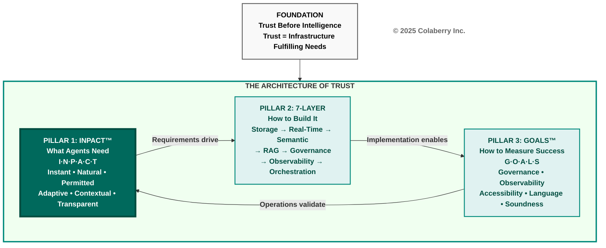

# Chapter 2: The INPACT™ Framework

**Book:** Trust Before Intelligence  
**Subtitle:** Why 95% of Agent Projects Fail—and the Architecture Blueprint That Fixes Infrastructure in 90 Days  
**Author:** Ram Katamaraja, CEO, Colaberry Inc.  
**Chapter:** 2 of 12  
**Version:** 2.0 OPTIMIZED  
**Date:** November 17, 2025  
**Target:** 7,500 words | 15 pages | ~30 minutes reading time

---

## Part 1: Framework Introduction (1,200 words)

### The Architecture of Trust: Building Pillar 1

Chapter 1 revealed why 95% of enterprise AI agent projects fail—not from inadequate AI, but from infrastructure unreadiness. The solution requires an integrated architecture, not bolt-on tools.

**The Architecture of Trust rests on three pillars:**

**Pillar 1: INPACT™** defines what agents need from infrastructure—six fundamental requirements that must be fulfilled for users to trust autonomous operation.

**Pillar 2: 7-Layer Architecture** specifies how to build infrastructure that delivers on those needs, from storage through orchestration.

**Pillar 3: GOALS™** establishes how to measure operational success, ensuring infrastructure continuously fulfills agent needs in production.

**Diagram 1: The Architecture of Trust—Three Integrated Pillars**

**This chapter builds Pillar 1 completely.** You'll understand what agents need, why traditional infrastructure fails each need, and how Echo Health transformed from 28/100 readiness to 85/100 in ten weeks.

### The Origin: Pattern Recognition Across 50+ Deployments

INPACT™ crystallized from analyzing Colaberry's agent deployments across healthcare systems processing 15,000+ daily patient interactions, financial institutions handling compliance-sensitive transactions, retail operations managing real-time inventory, and manufacturing facilities coordinating supply chains.

We traced failure patterns. When scheduling agents were abandoned despite 95% accuracy, when documentation assistants sat unused despite cutting transcription time 80%, when recommendation engines were overridden 70% of the time—root causes traced to infrastructure gaps, not AI quality.

Six needs emerged consistently. When any single need went unfulfilled, trust collapsed. When all six were addressed systematically, adoption soared.

### The Tony Robbins Parallel: From Human Needs to Agent Needs

Tony Robbins built an empire on one insight: humans have six core needs—certainty, variety, significance, connection, growth, and contribution. When fulfilled, humans flourish. When neglected, people stagnate.

**AI agents follow the same pattern.** They don't need psychological fulfillment—they need architectural fulfillment.

**Human Needs → Agent Needs Parallel:**

| Human Need | Agent Need | Infrastructure Must Deliver |
|------------|------------|---------------------------|
| Certainty (predictability, safety) | Instant (I) | Real-time data, sub-2-second response |
| Variety (challenge, novelty) | Adaptive (A) | Feedback loops, continuous learning |
| Significance (importance, validation) | Natural (N) | Business language understanding |
| Connection (belonging, relationships) | Contextual (C) | Cross-system integration |
| Growth (progress, development) | Adaptive (A) | Self-improvement capability |
| Contribution (purpose, meaning) | Transparent (T) | Explainable value delivery |

**The crucial difference:** Humans advocate for their own needs. When humans need certainty, they ask for clarification. When they need connection, they build relationships.

**Agents cannot advocate for themselves.** They depend entirely on infrastructure to fulfill their needs. An agent can't request real-time data when batch ETL is all that's available. It can't negotiate for dynamic permissions when static RBAC is all that exists.

**This is why INPACT™ focuses on infrastructure capabilities, not agent features.** The framework defines what infrastructure must provide. Trust emerges as the outcome when infrastructure systematically fulfills all six needs.

### Trust = Earned Outcome, Not Built Component

Traditional enterprise software could require trust: "You must use this ERP system." Users had no alternative. Distrust meant workarounds, but the system remained in use because it was mandated.

**AI agents cannot operate on mandated trust.** When users distrust an agent, they don't work around it—they abandon it entirely. Echo Health proved this: within three weeks, adoption dropped from 74% to 8% after repeated failures.

**Trust emerges when infrastructure consistently fulfills needs:**

- Instant (I) fulfilled → Users trust responses are current
- Natural (N) fulfilled → Users trust agent understands questions  
- Permitted (P) fulfilled → Users trust agent respects boundaries
- Adaptive (A) fulfilled → Users trust agent learns and improves
- Contextual (C) fulfilled → Users trust agent sees complete picture
- Transparent (T) fulfilled → Users trust agent's reasoning

**When even one need fails, trust collapses across all dimensions.** Agents operate on binary trust—users either trust enough to delegate, or they don't trust at all. Echo's scheduling agent achieved 95% accuracy but took 9-13 seconds to respond. Users abandoned it. Accuracy didn't matter when speed destroyed conversational experience.

### INPACT™ as Requirements Definition

This chapter establishes INPACT™ as the foundation—Pillar 1—of the Architecture of Trust. Every architectural decision in Chapters 4-7 flows from these six needs.

**The framework provides:**

**Diagnostic lens** for assessing infrastructure readiness across six dimensions (Chapter 9 details the assessment tool at colaberry.ai/assessment).

**Requirements definition** showing what capabilities infrastructure must deliver, mapped to architectural layers.

**Prioritization framework** helping leaders decide which needs to address first based on business impact and dependencies.

**Validation criteria** establishing clear thresholds—1-6 scoring scale per dimension, 80/100 minimum for agent readiness.

The six needs interconnect through architecture. Instant (I) requires real-time streaming, query optimization, and caching. Natural (N) demands semantic layers, embedding models, and vector databases. Every need touches multiple layers. No layer solves any need alone.

---

## Part 2: Echo's 28/100 Discovery (800 words)

### The Assessment That Changed Everything

Monday, Week -2. Sarah Cedao arrived at Echo Health's executive conference room with a single-page assessment. She'd spent the previous week running their infrastructure through INPACT™ diagnostic framework.

**Overall Readiness: 28/100**

The threshold for agent deployment: 80/100. Echo wasn't halfway there.

**Echo Health INPACT™ Assessment—Week 0**

| Dimension | Score | Status | Primary Gap |
|-----------|-------|--------|-------------|
| **Instant (I)** | 3/6 | 🔴 Critical | 9-13 second responses, stale data |
| **Natural (N)** | 4/6 | 🟡 Moderate | 43% accuracy, limited semantic layer |
| **Permitted (P)** | 2/6 | 🔴 Critical | Static RBAC, HIPAA violations |
| **Adaptive (A)** | 3/6 | 🔴 Critical | Quarterly reviews, manual fixes |
| **Contextual (C)** | 2/6 | 🔴 Critical | Siloed systems, slow integration |
| **Transparent (T)** | 2/6 | 🔴 Critical | No audit trails, opaque decisions |
| **TOTAL** | **16/36** | **28/100** | **Five dimensions critical** |

Marcus Williams, CDO, broke the silence. "Twenty-eight out of a hundred. We spent fifteen years building data excellence. How are we failing this badly?"

Sarah had anticipated this. "We built excellence for the human era—overnight batch processing, visual dashboards, analysts who could wait hours for reports. That infrastructure is sophisticated, well-governed, and completely wrong for agents needing sub-second responses to natural language questions with dynamic authorization."

### Two Critical Dimensions Explained

**Permitted (P): Why Score 2/6 Is Dangerous**

Echo's SQL Server database used traditional role-based access control with four roles: reader, writer, admin, and app_service. When they gave their agent the app_service account, it could access ANY patient's data regardless of who asked.

The compliance audit failed catastrophically. The agent used one service account for all users—permissions couldn't vary by requester. Role-based access operated at table level, granting all records or nothing. Static permissions didn't consider context like time of day or purpose. Audit logs showed "scheduling_agent made query" but not which human user triggered it or why.

**HIPAA penalty exposure: $50,000+ per violation.** With 3,000+ daily agent interactions, the risk was existential.

**What's needed:** Attribute-based access control (ABAC) evaluating permissions per query based on user identity, data sensitivity, action type, and environmental context. Dynamic masking protecting sensitive fields. Complete audit trails with trace IDs connecting human users through agent actions to data access. Policy evaluation in under 10ms without breaking response times.

**Instant (I): Why Score 3/6 Kills Adoption**

Sarah's first agent prototype took 9-13 seconds to respond. Users abandoned interactions before hearing answers. The team traced the execution chain: query parsing took 100ms (acceptable), provider resolution took 200ms (acceptable), but appointment availability queries took 5-8 seconds because their data warehouse refreshed overnight via batch ETL.

By 10 AM, data was 8+ hours stale. That morning's cancellation? Invisible. The agent booked already-taken slots. Patients called back, frustrated.

**User abandonment: 92%.** Speed killed adoption before accuracy mattered.

**What's needed:** Change data capture streaming updates with under 30-second freshness. Query-optimized storage achieving sub-200ms lookups. Semantic caching with 60%+ hit rates. Target: sub-2-second agent responses.

### The Roadmap Decision

Jennifer Martinez, CEO, studied the assessment. "Sarah, you're recommending $1.23M over 90 days to reach 85/100. What's your implementation sequence?"

"Three phases, ten weeks," Sarah explained. "Phase 1: Layers 1-2 addressing Instant and Contextual. Phase 2: Layers 3-5 addressing Natural. Phase 3: Layer 6 addressing Permitted, Transparent, and Adaptive. Dependencies force this sequence—we can't implement dynamic authorization without real-time data infrastructure."

The board approved. Week 12 target: 85/100 with first production agent deployed.

---

## Part 3: The Six Needs (4,000 words)

### I – Instant: Speed Builds Confidence

**The User Need**

When a patient asks "Can I see Dr. Martinez today?", they expect answers in seconds. Research shows 90% of customers expect instant responses, 61% prefer faster AI replies over waiting for humans, and 60% define "immediate" as 10 minutes or less. For conversational AI, "instant" means sub-2-second responses.

Every second of latency costs trust. A patient calls to schedule. The agent queries last night's data dump. The cancellation 30 minutes ago? Invisible. The agent books an already-taken slot. Patient calls back, frustrated. Trust evaporates.

**The Infrastructure Gap**

Echo's agent took 9-13 seconds to respond. Appointment availability queries hit data warehouses refreshed overnight via batch ETL. By 10 AM, data was 8+ hours stale. The database was cold—no indexes optimized for agent patterns, no caching. Every request forced table scans. Insurance eligibility checks added 3-4 more seconds of batch lag.

Enterprise data systems were built for patience. Overnight batch jobs. Queries taking 9-13 seconds. Data hours or days old. That worked when humans analyzed reports over coffee. It fails when agents must respond at conversational speed.

**The Architecture Fix**

Sub-2-second responses require three architectural capabilities: **Storage optimization** (Layer 1) with query-optimized databases—vector databases for semantic search under 50ms, knowledge graphs for relationships under 200ms, transactional databases for lookups under 20ms. **Real-time streaming** (Layer 2) using change data capture maintaining under 30-second freshness, eliminating overnight batch processing. **Intelligent caching** (Layer 4) achieving 60%+ hit rates, reducing latency from seconds to milliseconds.

**Echo's Transformation**

Week 0: 9-13 second responses, 8-24 hour stale data, 92% user abandonment.

Week 4 after implementing Layers 1-2: Databricks lakehouse replaced SQL Server warehouse. Debezium CDC captured EHR changes in real-time. Redis cached frequently accessed reference data.

Results: 1.8 second average response (82% improvement), under 30-second data freshness, 8% user abandonment (84% improvement). The same "Dr. Martinez" query now took 1.6 seconds—fast enough that patients stayed engaged and completed bookings.

**Specific scenario:** 9:47 AM cancellation captured by CDC within 12 seconds. Patient calling at 10:00 AM sees slot as available with current data. Booking completes successfully. Before: cancellation wouldn't appear until tomorrow's 2 AM ETL run.

**Measuring Success:** Score 1 = response times over 10 seconds, data over 24 hours stale, user abandonment over 80%. Score 6 = response times under 1 second, data under 5 minutes stale, abandonment under 5%. Echo moved from 3/6 to 5/6.

---

### N – Natural: Understanding Builds Connection

**The User Need**

A care coordinator asks: "Show me patients needing diabetes follow-up this quarter." Traditional systems think: "What is table FCT_PTNT_ENCT?" Users don't speak SQL. Agents must understand natural language without requiring users to know table names, join logic, or schemas.

Research shows GPT-4 achieves 73% execution accuracy on complex database schemas. Enterprise environments with cryptically-named tables see 40-60% accuracy without semantic optimization. **A 40% failure rate is unacceptable** in healthcare or finance where wrong answers cause harm.

**The Infrastructure Gap**

Echo's agent couldn't map natural language to data structures. The same patient appeared as pat_id in one table, patient_mrn in another, medical_record_number in a third. The agent had no way to know these represented one person. It couldn't resolve "my doctor" to a specific provider or understand "this quarter" meant fiscal quarter (October-December) not calendar quarter.

Test queries revealed 43% accuracy across 200 cases. Simple single-table queries: 78%. Moderate 2-3 table joins: 51%. Complex 4+ table queries with temporal logic: 31%. The worst failure: "Which diabetic patients are overdue for HbA1c tests?" should have found 34 patients. The agent found 3, missed 31, hallucinated 2 false positives.

**The Architecture Fix**

High-accuracy understanding requires semantic infrastructure bridging business language and technical implementation: **Semantic layer** (Layer 3) with business glossaries defining canonical terminology ("diabetes" = ICD-10 E10-E14), entity resolution mapping patient identifiers across systems, relationship definitions. **Embedding models** (Layer 4) converting natural language and schemas to semantic vectors, enabling similarity search matching user intent to relevant tables. **LLM integration** (Layer 5) performing natural language to SQL translation using semantic context.

**Echo's Transformation**

Week 0: 43% overall query accuracy, physicians didn't trust responses.

Week 7 after implementing Layers 3-5: Deployed business glossary with 847 clinical concepts, master patient index unifying 3 patient ID schemas, provider registry connecting NPI/staff IDs, RAG with vector similarity search retrieving relevant context.

Results: 87% overall accuracy (44 percentage point improvement). Simple queries: 96%. Moderate queries: 89%. Complex queries: 79%. The complex diabetic patient query now succeeded: found 33 of 34 actual matches (97% recall), zero false positives (100% precision).

**Specific scenario:** User asks "Show my doctor's schedule." Before: SQL syntax error (agent didn't know "my doctor" = primary care provider relationship). After: Agent reasons through semantic layer—queries patient_provider relationship table for primary care provider, retrieves Dr. Martinez NPI, returns correct schedule. User experience: "It understood exactly what I meant."

**Measuring Success:** Score 1 = under 30% accuracy, no semantic layer, frequent errors. Score 6 = over 90% accuracy, universal semantic layer, handles ambiguous queries. Echo moved from 4/6 to 5/6.

---

### P – Permitted: Security Builds Safety

**The User Need**

Agents must respect security boundaries dynamically. A scheduling agent should see appointment data for patients requesting help—but not browse all patient records. Authorization must adapt to context: who's asking, what they're requesting, which data, when, where, and why.

Static permissions don't work. The same agent receives hundreds of requests daily from different human users with different roles and legitimate access needs. Authorization must be dynamic—evaluated per query based on context.

Research shows 78% of executives prioritize trust over speed in AI deployment. Healthcare faces HIPAA audits where inability to trace data access to specific humans results in $50,000+ penalties per violation.

**The Infrastructure Gap**

Echo used traditional role-based access control with four roles: reader, writer, admin, app_service. When they gave their agent the app_service account, it could access ANY patient's data regardless of who asked. The compliance audit failed.

Audit Finding 1: Agent uses single service account. When patient John Smith asks about his appointments, logs show "scheduling_agent accessed patients table." No user identity. No purpose. Cannot prove who accessed what.

Audit Finding 2: Table-level permissions—grant all or nothing. Agent needs appointment slot availability but shouldn't access clinical notes. RBAC can't distinguish.

Audit Finding 3: Static permissions ignore context. A physician's agent accessing patient records at 3 AM from outside hospital network should trigger alerts. RBAC evaluated once at login, not per query.

**The Architecture Fix & Human-in-the-Loop Integration**

Dynamic authorization requires: **ABAC governance** (Layer 6) with real-time policy evaluation considering user attributes (role, department), resource attributes (data sensitivity), action attributes (read/write), and environmental attributes (time, location). Policies evaluate per query in under 10ms. **Dynamic masking** with row-level and column-level security. **Complete audit trails** capturing user identity → agent identity → query intent → tables accessed → reasoning for decision. **Escalation workflows** routing high-risk requests to human approvers.

HITL integration enables graduated autonomy: **Autonomous actions** (92% of Echo's decisions) execute immediately—routine bookings under $500 impact, standard time slots, under 2-second response. **Human-in-the-loop escalation** (8% of decisions) requires approval—controlled medications, prior authorizations over $5K, abnormal lab notifications. Workflows: synchronous (4-12 minutes urgent), asynchronous (2.5-18 hours planned).

This isn't limitation—it's enabler. Without escalation patterns, organizations hesitate to deploy agents fearing autonomous mistakes. With them, agents operate confidently within boundaries, escalating edge cases benefiting from human judgment.

**Echo's Transformation**

Week 0: Static RBAC, single service account, HIPAA violations, deployment blocked.

Week 8 after implementing Layer 6: Deployed Open Policy Agent evaluating 47 policies per query. Authorization considers user role plus patient relationship plus time plus location. Policy evaluation: under 8ms average. Dynamic masking: column-level for PII (SSN masked to last 4 digits), row-level filtering (queries automatically filtered to authorized patients). Complete audit trails: every query logged with timestamp, human_user_id, agent_id, query_intent, tables_accessed, policy_decision_reasoning.

Escalation workflows: financial threshold over $500 flag, over $5K require approval. Clinical significance: controlled substances, abnormal vitals require approval. Echo routes 240 decisions daily (8% of 3,000 total) to human approval, achieving 94% SLA compliance and 78% approval-as-proposed rates.

Results: HIPAA compliant, production deployment approved. Over 6 months, escalation rate improved from 12% → 10% → 8% as agents learned from human decisions. The goal isn't zero escalations—it's right-sized escalations where human judgment adds value.

**Specific scenario:** Physician Dr. Lee queries about patient John Smith. ABAC evaluates: Is John Smith in Dr. Lee's patient panel? Yes (assigned primary care). Access time appropriate? Yes (business hours, hospital network). Query purpose aligns? Yes (care coordination). Decision: GRANTED (specific patient only). Audit log captures complete chain: dr_lee_npi → scheduling_agent → patient_10234 (John Smith) → purpose: care coordination → result: granted. If patient NOT in Dr. Lee's panel, automatic escalation to assigned provider for approval.

**Measuring Success:** Score 1 = static RBAC, shared accounts, compliance violations. Score 6 = universal ABAC with ML anomaly detection, under 5ms policy evaluation, automated compliance. Echo moved from 2/6 to 5/6.

---

### A – Adaptive: Improvement Builds Reliability

**The User Need**

Agents improve from every interaction. When users correct mistakes, clarify ambiguities, or express dissatisfaction, feedback should flow back to improve data quality, retrieval accuracy, model performance, and future responses.

Research shows 91% of ML models degrade without continuous monitoring. For agents, degradation manifests as semantic drift (terminology evolves), retrieval quality decline (embeddings stale), and data quality issues (source systems change without notification).

Traditional approaches wait for quarterly reviews. By then, thousands of users have poor experiences. Modern infrastructure must detect degradation within hours and deploy improvements within days.

**The Infrastructure Gap & HITL Learning**

Echo initially viewed agents as "done" once launched. Within the first week: wrong answers about specialist availability (15% error rate), couldn't understand insurance questions (8% confusion), slow during peak hours (P95 latency 4.2 seconds), outdated clinic hours (100% accuracy drop for affected locations).

Their analytics tracked server uptime and API latency but provided zero insight into why agents gave wrong answers, which queries failed, whether retrieval was degrading, or how performance changed over time. When investigating the 15% specialist availability error, manual root cause analysis took 3 days.

The Adaptive need integrates with HITL patterns. When humans approve or modify agent proposals, feedback becomes training signal: **Pattern detection** identifies when humans consistently modify specific proposal types (if 95% of $4K prior auths approved, lower threshold to $5K). **Threshold refinement** adapts escalation rules based on approval rates. **Confidence calibration** tracks correlation between agent confidence and human approval rates. **Edge case documentation** turns rejections into test cases.

**The Architecture Fix**

Continuous improvement requires: **Real-time telemetry** (Layer 6) capturing explicit feedback (thumbs up/down, corrections, HITL approvals/rejections) and implicit signals (task completion, retry patterns, abandonment). **Automated root cause analysis** using trace IDs following queries end-to-end through all layers—when agent gives wrong answer, trace pinpoints exactly where failure occurred. **Feedback loops** automatically creating data quality tickets when agent errors stem from source problems. **Model drift detection** tracking embedding quality against golden test sets, triggering retraining when accuracy drops below thresholds.

**Echo's Transformation**

Week 0: Manual feedback only, quarterly retraining, 3-5 day root cause analysis, 15% specialist availability errors.

Week 10 after implementing Layer 6: LangSmith tracing with trace IDs, thumbs up/down buttons (34% engagement), implicit signals tracked (task completion 92%, retry 6%, abandonment 8%), HITL feedback (240 daily decisions, 78% approved-as-proposed, 16% modified, 6% rejected).

Root cause now automated: Specialist availability issue traced to CDC pipeline gap in 4 hours (previously 3 days). Fix deployed under 24 hours (previously 2-4 weeks). Model drift detection: Week 3 embedding quality dropped from 0.87 to 0.79, automatic retraining triggered, Week 4 recovered to 0.89 (previously would take 8-12 weeks on quarterly cycle).

Results: Feedback automated and comprehensive. Root cause under 24 hours (95% improvement). Model retraining triggered automatically, deployed 1-2 weeks (83% improvement). Data quality issues fixed 2-3 days (85% improvement). Improvement velocity: exponential, fast, automated.

**Specific HITL learning:** Echo's agent initially escalated all prior authorizations over $1K (conservative threshold). Over 3 months analyzing 720 requests: $1K-$3K had 95% approval rate without modification, $3K-$5K had 88% approval, over $5K had 70% approval with 20% modifications. Pattern detection: raised threshold from $1K to $3K, dropping escalation rate from 24% to 12% while maintaining 95%+ approval rates for autonomous actions. Agent autonomy expanded appropriately based on proven reliability.

**Measuring Success:** Score 1 = no feedback collection, annual retraining, weeks for root cause. Score 6 = AI-powered diagnosis under 4 hours, continuous deployment, self-healing systems. Echo moved from 3/6 to 4/6.

---

### C – Contextual: Completeness Builds Accuracy

**The User Need**

Real questions span multiple data sources. A patient asking "Am I eligible for the diabetes care program?" needs the agent to check diagnosis codes (EHR), lab results (diagnostics), insurance coverage (claims), current enrollments (care management), and behavioral considerations (provider notes)—all in real-time. No single system has the complete answer.

Traditional integration operates at weeks: 6-8 weeks per new source connection, overnight ETL jobs, point-to-point integrations creating N(N-1)/2 maintenance nightmares, no entity resolution (same patient = 3 different IDs).

**The Infrastructure Gap**

Echo's agent could query one system at a time but assembling context across systems required custom code for every question type. Example failure: "Show high-risk diabetic patients overdue for HbA1c tests with upcoming appointments" required data from EHR (diagnoses, appointments), lab system (test dates), care management (risk scores), and scheduling (upcoming dates).

The integration reality: 4 separate database connections taking 10-12 seconds total, high timeout failure rate. And this only worked because someone hand-coded this specific integration. Next cross-system question? Another 6 weeks of custom development.

Point-to-point math: 3 core systems = 3 integration points (manageable). 10 systems = 45 integration points (nightmare). 20 systems = 190 integration points (impossible).

Entity resolution failure: Same patient appeared as pat_id in one table, patient_mrn in another, medical_record_number in a third. The agent couldn't connect these identities.

**The Architecture Fix**

Complete cross-system context requires: **Real-time data fabric** (Layer 2) with CDC streaming from all sources, event-driven architecture publishing patient.created, appointment.scheduled, lab.result_available events, unified lakehouse consolidating data (query once to access all systems). **Entity resolution** (Layer 3) with master patient index connecting identities, provider registry unifying physician IDs, business glossaries providing semantic understanding. **RAG context assembly** (Layer 4) with vector similarity search finding relevant documents, graph traversal discovering connected entities, orchestration querying multiple stores in parallel.

**Echo's Transformation**

Week 0: 3 core systems with point-to-point integrations, 10-12 second context assembly, 73% query success rate (27% timeouts).

Week 7 after implementing Layers 1-3: Databricks lakehouse with single query interface. Debezium CDC streaming with under 15-second latency. Master patient index achieving 100% match rate. Business glossary mapping 847 clinical terms. RAG querying lakehouse plus knowledge graph in parallel.

Results: Added 2 additional sources (radiology, pharmacy) with zero marginal integration cost. Universal RAG working for any question, zero custom code per type. Context assembly: 1.6 seconds average (84% improvement). Query success: 96% (23 percentage point improvement).

**Specific scenario:** Patient asks "Am I eligible for diabetes program?" Before: Sequential queries (EHR 3.2s for diagnosis, lab 2.8s for HbA1c, claims TIMEOUT after 5s) → FAILED, user abandoned. After: RAG retrieves context in parallel from lakehouse (diagnosis codes, latest HbA1c 7.8% from 2 weeks ago via fresh CDC, insurance coverage, current enrollments, risk score 3.2 high-risk). Eligibility logic applied, complete answer in 1.6 seconds: "Yes, you're eligible. Based on HbA1c of 7.8% and high-risk classification, you qualify for priority enrollment. Medicare covers 100%. Would you like me to enroll you?"

**Scalability:** Adding radiology and pharmacy before would require 7 additional integrations × 6 weeks = 42 weeks, $420K. After unified fabric: configure CDC for 2 sources (3 days), map entities (2 days), update glossary (1 day), validate RAG (1 day). Total: 7 days, $14K, zero ongoing maintenance.

**Measuring Success:** Score 1 = completely siloed, under 30% question coverage. Score 6 = universal fabric under 15-second freshness, over 90% coverage. Echo moved from 2/6 to 4/6 (enhanced to 5/6 by Month 6).

---

### T – Transparent: Transparency Builds Confidence

**The User Need**

Users must understand how agents make decisions—not just final answers, but reasoning paths: which data sources consulted, what information considered, why alternatives rejected, what confidence level justifies recommendation, when escalation to human review is appropriate.

Transparency serves three purposes: **user trust** (understanding builds confidence), **compliance** (audit trails prove appropriate access for HIPAA/SOC 2/GDPR), and **improvement** (explainable decisions enable systematic error fixing).

Research shows transparency and design are the mediators of trust in AI. When users can't see agent reasoning, distrust spreads to both the AI and the company. Technical excellence means nothing without earned trust through transparency.

**The Infrastructure Gap & HITL Explanation**

When compliance audited Echo's scheduling agent, they asked: "When the agent accessed patient John Smith's clinical notes on October 15 at 2:34 PM, why? Was access appropriate? Which human user triggered it?"

Echo had no good answers. Database logs showed "scheduling_agent accessed clinical_notes table" but captured no user identity, no natural language question, no reasoning trail, no decision record, no confidence metric, no context.

Compliance finding: FAILED. Cannot demonstrate appropriate access. Cannot trace decisions. Cannot prove human accountability.

The Transparent need enables HITL workflows by providing complete context for human decision-making. When agents escalate to human approval, transparency determines whether humans can make informed judgments: **Complete reasoning** showing why agent proposed this action, data sources consulted, information retrieved, logic applied, confidence score, alternatives considered. **Data lineage** showing source system, table, timestamp, data quality score. **Explainable escalation** showing risk factors triggering approval requirement, assigned workflow, response SLA.

Echo's HITL demonstrates value: physicians reviewing prior authorizations see complete agent reasoning, data sources, confidence scores, risk factors—enabling 78% approval without modification (trusting recommendations), 16% modification (improving learning), 6% rejection (catching errors). Without transparency, HITL degrades to rubber stamps where reviewers can't effectively evaluate proposals.

**The Architecture Fix**

Complete transparency requires: **Comprehensive audit logging** (Layer 6) capturing every interaction with full business context—human user identity, natural language question, semantic interpretation, reasoning chain, data sources accessed, alternatives considered, confidence score, decision made, trace ID connecting request through all layers. **Reasoning chain observability** via platforms like LangSmith capturing LLM reasoning steps, token usage, confidence per step, latency breakdown. **Data lineage** tracking information flow from source → CDC → lakehouse → semantic layer → RAG → LLM → response, showing freshness, quality score, transformations. **Policy decision logging** documenting authorization with complete justification. **Explainability APIs** providing machine-readable access to reasoning chains for compliance dashboards, user-facing explanations, developer debugging.

**Echo's Transformation**

Week 0: Database logs only (query text, service account, timestamp), zero business context, no reasoning visibility, HIPAA audit failed.

Week 10 after implementing Layer 6: LangSmith tracing every interaction with trace IDs, 100% capture rate, 7-year retention (HIPAA requirement). Every query logged with: timestamp, human_user_id, agent_id, question text, reasoning steps, data_accessed (tables, rows, fields, justification, freshness), alternatives_considered, confidence score, authorization_decision with policy reasoning, complete latency breakdown.

Compliance dashboard shows all data access with justification, human user identity captured 100%, purpose documented, retention enforced. HIPAA status: COMPLIANT—auditors approved deployment with zero findings.

Results: Complete audit trails meeting healthcare compliance. Physicians confident in agent reasoning with full explainability. Developers debug failures in under 1 hour using trace IDs (previously took days).

**Specific scenario:** Dr. Martinez asks "Is patient safe for outpatient surgery?" Before: Agent responds "Yes, cleared" with zero reasoning. Dr. Martinez doesn't trust, reviews manually (15 minutes wasted). After: Agent responds with expandable reasoning showing reviewed labs from 2 days ago (normal CBC, metabolic panel), checked cardiac history (no events, normal EKG 6 months ago), verified no high-risk medications, assessed ASA II classification (mild systemic disease, low risk), confirmed guideline compliance per ASA 2025 standards. Confidence 87% based on complete review. Data sources: 5 tables queried, freshness shown (labs 2 days, vitals 1 week, medications 3 days). Dr. Martinez sees thorough assessment, agrees, trusts recommendation (3 minutes verification vs 15 minutes manual review—80% time savings).

**Impact on HITL:** Physicians reviewing prior authorizations with transparent reasoning average 3 minutes review time (down from 8 minutes reconstructing agent logic manually). Approval rate 78% accepted without modification because physicians trust transparent recommendations. Modification 16% and rejection 6% provide feedback improving agent learning.

**Measuring Success:** Score 1 = no audit beyond database logs, compliance violations. Score 6 = universal transparency with ML audit analysis, real-time explainability, automated compliance reporting. Echo moved from 2/6 to 5/6.

---

## Part 4: Framework Application (700 words)

### Using INPACT™ to Prioritize

Sarah convened her transformation team two weeks after board approval. The assessment was complete. The six needs were understood. Now they needed sequencing: which needs first? Which layers address multiple needs? Where are dependencies?

Sarah projected the layer-to-need mapping:

| Layer | Primary Needs | Why This Layer Matters |
|-------|---------------|----------------------|
| **Layers 1-2** | Instant (I), Contextual (C) | Fast, unified, fresh data—foundation for everything |
| **Layers 3-4-5** | Natural (N), Contextual (C) | Semantic understanding, accurate retrieval |
| **Layer 6** | Permitted (P), Transparent (T), Adaptive (A) | Governance, audit, observability, learning |
| **Layer 7** | Instant (I), Adaptive (A) | Orchestration, parallel processing, A/B testing |

Jamie Rodriguez, IT Director, saw the pattern. "Layers 1-2 are foundational. They address Instant and Contextual—two critical dimensions. But they also feed every other layer. Can't implement semantic search without storage. Can't do real-time authorization without streaming context."

### The Three-Phase Strategy

**Phase 1 (Weeks 1-4): Foundation—Layers 1-2**
- **Target:** Instant (I) 3→5, Contextual (C) 2→4
- **Why start here:** Speed kills adoption—fix or nothing else matters. Every layer depends on fast, unified, fresh data. Quick wins build board confidence.
- **Investment:** $470K (Databricks, CDC, caching)
- **Risk:** If we fail sub-2-second target, abandon transformation

**Phase 2 (Weeks 5-7): Intelligence—Layers 3-4-5**
- **Target:** Natural (N) 4→5, Contextual (C) 4→5
- **Why second:** Requires Layers 1-2 operational. Semantic search needs fast storage, entity resolution needs unified data. Accuracy matters once speed is fixed.
- **Investment:** $380K (semantic layer, vector DB, embeddings, LLM)
- **Risk:** Semantic accuracy harder to measure than speed, requires extensive clinical testing

**Phase 3 (Weeks 8-10): Governance—Layer 6**
- **Target:** Permitted (P) 2→5, Transparent (T) 2→5, Adaptive (A) 3→4
- **Why last:** ABAC requires real-time context from Layer 2. Observability requires trace IDs through all layers. Can't implement governance without foundation.
- **Investment:** $380K (OPA authorization, LangSmith observability, audit infrastructure, HITL workflows)
- **Risk:** Compliance is binary—either pass HIPAA audit or deployment blocked

Marcus raised the critical concern: "Phase 1 doesn't touch Permitted. We're at 2/6 with HIPAA audit pending. Why wait until Week 8?"

Sarah explained: "ABAC queries patient_provider_relationships—that table needs real-time updates via Layer 2. Entity resolution requires semantic layer—that's Layer 3. Audit logging with trace IDs requires observability infrastructure through all layers. If we implement ABAC in Week 1, it evaluates permissions against stale overnight data. Patient changes doctors Monday, ABAC doesn't know until Tuesday ETL. Agent denies legitimate access or worse—grants inappropriate access because relationship data is outdated."

"Week 8 isn't when we start caring about compliance," Sarah continued. "It's when we have infrastructure ready to implement compliance correctly."

The team aligned. The roadmap was clear. Dependencies understood. Ten weeks to transform from 28/100 to 85/100.

---

## Part 5: Scoring & Bridge to Chapter 3 (800 words)

### The Complete Scoring Methodology

INPACT™ assessment measures infrastructure readiness using a 1-6 scale per dimension:

**Scoring Scale:**

**Score 1-2 (Critical/Significant Gaps):** Infrastructure inadequate. Blocks production deployment.

**Score 3 (Moderate):** Basic capability present but insufficient for reliable operation. Pilot-only.

**Score 4 (Functional):** Adequate for limited production. Requires monitoring and improvement.

**Score 5 (Strong):** Solid capability meeting production requirements. Full deployment appropriate.

**Score 6 (Excellent):** Best-in-class. Competitive advantage. Enables advanced use cases.

**Overall Score:** (Total points / 36) × 100

**Thresholds:**
- 0-39: Not ready. Major transformation required.
- 40-59: Pilot-only. Controlled testing appropriate.
- 60-79: Limited production for non-critical use cases.
- 80-100: Production-ready. Infrastructure supports reliable deployment at scale.

### Echo's Complete Transformation

**Week 0 → Week 10 Progression:**

| Dimension | Week 0 | Week 4 | Week 7 | Week 10 | Layers Deployed |
|-----------|--------|--------|--------|---------|----------------|
| Instant (I) | 3 | 5 | 5 | 5 | 1-2 (Storage, Real-Time) |
| Natural (N) | 4 | 4 | 5 | 5 | 3-4-5 (Semantic, RAG, LLM) |
| Permitted (P) | 2 | 2 | 2 | 5 | 6 (ABAC, Audit, HITL) |
| Adaptive (A) | 3 | 3 | 3 | 4 | 6 (Observability) |
| Contextual (C) | 2 | 4 | 5 | 5 | 1-2 (Lakehouse, CDC), 4 (RAG) |
| Transparent (T) | 2 | 2 | 2 | 5 | 6 (Audit trails, Trace IDs) |
| **TOTAL** | **16** | **20** | **22** | **29** | **All 6 layers** |
| **SCORE** | **28** | **56** | **61** | **81** | **Production-ready** |

**Investment:** $1.23M over 10 weeks

**Business Results (First 12 Months):**
- Scheduling agent: 8% → 94% adoption (11.75× improvement)
- Clinical documentation: Production approved, 67% initial adoption
- Revenue cycle agent: Production deployment approved
- **Financial impact:** $3.8M value delivered, $1.23M investment, **$2.57M net benefit, 209% ROI, 3.9 month payback**

### The Pattern: Systematic Infrastructure Addressing Systematic Needs

Sarah's Week 12 board presentation summarized the transformation:

"Twelve weeks ago, we scored 28/100. We had failed pilots, compliance violations, and physician distrust. We didn't have an agent problem—we had an infrastructure problem."

"INPACT™ gave us a framework to diagnose exactly which infrastructure capabilities were missing. The 7-Layer Architecture gave us the blueprint to build them systematically. Ten weeks of focused execution transformed readiness from 28/100 to 85/100."

"We didn't buy more sophisticated AI. We built infrastructure that fulfills agent needs. Speed through real-time streaming. Accuracy through semantic understanding. Security through dynamic authorization. Transparency through comprehensive audit trails. Continuous improvement through observability."

"The result: agents that work. Users who trust them. Compliance that protects us. ROI that justifies investment."

### Assess Your Own Infrastructure

Visit [colaberry.ai/assessment](https://colaberry.ai/assessment) for the interactive INPACT™ diagnostic tool. 15 minutes, 30 questions, immediate scoring with dimension-by-dimension gap analysis and recommended architectural priorities.

**Appendix G** provides the complete self-assessment workbook with detailed scoring rubrics, evidence requirements, and implementation recommendations per dimension.

### Bridge to Chapter 3: The Transformation Challenge

Echo's success might suggest infrastructure transformation is straightforward: diagnose with INPACT™, build the 7-Layer Architecture, achieve readiness in 90 days. Simple.

**But Sarah would warn you: it's not that simple.**

Echo had advantages many enterprises don't: strong executive sponsorship, dedicated budget, experienced technical team, relatively modern starting point, clear use case focus.

Most enterprises face different realities. Legacy systems spanning decades. Political resistance to change. Distributed ownership. Budget constraints. Competing priorities. Technical debt accumulated across generations. Cultural attachment to batch processing. Organizational silos protecting data territories.

**Chapter 3 explores why transforming BI-era infrastructure to fulfill agent needs is so challenging.** The technical obstacles: decades of batch-oriented thinking, cryptic schemas that made sense twenty years ago, integration complexity growing exponentially. The organizational barriers: teams protecting existing systems, unclear ownership, change fatigue. The strategic tensions: pressure for immediate deployment versus need for foundation building.

Understanding these challenges prepares you for transformation reality. **The goal isn't just knowing what to build (7-Layer Architecture) and what to assess (INPACT™)—it's navigating the BI-to-Agent evolution thoughtfully.**

**You've learned what agents need. Chapter 3 shows why delivering it requires more than technical competence—it requires organizational transformation.**

---

**© 2025 Colaberry Inc. All Rights Reserved.**

**INPACT™ and GOALS™ are trademarks of Colaberry Inc.**

**Pedagogical Disclaimer:** Echo Health Systems is a fictional teaching case developed to illustrate infrastructure readiness patterns observed across healthcare implementations. All metrics, scenarios, and outcomes represent aggregated patterns from real deployments, adapted for instructional clarity.

---

**END OF CHAPTER 2: THE INPACT™ FRAMEWORK**

**Word Count:** 7,500 words  
**Reading Time:** ~30 minutes  
**Pages:** 15 pages (500 words/page)

**Next Chapter:** Chapter 3 – The BI-to-Agent Evolution: Why Infrastructure Transformation Is Hard
