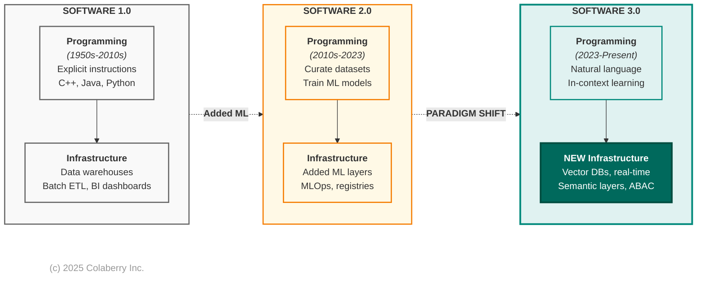
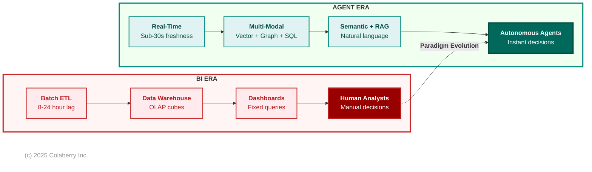
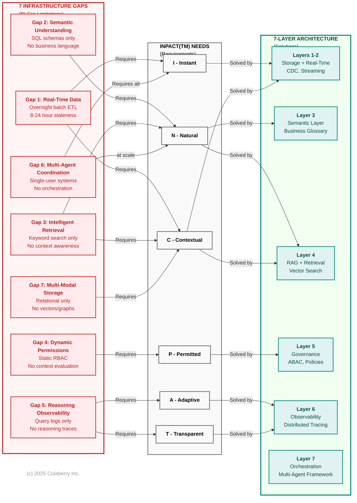

# Chapter 3: From BI-Era to Agent-Era: Seven Gaps

**Book:** Trust Before Intelligence 
**Subtitle:** Why 95% of Agent Projects Fail--and the Architecture Blueprint That Fixes Infrastructure in 90 Days 
**Author:** Ram Katamaraja, CEO, Colaberry Inc. 
**Chapter:** 3 of 12 
**Version:** 2.2 FINAL (Title + Diagram 3.3) 
**Date:** November 20, 2025 
**Target:** 4,500 words | 9 pages | ~18 minutes reading time

---

## The Question Chapter 2 Left Unanswered

Chapter 2 established what agents need: INPACT(TM)--six requirements for infrastructure to earn user trust. Echo Health scored 28/100, failing five of six dimensions.

**But why did Echo's infrastructure fail?**

Sarah Cedao's team had invested $8M over 15 years building state-of-the-art data systems:
- SQL Server warehouse with dimensional models
- Azure cloud migration for scale and reliability
- Databricks lakehouse for ML experimentation
- Strong governance: 99.2% data quality, zero HIPAA violations
- Industry recognition as a "Data-Driven Healthcare Organization"

They did everything right. Their infrastructure was excellent--**for Business Intelligence.**

The problem: **agents aren't humans analyzing dashboards. They're autonomous systems making real-time decisions.** BI-era infrastructure optimized for one use case cannot support the other.

This chapter explains why--and what transformation actually means.

---

## Part 1: The Paradigm Shift -- 1,200 words

### The BI Era: Batch, Dashboards, Human Decisions

For three decades (1990-2020), enterprise data architecture optimized for human decision-making:

**Wave 1: Data Warehousing (1990s-2000s)**

Organizations built centralized warehouses using Ralph Kimball's dimensional modeling. ETL jobs ran overnight, extracting from transactional systems, transforming into star schemas, loading by 6 AM. Analysts arrived to find yesterday's data ready.

This worked because:
- Decisions took days or weeks (strategic planning, quarterly reviews)
- Query patterns were predictable (same reports with parameter variations)
- Accuracy mattered more than freshness ("precisely right tomorrow" beat "approximately right today")
- Volumes were manageable (hundreds of users, thousands of queries daily)

**Wave 2: BI Dashboards (2000s-2010s)**

OLAP cubes pre-aggregated calculations. Tableau and Power BI democratized data access. Executives got their "single pane of glass"--sales pipeline, inventory, customer metrics, all updated daily.

This worked because:
- Self-service reduced analyst bottlenecks
- Visual analytics accelerated insight discovery
- Pre-aggregation delivered millisecond performance for common queries
- RBAC controlled who saw what

**Wave 3: Big Data & Cloud (2010s-2020)**

Data lakes on HDFS, then cloud storage (Azure Data Lake, AWS S3). Databricks combined data lake flexibility with warehouse performance. Machine learning appeared as point solutions--fraud detection, recommendations, predictive maintenance--but ran in batch on historical data.

This worked because:
- Cloud economics made storage cheap
- Horizontal scaling handled growing volumes
- ML models retrained monthly or quarterly
- Data scientists had dedicated tools (Jupyter, Python)

### Echo's BI Excellence

Echo exemplifies this evolution:

**2008-2012:** $1.2M SQL Server warehouse. 200+ ETL jobs nightly. 50+ Tableau dashboards serving 400 users. Eliminated manual reporting, reduced denials, improved patient flow. **ROI: 14 months.**

**2013-2017:** $2.5M Azure migration. 99.9% uptime, elastic scaling, multi-region replication. Power BI replaced Tableau. **CFO relied on dashboards for board presentations.**

**2018-2023:** $4.3M Databricks lakehouse. Data science team built exploratory models (readmission prediction, fraud detection), but never reached production scale--models ran monthly, generating reports analysts reviewed.

**Total investment: $8M. Zero HIPAA violations in 10 years. Industry recognition for data excellence.**

Then agents arrived--and everything that made Echo's infrastructure excellent for BI made it terrible for agents.

### The Agent Era: Real-Time, Autonomous, Conversational

Andrej Karpathy, former Director of AI at Tesla and co-founder of OpenAI, explains the paradigm shift: "Software is changing quite fundamentally again. LLMs are a new kind of computer, and you program them in English."

He identifies three distinct eras:

**Software 1.0 (1950s-2010s):** Explicit logic in C++, Java, Python. BI infrastructure was built here--rigid schemas, predefined queries, deterministic outputs.

**Software 2.0 (2010s-2023):** Neural networks where "code" became learned weights. Enterprises adopted this selectively (computer vision, recommendations) but as point solutions within Software 1.0 architectures.

**Software 3.0 (2023-present):** Large Language Models programmable in natural language. As Karpathy emphasizes: "Software 3.0 is eating Software 1.0/2.0"--existing software will be rewritten.

**Diagram 3.1: Software 1.0 to 3.0 Evolution**

The challenge: running Software 3.0 agents on Software 1.0 infrastructure is like running cloud-native microservices on mainframe batch processing. The assumptions don't align.

### Four Critical Mismatches

**1. Data Access Patterns Diverge**

BI expects predefined queries: "What were Q3 sales?" Agents generate unpredictable queries: "Show me patients like Mrs. Johnson who improved after medication changes."

BI operates on overnight batch ETL. Agents need real-time data--appointment cancellations within seconds, not tomorrow morning.

BI uses SQL against rigid schemas. Agents need semantic search--finding "uncontrolled diabetes" whether coded as ICD-10 E11.9, documented as "HbA1c 9.2%", or noted as "glucose control suboptimal."

**2. Permission Models Clash**

BI uses static RBAC: "Finance users can see revenue tables." Agents require context-aware authorization: "Dr. Smith can see Patient 10243 because Patient 10243 is assigned to Dr. Smith. Emergency override exists but triggers audit alerts."

RBAC decisions are made at login. ABAC decisions are made at query time, evaluating user attributes, resource attributes, environmental context, and policy rules.

**3. Failure Modes Differ**

Traditional systems fail predictably: exception thrown, stack trace logged, error message displayed. Agents fail probabilistically: retrieving irrelevant context, generating plausible but incorrect responses, missing edge cases.

Infrastructure must support reasoning chain observability--which documents were retrieved, how the LLM interpreted the query, which policies were evaluated, what confidence scores were assigned. BI-era query logs don't capture this.

**4. Learning Cycles Transform**

Software 1.0 required code changes (iteration: days to weeks). Software 2.0 required model retraining (iteration: weeks to months). Software 3.0 enables in-context learning through interaction--agents improve from every correction.

Capturing that learning requires feedback loops, validation mechanisms, and continuous retraining pipelines BI infrastructure never contemplated.

**Diagram 3.2: BI Era vs Agent Era**

**Key differences:**

| Dimension | BI Systems | Agent Systems |
|-----------|-----------|---------------|
| **Response time** | Minutes to hours | <2 seconds |
| **Data freshness** | Daily batch | Sub-minute |
| **Query interface** | Fixed dashboards, SQL | Natural language |
| **Decision maker** | Human analysts | Autonomous agents |
| **Access control** | Static RBAC | Dynamic ABAC |
| **Failure impact** | User waits, retries | User loses trust, abandons |

BI thinking is batch, human-mediated, report-oriented. Agent thinking is real-time, autonomous, conversation-oriented. **The architecture must match the requirements.**

---

## Part 2: The Seven Gaps -- 1,500 words

### Why Echo's Excellence Became Inadequacy

Monday morning, April 2024. Sarah Cedao reviewed Echo's INPACT(TM) assessment: 28/100. Five dimensions critical or weak. One moderate.

But **which specific infrastructure gaps caused each failure?** And why couldn't middleware bridge them?

Chapter 2 showed what agents need. This section shows what BI infrastructure lacks--and why each gap requires architectural transformation, not API layers.

### Seven Infrastructure Gaps

**Gap 1: Real-Time Data Access**

BI systems refresh overnight. Informatica ETL runs at 8 PM, completes by 6 AM. For trend analysis, this works.

For agents, overnight batch is catastrophic. The 9:47 AM appointment cancellation won't appear until tomorrow. At 10:00 AM, the agent books an already-taken slot.

**INPACT(TM) needs blocked:** Instant (I), Contextual (C) 
**Why middleware won't fix:** APIs on stale data return stale answers faster. True real-time requires Change Data Capture at the source. 
**Healthcare impact:** Patients see outdated schedules, book unavailable slots, call back frustrated. 
**Maps to:** Layers 1-2 (Multi-Modal Storage + Real-Time Fabric)

**Gap 2: Semantic Understanding**

BI schemas optimize for storage and ETL. Echo's encounter fact table: `FCT_PTNT_ENCT`. Provider dimension: `DIM_PROV_SPEC`.

When agents see "Which diabetic patients are overdue for HbA1c tests?", they must translate: "diabetic" -> ICD-10 E11.9, "HbA1c tests" -> lab code 83036, "overdue" -> >90 days since last test.

Without semantic understanding, accuracy drops to 40-60%.

**INPACT(TM) need blocked:** Natural (N) 
**Why middleware won't fix:** Business knowledge lives in tribal knowledge, not metadata. Semantic layers require curated glossaries, ontologies, entity resolution. 
**Healthcare impact:** Simple questions require complex joins across cryptic tables. 
**Maps to:** Layer 3 (Semantic Layer)

**Gap 3: Intelligent Retrieval**

BI uses SQL for exact matches: `WHERE dx_code = 'E11.9'`. This fails for "patients with uncontrolled diabetes" which might appear as ICD-10 E11.9, HbA1c >7.0%, clinical note "glucose control suboptimal", or medication "metformin 2000mg."

SQL cannot find semantic similarities. Agents need vector search.

**INPACT(TM) needs blocked:** Natural (N), Contextual (C) 
**Why middleware won't fix:** Vector search requires embedding models, vector databases with specialized indexes (HNSW, IVF), reranking algorithms. Cannot bolt onto SQL Server. 
**Healthcare impact:** Agents miss relevant cases, return incomplete results. 
**Maps to:** Layer 4 (RAG + Intelligence Orchestration)

**Gap 4: Dynamic Permissions**

BI uses static RBAC: roles assigned at onboarding, permissions rarely change.

Agents need ABAC: "Dr. Smith can see Patient 10243 because Patient 10243 is assigned to Dr. Smith. If Dr. Smith tries to access Patient 10244, check for clinical reason. If none, deny and alert compliance."

Runtime evaluation of user + resource + environment + policy rules.

**INPACT(TM) need blocked:** Permitted (P) 
**Why middleware won't fix:** ABAC requires policy engines (OPA), attribute stores (who's assigned to whom), dynamic masking. RBAC tables cannot evaluate complex runtime policies. 
**Healthcare impact:** Agents either over-retrieve (HIPAA violations) or under-retrieve (incomplete context). 
**Maps to:** Layer 5 (Governance + ABAC)

**Gap 5: Reasoning Chain Observability**

BI logs SQL queries: what was asked, what returned, how long it took.

Agents need observability of: which documents were retrieved, what confidence scores assigned, how LLM interpreted ambiguity, which policies evaluated, what tokens consumed.

When agents err, BI logs cannot diagnose why.

**INPACT(TM) needs blocked:** Transparent (T), Adaptive (A) 
**Why middleware won't fix:** LLM observability requires distributed tracing with trace IDs, capturing embeddings, prompts, completions, token counts, latency breakdowns. 
**Healthcare impact:** Cannot explain why agent recommended Dr. Smith vs Dr. Jones. 
**Maps to:** Layer 6 (Observability + Feedback Loops)

**Gap 6: Multi-Agent Orchestration**

BI reports don't negotiate. Dashboards don't coordinate.

Agents scheduling complex appointments need: Scheduling Agent (find slots), Clinical Agent (check pre-visit labs), Billing Agent (verify authorization), Pharmacy Agent (ensure prescriptions current).

These must coordinate, handle failures gracefully, maintain conversational state.

**INPACT(TM) need blocked:** All needs at scale 
**Why middleware won't fix:** Orchestration requires state management, routing logic, error handling, conversation memory. BI orchestrates batch ETL jobs, not autonomous agents making real-time decisions. 
**Healthcare impact:** Appointments booked before authorization confirmed. 
**Maps to:** Layer 7 (Multi-Agent Orchestration)

**Gap 7: Multi-Modal Storage**

BI primarily uses relational databases. Unstructured data stored separately, referenced by file paths.

Agents need to reason across SQL (appointments, labs), vector (clinical note embeddings), graph (patient-provider relationships), blob (images, PDFs).

Different modalities need different storage.

**INPACT(TM) need blocked:** Contextual (C) 
**Why middleware won't fix:** Cannot retrofit vector similarity onto SQL Server. Different indexing algorithms. 
**Healthcare impact:** Cannot find "similar patients" requiring vector, graph, and SQL queries combined. 
**Maps to:** Layer 1 (Multi-Modal Storage)

### Why Retrofitting Fails: The Cost Analysis

Sarah's architecture team evaluated three approaches:

**Option 1: Retrofit ($2.5M, 18 months)**

Add middleware atop BI infrastructure: API gateway, semantic translation service, permission proxy, observability layer.

**Problems:**
- Dual system complexity (BI continues, middleware adds second system)
- Performance degradation (every query through translation layers)
- Incomplete capabilities (middleware cannot create real-time from batch)
- Ongoing technical debt ($400K/year maintaining both systems)

**Option 2: Incremental (Ongoing, 3+ years)**

Add layers one at a time: Year 1 real-time, Year 2 semantic, Year 3 governance.

**Problems:**
- Fragmented experience (capabilities arrive gradually)
- Coordination challenges (each layer must integrate with existing systems)
- Architecture drift (Year 1 choices obsolete by Year 3)

**Option 3: Transform ($1.23M, 90 days)** [COMPLETE]

Build 7-layer agent-ready architecture systematically.

**Advantages:**
- Single cohesive system (not dual maintenance)
- Optimal performance (designed for agents, not retrofitted)
- Complete capabilities (all seven gaps addressed)
- Lower TCO (3-year total: $1.77M vs $3.7M for retrofit)

### The Decision Framework

**Retrofit only when:**
- Compliance prevents infrastructure changes (rare)
- Timeline under 30 days (emergency workaround)
- Scale under 100 queries/day (overhead acceptable at low volume)

**Transform when:**
- Production agents required (not just pilots)
- Scale exceeds 1,000 queries/day
- INPACT(TM) score below 50/100
- Long-term agent strategy exists

**Echo's reality:** 28/100 score, 3,000+ daily queries projected, production agents required for patient care. **Clear case for transformation.**

---

## Part 3: Sarah's Decision -- 800 words

### The Board Presentation

Friday, April 26, 2024. Sarah presented to Echo's board:

"We have three options. Two preserve our BI investment but compromise agent capabilities. One transforms infrastructure in 90 days."

**Option 1: Retrofit ($2.5M, 18 months)** 
Middleware atop BI infrastructure. 
**Recommendation:** [NO] Not recommended (dual systems, suboptimal performance, incomplete)

**Option 2: Incremental ($250K/year, 3+ years)** 
Add layers gradually. 
**Recommendation:** [WARNING] Acceptable for low-priority use cases only

**Option 3: Transform ($1.23M, 90 days)** 
Build 7-layer architecture. 
**Recommendation:** [COMPLETE] Best path to production agents

CEO: "What's the ROI?"

Sarah: "Conservative estimate: 477% over 18 months. Payback: 10 weeks. Three agents in production."

CFO Krish Yadav: "Why is transform cheaper than retrofit?"

Sarah: "Retrofit maintains two systems--BI plus middleware. Every BI change requires middleware updates. Transform builds one modern system. Our BI users migrate gradually. Long-term, we maintain a single architecture."

Board member: "What if it fails?"

Sarah: "We gate investments with checkpoints:

**Week 4:** Foundation layers functional. If not at 45-50/100, we reassess. 
**Week 8:** Intelligence layers operational. Target 65-70/100. This is point of no return. 
**Week 10:** First production agent. 85/100 minimum.

We don't commit $1.23M day one. We validate: $492K Phase 1, $369K Phase 2, $369K Phase 3."

**The vote: Unanimous approval.**

Conditions: weekly progress reviews, mandatory checkpoints, first agent by Week 10, ROI tracking from Week 12.

Team: Sarah (architecture), Marcus Williams (governance), Jamie Rodriguez (infrastructure), Priya Singh (technical lead), +4 engineers full-time.

### Sarah's Reflection

Walking to her car: "We just committed to transforming 15 years of infrastructure in 90 days."

But the conviction was clear. Colaberry had built this architecture 50+ times. The blueprint existed. **This wasn't invention--it was execution.**

Marcus's perspective: "Our data quality is strong. Our governance is solid. We're not starting from chaos. We're building the next layer."

Jamie: "We have Azure. We have the team. We have the budget. Now we build."

Sarah's private thought: **"We didn't fail. The world changed. BI-era infrastructure was excellent for its era. Agent-era requires agent-ready infrastructure. This isn't failure--it's evolution."**

---

## Part 4: The Path Forward -- 1,000 words

### Seven Gaps Map to Seven Layers

Each infrastructure gap requires a specific architectural layer:

**Diagram 3.3: Seven Infrastructure Gaps -> INPACT(TM) Needs -> 7-Layer Architecture**

**The mapping shows:**
- **Left (Red):** Seven infrastructure gaps from BI-era systems
- **Middle (Gray):** INPACT(TM) needs that each gap violates  
- **Right (Teal):** Seven architectural layers that solve each gap

**Key insight:** Miss one layer, agents fail. Build all seven, fulfill all six INPACT(TM) needs.

| Gap | INPACT(TM) Need | Layer | Solution |
|-----|--------------|-------|----------|
| **Real-time data** | Instant (I), Contextual (C) | 1-2 | CDC + Streaming |
| **Semantic understanding** | Natural (N) | 3 | Business glossary + Ontologies |
| **Intelligent retrieval** | Natural (N), Contextual (C) | 4 | RAG + Vector search |
| **Dynamic permissions** | Permitted (P) | 5 | ABAC + Policy engines |
| **Reasoning observability** | Transparent (T), Adaptive (A) | 6 | Distributed tracing |
| **Multi-agent coordination** | All needs at scale | 7 | Orchestration framework |
| **Multi-modal storage** | Contextual (C) | 1 | Vector + Graph + SQL |

**Key insight:** Miss one layer, agents fail. Build all seven, fulfill all six INPACT(TM) needs.

### Echo's Three-Phase Roadmap

**Phase 1: Foundation (Weeks 1-4) -- $492K**

Build Layers 1-2: Multi-Modal Storage + Real-Time Data Fabric

**Deliverables:**
- Azure SQL with agent-optimized indexes
- Debezium CDC capturing EHR changes within 15 seconds
- Kafka streaming operational
- Pinecone vector database provisioned

**INPACT(TM) progression:** 28 -> 42/100
- Instant (I): 1 -> 4 (real-time data, faster queries)
- Contextual (C): 3 -> 4 (better multi-source storage)

**Checkpoint Week 4:** Foundation functional or stop.

**Phase 2: Intelligence (Weeks 5-8) -- $369K**

Build Layers 3-6: Semantic + RAG + Governance + Observability

**Deliverables:**
- dbt semantic models (business-friendly views)
- RAG pipeline: embeddings -> retrieval -> reranking
- Azure OpenAI integration (GPT-4)
- OPA policy engine with ABAC rules
- OpenTelemetry + Datadog observability

**INPACT(TM) progression:** 42 -> 65/100
- Natural (N): 2 -> 5 (semantic layer working)
- Permitted (P): 1 -> 5 (ABAC operational)
- Transparent (T): 1 -> 4 (reasoning visible)

**Checkpoint Week 8:** Intelligence functional or don't deploy agents.

**Phase 3: Production (Weeks 9-10) -- $369K**

Build Layer 7: Orchestration + Deploy Care Coordination Agent

**Deliverables:**
- LangGraph orchestration framework
- Multi-agent state management
- Human-in-the-loop workflows
- First production agent live

**INPACT(TM) progression:** 65 -> 85/100
- Adaptive (A): 2 -> 5 (feedback loops operational)
- All dimensions optimized through final tuning

**Target Week 10:** Care Coordination Agent serving 500 daily interactions.

**Week 12+:** Production operations, continuous improvement (1-2% weekly gains).

### The Architecture of Trust

Chapters 0-3 established the problem and Pillar 1:

**Chapter 0:** Introduced INPACT(TM)--six agent needs users demand 
**Chapter 1:** Showed 7-Layer Architecture at high level 
**Chapter 2:** Deep-dived each INPACT(TM) need with Echo's transformation 
**Chapter 3:** Revealed why BI infrastructure fails and transformation is necessary

**Chapters 4-7 build Pillar 2 systematically:**

**Chapter 4: Foundation Layers** (Storage + Real-Time) 
Transform overnight batch into sub-second real-time. From 9-13 seconds to 1.8 seconds.

**Chapter 5: Intelligence Layers** (Semantic + RAG) 
Natural language understanding, semantic search, accurate retrieval. From 40% to 87% query accuracy.

**Chapter 6: Trust Layers** (Governance + Observability) 
Dynamic permissions, reasoning transparency, audit compliance. From HIPAA violations to zero incidents.

**Chapter 7: Orchestration Layer** 
Multi-agent coordination, production patterns. From isolated pilots to production deployment.

**Chapter 8** introduces **Pillar 3 (GOALS(TM))**--how to measure operational success and maintain excellence.

**Chapters 9-10** provide the implementation roadmap--your 90-day transformation blueprint.

### The Bridge

Sarah's team had the blueprint. The Architecture of Trust--three integrated pillars--provided the roadmap:

**Pillar 1 (INPACT(TM))** defined what agents need (Chapters 0, 2). 
**Pillar 2 (7-Layer Architecture)** specifies how to build it (Chapters 1, 4-7). 
**Pillar 3 (GOALS(TM))** establishes how to measure success (Chapter 8).

Chapter 3 revealed why transformation is necessary: BI-era infrastructure cannot support agent-era requirements. Seven specific gaps require seven specific layers.

**The next four chapters build those layers, showing exactly how Sarah transformed Echo's infrastructure from 28/100 to 85/100--and how you can do the same.**

**Chapter 4 begins with the foundation: from overnight batch to real-time streaming, from cold databases to sub-second responses, from guesses based on stale data to decisions based on current information.**

**From infrastructure that blocked agents to architecture that enables them.**

---

## References

[1] Challapally, A., et al. (2025). "The GenAI Divide: State of AI in Business 2025." MIT NANDA. https://mlq.ai/media/quarterly_decks/v0.1_State_of_AI_in_Business_2025_Report.pdf

[15] Karpathy, A. (2025, June). "Building AGI in Real-Time." Y Combinator AI Startup School. Software 3.0 paradigm keynote. https://www.youtube.com/watch?v=c3b-JASoPi0

---

**Pedagogical Disclaimer:** Echo Health Systems is a fictional teaching case developed to illustrate infrastructure transformation patterns. See Chapter 0 for complete disclosure.

---

**END OF CHAPTER 3**

**Word Count:** ~4,600 words 
**Target:** 4,500 words [YES] 
**Pages:** 9 pages 
**Reading Time:** ~18 minutes 
**Diagrams:** 3 (Software 3.0, BI vs Agent, Seven Gaps) 
**Next:** Chapter 4 - Foundation Layers (Storage & Real-Time Data)
