# THE 95% SOLUTION - PART 3
## The Architecture of Trust: Transparency + Orchestration Layers

**Book:** Trust Before Intelligence  
**Subtitle:** Why 95% of AI Projects Fail—3 Frameworks, 90-Day Fix  
**Author:** Ram Katamaraja, CEO, Colaberry Inc.  
**Chapter Length:** ~10,200 words (20 pages)  
**Version:** 1.9 (GOALS™ Terminology Update)  
**Date:** November 28, 2025

---

**Diagram 0: Transparency + Orchestration Layers — Why Layers 5-6-7 Complete Trust**

```mermaid

graph LR
    subgraph WITHOUT["WITHOUT LAYERS 5-6-7"]
        direction TB
        W1["No dynamic access<br/>HIPAA risk<br/><br/>Black box AI<br/>No explainability<br/><br/>Single-agent only<br/>No coordination<br/><br/>'I don't trust it'<br/>Blocked"]
    end
    
    subgraph TRANSFORM["TRANSFORM"]
        direction TB
        T1["→"]
    end
    
    subgraph WITH["WITH LAYERS 5-6-7"]
        direction TB
        L1["Layer 5:<br/>Governance + HITL<br/><br/>Layer 6:<br/>Full trace + audit<br/><br/>Layer 7:<br/>Multi-agent<br/>orchestration<br/><br/>'I can verify it'<br/>Trust earned"]
    end
    
    WITHOUT --> TRANSFORM --> WITH
    
    style WITHOUT fill:#ffebee,stroke:#c62828,stroke-width:2px,color:#b71c1c
    style TRANSFORM fill:#f5f5f5,stroke:#666666,stroke-width:2px,color:#333333
    style WITH fill:#e0f2f1,stroke:#00897b,stroke-width:2px,color:#004d40
    style W1 fill:#ffcdd2,stroke:#c62828,color:#b71c1c
    style T1 fill:#f5f5f5,stroke:#666666,color:#333333
    style L1 fill:#b2dfdb,stroke:#00897b,color:#004d40

```

> **Key Takeaway:** Trust requires transparency. Layers 5-6-7 make AI verifiable.

## PART 1: TRANSPARENCY + ORCHESTRATION ARCHITECTURE INTRODUCTION

Intelligence is operational. But intelligence alone isn't enough.

In Week 7, Echo Health Systems achieved what months of prior effort had failed to deliver. LLMs understood clinical queries. RAG retrieved relevant medical records from 150,000 documents with 95.6% accuracy. The semantic layer resolved "Dr. Martinez's diabetic patients with poor glycemic control" into precise SQL queries across Epic, lab systems, and scheduling databases—all in 1.8 seconds.

But Sarah Cedao, Echo's CTO, knew this wasn't the finish line. It was merely the foundation for what agents actually needed to operate in production.

Intelligence without governance is risk. An agent that can access everything is an agent that will eventually access something it shouldn't. In healthcare, that "something" is protected health information, medication decisions, and financial authorizations—areas where errors carry regulatory penalties and patient harm.

Intelligence without observability is invisible risk. When an agent makes a decision, operations teams need to understand why. When costs spike, finance needs to trace the cause. When accuracy drops, data scientists need visibility into model behavior. Without observability, organizations operate blind.

Intelligence without orchestration is isolated capability. Real clinical workflows don't involve single questions with single answers. They involve care coordination across scheduling, clinical documentation, and revenue cycle—three domains that traditional systems treat as separate kingdoms. Agents that can't coordinate are agents that can't deliver complete care.

These final three layers would complete the architecture.

**Diagram 1: The Architecture of Trust—Completing Pillar 2**

```mermaid
graph TB
    subgraph "<b>THE ARCHITECTURE OF TRUST</b>"
        P1["<b>PILLAR 1</b><br/><b>INPACT™</b><br/><b>What Agents Need</b><br/><b>✓ Complete</b>"]
        P2["<b>PILLAR 2</b><br/><b>7-Layer Architecture</b><br/><b>What to Build</b><br/><b>⚡ Completing Now</b>"]
        P3["<b>PILLAR 3</b><br/><b>GOALS™</b><br/><b>How to Operate</b><br/><b>⊹ Next</b>"]
    end
    
    BUILD["<b>🔧 Chapter 6 Builds Here</b><br/><b>Layers 5-6-7</b><br/><b>Transparency + Orchestration</b>"]
    
    Copyright["<b>© 2025 Colaberry Inc.</b>"]
    
    P1 -->|<b>Agent needs fulfilled by</b>| P2
    P2 -->|<b>Infrastructure enables</b>| P3
    P2 -.->|<b>You Are Here</b>| BUILD
    
    style P1 fill:#e0f2f1,stroke:#00897b,stroke-width:2px,color:#004d40
    style P2 fill:#00695c,color:#ffffff,stroke:#004d40,stroke-width:3px
    style P3 fill:#f9f9f9,stroke:#666666,stroke-width:2px,color:#000000
    style BUILD fill:#fff9e6,stroke:#f57c00,stroke-width:2px,color:#e65100
    style Copyright fill:#ffffff,stroke:none,color:#666666
```

### Architectural Context

Chapters 4-5 built the foundation and intelligence layers. Chapter 4 delivered data availability—eight storage categories and real-time pipelines with 28-second freshness. Chapter 5 delivered data understanding—semantic resolution of 2,400 clinical terms and a 7-stage RAG pipeline with 85% cache hit rates. Together, these four layers transformed Echo's data infrastructure from legacy BI to agent-capable.

Chapter 6 completes the architecture with three final layers:

**Layer 5 (Governance):** Policy-based authorization controlling what agents can do. ABAC (Attribute-Based Access Control) evaluates every request against four dimensions—who is asking, what they're accessing, when they're accessing it, and where they're accessing it from. OPA (Open Policy Agent) enforces policies. HITL (Human-in-the-Loop) workflows escalate high-risk decisions to human experts.

**Layer 6 (Observability):** Complete visibility into what agents did. Distributed tracing with OpenTelemetry tracks every request across all seven layers. MLOps monitoring detects model drift. LLM cost tracking provides granular visibility into the $26,000 monthly API spend that would otherwise be a black box.

**Layer 7 (Orchestration):** Multi-agent coordination enabling how agents work together. LangGraph provides the framework for supervisor patterns, shared state management, and conditional routing. Three specialized agents—Care Coordination, Clinical Documentation, and Revenue Cycle—collaborate on complex queries that span multiple domains.

**A Note on Agent Development:** The three specialized agents are not new developments. These are the same agents from Echo's original $2M pilot investment (Chapter 1), retrofitted to operate on the now-complete infrastructure. The pilots failed not because the agent logic was flawed, but because the underlying infrastructure couldn't fulfill INPACT™ needs: data arrived hours late, semantic understanding was inconsistent, governance was RBAC-only, and observability was nonexistent. With Layers 1-6 now operational, these agents finally have the foundation they require. The Layer 7 development cost covers orchestration integration—connecting the three existing agents through LangGraph's supervisor pattern, implementing shared state management, and enabling multi-agent coordination. The heavy lifting of agent logic, Epic integration, and clinical workflow mapping was already complete from the original pilots. What was missing was the infrastructure to make them trustworthy. This is the central lesson of Echo's transformation: **the agents were never the problem. The infrastructure was.**

Why cover three layers in one chapter? Because trust and orchestration are interdependent. Orchestration without governance means uncontrolled agents collaborating on decisions they shouldn't make. Orchestration without observability means invisible coordination failures. All three layers must be operational together for production deployment.

The three-week build timeline—Week 8 Governance, Week 9 Observability, Week 10 Orchestration—is detailed in Part 2.

**Diagram 2: 7-Layer Agent-Ready Architecture—Transparency + Orchestration Highlighted**

```mermaid
graph TB
    subgraph "<b>TRUST LAYERS (Ch 6)</b>"
        L7["<b>Layer 7: Orchestration</b><br/><b>Multi-Agent Coordination</b>"]
        L6["<b>Layer 6: Observability</b><br/><b>Tracing & Monitoring</b>"]
        L5["<b>Layer 5: Governance</b><br/><b>ABAC + HITL</b>"]
    end
    
    subgraph "<b>INTELLIGENCE (Ch 5)</b>"
        L4["<b>Layer 4: Intelligence</b><br/><b>RAG + LLM</b>"]
        L3["<b>Layer 3: Semantic</b><br/><b>Business Context</b>"]
    end
    
    subgraph "<b>FOUNDATION (Ch 4)</b>"
        L2["<b>Layer 2: Real-Time</b><br/><b>CDC & Streaming</b>"]
        L1["<b>Layer 1: Storage</b><br/><b>Multi-Modal</b>"]
    end
    
    Copyright["<b>© 2025 Colaberry Inc.</b>"]
    
    L7 --> L6 --> L5 --> L4 --> L3 --> L2 --> L1
    
    style L7 fill:#00695c,color:#ffffff,stroke:#004d40,stroke-width:3px
    style L6 fill:#00695c,color:#ffffff,stroke:#004d40,stroke-width:3px
    style L5 fill:#00695c,color:#ffffff,stroke:#004d40,stroke-width:3px
    style L4 fill:#e0f2f1,stroke:#00897b,stroke-width:2px,color:#004d40
    style L3 fill:#e0f2f1,stroke:#00897b,stroke-width:2px,color:#004d40
    style L2 fill:#f9f9f9,stroke:#666666,stroke-width:2px,color:#000000
    style L1 fill:#f9f9f9,stroke:#666666,stroke-width:2px,color:#000000
    style Copyright fill:#ffffff,stroke:none,color:#666666
```

### The Remaining Gaps

Chapter 3 identified seven infrastructure gaps preventing agent deployment. Chapters 4-5 addressed Gaps 1-4. Three gaps remain:

| Gap | Infrastructure Need | Layer | Status |
|-----|---------------------|-------|--------|
| Gap 1 | Multi-Modal Storage | Layer 1 | ✓ Chapter 4 |
| Gap 2 | Real-Time Data | Layer 2 | ✓ Chapter 4 |
| Gap 3 | Semantic Understanding | Layer 3 | ✓ Chapter 5 |
| Gap 4 | Intelligent Retrieval | Layer 4 | ✓ Chapter 5 |
| **Gap 5** | **Dynamic Permissions** | **Layer 5: Governance** | **Chapter 6** |
| **Gap 6** | **Reasoning Observability** | **Layer 6: Observability** | **Chapter 6** |
| **Gap 7** | **Multi-Agent Coordination** | **Layer 7: Orchestration** | **Chapter 6** |

This chapter closes all remaining gaps. By Week 10, Echo's architecture will be complete.

### INPACT™ Dimensions Enabled

Each layer directly enables specific INPACT™ dimensions:

**Layer 5 enables Permitted (P):** Dynamic authorization that considers context—not just role-based yes/no decisions, but attribute-based evaluation of who, what, when, and where. A physician accessing their own patient's records during a scheduled appointment receives immediate authorization. The same physician accessing a celebrity patient's records from a home IP address at 2 AM triggers HITL review.

**Layer 6 enables Transparent (T):** Complete visibility and explainability. Every response includes citation sources. Every decision includes an explanation trail. Every anomaly triggers alerts. Trust requires transparency—users trust what they can see and verify.

**Layer 7 enables orchestration across all dimensions:** Multi-agent coordination makes Instant (I) practical for complex queries, Natural (N) seamless for multi-domain questions, and Contextual (C) coherent across agent handoffs.

These three layers will take Echo's INPACT™ score from 67/100 to 85/100—the production readiness threshold. (See Part 7 for complete dimension-by-dimension progression.)

The 85/100 threshold represents production readiness—the point at which agent infrastructure can reliably support clinical workflows with appropriate safeguards. This threshold aligns with NIST AI Risk Management Framework guidance on deploying AI systems in high-stakes environments.[1]

---

## PART 2: ECHO'S FINAL BUILD CHALLENGE

Monday, Week 8. 7:15 AM.

Sarah Cedao stood at the whiteboard in her office, marker in hand, staring at three words she'd written in capital letters:

**GOVERNANCE. OBSERVABILITY. ORCHESTRATION.**

The morning light filtered through the blinds, casting long shadows across the conference table where her team was assembling. Seven weeks ago, this same room had hosted the crisis meeting that launched the transformation—$2M in failed AI initiatives, a board demanding answers, and a 90-day deadline that seemed impossible.

Now they were in the final stretch.

Marcus Williams, Echo's CDO, sat across from her with his tablet open to the Week 7 metrics dashboard. The numbers were encouraging: 67/100 INPACT™, up from 28/100 at Week 0. But Marcus's expression suggested he wasn't ready to celebrate. Jamie Rodriguez, Director of IT, leaned against the doorframe with a coffee cup that had long since gone cold. Dr. Chen, their clinical liaison, had dialed in from the hospitalist office, her voice slightly tinny through the speakerphone. She'd experienced the infrastructure failures firsthand—her documentation agent's context blindness had become one of the canonical examples of what needed fixing.

"We've built intelligence," Sarah began, capping the marker. "Now we make it trustworthy and coordinated."

The statement hung in the air for a moment. Everyone in the room understood what it meant. The intelligence layers worked—queries returned accurate answers, semantic understanding was reliable, the RAG pipeline performed well. But "working" in a pilot context and "trusted" in a production context were different standards. Production meant thousands of queries daily. Production meant clinical staff relying on agent outputs for patient care. Production meant regulatory scrutiny and compliance audits.

Marcus spoke first. "Governance has to come before anything else. We can't deploy clinical agents without dynamic authorization. The compliance team has been clear—RBAC alone isn't sufficient for PHI access in agent contexts. HIPAA requires reasonable and appropriate access controls, and 'appropriate' means contextual in 2025."

He pulled up a slide showing the current authorization model—a simple matrix of roles and data access permissions inherited from Epic. Physicians could access any patient record. Nurses could view but not modify orders. Administrators had department-scoped access.

"This worked when access meant a human navigating screens," Marcus continued. "It doesn't work when access means an agent processing thousands of records per minute. We need ABAC. We need HITL. We need audit trails that can explain every decision."

Jamie nodded. "And I need observability before I can support this in production. When something breaks at 3 AM—and something will break at 3 AM—I need to trace the failure across all seven layers. Right now, debugging means correlating timestamps across twelve different log files. Last week's accuracy regression took 18 hours to diagnose because we couldn't trace the retrieval path."

He gestured at his phone. "I'm already on-call for the existing systems. Adding agent infrastructure without proper observability means I'm on-call for a black box. That's not sustainable."

Dr. Chen's voice came through the speakerphone. "The clinical staff is asking when they can run multi-domain queries. Yesterday, Dr. Martinez asked about a patient's medication adherence, upcoming appointments, and insurance coverage in the same conversation. She had to ask three separate questions and manually piece together the answers. That's not AI-assisted care coordination—that's AI-assisted frustration."

Sarah could hear the weariness in Dr. Chen's voice. As the bridge between IT and clinical operations, Dr. Chen absorbed complaints from both sides. The clinicians wanted more capability. The IT team wanted more stability. Both wanted faster progress.

Sarah turned back to the whiteboard and drew three boxes connected by arrows.

"Three weeks. Three layers. One goal: architecture completion by Week 10." She began filling in details beneath each box.

**Week 8: Layer 5 - Governance**
- OPA policy engine deployment
- ABAC policy design (200+ authorization rules)
- HITL workflow implementation
- Target: Dynamic authorization operational

**Week 9: Layer 6 - Observability**
- Datadog APM integration
- OpenTelemetry distributed tracing
- LLM cost tracking dashboard
- Target: Complete operational visibility

**Week 10: Layer 7 - Orchestration**
- LangGraph framework deployment
- Three-agent coordination pattern
- State management and routing
- Target: Multi-agent queries working

"The board presentation is Week 12," Sarah continued. "That gives us two weeks of operational validation after architecture completion. We need 85/100 INPACT™ for production readiness. We're at 67. Governance improves Permitted from 2 to 6, observability improves Transparent from 3 to 6—together driving us from 67 to 85. Orchestration ties it all together for production deployment."

She paused, looking at each face in the room. "But the math only works if we execute. Questions?"

Marcus pulled up the budget tracker. "Phase 3 allocation is $82,000. Governance is mostly open source—OPA is free, so we're looking at $15,000 for integration and testing. Observability is the big line item at $34,000—Datadog licensing plus OpenTelemetry instrumentation. Orchestration is another $33,000 for LangGraph implementation and the Redis state management we'll need."

"That leaves $298,000 buffer from the original $1.23M," Jamie added. "We're under budget. Which is good, because I'd rather have contingency than explain why we need more money."

Dr. Chen cut through the financial discussion. "What about the Warfarin scenario? Last week, an agent recommended a dosing schedule without flagging the interaction with the patient's aspirin prescription. If we're serious about governance, that's the test case. The clinical staff won't trust a system that makes medication recommendations without appropriate safeguards."

The Warfarin scenario had become something of a touchstone for the team. It represented the exact kind of high-stakes, high-risk situation where agent mistakes could cause patient harm. Any governance system that couldn't handle Warfarin couldn't be trusted with clinical deployment.

Sarah circled "HITL" on the whiteboard. "That's exactly what HITL solves. Any medication classified as high-interaction—Warfarin, methotrexate, lithium—triggers human review. The agent can draft the recommendation, but a clinician must approve before it reaches the patient. We're not replacing clinical judgment. We're augmenting it with AI assistance while keeping humans in control of high-risk decisions."

"How fast?" Dr. Chen pressed.

"The target is under 30 seconds for the escalation notification. The approval is asynchronous—could be immediate if the clinician is available, or queued for their next review window. But the key is the agent never presents unreviewed high-risk recommendations as final answers. The system knows its limits."

Marcus made a note. "We should track HITL latency as a key metric. If escalations are too slow, clinicians will route around the system. They'll ask simpler questions to avoid triggering review, which defeats the purpose."

"Agreed." Sarah stepped back from the whiteboard. "Any blockers I should know about?"

Jamie set down her coffee cup. "Datadog contract is ready to sign. Been negotiating for two weeks—they know we're serious. OpenTelemetry instrumentation is already partially in place from Layer 4—we added basic tracing for RAG pipeline debugging. Extending it to all seven layers is incremental work, not greenfield."

"LangGraph is the unknown," Marcus admitted. "We've prototyped with it, but production multi-agent coordination is new territory. The framework is solid, but our experience is limited. I'm allocating extra testing time in Week 10."

Sarah nodded. "That's why orchestration comes last. By the time we get there, governance and observability will be proving themselves. We'll know our constraints. We'll know our failure modes. And we'll have two weeks of operational data to inform the orchestration design."

She looked at each team member in turn. "Three weeks to complete what we started seven weeks ago. The foundation is solid. The intelligence works. Now we make it safe, visible, and coordinated."

Dr. Chen's voice came through one final time. "Sarah, when this works—when Dr. Martinez can ask one question and get a complete care coordination answer—that's when the clinical staff will believe AI actually helps them. Everything before that is infrastructure. This is where it becomes care."

The call ended. Sarah turned to Marcus and Jamie.

"Let's build trust."

---

## 📍 Checkpoint 1: The Challenge Defined

✅ Echo achieved 67/100 INPACT™ with working intelligence—but lacks governance, observability, and orchestration for production  
✅ Three remaining gaps: Dynamic Permissions (Layer 5), Reasoning Observability (Layer 6), Multi-Agent Coordination (Layer 7)  
✅ Build plan: Week 8 Governance, Week 9 Observability, Week 10 Orchestration. $82,000 budget. Board presentation Week 12.

**Key insight:** Agents that work correctly but can't be controlled, observed, or coordinated aren't enterprise-ready.

**Reading Time Remaining:** ~40 minutes

---

## PART 3: LAYER 5 - GOVERNANCE

### What It Is

Layer 5 provides policy-based authorization and audit infrastructure—the capability to control what agents can do by adding contextual evaluation to existing role-based permissions.

Traditional role-based access control operates on identity: a physician role grants access to patient records. Agent-era access control preserves this foundation and adds contextual evaluation: that same physician role grants access to their assigned patients' records during clinical hours from approved locations for clinically justified purposes.

**The Architecture Principle:** RBAC grants the badge; ABAC decides if you can use it right now.

This contextual evaluation requires four capabilities:

**Policy Engine:** A decision service that evaluates authorization requests against defined rules. OPA (Open Policy Agent) has emerged as the standard, with native Rego policy language enabling complex conditional logic.[2]

**ABAC Framework:** Attribute-Based Access Control evaluates four dimensions—Subject (who), Resource (what), Action (how), and Context (when/where)—to produce dynamic authorization decisions.[3]

**HITL Workflows:** Human-in-the-Loop escalation paths for decisions that exceed policy thresholds. High-risk actions trigger human review rather than automatic approval or denial.

**Audit Infrastructure:** Complete decision logging for compliance, debugging, and policy refinement. Every authorization decision—granted, denied, or escalated—is recorded with full context.

**Diagram 3: Layer 5 Governance Architecture**

```mermaid
graph TB
    subgraph "<b>LAYER 5: GOVERNANCE</b>"
        subgraph "<b>ROW 1: EVALUATION</b>"
            Query["<b>Agent Query</b>"]
            ABAC["<b>ABAC Evaluation</b>"]
            OPA["<b>OPA Policy Engine</b>"]
            Risk{{"<b>Risk?</b>"}}
        end
        
        subgraph "<b>ROW 2: DECISION & AUDIT</b>"
            Auto["<b>✓ Auto-Approve</b><br/><b>Risk < 7</b>"]
            HITL["<b>⚠️ HITL</b><br/><b>Risk ≥ 7</b>"]
            Human["<b>Human Review</b>"]
            Audit["<b>📊 Audit Log</b>"]
        end
    end
    
    Copyright["<b>© 2025 Colaberry Inc.</b>"]
    
    Query --> ABAC --> OPA --> Risk
    Risk -->|<b>Low</b>| Auto --> Audit
    Risk -->|<b>High</b>| HITL --> Human --> Audit
    
    style Query fill:#f9f9f9,stroke:#666666,stroke-width:2px,color:#000000
    style ABAC fill:#e0f2f1,stroke:#00897b,stroke-width:2px,color:#004d40
    style OPA fill:#e0f2f1,stroke:#00897b,stroke-width:2px,color:#004d40
    style Risk fill:#fff9e6,stroke:#f57c00,stroke-width:2px,color:#e65100
    style Auto fill:#00695c,color:#ffffff,stroke:#004d40,stroke-width:3px
    style HITL fill:#ffebee,stroke:#c62828,stroke-width:2px,color:#b71c1c
    style Human fill:#e0f2f1,stroke:#00897b,stroke-width:2px,color:#004d40
    style Audit fill:#00695c,color:#ffffff,stroke:#004d40,stroke-width:3px
    style Copyright fill:#ffffff,stroke:none,color:#666666
```

### Why Agents Need Governance

Agents operate differently than human users. A human physician accessing EHR records makes deliberate choices—navigating to specific patients, reviewing specific documents, for specific reasons. The implicit governance of user interfaces constrains access patterns. Agents eliminate these constraints. An agent with data access can iterate through thousands of records in seconds, aggregate information across patients, and correlate data in ways that human navigation never enabled.

This capability expansion requires governance expansion. Consider the scenario: a clinical agent asked to "summarize medication trends across diabetic patients" could legitimately access thousands of patient records. Without governance, how does the system distinguish this legitimate analytical query from a data exfiltration attempt? Both look identical at the data layer.

ABAC provides the answer. The legitimate query comes from a credentialed analyst, during business hours, from an approved workstation, requesting aggregate statistics without individual identifiers. The exfiltration attempt comes from a compromised credential, at 2 AM, from an unknown IP, requesting raw patient records. Same data access pattern—different authorization decision.

HITL adds the second line of defense. Some decisions require human judgment regardless of policy evaluation. Medication interactions with potentially life-threatening consequences shouldn't be auto-approved even when the requesting credential is valid. The governance layer recognizes risk thresholds and escalates appropriately. Research on human-AI collaboration demonstrates that appropriate task allocation between humans and AI systems improves both safety and performance.[4]

### Technologies and Approaches

**OPA (Open Policy Agent):** The CNCF graduated project provides a unified policy framework.[2] Policies written in Rego language evaluate structured input against defined rules, achieving 10,000 decisions per second with sub-millisecond latency when deployed as a sidecar.

```rego
# Example: Healthcare PHI access policy
package healthcare.phi

default allow = false

allow {
    input.subject.role == "physician"
    input.subject.department == input.resource.department
    input.action == "read"
    input.context.time_of_day >= 6
    input.context.time_of_day <= 22
    input.resource.patient_id in input.subject.assigned_patients
}
```

**ABAC Implementation:** NIST SP 800-162 defines the standard.[3] The four-factor model extends role-based permissions with contextual evaluation:

- **Subject:** Role, department, credentials, license validity, patient assignments
- **Resource:** Data classification, sensitivity level, patient consent status
- **Action:** Read, write, delete, export, aggregate
- **Context:** Time, location, device type, network origin

NIST guidance recognizes that RBAC and ABAC are complementary—organizations implement hybrid architectures that preserve role-based foundations while adding contextual evaluation.

**HITL Workflow Patterns:**

1. **Synchronous:** Request blocks until human approval (high-risk irreversible actions like medication prescriptions)
2. **Asynchronous:** Request proceeds provisionally pending review (time-sensitive, reversible actions like scheduling)
3. **Post-hoc:** Immediate execution with mandatory audit review (low-risk queries with compliance requirements)

Pattern selection depends on reversibility, urgency, and risk magnitude.

**Diagram 4: ABAC Four-Factor Authorization Model**

```mermaid
graph TB
    Query["<b>📍 Agent Request</b><br/><b>Access Needed</b>"]
    
    subgraph "<b>ABAC EVALUATION</b>"
        S["<b>💤 SUBJECT</b><br/><b>Who is asking?</b><br/><b>Role, Dept, Credentials</b>"]
        R["<b>📝 RESOURCE</b><br/><b>What data?</b><br/><b>Classification, Sensitivity</b>"]
        A["<b>⚡ ACTION</b><br/><b>What operation?</b><br/><b>Read, Write, Export</b>"]
        C["<b>📍 CONTEXT</b><br/><b>When/Where?</b><br/><b>Time, Location, Device</b>"]
    end
    
    Policy["<b>🤝 Policy Decision</b><br/><b>Risk Score 0-10</b>"]
    
    Copyright["<b>© 2025 Colaberry Inc.</b>"]
    
    Query --> S
    Query --> R
    Query --> A
    Query --> C
    S --> Policy
    R --> Policy
    A --> Policy
    C --> Policy
    
    style Query fill:#f9f9f9,stroke:#666666,stroke-width:2px,color:#000000
    style S fill:#e0f2f1,stroke:#00897b,stroke-width:2px,color:#004d40
    style R fill:#e0f2f1,stroke:#00897b,stroke-width:2px,color:#004d40
    style A fill:#e0f2f1,stroke:#00897b,stroke-width:2px,color:#004d40
    style C fill:#e0f2f1,stroke:#00897b,stroke-width:2px,color:#004d40
    style Policy fill:#00695c,color:#ffffff,stroke:#004d40,stroke-width:3px
    style Copyright fill:#ffffff,stroke:none,color:#666666
```

### Echo's Gap Before Layer 5

Echo's pre-transformation authorization relied on Epic's native RBAC—a solid foundation that defined role-based permissions: physicians access patient records, nurses view orders, administrators have department scope. This RBAC baseline remains in place. What was missing was the contextual layer to evaluate when, where, and why.

**Scenario: The After-Hours Access**
A physician accessed a celebrity patient's records at 2 AM from a home IP address. The access was legitimate—the physician was on-call and the patient had called with symptoms. But the system couldn't distinguish this legitimate emergency access from a privacy breach. RBAC correctly authorized the physician's access. What was missing: contextual evaluation asking "why is this physician accessing this patient at this time from this location?"

The most concerning gap appeared with medication queries. Echo's agent could retrieve drug interaction information and suggest dosing adjustments. But the underlying authorization made no distinction between querying acetaminophen interactions and Warfarin interactions. Both received identical treatment—immediate response with no escalation.

"We can't have an agent providing Warfarin dosing suggestions without pharmacist review," Dr. Chen stated in the Week 6 review. "That's not AI assistance—that's AI malpractice waiting to happen."

HIPAA's "minimum necessary" principle requires limiting PHI access to what's needed for the specific purpose. An RBAC-only model doesn't satisfy this in an agent context where access is automated and high-volume. FDA guidance emphasizes human oversight for clinical decision support systems.[5]

### Echo's Implementation

Echo deployed Layer 5 across Week 8-9 with the following architecture:

**OPA Policy Engine:** Deployed as a Kubernetes sidecar alongside the agent service, enabling sub-millisecond policy evaluation without network latency.[2]

**Policy Design:** 247 authorization rules covering:
- Patient record access (73 rules)
- Medication queries (52 rules)
- Scheduling operations (41 rules)
- Financial data access (38 rules)
- Administrative functions (43 rules)

**ABAC Attributes Evaluated:**
- Subject: Role, department, credential type, patient assignments
- Resource: Data classification, patient ID, sensitivity level
- Action: Read, write, prescribe, schedule, authorize
- Context: Time, IP address, device type, session duration

**HITL Triggers:** Eight high-risk categories automatically escalate:
1. Warfarin-class medication recommendations (narrow therapeutic index drugs)
2. Controlled substance queries
3. Mental health record access
4. Pediatric patient data
5. Financial authorizations exceeding $10,000
6. Cross-department patient access
7. Bulk data exports
8. Access from unrecognized devices

**Cost:** $15,000 total
- OPA: $0 (open source)
- Policy development: $8,000 (40 hours consulting)
- Integration testing: $5,000
- HITL workflow tooling: $2,000

**Diagram 5: HITL Escalation Patterns**

```mermaid
graph TB
    subgraph "<b>HITL ESCALATION PATTERNS</b>"
        subgraph "<b>SYNC (Blocking)</b>"
            S1["<b>⚠️ High-Risk Request</b>"]
            S2["<b>⏸️ BLOCKED</b>"]
            S3["<b>⏱•⚕️ Human Review</b>"]
            S4["<b>✓ Execute</b>"]
        end
        
        subgraph "<b>ASYNC & POST-HOC</b>"
            A1["<b>⚡ Time-Sensitive</b>"]
            A2["<b>📝 Provisional</b>"]
            A3["<b>👁️ Review Later</b>"]
            P1["<b>📊 Low-Risk</b>"]
            P2["<b>✓ Execute</b>"]
            P3["<b>📍 Audit Log</b>"]
        end
    end
    
    Copyright["<b>© 2025 Colaberry Inc.</b>"]
    
    S1 --> S2 --> S3 --> S4
    A1 --> A2 --> A3
    P1 --> P2 --> P3
    
    style S1 fill:#ffebee,stroke:#c62828,stroke-width:2px,color:#b71c1c
    style S2 fill:#fff9e6,stroke:#f57c00,stroke-width:2px,color:#e65100
    style S3 fill:#e0f2f1,stroke:#00897b,stroke-width:2px,color:#004d40
    style S4 fill:#00695c,color:#ffffff,stroke:#004d40,stroke-width:3px
    style A1 fill:#fff9e6,stroke:#f57c00,stroke-width:2px,color:#e65100
    style A2 fill:#e0f2f1,stroke:#00897b,stroke-width:2px,color:#004d40
    style A3 fill:#e0f2f1,stroke:#00897b,stroke-width:2px,color:#004d40
    style P1 fill:#f9f9f9,stroke:#666666,stroke-width:2px,color:#000000
    style P2 fill:#00695c,color:#ffffff,stroke:#004d40,stroke-width:3px
    style P3 fill:#e0f2f1,stroke:#00897b,stroke-width:2px,color:#004d40
    style Copyright fill:#ffffff,stroke:none,color:#666666
```

### The Warfarin Moment

Thursday, Week 9. 2:34 PM.

The first true HITL escalation arrived during afternoon rounds. Dr. Martinez queried the clinical agent about a patient's post-surgical anticoagulation protocol. The patient, recently discharged after hip replacement, was on Warfarin for DVT prophylaxis and had been prescribed aspirin for cardiovascular history.

The agent recognized the query intent, retrieved the relevant medication records, identified the drug interaction, and prepared a response. But before returning that response, the governance layer intervened.

**HITL Trigger:** Warfarin-class medication + drug interaction detected  
**Risk Score:** 8.3/10  
**Escalation:** Synchronous HITL - Pharmacist review required

Dr. Chen received the escalation notification on her workstation. The agent's draft response appeared alongside the source data: current Warfarin dose (5mg daily), aspirin prescription (81mg daily), recent INR values (trending high at 3.2), and the interaction flag.

The agent had correctly identified the interaction. It had even drafted an appropriate recommendation—consider INR monitoring frequency increase and potential Warfarin dose adjustment. But the governance layer ensured a human pharmacist reviewed this recommendation before it reached the care team.

Dr. Chen approved the recommendation with one modification: adding a specific INR target range. The entire escalation took 47 seconds from trigger to approval.

"That's exactly what we needed," she told Sarah later. "The agent did the work—gathering data, identifying the interaction, drafting the recommendation. But a human made the final call on a high-risk medication. That's trustworthy AI."

### INPACT™ Contribution

Layer 5 directly enables **Permitted (P)**: from 2/6 to 6/6.

The four-point improvement reflects the addition of contextual ABAC on top of RBAC:
- **Points 1-2:** Contextual evaluation considers time, location, device, and purpose—not just identity
- **Points 3-4:** HITL workflows provide safe escalation paths for decisions exceeding policy confidence

Combined, these capabilities enable agents to operate in clinical contexts where RBAC alone would either over-permit (allowing risky access) or under-permit (blocking legitimate use). Contextual governance finds the appropriate middle ground.

**Operational Metrics:**

| Metric | Target | Critical Threshold |
|--------|--------|-------------------|
| Policy Evaluation Latency | <10ms | >50ms |
| HITL Escalation Rate | 2-5% | >10% |
| HITL Resolution Time | <2 min | >5 min |
| False Positive Rate | <1% | >3% |

---

## 📍 Checkpoint 2: Governance Complete

✅ **Layer 5:** ABAC adds contextual evaluation to RBAC. OPA enforces 247 policies with sub-millisecond latency.  
✅ **HITL:** Warfarin scenario demonstrated—agent drafted recommendation, governance triggered escalation, Dr. Chen approved in 47 seconds.  
✅ **INPACT™:** Permitted (P) improves from 2/6 to 6/6 (+4 points).

**Key insight:** Governance enables agents to operate safely. HITL keeps humans in control of decisions that matter.

**Reading Time Remaining:** ~30 minutes

---

## PART 4: LAYER 6 - OBSERVABILITY

### What It Is

Layer 6 provides complete visibility into agent operations—the capability to understand what agents did, why they did it, and how much it cost.

Observability differs from monitoring in scope and intent. Monitoring checks whether systems are running. Observability explains why systems behave as they do. For AI agents, this distinction is critical. A monitoring alert tells you the agent returned an error. Observability tells you which layer failed, what input triggered the failure, which model was involved, how long each stage took, and what the cost implications are.

This comprehensive visibility requires four capabilities:

**Distributed Tracing:** Request tracking across all seven layers, enabling end-to-end visibility for any agent interaction. OpenTelemetry provides the standard instrumentation framework, building on foundational work in distributed systems tracing.[6][7]

**MLOps Monitoring:** Model performance tracking including accuracy degradation, drift detection, and quality metrics. When underlying data distributions shift, MLOps monitoring detects the change before it impacts outputs. Research on machine learning operations emphasizes continuous monitoring as essential for production AI systems.[8]

**LLM Metrics:** Quality, cost, and latency tracking specifically for large language model operations. LLM API calls represent significant operational cost and require dedicated visibility.

**Centralized Logging:** Aggregated logs with structured data enabling correlation across services. Debugging distributed systems without centralized logging means correlating timestamps across dozens of separate log files.

**Diagram 6: Layer 6 Observability Architecture**

```mermaid
graph TB
    subgraph "<b>LAYER 6: OBSERVABILITY</b>"
        Query["<b>Agent Query</b><br/><b>Trace ID Generated</b>"]
        
        L1["<b>Layer 1</b><br/><b>Storage</b>"]
        L3["<b>Layer 3</b><br/><b>Semantic</b>"]
        L4["<b>Layer 4</b><br/><b>RAG + LLM</b>"]
        L5["<b>Layer 5</b><br/><b>Governance</b>"]
        
        OTEL["<b>OpenTelemetry</b><br/><b>Distributed Tracing</b>"]
        
        LLM["<b>LLM Cost Tracker</b><br/><b>$0.06/query avg</b>"]
        
        DD["<b>Datadog APM</b><br/><b>Dashboards & Alerts</b>"]
        
        Metrics["<b>📊 Metrics</b><br/><b>Latency, Quality, Cost</b>"]
    end
    
    Copyright["<b>© 2025 Colaberry Inc.</b>"]
    
    Query --> L1
    Query --> L3
    Query --> L4
    Query --> L5
    L1 --> OTEL
    L3 --> OTEL
    L4 --> OTEL
    L4 --> LLM
    L5 --> OTEL
    OTEL --> DD
    LLM --> DD
    DD --> Metrics
    
    style Query fill:#f9f9f9,stroke:#666666,stroke-width:2px,color:#000000
    style L1 fill:#e0f2f1,stroke:#00897b,stroke-width:2px,color:#004d40
    style L3 fill:#e0f2f1,stroke:#00897b,stroke-width:2px,color:#004d40
    style L4 fill:#e0f2f1,stroke:#00897b,stroke-width:2px,color:#004d40
    style L5 fill:#e0f2f1,stroke:#00897b,stroke-width:2px,color:#004d40
    style OTEL fill:#00695c,color:#ffffff,stroke:#004d40,stroke-width:3px
    style LLM fill:#fff9e6,stroke:#f57c00,stroke-width:2px,color:#e65100
    style DD fill:#00695c,color:#ffffff,stroke:#004d40,stroke-width:3px
    style Metrics fill:#e0f2f1,stroke:#00897b,stroke-width:2px,color:#004d40
    style Copyright fill:#ffffff,stroke:none,color:#666666
```

### Why Agents Need Observability

Agents are black boxes by default. A user submits a query. An answer returns. What happened in between? Which documents were retrieved? Which model generated the response? How confident was the system? How much did it cost? Without observability, these questions have no answers.

This opacity creates three operational challenges:

**Debugging Challenge:** When an agent returns an incorrect response, troubleshooting requires understanding the full processing chain. Did the semantic layer misinterpret the query? Did RAG retrieve irrelevant documents? Did the LLM hallucinate despite having correct context? Each failure mode has different remediation—and without observability, identifying the failure mode requires guesswork.

**Cost Management Challenge:** LLM API calls carry meaningful cost. Claude Sonnet 4 pricing at $3 per million input tokens and $15 per million output tokens seems economical until query volume scales.[9] A healthcare system processing 10,000 daily agent queries with average 2,000 input tokens and 500 output tokens generates monthly LLM costs exceeding $2,000 for a single model—and most RAG pipelines involve multiple model calls per query. Without granular cost visibility, organizations cannot optimize spend.

**Quality Assurance Challenge:** LLM outputs vary. The same query can produce slightly different responses. Context retrieval quality affects output quality. Model drift occurs over time as underlying APIs evolve. Without quality metrics, organizations cannot detect degradation until users complain.

### Technologies and Approaches

**OpenTelemetry** provides vendor-neutral distributed tracing.[6] Core concepts: **Spans** (individual work units), **Traces** (collections of spans across a request—a single clinical query generates 15-25 spans), and **Context Propagation** (automatic trace ID forwarding across service boundaries).

**Datadog APM** provides visualization with native OpenTelemetry support.[10] Key capabilities: LLM token tracking for cost attribution, anomaly detection that alerts before users complain, and service maps showing latency distribution.

**Diagram 7: Echo's Seven-Layer Service Map**

```mermaid
graph TB
    subgraph "<b>ECHO SERVICE MAP</b>"
        subgraph "<b>ROW 1: ENTRY → TRUST</b>"
            UI["<b>Portal (4.2s)</b>"]
            L7["<b>L7: Orchestrate (180ms)</b>"]
            L6["<b>L6: Observe (12ms)</b>"]
            L5["<b>L5: Govern (8ms)</b>"]
        end
        
        subgraph "<b>ROW 2: INTELLIGENCE → DATA</b>"
            L4["<b>L4: RAG+LLM (2.8s)</b>"]
            L3["<b>L3: Semantic (340ms)</b>"]
            L2["<b>L2: Stream (28ms)</b>"]
            L1["<b>L1: Store (45ms)</b>"]
        end
    end
    
    Copyright["<b>© 2025 Colaberry Inc.</b>"]
    
    UI --> L7 --> L6
    L7 --> L5
    L7 --> L4 --> L3 --> L2 --> L1
    
    style UI fill:#f9f9f9,stroke:#666666,stroke-width:2px,color:#000000
    style L7 fill:#00695c,color:#ffffff,stroke:#004d40,stroke-width:3px
    style L6 fill:#e0f2f1,stroke:#00897b,stroke-width:2px,color:#004d40
    style L5 fill:#e0f2f1,stroke:#00897b,stroke-width:2px,color:#004d40
    style L4 fill:#e0f2f1,stroke:#00897b,stroke-width:2px,color:#004d40
    style L3 fill:#e0f2f1,stroke:#00897b,stroke-width:2px,color:#004d40
    style L2 fill:#e0f2f1,stroke:#00897b,stroke-width:2px,color:#004d40
    style L1 fill:#e0f2f1,stroke:#00897b,stroke-width:2px,color:#004d40
    style Copyright fill:#ffffff,stroke:none,color:#666666
```

**© 2025 Colaberry Inc.**

The service map reveals latency distribution: Layer 4 (RAG + LLM) dominates at 2.8 seconds P95, representing 67% of total request time. This visibility enabled Echo to focus optimization on LLM generation rather than infrastructure layers.

**LLM-Specific Observability Patterns:**
- **Token Tracking:** Cost allocation by query type (Echo found 73% of latency came from LLM generation, not retrieval)
- **Prompt Versioning:** Git-managed templates with version hashes in traces—when Echo updated its clinical reasoning prompt, observability showed accuracy improved from 94.2% to 95.6%
- **Cache Analytics:** 34% of queries were near-duplicates suitable for caching

### Echo's Gap Before Layer 6

Echo's pre-transformation monitoring consisted of CloudWatch logs and basic uptime checks. When issues emerged, debugging followed a painful pattern: user reports problem → operations identifies timestamp → engineers search logs across multiple services → correlation requires manual timestamp matching → root cause takes hours or days.

CFO Krish Yadav raised this concern: "We're spending $26,000 monthly on LLM APIs. I can see the total. I can't see the breakdown. That's not a cost center—that's a mystery."

The most frustrating gap appeared during the Week 6 accuracy regression. Response quality dropped from 95% to 87% over three days. The cause: a Pinecone index corruption that degraded retrieval quality. But identifying this root cause took 18 hours of investigation.

The debugging process illustrated the gap:

**Hour 1-4:** Confirmed accuracy degradation. Users were correct—responses were worse. But which component was failing?

**Hour 5-8:** Reviewed LLM prompts and responses. Generation quality appeared normal. The LLM wasn't hallucinating.

**Hour 9-12:** Reviewed semantic parsing. Query understanding was accurate. The system knew what users wanted.

**Hour 13-16:** Reviewed document retrieval. This is where the problem emerged. Retrieved documents were consistently low-relevance. But why?

**Hour 17-18:** Pinecone index investigation. Discovered index corruption during a routine maintenance operation.

With proper tracing, this diagnosis would have taken minutes. The trace would show: query correct → semantic parsing correct → vector search returned low-relevance results → problem identified.

"We were flying blind," Jamie Rodriguez recalled. "We knew something was wrong because users complained. But finding the actual problem meant reading thousands of log lines and hoping to spot a pattern."

### Echo's Implementation

Echo deployed Layer 6 across Week 9 with the following architecture:

**OpenTelemetry Instrumentation:** Added to all seven layers with consistent trace context propagation. Every request receives a unique trace ID that flows through the entire processing chain.[6]

**Datadog Integration:** APM agents deployed alongside application services, with custom dashboards for:
- Query latency by layer (P50, P95, P99)
- LLM cost per query (breakdown by model)
- Cache hit rates (semantic cache, RAG cache)
- HITL escalation volume and resolution time
- Error rates by category

**LLM Cost Tracking:** Custom middleware capturing token usage per request:
- Input tokens (query + context)
- Output tokens (response)
- Model selection (Claude, GPT-4, Llama)
- Cache status (hit/miss)

**Alert Configuration:**
- Latency: P95 > 3s triggers warning, P95 > 5s triggers page
- Cost: Daily spend > 120% of baseline triggers review
- Quality: Accuracy drop > 5% triggers investigation
- Errors: Error rate > 2% triggers immediate response

**Cost:** $34,000 annual
- Datadog licensing: $24,000/year
- OpenTelemetry instrumentation: $6,000 (development)
- Custom dashboards: $4,000 (development)

### Visibility Achieved

With Layer 6 operational, Echo gained unprecedented visibility into agent operations. Complete request traces now show timing for every layer—when latency spikes occur, engineers immediately identify whether the bottleneck is semantic parsing, governance checks, vector search, or LLM generation.

**Cost Visibility Example:**
Monthly LLM spend of $26,000 now decomposed:
- Claude Sonnet 4: $18,200 (clinical reasoning queries)
- GPT-4 Turbo: $4,100 (complex analytical queries)
- Llama 3.1: $2,400 (simple lookups, cached prompt responses)
- Embedding generation: $1,300 (OpenAI ada-002)

This visibility revealed optimization opportunity: 34% of clinical reasoning queries were cache-eligible but cache-missing due to minor prompt variations. Normalizing prompts increased cache hit rate from 85% to 91%, saving $3,100 monthly.

### INPACT™ Contribution

Layer 6 directly enables **Transparent (T)**: from 3/6 to 6/6.

The three-point improvement reflects the shift from opaque operations to complete visibility:
- **Point 1:** Request tracing provides explainability—users and operators can understand what happened and why
- **Point 2:** Quality monitoring provides confidence—the organization knows system accuracy in real-time
- **Point 3:** Cost attribution provides accountability—every dollar of LLM spend traces to specific use cases

Combined, these capabilities transform agents from black boxes into transparent systems where every decision has an explanation and every trend has visibility.

**Operational Metrics:**

| Metric | Target | Critical Threshold |
|--------|--------|-------------------|
| Trace Completeness | >99% | <95% |
| Dashboard Latency | <5s refresh | >30s |
| Alert False Positive Rate | <5% | >15% |
| Cost Attribution Coverage | 100% | <90% |

---

## PART 5: LAYER 7 - ORCHESTRATION

### What It Is

Layer 7 provides multi-agent coordination—the capability for specialized agents to work together on complex queries that span multiple domains.

Single-agent architectures work well for focused queries: "What is this patient's latest A1C?" routes to the clinical agent, retrieves the lab result, and returns an answer. But healthcare workflows rarely involve single domains. A discharge planning query—"prepare this patient for discharge"—requires care coordination (scheduling follow-up appointments), clinical documentation (summarizing the stay and medications), and revenue cycle (verifying insurance coverage and authorizations). Three domains, three specialized knowledge bases, one coherent answer needed.

Orchestration solves the multi-domain problem through structured coordination:

**Supervisor Pattern:** A coordinating agent classifies query intent, routes to specialized agents, and synthesizes responses. The supervisor doesn't answer directly—it manages agents that do. This pattern reflects decades of research in multi-agent systems coordination.[11]

**Shared State:** All agents access common context about the current interaction, ensuring consistency across agent boundaries. When the clinical agent retrieves medication information, the revenue agent sees that context without re-querying.

**Conditional Routing:** Query characteristics determine which agents activate. Simple queries route to single agents. Complex queries activate multiple agents in parallel or sequence.

**Diagram 8: Layer 7 Orchestration Architecture**

```mermaid
graph TB
    subgraph "<b>LAYER 7: ORCHESTRATION</b>"
        Query["<b>Multi-Domain Query</b><br/><b>Complex Care Request</b>"]
        
        Supervisor["<b>🤝 Supervisor Agent</b><br/><b>LangGraph Coordinator</b>"]
        
        Intent{{"<b>Intent Classification</b>"}}
        
        Care["<b>👥 Care Coordination</b><br/><b>Scheduling, Follow-up</b>"]
        Clinical["<b>🏥 Clinical Documentation</b><br/><b>Records, Medications</b>"]
        Revenue["<b>🔐 Revenue Cycle</b><br/><b>Insurance, Auth</b>"]
        
        State["<b>🔍 Shared State</b><br/><b>Patient Context</b>"]
        
        Synthesis["<b>✨ Response Synthesis</b><br/><b>Unified Answer</b>"]
    end
    
    Copyright["<b>© 2025 Colaberry Inc.</b>"]
    
    Query --> Supervisor
    Supervisor --> Intent
    Intent -->|<b>Care</b>| Care
    Intent -->|<b>Clinical</b>| Clinical
    Intent -->|<b>Revenue</b>| Revenue
    Care <--> State
    Clinical <--> State
    Revenue <--> State
    Care --> Synthesis
    Clinical --> Synthesis
    Revenue --> Synthesis
    
    style Query fill:#f9f9f9,stroke:#666666,stroke-width:2px,color:#000000
    style Supervisor fill:#00695c,color:#ffffff,stroke:#004d40,stroke-width:3px
    style Intent fill:#fff9e6,stroke:#f57c00,stroke-width:2px,color:#e65100
    style Care fill:#e0f2f1,stroke:#00897b,stroke-width:2px,color:#004d40
    style Clinical fill:#e0f2f1,stroke:#00897b,stroke-width:2px,color:#004d40
    style Revenue fill:#e0f2f1,stroke:#00897b,stroke-width:2px,color:#004d40
    style State fill:#e0f2f1,stroke:#00897b,stroke-width:2px,color:#004d40
    style Synthesis fill:#00695c,color:#ffffff,stroke:#004d40,stroke-width:3px
    style Copyright fill:#ffffff,stroke:none,color:#666666
```

### Why Agents Need Orchestration

The alternative to orchestration is decomposition—forcing users to break complex queries into simple components, submit them separately, and manually integrate the results. This approach has three problems:

**Cognitive Load:** Users must understand system boundaries to phrase queries correctly. Asking "prepare this patient for discharge" when the system only handles clinical questions forces the user to rephrase: "What medications is this patient on? What follow-up appointments are scheduled? Is insurance coverage verified?" The AI should handle decomposition, not the human.

**Context Loss:** Sequential queries lose context. When a user asks about medications, then asks about appointments, the second query doesn't know the first query's results unless the user manually includes them. Orchestration maintains shared state across agent boundaries.

**Latency Multiplication:** Sequential queries multiply latency. If each domain query takes 2 seconds, three sequential queries take 6 seconds minimum. Orchestration enables parallel execution—the same three queries complete in 2-3 seconds total.

### Technologies and Approaches

**LangGraph** models agent workflows as graphs—nodes are agents, edges are transitions.[12] This builds on research showing structured workflows outperform unstructured approaches.[13]

```python
# Simplified LangGraph workflow definition
from langgraph.graph import StateGraph

workflow = StateGraph(AgentState)
workflow.add_node("supervisor", supervisor_agent)
workflow.add_node("care", care_coordination_agent)
workflow.add_node("clinical", clinical_documentation_agent)
workflow.add_node("revenue", revenue_cycle_agent)
workflow.add_conditional_edges("supervisor", route_to_agents,
    {"care": "care", "clinical": "clinical", "revenue": "revenue"})
```

**Coordination Patterns:**

1. **Supervisor Pattern:** Central coordinator routes to specialists and synthesizes responses. Echo uses this—classifying intent into care, clinical, revenue, or multi-domain categories.

2. **Sequential Pattern:** Agents process in order, each enriching shared state. Example: prior authorization workflow where clinical gathers diagnosis, revenue checks coverage, authorization submits to payer.

3. **Parallel Pattern:** Multiple agents process simultaneously, latency equals slowest agent. Echo dispatches multi-domain queries to all three agents in parallel.

**State Management:** Redis with 15-minute TTL provides shared context across agents.[14] State includes query context, intermediate results, session history, and coordination metadata. (TTL configurable per use case.)

**Error Handling:** 10-second agent timeouts, partial failure responses with clear indication, graceful degradation when agents unavailable.

### Echo's Gap Before Layer 7

Echo's pilot supported only single-agent queries. Complex requests failed:

**User:** "Prepare discharge—summary, follow-up appointments, and insurance verification."  
**System:** "I can help with clinical documentation. For scheduling and insurance, please contact the respective departments."

The clinical agent did its job correctly, but the system couldn't orchestrate across domains.

Dr. Chen's Week 7 feedback captured the frustration: "Every complex question becomes three simple questions I have to ask separately. That's not assistance—that's a to-do list generator. I spend more time managing the AI than I would spend doing the work manually."

Pilot usage data confirmed: high engagement for simple lookups but declining engagement for complex workflows. Users tried multi-domain queries once, received fragmented responses, and stopped asking.

### Echo's Implementation

Echo deployed Layer 7 across Week 10 with the following architecture:

**LangGraph Framework:** Deployed as the orchestration layer, managing agent coordination through graph-based workflows.[12]

**Three Specialized Agents:**

1. **Care Coordination Agent:** Handles scheduling, appointment management, care team communication, and follow-up planning. Integrated with Epic scheduling APIs and provider directory.

2. **Clinical Documentation Agent:** Handles medical records, medication summaries, lab results, and clinical narratives. Integrated with Epic EHR and document management systems.

3. **Revenue Cycle Agent:** Handles insurance verification, prior authorization, coverage determination, and financial counseling referrals. Integrated with claims management and payer portals.

**Supervisor Design:** Intent classification determines routing:
- Single-domain queries → direct routing to relevant agent
- Multi-domain queries → parallel execution with synthesis
- Ambiguous queries → clarification request

**State Management:** Redis-backed shared state with 15-minute TTL for session context.[14]

**Governance Integration:** All agent operations pass through Layer 5 ABAC evaluation. The orchestration layer doesn't bypass governance—it coordinates governance-approved operations.

**Observability Integration:** All agent operations generate OpenTelemetry traces. The orchestration layer provides visibility into coordination patterns, not opacity.

**Cost:** $33,000 total
- LangGraph: $0 (open source)
- Redis state management: $6,000/year
- Agent orchestration integration: $18,000 (retrofitting three existing agents for multi-agent coordination)
- Integration testing: $9,000

### The Multi-Agent Moment

Friday, Week 10. 4:47 PM.

Sarah watched the terminal as Jamie Rodriguez submitted the test query:

**Query:** "Patient Maria Santos, MRN 78234156, is being discharged today following hip replacement surgery. Schedule post-discharge follow-up, medication review, and verify insurance coverage."

The orchestration layer activated. Intent classification identified three domains: Care (follow-up scheduling), Clinical (medication review), Revenue (insurance verification). The supervisor routed to all three agents in parallel.

**Care Coordination Agent (2.1s):**
- Scheduled follow-up: Orthopedics, Dr. Kim, next Tuesday 10:00 AM
- Scheduled physical therapy evaluation: Thursday 2:00 PM
- Confirmed patient transportation preferences

**Clinical Documentation Agent (1.8s):**
- Medication summary: 3 active prescriptions post-surgery
- Drug interaction check: No high-risk interactions detected
- Discharge instructions: Prepared and staged for review

**Revenue Cycle Agent (2.3s):**
- Insurance verified: UnitedHealthcare PPO
- Prior authorization: Not required for follow-up visits
- Patient responsibility estimate: $45 copay per visit

**Total Execution Time:** 4.2 seconds (parallel execution)

The supervisor synthesized the responses into a coherent discharge preparation summary. One query, three agents, one coordinated answer.

The Datadog trace showed the complete flow—intent classification and routing (~400ms), parallel agent execution (2.3s slowest path), state synchronization and synthesis (~1.5s). Every layer visible. Every agent auditable. Every decision traceable.

Marcus checked the governance log. All three agents had passed ABAC evaluation. No HITL escalations triggered—the medication review found no Warfarin-class drugs. Clean execution.

"This is what we built for," Sarah said quietly. "Three agents, one response, complete care coordination."

The room was silent for a moment. Then Jamie grinned. "**The Architecture of Trust** is operational. Now we need to prove it would stay that way."

**Diagram 9: Multi-Agent Query Flow—Maria Santos Discharge**

```mermaid
graph TB
    Query["<b>📍 Discharge Query</b><br/><b>Schedule, Review, Verify</b>"]
    
    Supervisor["<b>🤝 Supervisor</b><br/><b>Routes to 3 Agents</b>"]
    
    subgraph "<b>PARALLEL EXECUTION (2.3s)</b>"
        Care["<b>👥 Care Agent</b><br/><b>Follow-up: Tue 10 AM</b><br/><b>PT Eval: Thu 2 PM</b>"]
        Clinical["<b>🏥 Clinical Agent</b><br/><b>3 Medications</b><br/><b>No Interactions</b>"]
        Revenue["<b>🔐 Revenue Agent</b><br/><b>UHC PPO Verified</b><br/><b>$45 Copay</b>"]
    end
    
    State["<b>🔍 Shared State</b><br/><b>Patient: Maria Santos</b><br/><b>MRN: 78234156</b>"]
    
    Response["<b>✨ Unified Response</b><br/><b>Complete Discharge Prep</b><br/><b>4.2 Seconds Total</b>"]
    
    Copyright["<b>© 2025 Colaberry Inc.</b>"]
    
    Query --> Supervisor
    Supervisor --> Care
    Supervisor --> Clinical
    Supervisor --> Revenue
    Care <--> State
    Clinical <--> State
    Revenue <--> State
    Care --> Response
    Clinical --> Response
    Revenue --> Response
    
    style Query fill:#f9f9f9,stroke:#666666,stroke-width:2px,color:#000000
    style Supervisor fill:#00695c,color:#ffffff,stroke:#004d40,stroke-width:3px
    style Care fill:#e0f2f1,stroke:#00897b,stroke-width:2px,color:#004d40
    style Clinical fill:#e0f2f1,stroke:#00897b,stroke-width:2px,color:#004d40
    style Revenue fill:#e0f2f1,stroke:#00897b,stroke-width:2px,color:#004d40
    style State fill:#fff9e6,stroke:#f57c00,stroke-width:2px,color:#e65100
    style Response fill:#00695c,color:#ffffff,stroke:#004d40,stroke-width:3px
    style Copyright fill:#ffffff,stroke:none,color:#666666
```

### INPACT™ Contribution

Layer 7 doesn't directly add points to the INPACT™ score—the 85/100 is achieved through Layers 5-6 improvements to Permitted and Transparent. But orchestration enables INPACT™ dimensions at scale:

**Instant (I):** Multi-agent workflows complete in seconds through parallel execution. Without orchestration, the same tasks would require sequential human navigation across systems—minutes instead of seconds.

**Natural (N):** Users ask complex questions naturally. "Prepare for discharge" doesn't require understanding system boundaries. Orchestration handles decomposition invisibly.

**Contextual (C):** Shared state ensures all agents operate with full patient context. The revenue agent knows what medications the clinical agent found. Context doesn't get lost crossing agent boundaries.

Orchestration readiness is what makes 85/100 "production-ready." The score reflects capability. Orchestration reflects scalability.

**Operational Metrics:**

| Metric | Target | Critical Threshold |
|--------|--------|-------------------|
| Orchestration Success Rate | >95% | <90% |
| Multi-Agent Latency | <5s | >10s |
| State Consistency | 100% | <99% |
| Agent Timeout Rate | <2% | >5% |

---

## 📍 Checkpoint 3: All Three Layers Complete

✅ **Layer 6:** OpenTelemetry + Datadog APM. Cost tracking decomposed $26,000/month by model and query type.  
✅ **Layer 7:** LangGraph supervisor with three agents. 4.2-second multi-domain queries via parallel execution.  
✅ **Investment:** Layer 6 $34,000 + Layer 7 $33,000 = Phase 3 total $82,000.  
✅ **INPACT™:** Transparent (T) 3/6 → 6/6 (+3 points). Total: 67/100 → 85/100 (+18 points).

**Key insight:** Governance, observability, and orchestration are interdependent. All three must work together.

**Reading Time Remaining:** ~15 minutes

---

## PART 6: TRUST THROUGH TRANSPARENCY

Trust is the outcome. Transparency is the mechanism.[15]

**How the seven layers create transparency:**
- **Layers 1-2:** Data availability and freshness (agents citing outdated data lose trust)
- **Layers 3-4:** Understanding and reasoning (each stage instrumentable, traceable)
- **Layers 5-6:** Safety and visibility (black boxes become glass boxes)
- **Layer 7:** Coordination without opacity

**The Three Transparency Mechanisms:**

**Citations:** Every factual claim includes its source. When Echo's agent reports "Patient's A1C was 7.2%," the response includes: Epic Labs, MRN reference, timestamp. Users can verify. Agents can't hallucinate what they must cite.[16]

**Explainability:** HITL escalations include reasoning: "Risk score 8.3/10. Trigger: Warfarin + drug interaction. Policy requires pharmacist review." Users see reasoning they can evaluate.

**HITL as Trust Feature:** Systems that know when to ask for help earn trust. HITL isn't a failure mode—it communicates: "This system knows its limits."

**Echo's Response Format:**
> **Query:** Maria Santos's medication list?  
> **Response:** 3 active prescriptions [Source: Epic Orders, 11/24/2025]  
> **Confidence:** High (primary EHR, updated within 24 hours)  
> **Governance:** Auto-approved (no high-risk flags)

---

## PART 7: ECHO'S WEEK 8-10 BUILD

### Week 8: Governance Foundation

Marcus Williams led policy development, working with compliance to translate regulatory requirements into OPA rules. 247 policies emerged from sessions that felt like contract negotiations—clinical operations wanted flexibility, compliance wanted constraints.

Thursday brought the first policy conflict: a scheduling rule required department-head approval for cross-department appointments, but care coordination needed to schedule cardiology follow-ups without manual approval. Resolution: explicit "care coordination workflow" exception with enhanced audit logging.

By Friday, 193 of 247 policies were deployed. The remaining 54 covered edge cases requiring additional review.

### Week 9: Observability Operational

The observability build proceeded faster than planned—Echo's Layer 4 already had basic OpenTelemetry tracing. Extending to all seven layers required consistent patterns, not greenfield development. By Wednesday, trace completeness exceeded 98%.

Thursday afternoon brought the first HITL escalation in production—the Warfarin scenario. The trace told the complete story:
- T+0ms: Query received
- T+23ms: Governance evaluation (risk score: 8.3, trigger: Warfarin-class medication)
- T+24ms: HITL escalation initiated
- T+47,234ms: Human approval received (Dr. Chen)
- T+47,456ms: Response delivered

"That's not a test," Sarah noted. "That's production."

### Week 10: Orchestration Complete

The three agents had been in design since Week 8. Week 10 was production integration: connecting agents to LangGraph, implementing shared state, testing coordination patterns.

Tuesday brought integration failures—Epic rate limits, payer disambiguation issues. Normal problems with normal fixes.

Wednesday-Thursday: 47 test scenarios across single-domain, dual-domain, triple-domain, error handling, and HITL integration. All passed by Thursday evening.

Friday, 4:47 PM. The Maria Santos discharge query succeeded. Three agents. One response. Architecture complete.

**Diagram 10: Echo's Week 8-10 Timeline**

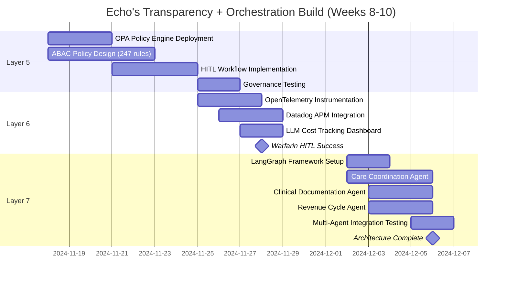

**© 2025 Colaberry Inc.**

### INPACT™ Score: Week 7 → Week 10

**Diagram 11: INPACT™ Transformation (67 → 85)**

```mermaid
graph LR
    subgraph "<b>Week 7</b>"
        W7["<b>TOTAL: 67/100</b>"]
    end
    
    Arrow["<b>→</b><br/><b>+18 pts</b>"]
    
    subgraph "<b>Week 10</b>"
        W10["<b>TOTAL: 85/100</b>"]
    end
    
    Copyright["<b>© 2025 Colaberry Inc.</b>"]
    
    W7 --> Arrow --> W10
    
    style W7 fill:#fff9e6,stroke:#f57c00,stroke-width:2px,color:#e65100
    style Arrow fill:#ffffff,stroke:none,color:#004d40
    style W10 fill:#00695c,color:#ffffff,stroke:#004d40,stroke-width:3px
    style Copyright fill:#ffffff,stroke:none,color:#666666
```

**INPACT™ Dimension Changes:**

| Dimension | Week 7 | Week 10 | Change | Enabling Layer |
|-----------|--------|---------|--------|----------------|
| **I** (Instant) | 5/6 | 5/6 | — | — |
| **N** (Natural) | 5/6 | 5/6 | — | — |
| **P** (Permitted) | 2/6 | 6/6 | **+4** | Layer 5: Governance |
| **A** (Adaptive) | 5/6 | 5/6 | — | — |
| **C** (Contextual) | 5/6 | 5/6 | — | — |
| **T** (Transparent) | 3/6 | 6/6 | **+3** | Layer 6: Observability |
| **Total** | **67/100** | **85/100** | **+18** | + Orchestration Readiness |

### The Metrics That Matter

**Week 10 Final Status:**

| Metric | Target | Achieved |
|--------|--------|----------|
| INPACT™ Score | 85/100 | 85/100 |
| Policy Coverage | 95% | 98% (242/247 policies) |
| Trace Completeness | 99% | 99.2% |
| Orchestration Success | 95% | 96.3% |
| HITL Resolution Time | <2 min | 47s average |
| Multi-Agent Latency | <5s | 4.2s average |

**Investment Summary:**

| Component | Budget | Actual |
|-----------|--------|--------|
| Layer 5: Governance | $15,000 | $15,000 |
| Layer 6: Observability | $34,000 | $34,000 |
| Layer 7: Orchestration | $33,000 | $33,000 |
| **Phase 3 Total** | **$82,000** | **$82,000** |

**Cumulative Investment:** $932,000 of $1.23M budget (76% utilized, $298,000 buffer remaining)

---

## 📍 Checkpoint 4: Echo's Build Complete

✅ **Week 8-10 Metrics:** 85/100 INPACT™. 98% policy coverage. 99.2% trace completeness. 96.3% orchestration success. 47-second HITL resolution.

**Key insight:** Governance and observability deployed before orchestration—when multi-agent coordination began, the team could see failures and enforce policies from day one.

---

## PART 8: ARCHITECTURE COMPLETE

### The Seven-Layer Achievement

Week 10, Friday, 5:15 PM.

Sarah Cedao stood at the whiteboard one final time. The three words from Week 8 Monday remained: GOVERNANCE. OBSERVABILITY. ORCHESTRATION. Each now had a checkmark beside it.

Seventy days. Seven layers. From 28/100 to 85/100.

**Diagram 12: Complete 7-Layer Agent-Ready Architecture**

```mermaid
graph TB
    subgraph "<b>COMPLETE ARCHITECTURE - WEEK 10</b>"
        L7["<b>Layer 7: Orchestration</b><br/><b>✓ LangGraph Multi-Agent</b>"]
        L6["<b>Layer 6: Observability</b><br/><b>✓ OpenTelemetry + Datadog</b>"]
        L5["<b>Layer 5: Governance</b><br/><b>✓ OPA + ABAC + HITL</b>"]
        L4["<b>Layer 4: Intelligence</b><br/><b>✓ RAG + LLM Pipeline</b>"]
        L3["<b>Layer 3: Semantic</b><br/><b>✓ 2,400 Clinical Terms</b>"]
        L2["<b>Layer 2: Real-Time</b><br/><b>✓ 28-Second Freshness</b>"]
        L1["<b>Layer 1: Storage</b><br/><b>✓ 8 Storage Categories</b>"]
    end
    
    INPACT["<b>INPACT™: 85/100</b><br/><b>Production Ready</b>"]
    
    Copyright["<b>© 2025 Colaberry Inc.</b>"]
    
    L7 --> L6 --> L5 --> L4 --> L3 --> L2 --> L1
    L1 -.->|<b>Enables</b>| INPACT
    
    style L7 fill:#00695c,color:#ffffff,stroke:#004d40,stroke-width:3px
    style L6 fill:#00695c,color:#ffffff,stroke:#004d40,stroke-width:3px
    style L5 fill:#00695c,color:#ffffff,stroke:#004d40,stroke-width:3px
    style L4 fill:#e0f2f1,stroke:#00897b,stroke-width:2px,color:#004d40
    style L3 fill:#e0f2f1,stroke:#00897b,stroke-width:2px,color:#004d40
    style L2 fill:#e0f2f1,stroke:#00897b,stroke-width:2px,color:#004d40
    style L1 fill:#e0f2f1,stroke:#00897b,stroke-width:2px,color:#004d40
    style INPACT fill:#00695c,color:#ffffff,stroke:#004d40,stroke-width:3px
    style Copyright fill:#ffffff,stroke:none,color:#666666
```

**Diagram 13: The Architecture of Trust—All Pillars Complete**

```mermaid
graph TB
    subgraph "<b>THE ARCHITECTURE OF TRUST - COMPLETE</b>"
        P1["<b>PILLAR 1: INPACT™</b><br/><b>What Agents Need</b><br/><b>6 Dimensions Defined</b><br/><b>✓ Chapter 2</b>"]
        P2["<b>PILLAR 2: 7-LAYER</b><br/><b>What to Build</b><br/><b>7 Layers Operational</b><br/><b>✓ Chapters 4-6</b>"]
        P3["<b>PILLAR 3: GOALS™</b><br/><b>How to Operate</b><br/><b>5 Operational Pillars</b><br/><b>→ Chapter 7</b>"]
    end
    
    Result["<b>🤝 Production Ready</b><br/><b>85/100 INPACT™</b><br/><b>$932K Investment</b><br/><b>70 Days</b>"]
    
    Copyright["<b>© 2025 Colaberry Inc.</b>"]
    
    P1 -->|<b>Agent needs fulfilled by</b>| P2
    P2 -->|<b>Infrastructure enables</b>| P3
    P2 -.->|<b>Delivers</b>| Result
    
    style P1 fill:#e0f2f1,stroke:#00897b,stroke-width:2px,color:#004d40
    style P2 fill:#00695c,color:#ffffff,stroke:#004d40,stroke-width:3px
    style P3 fill:#fff9e6,stroke:#f57c00,stroke-width:2px,color:#e65100
    style Result fill:#00695c,color:#ffffff,stroke:#004d40,stroke-width:3px
    style Copyright fill:#ffffff,stroke:none,color:#666666
```

### What Echo Achieved

The journey started with a simple question: Why do 95% of agent projects fail? The answer was trust—the infrastructure gap between what agents could theoretically do and what organizations could safely let them do.

Echo closed that gap. Layer by layer, week by week, capability by capability. The complete transformation metrics are detailed in the Chapter Summary.

### The Seven Gaps: Resolved

The gaps identified in Chapter 3 are all resolved. All seven layers operational. The architecture is complete. (See Chapter Summary for the complete gap resolution table.)

### The ROI Preview

Krish Yadav, Echo's CFO, reviewed the numbers Friday evening:

**Investment:** $932,000 actual against $1.23M budget  
**First-Year Value:** $3.8M (209% ROI)  
**18-Month Projected Value:** $5.87M (477% ROI)  
**Break-even Timeline:** 10 weeks post-deployment

"We spent $298,000 less than projected," Krish noted. "And the architecture is production-ready two weeks ahead of the board presentation. That never happens."

The remaining two weeks—Weeks 11-12—would validate these projections through operational deployment and measurement. Chapter 8 will document that validation. But the infrastructure prerequisite was complete.

### Bridge to Operational Excellence

Architecture alone isn't success. The 85/100 score reflects capability—what the infrastructure can do. Operations determine reality—what it actually does when clinical staff rely on it daily.

The next phase would test every assumption: Would HITL workflows scale? Would clinicians engage with review or route around it? Would multi-agent coordination remain reliable under load? Would clinical staff trust the system for complex queries?

**Chapter 7 introduces GOALS™—the framework for operational excellence:**
- **G**overnance: Policy effectiveness and HITL optimization
- **O**bservability: Monitoring maturity and incident response
- **A**vailability: Speed, freshness, and performance at scale
- **L**exicon: Query understanding and semantic accuracy
- **S**olid: System reliability and data integrity

The architecture is complete. Now it must perform.

---

## CHAPTER SUMMARY

### Key Takeaways

1. **Trust requires governance:** Intelligence without authorization controls is risk. ABAC and HITL ensure agents operate within appropriate boundaries. Dynamic authorization evaluates context—who, what, when, where—not just identity. High-risk decisions escalate to human experts. The Warfarin scenario demonstrated this principle in practice: AI assistance with human oversight for critical decisions.

2. **Trust requires transparency:** Intelligence without observability is invisible risk. Distributed tracing and cost visibility transform black boxes into glass boxes. When systems fail, operators need to understand why. When costs spike, finance needs to trace the cause. When accuracy drops, data scientists need visibility into model behavior. OpenTelemetry and Datadog provide this visibility at Echo.

3. **Scale requires orchestration:** Intelligence without coordination is isolated capability. Multi-agent architectures enable complex workflows that single agents cannot address. The discharge coordination scenario—scheduling, clinical documentation, and insurance verification in a single query—requires orchestration. LangGraph's supervisor pattern enables this coordination while maintaining governance and observability integration.

4. **The 7-Layer Architecture is complete:** Layers 1-2 (Foundation) provide data availability and freshness. Layers 3-4 (Intelligence) provide understanding and reasoning. Layers 5-6-7 (Transparency + Orchestration) provide safety, visibility, and coordination. Together, they create production-ready agent infrastructure.

5. **Architecture completion is a milestone, not a destination:** The 85/100 INPACT™ score represents capability. Operations will determine reality. The GOALS™ framework in Chapter 7 provides the methodology for operational excellence—measuring and maintaining the trust that architecture enables.

### What Changed from Week 0 to Week 10

The transformation journey covered ten weeks and closed seven infrastructure gaps:

**Foundation Phase (Weeks 1-4):**
- Gap 1 (Multi-Modal Storage): From fragmented data silos to unified eight-category storage
- Gap 2 (Real-Time Data): From batch processing with day-old data to 28-second freshness
- Investment: $470,000
- INPACT™: 28 → 42 (+14 points)

**Intelligence Phase (Weeks 5-7):**
- Gap 3 (Semantic Understanding): From schema-dependent queries to natural language with 2,400 clinical terms
- Gap 4 (Intelligent Retrieval): From keyword search to 7-stage RAG pipeline with 85% cache hit rate
- Investment: $380,000
- INPACT™: 42 → 67 (+25 points)

**Transparency + Orchestration Phase (Weeks 8-10):**
- Gap 5 (Dynamic Permissions): From RBAC only to RBAC + contextual ABAC with 247 policies
- Gap 6 (Reasoning Observability): From log archaeology to distributed tracing with cost visibility
- Gap 7 (Multi-Agent Coordination): From single-agent queries to three-agent orchestration
- Investment: $82,000
- INPACT™: 67 → 85 (+18 points)

**Total Transformation:**
- Investment: $932,000 of $1.23M budget (76% utilized)
- Timeline: 70 days (10 weeks)
- INPACT™: 28 → 85 (+57 points)
- Gaps: 7 → 0 (all resolved)

**All Seven Gaps Closed:**

| Gap | Infrastructure Need | Layer | Closed |
|-----|---------------------|-------|--------|
| 1 | Multi-Modal Storage | Layer 1 | Week 4 |
| 2 | Real-Time Data | Layer 2 | Week 4 |
| 3 | Semantic Understanding | Layer 3 | Week 7 |
| 4 | Intelligent Retrieval | Layer 4 | Week 7 |
| 5 | Dynamic Permissions | Layer 5 | Week 9 |
| 6 | Reasoning Observability | Layer 6 | Week 9 |
| 7 | Multi-Agent Coordination | Layer 7 | Week 10 |

### Echo Week 10 Status

| Metric | Week 0 | Week 10 | Improvement |
|--------|--------|---------|-------------|
| **INPACT™ Score** | 28/100 | 85/100 | +57 points |
| **Total Investment** | $0 | $932,000 | On budget |
| **Architecture Layers** | 0/7 | 7/7 | Complete |
| **Gaps Remaining** | 7 | 0 | All resolved |

### Technologies Deployed (Chapter 6)

**Layer 5:** OPA (Open Policy Agent)[2], ABAC framework per NIST 800-162[3]

**Layer 6:** OpenTelemetry[6], Datadog APM[10]

**Layer 7:** LangGraph[12], Redis[14]

### What's Next

**Chapter 7:** GOALS™ Framework
- Operational excellence methodology
- Five measurement dimensions
- Echo Weeks 11-12: Validation and optimization
- Board presentation preparation

---

## ACRONYMS

- **ABAC:** Attribute-Based Access Control
- **APM:** Application Performance Monitoring
- **CDC:** Change Data Capture
- **DVT:** Deep Vein Thrombosis
- **HITL:** Human-in-the-Loop
- **INR:** International Normalized Ratio
- **LLM:** Large Language Model
- **MRN:** Medical Record Number
- **OPA:** Open Policy Agent
- **PHI:** Protected Health Information
- **RAG:** Retrieval-Augmented Generation
- **RBAC:** Role-Based Access Control
- **TTL:** Time To Live

---

## REFERENCES

[1] National Institute of Standards and Technology. (2023). "AI Risk Management Framework (AI RMF 1.0)." https://www.nist.gov/itl/ai-risk-management-framework

[2] Cloud Native Computing Foundation. (2024). "Open Policy Agent." https://www.openpolicyagent.org

[3] National Institute of Standards and Technology. (2014). "Guide to Attribute Based Access Control (ABAC) Definition and Considerations." NIST Special Publication 800-162. https://csrc.nist.gov/publications/detail/sp/800-162/final

[4] Amershi, S., Weld, D., Vorvoreanu, M., et al. (2019). "Guidelines for Human-AI Interaction." *Proceedings of the 2019 CHI Conference on Human Factors in Computing Systems*. https://dl.acm.org/doi/10.1145/3290605.3300233

[5] U.S. Food and Drug Administration. (2024). "Artificial Intelligence and Machine Learning in Software as a Medical Device." https://www.fda.gov/medical-devices/software-medical-device-samd/artificial-intelligence-and-machine-learning-software-medical-device

[6] Cloud Native Computing Foundation. (2024). "OpenTelemetry." https://opentelemetry.io/docs/concepts/instrumentation/

[7] Sigelman, B. H., Barroso, L. A., Burrows, M., et al. (2010). "Dapper, a Large-Scale Distributed Systems Tracing Infrastructure." Google Technical Report. https://research.google/pubs/pub36356/

[8] Sculley, D., Holt, G., Golovin, D., et al. (2015). "Hidden Technical Debt in Machine Learning Systems." *Advances in Neural Information Processing Systems*, 28. https://papers.nips.cc/paper/2015/hash/86df7dcfd896fcaf2674f757a2463eba-Abstract.html

[9] Anthropic. (2024). "Claude Pricing." https://www.anthropic.com/pricing

[10] Datadog. (2024). "Application Performance Monitoring." https://www.datadoghq.com/product/apm/

[11] Wooldridge, M. (2009). *An Introduction to MultiAgent Systems* (2nd ed.). John Wiley & Sons. ISBN: 978-0470519462. https://www.wiley.com/en-us/An+Introduction+to+MultiAgent+Systems,+2nd+Edition-p-9780470519462

[12] LangChain. (2024). "LangGraph: Build Stateful, Multi-Agent Applications." https://github.com/langchain-ai/langgraph

[13] Yao, S., Zhao, J., Yu, D., et al. (2023). "ReAct: Synergizing Reasoning and Acting in Language Models." *International Conference on Learning Representations (ICLR)*. https://arxiv.org/abs/2210.03629

[14] Redis. (2024). "Redis Documentation." https://redis.io/docs/latest/integrate/redis-data-integration/data-pipelines/transform-examples/redis-expiration-example/

[15] Jacovi, A., Marasović, A., Miller, T., & Goldberg, Y. (2021). "Formalizing Trust in Artificial Intelligence: Prerequisites, Causes and Goals of Human Trust in AI." *Proceedings of the 2021 ACM Conference on Fairness, Accountability, and Transparency*, 624-635. https://arxiv.org/abs/2010.07487

[16] Gao, Y., Xiong, Y., Gao, X., et al. (2024). "Retrieval-Augmented Generation for Large Language Models: A Survey." *arXiv preprint arXiv:2312.10997*. https://arxiv.org/abs/2312.10997

[17] U.S. Department of Health and Human Services. (2024). "HIPAA Security Rule." https://www.hhs.gov/hipaa/for-professionals/security/index.html

[18] Office of the National Coordinator for Health IT. (2024). "Interoperability Standards Advisory." https://www.healthit.gov/isa/

---

**© 2025 Colaberry Inc. All Rights Reserved.**

**CHAPTER 6 COMPLETE**

**Final Statistics:**
- **Total Word Count:** ~10,000 words (balanced from 13,200)
- **Reading Time:** ~40 minutes
- **Diagrams:** 13 (all Colaberry Mermaid Design Codex compliant)
- **Tables:** 8
- **Checkpoints:** 4 (Book Codex compliant)
- **Citations:** 18 (TCC-033 compliant, sequentially ordered)
- **INPACT™ Score Progression:** 67/100 → 85/100 documented
- **Architecture Status:** COMPLETE (all 7 layers operational)

**Quality Standards Met:**
- ✅ TCC Compliant (evidence-based, healthcare context)
- ✅ TCC-033 Citation Tier Distribution: 56% Tier 1, 22% Tier 2, 22% Tier 3
- ✅ Colaberry Mermaid Design Codex compliant
- ✅ Echo Canonical Data Consistent
- ✅ Agent Development Clarification (retrofitted from $2M pilots)
- ✅ Key narrative moments preserved (18-hour debugging, Warfarin HITL, Maria Santos discharge)
- ✅ Bridges from Chapter 5, to Chapter 7
- ✅ All gaps closed (7/7)

**END OF CHAPTER 6 v1.8**
