# Chapter 8: The Architecture of Trust in Action
## Echo's Operations (Weeks 11-12)

**Book:** Trust Before Intelligence: Why 95% of Agent Projects Fail—and the Architecture Blueprint That Fixes Infrastructure in 90 Days  
**Author:** Ram Katamaraja, CEO, Colaberry Inc.  
**Chapter Length:** ~10,500 words (19 pages)  
**Version:** 1.1 | November 30, 2025  
**Status:** FIRST DRAFT (TCC Compliant)

**Chapter Role:**
- Completes Pillar 3 (GOALS™ Framework) in production
- Concludes Echo case study (90-day journey)
- Demonstrates "Architecture of Trust" working
- Three agents' first detailed operational appearance
- Shows all three pillars validated together

**v1.1 Changes:**
- Added missing URLs to 5 references
- Added acronym definitions on first use (HITL, ABAC, RAG, PCP, EHR)
- Added Acronyms section at chapter end

---

## Part 1: Operations Begin

### Week 11, Monday, 8:00 AM

The conference room felt different.

For ten weeks, this room had been a war room—whiteboards covered with architecture diagrams, cables snaking to temporary equipment, the barely controlled chaos of building something new. Today, the whiteboards were clean. The architecture was complete. The cables were gone.

Sarah looked at the team assembled around the table: Marcus, the CDO whose technical precision had guided them through seven architectural layers. Dr. Chen, the clinical liaison who had translated physician workflows into system requirements. James, the infrastructure lead who had spent countless nights nursing Layer 6 observability to life. Priya, the data engineer who had wrangled Echo's fragmented data landscape into something an AI could trust.

"We built it," Sarah said. "Now we operate it."

The distinction mattered. Building and operating were different disciplines. Building required vision, creativity, problem-solving. Operating required discipline, consistency, vigilance. The skills that got you to Week 10 weren't the same skills that would get you through Week 12.

Marcus pulled up the GOALS™ dashboard on the main screen. Five gauges, each representing a dimension of operational excellence. The display showed Echo's current state—the baseline established Friday, at the end of Week 10.

The dashboard was new—designed during Week 10 to give the operations team real-time visibility into system health. Each GOALS™ dimension had its own gauge, color-coded for status:

- **Green (4/5 or 5/5):** Production ready
- **Yellow (3/5):** Developing—needs improvement
- **Red (1/5 or 2/5):** Critical—immediate action required

**Diagram 1: Echo's GOALS™ Baseline (Week 10)**

```mermaid
graph LR
    subgraph BASELINE["<b>ECHO HEALTH GOALS™ BASELINE - WEEK 10</b>"]
        G["<b>G - Governance</b><br/><b>3/5</b><br/><b>🟡 Developing</b>"]
        O["<b>O - Observability</b><br/><b>3/5</b><br/><b>🟡 Developing</b>"]
        A["<b>A - Availability</b><br/><b>4/5</b><br/><b>🟢 Proficient</b>"]
        L["<b>L - Lexicon</b><br/><b>3/5</b><br/><b>🟡 Developing</b>"]
        S["<b>S - Solid</b><br/><b>4/5</b><br/><b>🟢 Proficient</b>"]
        
        TOTAL["<b>TOTAL: 15/25</b><br/><b>Target: 21/25</b><br/><b>Gap: 6 points</b>"]
    end
    
    G --> TOTAL
    O --> TOTAL
    A --> TOTAL
    L --> TOTAL
    S --> TOTAL
    
    style BASELINE fill:#f0fff0,stroke:#00897b,stroke-width:2px
    style G fill:#fff9e6,stroke:#f57c00,stroke-width:2px,color:#004d40
    style O fill:#fff9e6,stroke:#f57c00,stroke-width:2px,color:#004d40
    style A fill:#e0f2f1,stroke:#00897b,stroke-width:2px,color:#004d40
    style L fill:#fff9e6,stroke:#f57c00,stroke-width:2px,color:#004d40
    style S fill:#e0f2f1,stroke:#00897b,stroke-width:2px,color:#004d40
    style TOTAL fill:#00695c,color:#ffffff,stroke:#004d40,stroke-width:3px
    
    Copyright["<b>© 2025 Colaberry Inc.</b>"]
    style Copyright fill:#ffffff,stroke:none,color:#666666
```

"Fifteen out of twenty-five," Marcus said. "We need twenty-one to deploy clinical AI in production. That's six points in two weeks."

Dr. Chen studied the display. "Healthcare requires Governance at five out of five. That's non-negotiable for clinical decision support."

"Which means we need to gain two points in Governance alone," Sarah said. "Plus four more across the other dimensions."

She stood and walked to the window. Ten weeks ago, she had looked out at this same courtyard and wondered if they could transform Echo's infrastructure in ninety days. Now, eighty-four days in, the architecture was complete. The INPACT™ score had climbed from 28 to 85. All seven layers were operational.

But architecture alone didn't create trust. Dr. Raj's question echoed in her mind: *How do you know it stays trustworthy?*

The answer was GOALS™. And in two weeks, they would prove it.

### The Trust Equation

Sarah turned back to the team. "Let me remind everyone what we're validating."

She wrote on the whiteboard:

> **TRUSTED AGENTS = INPACT™ + 7-Layer + GOALS™**

"INPACT™ defines what agents need—we're at eighty-five out of one hundred. The seven-layer architecture fulfills those needs—all layers operational. GOALS™ validates that fulfillment is sustained. That's what we prove over the next two weeks."

She underlined the word "sustained." That was the key difference between Week 10 and Week 12. Week 10 proved they could build the infrastructure. Week 12 would prove they could operate it.

Marcus nodded. "Each operational win we achieve connects back to all three pillars. When we improve Governance, we're not just checking a box—we're proving that Layer 5's policy engine is fulfilling the Permitted need from INPACT™."

"The Trust Flywheel," Priya added. "We saw the diagram Friday. This is where it starts turning."

The Trust Flywheel was the continuous improvement cycle they had introduced in Chapter 7. INPACT™ defined needs. The 7-Layer Architecture fulfilled needs. GOALS™ measured fulfillment. And the measurements fed back into better need understanding—which improved the architecture—which improved the measurements. Each revolution built more trust.

"Week 11 and 12 are about starting that flywheel," Sarah confirmed. "Once it's turning, it builds momentum. But the first turns are the hardest."

### Operations Team Structure

James had prepared the operational rhythm. "I've set up three-tier coverage," he explained.

The operations structure was straightforward but comprehensive. Sarah would lead overall operations and serve as the GOALS™ champion. Marcus provided technical oversight as CDO and architecture owner. Dr. Chen owned clinical governance and Human-in-the-Loop (HITL) oversight—every escalation involving clinical decisions would flow through her. James handled infrastructure operations and Layer 6 monitoring. Priya managed data operations across Layers 1 through 3.

The team had expanded slightly from the architecture phase. Two additional engineers—a junior developer named Alex and a database administrator named Maria—had joined to provide operational coverage. They wouldn't be making architectural decisions, but they would be monitoring dashboards, responding to alerts, and escalating issues to the senior team.

"We have 18-hour coverage now," James explained. "6 AM to midnight, with on-call for overnight. If something breaks at 3 AM, someone's phone buzzes within 2 minutes."

"Daily standups at nine AM, fifteen minutes maximum," James continued. "We review the GOALS™ dashboard throughout the day. End-of-day retrospective at five PM, thirty minutes. Friday afternoon we do the weekly deep-dive."

"And Dr. Raj?" Sarah asked.

"He's scheduled for Week 12, Friday. The board presentation. That's when we answer his question."

The board presentation was the accountability moment. Dr. Raj had asked how they would know the AI stayed trustworthy. Sarah had promised a framework. Now she had two weeks to prove the framework worked.

### Week 11 Targets

Marcus displayed the improvement plan on the screen.

**Diagram 2: Week 11-12 Operations Timeline**

```mermaid
gantt
    title Echo Health GOALS™ Improvement Timeline
    dateFormat  YYYY-MM-DD
    
    section Week 11
    Governance 3→4     :g1, 2025-11-24, 5d
    Observability 3→4  :o1, 2025-11-24, 5d
    Availability Maintain :a1, 2025-11-24, 5d
    Lexicon 3→4        :l1, 2025-11-24, 5d
    Solid Maintain     :s1, 2025-11-24, 5d
    
    section Week 12
    Governance 4→5     :g2, 2025-12-01, 5d
    Final Validation   :v1, 2025-12-01, 5d
    Board Presentation :bp, 2025-12-05, 1d
```

"Week 11 targets," Marcus said:

- **Governance:** Move from 3/5 to 4/5. Complete audit trails for cached responses, reduce HITL escalation time from 45 seconds to under 30, test model rollback capability.
- **Observability:** Move from 3/5 to 4/5. Reduce mean time to detection from 8 minutes to under 5, enable explainability for EU AI Act compliance.
- **Availability:** Maintain 4/5. Validate the system handles 10x current load.
- **Lexicon:** Move from 3/5 to 4/5. Implement disambiguation prompts, reduce clarification rate from 12% to under 5%.
- **Solid:** Maintain 4/5. Fix cross-system primary care physician (PCP) consistency issue affecting 3% of patients.

"By Friday," Sarah said, "we should be at twenty out of twenty-five. Then Week 12, we push Governance to five out of five and validate everything for production."

The room was quiet. Everyone understood what was at stake.

"The 95% failure rate for agent projects," Marcus said. "That's what happens when organizations build without operating. They launch, they fail, they blame the technology. We're doing this differently. We're proving operability before we launch."

Sarah nodded. "First production queries go live at ten AM. Let's make this work."

---

## Part 2: Governance and Observability in Action

### Governance: Week 11 Journey

The audit trail gap surfaced Monday afternoon.

James had been reviewing cache behavior when he noticed it. "We're logging all direct queries," he reported at the 5 PM retrospective. "But cached responses aren't generating audit entries. About 65% of our queries hit the cache—and 65% of our access patterns are invisible."

The room went quiet. In healthcare, audit trails weren't optional. HIPAA required the ability to demonstrate who accessed what patient data and when. The Montefiore case—$4.75 million in penalties for access control failures—was fresh in everyone's mind.

"This is exactly the kind of gap that the GOALS™ framework was designed to catch," Sarah said. "At the 15/25 baseline, Governance stood at 3/5 precisely because we knew the audit coverage was incomplete. Now we've quantified the problem."

Marcus pulled up the Cross-Pillar Mapping from Chapter 7. "Governance gap means the Permitted need from INPACT™ is at risk. And the problem is in Layer 5—our policy engine isn't seeing cached responses."

"How fast can we fix it?" Sarah asked.

"Overnight," Priya said. "We pipe cache hits through the same logging endpoint as direct queries. The infrastructure is already there—we just need to connect it."

The fix was straightforward but critical. Every query—whether served from cache or fetched fresh—would now generate a complete access record:

- **Timestamp:** When the query was processed
- **User ID:** Who made the request
- **Patient ID:** Whose data was accessed
- **Query type:** What information was requested
- **Response source:** Cache hit or fresh query
- **Response content hash:** Verification of what was returned

By Tuesday morning, audit coverage stood at 100%. Every query—cached or direct—now generated a complete access record.

But Governance required more than audit trails. The HITL escalation time remained a problem.

Dr. Chen had been tracking clinical escalations since Friday. "Average time from escalation trigger to human review is 45 seconds," she reported Wednesday morning. "That's within our tolerance, but it's not optimal. Physicians want faster resolution."

The root cause was routing. When the system flagged a query for human review, it entered a general queue that routed to available clinicians. But availability patterns varied—sometimes the queue backed up, adding delay.

"We need smarter routing," Marcus suggested. "Priority queues based on escalation type. Medication decisions go to pharmacists. Diagnostic questions to physicians. Administrative matters to care coordinators."

The routing logic was implemented Wednesday afternoon:

| Escalation Type | Primary Reviewer | Backup Reviewer | Target Response |
|----------------|------------------|-----------------|-----------------|
| Controlled substance | Pharmacist | Physician | <30 seconds |
| Diagnosis-related | Physician | Specialist | <45 seconds |
| Treatment modification | Attending physician | On-call MD | <60 seconds |
| Administrative | Care coordinator | Supervisor | <90 seconds |

By Thursday, escalation time had dropped to 28 seconds.

Model rollback testing happened Thursday afternoon. James simulated a scenario where a model update caused degraded performance—confidence scores dropping, accuracy declining.

"We need to prove we can recover quickly," he explained. "If a model goes bad, we can't wait for a fix. We need to roll back to the previous version."

The test was deliberately stressful. James triggered a simulated model degradation at 2:15 PM, then measured how long it took to detect the problem, decide to roll back, and restore the previous version.

- **Detection:** 2 minutes (observability caught the confidence drop)
- **Decision:** 3 minutes (automatic alert plus human confirmation)
- **Rollback execution:** 7 minutes (restore previous model, verify functionality)
- **Total recovery:** 12 minutes

"Twelve minutes from problem to recovery," James reported. "Within our 15-minute target."

### The Governance Win

Thursday, 2:47 PM. Dr. Chen's pager buzzed.

A patient had asked the Care Coordination Agent about medication timing. The agent had flagged the query for HITL review because it involved a controlled substance—oxycodone for post-surgical pain management.

Dr. Chen reviewed the case on her phone, pulling up the patient's history in the secure app. The patient was asking when to take the next dose. The agent's proposed response was accurate—every eight hours as prescribed. But the patient had also asked if they could "double up" because the pain was severe.

"This is exactly what HITL is for," Dr. Chen said later, showing the case to the team. "The agent correctly escalated a controlled substance question. I was able to review the patient's history, see they had no documented history of substance abuse concerns, and confirm the agent's recommendation while adding a note about contacting their physician if pain wasn't managed."

The entire interaction took 23 seconds from escalation to resolution.

"Three pillars working together," Marcus observed. "The policy engine in Layer 5 flagged the controlled substance. That's fulfilling the Permitted need from INPACT™. And our Governance monitoring—GOALS™—proved the system works."

By Friday, Governance stood at 4/5. Audit coverage was complete. HITL escalation time averaged 28 seconds. The team had successfully tested model rollback, restoring a previous version in 12 minutes during a controlled drill.

### Observability: Week 11 Journey

Observability presented different challenges.

The distributed tracing infrastructure was solid—James had built it carefully across Layer 6. But the mean time to detection for anomalies was running at 8 minutes, above their 5-minute target. And explainability—the ability to show *why* an agent made a particular recommendation—wasn't fully enabled.

"The EU AI Act requires explainability for high-risk AI applications," Marcus reminded the team Monday. "Healthcare is explicitly classified as high-risk. We need every agent response to include reasoning that can be audited."

The Act's August 2026 compliance deadline was still months away, but Marcus insisted on getting ahead of it. "We're not building to minimum compliance. We're building to best practice. When regulators come asking, we want to be the example they point to."

The tracing issue was straightforward. Alert thresholds had been set conservatively during architecture build-out, erring toward caution. Now that the system was stable, James could tune them more aggressively.

"We're generating 340 alerts per month," James said Tuesday. "Most are false positives—normal variations that trigger our conservative thresholds. That noise is masking real issues and slowing our detection time."

He analyzed two weeks of alert data, categorizing each alert by type and outcome:

| Alert Category | Count | False Positive Rate |
|---------------|-------|---------------------|
| Response time | 145 | 92% |
| Error rate | 87 | 78% |
| Cache miss | 56 | 95% |
| Confidence drop | 42 | 68% |
| Resource usage | 10 | 40% |

The response time and cache miss alerts were almost entirely noise—normal variance triggering overly sensitive thresholds. James adjusted the thresholds based on two weeks of baseline data. By Wednesday, false positive alerts had dropped to 12 per month. Mean time to detection dropped to 4.2 minutes.

Explainability was more complex. Every agent response needed to show how it traversed the architecture—from Attribute-Based Access Control (ABAC) permission checks in Layer 5 to Retrieval-Augmented Generation (RAG) context assembly in Layer 4.

**Diagram 3: End-to-End Observability with Trace IDs**

```mermaid
sequenceDiagram
    participant U as User
    participant O as Layer 7<br/>Orchestration
    participant P as Layer 5<br/>Policy
    participant R as Layer 4<br/>RAG
    participant S as Layer 3<br/>Semantic
    participant D as Layer 1<br/>Storage
    participant T as Layer 6<br/>Trace Log
    
    Note over U,T: Trace ID: abc-123-def | Every step logged with reasoning
    
    U->>O: "When is my next cardiology appointment?"
    O->>T: ⚙️ Log: Query received, routing to Care Coord Agent
    O->>P: Check permissions for user
    P->>T: ⚙️ Log: ABAC check passed (patient viewing own data)
    P-->>O: ✅ Permitted
    O->>S: Resolve "cardiology appointment"
    S->>T: ⚙️ Log: Entity resolved → Dr. Patel + appointment type
    S-->>O: Entities: provider_id=789, type=cardiology
    O->>R: Retrieve context for response
    R->>D: Query appointment data
    D->>T: ⚙️ Log: Query 0.8s - appointment found
    D-->>R: Appointment: Dec 5, 2:30 PM
    R-->>O: Context assembled with citations
    O->>T: ⚙️ Log: Response generated with 3 citations
    O-->>U: "Your next cardiology appointment with Dr. Patel is Thursday, December 5 at 2:30 PM at Main Campus."
    
    Note over U,T: Total: 1.6s | All steps traceable and explainable
    
    Note over U,T: © 2025 Colaberry Inc.
```

Every agent response needed to carry its reasoning chain. When the Clinical Documentation Agent summarized a patient's diabetes management, it needed to show which lab values it retrieved, which clinical guidelines it applied, and how it synthesized the recommendation.

Priya worked with the RAG layer to expose reasoning metadata. "Layer 4 already tracks which documents inform each response," she explained. "We just need to surface that in a human-readable format."

The explainability implementation had three components:

1. **Source tracking:** Every fact in a response linked to its source document
2. **Reasoning chain:** The logical steps from query to response, documented
3. **Confidence scoring:** Numerical confidence for each claim, visible to reviewers

By Thursday, every agent response included a collapsible "reasoning" section showing the sources and logic chain. For auditors, it was a compliance feature. For physicians, it was a trust builder—they could see exactly why the agent made each recommendation.

"I can see the agent's homework," one physician commented during Thursday's user feedback session. "It's not a black box. I can verify it did the right thing."

### The Observability Win

Thursday, 3:17 AM. An alert triggered.

James's phone buzzed on his nightstand. Response time spike on the Care Coordination Agent—p95 latency had jumped from 1.8 seconds to 4.2 seconds.

He pulled up the trace dashboard from his laptop. The distributed tracing system immediately showed the bottleneck: Layer 1 storage queries were taking 2.3 seconds instead of the expected 0.5 seconds. He drilled into the specific query pattern—provider schedule lookups.

"Missing index," he said to himself. The query was scanning the entire schedule table instead of using an index on provider_id.

He documented the issue, tagged it for morning follow-up, and went back to sleep. The system was degraded but functional—response times were still under the 9-second abandonment threshold.

At the 9 AM standup, James walked through the incident. "Root cause identified in 4 minutes," he reported. "Before end-to-end tracing, this would have taken 4 hours of log analysis. I knew exactly which layer and which query were causing the problem."

The index fix was deployed by 10 AM. Response times returned to baseline.

"Observability isn't just about catching problems," Marcus said. "It's about catching them fast enough to fix them before users notice. Four minutes to root cause—that's Transparent in action. Layer 6 proving it works."

By Friday, Observability stood at 4/5. Mean time to detection was 4.2 minutes. Trace coverage was 100%. Explainability was enabled across all three agents. And cost visibility showed LLM spend at $850 per day—within budget and fully attributable.

---

## 📍 Checkpoint 1: Foundation Monitoring Active

Two days into Week 11, and the diagnostic foundation was in place.

**What we've achieved:**

✅ **Governance (G):** 3/5 → 4/5
- Audit trail coverage: 95% → 100%
- HITL escalation time: 45s → 28s
- Model rollback tested: 12 minutes
- **Three-pillar validation:** Layer 5 policy engine fulfills Permitted (P) need

✅ **Observability (O):** 3/5 → 4/5  
- Mean time to detection: 8 min → 4.2 min
- False positive alerts: 340/month → 12/month
- Explainability: Enabled (EU AI Act compliant)
- **Three-pillar validation:** Layer 6 monitoring proves Transparent (T) need fulfilled

**GOALS™ Progress:** 15/25 → 17/25 (+2 points)

**Key insight:** With Governance and Observability at 4/5, Echo can now see problems and ensure compliance. The diagnostic foundation is in place. When something goes wrong, they know it. When decisions require human oversight, they catch it.

**Coming next:** Availability (performance under scale), Lexicon (semantic understanding), and Solid (data quality)

---

## Part 3: Availability, Lexicon, and Solid in Action

### Availability: Maintaining Excellence

Availability was already at 4/5—the architecture team had built performance into the infrastructure from the start. Week 11's task was validation: proving the system could handle growth.

"We're currently running at about 2,000 queries per day," James said Monday. "That's our baseline. We need to prove we can handle 20,000."

The stakes were real. Healthcare organizations face unpredictable demand spikes—flu season, public health announcements, holiday coverage periods. If Echo's agents couldn't scale, they would fail precisely when they were needed most.

"Here's the test plan," James explained. "We'll simulate peak load across all three agents simultaneously, mimicking a scenario where every department uses their agent at morning rounds. We'll run it Tuesday and Wednesday, monitoring every metric."

The 10x scale test began Tuesday at 6 AM—before the production workload ramped up. James's team generated synthetic queries that mirrored actual usage patterns: care coordination questions about appointments and insurance, clinical documentation requests for patient summaries, revenue cycle inquiries about claim status.

**Diagram 4: Multi-Level Cache Performance Under Load**

The results validated the architecture. Under 10x load, response time p95 held at 2.1 seconds—within the 3-second target. Cache hit rate actually improved slightly under load as common query patterns became more likely.

"The cache warming strategy is working," Priya noted. "We're pre-loading the most common query patterns during off-peak hours. When load spikes, most queries hit warm cache."

The cold path—queries that couldn't be served from any cache level—remained the bottleneck. But even at 10x load, only 10% of queries took the cold path, and those still completed in 2.1 seconds.

"Layer 2's real-time fabric is doing its job," Priya observed. "The Instant need from INPACT™—we're fulfilling it even under stress."

James documented the findings for the Week 12 presentation. "We can handle 10x current load with no degradation in user experience. And we have capacity to add more cache nodes if we need to scale further."

Availability remained at 4/5, but now with validated capacity for growth. The difference between "should work" and "proven to work" was the difference between hope and trust.

### Lexicon: Speaking Their Language

Lexicon was the gap that worried Sarah most.

At 3/5, Echo's semantic understanding was functional but incomplete. The 12% clarification rate meant one in eight queries required the agent to ask for more information before it could respond. For busy clinicians, that friction was a trust-killer.

Marcus had studied the patterns. "The primary issue is ambiguity in entity references," he explained Monday. "When someone says 'my doctor,' we don't always know if they mean their PCP, their specialist, or the physician they saw last week."

The problem ran deeper than simple ambiguity. Healthcare language is inherently contextual. "My appointment" could mean the next scheduled visit or the one just completed. "My medication" could refer to any of a dozen prescriptions. "My results" could mean lab work, imaging, or pathology—and from when?

"We've identified three categories of ambiguity," Priya reported, sharing her analysis:

1. **Entity ambiguity:** "My doctor" when the patient has multiple providers
2. **Temporal ambiguity:** "My appointment" when timing isn't specified
3. **Domain ambiguity:** "My results" when the type isn't clear

Each category required different disambiguation strategies.

**Diagram 5: Lexicon Disambiguation Flow**

```mermaid
graph TD
    subgraph DISAMBIGUATION["<b>LEXICON DISAMBIGUATION PROCESS</b>"]
        Q["<b>User Query</b><br/><b>'When did I last see my doctor?'</b>"]
        
        CONF["<b>Confidence Check</b><br/><b>Threshold: 0.90</b>"]
        
        HIGH["<b>High Confidence ≥0.90</b><br/><b>Direct response</b>"]
        LOW["<b>Low Confidence <0.90</b><br/><b>Disambiguation needed</b>"]
        
        PROMPT["<b>Clarification Prompt</b><br/><b>'Do you mean your PCP</b><br/><b>Dr. Nguyen or your</b><br/><b>cardiologist Dr. Patel?'</b>"]
        
        RESP["<b>User Confirms</b><br/><b>'Dr. Patel'</b>"]
        
        RESULT["<b>Accurate Response</b><br/><b>with correct context</b>"]
        
        Q --> CONF
        CONF -->|<b>≥0.90</b>| HIGH
        CONF -->|<b><0.90</b>| LOW
        HIGH --> RESULT
        LOW --> PROMPT
        PROMPT --> RESP
        RESP --> RESULT
    end
    
    style DISAMBIGUATION fill:#f0fff0,stroke:#00897b,stroke-width:2px
    style Q fill:#e0f2f1,stroke:#00897b,stroke-width:2px,color:#004d40
    style CONF fill:#fff9e6,stroke:#f57c00,stroke-width:2px,color:#004d40
    style HIGH fill:#00695c,color:#ffffff,stroke:#004d40,stroke-width:3px
    style LOW fill:#fff9e6,stroke:#f57c00,stroke-width:2px,color:#004d40
    style PROMPT fill:#e0f2f1,stroke:#00897b,stroke-width:2px,color:#004d40
    style RESP fill:#e0f2f1,stroke:#00897b,stroke-width:2px,color:#004d40
    style RESULT fill:#00695c,color:#ffffff,stroke:#004d40,stroke-width:3px
    
    Copyright["<b>© 2025 Colaberry Inc.</b>"]
    style Copyright fill:#ffffff,stroke:none,color:#666666
```

The team implemented smart disambiguation. When the system's confidence in entity resolution dropped below 0.90, it would ask a clarifying question—but a *smart* question that presented the most likely options.

"We're not just asking 'which doctor?'" Priya explained. "We're saying 'Do you mean your PCP Dr. Nguyen or your cardiologist Dr. Patel?' The system knows the patient's providers and offers relevant choices."

The implementation required coordination across multiple layers:

- **Layer 3 (Semantic):** Confidence scoring for entity resolution
- **Layer 4 (RAG):** Context retrieval to identify likely candidates
- **Layer 7 (Orchestration):** Dialogue management for multi-turn clarification

By Wednesday, the confidence threshold had been tuned from 0.88 to 0.90—slightly more aggressive about asking clarifying questions when certainty was borderline.

"We also added 47 new clinical terms to the medical glossary," Priya noted. "Things like 'A1c' as a synonym for HbA1c, 'sugar' for glucose, 'blood pressure meds' for antihypertensives. The informal language patients actually use."

By Thursday, the clarification rate had dropped from 12% to 4.8%. More importantly, user feedback showed that when clarification was needed, patients found the questions helpful rather than frustrating.

"One patient told the care coordinator that the agent 'actually listened' when it asked for clarification," Dr. Chen reported. "That's not a complaint about friction—that's appreciation for accuracy."

Marcus observed the improvement with satisfaction. "Layer 3's semantic layer is working. Natural language understanding is improving. The Natural and Contextual needs from INPACT™—we're delivering."

The Trust Flywheel was visible in the Lexicon improvement. Better disambiguation led to more accurate responses. More accurate responses built user confidence. User confidence generated more usage. More usage provided more training signal for further disambiguation improvement.

Lexicon moved to 4/5.

### Solid: Data Quality Foundation

Solid was the foundation that everything else depended upon. At 4/5, Echo's data quality was good—but the 3% cross-system inconsistency for primary care provider data was causing problems.

"Here's the scenario," Priya said Monday. "A patient asks 'who is my doctor?' The Electronic Health Record (EHR) says Dr. Nguyen. But the scheduling system still shows Dr. Martinez—their previous PCP who retired three months ago. The agent gives different answers depending on which system it queries first."

Cross-system inconsistency was a classic data quality problem. Echo's infrastructure had grown organically, with different systems maintained by different teams. Provider assignments weren't synchronized in real-time.

Marcus framed the stakes. "This isn't just an inconvenience. If a patient gets conflicting information about their provider, they lose trust in the system. And if a clinician gets conflicting data about a patient's care team, it could affect clinical decisions."

The root cause analysis took most of Monday. Priya mapped the data flows:

1. **EHR (source of truth):** Updated when provider assignment changes
2. **Scheduling system:** Updated nightly from EHR extract
3. **Claims system:** Updated when claims are processed
4. **Patient portal:** Pulls from scheduling system

"The lag is in the EHR-to-scheduling sync," Priya reported. "When a patient's PCP changes in the EHR, it can take up to 24 hours for the scheduling system to reflect the change. During that window, the agent might query scheduling first and return stale data."

**Diagram 6: Quality Gates in Production**

```mermaid
graph TD
    subgraph QUALITY["<b>ECHO'S DATA QUALITY GATES</b>"]
        SOURCE["<b>Data Sources</b><br/><b>EHR | Scheduling | Claims</b>"]
        
        GATE1["<b>Gate 1: Schema Validation</b><br/><b>Required fields present?</b>"]
        GATE2["<b>Gate 2: Cross-System Check</b><br/><b>Values consistent?</b>"]
        GATE3["<b>Gate 3: Anomaly Detection</b><br/><b>Statistical outliers?</b>"]
        
        PASS["<b>✅ Quality Verified</b><br/><b>Data available to agents</b>"]
        QUARANTINE["<b>⚠️ Quarantine</b><br/><b>Flag for review</b>"]
        
        SOURCE --> GATE1
        GATE1 -->|<b>Pass</b>| GATE2
        GATE1 -->|<b>Fail</b>| QUARANTINE
        GATE2 -->|<b>Pass</b>| GATE3
        GATE2 -->|<b>Fail</b>| QUARANTINE
        GATE3 -->|<b>Pass</b>| PASS
        GATE3 -->|<b>Flag</b>| QUARANTINE
    end
    
    style QUALITY fill:#f0fff0,stroke:#00897b,stroke-width:2px
    style SOURCE fill:#e0f2f1,stroke:#00897b,stroke-width:2px,color:#004d40
    style GATE1 fill:#e0f2f1,stroke:#00897b,stroke-width:2px,color:#004d40
    style GATE2 fill:#e0f2f1,stroke:#00897b,stroke-width:2px,color:#004d40
    style GATE3 fill:#e0f2f1,stroke:#00897b,stroke-width:2px,color:#004d40
    style PASS fill:#00695c,color:#ffffff,stroke:#004d40,stroke-width:3px
    style QUARANTINE fill:#fff9e6,stroke:#f57c00,stroke-width:2px,color:#004d40
    
    Copyright["<b>© 2025 Colaberry Inc.</b>"]
    style Copyright fill:#ffffff,stroke:none,color:#666666
```

The solution was real-time synchronization. When a provider assignment changed in the EHR—the source of truth—that change would propagate to scheduling within 30 seconds rather than waiting for the nightly batch.

"We're implementing event-driven sync," Priya explained Tuesday. "The EHR publishes a change event. Our integration layer catches it and updates all downstream systems immediately."

The implementation required coordination with the scheduling vendor—a common challenge when modernizing legacy healthcare systems. Fortunately, the scheduling system supported webhook notifications, even if Echo hadn't previously used them.

By Wednesday evening, the real-time sync was operational. Priya ran validation queries against 1,000 patient records, comparing PCP data across all four systems.

"Ninety-eight percent consistency," she reported Thursday morning. "Up from 97%. The remaining 2% are edge cases—patients in the process of transferring providers, complex care arrangements with multiple PCPs, situations that legitimately vary by context."

The quality gates caught those edge cases. Rather than letting agents return conflicting data, the system flagged uncertain records for human review.

"Here's the key insight," Marcus said. "We're not trying to achieve 100% automated accuracy. We're trying to ensure 100% of responses are trustworthy. For 98% of cases, automation delivers accurate data. For the other 2%, we escalate to humans. The combination is what makes it solid."

By Thursday, PCP consistency had reached 98%. The remaining 2% were edge cases—patients in the process of transferring providers, complex care arrangements—that the quality gates flagged for human review rather than letting agents return conflicting data.

"Layer 1's storage foundation is solid," Marcus said Friday. "The Adaptive need from INPACT™ depends on data quality. You can't adapt to what you can't trust. Solid data enables everything else."

Solid remained at 4/5, but with the cross-system consistency issue resolved. More importantly, the quality gates now provided ongoing protection—any future consistency issues would be caught and flagged automatically.

---

## 📍 Checkpoint 2: All Five GOALS Operational

End of Week 11. All five GOALS dimensions were at production-ready levels.

**What we've achieved since Checkpoint 1:**

✅ **Availability (A):** Maintained 4/5
- 10x scale test: Passed (p95 2.1s under load)
- Cache hit rate: 68%
- Baseline response time: 1.8s p95
- **Three-pillar validation:** Layer 2 real-time fabric delivers Instant (I) need

✅ **Lexicon (L):** 3/5 → 4/5
- Clarification rate: 12% → 4.8%
- Confidence threshold: 0.88 → 0.90
- Entity resolution: 97% accurate
- **Three-pillar validation:** Layer 3 semantic layer fulfills Natural (N) and Contextual (C) needs

✅ **Solid (S):** Maintained 4/5
- Cross-system PCP consistency: 97% → 98%
- Data accuracy: 97%
- Quality gates: Active on all data flows
- **Three-pillar validation:** Layer 1 storage foundation enables Adaptive (A) need

**GOALS™ Progress:** 17/25 → 20/25 (+3 points from Lexicon improvement)

**The Trust Flywheel in Motion:** Week 11 showed the flywheel turning. Clinicians noticed the improved disambiguation—the Lexicon enhancement. Their positive feedback validated that the Natural need was being met. That feedback informed further tuning of confidence thresholds. Trust built on trust.

**Key insight:** All five GOALS are at 4/5 or maintained. Only one gap remains: Governance needs to reach 5/5 for healthcare's clinical AI requirements.

---

## Part 4: Operations Mature

### Week 12: The Final Push

Week 12 opened with cautious optimism.

"Twenty out of twenty-five," Sarah said at Monday's standup. "We need twenty-one. One more point, and it has to come from Governance."

The weekend had given the team time to reflect on Week 11's progress. They had moved from 15/25 to 20/25—a substantial improvement that validated the operational model. But the final point would be the hardest.

The gap between 4/5 and 5/5 Governance was subtle but important. At 4/5, Echo had comprehensive governance—audit trails, HITL workflows, rollback capability. All the pieces were in place. But 5/5 required something more: continuous improvement.

"The difference between proficient and advanced," Marcus explained, "is whether the system learns from its own governance events. At 4/5, we catch issues and fix them. At 5/5, the system recognizes patterns and adapts policies proactively."

James had been analyzing the Week 11 governance data. "We processed 847 HITL escalations last week. Most followed predictable patterns—medication timing, dosage confirmations, routine clinical checks. The outcomes were also predictable: 94% were confirmed as the agent recommended."

"That's a lot of human time spent confirming what the system already knew," Sarah observed.

"Exactly. And it's not sustainable at scale. If we deploy to the full organization, we'll have 10x the queries—and 10x the HITL escalations. We need governance that gets smarter, not just governance that works."

### Monday Through Wednesday: Fine-Tuning

The team spent the first three days of Week 12 on optimization—refining the work from Week 11 based on operational data.

**Alert threshold optimization:** James adjusted alerting rules to reduce noise further. The 12 false positives per month from Week 11 dropped to 4. "We're only alerting on things that actually need attention now."

**Cache warming refinement:** Priya optimized the cache warming schedule based on actual query patterns. "We were pre-loading appointment data at midnight, but most appointment queries come between 7 and 9 AM. Now we warm that cache at 6:30 AM—fresher data when users need it."

**HITL routing improvement:** Dr. Chen worked with the clinical team to refine escalation routing. "We identified three physician specialists who were getting escalations outside their expertise. Re-routing those to appropriate specialists reduced review time by 15%."

**Documentation completion:** Marcus led a documentation sprint to ensure all operational procedures were captured. "When Dr. Raj asks how this works next month, we need to be able to show him—not just tell him."

### Governance Reaches 5/5

The breakthrough came Tuesday afternoon.

Dr. Chen had been reviewing HITL escalation patterns when she noticed something interesting. "We're escalating the same type of query repeatedly," she said. "Medication timing questions for controlled substances. The agent keeps flagging them, a pharmacist reviews them, and 94% of the time the agent's recommendation is confirmed."

"That's appropriate caution," James said.

"Yes, but it's also a pattern," Dr. Chen replied. "These aren't edge cases—they're routine. We're adding human overhead without adding safety value."

Marcus saw the opportunity. "What if the policy engine learned from confirmed recommendations? After enough pharmacist approvals for a specific pattern, the confidence threshold for that pattern could increase—while maintaining full escalation for novel or unusual cases."

It was exactly the kind of continuous improvement that distinguished 5/5 from 4/5.

The approach was carefully designed to maintain safety:

1. **Pattern recognition:** The system would identify recurring HITL patterns based on query type, patient profile, and medication category
2. **Confidence accumulation:** Each confirmed recommendation would add to the pattern's confidence score
3. **Threshold adjustment:** When a pattern reached 50 confirmed recommendations with 95%+ approval rate, the escalation threshold would adjust
4. **Safety bounds:** Novel queries, unusual combinations, and high-risk categories would always escalate regardless of pattern confidence
5. **Continuous monitoring:** Any rejected recommendation would reset the pattern's confidence score

Priya implemented the learning loop Wednesday. The policy engine would track HITL outcomes by query pattern. When a pattern accumulated enough confirmed approvals—threshold set at 50 with 95% confirmation rate—the confidence threshold for that pattern would adjust automatically.

"The system is learning governance, not just enforcing it," Sarah observed.

### Thursday and Friday: Validation

By Thursday, the improvement was measurable. HITL escalation rate for routine patterns had dropped 23%, but the system maintained full escalation for novel queries. Pharmacists reported they were spending time on decisions that actually required human judgment rather than rubber-stamping routine confirmations.

"It's like the system finally trusts itself for the things it knows," one pharmacist commented. "But it still asks when it should."

Dr. Chen validated the clinical safety profile. "We're escalating the right things more precisely. Patient safety is maintained—actually improved, because human attention is focused where it matters."

The compliance team reviewed the learning mechanism. "The audit trail is complete," the compliance officer confirmed. "We can see every pattern the system has learned, every threshold adjustment, and the evidence that justified each change. If regulators ask, we can demonstrate exactly how and why the system behaves as it does."

**Governance reached 5/5.**

### GOALS™ Final Validation

Friday morning, Week 12. Sarah called an all-hands meeting.

"Final assessment," she said. "Let's see where we are."

Marcus displayed the GOALS™ dashboard. The five gauges had all moved to green.

| GOAL | Week 10 | Week 11 | Week 12 | Status |
|------|---------|---------|---------|--------|
| **G - Governance** | 3/5 | 4/5 | **5/5** | ✅ Healthcare requirement |
| **O - Observability** | 3/5 | 4/5 | 4/5 | ✅ Production ready |
| **A - Availability** | 4/5 | 4/5 | 4/5 | ✅ Production ready |
| **L - Lexicon** | 3/5 | 4/5 | 4/5 | ✅ Production ready |
| **S - Solid** | 4/5 | 4/5 | 4/5 | ✅ Production ready |
| **Total** | **15/25** | **20/25** | **21/25** | ✅ Threshold achieved |

"Twenty-one out of twenty-five," Marcus said. "Threshold achieved."

The room was quiet for a moment, then erupted in relieved applause.

Sarah held up her hand. "We're not done. We've hit the threshold—but we still need to validate the three agents for production. That's this afternoon. Board presentation is at 4 PM."

---

## Part 5: Three Agents Validation

The next three hours were the most comprehensive validation Echo's team had ever conducted. Each agent underwent scrutiny across all GOALS™ dimensions.

### Validation Methodology

Before diving into individual agent testing, Marcus outlined the validation approach.

"We're not just checking if the agents work," he explained. "We're validating that each agent fulfills the INPACT™ needs for its user population, that it properly uses the seven architectural layers, and that its operations meet GOALS™ thresholds."

The validation had three phases for each agent:

1. **Functional testing:** 200 representative queries covering common use cases, edge cases, and error scenarios
2. **Performance testing:** Response time under normal and peak load
3. **Governance testing:** HITL escalation behavior, audit trail completeness, and compliance validation

Dr. Chen added the clinical perspective. "For clinical agents, we're also validating patient safety. Every recommendation the agent makes should be something a clinician would be comfortable acting on—or the agent should escalate for human review."

### Care Coordination Agent

**Agent Profile:**
- **Purpose:** Coordinate patient care across departments
- **Primary Users:** Care coordinators, nurses, case managers
- **Data Sources:** EHR, scheduling, insurance, pharmacy
- **Average Daily Queries:** 800

**Diagram 7: Three Agents Architecture**

```mermaid
graph TB
    subgraph AGENTS["<b>ECHO HEALTH: THREE PRODUCTION AGENTS</b>"]
        subgraph CARE["<b>CARE COORDINATION</b>"]
            CA["<b>Agent 1</b><br/><b>Care Coordination</b>"]
            CA_DATA["<b>EHR | Scheduling</b><br/><b>Insurance | Pharmacy</b>"]
            CA_USERS["<b>Coordinators</b><br/><b>Nurses | Case Mgrs</b>"]
        end
        
        subgraph CLINICAL["<b>CLINICAL DOCUMENTATION</b>"]
            CD["<b>Agent 2</b><br/><b>Clinical Docs</b>"]
            CD_DATA["<b>EHR | Notes</b><br/><b>Labs | Imaging</b>"]
            CD_USERS["<b>Physicians</b><br/><b>Nurses | MAs</b>"]
        end
        
        subgraph REVENUE["<b>REVENUE CYCLE</b>"]
            RC["<b>Agent 3</b><br/><b>Revenue Cycle</b>"]
            RC_DATA["<b>Claims | Insurance</b><br/><b>Accounts | Sched</b>"]
            RC_USERS["<b>Billing Staff</b><br/><b>Finance | Admins</b>"]
        end
        
        ORCH["<b>Layer 7: Orchestration</b><br/><b>Routes | Coordinates | Monitors</b>"]
        
        ORCH --> CA
        ORCH --> CD
        ORCH --> RC
    end
    
    style AGENTS fill:#f0fff0,stroke:#00897b,stroke-width:2px
    style CARE fill:#e0f2f1,stroke:#00897b,stroke-width:2px
    style CLINICAL fill:#e0f2f1,stroke:#00897b,stroke-width:2px
    style REVENUE fill:#e0f2f1,stroke:#00897b,stroke-width:2px
    style CA fill:#00695c,color:#ffffff,stroke:#004d40,stroke-width:3px
    style CD fill:#00695c,color:#ffffff,stroke:#004d40,stroke-width:3px
    style RC fill:#00695c,color:#ffffff,stroke:#004d40,stroke-width:3px
    style ORCH fill:#00695c,color:#ffffff,stroke:#004d40,stroke-width:3px
    
    Copyright["<b>© 2025 Colaberry Inc.</b>"]
    style Copyright fill:#ffffff,stroke:none,color:#666666
```

The Care Coordination Agent served the broadest user base—anyone involved in patient care navigation. Its queries ranged from simple ("When is my appointment?") to complex ("What prior authorizations are needed for this patient's upcoming surgery?").

The validation team ran 200 representative queries through the Care Coordination Agent:

| Metric | Result | Target | Status |
|--------|--------|--------|--------|
| Response time | 1.6s average | <2s | ✅ |
| Entity resolution | 97% accuracy | >95% | ✅ |
| HITL escalation | 3.2% of queries | 2-5% | ✅ |
| User satisfaction | 87% approval | >85% | ✅ |

**Sample Production Interaction:**

> **Patient:** "When is my next appointment with my heart doctor?"
> 
> **Agent:** "Your next cardiology appointment with Dr. Patel is Thursday, December 5 at 2:30 PM at the Main Campus Cardiology Clinic. Would you like directions or to reschedule?"
> 
> *[Response generated in 1.4s with full audit trail and three citations to scheduling system]*

**Three-Pillar Validation for Care Coordination:**
- **INPACT™:** Instant (1.6s), Natural (patient language understood), Permitted (appropriate access), Contextual (appointment context resolved)
- **7-Layer:** Layer 3 semantic resolved "heart doctor" → cardiologist. Layer 2 delivered appointment data in 0.8s. Layer 5 verified patient access to own records.
- **GOALS™:** Governance (audit trail complete), Observability (full trace), Availability (under 2s), Lexicon (97% entity accuracy), Solid (scheduling data consistent)

### Clinical Documentation Agent

**Agent Profile:**
- **Purpose:** Assist clinicians with documentation
- **Primary Users:** Physicians, nurses, medical assistants
- **Data Sources:** EHR, clinical notes, lab results, imaging
- **Average Daily Queries:** 600

The Clinical Documentation Agent had the highest stakes. Its users were clinicians making patient care decisions, and its outputs could influence treatment plans. The HITL rate needed to be higher than other agents—escalating anything that touched clinical decision-making.

| Metric | Result | Target | Status |
|--------|--------|--------|--------|
| Response time | 1.9s average | <2s | ✅ |
| Documentation accuracy | 96% | >95% | ✅ |
| HITL escalation | 8.1% of queries | 5-10% | ✅ |
| Time savings | 23 min/physician/day | >15 min | ✅ |

The 8.1% HITL rate was intentional. The agent escalated anything involving:
- Medication recommendations
- Diagnosis suggestions
- Treatment plan modifications
- Abnormal lab value interpretations
- Any query where the physician explicitly asked for a recommendation rather than a summary

**Sample Production Interaction:**

> **Physician:** "Summarize Mrs. Johnson's diabetes management over the past 6 months."
> 
> **Agent:** "Mrs. Johnson (DOB 03/15/1958) has Type 2 diabetes managed with metformin 1000mg BID. HbA1c trend: 7.8% (June) → 7.2% (September) → 6.9% (November). Last eye exam: August 2025. Foot exam due. Shall I draft the care plan update?"
> 
> *[Response includes reasoning chain: Retrieved 4 lab results, 2 medication records, 3 visit notes. Applied ADA guidelines for HbA1c targets. Foot exam recommendation based on annual screening requirement.]*

Dr. Chen reviewed the Clinical Documentation validation personally. "The agent correctly escalated a case where a patient's medication list showed a potential interaction. It didn't try to resolve the interaction itself—it flagged it for pharmacist review. That's exactly the behavior we want."

**Three-Pillar Validation for Clinical Documentation:**
- **INPACT™:** Instant (1.9s), Natural (clinical terminology), Permitted (HIPAA-compliant access), Transparent (reasoning chain visible), Adaptive (applied current guidelines)
- **7-Layer:** Layer 4 RAG retrieved relevant clinical notes and guidelines. Layer 5 enforced HIPAA access controls. Layer 6 logged complete reasoning chain for audit.
- **GOALS™:** Governance (8.1% appropriate HITL rate), Observability (full explainability), Solid (lab values verified accurate)

### Revenue Cycle Agent

**Agent Profile:**
- **Purpose:** Support billing and revenue operations
- **Primary Users:** Billing staff, financial counselors, administrators
- **Data Sources:** Claims, insurance, patient accounts, scheduling
- **Average Daily Queries:** 400

The Revenue Cycle Agent showed the strongest performance numbers—unsurprising given that billing data was more structured than clinical data. Clear rules, defined codes, explicit logic. The agent excelled at navigating complex billing scenarios.

| Metric | Result | Target | Status |
|--------|--------|--------|--------|
| Response time | 1.4s average | <2s | ✅ |
| Claim accuracy | 98% | >95% | ✅ |
| HITL escalation | 5.7% of queries | 5-10% | ✅ |
| Denial rate reduction | 12% improvement | >10% | ✅ |

The 12% denial rate reduction was perhaps the most compelling ROI metric. Denied claims cost money to rework—staff time, resubmission delays, potential write-offs. By helping billing staff catch issues before submission, the agent paid for itself.

**Sample Production Interaction:**

> **Billing Staff:** "Why was claim 2025-11-28-4472 denied?"
> 
> **Agent:** "Claim denied due to missing prior authorization for MRI (CPT 70553). Prior auth PA-2025-8847 was approved November 15 but not linked to the claim. I can attach it and resubmit. Shall I proceed?"
> 
> *[HITL not required—routine administrative action. Full audit trail logged.]*

The agent's ability to not only diagnose the problem but propose the solution—and execute it with user approval—demonstrated the efficiency gains possible with well-designed AI assistance.

**Three-Pillar Validation for Revenue Cycle:**
- **INPACT™:** Instant (1.4s), Natural (billing terminology understood), Permitted (appropriate access to claim data), Contextual (linked prior auth to claim)
- **7-Layer:** Layer 1 provided consistent claim data across systems. Layer 3 resolved CPT code terminology. Layer 5 enforced role-based access.
- **GOALS™:** Governance (5.7% HITL for high-value decisions), Observability (claim status traceable), Availability (1.4s supports high-volume billing operations)

### Validation Complete

All three agents passed production validation.

Marcus summarized the results: "Each agent meets or exceeds all performance targets. Each demonstrates appropriate HITL behavior for its domain. Each maintains complete audit trails. And each validates the three-pillar integration—INPACT™ needs fulfilled, seven layers functioning, GOALS™ thresholds met."

Sarah checked the time. 3:45 PM. Fifteen minutes until the board presentation.

"Let's show Dr. Raj what we've built."

---

## Part 6: The Architecture of Trust Complete

### The Board Room

Friday, 4:00 PM. The executive conference room.

Dr. Raj sat at the head of the table, the same seat he'd occupied twelve weeks ago when he asked the question that launched this transformation.

Sarah stood at the front of the room. Behind her, the GOALS™ dashboard displayed Echo's final status—all five gauges green.

"Dr. Raj," Sarah began, "twelve weeks ago, you asked how we would know our AI agents stay trustworthy."

She clicked to the first slide.

**Diagram 8: Echo's GOALS™ Final Dashboard**

"We answered your question by building three integrated pillars—and proving all three work together."

She walked through each pillar:

"**Pillar 1, INPACT™:** Our agents meet all six needs users require for trust. Instant response under 2 seconds. Natural language understanding that speaks clinicians' language. Permitted access with human-in-the-loop for every clinical decision. Adaptive learning from user feedback. Contextual awareness of patient history across all systems. Transparent reasoning with citations for every recommendation. Our INPACT™ score: 88 out of 100.

"**Pillar 2, 7-Layer Architecture:** All seven technical layers are operational. Multi-modal storage with 28-second freshness. Real-time fabric delivering sub-second queries. Semantic layer translating natural language to data operations. RAG intelligence with our complete medical knowledge base. Policy engine evaluating every access in under 10 milliseconds. Observability tracing every request end-to-end. Orchestration coordinating all three agents. Infrastructure status: 7 out of 7 layers operational.

"**Pillar 3, GOALS™:** All five operational dimensions are at or above production threshold. Governance at 5/5—every clinical decision has appropriate oversight. Observability at 4/5—we can see inside every agent interaction. Availability at 4/5—97% of queries return in under 2 seconds. Lexicon at 4/5—entity resolution accuracy exceeds 97%. Solid at 4/5—data accuracy at 97% with real-time quality monitoring. Operational score: 21 out of 25."

She paused.

"Three agents are in production: Care Coordination, Clinical Documentation, and Revenue Cycle. Response times average 1.6 seconds. Accuracy exceeds 96%. User satisfaction is 87%.

"We didn't just build infrastructure. We built the Architecture of Trust—and proved all three pillars sustain each other."

**Diagram 9: Architecture of Trust Complete**

```mermaid
graph TB
    subgraph COMPLETE["<b>ECHO HEALTH: ARCHITECTURE OF TRUST COMPLETE</b>"]
        subgraph P1["<b>PILLAR 1: INPACT™</b>"]
            I1["<b>88/100 ✅</b>"]
            I2["<b>I✓ N✓ P✓ A✓ C✓ T✓</b>"]
        end
        
        subgraph P2["<b>PILLAR 2: 7-LAYER</b>"]
            L1["<b>7/7 ✅</b>"]
            L2["<b>All Layers Operational</b>"]
        end
        
        subgraph P3["<b>PILLAR 3: GOALS™</b>"]
            G1["<b>21/25 ✅</b>"]
            G2["<b>G5 O4 A4 L4 S4</b>"]
        end
        
        RESULT["<b>3 AGENTS IN PRODUCTION</b><br/><b>477% ROI | 87% Satisfaction</b><br/><b>$1.23M Investment</b>"]
    end
    
    P1 --> RESULT
    P2 --> RESULT
    P3 --> RESULT
    
    style COMPLETE fill:#f0fff0,stroke:#00897b,stroke-width:2px
    style P1 fill:#e0f2f1,stroke:#00897b,stroke-width:2px
    style P2 fill:#e0f2f1,stroke:#00897b,stroke-width:2px
    style P3 fill:#e0f2f1,stroke:#00897b,stroke-width:2px
    style I1 fill:#00695c,color:#ffffff,stroke:#004d40,stroke-width:3px
    style L1 fill:#00695c,color:#ffffff,stroke:#004d40,stroke-width:3px
    style G1 fill:#00695c,color:#ffffff,stroke:#004d40,stroke-width:3px
    style RESULT fill:#00695c,color:#ffffff,stroke:#004d40,stroke-width:3px
    
    Copyright["<b>© 2025 Colaberry Inc.</b>"]
    style Copyright fill:#ffffff,stroke:none,color:#666666
```

Dr. Raj leaned forward. "You've built something that measures itself. That proves itself. That sustains itself."

"That's the answer to your question," Sarah said. "We know it stays trustworthy because we built three pillars that validate each other continuously. The Trust Flywheel is turning."

### Echo's Three-Pillar Journey

**Diagram 10: Echo's 90-Day Journey**

| Phase | Timeline | Pillar Focus | Achievement |
|-------|----------|--------------|-------------|
| Assessment | Day 0 | INPACT™ | 28/100 baseline, gaps identified |
| Foundation | Weeks 1-4 | 7-Layer (1-2) | Storage + Real-Time operational |
| Intelligence | Weeks 5-7 | 7-Layer (3-4) | Semantic + RAG operational |
| Trust | Weeks 8-10 | 7-Layer (5-7) | Governance + Observability + Orchestration |
| **Architecture Complete** | Week 10 | **All 3 Initiated** | 85/100 INPACT™, 7/7 Layers, 15/25 GOALS™ |
| Operations | Weeks 11-12 | GOALS™ | 21/25 achieved, sustainability proven |
| **Production** | Week 12 | **All 3 Validated** | 88/100 INPACT™, 7/7 Layers, 21/25 GOALS™ |

"Ninety days," Sarah reflected. "From legacy infrastructure to trusted AI. From 28/100 to 88/100 INPACT™. From zero operational framework to 21/25 GOALS™. Three pillars, one Architecture of Trust."

### Final Metrics

| Metric | Day 0 | Week 10 | Week 12 | Change |
|--------|-------|---------|---------|--------|
| INPACT™ Score | 28/100 | 85/100 | 88/100 | +60 points |
| GOALS™ Score | N/A | 15/25 | 21/25 | +6 points |
| Investment | — | $1.23M | $1.23M | Under budget |
| ROI | — | — | 477% | Validated |
| Agents Live | 0 | 0 | 3 | Production |
| User Satisfaction | N/A | N/A | 87% | Above target |

Dr. Raj stood. "The board approves production deployment. You've answered my question—and you've built something we can trust."

---

## Bridge to Part IV: Your Turn

The Echo journey was complete.

Ninety days. $1.23 million invested. Three agents in production, delivering real value to clinicians, coordinators, and billing staff every day.

But Echo Health Systems wasn't unique. They started where most organizations are—legacy infrastructure, siloed data, failed AI attempts, skeptical stakeholders.

What made Echo different wasn't their resources. It was their approach.

They built trust before intelligence. They validated each pillar before moving to the next. They measured what mattered and fixed what was broken.

The Architecture of Trust isn't proprietary to Echo. It's a pattern—a proven pattern that any organization can replicate.

**Part IV is your roadmap to do the same.**

Chapter 9 begins with assessment—understanding where you are. Because the journey to trusted AI starts with knowing your starting point.

You've seen Echo's transformation from 28/100 to 88/100 INPACT™. From zero framework to 21/25 GOALS™. From legacy infrastructure to three production agents delivering 477% ROI.

Now it's your turn.

---

## Key Takeaways

1. **Operations prove the architecture.** Week 11-12 validated that Echo's seven-layer architecture could sustain production workloads. The infrastructure was complete at Week 10—but trust required operational proof.

2. **GOALS™ dimensions are interdependent.** Observability enabled faster governance response. Governance improvements increased user confidence in Lexicon accuracy. The five dimensions work as a system.

3. **Healthcare requires Governance 5/5.** The mandatory clinical AI threshold isn't arbitrary—it reflects the stakes of clinical decision support. Echo achieved it through continuous improvement, not just comprehensive controls.

4. **The Trust Flywheel builds momentum.** Week 11's Lexicon improvements led to better user feedback, which informed further tuning. Each improvement enabled the next.

5. **Three pillars validate together.** Every operational win in Chapter 8 connected back to INPACT™ needs and 7-Layer components. GOALS™ doesn't stand alone—it proves the other pillars are working.

6. **Measurement enables improvement.** Echo moved from 15/25 to 21/25 in two weeks because they could measure precisely where they stood. Without GOALS™ baseline visibility, they would have been guessing.

7. **Production validation requires all three agents.** Echo didn't declare victory when one agent passed—they validated all three across all GOALS™ dimensions before presenting to the board.

8. **The pattern is repeatable.** Echo's journey—assess, build, measure, improve—isn't unique to healthcare. It's the Architecture of Trust applied to a specific context.

---

## Operational Metrics Summary

**Final GOALS™ Status:**

| Dimension | Week 10 | Week 12 | Key Achievement |
|-----------|---------|---------|-----------------|
| Governance | 3/5 | 5/5 | Continuous learning from HITL outcomes |
| Observability | 3/5 | 4/5 | 4.2 min MTTD, full explainability |
| Availability | 4/5 | 4/5 | 10x scale validated |
| Lexicon | 3/5 | 4/5 | 4.8% clarification rate |
| Solid | 4/5 | 4/5 | 98% cross-system consistency |
| **Total** | **15/25** | **21/25** | **Threshold achieved** |

**Agent Performance Summary:**

| Agent | Response Time | Accuracy | HITL Rate | Satisfaction |
|-------|--------------|----------|-----------|--------------|
| Care Coordination | 1.6s | 97% | 3.2% | 87% |
| Clinical Documentation | 1.9s | 96% | 8.1% | 87% |
| Revenue Cycle | 1.4s | 98% | 5.7% | 87% |

**Investment Summary:**

| Category | Planned | Actual | Variance |
|----------|---------|--------|----------|
| Infrastructure | $520,000 | $512,000 | -1.5% |
| Integration | $380,000 | $388,000 | +2.1% |
| AI/ML Platform | $330,000 | $330,000 | 0% |
| **Total** | **$1,230,000** | **$1,230,000** | **0%** |

---

## References

[1] NIST (2014). "Guide to Attribute Based Access Control (ABAC) Definition and Considerations." NIST Special Publication 800-162. https://nvlpubs.nist.gov/nistpubs/specialpublications/nist.sp.800-162.pdf

[2] Google SRE (2016). "Monitoring Distributed Systems." Site Reliability Engineering. https://sre.google/sre-book/monitoring-distributed-systems/

[3] Anthropic (2024). "Building Effective Agents." Anthropic Research. https://www.anthropic.com/research/building-effective-agents

[4] European Union (2024). "Regulation (EU) 2024/1689 - Artificial Intelligence Act." Official Journal of the European Union. https://eur-lex.europa.eu/eli/reg/2024/1689

[5] Redis (2024). "Caching Best Practices." Redis Documentation. https://redis.io/docs/manual/client-side-caching/

[6] DAMA International (2024). "DAMA-DMBOK: Data Management Body of Knowledge." Second Edition Revised. https://www.dama.org/cpages/body-of-knowledge

[7] ISO/IEC (2008). "ISO/IEC 25012: Software engineering—Software product Quality Requirements and Evaluation (SQuaRE)—Data quality model." https://www.iso.org/standard/35736.html

[8] McKinsey & Company (2025). "The State of AI in 2025: Moving from Experimentation to Implementation." McKinsey Global Survey. https://www.mckinsey.com/capabilities/quantumblack/our-insights/the-state-of-ai

[9] DataKitchen (2024). "DataOps Observability: The Complete Guide." DataKitchen Research. https://datakitchen.io/dataops-observability/

[10] HubSpot Research (2024). "Customer Service Statistics and Trends." HubSpot Blog. https://blog.hubspot.com/service/customer-service-stats

[11] NIST (2023). "AI Risk Management Framework (AI RMF 1.0)." NIST AI 100-1. https://www.nist.gov/itl/ai-risk-management-framework

[12] OpenAI (2024). "A Practical Guide to Building Agents." OpenAI Cookbook. https://cookbook.openai.com/examples/orchestrating_agents

[13] Great Expectations (2024). "Data Validation for Production ML Systems." https://greatexpectations.io/

[14] Evidently AI (2024). "ML Monitoring in Production: A Practitioner's Guide." https://www.evidentlyai.com/

[15] LangChain (2024). "LangGraph: Building Stateful, Multi-Agent Applications." https://www.langchain.com/langgraph

---

## Acronyms

- **ABAC:** Attribute-Based Access Control
- **API:** Application Programming Interface
- **BID:** Twice daily (medical dosing abbreviation)
- **CDC:** Change Data Capture
- **CDO:** Chief Data Officer
- **CPT:** Current Procedural Terminology (medical billing codes)
- **EHR:** Electronic Health Record
- **HbA1c:** Hemoglobin A1c (diabetes biomarker)
- **HIPAA:** Health Insurance Portability and Accountability Act
- **HITL:** Human-in-the-Loop
- **LLM:** Large Language Model
- **MTTD:** Mean Time to Detection
- **NDCG:** Normalized Discounted Cumulative Gain
- **PCP:** Primary Care Physician
- **PHI:** Protected Health Information
- **RAG:** Retrieval-Augmented Generation
- **ROI:** Return on Investment
- **SLO:** Service Level Objective

---

**© 2025 Colaberry Inc. All Rights Reserved.**

INPACT™ and GOALS™ are trademarks of Colaberry Inc.

**END OF CHAPTER 8**
