# Chapter 9: Measuring Your Agent Readiness

**The INPACT™ Assessment Chapter — Your Diagnostic Starting Point**

---

*Chapter 8 showed Echo's transformation in action—the Architecture of Trust delivering real results across real weeks. Now it's your turn. Echo Health Systems scored 28 out of 100. That single number revealed everything: why their agents failed, which infrastructure gaps blocked them, and exactly where to invest their $1.23M transformation budget. This chapter gives you the same diagnostic power—36 questions that measure your readiness across all three pillars of the Architecture of Trust. In 30 minutes, you'll know your score. In the chapters that follow, you'll build your custom roadmap to fix it.*

---

<!-- CHAPTER OPENING GRAPHIC -->

> **Key Takeaway:** One assessment. Six dimensions. Complete clarity on where to invest.

<!-- END CHAPTER OPENING GRAPHIC -->

---

## Part 1: Assessment Methodology

### 1.1 Why One Assessment Works

Every enterprise attempting AI agent deployment faces the same question: Where do we start? The landscape seems overwhelming—infrastructure gaps, governance requirements, operational concerns, technology choices. Many organizations commission multiple assessments, hire different consultants for each layer, and end up with contradictory recommendations that consume months before any real work begins.

There's a simpler path. A single assessment can measure everything that matters.

The Architecture of Trust integrates three frameworks into one coherent system. Understanding this integration reveals why one assessment delivers comprehensive insight:

**INPACT™ defines what agents need.** Six dimensions capture the fundamental requirements any AI agent must have to operate reliably in an enterprise environment:

- **Instant**: Sub-second responses that match conversational speed
- **Natural**: Business language understanding without technical translation
- **Permitted**: Dynamic authorization respecting context, role, and purpose
- **Adaptive**: Continuous learning from feedback and changing conditions
- **Contextual**: Unified knowledge synthesis across all enterprise systems
- **Transparent**: Explainable decisions with traceable reasoning

**The 7-Layer Architecture delivers those needs.** Each layer addresses specific INPACT™ dimensions:

| Layer | Name | Primary INPACT™ Dimensions |
|-------|------|----------------------------|
| L1 | Multi-Modal Storage | I (speed), C (integration), N (vectors) |
| L2 | Real-Time Data Fabric | I (freshness), C (CDC), A (streaming) |
| L3 | Unified Semantic Layer | N (language), C (context), T (definitions) |
| L4 | Intelligent Retrieval | N (RAG), A (learning), C (synthesis) |
| L5 | Agent-Aware Governance | P (ABAC), T (audit), G (compliance) |
| L6 | Observability & Feedback | T (traces), A (feedback), O (monitoring) |
| L7 | Multi-Agent Orchestration | All dimensions coordinated |

**GOALS™ ensures sustainable operation.** Five operational targets—Governance, Observability, Availability, Lexicon, and Solid—translate infrastructure capability into organizational outcomes. *For complete GOALS™ framework detail, see Chapter 7.*

These three frameworks form a chain of dependency. INPACT™ requirements drive architecture decisions. Architecture capabilities enable operational excellence. Operational excellence delivers the trust that makes agent adoption successful.

**Diagram: Architecture of Trust Assessment Flow**

```mermaid
graph LR
    subgraph ASSESS["ASSESSMENT"]
        A1["<b>36 Questions</b><br/><b>30 Minutes</b>"]
    end
    
    subgraph INPACT["INPACT™"]
        I1["<b>6 Dimensions</b><br/><b>Agent Needs</b>"]
    end
    
    subgraph ARCH["7-LAYER"]
        A2["<b>7 Layers</b><br/><b>Architecture</b>"]
    end
    
    subgraph GOALS["GOALS™"]
        G1["<b>5 Dimensions</b><br/><b>Operations</b>"]
    end
    
    subgraph RESULT["RESULT"]
        R1["<b>0-100 Score</b><br/><b>+ Roadmap</b>"]
    end
    
    A1 --> I1 --> A2 --> G1 --> R1
    
    Copyright["<b>© 2025 Colaberry Inc.</b>"]
    
    style ASSESS fill:#f5f5f5,stroke:#666666,stroke-width:2px,color:#333333
    style INPACT fill:#e0f2f1,stroke:#00897b,stroke-width:2px,color:#004d40
    style ARCH fill:#e3f2fd,stroke:#1976d2,stroke-width:2px,color:#0d47a1
    style GOALS fill:#fff3e0,stroke:#f57c00,stroke-width:2px,color:#e65100
    style RESULT fill:#c8e6c9,stroke:#388e3c,stroke-width:2px,color:#1b5e20
    style A1 fill:#eeeeee,stroke:#666666,color:#333333
    style I1 fill:#b2dfdb,stroke:#00897b,color:#004d40
    style A2 fill:#bbdefb,stroke:#1976d2,color:#0d47a1
    style G1 fill:#ffe0b2,stroke:#f57c00,color:#e65100
    style R1 fill:#a5d6a7,stroke:#388e3c,color:#1b5e20
    style Copyright fill:#ffffff,stroke:none,color:#666666
```

The integration principle is simple: **if you assess INPACT™ comprehensively, you've assessed everything.**

When you measure whether your infrastructure delivers *Instant* responses, you're simultaneously assessing Layer 1 (storage performance), Layer 2 (data freshness), and Layer 4 (caching efficiency). When you evaluate *Permitted* access control, you're measuring Layer 5 (governance) and Layer 6 (audit trails). Every INPACT™ dimension maps to specific layers and indicates GOALS™ readiness.

This is why 36 questions can measure your entire agent readiness posture. Not because the assessment is shallow, but because the questions target root causes that ripple through the entire system.

**What This Chapter Gives You:**

By the end of this chapter, you will have:

1. **Your INPACT™ score (0-100)**: A single number capturing your current agent readiness
2. **Dimension-by-dimension breakdown**: Which of the six needs your infrastructure fulfills and which remain gaps
3. **Layer priorities**: Which of the seven architecture layers need the most investment
4. **Timeline guidance**: How long your transformation will take based on your starting point
5. **Benchmark comparison**: How your journey compares to Echo Health Systems' 28→89 progression

The assessment takes approximately 30 minutes. The clarity it provides saves months of misdirected effort.

---

**🔍 CHECKPOINT: What We've Covered So Far**

✅ One assessment measures all three Architecture of Trust pillars (INPACT™ → 7-Layer → GOALS™)  
✅ 36 questions, 30 minutes delivers complete agent readiness picture  
✅ Your score determines where to focus your transformation investment  
⭐️ **Next:** The scoring methodology that makes your number meaningful

**Reading Time Remaining:** ~25 minutes

**Your Framework Quick Check:** Can you name the six INPACT™ dimensions? (Hint: I-N-P-A-C-T)

---

### 1.2 INPACT™ Scoring Methodology

The INPACT™ scoring system provides a standardized, repeatable method for measuring agent readiness. Every organization—regardless of industry, size, or current technology stack—can apply the same scale and achieve comparable results.

**Scoring Scale (1-6 per dimension)**

Each INPACT™ dimension is scored on a six-point scale:

| Score | Label | Description | Infrastructure State |
|-------|-------|-------------|---------------------|
| **6** | Excellent | Best-in-class, competitive advantage | Production-grade, exceeds requirements |
| **5** | Strong | Production-ready, meets all requirements | Full deployment appropriate |
| **4** | Functional | Adequate for limited production | Deploy with monitoring |
| **3** | Moderate | Basic capability, improvement needed | Pilot-only acceptable |
| **2** | Significant Gap | Poor capability, major gaps | Not deployment-ready |
| **1** | Critical Gap | Inadequate, blocks production | Immediate remediation required |

This scale captures meaningful distinctions. The difference between a 3 and a 4 isn't arbitrary—it represents the threshold between pilot-only capability and production deployment. The difference between a 5 and a 6 distinguishes meeting requirements from achieving competitive advantage.

**Calculation Method**

The INPACT™ score calculation is deliberately straightforward:

1. **Score each dimension**: Rate your infrastructure 1-6 on each of the six dimensions (I, N, P, A, C, T)
2. **Sum the raw scores**: Total = I + N + P + A + C + T (range: 6-36)
3. **Calculate percentage**: INPACT™ Score = (Total ÷ 36) × 100

For example, Echo Health Systems' Week 0 assessment:
- I (Instant): 1
- N (Natural): 2
- P (Permitted): 1
- A (Adaptive): 2
- C (Contextual): 3
- T (Transparent): 1
- **Total: 10 ÷ 36 = 28/100**

**Trust Bands**

Raw scores translate into five trust bands that indicate agent readiness:

**Diagram: The Five Trust Bands**

```mermaid
graph LR
    subgraph VERYLOW["⚫ 6-11 pts (17-33%)"]
        VL["<b>Very Low Trust</b><br/><b>Complete rebuild</b>"]
    end
    
    subgraph LOW["🔴 12-17 pts (33-50%)"]
        L["<b>Low Trust</b><br/><b>Major transformation</b>"]
    end
    
    subgraph MOD["🟠 18-23 pts (50-67%)"]
        M["<b>Moderate Trust</b><br/><b>Significant work</b>"]
    end
    
    subgraph GOOD["🟡 24-30 pts (67-83%)"]
        G["<b>Good Trust</b><br/><b>Pilot-ready</b>"]
    end
    
    subgraph HIGH["🟢 31-36 pts (86-100%)"]
        H["<b>High Trust</b><br/><b>Production-ready</b>"]
    end
    
    VL --> L --> M --> G --> H
    
    Copyright["<b>© 2025 Colaberry Inc.</b>"]
    
    style VERYLOW fill:#424242,stroke:#212121,stroke-width:2px,color:#ffffff
    style LOW fill:#ffebee,stroke:#c62828,stroke-width:2px,color:#b71c1c
    style MOD fill:#fff3e0,stroke:#f57c00,stroke-width:2px,color:#e65100
    style GOOD fill:#fffde7,stroke:#f9a825,stroke-width:2px,color:#f57f17
    style HIGH fill:#e0f2f1,stroke:#00897b,stroke-width:2px,color:#004d40
    style VL fill:#616161,stroke:#424242,color:#ffffff
    style L fill:#ffcdd2,stroke:#c62828,color:#b71c1c
    style M fill:#ffe0b2,stroke:#f57c00,color:#e65100
    style G fill:#fff9c4,stroke:#f9a825,color:#f57f17
    style H fill:#b2dfdb,stroke:#00897b,color:#004d40
    style Copyright fill:#ffffff,stroke:none,color:#666666
```

| Raw Score | Percentage | Trust Band | Agent Readiness |
|-----------|------------|------------|-----------------|
| 31-36 | 86-100% | 🟢 **High Trust** | Production-ready for patient-facing agents |
| 24-30 | 67-83% | 🟡 **Good Trust** | Pilot-ready, minor gaps remain |
| 18-23 | 50-67% | 🟠 **Moderate Trust** | Significant work needed before agents |
| 12-17 | 33-50% | 🔴 **Low Trust** | Major transformation required |
| 6-11 | 17-33% | ⚫ **Very Low Trust** | Complete rebuild required |

These thresholds aren't arbitrary. They emerge from pattern recognition across 40+ enterprise implementations. Organizations scoring below 80/100 consistently experience agent failures in production. Those scoring 86+ achieve successful deployment with minimal post-launch issues.

*See Part 4 for detailed guidance on what your trust band means for timeline, budget, and chapter navigation.*

---

### 1.3 How INPACT™ Assesses the 7-Layer Architecture

The elegance of INPACT™ lies in its architecture coverage. Each dimension doesn't exist in isolation—it requires specific infrastructure layers to be fulfilled. When you score an INPACT™ dimension, you're simultaneously assessing the health of those underlying layers.

**Diagram: INPACT™ Dimension to Layer Mapping**

```mermaid
graph LR
    subgraph INPACT["INPACT™ DIMENSIONS"]
        I["<b>I - Instant</b>"]
        N["<b>N - Natural</b>"]
        P["<b>P - Permitted</b>"]
        A["<b>A - Adaptive</b>"]
        C["<b>C - Contextual</b>"]
        T["<b>T - Transparent</b>"]
    end
    
    subgraph LAYERS["7-LAYER ARCHITECTURE"]
        L1["<b>L1 Storage</b>"]
        L2["<b>L2 Data Fabric</b>"]
        L3["<b>L3 Semantic</b>"]
        L4["<b>L4 Retrieval</b>"]
        L5["<b>L5 Governance</b>"]
        L6["<b>L6 Observability</b>"]
    end
    
    I --> L1
    I --> L2
    N --> L3
    N --> L4
    P --> L5
    P --> L6
    A --> L4
    A --> L6
    C --> L1
    C --> L2
    C --> L4
    T --> L5
    T --> L6
    
    Copyright["<b>© 2025 Colaberry Inc.</b>"]
    
    style INPACT fill:#e0f2f1,stroke:#00897b,stroke-width:2px,color:#004d40
    style LAYERS fill:#e3f2fd,stroke:#1976d2,stroke-width:2px,color:#0d47a1
    style I fill:#b2dfdb,stroke:#00897b,color:#004d40
    style N fill:#b2dfdb,stroke:#00897b,color:#004d40
    style P fill:#b2dfdb,stroke:#00897b,color:#004d40
    style A fill:#b2dfdb,stroke:#00897b,color:#004d40
    style C fill:#b2dfdb,stroke:#00897b,color:#004d40
    style T fill:#b2dfdb,stroke:#00897b,color:#004d40
    style L1 fill:#bbdefb,stroke:#1976d2,color:#0d47a1
    style L2 fill:#bbdefb,stroke:#1976d2,color:#0d47a1
    style L3 fill:#bbdefb,stroke:#1976d2,color:#0d47a1
    style L4 fill:#bbdefb,stroke:#1976d2,color:#0d47a1
    style L5 fill:#bbdefb,stroke:#1976d2,color:#0d47a1
    style L6 fill:#bbdefb,stroke:#1976d2,color:#0d47a1
    style Copyright fill:#ffffff,stroke:none,color:#666666
```

**The Mapping Principle**

Every INPACT™ dimension draws upon specific architectural capabilities:

| INPACT™ | Primary Layers | What's Actually Measured |
|---------|----------------|--------------------------|
| **I - Instant** | L1 (Storage), L2 (Real-Time), L4 (Cache) | Query execution speed, data pipeline latency, semantic caching effectiveness |
| **N - Natural** | L3 (Semantic), L4 (RAG), L1 (Vector) | NLU accuracy, business glossary coverage, embedding quality |
| **P - Permitted** | L5 (Governance), L6 (Observability) | ABAC policy coverage, HITL workflows, audit trail completeness |
| **A - Adaptive** | L4 (Intelligence), L6 (Feedback), L2 (Streaming) | Feedback loop latency, retraining automation, drift detection |
| **C - Contextual** | L1-L3 (Integration), L2 (CDC), L4 (RAG) | System integration count, CDC freshness, cross-domain entity resolution |
| **T - Transparent** | L6 (Observability), L5 (Governance) | Trace coverage, citation accuracy, explainability API availability |

**Coverage Verification**: This mapping touches all seven layers. L7 (Orchestration) emerges when multiple dimensions reach production thresholds simultaneously.

**Practical Implications**

When you complete the 36-question assessment and discover a low score in a particular dimension, you immediately know which layers require investment. Low I scores indicate foundation layer gaps (L1, L2). Low N scores point to intelligence layer bottlenecks (L3, L4). Low P and T scores reveal governance gaps (L5, L6). *See Part 4, Section 4.2 for the complete gap prioritization matrix mapping dimensions to Chapter 10 phases.*

---

### 1.4 How INPACT™ Indicates GOALS™ Readiness

The INPACT™ assessment measures infrastructure readiness—can you *build* agents? The GOALS™ framework measures operational readiness—can you *run* agents? These are different questions, but they're connected.

High INPACT™ scores indicate GOALS™ potential. If your infrastructure fulfills agent needs, you have the foundation for operational excellence. Low INPACT™ scores signal GOALS™ challenges ahead.

**The Distinction**

- **INPACT™** = Infrastructure capability (technical foundation)
- **GOALS™** = Operational capability (organizational execution)

You can have excellent infrastructure (INPACT™ 85+) and still struggle with operations if governance processes aren't defined, teams aren't trained, or observability dashboards aren't monitored. Conversely, you cannot achieve operational excellence without the infrastructure to support it.

**INPACT™ → GOALS™ Indicators**

| INPACT™ Dimension | GOALS™ Indicator | The Connection |
|-------------------|------------------|----------------|
| **P - Permitted** | G - Governance | ABAC policies, HITL workflows, and compliance controls constitute your governance capability |
| **T - Transparent** | O - Observability | Audit trails, trace infrastructure, and monitoring dashboards enable organizational visibility |
| **I - Instant** | A - Availability | Response time and uptime directly determine whether users can access agent capabilities |
| **N - Natural** | L - Language | Semantic accuracy and NLU quality define whether users and agents speak the same language |
| **A + C + T** | S - Solid | Learning, context, and transparency combine to ensure reliable, trustworthy output |

**Important Clarification**

This mapping is *indicative*, not deterministic. A score of P:5/6 means your governance *foundation* is strong—but operational governance requires policies, procedures, training, and accountability structures that go beyond infrastructure.

Chapter 8 detailed Echo's GOALS™ journey. Chapter 12 provides the operational playbook. This assessment identifies whether your infrastructure can support operational excellence; the chapters that follow show how to achieve it.

**Practical Application**

Use this mapping to anticipate operational challenges:

- **P:5/6** → Your G (Governance) foundation is strong. Governance processes can focus on policy definition rather than infrastructure gaps.
- **T:2/6** → Your O (Observability) will struggle. Without trace infrastructure, observability dashboards have nothing to display.
- **I:3/6** → Your A (Availability) SLAs are at risk. Users will experience delays that undermine adoption.

This foresight prevents surprises. If you know your T dimension is weak, you won't be blindsided when the observability team reports they can't build meaningful dashboards.

---

**🔍 CHECKPOINT: What We've Covered So Far**

✅ Scoring uses 1-6 scale per dimension, normalized to 0-100 total  
✅ Each INPACT™ dimension maps to specific architecture layers  
✅ Your INPACT™ score predicts your GOALS™ operational challenges  
⭐️ **Next:** The 36 questions that determine your score

**Reading Time Remaining:** ~20 minutes

**Your Framework Quick Check:** If your P (Permitted) dimension scores low, which GOALS™ dimension will struggle? (Answer: Governance)

---

## Part 2: The Assessment Tool

### 2.1 Assessment Options

You have two paths to complete your INPACT™ assessment, both yielding identical insights.

**Option 1: Online Assessment (Coming Q2 2026)**

Colaberry is developing an automated assessment platform at [colaberry.ai/assessment](https://colaberry.ai/assessment). The online tool will provide:

- Automated scoring engine with instant results
- Real-time gap analysis with visualizations
- Custom roadmap generation based on your specific scores
- Benchmark comparison against industry peers
- Free access for book readers

The online assessment uses the same 36 questions presented in this chapter. Early access registration is available now.

**Option 2: Manual Assessment (Available Now)**

Complete the assessment using this chapter's 36 questions:

1. Read each question carefully
2. Score your current infrastructure honestly (1-6)
3. Record scores for all 36 questions
4. Calculate your dimension totals (6 questions × 6 dimensions)
5. Compute your INPACT™ score: (Total ÷ 36) × 100
6. Interpret results using Part 4

**Recommended Approach**

Complete the manual assessment now. Thirty minutes of honest evaluation delivers immediate clarity on your agent readiness posture. When the online tool launches, you can validate your self-assessment and track progress over time.

Both approaches use identical questions and scoring methodology. Your scores will be directly comparable.

---

### 2.2 The 36 INPACT™ Questions

The assessment comprises six questions per dimension, covering the complete spectrum of agent infrastructure needs. Answer based on your *current* state—not planned improvements, not best-case scenarios, not what one team has achieved. Score your organization-wide reality.

---

#### Dimension 1: I — Instant (Speed Builds Confidence)

Agents operating at conversational speed require infrastructure that responds in milliseconds, not minutes. Users abandon slow agents. Trust erodes with every delay.

**I.1: Response Time Capability**

*How quickly can your data infrastructure return query results for typical agent workloads?*

| Score | Criteria |
|-------|----------|
| 6 | Sub-1-second P99 latency for complex queries |
| 5 | Sub-2-second P95 latency, sub-5-second P99 |
| 4 | 2-5 second typical response, occasional delays |
| 3 | 5-10 second responses common |
| 2 | 10-30 second responses typical |
| 1 | Over 30 seconds, frequent timeouts |

**I.2: Data Freshness**

*How current is the data available to your agents?*

| Score | Criteria |
|-------|----------|
| 6 | Sub-5-second freshness (streaming) |
| 5 | Sub-30-second freshness (real-time CDC) |
| 4 | 1-8 hour freshness (frequent batch) |
| 3 | 8-24 hour freshness (overnight batch) |
| 2 | 24-72 hour freshness (daily batch) |
| 1 | Over 72 hours (weekly or ad-hoc) |

**I.3: Caching Infrastructure**

*Do you have semantic caching that serves repeated or similar queries without full recomputation?*

| Score | Criteria |
|-------|----------|
| 6 | ML-powered predictive caching, 80%+ hit rate |
| 5 | Semantic caching operational, 60%+ hit rate |
| 4 | Basic caching, 40-60% hit rate |
| 3 | Simple key-value caching, under 40% hit rate |
| 2 | Minimal caching, under 20% hit rate |
| 1 | No caching infrastructure |

**I.4: Query Optimization**

*Is your storage layer optimized for agent query patterns (not just analyst workloads)?*

| Score | Criteria |
|-------|----------|
| 6 | Agent-specific optimization with continuous tuning |
| 5 | Optimized for agent patterns, regularly reviewed |
| 4 | Some optimization for common queries |
| 3 | Generic optimization, analyst-focused |
| 2 | Minimal optimization |
| 1 | No query optimization |

**I.5: Real-Time Data Pipelines**

*Do you have streaming or CDC pipelines that keep agent-accessible data current?*

| Score | Criteria |
|-------|----------|
| 6 | Enterprise-wide streaming with sub-second latency |
| 5 | CDC operational across primary systems |
| 4 | CDC for some systems, others batch |
| 3 | Limited streaming, mostly batch |
| 2 | Batch-only with some micro-batch |
| 1 | Overnight batch ETL only |

**I.6: Performance Monitoring**

*Can you detect and respond to performance degradation in real-time?*

| Score | Criteria |
|-------|----------|
| 6 | Predictive alerting, auto-remediation |
| 5 | Real-time monitoring with immediate alerts |
| 4 | Near-real-time monitoring, manual response |
| 3 | Periodic monitoring, delayed alerts |
| 2 | Basic monitoring, reactive only |
| 1 | No performance monitoring |

**I Dimension Total: ___ / 36** → **I Score: ___ / 6** (divide by 6)

---

#### Dimension 2: N — Natural (Understanding Builds Connection)

Agents must understand business language without requiring users to learn SQL, know table names, or translate concepts. The semantic layer bridges human intent and data reality.

**N.1: Semantic Layer Existence**

*Do you have a semantic layer that translates business terms to data structures?*

| Score | Criteria |
|-------|----------|
| 6 | Universal semantic layer covering all domains |
| 5 | Comprehensive coverage (80%+ of business concepts) |
| 4 | Functional coverage (core concepts mapped) |
| 3 | Partial coverage (limited domains) |
| 2 | Minimal semantic layer (basic glossary only) |
| 1 | No semantic layer |

**N.2: Natural Language Understanding Accuracy**

*What percentage of business questions does your system interpret correctly?*

| Score | Criteria |
|-------|----------|
| 6 | Over 90% accuracy with ambiguity handling |
| 5 | 75-90% accuracy on complex queries |
| 4 | 60-75% accuracy, single-table queries strong |
| 3 | 45-60% accuracy, simple queries only |
| 2 | 30-45% accuracy, frequent misinterpretation |
| 1 | Under 30% accuracy |

**N.3: Business Glossary Coverage**

*How completely are business terms defined and mapped to data?*

| Score | Criteria |
|-------|----------|
| 6 | Complete glossary with automated maintenance |
| 5 | Comprehensive glossary (500+ terms), regularly updated |
| 4 | Functional glossary (200-500 terms) |
| 3 | Basic glossary (50-200 terms) |
| 2 | Minimal glossary (under 50 terms) |
| 1 | No business glossary |

**N.4: Entity Resolution**

*Can your system resolve entities (patients, providers, accounts) across different naming conventions?*

| Score | Criteria |
|-------|----------|
| 6 | ML-powered entity resolution with confidence scores |
| 5 | Robust entity resolution across all systems |
| 4 | Entity resolution for primary entities |
| 3 | Basic entity resolution, manual rules |
| 2 | Limited entity resolution, frequent errors |
| 1 | No entity resolution |

**N.5: Query Understanding**

*Can agents handle multi-table joins, temporal logic, and complex business rules?*

| Score | Criteria |
|-------|----------|
| 6 | Handles complex queries with business rule inference |
| 5 | Multi-table joins, temporal logic, aggregations |
| 4 | Multi-table queries, simple temporal logic |
| 3 | Single-table queries, basic filters |
| 2 | Simple lookups only |
| 1 | Cannot interpret natural language queries |

**N.6: User Comprehension Feedback**

*Do you systematically capture and learn from cases where users were misunderstood?*

| Score | Criteria |
|-------|----------|
| 6 | Automated learning from misunderstanding patterns |
| 5 | Systematic feedback collection, regular model updates |
| 4 | Feedback captured, periodic review |
| 3 | Ad-hoc feedback collection |
| 2 | Feedback captured but not analyzed |
| 1 | No feedback mechanism |

**N Dimension Total: ___ / 36** → **N Score: ___ / 6** (divide by 6)

---

#### Dimension 3: P — Permitted (Security Builds Safety)

Agents accessing sensitive data require dynamic authorization that respects who is asking, what they're asking for, when, where, and why. Static permissions fail in agent contexts.

**P.1: Authorization Model**

*What authorization approach governs agent data access?*

| Score | Criteria |
|-------|----------|
| 6 | Zero-trust ABAC with ML anomaly detection |
| 5 | Comprehensive ABAC (40+ policies), sub-10ms evaluation |
| 4 | ABAC operational with core attributes |
| 3 | RBAC with some attribute-based rules |
| 2 | Static RBAC only, shared service accounts |
| 1 | No authorization or open access |

**P.2: Human-in-the-Loop (HITL)**

*Do you have workflows for human review of high-risk agent decisions?*

| Score | Criteria |
|-------|----------|
| 6 | ML-powered risk scoring, adaptive escalation |
| 5 | HITL workflows operational, under 15% escalation rate |
| 4 | HITL defined for critical decisions |
| 3 | Manual escalation process exists |
| 2 | Ad-hoc escalation, no formal process |
| 1 | No HITL capability |

**P.3: Audit Logging**

*How completely do you capture who accessed what, when, and why?*

| Score | Criteria |
|-------|----------|
| 6 | Complete audit with ML-powered analysis |
| 5 | 100% coverage, 7+ year retention, trace IDs |
| 4 | Comprehensive logging, partial trace correlation |
| 3 | User identity captured, limited context |
| 2 | Basic database logs only |
| 1 | No audit logging |

**P.4: Compliance Coverage**

*How well does your authorization system address regulatory requirements (HIPAA, GDPR, SOC 2)?*

| Score | Criteria |
|-------|----------|
| 6 | Automated compliance reporting, continuous validation |
| 5 | Full compliance coverage, audit-ready |
| 4 | Major regulations addressed |
| 3 | Partial compliance, gaps documented |
| 2 | Compliance gaps, remediation needed |
| 1 | Non-compliant, deployment blocked |

**P.5: Context-Aware Permissions**

*Do permissions adapt based on context (time, location, purpose, patient relationship)?*

| Score | Criteria |
|-------|----------|
| 6 | Full context awareness with predictive access |
| 5 | Rich context attributes (10+) in policy evaluation |
| 4 | Core context attributes (role, time, location) |
| 3 | Limited context (role + department) |
| 2 | Role-only, no context adaptation |
| 1 | Static permissions, no context |

**P.6: Escalation Protocols**

*Are escalation paths clearly defined for permission denials and edge cases?*

| Score | Criteria |
|-------|----------|
| 6 | Automated escalation with SLA tracking |
| 5 | Defined protocols, measured response times |
| 4 | Escalation paths documented |
| 3 | Informal escalation process |
| 2 | Ad-hoc escalation |
| 1 | No escalation process |

**P Dimension Total: ___ / 36** → **P Score: ___ / 6** (divide by 6)

---

#### Dimension 4: A — Adaptive (Improvement Builds Reliability)

Agents must learn from their mistakes. Feedback loops, drift detection, and continuous improvement separate reliable agents from fragile prototypes.

**A.1: Feedback Loop Existence**

*Do you have infrastructure to capture user feedback on agent responses?*

| Score | Criteria |
|-------|----------|
| 6 | Multi-channel feedback with sentiment analysis |
| 5 | Systematic feedback capture, integrated with training |
| 4 | Feedback collection operational |
| 3 | Basic feedback mechanism |
| 2 | Feedback captured but not connected |
| 1 | No feedback infrastructure |

**A.2: Model Retraining Cadence**

*How frequently can you update models based on new data and feedback?*

| Score | Criteria |
|-------|----------|
| 6 | Continuous deployment with A/B testing |
| 5 | Weekly retraining with validation |
| 4 | Monthly retraining cycle |
| 3 | Quarterly updates |
| 2 | Annual or ad-hoc updates |
| 1 | No retraining capability |

**A.3: Drift Detection**

*Can you detect when model performance degrades due to data or concept drift?*

| Score | Criteria |
|-------|----------|
| 6 | Real-time drift detection with auto-remediation |
| 5 | Automated drift alerts, defined response |
| 4 | Regular drift monitoring |
| 3 | Periodic manual drift checks |
| 2 | Ad-hoc drift assessment |
| 1 | No drift detection |

**A.4: Continuous Improvement Process**

*Do you have a defined process for turning feedback into improvements?*

| Score | Criteria |
|-------|----------|
| 6 | Automated improvement pipeline |
| 5 | Weekly improvement cycle with measured outcomes |
| 4 | Regular improvement reviews |
| 3 | Ad-hoc improvement process |
| 2 | Improvements when critical issues arise |
| 1 | No improvement process |

**A.5: Learning Automation**

*How automated is your feedback-to-improvement pipeline?*

| Score | Criteria |
|-------|----------|
| 6 | Fully automated with human oversight |
| 5 | Largely automated, manual approval gates |
| 4 | Semi-automated, significant manual work |
| 3 | Mostly manual with some automation |
| 2 | Manual process |
| 1 | No automation |

**A.6: Performance Trend Tracking**

*Do you track agent performance metrics over time to identify degradation?*

| Score | Criteria |
|-------|----------|
| 6 | Predictive trend analysis with alerting |
| 5 | Comprehensive trend dashboards, anomaly detection |
| 4 | Key metrics tracked over time |
| 3 | Basic trend tracking |
| 2 | Point-in-time metrics only |
| 1 | No performance tracking |

**A Dimension Total: ___ / 36** → **A Score: ___ / 6** (divide by 6)

---

#### Dimension 5: C — Contextual (Completeness Builds Accuracy)

Agents answering real business questions need context that spans enterprise systems. Fragmented data produces fragmented answers.

**C.1: System Integration Count**

*How many source systems feed your agent-accessible data layer?*

| Score | Criteria |
|-------|----------|
| 6 | 10+ systems with automated discovery |
| 5 | 7-10 systems integrated |
| 4 | 4-6 systems integrated |
| 3 | 2-3 systems integrated |
| 2 | Single system only |
| 1 | No integration |

**C.2: Cross-System Data Freshness**

*How current is data from your integrated systems?*

| Score | Criteria |
|-------|----------|
| 6 | Sub-15-second freshness across all systems |
| 5 | Sub-30-second freshness for primary systems |
| 4 | Hourly freshness across systems |
| 3 | Daily freshness |
| 2 | Multi-day lag for some systems |
| 1 | Weekly or longer lag |

**C.3: Entity Resolution Cross-Domain**

*Can you resolve the same entity (patient, account) across different systems?*

| Score | Criteria |
|-------|----------|
| 6 | Universal entity resolution with confidence scoring |
| 5 | Robust cross-system entity resolution |
| 4 | Entity resolution for primary entities |
| 3 | Basic cross-system matching |
| 2 | Limited cross-system resolution |
| 1 | No cross-system entity resolution |

**C.4: Context Synthesis Capability**

*Can agents combine information from multiple systems to answer questions?*

| Score | Criteria |
|-------|----------|
| 6 | Intelligent context assembly with relevance ranking |
| 5 | Multi-system queries with unified response |
| 4 | Cross-system queries with some limitations |
| 3 | Basic cross-system queries |
| 2 | Single-system queries only |
| 1 | Cannot synthesize context |

**C.5: Cross-System Querying**

*Can a single agent query span multiple source systems transparently?*

| Score | Criteria |
|-------|----------|
| 6 | Transparent multi-system queries with optimization |
| 5 | Multi-system queries with sub-3-second response |
| 4 | Multi-system queries, some performance impact |
| 3 | Limited cross-system capability |
| 2 | Manual system selection required |
| 1 | Single-system queries only |

**C.6: Universal Context Availability**

*What percentage of business questions can be answered with available integrated data?*

| Score | Criteria |
|-------|----------|
| 6 | Over 95% question coverage |
| 5 | 80-95% question coverage |
| 4 | 60-80% question coverage |
| 3 | 40-60% question coverage |
| 2 | 20-40% question coverage |
| 1 | Under 20% question coverage |

**C Dimension Total: ___ / 36** → **C Score: ___ / 6** (divide by 6)

---

#### Dimension 6: T — Transparent (Transparency Builds Confidence)

Users and regulators must understand how agents reach conclusions. Black-box decisions erode trust and invite compliance failures.

**T.1: Audit Trail Completeness**

*How completely do you capture the reasoning chain from question to answer?*

| Score | Criteria |
|-------|----------|
| 6 | Complete trails with ML-powered analysis |
| 5 | 100% coverage, end-to-end trace IDs, 7+ year retention |
| 4 | Comprehensive trails, partial correlation |
| 3 | Basic audit trails, user identity captured |
| 2 | Database query logs only |
| 1 | No audit trails |

**T.2: Explainability Capability**

*Can agents explain their reasoning in terms users understand?*

| Score | Criteria |
|-------|----------|
| 6 | Natural language explanations with confidence levels |
| 5 | Structured explanations with reasoning steps |
| 4 | Basic explainability, data sources shown |
| 3 | Limited explainability |
| 2 | Technical explanations only |
| 1 | No explainability |

**T.3: Citation Provision**

*Do agent responses include citations to source data?*

| Score | Criteria |
|-------|----------|
| 6 | Inline citations with confidence and freshness |
| 5 | Citations for all claims with source links |
| 4 | Citations for key claims |
| 3 | Occasional citations |
| 2 | Source system mentioned, no specifics |
| 1 | No citations |

**T.4: Decision Traceability**

*Can you trace any agent decision back to the data and logic that produced it?*

| Score | Criteria |
|-------|----------|
| 6 | Full traceability with replay capability |
| 5 | Complete traceability, query replay |
| 4 | Traceability for most decisions |
| 3 | Limited traceability |
| 2 | Partial traceability |
| 1 | No traceability |

**T.5: Compliance Reporting**

*Can you generate compliance reports showing appropriate data access?*

| Score | Criteria |
|-------|----------|
| 6 | Automated compliance reporting with alerts |
| 5 | On-demand compliance reports, audit-ready |
| 4 | Compliance reports with manual effort |
| 3 | Basic compliance data available |
| 2 | Limited compliance visibility |
| 1 | No compliance reporting |

**T.6: User Trust in Transparency**

*Do users report understanding and trusting agent explanations?*

| Score | Criteria |
|-------|----------|
| 6 | Over 90% user trust in explanations |
| 5 | 75-90% user trust |
| 4 | 60-75% user trust |
| 3 | 40-60% user trust |
| 2 | Under 40% user trust |
| 1 | No user trust measurement |

**T Dimension Total: ___ / 36** → **T Score: ___ / 6** (divide by 6)

---

### 2.3 How to Answer Honestly

The assessment's value depends entirely on honest answers. Inflated scores produce incorrect priorities and wasted investment. Accurate scores—even painful ones—lead to effective roadmaps.

**Common Scoring Traps**

- **Aspirational scoring**: "We're planning to implement real-time CDC next quarter." Score your *current* state, not your roadmap. If CDC isn't operational today, it doesn't count.

- **Best-case scoring**: "On a good day, we hit sub-2-second response times." Score your *typical* performance, not peak performance. If most queries take 5+ seconds, score accordingly.

- **Departmental scoring**: "Our data science team has a great semantic layer." Score your *organization-wide* capability. If the semantic layer serves one team but not the agents, it doesn't fulfill the need.

- **Technology-possession scoring**: "We own Databricks." Owning technology isn't the same as operational capability. Score based on what's working, not what's licensed.

**Honest Assessment Tips**

1. **Score what EXISTS today**, not what's planned, budgeted, or promised
2. **Get multiple perspectives**—data engineers, operations staff, and business users often see different realities
3. **Use evidence**: If you claim a score of 5, can you prove it with metrics?
4. **When uncertain, score lower**—conservative scores lead to appropriate investment, not over-engineering
5. **Revisit quarterly**—your score should improve as infrastructure matures

**The Value of Honesty**

Echo Health Systems scored 28/100 on their initial assessment. That number was painful to accept. Their CTO, Sarah Chen, later reflected: "Twenty-eight felt like failure. But it was the most valuable number we'd ever seen. It told us exactly where to invest. Every dollar we spent addressed a real gap, not a perceived one."

An inflated score of 50/100 would have led Echo to skip foundational work. They would have attempted intelligence layers on unstable foundations. The agents would have failed, and the failure would have been blamed on AI—not infrastructure.

Accurate scores lead to accurate roadmaps. Accurate roadmaps lead to successful agents.

---

**INPACT™ SCORE CALCULATION WORKSHEET**

| Dimension | Your Score (1-6) |
|-----------|------------------|
| I - Instant | ___ |
| N - Natural | ___ |
| P - Permitted | ___ |
| A - Adaptive | ___ |
| C - Contextual | ___ |
| T - Transparent | ___ |
| **Raw Total** | ___ / 36 |
| **INPACT™ Score** | (___ ÷ 36) × 100 = ___% |

**Your Trust Band:** _______________

---

**🔍 CHECKPOINT: What We've Covered So Far**

✅ 36 questions across six dimensions measure your complete agent readiness  
✅ Each question uses a 1-6 scale with specific, measurable criteria  
✅ Your raw score (6-36) converts to a 0-100 INPACT™ score  
⭐️ **Next:** How Echo scored 28/100 and what they did about it

**Reading Time Remaining:** ~10 minutes

**Your Framework Quick Check:** What's your estimated score? Take 5 minutes to complete the worksheet above before continuing.

---

## Part 3: Echo's Benchmark

Your INPACT™ score gains meaning through comparison. Echo Health Systems' transformation from 28/100 to 89/100 provides the definitive benchmark—a real progression through real infrastructure challenges with real investment decisions.

This section establishes Echo's journey as your reference point. Whether you're starting higher or lower, Echo's experience illuminates what each score means in practice.

---

### 3.1 Echo's Starting Point: 28/100

Echo Health Systems approached their initial assessment with confidence. Four hospitals, 23 clinics, 847 physicians, 340,000 annual patient encounters—they had data. They had technology. They had a board mandate to deploy AI agents.

They scored 28 out of 100.

**Echo's Week 0 Assessment — Dimension Breakdown**

| Dimension | Score | Evidence | Primary Layer Gap |
|-----------|-------|----------|-------------------|
| **I - Instant** | 1/6 | 47-second average query response, overnight batch ETL, no caching | L1, L2 critical gaps |
| **N - Natural** | 2/6 | 23% NLU accuracy, SQL required for complex queries, incomplete glossary | L3, L4 critical gaps |
| **P - Permitted** | 1/6 | Static RBAC only, shared service accounts, no HITL, audit shows "agent accessed" with no user identity | L5 missing entirely |
| **A - Adaptive** | 2/6 | No feedback loops, annual model refresh, no drift detection | L6 missing |
| **C - Contextual** | 3/6 | 5 systems connected, but 72-hour sync lag, basic entity resolution | L2 needs work |
| **T - Transparent** | 1/6 | Database query logs only, no reasoning visibility, cannot explain decisions | L5, L6 missing |
| **Raw Total** | **10/36** | | |
| **INPACT™ Score** | **28/100** | **Very Low Trust** | Complete rebuild required |

Sarah Chen, Echo's CTO, remembers the moment: "Twenty-eight out of a hundred. We're not ready for AI agents—we're barely ready for the questions."

**What 28/100 Revealed**

The score exposed three critical realities: five dimensions at critical gaps (1-2), only C (Contextual) showed any strength at 3/6, and all seven layers needed investment. At 28/100, Echo needed the full 90-day transformation with no shortcuts—the sequence of Foundation → Intelligence → Trust mattered.

The assessment delivered painful but clarifying truth that saved months of misdirected effort.

---

### 3.2 Echo's Transformation Journey

Echo's progression from 28/100 to 89/100 followed a deliberate sequence. Each phase addressed specific dimensions, building capability that enabled subsequent phases.

**Diagram: Echo's 90-Day INPACT™ Transformation**

**Echo's INPACT™ Progression — Milestone View**

| Milestone | Week | Score | Key Achievement | Trust Band |
|-----------|------|-------|-----------------|------------|
| **Baseline** | 0 | 28/100 | Assessment complete, gaps identified | ⚫ Very Low Trust |
| **Foundation** | 4 | 42/100 | L1-L2 operational, real-time data flowing | 🔴 Low Trust |
| **Intelligence** | 7 | 67/100 | L3-L4 operational, semantic layer live | 🟠 Moderate Trust |
| **Trust** | 10 | 86/100 | L5-L7 operational, governance complete | 🟢 High Trust |
| **Operations** | 12 | 89/100 | GOALS™ validated, production stable | 🟢 High Trust |

**Dimension-by-Dimension Improvement**

| Dimension | Week 0 | Week 4 | Week 7 | Week 10 | Week 12 |
|-----------|--------|--------|--------|---------|---------|
| I - Instant | 1 | 3 | 5 | 5 | 5 |
| N - Natural | 2 | 2 | 4 | 5 | 5 |
| P - Permitted | 1 | 2 | 3 | 5 | 5 |
| A - Adaptive | 2 | 2 | 3 | 5 | 5 |
| C - Contextual | 3 | 4 | 5 | 5 | 6 |
| T - Transparent | 1 | 2 | 3 | 5 | 6 |
| **Raw Total** | 10 | 15 | 23 | 30 | 32 |
| **INPACT™ Score** | 28% | 42% | 67% | 86% | 89% |

**What Drove Each Jump**

Each score increase reflected specific infrastructure achievements:

**28→42 (+14 points, Weeks 1-4)**: Foundation phase established real-time data fabric and optimized storage. The I dimension jumped from 1 to 3—47-second queries became sub-5-second responses.

**42→67 (+25 points, Weeks 5-7)**: Intelligence phase deployed semantic layer and RAG pipeline. The N dimension reached 4 as NLU accuracy jumped from 23% to 78%.

**67→86 (+19 points, Weeks 8-10)**: Trust phase completed governance, observability, and orchestration. P and T dimensions reached 5—production-ready for HIPAA.

**86→89 (+3 points, Weeks 11-12)**: Operations phase refined and matured feedback loops. C and T dimensions reached 6 (excellent).

*For complete metrics at each milestone, see Appendix E (Quick Reference Card).*

---

### 3.3 Using Echo as Your Benchmark

Echo's journey provides calibration for your own assessment.

**If Your Score Matches Echo's Week 0 (25-35)**

You face a complete transformation. You need:
- Full 90-day roadmap (Chapter 10)
- All four phases: Foundation → Intelligence → Trust → Operations
- Timeline: 10-12 weeks minimum to production readiness

**If Your Score Exceeds Echo's Week 4 (40-65)**

You have foundations in place. Your transformation compresses:
- Skip or abbreviate Phase 1 (Foundation)
- Focus on your weakest dimensions
- Timeline: 6-10 weeks to production readiness

**If Your Score Exceeds Echo's Week 7 (65-80)**

You're close to production readiness:
- Focus on dimensions scoring 3-4
- Governance and transparency often remain as final gaps
- Timeline: 4-6 weeks to production readiness

**If Your Score Falls Below Echo's Week 0 (<25)**

Consider extended timeline (16+ weeks), AIXcelerator acceleration, or phased approach to achieve pilot readiness first.

*For complete budget guidance by score range, see Chapter 10, Part 1 and Chapter 11, Section 1.4.*

**Finding Your Starting Point**

| Your Lowest Dimensions | Echo Phase Match | Chapter 10 Entry Point |
|------------------------|------------------|------------------------|
| I and C below 3 | Echo Week 0-4 | Phase 1: Foundation |
| N below 3 | Echo Week 4-7 | Phase 2: Intelligence |
| P and T below 3 | Echo Week 7-10 | Phase 3: Trust |
| A below 3 | Echo Week 10-12 | Phase 4: Operations |

---

**🔍 CHECKPOINT: What We've Covered So Far**

✅ Echo started at 28/100 — probably similar to where you are now  
✅ Their 10-week transformation shows realistic improvement trajectory  
✅ Your score relative to Echo's phases determines your starting point  
⭐️ **Next:** What your specific score means and how to prioritize gaps

**Reading Time Remaining:** ~5 minutes

**Your Framework Quick Check:** Based on your lowest dimensions, which Echo phase matches your starting point?

---

## Part 4: Interpreting Your Results

You have your INPACT™ score. You've seen how Echo progressed from 28 to 89. Now translate your specific results into action.

---

### 4.1 What Your Score Means

Your trust band determines your transformation scope. Each band carries distinct implications for timeline, investment, and focus.

**🟢 High Trust (86-100%)**

You're production-ready or nearly so. Your infrastructure fulfills agent needs across all six dimensions.

- **Focus**: Operational excellence, continuous improvement, scaling
- **Primary chapters**: Chapter 12 (Running Agents at Scale)
- **Timeline**: 2-4 weeks to full production

Organizations in this band often arrived through prior modernization efforts. The INPACT™ assessment confirms readiness rather than revealing gaps.

**🟡 Good Trust (67-83%)**

Solid foundations with gaps in specific dimensions. Production deployment is achievable with targeted investment.

- **Focus**: Trust layers (L5-L7), specific dimension weaknesses
- **Primary chapters**: Chapters 10-11 for gap-specific guidance
- **Timeline**: 4-8 weeks to production

Most organizations in this band underestimate P and T dimensions. Address governance and transparency early—they become blockers at deployment.

**🟠 Moderate Trust (50-67%)**

Significant work spans multiple layers. You have capabilities but lack the integration and completeness agents require.

- **Focus**: Intelligence layers (L3-L4) plus trust layers (L5-L6)
- **Primary chapters**: Follow Chapters 10-11 closely
- **Timeline**: 8-12 weeks to production

Organizations in this band often have good data infrastructure but lack semantic and governance layers. The temptation is to deploy agents on existing infrastructure and "add governance later"—this produces pilot failures.

**🔴 Low Trust (33-50%)**

Major transformation required across most layers. Your infrastructure was built for a different era—BI reports, analyst queries, batch processing.

- **Focus**: All layers systematically, starting with foundations
- **Primary chapters**: Complete Chapter 10 roadmap, Chapter 11 for technology selection
- **Timeline**: 12-16 weeks

Echo started in this band at 28/100. Their journey proves transformation is achievable, but it requires commitment. *See Chapter 10 for complete phase-by-phase guidance and budget detail.*

**⚫ Very Low Trust (<33%)**

Complete rebuild required. Current infrastructure cannot support agent workloads without fundamental reconstruction.

- **Focus**: Establish foundations before anything else
- **Consider**: AIXcelerator acceleration (Chapter 12) to compress timeline
- **Timeline**: 16+ weeks

Organizations in this band face a choice: invest in systematic transformation or accept that agents will fail. *See Chapters 10-11 for complete investment guidance.*

---

### 4.2 Prioritizing Your Gaps

Not all gaps are equal. Your lowest-scoring dimensions reveal where to focus first.

**Diagram: Gap-to-Phase Prioritization Flow**

```mermaid
graph TD
    subgraph ASSESS["IDENTIFY LOWEST DIMENSIONS"]
        A["<b>Your INPACT™<br/>Assessment</b>"]
    end
    
    subgraph FOUND["FOUNDATION FIRST"]
        F1["<b>I (Instant)</b><br/><b>→ L1, L2</b>"]
        F2["<b>C (Contextual)</b><br/><b>→ L1, L2, L3</b>"]
    end
    
    subgraph INTEL["INTELLIGENCE SECOND"]
        I1["<b>N (Natural)</b><br/><b>→ L3, L4</b>"]
    end
    
    subgraph TRUST["TRUST THIRD"]
        T1["<b>P (Permitted)</b><br/><b>→ L5</b>"]
        T2["<b>T (Transparent)</b><br/><b>→ L5, L6</b>"]
        T3["<b>A (Adaptive)</b><br/><b>→ L4, L6</b>"]
    end
    
    A --> F1
    A --> F2
    A --> I1
    A --> T1
    A --> T2
    A --> T3
    
    Copyright["<b>© 2025 Colaberry Inc.</b>"]
    
    style ASSESS fill:#f5f5f5,stroke:#666666,stroke-width:2px,color:#333333
    style FOUND fill:#e3f2fd,stroke:#1976d2,stroke-width:2px,color:#0d47a1
    style INTEL fill:#fff3e0,stroke:#f57c00,stroke-width:2px,color:#e65100
    style TRUST fill:#e0f2f1,stroke:#00897b,stroke-width:2px,color:#004d40
    style A fill:#eeeeee,stroke:#666666,color:#333333
    style F1 fill:#bbdefb,stroke:#1976d2,color:#0d47a1
    style F2 fill:#bbdefb,stroke:#1976d2,color:#0d47a1
    style I1 fill:#ffe0b2,stroke:#f57c00,color:#e65100
    style T1 fill:#b2dfdb,stroke:#00897b,color:#004d40
    style T2 fill:#b2dfdb,stroke:#00897b,color:#004d40
    style T3 fill:#b2dfdb,stroke:#00897b,color:#004d40
    style Copyright fill:#ffffff,stroke:none,color:#666666
```

**Gap Prioritization Matrix**

| If Your Lowest Dimension Is... | Priority Layers | Chapter 10 Phase |
|--------------------------------|-----------------|------------------|
| **I (Instant)** | L1, L2 | Phase 1: Foundation |
| **N (Natural)** | L3, L4 | Phase 2: Intelligence |
| **P (Permitted)** | L5 | Phase 3: Trust |
| **A (Adaptive)** | L4, L6 | Phase 3-4 |
| **C (Contextual)** | L1, L2, L3 | Phase 1-2 |
| **T (Transparent)** | L5, L6 | Phase 3 |

*For detailed INPACT™-to-Layer mapping with technology recommendations, see Chapter 11, Section 1.1.*

**Interpreting Multiple Low Dimensions**

If several dimensions score 1-2, prioritize based on dependencies: I and C first (foundational), N second (builds on data), P and T third (enable deployment), A fourth (can mature during production).

**Your Action Plan**

1. Record your six dimension scores
2. Identify your two lowest dimensions
3. Map those dimensions to priority layers (table above)
4. Proceed to Chapter 10 with clear focus

---

## Bridge to Chapter 10

You now have your INPACT™ score and know which dimensions need work. You understand how Echo progressed from 28/100 to 89/100 and where your journey fits that benchmark.

Chapter 10 translates your score into a week-by-week implementation plan. Whether you're starting at 28/100 like Echo or entering at 60/100 with partial infrastructure already in place, Chapter 10 customizes the 90-day roadmap to your starting point.

Your assessment revealed the gaps. The roadmap shows how to close them.

Turn the page to build your plan.

---

## Chapter 9 Summary

| Section | Key Takeaway |
|---------|--------------|
| **Part 1: Methodology** | One INPACT™ assessment measures all three pillars—needs, architecture, and operations |
| **Part 2: The 36 Questions** | Complete self-assessment tool covering six dimensions with 1-6 scoring |
| **Part 3: Echo's Benchmark** | 28→89 progression provides calibration for your own journey |
| **Part 4: Interpretation** | Trust bands determine timeline; lowest dimensions reveal priorities |

**Your INPACT™ Score**: ___/100

**Your Trust Band**: _______________

**Your Priority Dimensions**: _______________, _______________

**Your Chapter 10 Entry Point**: Phase ___

---

## Acronyms

- **ABAC**: Attribute-Based Access Control
- **CDC**: Change Data Capture
- **HITL**: Human-in-the-Loop
- **NLU**: Natural Language Understanding
- **RAG**: Retrieval-Augmented Generation
- **RBAC**: Role-Based Access Control

---

**END OF CHAPTER 9** (~6,500 words total)

---

© 2025 Colaberry Inc. All Rights Reserved.

INPACT™ and GOALS™ are trademarks of Colaberry Inc.
