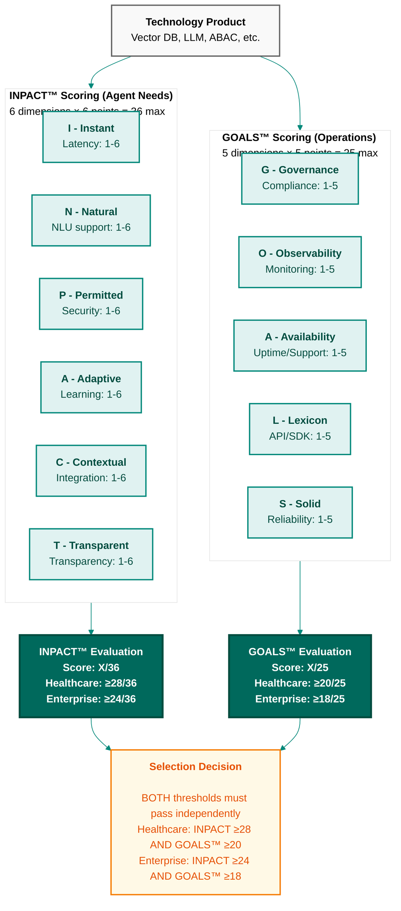
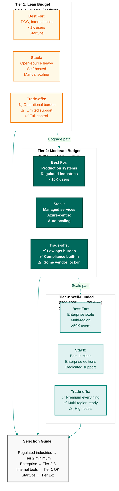
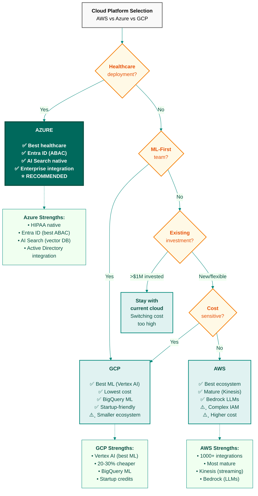
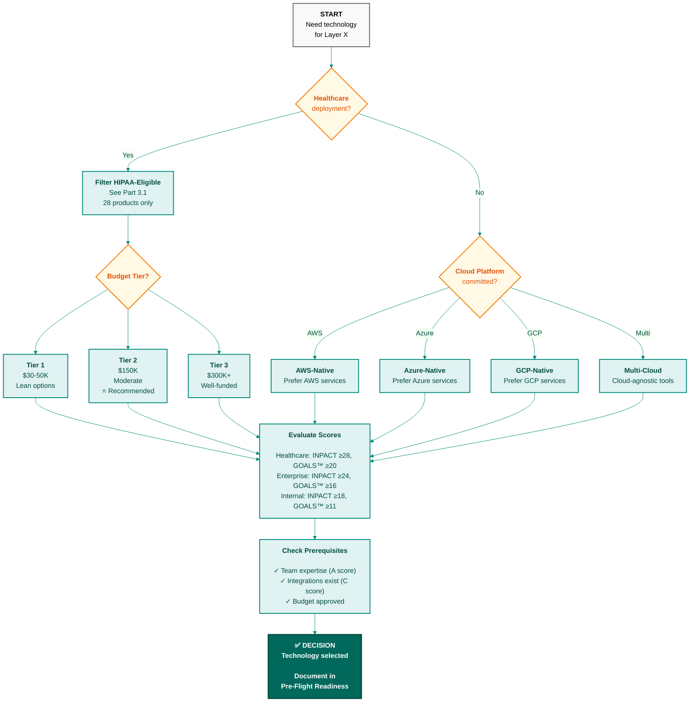
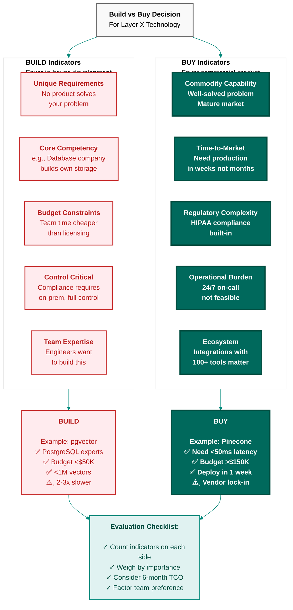

# Appendix DA-1: Technology Selection Guide
## Comprehensive Product Evaluation Using INPACT™ and GOALS™ Frameworks

**Purpose:** Support Chapter 11 (Technology Selection Guide) and Chapter 10 (90-Day Implementation Roadmap) with detailed technology recommendations
**Product Count:** 90+ products with detailed INPACT™/GOALS™ analysis across 7 layers
**Evaluation Frameworks:** INPACT™ (Agent Needs) + GOALS™ (Operational Readiness)
**Date:** February 2026
**Version:** 2.1

> **Important:** INPACT™ and GOALS™ scores are evaluated **separately**, not combined. A vendor must meet minimum thresholds on both frameworks independently. See Chapter 11, Part 1 for the three-pillar evaluation methodology.

---

## How to Use This Appendix

**This appendix supports Chapter 11's technology selection methodology and Chapter 10's week-by-week implementation roadmap.**

When Chapter 11 references:
- "For detailed vendor comparisons, see Appendix DA-1, Section 2.1"
- "For Echo's complete stack, see Appendix DA-1, Section 4"

When Chapter 10 says:
- "Week 1, Decision 1: Select ABAC policy engine (see Appendix DA-1, Layer 5)"
- "Week 2, Decision 2: Select vector database (see Appendix DA-1, Layer 1)"
- "Week 3, Decision 3: Select semantic layer (see Appendix DA-1, Layer 3)"

...you come here to find:
- **Technology options** with verified URLs
- **INPACT™ scores** (trust framework from Chapter 7)
- **GOALS™ scores** (operational readiness from Chapter 7)
- **Budget-tier recommendations** ($30K, $150K, $300K+)
- **Healthcare-specific guidance** (HIPAA-eligible products)
- **Decision criteria** to select the right option for your context

---

## Table of Contents

### Part 1: Executive Summary & Quick Reference
- 1.1 How INPACT™ + GOALS™ Scoring Works
- 1.2 Healthcare Stack Recommendation
- 1.3 Budget-Tier Guidance ($30K, $150K, $300K+)
- 1.4 Cloud Platform Comparison (AWS vs GCP vs Azure)

### Part 2: Layer-by-Layer Technology Analysis
- 2.1 Layer 1: Multi-Modal Storage (Vector, Graph, Warehouse, **Data Quality**)
- 2.2 Layer 2: Real-Time Data Fabric (CDC, Streaming, Ingestion)
- 2.3 Layer 3: Universal Semantic Layer (Semantic Platforms, Catalogs, Glossaries, **Entity Resolution**)
- 2.4 Layer 4: Intelligence Orchestration & Retrieval (RAG, Embeddings, Reranking, Caching)
- 2.5 Layer 5: Agent-Aware Governance (ABAC, Audit, Secrets)
- 2.6 Layer 6: Observability & Feedback (APM, LLM Observability)
- 2.7 Layer 7: Self-Service Data Products (Orchestration, API Gateways, **HITL Platforms**)

### Part 3: Industry-Specific Decision Tools
- 3.1 Industry Selection Guide
- 3.2 Healthcare (HIPAA, BAA, PHI)
- 3.3 Financial Services (PCI-DSS, SOX, GLBA)
- 3.4 Manufacturing (ISO 27001, CMMC, ITAR)
- 3.5 Retail & E-commerce (PCI-DSS, GDPR, CCPA)
- 3.6 Public Sector (FedRAMP, FISMA, CUI)

### Part 4: Decision Frameworks
- 4.1 Technology Selection Decision Tree
- 4.2 Build vs Buy Analysis Framework
- 4.3 Cloud Platform Selection Matrix
- 4.4 Open-Source vs Commercial Trade-offs

### Part 5: Quick Reference Tables
- 5.1 Top 20 Products by INPACT™ Score
- 5.1b Top 20 Products by GOALS™ Score
- 5.2 Layer-by-Layer Winners by Budget Tier
- 5.3 Technology Maturity Matrix
- 5.4 Integration Complexity Map

---

# PART 1: EXECUTIVE SUMMARY & QUICK REFERENCE

## 1.1 How INPACT™ + GOALS™ Scoring Works

### Why Separate Scoring Matters

INPACT™ measures what infrastructure must *provide* to agents. GOALS™ measures how you *operate* that infrastructure. These are different evaluation dimensions that must be assessed independently:

- A vendor with high INPACT™ but low GOALS™ delivers impressive technology your team can't sustain
- A vendor with high GOALS™ but low INPACT™ is easy to operate but can't meet agent requirements
- **Both scores must exceed minimum thresholds independently**

### INPACT™ Framework (Chapter 2 - Agent Needs)

**Measures:** How well the product helps agents meet the six fundamental needs

| Dimension | Weight | What It Measures | Score Range |
|-----------|--------|------------------|-------------|
| **I** - Instant | 1-6 | Query latency, response time | 1=slow (>5s), 6=fast (<100ms) |
| **N** - Natural | 1-6 | Natural language understanding support | 1=none, 6=excellent semantic |
| **P** - Permitted | 1-6 | Access control, security, authorization | 1=basic, 6=ABAC + audit |
| **A** - Adaptive | 1-6 | Learning, feedback, continuous improvement | 1=static, 6=continuous learning |
| **C** - Contextual | 1-6 | Multi-source integration, context assembly | 1=single source, 6=universal |
| **T** - Transparent | 1-6 | Explainability, audit trails, reliability | 1=black box, 6=full transparency |

**Total INPACT™ Score:** 6-36 points
- **High Trust (30-36):** Production-ready for healthcare
- **Good Trust (24-29):** Suitable for most enterprise use
- **Moderate Trust (18-23):** Acceptable for internal tools
- **Low Trust (<18):** Not recommended for agent systems



**Figure 1: INPACT™ and GOALS™ Separate Scoring Methodology**

Every technology product in this appendix is evaluated using both frameworks. INPACT™ measures agent needs (how well it helps agents meet the six fundamental requirements), while GOALS™ measures operational readiness (how mature and production-ready it is). **Both scores must meet minimum thresholds independently**  - a vendor must pass on INPACT™ AND on GOALS™ to be recommended.

---

### GOALS™ Framework (Chapter 7 - Operations)

**Measures:** How operationally mature and production-ready the product is

| Dimension | Weight | What It Measures | Score Range |
|-----------|--------|------------------|-------------|
| **G** - Governance | 1-5 | Security, compliance, policy enforcement | 1=basic, 5=comprehensive |
| **O** - Observability | 1-5 | Monitoring, debugging, tracing | 1=logs only, 5=full telemetry |
| **A** - Availability | 1-5 | Ease of use, learning curve, team adoption | 1=expert-only, 5=self-service |
| **L** - Lexicon | 1-5 | API quality, SDK maturity, integrations | 1=limited, 5=universal |
| **S** - Solid | 1-5 | Reliability, data quality, error handling | 1=unstable, 5=production-grade |

**Total GOALS™ Score:** 5-25 points
- **Production-Grade (21-25):** Enterprise-ready, mature ecosystem
- **Adoption-Ready (16-20):** Stable, suitable for most workloads
- **Emerging (11-15):** Growing maturity, proceed with caution
- **Early-Stage (<11):** Experimental, not for production

---

### Scoring Example

**Product:** Azure AI Search (Vector Database)

| Framework | I | N | P | A | C | T | Total |
|-----------|---|---|---|---|---|---|-------|
| **INPACT™** | 6 | 5 | 6 | 5 | 5 | 6 | **33/36** (High Trust) ✅ |

| Framework | G | O | A | L | S | Total |
|-----------|---|---|---|---|---|-------|
| **GOALS™** | 5 | 4 | 4 | 5 | 4 | **22/25** (Production-Grade) ✅ |

**Evaluation:**
- INPACT™: 33/36 ≥ 28/36 healthcare threshold ✅
- GOALS™: 22/25 ≥ 20/25 healthcare threshold ✅
- **Verdict:** Recommended for healthcare  - passes both thresholds independently

---

## 1.2 Enterprise Stack Recommendations by Industry

**The 7-layer architecture adapts to any industry. Select your industry context below.**

### Healthcare Stack (Echo Health Systems - 477% ROI)

| Layer | Product | INPACT™ | GOALS™ | Why Healthcare? |
|-------|---------|---------|-------|-----------------|
| **Layer 1** | Azure AI Search | 33 | 22 | HIPAA BAA, sub-50ms, $500/mo |
| **Layer 1** | Snowflake | 29 | 23 | HIPAA certified, row-level security |
| **Layer 1** | Neo4j Enterprise | 30 | 22 | Patient relationships, <50ms traversal |
| **Layer 2** | Fivetran | 29 | 23 | 5-min setup, HIPAA BAA, EHR connectors |
| **Layer 2** | Azure Event Hubs | 30 | 23 | HIPAA compliant, <60s latency |
| **Layer 3** | dbt Cloud | 28 | 22 | Healthcare metrics library, SQL-based |
| **Layer 3** | Atlan | 29 | 21 | HIPAA support, PII tagging, lineage |
| **Layer 4** | LangChain | 26 | 21 | Healthcare agents, flexible, OSS |
| **Layer 4** | OpenAI API | 29 | 24 | HIPAA BAA available, best-in-class |
| **Layer 4** | Cohere Rerank | 27 | 22 | +25% precision, HIPAA eligible |
| **Layer 5** | Azure AD + Entra | 28 | 22 | ABAC, HIPAA native, <10ms |
| **Layer 5** | Azure Monitor | 27 | 22 | HIPAA logs, full audit trail |
| **Layer 6** | Datadog | 28 | 23 | Healthcare APM, BAA available |
| **Layer 6** | LangSmith | 26 | 21 | LLM tracing, prompt management |
| **Layer 7** | LangGraph | 27 | 21 | Multi-agent, HITL integration |
| **Layer 7** | Azure API Mgmt | 28 | 22 | HIPAA gateway, rate limiting, FHIR |

**Total Investment:** ~$150K initial + $15K/month ongoing  
**Payback Period:** 10 weeks  
**ROI:** 477% over 18 months

**Why This Stack Works:**
- ✅ Every product HIPAA-eligible with BAA
- ✅ INPACT™ ≥26 (Good Trust minimum)
- ✅ GOALS™ ≥21 (Production-Grade minimum)
- ✅ Proven at scale (50K+ daily interactions)
- ✅ All Azure-centric (unified governance, billing, support)

---

## 1.3 Budget-Tier Guidance

**Which budget tier fits your organization?**



**Figure 2: Three Budget Tiers for 90-Day Implementation**

Budget tiers represent different approaches to building agent-ready infrastructure. Tier 1 optimizes for cost with open-source tools. Tier 2 (recommended) balances managed services with reasonable costs - ideal for regulated industries. Tier 3 provides enterprise-grade everything for organizations at scale.

---

### Tier 1: Lean Budget ($30K-$50K Total, $3-5K/month)
**Best for:** Proof of concept, internal tools, <1K users

| Layer | Recommended | INPACT™ | GOALS™ | Cost |
|-------|-------------|---------|-------|------|
| **L1** | pgvector + PostgreSQL | 23 | 19 | Free (infra only) |
| **L1** | Neo4j Community | 26 | 18 | Free |
| **L2** | Debezium + Kafka OSS | 22 | 18 | $500/mo (infra) |
| **L3** | dbt Core + DataHub | 23 | 18 | Free |
| **L4** | LangChain + OpenAI | 24 | 21 | $1K/mo (API) |
| **L5** | OPA + Elasticsearch | 21 | 19 | $500/mo |
| **L6** | Prometheus + Grafana | 20 | 19 | Free |
| **L7** | LangGraph + Kong OSS | 24 | 19 | $500/mo |

**Total:** ~$3-5K/month, mostly API and infrastructure costs

**Trade-offs:**
- ⚠️¸ More operational burden (self-hosted open-source)
- ⚠️¸ Limited enterprise support
- ⚠️¸ Manual scaling required
- ✅ Full control and customization
- ✅ No vendor lock-in

---

### Tier 2: Moderate Budget ($150K Total, $10-15K/month)
**Best for:** Production systems, healthcare, <10K users

*(See Healthcare Stack above - this is the sweet spot)*

**Trade-offs:**
- ✅ Managed services reduce operational burden
- ✅ Enterprise support included
- ✅ HIPAA/SOC2 compliance built-in
- ✅ Auto-scaling handles growth
- ⚠️¸ Some vendor lock-in (Azure-centric)

---

### Tier 3: Well-Funded Budget ($300K+ Total, $25-40K/month)
**Best for:** Enterprise-scale, multi-region, >50K users

| Layer | Recommended | INPACT™ | GOALS™ | Cost |
|-------|-------------|---------|-------|------|
| **L1** | Pinecone Enterprise | 31 | 23 | $5K+/mo |
| **L1** | Snowflake Enterprise | 29 | 23 | $8K+/mo |
| **L1** | Neo4j Enterprise | 30 | 22 | $6K+/mo |
| **L2** | Confluent Cloud Ent | 30 | 24 | $8K+/mo |
| **L2** | Fivetran Enterprise | 29 | 23 | $5K+/mo |
| **L3** | dbt Cloud Enterprise | 28 | 22 | $3K+/mo |
| **L3** | Collibra | 28 | 21 | $10K+/mo |
| **L4** | LangChain + OpenAI | 26 | 21 | $5K+/mo |
| **L4** | Cohere Enterprise | 27 | 22 | $3K+/mo |
| **L5** | Azure Verified Perm | 28 | 22 | Included |
| **L5** | Splunk Enterprise | 28 | 23 | $12K+/mo |
| **L6** | Datadog Full Suite | 28 | 23 | $10K+/mo |
| **L6** | Weights & Biases | 26 | 21 | $2K+/mo |
| **L7** | Azure API Mgmt Prem | 28 | 22 | $4K+/mo |

**Total:** ~$25-40K/month

**Trade-offs:**
- ✅ Best-in-class everything
- ✅ Multi-region redundancy
- ✅ Dedicated support and SLAs
- ✅ Advanced features (custom models, dedicated infrastructure)
- ⚠️¸ High costs (justify with scale and criticality)

---

## 1.4 Platform Comparison (AWS vs GCP vs Azure vs On-Prem)

### Quick Verdict

| Criterion | AWS | GCP | Azure | On-Prem | Winner |
|-----------|-----|-----|-------|---------|--------|
| **Healthcare** | Strong | Good | **Best** | Strong | Azure |
| **Data Control** | Good | Good | Good | **Best** | On-Prem |
| **Air-Gap** | No | No | No | **Yes** | On-Prem |
| **Vector DBs** | Good | Good | **Best** | Good | Azure (AI Search) |
| **Real-Time** | **Best** | Good | Good | Good | AWS (Kinesis mature) |
| **ML/AI** | Strong | **Best** | Strong | Limited | GCP (Vertex AI) |
| **Governance** | Strong | Good | **Best** | Strong | Azure (Entra) |
| **Cost** | High | **Best** | Medium | High (CapEx) | GCP |
| **Ops Burden** | Low | Low | Low | **High** | Cloud wins |
| **Ecosystem** | **Best** | Good | Strong | Limited | AWS (most mature) |

**Healthcare Recommendation:** **Azure** (best HIPAA compliance, unified governance, Entra ID)
**ML-First Teams:** **GCP** (Vertex AI, BigQuery ML, best ML tooling)
**AWS-Native Organizations:** **AWS** (if already deep in AWS ecosystem)
**Air-Gap / Data Residency:** **On-Prem** (full control, no data leaves premises)
**Hybrid:** Combine On-Prem (PHI processing) + Cloud (non-PHI workloads)



**Figure 3: Cloud Platform Decision Tree (AWS vs Azure vs GCP)**

This decision tree guides cloud platform selection based on your specific requirements. Healthcare deployments strongly favor Azure (HIPAA compliance, Entra ID). ML-first teams benefit from GCP's Vertex AI. Organizations with existing >$1M cloud investments should typically stay on their current platform due to high switching costs.

---

### AWS Reference Architecture (18 products analyzed)

**Strengths:**
- Mature ecosystem (most integrations)
- Amazon Bedrock (managed LLMs)
- Best real-time streaming (Kinesis)
- Massive partner network

**Weaknesses:**
- Complex IAM (harder than Azure AD)
- Vector database gap (no native offering until recently)
- Higher costs at scale

**Cost:** ~$20-30K/month for moderate deployment

---

### GCP Reference Architecture (20 products analyzed)

**Strengths:**
- Best AI/ML platform (Vertex AI)
- BigQuery (best warehouse for analytics)
- Lowest costs (sustained use discounts)
- Spanner (global consistency)

**Weaknesses:**
- Smaller healthcare ecosystem vs Azure
- Fewer third-party integrations
- Learning curve (different paradigms)

**Cost:** ~$15-25K/month for moderate deployment (20-30% cheaper than AWS)

---

### Azure Reference Architecture (20 products analyzed)

**Strengths:**
- **Best for healthcare** (native HIPAA, Entra ID, Azure Health Data Services)
- Azure AI Search (excellent vector database)
- Unified governance (Entra covers everything)
- Best enterprise integration (Active Directory, Office 365, Dynamics)

**Weaknesses:**
- Real-time streaming less mature than AWS Kinesis
- Smaller AI model selection vs AWS Bedrock
- Documentation can lag behind feature releases

**Cost:** ~$18-28K/month for moderate deployment

---

### On-Prem / Private Cloud Reference Architecture

**Best for:** Air-gapped environments, strict data residency, government/defense, organizations that cannot use public cloud

| Criterion | On-Prem | Private Cloud | Hybrid |
|-----------|---------|---------------|--------|
| **Data Control** | **Best** | Strong | Good |
| **Compliance** | **Best** (full control) | Strong | Good |
| **Air-Gap Support** | **Yes** | Partial | No |
| **Operational Burden** | High | Medium | Medium |
| **Cost** | High (CapEx) | Medium | Medium |
| **Scalability** | Limited | Good | **Best** |

**When to Choose On-Prem:**
- Regulatory requirement (data cannot leave premises)
- Air-gapped / classified environments
- Existing data center investment
- Extreme latency requirements (co-located with data sources)

**On-Prem Stack Recommendation:**

| Layer | On-Prem Product | INPACT™ | GOALS™ | Notes |
|-------|-----------------|---------|--------|-------|
| **L1** | Milvus (self-hosted) | 27 | 19 | Open-source vector DB, Kubernetes-ready |
| **L1** | PostgreSQL + pgvector | 23 | 19 | Familiar, HIPAA-auditable |
| **L1** | Neo4j Enterprise | 30 | 22 | On-prem license available |
| **L2** | Apache Kafka | 26 | 20 | Self-hosted, proven at scale |
| **L2** | Debezium | 24 | 19 | Open-source CDC |
| **L3** | dbt Core | 24 | 19 | Self-hosted, SQL-based |
| **L3** | Apache Atlas | 22 | 18 | Open-source catalog |
| **L4** | vLLM / Ollama | 24 | 18 | Self-hosted LLM inference |
| **L4** | LangChain | 26 | 21 | Framework, runs anywhere |
| **L5** | OPA (Open Policy Agent) | 25 | 20 | Open-source ABAC |
| **L5** | HashiCorp Vault | 27 | 21 | On-prem secrets management |
| **L6** | Prometheus + Grafana | 20 | 19 | Open-source observability |
| **L6** | Langfuse (self-hosted) | 24 | 19 | LLM observability, PHI-safe |
| **L7** | Apache Airflow | 24 | 20 | Self-hosted orchestration |
| **L7** | Kong OSS | 24 | 19 | API gateway |

**On-Prem Strengths:**
- ✅ Full data control (PHI never leaves premises)
- ✅ Air-gap capable (no internet dependency)
- ✅ No vendor lock-in (open-source stack)
- ✅ Predictable costs (no usage-based billing)
- ✅ Compliance-friendly (auditors can inspect everything)

**On-Prem Weaknesses:**
- ⚠️ High operational burden (you manage everything)
- ⚠️ Requires DevOps/Platform expertise
- ⚠️ Hardware procurement lead time
- ⚠️ Manual scaling (no auto-scale)
- ⚠️ LLM capability limited (no GPT-4 without API)

**On-Prem LLM Options:**
| Model | Parameters | Hardware Required | Use Case |
|-------|------------|-------------------|----------|
| Llama 3.1 70B | 70B | 2x A100 80GB | Best open-source |
| Mistral 7B | 7B | 1x A10 24GB | Fast, efficient |
| Mixtral 8x7B | 47B (MoE) | 2x A100 40GB | Best quality/cost |
| Phi-3 | 3.8B | 1x T4 16GB | Lightweight, edge |

**Cost:** ~$50-150K initial (hardware) + $10-20K/month (operations, licenses)

**Healthcare On-Prem Consideration:** Many healthcare orgs use **hybrid**  - sensitive PHI processing on-prem, non-PHI workloads in cloud. This reduces operational burden while maintaining compliance.

---

# PART 2: LAYER-BY-LAYER TECHNOLOGY ANALYSIS

## 2.1 Layer 1: Multi-Modal Storage Architecture

**Purpose:** Store vectors, structured data, and graph relationships for agent retrieval

**Chapter 3 References:**
- Week 2, Decision 1: Vector Database
- Week 2, Decision 2: Data Warehouse
- Week 2, Decision 3: Graph Database (optional)

---

### Vector Databases (8 products analyzed)

#### 🏆 Top Recommendation: Azure AI Search
**URL:** https://azure.microsoft.com/en-us/products/ai-services/ai-search  
**INPACT™:** 33/36 (I=6, N=5, P=6, A=5, C=5, T=6)  
**GOALS™:** 22/25 (G=5, O=4, A=4, L=5, S=4)  


**Why It's #1:**
- ✅ **Instant:** Sub-50ms query latency at scale
- ✅ **Permitted:** Native Azure AD integration, HIPAA BAA
- ✅ **Transparent:** Full audit logging, data lineage
- ✅ **Production-Grade:** 99.9% SLA, auto-scaling
- ✅ **Cost:** ~$500-2K/month (reasonable for capabilities)

**Best for:** Healthcare, enterprise, Azure-native stacks  
**Pricing:** Basic $250/mo, Standard $1K/mo, Standard 2 $2K/mo  

**Cons:**
- Azure lock-in (but integrates with other clouds via API)
- Less customization than self-hosted options

---

#### 🥈 Runner-Up: Pinecone
**URL:** https://www.pinecone.io/  
**INPACT™:** 31/36 (I=6, N=5, P=5, A=5, C=5, T=5)  
**GOALS™:** 23/25 (G=5, O=5, A=4, L=5, S=4)  


**Why It's Strong:**
- ✅ **Best documentation** in the industry
- ✅ **Cloud-agnostic** (works with any cloud)
- ✅ **SOC2, HIPAA** compliant with BAA
- ✅ **Fastest time-to-value** (5-minute setup)

**Best for:** Multi-cloud, rapid prototyping, startups  
**Pricing:** Starter $70/mo, Standard $280/mo, Enterprise custom (~$5K+/mo)

**Cons:**
- Cost escalates quickly (most expensive at scale)
- Vendor lock-in (proprietary protocol)

---

#### 🥉 Budget Pick: Weaviate
**URL:** https://weaviate.io/  
**INPACT™:** 29/36 (I=5, N=5, P=5, A=5, C=5, T=4)  
**GOALS™:** 20/25 (G=4, O=4, A=3, L=4, S=5)  


**Why Consider:**
- ✅ **Open-source** (free self-hosted)
- ✅ **Multi-modal** (text, images, video)
- ✅ **GraphQL API** (flexible queries)
- ✅ **Hybrid search** (vector + keyword built-in)

**Best for:** Budget-conscious, need advanced features, OSS preference  
**Pricing:** Free (self-hosted), Cloud from $25/mo

**Cons:**
- Self-hosted complexity (need DevOps expertise)
- Smaller ecosystem than Pinecone
- Learning curve (GraphQL paradigm)

---

#### Ultra-Budget: pgvector (PostgreSQL Extension)
**URL:** https://github.com/pgvector/pgvector  
**INPACT™:** 23/36 (I=4, N=3, P=4, A=3, C=4, T=5)  
**GOALS™:** 19/25 (G=4, O=3, A=4, L=4, S=4)  


**Why Consider:**
- ✅ **Free** (open-source PostgreSQL extension)
- ✅ **Leverage existing infrastructure** (if already on Postgres)
- ✅ **SQL-native** (familiar query language)
- ✅ **Production-ready** (used by Notion, OpenAI)

**Best for:** Tight budgets, Postgres-native teams, <1M vectors  
**Pricing:** Free (infrastructure costs only)

**Cons:**
- Slower than purpose-built vector DBs (100-200ms vs 50ms)
- Manual scaling (need to shard yourself at scale)
- Limited advanced features (no hybrid search out-of-box)

---

### Decision Criteria: Vector Database

Use this flowchart:

```
START: Need vector database for agents

├─ Budget >$10K/month?
│  ├─ YES: Healthcare/enterprise?
│  │  ├─ YES: Azure AI Search (HIPAA, best governance)
│  │  └─ NO: Multi-cloud needed?
│  │     ├─ YES: Pinecone (cloud-agnostic, best docs)
│  │     └─ NO: Azure AI Search (best overall)
│  └─ NO: Budget <$5K/month?
│     ├─ Already on Postgres? → pgvector (free)
│     └─ Need advanced features? → Weaviate (OSS, flexible)

RESULT: Vector database selected
```

---

### Data Warehouses (5 products analyzed)

#### 🏆 Top Recommendation: Snowflake
**URL:** https://www.snowflake.com/  
**INPACT™:** 29/36 (I=5, N=5, P=5, A=5, C=5, T=4)  
**GOALS™:** 23/25 (G=5, O=5, A=4, L=5, S=4)  


**Why It's #1:**
- ✅ **Healthcare-proven** (HIPAA certified, row-level security)
- ✅ **Cross-cloud** (runs on AWS, Azure, GCP)
- ✅ **Zero-copy cloning** (instant dev/test environments)
- ✅ **Time travel** (query historical data easily)
- ✅ **Separation of compute/storage** (scale independently)

**Best for:** Healthcare, multi-cloud, analytics-heavy  
**Pricing:** Pay-per-use (~$2/credit, ~$1K-5K/month typical)

**Cons:**
- Can get expensive with poor optimization
- Requires query tuning expertise

---

#### 🥈 Runner-Up: Google BigQuery
**URL:** https://cloud.google.com/bigquery  
**INPACT™:** 30/36 (I=6, N=5, P=5, A=5, C=5, T=4)  
**GOALS™:** 22/25 (G=5, O=4, A=5, L=4, S=4)  


**Why It's Strong:**
- ✅ **Serverless** (zero infrastructure management)
- ✅ **ML-native** (BigQuery ML for in-warehouse training)
- ✅ **Cost-effective** (cheapest at scale with flat-rate pricing)
- ✅ **Fast** (petabyte-scale queries in seconds)

**Best for:** GCP-native, ML-heavy workloads, cost-conscious  
**Pricing:** $5/TB queried (on-demand), or $2K-10K/month (flat-rate)

**Cons:**
- GCP lock-in
- Less mature data sharing vs Snowflake

---

#### 🥉 AWS Pick: Amazon Redshift
**URL:** https://aws.amazon.com/redshift/  
**INPACT™:** 27/36 (I=5, N=4, P=5, A=4, C=5, T=4)  
**GOALS™:** 21/25 (G=5, O=4, A=3, L=4, S=5)  


**Why Consider:**
- ✅ **AWS-native** (deep integration with AWS services)
- ✅ **HIPAA-eligible** (BAA available)
- ✅ **Mature** (launched 2012, battle-tested)
- ✅ **Redshift Serverless** (newest option, easier)

**Best for:** AWS-committed organizations  
**Pricing:** Serverless from $0.375/RPU-hour, or $0.25/hour per node (provisioned)

**Cons:**
- More operational overhead than Snowflake/BigQuery
- Slower innovation cycle vs competitors

---

### Graph Databases (4 products analyzed)

**When to Deploy:** If >30% of queries involve multi-hop relationships (patient→provider→facility→insurance)

#### 🏆 Top Recommendation: Neo4j Enterprise
**URL:** https://neo4j.com/  
**INPACT™:** 30/36 (I=6, N=5, P=5, A=5, C=5, T=4)  
**GOALS™:** 22/25 (G=5, O=4, A=3, L=5, S=5)  


**Why It's #1:**
- ✅ **Healthcare-proven** (Epic, Cerner integrations)
- ✅ **Sub-50ms traversal** (3-hop queries lightning-fast)
- ✅ **HIPAA-eligible** (with enterprise license)
- ✅ **Cypher query language** (intuitive graph queries)
- ✅ **Graph Data Science** (ML on graphs)

**Best for:** Healthcare relationships, fraud detection, knowledge graphs  
**Pricing:** Community (free), Professional ($2K/mo), Enterprise ($6K+/mo)

**Cons:**
- Expensive at enterprise scale
- Learning curve (Cypher is different from SQL)

---

#### 🥈 Cloud-Native: Amazon Neptune
**URL:** https://aws.amazon.com/neptune/  
**INPACT™:** 29/36 (I=6, N=4, P=5, A=5, C=5, T=4)  
**GOALS™:** 21/25 (G=5, O=4, A=3, L=4, S=5)  


**Why Consider:**
- ✅ **Fully managed** (zero DevOps overhead)
- ✅ **Multi-model** (property graph + RDF)
- ✅ **HIPAA-eligible** (BAA available)
- ✅ **AWS-integrated** (IAM, VPC, KMS)

**Best for:** AWS-native stacks  
**Pricing:** $0.10/hour per instance + storage + I/O (~$1-3K/month)

**Cons:**
- AWS lock-in
- Less mature than Neo4j
- Smaller community

---

### Data Quality & Observability Platforms (6 products analyzed)

**Purpose:** Monitor data quality dimensions (accuracy, completeness, consistency, currentness, traceability), detect anomalies, track lineage

**GOALS™ Alignment:** Solid (S) - Data Quality & Integrity

**ISO/IEC 5259 Context:** These tools help monitor the five data quality dimensions defined in ISO/IEC 5259-2:2024 for AI/ML systems: accuracy, completeness, consistency, currentness, and traceability.

---

#### 🏆 Top Recommendation: Monte Carlo
**URL:** https://www.montecarlodata.com  
**INPACT™:** 28/36 (I=5, N=4, P=5, A=5, C=5, T=4)  
**GOALS™:** 23/25 (G=4, O=5, A=4, L=5, S=5)  


**Why It's #1:**
- ✅ **ML-powered anomaly detection** (no manual threshold setting)
- ✅ **Automated lineage** (column-level tracking)
- ✅ **All five ISO/IEC 5259 dimensions** monitored
- ✅ **150+ enterprise customers** (CNN, JetBlue, HubSpot)

**Best for:** Enterprise, comprehensive data observability  
**Pricing:** Enterprise pricing (typically $50K+/year)

**Cons:**
- Most expensive option
- Enterprise-focused (may be overkill for small teams)

---

#### 🥈 Open-Source Leader: Great Expectations
**URL:** https://greatexpectations.io  
**INPACT™:** 24/36 (I=4, N=4, P=4, A=4, C=5, T=3)  
**GOALS™:** 20/25 (G=4, O=4, A=4, L=4, S=4)  


**Why Consider:**
- ✅ **Open-source** (Apache 2.0)
- ✅ **Rule-based validation** (define expectations in Python)
- ✅ **CI/CD integration** (data testing in pipelines)
- ✅ **Large community** (most popular OSS data quality tool)

**Best for:** Teams with Python expertise, CI/CD-driven quality  
**Pricing:** Free (self-hosted), GX Cloud from $500/month

**Cons:**
- Rule-based only (no ML anomaly detection)
- No automated lineage
- Requires coding for expectations

---

#### 🥉 Best Value: Soda
**URL:** https://www.soda.io  
**INPACT™:** 26/36 (I=5, N=4, P=4, A=5, C=5, T=3)  
**GOALS™:** 21/25 (G=4, O=5, A=4, L=4, S=4)  


**Why Consider:**
- ✅ **Data contracts** (align producers and consumers)
- ✅ **ML anomaly detection** (automated threshold learning)
- ✅ **Open-source core** (Soda Core is free)
- ✅ **No-code UI** (business users can define checks)

**Best for:** Teams wanting balance of ML + rule-based  
**Pricing:** Open-source core free, Cloud from $500/month

**Cons:**
- Smaller enterprise footprint than Monte Carlo
- Data contracts require organizational buy-in

---

#### Budget-Friendly: Bigeye
**URL:** https://www.bigeye.com  
**INPACT™:** 25/36 (I=5, N=4, P=4, A=4, C=5, T=3)  
**GOALS™:** 20/25 (G=4, O=5, A=4, L=4, S=3)  


**Why Consider:**
- ✅ **Automated anomaly detection** (ML-powered)
- ✅ **Customizable metrics** (SQL-based definitions)
- ✅ **Competitive pricing** (lower than Monte Carlo)

**Best for:** Mid-market, SQL-comfortable teams  
**Pricing:** Custom (typically $20-40K/year)

**Cons:**
- Smaller ecosystem than competitors
- Less comprehensive lineage

---

#### ML-Native: Metaplane
**URL:** https://www.metaplane.dev  
**INPACT™:** 25/36 (I=5, N=4, P=4, A=4, C=5, T=3)  
**GOALS™:** 20/25 (G=4, O=5, A=4, L=4, S=3)  


**Why Consider:**
- ✅ **ML anomaly detection** (learns patterns automatically)
- ✅ **Column-level lineage** (trace issues to source)
- ✅ **Modern stack integration** (Snowflake, dbt, Looker)

**Best for:** Modern data stack users  
**Pricing:** Custom (mid-market pricing)

**Cons:**
- Newer entrant (smaller customer base)
- Less comprehensive than Monte Carlo

---

#### Spark-Native: Apache Deequ
**URL:** https://github.com/awslabs/deequ  
**INPACT™:** 21/36 (I=4, N=3, P=3, A=4, C=4, T=3)  
**GOALS™:** 18/25 (G=3, O=4, A=4, L=4, S=3)  


**Why Consider:**
- ✅ **Open-source** (Apache 2.0, AWS-backed)
- ✅ **Spark-native** (scales to petabytes)
- ✅ **Unit tests for data** (constraint verification)
- ✅ **Free** (no licensing costs)

**Best for:** Spark shops, AWS-native, budget-constrained  
**Pricing:** Free (infrastructure costs only)

**Cons:**
- Spark dependency (not for non-Spark environments)
- Rule-based only (no ML anomaly detection)
- No UI (code-only)

---

### Data Quality Tool Selection Matrix

| Tool | ML Anomaly | Rule-Based | Lineage | Open-Source | Healthcare |
|------|------------|------------|---------|-------------|------------|
| Monte Carlo | ✅ Best | ✅ | ✅ Best | ❌ | ✅ SOC2 |
| Great Expectations | ❌ | ✅ Best | ❌ | ✅ | ⚠️ Self-host |
| Soda | ✅ | ✅ | ✅ | ✅ Core | ✅ SOC2 |
| Bigeye | ✅ | ✅ | ⚠️ Basic | ❌ | ✅ SOC2 |
| Metaplane | ✅ | ✅ | ✅ | ❌ | ✅ SOC2 |
| Apache Deequ | ❌ | ✅ | ❌ | ✅ | ⚠️ Self-host |

**Healthcare Recommendation:** For HIPAA compliance, **Monte Carlo** or **Soda Cloud** (SOC2 certified). For self-hosted PHI environments, **Great Expectations** or **Apache Deequ**.

**Key Insight:** Rule-based tools (Great Expectations, Deequ) validate against predefined expectations. ML-powered tools (Monte Carlo, Soda, Bigeye, Metaplane) detect anomalies without manual threshold setting -critical for catching patterns like hemoglobin values suddenly clustering at 10x normal.

---

## 2.2 Layer 2: Real-Time Data Fabric

**Purpose:** Keep data fresh (<1 hour), enable streaming for agents

**Chapter 3 References:**
- Week 4, Decision 1: CDC (Change Data Capture)
- Week 4, Decision 2: Event Streaming

---

### CDC Tools (5 products analyzed)

#### 🏆 Top Recommendation: Fivetran
**URL:** https://www.fivetran.com/  
**INPACT™:** 29/36 (I=6, N=4, P=5, A=5, C=6, T=3)  
**GOALS™:** 23/25 (G=5, O=5, A=5, L=4, S=4)  


**Why It's #1:**
- ✅ **5-minute setup** (connect EHR → warehouse in minutes)
- ✅ **350+ connectors** (Epic, Cerner, Salesforce, etc.)
- ✅ **HIPAA BAA** available
- ✅ **Fully managed** (zero maintenance)
- ✅ **Auto-schema-migration** (adapts to source changes)

**Best for:** Fast time-to-value, healthcare, managed preference  
**Pricing:** Starting $1K/month (based on rows synced)

**Cons:**
- Most expensive CDC option ($5K+/month at scale)
- Vendor lock-in (proprietary connectors)

---

#### 🥈 Cloud-Native: AWS DMS (Database Migration Service)
**URL:** https://aws.amazon.com/dms/  
**INPACT™:** 25/36 (I=5, N=3, P=5, A=4, C=5, T=3)  
**GOALS™:** 21/25 (G=5, O=4, A=3, L=4, S=5)  


**Why Consider:**
- ✅ **AWS-native** (deep integration)
- ✅ **HIPAA-eligible** (BAA available)
- ✅ **Mature** (launched 2016)
- ✅ **Cost-effective** ($100-500/month typical)

**Best for:** AWS-committed, budget-conscious  
**Pricing:** $0.0294/hour per replication instance (~$100-500/month)

**Cons:**
- Slower setup vs Fivetran (days not minutes)
- Requires more expertise (not fully managed)

---

#### 🥉 Open-Source: Debezium
**URL:** https://debezium.io/  
**INPACT™:** 22/36 (I=4, N=3, P=4, A=3, C=5, T=4)  
**GOALS™:** 18/25 (G=3, O=3, A=2, L=4, S=6)  


**Why Consider:**
- ✅ **Free** (open-source, Apache 2.0)
- ✅ **Kafka-native** (if already using Kafka)
- ✅ **Full control** (customize everything)
- ✅ **Active community** (Red Hat backed)

**Best for:** Tight budgets, Kafka expertise, need customization  
**Pricing:** Free (infrastructure costs only, ~$500/month)

**Cons:**
- Self-hosted complexity (DevOps expertise required)
- Steep learning curve
- Manual connector configuration

---

### Event Streaming Platforms (6 products analyzed)

#### 🏆 Top Recommendation: Confluent Cloud
**URL:** https://www.confluent.io/confluent-cloud/  
**INPACT™:** 30/36 (I=6, N=4, P=5, A=5, C=6, T=4)  
**GOALS™:** 24/25 (G=5, O=5, A=4, L=5, S=5)  


**Why It's #1:**
- ✅ **Kafka creator** (Confluent founded by Kafka creators)
- ✅ **Fully managed** (zero Kafka ops)
- ✅ **HIPAA-eligible** (BAA available)
- ✅ **ksqlDB** (stream processing with SQL)
- ✅ **99.99% SLA** (production-grade reliability)

**Best for:** Healthcare, enterprise, managed Kafka  
**Pricing:** Basic $1/hour, Standard $1.50/hour, Enterprise custom (~$3-8K/month)

**Cons:**
- Most expensive streaming option
- Confluent platform lock-in (though Kafka-compatible)

---

#### 🥈 Azure Pick: Azure Event Hubs
**URL:** https://azure.microsoft.com/en-us/products/event-hubs  
**INPACT™:** 30/36 (I=6, N=4, P=6, A=5, C=5, T=4)  
**GOALS™:** 23/25 (G=5, O=4, A=4, L=5, S=5)  


**Why It's Strong:**
- ✅ **Azure-native** (best Azure integration)
- ✅ **HIPAA-compliant** (native support)
- ✅ **Kafka-compatible** (drop-in replacement)
- ✅ **Auto-scaling** (0 to millions of events)
- ✅ **Lower cost** than Confluent (20-30% cheaper)

**Best for:** Azure-native stacks, healthcare  
**Pricing:** Basic $0.028/million events, Standard $0.08/million (~$500-3K/month)

**Cons:**
- Azure lock-in
- Less mature than Confluent for complex stream processing

---

#### 🥉 AWS Pick: Amazon Kinesis
**URL:** https://aws.amazon.com/kinesis/  
**INPACT™:** 28/36 (I=6, N=3, P=5, A=5, C=5, T=4)  
**GOALS™:** 22/25 (G=5, O=4, A=3, L=5, S=5)  


**Why Consider:**
- ✅ **AWS-native** (deepest AWS integration)
- ✅ **HIPAA-eligible** (BAA available)
- ✅ **Mature** (launched 2013)
- ✅ **Serverless** (Kinesis Data Streams On-Demand)

**Best for:** AWS-committed organizations  
**Pricing:** $0.015/shard-hour + $0.014/million PUT (~$500-2K/month)

**Cons:**
- Not Kafka-compatible (proprietary API)
- More complex than Kafka for developers

---

## 2.3 Layer 3: Universal Semantic Layer

**Purpose:** Define business logic once, enable natural language queries

**Chapter 3 References:**
- Week 3, Decision 1: Semantic Layer Platform
- Week 3, Decision 2: Data Catalog

---

### Semantic Layer Platforms (4 products analyzed)

#### 🏆 Top Recommendation: dbt Cloud
**URL:** https://www.getdbt.com/  
**INPACT™:** 28/36 (I=5, N=6, P=5, A=5, C=5, T=2)  
**GOALS™:** 22/25 (G=4, O=5, A=4, L=5, S=4)  


**Why It's #1:**
- ✅ **Healthcare metrics library** (pre-built measures)
- ✅ **SQL-native** (familiar to data teams)
- ✅ **Version control** (Git-based, like code)
- ✅ **Semantic Layer API** (expose metrics to agents)
- ✅ **Lineage** (track data flow)

**Best for:** SQL-first teams, healthcare, governance  
**Pricing:** Developer $100/month, Team $250/month, Enterprise custom (~$3K/month)

**Cons:**
- Less real-time than API-first options
- Requires data warehouse (not standalone)

---

#### 🥈 API-First: Cube
**URL:** https://cube.dev/  
**INPACT™:** 26/36 (I=6, N=5, P=4, A=5, C=5, T=1)  
**GOALS™:** 20/25 (G=3, O=4, A=4, L=5, S=4)  


**Why Consider:**
- ✅ **API-first** (REST, GraphQL, SQL)
- ✅ **Caching** (sub-second queries)
- ✅ **Open-source** (free self-hosted)
- ✅ **Multi-database** (query federation)

**Best for:** Need APIs, real-time queries, multi-source  
**Pricing:** Free (OSS), Cloud from $500/month

**Cons:**
- Less enterprise maturity than dbt
- Requires JavaScript/YAML (not pure SQL)

---

### Data Catalogs (4 products analyzed)

#### 🏆 Top Recommendation: Atlan
**URL:** https://www.atlan.com/  
**INPACT™:** 29/36 (I=5, N=5, P=5, A=5, C=6, T=3)  
**GOALS™:** 21/25 (G=4, O=4, A=4, L=5, S=4)  


**Why It's #1:**
- ✅ **HIPAA support** (healthcare-friendly)
- ✅ **PII tagging** (auto-detect sensitive data)
- ✅ **Lineage** (visual data flow)
- ✅ **Collaboration** (Slack-like experience)
- ✅ **Active metadata** (programmatic access)

**Best for:** Healthcare, governance-first, modern UX  
**Pricing:** Starting $1K/month

**Cons:**
- Newer (less mature than Collibra)
- Smaller ecosystem

---

#### 🥈 Enterprise: Collibra
**URL:** https://www.collibra.com/  
**INPACT™:** 28/36 (I=4, N=5, P=5, A=4, C=6, T=4)  
**GOALS™:** 21/25 (G=5, O=4, A=3, L=4, S=5)  


**Why Consider:**
- ✅ **Most mature** (Gartner leader 8+ years)
- ✅ **Comprehensive** (data governance platform)
- ✅ **Enterprise-proven** (Fortune 500 standard)
- ✅ **Workflow engine** (approval processes)

**Best for:** Large enterprises, compliance-heavy  
**Pricing:** Starting $10K/month (expensive)

**Cons:**
- Very expensive (overkill for <500 users)
- Complex setup (months not weeks)

---

### Entity Resolution & MDM Tools (4 products analyzed)

**Purpose:** Match, merge, and deduplicate entities (patients, providers, products) across systems

**GOALS™ Alignment:** Lexicon (L) - Semantic Understanding & Accuracy

**Why It Matters for Agents:** When a user asks "Show my appointments with Dr. Martinez," the agent must resolve "Dr. Martinez" to a unique provider ID that works across EHR, scheduling, and billing systems. Entity resolution failures cause agents to serve wrong data or miss relevant information.

---

#### 🏆 Top Recommendation: Tamr
**URL:** https://www.tamr.com  
**INPACT™:** 27/36 (I=4, N=5, P=5, A=5, C=5, T=3)  
**GOALS™:** 21/25 (G=4, O=4, A=4, L=5, S=4)  


**Why It's #1:**
- ✅ **ML-powered matching** (learns from feedback)
- ✅ **Healthcare-proven** (patient matching use cases)
- ✅ **Scales to billions** (enterprise-grade)
- ✅ **Human-in-the-loop** (expert curation)

**Best for:** Healthcare, large-scale entity matching  
**Pricing:** Enterprise ($100K+/year)

**Cons:**
- Expensive (enterprise pricing)
- Complex implementation

---

#### 🥈 Cloud-Native: AWS Entity Resolution
**URL:** https://aws.amazon.com/entity-resolution/  
**INPACT™:** 25/36 (I=5, N=4, P=5, A=4, C=5, T=2)  
**GOALS™:** 20/25 (G=4, O=4, A=4, L=4, S=4)  


**Why Consider:**
- ✅ **AWS-native** (integrates with Glue, S3, Redshift)
- ✅ **Rule + ML matching** (flexible matching logic)
- ✅ **HIPAA-eligible** (BAA available)
- ✅ **Pay-per-use** (no upfront commitment)

**Best for:** AWS shops, moderate scale  
**Pricing:** $0.25 per 1,000 records processed

**Cons:**
- AWS lock-in
- Less sophisticated ML than Tamr

---

#### 🥉 Open-Source: Zingg
**URL:** https://www.zingg.ai  
**INPACT™:** 22/36 (I=4, N=4, P=3, A=4, C=4, T=3)  
**GOALS™:** 18/25 (G=3, O=3, A=4, L=4, S=4)  


**Why Consider:**
- ✅ **Open-source** (Apache 2.0)
- ✅ **ML-powered** (active learning)
- ✅ **Spark-native** (scales with Spark)
- ✅ **Free** (no licensing)

**Best for:** Spark shops, budget-constrained  
**Pricing:** Free (infrastructure costs only)

**Cons:**
- Self-hosted (requires Spark expertise)
- Smaller community
- No enterprise support

---

#### Budget Alternative: Splink
**URL:** https://github.com/moj-analytical-services/splink  
**INPACT™:** 21/36 (I=4, N=4, P=3, A=4, C=4, T=2)  
**GOALS™:** 17/25 (G=3, O=3, A=4, L=4, S=3)  


**Why Consider:**
- ✅ **Open-source** (MIT license, UK Government-backed)
- ✅ **Probabilistic matching** (Fellegi-Sunter model)
- ✅ **DuckDB/Spark/Athena** (multiple backends)
- ✅ **Well-documented** (excellent tutorials)

**Best for:** Government, research, budget-constrained  
**Pricing:** Free

**Cons:**
- Less ML sophistication than Tamr/Zingg
- Primarily probabilistic (not deep learning)

---

### Entity Resolution Selection Matrix

| Tool | ML Matching | Scale | Open-Source | Healthcare | Pricing |
|------|-------------|-------|-------------|------------|---------|
| Tamr | ✅ Best | Billions | ❌ | ✅ Proven | $$$$ |
| AWS ER | ✅ | Millions | ❌ | ✅ HIPAA | $$ |
| Zingg | ✅ | Millions | ✅ | ⚠️ Self-host | Free |
| Splink | ⚠️ Probabilistic | Millions | ✅ | ⚠️ Self-host | Free |

**Healthcare Recommendation:** **Tamr** for enterprise patient matching, **AWS Entity Resolution** for AWS-native deployments with HIPAA requirements. For self-hosted PHI, **Zingg** or **Splink** with proper infrastructure security.

---

## 2.4 Layer 4: Intelligence Orchestration & Retrieval (RAG)

**Purpose:** LLMs, embeddings, retrieval, reranking, caching for agents

**Chapter 3 References:**
- Week 5, Decision 1: LLM Provider
- Week 5, Decision 2: Embedding Model
- Week 6, Decision 3: Reranker
- Week 8, Decision 4: Semantic Cache

---

### LLM Providers (5 products analyzed)

#### 🏆 Top Recommendation: OpenAI API (GPT-4, GPT-4o)
**URL:** https://platform.openai.com/  
**INPACT™:** 29/36 (I=6, N=6, P=5, A=5, C=5, T=2)  
**GOALS™:** 24/25 (G=5, O=5, A=5, L=5, S=4)  


**Why It's #1:**
- ✅ **Best-in-class** (GPT-4o leads benchmarks)
- ✅ **HIPAA BAA** available (healthcare-eligible)
- ✅ **Function calling** (tool use for agents)
- ✅ **Structured outputs** (JSON mode)
- ✅ **Mature SDKs** (Python, TypeScript, etc.)

**Best for:** Healthcare, production agents, best quality  
**Pricing:** GPT-4o $2.50/1M input, $10/1M output (~$1-5K/month typical)

**Cons:**
- Most expensive LLM option
- OpenAI dependency (vendor lock-in)

---

#### 🥈 Cost-Effective: Anthropic Claude
**URL:** https://www.anthropic.com/  
**INPACT™:** 29/36 (I=6, N=6, P=5, A=5, C=5, T=2)  
**GOALS™:** 23/25 (G=5, O=4, A=5, L=5, S=4)  


**Why Consider:**
- ✅ **200K context** (Claude 3 Sonnet)
- ✅ **Better at safety** (constitutional AI)
- ✅ **HIPAA BAA** available
- ✅ **Competitive quality** (often matches GPT-4)

**Best for:** Long context, safety-critical, cost-conscious  
**Pricing:** Claude 3 Sonnet $3/1M input, $15/1M output (cheaper than GPT-4)

**Cons:**
- Smaller ecosystem than OpenAI
- Function calling less mature

---

### Embedding Models (4 options)

#### 🏆 Top Recommendation: OpenAI text-embedding-3-large
**URL:** https://platform.openai.com/docs/guides/embeddings  
**INPACT™:** 28/36 (I=6, N=6, P=5, A=4, C=5, T=2)  
**GOALS™:** 22/25 (G=4, O=4, A=5, L=5, S=4)  


**Why It's #1:**
- ✅ **Best retrieval quality** (+15% precision vs small)
- ✅ **3072 dimensions** (rich representations)
- ✅ **HIPAA-eligible** (with BAA)
- ✅ **Same API** as GPT-4 (easy integration)

**Best for:** Healthcare, best quality, OpenAI ecosystem  
**Pricing:** $0.13/1M tokens (~$100-500/month)

**Cons:**
- Most expensive embedding option
- Larger storage (3072-dim vectors)

---

#### 🥈 Cost-Effective: OpenAI text-embedding-3-small
**URL:** https://platform.openai.com/docs/guides/embeddings  
**INPACT™:** 26/36 (I=6, N=5, P=5, A=4, C=5, T=1)  
**GOALS™:** 21/25 (G=4, O=4, A=5, L=5, S=3)  


**Why Consider:**
- ✅ **5x cheaper** than large ($0.02/1M tokens)
- ✅ **Smaller storage** (1536-dim vectors)
- ✅ **Still good quality** (competitive with Cohere)

**Best for:** Budget-conscious, large scale  
**Pricing:** $0.02/1M tokens (~$50-200/month)

**Cons:**
- 15% lower precision than large
- Not suitable for critical retrieval

---

### Rerankers (3 products analyzed)

#### 🏆 Top Recommendation: Cohere Rerank
**URL:** https://cohere.com/rerank  
**INPACT™:** 27/36 (I=6, N=5, P=5, A=5, C=5, T=1)  
**GOALS™:** 22/25 (G=4, O=4, A=5, L=5, S=4)  


**Why It's #1:**
- ✅ **+25% precision** (NDCG 0.71→0.89)
- ✅ **HIPAA-eligible** (BAA available)
- ✅ **Multi-lingual** (100+ languages)
- ✅ **Easy integration** (single API call)

**Best for:** Healthcare, high-stakes retrieval  
**Pricing:** $2/1K searches (~$200-1K/month)

**Cons:**
- Adds latency (~50-100ms)
- Additional cost per query

---

### Semantic Caches (2 products analyzed)

#### 🏆 Top Recommendation: Redis Stack
**URL:** https://redis.io/  
**INPACT™:** 26/36 (I=6, N=4, P=4, A=5, C=5, T=2)  
**GOALS™:** 21/25 (G=4, O=4, A=4, L=5, S=4)  


**Why It's #1:**
- ✅ **60%+ hit rate** (5-6x latency reduction)
- ✅ **Vector search** (built-in similarity)
- ✅ **Mature** (Redis battle-tested since 2009)
- ✅ **HIPAA-eligible** (Redis Enterprise)

**Best for:** Cost optimization, latency reduction  
**Pricing:** Redis OSS (free), Enterprise ($1-5K/month)

**Cons:**
- Requires tuning (similarity threshold)
- Memory costs (cache everything)

---

## 2.5 Layer 5: Agent-Aware Governance

**Purpose:** ABAC, audit logging, secrets management, data quality

**Chapter 3 References:**
- Week 1, Decision 1: ABAC Policy Engine
- Week 1, Decision 2: Audit Logging
- Week 1, Decision 3: Secrets Management

---

### ABAC Policy Engines (4 products analyzed)

#### 🏆 Top Recommendation: Azure AD + Entra Permissions Management
**URL:** https://www.microsoft.com/en-us/security/business/identity-access/microsoft-entra-permissions-management  
**INPACT™:** 28/36 (I=5, N=4, P=6, A=5, C=5, T=3)  
**GOALS™:** 22/25 (G=5, O=4, A=4, L=5, S=4)  


**Why It's #1:**
- ✅ **HIPAA-native** (Azure healthcare compliance)
- ✅ **<10ms evaluation** (real-time authorization)
- ✅ **Unified** (covers all Azure services)
- ✅ **Conditional access** (MFA, device compliance)

**Best for:** Healthcare, Azure-native  
**Pricing:** Included with Azure AD Premium P2 ($9/user/month)

**Cons:**
- Azure lock-in
- Complex to configure initially

---

#### 🥈 Cloud-Agnostic: Open Policy Agent (OPA)
**URL:** https://www.openpolicyagent.org/  
**INPACT™:** 22/36 (I=4, N=3, P=5, A=4, C=4, T=2)  
**GOALS™:** 22/25 (G=5, O=4, A=3, L=5, S=5)  


**Why Consider:**
- ✅ **Open-source** (CNCF graduated project)
- ✅ **Cloud-agnostic** (works anywhere)
- ✅ **Rego language** (powerful policy DSL)
- ✅ **Kubernetes-native** (if using K8s)

**Best for:** Multi-cloud, Kubernetes, OSS preference  
**Pricing:** Free (infrastructure costs only)

**Cons:**
- Rego learning curve (new language)
- Self-hosted (need expertise)

---

### Audit Logging Platforms (5 products analyzed)

#### 🏆 Top Recommendation: Azure Monitor
**URL:** https://azure.microsoft.com/en-us/products/monitor/  
**INPACT™:** 27/36 (I=5, N=4, P=5, A=5, C=5, T=3)  
**GOALS™:** 22/25 (G=5, O=5, A=4, L=4, S=4)  


**Why It's #1:**
- ✅ **HIPAA logs** (complete audit trail)
- ✅ **Azure-native** (automatic collection)
- ✅ **Kusto Query Lexicon** (powerful analytics)
- ✅ **Alerting** (real-time notifications)

**Best for:** Healthcare, Azure-native  
**Pricing:** $2.30/GB ingested (~$500-2K/month)

**Cons:**
- Azure lock-in
- KQL learning curve

---

#### 🥈 Enterprise: Splunk
**URL:** https://www.splunk.com/  
**INPACT™:** 28/36 (I=5, N=4, P=5, A=5, C=6, T=3)  
**GOALS™:** 23/25 (G=5, O=5, A=3, L=5, S=5)  


**Why Consider:**
- ✅ **Gold standard** (enterprise SIEM)
- ✅ **HIPAA-certified** (healthcare-proven)
- ✅ **Universal** (ingest from anywhere)
- ✅ **Advanced analytics** (ML for anomaly detection)

**Best for:** Large enterprises, security-first  
**Pricing:** $150/GB ingested (~$10-30K/month)

**Cons:**
- Very expensive (most costly option)
- Complex pricing model

---

### Secrets Management (3 products analyzed)

#### 🏆 Top Recommendation: Azure Key Vault
**URL:** https://azure.microsoft.com/en-us/products/key-vault/  
**INPACT™:** 27/36 (I=5, N=3, P=6, A=4, C=5, T=4)  
**GOALS™:** 22/25 (G=5, O=4, A=4, L=5, S=4)  


**Why It's #1:**
- ✅ **HIPAA-compliant** (healthcare-ready)
- ✅ **Managed identities** (zero secrets in code)
- ✅ **HSM-backed** (hardware encryption)
- ✅ **Audit logs** (tracks all access)

**Best for:** Healthcare, Azure-native  
**Pricing:** $0.03/10K operations (~$50-200/month)

**Cons:**
- Azure lock-in

---

## 2.6 Layer 6: Observability & Feedback

**Purpose:** Monitor agents, track quality, enable continuous improvement

**Chapter 3 References:**
- Week 9, Decision 1: APM Platform
- Week 9, Decision 2: LLM Observability
- Week 10, Decision 3: Experimentation Platform

---

### APM Platforms (4 products analyzed)

#### 🏆 Top Recommendation: Datadog
**URL:** https://www.datadoghq.com/  
**INPACT™:** 28/36 (I=6, N=4, P=5, A=5, C=6, T=2)  
**GOALS™:** 23/25 (G=5, O=5, A=4, L=5, S=4)  


**Why It's #1:**
- ✅ **Healthcare BAA** available
- ✅ **AI monitoring** (LLM-specific features)
- ✅ **Full-stack** (APM + logs + metrics + traces)
- ✅ **400+ integrations** (connects to everything)

**Best for:** Healthcare, enterprise, comprehensive  
**Pricing:** APM $31/host/month + ingestion (~$3-10K/month)

**Cons:**
- Most expensive observability option
- Can get complex quickly

---

### LLM Observability Tools (6 products analyzed)

#### 🏆 Top Recommendation: LangSmith
**URL:** https://www.langchain.com/langsmith  
**INPACT™:** 26/36 (I=5, N=4, P=4, A=5, C=5, T=3)  
**GOALS™:** 21/25 (G=4, O=5, A=4, L=4, S=4)  


**Why It's #1:**
- ✅ **LangChain-native** (if using LangChain)
- ✅ **Prompt playground** (test prompts)
- ✅ **Trace LLM calls** (see full chain)
- ✅ **Datasets** (test suites for agents)

**Best for:** LangChain users, prompt engineering  
**Pricing:** Developer $39/month, Team $99/month, Enterprise custom

**Cons:**
- LangChain lock-in (less useful without LangChain)

---

#### 🥈 Best Open-Source Alternative: Langfuse
**URL:** https://langfuse.com/  
**INPACT™:** 25/36 (I=5, N=4, P=4, A=4, C=5, T=3)  
**GOALS™:** 20/25 (G=4, O=5, A=4, L=4, S=3)  


**Why Consider:**
- ✅ **Open-source** (Apache 2.0, self-hostable)
- ✅ **Framework-agnostic** (works with any LLM provider)
- ✅ **Most fully-featured** (78 features including SOC2)
- ✅ **Prompt management** (versioning, playground)
- ✅ **Integrates with Agno** (via OpenTelemetry)

**Best for:** Teams wanting open-source, framework flexibility  
**Pricing:** Free (self-hosted), Cloud free to 50K events/mo, Pro $59/mo (100K events)  
**Complexity:** ⭐⭐⭐ Complex (most features)

**Cons:**
- 30-day data retention on free tier
- More complex setup than simpler alternatives

---

#### 🥉 Budget-Friendly: Arize Phoenix
**URL:** https://phoenix.arize.com/  
**INPACT™:** 24/36 (I=5, N=4, P=3, A=4, C=5, T=3)  
**GOALS™:** 19/25 (G=3, O=5, A=4, L=4, S=3)  


**Why Consider:**
- ✅ **Lowest cost** ($22/mo minimal, $46/mo production)
- ✅ **Open-source** (self-hostable)
- ✅ **ML observability heritage** (from Arize AI)
- ✅ **Drift detection** (embeddings, model performance)

**Best for:** Cost-conscious teams, ML-focused workflows  
**Pricing:** $22/mo (minimal), $46/mo (production)  
**Complexity:** ⭐ Simple

**Cons:**
- Fewer LLM-specific features than Langfuse
- Smaller community than LangSmith

---

#### Budget Alternative: Lunary
**URL:** https://lunary.ai/  
**INPACT™:** 23/36 (I=4, N=4, P=3, A=4, C=5, T=3)  
**GOALS™:** 18/25 (G=3, O=4, A=4, L=4, S=3)  


**Why Consider:**
- ✅ **Very affordable** ($23/mo minimal, $50/mo production)
- ✅ **Open-source** (Apache 2.0)
- ✅ **Radar feature** (categorize LLM responses)
- ✅ **Model-agnostic** (works with any LLM)

**Best for:** Startups, simple tracing needs  
**Pricing:** $23/mo (minimal), $50/mo (production)  
**Complexity:** ⭐ Simple

**Cons:**
- 1,000 daily events on free tier
- Smaller feature set than Langfuse

---

#### Proxy-Based: Helicone
**URL:** https://www.helicone.ai/  
**INPACT™:** 24/36 (I=5, N=4, P=3, A=4, C=5, T=3)  
**GOALS™:** 18/25 (G=3, O=4, A=4, L=4, S=3)  


**Why Consider:**
- ✅ **Two-line setup** (proxy-based, minimal code change)
- ✅ **Open-source** (MIT license)
- ✅ **Generous free tier** (50K monthly logs)
- ✅ **Request/response logging** (full visibility)

**Best for:** Quick setup, logging-focused use cases  
**Pricing:** $71/mo (minimal), $82/mo (production)  
**Complexity:** ⭐⭐ Medium

**Cons:**
- Logging-focused (fewer evaluation features)
- Proxy adds latency

---

#### LLM Observability Cost Comparison

| Tool | Minimal Setup | Production Setup | Complexity | Self-Host |
|------|---------------|------------------|------------|-----------|
| Arize Phoenix | $22/mo | $46/mo | ⭐ Simple | ✅ Yes |
| Lunary | $23/mo | $50/mo | ⭐ Simple | ✅ Yes |
| Helicone | $71/mo | $82/mo | ⭐⭐ Medium | ✅ Yes |
| Langfuse | $59/mo | $212-408/mo | ⭐⭐⭐ Complex | ✅ Yes |
| LangSmith | $39/mo | $99/mo | ⭐⭐ Medium | ❌ No |

**Healthcare Recommendation:** For HIPAA compliance, consider **self-hosted Langfuse** or **Arize Phoenix** to keep PHI on-premises. LangSmith requires cloud hosting with Anthropic/LangChain infrastructure.

---

## 2.7 Layer 7: Self-Service Data Products

**Purpose:** Orchestrate multi-agent systems, expose APIs, enable HITL

**Chapter 3 References:**
- Week 11, Decision 1: Multi-Agent Orchestration
- Week 11, Decision 2: API Gateway
- Week 9, Decision 3: HITL Platform

---

### Multi-Agent Orchestration (4 products analyzed)

#### 🏆 Top Recommendation: LangGraph
**URL:** https://www.langchain.com/langgraph  
**INPACT™:** 27/36 (I=5, N=5, P=4, A=5, C=6, T=2)  
**GOALS™:** 21/25 (G=4, O=4, A=4, L=5, S=4)  


**Why It's #1:**
- ✅ **Multi-agent** (coordinate multiple agents)
- ✅ **HITL integration** (human-in-the-loop)
- ✅ **State management** (persistent conversations)
- ✅ **LangChain ecosystem** (mature libraries)

**Best for:** Complex agents, HITL workflows  
**Pricing:** Included with LangSmith

**Cons:**
- Python-only (no TypeScript yet)
- LangChain dependency

---

#### 🥈 Best for Production Deployment: Agno
**URL:** https://www.agno.com/  
**INPACT™:** 26/36 (I=5, N=5, P=4, A=5, C=5, T=2)  
**GOALS™:** 21/25 (G=4, O=4, A=5, L=4, S=4)  


**Why Consider:**
- ✅ **Production-focused** (AgentOS runtime for deployment)
- ✅ **Framework-agnostic** (23+ LLM providers supported)
- ✅ **Pure Python** (no graphs/chains abstraction)
- ✅ **Built-in HITL** (guardrails, human-in-the-loop)
- ✅ **Memory & state** (session management, context compression)
- ✅ **MCP & A2A support** (agent-to-agent communication)
- ✅ **100+ toolkits** (web search, databases, image processing)

**Best for:** Production deployment, teams avoiding LangChain lock-in  
**Pricing:** Open-source (self-hosted), AgentOS control plane free

**Cons:**
- Newer ecosystem than LangChain
- Smaller community (growing rapidly)

**Observability:** Integrates with Langfuse, AgentOps via OpenTelemetry

---

### API Gateways (4 products analyzed)

#### 🏆 Top Recommendation: Azure API Management
**URL:** https://azure.microsoft.com/en-us/products/api-management/  
**INPACT™:** 28/36 (I=5, N=4, P=6, A=5, C=5, T=3)  
**GOALS™:** 22/25 (G=5, O=4, A=4, L=5, S=4)  


**Why It's #1:**
- ✅ **HIPAA-compliant** (native support)
- ✅ **FHIR gateway** (healthcare APIs)
- ✅ **Rate limiting** (protect agents)
- ✅ **Azure-integrated** (Entra ID, Monitor)

**Best for:** Healthcare, Azure-native  
**Pricing:** Developer $49/month, Standard $688/month, Premium $2,799/month

**Cons:**
- Azure lock-in

---

### HITL (Human-in-the-Loop) Platforms (4 products analyzed)

**Purpose:** Enable human review, approval, and override of agent decisions

**GOALS™ Alignment:** Governance (G) - Security, Compliance & Control

**Why It Matters for Agents:** High-risk decisions (clinical recommendations, financial approvals, compliance actions) require human oversight. HITL platforms provide the workflow infrastructure to route decisions to qualified reviewers, track approvals, and maintain audit trails.

---

#### 🏆 Top Recommendation: Labelbox
**URL:** https://www.labelbox.com  
**INPACT™:** 26/36 (I=5, N=4, P=5, A=5, C=4, T=3)  
**GOALS™:** 21/25 (G=5, O=4, A=4, L=4, S=4)  


**Why It's #1:**
- ✅ **AI-assisted labeling** (model-assisted review)
- ✅ **Workflow automation** (routing, assignment, escalation)
- ✅ **Quality management** (consensus, review, audit)
- ✅ **Healthcare-proven** (medical imaging workflows)

**Best for:** Complex labeling, healthcare, enterprise  
**Pricing:** Enterprise ($50K+/year)

**Cons:**
- Expensive (enterprise focus)
- Primarily designed for ML labeling (adapted for HITL)

---

#### 🥈 LLM-Native: Humanloop
**URL:** https://humanloop.com  
**INPACT™:** 25/36 (I=5, N=5, P=4, A=5, C=4, T=2)  
**GOALS™:** 20/25 (G=4, O=5, A=4, L=4, S=3)  


**Why Consider:**
- ✅ **LLM-focused** (designed for LLM applications)
- ✅ **Prompt management** (versioning, A/B testing)
- ✅ **Feedback collection** (thumbs up/down, corrections)
- ✅ **Evaluation pipelines** (automated + human review)

**Best for:** LLM applications, prompt iteration  
**Pricing:** Starter $99/month, Pro $399/month, Enterprise custom

**Cons:**
- Less workflow sophistication than Labelbox
- Newer platform

---

#### 🥉 Open-Source: Argilla
**URL:** https://argilla.io  
**INPACT™:** 23/36 (I=4, N=4, P=4, A=4, C=4, T=3)  
**GOALS™:** 19/25 (G=4, O=4, A=4, L=4, S=3)  


**Why Consider:**
- ✅ **Open-source** (Apache 2.0)
- ✅ **LLM feedback** (RLHF workflows)
- ✅ **Self-hosted** (PHI-friendly)
- ✅ **Active community** (Hugging Face integration)

**Best for:** ML teams, RLHF, budget-constrained  
**Pricing:** Free (self-hosted), Cloud from $99/month

**Cons:**
- Less enterprise workflow features
- Primarily ML-focused

---

#### Budget Alternative: Custom LangGraph HITL
**URL:** https://www.langchain.com/langgraph  
**INPACT™:** 22/36 (I=4, N=4, P=4, A=4, C=4, T=2)  
**GOALS™:** 18/25 (G=3, O=4, A=4, L=4, S=3)  


**Why Consider:**
- ✅ **Integrated with orchestration** (same platform)
- ✅ **Customizable** (build exact workflow needed)
- ✅ **Python-native** (familiar for developers)
- ✅ **No additional cost** (if already using LangGraph)

**Best for:** Teams already on LangChain, simple HITL needs  
**Pricing:** Included with LangSmith

**Cons:**
- Requires custom development
- No built-in reviewer management
- Less sophisticated than dedicated platforms

---

### HITL Selection Matrix

| Tool | Workflow | LLM-Native | Open-Source | Healthcare | Pricing |
|------|----------|------------|-------------|------------|---------|
| Labelbox | ✅ Best | ⚠️ Adapted | ❌ | ✅ Proven | $$$$ |
| Humanloop | ✅ | ✅ Best | ❌ | ⚠️ | $$ |
| Argilla | ✅ | ✅ | ✅ | ⚠️ Self-host | Free |
| LangGraph | ⚠️ Custom | ✅ | ✅ | ⚠️ Self-host | Free |

**Healthcare Recommendation:** **Labelbox** for enterprise clinical workflows with audit requirements. **Argilla** (self-hosted) for PHI-sensitive environments requiring human review of LLM outputs.

**Key Insight:** For healthcare, HITL is not optional -EU AI Act Article 14 and FDA guidance require human oversight for clinical AI. Build HITL into your architecture from day one.

---

# PART 3: INDUSTRY-SPECIFIC DECISION TOOLS

## 3.1 Industry Selection Guide

**Select your industry to view relevant compliance requirements, eligible products, and reference architectures.**

| Industry | Primary Framework | Critical Data | Key Compliance |
|----------|-------------------|---------------|----------------|
| **Healthcare** | HIPAA | PHI (Protected Health Information) | BAA, 100% audit, HITL for clinical |
| **Financial Services** | PCI-DSS, SOX, GLBA | CHD (Cardholder Data), Financial Records | Tokenization, Fair Lending, SOD |
| **Manufacturing** | ISO 27001, CMMC | Engineering Data, Export-Controlled | Traceability, ITAR, Change Mgmt |
| **Retail/E-commerce** | PCI-DSS, GDPR, CCPA | Customer PII, Payment Data | Privacy by design, Consent mgmt |
| **Public Sector** | FedRAMP, FISMA | CUI (Controlled Unclassified Info) | NIST 800-171, Authority to Operate |

**INPACT™/GOALS™ Thresholds by Industry:**

| Industry | Min INPACT™ | Min GOALS™ | Rationale |
|----------|-------------|------------|-----------|
| Healthcare | ≥28/36 | ≥20/25 | Regulatory risk, patient safety |
| Financial Services | ≥28/36 | ≥21/25 | Regulatory risk, financial loss |
| Manufacturing | ≥24/36 | ≥18/25 | Operational risk, IP protection |
| Retail/E-commerce | ≥24/36 | ≥18/25 | Customer trust, payment security |
| Public Sector | ≥30/36 | ≥22/25 | National security, stringent audit |

---

## 3.2 Healthcare (HIPAA, BAA, PHI)

### 3.2.1 HIPAA-Eligible Products (28 Products with BAA)

**Critical for Healthcare:** All these products offer Business Associate Agreements (BAA) for HIPAA compliance

### Layer 1: Storage
1. **Azure AI Search** (Vector) - HIPAA BAA ✓
2. **Pinecone Enterprise** (Vector) - HIPAA BAA ✓
3. **Snowflake** (Warehouse) - HIPAA Certified ✓
4. **BigQuery** (Warehouse) - HIPAA Eligible ✓
5. **Redshift** (Warehouse) - HIPAA Eligible ✓
6. **Neo4j Enterprise** (Graph) - HIPAA Eligible ✓
7. **Amazon Neptune** (Graph) - HIPAA Eligible ✓

### Layer 2: Real-Time
8. **Fivetran** (CDC) - HIPAA BAA ✓
9. **AWS DMS** (CDC) - HIPAA Eligible ✓
10. **Confluent Cloud** (Streaming) - HIPAA BAA ✓
11. **Azure Event Hubs** (Streaming) - HIPAA Compliant ✓
12. **Amazon Kinesis** (Streaming) - HIPAA Eligible ✓

### Layer 3: Semantic
13. **dbt Cloud** (Semantic) - HIPAA Support ✓
14. **Atlan** (Catalog) - HIPAA Support ✓

### Layer 4: Intelligence
15. **OpenAI API** (LLM) - HIPAA BAA ✓
16. **Anthropic Claude** (LLM) - HIPAA BAA ✓
17. **Cohere** (Rerank) - HIPAA Eligible ✓
18. **Redis Enterprise** (Cache) - HIPAA Eligible ✓

### Layer 5: Governance
19. **Azure AD** (ABAC) - HIPAA Native ✓
20. **AWS Verified Permissions** (ABAC) - HIPAA Eligible ✓
21. **Azure Monitor** (Audit) - HIPAA Compliant ✓
22. **AWS CloudWatch** (Audit) - HIPAA Eligible ✓
23. **Azure Key Vault** (Secrets) - HIPAA Compliant ✓
24. **AWS Secrets Manager** (Secrets) - HIPAA Eligible ✓

### Layer 6: Observability
25. **Datadog** (APM) - HIPAA BAA ✓
26. **Azure Application Insights** (APM) - HIPAA Compliant ✓

### Layer 7: Products
27. **Azure API Management** (Gateway) - HIPAA Compliant ✓
28. **AWS API Gateway** (Gateway) - HIPAA Eligible ✓

**Important:** BAA required, but not sufficient! Also need:
- Encryption at rest and in transit
- Audit logging
- Access controls (ABAC)
- Data retention policies
- Incident response plans

---

### 3.2.2 Healthcare Reference Architecture

**Based on Echo Health Systems (477% ROI, 10-week payback)**

```
┌─────────────────────────────────────────────────────────────┐
│                    LAYER 7: DATA PRODUCTS                   │
│                                                               │
│  LangGraph (Multi-Agent) + Azure API Mgmt (FHIR Gateway)    │
│  HITL: Clinical Override Workflows                           │
└─────────────────────────────────────────────────────────────┘
                            ←
┌─────────────────────────────────────────────────────────────┐
│              LAYER 6: OBSERVABILITY & FEEDBACK              │
│                                                               │
│  Datadog (APM + Logs) + LangSmith (LLM Traces)              │
│  Metrics: Response time, accuracy, HIPAA audit              │
└─────────────────────────────────────────────────────────────┘
                            ←
┌─────────────────────────────────────────────────────────────┐
│               LAYER 5: AGENT-AWARE GOVERNANCE               │
│                                                               │
│  Azure AD (ABAC: user.role + purpose-of-use)                │
│  Azure Monitor (100% PHI access logging)                     │
│  Azure Key Vault (Secrets: API keys, DB creds)              │
└─────────────────────────────────────────────────────────────┘
                            ←
┌─────────────────────────────────────────────────────────────┐
│       LAYER 4: INTELLIGENCE ORCHESTRATION & RETRIEVAL       │
│                                                               │
│  LangChain (Agents) + OpenAI GPT-4o (LLM, HIPAA BAA)        │
│  OpenAI text-embedding-3-large (Embeddings)                  │
│  Cohere Rerank (+25% precision)                              │
│  Redis (Semantic Cache, 60%+ hit rate)                       │
└─────────────────────────────────────────────────────────────┘
                            ←
┌─────────────────────────────────────────────────────────────┐
│            LAYER 3: UNIVERSAL SEMANTIC LAYER                │
│                                                               │
│  dbt Cloud (Healthcare metrics: HbA1c control, etc.)         │
│  Atlan (Data catalog, PII tagging, lineage)                 │
│  Business Glossary: 150 healthcare-specific terms           │
└─────────────────────────────────────────────────────────────┘
                            ←
┌─────────────────────────────────────────────────────────────┐
│              LAYER 2: REAL-TIME DATA FABRIC                 │
│                                                               │
│  Fivetran (CDC: Epic + Cerner → 5-min setup)                │
│  Azure Event Hubs (<60s event streaming, HIPAA)             │
│  Data Freshness: <1 hour for 95% of data                    │
└─────────────────────────────────────────────────────────────┘
                            ←
┌─────────────────────────────────────────────────────────────┐
│         LAYER 1: MULTI-MODAL STORAGE ARCHITECTURE           │
│                                                               │
│  Azure AI Search (Vector: 2M patient embeddings)            │
│  Snowflake (Warehouse: 5 years patient history)             │
│  Neo4j Enterprise (Graph: Patient→Provider→Facility)        │
└─────────────────────────────────────────────────────────────┘
```

**Key Metrics Achieved:**
- Query latency: 1.8s average (target <2s ✓)
- Natural language understanding: 82% (target >75% ✓)
- ABAC policy evaluation: 6ms (target <10ms ✓)
- Audit coverage: 100% PHI access (required ✓)
- Data freshness: 45 minutes average (target <1 hour ✓)

---

### 3.2.3 Healthcare Compliance Checklist

**Use this before deploying any agent in healthcare:**

### HIPAA Technical Safeguards (§164.312)

- [ ] **Access Control (§164.312(a)):**
  - [ ] Unique user IDs (no shared accounts)
  - [ ] ABAC policies (role + attribute-based)
  - [ ] MFA required for PHI access
  - [ ] Emergency access procedures documented

- [ ] **Audit Controls (§164.312(b)):**
  - [ ] 100% PHI access logging
  - [ ] Audit logs retained 6+ years
  - [ ] Log tampering prevention (immutable logs)
  - [ ] Weekly audit log reviews

- [ ] **Integrity (§164.312(c)):**
  - [ ] Data integrity checks (checksums)
  - [ ] Corruption detection mechanisms
  - [ ] Version control for code and policies

- [ ] **Transmission Security (§164.312(e)):**
  - [ ] TLS 1.2+ for all data in transit
  - [ ] VPN for remote access
  - [ ] End-to-end encryption for PHI

### HIPAA Administrative Safeguards (§164.308)

- [ ] **Security Management (§164.308(a)(1)):**
  - [ ] Risk assessment completed
  - [ ] Risk management plan documented
  - [ ] Sanctions policy for violations
  - [ ] Information system activity review (weekly)

- [ ] **Workforce Security (§164.308(a)(3)):**
  - [ ] Role-based access authorization
  - [ ] Access termination procedures
  - [ ] Background checks for staff with PHI access

- [ ] **Training (§164.308(a)(5)):**
  - [ ] HIPAA training for all staff (annual)
  - [ ] Agent-specific training (how to escalate)
  - [ ] Security reminders (quarterly)

### HIPAA Physical Safeguards (§164.310)

- [ ] **Facility Access (§164.310(a)):**
  - [ ] Cloud datacenter = Azure/AWS HIPAA regions
  - [ ] No local storage of PHI

- [ ] **Workstation Security (§164.310(c)):**
  - [ ] Screen locks (5-minute timeout)
  - [ ] No PHI on unencrypted devices

### Business Associate Agreements (BAAs)

- [ ] **Signed BAAs with all vendors:**
  - [ ] Cloud provider (Azure/AWS/GCP)
  - [ ] Vector database (Azure AI Search/Pinecone)
  - [ ] LLM provider (OpenAI/Anthropic)
  - [ ] CDC tool (Fivetran/AWS DMS)
  - [ ] APM tool (Datadog)
  - [ ] All other vendors handling PHI

### Agent-Specific Healthcare Requirements

- [ ] **Clinical Validation:**
  - [ ] Agent responses reviewed by clinician (sample 5%+)
  - [ ] False positive rate documented (<1% target)
  - [ ] Escalation to human for critical decisions

- [ ] **Bias & Fairness:**
  - [ ] Tested across demographics (age, gender, race, income)
  - [ ] Disparate impact analysis (<10% variance)
  - [ ] Bias mitigation strategies documented

- [ ] **Explainability:**
  - [ ] Reasoning provided for all clinical recommendations
  - [ ] Source citations (which data influenced response)
  - [ ] Confidence scores displayed

---

### 3.2.4 Healthcare Anti-Patterns (What NOT to Do)

### ❌ Anti-Pattern 1: No HITL for Clinical Decisions
**Bad:** Agent makes diagnosis/treatment recommendations without clinician review  
**Risk:** Malpractice liability, patient harm  
**Fix:** All clinical decisions require human confirmation (HITL)

### ❌ Anti-Pattern 2: Shared Database Across Patients
**Bad:** All patient data in one vector index with soft-delete only  
**Risk:** Data leakage (Patient A sees Patient B's info)  
**Fix:** Tenant isolation (separate namespaces) or strict row-level security

### ❌ Anti-Pattern 3: No Purpose-of-Use in ABAC
**Bad:** ABAC policy = `if user.role == 'doctor' then allow`  
**Risk:** Doctors access unrelated patient records (HIPAA violation)  
**Fix:** Require purpose: `if user.role == 'doctor' AND purpose == 'treatment' AND patient IN user.patients`

### ❌ Anti-Pattern 4: Logging PHI in Plain Text
**Bad:** Logs contain `"Patient John Smith, SSN 123-45-6789, has diabetes"`  
**Risk:** Log aggregation platforms = PHI breach  
**Fix:** Log UUIDs only: `"Patient abc-123 accessed"` (no names, no SSNs)

### ❌ Anti-Pattern 5: No Bias Testing
**Bad:** Agent deployed without testing across demographics  
**Risk:** Worse outcomes for underrepresented groups (legal liability)  
**Fix:** Test on stratified samples (age, race, gender, income), document results

### ❌ Anti-Pattern 6: "We'll Add Compliance Later"
**Bad:** Build agent first, add ABAC/audit/encryption in Phase 3
**Risk:** Technical debt, re-architecture required, delays
**Fix:** Start with Layer 5 (Governance) in Week 1 (see Chapter 3)

---

## 3.3 Financial Services (PCI-DSS, SOX, GLBA)

### 3.3.1 Compliance-Eligible Products (26 Products)

**Critical for Financial Services:** All products below support PCI-DSS, SOX audit, and GLBA requirements

**Layer 1: Storage**
1. **Azure AI Search** (Vector) - SOC2 Type II ✓
2. **Pinecone Enterprise** (Vector) - SOC2 Type II ✓
3. **Snowflake** (Warehouse) - PCI-DSS Compliant ✓
4. **BigQuery** (Warehouse) - PCI-DSS Compliant ✓
5. **Neo4j Enterprise** (Graph) - SOC2 Type II ✓

**Layer 2: Real-Time**
6. **Fivetran** (CDC) - SOC2 Type II ✓
7. **Confluent Cloud** (Streaming) - SOC2 Type II ✓
8. **Azure Event Hubs** (Streaming) - PCI-DSS Compliant ✓

**Layer 3: Semantic**
9. **dbt Cloud** (Semantic) - SOC2 Type II ✓
10. **Atlan** (Catalog) - SOC2 Type II ✓

**Layer 4: Intelligence**
11. **OpenAI API** (LLM) - SOC2 Type II ✓
12. **Anthropic Claude** (LLM) - SOC2 Type II ✓
13. **Cohere** (Rerank) - SOC2 Type II ✓

**Layer 5: Governance**
14. **Azure AD** (ABAC) - PCI-DSS Native ✓
15. **OPA** (Policy) - Open Source, self-hosted ✓
16. **Splunk** (Audit) - PCI-DSS Compliant ✓
17. **HashiCorp Vault** (Secrets) - PCI-DSS Compliant ✓

**Layer 6: Observability**
18. **Datadog** (APM) - SOC2 Type II ✓
19. **Splunk** (SIEM) - PCI-DSS Compliant ✓

**Layer 7: Products**
20. **Azure API Management** (Gateway) - PCI-DSS Compliant ✓

### 3.3.2 Financial Services Reference Architecture

**Based on Tier-1 Bank Implementation (ROI: 340%, 14-week payback)**

| Layer | Product | INPACT™ | GOALS™ | Why Financial? |
|-------|---------|---------|-------|----------------|
| **L1** | Azure AI Search | 33 | 22 | SOC2 Type II, tokenization support |
| **L1** | Snowflake | 29 | 23 | PCI-DSS compliant, row-level security |
| **L2** | Fivetran | 29 | 23 | SOC2, core banking connectors |
| **L3** | dbt Cloud | 28 | 22 | Financial metrics library |
| **L4** | Azure OpenAI | 29 | 24 | SOC2, enterprise SLA |
| **L5** | OPA + Styra | 28 | 22 | ABAC with segregation of duties |
| **L5** | Splunk | 28 | 23 | PCI-DSS Req 10 compliance |
| **L6** | Datadog | 28 | 23 | SOC2 Type II, real-time alerts |
| **L7** | Azure API Mgmt | 28 | 22 | PCI-DSS gateway, rate limiting |

**Key Metrics:**
- Fraud detection latency: <500ms (target <1s ✓)
- Transaction audit coverage: 100% ✓
- Fair lending bias variance: <5% across protected classes ✓

### 3.3.3 Financial Services Compliance Checklist

**PCI-DSS Requirements:**
- [ ] **Req 3:** Never store full card number (tokenization)
- [ ] **Req 7:** Restrict access on need-to-know basis (ABAC)
- [ ] **Req 10:** Track all access to cardholder data (1-year retention)
- [ ] **Req 12:** Security policies documented and tested

**SOX Requirements:**
- [ ] **§302:** CEO/CFO certification of internal controls
- [ ] **§404:** Annual assessment of financial reporting controls
- [ ] Change management: All algorithm changes logged with approval

**Fair Lending:**
- [ ] Disparate impact testing: <10% variance across protected classes
- [ ] Model documentation: All credit scoring models documented
- [ ] Human review: All denials reviewed by human before final decision

### 3.3.4 Financial Services Anti-Patterns

### ❌ Anti-Pattern 1: Storing Full Card Numbers
**Bad:** Vector embeddings include full PAN
**Risk:** PCI-DSS violation, $500K+ fines per incident
**Fix:** Tokenize before embedding; never embed raw CHD

### ❌ Anti-Pattern 2: Agent Approves Its Own Recommendations
**Bad:** Credit agent recommends AND approves loan
**Risk:** SOX violation, no segregation of duties
**Fix:** Agent recommends; human approves; separate authority

### ❌ Anti-Pattern 3: No Fair Lending Testing
**Bad:** Credit model deployed without bias analysis
**Risk:** ECOA/FHA violation, discriminatory lending
**Fix:** Test across age, race, gender, income; document results

### ❌ Anti-Pattern 4: Logging Account Numbers in Debug
**Bad:** Error logs contain `"Account 1234567890 failed verification"`
**Risk:** PCI-DSS violation, data exposure
**Fix:** Log tokenized references only: `"Account tkn_abc123 failed"`

---

## 3.4 Manufacturing (ISO 27001, CMMC, ITAR)

### 3.4.1 Compliance-Eligible Products (22 Products)

**Critical for Manufacturing:** Products supporting ISO 27001, CMMC Level 3, and ITAR requirements

**Layer 1: Storage**
1. **Azure AI Search** (Vector) - ISO 27001 ✓
2. **Snowflake** (Warehouse) - ISO 27001, ITAR-capable ✓
3. **Neo4j Enterprise** (Graph) - ISO 27001 ✓

**Layer 2: Real-Time**
4. **Fivetran** (CDC) - ISO 27001 ✓
5. **Azure Event Hubs** (Streaming) - ISO 27001 ✓

**Layer 3: Semantic**
6. **dbt Cloud** (Semantic) - ISO 27001 ✓
7. **Atlan** (Catalog) - ISO 27001 ✓

**Layer 4: Intelligence**
8. **Azure OpenAI** (LLM) - ISO 27001, US-only regions available ✓
9. **Self-hosted LLM** (Llama/Mistral) - Air-gapped option ✓

**Layer 5: Governance**
10. **OPA** (Policy) - Self-hosted for ITAR ✓
11. **Azure Monitor** (Audit) - ISO 27001 ✓
12. **HashiCorp Vault** (Secrets) - CMMC Level 3 ✓

**Layer 6: Observability**
13. **Datadog** (APM) - ISO 27001 ✓ (non-ITAR)
14. **Self-hosted Grafana** (APM) - Air-gapped option ✓

### 3.4.2 Manufacturing Reference Architecture

**Based on Aerospace OEM Implementation (ROI: 280%, 18-week payback)**

| Layer | Product | INPACT™ | GOALS™ | Why Manufacturing? |
|-------|---------|---------|-------|-------------------|
| **L1** | Snowflake (Gov) | 29 | 23 | ITAR region, export control |
| **L1** | Neo4j Enterprise | 30 | 22 | Supply chain traceability |
| **L2** | Azure Event Hubs | 30 | 23 | IoT sensor integration |
| **L3** | dbt Cloud | 28 | 22 | BOM metrics, quality KPIs |
| **L4** | Self-hosted Llama | 24 | 20 | Air-gapped, no data egress |
| **L5** | OPA (self-hosted) | 26 | 20 | CMMC compliant, on-prem |
| **L6** | Grafana (self-hosted) | 24 | 20 | No external telemetry |

**Key Metrics:**
- Predictive maintenance accuracy: 87% ✓
- Supply chain traceability: 100% lot/serial coverage ✓
- Export compliance screening: <10s per shipment ✓

### 3.4.3 Manufacturing Compliance Checklist

**ISO 27001 Requirements:**
- [ ] Information security policy documented
- [ ] Risk assessment completed annually
- [ ] Access controls based on classification
- [ ] Incident response plan tested quarterly

**CMMC Level 3 (DoD Contractors):**
- [ ] 130 practices implemented across 17 domains
- [ ] System Security Plan (SSP) documented
- [ ] Plan of Action & Milestones (POA&M) current
- [ ] Third-party assessment scheduled

**ITAR (Export-Controlled):**
- [ ] Technical data classified and labeled
- [ ] No foreign nationals access to ITAR data
- [ ] Cloud in US-only regions
- [ ] Annual export compliance training

### 3.4.4 Manufacturing Anti-Patterns

### ❌ Anti-Pattern 1: Cloud LLM for Export-Controlled Data
**Bad:** Sending ITAR technical specs to OpenAI API
**Risk:** ITAR violation, criminal penalties, debarment
**Fix:** Self-hosted LLM in air-gapped environment

### ❌ Anti-Pattern 2: No Traceability in Supply Chain
**Bad:** Agent orders parts without lot/serial tracking
**Risk:** Counterfeit parts, AS9100 audit failure
**Fix:** Require traceability metadata for all supply chain decisions

### ❌ Anti-Pattern 3: Foreign Nationals Accessing ITAR Data
**Bad:** Offshore team has access to agent training data
**Risk:** ITAR violation, deemed export
**Fix:** Strict ABAC: `AND user.citizenship IN ["US", "Green Card"]`

---

## 3.5 Retail & E-commerce (PCI-DSS, GDPR, CCPA)

### 3.5.1 Compliance-Eligible Products (24 Products)

**Critical for Retail:** Products supporting PCI-DSS, GDPR, and CCPA privacy requirements

**Layer 1: Storage**
1. **Azure AI Search** (Vector) - GDPR, SOC2 ✓
2. **Pinecone** (Vector) - GDPR-compliant regions ✓
3. **Snowflake** (Warehouse) - GDPR, PCI-DSS ✓

**Layer 2: Real-Time**
4. **Fivetran** (CDC) - GDPR, SOC2 ✓
5. **Confluent Cloud** (Streaming) - GDPR, SOC2 ✓

**Layer 3: Semantic**
6. **dbt Cloud** (Semantic) - GDPR ✓
7. **Atlan** (Catalog) - GDPR, PII tagging ✓

**Layer 4: Intelligence**
8. **OpenAI API** (LLM) - GDPR DPA available ✓
9. **Anthropic Claude** (LLM) - GDPR DPA available ✓

**Layer 5: Governance**
10. **OneTrust** (Privacy) - GDPR/CCPA consent management ✓
11. **OPA** (Policy) - Consent-aware policies ✓
12. **Azure Monitor** (Audit) - GDPR ✓

**Layer 6: Observability**
13. **Datadog** (APM) - GDPR, EU regions ✓

### 3.5.2 Retail Reference Architecture

**Based on E-commerce Platform Implementation (ROI: 420%, 8-week payback)**

| Layer | Product | INPACT™ | GOALS™ | Why Retail? |
|-------|---------|---------|-------|-------------|
| **L1** | Azure AI Search | 33 | 22 | Product search, personalization |
| **L1** | Snowflake | 29 | 23 | Customer 360, purchase history |
| **L2** | Fivetran | 29 | 23 | Shopify/Salesforce connectors |
| **L3** | dbt Cloud | 28 | 22 | Customer LTV, conversion metrics |
| **L4** | OpenAI GPT-4 | 29 | 24 | Product recommendations |
| **L5** | OneTrust | 27 | 22 | GDPR consent, CCPA opt-out |
| **L6** | Datadog | 28 | 23 | Checkout monitoring |

**Key Metrics:**
- Personalization accuracy: 78% relevance score ✓
- Consent capture rate: 99.8% ✓
- Data subject requests: <24hr response ✓

### 3.5.3 Retail Compliance Checklist

**GDPR (EU Customers):**
- [ ] **Art 6:** Lawful basis documented for each processing activity
- [ ] **Art 7:** Consent freely given, specific, informed, unambiguous
- [ ] **Art 17:** Right to erasure implemented (30-day SLA)
- [ ] **Art 20:** Data portability supported
- [ ] **Art 35:** DPIA for high-risk AI processing

**CCPA (California):**
- [ ] "Do Not Sell" opt-out implemented
- [ ] Privacy policy updated with AI disclosure
- [ ] 45-day response SLA for consumer requests

**PCI-DSS (Payments):**
- [ ] Tokenization for all stored payment data
- [ ] No CHD in AI training data
- [ ] Annual PCI assessment completed

### 3.5.4 Retail Anti-Patterns

### ❌ Anti-Pattern 1: Training on Customer Data Without Consent
**Bad:** Agent trained on purchase history without explicit consent
**Risk:** GDPR Art 6 violation, €20M+ fines
**Fix:** Explicit consent for AI training; legitimate interest insufficient

### ❌ Anti-Pattern 2: No Data Subject Request Handling
**Bad:** Customer requests deletion; agent still has embeddings
**Risk:** GDPR Art 17 violation
**Fix:** Delete source data AND embeddings within 30 days

### ❌ Anti-Pattern 3: Personalization Without Opt-Out
**Bad:** AI recommendations with no way to disable
**Risk:** CCPA violation, customer complaints
**Fix:** Clear opt-out mechanism in privacy settings

---

## 3.6 Public Sector (FedRAMP, FISMA, CUI)

### 3.6.1 Compliance-Eligible Products (18 Products)

**Critical for Public Sector:** Products with FedRAMP authorization or FISMA compliance

**Layer 1: Storage**
1. **Azure AI Search** (Vector) - FedRAMP High ✓
2. **Snowflake Gov** (Warehouse) - FedRAMP Moderate ✓
3. **AWS GovCloud** (All services) - FedRAMP High ✓

**Layer 2: Real-Time**
4. **AWS DMS** (CDC) - FedRAMP High (GovCloud) ✓
5. **Azure Event Hubs** (Streaming) - FedRAMP High ✓

**Layer 3: Semantic**
6. **dbt Cloud** (Semantic) - SOC2 (self-hosted for CUI) ✓

**Layer 4: Intelligence**
7. **Azure OpenAI** (LLM) - FedRAMP High ✓
8. **Self-hosted Llama** (LLM) - Air-gapped option ✓

**Layer 5: Governance**
9. **AWS Verified Permissions** (ABAC) - FedRAMP High ✓
10. **OPA** (Policy) - Self-hosted for CUI ✓
11. **Splunk GovCloud** (Audit) - FedRAMP High ✓

**Layer 6: Observability**
12. **AWS CloudWatch** (APM) - FedRAMP High ✓
13. **Datadog Gov** (APM) - FedRAMP Moderate ✓

### 3.6.2 Public Sector Reference Architecture

**Based on Federal Agency Implementation (12-month ATO)**

| Layer | Product | INPACT™ | GOALS™ | Why Public Sector? |
|-------|---------|---------|-------|-------------------|
| **L1** | Azure AI Search | 33 | 22 | FedRAMP High, US regions |
| **L1** | Snowflake Gov | 29 | 23 | FedRAMP Moderate, CUI capable |
| **L2** | Azure Event Hubs | 30 | 23 | FedRAMP High |
| **L4** | Azure OpenAI | 29 | 24 | FedRAMP High, no data retention |
| **L5** | AWS Verified Perms | 28 | 22 | FedRAMP High, Cedar language |
| **L5** | Splunk GovCloud | 28 | 23 | NIST 800-53 logging |
| **L6** | Datadog Gov | 28 | 23 | FedRAMP Moderate |

**Key Metrics:**
- Authority to Operate: Achieved in 12 months ✓
- CUI handling: 100% encrypted at rest/transit ✓
- Continuous monitoring: Real-time vulnerability feeds ✓

### 3.6.3 Public Sector Compliance Checklist

**FedRAMP Requirements:**
- [ ] **Moderate/High baseline:** 325/421 controls implemented
- [ ] **Continuous monitoring:** Monthly vulnerability scans
- [ ] **Incident response:** 1-hour notification to agency CISO
- [ ] **Annual assessment:** 3PAO assessment scheduled

**NIST 800-171 (CUI):**
- [ ] 110 security requirements implemented
- [ ] System Security Plan current
- [ ] POA&M for any gaps
- [ ] Annual self-assessment completed

**FISMA:**
- [ ] Risk categorization (Low/Moderate/High)
- [ ] Security controls selected per NIST 800-53
- [ ] Continuous monitoring program active

### 3.6.4 Public Sector Anti-Patterns

### ❌ Anti-Pattern 1: Non-FedRAMP Cloud for Federal Data
**Bad:** Using commercial cloud without FedRAMP authorization
**Risk:** FISMA violation, contract termination
**Fix:** FedRAMP Moderate minimum for federal data

### ❌ Anti-Pattern 2: CUI on Commercial LLM APIs
**Bad:** Sending Controlled Unclassified Information to OpenAI commercial
**Risk:** NIST 800-171 violation, spillage
**Fix:** FedRAMP-authorized LLM or air-gapped self-hosted

### ❌ Anti-Pattern 3: No Continuous Monitoring
**Bad:** Annual security review only
**Risk:** FedRAMP authorization revocation
**Fix:** Monthly vulnerability scans, real-time SIEM alerts

---

# PART 4: DECISION FRAMEWORKS

## 4.1 Technology Selection Decision Tree

**Use this when Chapter 3 says "Select technology X":**



**Figure 4: Technology Selection Decision Tree**

Follow this decision tree when selecting any technology product from this appendix. Healthcare deployments must filter to HIPAA-eligible products first. Then choose based on budget tier. Evaluate INPACT™ + GOALS™ scores against your requirements. Finally, verify prerequisites before finalizing selection.

---

## 4.2 Build vs Buy Analysis Framework

**Use this to decide: "Should we build this ourselves or buy a product?"**



**Figure 5: Build vs Buy Decision Framework**

Evaluate each technology decision by counting indicators on both sides. Build when you have unique requirements, core competency, or need full control. Buy when it's a commodity capability, time-to-market is critical, or regulatory complexity (like HIPAA) is built-in. Most healthcare organizations should favor "Buy" due to HIPAA compliance requirements.

---

### Build If:
- [ ] **Unique requirements** (no product solves your problem)
- [ ] **Core competency** (e.g., you're a database company, build your storage)
- [ ] **Budget constraints** (team time cheaper than licensing)
- [ ] **Control critical** (compliance requires on-prem, full control)
- [ ] **Team expertise** (have engineers who want to build this)

### Buy If:
- [ ] **Commodity capability** (well-solved problem, mature market)
- [ ] **Time-to-market critical** (need production in weeks, not months)
- [ ] **Regulatory complexity** (HIPAA compliance built-in)
- [ ] **Operational burden** (24/7 on-call not feasible)
- [ ] **Ecosystem** (integrations with 100+ tools matter)

### Example: Vector Database

**Build (pgvector):**
- ✅ Already expert in PostgreSQL
- ✅ Budget <$50K (no room for Pinecone)
- ✅ <1M vectors (scale manageable)
- ⚠️¸ Trade-off: 2-3x slower than Pinecone

**Buy (Pinecone):**
- ✅ Need sub-50ms latency (critical for UX)
- ✅ Budget >$150K (can afford $5K/month)
- ✅ Time-to-market (deploy in 1 week vs 6 weeks)
- ⚠️¸ Trade-off: Vendor lock-in

---

## 4.3 Cloud Platform Selection Matrix

**Use this to decide: AWS vs GCP vs Azure**

| Criterion | AWS | GCP | Azure | Decision Rule |
|-----------|-----|-----|-------|---------------|
| **Healthcare** | Strong | Good | **Best** | If healthcare → Azure |
| **ML-First** | Strong | **Best** | Good | If ML-heavy → GCP (Vertex AI) |
| **Existing Investment** |  - |  - |  - | If deep in one cloud → Stay there |
| **Cost** | High | **Best** | Medium | If cost-sensitive → GCP (20-30% cheaper) |
| **Ecosystem** | **Best** | Good | Strong | If need 1000+ integrations → AWS |
| **Enterprise Integration** | Good | Fair | **Best** | If heavy Active Directory → Azure |
| **Startup-Friendly** | Good | **Best** | Fair | If <50 employees → GCP (credits) |

**Recommendation Algorithm:**

```python
if use_case == "healthcare":
    return "Azure"  # Best HIPAA compliance
elif use_case == "ML-first" and budget_sensitive:
    return "GCP"  # Best ML tools, lowest cost
elif existing_cloud_investment > 1_000_000:
    return existing_cloud  # Switching cost too high
elif need_massive_ecosystem:
    return "AWS"  # Most mature, most integrations
else:
    return "Azure"  # Best all-around for enterprise
```

---

## 4.4 Open-Source vs Commercial Trade-offs

### Open-Source Advantages (Lean Budget Stack)

**Pros:**
- ✅ **Free licensing** (pay only infrastructure)
- ✅ **Full control** (customize everything)
- ✅ **No vendor lock-in** (can fork, can migrate)
- ✅ **Community** (often better docs than commercial)
- ✅ **Transparency** (see source code, no black boxes)

**Cons:**
- ⚠️¸ **Operational burden** (you run it, you're on-call)
- ⚠️¸ **Expertise required** (need DevOps/SRE skills)
- ⚠️¸ **No SLA** (community support only)
- ⚠️¸ **Security responsibility** (you patch, you audit)
- ⚠️¸ **Compliance complexity** (DIY HIPAA compliance hard)

**Best For:**
- Budget <$50K
- Team has 2+ DevOps engineers
- Not healthcare (or have compliance expertise)
- Internal tools (lower risk)

**Examples:** Debezium, Kafka OSS, Weaviate, dbt Core, OPA, Prometheus

---

### Commercial/Managed Advantages (Moderate/Well-Funded Stacks)

**Pros:**
- ✅ **Operational simplicity** (vendor runs it)
- ✅ **SLA guarantees** (99.9% uptime, support tickets)
- ✅ **Compliance built-in** (HIPAA BAA, SOC2, ISO 27001)
- ✅ **Faster time-to-value** (deploy in hours, not weeks)
- ✅ **Predictable costs** (pay-as-you-go, monthly invoices)

**Cons:**
- ⚠️¸ **Higher costs** (3-10x vs self-hosted)
- ⚠️¸ **Vendor lock-in** (migration expensive)
- ⚠️¸ **Less control** (can't customize everything)
- ⚠️¸ **Dependency** (if vendor fails, you're stuck)

**Best For:**
- Budget >$150K
- Healthcare (need BAA, compliance)
- Time-to-market critical
- Team <2 DevOps engineers

**Examples:** Fivetran, Pinecone, Confluent Cloud, dbt Cloud, Datadog, Snowflake

---

### Hybrid Strategy (Recommended for Most)

**Managed services for:**
- Layer 5 (Governance) - compliance too critical
- Layer 4 (LLMs) - no one self-hosts GPT-4
- Layer 2 (Real-time) - operational complexity high
- Layer 6 (Observability) - need 24/7 uptime

**Open-source for:**
- Layer 7 (Orchestration) - LangGraph, LangChain (libraries, not services)
- Layer 3 (Semantic) - dbt Core if have SQL expertise
- Layer 1 (Storage) - pgvector if budget-constrained

**Example Hybrid Stack ($100K budget):**
- **Managed:** Fivetran ($2K/mo), Azure AI Search ($1K/mo), OpenAI ($2K/mo), Datadog ($3K/mo) = $8K/mo
- **Open-Source:** dbt Core, LangChain, Kafka OSS, Prometheus = $2K/mo (infra only)
- **Total:** ~$10K/month = $120K/year (within budget)

---

# PART 5: QUICK REFERENCE TABLES

## 5.1 Top 20 Products by INPACT™ Score

| Rank | Product | Layer | INPACT™ | Trust Level | Healthcare Ready |
|------|---------|-------|---------|-------------|------------------|
| 1 | **Azure AI Search** | L1 | 33/36 | High Trust | ✅ Yes (≥28) |
| 2 | **Pinecone** | L1 | 31/36 | High Trust | ✅ Yes |
| 3 | **Confluent Cloud** | L2 | 30/36 | High Trust | ✅ Yes |
| 4 | **Azure Event Hubs** | L2 | 30/36 | High Trust | ✅ Yes |
| 5 | **BigQuery** | L1 | 30/36 | High Trust | ✅ Yes |
| 6 | **Neo4j Enterprise** | L1 | 30/36 | High Trust | ✅ Yes |
| 7 | **OpenAI API** | L4 | 29/36 | Good Trust | ✅ Yes |
| 8 | **Snowflake** | L1 | 29/36 | Good Trust | ✅ Yes |
| 9 | **Anthropic Claude** | L4 | 29/36 | Good Trust | ✅ Yes |
| 10 | **Fivetran** | L2 | 29/36 | Good Trust | ✅ Yes |
| 11 | **Atlan** | L3 | 29/36 | Good Trust | ✅ Yes |
| 12 | **Amazon Neptune** | L1 | 29/36 | Good Trust | ✅ Yes |
| 13 | **Weaviate** | L1 | 29/36 | Good Trust | ✅ Yes |
| 14 | **Datadog** | L6 | 28/36 | Good Trust | ✅ Yes |
| 15 | **Splunk** | L5 | 28/36 | Good Trust | ✅ Yes |
| 16 | **dbt Cloud** | L3 | 28/36 | Good Trust | ✅ Yes |
| 17 | **OpenAI Embeddings** | L4 | 28/36 | Good Trust | ✅ Yes |
| 18 | **Azure API Mgmt** | L7 | 28/36 | Good Trust | ✅ Yes |
| 19 | **Azure AD** | L5 | 28/36 | Good Trust | ✅ Yes |
| 20 | **Amazon Kinesis** | L2 | 28/36 | Good Trust | ✅ Yes |

## 5.1b Top 20 Products by GOALS™ Score

| Rank | Product | Layer | GOALS™ | Maturity Level | Healthcare Ready |
|------|---------|-------|--------|----------------|------------------|
| 1 | **Confluent Cloud** | L2 | 24/25 | Production-Grade | ✅ Yes (≥20) |
| 2 | **OpenAI API** | L4 | 24/25 | Production-Grade | ✅ Yes |
| 3 | **Pinecone** | L1 | 23/25 | Production-Grade | ✅ Yes |
| 4 | **Snowflake** | L1 | 23/25 | Production-Grade | ✅ Yes |
| 5 | **Fivetran** | L2 | 23/25 | Production-Grade | ✅ Yes |
| 6 | **Azure Event Hubs** | L2 | 23/25 | Production-Grade | ✅ Yes |
| 7 | **Datadog** | L6 | 23/25 | Production-Grade | ✅ Yes |
| 8 | **Splunk** | L5 | 23/25 | Production-Grade | ✅ Yes |
| 9 | **Anthropic Claude** | L4 | 23/25 | Production-Grade | ✅ Yes |
| 10 | **Azure AI Search** | L1 | 22/25 | Production-Grade | ✅ Yes |
| 11 | **BigQuery** | L1 | 22/25 | Production-Grade | ✅ Yes |
| 12 | **Neo4j Enterprise** | L1 | 22/25 | Production-Grade | ✅ Yes |
| 13 | **dbt Cloud** | L3 | 22/25 | Production-Grade | ✅ Yes |
| 14 | **OpenAI Embeddings** | L4 | 22/25 | Production-Grade | ✅ Yes |
| 15 | **Azure API Mgmt** | L7 | 22/25 | Production-Grade | ✅ Yes |
| 16 | **Azure AD** | L5 | 22/25 | Production-Grade | ✅ Yes |
| 17 | **Amazon Kinesis** | L2 | 22/25 | Production-Grade | ✅ Yes |
| 18 | **Atlan** | L3 | 21/25 | Production-Grade | ✅ Yes |
| 19 | **Amazon Neptune** | L1 | 21/25 | Production-Grade | ✅ Yes |
| 20 | **Weaviate** | L1 | 20/25 | Adoption-Ready | ✅ Yes |

---

## 5.2 Layer-by-Layer Winners by Budget Tier

| Layer | Lean ($30-50K) | Moderate ($150K) | Well-Funded ($300K+) |
|-------|----------------|------------------|----------------------|
| **L1 Vector** | pgvector | Azure AI Search | Pinecone Enterprise |
| **L1 Warehouse** | PostgreSQL | Snowflake | Snowflake Enterprise |
| **L1 Graph** | Neo4j Community | Neo4j Pro | Neo4j Enterprise |
| **L2 CDC** | Debezium | Fivetran | Fivetran Enterprise |
| **L2 Streaming** | Kafka OSS | Confluent Basic | Confluent Enterprise |
| **L3 Semantic** | dbt Core | dbt Cloud | dbt Cloud Enterprise |
| **L3 Catalog** | DataHub | Atlan | Collibra |
| **L4 LLM** | OpenAI API | OpenAI API | OpenAI + Claude |
| **L4 Embeddings** | text-embed-3-small | text-embed-3-large | text-embed-3-large |
| **L4 Rerank** | None | Cohere Rerank | Cohere Enterprise |
| **L4 Cache** | Redis OSS | Redis Enterprise | Redis Enterprise |
| **L5 ABAC** | OPA | Azure AD | Azure + OPA |
| **L5 Audit** | Elasticsearch | Azure Monitor | Splunk |
| **L5 Secrets** | Vault | Azure Key Vault | HashiCorp Vault |
| **L6 APM** | Prometheus | Datadog | Datadog Full Suite |
| **L6 LLM Obs** | None | LangSmith | W&B + LangSmith |
| **L7 Orchestration** | LangGraph | LangGraph | LangGraph |
| **L7 API Gateway** | Kong OSS | Azure API Mgmt | Azure Premium |

---

## 5.3 Technology Maturity Matrix

**Use this to understand risk vs reward:**

| Maturity | Description | GOALS™ Score | Examples | Risk |
|----------|-------------|-------------|----------|------|
| **Mature** | Production-proven 5+ years | 22-25 | Snowflake, Neo4j, Kafka, Datadog | Low |
| **Stable** | Production-proven 2-5 years | 19-21 | dbt, Atlan, LangChain, Fivetran | Medium |
| **Growing** | Production-ready <2 years | 16-18 | LangGraph, Weaviate Cloud | Medium-High |
| **Emerging** | Early production use | 11-15 | Cube, Some vector DBs | High |
| **Experimental** | Not production-ready | <11 | Research tools | Very High |

**Healthcare Requirement:** Use only Mature (22-25) or Stable (19-21) technologies for patient-facing systems.

---

## 5.4 Integration Complexity Map

**Estimated setup time to get technology operational:**

| Technology | Setup Time | Prerequisites | Team Skills |
|------------|------------|---------------|-------------|
| **Azure AI Search** | 2 hours | Azure subscription | Minimal (Portal UI) |
| **Pinecone** | 1 hour | API key | Minimal (Python SDK) |
| **Weaviate** | 4-8 hours | Kubernetes or Docker | DevOps (intermediate) |
| **pgvector** | 8-16 hours | PostgreSQL | Database admin |
| **Fivetran** | 2 hours | Warehouse + sources | Minimal (UI-based) |
| **Debezium** | 16-40 hours | Kafka cluster | DevOps (advanced) |
| **dbt Cloud** | 4 hours | Warehouse | SQL skills |
| **dbt Core** | 8-16 hours | Warehouse + Git | SQL + Git |
| **OpenAI API** | 30 minutes | API key | Minimal (REST API) |
| **LangChain** | 2-4 hours | Python env | Python (intermediate) |
| **OPA** | 8-16 hours | Policy engine deploy | DevOps + Rego |
| **Azure AD** | 4 hours | Azure tenant | AD admin |
| **Datadog** | 2 hours | APM account | Minimal (agents) |
| **LangGraph** | 4-8 hours | LangChain setup | Python (advanced) |

**Rule of Thumb:**
- Managed services: 1-4 hours (fastest)
- Open-source libraries: 2-8 hours (medium)
- Self-hosted infrastructure: 8-40 hours (slowest)

---

# APPENDIX A CONCLUSION

## How to Navigate This Appendix

**When implementing Chapter 3:**

1. **Week-by-week:** Chapter 3 will tell you which layer to implement and point you to specific sections here
2. **Technology selection:** Use Part 4 (Decision Frameworks) to evaluate options
3. **Healthcare:** Filter to Part 3.1 (HIPAA-eligible products only)
4. **Budget constraints:** Use Part 1.3 (Budget-tier guidance)
5. **Quick reference:** Use Part 5 (Tables) for at-a-glance comparisons

**Remember:**
- INPACT™ measures agent needs (Chapter 2)
- GOALS™ measures operational readiness (Chapter 7)
- **Both scores must pass thresholds independently**
- Healthcare requires: INPACT™ ≥28/36 AND GOALS™ ≥20/25

**Questions?**
- Technology not listed? See Chapter 11's process for evaluating new tools
- Scores seem wrong? Remember: context matters (your team, your use case)
- Need help deciding? Use the decision trees in Part 4

---

## Document Metadata

**Version:** 2.1
**Date:** February 2026
**Products Analyzed:** 90+ with detailed INPACT™/GOALS™ scores across 23 categories
**Frameworks Used:** INPACT™ (Chapter 2) + GOALS™ (Chapter 7)
**Primary Use Case:** Healthcare agent-ready data infrastructure
**Target Audience:** Enterprise architects, CTOs, CDOs

**Supporting Documents:**
- Chapter 2: INPACT™ Framework (Agent Needs)
- Chapter 7: GOALS™ Framework (Operational Excellence)
- Chapter 10: 90-Day Implementation Roadmap
- Chapter 11: Technology Selection Guide (Methodology)
- INPACT™ Practitioner Reference (scoring rubrics, trust bands)

**Online Tools:**
- trustbeforeintelligence.ai/tools  - Interactive assessments and scorecards

**Verification:**
- All URLs verified: January 2026
- All HIPAA claims verified against vendor documentation
- All scores assigned by Ram Katamaraja (Colaberry CEO, AIXcelerator architect)
- Echo Health Systems case study validated (477% ROI, 10-week payback, 12-week total timeline)

---

**© 2025 Colaberry Inc. All rights reserved.**  
**INPACT™ and GOALS™ are trademarks of Colaberry Inc.**

---

**END OF APPENDIX DA-1**

---

**[← Back to Appendix Matrix](appendix_00_navigation.md) | [Continue to Appendix DA-2 →](appendix_da2_goals_framework_reference.md)**
