```mermaid
graph TB
    subgraph "Old Approach"
        O1[Step 1] --> O2[Step 2] --> O3[❌ Problem]
    end
    
    subgraph "New Approach"
        N1[Step 1] --> N2[Step 2] --> N3[✅ Success]
    end
```

# The Colaberry Mermaid Diagram Design Codex

**© 2025 Colaberry Inc. All Rights Reserved.**

**Version:** 1.0  
**Date:** November 5, 2025  
**Purpose:** Standardized rules for creating human-readable, professional Mermaid diagrams  
**Philosophy:** "Keep it simple. Communicate more."  

---

## 🎯 CORE PHILOSOPHY

### The Golden Rule
**"Diagrams are MAPS, not BOOKS. The map shows where to go. The book tells you what you'll find there."**

### The Three Principles

**1. KEEP IT SIMPLE (Diagrams)**
- Diagrams = visual anchors (5-second understanding)
- Show structure, not documentation
- Boxes = labels (2-3 lines max), not paragraphs

**2. COMMUNICATE MORE (Prose)**
- Text = comprehensive explanation
- Details belong in prose, not diagrams
- Examples, edge cases, specifics → all in text

**3. DIAGRAMS + TEXT = PERFECT**
- Diagrams and prose complement, never duplicate
- Reader gets both: quick visual + deep detail
- Each medium does what it does best

---

## 🎨 COLOR PALETTE (MANDATORY)

### Primary Colors

**TEAL (Solutions/Good/Modern/GOALS):**
```css
/* Light boxes - normal flow */
fill:#e0f2f1
stroke:#00897b
stroke-width:2px
color:#004d40

/* Dark boxes - key emphasis/success */
fill:#00695c
color:#ffffff
stroke:#004d40
stroke-width:3px

/* Subgraphs - success/solution context */
fill:#f0fff0
stroke:#00897b
stroke-width:2px
```

**RED (Problems/Old Era/Failures):**
```css
/* Light boxes - problems/old approach */
fill:#ffebee
stroke:#c62828
stroke-width:2px
color:#b71c1c

/* Dark boxes - critical issues/failures */
fill:#990000
color:#ffffff
stroke:#b71c1c
stroke-width:3px

/* Subgraphs - problem/old era context */
fill:#fff5f5
stroke:#c62828
stroke-width:2px
```

**NEUTRAL (Context/Background):**
```css
/* Light gray - contextual information */
fill:#f9f9f9
stroke:#666666
stroke-width:2px
color:#000000

/* White - clean backgrounds */
fill:#ffffff
stroke:#666666
stroke-width:2px
color:#000000
```

**ORANGE (Intermediate/Transition):**
```css
/* Stage 2 / intermediate maturity */
fill:#fff9e6
stroke:#f57c00
stroke-width:2px
color:#e65100
```

### Color Usage Rules

**✅ DO:**
- Use TEAL for solutions, GOALS, modern approaches, success states
- Use RED for problems, old approaches, failures, warnings
- Use NEUTRAL for non-judgmental context, background information
- Use ORANGE for intermediate stages (maturity models)
- Use dark emphasis (#00695c, #990000) ONLY for the most important outcomes
- Maintain high contrast (light background + dark text, or dark background + white text)

**❌ DON'T:**
- Never use pale, washed-out colors (#e1f5ff, #fff4e1, etc.)
- Never use multiple arbitrary colors (blue, green, purple, pink all in one diagram)
- Never use dark backgrounds with dark text (low contrast)
- Never use white text on light backgrounds (invisible)
- Never use colors inconsistently across diagrams in same chapter

### Color Decision Matrix

| Use Case | Color Choice | Example |
|----------|--------------|---------|
| GOALS framework | Light teal (#e0f2f1) | All 5 GOALS |
| Success outcome | Dark teal (#00695c) | "✅ Secure Result" |
| Problem identification | Light red (#ffebee) | RBAC failure boxes |
| Critical failure | Dark red (#990000) | Cascade failure root cause |
| Context/background | Light gray (#f9f9f9) | 7-layer architecture |
| Intermediate stage | Orange (#fff9e6) | Maturity stage 2 |

---

## ✍️ TYPOGRAPHY RULES

### Bold Text (MANDATORY)

**ALL text in diagrams MUST be bold:**
```mermaid
✅ CORRECT:
["<b>User Query</b>"]
["<b>Parse Intent</b><br/><b>Extract Context</b>"]

❌ WRONG:
["User Query"]
["Parse Intent<br/>Extract Context"]
```

### Multi-line Text

**Use `<br/>` for line breaks:**
```mermaid
✅ CORRECT:
["<b>Stage 1: Parse</b><br/><b>Stage 2: Resolve</b>"]

❌ WRONG:
["<b>Stage 1: Parse
Stage 2: Resolve</b>"]
```

### Emojis (Strategic Use)

**Use emojis to enhance clarity:**
- ✅ Success indicator
- ❌ Failure/problem indicator
- ⚠️ Warning/caution
- 👤 User/person
- 📋 Data/document
- 📅 Time/date
- 📱 Device/location
- 🎯 Goal/target
- 💡 Insight/idea
- 🔍 Search/investigation

**Rules:**
- Use emojis sparingly (2-3 max per box)
- Use consistently (same emoji = same meaning)
- Don't overload (emoji soup is confusing)

### Subgraph Titles

**Always bold subgraph titles:**
```mermaid
✅ CORRECT:
subgraph "<b>Phase 1: UNDERSTAND</b>"

❌ WRONG:
subgraph "Phase 1: UNDERSTAND"
```

### Arrow Labels

**Always bold arrow labels:**
```mermaid
✅ CORRECT:
A -->|<b>Enables</b>| B

❌ WRONG:
A -->|Enables| B
```

### Copyright Notice (MANDATORY)

**EVERY diagram MUST include Colaberry copyright:**

```mermaid
✅ CORRECT:
graph TB
    A["<b>Box 1</b>"]
    B["<b>Box 2</b>"]
    C["<b>© 2025 Colaberry Inc.</b>"]
    
    A --> B
    
    style C fill:#ffffff,stroke:none,color:#666666
```

**Placement Rules:**
- Add copyright as the last node in the diagram
- Use neutral styling: `fill:#ffffff,stroke:none,color:#666666`
- No arrows connecting to/from copyright node
- Text format: `"<b>© 2025 Colaberry Inc.</b>"`

**Example in context:**

```mermaid
graph TB
    Input["<b>User Query</b>"]
    Process["<b>Semantic Search</b>"]
    Output["<b>Results</b>"]
    Copyright["<b>© 2025 Colaberry Inc.</b>"]
    
    Input --> Process --> Output
    
    style Input fill:#f9f9f9,stroke:#666666,stroke-width:2px,color:#000000
    style Process fill:#e0f2f1,stroke:#00897b,stroke-width:2px,color:#004d40
    style Output fill:#00695c,color:#ffffff,stroke:#004d40,stroke-width:3px
    style Copyright fill:#ffffff,stroke:none,color:#666666
```


---

## 📏 LAYOUT & DIMENSIONS

### Width Rules (A4 Portrait Compatibility)

**Maximum Width:**
- 3-4 boxes wide = IDEAL
- 5 boxes wide = ACCEPTABLE
- 6+ boxes wide = TOO WIDE (redesign needed)

**Subgraph Width:**
- 2 boxes wide per subgraph = IDEAL
- 3 boxes wide per subgraph = MAXIMUM

### Length Rules

**Maximum Length:**
- 6-8 boxes tall = IDEAL
- 9-10 boxes tall = ACCEPTABLE
- 11+ boxes tall = TOO LONG (redesign needed)

**Sequential Flow:**
- If you have 11+ sequential steps → GROUP INTO PHASES
- Example: 11 steps → 3 phases with 3-4 steps each

### Box Content Length

**Per Box:**
- 1-2 lines = IDEAL (scannable labels)
- 3 lines = ACCEPTABLE (still readable)
- 4+ lines = TOO MUCH (move details to prose)

**Rule of Thumb:**
- Box = label/title (what it does)
- Prose = explanation (how it works)

### Flow Direction

**Top-to-Bottom (TB/TD):**
- ✅ Use for: Sequential processes, hierarchies, decision trees
- ✅ Natural eye movement (humans read top-to-bottom)
- ✅ Fits A4 portrait well

**Left-to-Right (LR):**
- ✅ Use for: Simple comparisons (2-3 items), phase-based flows
- ⚠️ Only when: Diagram is simple (≤ 5 boxes), no complex arrows
- ❌ Avoid for: Complex interconnections, many nodes

**Left-to-Right (RL):**
- ⚠️ Rarely use (only for special cases where flow must go right-to-left)

### Arrow Count

**Per Node:**
- 1-2 arrows = IDEAL
- 3 arrows = ACCEPTABLE
- 4+ arrows = TOO MANY (simplify relationships)

**Total Arrows:**
- Simple diagram (5 nodes): 4-6 arrows
- Medium diagram (8 nodes): 7-10 arrows
- Complex diagram (10 nodes): 10-12 arrows MAX
- If > 12 arrows → redesign needed

---

## 🎯 COMPLEXITY MANAGEMENT

### The 10-Box Rule

**If your diagram has > 10 boxes, you have 3 options:**

**Option 1: GROUP INTO PHASES**
```
11 sequential boxes
↓
3 phases × 3-4 boxes each
```

**Option 2: SIMPLIFY TO HIGH-LEVEL**
```
18 detailed boxes
↓
3 summary boxes with list of items
```

**Option 3: SPLIT INTO MULTIPLE DIAGRAMS**
```
Complex web of 15 boxes
↓
Diagram A: High-level (5 boxes)
Diagram B: Detail view 1 (7 boxes)
Diagram C: Detail view 2 (6 boxes)
```

### The 3-Line Rule

**If boxes have > 3 lines, you have 2 options:**

**Option 1: ABBREVIATE**
```
BEFORE (5 lines):
<b>Evaluate Context Attributes:</b>
<b>👤 Who: patient_id=12345</b>
<b>📋 What: lab_results table</b>
<b>📅 When: 2025-10-27 14:32</b>
<b>📱 Where: mobile_app</b>

AFTER (2 lines):
<b>Context Evaluation</b>
<b>👤 📋 📅 📱 (4 attributes)</b>
```

**Option 2: MOVE TO PROSE**
```
Diagram: "Dynamic Policy Engine"
Prose: "The policy engine evaluates IF requester.patient_id == record.patient_id AND data.type == 'lab_results' AND patient.consent_status == 'active'..."
```

### The Arrow Web Test

**If arrows cross each other more than 3 times:**
- ❌ Too complex
- ✅ Solution: Change layout (TB vs LR), use subgraphs, or simplify relationships

---

## 📋 DIAGRAM TYPES & BEST PRACTICES

### Type 1: Sequential Flow (TB/TD)

**Best for:** Pipelines, processes, decision trees

**Structure:**


**Rules:**
- Maximum 8-10 steps
- Use decision diamonds sparingly (≤ 2)
- Emphasize key outcomes (dark colors)

### Type 2: Comparison (Side-by-Side)

**Best for:** Old vs New, Good vs Bad, Before vs After

**Structure:**


**Rules:**
- 2 subgraphs side-by-side
- Same number of boxes in each (for symmetry)
- Clear color distinction (red vs teal)
- Final box shows outcome difference

### Type 3: Interconnected Network

**Best for:** Dependencies, relationships, systems

**Structure:**


**Rules:**
- Maximum 8 nodes
- Maximum 10 arrows
- Consider vertical stack instead of web
- Use dashed arrows (-.-> ) for secondary relationships

### Type 4: Phase-Based Flow (LR)

**Best for:** 3-5 distinct phases

**Structure:**


**Rules:**
- 3-5 phases maximum
- Each phase = subgraph with 2-4 items
- Horizontal only if phases are truly sequential
- Keep phase boxes roughly same size

### Type 5: Sequence Diagram

**Best for:** Interactions over time, API calls, message flows

**Structure:**


**Rules:**
- Bold all participant names
- Bold all messages
- Use colored backgrounds (rect) for context
- Keep trace/transaction context visible

---

## 🎨 STYLING STANDARDS

### Standard Box Style

```mermaid
style BoxName fill:#e0f2f1,stroke:#00897b,stroke-width:2px,color:#004d40
```

### Emphasis Box Style

```mermaid
style BoxName fill:#00695c,color:#ffffff,stroke:#004d40,stroke-width:3px
```

### Problem Box Style

```mermaid
style BoxName fill:#ffebee,stroke:#c62828,stroke-width:2px,color:#b71c1c
```

### Critical Issue Style

```mermaid
style BoxName fill:#990000,color:#ffffff,stroke:#b71c1c,stroke-width:3px
```

### Subgraph Background (Implicit)

Subgraphs automatically get light backgrounds - ensure contrast with contained boxes.

---

## ✅ QUALITY CHECKLIST

Before finalizing any diagram, verify:

### Visual Quality
- [ ] All text is bold (`<b>text</b>`)
- [ ] Light backgrounds + dark text (or dark bg + white text for emphasis)
- [ ] High contrast borders (stroke-width: 2px minimum)
- [ ] Consistent color palette (teal/red/neutral only)
- [ ] No pale, washed-out colors
- [ ] Professional appearance

### Layout Quality
- [ ] Width: ≤ 4 boxes wide (fits A4 portrait)
- [ ] Length: ≤ 10 boxes tall (scannable)
- [ ] Box content: ≤ 3 lines per box
- [ ] Arrows: ≤ 3 per node, minimal crossing
- [ ] Appropriate direction (TB for most, LR for simple comparisons)

### Content Quality
- [ ] Diagram shows structure (the WHAT)
- [ ] Prose explains details (the HOW)
- [ ] 5-second understanding test passes
- [ ] No duplication between diagram and prose
- [ ] Key concept is immediately clear

### Accessibility
- [ ] Readable when printed in grayscale
- [ ] Works for colorblind readers (uses patterns + text, not just color)
- [ ] Font size appropriate (Mermaid defaults are good)
- [ ] No tiny text or overcrowded boxes

### Consistency
- [ ] Matches other diagrams in chapter (same palette)
- [ ] Same complexity level as peers
- [ ] Copyright notice included if applicable
- [ ] Follows chapter's visual language

---

## 🚫 COMMON MISTAKES TO AVOID

### Mistake 1: Diagram as Documentation

**❌ WRONG:**
```
Box with 12 lines of SQL code
Box with 5 lines of policy logic
Box with detailed timestamps and IDs
```

**✅ RIGHT:**
```
Box: "Query Construction"
Prose: "The system generates: SELECT p.provider_name..."
```

### Mistake 2: Too Many Colors

**❌ WRONG:**
```
Box A: Blue
Box B: Green  
Box C: Purple
Box D: Pink
Box E: Orange
(No visual hierarchy, just colorful chaos)
```

**✅ RIGHT:**
```
Boxes A, B, C, D: Light teal (normal flow)
Box E: Dark teal (key outcome)
```

### Mistake 3: Arrow Spaghetti

**❌ WRONG:**
```
5 boxes with 14 bidirectional arrows crossing everywhere
```

**✅ RIGHT:**
```
5 boxes with 8 arrows showing key relationships
Or: Vertical stack with foundation/hierarchy clear
```

### Mistake 4: Horizontal Web

**❌ WRONG:**
```
graph LR with 8 nodes and complex interconnections
(Forces eyes to jump left-right-left-right)
```

**✅ RIGHT:**
```
graph TB with same 8 nodes
(Natural top-to-bottom eye flow)
```

### Mistake 5: Mini-Paragraphs in Boxes

**❌ WRONG:**
```
Box content:
"Evaluate Context Attributes:
👤 Who: patient_id=12345
📋 What: lab_results table  
📅 When: 2025-10-27 14:32
📱 Where: mobile_app
🎯 Why: patient_self_access"
```

**✅ RIGHT:**
```
Box content:
"Context Evaluation
👤 📋 📅 📱 🎯 (5 dimensions)"

Prose content:
"The Five W's of ABAC: Who (patient_id), What (table)..."
```

---

## 📐 TEMPLATES

### Template 1: Simple 3-Box Flow

```mermaid
graph TB
    A["<b>Input/Start</b><br/><b>Brief description</b>"]
    B["<b>Process</b><br/><b>Brief description</b>"]
    C["<b>Output/Result</b><br/><b>Brief description</b>"]
    Copyright["<b>© 2025 Colaberry Inc.</b>"]
    
    A -->|<b>Triggers</b>| B
    B -->|<b>Produces</b>| C
    
    style A fill:#f9f9f9,stroke:#666666,stroke-width:2px,color:#000000
    style B fill:#e0f2f1,stroke:#00897b,stroke-width:2px,color:#004d40
    style C fill:#00695c,color:#ffffff,stroke:#004d40,stroke-width:3px
    style Copyright fill:#ffffff,stroke:none,color:#666666
```



### Template 2: Problem vs Solution


### Template 3: Three-Phase Horizontal

```mermaid
graph LR
    INPUT["<b>Input</b>"]
    
    subgraph "<b>Phase 1: UNDERSTAND</b>"
        P1["<b>• Activity 1</b><br/><b>• Activity 2</b><br/><b>• Activity 3</b>"]
    end
    
    subgraph "<b>Phase 2: PROCESS</b>"
        P2["<b>• Activity 4</b><br/><b>• Activity 5</b><br/><b>• Activity 6</b>"]
    end
    
    subgraph "<b>Phase 3: DELIVER</b>"
        P3["<b>• Activity 7</b><br/><b>• Activity 8</b><br/><b>• Activity 9</b>"]
    end
    
    OUTPUT["<b>Output</b>"]
    Copyright["<b>© 2025 Colaberry Inc.</b>"]
    
    INPUT --> P1 --> P2 --> P3 --> OUTPUT
    
    style INPUT fill:#f9f9f9,stroke:#666666,stroke-width:2px,color:#000000
    style P1 fill:#e0f2f1,stroke:#00897b,stroke-width:3px,color:#004d40
    style P2 fill:#e0f2f1,stroke:#00897b,stroke-width:3px,color:#004d40
    style P3 fill:#e0f2f1,stroke:#00897b,stroke-width:3px,color:#004d40
    style OUTPUT fill:#00695c,color:#ffffff,stroke:#004d40,stroke-width:3px
    style Copyright fill:#ffffff,stroke:none,color:#666666
```


```

### Template 4: Vertical Stack with Foundation

```mermaid
graph TB
    A["<b>Top Layer</b><br/><b>Surface level</b>"]
    B["<b>Middle Layer</b><br/><b>Processing</b>"]
    C["<b>Bottom Layer</b><br/><b>Foundation</b>"]
    Copyright["<b>© 2025 Colaberry Inc.</b>"]
    
    A <-->|<b>Interaction</b>| B
    B <-->|<b>Interaction</b>| C
    C -.->|<b>Enables all</b>| A
    
    style A fill:#e0f2f1,stroke:#00897b,stroke-width:2px,color:#004d40
    style B fill:#e0f2f1,stroke:#00897b,stroke-width:2px,color:#004d40
    style C fill:#00695c,color:#ffffff,stroke:#004d40,stroke-width:3px
    style Copyright fill:#ffffff,stroke:none,color:#666666
```



---

## 📚 REFERENCE: LESSONS LEARNED

### From Chapter 2 Optimization

**What We Fixed:**

1. **Diagram 1 (18 nodes → 3 boxes):**
   - Lesson: Complex interconnections belong in prose
   - Solution: Show high-level chapter flow, detail in text

2. **Diagram 2 (LR web → TB stack):**
   - Lesson: Horizontal webs are hard to scan
   - Solution: Vertical stack with key relationships only

3. **Diagram 3 (5-line boxes → 2-line boxes):**
   - Lesson: Boxes are labels, not paragraphs
   - Solution: Abbreviate, move details to prose

4. **Diagram 6 (11 boxes → 3 phases):**
   - Lesson: Long sequential lists are towers
   - Solution: Group into phases, explain stages in prose

**What Was Already Perfect (5, 7, 8, 9):**
- Vertical flow (TB/TD)
- 6-8 boxes (optimal length)
- 3-4 boxes wide (optimal width)
- 2-3 lines per box
- Clear visual hierarchy
- High contrast colors

### Key Metrics from Perfect Diagrams

| Diagram | Nodes | Arrows | Width | Length | Direction | Score |
|---------|-------|--------|-------|--------|-----------|-------|
| Diagram 5 | 10 | 9 | 3-4 boxes | 8 boxes | TB | ⭐⭐⭐⭐⭐ |
| Diagram 7 | 12 | 11 | 3 boxes | 10 boxes | TB | ⭐⭐⭐⭐⭐ |
| Diagram 8 | 6 | 5 | 2 boxes | 6 boxes | TD | ⭐⭐⭐⭐⭐ |
| Diagram 9 | 5 | 8 | 2 boxes | 5 boxes | TB | ⭐⭐⭐⭐⭐ |

**Pattern:** TB/TD direction, ≤10 boxes, ≤10 arrows, 2-4 boxes wide

---

## 🎓 DECISION TREE: When Creating a Diagram

```
START: Need to create a diagram
    ↓
Q1: How many concepts to show?
    ├─ 3-5 concepts → Simple flow (Template 1 or 2)
    ├─ 6-10 concepts → Standard diagram (check width/length)
    └─ 11+ concepts → STOP: Simplify or split
    
Q2: What's the primary relationship?
    ├─ Sequential (A→B→C) → Use TB flow
    ├─ Comparative (A vs B) → Use side-by-side subgraphs
    ├─ Phase-based (A phase | B phase | C phase) → Use LR with 3 phases
    └─ Interconnected (A↔B↔C) → Use TB with selective arrows
    
Q3: How much detail per box?
    ├─ Label only (1-2 lines) → Perfect, proceed
    ├─ Some detail (3 lines) → OK, proceed
    └─ Lots of detail (4+ lines) → STOP: Abbreviate or move to prose
    
Q4: Does prose already explain this?
    ├─ Yes, in detail → Simplify diagram (show structure only)
    └─ No → OK to include more detail in diagram
    
Q5: Visual hierarchy clear?
    ├─ Key outcome emphasized (dark color) → Good
    ├─ Normal flow (light color) → Good
    └─ Everything same color → STOP: Add emphasis

EXECUTE: Create diagram following templates
```

---

## 📖 EXAMPLES: Good vs Bad

### Example 1: Framework Overview

**❌ BAD (18 nodes, complex mesh):**
```
6 INPACT boxes with arrows to 7 Layer boxes with arrows to 5 GOALS boxes
= 18 boxes, ~25 arrows, impossible to follow
```

**✅ GOOD (3 boxes, simple flow):**
```
INPACT™ Needs
      ↓
7-Layer Architecture  
      ↓
5 GOALS Operations
= 3 boxes, 2 arrows, clear flow
```

### Example 2: Interdependencies

**❌ BAD (horizontal web):**
```
graph LR
A ↔ B ↔ C ↔ D ↔ E with 14 bidirectional arrows
= horizontal scanning, arrow spaghetti
```

**✅ GOOD (vertical stack):**
```
graph TB
A
↕
B
↕  
C
↕
D
↕
E (with 8 key arrows)
= natural scanning, clear hierarchy
```

### Example 3: Box Content

**❌ BAD (5-line box):**
```
Evaluate Context Attributes:
👤 Who: patient_id=12345
📋 What: lab_results table
📅 When: 2025-10-27 14:32
📱 Where: mobile_app
```

**✅ GOOD (2-line box):**
```
Context Evaluation
👤 📋 📅 📱 (4 attributes)
```

---

## 🔄 CONTINUOUS IMPROVEMENT

### When to Update This Codex

Add new rules when:
- Pattern emerges from 3+ diagrams
- Common mistake identified
- New diagram type needed
- Better approach discovered

Update existing rules when:
- Original rule proves insufficient
- Better wording found
- Examples improve clarity

### Version History

**v1.0 (Nov 5, 2025):** Initial release
- Based on Chapter 2 optimization
- 11 diagrams analyzed
- Teal/red palette established
- "Keep it simple. Communicate more" principle

---

## 🎯 QUICK REFERENCE CARD

**THE ESSENTIALS (Memorize These):**

✅ **Colors:** Teal (good), Red (bad), Neutral (context)  
✅ **Typography:** ALL text bold, 2-3 lines per box max  
✅ **Layout:** TB flow, 3-4 boxes wide, 6-8 boxes tall  
✅ **Philosophy:** Diagram = structure, Prose = details  
✅ **Test:** Can reader understand key concept in 5 seconds?  

**BEFORE FINALIZING:**
- [ ] Bold text everywhere
- [ ] High contrast colors
- [ ] ≤10 boxes, ≤10 arrows
- [ ] ≤3 lines per box
- [ ] Prose explains details
- [ ] **Copyright notice added (© 2025 Colaberry Inc.)**

---

## 📞 WHEN IN DOUBT

**Ask these 3 questions:**

1. **"Can I explain this in 5 words?"**
   - Yes → That's your diagram title
   - No → Diagram too complex, simplify

2. **"Does the prose already say this?"**
   - Yes → Simplify diagram (avoid duplication)
   - No → Add detail to prose (not diagram)

3. **"Would this work in grayscale?"**
   - Yes → Good contrast, proceed
   - No → Increase contrast, adjust colors

---

## ✅ CERTIFICATION

**A diagram follows this Codex if:**
- ✅ Uses teal/red/neutral palette only
- ✅ All text is bold
- ✅ ≤10 boxes, ≤10 arrows, ≤3 lines/box
- ✅ Fits A4 portrait (≤4 boxes wide)
- ✅ 5-second understanding test passes
- ✅ Prose explains what diagram shows
- ✅ **Copyright notice included (© 2025 Colaberry Inc.)**

**Quality Levels:**
- ⭐⭐⭐⭐⭐ Perfect: All rules followed, professional appearance
- ⭐⭐⭐⭐ Good: Minor improvements possible, publishable
- ⭐⭐⭐ Acceptable: Needs revision but concept clear
- ⭐⭐ Poor: Multiple violations, redesign needed
- ⭐ Fail: Start over with templates

---

## 📄 COPYRIGHT & LICENSE

**© 2025 Colaberry Inc. All Rights Reserved.**

**Proprietary Information**  
This document contains proprietary and confidential information of Colaberry Inc. Unauthorized reproduction, distribution, or disclosure of this material, in whole or in part, is strictly prohibited without express written permission from Colaberry Inc.

**Created by:** Ram Katamaraja + Claude  
**Published by:** Colaberry Inc.  
**Philosophy:** "Keep it simple. Communicate more."  
**Mission:** Make every diagram a perfect visual anchor.

**For licensing inquiries or permissions, contact:**  
Colaberry Inc.  
Email: info@colaberry.com  
Website: www.colaberry.com

---

**END OF CODEX v1.0**
