# CHAPTER 0 MAPPING DOCUMENT
## Introduction: "Framework for Trust-First AI Agents"

**Version:** 1.0  
**Date:** November 12, 2025  
**Status:** 🎯 READY FOR REFACTORING  
**Target File:** `manuscript/01_chapter_0_introduction.md`

---

## TARGET SPECIFICATIONS

### Chapter Objectives
- **Target Word Count:** 5,000 words (reduced from existing 9,463 words = 53% compression)
- **Target Pages:** 10 pages (500 words/page)
- **Primary Purpose:** Establish the crisis, introduce Echo Health upfront, present three frameworks (INPACT™, 7-Layer, GOALS™), show integration map
- **Key Frameworks:** INPACT™ (primary), 7-Layer Architecture (preview), GOALS™ (mention)
- **Echo Integration:** MOVED UP - introduce before frameworks (per v6.1 structure change)
- **Reading Time:** ~20-25 minutes

### Structural Requirements (from Book Structure Codex v6.1)
Chapter 0 is **UNIQUE** - it does NOT follow the Moore-Kim 5-movement pattern. Instead:

```
1. The Crisis (2 pages)
   ├─ 95% failure rate + trust collapse
   └─ Assessment CTA

2. Meet Echo Health Systems (2 pages) ← MOVED UP
   ├─ Sarah Cedao (CTO) introduction
   ├─ 28/100 INPACT score (failing)
   └─ "Sarah needed a framework. So do you."

3. The Three Frameworks (5 pages)
   ├─ INPACT™ (2p): Six needs agents must fulfill
   ├─ 7-Layer Architecture (2p): What to build
   └─ GOALS™ (1p): How to maintain

4. Framework Integration Map (1 page)
   ├─ Diagram showing integration
   └─ Echo's journey: 28 → 85/100 in 10 weeks
```

---

## CONTENT SOURCE MAPPING

### FROM LEGACY CHAPTER 0 (chapter_00_complete.md)

**Total Available:** 9,463 words | **Target Use:** 5,000 words | **Compression:** 47% reduction

#### SECTION 1: THE CRISIS (Target: 1,000 words)

**SOURCE CONTENT TO REUSE:**

| Legacy Section | Line Numbers | Word Count | Content Description | Reuse Status |
|----------------|--------------|------------|---------------------|--------------|
| "The $40 Billion Trust Paradox" | 41-57 | ~600w | MIT NANDA 95% failure, $30-40B investment, trust not tech | ✅ USE 100% |
| Opening statistics | 43-54 | ~400w | MIT stats, Deloitte trust collapse data | ✅ USE 100% |

**MODIFICATIONS NEEDED:**
- Add **Deloitte TrustID® Q3 2025** data: -64% trust in agentic AI (Feb-July 2025)
- Add **McKinsey State of AI 2025**: 57% orgs not ready
- Insert **Assessment CTA** at end: "Measure your readiness first" with QR code reference
- Total section: ~1,000 words

**NEW CONTENT REQUIRED:**
- Bridge sentence to Echo: "Sarah Cedao faced exactly this crisis..." (~50 words)

---

#### SECTION 2: MEET ECHO HEALTH SYSTEMS (Target: 1,000 words)

**SOURCE CONTENT TO REUSE:**

| Legacy Section | Line Numbers | Word Count | Content Description | Reuse Status |
|----------------|--------------|------------|---------------------|--------------|
| "Echo Health Story" (from Summary) | 1121-1128 | ~300w | Echo baseline description, 15 years investment | ✅ ADAPT |
| Sarah Cedao references (scattered) | Various | ~200w | Character mentions throughout chapter | ✅ CONSOLIDATE |

**NEW CONTENT REQUIRED:** (~700 words)
- **Opening scene:** "Sarah Cedao, CTO of Echo Health Systems, stared at the assessment results: 28/100..."
- **Echo profile:** 4 hospitals, 23 clinics, 847 physicians, 12K employees, 340K encounters
- **The $2M problem:** "We spent $2M. Nothing works."
  - Three failing pilots
  - Board pressure, CEO deadline
  - Specific pain: 9-13 second responses, 40-60% accuracy, HIPAA violations
- **28/100 INPACT™ score diagnosis:**
  - I (Instant): 3/6 - queries take 9-13 seconds
  - N (Natural): 4/6 - 40-60% query understanding
  - P (Permitted): 2/6 - static RBAC, no dynamic authorization
  - A (Adaptive): 3/6 - quarterly reviews, no continuous learning
  - C (Contextual): 2/6 - siloed systems, batch integration
  - T (Trusted): 2/6 - incomplete audit logs
- **Pedagogical disclaimer:** "Echo Health is a fictional case study based on patterns from 40+ real implementations"
- **Bridge to frameworks:** "Sarah needed a framework. So do you."

---

#### SECTION 3A: THE INPACT™ FRAMEWORK (Target: 1,200 words)

**SOURCE CONTENT TO REUSE:**

| Legacy Section | Line Numbers | Word Count | Content Description | Reuse Status |
|----------------|--------------|------------|---------------------|--------------|
| "The INPACT Framework" introduction | 114-147 | ~500w | Tony Robbins parallel, trust outcome, acronym definition | ✅ USE 90% |
| Framework overview | 114-195 | ~800w | Six needs introduction, trust convergence | ✅ COMPRESS 50% |

**MODIFICATIONS NEEDED:**
- **Compress** Tony Robbins section to 100 words (currently ~300w)
- **Keep** trust outcome positioning: "Trust = all six needs fulfilled"
- **Simplify** needs definitions to table format:

```markdown
| Need | Tagline | What It Means |
|------|---------|---------------|
| **I** - Instant | Speed builds confidence | Sub-second responses |
| **N** - Natural | Understanding builds connection | Business language |
| **P** - Permitted | Security builds safety | Dynamic authorization |
| **A** - Adaptive | Improvement builds reliability | Continuous learning |
| **C** - Contextual | Completeness builds accuracy | Cross-system data |
| **T** - Trusted | Transparency builds confidence | Explainable + auditable |
```

- **Add** trademark notice: "INPACT™ is a trademark of Colaberry Inc."
- **Add** origin story (100 words): "Born from 50+ deployments, 50,000+ daily interactions across agriculture, biotech, utilities..."
- **Remove** detailed examples of each need (move to Chapter 2)
- **Keep** needs vs. capabilities distinction paragraph (lines 201-222)

**DIAGRAM REUSE:**
- ✅ **Diagram 2a** (Six Agent Needs Converging to Deliver Trust): Lines 149-186
  - Keep HITL subgraph integration
  - Ensure teal/red color scheme compliance
  - Add copyright: "© 2025 Colaberry Inc."

---

#### SECTION 3B: 7-LAYER ARCHITECTURE PREVIEW (Target: 1,000 words)

**SOURCE CONTENT TO REUSE:**

| Legacy Section | Line Numbers | Word Count | Content Description | Reuse Status |
|----------------|--------------|------------|---------------------|--------------|
| Architecture references (scattered) | Various | ~300w | Layer mentions throughout chapter | ✅ CONSOLIDATE |
| "Bridge to Architecture" sections | 391-394 (I), others | ~200w | Layer references in each need section | ✅ ADAPT |

**NEW CONTENT REQUIRED:** (~700 words)

**Structure:**
1. **Introduction** (150w): "INPACT™ tells you WHAT agents need. The 7-Layer Architecture shows you WHAT TO BUILD."
2. **Layer-by-Layer Overview** (500w):

```markdown
**Foundation Layers (Weeks 1-4):**
- **Layer 1: Multi-Modal Storage** - SQL, NoSQL, Vector, Graph, Blob
  - Delivers: I (Instant), C (Contextual)
  - Echo choice: PostgreSQL + SQL Server + Pinecone + Neo4j + Azure Blob
  
- **Layer 2: Real-Time Data Fabric** - CDC, Streaming, Processing
  - Delivers: I (Instant), C (Contextual)
  - Echo choice: Debezium + Confluent Kafka + Kafka Streams

**Intelligence Layers (Weeks 5-8):**
- **Layer 3: Semantic Layer** - Glossaries, ontologies, entity resolution
  - Delivers: N (Natural), C (Contextual)
  - Echo choice: dbt + Alation

- **Layer 4: RAG Infrastructure** - Embeddings, chunking, retrieval
  - Delivers: N (Natural), A (Adaptive)
  - Echo choice: Azure OpenAI + Cohere + Pinecone

**Trust Layers (Weeks 7-9):**
- **Layer 5: Governance** - RBAC, ABAC, policies, HITL workflows
  - Delivers: P (Permitted), T (Trusted)
  - Echo choice: OPA + custom audit system

- **Layer 6: Observability** - Tracing, logging, metrics, HITL monitoring
  - Delivers: A (Adaptive), T (Trusted)
  - Echo choice: OpenTelemetry + Datadog

**Orchestration Layer (Weeks 9-10):**
- **Layer 7: Orchestration** - Multi-agent coordination, state management
  - Delivers: All six needs integrated
  - Echo choice: LangGraph
```

3. **Bridge to Chapter 1** (50w): "Chapter 1 shows exactly how these seven layers work together to deliver all six INPACT™ needs."

**DIAGRAM STRATEGY:**
- ❌ **NO detailed diagram** for 7-Layer Architecture in Chapter 0
- **Reason:** Would give away too much; save architectural detail for Chapter 1
- **Instead:** The Framework Integration Map (Diagram 3) will show 7-Layer as a box with simple annotation
- **Visual strategy:** Describe layers in prose, show integration in Diagram 3, detailed architecture in Chapter 1

---

#### SECTION 3C: GOALS™ FRAMEWORK PREVIEW (Target: 500 words)

**SOURCE CONTENT TO REUSE:**
- ❌ **NONE** - GOALS™ not in legacy Chapter 0

**NEW CONTENT REQUIRED:** (~500 words)

**Structure:**
1. **Introduction** (100w): "INPACT™ gets you to production. GOALS™ keeps you there."
2. **Five Operational Targets** (300w):

```markdown
**G - Governance:** Policy frameworks, compliance, HITL workflows
- Echo target: HIPAA-compliant ABAC + 100% audit coverage

**O - Observability:** Monitoring, alerting, drift detection
- Echo target: 99.5% uptime + <2s P95 latency

**A - Accessibility:** Self-service, semantic search, natural language
- Echo target: 78% adoption in 90 days

**L - Language:** Universal semantics, business glossaries, entity resolution
- Echo target: 85%+ query accuracy

**S - Soundness:** Data quality, lineage, validation
- Echo target: <1% error rate in production
```

3. **Integration with INPACT™** (100w): "While INPACT™ measures agent readiness, GOALS™ measures operational excellence. Both frameworks work together to ensure sustained success."
4. **Bridge** (50w): "Chapter 8 details the complete GOALS™ framework and how to implement it."

---

#### SECTION 4: FRAMEWORK INTEGRATION MAP (Target: 500 words)

**SOURCE CONTENT TO REUSE:**

| Legacy Section | Line Numbers | Word Count | Content Description | Reuse Status |
|----------------|--------------|------------|---------------------|--------------|
| "Bringing It Together" section | 1049-1098 | ~700w | Integration narrative | ✅ ADAPT 50% |

**MODIFICATIONS NEEDED:**
- **Compress** to 250 words of narrative explaining how frameworks connect
- **Add** Echo's journey narrative (250 words):
  - **Week 0 (ASSESS):** "Sarah's team completed the INPACT™ assessment. 28/100. Every dimension showed gaps..."
  - **Weeks 1-8 (BUILD):** "They built the 7-layer architecture, starting with foundation layers. By Week 4: 52/100. By Week 8: 72/100..."
  - **Weeks 9-10 (OPERATE):** "With infrastructure ready, they implemented GOALS™ operational targets. Week 10: 85/100. Three agents in production..."
  - **90-Day Transformation (EXECUTE):** "The roadmap orchestrated it all - weekly milestones, risk management, stakeholder alignment..."

**Framework Relationship Narrative (250 words):**

Structure to follow:
```
1. INPACT™ → 7-Layer connection (75w)
   "INPACT™ told Sarah WHAT her agents needed. The 7-Layer Architecture showed her WHAT TO BUILD to deliver those needs."

2. 7-Layer → GOALS™ connection (75w)
   "Infrastructure alone wasn't enough. GOALS™ showed her HOW TO OPERATE that infrastructure for sustained excellence."

3. Frameworks → 90-Day Roadmap (75w)
   "Three frameworks, one coordinated transformation. The 90-Day Roadmap provided WHEN TO EXECUTE each phase."

4. Integration insight (25w)
   "This is how the 5% who succeed think: measure needs, build infrastructure, operate excellence, execute systematically."
```

**Year 1 Outcomes Preview (100 words):**
- DO include: ROI (477%), payback (2.4 months), latency improvement (72hr → 12sec)
- DO NOT include: Detailed breakdowns (save for later chapters)
- Frame as: "By year-end, Echo achieved..."

**Bridge to Chapters (50 words):**
- "The frameworks are clear. The journey is mapped. Now let's see exactly HOW to build it, layer by layer. Chapter 1 begins with the foundation..."

**DIAGRAM INTEGRATION:**
- **Diagram 3: Framework Integration Map** appears at START of this section
- Narrative explains what diagram shows
- Echo's journey brings diagram to life with concrete story

**Total Section Word Count:** ~500 words
- Narrative: 250w
- Framework connections: 250w
- Outcomes preview: Included in narrative
- Bridge: 50w (overlaps with narrative)

---

### DIAGRAMS: REUSE VS. NEW

**TOTAL DIAGRAMS IN CHAPTER 0: 3**

#### DIAGRAMS TO REUSE FROM LEGACY CHAPTER 0

| Diagram | Legacy Location | Status | Modifications Needed |
|---------|----------------|--------|----------------------|
| **Diagram 1:** Human Era → Agent Era Shift | Lines 65-101 | ✅ REUSE 100% | None - already perfect |
| **Diagram 2:** Six Agent Needs → Trust | Lines 149-186 | ✅ REUSE 90% | Verify HITL subgraph, ensure teal/red compliance |

#### NEW DIAGRAMS REQUIRED

| Diagram | Purpose | Specifications | Source Content |
|---------|---------|----------------|----------------|
| **Diagram 3: Framework Integration Map** | Show how THREE frameworks connect WITHOUT details | See detailed specification below | Partial from "Bringing It Together" section |

---

### DIAGRAM 3: FRAMEWORK INTEGRATION MAP - DETAILED SPECIFICATION

**Purpose:** Show the relationship and flow between the three frameworks to pique curiosity WITHOUT giving away technical details.

**Think:** "This is your map. The detailed hiking trails come in later chapters."

**Visual Structure:**

```mermaid
graph TB
    subgraph ASSESS["<b>ASSESS</b><br/>Week 0"]
        INPACT["<b>INPACTâ„¢ Framework</b><br/><i>WHAT agents need</i><br/>6 dimensions measured<br/>Echo: 28/100"]
    end
    
    subgraph BUILD["<b>BUILD</b><br/>Weeks 1-8"]
        ARCH["<b>7-Layer Architecture</b><br/><i>WHAT to build</i><br/>Foundation → Intelligence → Trust<br/>Echo: 28 → 72/100"]
    end
    
    subgraph OPERATE["<b>OPERATE</b><br/>Weeks 9-10+"]
        GOALS["<b>GOALSâ„¢ Framework</b><br/><i>HOW to operate</i><br/>5 operational targets<br/>Echo: 72 → 85/100"]
    end
    
    subgraph EXECUTE["<b>EXECUTE</b><br/>90-Day Transformation"]
        ROADMAP["<b>90-Day Roadmap</b><br/><i>WHEN to execute</i><br/>Week-by-week plan<br/>Echo: Production Success"]
    end
    
    INPACT --> ARCH
    ARCH --> GOALS
    GOALS --> ROADMAP
    
    TIMELINE["<b>Echo's Journey:</b> Week 0: 28/100 → Week 4: 52/100 → Week 8: 72/100 → Week 10: 85/100"]
    
    ROADMAP -.-> TIMELINE
    
    style ASSESS fill:#fff5f5,stroke:#c62828,stroke-width:2px
    style INPACT fill:#ffebee,stroke:#c62828,stroke-width:2px,color:#b71c1c
    
    style BUILD fill:#e8f5e9,stroke:#2e7d32,stroke-width:2px
    style ARCH fill:#c8e6c9,stroke:#2e7d32,stroke-width:2px,color:#1b5e20
    
    style OPERATE fill:#e0f2f1,stroke:#00897b,stroke-width:2px
    style GOALS fill:#b2dfdb,stroke:#00897b,stroke-width:2px,color:#004d40
    
    style EXECUTE fill:#fff9e6,stroke:#f57c00,stroke-width:2px
    style ROADMAP fill:#ffe0b2,stroke:#f57c00,stroke-width:2px,color:#e65100
    
    style TIMELINE fill:#ffffff,stroke:#00897b,stroke-width:2px,color:#004d40
    
    Copyright["<b>© 2025 Colaberry Inc.</b>"]
    style Copyright fill:#ffffff,stroke:none,color:#757575
```



**What This Diagram INCLUDES:**
- ✅ Three framework boxes with clear taglines (WHAT/WHAT/HOW)
- ✅ Flow arrows showing logical progression (Assess → Build → Operate → Execute)
- ✅ Phase labels (ASSESS, BUILD, OPERATE, EXECUTE)
- ✅ Timeline markers (Week 0, Weeks 1-8, Weeks 9-10+)
- ✅ Echo's score progression (28 → 52 → 72 → 85/100)
- ✅ Simple annotations that create curiosity
- ✅ 90-Day Roadmap as the integrative execution framework
- ✅ Teal/red/green/orange color scheme for visual distinction

**What This Diagram EXCLUDES:**
- ❌ Individual INPACT™ dimension names (I-N-P-A-C-T details → Chapter 2)
- ❌ Individual layer names (Layer 1-7 details → Chapter 1)
- ❌ Technology choices (tools/vendors → Chapters 4-7, 11)
- ❌ GOALS™ dimension names (G-O-A-L-S details → Chapter 8)
- ❌ Week-by-week tasks (detailed roadmap → Chapter 10)
- ❌ Agent implementation specifics (Echo's three agents → Chapters 1, 7, 12)

**Design Principles:**
1. **Curiosity over completion** - Show enough to understand the journey, not enough to skip ahead
2. **Relationship clarity** - Make the flow obvious (measure → build → operate → execute)
3. **Echo integration** - Use score progression to make abstract frameworks concrete
4. **Visual hierarchy** - Use color to distinguish phases (assess=red, build=green, operate=teal, execute=orange)
5. **Reading flow** - Top to bottom, left to right, follows book chapter sequence

**Content Integration:**
- Pulls from "Bringing It Together" section (lines 1049-1098) for integration narrative
- Uses Echo's canonical data (28→85/100 journey)
- Aligns with Book Structure Codex framework positioning

---

#### DIAGRAMS REMOVED FROM CHAPTER 0 (Relocated to Later Chapters)

| Diagram | Legacy Location | Reason for Removal | New Location |
|---------|----------------|-------------------|--------------|
| **Diagram 2 (full):** INPACT Framework with all dimensions | Lines 231-297 | Too detailed for introduction | Chapter 2 (INPACT deep-dive) |
| **Diagram 3:** Batch vs. Real-Time | Lines 320-354 | Too technical, implementation detail | Chapter 4 (Foundation Layers) |
| **7-Layer Architecture Stack** | N/A (proposed) | Would give away technical details | Chapter 1 (7-Layer Architecture) |

---

## CONTENT TO REMOVE / RELOCATE

### REMOVE from Chapter 0 (Move to Later Chapters)

| Content Section | Legacy Location | Word Count | Relocate To | Reason |
|----------------|----------------|------------|-------------|---------|
| **Detailed I (Instant) deep-dive** | Lines 304-394 | ~1,200w | Chapter 2, Section I | Too technical for introduction |
| **Detailed N (Natural) deep-dive** | Lines 397-520 | ~1,500w | Chapter 2, Section N | Too technical for introduction |
| **Detailed P (Permitted) deep-dive** | Lines 523-660 | ~1,600w | Chapter 2, Section P | Too technical for introduction |
| **Detailed A (Adaptive) deep-dive** | Lines 663-780 | ~1,400w | Chapter 2, Section A | Too technical for introduction |
| **Detailed C (Contextual) deep-dive** | Lines 783-900 | ~1,400w | Chapter 2, Section C | Too technical for introduction |
| **Detailed T (Trusted) deep-dive** | Lines 903-1047 | ~1,700w | Chapter 2, Section T | Too technical for introduction |
| **HITL Pattern integration section** | Lines 960-1046 | ~900w | Chapter 2 + Chapter 6 | Too detailed for Ch 0, distribute across governance chapters |
| **Code examples** | Various | ~500w | Chapter 4 | Implementation detail not needed in introduction |
| **SQL queries** | Lines 375-382 | ~200w | Chapter 4 | Too technical for introduction |

**Total content to relocate:** ~10,400 words (to be used in Chapters 2, 4, 6)

---

## NEW CONTENT REQUIREMENTS

### Content to Write from Scratch

| Section | Word Count | Purpose | Key Elements |
|---------|-----------|---------|---------------|
| **Echo Health narrative opening** | ~400w | Introduce Sarah Cedao and Echo's crisis | Opening scene, emotional stakes, 28/100 reveal |
| **Echo profile details** | ~300w | Establish case study context | 4 hospitals, 23 clinics, org size, legacy tech |
| **7-Layer Architecture preview** | ~700w | Show what to build | Layer-by-layer overview with Echo choices |
| **GOALS™ framework preview** | ~500w | Introduce operational targets | Five targets with Echo metrics |
| **Framework integration narrative** | ~300w | Connect all three frameworks | Integration flow, Echo's journey timeline |
| **Assessment CTA** | ~100w | Drive reader action | QR code, colaberry.ai/assessment, value prop |
| **Bridge to Chapter 1** | ~100w | Create narrative momentum | "Now that you see what agents need and what to build, let's see exactly how..." |

**Total new content:** ~2,400 words

---

## WORD COUNT RECONCILIATION

### Target Budget: 5,000 words

| Section | Word Count | % of Chapter |
|---------|-----------|--------------|
| **1. The Crisis** | 1,000w | 20% |
| **2. Meet Echo Health** | 1,000w | 20% |
| **3a. INPACT™ Framework** | 1,200w | 24% |
| **3b. 7-Layer Architecture** | 1,000w | 20% |
| **3c. GOALS™ Framework** | 500w | 10% |
| **4. Framework Integration** | 500w | 10% |
| **Total** | **5,200w** | **104%** |

**Buffer:** 200 words over target - acceptable for introduction chapter

### Content Sources

| Source | Word Count | % of Total |
|--------|-----------|------------|
| **Reused from legacy Chapter 0** | ~2,800w | 54% |
| **New content** | ~2,400w | 46% |
| **Total** | **5,200w** | **100%** |

**Reuse rate: 54%** (exceeds 50% target, maximizes existing quality content)

---

## INTEGRATION POINTS

### Prerequisites
- **None** - This is the introductory chapter

### Chapters That Reference Chapter 0

| Chapter | Reference Type | Content to Support |
|---------|---------------|-------------------|
| **Chapter 1** | Direct continuation | "In Chapter 0, we established INPACT™ framework..." |
| **Chapter 2** | Framework expansion | "Chapter 0 introduced six agent needs; now we detail each..." |
| **Chapter 3** | BI → Agent transition | "Chapter 0 showed why Human Era infrastructure fails..." |
| **All technical chapters (4-7)** | Layer implementation | "Delivering the six INPACT™ needs requires..." |
| **Chapter 8** | GOALS™ expansion | "Chapter 0 introduced GOALS™; now we implement..." |
| **Chapter 9** | Assessment tool | "The assessment measures the six INPACT™ dimensions..." |
| **Chapter 10** | 90-day roadmap | "Echo's 28→85/100 journey in Chapter 0 required..." |

### Key Handoffs to Next Chapters

**To Chapter 1:**
- "You now understand the six agent needs (INPACT™) and know agents must have 7-layer architecture. Chapter 1 shows exactly how those seven layers deliver all six needs, why the sequence matters, and how Echo transformed their infrastructure week by week."

**To Chapter 2:**
- "Chapter 0 introduced INPACT™ at a high level. Chapter 2 provides the complete framework: detailed scoring rubrics, implementation patterns for each dimension, and Echo's specific build sequence."

**To Chapter 8:**
- "INPACT™ measures agent readiness. GOALS™ measures operational excellence. Chapter 8 shows exactly how to implement all five operational targets to sustain production success."

---

## QUALITY CHECKLIST

### TCC Compliance Areas to Verify

- [ ] **Evidence freshness:** All statistics <18 months old
  - MIT NANDA report: July 2025 ✅
  - Deloitte TrustID®: Q3 2025 ✅
  - McKinsey State of AI: 2025 ✅
- [ ] **Working URLs:** All links active and accessible
  - MIT NANDA: https://mlq.ai/media/quarterly_decks/v0.1_State_of_AI_in_Business_2025_Report.pdf
  - Deloitte report URL to be verified
  - McKinsey report URL to be verified
- [ ] **Source quality:** 80%+ Tier 1-2 sources
  - MIT ✅ (Tier 1: Academic)
  - Deloitte ✅ (Tier 1: Research firm)
  - McKinsey ✅ (Tier 1: Research firm)
- [ ] **Healthcare examples:** Only healthcare industry references in Echo narrative
- [ ] **Echo consistency:** All Echo facts match canonical data
  - 4 hospitals, 23 clinics ✅
  - 847 physicians, 12K employees ✅
  - 340K encounters ✅
  - $1.23M investment ✅
  - 28→85/100 journey ✅
- [ ] **Fictional disclaimer:** "Echo Health is a fictional case study..." included
- [ ] **Trademark notices:** INPACT™ and GOALS™ properly marked

### VERT Certification Requirements

**Target Score:** GREEN (9.0+/10)

| Dimension | Score Target | Verification Method |
|-----------|--------------|---------------------|
| **V - Verification** | 9.5/10 | All statistics cited with URLs, academic sources verified |
| **E - Ethics** | 10/10 | Pedagogical disclaimer present, no misleading claims |
| **R - Reliability** | 9.0/10 | Echo metrics marked as fictional, framework validated across industries |
| **T - Transparency** | 9.5/10 | Clear source attribution, methodology explained |

### Mermaid Diagram Standards

**TOTAL DIAGRAMS IN CHAPTER 0: 3**

- [ ] **Diagram 1 (Human Era → Agent Era):** Teal/red scheme ✅, bold text ✅, copyright ✅
- [ ] **Diagram 2 (Six Needs → Trust):** Teal/red scheme ✅, bold text ✅, HITL subgraph verified ✅, copyright ✅  
- [ ] **Diagram 3 (Framework Integration Map):** Multi-color (red/green/teal/orange) scheme ✅, bold text ✅, phase labels clear ✅, Echo journey visible ✅, copyright ✅

**Standards Checklist:**
- [ ] **Color scheme:** Primary teal (#008080) / red (#DC143C), with green/orange for phase distinction in Diagram 3
- [ ] **Text formatting:** Bold text mandatory for all labels in all diagrams
- [ ] **Flow direction:** Consistent within each diagram (top-to-bottom for Diagram 3, left-to-right for Diagram 1)
- [ ] **Box count:** ≤10 boxes per diagram 
  - Diagram 1: 6 boxes ✅
  - Diagram 2: 7 boxes (6 needs + trust center + HITL) ✅
  - Diagram 3: 5 boxes (4 frameworks + timeline) ✅
- [ ] **Copyright notice:** "© 2025 Colaberry Inc." on every diagram
- [ ] **Accessibility:** Alternative text descriptions provided
- [ ] **Curiosity principle (Diagram 3):** Shows relationships, NOT implementation details

### Echo Health Touchpoints

| Element | Chapter 0 Content | Consistency Check |
|---------|------------------|-------------------|
| **Personas** | Sarah Cedao (CTO), mention Marcus Williams (CDO) | ✅ Matches canonical |
| **Organization size** | 4 hospitals, 23 clinics, 847 physicians | ✅ Matches canonical |
| **Investment** | $1.23M mentioned in context | ✅ Matches canonical |
| **Timeline** | 10 weeks, 28→85/100 | ✅ Matches canonical |
| **Pain points** | 9-13s responses, 40-60% accuracy, HIPAA gaps | ✅ Matches canonical |
| **Tech stack** | Legacy (SQL Server, Azure) vs. new (see Section 3B) | ✅ Matches canonical |

---

## EXECUTION STRATEGY

### Phase 1: Content Extraction (Week 1, Days 1-2)

**Tasks:**
1. Extract Crisis section (lines 41-57) → save as `ch0_section1_crisis.md`
2. Extract Tony Robbins parallel (lines 114-147) → compress to 100 words
3. Extract INPACT™ introduction (lines 114-195) → compress for overview
4. Extract "Bringing It Together" (lines 1049-1098) → adapt for integration section

**Deliverable:** 4 text files with extracted content

### Phase 2: Content Creation (Week 1, Days 3-4)

**Tasks:**
1. Write Echo Health narrative opening (400 words)
2. Write Echo profile and 28/100 assessment reveal (300 words)
3. Write 7-Layer Architecture preview (700 words)
4. Write GOALS™ framework preview (500 words)
5. Write Framework Integration narrative (300 words)
6. Write Assessment CTA (100 words)

**Deliverable:** 2,300 words of new content in 6 sections

### Phase 3: Diagram Adaptation (Week 1, Day 5)

**Tasks:**
1. Copy Diagram 1 (Human Era → Agent Era) - no changes needed
2. Copy Diagram 2 (Six Needs → Trust) - verify HITL subgraph and teal/red compliance
3. Create NEW: Framework Integration Map diagram per detailed specification
   - 4 framework boxes (INPACT™, 7-Layer, GOALS™, 90-Day Roadmap)
   - Flow arrows with phase labels (ASSESS → BUILD → OPERATE → EXECUTE)
   - Echo's score progression overlay (28 → 52 → 72 → 85/100)
   - Timeline markers (Week 0, Weeks 1-8, Weeks 9-10+)
   - Color coding: red (assess), green (build), teal (operate), orange (execute)
   - Copyright notice

**Deliverable:** 3 diagrams ready for manuscript (2 reused, 1 new)

**Quality Check:**
- All diagrams use teal/red color scheme (or approved variations)
- All text is bold
- All diagrams have "© 2025 Colaberry Inc." copyright
- Framework Integration Map balances curiosity vs. detail (shows relationships, not specifics)

### Phase 4: Assembly (Week 2, Days 1-2)

**Tasks:**
1. Combine sections in sequence: Crisis → Echo → INPACT → 7-Layer → GOALS → Integration
2. Insert diagrams at specified locations
3. Add section headings and formatting
4. Verify word count targets per section

**Deliverable:** Complete draft of Chapter 0 (5,200 words)

### Phase 5: Quality Assurance (Week 2, Days 3-5)

**Tasks:**
1. TCC compliance check (all items in Quality Checklist)
2. VERT certification self-assessment
3. Echo consistency verification against canonical data
4. Diagram standards verification (teal/red, bold text, copyright)
5. Cross-reference verification (mentions of later chapters)
6. URL verification (all links working)
7. Trademark notices check (INPACT™, GOALS™)

**Deliverable:** VERT-certified Chapter 0 ready for final review

---

## RISK MANAGEMENT

### Potential Issues

| Risk | Likelihood | Impact | Mitigation Strategy |
|------|-----------|--------|-------------------|
| **Word count overrun** | Medium | Medium | Cut Tony Robbins section to 50 words if needed, compress framework previews |
| **Framework Integration Map complexity** | Medium | Low | Keep to 5 boxes maximum (4 frameworks + timeline), use simple annotations only |
| **Echo consistency gaps** | Low | High | Triple-check all Echo facts against canonical data document |
| **Missing Deloitte/McKinsey data** | Medium | Medium | Search for official reports, use web_search tool to verify URLs |
| **GOALS™ preview too detailed** | Medium | Low | Cap at 500 words, focus on definitions only, defer implementation to Ch 8 |
| **Giving away too much in Diagram 3** | Low | Medium | Follow "curiosity over completion" principle - show relationships, not details |

### Success Criteria

✅ **Content:**
- 5,000 words ±10% (4,500-5,500 words acceptable)
- 54%+ reuse rate from legacy content
- All new sections written and integrated
- Framework Integration Map shows relationships WITHOUT giving away technical details

✅ **Quality:**
- TCC compliance: 100% checklist items passed
- VERT score: GREEN (9.0+/10)
- Echo consistency: 100% match with canonical data
- All 3 diagrams meet Colaberry standards
- Framework Integration Map follows "curiosity over completion" principle

✅ **Readiness:**
- No placeholders or TODOs remaining
- All URLs verified and working
- All trademarks properly marked
- Chapter 1 bridge clear and compelling
- Diagram 3 creates curiosity without spoiling later chapters

---

## DEPENDENCIES

### Required Source Documents
- ✅ `chapter_00_complete.md` (legacy Chapter 0)
- ✅ `BOOK_STRUCTURE_CODEX_v6_1_FINAL.md` (structure specifications)
- ✅ `BOOK_CODEX_MASTER_v2_2_FINAL.md` (writing standards)
- ✅ Echo canonical data (from Book Structure Codex, lines 532-564)

### Tools & Resources Needed
- Mermaid diagram editor (for creating new diagrams)
- Word count tool
- URL verification tool
- VERT certification rubric

### Blockers
- **None identified** - all required content and specifications are available

---

## NOTES FOR REFACTORING TEAM

### Context for Content Creators

**Why Chapter 0 is Different:**
- This is the ONLY chapter that doesn't follow Moore-Kim pattern
- It's pure exposition: establish crisis, introduce hero (Sarah/Echo), preview solution (3 frameworks)
- Think "movie trailer" - give just enough to understand the journey ahead
- Save ALL technical depth for later chapters

**Echo Integration Philosophy:**
- Sarah Cedao is the reader's surrogate - she's where they are (frustrated, skeptical, overwhelmed)
- The 28/100 score is the "moment of truth" - making infrastructure gaps visceral and measurable
- Echo's journey (28→85 in 10 weeks) is the promise - achievable, concrete, proven

**Framework Positioning:**
- INPACT™ = WHAT agents need (outcome-focused, business language)
- 7-Layer = WHAT TO BUILD (architecture-focused, technical guidance)
- GOALS™ = HOW TO OPERATE (operational-focused, sustaining excellence)
- Integration = HOW THEY CONNECT (workflow-focused, comprehensive transformation)

**Diagram Strategy:**
- **Diagram 1 & 2:** Establish paradigm shift and INPACT™ framework
- **Diagram 3 (Framework Integration Map):** THE KEY DIAGRAM - shows journey without spoiling destination
  - Think "movie trailer" - show enough to understand the plot, not the ending
  - **Curiosity over completion:** Readers should finish Chapter 0 excited to learn HOW in later chapters
  - Color coding creates visual distinction between phases (assess → build → operate → execute)
  - Echo's score progression (28→85) makes abstract frameworks tangible

### Tone Guidelines

**Voice:** Authoritative but accessible
- Use "you" to speak directly to reader
- Mix industry statistics with Sarah's emotional journey
- Balance urgency (95% fail) with hope (Echo succeeded)

**Avoid:**
- Jargon dumps without context
- Overwhelming technical detail
- Over-promising ("transform overnight")
- Under-delivering on specifics ("it's easy")

**Embrace:**
- Concrete numbers (28/100, $1.23M, 10 weeks)
- Honest challenges ("Sarah's team spent three days debugging...")
- Earned victories ("Week 10: 85/100, three agents in production")
- Clear next steps ("Chapter 1 shows you exactly how...")

---

## VERSION HISTORY

| Version | Date | Changes | Author |
|---------|------|---------|--------|
| 1.0 | November 12, 2025 | Initial mapping document created | Claude |
| 1.1 | November 12, 2025 | **REVISED DIAGRAM STRATEGY:** Reduced from 4 to 3 diagrams. Removed detailed 7-Layer Stack diagram (too much detail for Ch 0). Enhanced Framework Integration Map specification with "curiosity over completion" principle - shows relationships between three frameworks WITHOUT technical details. | Claude |
| 1.2 | November 12, 2025 | **PERSONA CORRECTIONS:** Updated Sarah Cedao title from "Dr. Sarah Cedao (CMIO)" to "Sarah Cedao, CTO" to match canonical data and maintain consistency with actual role. | Claude |
| 1.3 | November 12, 2025 | **MARCUS WILLIAMS TITLE UPDATE:** Changed Marcus Williams from "VP Data & Analytics" to "CDO (Chief Data Officer)" for organizational realism and stronger narrative. Echo (4 hospitals, 12K employees) justifies both CTO and CDO at C-level. Creates peer collaboration dynamic between Sarah (CTO - owns technology/infrastructure) and Marcus (CDO - owns data strategy/architecture). | Claude |

---

## APPROVAL STATUS

- [ ] **Content mapping reviewed and approved**
- [ ] **Word count allocation approved**
- [ ] **Diagram specifications approved**
- [ ] **Quality standards confirmed**
- [ ] **Ready to proceed with refactoring**

---

**© 2025 Colaberry Inc. All Rights Reserved.**  
**Document Classification:** Internal - Content Development  
**Next Document:** Chapter 1 Mapping Document

---

**END OF CHAPTER 0 MAPPING DOCUMENT**
