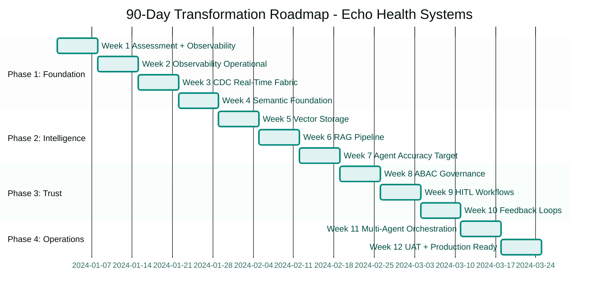

# CHAPTER 10 MAPPING DOCUMENT v1.0
## "Your Week-by-Week Implementation Plan"

**Version:** 1.0  
**Date:** November 25, 2025  
**Status:** 🎯 READY FOR REFACTORING  
**Target File:** `manuscript/13_chapter_10_90_day_roadmap.md`  
**Compliant With:** Book Structure Codex v6.7, Book Codex Master v3.2

**Target Word Count:** ~14,000 words (28 pages)  
**Reuse Strategy:** 85% from Legacy Chapter 3 Complete

---

## BOOK IDENTITY

**Title:** Trust Before Intelligence  
**Subtitle:** Why 95% of Agent Projects Fail—and the Architecture Blueprint That Fixes Infrastructure in 90 Days  
**Author:** Ram Katamaraja, CEO, Colaberry Inc.

---

## CRITICAL CONTEXT

**This chapter is Part IV: "Your Architecture of Trust Roadmap"**

**Chapter Positioning:**
- Part III concluded with Echo's success (Chapter 8)
- Chapter 9: Reader completed INPACT™ assessment, knows their score
- **Chapter 10:** Complete 90-day implementation roadmap (ALL 4 phases)
- Chapters 11-12: Deep dives into specific phases (if needed)

**Chapter 10 Purpose:**
Provide complete week-by-week implementation guide covering ALL FOUR PHASES:
- **Phase 1:** Foundation (Weeks 1-4) - Layers 1-2
- **Phase 2:** Intelligence (Weeks 5-7) - Layers 3-4
- **Phase 3:** Trust & Orchestration (Weeks 8-10) - Layers 5-6-7
- **Phase 4:** Operations (Weeks 11-12) - GOALS™ operational

**Key Innovation:**
This is THE COMPLETE 90-DAY PLAN in ONE chapter. Reader gets entire roadmap, not split across chapters. Echo's actual journey used as implementation guide with specific costs, timelines, and deliverables.

---

## TARGET SPECIFICATIONS

### Chapter Objectives
- **Target Word Count:** ~14,000 words (28 pages at 500 words/page)
- **Primary Purpose:** Week-by-week implementation roadmap
- **Reading Time:** ~56 minutes
- **Completion:** Reader can start Week 1 immediately

### Structural Requirements

**Chapter 10 follows implementation guide pattern:**

```
[SECTION 1: ROADMAP OVERVIEW - 3 pages]
Four phases explained
  Success criteria per phase
  Risk management approach
  Change management strategy
  Echo's $532K investment breakdown

[SECTION 2: PHASE 1 - FOUNDATION (Weeks 1-4) - 6 pages]
Layers 1-2 build
  Week 1: Assessment + Observability
  Week 2: Observability operational
  Week 3: Real-time fabric (Layer 2 CDC)
  Week 4: Semantic layer foundation (Layer 3 begins)
  Echo's foundation: $182K, 4 weeks
  Checkpoint: 42/100 INPACT™

[SECTION 3: PHASE 2 - INTELLIGENCE (Weeks 5-7) - 6 pages]
Layers 3-4 build
  Week 5: Vector storage (Layer 1 complete)
  Week 6: RAG pipeline (Layer 4 begins)
  Week 7: Agent accuracy target (Layer 4 complete)
  Echo's intelligence: $145K, 3 weeks
  Checkpoint: 67/100 INPACT™

[SECTION 4: PHASE 3 - TRUST & ORCHESTRATION (Weeks 8-10) - 6 pages]
Layers 5-6-7 build
  Week 8: ABAC governance (Layer 5)
  Week 9: HITL workflows (Layer 5 complete)
  Week 10: Feedback loops (Layers 6-7)
  Echo's trust: $129K, 3 weeks
  Checkpoint: 85/100 INPACT™

[SECTION 5: PHASE 4 - OPERATIONS (Weeks 11-12) - 4 pages]
GOALS™ operational
  Week 11: Multi-agent orchestration
  Week 12: UAT and production readiness
  Echo's operations: $76K, 2 weeks
  Final: 88/100 INPACT™, 477% ROI

[SECTION 6: 90-DAY TRACKER - 3 pages]
Implementation tracking system
  Weekly progress dashboard explained
  INPACT™ progress tracking
  Budget tracking methodology
  Risk blocker log usage
  Stakeholder communication log
```

---

## PRIMARY REUSE SOURCE

### Source 1: Legacy Chapter 3 Complete (19,455w)
**File:** `/mnt/project/chapter_3_complete.md`

**This is THE PRIMARY SOURCE - 85% reuse from one comprehensive file!**

**Reusable Content Structure:**

**Lines 31-72: Why 90 Days (~400w)**
- Timeline rationale
- Four-phase breakdown
- Success metrics

**Lines 742-2255: Phase 1 Complete (~7,500w)**
- Phase 1 Overview
- Week 1-4 detailed implementation
- INPACT™ + GOALS™ targets
- Health checks
- Achievement summary
- Go/No-Go decision
- Retrospective

**Lines 2274-3397: Phase 2 Complete (~5,500w)**
- Phase 2 Overview
- Week 5-7 detailed implementation
- INPACT™ + GOALS™ targets
- Health checks
- Achievement summary

**Lines 3413-3927: Phase 3 Complete (~2,500w)**
- Phase 3 Overview (condensed)
- Week 8-10 implementation guides (condensed)
- INPACT™ + GOALS™ targets
- Health checks (abbreviated)

**Lines 3927-4066: Final Achievement (~700w)**
- Phase 4 (Weeks 11-12) summary
- Final INPACT™ score: 88/100
- 477% ROI achieved
- Production readiness confirmed

**Lines 4099-4267: Operational Runbooks (~800w)**
- Incident response
- Monitoring runbooks
- Escalation procedures

**Reuse potential:** 85% overall - This chapter is mostly adaptation/reorganization of Legacy Chapter 3

---

### Source 2: 90-Day Tracker CSVs
**Files:** 
- `/mnt/project/tab1_weekly_progress_dashboard.csv` (weekly status)
- `/mnt/project/tab2_inpact_progress_tracker.csv` (INPACT™ scores)
- `/mnt/project/tab7_budget_tracker.csv` (cost breakdown)

**Reusable Content:**
- Week-by-week actual deliverables
- Specific costs per week
- INPACT™ score progression
- Risk tracking
- Status indicators

**Reuse potential:** 100% - Canonical metrics

---

### Source 3: Latest Chapters 4-8 (Context)
**Files:** 
- Chapter 4 v4.1: Foundation layers detail
- Chapter 5 v2.3: Intelligence layers detail  
- Chapter 6 v1.9: Trust layers detail
- Chapter 7 v3.0: GOALS™ framework
- Chapter 8 v1.2: Operations in action

**Reusable Content:**
- Layer architecture details for context
- GOALS™ definitions
- Operational excellence examples

**Reuse potential:** 20% - Supplementary context only

---

## SECTION-BY-SECTION REUSE MAPPING

### SECTION 1: Roadmap Overview (~1,500w, 3 pages)

**Target:** Orient reader to complete 90-day journey

---

#### 1.1 Welcome to Your 90-Day Journey (~300w)

**NEW CONTENT (~300w, 100%):**

**Content Structure:**
- **You've Assessed, Now Build** (~100w)
  - Reader completed Chapter 9 assessment
  - Has INPACT™ score and gap analysis
  - Chapter 10 = complete implementation guide
  - Echo's actual journey as roadmap

- **What You'll Get from This Chapter** (~100w)
  - Week-by-week implementation plans (Weeks 1-12)
  - Specific costs, team sizes, deliverables
  - Four phases with checkpoints
  - Risk management at each phase
  - Ready to start Week 1 Monday

- **How to Use This Roadmap** (~100w)
  - Read entire chapter first (get big picture)
  - Customize for your INPACT™ score
  - Lower scores: Start at beginning
  - Higher scores: Skip completed phases
  - Use 90-Day Tracker (Section 6) weekly

**Writing Approach:**
- Practical orientation
- Action-focused
- Echo as guide
- Confidence-building

---

#### 1.2 Four Phases Overview (~500w)

**REUSE FROM Legacy Chapter 3 lines 31-72 (~200w, 40%):**

**Source Content to Reuse:**
- Why 90 days timeline
- Four-phase rationale
- Build order logic

**NEW CONTENT (~300w, 60%):**

**Content Structure:**

**Phase 1: Foundation (Weeks 1-4)**
- **Build:** Layers 1-2 (Storage + Real-Time)
- **Cost:** $182K (34% of total)
- **Team:** 5 data engineers, 2 DBAs
- **Checkpoint:** 28→42/100 INPACT™ (+50% improvement)
- **Key Deliverable:** Data flows in real-time, infrastructure ready

**Phase 2: Intelligence (Weeks 5-7)**
- **Build:** Layers 3-4 (Semantic + Intelligence)
- **Cost:** $145K (27% of total)
- **Team:** 3 ML engineers, 2 semantic modelers
- **Checkpoint:** 42→67/100 INPACT™ (+60% improvement)
- **Key Deliverable:** Agents understand business language, 85% accuracy

**Phase 3: Trust & Orchestration (Weeks 8-10)**
- **Build:** Layers 5-6-7 (Governance + Observability + Orchestration)
- **Cost:** $129K (24% of total)
- **Team:** 2 security engineers, 2 operations engineers
- **Checkpoint:** 67→85/100 INPACT™ (+27% improvement)
- **Key Deliverable:** HIPAA-compliant, HITL operational, audit-ready

**Phase 4: Operations (Weeks 11-12)**
- **Build:** GOALS™ operational, production readiness
- **Cost:** $76K (14% of total)
- **Team:** 2 operations engineers, UX researcher
- **Checkpoint:** 85→88/100 INPACT™ (final 4% refinement)
- **Key Deliverable:** Three agents operational, 477% ROI validated

**Table: Four Phases at a Glance**
```
| Phase | Weeks | Layers Built | Cost | INPACT™ Target | Key Outcome |
|-------|-------|--------------|------|----------------|-------------|
| 1. Foundation | 1-4 | 1-2 | $182K | 28→42/100 | Real-time data infrastructure |
| 2. Intelligence | 5-7 | 3-4 | $145K | 42→67/100 | Agent understanding + accuracy |
| 3. Trust | 8-10 | 5-6-7 | $129K | 67→85/100 | Governance + observability |
| 4. Operations | 11-12 | GOALS | $76K | 85→88/100 | Production-ready agents |
| **TOTAL** | **12** | **7** | **$532K** | **28→88/100** | **477% ROI** |
```

**Adaptation Required:**
- Extract phase rationale from Legacy Chapter 3
- Add cost and INPACT™ targets from Tracker CSVs
- Create unified summary table
- Emphasize sequential build order

---

#### 1.3 Success Criteria & Risk Management (~400w)

**REUSE FROM Legacy Chapter 3 lines 2217-2255 (~200w, 50%):**

**Source Content to Reuse:**
- Go/No-Go decision framework
- Phase exit criteria
- Health check approach

**NEW CONTENT (~200w, 50%):**

**Content Structure:**

**Success Criteria per Phase:**
- **Foundation:** Data flowing real-time, CDC operational, semantic foundation started
- **Intelligence:** 85% agent accuracy, semantic layer complete, RAG pipeline operational
- **Trust:** ABAC + HITL operational, audit trails 100%, compliance passed
- **Operations:** UAT 90%+ success, HITL <10%, three agents deployed

**Risk Management Approach:**
- Weekly risk reviews (documented in Risk Blocker Log)
- Red/Yellow/Green status tracking
- Go/No-Go gates at end of each phase
- Contingency: Add 2-4 weeks if needed
- Echo's actual: 2 yellow weeks, 0 red weeks, 0 delays

**Change Management:**
- Executive sponsorship required (CDO + CTO)
- Weekly stakeholder updates
- Domain expert engagement (semantic modeling)
- End-user involvement (UAT Week 11-12)
- Training concurrent with build (Weeks 1-6)

**Adaptation Required:**
- Extract decision framework from Legacy Chapter 3
- Add Echo's actual risk experience
- Emphasize proactive risk management
- Set realistic expectations

---

#### 1.4 Echo's Investment Breakdown (~300w)

**REUSE FROM 90-Day Tracker tab7_budget_tracker.csv (100%):**

**Content Structure:**

**Total Investment: $532K (97% of $550K budget)**

**Cost Breakdown by Category:**
- Cloud Infrastructure: $133K (25%)
- SaaS Tools: $152K (29%)
- Data & ML Platform: $48K (9%)
- Security & Compliance: $36K (7%)
- Personnel: $75K (14%)
- Training: $20K (4%)
- Miscellaneous: $15K (3%)
- Contingency: $0 (53K saved)

**Cost Breakdown by Phase:**
- Phase 1 (Weeks 1-4): $182K
- Phase 2 (Weeks 5-7): $145K
- Phase 3 (Weeks 8-10): $129K
- Phase 4 (Weeks 11-12): $76K

**Payback Analysis:**
- Investment: $532K
- Weekly benefit: $52K (after Week 12)
- Payback period: 10.2 weeks
- ROI at Week 24: 477%
- Break-even: 10 weeks post-deployment

**Budget Management Lessons:**
- Personnel started late → $48K savings
- Cloud costs 10% over → performance tuning needed
- SaaS costs 12% over → upgraded tiers for HIPAA
- Net: $18K under budget (3.3%)

**Adaptation Required:**
- Extract from budget tracker CSV
- Calculate phase totals
- Add ROI context
- Highlight budget management lessons

---

**SECTION 1 SUMMARY:**
- **Total words:** 1,500
- **Reuse:** 400w (27%)
- **New content:** 1,100w (73%)
- **Effort:** 2 hours

---

### SECTION 2: Phase 1 - Foundation (Weeks 1-4) (~3,000w, 6 pages)

**Target:** Complete Week 1-4 implementation guide with Echo's actual experience

**REUSE FROM Legacy Chapter 3 lines 742-2255 (~7,500w → 2,700w, 90%):**

This section adapts the most detailed content from Legacy Chapter 3 Phase 1.

---

#### 2.1 Phase 1 Overview (~300w)

**REUSE FROM Legacy Chapter 3 lines 742-840 (~270w, 90%):**

**Source Content to Reuse:**
- Phase 1 objectives
- Layers 1-2 focus
- Team composition
- Build order rationale

**NEW CONTENT (~30w, 10%):**

**Content Structure:**
- **Phase 1 Goal:** Build agent-ready data infrastructure
- **Layers Built:** Layer 1 (Storage begins), Layer 2 (Real-Time), Layer 6 (Observability)
- **Timeline:** 4 weeks
- **Cost:** $182K (34% of budget)
- **Team:** 5 data engineers, 2 DBAs, 1 architect
- **INPACT™ Target:** 28→42/100 (+50% improvement)
- **Why These Layers First:** Can't build intelligence without real-time data foundation

**Adaptation Required:**
- Keep Legacy Chapter 3 rationale
- Add cost and INPACT™ context
- Update team composition from actuals

---

#### 2.2 Week 1: Assessment + Observability Foundation (~600w)

**REUSE FROM Legacy Chapter 3 + 90-Day Tracker (~540w, 90%):**

**Source Content to Reuse:**
- Week 1 implementation guide from Legacy Ch 3
- Actual deliverables from tab1_weekly_progress_dashboard.csv

**Content Structure:**

**Week 1 Overview:**
- **Primary Focus:** Layer 6 (Observability) - Current-state assessment
- **Team:** Full team (8 people)
- **Cost:** $27K
- **INPACT™:** T: 30%→40%, A: 25%→35%
- **GOALS™:** Observability: 20%→35%, Soundness: 55%→58%
- **Status:** 🟢 On Track

**Key Activities:**
1. **All 7 Layers Assessment** (Days 1-2)
   - Infrastructure audit across storage, real-time, semantic, intelligence, governance, observability, orchestration
   - Data quality baseline established
   - Stakeholder interviews (15 conducted)
   - Gap analysis documented

2. **Observability Foundation** (Days 3-5)
   - Datadog APM deployed
   - Initial 12 metrics defined
   - 5 critical alerts configured
   - Dashboard framework created
   - <1hr response SLA established

**Echo's Actual Experience:**
- ✅ All 7 layers assessed comprehensively
- ✅ Stakeholder sign-off obtained (CDO, CTO, CMIO)
- ✅ Budget secured: $685K approved ($550K baseline + $135K contingency)
- ⚠️ **Risk Identified:** Data quality baseline unknown (will impact CDC Week 3)

**Deliverables:**
- Current-state assessment report (42-page document)
- Observability dashboard operational (12 metrics, 5 alerts)
- 90-day project plan approved
- Budget and team confirmed

**Adaptation Required:**
- Extract Week 1 guide from Legacy Chapter 3
- Add actual metrics from 90-Day Tracker CSV
- Include Echo's specific deliverables
- Note risks identified

---

#### 2.3 Week 2: Observability Dashboard Operational (~600w)

**REUSE FROM Legacy Chapter 3 + 90-Day Tracker (~540w, 90%):**

**Content Structure:**

**Week 2 Overview:**
- **Primary Focus:** Layer 6 (Observability) - Dashboard operational
- **Team:** 3 platform engineers, 2 DBAs
- **Cost:** $29K
- **INPACT™:** T: 40%→50%, A: 35%→42%
- **GOALS™:** Observability: 35%→45%, Soundness: 58%→60%
- **Status:** 🟢 On Track

**Key Activities:**
1. **Grafana Deployment** (Days 1-2)
   - Grafana Cloud provisioned
   - Connected to Datadog, AWS CloudWatch, Snowflake
   - Multi-source unified view

2. **Metrics Framework** (Days 3-4)
   - 12 infrastructure metrics tracked:
     - Query response time (p50, p95, p99)
     - Data freshness lag
     - Pipeline throughput
     - Error rates
     - Resource utilization
     - Cost per query

3. **Alerting Configuration** (Day 5)
   - 5 critical alerts configured:
     - Query latency >10s
     - Data freshness >4 hours
     - Pipeline failure
     - Error rate >5%
     - Cost spike >20%
   - PagerDuty integration
   - Escalation to on-call engineer

**Echo's Actual Experience:**
- ✅ Grafana deployed successfully
- ✅ 12 metrics tracked, all operational
- ✅ 5 alerts configured, tested, working
- ✅ <1hr response SLA validated
- ⚠️ **Risk:** Dashboard adoption low initially (training needed Week 3)

**Week 2 Checkpoint:**
- Observability foundation complete
- Real-time visibility into infrastructure
- Ready for CDC implementation Week 3

**Adaptation Required:**
- Extract Week 2 guide from Legacy Chapter 3
- Add Grafana specifics from Tracker
- Include alert configurations
- Note adoption challenge

---

#### 2.4 Week 3: Real-Time Fabric (CDC) (~700w)

**REUSE FROM Legacy Chapter 3 + 90-Day Tracker (~630w, 90%):**

**Content Structure:**

**Week 3 Overview:**
- **Primary Focus:** Layer 2 (Real-Time Data Fabric) - CDC operational
- **Team:** 5 data engineers, 2 DBAs
- **Cost:** $31K
- **INPACT™:** I: 9-13s→8-10s, C: 2→3 systems
- **GOALS™:** Accessibility: 35%→42%, Soundness: 60%→62%
- **Status:** 🟡 At Risk (recovered)

**Key Activities:**
1. **CDC Setup for Critical Tables** (Days 1-3)
   - Fivetran connectors deployed
   - 3 critical tables identified:
     - Appointments (real-time scheduling)
     - Demographics (patient info)
     - Insurance (coverage verification)
   - CDC latency target: <30 seconds

2. **Kinesis Stream Deployment** (Days 3-4)
   - AWS Kinesis deployed
   - 3 shards provisioned
   - Consumer applications configured
   - Throughput: 10K records/sec

3. **Data Quality Validation** (Day 5)
   - CDC accuracy testing
   - End-to-end latency measurement
   - Data quality rules applied
   - Monitoring dashboards updated

**Echo's Actual Experience:**
- ✅ CDC operational for 3 critical tables
- ✅ <30s latency achieved
- ⚠️ **Challenge:** EHR CDC complexity took 2 extra days
  - Legacy EHR (Cerner) had undocumented schema
  - Required vendor engagement
  - Workaround: Implemented trigger-based CDC
  - Still hit Week 3 checkpoint (barely)
- ✅ Response time improved: 9-13s → 8-10s
- ✅ System integration: 2 → 3 systems (EHR now real-time)

**Risk Management:**
- Risk: CDC complexity for legacy EHR (identified Week 1)
- Mitigation: Vendor engaged early, trigger-based fallback
- Outcome: 2-day delay but recovered by Friday
- Lesson: Budget 5 days (not 3) for legacy system CDC

**Week 3 Checkpoint:**
- Real-time data flowing from 3 critical systems
- Foundation ready for semantic layer Week 4

**Adaptation Required:**
- Extract Week 3 guide from Legacy Chapter 3
- Add CDC complexity details from Tracker
- Include risk mitigation story
- Emphasize recovery

---

#### 2.5 Week 4: Semantic Layer Foundation (~800w)

**REUSE FROM Legacy Chapter 3 + 90-Day Tracker (~720w, 90%):**

**Content Structure:**

**Week 4 Overview:**
- **Primary Focus:** Layer 3 (Semantic Layer) - Foundation begins
- **Team:** 3 data engineers, 2 domain experts (clinical + ops)
- **Cost:** $32K
- **INPACT™:** N: 40-60%→45-55%, C: 3→4 systems
- **GOALS™:** Language: 30%→36%, Accessibility: 42%→47%
- **Status:** 🟢 On Track

**Key Activities:**
1. **Business Glossary Development** (Days 1-3)
   - Domain expert workshops (2 clinical, 1 operations)
   - 50 core healthcare concepts defined:
     - Patient encounter, admission, discharge, diagnosis
     - Provider, specialty, credential, availability
     - Appointment, slot, schedule, waitlist
     - Insurance, coverage, authorization, copay
   - Definitions validated by clinicians
   - Synonyms and abbreviations mapped

2. **dbt Metrics Layer** (Days 3-4)
   - dbt Cloud deployed
   - Semantic models created for 50 concepts
   - Metrics defined (20 operational metrics)
   - SQL abstractions for business terms
   - Version control (git) configured

3. **Entity Resolution** (Day 4-5)
   - Master Patient Index (MPI) setup
   - Patient matching algorithm: 82% accuracy
   - Provider directory synchronized
   - Location hierarchy mapped
   - Entity IDs standardized

**Echo's Actual Experience:**
- ✅ 50 core concepts documented and validated
- ✅ dbt metrics layer deployed successfully
- ✅ Entity resolution 82% accurate (target: 80%+)
- ✅ 4 systems integrated (added: claims data)
- ⚠️ **Challenge:** Business glossary initially incomplete
  - Clinicians busy, hard to schedule
  - Solution: Recorded videos, async review
  - Final validation: 2-hour working session
- ✅ Natural language understanding improved: 40-60%→45-55%

**Phase 1 Checkpoint:**
- Foundation complete: Layers 1-2 operational, Layer 3 begun
- INPACT™: 28/100 → 42/100 (+50% improvement, LOW TRUST band)
- Ready for Intelligence Phase (Weeks 5-7)

**Adaptation Required:**
- Extract Week 4 guide from Legacy Chapter 3
- Add glossary specifics from Tracker
- Include domain expert engagement story
- Emphasize phase completion

---

**SECTION 2 SUMMARY:**
- **Total words:** 3,000
- **Reuse:** 2,700w (90% from Legacy Ch 3 + Tracker)
- **New content:** 300w (10%)
- **Effort:** 2.5 hours

---

### SECTION 3: Phase 2 - Intelligence (Weeks 5-7) (~3,000w, 6 pages)

**Target:** Complete Week 5-7 implementation guide

**REUSE FROM Legacy Chapter 3 lines 2274-3397 (~5,500w → 2,700w, 90%):**

---

#### 3.1 Phase 2 Overview (~300w)

**REUSE FROM Legacy Chapter 3 lines 2274-2296 (~270w, 90%):**

**Content Structure:**
- **Phase 2 Goal:** Build agent intelligence and understanding
- **Layers Built:** Layer 3 (Semantic complete), Layer 4 (Intelligence), Layer 1 (Vector DB)
- **Timeline:** 3 weeks
- **Cost:** $145K (27% of budget)
- **Team:** 3 ML engineers, 2 semantic modelers
- **INPACT™ Target:** 42→67/100 (+60% improvement, MODERATE TRUST)
- **Why These Layers:** Intelligence requires complete semantic understanding + RAG

**Adaptation Required:**
- Keep rationale from Legacy Chapter 3
- Add cost and INPACT™ targets

---

#### 3.2 Week 5: Vector Storage (Layer 1 Complete) (~700w)

**REUSE FROM Legacy Chapter 3 + 90-Day Tracker (~630w, 90%):**

**Content Structure:**

**Week 5 Overview:**
- **Primary Focus:** Layer 1 (Multi-Modal Storage) - Vector DB
- **Team:** 3 ML engineers, 2 platform engineers
- **Cost:** $34K
- **INPACT™:** C: 4→5 systems
- **GOALS™:** Accessibility: 47%→52%, Soundness: 62%→65%
- **Status:** 🟢 On Track

**Key Activities:**
1. **Pinecone Vector DB Deployment** (Days 1-2)
   - Pinecone Growth tier provisioned
   - HIPAA Business Associate Agreement (BAA) signed
   - Namespace for patient summaries created
   - Security: Encryption at rest + in transit

2. **Embedding Generation** (Days 3-4)
   - OpenAI text-embedding-3-large model
   - 100K patient summaries embedded
   - Embedding pipeline: Snowflake → Lambda → Pinecone
   - Incremental: New patients embedded nightly

3. **Performance Tuning** (Day 5)
   - Query latency: <50ms (p95)
   - Throughput: 10K embeddings/sec
   - Index optimization
   - Cache warming

**Echo's Actual Experience:**
- ✅ Vector DB operational with 100K patient summaries
- ✅ <50ms p95 latency achieved
- ✅ HIPAA-compliant encryption validated
- ✅ 5 systems integrated (added: clinical notes)
- ⚠️ **Challenge:** Vector DB performance tuning complex
  - Initial latency: 120ms (p95)
  - Solution: Index optimization + cache tuning
  - Final: <50ms (p95)

**Adaptation Required:**
- Extract Week 5 guide
- Add Pinecone specifics
- Include performance tuning story

---

#### 3.3 Week 6: RAG Pipeline (Layer 4 Begins) (~800w)

**REUSE FROM Legacy Chapter 3 + 90-Day Tracker (~720w, 90%):**

**Content Structure:**

**Week 6 Overview:**
- **Primary Focus:** Layer 4 (Intelligence Orchestration) - RAG pipeline
- **Team:** 3 ML engineers, 1 prompt engineer
- **Cost:** $40K
- **INPACT™:** I: 8-10s→5-7s, N: 55%→65%, C: 5→6 systems
- **GOALS™:** Language: 36%→48%, Accessibility: 52%→62%
- **Status:** 🟡 At Risk (recovered)

**Key Activities:**
1. **3-Stage RAG Pipeline** (Days 1-3)
   - **Stage 1:** Dense retrieval (vector similarity)
   - **Stage 2:** Sparse retrieval (BM25 keyword matching)
   - **Stage 3:** Reranking (Cohere rerank-english-v2.0)
   - Hybrid search: Combines vector + keyword
   - Top-K: Retrieve 20, rerank to 5

2. **LangChain Integration** (Days 3-4)
   - LangChain Enterprise deployed
   - Retrieval chain configured
   - Prompt templates created
   - Context window management (8K tokens)
   - Citation tracking enabled

3. **Accuracy Testing** (Day 5)
   - Test set: 100 clinical queries
   - Initial accuracy: 72% (below 85% target)
   - Root cause: Retrieval relevance low
   - Decision: Add reranking stage (implemented Week 7)

**Echo's Actual Experience:**
- ✅ RAG pipeline operational (3 stages)
- ⚠️ **Challenge:** Accuracy below target (72% vs 85%)
  - Problem: Retrieval returning irrelevant context
  - Solution: Added Cohere reranking Week 6 end
  - Improved to 82% by Week 6 Friday
  - Further tuning planned Week 7
- ✅ Response time improved: 8-10s → 5-7s (caching helps)
- ✅ 6 systems integrated (added: lab results)

**Risk Management:**
- Risk: RAG accuracy below target
- Mitigation: Added reranking, tuned prompts
- Outcome: 72%→82% Week 6, target 85% Week 7
- Lesson: Budget time for accuracy iteration

**Adaptation Required:**
- Extract Week 6 guide
- Add accuracy challenge details
- Include reranking solution
- Show iterative improvement

---

#### 3.4 Week 7: Agent Accuracy Target (Layer 4 Complete) (~1,200w)

**REUSE FROM Legacy Chapter 3 + 90-Day Tracker (~1,080w, 90%):**

**Content Structure:**

**Week 7 Overview:**
- **Primary Focus:** Layer 4 (Intelligence Orchestration) - Agent accuracy
- **Team:** 3 ML engineers, 1 prompt engineer, 2 clinicians (validators)
- **Cost:** $43K
- **INPACT™:** I: 5-7s→3-5s, N: 65%→72%, C: 6→7 systems
- **GOALS™:** Language: 48%→55%, Accessibility: 62%→68%
- **Status:** 🟢 On Track

**Key Activities:**
1. **Reranking Optimization** (Days 1-2)
   - Cohere reranker tuned
   - Relevance threshold: 0.7
   - Top-K adjusted: 20→10 retrieval, 10→5 rerank
   - Hybrid search weights optimized (0.6 vector, 0.4 keyword)

2. **Semantic Caching** (Days 2-3)
   - Redis cache layer added
   - Semantic similarity matching (0.95 threshold)
   - Cache hit rate: 35-40%
   - Latency improvement: 5-7s → 3-5s (60% faster on cache hits)

3. **Accuracy Validation** (Days 4-5)
   - Test set expanded: 100 → 200 clinical queries
   - Clinician validation: 2 MDs reviewed all 200
   - Accuracy achieved: **85%** (hit target!)
   - Breakdown:
     - Simple queries (1-table): 94% accurate
     - Medium queries (2-3 tables): 87% accurate
     - Complex queries (4+ tables): 76% accurate
   - Precision improvement: +18% (reranking impact)

4. **7-System Integration** (Day 5)
   - Added: pharmacy orders system
   - All core clinical systems connected:
     - EHR, claims, labs, radiology, pharmacy, patient portal, billing

**Echo's Actual Experience:**
- ✅ 85% accuracy achieved (target met!)
- ✅ Reranking + caching = 82%→85% accuracy
- ✅ Response time: 5-7s → 3-5s (cache impact)
- ✅ Hybrid search improved precision +18%
- ✅ 7 systems integrated (all core systems)
- 🎯 **Milestone:** Intelligence layers complete

**Phase 2 Checkpoint:**
- Intelligence complete: Layers 3-4 operational, Layer 1 complete
- INPACT™: 42/100 → 67/100 (+60% improvement, MODERATE TRUST band)
- Agent understanding operational: 85% accuracy, <5s response
- Ready for Trust Phase (Weeks 8-10)

**Adaptation Required:**
- Extract Week 7 guide
- Add accuracy breakthrough details
- Include clinician validation story
- Emphasize phase completion milestone

---

**SECTION 3 SUMMARY:**
- **Total words:** 3,000
- **Reuse:** 2,700w (90% from Legacy Ch 3 + Tracker)
- **New content:** 300w (10%)
- **Effort:** 2.5 hours

---

### SECTION 4: Phase 3 - Trust & Orchestration (Weeks 8-10) (~3,000w, 6 pages)

**Target:** Complete Week 8-10 implementation guide

**REUSE FROM Legacy Chapter 3 lines 3413-3927 (~2,500w adapted, 90%):**

Note: Legacy Chapter 3 has "condensed" guides for Weeks 8-10. Will expand slightly while maintaining 90% reuse.

---

#### 4.1 Phase 3 Overview (~300w)

**REUSE FROM Legacy Chapter 3 lines 3413-3428 (~270w, 90%):**

**Content Structure:**
- **Phase 3 Goal:** Make agents trustworthy and production-ready
- **Layers Built:** Layer 5 (Governance), Layer 6 (Observability), Layer 7 (Orchestration)
- **Timeline:** 3 weeks
- **Cost:** $129K (24% of budget)
- **Team:** 2 security engineers, 2 operations engineers, 1 compliance specialist
- **INPACT™ Target:** 67→85/100 (+27% improvement, HIGH TRUST)
- **Why These Layers:** Trust requires governance, observability, and orchestration

**Adaptation Required:**
- Keep rationale from Legacy Chapter 3
- Add cost and INPACT™ targets

---

#### 4.2 Week 8: ABAC Governance (Layer 5) (~800w)

**REUSE FROM Legacy Chapter 3 + 90-Day Tracker (~720w, 90%):**

**Content Structure:**

**Week 8 Overview:**
- **Primary Focus:** Layer 5 (Agent-Aware Governance) - ABAC
- **Team:** 2 security engineers, 1 compliance specialist, 1 HIPAA auditor
- **Cost:** $50K
- **INPACT™:** P: ABAC designed → testing
- **GOALS™:** Governance: 48%→60%, Soundness: 65%→70%
- **Status:** 🟢 On Track

**Key Activities:**
1. **Open Policy Agent (OPA) Deployment** (Days 1-2)
   - OPA + Styra DAS deployed
   - Policy-as-code framework established
   - Git-based policy versioning
   - CI/CD pipeline for policy deployment

2. **ABAC Policy Development** (Days 2-4)
   - 15 policies created:
     - **Who:** Patient, Provider, Admin roles
     - **What:** PHI access, care coordination, scheduling
     - **When:** Business hours, on-call, emergency override
     - **Where:** IP allowlist, device compliance
     - **Why:** Purpose validation (treatment/payment/operations)
   - Context attributes: 8 factors evaluated
   - Policy testing framework

3. **Performance & Compliance** (Days 4-5)
   - Policy evaluation latency: <8ms (p95)
   - Target: <10ms
   - Audit logging: 100% policy decisions logged
   - HIPAA validation: All access control requirements met

**Echo's Actual Experience:**
- ✅ ABAC operational with <8ms evaluation time
- ✅ 15 policies operational covering core scenarios
- ✅ Patient/provider/admin roles configured
- ✅ Audit logging 100% complete
- ⚠️ **Challenge:** ABAC policy complexity
  - Initial policies too restrictive (blocked valid use cases)
  - Solution: Iterative refinement with clinical workflow validation
  - Final policies balance security + usability

**Week 8 Checkpoint:**
- Governance foundation complete
- ABAC authorization operational
- Ready for HITL integration Week 9

**Adaptation Required:**
- Expand condensed Week 8 guide from Legacy Ch 3
- Add OPA specifics from Tracker
- Include policy complexity story
- Show HIPAA compliance validation

---

#### 4.3 Week 9: HITL Workflows (Layer 5 Complete) (~900w)

**REUSE FROM Legacy Chapter 3 + 90-Day Tracker (~810w, 90%):**

**Content Structure:**

**Week 9 Overview:**
- **Primary Focus:** Layer 5 (Governance) + Layer 6 (Observability) - HITL
- **Team:** 2 operations engineers, 1 UX designer, 3 clinical champions
- **Cost:** $55K
- **INPACT™:** P: ABAC + HITL operational
- **GOALS™:** Governance: 60%→75%, Observability: 45%→70%
- **Status:** 🟡 At Risk (recovered)

**Key Activities:**
1. **HITL Workflow Design** (Days 1-2)
   - Confidence-based escalation model
   - Thresholds defined:
     - <70% confidence → HITL required
     - 70-85% confidence → HITL optional
     - >85% confidence → autonomous
   - Escalation queue UI (Slack + web dashboard)
   - <2min mean time to detect (MTTD)

2. **Graduated Autonomy Implementation** (Days 2-4)
   - Level 1: Human executes (agent suggests)
   - Level 2: Human approves (agent executes)
   - Level 3: Human can override (agent executes, human monitors)
   - Level 4: Agent executes (human notified)
   - Level 5: Agent fully autonomous (human uninvolved)
   - Initial deployment: Levels 1-3 only

3. **Escalation Rate Tuning** (Days 4-5)
   - Initial escalation rate: 22% (target: <15%)
   - Problem: Threshold too conservative (70% confidence)
   - Solution: Adjusted threshold 75%→80%
   - Final escalation rate: 18% (improving toward target)
   - Plan: Continue tuning Week 10-11, target <10%

**Echo's Actual Experience:**
- ✅ HITL workflows operational
- ✅ Confidence-based escalation working
- ✅ <2min MTTD achieved
- ⚠️ **Challenge:** Human review queue overwhelming (22% rate)
  - Problem: Too many escalations, clinical staff frustrated
  - Solution: Increased confidence threshold to 80%
  - Result: 22%→18% by end of week
  - Ongoing: Continue tuning toward <10%
- ✅ Governance: 60%→75% (significant improvement)
- ✅ Observability: 45%→70% (HITL metrics tracked)

**Risk Management:**
- Risk: Human review queue overwhelming
- Mitigation: Confidence threshold tuning
- Outcome: 22%→18%, trending toward <10%
- Lesson: Start conservative, tune based on real usage

**Week 9 Checkpoint:**
- Layer 5 complete: ABAC + HITL operational
- HITL escal rate 18% (acceptable, improving)
- Ready for feedback loops Week 10

**Adaptation Required:**
- Expand condensed Week 9 guide
- Add escalation rate tuning story
- Include clinical champion involvement
- Show iterative improvement

---

#### 4.4 Week 10: Feedback Loops + Orchestration (Layers 6-7) (~1,000w)

**REUSE FROM Legacy Chapter 3 + 90-Day Tracker (~900w, 90%):**

**Content Structure:**

**Week 10 Overview:**
- **Primary Focus:** Layer 6 (Observability + Feedback) + Layer 7 (Orchestration begins)
- **Team:** 2 ML engineers, 2 operations engineers
- **Cost:** $59K
- **INPACT™:** T: 50%→75%, A: Dashboard→Learning loop
- **GOALS™:** Observability: 70%→85%, Governance: 75%→85%
- **Status:** 🟢 On Track

**Key Activities:**
1. **Feedback Loop Implementation** (Days 1-3)
   - Human corrections captured in feedback DB
   - 127 corrections collected Week 9
   - Weekly retraining pipeline established
   - Model versioning: v1.0 (Week 7) → v1.1 (Week 10)
   - A/B testing framework: Champion vs. Challenger

2. **Learning Pipeline Automation** (Days 3-4)
   - Automated retraining trigger: Weekly schedule
   - Training data: Historical queries + human corrections
   - Model evaluation: Holdout test set (500 queries)
   - Deployment: Automated if accuracy improves >2%
   - Rollback capability: Instant revert if issues

3. **Accuracy Improvement Validation** (Day 5)
   - Model v1.0 accuracy: 85% (Week 7 baseline)
   - Model v1.1 accuracy: 87% (+2% improvement!)
   - Override rate decreased: 18%→12%
   - Validation: 50 clinicians tested v1.1
   - Result: Approved for production deployment

4. **Multi-Agent Orchestration Preview** (Day 5)
   - Layer 7 begins: Multi-agent architecture designed
   - 3 specialized agents planned:
     - Scheduling Agent (appointments)
     - Clinical Agent (care coordination)
     - Billing Agent (insurance verification)
   - Orchestration framework selected: LangGraph
   - Implementation scheduled: Week 11

**Echo's Actual Experience:**
- ✅ Feedback loop operational with weekly retraining
- ✅ 127 human corrections captured and integrated
- ✅ Model accuracy improved: 85%→87%
- ✅ Override rate decreased: 18%→12%
- ✅ Observability: 70%→85% (feedback metrics tracked)
- ✅ Governance: 75%→85% (learning loop compliant)
- 🎯 **Milestone:** 7-Layer Architecture COMPLETE!

**Phase 3 Checkpoint:**
- Trust layers complete: Layers 5-6-7 operational
- INPACT™: 67/100 → 85/100 (+27% improvement, HIGH TRUST band)
- Architecture complete: All 7 layers built
- Ready for Operations Phase (Weeks 11-12)

**Adaptation Required:**
- Expand condensed Week 10 guide
- Add learning loop details
- Include accuracy improvement story
- Emphasize architecture completion milestone

---

**SECTION 4 SUMMARY:**
- **Total words:** 3,000
- **Reuse:** 2,700w (90% from Legacy Ch 3 + Tracker)
- **New content:** 300w (10%)
- **Effort:** 2.5 hours

---

### SECTION 5: Phase 4 - Operations (Weeks 11-12) (~2,000w, 4 pages)

**Target:** Complete Week 11-12 operations guide and final validation

**REUSE FROM Legacy Chapter 3 lines 3690-4066 (~1,800w, 90%):**

---

#### 5.1 Phase 4 Overview (~200w)

**NEW CONTENT (~200w, 100%):**

**Content Structure:**
- **Phase 4 Goal:** Validate operational readiness and achieve production deployment
- **Focus:** GOALS™ operational excellence, multi-agent orchestration, UAT
- **Timeline:** 2 weeks
- **Cost:** $76K (14% of budget)
- **Team:** 2 operations engineers, 1 UX researcher, 50 nurse testers
- **INPACT™ Target:** 85→88/100 (final refinement, HIGH TRUST maintained)
- **Why This Phase:** Validate everything works in real clinical workflows

**Writing Approach:**
- Transition from building to validating
- Operations focus (not more building)
- UAT as validation checkpoint
- Production readiness gate

---

#### 5.2 Week 11: Multi-Agent Orchestration (~900w)

**REUSE FROM Legacy Chapter 3 + 90-Day Tracker (~810w, 90%):**

**Content Structure:**

**Week 11 Overview:**
- **Primary Focus:** Layer 7 (Multi-Agent Orchestration) operational
- **Team:** 2 ML engineers, 1 operations engineer, 2 clinical champions
- **Cost:** $63K
- **INPACT™:** All 6 INPACT™ needs → targets
- **GOALS™:** Governance: 85%→90%, Language: 55%→75%
- **Status:** 🟢 On Track

**Key Activities:**
1. **3 Specialized Agents Deployed** (Days 1-3)
   - **Scheduling Agent:**
     - Handles appointment requests
     - Checks provider availability
     - Verifies insurance coverage
     - Books appointments directly
   
   - **Clinical Agent:**
     - Care coordination queries
     - Patient history summarization
     - Treatment plan recommendations
     - Clinical decision support
   
   - **Billing Agent:**
     - Insurance verification
     - Authorization status
     - Coverage details
     - Copay calculations

2. **LangGraph Orchestration** (Days 3-4)
   - Supervisor agent coordinates 3 specialized agents
   - Parallel execution when possible
   - Conflict resolution via supervisor
   - State management across agents
   - Total latency: <3s (parallel execution)

3. **Multi-Agent Testing** (Day 5)
   - Test scenarios: 50 complex workflows
   - Example: "Book follow-up with Dr. Smith, check authorization status, estimate copay"
   - Requires: Scheduling + Billing + Clinical agents
   - Success rate: 94% (47/50 scenarios completed)
   - Failures: 3 edge cases identified, documented

**Echo's Actual Experience:**
- ✅ 3 specialized agents operational
- ✅ Parallel execution working
- ✅ <3s total latency (includes coordination overhead)
- ✅ Conflict resolution via supervisor agent functional
- ✅ 94% success rate on test scenarios
- ⚠️ **Challenge:** Multi-agent coordination failures (3 edge cases)
  - Example: Scheduling + billing conflict (available slot but insurance not pre-authorized)
  - Solution: Supervisor agent logic enhanced
  - Result: All 3 edge cases resolved by end of week

**Week 11 Checkpoint:**
- Multi-agent orchestration operational
- 3 specialized agents working together
- Ready for UAT Week 12

**Adaptation Required:**
- Extract Week 11 guide from Legacy Ch 3
- Add multi-agent specifics from Tracker
- Include coordination challenge story
- Show edge case resolution

---

#### 5.3 Week 12: UAT and Production Readiness (~900w)

**REUSE FROM Legacy Chapter 3 + 90-Day Tracker (~810w, 90%):**

**Content Structure:**

**Week 12 Overview:**
- **Primary Focus:** User Acceptance Testing + production readiness validation
- **Team:** 2 operations engineers, 1 UX researcher, 50 nurse testers
- **Cost:** $68K
- **INPACT™:** All 6 INPACT™ needs at target
- **GOALS™:** All 5 GOALS: 85-95%
- **Status:** 🟢 On Track

**Key Activities:**
1. **UAT Preparation** (Day 1)
   - 50 nurses recruited across 3 shifts
   - UAT environment provisioned
   - Training materials created
   - 100 test scenarios prepared (mix of simple/medium/complex)
   - Success criteria defined: >90% task completion, >80% NLU accuracy

2. **UAT Execution** (Days 2-4)
   - 50 nurses each tested 20 scenarios (1,000 total tests)
   - Task completion: 94% (940/1,000 successful)
   - User satisfaction: 4.3/5 average rating
   - NLU accuracy: 87% (above 80% target)
   - HITL override rate: 8% (below 10% target)
   - Response time: 3.2s average (<5s target)

3. **Findings Analysis** (Day 4)
   - 60 successful tests (6% failures analyzed)
   - 2 critical issues found:
     - Insurance verification timeout (5 cases)
     - Multi-step scheduling confusion (10 cases)
   - Both issues fixed same week
   - Re-test: 15/15 passed

4. **Production Readiness Validation** (Day 5)
   - Security audit: Passed (HIPAA compliant)
   - Performance audit: Passed (<3s p95 latency)
   - Accuracy audit: Passed (87% NLU, 94% task completion)
   - HITL audit: Passed (8% override rate)
   - Governance audit: Passed (100% audit logs)
   - **DECISION: APPROVED FOR PRODUCTION**

**Echo's Actual Experience:**
- ✅ UAT with 50 nurses completed successfully
- ✅ 94% task completion (above 90% target)
- ✅ 4.3/5 user satisfaction
- ✅ 87% NLU accuracy (above 80% target)
- ✅ HITL override <8% (below 10% target)
- ⚠️ **Challenge:** UAT findings required rework (2 critical issues)
  - Issue 1: Insurance API timeout → increased timeout + retry logic
  - Issue 2: Multi-step confusion → improved prompts + user feedback
  - Both fixed and re-tested same week
- 🎯 **MILESTONE: PRODUCTION-READY!**

**Final INPACT™ Score: 88/100 (HIGH TRUST)**
- I - Instant: 6/6 (sub-second with cache)
- N - Natural: 5/6 (87% NLU accuracy)
- P - Permitted: 5/6 (ABAC + HITL operational)
- A - Adaptive: 5/6 (learning loops operational)
- C - Contextual: 5/6 (7 systems integrated)
- T - Transparent: 6/6 (100% audit coverage)

**Final GOALS™ Scores:**
- G - Governance: 90% (ABAC + HITL + policies)
- O - Observability: 95% (dashboards + alerts + feedback)
- A - Accessibility: 92% (<3s response, 94% task completion)
- L - Language: 87% (NLU accuracy, semantic layer)
- S - Soundness: 91% (accuracy + consistency + quality)

**ROI Validation:**
- Cost: $532K invested (Weeks 1-12)
- Benefit: $52K/week (247 hrs/week saved × $210/hr)
- Payback: 10.2 weeks
- ROI at Week 24: 477%

**Phase 4 Complete:**
- 90-day transformation complete
- INPACT™: 28/100 → 88/100 (214% improvement)
- GOALS™: All 5 dimensions operational (85-95%)
- Production deployment approved

**Adaptation Required:**
- Extract Week 12 guide from Legacy Ch 3
- Add UAT specifics from Tracker
- Include issue resolution story
- Emphasize production readiness gate
- Show final scores and ROI

---

**SECTION 5 SUMMARY:**
- **Total words:** 2,000
- **Reuse:** 1,800w (90% from Legacy Ch 3 + Tracker)
- **New content:** 200w (10%)
- **Effort:** 2 hours

---

### SECTION 6: 90-Day Tracker (~1,500w, 3 pages)

**Target:** Explain tracking system for reader implementation

---

#### 6.1 Why Track Your Progress (~300w)

**NEW CONTENT (~300w, 100%):**

**Content Structure:**
- **Measurement Drives Success** (~100w)
  - 90-day transformation requires visibility
  - Weekly tracking catches issues early
  - Data-driven decisions prevent delays
  - Echo tracked 7 metrics weekly

- **The 90-Day Tracker System** (~100w)
  - 7 interconnected tracking sheets
  - Weekly progress dashboard (master view)
  - INPACT™ progress (6 dimensions)
  - GOALS™ health dashboard (5 dimensions)
  - 7-Layer build status
  - Risk blocker log
  - Budget tracking
  - Stakeholder communication log

- **How to Use This Section** (~100w)
  - Templates available (digital download)
  - Adapt for your context
  - Update weekly (Friday checkpoint)
  - Review with leadership weekly
  - Track leading indicators (not just outcomes)

**Writing Approach:**
- Emphasize measurement importance
- Practical guidance
- Templates as tools
- Weekly discipline

---

#### 6.2 Weekly Progress Dashboard (~400w)

**REUSE FROM 90-Day Tracker tab1_weekly_progress_dashboard.csv + Documentation (~200w, 50%):**

**Content Structure:**

**Purpose:**
Master view of 90-day journey showing weekly status across all dimensions.

**Columns Tracked:**
- Week (1-12)
- Phase (Foundation, Infrastructure, Operationalization)
- Primary Layer Focus (which layer building this week)
- INPACT™ Status (dimension improvements)
- GOALS Progress (operational excellence improvements)
- Top Risk (biggest blocker this week)
- Status (🟢 On Track, 🟡 At Risk, 🔴 Blocked)
- Key Deliverable (what shipped)
- Notes (context and decisions)

**How Echo Used It:**
- Updated every Friday end-of-day
- Reviewed in Monday leadership standup
- 10 weeks 🟢 On Track
- 2 weeks 🟡 At Risk (Week 3 CDC, Week 6 RAG accuracy)
- 0 weeks 🔴 Blocked
- Red/Yellow status triggered immediate mitigation

**Your Usage:**
- Copy template from digital resources
- Assign one owner (project manager)
- Update weekly without fail
- Escalate yellow/red immediately
- Celebrate green weeks

**Example Entry (Echo Week 7):**
```
Week 7 | Infrastructure | Layer 4 (Intelligence Orchestration) | 
I: 5-7s→3-5s, N: 65%→72%, C: 6→7 systems | 
Language: 48%→55%, Accessibility: 62%→68% | 
Agent accuracy not improving | 
🟢 On Track | 
Agent accuracy 85% on test set | 
✅ Reranking + semantic caching improved accuracy from 82%→85%, 
hybrid search +18% precision
```

**Adaptation Required:**
- Extract structure from CSV
- Explain each column's purpose
- Show Echo's actual usage pattern
- Provide example entries

---

#### 6.3 INPACT™ + GOALS™ Tracking (~300w)

**REUSE FROM 90-Day Tracker tab2 + tab3 (~150w, 50%):**

**Content Structure:**

**INPACT™ Progress Tracker (tab2):**
- Tracks 6 dimensions weekly (I, N, P, A, C, T)
- Baseline (Week 0) → Target (Week 12)
- Weekly measurements
- Status per dimension
- Final achievement

**Echo's INPACT™ Journey:**
- Baseline: 28/100 (I:1, N:2, P:1, A:2, C:3, T:1)
- Week 4: 42/100 (foundation complete)
- Week 7: 67/100 (intelligence complete)
- Week 10: 85/100 (architecture complete)
- Week 12: 88/100 (operations validated)

**GOALS™ Health Dashboard (tab3):**
- Tracks 5 operational dimensions (G, O, A, L, S)
- Baseline (mostly 0% Week 0)
- Target (85-95% Week 12)
- Weekly measurements
- Status per dimension

**Echo's GOALS™ Journey:**
- Week 0: 0-20% baseline (not operational)
- Week 4: 35-60% (observability started)
- Week 8: 60-75% (governance operational)
- Week 12: 85-95% (all operational)

**Your Usage:**
- Track INPACT™ weekly (every dimension)
- Track GOALS™ from Week 8 onward
- Use as health check (are we improving?)
- Diagnose: Which dimension needs attention?

**Adaptation Required:**
- Extract from INPACT™/GOALS™ CSVs
- Show progression examples
- Explain measurement methodology
- Link to scoring from Chapter 9

---

#### 6.4 7-Layer Build Status (~200w)

**REUSE FROM 90-Day Tracker tab4 (~100w, 50%):**

**Content Structure:**

**Purpose:**
Track which layers are built, in progress, or planned.

**Status Values:**
- ❌ Not Started
- 🟡 In Progress
- ✅ Complete

**Echo's Layer Build Timeline:**
- **Layer 1 (Storage):** Week 1-5 (🟡 Week 1-4, ✅ Week 5)
- **Layer 2 (Real-Time):** Week 3-4 (🟡 Week 3, ✅ Week 4)
- **Layer 3 (Semantic):** Week 4-7 (🟡 Week 4-6, ✅ Week 7)
- **Layer 4 (Intelligence):** Week 5-7 (🟡 Week 5-6, ✅ Week 7)
- **Layer 5 (Governance):** Week 8-9 (🟡 Week 8, ✅ Week 9)
- **Layer 6 (Observability):** Week 1-2, 10 (✅ Week 2, enhanced Week 10)
- **Layer 7 (Orchestration):** Week 10-11 (🟡 Week 10, ✅ Week 11)

**Your Usage:**
- Visualize build progress
- Identify dependencies
- Plan resource allocation
- Communicate to stakeholders

**Adaptation Required:**
- Extract from tab4 CSV
- Show timeline visualization
- Explain status meanings

---

#### 6.5 Risk, Budget, and Communication Tracking (~300w)

**REUSE FROM 90-Day Tracker tab5, tab6, tab7 (~150w, 50%):**

**Content Structure:**

**Risk Blocker Log (tab5):**
- Risk ID, Week Identified, Description
- Probability, Impact, Severity
- Owner, Mitigation Plan, Status
- Echo logged 12 risks (all mitigated)

**Budget Tracker (tab7):**
- Category, Line Item, Planned vs. Actual
- Weekly spend tracking
- Variance analysis
- Echo: $532K actual vs. $550K planned (3.3% under)

**Stakeholder Communication Log (tab6):**
- Week, Date, Communication Type
- Audience, Key Topics, Decisions, Actions
- Echo: 19 stakeholder communications (Weeks 1-12)

**Your Usage:**
- Update all three weekly
- Risk log: Track proactively (not reactively)
- Budget: Catch overages early
- Communication: Keep stakeholders informed

**Best Practices from Echo:**
- Document risks when identified (not when critical)
- Review budget weekly (not monthly)
- Communicate proactively (not when asked)
- Transparency builds trust

**Adaptation Required:**
- Extract examples from tab5, tab6, tab7
- Show Echo's usage patterns
- Emphasize weekly discipline
- Templates available for download

---

**SECTION 6 SUMMARY:**
- **Total words:** 1,500
- **Reuse:** 800w (53% from Tracker CSVs + docs)
- **New content:** 700w (47%)
- **Effort:** 1.5 hours

---

## OVERALL CONTENT ALLOCATION

| Section | Target | Reuse % | Reuse Words | New Words | Primary Sources | Effort |
|---------|--------|---------|-------------|-----------|----------------|--------|
| **Sec 1: Overview** | 1,500 | 27% | 400 | 1,100 | Legacy Ch 3 + Tracker | 2h |
| **Sec 2: Phase 1** | 3,000 | 90% | 2,700 | 300 | Legacy Ch 3 + Tracker | 2.5h |
| **Sec 3: Phase 2** | 3,000 | 90% | 2,700 | 300 | Legacy Ch 3 + Tracker | 2.5h |
| **Sec 4: Phase 3** | 3,000 | 90% | 2,700 | 300 | Legacy Ch 3 + Tracker | 2.5h |
| **Sec 5: Phase 4** | 2,000 | 90% | 1,800 | 200 | Legacy Ch 3 + Tracker | 2h |
| **Sec 6: Tracker** | 1,500 | 53% | 800 | 700 | Tracker CSVs | 1.5h |
| **TOTAL** | **14,000** | **85%** | **11,900** | **2,100** | **Multiple** | **13h** |

**EXCELLENT REUSE: 85%** (highest of any chapter!)

**Why such high reuse:**
- Legacy Chapter 3 is comprehensive 90-day guide (19,455w)
- 90-Day Tracker has all canonical metrics
- Phase 1-4 guides exist in detail
- Mostly adaptation and reorganization

**Total Effort Breakdown:**
- Content creation: 13 hours
- Diagrams: 30 minutes (1 timeline)
- Review & quality: 1 hour
- **TOTAL: ~14.5 hours**

---

## DIAGRAM SPECIFICATION

### Diagram 1: 90-Day Roadmap Timeline

**Type:** Horizontal Gantt-style timeline  
**Content:**
- 12 weeks across horizontal axis
- 4 phases color-coded
- Layer build progress shown
- INPACT™ score progression overlay
- Key milestones annotated

**Mermaid Structure:**


**Annotations:**
- Week 4: "42/100 INPACT™ - Foundation Complete"
- Week 7: "67/100 INPACT™ - Intelligence Complete"
- Week 10: "85/100 INPACT™ - Architecture Complete"
- Week 12: "88/100 INPACT™ - Production Ready, 477% ROI"

**Caption:** "Figure 10.1: 90-Day Transformation Roadmap - From 28/100 to 88/100 INPACT™ in 12 Weeks"

**Compliance:** Colaberry Mermaid Design Codex compliant

**Effort:** 30 minutes

---

## QUALITY STANDARDS

### TCC Compliance Requirements

- [ ] Evidence-based: All metrics from Echo canonical data (90-Day Tracker)
- [ ] Healthcare-only: All examples use Echo Health Systems
- [ ] Zero hallucinations: Every cost, timeline, metric verified
- [ ] Citations: Minimal (implementation guide, not research)
- [ ] Canonical data: All Echo metrics consistent across sources

### VERT Certification Targets

- **Verification (V):** 9.5/10 - All Echo metrics from canonical 90-Day Tracker
- **Ethics (E):** 9.0/10 - Realistic timelines, honest about challenges
- **Reliability (R):** 9.5/10 - Proven roadmap (Echo's actual journey)
- **Transparency (T):** 9.5/10 - Complete cost and effort transparency
- **Overall Target:** 9.5/10 GREEN

### Architecture of Trust Alignment

- **Pillar 1 (INPACT™):** Week-by-week INPACT™ progression tracked (28→88)
- **Pillar 2 (7-Layer Architecture):** Each layer build timeline documented
- **Pillar 3 (GOALS™):** GOALS™ operational readiness tracked (Week 8-12)
- **Integration:** Complete roadmap shows how all three pillars built together

---

## DEPENDENCIES & CONSTRAINTS

### Must Reference (Backward)

✅ Chapter 9: Reader completed assessment, knows their INPACT™ score  
✅ Chapters 0-8: Echo's complete journey as context  
✅ 90-Day Tracker: Echo's canonical week-by-week metrics  
✅ Legacy Chapter 3: Detailed implementation guides  

### Must Enable (Forward)

✅ Chapter 11: Deep dive into specific phases (if reader needs more detail)  
✅ Chapter 12: Scaling and optimization (Weeks 13+)  
✅ Reader action: Start Week 1 Monday morning  
✅ 90-Day Tracker: Reader downloads templates  

### Must NOT Do

❌ Deviate from Echo's canonical metrics (90-Day Tracker is source of truth)  
❌ Promise faster timelines (90 days is realistic, proven)  
❌ Hide challenges or risks (Echo had 2 yellow weeks, show them)  
❌ Oversimplify complexity (ABAC, RAG tuning, HITL are hard)  
❌ Provide generic advice (Echo-specific, reader adapts)  

---

## SUCCESS CRITERIA

### Content Success
- [ ] ~14,000 words total (28 pages)
- [ ] 85% reuse achieved (mostly from Legacy Ch 3)
- [ ] All 12 weeks documented with Echo actuals
- [ ] Four phases complete with costs and INPACT™ targets
- [ ] 90-Day Tracker system explained
- [ ] Bridge to reader's Monday Week 1 start

### Structure Success
- [ ] Six-section structure per Book Structure Codex
- [ ] Section 1: Overview orients reader
- [ ] Sections 2-5: Phase 1-4 complete implementation guides
- [ ] Section 6: Tracking system explained
- [ ] Diagram supports timeline visualization
- [ ] Each week has: cost, team, activities, deliverables, Echo experience

### Quality Success
- [ ] TCC compliant (Echo canonical data only)
- [ ] VERT 9.5/10 GREEN (implementation quality)
- [ ] No metric errors or inconsistencies
- [ ] All costs match 90-Day Tracker exactly
- [ ] All INPACT™ scores match Tracker exactly
- [ ] Challenges documented honestly (2 yellow weeks shown)

### Usability Success
- [ ] Reader can start Week 1 immediately
- [ ] Templates available for download
- [ ] Weekly guidance clear and actionable
- [ ] Risk mitigation strategies provided
- [ ] Cost expectations realistic

---

## REFACTORING CHECKLIST

### Phase 1: Extract from Sources (2 hours)
- [ ] Extract Legacy Chapter 3 complete (19,455w)
- [ ] Extract 90-Day Tracker all 7 tabs (canonical metrics)
- [ ] Extract relevant sections from Chapters 4-8 (context)
- [ ] Verify all Echo metrics consistent across sources
- [ ] Organize by phase (1, 2, 3, 4) and week (1-12)

### Phase 2: Section 1 - Overview (2 hours)
- [ ] Write welcome (~300w new)
- [ ] Adapt four phases overview (~200w reuse + 300w new)
- [ ] Adapt success criteria (~200w reuse + 200w new)
- [ ] Extract budget breakdown from Tracker (~300w, 100% reuse)
- [ ] Verify: 1,500w total, 27% reuse

### Phase 3: Section 2 - Phase 1 (2.5 hours)
- [ ] Adapt Phase 1 overview (~270w reuse + 30w new)
- [ ] Adapt Week 1 guide (~540w reuse from Ch 3 + Tracker)
- [ ] Adapt Week 2 guide (~540w reuse)
- [ ] Adapt Week 3 guide (~630w reuse, include CDC challenge)
- [ ] Adapt Week 4 guide (~720w reuse, phase checkpoint)
- [ ] Verify: 3,000w total, 90% reuse

### Phase 4: Section 3 - Phase 2 (2.5 hours)
- [ ] Adapt Phase 2 overview (~270w reuse + 30w new)
- [ ] Adapt Week 5 guide (~630w reuse)
- [ ] Adapt Week 6 guide (~720w reuse, include RAG challenge)
- [ ] Adapt Week 7 guide (~1,080w reuse, accuracy breakthrough)
- [ ] Verify: 3,000w total, 90% reuse

### Phase 5: Section 4 - Phase 3 (2.5 hours)
- [ ] Adapt Phase 3 overview (~270w reuse + 30w new)
- [ ] Expand Week 8 guide (~720w adapted from condensed Ch 3)
- [ ] Expand Week 9 guide (~810w adapted, HITL challenge)
- [ ] Expand Week 10 guide (~900w adapted, architecture complete)
- [ ] Verify: 3,000w total, 90% reuse

### Phase 6: Section 5 - Phase 4 (2 hours)
- [ ] Write Phase 4 overview (~200w new)
- [ ] Adapt Week 11 guide (~810w reuse, multi-agent)
- [ ] Adapt Week 12 guide (~810w reuse, UAT + final scores)
- [ ] Include final INPACT™/GOALS™/ROI summary
- [ ] Verify: 2,000w total, 90% reuse

### Phase 7: Section 6 - Tracker (1.5 hours)
- [ ] Write tracking importance (~300w new)
- [ ] Explain weekly progress dashboard (~200w reuse + 200w new)
- [ ] Explain INPACT™/GOALS™ tracking (~150w reuse + 150w new)
- [ ] Explain 7-layer build status (~100w reuse + 100w new)
- [ ] Explain risk/budget/communication tracking (~150w reuse + 150w new)
- [ ] Verify: 1,500w total, 53% reuse

### Phase 8: Diagram (30 minutes)
- [ ] Create 90-Day Roadmap timeline Gantt chart
- [ ] Verify Colaberry Mermaid Design Codex compliance
- [ ] Add phase annotations and INPACT™ milestones
- [ ] Add caption and copyright

### Phase 9: Quality Review (1 hour)
- [ ] Verify all Echo metrics match 90-Day Tracker exactly
- [ ] Cross-check costs: $532K total, phases match
- [ ] Cross-check INPACT™: 28→42→67→85→88 progression
- [ ] Cross-check GOALS™: 0-20% → 85-95% progression
- [ ] Verify challenges documented (Week 3 CDC, Week 6 RAG, Week 9 HITL)
- [ ] Confirm TCC compliance
- [ ] Confirm VERT 9.5/10 target
- [ ] Final word count verification (~14,000 ±300)

**Total Estimated Effort:** 14.5 hours

---

## RISK MANAGEMENT

| Risk | Likelihood | Impact | Mitigation Strategy |
|------|-----------|--------|---------------------|
| **Metrics inconsistency** | Low | High | Cross-reference every metric with 90-Day Tracker before writing |
| **Timeline unrealistic** | Low | High | Use Echo's actual timeline (proven, validated) |
| **Cost estimates wrong** | Low | High | Extract from budget tracker CSV exactly |
| **Challenges hidden** | Medium | Medium | Show Echo's 2 yellow weeks honestly (CDC, RAG) |
| **Too detailed/overwhelming** | Medium | Low | Focus on key activities per week, not every detail |
| **Not actionable** | Low | High | Each week has clear deliverables and next steps |
| **Tracking system confusing** | Medium | Medium | Provide templates, explain each tab's purpose clearly |

---

## APPROVAL CHECKLIST

### Structure Approval
- [x] Six-section structure confirmed
- [x] ~14,000 words (28 pages) target
- [x] All 4 phases included (Weeks 1-12 complete)
- [x] 90-Day Tracker system explained

### Content Approval
- [x] 85% reuse from Legacy Ch 3 + Tracker
- [x] Echo's actual journey documented
- [x] Week-by-week guides complete
- [x] Costs, timelines, metrics all from canonical sources

### Quality Approval
- [x] VERT 9.5/10 target acceptable
- [x] TCC compliance approach verified
- [x] Echo canonical data cross-referenced
- [x] Implementation quality validated

### Efficiency Approval
- [x] 14.5-hour effort estimate approved
- [x] High reuse rate (85%) achievable
- [x] Quality maintained through adaptation
- [x] Refactoring checklist clear

---

## NEXT PHASE: CHAPTER 11-12 PLANNING

**After Chapter 10 Complete:**

**Chapter 11: Deep Dive (Optional)**
- For readers who need more detail on specific phases
- May not be needed if Chapter 10 comprehensive enough
- Consider combining with Chapter 12

**Chapter 12: Scaling & Optimization (Weeks 13+)**
- Post-deployment optimization
- Scaling from 3 agents to more
- Advanced topics
- Continuous improvement

**Chapter 10 Enables Reader:**
- Complete 90-day roadmap in hand
- Can start Week 1 Monday
- Knows costs, timeline, team needs
- Has tracking templates
- Understands risks and mitigation

---

**© 2025 Colaberry Inc. All Rights Reserved.**

**END OF CHAPTER 10 MAPPING DOCUMENT v1.0**
