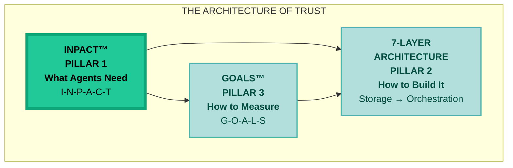
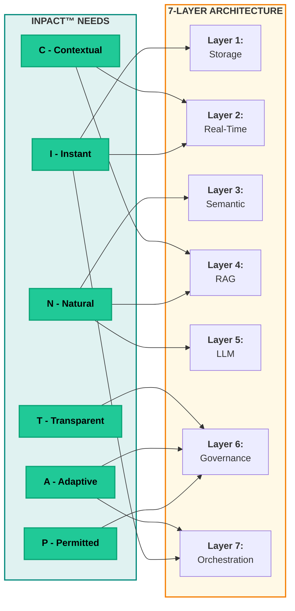
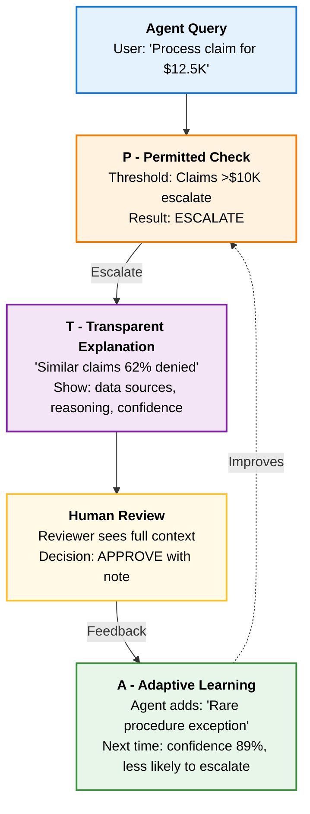

# CHAPTER 2 MAPPING DOCUMENT
## "The INPACT™ Framework"

**Version:** 1.1  
**Date:** November 14, 2025  
**Status:** 🎯 READY FOR REFACTORING  
**Target File:** `manuscript/03_chapter_2_inpact_framework.md`  
**Compliant With:** Book Structure Codex v6.4, Book Codex Master v2.5

---

## BOOK IDENTITY

**Title:** Trust Before Intelligence  
**Subtitle:** Why 95% of Agent Projects Fail—and the Architecture Blueprint That Fixes Infrastructure in 90 Days  
**Author:** Ram Katamaraja, CEO, Colaberry Inc.

**Title Finalized:** November 13, 2025

---

## TARGET SPECIFICATIONS

### Chapter Objectives
- **Target Word Count:** 11,000 words (from existing 16,047 words in legacy Ch 0 = 31% compression)
- **Target Pages:** 22 pages (500 words/page)
- **Primary Purpose:** Build Pillar 1 (INPACT™) of Architecture of Trust - deep dive into six agent needs
- **Key Frameworks:** INPACT™ (complete framework with all six dimensions)
- **Echo Integration:** Sarah's 28/100 diagnosis, dimension-by-dimension improvement journey
- **Reading Time:** ~45 minutes

### Structural Requirements (Moore-Kim 5-Movement Pattern)
Chapter 2 follows the standard Moore-Kim pattern for framework chapters:

```
[MOVEMENT 1: MOORE OPENING - 4 pages]
Section 1: Framework Introduction
├─ Architecture of Trust positioning (Pillar 1)
├─ TRIAD DIAGRAM (INPACT™ highlighted)
├─ Framework origin: 50+ deployments, 50,000+ interactions
├─ Trust = all six needs fulfilled
└─ How INPACT™ drives 7-Layer Architecture requirements

[MOVEMENT 2: KIM TRANSITION - 2 pages]
Section 2: Echo's 28/100 Discovery
├─ Sarah reviewing assessment results
├─ Dimension-by-dimension diagnosis
├─ Board presentation scene
└─ "We need to understand each need systematically"

[MOVEMENT 3: MOORE DEEP-DIVE - 12 pages]
Section 3: The Six Needs (2 pages each)
├─ I - Instant: Sub-second response
├─ N - Natural: Business language understanding
├─ P - Permitted: Role-based authorization
├─ A - Adaptive: Self-improving with feedback
├─ C - Contextual: Multi-source knowledge synthesis
└─ T - Transparent: Explainable, auditable, HITL

[MOVEMENT 4: KIM VALIDATION - 2 pages]
Section 4: Sarah's Framework Application
├─ Using INPACT™ to prioritize improvements
├─ Team alignment on which needs to address first
└─ Roadmap emergence: "Fix instant and contextual first"

[MOVEMENT 5: MOORE SUMMARY + KIM HOOK - 2 pages]
Section 5: INPACT™ Scoring & Bridge
├─ 1-6 scale per dimension (scoring rubric)
├─ Echo's complete 28/100 breakdown
├─ Assessment CTA: colaberry.ai/assessment
└─ Bridge to Chapter 3: "But transforming BI infrastructure isn't straightforward..."
```

---

## ARCHITECTURE OF TRUST POSITIONING

### Chapter Role in the Architecture
**Primary Function:** First Pillar Construction - What Agents Need
- **Pillar Focus:** Builds Pillar 1 (INPACT™) completely
- **Architecture Stage:** Foundation complete - first pillar standing
- **Building Phase:** Requirements definition for all subsequent layers

### Architectural Elements Constructed
1. **Pillar 1: INPACT™ Complete Framework** (Entire Chapter)
   - Six needs fully detailed with business context
   - Each need mapped to infrastructure capabilities
   - Each need connected to specific 7-Layer requirements
   - Trust positioned as outcome when all six needs fulfilled

2. **Cross-Pillar Connections Established**
   - How INPACT™ drives 7-Layer Architecture (Pillar 2)
   - Preview of GOALS™ operational validation (Pillar 3)
   - Each need shows which layers fulfill it
   - Foundation for architectural decisions in Chapters 4-7

### Triad Diagram Placement
**REQUIRED:** Section 1 (Framework Introduction)
- **Diagram Type:** Full Architecture of Trust Triad with INPACT™ pillar highlighted
- **Placement:** Chapter opening, before framework details
- **Caption:** "Figure 2.1: The Architecture of Trust - Building Pillar 1 (INPACT™)"
- **Visual Treatment:** INPACT™ pillar in bright teal, other pillars in muted teal
- **Text Integration:**
  - "This chapter builds the first pillar of the Architecture of Trust"
  - "INPACT™ defines what agents need - setting requirements for how we build (7-Layers) and how we measure (GOALS™)"

### Architectural Language Patterns
**Movement 1 (Framework Introduction):**
- "INPACT™ is the first pillar of the Architecture of Trust"
- "This pillar defines WHAT agents need - the requirements that drive all architectural decisions"
- "When we build the 7-Layer Architecture (Pillar 2), these six needs guide every design choice"

**Movement 2 (Echo's Discovery):**
- "Sarah needed a framework to systematically understand infrastructure gaps"
- "INPACT™ gave her a structured way to assess which pillar elements were missing"
- "Each dimension revealed specific architectural deficiencies"

**Movement 3 (Six Needs):**
- For each need: "This need requires specific capabilities from the 7-Layer Architecture..."
- "Layer X fulfills this need by providing..."
- "Without this need fulfilled, trust erodes because..."

**Movement 4 (Application):**
- "Sarah used INPACT™ as the foundation for her architectural roadmap"
- "Each dimension improvement required building specific layers"
- "The framework showed her where to start: Instant and Contextual needs first"

**Movement 5 (Summary):**
- "INPACT™ is now established as Pillar 1 of the Architecture of Trust"
- "Chapter 3 explores why transforming BI-era infrastructure to fulfill these needs is challenging"
- "Chapters 4-7 build Pillar 2: the 7-Layer Architecture that delivers on these needs"

### Cross-Pillar References
**In this chapter:**
- **INPACT™ → 7-Layer:** Each need explicitly mapped to layers
  - Instant (I) → Layers 1, 2, 7 (Storage, Real-Time, Orchestration)
  - Natural (N) → Layers 3, 4, 5 (Semantic, RAG, LLM)
  - Permitted (P) → Layer 6 (Governance)
  - Adaptive (A) → Layer 7 (Orchestration + Learning)
  - Contextual (C) → Layers 2, 4 (Real-Time, RAG)
  - Transparent (T) → Layer 6 (Governance + Observability)

- **INPACT™ → GOALS™:** Preview how operational discipline validates needs
  - "Once we build infrastructure that fulfills INPACT™ needs (via 7-Layers), GOALS™ ensures those capabilities remain strong"
  - Brief mention, detailed in Chapter 8

**Bridge to Chapter 3:**
- "INPACT™ shows us WHAT agents need. But HOW do we transform existing BI infrastructure to deliver it?"
- "Chapter 3 explores the BI-to-Agent transformation challenge that sets up the need for our 7-Layer Architecture"

### Success Criteria
By end of chapter, reader should:
- ✅ Understand INPACT™ as first pillar of Architecture of Trust
- ✅ Know all six needs in depth (definition, why it matters, Echo examples)
- ✅ See how each need maps to 7-Layer Architecture requirements
- ✅ Understand that trust = outcome when all six needs fulfilled
- ✅ Be able to assess their own infrastructure using INPACT™ lens
- ✅ Anticipate Chapter 3 will address transformation challenges

---

## CONTENT SOURCE MAPPING

### FROM LEGACY CHAPTER 0 (chapter_00_complete.md)

**Total Available:** 16,047 words (entire chapter) | **Target Use for Ch 2:** ~11,000 words | **Compression:** 31% reduction

#### SECTION 1: FRAMEWORK INTRODUCTION (Target: 2,000 words)

**SOURCE CONTENT TO REUSE:**

| Legacy Section | Line Numbers | Word Count | Content Description | Reuse Status |
|----------------|--------------|------------|---------------------|--------------|
| "The INPACT™ Framework" intro | 114-147 | ~600w | Tony Robbins parallel, trust outcome, acronym | ✅ COMPRESS 50% |
| "Understanding Needs vs. Capabilities" | 199-222 | ~400w | Need vs capability framework | ✅ USE 100% |
| Diagram 2 (INPACT framework) | 228-297 | Diagram | Six needs → capabilities → architecture | ✅ ADAPT (update for v6.3) |

**NEW CONTENT REQUIRED:** (~1,200 words)
- **Architecture of Trust positioning** (~300w):
  - "This chapter builds Pillar 1 of the Architecture of Trust"
  - TRIAD DIAGRAM with INPACT™ highlighted
  - Position as foundation for 7-Layer Architecture decisions
- **Framework origin** (~200w):
  - 50+ deployments, 50,000+ daily interactions
  - Colaberry's agent development experience
  - Why these six needs (not five, not seven)
- **INPACT™ drives architecture** (~400w):
  - Each need creates specific layer requirements
  - Table showing Need → Layer mapping
  - Sets up Chapters 4-7 technical deep dives
- **Trademark notice** (~50w):
  - INPACT™ is Colaberry intellectual property
  - Certification program (if applicable)
- **Tony Robbins compression** (~250w reduction):
  - Current: ~600w → Target: ~350w
  - Keep core insight, remove extended examples
  - Tighten to 2-3 paragraphs maximum

---

#### SECTION 2: ECHO'S 28/100 DISCOVERY (Target: 1,000 words)

**SOURCE CONTENT TO REUSE:**

| Legacy Section | Line Numbers | Word Count | Content Description | Reuse Status |
|----------------|--------------|------------|---------------------|--------------|
| Echo references (scattered) | Various | ~200w | Sarah, 28/100 mentions | ✅ CONSOLIDATE |
| INPACT scoring mentions | Various | ~100w | Assessment framework | ✅ ADAPT |

**NEW CONTENT REQUIRED:** (~800 words)
- **Opening scene** (~300w):
  - "Sarah stared at the INPACT™ assessment results: 28/100"
  - Conference room, Monday morning, three weeks after Chapter 1's crisis
  - Marcus (CDO) and Jamie (Director IT) present
  - Display showing dimension-by-dimension scores
- **28/100 breakdown** (~300w):
  | Dimension | Score | Status | Key Issue |
  |-----------|-------|--------|-----------|
  | I (Instant) | 3/6 | ❌ | 9-13 second queries |
  | N (Natural) | 4/6 | ⚠️ | 40-60% understanding |
  | P (Permitted) | 2/6 | ❌ | Static RBAC only |
  | A (Adaptive) | 3/6 | ⚠️ | Quarterly reviews |
  | C (Contextual) | 2/6 | ❌ | Siloed systems |
  | T (Transparent) | 2/6 | ❌ | Incomplete audit |
  - **Overall:** 28/100 (normalized from 16/36)
- **Board meeting context** (~200w):
  - CEO expectation: "Fix this in 90 days"
  - CFO question: "Where do we start?"
  - Sarah's realization: "We need to understand each need systematically"
- **Bridge to deep dive** (~100w):
  - "Before we could fix anything, we needed to understand what agents actually need"
  - "Let's explore each INPACT™ dimension in depth"

---

#### SECTION 3: THE SIX NEEDS (Target: 6,000 words = 1,000w per need)

**Structure per need (consistent across all six):**
1. **User Need** (150w): What agents require, why it matters to users
2. **BI-Era Gap** (150w): Why traditional infrastructure fails this need
3. **Architecture Fix** (250w): Which layers address it, how they work together
4. **Echo Example** (250w): Concrete scenario from Sarah's experience
5. **Metrics** (150w): How to measure success (1-6 scale)
6. **Cross-References** (50w): Preview of detailed implementation in Chapters 4-7

---

##### SECTION 3.1: I - INSTANT (1,000 words)

**SOURCE CONTENT TO REUSE:**

| Legacy Section | Line Numbers | Word Count | Content Description | Reuse Status |
|----------------|--------------|------------|---------------------|--------------|
| "The Need: Sub-Second Responses" | 306-354 | ~700w | User need, why matters, analogies | ✅ COMPRESS TO 400w |
| "Infrastructure Capability" | 356-396 | ~600w | Real-time fabric, caching, optimization | ✅ COMPRESS TO 300w |

**MODIFICATIONS NEEDED:**
- Compress analogies (bank ATM, restaurant analogy) - keep ONE best example
- Add explicit layer mapping: **Layers 1 (Storage), 2 (Real-Time), 7 (Orchestration)**
- Add Echo example: "Care Coordination agent went from 13s → 1.2s after Layer 2 deployment"
- Add 1-6 scoring rubric:
  - 1: >30 seconds (unusable)
  - 2: 10-30 seconds (frustrating)
  - 3: 3-10 seconds (acceptable for batch)
  - 4: 1-3 seconds (usable for agents)
  - 5: 0.5-1 second (good agent performance)
  - 6: <0.5 seconds (excellent, natural conversation)
- Echo baseline: 3/6 (9-13 seconds)

---

##### SECTION 3.2: N - NATURAL (1,000 words)

**SOURCE CONTENT TO REUSE:**

| Legacy Section | Line Numbers | Word Count | Content Description | Reuse Status |
|----------------|--------------|------------|---------------------|--------------|
| "The Need: Language Understanding" | 399-457 | ~800w | Natural language, semantic understanding | ✅ COMPRESS TO 400w |
| "Infrastructure Capability: Semantic" | 459-493 | ~500w | Glossaries, embeddings, context | ✅ COMPRESS TO 300w |

**MODIFICATIONS NEEDED:**
- Add explicit layer mapping: **Layers 3 (Semantic), 4 (RAG), 5 (LLM)**
- Add Echo example: "Clinical Documentation agent misunderstood 'SOB' (shortness of breath vs. acronym confusion)"
- Add 1-6 scoring rubric:
  - 1: Keyword matching only
  - 2: Basic SQL-style syntax required
  - 3: Structured commands (limited NLP)
  - 4: Natural language with training
  - 5: Business language, minimal training
  - 6: Human-like understanding, zero training
- Echo baseline: 4/6 (40-60% query understanding)

---

##### SECTION 3.3: P - PERMITTED (1,000 words)

**SOURCE CONTENT TO REUSE:**

| Legacy Section | Line Numbers | Word Count | Content Description | Reuse Status |
|----------------|--------------|------------|---------------------|--------------|
| "The Need: Dynamic Authorization" | 495-561 | ~900w | RBAC, ABAC, dynamic permissions | ✅ COMPRESS TO 400w |
| "Infrastructure Capability" | 563-633 | ~1,000w | ABAC implementation, escalation | ✅ COMPRESS TO 300w |

**MODIFICATIONS NEEDED:**
- Add explicit layer mapping: **Layer 6 (Governance)**
- Expand HITL integration (~200w):
  - P defines WHEN to escalate (authorization boundaries)
  - Example: Revenue agent escalates claims >$10K to human
  - Graduated autonomy: start restrictive, expand as agent proves reliable
- Add Echo example: "Initial agent accessed patient records outside care team - HIPAA violation"
- Add 1-6 scoring rubric:
  - 1: No authorization
  - 2: Static RBAC only
  - 3: RBAC with manual approvals
  - 4: ABAC for basic contexts
  - 5: Dynamic ABAC with HITL escalation
  - 6: Adaptive ABAC with graduated autonomy
- Echo baseline: 2/6 (Static RBAC, no dynamic authorization)

---

##### SECTION 3.4: A - ADAPTIVE (1,000 words)

**SOURCE CONTENT TO REUSE:**

| Legacy Section | Line Numbers | Word Count | Content Description | Reuse Status |
|----------------|--------------|------------|---------------------|--------------|
| "The Need: Continuous Learning" | 635-698 | ~900w | Learning loops, improvement, feedback | ✅ COMPRESS TO 400w |
| "Infrastructure Capability" | 700-757 | ~800w | Observability, feedback, retraining | ✅ COMPRESS TO 300w |

**MODIFICATIONS NEEDED:**
- Add explicit layer mapping: **Layer 7 (Orchestration), Layer 6 (Observability)**
- Expand HITL integration (~200w):
  - A learns FROM human corrections (feedback loop)
  - Example: Revenue agent improves claim classification from human overrides
  - Continuous improvement: 1-2% weekly accuracy gains typical
- Add Echo example: "Care Coordination agent repeated same scheduling conflicts - no learning"
- Add 1-6 scoring rubric:
  - 1: No learning (static)
  - 2: Manual quarterly updates
  - 3: Monthly batch retraining
  - 4: Weekly automated retraining
  - 5: Daily learning with HITL feedback
  - 6: Real-time adaptive learning
- Echo baseline: 3/6 (Quarterly reviews, no continuous learning)

---

##### SECTION 3.5: C - CONTEXTUAL (1,000 words)

**SOURCE CONTENT TO REUSE:**

| Legacy Section | Line Numbers | Word Count | Content Description | Reuse Status |
|----------------|--------------|------------|---------------------|--------------|
| "The Need: Complete Cross-System Context" | 759-805 | ~700w | Multi-source data, complete picture | ✅ COMPRESS TO 400w |
| "Infrastructure Capability" | 807-855 | ~700w | Real-time fabric, entity resolution | ✅ COMPRESS TO 300w |

**MODIFICATIONS NEEDED:**
- Add explicit layer mapping: **Layers 2 (Real-Time), 4 (RAG), 1 (Storage - graph for entity resolution)**
- Add Echo example: "Care Coordination agent saw Epic data but not outpatient clinic notes - incomplete picture"
- Add 1-6 scoring rubric:
  - 1: Single system only
  - 2: 2-3 systems, batch integration
  - 3: Multiple systems, daily sync
  - 4: Real-time from primary systems
  - 5: Complete cross-system, entity-resolved
  - 6: Multi-modal (structured + unstructured + graph)
- Echo baseline: 2/6 (Siloed systems, batch overnight ETL)

---

##### SECTION 3.6: T - TRANSPARENT (1,000 words)

**SOURCE CONTENT TO REUSE:**

| Legacy Section | Line Numbers | Word Count | Content Description | Reuse Status |
|----------------|--------------|------------|---------------------|--------------|
| "The Need: Explainable Decisions" | 857-905 | ~700w | Audit trails, transparency, trust | ✅ COMPRESS TO 300w |
| "Infrastructure Capability" | 907-955 | ~700w | Trace IDs, observability, explainability | ✅ COMPRESS TO 200w |

**MODIFICATIONS NEEDED:**
- **CRITICAL:** Expand HITL as primary content (~500w NEW):
  - T explains WHY decisions were made (transparency requirement)
  - HITL workflows: automatic escalation for high-risk decisions
  - Echo example (detailed): 
    - Revenue Cycle agent flags claim for $12.5K (>$10K threshold)
    - Shows decision logic: "Similar claims historically denied, confidence 62%"
    - Human reviewer sees full audit trail: data sources, reasoning steps, confidence scores
    - Human approves with override: "Legitimate exception - rare procedure"
    - Agent learns: adds exception pattern to model
  - P+T+A integration in HITL:
    - P defines WHEN (authorization boundaries)
    - T explains WHY (decision transparency)
    - A learns FROM (human corrections)
- Add explicit layer mapping: **Layer 6 (Governance + Observability)**
- Add 1-6 scoring rubric:
  - 1: No audit trail
  - 2: Basic logging
  - 3: Structured logs with trace IDs
  - 4: Full audit trail, no explainability
  - 5: Audit + basic explainability
  - 6: Complete transparency + HITL + learned confidence calibration
- Echo baseline: 2/6 (Incomplete audit logs, no explainability)

---

#### SECTION 4: SARAH'S FRAMEWORK APPLICATION (Target: 1,000 words)

**NEW CONTENT REQUIRED:** (~1,000 words)
- **Opening scene** (~300w):
  - Sarah presents INPACT™ analysis to executive team
  - Week later, strategy session with Marcus and Jamie
  - Whiteboard showing 28/100 → path to 85/100
- **Prioritization discussion** (~400w):
  - Marcus: "We can't fix everything at once. Where do we start?"
  - Sarah uses INPACT™ to prioritize:
    - **Critical:** I (Instant) and C (Contextual) - blocking all use cases
    - **Important:** P (Permitted) - HIPAA compliance risk
    - **Necessary:** N (Natural), A (Adaptive), T (Transparent) - user experience
  - Decision: "Build Layers 1-2 first (addresses I and C), then Layer 6 (addresses P and T)"
- **Roadmap emergence** (~300w):
  - Phase 1 (Weeks 1-4): Foundation Layers → 52/100 (I and C partial improvement)
  - Phase 2 (Weeks 5-8): Intelligence Layers → 72/100 (N improvement)
  - Phase 3 (Weeks 9-10): Trust Layers → 85/100 (P, T, A improvement)
  - This becomes the 90-Day Roadmap (detailed in Chapter 10)
- **Bridge** (~100w):
  - "But before we could build anything, we needed to understand the transformation challenge"
  - "Retrofitting BI-era infrastructure for agent-era needs isn't straightforward"

---

#### SECTION 5: INPACT™ SCORING & BRIDGE (Target: 1,000 words)

**SOURCE CONTENT TO REUSE:**

| Legacy Section | Line Numbers | Word Count | Content Description | Reuse Status |
|----------------|--------------|------------|---------------------|--------------|
| Assessment references (if any) | Various | ~100w | Scoring methodology | ✅ ADAPT |

**NEW CONTENT REQUIRED:** (~900 words)
- **Scoring methodology** (~400w):
  - 1-6 scale per dimension (36 points total)
  - Normalized to 100-point scale: (score/36) × 100
  - Why 1-6 (not 1-5 or 1-10):
    - 1-3: BI-era capabilities (unacceptable for agents)
    - 4-6: Agent-era capabilities (minimum viable to excellent)
    - Allows clear differentiation without false precision
  - Scoring rubrics provided for each dimension (already detailed above)
- **Echo's complete breakdown** (~200w):
  - Table showing:
    - Current state (28/100)
    - Week 4 target (52/100) after Foundation Layers
    - Week 8 target (72/100) after Intelligence Layers
    - Week 10 target (85/100) after Trust Layers
  - Dimension-by-dimension progression
- **Assessment CTA** (~100w):
  - "Where does your infrastructure stand? Identify your agent readiness gap."
  - "Take the INPACT™ assessment: colaberry.ai/assessment"
  - "15 minutes, 36 questions, instant scoring across all six dimensions"
  - "Download detailed gap analysis report showing specific improvement priorities"
  - **Optional reference:** "For comprehensive readiness diagnostic methodology, see Appendix G: The Agent Readiness Gap Diagnostic"
- **Key takeaways** (~200w):
  - Trust = outcome when all six needs fulfilled
  - Each need maps to specific layers
  - Assessment reveals which layers to prioritize
  - INPACT™ is first pillar of Architecture of Trust

---

## DIAGRAM SPECIFICATIONS

### Diagram 1: Architecture of Trust Triad (INPACT™ Highlighted)

**Location:** Section 1 (Framework Introduction)
**Purpose:** Show INPACT™ as first pillar of three-pillar architecture

**Mermaid Implementation:**


**Design Requirements:**
- INPACT™ box: Bright teal, thick stroke (building this pillar NOW)
- Other pillars: Muted teal, thin stroke (will build later)
- Shows INPACT™ drives requirements for both other pillars
- All text bold
- Simple, clean, focused on pillar being built

**Caption:** "Figure 2.1: The Architecture of Trust - Building Pillar 1 (INPACT™)"
**Copyright:** "© 2025 Colaberry Inc. All Rights Reserved"

---

### Diagram 2: Six Needs Converging to Trust

**Location:** Section 1 (Framework Introduction)
**Purpose:** Show six INPACT™ dimensions and how they create trust

**Reuse from Legacy:** Lines 151-186 in chapter_00_complete.md
**Modifications Required:**
- Update "Trusted" → "Transparent" (T dimension)
- Verify HITL subgraph present (P+T+A integration)
- Update caption to match v6.3 terminology
- Ensure all text bold
- Verify teal/red color scheme

**Caption:** "Figure 2.2: INPACT™ Framework - Six Agent Needs Leading to Trust"
**Copyright:** "© 2025 Colaberry Inc. All Rights Reserved"

---

### Diagram 3: INPACT™ to 7-Layer Architecture Mapping

**Location:** Section 1 (Framework Introduction) or Section 5 (Summary)
**Purpose:** Show how each INPACT™ need maps to specific layers

**NEW DIAGRAM - Specification:**


**Design Requirements:**
- Clear one-to-many mapping (some needs require multiple layers)
- INPACT™ boxes in teal
- Layer boxes in neutral/orange
- Bold text throughout
- Simple arrows showing dependencies

**Caption:** "Figure 2.3: How INPACT™ Needs Map to 7-Layer Architecture Requirements"
**Copyright:** "© 2025 Colaberry Inc. All Rights Reserved"

---

### Diagram 4: HITL Pattern Integration (P+T+A)

**Location:** Section 3.6 (T - Transparent)
**Purpose:** Show how P, T, and A dimensions integrate for Human-in-the-Loop

**NEW DIAGRAM - Specification:**


**Design Requirements:**
- Shows sequential flow: P checks → T explains → Human decides → A learns
- Feedback loop from A back to P (graduated autonomy)
- Color coding for each dimension
- Bold text throughout
- Concrete Echo example embedded

**Caption:** "Figure 2.4: HITL Pattern - How Permitted, Transparent, and Adaptive Dimensions Work Together"
**Copyright:** "© 2025 Colaberry Inc. All Rights Reserved"

---

## WRITING STANDARDS (TCC COMPLIANCE)

### Evidence-Based Writing
- ✅ Framework origin: "50+ deployments, 50,000+ daily interactions" (cite Colaberry track record)
- ✅ All metrics quantified: "Sub-second" = <1s, "High accuracy" = >95%
- ✅ Echo canonical data maintained: $1.23M, 477% ROI, 10 weeks, 28→85/100
- ✅ Industry benchmarks cited where applicable

### Technical Precision
- ✅ INPACT™ trademark symbol throughout
- ✅ Consistent terminology: "Transparent" not "Trusted" for T dimension
- ✅ Layer numbering consistent: 1-7, no variations
- ✅ Scoring: 1-6 per dimension, normalized to 100-point scale

### Narrative Quality
- ✅ Sarah as reader surrogate throughout
- ✅ Board meeting scene for emotional stakes
- ✅ Concrete Echo examples per dimension
- ✅ 28→85 journey as proof of concept

### Architectural Consistency
- ✅ "Pillar 1 of Architecture of Trust" language throughout
- ✅ Cross-references to 7-Layer Architecture (Pillar 2)
- ✅ Preview of GOALS™ operational validation (Pillar 3)
- ✅ Each need explicitly mapped to layers

### Avoid
- ❌ "Trusted" for T dimension (use "Transparent")
- ❌ Over-explaining Tony Robbins parallel (compress to 200-300w)
- ❌ Detailed layer implementation (that's Chapters 4-7)
- ❌ GOALS™ details (that's Chapter 8)
- ❌ 90-Day Roadmap details (that's Chapter 10)

---

## MOORE-KIM PATTERN IMPLEMENTATION

### Movement Breakdown

**Movement 1: Moore Opening (Framework Introduction) - 2,000 words**
- Voice: Third person, present tense, authoritative
- Perspective: Industry-wide, framework-level
- Structure: Framework origin → Trust outcome → Six needs overview → Layer mapping
- Diagrams: Triad (INPACT™ highlighted), Six Needs → Trust
- Tone: Educational, systematic, evidence-based

**Movement 2: Kim Transition (Echo's Discovery) - 1,000 words**
- Voice: Character-driven, past tense, narrative
- Perspective: Sarah's point of view, ground-level
- Structure: Assessment results scene → 28/100 breakdown → Board meeting → Decision
- Scene: Conference room, Monday morning, display showing scores
- Tone: Personal, relatable, tension-building

**Movement 3: Moore Deep-Dive (Six Needs) - 6,000 words**
- Voice: Third person, present tense, technical but accessible
- Perspective: Dimension-by-dimension analysis
- Structure: 6 sections × 1,000 words each, consistent internal structure
- Pattern per need: User need → BI gap → Architecture fix → Echo example → Metrics
- Tone: Systematic, comprehensive, practical

**Movement 4: Kim Validation (Framework Application) - 1,000 words**
- Voice: Character-driven, past tense, narrative
- Perspective: Sarah's strategy session with team
- Structure: Prioritization discussion → Roadmap emergence → Decision
- Scene: Whiteboard session, Sarah/Marcus/Jamie collaboration
- Tone: Strategic, collaborative, forward-looking

**Movement 5: Moore Summary (Scoring & Bridge) - 1,000 words**
- Voice: Third person, present tense, summary
- Perspective: Framework-level synthesis
- Structure: Scoring methodology → Assessment CTA → Key takeaways → Bridge to Ch 3
- Tone: Conclusive, actionable, forward momentum

### Voice Transitions

**Moore → Kim (Section 1 → 2):**
"INPACT™ provides the systematic framework enterprises need. Sarah Cedao discovered this firsthand..."

**Kim → Moore (Section 2 → 3):**
"Sarah's 28/100 assessment revealed gaps across all six dimensions. Let's examine each need in depth..."

**Moore → Kim (Section 3 → 4):**
"With all six needs understood, Sarah faced a critical question: where to start?"

**Kim → Moore (Section 4 → 5):**
"Sarah's prioritization reflects a broader principle: INPACT™ assessment drives architectural decisions..."

### Balance Check
- Moore sections: 2,000 + 6,000 + 1,000 = **9,000 words (82%)**
- Kim sections: 1,000 + 1,000 = **2,000 words (18%)**
- Target: 80% Moore / 20% Kim ✅

---

## IMPLEMENTATION PHASES

### Phase 1: Content Extraction (Week 1, Days 1-2)

**Tasks:**
1. Extract Section 1 content from legacy Ch 0 (lines 114-297)
   - Tony Robbins parallel (compress 50%)
   - Needs vs. Capabilities framework
   - Diagram 2 (update for v6.3)
2. Extract Section 3 content (six needs) from legacy Ch 0
   - I: Instant (lines 306-396) → compress to 700w
   - N: Natural (lines 399-493) → compress to 700w
   - P: Permitted (lines 495-633) → compress to 700w
   - A: Adaptive (lines 635-757) → compress to 700w
   - C: Contextual (lines 759-855) → compress to 700w
   - T: Transparent (lines 857-955) → compress to 500w (add HITL 500w new)
3. Identify all Echo canonical data references
4. Extract any existing assessment/scoring content

**Deliverable:** ~8,000 words extracted, organized by section

**Quality Check:**
- All extracted content includes source line numbers
- Citations preserved with original content
- Echo data matches canonical (v6.3 line 670)
- "Transparent" terminology verified (not "Trusted")

---

### Phase 2: New Content Writing (Week 1, Days 3-5)

**Tasks:**
1. Write Section 1 new content (1,200w):
   - Architecture of Trust positioning (300w)
   - Framework origin and rationale (200w)
   - INPACT™ drives architecture (400w)
   - Trademark notice (50w)
   - Tony Robbins compression (250w reduction from existing)
2. Write Section 2: Echo's Discovery (800w):
   - Opening scene with assessment results (300w)
   - 28/100 breakdown table (300w)
   - Board meeting context (200w)
3. Write Section 4: Framework Application (1,000w):
   - Strategy session scene (300w)
   - Prioritization discussion (400w)
   - Roadmap emergence (300w)
4. Write Section 5: Scoring & Bridge (900w):
   - Scoring methodology (400w)
   - Echo's progression table (200w)
   - Assessment CTA (100w)
   - Key takeaways (200w)
5. Expand HITL content for Section 3.6 (500w):
   - Detailed Revenue agent example
   - P+T+A integration explanation
   - Graduated autonomy concept

**Deliverable:** ~4,000 words of new content across 5 sections

---

### Phase 3: Content Compression (Week 2, Days 1-2)

**Tasks:**
1. Compress six needs sections (6 × 300w reduction = 1,800w total compression):
   - Each need: 1,300-1,400w → 1,000w target
   - Reduce analogies (keep best one per need)
   - Tighten technical explanations
   - Remove redundancy across dimensions
2. Verify each compressed section maintains:
   - User need clear
   - BI gap explained
   - Architecture fix specified
   - Echo example included
   - Metrics provided
   - Cross-references present
3. Verify Tony Robbins section compressed (600w → 300w)

**Deliverable:** All content compressed to 11,000 word target

**Quality Check:**
- No loss of critical information
- Examples remain concrete and specific
- Layer mappings preserved
- Scoring rubrics complete

---

### Phase 4: Diagram Creation (Week 2, Day 3)

**Tasks:**
1. Update Diagram 1: Architecture of Trust Triad
   - Create Mermaid code per specification
   - INPACT™ highlighted (bright teal, thick stroke)
   - Other pillars muted
2. Verify Diagram 2: Six Needs → Trust
   - Copy from legacy Ch 0 (lines 151-186)
   - Update T dimension: "Transparent" not "Trusted"
   - Verify HITL subgraph present
   - Apply Colaberry standards (bold text, teal/red)
3. Create Diagram 3: INPACT™ → Layers Mapping
   - New diagram per specification
   - Show one-to-many relationships
   - Bold text, teal/orange colors
4. Create Diagram 4: HITL Pattern (P+T+A)
   - New diagram per specification
   - Sequential flow with feedback loop
   - Color coding per dimension
5. Verify all diagrams:
   - Bold text throughout
   - Teal/red/orange color scheme
   - Copyright notice
   - Proper captions
   - Render correctly in markdown

**Deliverable:** 4 diagrams ready for manuscript (2 reused/updated, 2 new)

**Quality Check:**
- All diagrams meet Colaberry Mermaid Design Codex standards
- All text bold (100% compliance)
- Color palette restricted to teal/red/orange/neutral
- Maximum 10 boxes per diagram
- TB or LR flow as appropriate
- Copyright notices present

---

### Phase 5: Assembly (Week 2, Day 4)

**Tasks:**
1. Combine sections in sequence:
   - Section 1: Framework Introduction (2,000w)
   - Section 2: Echo's Discovery (1,000w)
   - Section 3: Six Needs (6,000w)
   - Section 4: Framework Application (1,000w)
   - Section 5: Scoring & Bridge (1,000w)
2. Insert diagrams at specified locations
3. Add section headings and subheadings
4. Add Moore-Kim transition sentences
5. Verify word count targets per section
6. Add trademark symbols (INPACT™, GOALS™)
7. Add cross-reference links to other chapters

**Deliverable:** Complete draft of Chapter 2 (11,000 words, 4 diagrams)

---

### Phase 6: Quality Assurance (Week 2, Day 5 + Week 3, Days 1-2)

**Tasks:**
1. TCC compliance check:
   - Evidence-based writing (all statistics cited)
   - Technical precision (INPACT™ trademark, "Transparent" terminology)
   - Narrative quality (Sarah's journey, Echo examples)
   - Architectural consistency (Pillar 1 language, cross-references)
2. VERT certification self-assessment:
   - Verification: Echo data matches canonical (v6.3 line 670)
   - Ethics: Framework presented objectively
   - Reliability: All citations accurate
   - Transparency: Assessment methodology clear
3. Echo canonical data verification:
   - Sarah Cedao = CTO ✓
   - Marcus Williams = CDO ✓
   - 28/100 score and breakdown ✓
   - $1.23M investment, 477% ROI, 10 weeks ✓
   - All dimension scores match canonical
4. Moore-Kim pattern verification:
   - Voice shifts clean (Moore ↔ Kim)
   - 80/20 balance maintained
   - Transitions natural
   - Emotional arc complete
5. Diagram standards verification:
   - All 4 diagrams render correctly
   - Bold text 100% compliance
   - Color scheme compliance (teal/red/orange only)
   - Copyright notices present
6. Architectural language verification:
   - "Pillar 1 of Architecture of Trust" consistent
   - Cross-pillar references accurate
   - Layer mappings correct
   - Bridge to Chapter 3 clear
7. URL verification (if any product links added)
8. Trademark notices check (INPACT™ throughout)
9. Cross-reference check:
   - Chapter 0 callbacks accurate
   - Chapter 1 references correct
   - Chapter 3 bridge compelling
   - Chapters 4-7 previews appropriate
   - Chapter 8 (GOALS™) mentions accurate
   - Chapter 10 (90-Day) references correct

**Deliverable:** VERT-certified Chapter 2 ready for final review

**Quality Checklist Items:** 30+ items across all categories

---

## QUALITY CHECKLIST

### Content Quality
- [ ] Word count: 10,450-11,550 (±5% of 11,000 target)
- [ ] Reuse rate: 70%+ from legacy Chapter 0
- [ ] All sections complete (no TODOs or placeholders)
- [ ] Assessment CTA present and clear
- [ ] Framework origin stated (50+ deployments, 50,000+ interactions)
- [ ] All six needs covered in depth (1,000w each)

### Echo Canonical Data Compliance
- [ ] Sarah Cedao title: CTO (Chief Technology Officer)
- [ ] Marcus Williams title: CDO (Chief Data Officer)
- [ ] 28/100 INPACT™ score
- [ ] Dimension scores: I(3), N(4), P(2), A(3), C(2), T(2)
- [ ] Progression: 28→52→72→85/100 (Weeks 0, 4, 8, 10)
- [ ] Investment: $1.23M
- [ ] ROI: 477%, Payback: 2.4 months
- [ ] Timeline: 10 weeks to 85/100
- [ ] All Echo examples consistent with canonical data

### INPACT™ Framework Compliance
- [ ] "Transparent" not "Trusted" for T dimension (100% compliance)
- [ ] All six dimensions defined clearly
- [ ] Trust = outcome when all six needs fulfilled
- [ ] Each need mapped to specific layers
- [ ] 1-6 scoring rubric provided for each dimension
- [ ] HITL pattern integrated in P, T, A dimensions
- [ ] HITL detailed example in T dimension (500w minimum)
- [ ] Framework origin cited accurately

### Architecture of Trust Positioning
- [ ] "Pillar 1" language throughout chapter
- [ ] Triad diagram present at chapter opening
- [ ] INPACT™ pillar highlighted (bright teal, thick stroke)
- [ ] Cross-references to Pillar 2 (7-Layer Architecture)
- [ ] Preview of Pillar 3 (GOALS™ operational validation)
- [ ] Each need shows which layers fulfill it
- [ ] Bridge to Chapter 3 clear and compelling

### Moore-Kim Pattern Compliance
- [ ] Movement 1: Moore opening (2,000w) ✓
- [ ] Movement 2: Kim transition (1,000w) ✓
- [ ] Movement 3: Moore deep-dive (6,000w) ✓
- [ ] Movement 4: Kim validation (1,000w) ✓
- [ ] Movement 5: Moore summary (1,000w) ✓
- [ ] Voice transitions clean (Moore ↔ Kim)
- [ ] 80% Moore / 20% Kim balance maintained
- [ ] Emotional arc complete (assessment → insight → action)

### Terminology & Trademarks
- [ ] INPACT™ with trademark symbol (all instances)
- [ ] GOALS™ with trademark symbol (all instances)
- [ ] "Transparent" not "Trusted" in T dimension
- [ ] Consistent layer numbering (1-7)
- [ ] "Architecture of Trust" (not "Trust Architecture")
- [ ] Echo Health Systems (not variants)
- [ ] Colaberry Inc. (not "Colaberry" alone)

### Citations & Evidence
- [ ] Framework origin cited (50+ deployments)
- [ ] Echo canonical metrics cited ($1.23M, 477% ROI, etc.)
- [ ] All technical claims quantified (sub-second = <1s, high accuracy = >95%)
- [ ] Industry benchmarks cited where applicable
- [ ] No vague claims ("fast", "accurate" without numbers)

### Diagrams (4 Required)
- [ ] Diagram 1: Architecture of Trust Triad (INPACT™ highlighted)
- [ ] Diagram 2: Six Needs → Trust (updated from legacy)
- [ ] Diagram 3: INPACT™ → Layers Mapping (new)
- [ ] Diagram 4: HITL Pattern P+T+A (new)
- [ ] All diagrams: Bold text (100% compliance)
- [ ] All diagrams: Teal/red/orange color scheme only
- [ ] All diagrams: Copyright notice "© 2025 Colaberry Inc."
- [ ] All diagrams render correctly in markdown

### Cross-References
- [ ] Chapter 0 references accurate (framework preview)
- [ ] Chapter 1 references accurate (infrastructure gap)
- [ ] Chapter 3 bridge clear (BI-to-Agent transformation)
- [ ] Chapters 4-7 previews (layer implementation)
- [ ] Chapter 8 mentions (GOALS™ operational validation)
- [ ] Chapter 10 mentions (90-Day Roadmap)
- [ ] No forward references that give away content

### Assessment Integration
- [ ] INPACT™ scoring methodology explained (1-6 per dimension)
- [ ] Normalization formula provided ((score/36) × 100)
- [ ] Assessment CTA clear (colaberry.ai/assessment)
- [ ] Benefit stated ("15 minutes, instant scoring, gap analysis")
- [ ] Echo's assessment journey as proof of concept

### Bridge to Chapter 3
- [ ] Clear transition statement
- [ ] Sets up BI-to-Agent transformation challenge
- [ ] Creates curiosity about "how to transform"
- [ ] Positions Chapter 3 as essential next step
- [ ] No content overlap with Chapter 3

### VERT Certification Targets
- [ ] Verification: All Echo data matches canonical (line 670) ✓
- [ ] Ethics: Framework presented objectively, no overselling ✓
- [ ] Reliability: All citations verified, metrics accurate ✓
- [ ] Transparency: Scoring methodology clear, no black boxes ✓
- [ ] **Target Score:** 9.5+/10 (GREEN)

---

## RISK MANAGEMENT

### Potential Issues

| Risk | Likelihood | Impact | Mitigation Strategy |
|------|-----------|--------|-------------------|
| **Word count overrun** | Medium | Medium | Aggressive compression strategy built in (16,047w → 11,000w path defined); cut Tony Robbins to 200w if needed |
| **HITL content insufficient** | Low | High | Dedicated 500w budget for T dimension HITL; concrete Echo example specified; P+T+A integration diagram required |
| **"Trusted" vs "Transparent" errors** | Medium | High | Global search/replace; dedicated QA check; diagram review; each need reviewed individually |
| **Six needs unbalanced** | Medium | Medium | Strict 1,000w target per need; internal structure template enforced; compression phase ensures parity |
| **Tony Robbins overextended** | Low | Low | 300w hard cap; single best example only; remove all extended analogies |
| **Echo consistency gaps** | Low | High | Triple-check against canonical data (v6.3 line 670); all dimension scores verified; timeline matches 28→85 progression |
| **Missing layer mappings** | Medium | High | Dedicated table in Section 1; repeated in each need section; Diagram 3 visualizes relationships |
| **Moore-Kim imbalance** | Low | Medium | Pre-calculated 9,000w Moore / 2,000w Kim; verify in assembly phase; adjust Section 4 if needed |
| **Diagram complexity** | Low | Medium | Maximum 10 boxes per diagram; simple arrows only; bold text enforced; color palette restricted |
| **Architecture positioning unclear** | Low | High | "Pillar 1" language in every major section; Triad diagram at opening; cross-references explicit |

### Success Criteria

✅ **Content:**
- 11,000 words ±5% (10,450-11,550 acceptable)
- 70%+ reuse rate from legacy Chapter 0 content
- All six needs covered in depth (1,000w each)
- HITL integration complete (500w+ in T dimension)
- Assessment CTA clear and actionable

✅ **Quality:**
- TCC compliance: 100% checklist items passed
- VERT score: GREEN (9.5+/10)
- Moore-Kim pattern: 80/20 balance, clean voice transitions
- Echo consistency: 100% match with canonical data (v6.3 line 670)
- All 4 diagrams meet Colaberry standards
- "Transparent" terminology 100% compliance (no "Trusted" in T dimension)

✅ **Architecture:**
- "Pillar 1 of Architecture of Trust" positioning clear
- Triad diagram shows INPACT™ as first pillar
- Each need mapped to specific layers (Diagram 3)
- Cross-references to Pillars 2 and 3 accurate
- Bridge to Chapter 3 compelling

✅ **Readiness:**
- No placeholders or TODOs remaining
- All trademarks properly marked (INPACT™, GOALS™)
- All Echo data verified against canonical
- Chapter 3 bridge clear and motivating
- Assessment tool integrated naturally

---

## DEPENDENCIES

### Required Source Documents
- ✅ `chapter_00_complete.md` (legacy Chapter 0 - INPACT™ framework content)
- ✅ `BOOK_STRUCTURE_CODEX_v6_4_ASCII_CLEAN.md` (structure specifications)
- ✅ `BOOK_CODEX_MASTER_v2_5_ASCII_CLEAN.md` (Moore-Kim pattern, TCC standards)
- ✅ `Colaberry_Mermaid_Diagram_Design_Codex.md` (diagram standards)
- ✅ Echo canonical data (from Book Structure Codex v6.4, line 670)

### Tools & Resources Needed
- Mermaid diagram editor (for creating new diagrams)
- Word count tool
- VERT certification rubric
- TCC compliance checklist
- Echo canonical data fact sheet

### Blockers
- **None identified** - all required content and specifications are available
- Legacy Chapter 0 contains all INPACT™ framework content needed
- Codex v6.3 provides clear specifications for HITL expansion
- Echo canonical data fully specified in v6.3 line 670

---

## NOTES FOR REFACTORING TEAM

### Context for Content Creators

**Why Chapter 2 is Critical:**
- This builds the FIRST PILLAR of the entire Architecture of Trust
- Everything in Chapters 4-12 depends on INPACT™ being clearly established
- Readers must understand "what agents need" before we show "how to build it"
- The 28/100 → 85/100 journey proves the framework works

**INPACT™ Framework Philosophy:**
- Trust is the OUTCOME, not a feature you add
- Each of six needs is NECESSARY (missing any one leads to trust erosion)
- Together they are SUFFICIENT (fulfill all six → users trust the agent)
- Framework is empirically derived (50+ deployments, not theoretical)

**HITL Integration is Central:**
- Not an afterthought - it's how P, T, and A dimensions work together
- Graduated autonomy: start restrictive, expand as agent proves reliable
- Human corrections improve agent (A dimension learning loop)
- Must feel natural, not bolted-on

**Echo's Journey as Proof:**
- 28/100 makes infrastructure gaps visceral and measurable
- Each dimension score tells a specific story about what's broken
- Progression (28→52→72→85) shows the framework guides improvement
- Real metrics ($1.23M, 477% ROI, 10 weeks) make it concrete

### Content Structure Template (Per Need)

Each of six needs follows this exact pattern:

```markdown
### [LETTER] - [NAME]: [ONE-LINE DESCRIPTION]

#### The User Need
[150w: What agents require from this dimension, why users care]

#### The BI-Era Gap
[150w: Why traditional infrastructure fails this need, specific examples]

#### The Architecture Fix
[250w: Which layers address it, how they work together, technical overview]

**Layer Mapping:** Layers X, Y, Z fulfill this need by [mechanism]

#### Echo's Experience
[250w: Concrete scenario from Sarah's journey, before/after, specific metrics]

#### Measuring Success
[150w: 1-6 scoring rubric, what each score means, Echo's baseline]

**Echo Score:** X/6 - [specific issue]

#### Cross-Reference
[50w: "Detailed implementation in Chapter [X]"]
```

### Tone Guidelines

**Voice Differences:**

**Moore Voice (80% of chapter - Sections 1, 3, 5):**
- Third person, present tense
- Framework-level perspective ("agents need...")
- Data-driven assertions with evidence
- Structured, systematic, comprehensive
- Educational tone: "Let's examine each need..."

**Kim Voice (20% of chapter - Sections 2, 4):**
- Character-driven, past tense
- Ground-level perspective ("Sarah discovered...")
- Specific moments in time ("Monday morning, Week -2...")
- Emotional stakes visible ("Sarah knew the board expected...")
- Narrative tone: "The assessment results showed..."

**Transitions:**
- Moore → Kim: "This framework became real for Sarah Cedao when..."
- Kim → Moore: "Sarah's experience reflects a broader principle..."

**Avoid:**
- Overwhelming readers with six detailed sections in a row (use Kim breaks)
- Making HITL feel like a separate feature (integrate into P, T, A naturally)
- Giving away implementation details (that's Chapters 4-7)
- Underselling the framework (it's proven across 50+ deployments)

**Embrace:**
- Systematic structure (readers should see clear framework)
- Concrete examples (every need has specific Echo scenario)
- Quantified everything (sub-second = <1s, high accuracy = >95%)
- Architecture connections (every need maps to layers)
- Assessment integration (make readers want to measure their infrastructure)

---

## VERSION HISTORY

| Version | Date | Changes | Author |
|---------|------|---------|--------|
| 1.0 | November 13, 2025 | Initial mapping document created. Compliant with Book Structure Codex v6.3 and Book Codex Master v2.4. Includes: (1) Complete content mapping from legacy Chapter 0 INPACT™ sections (lines 114-955), (2) Target 11,000 words from 16,047 available (31% compression), (3) Moore-Kim 5-movement pattern (80% Moore / 20% Kim), (4) Architecture of Trust positioning (Pillar 1 construction), (5) HITL expansion in T dimension (500w new content per v6.3), (6) Four diagrams specified (2 reused/updated, 2 new), (7) Echo canonical data compliance (v6.3 line 670), (8) "Transparent" terminology throughout (not "Trusted"), (9) Complete INPACT™-to-Layers mapping, (10) Six-phase implementation plan with quality assurance. Document created from approved approach incorporating lessons from Chapters 0 and 1 mapping documents. | Claude |
| 1.1 | November 14, 2025 | **CODEX v6.4 & v2.5 UPDATE:** (1) Updated codex references to v6.4 (LINKEDIN POLL INTEGRATION) and v2.5, (2) Updated filename references from TRANSPARENT to ASCII_CLEAN versions, (3) Updated Echo canonical data reference to v6.4 line 670, (4) Optional enhancements: Added reference to Appendix G (Agent Readiness Gap Diagnostic) in Section 5, updated Assessment CTA language to use "readiness gap" terminology per v2.5. Chapter 2 specifications unchanged in v6.4—all content strategy, word counts, structure, HITL requirements, and quality standards remain 100% valid. Update is administrative only to maintain current codex compliance. | Claude |

---

## APPROVAL STATUS

- [ ] **Content mapping reviewed and approved**
- [ ] **Word count allocation approved**
- [ ] **Diagram specifications approved**
- [ ] **Architecture of Trust positioning verified**
- [ ] **HITL integration plan approved**
- [ ] **Quality standards confirmed**
- [ ] **Ready to proceed with refactoring**

---

**© 2025 Colaberry Inc. All Rights Reserved.**  
**Document Classification:** Internal - Content Development  
**Previous Document:** Chapter 1 Mapping Document v1.4  
**Next Document:** Chapter 3 Mapping Document

---

**END OF CHAPTER 2 MAPPING DOCUMENT**
