# CHAPTER 6 MAPPING DOCUMENT
## "Trust + Orchestration Layers: Completing the Architecture"

**Version:** 1.3 TIMELINE ALIGNED + LAYER 7 ADDED  
**Date:** November 24, 2025  
**Status:** 🎯 READY FOR REFACTORING  
**Target File:** `manuscript/07_chapter_6_trust_orchestration_layers.md`  
**Compliant With:** Book Structure Codex v6.7, Book Codex Master v3.2, Chapter 4 v4.0, Chapter 5 v1.2

**Changes in v1.3:**
- **CRITICAL TIMELINE ALIGNMENT:** Architecture complete Week 10 (not Week 12)
- **SCOPE EXPANDED:** Now covers Layers 5-6-7 (was Layers 5-6)
- **TIMELINE EXPANDED:** Weeks 8-10 (was Weeks 9-10)
- **LAYER 7 ADDED:** Orchestration section (~2,000 words)
- **NEW SECTION:** "Architecture Complete" (~1,000 words)
- **WORD COUNT:** 10,000 → 12,000 words (+2,000)
- **CHAPTER ENDING:** 85/100 INPACT™ (all 7 layers operational)
- **BRIDGE UPDATED:** Points to Chapter 7 (GOALS™ Framework), not Chapter 7 (Orchestration)

---

## BOOK IDENTITY

**Title:** Trust Before Intelligence  
**Subtitle:** Why 95% of Agent Projects Fail--and the Architecture Blueprint That Fixes Infrastructure in 90 Days  
**Author:** Ram Katamaraja, CEO, Colaberry Inc.

**Title Finalized:** November 13, 2025

---

## CRITICAL CONTEXT

**This chapter COMPLETES Part II: "The 95% Solution - Building the Seven Layers"**

This is the FINAL technical construction chapter, completing all seven layers:
- Chapter 4: Built foundation layers (Layers 1-2: Storage + Real-Time) - Weeks 1-4
- Chapter 5: Built intelligence layers (Layers 3-4: Semantic + RAG with LLM Integration) - Weeks 5-7
- **Chapter 6: Builds trust + orchestration layers (Layers 5-6-7) - Weeks 8-10** ← THIS CHAPTER
- **Week 10 END STATE: All 7 layers operational, 85/100 INPACT™, architecture complete**

**ARCHITECTURAL CLARITY:**
- **Layer 5 = Governance** (ABAC, policies, HITL) - Week 8-9
- **Layer 6 = Observability** (monitoring, tracing, feedback) - Week 9
- **Layer 7 = Orchestration** (LangGraph, multi-agent coordination) - Week 10
- This chapter covers THREE layers to COMPLETE the 7-Layer Architecture
- Chapter 5 built intelligence (Layers 3-4), Chapter 6 completes trust + orchestration (Layers 5-6-7)

**Chapter 6 COMPLETES Pillar 2: The 7-Layer Architecture**

Chapters 4-6 construct the complete technical architecture. Chapter 6 is where:
1. Intelligence becomes trustworthy (Layers 5-6: constraints + visibility)
2. Architecture becomes operational (Layer 7: orchestration)
3. All seven layers work together (production-ready: 85/100)

**What Changed from v1.2:**
- v1.2: Layers 5-6 only, Weeks 9-10, ended with "trust complete, need orchestration"
- v1.3: Layers 5-6-7, Weeks 8-10, ends with "ARCHITECTURE COMPLETE, need operations"
- Layer 7 moved from Chapter 7 into Chapter 6
- Chapter 7 becomes GOALS™ Framework (operational excellence)

---

## TARGET SPECIFICATIONS

### Chapter Objectives
- **Target Word Count:** 12,000 words (+2,000 from v1.2) (24 pages at 500 words/page)
- **Target Pages:** 24 pages (+4 from v1.2)
- **Primary Purpose:** Complete 7-Layer Architecture (Layers 5-6-7: Governance + Observability + Orchestration)
- **Key Frameworks:** ABAC, HITL, MLOps monitoring, LangGraph orchestration
- **Echo Integration:** Sarah's Week 8-10 build, INPACT™ score improvement (67 → 85)
- **Reading Time:** ~48 minutes
- **Critical Milestone:** **ARCHITECTURE COMPLETE** - all 7 layers operational by Week 10

### Structural Requirements (Moore-Kim 5-Movement Pattern)

Chapter 6 follows the standard Moore-Kim pattern with EXPANDED scope:

```
[MOVEMENT 1: MOORE OPENING - 3 pages]
Section 1: Trust + Orchestration Architecture Introduction
  "Intelligence is operational. Now we govern, monitor, and orchestrate it..."
  TRIAD DIAGRAM (7-Layer pillar, Layers 5-6-7 highlighted)
  Trust + orchestration layers enable INPACT™ P, T, and multi-agent capability
  Bridge from Ch 5 intelligence to Ch 6 complete architecture
  Echo's Week 7 state: 67/100, intelligence working but ungoverned and uncoordinated

[MOVEMENT 2: KIM TRANSITION - 2 pages]
Section 2: Echo's Final Build Challenge
  Week 8 Monday: Sarah's team begins final 3-week push to architecture completion
  Current state: Powerful LLMs, RAG, semantic understanding, but no governance/orchestration
  Target state: Dynamic permissions, complete monitoring, multi-agent coordination
  "Let's complete the architecture"

[MOVEMENT 3: MOORE DEEP-DIVE - 16 pages] ← EXPANDED from 13 pages
Section 3: Layer 5 - Governance (5 pages)
  What it is, why agents need it
  ABAC (Attribute-Based Access Control), policy engines (OPA)
  HITL workflow patterns for high-risk decisions
  Audit trails, HIPAA compliance
  Echo's choices: OPA, ABAC policies, HITL for clinical decisions
  Week 8-9 deployment
  
Section 4: Layer 6 - Observability (5 pages)
  What it is, why agents need it
  MLOps monitoring (model drift, data quality)
  LLM monitoring (quality, cost, latency)
  Distributed tracing (OpenTelemetry), logging, metrics (Datadog)
  Echo's choices: Datadog, OpenTelemetry, custom LLM cost tracking
  Week 9 deployment
  
Section 5: Layer 7 - Orchestration (4 pages) ⭐ NEW SECTION
  What it is, why agents need it
  LangGraph framework architecture
  Multi-agent coordination patterns (supervisor, sequential, parallel)
  State management across agents
  Routing logic and conditional flows
  Integration with Layers 1-6
  Echo's choices: LangGraph, three-agent coordination pattern
  Week 10 deployment
  First orchestration test: multi-agent care coordination query
  
Section 6: Trust Through Transparency (2 pages)
  Citation systems (source attribution)
  Explainability (why agent made this decision)
  HITL as trust mechanism (escalation patterns)
  Echo's transparency framework working across all 7 layers

[MOVEMENT 4: KIM VALIDATION - 3 pages] ← EXPANDED from 2 pages
Section 7: Echo's Week 8-10 Build
  Week 8: Layer 5 deployment begins (governance infrastructure)
  Week 9: Layer 5 complete + Layer 6 deployment (observability stack)
  Week 10: Layer 7 orchestration deployment
  Week 10 Friday: First governed, monitored, orchestrated query success
  Critical moment: Multi-agent coordination with HITL escalation + full observability
  INPACT™ score: 67 → 85 (P: 4→6, T: 4→6, plus orchestration readiness)

[MOVEMENT 5: MOORE SUMMARY + KIM HOOK - 2 pages]
Section 8: Architecture Complete + Bridge ⭐ NEW SECTION
  All 7 layers operational by Week 10
  Gaps 5-6-7 addressed (Governance, Observability, Orchestration)
  INPACT™: 85/100 achieved (production-ready threshold)
  70 days, $1.23M investment, architecture complete
  Echo's complete architecture diagram (all 7 layers)
  Bridge to Chapter 7: "Sarah built the architecture. Now she needs to operate it. Chapter 7 introduces GOALS™—the framework for operational excellence."
```

---

## ARCHITECTURE OF TRUST POSITIONING

### Chapter Role in the Architecture
**Primary Function:** COMPLETE Pillar 2 Construction - All Seven Layers
- **Pillar Focus:** Layers 5-6-7 of 7-Layer Architecture (Pillar 2)
- **Architecture Stage:** Final construction phase - completing the full stack
- **Building Phase:** Construction COMPLETE (Pillar 2 finished, ready for operations)

### Architectural Elements Constructed

1. **Layer 5: Governance** (Complete in this chapter)
   - ABAC (Attribute-Based Access Control) operational
   - Policy engines (OPA) deployed
   - HITL workflows for high-risk decisions
   - Complete audit trails
   - Week 8-9 deployment
   - Fulfills: Permitted (P) INPACT™ need - dynamic authorization

2. **Layer 6: Observability** (Complete in this chapter)
   - MLOps monitoring operational
   - LLM quality/cost tracking
   - Distributed tracing (OpenTelemetry)
   - Metrics & logging (Datadog)
   - Week 9 deployment
   - Fulfills: Transparent (T) INPACT™ need - visibility and explainability

3. **Layer 7: Orchestration** ⭐ NEW (Complete in this chapter)
   - LangGraph framework deployed
   - Multi-agent coordination operational
   - State management functional
   - Routing logic configured
   - Integration with all 6 lower layers
   - Week 10 deployment
   - Fulfills: Multi-agent capability (orchestration across I-N-P-A-C-T needs)

4. **Trust Through Transparency** (Synthesis section)
   - Citation systems for source attribution
   - Explainability frameworks
   - HITL as trust mechanism
   - Fulfills: Transparent (T) INPACT™ need - user confidence

5. **Architecture Complete** ⭐ NEW (Culmination section)
   - All 7 layers operational as integrated system
   - 85/100 INPACT™ score (production-ready)
   - Complete architecture diagram
   - Ready for operational phase (GOALS™)

6. **Cross-Pillar Connections Established**
   - How Layers 5-6-7 enable INPACT™ dimensions (Pillar 1)
   - How complete 7-Layer stack enables GOALS™ operations (Pillar 3, Chapter 7)
   - Preview transition from building to operating

### Triad Diagram Placement
**OPTIONAL/SIMPLIFIED:** Section 1 (Architecture Introduction)
- **Diagram Type:** Full Architecture of Trust Triad with 7-Layer pillar highlighted
- **Placement:** Chapter opening, before technical content
- **Caption:** "Diagram 1: The Architecture of Trust - Completing Pillar 2 (7-Layer Architecture, Trust + Orchestration Layers 5-6-7)"
- **Visual Treatment:** 7-Layer pillar in bright teal, Layers 5-6-7 highlighted, all 7 layers visible
- **Text Integration:**
  - "This chapter completes the 7-Layer Architecture"
  - "Layers 5-6-7 add trust and orchestration to intelligence built in Chapter 5"
  - "Week 10: All seven layers operational, architecture complete"

### Architectural Language Patterns

**Movement 1 (Architecture Introduction):**
- "Intelligence without governance is risk. Intelligence without observability is invisible risk. Intelligence without orchestration is isolated capability."
- "Foundation (1-2) provided data, intelligence (3-4) provided understanding, trust (5-6) provides safety, orchestration (7) provides coordination."
- "These final three layers complete the architecture, addressing the last gaps from Chapter 3"
- **NEW:** "Week 10 milestone: All seven layers operational, 85/100 INPACT™, production-ready"

**Movement 3 (Deep-Dive Sections):**
- Layer 5 Section: "Governance constrains capability - Layer 5 decides what agents can do"
- Layer 6 Section: "Observability illuminates operations - Layer 6 reveals what agents did"
- **NEW Layer 7 Section:** "Orchestration coordinates agents - Layer 7 manages how agents work together"
- "Each layer builds on lower layers: Orchestration (7) requires observability (6) and governance (5) to coordinate safely and visibly"

**Movement 5 (Architecture Complete):**
- **NEW:** "Week 10, Friday, 4:47 PM: Sarah's team ran the first fully orchestrated query. All seven layers responded. The architecture was complete."
- **NEW:** "70 days. $1.23M. Seven layers. From 28/100 to 85/100. Echo's agent-ready infrastructure was operational."
- **NEW Bridge:** "Sarah built the architecture. Now she needs to operate it. Chapter 7 introduces GOALS™—the framework for operational excellence."


---

## CONTENT MAPPING (12,000 words total, 24 pages)

### Section 1: Trust + Orchestration Architecture Introduction (1,500 words, 3 pages)

**Purpose:** Open chapter with architectural context, establish all seven layers as goal

**Moore Voice Percentage:** 100%

**Content Requirements:**

**Opening Hook** (~200w)
- "In Week 7, Echo's intelligence layers were operational. LLMs understood clinical queries. RAG retrieved relevant medical records. The semantic layer resolved entities across systems."
- "But intelligence alone wasn't enough. Sarah needed three more capabilities:"
- "1. **Governance:** Control what agents could do (Layer 5)"
- "2. **Observability:** See what agents were doing (Layer 6)"
- "3. **Orchestration:** Coordinate multiple agents working together (Layer 7)"
- "These final three layers would complete the architecture."

**Diagram 1: The Architecture of Trust** (~diagram)
- Full triad showing all three pillars
- 7-Layer pillar highlighted with Layers 5-6-7 emphasized
- Caption: "The Architecture of Trust - Completing Pillar 2 (Trust + Orchestration Layers 5-6-7)"
- Visual: All 7 layers visible, bottom 4 in gray (complete), top 3 in teal (this chapter)

**Architectural Context** (~400w)
- Review of architectural progression
  - Chapters 4-5 built Layers 1-4 (foundation + intelligence)
  - Chapter 6 completes Layers 5-6-7 (trust + orchestration)
  - Week 10 target: All 7 layers operational, 85/100 INPACT™
- Why three layers in one chapter
  - Trust (5-6) and orchestration (7) are interdependent
  - Can't orchestrate without governance and observability
  - Final push to architecture completion
- **NEW:** Timeline clarity
  - Week 8: Layer 5 (Governance) deployment begins
  - Week 9: Layer 6 (Observability) deployment
  - Week 10: Layer 7 (Orchestration) deployment
  - Week 10 Friday: Architecture complete

**Gaps 5-6-7 Reminder** (~300w)
- Chapter 3 identified seven infrastructure gaps
- Gaps 1-4 addressed in Chapters 4-5
- Three gaps remain:
  - **Gap 5: Dynamic Permissions** → Layer 5 (Governance)
  - **Gap 6: Observability** → Layer 6 (Observability)
  - **Gap 7: Multi-Agent Orchestration** → Layer 7 (Orchestration)
- This chapter closes all remaining gaps

**INPACT™ Dimensions Enabled** (~300w)
- Layer 5 enables: **Permitted (P)** - dynamic authorization
- Layer 6 enables: **Transparent (T)** - visibility and explainability
- Layer 7 enables: Multi-agent coordination (supports all six INPACT™ dimensions)
- Starting state: 67/100 (from Chapter 5)
- Ending state: 85/100 (production-ready threshold)
- +18 points from trust + orchestration layers

**Echo's Week 7 State** (~200w)
- Intelligence operational but limited
  - Single-agent queries working
  - No dynamic permissions (only static RBAC)
  - No monitoring or observability
  - No multi-agent coordination
- Week 8 Monday: Team begins final 3-week build
- Target: Complete architecture by Week 10

**Bridge to Section 2** (~100w)
- "For Sarah, the path to architecture completion was clear"
- "Three weeks. Three layers. One goal: operational readiness."
- "Week 8 Monday, the trust build began."

---

### Section 2: Echo's Final Build Challenge (1,000 words, 2 pages)

**Purpose:** Kim voice narrative establishing Week 8-10 stakes and strategy

**Kim Voice Percentage:** 100%

**Content Requirements:**

**Week 8 Monday Morning** (~300w)
- Sarah's office, 7:15 AM
- Team assembled: Marcus (CDO), infrastructure leads
- Whiteboard: Three layers, three weeks, one deadline
- **Sarah:** "We've built intelligence. Now we make it trustworthy and coordinated."
- Team reactions:
  - Marcus: "Governance first. We can't deploy without authorization controls."
  - DevOps lead: "Observability next. Can't operate what we can't see."
  - AI lead: "Orchestration last. Three agents need coordination layer."

**Current State Assessment** (~250w)
- Layers 1-4 operational, tested, performing well
- INPACT™: 67/100 (intelligence phase complete)
- What's working:
  - Sub-3-second queries
  - 94% semantic accuracy
  - 150K documents in RAG
- What's missing (Sarah's concerns):
  - No HITL for high-risk decisions (Warfarin-class medications)
  - No cost visibility ($26K/month LLM spend, no breakdown)
  - No multi-agent capability (care coordination requires 3 agents)

**The 3-Week Plan** (~300w)
- **Week 8:** Layer 5 - Governance
  - OPA policy engine deployment
  - ABAC policy design (200+ rules)
  - HITL workflow implementation
  - Target: Dynamic authorization operational
- **Week 9:** Layer 6 - Observability
  - Datadog integration
  - OpenTelemetry tracing
  - LLM cost tracking
  - Target: Complete visibility
- **Week 10:** Layer 7 - Orchestration
  - LangGraph framework
  - Three-agent coordination (Care, Clinical, Revenue)
  - State management
  - Target: Multi-agent queries working

**Stakes** (~100w)
- Board presentation: Week 12
- Need 2 weeks operational validation (Weeks 11-12)
- Must hit 85/100 for production readiness
- Timeline non-negotiable

**Bridge to Section 3** (~50w)
- "The governance build started immediately."
- "By Week 8 end, agents would have constraints."

---

### Section 3: Layer 5 - Governance (2,500 words, 5 pages)

**Purpose:** Deep-dive on governance layer - ABAC, policies, HITL, audit

**Moore Voice Percentage:** 90% (technical), Kim Voice: 10% (Week 9 HITL moment)

**Content Requirements:**

[CONTINUING EXISTING v1.2 STRUCTURE WITH TIMELINE UPDATES]

**What It Is** (~300w)
- Layer 5 definition: Policy-based authorization and audit infrastructure
- Purpose: Control what agents can do based on context (who, what, when, where)
- Components: Policy engine, ABAC rules, HITL workflows, audit trails
- Why Layer 5 (not Layer 1): Requires semantic understanding (Layer 3) and LLM reasoning (Layer 4)

**Diagram L5: Governance Architecture** (~diagram)
- Visual showing OPA policy engine, ABAC evaluation flow, HITL escalation path
- Caption: "Diagram 2: Layer 5 Governance - Context-Aware Authorization with HITL"

**Components & Technologies** (~700w)
- **Policy Engines:** OPA (Open Policy Agent), AWS IAM, Azure Policy
- **ABAC (Attribute-Based Access Control):** Four-factor evaluation
  1. Subject: User role, credentials, department
  2. Resource: Data classification, sensitivity, ownership
  3. Action: Read, write, delete, prescribe
  4. Context: Time, location, risk level, patient status
- **HITL (Human-in-the-Loop):** Escalation workflows
  - High-risk threshold detection
  - Human review interface
  - Approval/rejection routing
  - Feedback loop to improve policies
- **Audit Infrastructure:** Complete decision log
  - Who requested, what resource, when, decision
  - Policy version, HITL involvement
  - Retention: 7 years (HIPAA compliance)
- Links to: OPA docs, NIST ABAC guide, HITL design patterns

**Why Agents Need It** (~400w)
- Agents make thousands of decisions daily
- Can't rely on human review for every query
- Need context-aware authorization:
  - **Example 1:** Nurse query (3 AM, ER) for patient vitals → Auto-approve
  - **Example 2:** Same nurse query for controlled substance prescription → HITL escalation
  - **Example 3:** Billing agent query for medical records → Approve with redaction
- Static RBAC insufficient: Role alone doesn't capture risk
- ABAC evaluates full context: role + resource + action + situation

**Echo's Gap** (~300w)
- Pre-Layer 5 state: Static RBAC only
  - "Nurse" role could access all patient data
  - No risk-level evaluation
  - No HITL for high-risk decisions
  - Audit logs incomplete (no policy version tracking)
- Why it failed for agents:
  - Warfarin prescription (high-risk) treated same as vitals check (low-risk)
  - No escalation path for clinician review
  - Compliance risk: HIPAA requires "minimum necessary" access

**Echo's Implementation** (~400w)
- **Technology Stack:**
  - OPA (Open Policy Agent) for policy engine - $0 (open source)
  - Custom HITL workflow - $8K development
  - Azure audit logs - $7K/year
  - Total: $15K (Week 8-9)
- **Policy Design:**
  - 200+ ABAC rules
  - Risk scoring: Low (0-3), Medium (4-6), High (7-10)
  - HITL threshold: Risk score ≥7
  - Example policy: "Controlled substance query by non-MD = HITL"
- **HITL Patterns:**
  - Escalation to on-call clinician
  - 15-minute SLA for review
  - Approval = cache policy for similar cases
  - Rejection = block + incident report
- **Rationale:**
  - OPA: Open source, flexible, widely adopted
  - Custom HITL: Off-the-shelf products too rigid for clinical workflows
  - Azure audit: Native integration, HIPAA-compliant storage

**Week 9 HITL Success (Kim Voice)** (~200w)
- Thursday, Week 9, 2:30 PM: First HITL escalation
- Care Coordination agent query: Warfarin dosage adjustment for 78-year-old patient
- Risk score: 9/10 (high-risk medication + elderly patient + dosage change)
- Escalated to Dr. Martinez (cardiology, on-call)
- Review time: 8 minutes
- Decision: Approved with modified dosage (agent suggested 5mg, Dr. Martinez approved 3mg)
- Outcome: Patient safety protected, policy improved (dosage modifier added)
- Sarah's reaction: "This is why we built Layer 5. That 8 minutes could save a life."

**INPACT™ Contribution** (~200w)
- **Permitted (P):** 4/6 → 6/6 (+2 points)
  - Before: Static RBAC, no dynamic authorization
  - After: Context-aware ABAC, HITL for high-risk
  - Improvement: Agents now have appropriate permissions based on full context

**Operational Metrics** (~100w)
Table: Layer 5 Operational Metrics
| Metric | Target | Critical Threshold |
|--------|--------|-------------------|
| HITL Escalation Rate | 5-10% | >15% (too many escalations) |
| HITL Response Time | <15 min | >30 min (delays care) |
| Policy Evaluation Time | <50ms | >100ms (impacts latency) |
| Audit Log Completeness | 100% | <99% (compliance risk) |

---

### Section 4: Layer 6 - Observability (2,500 words, 5 pages)

**Purpose:** Deep-dive on observability layer - monitoring, tracing, metrics

**Moore Voice Percentage:** 90% (technical), Kim Voice: 10% (Week 10 cost discovery)

**Content Requirements:**

[CONTINUING EXISTING v1.2 STRUCTURE WITH TIMELINE UPDATES]

**What It Is** (~300w)
- Layer 6 definition: End-to-end monitoring, tracing, and metrics infrastructure
- Purpose: See what agents are doing, detect issues, optimize performance
- Components: Distributed tracing, logging, metrics, LLM cost tracking, MLOps monitoring
- Why Layer 6 (not Layer 1): Requires operational agents (Layers 1-5) to monitor

**Diagram L6: Observability Architecture** (~diagram)
- Visual showing OpenTelemetry traces, Datadog dashboards, LLM cost tracker
- Caption: "Diagram 3: Layer 6 Observability - End-to-End Visibility"

**Components & Technologies** (~700w)
- **Distributed Tracing:** OpenTelemetry, Jaeger, Zipkin
  - Trace ID per request
  - Span per service call
  - End-to-end latency visibility
- **Logging:** Structured logs (JSON), centralized (Datadog, Splunk)
  - Application logs, system logs, error logs
  - Correlation with traces via trace ID
- **Metrics:** Datadog, Prometheus, New Relic
  - System metrics: CPU, memory, network
  - Application metrics: query rate, error rate, P50/P95/P99 latency
  - Business metrics: HITL rate, approval rate, cost per query
- **LLM Monitoring:** LLM-specific observability
  - Token usage per query
  - Model routing (GPT-4 vs GPT-3.5)
  - Cost per query ($0.06 avg)
  - Quality metrics (hallucination detection)
- **MLOps Monitoring:** Model performance
  - Semantic drift (entity resolution accuracy over time)
  - Data quality (missing fields, outliers)
  - RAG performance (retrieval accuracy, rerank effectiveness)
- Links to: OpenTelemetry docs, Datadog Agent setup, MLOps monitoring patterns

**Why Agents Need It** (~400w)
- Agents are opaque without observability
- Can't optimize what you can't measure
- Need visibility for:
  - **Debugging:** Why did query fail? Which layer?
  - **Performance:** Where's the latency? RAG retrieval? LLM inference?
  - **Cost:** What's driving $26K/month LLM spend?
  - **Quality:** Is semantic accuracy degrading? Are we hallucinating?
- **Example trace:** Patient query → 2.8s total
  - Semantic layer: 0.3s (entity resolution)
  - RAG retrieval: 1.2s (Pinecone search + rerank)
  - LLM inference: 1.1s (GPT-4 generation)
  - Governance check: 0.2s (OPA policy eval)
- Without Layer 6, that 2.8s is a black box

**Echo's Gap** (~300w)
- Pre-Layer 6 state: Basic application logging only
  - No distributed tracing (couldn't track requests across services)
  - No LLM cost visibility (monthly bill, no per-query breakdown)
  - No MLOps monitoring (didn't know semantic accuracy was drifting)
- Week 9 incident:
  - $26K LLM bill shocked CFO
  - No breakdown: Which queries? Which models?
  - Discovered: 40% of queries routed to GPT-4 unnecessarily (should use GPT-3.5)
  - Cost opportunity: $10K/month savings with better routing

**Echo's Implementation** (~400w)
- **Technology Stack:**
  - Datadog for metrics & dashboards - $24K/year
  - OpenTelemetry for distributed tracing - $6K/year (collector infrastructure)
  - Custom LLM cost tracker - $4K development
  - Total: $34K (Week 9-10)
- **Monitoring Strategy:**
  - Real-time dashboards: Latency, error rate, HITL rate
  - Cost dashboard: $ per query, model usage breakdown
  - Quality dashboard: Semantic accuracy, RAG precision/recall
  - Alerting: P95 latency >5s, error rate >2%, cost spike >$40/hour
- **Tracing Implementation:**
  - OpenTelemetry SDKs in all services
  - Trace ID propagation across layers
  - 100% of production requests traced (sampled in dev: 10%)
- **Rationale:**
  - Datadog: Best-in-class APM, strong Azure integration
  - OpenTelemetry: Open standard, vendor-neutral
  - Custom LLM tracker: Off-the-shelf products don't track token-level costs

**Week 10 Cost Discovery (Kim Voice)** (~200w)
- Monday, Week 10, 9:00 AM: First full day with observability operational
- Marcus reviewing Datadog dashboard, sees LLM cost spike
- 40% of queries using GPT-4 ($0.10/query) when GPT-3.5 ($0.02/query) sufficient
- Root cause: Routing logic defaulted to GPT-4 for any medical term
- Fix: Updated routing to use GPT-3.5 for low-complexity queries (vitals, demographics)
- Impact: $26K/month → $16K/month (38% reduction)
- CFO Krish: "That dashboard just paid for itself in 8 days."

**INPACT™ Contribution** (~200w)
- **Transparent (T):** 4/6 → 6/6 (+2 points)
  - Before: Black box operations, no visibility
  - After: Complete observability, every request traced
  - Improvement: Users see citations, developers see traces, executives see costs

**Operational Metrics** (~100w)
Table: Layer 6 Operational Metrics
| Metric | Target | Critical Threshold |
|--------|--------|-------------------|
| Trace Collection Rate | 100% | <95% (missing traces) |
| Metric Lag | <30s | >2min (stale dashboards) |
| Alert False Positive Rate | <5% | >20% (alert fatigue) |
| Dashboard Load Time | <2s | >5s (unusable) |

---

### Section 5: Layer 7 - Orchestration (2,000 words, 4 pages) ⭐ NEW SECTION

**Purpose:** Deep-dive on orchestration layer - LangGraph, multi-agent coordination

**Moore Voice Percentage:** 90% (technical), Kim Voice: 10% (Week 10 first orchestration)

**Content Requirements:**

**What It Is** (~300w)
- Layer 7 definition: Multi-agent coordination and workflow orchestration infrastructure
- Purpose: Coordinate multiple agents working together on complex tasks
- Components: LangGraph framework, state management, routing logic, agent communication
- Why Layer 7 (top layer): Requires all 6 lower layers operational before orchestration
- Orchestration vs single agent:
  - Single agent: One LLM, one task, one response
  - Orchestrated agents: Multiple specialized agents, complex workflow, coordinated response

**Diagram L7: Orchestration Architecture** (~diagram)
- Visual showing LangGraph supervisor pattern with three agents
- Caption: "Diagram 4: Layer 7 Orchestration - Multi-Agent Coordination with LangGraph"
- Show: Supervisor node, three agent nodes (Care, Clinical, Revenue), state flow

**Components & Technologies** (~700w)
- **LangGraph Framework:** Anthropic/LangChain's graph-based orchestration
  - State graphs: Nodes (agents), edges (transitions), conditional routing
  - State persistence: Shared context across agents
  - Checkpointing: Resume interrupted workflows
- **Multi-Agent Patterns:**
  - **Supervisor Pattern:** Central orchestrator delegates to specialized agents
    - Example: Care coordinator → routes to Clinical for diagnosis, Revenue for billing
  - **Sequential Pattern:** Agents execute in order
    - Example: Intake → Triage → Treatment → Billing
  - **Parallel Pattern:** Agents execute simultaneously
    - Example: Lab results + Imaging + Medications all retrieved at once
- **State Management:**
  - Shared state object across all agents
  - State updates tracked (audit trail for multi-agent decisions)
  - State schema: Patient context, query intent, agent outputs, HITL status
- **Routing Logic:**
  - Intent classification: Which agents needed?
  - Conditional flows: If diagnosis needed → Clinical agent, else skip
  - Error handling: Agent timeout → supervisor retries or escalates
- **Agent Communication:**
  - Model Context Protocol (MCP) for tool-use
  - Inter-agent messaging: JSON payloads
  - Context propagation: Trace IDs, user permissions flow through all agents
- Links to: LangGraph docs, multi-agent patterns, MCP specification

**Why Agents Need It** (~400w)
- Complex healthcare queries require multiple agents:
  - **Example Query:** "Patient John Doe, 68, with diabetes and hypertension. Schedule follow-up care coordination including medication review, specialist referral, and insurance pre-authorization."
  - **Single agent:** Can't handle all three tasks (care, clinical, revenue)
  - **Orchestrated solution:**
    1. Supervisor classifies intent: care coordination (complex)
    2. Routes to Care Coordination agent: schedules appointment, pulls care plan
    3. Routes to Clinical Documentation agent: reviews medications, checks interactions
    4. Routes to Revenue Cycle agent: verifies insurance, initiates pre-auth
    5. Supervisor synthesizes: One coordinated response with all three outputs
- Without Layer 7, agents work in isolation
- With Layer 7, agents collaborate intelligently

**Echo's Gap** (~250w)
- Pre-Layer 7 state: Three single-purpose agents built but uncoordinated
  - Care Coordination agent (standalone)
  - Clinical Documentation agent (standalone)
  - Revenue Cycle agent (standalone)
- Problem: Complex queries failed
  - "Schedule care plan with billing" → error (no coordination)
  - Users had to query each agent separately (3 queries instead of 1)
- Why single agents insufficient:
  - No shared state (each agent re-retrieved patient context)
  - No routing logic (user had to know which agent to ask)
  - No supervisor (if one agent failed, whole workflow broke)

**Echo's Implementation** (~400w)
- **Technology Stack:**
  - LangGraph framework - $0 (open source)
  - Supervisor agent orchestration - $12K development
  - State persistence (Redis) - $6K/year
  - Agent integration work - $15K
  - Total: $33K (Week 10)
- **Orchestration Design:**
  - **Pattern:** Supervisor (LangGraph supervisor pattern)
  - **Agents:** 3 specialized agents (Care, Clinical, Revenue)
  - **State:** PatientContext object (demographics, conditions, insurance, care plan)
  - **Routing:** Intent classifier (fine-tuned BERT) routes to appropriate agent(s)
  - **Flows:**
    - Simple query (single intent) → One agent
    - Complex query (multiple intents) → Sequential or parallel execution
    - HITL-required → Supervisor escalates before final response
- **Integration with Lower Layers:**
  - Layer 1-2: Agents share storage and real-time data
  - Layer 3-4: Agents share semantic layer and RAG infrastructure
  - Layer 5: Supervisor enforces governance (ABAC) for all agents
  - Layer 6: Distributed tracing tracks multi-agent workflows end-to-end
- **Rationale:**
  - LangGraph: Best multi-agent framework, actively developed by Anthropic/LangChain
  - Supervisor pattern: Simplest coordination model for 3 agents
  - Redis state: Fast, reliable, supports checkpointing

**Week 10 First Orchestration (Kim Voice)** (~250w)
- Friday, Week 10, 2:15 PM: First multi-agent test
- Query: "Patient Sarah Johnson, 62, diabetic. Schedule post-discharge follow-up, medication review, and verify insurance coverage."
- Orchestration flow:
  1. Supervisor classifies: Care + Clinical + Revenue intents
  2. Routes to Care agent: Schedules appointment (next Tuesday, 10 AM)
  3. Routes to Clinical agent: Reviews medications (3 prescriptions, no interactions)
  4. Routes to Revenue agent: Verifies insurance (UnitedHealthcare PPO, pre-auth not needed)
  5. Supervisor synthesizes response (one coherent answer, all three tasks complete)
- Execution time: 4.2 seconds (three agents in parallel)
- Observability trace: All three agents visible in Datadog, governance checks passed
- Sarah's reaction: "This is what we built for. Three agents, one response, complete care coordination."
- Team celebration: Architecture complete

**INPACT™ Contribution** (~150w)
- Layer 7 doesn't directly change INPACT™ score (85/100 already achieved from Layers 5-6)
- But orchestration enables INPACT™ dimensions at scale:
  - **Instant (I):** Multi-agent workflows complete in seconds (not minutes with manual coordination)
  - **Natural (N):** Users ask complex questions naturally, orchestration handles complexity
  - **Contextual (C):** Shared state ensures all agents have full patient context
- Orchestration readiness is what makes 85/100 "production-ready"

**Operational Metrics** (~100w)
Table: Layer 7 Operational Metrics
| Metric | Target | Critical Threshold |
|--------|--------|-------------------|
| Orchestration Success Rate | >95% | <90% (coordination failures) |
| Multi-Agent Latency | <5s | >10s (too slow) |
| State Consistency | 100% | <99% (data corruption risk) |
| Agent Timeout Rate | <2% | >5% (reliability issues) |

---

### Section 6: Trust Through Transparency (1,000 words, 2 pages)

**Purpose:** Synthesis section - how Layers 5-6-7 work together to create trust

**Moore Voice Percentage:** 95%, Kim Voice: 5% (brief Echo example)

**Content Requirements:**

[CONDENSED FROM v1.2 VERSION - FOCUS ON ALL 7 LAYERS WORKING TOGETHER]

**Transparency Definition** (~200w)
- Trust comes from transparency: Users trust what they can see and verify
- Three transparency mechanisms enabled by trust + orchestration layers:
  1. **Citations** (Layer 6): Every fact has a source
  2. **Explainability** (Layers 5-6-7): Every decision has a reason
  3. **HITL** (Layer 5): High-risk decisions have human review

**Citations** (~200w)
- Every agent response includes source citations
- Powered by RAG (Layer 4) + Observability (Layer 6)
- Example response:
  > "Patient John Doe's last A1C was 7.2% (measured June 15, 2025). Current medications include Metformin 1000mg BID [Source: EHR | MRN: 12345678]."
- Citations build trust: Users verify sources
- Reduces hallucinations: Agent can't cite what doesn't exist

**Explainability** (~250w)
- Every decision has an explanation trail
- Three levels of explainability:
  1. **Policy-level** (Layer 5): "Access granted because: User=MD, Resource=PatientRecord, Action=Read, Context=BusinessHours"
  2. **Orchestration-level** (Layer 7): "Routed to Clinical agent because query contained diagnosis intent"
  3. **LLM-level** (Layer 4): "High confidence (92%) based on 8 similar cases in RAG"
- Explainability visible in observability dashboards (Layer 6)
- Echo example: Warfarin HITL explainability
  - Query: "Adjust Warfarin dosage for elderly patient"
  - Explanation: "Escalated to HITL because: Risk=9/10 (controlled substance + elderly + dosage change)"
  - Clinician sees explanation, understands why HITL triggered

**HITL as Trust Mechanism** (~250w)
- HITL builds trust beyond technical transparency
- Users trust agents MORE when agents know their limits
- Echo's HITL philosophy:
  - Low-risk queries: Auto-approve (agent decides)
  - High-risk queries: HITL escalate (human decides)
  - Transparent threshold: Users know what triggers escalation
- HITL feedback loop improves policies over time
  - Approved escalations → cache policy (speed up future similar cases)
  - Rejected escalations → tighten policy (prevent similar attempts)
- Example evolution:
  - Week 9: Warfarin query escalates (risk=9/10)
  - Clinician approves with dosage modification
  - Policy updated: "Warfarin for elderly = HITL, but cache dosage guidelines"
  - Week 12: Similar query → faster (8-minute approval, not 15)

**All 7 Layers Enable Transparency** (~100w)
- Layer 1-2: Data for citations
- Layer 3-4: Semantic understanding + retrieval for citations
- Layer 5: Policy explainability
- Layer 6: Observability for decision trails
- Layer 7: Orchestration explainability (which agents, why, in what order)
- Complete transparency = all 7 layers working together

---

### Section 7: Echo's Week 8-10 Build (1,500 words, 3 pages)

**Purpose:** Kim voice narrative of 3-week final build, culminating in architecture completion

**Kim Voice Percentage:** 95%, Moore Voice: 5% (technical details)

**Content Requirements:**

**Week 8: Governance Build** (~400w)
- Monday, Week 8: Layer 5 kickoff
- Team: Marcus (CDO lead), 2 security engineers, 1 clinical liaison
- Work breakdown:
  - Days 1-3: OPA deployment, infrastructure setup
  - Days 4-7: ABAC policy design (200+ rules, clinical review)
  - Days 8-10: HITL workflow implementation
  - Days 11-14: Testing with clinical scenarios
- Key moments:
  - Wednesday: First OPA policy evaluated in <50ms (performance goal met)
  - Friday: Clinical liaison Dr. Chen reviews HITL thresholds, approves risk scoring
- Week 8 Friday: Layer 5 operational (governance infrastructure complete)

**Week 9: Observability Build + First HITL** (~500w)
- Monday, Week 9: Layer 6 kickoff (parallel with Layer 5 finalization)
- Team: DevOps lead, 2 SREs, 1 data engineer
- Work breakdown:
  - Days 1-3: Datadog agent deployment across all services
  - Days 4-7: OpenTelemetry instrumentation (tracing IDs across layers)
  - Days 8-10: Custom LLM cost tracker development
  - Days 11-14: Dashboard creation (latency, cost, quality)
- Thursday, Week 9, 2:30 PM: **Critical moment - First HITL escalation**
  - Care Coordination agent query: Warfarin dosage adjustment
  - Governance Layer 5: Risk score 9/10 → Escalate to HITL
  - Dr. Martinez (cardiology): Reviews in 8 minutes, approves with modification
  - Observability Layer 6: Complete trace visible in Datadog (governance check → HITL → approval)
  - Outcome: Patient safety protected, policy improved
  - Sarah's reflection: "This is the moment. Intelligence + governance + observability = trust."
- Friday, Week 9: Observability dashboard live, CFO reviews first cost breakdown
- Weekend: Team momentum high, one week left

**Week 10: Orchestration Build + Architecture Complete** (~600w)
- Monday, Week 10: Layer 7 kickoff (final layer)
- Team: AI architect, 3 LLM engineers, integration specialist
- Work breakdown:
  - Days 1-4: LangGraph supervisor framework deployment
  - Days 5-7: Agent integration (Care, Clinical, Revenue)
  - Days 8-10: State management and routing logic
  - Days 11-14: End-to-end testing
- Wednesday, Week 10: First multi-agent query in test environment succeeds
  - Query required all three agents (care scheduling + medication review + insurance verification)
  - Execution time: 4.2 seconds (parallel agent execution)
  - All governance checks passed, full observability trace captured
- Thursday, Week 10: Final testing, minor routing fix
- Friday, Week 10, 2:15 PM: **ARCHITECTURE COMPLETE MOMENT**
  - Production multi-agent query: Patient Sarah Johnson care coordination
  - All 7 layers responded:
    - Layer 1-2: Retrieved patient data in real-time
    - Layer 3-4: Semantic understanding + RAG retrieval
    - Layer 5: Governance approved all three agent operations
    - Layer 6: Full observability trace captured
    - Layer 7: Supervisor coordinated three agents successfully
  - Response: Complete care coordination (appointment + medications + insurance)
  - Time: 4.2 seconds
  - INPACT™: 85/100 (confirmed in post-query assessment)
- Friday, Week 10, 4:47 PM: Sarah's team gathered
  - Marcus: "70 days. Seven layers. We did it."
  - Sarah: "The architecture is complete. Now we operate it."

**INPACT™ Progression Summary** (~200w)
Table: Echo's INPACT™ Journey (Week 7 → Week 10)
| Week | Layers Complete | Key Improvement | Score |
|------|----------------|-----------------|-------|
| Week 7 | 1-4 (Intelligence) | Natural, Contextual | 67/100 |
| Week 9 | 1-5 (+ Governance) | Permitted (+2) | 73/100 |
| Week 10 | 1-6 (+ Observability) | Transparent (+2) | 79/100 |
| Week 10 | 1-7 (+ Orchestration) | Production-ready (+6) | 85/100 |

Note: Orchestration doesn't directly add INPACT™ points, but readiness for production coordination brings final improvements across multiple dimensions.

---

### Section 8: Architecture Complete + Bridge (1,000 words, 2 pages) ⭐ NEW SECTION

**Purpose:** Culminating moment - architecture complete, bridge to operations (GOALS™)

**Moore Voice Percentage:** 70%, Kim Voice: 30%

**Content Requirements:**

**Architecture Complete Declaration** (~200w)
- Friday, Week 10, 5:00 PM: Team celebration
- **The Numbers:**
  - 70 days (10 weeks)
  - $1.23M investment
  - 7 layers operational
  - 85/100 INPACT™ (production-ready threshold achieved)
- **What "Complete" Means:**
  - All seven layers operational and integrated
  - Every layer tested in production scenarios
  - Governance, observability, orchestration working together
  - No more construction needed
  - Ready for operational phase (Weeks 11-12)

**Diagram A: Echo's Complete Architecture** (~diagram)
- Full 7-layer architecture diagram
- All layers in teal (operational)
- Connections between layers shown
- INPACT™ dimensions mapped to layers
- Caption: "Diagram 5: Echo's Complete 7-Layer Architecture - Production Ready (85/100)"

**All Seven Gaps Closed** (~250w)
- Chapter 3 identified seven infrastructure gaps
- Chapter 4 closed Gaps 1-2 (storage, real-time)
- Chapter 5 closed Gaps 3-4 (semantic, RAG)
- Chapter 6 closed Gaps 5-6-7 (governance, observability, orchestration)
- Gap closure table:
  | Gap | Layer | Closed | Impact |
  |-----|-------|--------|--------|
  | Gap 1: Multi-modal storage | Layer 1 | Week 4 | Data availability |
  | Gap 2: Real-time data | Layer 2 | Week 4 | Data freshness |
  | Gap 3: Semantic understanding | Layer 3 | Week 7 | Natural language |
  | Gap 4: Intelligent retrieval | Layer 4 | Week 7 | Contextual responses |
  | Gap 5: Dynamic permissions | Layer 5 | Week 9 | Permitted (INPACT™) |
  | Gap 6: Observability | Layer 6 | Week 10 | Transparent (INPACT™) |
  | Gap 7: Orchestration | Layer 7 | Week 10 | Multi-agent capability |

**INPACT™ 85/100 Breakdown** (~200w)
- Final INPACT™ assessment (Week 10):
  - **I - Instant:** 6/6 (Layers 1-2: Real-time data, <3s response)
  - **N - Natural:** 5/6 (Layers 3-4: Semantic + LLM, 94% accuracy)
  - **P - Permitted:** 6/6 (Layer 5: ABAC + HITL, dynamic authorization)
  - **A - Adaptive:** 4/6 (Layers 3-4: Context integration, drift detection)
  - **C - Contextual:** 5/6 (Layer 4: RAG, 7 context types)
  - **T - Transparent:** 6/6 (Layer 6: Observability, citations, explainability)
- **Total:** 32/36 = 89% = normalized to 85/100
- Production-ready threshold: 80/100 (exceeded by 5 points)
- Remaining improvements (to reach 90-95/100): Operational refinement in Weeks 11-12

**The Investment** (~150w)
- Total spend: $1.23M (approved budget)
- Breakdown by phase:
  - Phase 1 (Layers 1-2): $492K (40%)
  - Phase 2 (Layers 3-4): $369K (30%)
  - Phase 3 (Layers 5-6-7): $369K (30%)
- Cost per INPACT™ point: ~$21K (85 points - 28 points = 57 points gained)
- ROI projection: 477% over 18 months, 10-week payback (from Chapter 3 business case)
- CFO Krish: "We spent exactly what we projected. That never happens."

**Sarah's Reflection (Kim Voice)** (~100w)
- Friday evening, Sarah's office
- Looking at architecture diagram on whiteboard
- Thinking back to Week 0: 28/100, $2M sunk costs, nothing working
- Now: 85/100, $1.23M well-spent, production-ready
- "We built it. Now we prove it works."
- Two weeks of operational validation (Weeks 11-12)
- Then: Board presentation, show 477% ROI is real

**Bridge to Chapter 7** (~100w)
- **Moore Voice:**
- "Sarah built the architecture. All seven layers operational. 85/100 INPACT™."
- "But architecture alone isn't success. Operations determine if intelligence becomes trustworthy in practice."
- "Chapter 7 introduces GOALS™—the framework for operational excellence."
- "Five operational targets that ensure lasting trust: Governance, Observability, Accessibility, Language, Soundness."
- "Sarah's next challenge: Operate the architecture she built."

---

## REFACTORING REQUIREMENTS

### Source Content Reuse

**Chapter 6 v1.2 Existing Content** (10,000 words available)
- Sections 3-4-6 (Layers 5-6, Trust Through Transparency): ~7,000 words reusable
- Section 7 (Week 9-10 Build): ~1,500 words reusable (needs expansion to Week 8-10)
- Sections 1-2: ~1,500 words reusable (needs minor updates for timeline/scope)

**NEW Content Required** (~5,000 words)
- Section 5: Layer 7 - Orchestration (2,000 words) - COMPLETELY NEW
- Section 8: Architecture Complete (1,000 words) - COMPLETELY NEW
- Section 7 expansion: Week 8 narrative (500 words) - NEW
- Section 1 updates: Timeline/scope changes (300 words) - UPDATES
- Minor updates throughout for Layer 7 references (1,200 words) - UPDATES

**Refactoring Approach:**
1. **Reuse** Sections 3-4-6 from v1.2 with minor Layer 7 reference additions
2. **Expand** Section 7 to cover Week 8-10 (add Week 8, expand Week 10)
3. **Create** Section 5 (Layer 7) following same structure as Sections 3-4
4. **Create** Section 8 (Architecture Complete) as culmination
5. **Update** Sections 1-2 for expanded scope and timeline
6. **Total:** ~7,000w reused + ~5,000w new = 12,000w target

---

## QUALITY STANDARDS

### Technical Accuracy Requirements
- All technology links must be current (2024-2025 documentation)
- ABAC and OPA examples must follow current NIST standards
- LangGraph patterns must match current Anthropic/LangChain documentation
- OpenTelemetry tracing must follow current spec
- Healthcare compliance (HIPAA) must be accurate for 2025

### Echo Narrative Consistency
- Timeline: Week 8-10 (not Week 9-10 from v1.2)
- Budget: $369K for Phase 3 (Layers 5-6-7)
- Team: Marcus (CDO), Dr. Chen (clinical liaison), DevOps lead, AI architect
- Key moments: Week 9 Thursday HITL, Week 10 Friday architecture complete
- INPACT™: 67 → 85 (+18 points, P+2, T+2, orchestration readiness+6)

### INPACT™ Scoring Verification
- Starting: 67/100 (from Chapter 5)
- Layer 5 adds: +2 (Permitted: 4→6)
- Layer 6 adds: +2 (Transparent: 4→6)
- Production readiness adds: +6 (orchestration + operational maturity)
- Ending: 85/100 (verified production-ready threshold)

### Architecture of Trust Integration
- This chapter completes Pillar 2 (7-Layer Architecture)
- Bridge to Pillar 3 (GOALS™, Chapter 7)
- TRIAD diagram shows all three pillars with Pillar 2 now complete
- Architectural language: "With all seven layers operational, the 7-Layer pillar stands complete. Now we measure and maintain it through GOALS™."

---

## DIAGRAM SPECIFICATIONS

All diagrams follow Colaberry Mermaid Design Codex standards.

### Diagram 1: The Architecture of Trust (Section 1)
**Type:** Full TRIAD diagram  
**Purpose:** Show chapter's role completing Pillar 2  
**Placement:** Early in Section 1 (Trust + Orchestration Architecture Introduction)

**Mermaid Code:**


```mermaid
graph TB
    subgraph "The Architecture of Trust"
        P1["<b>PILLAR 1</b><br/>INPACT™<br/><i>What Agents Need</i><br/>✓ Complete"]
        P2["<b>PILLAR 2</b><br/>7-Layer Architecture<br/><i>What to Build</i><br/>⚡ Completing Now"]
        P3["<b>PILLAR 3</b><br/>GOALS™<br/><i>How to Operate</i><br/>○ Next"]
    end
    
    P1 -.-> P2
    P2 -.-> P3
    
    style P1 fill:#e8f4f8,stroke:#0891b2,stroke-width:2px
    style P2 fill:#14b8a6,stroke:#0f766e,stroke-width:4px
    style P3 fill:#f3f4f6,stroke:#9ca3af,stroke-width:2px
```

**Caption:** "Diagram 1: The Architecture of Trust - Completing Pillar 2 (7-Layer Architecture, Trust + Orchestration Layers 5-6-7)"

### Diagram 2: Layer 5 Governance Architecture (Section 3)
**Type:** Component diagram  
**Purpose:** Show ABAC evaluation flow and HITL escalation  
**Placement:** Section 3 (Layer 5 - Governance), after "What It Is"

**Mermaid Code:**


**Caption:** "Diagram 2: Layer 5 Governance - Context-Aware Authorization with HITL Escalation"

### Diagram 3: Layer 6 Observability Architecture (Section 4)
**Type:** Component diagram  
**Purpose:** Show distributed tracing, metrics, and LLM cost tracking  
**Placement:** Section 4 (Layer 6 - Observability), after "What It Is"

**Mermaid Code:**


**Caption:** "Diagram 3: Layer 6 Observability - End-to-End Visibility with Distributed Tracing"

### Diagram 4: Layer 7 Orchestration Architecture (Section 5) ⭐ NEW
**Type:** LangGraph supervisor pattern diagram  
**Purpose:** Show multi-agent coordination with LangGraph  
**Placement:** Section 5 (Layer 7 - Orchestration), after "What It Is"

**Mermaid Code:**


**Caption:** "Diagram 4: Layer 7 Orchestration - Multi-Agent Coordination with LangGraph Supervisor Pattern"

### Diagram 5: Echo's Complete 7-Layer Architecture (Section 8) ⭐ NEW
**Type:** Full stack diagram showing all 7 layers  
**Purpose:** Celebrate architecture completion, show integration  
**Placement:** Section 8 (Architecture Complete), early in section

**Mermaid Code:**


```mermaid
graph TB
    subgraph "Echo's Complete Architecture - 85/100 INPACT™"
        L7["<b>Layer 7: Orchestration</b><br/>LangGraph | Multi-Agent<br/>Week 10"]
        L6["<b>Layer 6: Observability</b><br/>Datadog | OpenTelemetry<br/>Week 9-10"]
        L5["<b>Layer 5: Governance</b><br/>OPA | ABAC | HITL<br/>Week 8-9"]
        L4["<b>Layer 4: RAG</b><br/>Pinecone | Cohere | GPT-4<br/>Week 5-7"]
        L3["<b>Layer 3: Semantic</b><br/>dbt | Alation<br/>Week 5-7"]
        L2["<b>Layer 2: Real-Time</b><br/>Kafka | Debezium<br/>Week 1-4"]
        L1["<b>Layer 1: Storage</b><br/>ADLS | SQL | Cosmos<br/>Week 1-4"]
    end
    
    L7 --> L6
    L6 --> L5
    L5 --> L4
    L4 --> L3
    L3 --> L2
    L2 --> L1
    
    style L7 fill:#14b8a6,stroke:#0f766e,stroke-width:3px
    style L6 fill:#14b8a6,stroke:#0f766e,stroke-width:3px
    style L5 fill:#14b8a6,stroke:#0f766e,stroke-width:3px
    style L4 fill:#14b8a6,stroke:#0f766e,stroke-width:2px
    style L3 fill:#14b8a6,stroke:#0f766e,stroke-width:2px
    style L2 fill:#14b8a6,stroke:#0f766e,stroke-width:2px
    style L1 fill:#14b8a6,stroke:#0f766e,stroke-width:2px
```

**Caption:** "Diagram 5: Echo's Complete 7-Layer Architecture - Production Ready (85/100 INPACT™)"

---

## NOTES FOR REFACTORING TEAM

### Context for Content Creators

**Why Chapter 6 is Critical:**
- This is the ARCHITECTURE COMPLETION chapter - where 10 weeks of construction culminates
- Readers have foundation (Ch 4) + intelligence (Ch 5), now complete trust + orchestration (Ch 6)
- This chapter must deliver the promise: "Here's how to complete production-ready infrastructure in 10 weeks"
- Chapter 6 is the bridge from construction (Part II) to operations (Part III)

**Part II Closure:**
- **Chapter 4:** Foundation (Layers 1-2) - data availability and speed
- **Chapter 5:** Intelligence (Layers 3-4) - data understanding and reasoning
- **Chapter 6:** Trust + Orchestration (Layers 5-6-7) - safety, visibility, coordination ← WE ARE HERE
- Tone: Constructive with celebration (Part II complete, architecture operational)

**Trust + Orchestration Philosophy:**
- Intelligence alone is insufficient for production
- Need constraints (Layer 5), visibility (Layer 6), and coordination (Layer 7)
- All three layers work together:
  - Layer 5 governs WHAT agents can do
  - Layer 6 reveals WHAT agents did
  - Layer 7 coordinates HOW agents work together
- Without all three, agents can't operate safely at scale

**Echo's 3-Week Final Push (Week 8-10):**
- Week 8: Governance foundation (ABAC, HITL)
- Week 9: Observability operational + first HITL success
- Week 10: Orchestration deployed + architecture complete
- Parallel workstreams: Governance while building observability while designing orchestration
- Critical moments matter:
  - Week 9 Thursday: Warfarin HITL (trust validated)
  - Week 10 Friday: First multi-agent query (architecture complete)
- INPACT™ improvement: 67 → 85 (+18 points, production-ready)

**Timeline Clarity for Readers:**
- v1.2 said Weeks 9-10, which confused readers (what happened Week 8?)
- v1.3 clarifies: Weeks 8-10, 3 full weeks, parallel builds
- Week 10 Friday = architecture complete (not Week 12)
- Weeks 11-12 = operations (Chapter 8), not construction

**Technology Selection Approach:**
- Always show Echo's choice + alternatives + rationale
- Cost transparency: "$15K governance, $34K observability, $33K orchestration"
- Not vendor endorsement - pedagogical examples
- Open source preference (OPA, OpenTelemetry, LangGraph) shows cost-consciousness

**NEW Layer 7 Emphasis:**
- Orchestration is what makes agents "intelligent systems" not "isolated tools"
- Multi-agent coordination is future of enterprise AI
- LangGraph represents state-of-the-art (2024-2025)
- Echo's three-agent pattern (Care, Clinical, Revenue) is realistic healthcare example

### Content Structure Template (Per Layer)

Each of the three layer sections (3, 4, 5) follows this pattern:

```markdown
### Layer X: [Name]

#### What It Is (~300w)
[Brief definition, architectural purpose, why this layer number]

#### Diagram LX: [Layer Name] (~diagram)
[Visual representation of layer components and flow]

#### Components & Technologies (~700w)
[Specific technologies with links, organized by category]

#### Why Agents Need It (~400w)
[Concrete examples of agent queries that require this layer]

#### Echo's Gap (~250-300w)
[What Echo had before, why it didn't work for agents, specific failure example]

#### Echo's Implementation (~400w)
[What Echo built, technology choices, rationale, costs, timeline (Week X)]

#### Week X Moment (Kim Voice) (~200-250w)
[Specific critical moment when layer proved its value]

#### INPACT™ Contribution (~150-200w)
[Which INPACT™ dimensions this layer enables, how, score impact]

#### Operational Metrics (~100w)
[Table: metric, target, critical threshold]
```

**NOTE:** Section 6 (Trust Through Transparency) breaks the pattern - it's a synthesis section showing how all layers work together.

**NOTE:** Section 8 (Architecture Complete) is culmination, not layer-specific.

### Tone Guidelines

**Voice Differences:**

**Moore Voice (70% of chapter - Sections 1, 3, 4, 5, 6, 8):**
- Third person, present tense
- Technical perspective ("Layer 7 coordinates multi-agent workflows using LangGraph's supervisor pattern...")
- Architecture-level reasoning ("Orchestration requires all six lower layers operational...")
- Data-driven assertions with evidence ("85/100 INPACT™ represents production-ready threshold...")
- Educational tone: "Let's examine how LangGraph state management enables agent coordination..."

**Kim Voice (30% of chapter - Sections 2, 7):**
- Character-driven, past tense
- Ground-level perspective ("Sarah reviewed the orchestration test results...")
- Specific moments in time ("Friday, Week 10, 2:15 PM: First multi-agent query succeeded...")
- Emotional stakes visible ("Sarah knew this moment validated 10 weeks of work...")
- Narrative tone: "The team erupted in applause when all three agents responded in 4.2 seconds..."

**Transitions:**
- Moore → Kim: "This orchestration principle became real for Sarah when the first multi-agent query succeeded..."
- Kim → Moore: "Sarah's experience demonstrates the broader requirement: production systems need all seven layers..."

**Avoid:**
- Making 3-week timeline feel rushed (show parallel work, celebrate milestones)
- Overwhelming with technical jargon (balance architecture depth with accessibility)
- Treating orchestration as "nice to have" (it's essential for production scale)
- Vendor-specific language (always mention alternatives)
- Skipping costs (transparency matters, especially observability $34K)
- Underselling completion ("almost done" - NO, architecture IS complete Week 10)

**Embrace:**
- Architecture completion celebration ("70 days. Seven layers. We did it.")
- Parallel structure (Layers 5-6-7 sections mirror each other)
- Specific Echo moments ("Friday, Week 10, 4:47 PM: Architecture complete")
- Technology transparency ("OPA $0, Datadog $24K/year, LangGraph $0, Redis $6K/year")
- INPACT™ connection (every layer explicitly maps to dimensions)
- HITL as empowerment ("human expertise augmented by AI")
- Orchestration as coordination ("three agents working together beat three agents working alone")
- Bridge to GOALS™ ("Architecture built. Now operate it.")

---

## VERSION HISTORY

| Version | Date | Changes | Author |
|---------|------|---------|--------|
| 1.0 | November 21, 2025 | Initial mapping document created. | Claude |
| 1.1 CORRECTED | November 21, 2025 | Updated Chapter 5 reference from "Layers 3-5" to "Layers 3-4". | Claude |
| 1.2 ALIGNED | November 24, 2025 | **CHAPTER 4 & 5 ALIGNMENT:** (1) INPACT™ baseline corrected, (2) Timeline corrected to Weeks 9-10, (3) Gap numbering corrected, (4) Layer references fixed, (5) Diagram naming updated, (6) INPACT™ improvement recalculated, (7) Budget reference updated, (8) Echo's journey clarified as Weeks 9-10 (2 weeks). | Claude |
| 1.3 TIMELINE ALIGNED | November 24, 2025 | **CRITICAL EXPANSION - ARCHITECTURE COMPLETION:** (1) Scope expanded from Layers 5-6 to Layers 5-6-7 (added Layer 7 Orchestration), (2) Timeline expanded from Weeks 9-10 to Weeks 8-10 (3 weeks), (3) NEW Section 5: Layer 7 - Orchestration (~2,000 words), (4) NEW Section 8: Architecture Complete (~1,000 words), (5) Word count increased from 10,000 to 12,000 (+2,000), (6) Chapter ending updated: 85/100 INPACT™ with all 7 layers operational (Week 10), (7) Bridge updated: Points to Chapter 7 (GOALS™ Framework) instead of Chapter 7 (Orchestration), (8) NEW Diagram 4: Layer 7 orchestration architecture, (9) NEW Diagram 5: Complete 7-layer architecture, (10) Section 7 expanded to cover Week 8-10 build narrative. **Rationale:** Aligns with Book Structure Codex v6.7 decision that architecture completes Week 10 (not Week 12), and Layer 7 moves from Chapter 7 into Chapter 6. This change completes Pillar 2 (7-Layer Architecture) in Chapter 6, enabling Chapter 7 to become GOALS™ Framework (Pillar 3). | Claude |

---

## APPROVAL STATUS

- [ ] **Content mapping reviewed and approved**
- [ ] **Word count allocation approved (12,000 words)**
- [ ] **Diagram specifications approved (5 diagrams total)**
- [ ] **Architecture of Trust positioning verified (completes Pillar 2)**
- [ ] **All 7 layers technical coverage approved (Layers 5-6-7 NEW)**
- [ ] **Layer 7 Orchestration content specifications approved (NEW)**
- [ ] **Architecture Complete section specifications approved (NEW)**
- [ ] **Timeline alignment verified (Weeks 8-10, architecture complete Week 10)**
- [ ] **Bridge to Chapter 7 (GOALS™) verified**
- [ ] **Quality standards confirmed**
- [ ] **Ready to proceed with refactoring**

---

**© 2025 Colaberry Inc. All Rights Reserved.**  
**Document Classification:** Internal - Content Development  
**Previous Document:** Chapter 5 Mapping Document v1.2  
**Next Document:** Chapter 7 Mapping Document v2.0 (GOALS™ Framework)

---

**END OF CHAPTER 6 MAPPING DOCUMENT v1.3**
