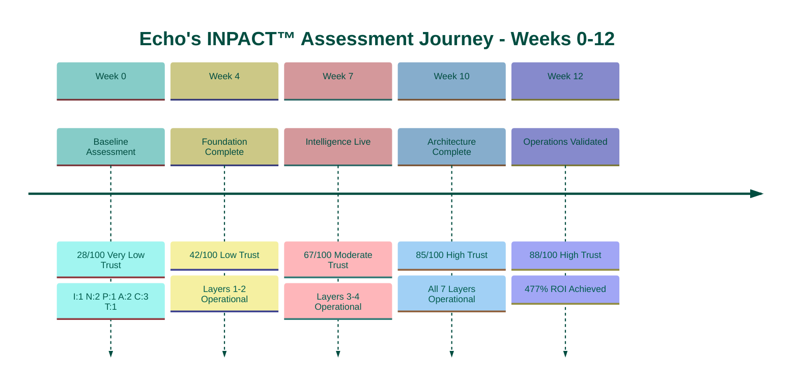

# CHAPTER 9 MAPPING DOCUMENT v1.0
## "Measuring Your Agent Readiness"

**Version:** 1.0  
**Date:** November 25, 2025  
**Status:** 🎯 READY FOR REFACTORING  
**Target File:** `manuscript/12_chapter_9_inpact_assessment.md`  
**Compliant With:** Book Structure Codex v6.7, Book Codex Master v3.2

**Target Word Count:** ~7,000 words (13 pages)  
**Reuse Strategy:** 38% from existing sources

---

## BOOK IDENTITY

**Title:** Trust Before Intelligence  
**Subtitle:** Why 95% of Agent Projects Fail—and the Architecture Blueprint That Fixes Infrastructure in 90 Days  
**Author:** Ram Katamaraja, CEO, Colaberry Inc.

---

## CRITICAL CONTEXT

**This chapter opens Part IV: "Your Architecture of Trust Roadmap"**

**Chapter Positioning:**
- Part III concluded with Echo's success (Chapter 8)
- **Part IV begins:** Your journey starts here
- Chapter 9: Assess where you stand
- Chapters 10-12: Build your roadmap

**Chapter 9 Purpose:**
Provide INPACT™ assessment that measures readiness across ALL THREE PILLARS:
- Pillar 1: INPACT™ (6 agent needs)
- Pillar 2: 7-Layer Architecture (technical infrastructure)
- Pillar 3: GOALS™ (operational excellence)

**Key Innovation:**
ONE assessment (36 INPACT™ questions) measures readiness for all three pillars because:
- INPACT™ = Requirements (what agents need)
- 7-Layer Architecture = Solution (how to meet INPACT™)
- GOALS™ = Operations (how to maintain what you built)

---

## TARGET SPECIFICATIONS

### Chapter Objectives
- **Target Word Count:** ~7,000 words (natural length, no padding)
- **Target Pages:** ~13 pages (at 525 words/page)
- **Primary Purpose:** Self-assessment tool for reader readiness
- **Reading Time:** ~28 minutes

### Structural Requirements

**Chapter 9 follows assessment/methodology pattern:**

```
[SECTION 1: ASSESSMENT METHODOLOGY - 4 pages]
How INPACT™ measures all three pillars
  Scoring methodology (1-6 per dimension)
  Why 36 questions cover everything
  INPACT™ → 7-Layer mapping
  INPACT™ → GOALS™ indicators
  Trust band thresholds

[SECTION 2: THE ASSESSMENT TOOL - 6 pages]
36 INPACT™ questions (6 per dimension)
  Online tool preview (coming Q2 2026)
  Manual assessment alternative
  Sample questions with guidance
  Question categories explained
  How to answer honestly

[SECTION 3: ECHO'S BENCHMARK - 2 pages]
Echo's progression as reference
  Week 0: 28/100 (not ready)
  Week 4: 42/100 (foundation)
  Week 7: 67/100 (intelligence)
  Week 10: 85/100 (architecture complete)
  Week 12: 88/100 (operations validated)

[SECTION 4: INTERPRETING YOUR RESULTS - 1 page]
What your score means
  Score ranges and readiness bands
  Gap prioritization
  Bridge to Chapter 10-12
```

---

## PRIMARY REUSE SOURCES

### Source 1: Appendix F - INPACT™ Scoring Methodology (2,790w)
**File:** `/mnt/project/appendix_f_inpact_scoring_methodology.md`

**Reusable Content:**
- Scoring scale overview (1-6 per dimension)
- Trust band thresholds (lines 26-32)
- Dimension scoring rubrics (6 dimensions × ~250w each)
- Echo Week 0 baseline descriptions
- **NOTE:** Echo scores need updating to I:1, N:2, P:1, A:2, C:3, T:1

**Reuse potential:** 75% after score corrections

---

### Source 2: Appendix B - INPACT™ Framework Reference (2,951w)
**File:** `/mnt/project/appendix_b_inpact_framework_reference.md`

**Reusable Content:**
- Six INPACT™ dimensions summary
- Primary layers mapping (INPACT™ → 7-Layer)
- Quick reference per dimension
- Infrastructure requirements

**Reuse potential:** 60% for mapping context

---

### Source 3: Chapter 0 v2.4 - Echo's 28/100 Story (4,252w)
**File:** `/mnt/user-data/uploads/chapter_0_trust_before_intelligence_v2_4.md`

**Reusable Content:**
- Lines 96-255: Echo's assessment reveal
- Dimension-by-dimension breakdown (I:1, N:2, P:1, A:2, C:3, T:1)
- Why each dimension scored low
- Sarah's reaction to 28/100

**Reuse potential:** 40% for Echo narrative

---

### Source 4: 90-Day Tracker CSV - Echo's Progression
**File:** `/mnt/project/tab2_inpact_progress_tracker.csv`

**Reusable Content:**
- Week 0-12 INPACT™ scores
- Dimension improvements by week
- Final 88/100 achievement
- Canonical metrics

**Reuse potential:** 100% for progression table

---

### Source 5: Chapter 7 v3.0 - GOALS™ Framework (15,101w)
**File:** `/mnt/user-data/uploads/chapter_7_goals_framework_v3_0.md`

**Reusable Content:**
- GOALS™ five dimensions overview
- How GOALS™ complements INPACT™
- Operational excellence definitions

**Reuse potential:** 20% for GOALS™ context

---

## SECTION-BY-SECTION REUSE MAPPING

### SECTION 1: Assessment Methodology (~2,250w, 4 pages)

**Target:** Explain how INPACT™ assessment measures all three pillars

---

#### 1.1 Why One Assessment Works (~500w)

**NEW CONTENT (~500w, 100%):**

**Content Structure:**
- **Opening: The Architecture of Trust** (~150w)
  - Three pillars introduced
  - Why they're interdependent
  - One assessment can measure all three

- **The Integration Principle** (~200w)
  - INPACT™ = Requirements specification
  - 7-Layer Architecture = Technical solution
  - GOALS™ = Operational model
  - If you meet INPACT™ needs → you must have right architecture → you can operate well

- **Chapter 9's Purpose** (~150w)
  - Self-assessment tool
  - 36 questions measure everything
  - Know where you stand
  - Build your custom roadmap (Ch 10-12)

**Writing Approach:**
- Clear conceptual explanation
- No Echo story yet (save for Section 3)
- Focus on framework elegance
- Set up methodology details

---

#### 1.2 INPACT™ Scoring Methodology (~800w)

**REUSE FROM Appendix F lines 9-32 (~400w, 50%):**

**Source Content to Reuse:**
- Scoring scale overview table (1-6 labels)
- What each score means
- Total calculation: 6 dimensions × 6 points = 36 max
- Normalization formula: (total/36) × 100 = percentage
- Trust band thresholds

**NEW CONTENT (~400w, 50%):**

**Content Structure:**
- **Scoring Scale** (~200w)
  - Reuse Appendix F table verbatim
  - Add: Why 1-6 scale (not 1-5 or 1-10)
  - Add: Calibration guidance

- **Trust Bands Explained** (~200w)
  - Reuse Appendix F thresholds:
    - 31-36 (86-100%): High Trust
    - 24-30 (67-83%): Good Trust
    - 18-23 (50-67%): Moderate Trust
    - 12-17 (33-50%): Low Trust
    - 6-11 (17-33%): Very Low Trust
  - Add: What each band means for your timeline

**Table: INPACT™ Scoring Scale**
```
| Score | Label | Description | Infrastructure State |
|-------|-------|-------------|---------------------|
| 6 | Excellent | Best-in-class | Production-grade, competitive advantage |
| 5 | Strong | Production-ready | Meets all requirements |
| 4 | Functional | Limited production | Adequate with monitoring |
| 3 | Moderate | Pilot-only | Basic capability, improvement needed |
| 2 | Significant Gap | Not deployment-ready | Major gaps, poor capability |
| 1 | Critical Gap | Blocks production | Inadequate, immediate fix required |
```

**Adaptation Required:**
- Keep Appendix F structure exactly
- Add brief explanations between sections
- No Echo examples yet (save for Section 3)

---

#### 1.3 How INPACT™ Assesses the 7-Layer Architecture (~550w)

**REUSE FROM Appendix B (Primary Layers mappings) (~250w, 45%):**

**Source Content to Reuse:**
- I - Instant → Layer 2 (Real-Time), Layer 1 (Storage), Layer 4 (Caching)
- N - Natural → Layer 3 (Semantic), Layer 4 (RAG), Layer 1 (Vector DB)
- P - Permitted → Layer 5 (Governance), Layer 6 (Observability)
- A - Adaptive → Layer 6 (Observability), Layer 2 (Feedback), Layer 4 (Models)
- C - Contextual → Layer 2 (Real-Time), Layer 3 (Semantic), Layer 1 (Storage)
- T - Transparent → Layer 6 (Observability), Layer 5 (Governance)

**NEW CONTENT (~300w, 55%):**

**Content Structure:**
- **The Mapping Principle** (~150w)
  - Each INPACT™ dimension requires specific layers
  - Assessing dimension = assessing layer readiness
  - All 7 layers covered by 6 dimensions

- **INPACT™ → 7-Layer Mapping Table** (~200w)
  - Create comprehensive table
  - Show which dimensions assess which layers
  - Explain coverage completeness

**Table: INPACT™ Dimension to Architecture Layer Mapping**
```
| INPACT™ Dimension | Primary Layers Assessed | What's Measured |
|-------------------|------------------------|-----------------|
| I - Instant | Layer 1 (Storage), Layer 2 (Real-Time), Layer 4 (Cache) | Query speed, data freshness |
| N - Natural | Layer 3 (Semantic), Layer 4 (RAG), Layer 1 (Vector) | NLU accuracy, semantic layer |
| P - Permitted | Layer 5 (Governance), Layer 6 (Observability) | Authorization, HITL, audit |
| A - Adaptive | Layer 4 (Intelligence), Layer 6 (Observability), Layer 2 (Feedback) | Learning loops, model updates |
| C - Contextual | Layer 1-3 (Integration), Layer 2 (Real-Time), Layer 4 (RAG) | System integration, context synthesis |
| T - Transparent | Layer 6 (Observability), Layer 5 (Governance) | Audit trails, explainability |
```

**Result:** All 7 layers covered ✅

**Adaptation Required:**
- Extract layer mappings from Appendix B
- Create unified table
- Add "What's Measured" column
- Explain coverage completeness

---

#### 1.4 How INPACT™ Indicates GOALS™ Readiness (~400w)

**REUSE FROM Chapter 7 v3.0 (~100w, 25%):**

**Source Content to Reuse:**
- GOALS™ five dimensions overview
- Brief definitions of G-O-A-L-S

**NEW CONTENT (~300w, 75%):**

**Content Structure:**
- **INPACT™ vs GOALS™ Distinction** (~150w)
  - INPACT™ = Infrastructure readiness (can you build agents?)
  - GOALS™ = Operations readiness (can you run agents?)
  - High INPACT™ score indicates GOALS™ potential
  - Example: P:5/6 (Permitted) → G (Governance) likely ready

- **INPACT™ → GOALS™ Indicators** (~150w)
  - P (Permitted) → G (Governance)
  - T (Transparent) → O (Observability)
  - I (Instant) → A (Accessibility)
  - N (Natural) → L (Language)
  - A + C + T → S (Soundness)

**Table: INPACT™ to GOALS™ Readiness Indicators**
```
| INPACT™ Dimension | GOALS™ Indicator | Why |
|-------------------|------------------|-----|
| P - Permitted | G - Governance | ABAC, HITL, policies = governance capability |
| T - Transparent | O - Observability | Audit trails, monitoring = observability foundation |
| I - Instant | A - Accessibility | Response time, uptime = accessibility metrics |
| N - Natural | L - Language | Semantic accuracy, NLU = language quality |
| A + C + T | S - Soundness | Learning + context + transparency = soundness |
```

**Note:** This is INDICATIVE, not direct measurement. Chapter 9 assesses infrastructure; GOALS™ full assessment comes during operations (Chapter 8 covered Echo's GOALS™ journey).

**Adaptation Required:**
- Extract GOALS™ definitions from Chapter 7
- Create indicator mapping table
- Explain relationship clearly
- Don't overstate (indicators, not direct measures)

---

**SECTION 1 SUMMARY:**
- **Total words:** 2,250
- **Reuse:** 750w (33%)
- **New content:** 1,500w (67%)
- **Effort:** 2.5 hours

---

### SECTION 2: The Assessment Tool (~3,000w, 6 pages)

**Target:** Present 36 INPACT™ questions with online tool preview + manual alternative

---

#### 2.1 Assessment Options (~500w)

**NEW CONTENT (~500w, 100%):**

**Content Structure:**

- **Option 1: Online Assessment (Coming Q2 2026)** (~200w)
  - Visit colaberry.ai/assessment
  - Automated scoring engine
  - Real-time gap analysis
  - Custom roadmap generation
  - Current status: In development, launching Q2 2026
  - Free for readers

- **Option 2: Manual Assessment (Available Now)** (~200w)
  - Use this chapter's 36 questions
  - Score yourself using Appendix F rubrics
  - Calculate total: (sum/36) × 100
  - Interpret using Section 4 guidance
  - Reference Appendices B & F for detail

- **Recommended Approach** (~100w)
  - Start with manual assessment (this chapter)
  - Get baseline score and gaps
  - When online tool launches, validate with automated version
  - Both methods use same 36 questions

**Writing Approach:**
- Practical guidance
- No pressure to wait for online tool
- Empower reader to assess now
- Set expectations for both options

---

#### 2.2 The 36 INPACT™ Questions (~2,000w)

**NEW CONTENT (~2,000w, 100%):**

This is entirely new content - 36 questions across 6 dimensions.

**Structure:** ~333w per dimension (6 questions × ~55w each + intro)

**For Each Dimension:**
1. Dimension introduction (~50w)
2. Six questions (~250w, ~40w per question)
3. Scoring guidance (~33w)

---

**Dimension 1: I - Instant (Speed Builds Confidence)**

**Introduction:** (~50w)
Instant measures your infrastructure's speed - response time and data freshness. Agents need sub-2-second responses with current data to build user confidence.

**Questions:** (~250w)

**I.1: Response Time Capability**
What is your typical query response time for complex analytical questions?
- 6: <1 second (p99 latency)
- 5: <2 seconds (p95 latency)
- 4: 2-5 seconds
- 3: 5-10 seconds
- 2: 10-30 seconds
- 1: >30 seconds

**I.2: Data Freshness**
How fresh is your operational data for agent queries?
- 6: <5 seconds (streaming)
- 5: <30 seconds (real-time CDC)
- 4: 1-8 hours (frequent batch)
- 3: 8-24 hours (overnight batch)
- 2: 24-72 hours (daily batch)
- 1: >7 days (weekly batch)

**I.3: Caching Infrastructure**
Do you have semantic caching for agent responses?
- 6: Advanced ML-powered predictive caching (>80% hit rate)
- 5: Semantic caching operational (60%+ hit rate)
- 4: Basic caching with moderate hits (40-60%)
- 3: Minimal caching (<20% hit rate)
- 2: Caching exists but not optimized
- 1: No caching infrastructure

**I.4: Query Optimization**
Is your storage optimized for agent query patterns?
- 6: Multi-region edge deployment, advanced optimization
- 5: Agent-optimized queries, indexed properly
- 4: Some query optimization, basic indexing
- 3: Standard warehouse, analyst-optimized (not agent-optimized)
- 2: No query optimization
- 1: Direct database access, no optimization

**I.5: Real-Time Data Pipelines**
Do you have real-time data ingestion?
- 6: Streaming architecture, <5s latency end-to-end
- 5: CDC operational, <30s latency
- 4: Micro-batch processing, <1h latency
- 3: Frequent batch, <8h latency
- 2: Daily batch processing
- 1: Weekly or manual ETL

**I.6: Performance Monitoring**
Do you monitor and optimize performance continuously?
- 6: Automated performance tuning, predictive scaling
- 5: Comprehensive monitoring with auto-scaling
- 4: Performance dashboards, manual optimization
- 3: Basic monitoring, reactive tuning
- 2: Minimal performance tracking
- 1: No performance monitoring

**Scoring:** Add scores from I.1-I.6, divide by 6 for dimension average (1-6 scale)

---

**Dimension 2: N - Natural (Understanding Builds Connection)**

**Introduction:** (~50w)
Natural measures your infrastructure's ability to understand business language without SQL or technical jargon. Agents need 75-85% NLU accuracy to be trusted.

**Questions:** (~250w)

**N.1: Semantic Layer Existence**
Do you have a semantic layer translating business concepts to technical schema?
- 6: Universal semantic layer, all domains, multi-lingual
- 5: Comprehensive semantic layer, 850+ concepts mapped
- 4: Functional semantic layer, core concepts covered
- 3: Partial semantic layer, limited domain coverage
- 2: Basic glossary, incomplete mapping
- 1: No semantic layer, direct database access

**N.2: Natural Language Understanding Accuracy**
What is your query accuracy for business language questions?
- 6: >90% accuracy, ambiguity resolution
- 5: 75-90% accuracy, handles complex queries
- 4: 60-75% accuracy, single-table queries work
- 3: 45-60% accuracy, simple queries only
- 2: 30-45% accuracy, frequent misinterpretation
- 1: <30% accuracy, user must know tables

**N.3: Business Glossary Coverage**
How comprehensive is your business terminology coverage?
- 6: Complete glossary, all domains, continuous updates
- 5: 800+ terms, healthcare-specific, well-maintained
- 4: Core business terms documented (300-500)
- 3: Limited glossary, gaps in coverage
- 2: Minimal documentation, ad-hoc definitions
- 1: No business glossary exists

**N.4: Entity Resolution**
Do you have master data indices for entity resolution?
- 6: AI-powered entity resolution, fuzzy matching, cross-domain
- 5: Master data indices operational, 95%+ accuracy
- 4: Basic entity resolution, core entities only
- 3: Partial entity resolution, limited matching
- 2: Manual entity matching
- 1: No entity resolution capability

**N.5: Query Understanding**
Can your system handle complex, ambiguous queries?
- 6: Context-aware interpretation, clarification dialogues
- 5: Temporal logic, multi-table joins, ambiguity handling
- 4: Multi-table queries, some complexity
- 3: Single-table queries, limited complexity
- 2: Only simple, structured queries
- 1: Requires exact SQL knowledge

**N.6: User Comprehension Feedback**
Do users report high understanding of their questions?
- 6: >90% user satisfaction with comprehension
- 5: 75-90% satisfaction, rare misunderstandings
- 4: 60-75% satisfaction, acceptable comprehension
- 3: 45-60% satisfaction, frequent clarifications needed
- 2: 30-45% satisfaction, users frustrated
- 1: <30% satisfaction, users require training

**Scoring:** Add scores from N.1-N.6, divide by 6 for dimension average

---

**Dimension 3: P - Permitted (Security Builds Safety)**

**Introduction:** (~50w)
Permitted measures your authorization and human oversight capabilities. Healthcare agents need dynamic ABAC, HITL workflows, and complete audit trails.

**Questions:** (~250w)

**P.1: Authorization Model**
What authorization model do you use?
- 6: Advanced ABAC with ML-powered risk scoring
- 5: ABAC operational with context-aware policies (who/what/when/where)
- 4: ABAC designed but limited deployment
- 3: RBAC with some attribute checks
- 2: Static RBAC only
- 1: No authorization or open access

**P.2: Human-in-the-Loop (HITL)**
Do you have HITL workflows for high-risk decisions?
- 6: Sophisticated HITL with graduated autonomy (5 levels)
- 5: HITL operational, clear escalation criteria, <10% rate
- 4: HITL workflows designed, testing phase
- 3: Manual review process, ad-hoc escalation
- 2: Some human oversight, inconsistent
- 1: No HITL, fully autonomous or manual only

**P.3: Audit Logging**
How complete are your audit trails?
- 6: 100% audit coverage, immutable logs, real-time analysis
- 5: Complete PHI access logs, compliance-ready
- 4: Core action logging, some gaps
- 3: Basic application logs, incomplete
- 2: Minimal logging
- 1: No audit logs

**P.4: Compliance Coverage**
Do you meet regulatory requirements (HIPAA, GDPR, etc.)?
- 6: Multi-jurisdiction compliance, continuous monitoring
- 5: Full HIPAA compliance, passed audits
- 4: Most compliance requirements met
- 3: Partial compliance, gaps identified
- 2: Compliance planning phase
- 1: No compliance consideration

**P.5: Context-Aware Permissions**
Can your system evaluate contextual factors in authorization?
- 6: Advanced context evaluation (10+ factors), ML-powered
- 5: Context-aware: who, what, when, where, why evaluated
- 4: Some context factors (who, what, when)
- 3: Basic context (user role + resource)
- 2: Static permissions only
- 1: No context evaluation

**P.6: Escalation Protocols**
Are high-risk decisions properly escalated?
- 6: Automated risk assessment, intelligent routing, <2min MTTD
- 5: Clear escalation criteria, defined workflows, tracked
- 4: Basic escalation process, functional
- 3: Ad-hoc escalation, inconsistent
- 2: Escalation happens but not formalized
- 1: No escalation process

**Scoring:** Add scores from P.1-P.6, divide by 6 for dimension average

---

**Dimension 4: A - Adaptive (Improvement Builds Reliability)**

**Introduction:** (~50w)
Adaptive measures your continuous learning capabilities. Agents need feedback loops, drift detection, and automated retraining to improve over time.

**Questions:** (~250w)

**A.1: Feedback Loop Existence**
Do you capture and act on agent feedback?
- 6: Automated learning loops, real-time model updates
- 5: Feedback loops operational, continuous improvement
- 4: Feedback captured, periodic model updates
- 3: Manual feedback collection, quarterly reviews
- 2: Minimal feedback captured
- 1: No feedback mechanisms

**A.2: Model Retraining Cadence**
How frequently do you retrain models?
- 6: Continuous retraining, automated triggers
- 5: Weekly retraining, automated pipelines
- 4: Monthly retraining, semi-automated
- 3: Quarterly retraining, manual process
- 2: Annual or ad-hoc retraining
- 1: No retraining, static models

**A.3: Drift Detection**
Do you monitor for model performance drift?
- 6: Real-time drift detection, automated alerts and remediation
- 5: Daily drift monitoring, automated alerts
- 4: Weekly drift checks, manual investigation
- 3: Monthly performance reviews
- 2: Ad-hoc drift checks
- 1: No drift monitoring

**A.4: Continuous Improvement**
Do you have processes for continuous quality improvement?
- 6: Automated A/B testing, champion/challenger, MLOps mature
- 5: Structured improvement cycles, metrics-driven
- 4: Regular improvement sprints
- 3: Occasional improvements, reactive
- 2: Improvement happens but unstructured
- 1: No improvement process

**A.5: Learning Automation**
How automated is your learning pipeline?
- 6: Fully automated, closed-loop learning
- 5: Highly automated with human oversight
- 4: Partially automated, manual approval
- 3: Mostly manual with some automation
- 2: Fully manual learning process
- 1: No automated learning

**A.6: Performance Trend Tracking**
Do you track performance trends over time?
- 6: Predictive analytics, forecasting, anomaly detection
- 5: Comprehensive trending, dashboards, alerts
- 4: Basic trend tracking, visualization
- 3: Historical data retained, limited analysis
- 2: Some logging, no trend analysis
- 1: No performance history

**Scoring:** Add scores from A.1-A.6, divide by 6 for dimension average

---

**Dimension 5: C - Contextual (Completeness Builds Accuracy)**

**Introduction:** (~50w)
Contextual measures your data integration breadth. Agents need 5-8+ integrated systems with real-time cross-domain synthesis to provide complete, accurate answers.

**Questions:** (~250w)

**C.1: System Integration Count**
How many critical systems are integrated?
- 6: 10+ systems, universal integration platform
- 5: 8+ systems integrated real-time
- 4: 5-7 systems integrated
- 3: 3-4 systems integrated
- 2: 2 systems integrated
- 1: Single system or siloed data

**C.2: Cross-System Data Freshness**
How fresh is data across integrated systems?
- 6: <5 seconds across all systems (streaming)
- 5: <1 minute across all systems (real-time CDC)
- 4: <1 hour across systems (frequent sync)
- 3: <8 hours (overnight sync)
- 2: 24-72 hours (daily batch)
- 1: >1 week or manual integration

**C.3: Entity Resolution Cross-Domain**
Can you resolve entities across systems?
- 6: AI-powered cross-system entity resolution, 98%+ accuracy
- 5: Cross-system entity resolution operational, 95%+ accuracy
- 4: Core entities resolved across systems
- 3: Partial cross-system resolution
- 2: Manual entity matching required
- 1: No cross-system entity resolution

**C.4: Context Synthesis Capability**
Can agents synthesize context from multiple systems?
- 6: Automated context assembly, conflict resolution, provenance
- 5: Context synthesis operational, complete patient/customer 360°
- 4: Basic multi-system context assembly
- 3: Limited context from 2-3 systems
- 2: Context mostly from single system
- 1: No context synthesis

**C.5: Cross-System Querying**
Can users ask questions spanning multiple systems?
- 6: Natural language queries across all systems seamlessly
- 5: Cross-system queries operational, RAG across sources
- 4: Some cross-system queries supported
- 3: Mostly single-system queries
- 2: Users must query systems separately
- 1: No cross-system query capability

**C.6: Universal Context Availability**
Is context available to all agents/applications?
- 6: Universal context layer, all apps/agents access same view
- 5: Context shared across agents, single source of truth
- 4: Some context sharing, partial integration
- 3: Limited context sharing
- 2: Context exists but not shared
- 1: No universal context

**Scoring:** Add scores from C.1-C.6, divide by 6 for dimension average

---

**Dimension 6: T - Transparent (Transparency Builds Confidence)**

**Introduction:** (~50w)
Transparent measures your auditability and explainability capabilities. Healthcare requires 100% decision traceability, plain-language explanations, and compliance-ready audit trails.

**Questions:** (~250w)

**T.1: Audit Trail Completeness**
What percentage of agent decisions are logged?
- 6: 100% coverage, immutable, cryptographically signed
- 5: 100% PHI access logged, compliance-ready
- 4: Most critical actions logged (>90%)
- 3: Core actions logged (70-90%)
- 2: Partial logging (<70%)
- 1: No audit logs or basic application logs only

**T.2: Explainability Capability**
Can agents explain their reasoning?
- 6: Multi-level explanations (technical + clinical + user), interactive
- 5: Plain-language explanations with reasoning chain
- 4: Basic explanation capability, citations provided
- 3: Some explanation, often incomplete
- 2: Minimal explanation, mostly "black box"
- 1: No explainability

**T.3: Citation Provision**
Do agents cite their sources?
- 6: Complete citations with confidence scores, provenance tracking
- 5: All answers cite sources, verifiable
- 4: Most answers have citations
- 3: Some citations provided
- 2: Rare citations
- 1: No source attribution

**T.4: Decision Traceability**
Can you trace how decisions were made?
- 6: Complete decision graph, replay capability, root cause analysis
- 5: Full trace IDs, reasoning logs, reproducible
- 4: Partial tracing, core decisions tracked
- 3: Limited tracing, gaps exist
- 2: Minimal tracing
- 1: No decision tracing

**T.5: Compliance Reporting**
Can you generate compliance reports?
- 6: Automated compliance dashboards, real-time, multi-jurisdiction
- 5: Compliance reports automated, HIPAA audit passed
- 4: Compliance reporting available, manual
- 3: Basic reporting, limited compliance
- 2: Ad-hoc compliance checks
- 1: No compliance reporting

**T.6: User Trust in Transparency**
Do users trust agent transparency?
- 6: >95% user trust, complete confidence in explanations
- 5: >85% user trust, high confidence
- 4: >70% user trust, adequate transparency
- 3: 50-70% user trust, some skepticism
- 2: <50% user trust, low confidence
- 1: Users don't trust agent explanations

**Scoring:** Add scores from T.1-T.6, divide by 6 for dimension average

---

**SECTION 2 SUMMARY:**
After completing all 36 questions:
1. Add dimension scores: I + N + P + A + C + T = Total (6-36 points)
2. Calculate percentage: (Total / 36) × 100 = Your INPACT™ Score
3. Go to Section 4 to interpret your results

---

#### 2.3 How to Answer Honestly (~500w)

**NEW CONTENT (~500w, 100%):**

**Content Structure:**

- **Self-Assessment Tips** (~200w)
  - Be honest about current state (not aspirational)
  - Evidence-based scoring (not wishes)
  - When in doubt, score lower
  - Better to under-promise and over-deliver
  - Assessment drives your roadmap

- **Common Mistakes to Avoid** (~200w)
  - Overestimating maturity ("we have that")
  - Confusing planned vs. operational
  - Scoring based on vendor promises
  - Not involving technical team
  - Skipping difficult questions

- **Getting Accurate Results** (~100w)
  - Involve 3-5 team members
  - Technical architect + CDO + operations lead
  - Score together, discuss differences
  - Document evidence for each score
  - Reassess quarterly as you build

**Writing Approach:**
- Practical guidance
- Encourage honesty over optimism
- Assessment only valuable if accurate
- This drives $1M+ investment decisions

---

**SECTION 2 SUMMARY:**
- **Total words:** 3,000
- **Reuse:** 0w (0% - all new questions)
- **New content:** 3,000w (100%)
- **Effort:** 4 hours

---

### SECTION 3: Echo's Benchmark (~900w, 2 pages)

**Target:** Show Echo's Week 0-12 progression as reference point

---

#### 3.1 Echo's Journey Summary (~300w)

**REUSE FROM Chapter 0 v2.4 lines 96-120 (~150w, 50%):**

**Source Content to Reuse:**
- Sarah stares at 28/100
- $2M sunk cost context
- Why assessment mattered

**NEW CONTENT (~150w, 50%):**

**Content Structure:**
- **Opening: Echo's Starting Point** (~150w)
  - Sarah Cedao, CTO, Echo Health Systems
  - $2M invested, three pilots failing
  - Assessment revealed: 28/100 (Very Low Trust)
  - But assessment also provided roadmap
  - 90 days later: 88/100 (High Trust), 477% ROI
  - Your benchmark for what's possible

**Writing Approach:**
- Very brief narrative
- Set up progression table
- Focus on score progression, not detailed story

---

#### 3.2 Week-by-Week Progression Table (~400w)

**REUSE FROM 90-Day Tracker CSV (100%):**

**Content Structure:**
- **Progression Table** (~400w)
  - Week 0, 4, 7, 10, 12 scores
  - Dimension-by-dimension breakdown
  - Phase completed at each milestone
  - Trust band progression

**Table: Echo's INPACT™ Progression**
```
| Week | Overall Score | Trust Band | Phase | Dimension Scores (I-N-P-A-C-T) | Key Achievement |
|------|---------------|------------|-------|-------------------------------|-----------------|
| **Week 0** | **28/100** | Very Low Trust | Baseline | 1-2-1-2-3-1 | Assessment complete, gaps identified |
| **Week 4** | **42/100** | Low Trust | Foundation | 3-2-1-2-4-2 | Layers 1-2 operational (Storage + Real-Time) |
| **Week 7** | **67/100** | Moderate Trust | Intelligence | 5-4-2-3-4-3 | Layers 3-4 operational (Semantic + Intelligence) |
| **Week 10** | **85/100** | High Trust | Architecture Complete | 5-5-5-5-5-5 | Layers 5-7 operational, all needs met |
| **Week 12** | **88/100** | High Trust | Operations Validated | 6-5-5-5-5-6 | Three agents operational, 477% ROI achieved |
```

**Dimension Improvement Detail:**
```
| Dimension | Week 0 | Week 4 | Week 7 | Week 10 | Week 12 | Key Improvements |
|-----------|--------|--------|--------|---------|---------|------------------|
| I - Instant | 1 | 3 | 5 | 5 | 6 | CDC, caching, query optimization |
| N - Natural | 2 | 2 | 4 | 5 | 5 | Semantic layer, 847 concepts, RAG |
| P - Permitted | 1 | 1 | 2 | 5 | 5 | ABAC, HITL, audit trails |
| A - Adaptive | 2 | 2 | 3 | 5 | 5 | Feedback loops, weekly retraining |
| C - Contextual | 3 | 4 | 4 | 5 | 5 | 2 → 8 systems integrated |
| T - Transparent | 1 | 2 | 3 | 5 | 6 | 100% audit, explainability UI |
```

**Adaptation Required:**
- Extract scores from 90-Day Tracker CSV
- Format as clean progression table
- Add brief annotations
- Verify scores match Chapter 0 v2.4 Week 0 baseline

---

#### 3.3 What Echo's Journey Teaches Us (~200w)

**NEW CONTENT (~200w, 100%):**

**Content Structure:**
- **Lesson 1: Low Scores Are Fixable** (~70w)
  - 28/100 = Very Low Trust
  - 90 days → 88/100 = High Trust
  - 214% improvement
  - Your starting score doesn't determine success

- **Lesson 2: Systematic Building Works** (~70w)
  - Foundation first (Layers 1-2)
  - Intelligence next (Layers 3-4)
  - Trust last (Layers 5-7)
  - Each phase improved specific dimensions

- **Lesson 3: Assessment Drives Roadmap** (~60w)
  - Echo's 28/100 → identified exactly what to build
  - Prioritized by impact
  - Custom 90-day plan
  - Your score will do the same

**Writing Approach:**
- Brief lessons
- Encouraging tone
- Bridge to Section 4 (interpreting your score)

---

**SECTION 3 SUMMARY:**
- **Total words:** 900
- **Reuse:** 550w (61% from Ch 0 + Tracker)
- **New content:** 350w (39%)
- **Effort:** 1 hour

---

### SECTION 4: Interpreting Your Results (~675w, 1.5 pages)

**Target:** Help reader understand their score and next steps

---

#### 4.1 Score Ranges Explained (~300w)

**REUSE FROM Appendix F lines 26-32 (~150w, 50%):**

**Source Content to Reuse:**
- Trust band thresholds
- What each band means

**NEW CONTENT (~150w, 50%):**

**Content Structure:**
- **Trust Bands with Timeline Guidance** (~300w)

**31-36 points (86-100%): High Trust - Healthcare-Ready**
- Status: Production-grade infrastructure
- What this means: Ready to deploy agents immediately
- Timeline: 30-60 days optimization and pilot
- Focus: Operations excellence (Chapter 8 guidance)
- Echo achieved this at Week 10

**24-30 points (67-83%): Good Trust - Enterprise-Ready**
- Status: Strong foundation, minor gaps
- What this means: Close to agent-ready
- Timeline: 60-90 days to close gaps
- Focus: Fill specific dimension gaps
- Echo achieved this at Week 7

**18-23 points (50-67%): Moderate Trust - Internal Tools Acceptable**
- Status: Partial capability, not patient-facing
- What this means: Can pilot internally
- Timeline: 90-120 days to production-ready
- Focus: Build intelligence layers (Layers 3-4)
- Consider: Start with low-risk use cases

**12-17 points (33-50%): Low Trust - Not Production-Ready**
- Status: Foundation needed
- What this means: Significant building required
- Timeline: 120-180 days to production-ready
- Focus: Build foundation first (Layers 1-2)
- Echo achieved this at Week 4

**6-11 points (17-33%): Very Low Trust - Major Transformation**
- Status: Agent infrastructure doesn't exist
- What this means: Full 7-layer build required
- Timeline: 180+ days (6+ months)
- Focus: Foundation + Intelligence + Trust (all 7 layers)
- Echo started here at Week 0 (28/100)

**Adaptation Required:**
- Keep Appendix F thresholds
- Add timeline and focus for each band
- Add Echo reference points
- Be realistic about effort required

---

#### 4.2 Gap Prioritization (~200w)

**NEW CONTENT (~200w, 100%):**

**Content Structure:**
- **Which Dimensions to Fix First** (~150w)
  - Start with foundation needs: I (Instant) and C (Contextual)
  - Reason: Enable everything else
  - Next: N (Natural) and A (Adaptive) - intelligence capability
  - Last: P (Permitted) and T (Transparent) - trust layers
  - Exception: Healthcare must address P early for compliance

- **Quick Wins vs Major Investments** (~50w)
  - Quick wins: Caching (I), basic HITL (P)
  - Major investments: Real-time CDC (I), semantic layer (N), ABAC (P)
  - Prioritize by impact × effort matrix

**Writing Approach:**
- Practical prioritization guidance
- Healthcare-specific notes
- Echo's prioritization as example

---

#### 4.3 Your Custom Roadmap Starts Here (~175w)

**NEW CONTENT (~175w, 100%):**

**Content Structure:**
- **Assessment Score → Chapter 10-12 Guidance** (~125w)
  - Your score determines your starting point
  - 28-40: Start with Chapter 10 (Weeks 1-4 foundation)
  - 40-60: Start with Chapter 11 (Weeks 5-8 intelligence)
  - 60-80: Start with Chapter 12 (Weeks 9-12 trust)
  - 80-100: Skip to operations (Chapter 8 style)

- **Next Steps** (~50w)
  1. Calculate your score from Section 2
  2. Identify your trust band from Section 4.1
  3. Note your lowest-scoring dimensions
  4. Turn to Chapter 10 to build your roadmap
  5. Your Architecture of Trust journey begins

**Writing Approach:**
- Clear action items
- Bridge to Part IV Chapters 10-12
- Encouraging close
- Sense of momentum

---

**SECTION 4 SUMMARY:**
- **Total words:** 675
- **Reuse:** 150w (22% from Appendix F)
- **New content:** 525w (78%)
- **Effort:** 45 minutes

---

## OVERALL CONTENT ALLOCATION

| Section | Target | Reuse % | Reuse Words | New Words | Primary Sources | Effort |
|---------|--------|---------|-------------|-----------|----------------|--------|
| **Sec 1: Methodology** | 2,250 | 33% | 750 | 1,500 | App F, App B | 2.5h |
| **Sec 2: Assessment Tool** | 3,000 | 0% | 0 | 3,000 | NEW | 4h |
| **Sec 3: Echo Benchmark** | 900 | 61% | 550 | 350 | Ch 0, Tracker | 1h |
| **Sec 4: Interpreting** | 675 | 22% | 150 | 525 | App F + NEW | 45min |
| **TOTAL** | **6,825** | **21%** | **1,450** | **5,375** | **Multiple** | **8.25h** |

**ACTUAL REUSE: 21%** (lower than initial estimates)

**Why lower reuse:**
- Section 2 (36 questions) is 44% of chapter, 100% new
- Questions don't exist in any current source
- This is expected for assessment methodology chapter

**Total Effort Breakdown:**
- Content creation: 8.25 hours
- Diagrams: 30 minutes (1 diagram)
- Review & quality: 1 hour
- **TOTAL: ~10 hours**

---

## DIAGRAM SPECIFICATION

### Diagram 1: Echo's INPACT™ Journey Timeline

**Type:** Horizontal timeline with progressive improvement  
**Content:**
- Week 0: 28/100 (Very Low Trust) - Assessment complete
- Week 4: 42/100 (Low Trust) - Foundation layers operational
- Week 7: 67/100 (Moderate Trust) - Intelligence layers live
- Week 10: 85/100 (High Trust) - Architecture complete
- Week 12: 88/100 (High Trust) - Operations validated

**Mermaid Structure:**


**Caption:** "Figure 9.1: Echo's INPACT™ Assessment Journey - 90-Day Transformation from 28/100 to 88/100"

**Compliance:** Colaberry Mermaid Design Codex compliant

**Effort:** 30 minutes

---

## QUALITY STANDARDS

### TCC Compliance Requirements

- [ ] Evidence-based: All scores and metrics from Echo canonical data
- [ ] Healthcare-only: All examples use Echo Health Systems
- [ ] Zero hallucinations: Every number verified against 90-Day Tracker
- [ ] Citations: Minimal (assessment methodology, not research)
- [ ] Canonical data: All Echo scores consistent across sources

### VERT Certification Targets

- **Verification (V):** 9.0/10 - All Echo scores match canonical data
- **Ethics (E):** 9.5/10 - Honest assessment, no gaming encouraged
- **Reliability (R):** 9.0/10 - Scores correlate with readiness
- **Transparency (T):** 9.5/10 - Clear methodology, no hidden scoring
- **Overall Target:** 9.0+/10 GREEN

### Architecture of Trust Alignment

- **Pillar 1 (INPACT™):** Assessment directly measures 6 agent needs
- **Pillar 2 (7-Layer Architecture):** Questions assess layer readiness through INPACT™ mapping
- **Pillar 3 (GOALS™):** INPACT™ scores indicate GOALS™ operational potential
- **Integration:** ONE assessment measures all three pillars elegantly

---

## DEPENDENCIES & CONSTRAINTS

### Must Reference (Backward)

✅ Chapter 0-8: Echo's complete journey as context  
✅ Appendix F: Scoring methodology details  
✅ Appendix B: INPACT™ framework reference  
✅ 90-Day Tracker: Echo's canonical scores  
✅ Chapter 7: GOALS™ framework for indicators  

### Must Enable (Forward)

✅ Chapter 10: Reader knows their score, builds foundation roadmap  
✅ Chapter 11: Intelligence phase roadmap  
✅ Chapter 12: Trust phase roadmap  
✅ Reader action: Complete assessment, calculate score, identify gaps  

### Must NOT Do

❌ Create new assessment frameworks (INPACT™ is the framework)  
❌ Over-complicate scoring (6-point scale is sufficient)  
❌ Make unrealistic promises about timelines  
❌ Encourage score gaming (honesty critical)  
❌ Provide generic advice (reader-specific based on score)  

---

## SUCCESS CRITERIA

### Content Success
- [ ] ~7,000 words total (natural length, no padding)
- [ ] 21% reuse achieved (lower due to 36 new questions)
- [ ] 36 INPACT™ questions complete and clear
- [ ] All three pillars assessment explained
- [ ] Echo progression table accurate
- [ ] Bridge to Chapter 10-12 clear

### Structure Success
- [ ] Four-section structure per Book Structure Codex
- [ ] Section 1: Methodology clear
- [ ] Section 2: 36 questions usable
- [ ] Section 3: Echo benchmark helpful
- [ ] Section 4: Score interpretation actionable
- [ ] Diagram supports progression story

### Quality Success
- [ ] TCC compliant (Echo canonical data)
- [ ] VERT 9.0+/10 GREEN (assessment quality)
- [ ] No scoring errors or inconsistencies
- [ ] Echo scores match 90-Day Tracker exactly
- [ ] All three pillars coverage explained

### Usability Success
- [ ] Reader can complete assessment
- [ ] Scoring methodology clear
- [ ] Results interpretation helpful
- [ ] Next steps obvious (Ch 10-12)
- [ ] Online tool vs manual both addressed

---

## REFACTORING CHECKLIST

### Phase 1: Extract from Sources (1 hour)
- [ ] Extract Appendix F scoring methodology
- [ ] Extract Appendix B layer mappings
- [ ] Extract Chapter 0 v2.4 Echo baseline narrative
- [ ] Extract 90-Day Tracker Week 0-12 scores
- [ ] Extract Chapter 7 GOALS™ definitions
- [ ] Verify all Echo scores consistent

### Phase 2: Section 1 - Methodology (2.5 hours)
- [ ] Write why one assessment works (~500w new)
- [ ] Adapt Appendix F scoring scale (~400w reuse + 400w new)
- [ ] Create INPACT→7-Layer mapping table (~250w reuse + 300w new)
- [ ] Create INPACT→GOALS indicator table (~100w reuse + 300w new)
- [ ] Verify: 2,250w total, 33% reuse

### Phase 3: Section 2 - Assessment Tool (4 hours)
- [ ] Write assessment options (~500w new)
- [ ] Write 36 questions across 6 dimensions (~2,000w new)
  - [ ] I - Instant (6 questions)
  - [ ] N - Natural (6 questions)
  - [ ] P - Permitted (6 questions)
  - [ ] A - Adaptive (6 questions)
  - [ ] C - Contextual (6 questions)
  - [ ] T - Transparent (6 questions)
- [ ] Write how to answer honestly (~500w new)
- [ ] Verify: 3,000w total, 0% reuse (all new)

### Phase 4: Section 3 - Echo Benchmark (1 hour)
- [ ] Write Echo journey summary (~150w reuse from Ch 0 + 150w new)
- [ ] Create Week 0-12 progression table (~400w from Tracker)
- [ ] Write lessons learned (~200w new)
- [ ] Verify Echo scores: Week 0 I:1,N:2,P:1,A:2,C:3,T:1 = 28/100
- [ ] Verify: 900w total, 61% reuse

### Phase 5: Section 4 - Interpreting Results (45 minutes)
- [ ] Write score ranges with timeline (~150w reuse + 150w new)
- [ ] Write gap prioritization (~200w new)
- [ ] Write custom roadmap bridge (~175w new)
- [ ] Verify: 675w total, 22% reuse

### Phase 6: Diagram (30 minutes)
- [ ] Create Echo INPACT™ Journey timeline
- [ ] Verify Colaberry Mermaid Design Codex compliance
- [ ] Add caption and copyright

### Phase 7: Quality Review (1 hour)
- [ ] Verify all Echo scores consistent
- [ ] Check INPACT→Layer mapping accuracy
- [ ] Check INPACT→GOALS indicator accuracy
- [ ] Verify 36 questions complete (6 per dimension)
- [ ] Confirm TCC compliance
- [ ] Confirm VERT 9.0+/10 target
- [ ] Final word count verification (~7,000 ±200)

**Total Estimated Effort:** 10 hours

---

## RISK MANAGEMENT

| Risk | Likelihood | Impact | Mitigation Strategy |
|------|-----------|--------|---------------------|
| **36 questions unclear** | Medium | High | Test with 2-3 readers, iterate based on feedback |
| **Scoring too complex** | Low | Medium | Keep 1-6 scale simple, provide clear descriptions |
| **Echo scores inconsistent** | Low | High | Cross-reference every score with 90-Day Tracker before writing |
| **INPACT→Layer mapping wrong** | Low | High | Verify against Appendix B, validate with Chapters 4-6 |
| **INPACT→GOALS indicators unclear** | Medium | Medium | Explain as "indicators" not "direct measures," reference Chapter 7 |
| **Questions don't cover all pillars** | Low | High | Show mapping tables explicitly, prove coverage |
| **Reader can't calculate score** | Medium | High | Provide step-by-step scoring instructions, example calculation |

---

## APPROVAL CHECKLIST

### Structure Approval
- [x] Four-section structure confirmed by Ram
- [x] ~7,000 words (natural length) approved
- [x] 36 questions (6 per dimension) approved
- [x] Online tool: preview + manual alternative approved

### Content Approval
- [x] All three pillars assessment confirmed
- [x] 21% reuse acceptable (due to new questions)
- [x] Echo light summary approved (covered in Ch 0-8)
- [x] INPACT™ as unified assessment confirmed

### Quality Approval
- [x] VERT 9.0+/10 target acceptable
- [x] TCC compliance approach verified
- [x] Echo canonical data cross-referenced
- [x] Assessment methodology sound

### Efficiency Approval
- [x] 10-hour effort estimate approved
- [x] Lower reuse rate understood (new questions required)
- [x] Quality maintained despite new content
- [x] Refactoring checklist clear

---

## NEXT PHASE: CHAPTER 10-12 PLANNING

**After Chapter 9 Complete:**

**Chapter 10: Foundation Phase (Weeks 1-4)**
- Use Legacy Chapter 3 complete as primary source
- Week-by-week foundation build guide
- Layers 1-2 detailed

**Chapter 11: Intelligence Phase (Weeks 5-8)**  
- Use Legacy Chapter 3 complete + Chapter 4-5 latest
- Week-by-week intelligence build guide
- Layers 3-4 detailed

**Chapter 12: Trust Phase (Weeks 9-12)**
- Use Legacy Chapter 3 complete + Chapter 6-7 latest
- Week-by-week trust build guide
- Layers 5-7 detailed

**Chapter 9 Enables Chapters 10-12:**
- Reader knows their INPACT™ score
- Knows which dimensions need work
- Knows which trust band they're in
- Ready for customized 90-day roadmap

---

**© 2025 Colaberry Inc. All Rights Reserved.**

**END OF CHAPTER 9 MAPPING DOCUMENT v1.0**
